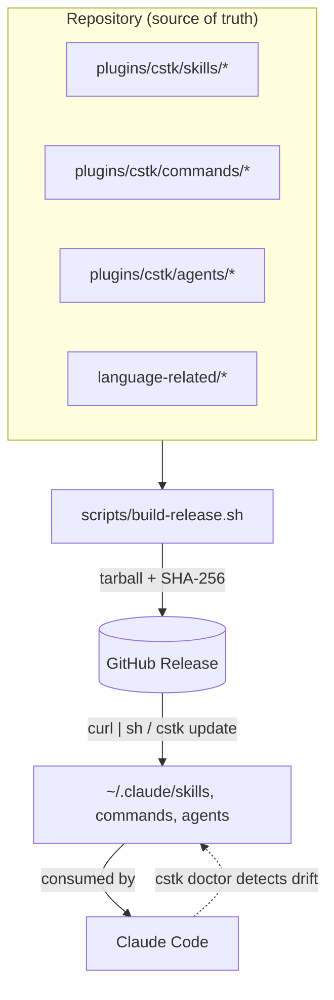
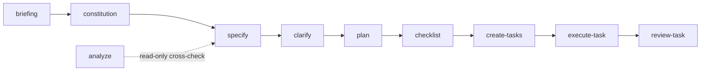
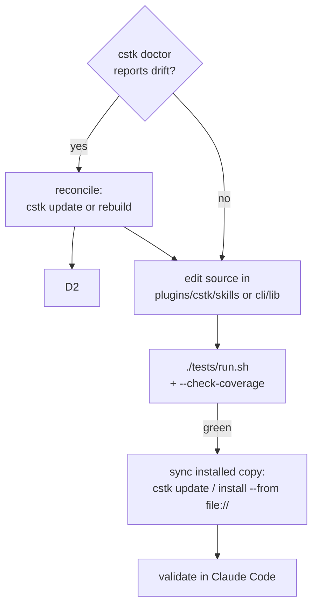

**English** · [Português (pt-BR)](./CONTRIBUTING.pt-BR.md)

# Contributing to the Claude Code Toolkit

This guide lays out the toolkit's **mental model** so that an external
contributor can open a PR with confidence. For operational details already
documented elsewhere, it points to the [README.md](./README.md) and `CLAUDE.md`
instead of duplicating them.

> Contributing only **documentation-site content** (pages under `docs-site/`)?
> See [docs-site/CONTRIBUTING.md](./docs-site/CONTRIBUTING.md) — different rules
> (the D-I principle / canonical source).

---

## 1. How the system "thinks"

The toolkit has three kinds of artifact that Claude Code consumes, in layers of
increasing abstraction:

- **skills** (`plugins/cstk/skills/<name>/SKILL.md`) — capabilities auto-invoked by
  context. The fundamental unit.
- **commands** (`plugins/cstk/commands/<name>.md`) — workflows triggered by a
  `/slash-command`.
- **agents** (`plugins/cstk/agents/<name>.md`) — autonomous specialists for multi-step
  tasks (e.g. the `agente-00c` orchestrators).

On top of these run two higher-level systems: the **SDD pipeline** (the sequence
of skills from discovery to implementation) and **`cstk`** (the POSIX CLI that
installs/versions/updates everything on the user's machine).



### 1.1 The SDD pipeline

The recommended sequence for taking an idea from discovery to implementation.
Each skill consumes the artifact from the previous one:



Details of each step: [README §SDD Pipeline](./README.md#sdd-pipeline-spec-driven-development).

### 1.2 Autonomous orchestrators (`agente-00c` / `feature-00c`)

For anyone touching the advanced parts: the orchestrators run the entire SDD
pipeline autonomously, in "waves", keeping transactional state in
`.claude/agente-00c-state/`. Concepts you **must** respect before touching that
code (all detailed in `CLAUDE.md`):

- **`state.json` is the transactional source of truth** — never derive critical
  logic from secondary indexes.
- **`cstk recall` (knowledge.db)** is an **additive, best-effort** layer: any
  degradation becomes a no-op (exit 0), never aborts a wave.
- **model-routing** is **suggest-only**: the `model-selector` skill suggests, the
  operator can always override; nothing switches model silently.
- **Decisions are auditable** (`state-decisions.sh`) and **half-records** have
  their own reconciler (`state-decisions-reconcile.sh`).

---

## 2. Development flow

The #1 pitfall of this project is **drift between the source (this repo) and the
installed copy** (`~/.claude/skills/`), which is what Claude Code actually
consumes.



**Always run `cstk doctor` BEFORE editing a skill.** If there is drift,
reconcile first — otherwise your fix lands on stale state and "works in the repo
but not in the session". Full step-by-step: [README §Installation](./README.md#installation)
and the "Installed vs Source Drift" section of `CLAUDE.md`.

### In DEV (iterating without a release)

```bash
# after a local build (scripts/build-release.sh)
cstk install --from "file://$PWD/dist/cstk-X.Y.Z.tar.gz"
```

---

## 3. Adding artifacts

### A new skill

1. Create `plugins/cstk/skills/<name>/SKILL.md` following the [Anatomy of a skill](./README.md#anatomy-of-a-skill).
2. **`description` as a trigger condition**, not a summary: "Use when X, Y or Z.
   Do NOT use when W."
3. Document **gotchas** — the most valuable content.
4. **Generalize**: skills in `plugins/cstk/skills/` or `language-related/` **must not
   name specific clients/companies/projects** (see the warning in
   [README §Contributing](./README.md#contributing); historical case: removal of
   `create-report` in v3.12.0). If it can't be generalized, the skill belongs in
   `<project>/.claude/skills/`.
5. Register the profile in `scripts/profiles.txt.in` (`sdd` or `complementary`).
6. If the skill has `scripts/*.sh`, **create the corresponding test** (§4).

### A new command

Create `plugins/cstk/commands/<name>.md`. Spawn/resume commands that integrate
model-routing need to load the `wave-select` instruction — see the 4 existing
`agente-00c`/`feature-00c` commands as a reference.

### A new test (golden rule)

Every new `.sh` in `plugins/cstk/skills/*/scripts/` or `cli/lib/` **requires** a 1:1
test (`--check-coverage` fails with exit 1 without it):

| Script origin | Expected test |
|------------------|----------------|
| `plugins/cstk/skills/<X>/scripts/<n>.sh` | `tests/test_<n>.sh` |
| `cli/lib/<n>.sh` | `tests/cstk/test_<n>.sh` |

Minimal structure and conventions (pure POSIX, no `set -eu`, scenarios return
0/1/2): [tests/README.md](./tests/README.md). Run before committing:

```bash
./tests/run.sh                  # full suite
./tests/run.sh --check-coverage # zero orphans (exit 1 on violation)
```

---

## 4. Versioning (SemVer)

The project follows [Semantic Versioning](https://semver.org/) with a
[CHANGELOG.md](./CHANGELOG.md):

- **PATCH** — fixes, doc tweaks, refinements with no contract change.
- **MINOR** — new backward-compatible skill/command/feature.
- **MAJOR** — **breaking change**. The most common case here is **renaming a
  skill**: when renaming, remove **all** references to the old name before
  committing (`grep -rn "old-name" --include="*.md" --include="*.json" .`) — a
  leftover reference becomes a phantom name that fails silently. Removing a skill
  or changing a CLI or `state.json` contract is also MAJOR.

Release: `git tag vX.Y.Z` + push triggers `.github/workflows/release.yml`, which
builds and publishes the tarball. Then, on the machine: `cstk update`.

---

## 5. PR checklist

- [ ] `cstk doctor` with no drift before starting.
- [ ] Code/identifiers in **English** (comments and messages may be pt-br).
- [ ] `./tests/run.sh` green and `--check-coverage` with zero orphans.
- [ ] New script has a 1:1 test in the right directory.
- [ ] New skill with no coupling to a specific client/project.
- [ ] `CHANGELOG.md` updated and version bump consistent with the type of change.
- [ ] If you renamed a skill: zero references to the old name in the repo.
