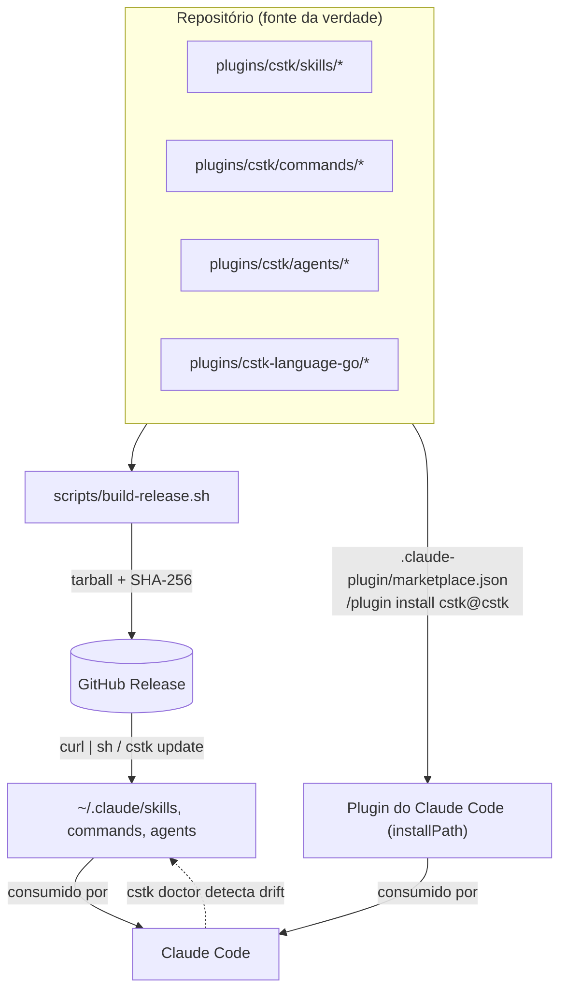
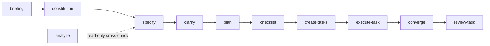
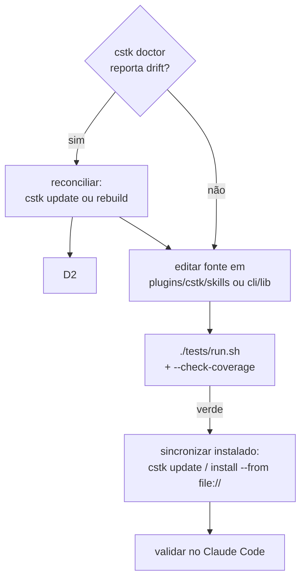

[English](./CONTRIBUTING.md) · **Português (pt-BR)**

# Contribuindo com o Claude Code Toolkit

Este guia expõe o **modelo mental** do toolkit para que um contribuidor externo
consiga abrir um PR com segurança. Para detalhes operacionais já documentados,
ele aponta para o [README.md](./README.pt-BR.md) e o `CLAUDE.md` em vez de duplicar.

> Contribuindo só com **conteúdo do site de documentação** (páginas em
> `docs-site/`)? Veja [docs-site/CONTRIBUTING.md](./docs-site/CONTRIBUTING.md) —
> regras diferentes (princípio D-I / fonte canônica).

---

## 1. Como o sistema "pensa"

O toolkit tem três tipos de artefato que o Claude Code consome, em camadas de
abstração crescente:

- **skills** (`plugins/cstk/skills/<nome>/SKILL.md`) — capacidades auto-invocadas por
  contexto. Unidade fundamental.
- **commands** (`plugins/cstk/commands/<nome>.md`) — workflows disparados por
  `/slash-command`.
- **agents** (`plugins/cstk/agents/<nome>.md`) — especialistas autônomos para tarefas
  multi-passo (ex.: os orquestradores `agente-00c`).

Sobre isso correm dois sistemas de mais alto nível: o **pipeline SDD** (a
sequência de skills do discovery à implementação) e o **`cstk`** (a CLI POSIX que
instala/versiona/atualiza tudo na máquina do usuário).



Desde a v6.9.0 o mesmo catálogo também é instalável como **plugin nativo do
Claude Code** (`/plugin marketplace add JotJunior/cstk`) — um segundo caminho
oficial de entrega ao lado do tarball clássico; o binário `cstk` em si não
faz parte do plugin. Ver [README §Instalação](./README.pt-BR.md#instalação).

### 1.1 O pipeline SDD

A sequência recomendada para levar uma ideia do discovery à implementação. Cada
skill consome o artefato da anterior:



Detalhe de cada etapa: [README §Pipeline SDD](./README.pt-BR.md#pipeline-sdd-spec-driven-development).

### 1.2 Orquestradores autônomos (`agente-00c` / `feature-00c`)

Para quem vai mexer no avançado: os orquestradores rodam o pipeline SDD inteiro
de forma autônoma, em "ondas", mantendo estado transacional em
`.claude/agente-00c-state/`. Conceitos que você **precisa** respeitar antes de
tocar nesse código (todos detalhados no `CLAUDE.md`):

- **`state.json` é a fonte de verdade transacional** — nunca derive lógica
  crítica de índices secundários.
- **`cstk recall` (knowledge.db)** é uma camada **aditiva e best-effort**:
  qualquer degradação vira no-op (exit 0), nunca aborta uma onda.
- **model-routing** é **suggest-only**: a skill `model-selector` sugere, o
  operador sempre pode dar override; nada troca de modelo silenciosamente.
- **Decisões são auditáveis** (`state-decisions.sh`) e **half-records** têm
  reconciliador próprio (`state-decisions-reconcile.sh`).

---

## 2. Fluxo de desenvolvimento

A armadilha nº 1 deste projeto é **drift entre a fonte (este repo) e a cópia
instalada** (`~/.claude/skills/`), que o Claude Code de fato consome.



**Sempre rode `cstk doctor` ANTES de editar uma skill.** Se houver drift,
reconcilie primeiro — senão seu fix pousa em estado stale e "funciona no repo mas
não na sessão". Passo a passo completo: [README §Instalação](./README.pt-BR.md#instalação)
e a seção "Installed vs Source Drift" do `CLAUDE.md`.

### Em DEV (iterando sem release)

```bash
# após build local (scripts/build-release.sh)
cstk install --from "file://$PWD/dist/cstk-X.Y.Z.tar.gz"
```

---

## 3. Adicionando artefatos

### Uma skill nova

1. Crie `plugins/cstk/skills/<nome>/SKILL.md` seguindo a [Anatomia de uma skill](./README.pt-BR.md#anatomia-de-uma-skill).
2. **`description` como trigger condition**, não resumo: "Use quando X, Y ou Z.
   NÃO use quando W."
3. Documente **gotchas** — o conteúdo mais valioso.
4. **Generalize**: skills em `plugins/cstk/skills/` ou `plugins/cstk-language-go/` **não podem
   nomear clientes/empresas/projetos específicos** (ver o aviso em
   [README §Contribuindo](./README.pt-BR.md#contribuindo); caso histórico: remoção de
   `create-report` na v3.12.0). Se não generalizar, a skill pertence a
   `<projeto>/.claude/skills/`.
5. Registre o perfil em `scripts/profiles.txt.in` (`sdd` ou `complementary`).
6. Se a skill tem `scripts/*.sh`, **crie o teste correspondente** (§4).

### Um command novo

Crie `plugins/cstk/commands/<nome>.md`. Commands de spawn/resume que integram
model-routing precisam carregar a instrução `wave-select` — veja os 4 commands
`agente-00c`/`feature-00c` existentes como referência.

### Um teste novo (regra de ouro)

Todo `.sh` novo em `plugins/cstk/skills/*/scripts/` ou `cli/lib/` **exige** um teste
1:1 (o `--check-coverage` falha com exit 1 sem ele):

| Origem do script | Teste esperado |
|------------------|----------------|
| `plugins/cstk/skills/<X>/scripts/<n>.sh` | `tests/test_<n>.sh` |
| `cli/lib/<n>.sh` | `tests/cstk/test_<n>.sh` |

Estrutura mínima e convenções (POSIX puro, sem `set -eu`, scenarios retornam
0/1/2): [tests/README.md](./tests/README.md). Rode antes de commitar:

```bash
./tests/run.sh                  # suite completa
./tests/run.sh --check-coverage # zero órfãos (exit 1 em violação)
```

---

## 4. Versionamento (SemVer)

O projeto segue [Semantic Versioning](https://semver.org/) com
[CHANGELOG.md](./CHANGELOG.md):

- **PATCH** — correções, ajustes de doc, refinamentos sem mudança de contrato.
- **MINOR** — skill/command/feature nova retrocompatível.
- **MAJOR** — **breaking change**. O caso mais comum aqui é **renomear uma
  skill**: ao renomear, remova **todas** as referências ao nome antigo antes de
  commitar (`grep -rn "nome-antigo" --include="*.md" --include="*.json" .`) —
  referência residual vira nome-fantasma que falha silenciosamente. Também é
  MAJOR remover skill, mudar contrato de CLI ou de `state.json`.

Release: `git tag vX.Y.Z` + push dispara `.github/workflows/release.yml`, que
gera e publica o tarball. Depois, na máquina: `cstk update`.

**Lockstep de versão.** Dois conjuntos independentes de manifestos DEVEM
carregar a versão exata `X.Y.Z` da release antes de criar a tag — ambos têm
gate (`scripts/validate-*.sh`, não-advisory em PR via `shellcheck.yml`,
`--strict` na release via `release.yml`):

- Manifestos de plugin do toolkit: `.claude-plugin/marketplace.json` e os 2
  `plugins/*/.claude-plugin/plugin.json`
  (`scripts/validate-plugin-manifests.sh`, MP-5).
- Workspaces npm do painel: `panel/package.json`,
  `panel/apps/server/package.json`, `panel/apps/web/package.json`,
  `panel/packages/shared-types/package.json` e `panel/package-lock.json`
  (`scripts/validate-panel-workspace-lockstep.sh`, WL-5). O painel **não**
  tem mais série de versão própria — ele migrou para este monorepo
  (`panel-monorepo`) e sua versão passa a avançar junto com a tag do
  repositório unificado, do mesmo jeito que os manifestos de plugin já
  faziam.

Suba cada um dos arquivos acima para `X.Y.Z` no mesmo commit que precede a
tag; os gates acima reprovam a release caso contrário.

---

## 5. Checklist de PR

- [ ] `cstk doctor` sem drift antes de começar.
- [ ] Código/identificadores em **inglês** (comentários e mensagens podem ser pt-br).
- [ ] `./tests/run.sh` verde e `--check-coverage` com zero órfãos.
- [ ] Script novo tem teste 1:1 no diretório certo.
- [ ] Skill nova sem acoplamento a cliente/projeto específico.
- [ ] `CHANGELOG.md` atualizado e bump de versão coerente com o tipo de mudança.
- [ ] Se renomeou skill: zero referências ao nome antigo no repo.
