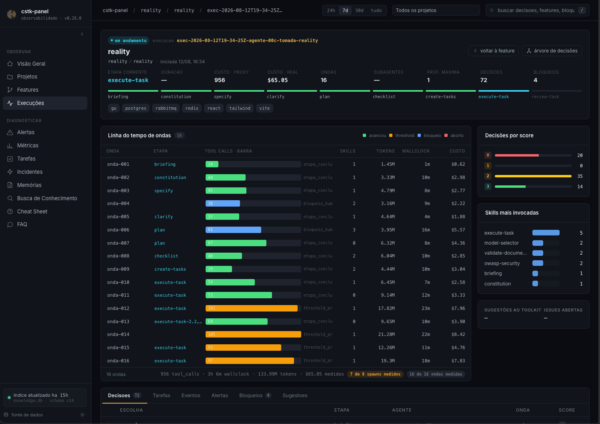
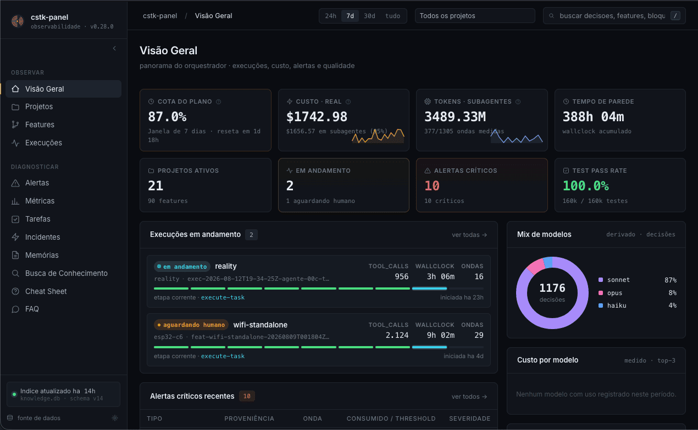
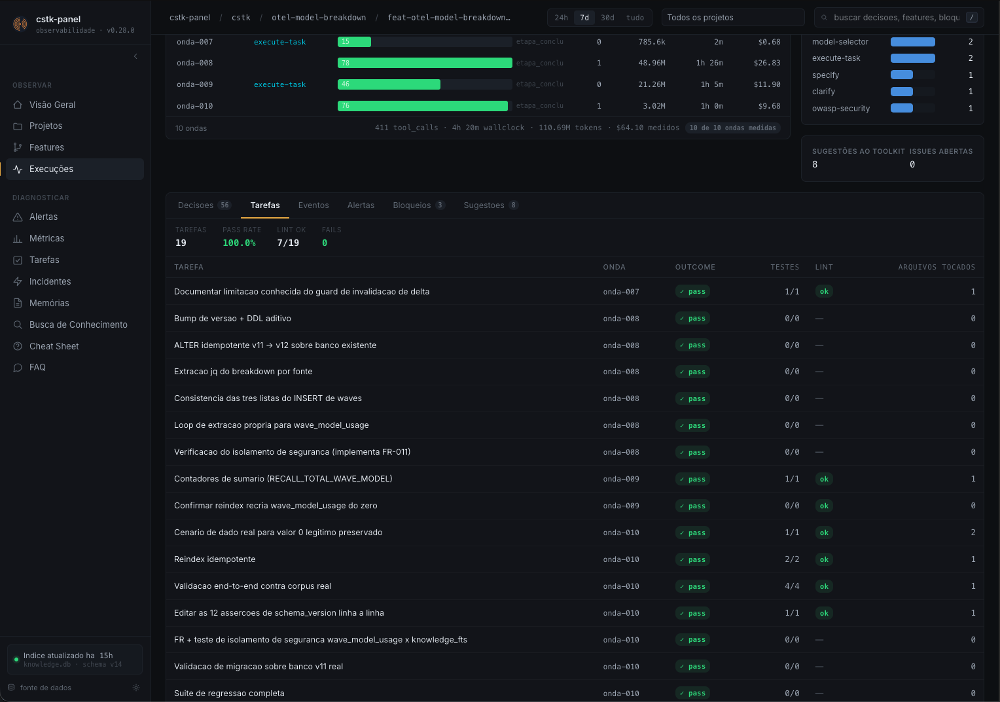
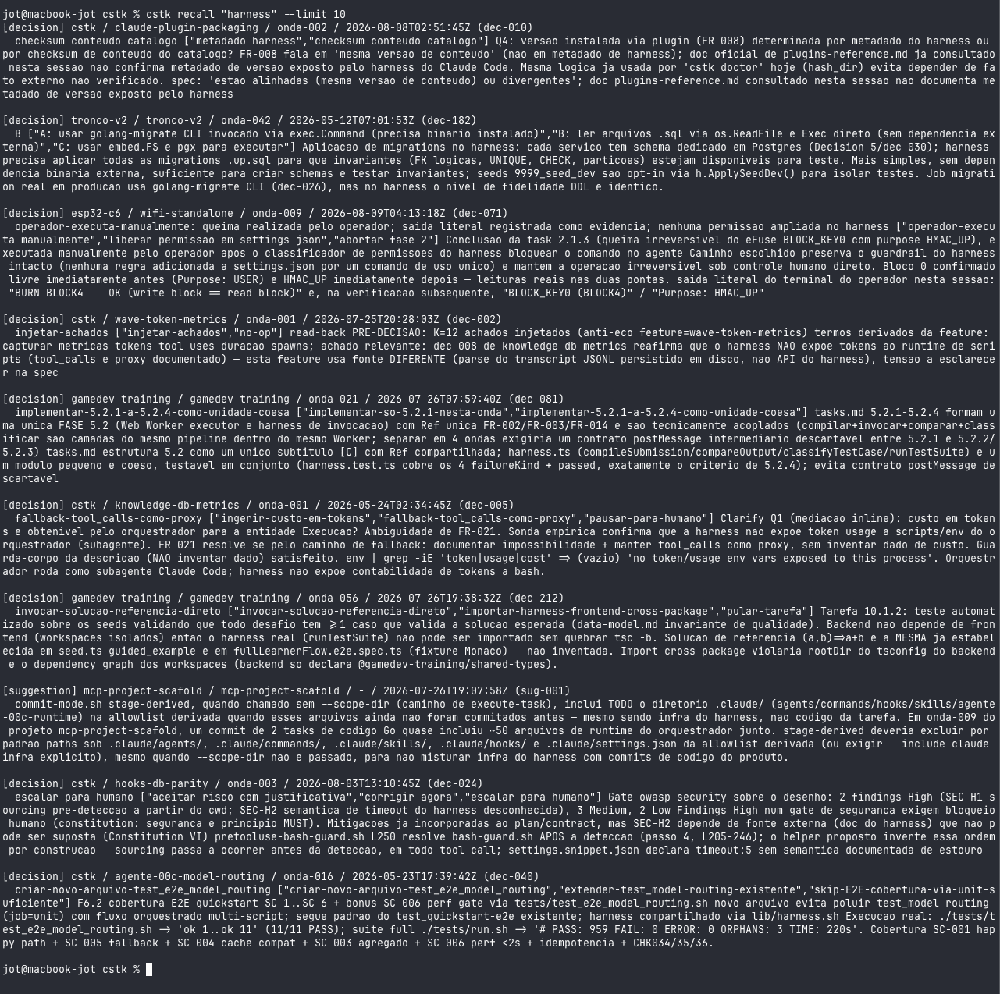
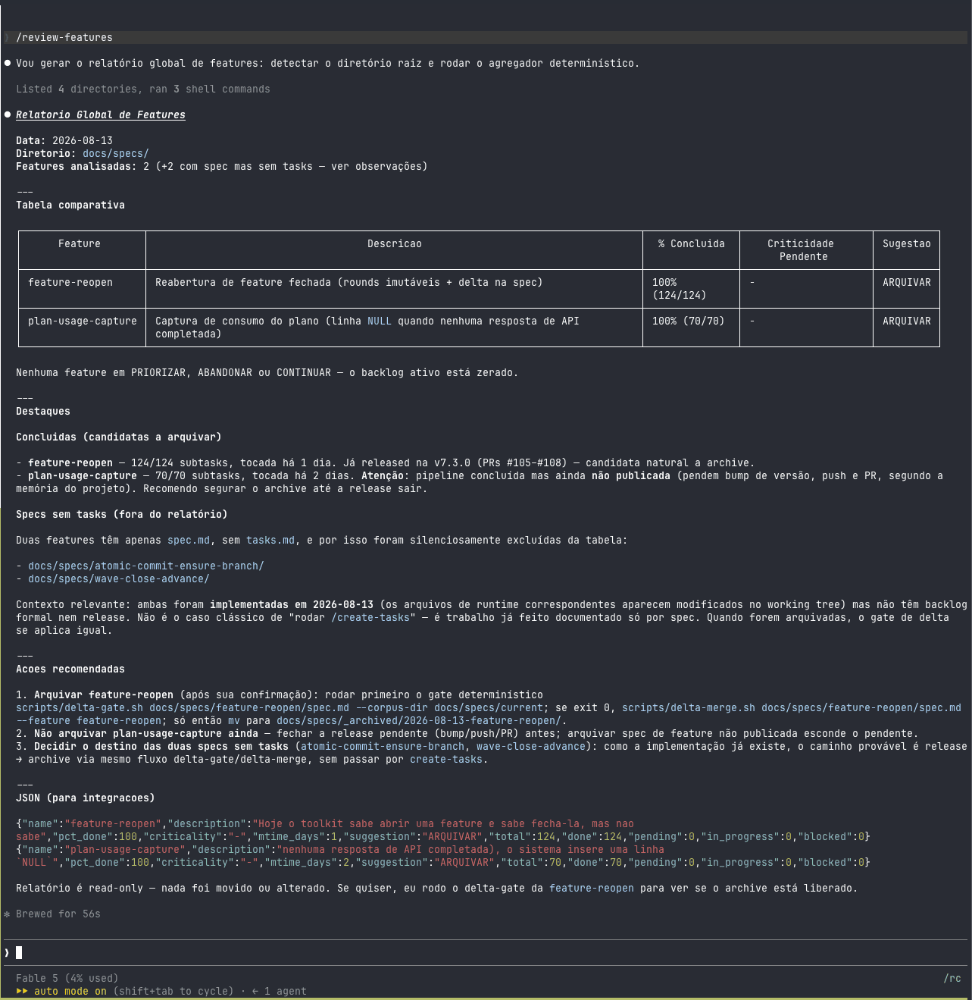
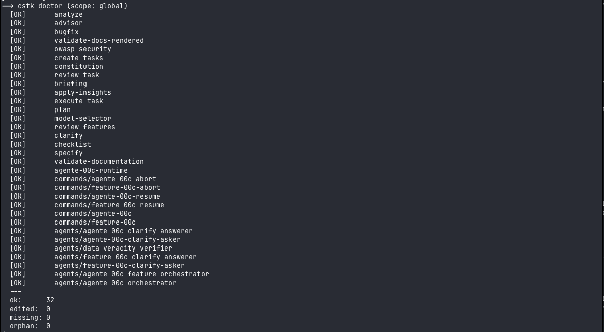

[English](./README.md) · **Português (pt-BR)**

# Claude Code Toolkit

[](https://github.com/JotJunior/cstk/releases/latest)
[](./LICENSE)
[](./CHANGELOG.md)
[](https://jotjunior.github.io/cstk/)
[](https://github.com/JotJunior/cstk/actions/workflows/publish-site.yml)

Conjunto de ferramentas para aumentar a produtividade no desenvolvimento do dia a dia com
o [Claude Code](https://claude.ai/code): **skills** e **hooks** para
documentação, desenvolvimento, segurança e qualidade de código.

> **Quem mantém / para quem é.** Mantido por uma pessoa, otimizado primeiro
> para o fluxo do mantenedor (microserviços em Go). As partes concretas —
> skills, hooks, CLI — são de uso geral; a **trilha avançada** (orquestrador
> autônomo) é mais experimental.

> **Versão atual:** [release mais recente](https://github.com/JotJunior/cstk/releases/latest)
> · histórico no [CHANGELOG.md](./CHANGELOG.md). Instalação recomendada via
> `cstk` CLI (ver [Instalação](#instalação)).



*Uma execução autônoma do `agente-00c` vista pelo [painel web](#screenshots):
timeline por onda com custo real, scores de decisão e skills invocadas — todo
número medido localmente, nunca fabricado. Mais imagens em
[Screenshots](#screenshots).*

## Comece aqui

Duas trilhas, dependendo do que você procura:

| Trilha | Para quem | Onde ir |
|--------|-----------|---------|
| **Básico** | Quer produtividade no dia a dia — especificar, revisar, corrigir, documentar com algumas skills | Esta seção + [Skills Globais](#skills-globais) |
| **Avançado** | Quer o orquestrador autônomo rodando o pipeline SDD inteiro sozinho | [Trilha avançada](#trilha-avançada-orquestrador-autônomo) |

### Trilha básica em 3 passos

```bash
# 1. Instale (uma vez por máquina)
curl -fsSL https://github.com/JotJunior/cstk/releases/latest/download/install.sh | sh
```

```text
# 2. Abra o Claude Code no seu projeto e invoque uma skill pelo gatilho:
#    "especifica essa feature: ..."   → specify  (ideia → spec)
#    "revisa a segurança desse código" → owasp-security
#    "corrige esse bug: ..."          → bugfix   (investigação multi-camada)
#    "me aconselhe sobre esse plano"  → advisor  (crítica estratégica)
```

```text
# 3. Pronto. As skills são auto-invocadas por contexto — você descreve a
#    intenção em linguagem natural e o gatilho dispara a skill certa.
```

> Não precisa do orquestrador autônomo para começar. Ele é a trilha avançada
> — adote quando quiser que o pipeline SDD rode de ponta a ponta sem você
> conduzir cada etapa.

### Depois de instalar: ative a captura de custo e tokens

Duas variáveis de ambiente — **sem API key, sem Admin key, sem organização**;
funciona em plano de assinatura:

```bash
export CLAUDE_CODE_ENABLE_TELEMETRY=1
export OTEL_METRICS_EXPORTER=prometheus
```

Com elas, cada onda do orquestrador passa a registrar o consumo **real**
(custo e tokens, separando `main` de `subagent`) em `.waves[N].otel_usage`,
e o painel mostra o gasto por onda. Sem elas tudo é no-op e o campo fica
`null` — ausente, nunca zero fabricado. Ponha no seu `~/.zshrc`/`~/.bashrc`
para não perder ondas por esquecimento.

Nada sai da máquina (exporter em `127.0.0.1:9464`) e labels de identidade são
descartados antes de tocar o disco.

> **Mais de um processo do Claude Code ao mesmo tempo?** Só o primeiro
> consegue o bind da porta fixa — os demais não medem nada em silêncio
> (`otel_usage` `null` em toda onda). Use o launcher de porta por processo
> mostrado em [Custo real por onda](#custo-real-por-onda-otel-usagesh) para
> cada processo ganhar seu próprio exporter automaticamente.

## Screenshots

| | |
|---|---|
|  *Visão geral do painel (`cstk serve`): cota do plano, custo real, execuções em andamento, mix de modelos.* |  *Tarefas de uma execução: outcome, testes e lint por tarefa, pass rate 100%.* |
|  *`cstk recall`: memória full-text de todas as execuções passadas, com proveniência (projeto/feature/onda/data).* |  *A skill `review-features` montando o relatório cross-feature dentro do Claude Code.* |
|  *`cstk doctor`: catálogo instalado auditado contra o manifest — drift zero.* | |

## Estrutura

```
├── plugins/                     # Catálogo, empacotado como plugins instaláveis do Claude Code
│   ├── cstk/                    # Plugin default (entrada "cstk" no marketplace)
│   │   ├── commands/            # Os 7 slash commands /agente-00c*, /feature-00c*, /roadmap-wave
│   │   ├── agents/              # Orquestradores, clarify asker/answerer, data-veracity
│   │   ├── hooks/hooks.json     # 3 guard hooks enforced (bash-guard, tool-call-tick, agent-usage)
│   │   └── skills/               # 21 skills globais (cada skill é uma pasta)
│   │       ├── advisor/
│   │       ├── agente-00c-runtime/ # runtime POSIX interno (não user-invocável)
│   │       ├── analyze/
│   │       ├── apply-insights/
│   │       ├── briefing/
│   │       ├── bugfix/
│   │       ├── checklist/
│   │       ├── clarify/
│   │       ├── constitution/
│   │       ├── converge/           # reconcilia spec/plan/tasks vs código real
│   │       ├── create-tasks/
│   │       ├── e2e-integration-flow/ # testes E2E de integração full-stack (Playwright)
│   │       ├── execute-task/
│   │       ├── model-selector/     # heurística de roteamento de modelo (sugestor)
│   │       ├── owasp-security/
│   │       ├── plan/
│   │       ├── review-features/
│   │       ├── review-task/
│   │       ├── specify/
│   │       ├── validate-docs-rendered/
│   │       └── validate-documentation/
│   └── cstk-language-go/        # Plugin do perfil Go (entrada "cstk-language-go")
│       ├── hooks/                # Hooks específicos de Go
│       └── skills/               # Go — ver docs/go-toolkit.md
├── .claude-plugin/marketplace.json  # Manifest do marketplace (2 entradas: cstk, cstk-language-go)
├── cli/                          # Binário cstk + libs POSIX (não empacotado no plugin — FR-006)
└── docs/                         # Documentação por tópicos (ver índice abaixo)
```

> Instalado via CLI clássico `cstk`, esse mesmo conteúdo pousa em
> `~/.claude/skills/`, `~/.claude/commands/` e `~/.claude/agents/`
> (achatado, sem o prefixo `plugins/cstk/`). Instalado via plugin nativo do
> Claude Code, materializa sob o `installPath` do próprio harness
> (ver [Instalação](#instalação) para os dois caminhos).

### Anatomia de uma skill

Cada skill é uma pasta com um `SKILL.md` (ponto de entrada) e, conforme o
caso, subpastas consultadas sob demanda (*progressive disclosure* — o modelo
paga só o contexto necessário no momento da invocação):

```
skills/<nome>/
├── SKILL.md             # Quando invocar, regras de alto nível, gotchas
├── templates/           # Templates preenchíveis
├── examples/            # Casos concretos (good.md vs bad.md)
├── references/          # Documentação de apoio
├── scripts/             # Scripts POSIX determinísticos
└── config.json          # Configuração por projeto (opcional)
```

Nem toda skill usa todas as subpastas — skills simples são só um `SKILL.md`.

## Skills Globais

Skills em `plugins/cstk/skills/`, independentes de linguagem ou framework.

### Pipeline SDD (Spec-Driven Development)

Sequência recomendada para levar uma ideia do discovery à implementação.
Detalhes, diagrama do fluxo e atalhos em
[docs/sdd-pipeline.md](./docs/sdd-pipeline.pt-BR.md).

| Skill | Trigger | Descrição |
|-------|---------|-----------|
| **briefing** | "briefing", "discovery", "novo projeto" | Entrevista estruturada de discovery (visão, usuários, restrições, stack) |
| **constitution** | "constitution", "princípios do projeto" | Princípios imutáveis de governança que guiam decisões |
| **specify** | "specify", "criar spec", "nova feature" | Descrição natural → feature spec SDD (stories, requisitos, success criteria). Gate: todo requisito exige >=1 cenário; seção opcional Delta Requirements (specs vivas) |
| **clarify** | "clarify", "resolver ambiguidades" | Resolve ambiguidades da spec via perguntas estruturadas (max 5) |
| **plan** | "plan", "plano técnico" | Plano de implementação: pesquisa, modelo de dados, contratos |
| **checklist** | "checklist", "quality gate" | "Unit Tests for English" — valida qualidade dos REQUISITOS; gaps viram tarefas |
| **create-tasks** | "criar tarefas", "criar backlog" | Backlog de tarefas por fases com dependências e criticidade |
| **execute-task** | "executar tarefa", "execute task" | Executa tarefa seguindo workflow obrigatório de 9 etapas |
| **converge** | "converge", "o código bate com a spec?" | Reconcilia spec/plan/tasks contra o código ATUAL e apenda gaps como nova fase de tasks. Etapa regular do pipeline entre execute-task e review-task nos orquestradores |
| **review-task** | "revisar tarefas", "status das tarefas" | Relatório de status com progresso e recomendações |

> `analyze` não é uma etapa sequencial numerada — é um **cross-check lateral
> read-only** (spec/plan/tasks/constitution), utilizável a qualquer momento
> a partir de `create-tasks`.

### Skills Complementares

| Skill | Trigger | Descrição |
|-------|---------|-----------|
| **advisor** | "me aconselhe", "analise estratégica" | Conselheiro brutalmente honesto que disseca raciocínio e gera planos de ação |
| **analyze** | "analyze", "analisar consistência" | Análise read-only de consistência cross-artifact |
| **bugfix** | "bugfix", "fix bug", "debug" | Protocolo estruturado de correção de bugs multi-camada |
| **e2e-integration-flow** | "e2e", "playwright", "validar fluxo completo" | Testes E2E de integração full-stack (UI → API → banco → fila → efeitos colaterais) |
| **apply-insights** | "aplicar insights", "melhorar claude.md" | Aplica insights de uso comprovados ao CLAUDE.md, hooks e workflows — ver [Insights de uso](#insights-de-uso) |
| **owasp-security** | Ao revisar segurança | Revisão guiada por checklist (OWASP Top 10:2025, ASVS 5.0, LLM/Agentic, NIST, OAuth 2.1...). Não substitui auditoria/pentest |
| **review-features** | "status global", "comparar features" | Relatório cross-feature com sugestão de arquivar/abandonar/priorizar; a ação de archive aplica os deltas ao corpus de specs vivas |
| **validate-documentation** | "validar documentação", "verificar UC" | Valida documentos individuais contra padrões estruturais |
| **validate-docs-rendered** | "validar renderização", "verificar diagramas" | Valida que o Markdown renderiza (Mermaid, links, frontmatter, tabelas) |

## Trilha avançada (orquestrador autônomo)

> **Experimental** — funcional e em uso pelo mantenedor, sem garantias de
> suporte para adoção externa.

O `/agente-00c` conduz a pipeline SDD inteira sobre um projeto-alvo, pausando
apenas em bloqueios reais; o `/feature-00c` faz o mesmo para UMA feature em
projeto existente. Subsistemas: roteamento de modelos por onda, modo
atomic-commit (commits automáticos + push/PR no finalize), guardas enforced
(hook fail-closed), sessões paralelas em worktrees, modo roadmap (briefing →
constitution → `docs/roadmap.md` com DAG de dependências) que pode terminar
**oferecendo uma leva paralela** de features independentes — cada uma aberta
como worktree `cstk session` + sessão `claude` nomeada (pane tmux quando
disponível), com as sessões-filhas notificando a coordenadora por mensagem
entre sessões para que a próxima leva seja oferecida assim que a fronteira
avançar — e memória de conhecimento cross-feature consultada antes de decidir.

Desde a v7.3.0 uma feature concluída deixou de ser beco sem saída:
`/feature-00c "<incremento>" --reopen=<short-name>` preserva a execução
anterior como round imutável, grava o incremento como `## Delta Requirements`
na spec existente e apenda uma fase nova de tasks em vez de regenerar o
backlog — com parecer advisory (reabrir vs criar feature nova) e bloqueio
humano antes de tocar disco.

| Tópico | Documento |
|--------|-----------|
| Orquestradores `/agente-00c` + `/feature-00c`, model-routing, atomic-commit, guardas | [docs/agente-00c.md](./docs/agente-00c.pt-BR.md) |
| Sessões paralelas (`cstk session`) | [docs/cstk-session.md](./docs/cstk-session.pt-BR.md) |
| Modo roadmap + leva paralela de features (oferta pós-roadmap, notificação, próxima leva) | [docs/agente-00c.md](./docs/agente-00c.pt-BR.md#modo-roadmap-e-levas-paralelas-de-features) |
| Memória de conhecimento (`cstk recall`) | [docs/cstk-recall.md](./docs/cstk-recall.pt-BR.md) |
| Consumo avulso (`cstk usage`) | [docs/cstk-usage.md](./docs/cstk-usage.pt-BR.md) |
| Painel web de métricas (`cstk serve`) | [docs/cstk-serve.md](./docs/cstk-serve.pt-BR.md) |

## Insights de uso

A skill `apply-insights` é **prescritiva**: lê seu playbook
(`~/.claude/insights/usage-insights.md`, por usuário — gere via `/insights`
nativo do Claude Code) e o aplica ao projeto. Distinta do `/insights` nativo,
que é **introspectivo** (analisa suas sessões).

<!-- --8<-- [start:install-section] -->
## Instalação

### Via cstk CLI (recomendado)

O toolkit é instalado via `cstk` — CLI POSIX shell que baixa, valida
(SHA-256), instala e atualiza skills sem exigir clone do repositório.

**One-liner de bootstrap** (instala `cstk` em `~/.local/bin/`):

```bash
curl -fsSL https://github.com/JotJunior/cstk/releases/latest/download/install.sh | sh
```

Depois disso, comandos típicos:

```bash
cstk --version                       # confirma instalação
cstk install                         # instala perfil 'sdd' em ~/.claude/skills/
cstk install --profile all           # instala TODAS as 28 skills (inclui language-go)
cstk install advisor bugfix          # cherry-pick por nome
cstk update                          # aplica novas releases preservando edits locais
cstk update --force                  # sobrescreve skills com edição local
cstk list                            # lista skills instaladas + status
cstk doctor                          # detecta drift entre manifest e disco
cstk self-update                     # atualiza o próprio binário cstk + cli/lib
```

> **`install`/`update` tocam só o catálogo** (skills/commands/agents em
> `~/.claude/`); o runtime (`cli/lib/*.sh` + binário) atualiza via
> **`cstk self-update`**.

**Perfis disponíveis:**

| Perfil | Conteúdo | Uso típico |
|--------|----------|------------|
| `sdd` | 17 skills: pipeline Spec-Driven Development completa (briefing → review-features) + runtime interno, model-selector e os 4 gates de qualidade dos orquestradores | Instalação global default |
| `complementary` | 10 skills independentes (advisor, bugfix, e2e-integration-flow, etc.) | Complementa o pipeline SDD |
| `all` | Todas as 28 skills (sdd + complementary + language-go) | Instalação completa |
| `language-go` | Skills + hooks específicos para Go | Apenas em projetos Go |

Profile padrão quando nada é informado: `sdd`.

**Escopo de projeto** (`./.claude/skills/` no CWD em vez de `~/.claude/skills/`):

```bash
# Em um projeto Go: instala skills + hooks + merge de settings.json
cd ~/projetos/meu-app-go
cstk install --scope project --profile language-go

# Cherry-pick em escopo de projeto
cstk install --scope project advisor owasp-security

# Hooks de language-* SÃO instalados apenas em --scope project
# (em --scope global, hooks são omitidos com aviso no summary — FR-009c)
```

### Via plugin do Claude Code (nativo, sem binário)

Desde a v6.9.0 o catálogo também é distribuível como [plugin nativo do
Claude Code](https://docs.claude.com/en/docs/claude-code/plugins) — sem
binário `cstk`, sem clone, sem bootstrap via `curl`:

```text
/plugin marketplace add JotJunior/cstk
/plugin install cstk@cstk
# opcional, apenas projetos Go:
/plugin install cstk-language-go@cstk
```

Habilite o plugin e abra uma sessão nova em qualquer projeto — as skills, os
7 commands `/agente-00c*`/`/feature-00c*`/`/roadmap-wave` e os guard hooks enforced
(`pretooluse-bash-guard`, `posttooluse-tool-call-tick`,
`posttooluse-agent-usage`) ativam automaticamente, **sem** o passo
`cstk hooks install` (confirmado empiricamente — ver
[`docs/specs/_archived/2026-08-08-claude-plugin-packaging/spec.md`](docs/specs/_archived/2026-08-08-claude-plugin-packaging/spec.md)
§Clarifications, assumption A1). O `posttooluse-loose-usage.sh` (captura
opt-in de consumo) deliberadamente **não** faz parte do `hooks.json` do
plugin — segue sendo opt-in explícito via `cstk hooks install
--with-loose-usage`, e ainda exige `CSTK_OTEL_ENDPOINT` no ambiente do
processo `claude`, senão não captura nada
([docs/cstk-usage.pt-BR.md](./docs/cstk-usage.pt-BR.md#requisitos)).

**Escolhendo entre os dois caminhos:**

| | Clássico (CLI `cstk`) | Plugin (nativo) |
|---|---|---|
| Passo de instalação | one-liner de bootstrap + `cstk install` | `/plugin marketplace add` + `/plugin install` |
| Fornece o binário `cstk` (`recall`, `usage`, `mcp`, `session`, `serve`, `self-update`) | Sim | **Não** — o formato de plugin não instala binário persistente no `PATH` (FR-006); use o bootstrap clássico para esses |
| Ativação dos guard hooks | Exige `cstk hooks install` por projeto | Automática ao abrir a sessão, zero passo por projeto |
| Verificação de integridade | SHA-256 do tarball, fail-closed (`serve-integrity`), allowlist fixa de hosts confiáveis | Pin de commit (`gitCommitSha`) registrado pelo harness + diálogo de confiança "Will install" do próprio harness |
| Propagação de update | `cstk update` (explícito, por invocação) | **Não é automática**: `claude plugin marketplace update` e depois `claude plugin update cstk --scope <escopo>`, mais reinício de sessão — o próprio CLI de plugin imprime `Restart to apply changes.` |

Os dois caminhos são igualmente oficiais (não há um terceiro mecanismo de
distribuição sem governança — ver `FR-017` em
[`docs/specs/current/guards-defense-in-depth.md`](docs/specs/current/guards-defense-in-depth.md))
e entregam o mesmo conteúdo auditável com **proteção comparável, não
mecanismos idênticos** — escolha o plugin para o onboarding mais rápido, sem
binário, de skills + guard hooks; o CLI clássico quando precisar de
`recall`/`usage`/`mcp`/`session`/`serve`; ou **os dois juntos**: `cstk
doctor`/`cstk hooks install` detectam o plugin e automaticamente evitam
registrar os guard hooks em dobro (o plugin vence; `cstk doctor` reporta
`aligned`/`diverged`/`duplicated-hooks` com correção acionável para cada
caso).

### Hooks do runtime 00c (`cstk hooks`)

Os três hooks do runtime 00c — `pretooluse-bash-guard.sh` (guarda
fail-closed de Bash), `posttooluse-tool-call-tick.sh` e
`posttooluse-agent-usage.sh` (métricas por onda) — só rodam num projeto-alvo
depois de copiados para `.claude/hooks/` **e** registrados em
`.claude/settings.json`.

O `cstk install --scope project agente-00c-runtime` faz isso, mas também
copia a skill, 7 commands e 7 agents para dentro do repo. Quando você quer
apenas os hooks:

```bash
cd ~/projects/meu-projeto-alvo
cstk hooks install                    # toca só .claude/hooks/ + settings.json
cstk hooks install --dry-run          # mostra o plano sem escrever
cstk hooks install --project-path ../outro-projeto
cstk hooks install --remove-classic   # deduplica contra o plugin, sem prompt
cstk hooks install --local            # registra em settings.local.json (repos de terceiros)
cstk hooks status                     # read-only: onde cada hook esta registrado?
```

**Repos de terceiros** (`--local`, issue #135): quando o time do cliente
versiona `.claude/settings.json` de propósito, uma ferramenta pessoal não
tem o que fazer lá dentro. `--local` grava o *registro* em
`.claude/settings.local.json` — o Claude Code **soma** hooks entre escopos
e o arquivo local costuma estar gitignored — então os hooks disparam só
para você e o arquivo do time fica byte a byte intacto. Os scripts
continuam em `.claude/hooks/`; para não sujar o `git status` do cliente
sem mexer no `.gitignore` dele:

```bash
printf '.claude/hooks/\n.claude/settings.local.json\n.claude/*.bak\n.claude/*.bak-pre-dedup\n' >> .git/info/exclude
```

Os dois padrões `.bak` cobrem os backups que o **próprio comando** grava —
`settings.json.bak` / `settings.local.json.bak` ao mesclar o registro, e
`settings.json.bak-pre-dedup` ao remover um bloco clássico duplicado. Sem
eles o backup aparece no `git status` do cliente e pega carona num
`git add -A` distraído (issue #163).

Idempotente como o fluxo padrão. Se o *outro* arquivo já registrar os
hooks 00c (os dois disparariam, contando cada tool call em dobro) o comando
avisa e oferece a mesma remoção do dedup do plugin (`--remove-classic`
pula o prompt). `cstk hooks status` e `guard-hooks-status.sh check` leem
os dois arquivos, então o `tick-mode` continua respondendo `hook` e o
orquestrador não ticka na mão por cima de um hook ativo.

Quando o plugin já fornece os hooks, o `cstk hooks install` pula o
provisionamento clássico (plugin vence) e, se o projeto **ainda** carrega um
registro clássico no `settings.json`, as duas camadas dispararam juntas.
Nesse caso ele pergunta se pode remover o bloco clássico, apagando apenas as
entradas dos hooks 00c — hooks de terceiros e todas as demais chaves do
arquivo são preservados — e gravando backup em
`settings.json.bak-pre-dedup`. Use `--remove-classic` para pular o prompt
(scripts/CI). Sem TTY e sem a flag o bloco é **mantido**, com aviso: o
`settings.json` é do operador e nunca é reescrito sem consentimento
explícito.

Sem esse passo a guarda de Bash fica inerte e `tool_calls`/`agent_usage`
ficam zerados em todas as ondas. Para conferir o estado atual sem escrever
nada:

```bash
guard-hooks-status.sh check --projeto-alvo-path .
# <hook>  present|missing  registered|unregistered  current|stale|unknown
```

Rode `cstk hooks install` de novo após todo upgrade do cstk que toque os
hooks: as cópias em `.claude/hooks/` são snapshots e nada as reconcilia com o
catálogo. Cópia **stale** é tão danosa quanto ausente — roda um conjunto de
regras antigo. Isso é regressão real, não hipótese: depois do cutover
`state.json` → `state.db`, projetos ficaram com um tick hook que só sabia ler
`state.json`, então `tool_calls` saía 0 em toda onda enquanto o check ainda
reportava "3/3 hooks ativos". A quarta coluna existe para tornar isso
visível, e o `tick-mode` cai para `manual` exatamente nesse pareamento (cópia
cega ao backend + `state.db`), para a métrica sobreviver até você
reprovisionar.

### Custo real por onda (`otel-usage.sh`)

Os contadores OpenTelemetry nativos do Claude Code são incrementados **a
cada API request** e carregam o label `query_source` (`main` / `subagent` /
`auxiliary`). Um snapshot no início e outro no fim da onda dão o consumo
exato dela — inclusive o do próprio orquestrador, que o hook de spawn nunca
consegue capturar (o spawn do orquestrador *envolve* a onda, então o
`tool_result` dele chega depois que a onda já fechou).

Ativa-se com duas variáveis de ambiente — **sem API key, sem Admin key, sem
organização**; funciona em plano de assinatura:

```bash
export CLAUDE_CODE_ENABLE_TELEMETRY=1
export OTEL_METRICS_EXPORTER=prometheus
```

O `state-ondas.sh start`/`end` passa a preencher `.waves[N].otel_usage`
sozinho. Sem as variáveis tudo é no-op e o campo fica `null` — **ausente,
nunca zero fabricado**.

Medido numa task delegada: `main` $0,156, `subagent` $0,141, `auxiliary`
$0,001 — o subagente era ~47% do gasto, exatamente a fatia que o painel
mostrava como `—`.

O exporter escuta em `127.0.0.1:9464`; nada sai da máquina. Labels de
identidade (`user_email`, `user_id`, `user_account_*`, `organization_id`)
são descartados no snapshot e nunca tocam o disco. Use `CSTK_OTEL_ENDPOINT`
para apontar a outra porta.

**Vários processos do Claude Code ao mesmo tempo? Dê uma porta a cada um.**
Só UM processo consegue o bind da porta fixa `9464` — o primeiro que abrir
ganha. Qualquer outro processo (outra aba do terminal, outro projeto) falha o
bind em silêncio: as métricas dele não são expostas em lugar nenhum, os
snapshots por onda scrapeiam as sessões velhas do processo *vencedor*, e o
guard do delta descarta o resultado corretamente — `otel_usage` sai `null` em
**todas as ondas** daquela execução, com o painel sem custo nenhum. Caso real:
um `claude -c` de dois dias de outro projeto segurava a porta e uma execução
inteira de 16 ondas não mediu nada.

A correção é uma função-launcher no seu `~/.zshrc` que pede ao OS uma porta
livre a cada lançamento (bind na porta `0` deixa o kernel escolher) e aponta o
scraper do cstk para ela via `CSTK_OTEL_ENDPOINT` — hooks e scripts do runtime
rodam dentro do processo do Claude, então herdam as duas variáveis.

> Desde a v6.9.0 raramente é preciso fazer isso à mão: o `cstk install`
> oferece esse wrapper como **opt-in** na primeira instalação (escreve no rc
> do seu shell entre marcadores `# >>> cstk telemetry >>>`, só com
> consentimento explícito — nunca em ambiente não-interativo), e
> `cstk help telemetry` imprime o bloco canônico pronto para colar se você
> recusou ou quiser configurar depois.

```zsh
# Um exporter OTel por processo do claude: OS sorteia porta livre a cada lancamento.
claude() {
  local _otel_port
  _otel_port=$(python3 -c 'import socket; s=socket.socket(); s.bind(("127.0.0.1",0)); print(s.getsockname()[1]); s.close()' 2>/dev/null)
  if [ -n "$_otel_port" ]; then
    OTEL_EXPORTER_PROMETHEUS_PORT=$_otel_port \
    CSTK_OTEL_ENDPOINT="http://127.0.0.1:${_otel_port}/metrics" \
    command claude "$@"
  else
    command claude "$@"   # sem python3: cai na porta default fixa
  fi
}
```

> **O wrapper também é requisito duro da captura de consumo avulso**
> (`cstk usage`, issue #162), não só conveniência para multi-processo: o
> `posttooluse-loose-usage.sh` gateia em `CSTK_OTEL_ENDPOINT` e sai `0` mudo
> sem ela. Diferente do caminho por onda — que cai na porta default fixa — a
> captura avulsa **não** tem fallback: sem a variável (ou um `export`
> equivalente à mão) ela fica inerte e o `cstk usage` responde `nao medido`.
> Ver [docs/cstk-usage.pt-BR.md](./docs/cstk-usage.pt-BR.md#requisitos).

Zero configuração por sessão: cada `claude` que você digita ganha um exporter
isolado e uma medição isolada. De bônus, o guard "exatamente uma sessão
cresceu" do delta passa a ver só as sessões daquele processo — os descartes
por ambiguidade (`null` por sessões concorrentes) praticamente desaparecem.
O wrapper só cobre processos lançados do seu shell — o que nascer por fora
(IDE, app desktop) continua na porta default fixa.

Diagnóstico rápido quando o painel não mostra custo em onda nenhuma: veja
quem é o dono da porta e se o diretório de trabalho dele é mesmo o projeto
da execução:

```bash
lsof -nP -iTCP:9464 -sTCP:LISTEN     # quem e o dono da porta do exporter?
lsof -p <PID> | grep cwd             # ...e de qual projeto?
```

Ou deixe o runtime decidir: `otel-usage.sh preflight` responde "ESTA sessão
vai ser medida?" deterministicamente — `status=ok` (exporter pertence a um
ancestral deste processo), `port-conflict` com PID e cwd do dono (exit 3),
`exporter-down` (exit 4), `disabled` ou `unverified`. Os commands 00c rodam
o preflight no diagnóstico inicial e repassam qualquer aviso ao operador
antes da onda-001.

**Modo interativo** (seletor numerado em TTY) e **dry-run**:

```bash
cstk install --interactive   # lista perfis + skills numerados; seleção via toggle
cstk install --dry-run --profile all
cstk update --dry-run
```

### Gauge de uso do plano (`cstk statusline` + `cstk plan-usage`)

Desde a v7.2.0 o toolkit também captura o gauge de uso do plano que você vê
no `/usage` — sem credencial OAuth, sem API key: o Claude Code já envia
`rate_limits.five_hour`/`seven_day` no payload da statusline a cada render, e
o hook de captura só lê o que já está passando, persistindo localmente na
tabela `plan_usage` do `~/.claude/cstk/knowledge.db`.

```bash
cstk statusline install    # registra o hook de captura em ~/.claude/settings.json
cstk statusline status     # a captura está ativa (e o settings.json válido)?
cstk plan-usage            # captura mais recente por escopo (five_hour / seven_day)
cstk plan-usage history    # série temporal; reusa --scope/--limit/--since do cstk usage
```

Opt-in por construção — nada é capturado até você rodar `statusline
install` — e 100% local. Um comando de statusline customizado já existente é
preservado e encadeado como pass-through obrigatório do stdout, nunca
sobrescrito em silêncio. Escopo sem medição imprime `nao medido` (`null` com
`--json`) — nunca zero fabricado.

### Instalação manual (deprecated, ainda suportada)

Copia direta dos diretórios continua funcionando (`cp -r plugins/cstk/skills/
~/.claude/skills/`), mas **não rastreia versões nem detecta drift** — ver
[`CLAUDE.md`](./CLAUDE.md) §"Installed vs Source Drift". O `cstk` resolve
isso via manifest + hash_dir.

### Documentação completa do cstk

- [`cli/README.md`](./cli/README.pt-BR.md) — visão técnica, convenções, processo de release
- [`docs/specs/_archived/cstk-cli/`](docs/specs/_archived/cstk-cli/) — spec, plan, contracts, quickstart
<!-- --8<-- [end:install-section] -->

<!-- --8<-- [start:profiles-section] -->
### Perfis de instalação (resumo)

| Perfil | Conteúdo | Uso típico |
|--------|----------|------------|
| `sdd` | 17 skills: pipeline Spec-Driven Development completa (briefing → review-features) + runtime interno, model-selector e os 4 gates de qualidade dos orquestradores | Instalação global default |
| `complementary` | 10 skills independentes (advisor, bugfix, e2e-integration-flow, etc.) | Complementa o pipeline SDD |
| `all` | Todas as 28 skills (sdd + complementary + language-go) | Instalação completa |
| `language-go` | Skills + hooks específicos para Go | Apenas em projetos Go |

Profile padrão quando nada é informado: `sdd`. Detalhes em `cstk install --help`.
<!-- --8<-- [end:profiles-section] -->

## Documentação por tópicos

| Tópico | Documento |
|--------|-----------|
| Pipeline SDD: fluxo completo, quando usar cada skill, atalhos, specs vivas | [docs/sdd-pipeline.md](./docs/sdd-pipeline.pt-BR.md) |
| Orquestrador autônomo (agente-00c / feature-00c) | [docs/agente-00c.md](./docs/agente-00c.pt-BR.md) |
| Sessões paralelas (`cstk session`) | [docs/cstk-session.md](./docs/cstk-session.pt-BR.md) |
| Modo roadmap + leva paralela de features (oferta pós-roadmap, notificação, próxima leva) | [docs/agente-00c.md](./docs/agente-00c.pt-BR.md#modo-roadmap-e-levas-paralelas-de-features) |
| Memória de conhecimento (`cstk recall`) | [docs/cstk-recall.md](./docs/cstk-recall.pt-BR.md) |
| Consumo avulso (`cstk usage`) | [docs/cstk-usage.md](./docs/cstk-usage.pt-BR.md) |
| Painel web (`cstk serve`) | [docs/cstk-serve.md](./docs/cstk-serve.pt-BR.md) |
| Skills e hooks para Go | [docs/go-toolkit.md](./docs/go-toolkit.pt-BR.md) |
| Convenções de nomenclatura e hierarquia de docs | [docs/conventions.md](./docs/conventions.pt-BR.md) |
| Manual navegável (site) | [jotjunior.github.io/cstk](https://jotjunior.github.io/cstk/) |

## Segurança

O cstk instala hooks que interceptam tool calls (incluindo um que casa
**todas** as tools — um contador local passivo, silencioso, sempre exit 0),
um guard de Bash fail-closed **apenas durante execuções 00c autônomas**, e
uma CLI que recusa downloads de release não verificados (sha256 + allowlist
fixa de hosts). Nada que o cstk registra sai da sua máquina.

O que cada hook faz, o que o guard bloqueia, como funciona a integridade de
release e como reportar vulnerabilidade: **[SECURITY.md](./SECURITY.md)**
(em inglês).

## Contribuindo

Contribuições são bem-vindas. O guia completo — modelo mental do sistema,
fluxo de desenvolvimento, política de versionamento e o **princípio de escopo
do toolkit global** (skills publicadas aqui não devem nomear clientes,
empresas ou projetos específicos) — está em
[CONTRIBUTING.md](./CONTRIBUTING.pt-BR.md). Resumo para adicionar uma skill:

1. Siga a estrutura de pasta de uma skill existente (ver [Anatomia de uma skill](#anatomia-de-uma-skill))
2. `SKILL.md` enxuto como ponto de entrada; conteúdo pesado em subpastas
3. **description** como trigger condition, não resumo
4. **Gotchas** documentados — o conteúdo mais valioso de uma skill
5. Scripts em POSIX sh para operações determinísticas; todo `.sh` novo exige `tests/test_<nome>.sh`
6. Generalize: se referencia algo de um projeto específico, pertence ao `<projeto>/.claude/skills/`, não a este toolkit
7. Teste com o Claude Code antes de submeter

## Versionamento

Este projeto segue [Semantic Versioning](https://semver.org/) e mantém um
[CHANGELOG.md](./CHANGELOG.md) com o histórico de mudanças.

## Créditos & Atribuições

Parte do pipeline SDD é adaptada do [GitHub Spec Kit](https://github.com/github/spec-kit)
(MIT) — em especial o vocabulário de etapas e o template de constituição. O
modelo de specs vivas com delta requirements foi inspirado no
[OpenSpec](https://github.com/Fission-AI/OpenSpec). Outras skills tiveram
inspiração conceitual de [obra/superpowers](https://github.com/obra/superpowers)
e das convenções do Claude Code. Padrões públicos (OWASP, NIST, IETF, W3C,
MITRE) são citados como referência. Detalhes e avisos de licença em
[THIRD-PARTY-NOTICES.md](./THIRD-PARTY-NOTICES.pt-BR.md).

## Licença

Distribuído sob a licença MIT. Veja o arquivo [LICENSE](./LICENSE) para o
texto completo.
