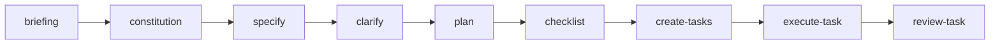

# Orquestração autônoma de software com auditoria: o que aprendi construindo o cstk e o cstk-panel

Faz um tempo que venho construindo um toolkit para o Claude Code chamado **cstk**. Ele começou como um conjunto de skills de documentação e foi crescendo até virar algo mais ambicioso: um orquestrador autônomo que conduz um pipeline de desenvolvimento dirigido por especificação (SDD) de ponta a ponta, e um painel web (**cstk-panel**) para observar tudo isso acontecendo.

Este artigo não é um pitch. É um relato técnico, com os números reais que o próprio sistema registrou, incluindo as partes que não funcionaram bem. Se você está avaliando levar agentes para além do "autocomplete turbinado", os trade-offs aqui valem mais do que qualquer demo bonita.

---

## O que é cada peça

O **cstk** entrega três camadas que funcionam de forma independente:

- **Skills** — capacidades auto-invocadas por contexto (`specify`, `plan`, `bugfix`, `owasp-security`, `advisor`, `create-use-case`, entre outras). Você descreve a intenção em linguagem natural e a skill certa dispara.
- **CLI** — um binário `cstk` com subcomandos para sessões paralelas (`session`), memória de conhecimento (`recall`), painel web (`serve`) e diagnóstico de drift (`doctor`).
- **Orquestradores** — a trilha avançada (e admitidamente mais experimental): `agente-00c` conduz um projeto inteiro e `feature-00c` conduz uma feature individual, ambos rodando o pipeline SDD sozinhos.

O **cstk-panel** é a interface web local que lê o estado e a memória dos orquestradores e transforma em algo observável: ondas de execução, decisões tomadas, modelos roteados, bloqueios que exigiram um humano.

> **[SNAPSHOT 1: visão geral do cstk-panel — dashboard inicial com a lista de execuções]**

---

## A jornada do `agente-00c`: uma execução real

O pipeline SDD é uma sequência fixa de fases, cada uma com um gate de qualidade antes da próxima:



Vou usar a execução que construiu o próprio **cstk-panel** como exemplo, porque ela está inteira no banco. Foram **13 ondas**, **3h22 de relógio de parede do orquestrador** (cerca de 79 minutos de wallclock efetivo de subagentes) e **59 decisões registradas**. A progressão das ondas:

| Onda | Fase | Wallclock | Tool calls |
|:----:|------|----------:|:----------:|
| 001 | briefing | 0s | 0 |
| 002 | constitution, specify, clarify | 480s | 0 |
| 003 | plan | 523s | 0 |
| 004 | checklist | 0s | 0 |
| 005 | create-tasks | 0s | 0 |
| 006-011 | execute-task | 70-908s | 0-14 |
| 012 | execute-task | 381s | 0 |
| 013 | review-task | 107s | 0 |

Repare que `briefing`, `checklist` e `create-tasks` aparecem com 0s de wallclock: são fases de consolidação rápida sobre artefatos já produzidos. O peso real está em `plan` e nas ondas de `execute-task` — exatamente onde se espera.

### Roteamento de modelo por fase

Uma das partes que mais gosto é o **model-routing**. Cada onda escolhe o modelo conforme a profundidade cognitiva da fase, seguindo um mapa versionado e determinístico. Na execução do painel, os 13 roteamentos saíram assim:

| Modelo | Ondas | Fases |
|:------:|:-----:|-------|
| opus | 2 | constitution, plan |
| sonnet | 10 | briefing, specify, clarify, checklist, create-tasks, execute-task |
| haiku | 1 | review-task |

A lógica é direta: as fases profundas (arquitetura, plano técnico) ganham o modelo mais capaz; a fase rasa de revisão final cai para o mais barato. Cada decisão registra `sugerido`, `aplicado` e `origem` — e quando há divergência entre o que o mapa sugeriu e o que foi aplicado (override manual ou escalada por subestimação), isso fica auditável. Não é caixa-preta: dá para responder "por que esta onda rodou em opus?" com uma linha do banco.

> **[SNAPSHOT 2: tela de detalhe de uma execução no cstk-panel mostrando as ondas e o modelo roteado em cada uma]**

### O humano no loop, quando necessário

Em toda a execução do painel, o orquestrador parou **uma única vez** para perguntar a um humano: *"Rodar 'npm install' no monorepo cstk-panel para instalar dependências de todos os workspaces?"*. A resposta veio em **313 segundos** e a execução seguiu. Esse é o comportamento que eu quero: autonomia para o trabalho mecânico, pausa para o que tem efeito colateral fora do repositório.

---

## `agente-00c` vs `feature-00c`: a mesma máquina, escopos diferentes

Os dois orquestradores compartilham o mesmo runtime POSIX (`agente-00c-runtime`). A diferença é o escopo e o isolamento de estado:

| Aspecto | `agente-00c` (projeto) | `feature-00c` (feature) |
|---------|------------------------|-------------------------|
| Escopo | Projeto inteiro, multi-feature | Uma feature individual |
| State dir | `agente-00c-state/` | `feature-00c-state/<short-name>/` |
| Quando usar | Greenfield, vários domínios | Incremento sobre base existente |

Na prática, o fluxo maduro é: usar `agente-00c` para tirar o projeto do zero e, depois, abrir cada incremento como uma feature isolada com `feature-00c`. Combinado com `cstk session`, dá para ter várias features rodando em worktrees separadas sem colidir branch, working tree nem estado do orquestrador.

---

## Métricas: as quatro execuções lado a lado

O valor de registrar tudo aparece quando você compara execuções. Estes são os quatro projetos que o banco tem hoje:

| Projeto    | Ondas | Decisões | Bloqueios humanos | Sugestões de skill | Duração |
|------------|:-----:|:--------:|:-----------------:|:------------------:|--------:|
| cstk-panel | 13 | 59 | 1 | 2 | 3h22 |
| fts-dms    | 16 | 77 | 0 | 0 | 3h41 |
| fts-dsc    | 6 | 30 | 0 | 0 | 1h43 |
| fts-itk    | 61 | 224 | 10 | 52 | ~48h |

Três dessas execuções são limpas: poucas ondas, poucos ou nenhum bloqueio, conclusão em horas. A quarta é a história de terror — e é dela que vêm os aprendizados mais úteis.

> **[SNAPSHOT 3: tela comparativa de métricas no cstk-panel — gráfico de ondas/decisões por execução]**

---

## Os pontos negativos (porque eles existem)

Seria desonesto vender só os números bonitos. A execução **novos-projetos** expõe os limites reais do orquestrador, e o próprio sistema os capturou como sinais de alerta:

- **Custo descontrolado em escopo grande.** 61 ondas, ~48 horas de relógio, ~14h de wallclock efetivo. O orquestrador estourou dois budgets registrados: **85 tool calls contra um teto de 80** e **19.496 segundos de wallclock contra um teto de 5.400**. Quando o escopo é amplo e mal delimitado, a autonomia vira queima de recurso.
- **Loops circulares.** Seis sinais do tipo `circular` foram disparados — o agente repetindo o mesmo par problema/solução sem convergir. O sistema detecta por hash, mas detectar não é resolver.
- **Drift e abortos.** A onda 060 foi **abortada por drift**: sete ondas seguidas sem tocar nos aspectos-chave da feature. Acumular 60 ondas antes desse freio é tarde demais.
- **Dependência pesada de bloqueios humanos.** Dez paradas para humano, com latências de até ~50 minutos cada. Em escopo grande, o "autônomo" precisou de muito acompanhamento.

Além do que o banco mostra, há limitações estruturais que eu assumo abertamente:

- **É mantido por uma pessoa** e otimizado primeiro para o meu fluxo (microserviços em Go). A trilha avançada é experimental.
- **Drift entre fonte e instalado** é a categoria de bug número um. O repositório é a fonte das skills, mas o Claude Code consome a cópia instalada em `~/.claude/`. Sem rodar `cstk doctor` antes de editar, é fácil produzir um fix que "funciona no repo mas não na sessão".
- **O painel depende de lazy-install** via GitHub Releases na primeira execução — sem rede, sem painel até o cache existir.

Nenhum desses pontos me faz abandonar a abordagem. Mas eles definem onde ela rende: **escopo bem delimitado** (uma feature, um projeto pequeno) é onde o orquestrador brilha; escopo aberto e ambíguo é onde ele sangra recurso.

---

## O `knowledge.db`: memória que serve à IA e ao humano

A peça que amarra tudo é o `knowledge.db` — um índice SQLite global com FTS5, alimentado por um hook best-effort no fim de cada onda. Ele tem dois consumidores, e essa dualidade é o ponto central.

**Para a IA**, ele fecha um loop de aprendizado. Antes de decidir nas fases `specify` e `plan`, o orquestrador chama `cstk recall --context` e injeta no prompt um bloco enxuto de decisões, bloqueios e retros de execuções passadas — de qualquer projeto. O conteúdo entra rotulado como não-confiável (boa higiene de segurança contra injeção), com anti-eco para não reaprender o que ela mesma acabou de escrever. Na prática: erros cometidos em um projeto viram contexto que evita o mesmo erro no próximo.

**Para o humano**, ele é um microscópio sobre o comportamento do agente. Tudo é derivado e reconstruível — a fonte de verdade transacional (`state.json`) nunca é tocada, então o índice é zero-risco no caminho crítico. Eu consigo perguntar:

```bash
cstk recall "lock contention" --type decision
cstk recall "drift" --project novos-projetos --type bloqueio
```

E ver, com proveniência (projeto, feature, onda, data), *como* a IA decidiu, não só *o que* ela entregou. É a diferença entre confiar num agente e poder **auditar** um agente. O cstk-panel é a versão visual disso: os mesmos dados, navegáveis.

> **[SNAPSHOT 4: tela do cstk-panel exibindo a navegação pelo knowledge.db — decisões com justificativa, evidência e proveniência]**

---

## O que fica

A promessa de "agentes autônomos de desenvolvimento" só me interessa com duas condições: **escopo delimitado** e **observabilidade total**. O cstk apostou nas duas. Os números das execuções limpas mostram que funciona quando o escopo é honesto; os números da execução grande mostram exatamente onde o modelo quebra. E o fato de eu poder mostrar *ambos* com dados que o próprio sistema registrou — não com slides — é, para mim, o resultado mais importante do projeto.

Se você quiser experimentar, o cstk é open source (MIT) e está no GitHub: **JotJunior/cstk** e **JotJunior/cstk-panel**. Feedback técnico, especialmente sobre os pontos negativos, é muito bem-vindo.

---

*cstk e cstk-panel são projetos pessoais open source. As métricas citadas vêm diretamente do `knowledge.db` gerado pelas execuções reais dos orquestradores.*
