# Fluxo dos orquestradores autônomos (agente-00c & feature-00c)

Diagramas de fluxo (flowchart) reproduzindo o ciclo completo dos orquestradores
SDD autônomos: setup do command pai, pipeline de etapas, **loop das ondas**,
sub-fluxo clarify (asker/answerer), gates de qualidade, pontos de bloqueio
humano e condições terminais.

Fontes (extraídas, sem invenção):

- `global/commands/agente-00c.md` + `global/agents/agente-00c-orchestrator.md`
- `global/commands/feature-00c.md` + `global/agents/agente-00c-feature-orchestrator.md`

---

## 1. agente-00c — orquestrador raiz (projeto)

Pipeline completo: `briefing → constitution → specify → clarify → plan →
checklist → create-tasks → execute-task → review-task → review-features`.

```mermaid
flowchart TD
    start(["/agente-00c · descricao-curta"]) --> warmup["Phase 0: Warm-up de permissoes<br/>(batch ~20 skills/agents/tools)"]
    warmup --> wok{Operador<br/>autoriza?}
    wok -->|nao| abortStart["Aborta · sem warm-up nao prossegue"]
    wok -->|sim| parse["Phase 1-2: Parse args + valida pre-condicoes<br/>path-guard · execucao ja em andamento?"]
    parse --> lock["Phase 3: state-lock acquire (nao-reentrante)<br/>+ deteccao worktree + prompt atomic-commit<br/>+ state-rw init (status=em_andamento, etapa=briefing)"]
    lock --> waveSelect["Phase 4: model-routing wave-select<br/>(haiku|sonnet|opus|manter-atual)"]
    waveSelect --> spawn["Spawn agente-00c-orchestrator<br/>(model aplicado se != manter-atual)"]

    spawn --> WAVE

    subgraph WAVE["LOOP PRINCIPAL — uma ONDA (orquestrador)"]
        direction TB
        p1["P1: state-validate + sha256-verify<br/>state-ondas start"] --> p3["P3: ler current_stage + next_instruction"]
        p3 --> p4["P4: pre-flight conflito skills locais vs globais"]
        p4 --> readback{"Etapa e<br/>specify ou plan?"}
        readback -->|sim| rb["5.d.bis READ-BACK<br/>cstk recall --context (knowledge.db)<br/>K&gt;0 injeta UNTRUSTED + Decisao"]
        readback -->|nao| p5
        rb --> p5["P5: avanca UMA etapa = invoca Skill<br/>+ state-ondas record-skill"]

        p5 --> stageKind{Qual etapa?}
        stageKind -->|"briefing / constitution<br/>specify / plan / checklist<br/>create-tasks / execute-task<br/>review-task / review-features"| p5done["skill retorna = MEIO da onda<br/>(NAO encerra)"]
        stageKind -->|clarify| CLARIFY

        CLARIFY --> p5done
        p5done --> gates["5.f Quality Gates pos-artefato<br/>validate-documentation · owasp-security<br/>validate-tasks-template · validate-docs-rendered"]
        gates --> gateCrit{Finding<br/>critical/high?}
        gateCrit -->|"sim (seguranca = obrigatorio)"| block
        gateCrit -->|nao| p6["P6: detect-completion + hooks<br/>(sync tasks.md, infer-aspectos)"]

        p6 --> p7{"P7: gatilhos de aborto?<br/>spawn-depth&gt;3 · cycles&gt;5<br/>circular x3 · drift 5 ondas · retro"}
        p7 -->|sim| abort
        p7 -->|nao| p8{"P8: budget threshold?<br/>tool_calls · wallclock · state_size"}
        p8 -->|atingido| endWaveBudget["motivo = threshold_proxy_atingido"]
        p8 -->|ok| dataCheck{"Principio VI:<br/>dado factual sem<br/>fonte rastreavel?"}
        dataCheck -->|sim| block
        dataCheck -->|nao| p9

        endWaveBudget --> p9["P9: state-ondas end (motivo-termino)"]
        p9 --> p9bis["P9.bis: cstk recall --ingest (best-effort)"]
        p9bis --> p9ter["P9.ter: commit atomico por ETAPA (opt-in)<br/>specify/plan/clarify/checklist/create-tasks"]
        p9ter --> p10["P10: sha256-update + git-commit LOCAL<br/>(marco-aware a cada 25 ondas)"]
        p10 --> p11["P11: preparar Schedule intent"]
        p11 --> p12["P12: report.sh generate (parcial/final)"]
        p12 --> p13["P13: retorno com 'Schedule intent: ...'"]
    end

    subgraph CLARIFY["Sub-fluxo clarify (dois atores)"]
        direction TB
        cPre["5.e.bis pre-spawn (model-routing)<br/>spawn-tracker check · idempotent-check<br/>invoke · register Decisao · record-skill"] --> cAsk["Spawn clarify-asker -> perguntas[]"]
        cAsk --> cQ{perguntas vazias?}
        cQ -->|sim| cDone["clarify completo (I1: nao spawna answerer)"]
        cQ -->|nao| cAns["Spawn clarify-answerer -> respostas[]<br/>heuristica score 0..3"]
        cAns --> cScore{score do<br/>answerer}
        cScore -->|">=2: decide"| cApply["registra Decisao + atualiza spec.md"]
        cScore -->|"0: pause_humano"| cBlock["bloqueios register -> fim de onda gracioso"]
        cApply --> cDone
    end

    p13 --> sched{"P11/P13: status<br/>+ bloqueios?"}
    sched -->|"em_andamento, 0 bloqueios"| schedYes["Schedule intent: delaySeconds=60..3600<br/>etapa_concluida: 60-270s · threshold: 1200-1800s"]
    sched -->|"aguardando_humano / bloqueio"| schedNo["Schedule intent: none (bloqueio_humano)"]
    sched -->|abortada| schedAbort["Schedule intent: none (aborto)"]
    sched -->|concluida| schedDone["Schedule intent: none (concluido)"]

    schedYes --> reconcile
    schedNo --> reconcile
    schedAbort --> reconcile
    schedDone --> reconcile

    reconcile["Phase 5.pre: reconcile-wave (rede de seguranca)<br/>5.bis: cstk recall --ingest<br/>5.ter: state-lock release (SEMPRE)"] --> loopBack{Ha schedule?}
    loopBack -->|"sim · ScheduleWakeup"| sleep["Aguarda + /agente-00c-resume<br/>(ou sentinel autonomous-loop-dynamic)"]
    sleep -.->|"proxima onda"| WAVE
    loopBack -->|nao| terminal

    block["BLOQUEIO HUMANO<br/>status = aguardando_humano"] --> p9
    abort["ABORTO<br/>status = abortada<br/>termination_reason"] --> p9

    terminal(["FIM · review-features concluido<br/>ou abortado/bloqueado<br/>(finalize: push+PR se atomic-commit)"])
```

---

## 2. feature-00c — orquestrador de UMA feature

Pipeline reduzido (sem briefing/constitution/review-features, que são
pré-requisitos): `specify → clarify → plan → checklist → create-tasks →
execute-task → review-task`. State isolado em

```mermaid
flowchart TD
    fstart(["/feature-00c · descricao · short-name"]) --> fwarmup["Step 0: Warm-up de permissoes<br/>(batch ~15 skills/agents/tools)"]
    fwarmup --> fpre["Step 2: PRE-FLIGHT (ordem critica)<br/>briefing valido? · constitution valida?<br/>agente-00c coexistindo? · spec.md ja existe?"]
    fpre --> fpreCheck{Pre-flight<br/>passou?}
    fpreCheck -->|"briefing/constitution ausente"| fabortPre["Aborta (exit 2)"]
    fpreCheck -->|"spec.md existe"| fexisting["Bloqueio: (a) resume ou (b) aborta"]
    fpreCheck -->|ok| flock["Step 2-3: state-lock acquire por short-name<br/>+ deteccao worktree + prompt atomic-commit<br/>+ state-rw init (etapa=specify)"]
    flock --> fwaveSelect["Step 4: model-routing wave-select"]
    fwaveSelect --> fspawn["Spawn agente-00c-feature-orchestrator<br/>(model aplicado se != manter-atual)"]

    fspawn --> FWAVE

    subgraph FWAVE["LOOP PRINCIPAL — uma ONDA (feature-orchestrator)"]
        direction TB
        fp1["P1: ler state + sha256-verify (FR-014)"] --> fp2{"P2: bloqueios<br/>pendentes?"}
        fp2 -->|"&gt;=1"| fblock
        fp2 -->|0| fp3{"P3: gatilhos aborto?<br/>cycles · circular · drift · retro"}
        fp3 -->|sim| fabort
        fp3 -->|nao| fp4{"P4: budget threshold?"}
        fp4 -->|atingido| fendBudget["motivo = budget_threshold"]
        fp4 -->|ok| frbCheck{"P4.bis: etapa e<br/>specify ou plan?"}
        frbCheck -->|sim| frb["READ-BACK · cstk recall --context<br/>K&gt;0 injeta UNTRUSTED + Decisao"]
        frbCheck -->|nao| fp5
        frb --> fp5["P5: avanca UMA fase = invoca Skill<br/>+ record-skill (retorno = MEIO da onda)"]

        fp5 --> fstageKind{Qual fase?}
        fstageKind -->|clarify| FCLARIFY
        fstageKind -->|"transicao clarify->plan"| fpreflight["P6: feature-00c-preflight.sh check<br/>exit 1 -> bloqueio humano"]
        fstageKind -->|execute-task| fexec["P7: loop por TASK<br/>record-task (pass/fail) + touched_files"]
        fstageKind -->|"specify/plan/checklist<br/>create-tasks/review-task"| fgates

        FCLARIFY --> fgates
        fpreflight --> fgates
        fexec --> fexecCommit["P7.bis: commit por task (opt-in)<br/>agrupa outcome=pass por onda"]
        fexecCommit --> fgates

        fgates["Quality Gates pos-artefato<br/>validate-documentation · owasp-security<br/>validate-tasks-template · validate-docs-rendered"] --> fgateCrit{critical/high?}
        fgateCrit -->|"sim (seguranca obrigatorio)"| fblock
        fgateCrit -->|nao| fdataCheck{"Principio VI: dado<br/>sem fonte rastreavel?"}
        fdataCheck -->|sim| fblock
        fdataCheck -->|nao| fp8

        fendBudget --> fp8
        fp8["P8: backup wave-NNN.json (secrets-filter)"] --> fp9["P9: sha256-update"]
        fp9 --> fp10["P10: state-ondas end (motivo)"]
        fp10 --> fp10bis["P10.bis: cstk recall --ingest (best-effort)"]
        fp10bis --> fp10ter["P10.ter: retro milestone (cada 25 ondas)<br/>P10.qua: sugestoes p/ skills globais"]
        fp10ter --> fp10qui["P10.qui: commit atomico por ETAPA (opt-in)"]
        fp10qui --> fp11["P11: report.sh emit (parcial/final)<br/>terminal + atomic -> commit-mode finalize"]
        fp11 --> fp13["P13: SUMARIO + 'Schedule intent: ...'"]
    end

    subgraph FCLARIFY["Sub-fluxo clarify (dois atores)"]
        direction TB
        fcPre["pre-spawn (7 passos · model-routing)<br/>idempotent-check · invoke · register · record-skill"] --> fcAsk["Spawn feature-00c-clarify-asker -> perguntas[]"]
        fcAsk --> fcQ{perguntas vazias?}
        fcQ -->|sim| fcDone["clarify completo (I1)"]
        fcQ -->|nao| fcAns["Spawn feature-00c-clarify-answerer<br/>respostas[] · score 0..3"]
        fcAns --> fcScore{score}
        fcScore -->|">=2: decide"| fcApply["Decisao + atualiza spec.md"]
        fcScore -->|"0: pause_humano"| fcBlock["bloqueios register -> fim de onda"]
        fcApply --> fcDone
    end

    fp13 --> fsched{"status<br/>+ bloqueios?"}
    fsched -->|"em_andamento, 0 bloqueios"| fschedYes["Schedule intent: delaySeconds=60..3600<br/>prompt=/feature-00c-resume short-name"]
    fsched -->|"bloqueio/aguardando"| fschedNo["Schedule intent: none (bloqueio_humano)"]
    fsched -->|abortada| fschedAbort["Schedule intent: none (aborto)"]
    fsched -->|concluida| fschedDone["Schedule intent: none (concluido)"]

    fschedYes --> freconcile
    fschedNo --> freconcile
    fschedAbort --> freconcile
    fschedDone --> freconcile

    freconcile["Step 5: reconcile-wave (rede de seguranca)<br/>Step 5.bis: cstk recall --ingest<br/>Step 6: state-lock release (SEMPRE) + git commit init"] --> floopBack{Ha schedule?}
    floopBack -->|"sim · ScheduleWakeup"| fsleep["Aguarda + /feature-00c-resume short-name"]
    fsleep -.->|"proxima onda"| FWAVE
    floopBack -->|nao| fterminal

    fblock["BLOQUEIO HUMANO<br/>aguardando_humano"] --> fp8
    fabort["ABORTO<br/>abortada"] --> fp8

    fterminal(["FIM · review-task concluido<br/>ou abortado/bloqueado<br/>(finalize: push+PR se atomic-commit)"])
```

`.claude/feature-00c-state/<short-name>/`.

---

## Legenda dos pontos-chave

| Elemento | Significado |
|----------|-------------|
| **ONDA (wave)** | Uma iteração do loop principal; avança **uma** etapa do pipeline e agenda a próxima via `ScheduleWakeup`. |
| **Schedule intent** | Linha final que o orquestrador emite; o command pai a converte em `ScheduleWakeup` (próxima onda) ou encerra. |
| **READ-BACK** | `cstk recall --context` injeta aprendizado de execuções passadas (rotulado UNTRUSTED) só em `specify`/`plan`. |
| **clarify (dois atores)** | `asker` gera perguntas; `answerer` responde com score 0..3. Score ≥2 decide; score 0 → bloqueio humano. |
| **Princípio VI** | Dado factual sem fonte rastreável → bloqueio humano, nunca suposição. |
| **atomic-commit** | Opt-in: commit por etapa, commit agrupado por task (outcome=pass) e finalize (push+PR) ao final. |
| **Rede de segurança** | `reconcile-wave` + `recall --ingest` + `state-lock release` rodam no command pai mesmo se o orquestrador parar cedo. |
| **Gatilhos de aborto** | spawn-depth>3, cycles>5, padrão circular ×3, drift de 5 ondas, retro-cap. |
