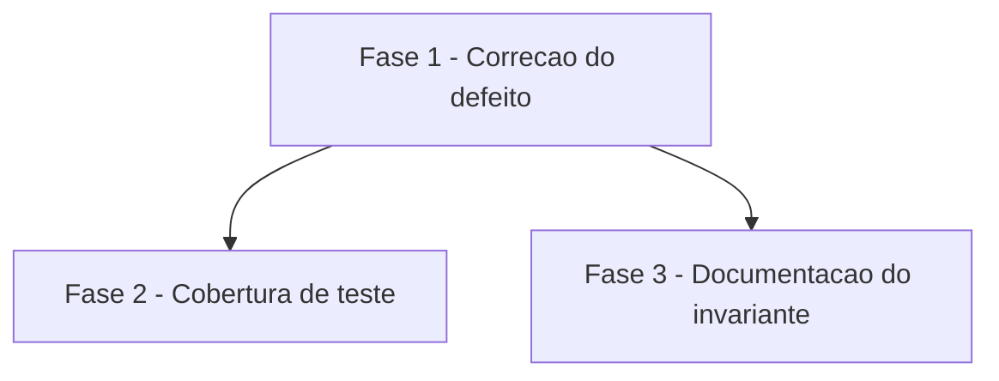

# Tarefas budget-resume-wallclock - Corrigir falso breach de wallclock na retomada feature-00c

Escopo: Corrigir a ordem de operacoes no "Loop principal de uma onda" de
`agente-00c-feature-orchestrator.md` para que `state-ondas.sh start` (inicio
de onda) ocorra ANTES do primeiro `budget.sh check` em toda retomada,
eliminando o estouro de orcamento falso medido contra o timestamp da onda
anterior ja encerrada — sem enfraquecer a deteccao de estouro genuino dentro
de uma onda de fato aberta, e sem alterar `agente-00c-orchestrator.md` (ja
imune) ou os scripts POSIX compartilhados `state-ondas.sh`/`budget.sh`.

**Legenda de status:**
- `[ ]` Pendente
- `[~]` Em andamento
- `[x]` Concluido
- `[!]` Bloqueado

**Legenda de criticidade:**
- `[C]` Critico - Impacto financeiro direto ou bloqueante
- `[A]` Alto - Funcionalidade essencial
- `[M]` Medio - Necessario mas sem urgencia imediata

---

## FASE 1 - Correcao do defeito (Loop principal de retomada)

### 1.1 Inserir `state-ondas.sh start` no Loop principal de uma onda `[A]` `[x]`

Ref: spec.md FR-001/FR-002/FR-003; plan.md §Summary + §Causa raiz; research.md Decision 1

- [x] 1.1.1 Editar `global/agents/agente-00c-feature-orchestrator.md`, secao
  "Loop principal de uma onda" (linha ~235): inserir um novo passo aditivo
  "3.bis — Iniciar onda: `state-ondas.sh start --state-dir <SD>`" entre o
  passo 3 (checar gatilhos de aborto) e o passo 4 (`budget.sh check`),
  seguindo a convencao ja usada no proprio documento para passos aditivos
  (`N.bis`/`N.ter`, ex: 4.bis, 4.ter, 7.bis, 10.bis existentes) — sem
  renumerar a sequencia 4-13 ja existente.
- [x] 1.1.2 No texto do novo passo 3.bis, registrar explicitamente que ele
  NAO deve ser executado quando a onda ja foi iniciada pela secao
  "Pre-flight da execucao (antes da PRIMEIRA onda)" (linha ~169): a
  bootstrap da 1a onda invoca `state-ondas.sh start` diretamente e nunca
  entra no Loop principal a partir do passo 1 na mesma invocacao — logo nao
  ha chamada dupla a `state-ondas.sh start` (que NAO e idempotente: cada
  chamada faz `append` em `.waves[]` — ver `state-ondas.sh` `_so_cmd_start`,
  ~linha 188-224). Deixar essa nota registrada no doc para nao regredir.
- [x] 1.1.3 Atualizar a nota da linha ~145-147 ("em retomadas, pulam-se 1-3
  e continua-se de `.next_instruction`") para refletir que a retomada agora
  entra no Loop principal e executa o novo passo 3.bis antes do budget
  check, em vez de ir direto ao passo 4 sem iniciar a onda.
- [x] 1.1.4 Rodar `./tests/run.sh test_state-ondas` e `./tests/run.sh
  test_budget` apos a edicao do documento e confirmar que nenhum scenario
  pre-existente regride (o doc do orquestrador nao e executado pelo harness
  diretamente, mas os scripts POSIX que ele invoca sao — esta rodada
  confirma que a mudanca de ordem na PROSA nao pressupoe nenhum
  comportamento diferente dos helpers).

---

## FASE 2 - Cobertura de teste (bug corrigido + nao-regressao)

### 2.1 Teste: retomada apos onda fechada nao gera breach falso `[A]` `[x]`

Ref: spec.md FR-004/SC-001/SC-003; checklists/requirements.md CHK007, CHK022,
CHK023; quickstart.md Scenario 1

- [x] 2.1.1 Adicionar `scenario_start_apos_onda_fechada_reseta_wallclock`
  (ou nome equivalente) em `tests/test_state-ondas.sh`: preparar um
  `state.json` com a ultima onda ENCERRADA (`termination_reason` preenchido,
  `finished_at` preenchido) e `.budgets.current_wave_start` apontando para
  um instante no passado alem do threshold (via `state-rw.sh set --field
  '.budgets.current_wave_start' --value '<timestamp-passado>'`, tecnica ja
  usada no harness). Chamar `state-ondas.sh start --state-dir <SD>` e
  assert que `.budgets.current_wave_start` foi regravado para "agora" (nao
  mais o timestamp herdado da onda anterior). Documentar no comentario do
  scenario que o estado "onda encerrada" preparado aqui representa
  uniformemente AMBOS os caminhos de retomada (pos-agendamento e
  pos-bloqueio-humano) — invariante resolvido em CHK007/CHK023 (ver FASE 3):
  `state-ondas.sh end --motivo-termino bloqueio_humano` (chamado antes de
  pausar por bloqueio humano) e o `reconcile-wave` do command pai (fecha
  onda deixada aberta antes de qualquer resume) garantem que a onda anterior
  SEMPRE esta fechada quando a retomada comeca, entao um unico scenario de
  "onda fechada" cobre os dois gatilhos de retomada.
- [x] 2.1.2 Adicionar `scenario_check_apos_start_pos_retomada_sem_falso_breach`
  em `tests/test_budget.sh`: sobre o `state.json` preparado em 2.1.1, apos o
  `state-ondas.sh start`, chamar `budget.sh check --state-dir <SD>` e assert
  exit 0 (sem linha `wallclock` de breach) — reusa a tecnica de
  `state-rw.sh set` sobre `.budgets.wallclock_threshold_seconds`/
  `current_wave_start` ja empregada em `scenario_wallclock_threshold_dispara_exit_1`
  (CHK022).
- [x] 2.1.3 Guard de nao-regressao (documenta o defeito antigo): no mesmo
  `state.json` preparado em 2.1.1, chamar `budget.sh check` SEM o
  `state-ondas.sh start` antes (ordem antiga do Loop) e assert que dispara
  breach (`wallclock\t<wc>\t<max>`, exit 1) — prova que a diferenca de
  comportamento esta na ORDEM das chamadas, nao numa mudanca de semantica
  dos helpers (nenhum dos dois scripts foi alterado).

### 2.2 Teste: breach legitimo dentro de onda aberta continua disparando `[A]` `[x]`

Ref: spec.md FR-002/SC-002; quickstart.md Scenario 2, Scenario 3;
checklists/requirements.md CHK015, CHK016

- [x] 2.2.1 Confirmar cobertura existente (ou estender/adicionar scenario)
  em `tests/test_budget.sh` para o caso "onda ABERTA" (apos
  `state-ondas.sh start`, sem `end`) com `current_wave_start` no passado
  alem do threshold: `budget.sh check` MUST continuar disparando exit 1.
  Se `scenario_wallclock_threshold_dispara_exit_1` ja cobre esse caso,
  adicionar comentario explicito distinguindo-o do cenario de onda FECHADA
  de 2.1 (para que a distincao nao se perca em manutencao futura).
- [x] 2.2.2 Adicionar scenario de edge case "retomada imediata" (delta
  ~zero, quickstart.md Scenario 3): fechar uma onda ha poucos segundos,
  executar a ordem corrigida (`state-ondas.sh start` seguido de
  `budget.sh check`) e assert exit 0 — sem diferenca de comportamento em
  relacao a uma retomada tardia (2.1.2).
- [x] 2.2.3 Rodar `./tests/run.sh test_state-ondas` e `./tests/run.sh
  test_budget` (suite completa desses dois arquivos) e confirmar 100%
  verde com os scenarios novos incluidos (SC-003).

---

## FASE 3 - Documentacao do invariante

### 3.1 Registrar invariante "resume sempre segue onda fechada" `[M]` `[x]`

Ref: checklists/requirements.md CHK007, CHK023

- [x] 3.1.1 Adicionar uma nota explicita em
  `global/agents/agente-00c-feature-orchestrator.md` (proxima ao novo passo
  3.bis introduzido em 1.1.1, ou na secao "Contrato de conclusao de turno")
  documentando o invariante: toda retomada de `feature-00c` ocorre apos a
  onda anterior estar FECHADA, seja via `state-ondas.sh end
  --motivo-termino bloqueio_humano` (linha ~1377, chamado ANTES de pausar
  por bloqueio humano) seja via `reconcile-wave` do command pai (rede de
  seguranca que fecha qualquer onda deixada aberta antes de qualquer
  resume). Explicitar que, por isso, os dois caminhos de retomada citados na
  User Story 1 da spec (agendamento entre ondas e resposta a bloqueio
  humano) reduzem ao MESMO caso — onda fechada + wallclock acumulado — e o
  fix do passo 3.bis os cobre uniformemente, sem tratamento especial por
  caminho.
- [x] 3.1.2 Referenciar o mesmo invariante em `plan.md` (secao §Causa raiz
  ou nota adicional ao final), apontando para a nota inserida em 3.1.1, para
  fechar o gap CHK007/CHK023 tambem no artefato de plano da feature.
- [x] 3.1.3 Atualizar `checklists/requirements.md`: marcar CHK007 e CHK023
  como `[x]`, substituindo a marca `{humano}` por `{auto}` com citacao da
  nota registrada em 3.1.1/3.1.2 (fecha o loop checklist → tasks →
  documentacao para esses dois items).
- [x] 3.1.4 Smoke check: `grep -n "onda fechada" global/agents/agente-00c-feature-orchestrator.md docs/specs/budget-resume-wallclock/plan.md`
  e confirmar que a nota aparece em ambos os arquivos (evita que a
  documentacao fique so na intencao da tarefa).

---

## Matriz de Dependencias

## Resumo Quantitativo

| Fase | Tarefas | Subtarefas | Criticidade |
|------|---------|------------|-------------|
| 1 - Correcao do defeito | 1 | 4 | A |
| 2 - Cobertura de teste | 2 | 6 | A |
| 3 - Documentacao do invariante | 1 | 4 | M |
| **Total** | **4** | **14** | - |

## Escopo Coberto

| Item | Descricao | Fase |
|------|-----------|------|
| FR-001/FR-002/FR-003 | Reordenar Loop principal de retomada em `agente-00c-feature-orchestrator.md` (inserir `state-ondas.sh start` antes do 1o `budget.sh check`) | 1 |
| FR-004/SC-001/SC-003 | Cobertura automatizada do cenario corrigido (retomada sem breach falso), representando ambos os caminhos de retomada | 2 |
| SC-002 | Guard de nao-regressao: breach legitimo dentro de onda aberta continua disparando | 2 |
| CHK022 | Tecnica de simulacao de tempo em teste (`state-rw.sh set` sobre `current_wave_start`/threshold) | 2 |
| CHK007/CHK023 | Invariante "resume sempre segue onda fechada" documentado no orquestrador + plan.md | 3 |

## Escopo Excluido

| Item | Descricao | Motivo |
|------|-----------|--------|
| `agente-00c-orchestrator.md` | Nenhuma alteracao neste arquivo | FR-003 — ja imune (inicia onda antes do budget check no seu proprio loop); fora de escopo |
| `state-ondas.sh` / `budget.sh` | Nenhuma alteracao aos scripts POSIX compartilhados | plan.md §Structure Decision — a fronteira da correcao e a sequencia do Loop no doc do orquestrador de feature, nao a semantica dos helpers (usados tambem pelo `agente-00c`) |
| Resetar `current_wave_start = null` em `_so_cmd_end` | Alternativa de design rejeitada | research.md Alternative (a) — mudaria contrato compartilhado com `agente-00c` (viola FR-003) e mascararia checks entre ondas |
| Tratar `wallclock=0` em `budget.sh check` quando onda fechada | Alternativa de design rejeitada | research.md Alternative (b) — misturaria logica de medicao com ciclo de vida da onda, arriscando enfraquecer deteccao de breach real (viola FR-002) |
| Outros gatilhos de encerramento (cycles, circular, drift, retro) | Nenhuma mudanca de comportamento | spec.md §Edge Cases — apenas o orcamento de wallclock esta sob correcao nesta feature |
