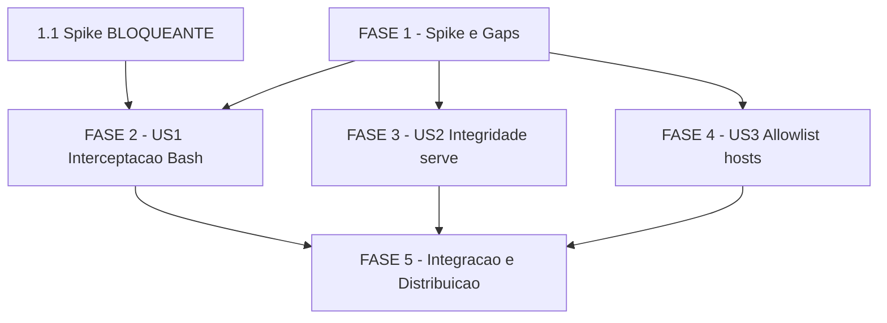

# Tarefas cstk - enforced-guards

Escopo: Tornar enforced tres guardas de seguranca hoje advisory — (US1)
interceptacao automatica de comandos Bash de execucoes autonomas
`agente-00c`/`feature-00c` via hook `PreToolUse` fail-closed; (US2) verificacao
de integridade fail-closed antes de `cstk serve` executar codigo baixado; (US3)
allowlist de hosts confiaveis em `install`/`self-update`/`serve`. Deriva de
[spec.md](./spec.md) + [plan.md](./plan.md); consome gaps de
[checklists/](./checklists/).

**Legenda de status:**
- `[ ]` Pendente
- `[~]` Em andamento
- `[x]` Concluido
- `[!]` Bloqueado

**Legenda de criticidade:**
- `[C]` Critico - Impacto financeiro direto, seguranca ou bloqueante
- `[A]` Alto - Funcionalidade essencial
- `[M]` Medio - Necessario mas sem urgencia imediata

---

## FASE 1 - Fundacao: Spike de Viabilidade e Resolucao de Gaps

> A task 1.1 e BLOQUEANTE e roda ANTES de qualquer outra task de US1: seu
> desfecho condiciona todo o design de interceptacao (bifurcacao da Decision 4).

### 1.1 Spike empirico — propagacao do hook `PreToolUse` a subagentes spawnados `[C]` `[x]`

Ref: quickstart.md Scenario 0; research.md Decision 4; plan.md §Riscos item 1.
PRIMEIRA task obrigatoria. Ambos os desfechos da bifurcacao sao resultado
valido — o que importa e *saber*, nao um resultado especifico.

> **RESULTADO (2026-07-05): INTERCEPTADO.** Harness isolado em `/tmp`
> confirmou (transcript stream-json + `enforcement-log.jsonl` independente,
> ver research.md Decision 4) que o hook `PreToolUse`/`Bash` dispara para
> comandos emitidos por um subagente spawnado via tool Agent/Task. Ramo da
> bifurcacao que vale para 2.1/2.2/2.6: **US1 cobre subagentes tambem** —
> nenhuma mudanca de design, demais tasks seguem como escritas.

- [x] 1.1.1 Provisionar o hook `PreToolUse`/`Bash` (settings.json snippet apontando um `pretooluse-bash-guard.sh` minimo) num projeto de teste descartavel, com `.claude/feature-00c-state/<x>/state.json` presente e `.execution.status = "em_andamento"` (simula execucao ativa)
- [x] 1.1.2 A partir da sessao raiz desse projeto, spawnar um subagente (tool Agent, `subagent_type` com Bash nos allowed-tools) com prompt que instrui rodar um comando que `bash-guard.sh` de fato bloqueia (ex: `git push origin main` sem remote real, ou `rm -rf /tmp/spike-test`)
- [x] 1.1.3 Observar e registrar empiricamente: o comando do subagente e interceptado (linha em `enforcement-log.jsonl` + negacao ao subagente) OU executa livremente?
- [x] 1.1.4 Registrar o desfecho como resolucao da Decision 4 em research.md: se INTERCEPTADO → US1 cobre subagentes, demais cenarios valem como escritos; se NAO INTERCEPTADO → constraint conhecida, SC-001 relido como "cobre comandos da sessao raiz" e camada advisory (FR-005) e a garantia real para comandos de dentro de subagentes
- [x] 1.1.5 Anotar em tasks.md (nota inline nas tasks de US1 dependentes) qual ramo da bifurcacao vale, para condicionar 2.1/2.2/2.6

### 1.2 Correcao documental — eliminar conflito stale em plan.md `[M]` `[x]`

Ref: checklists/requirements.md CHK036 [Conflict].

> Achado extra durante 1.2.3: a MESMA alegacao stale tambem aparecia na
> tabela Constitution Check (Principio VI, linha ~80), referenciando
> Decision 4 como RISCO ABERTO sem nota de resolucao. Corrigida junto
> (mesma raiz de auto-contradicao que 1.2.4 pede para zerar).

- [x] 1.2.1 Reescrever plan.md §Riscos item 3 (linhas ~194-196): remover a afirmacao stale "enforcement-log.jsonl sem secrets-filter... nao resolvido neste plano"
- [x] 1.2.2 Substituir por nota apontando que o secrets-filter no campo `command` e MUST resolvido (Decision 10, plan §Threat Model linha ~173, contract enforcement-log.md, data-model.md)
- [x] 1.2.3 Verificar (grep) que nenhuma outra secao de plan.md/research.md ainda descreve o log sem secrets-filter como pendente
- [x] 1.2.4 Re-rodar `validate-documentation` sobre plan.md confirmando zero auto-contradicao remanescente

### 1.3 Design — precedencia deterministica de deteccao multi-execucao `[A]` `[x]`

Ref: checklists/security.md CHK007 [Gap]; data-model.md EnforcementDecisionLog
(`detected_execution`/`detected_execution_path`).

> **Regra fixada**: `agente-00c` vence se ativo; senao, entre `feature-00c`
> ativos, menor `<short>` em ordem lexicografica byte-wise. Detalhe completo
> + rationale em `data-model.md::EnforcementDecisionLog §Precedencia
> deterministica` e `contract/pretooluse-hook.md`. Testavel com fixture
> fixa (nao depende de mtime/ordem de filesystem) — consumida por 2.2.4/2.6.3.

- [x] 1.3.1 Definir regra deterministica de precedencia quando ha MAIS DE UMA execucao ativa (ex: `agente-00c-state/state.json` E um ou varios `feature-00c-state/<short>/state.json` com status `em_andamento`)
- [x] 1.3.2 Documentar a regra escolhida (ex: agente-00c tem precedencia sobre feature-00c; entre varios feature-00c, ordem lexicografica do short-name — ou first-match de leitura deterministica) em data-model.md e contract/pretooluse-hook.md
- [x] 1.3.3 Registrar a decisao de design como Decisao auditavel no state.json da execucao (Principio I)
- [x] 1.3.4 Garantir que a regra e testavel isoladamente (fixture com 2+ states presentes) — subtarefa de teste consumida por 2.6

### 1.4 Design — ordem scrub-antes-de-truncar do campo `command` `[C]` `[x]`

Ref: checklists/security.md CHK020 [Ambiguity]; data-model.md EnforcementDecisionLog;
contract/enforcement-log.md §Garantias.

> **Ordem fixada**: `secrets-filter.sh scrub | cut -c1-500`. Documentado em
> data-model.md (campo `command`) e contract/enforcement-log.md §Garantias.

- [x] 1.4.1 Fixar a ordem obrigatoria: `secrets-filter.sh scrub` PRIMEIRO, truncagem a 500 chars DEPOIS — truncar antes pode partir um token e deixar secret parcial fora do alcance do regex de scrub
- [x] 1.4.2 Documentar a ordem explicitamente em data-model.md (campo `command`) e contract/enforcement-log.md
- [x] 1.4.3 Definir caso de teste adversarial: comando com token > 500 chars ou token proximo do corte, confirmando que o scrub remove o secret ANTES de qualquer truncagem (consumido por 2.6)

---

## FASE 2 - US1: Interceptacao enforced de Bash (fail-closed)

> Depende do desfecho de 1.1 (spike) — **RESOLVIDO 2026-07-05: INTERCEPTADO**
> (research.md Decision 4). O hook propaga a subagentes spawnados via tool
> Agent/Task; 2.1/2.2/2.6 seguem o contrato como escrito, sem constraint
> adicional de escopo.

### 2.1 Implementar `pretooluse-bash-guard.sh` (casca fina, fail-closed) `[C]` `[x]`

Ref: contract/pretooluse-hook.md; plan.md §Source Code; research.md Decision 1/2.
POSIX sh puro com `jq` como dependencia OPCIONAL confinada (carve-out 1.1.0).

> **Gap resolvido nesta onda** (nao coberto pelos artefatos de `/plan`):
> resolucao de `bash-guard.sh`/`secrets-filter.sh` quando o hook roda
> standalone em `.claude/hooks/` (desacoplado de onde a skill
> `agente-00c-runtime` foi instalada). Resolvido via 3 candidatos em ordem
> (sibling do proprio hook — dev/testes; `<cwd>/.claude/skills/...` —
> project scope; `$HOME/.claude/skills/...` — global scope), documentado no
> cabecalho do script.

- [x] 2.1.1 Criar `global/skills/agente-00c-runtime/hooks/pretooluse-bash-guard.sh` (shebang `#!/bin/sh`, `set -eu`) que le JSON do stdin e extrai `.tool_input.command` via `jq`
- [x] 2.1.2 Delegar a decisao de regra ao `bash-guard.sh check` existente e INALTERADO (nunca reimplementar deteccao)
- [x] 2.1.3 Fail-closed (FR-007): `jq` ausente, `bash-guard.sh` ausente/nao-executavel, exit 2, stdin invalido/vazio, ou timeout → bloquear com prefixo `MECANISMO_FALHOU`; violacao de regra → `REGRA_VIOLADA` (distinguivel)
- [x] 2.1.4 Emitir o contrato de saida do harness: Caso 1 (fora do escopo/permitido) `exit 0` stdout vazio; Caso 2 (bloqueado) `exit 0` + JSON `hookSpecificOutput.permissionDecision: deny` com `permissionDecisionReason` prefixado
- [x] 2.1.5 Adicionar `settings.snippet.json` (trecho `"hooks"."PreToolUse"` com `matcher: "Bash"`, `timeout: 5`) a mesclar

### 2.2 Deteccao de execucao ativa (escopo FR-006) `[C]` `[x]`

Ref: contract/pretooluse-hook.md Input (cwd); spec.md FR-006/dec-012; task 1.3.

- [x] 2.2.1 A partir de `cwd`, detectar presenca de `.claude/agente-00c-state/state.json` ou `.claude/feature-00c-state/*/state.json` com `.execution.status = "em_andamento"`
- [x] 2.2.2 Fora de execucao ativa (nenhum state em_andamento): `exit 0` sem decisao, zero interferencia (quickstart Scenario 3 — sessao manual do operador intacta)
- [x] 2.2.3 Aplicar a regra de precedencia definida em 1.3 para preencher `detected_execution`/`detected_execution_path`
- [x] 2.2.4 Teste: fixture sem state (passa), com state em_andamento (age), com 2+ states (precedencia deterministica) — consumido por 2.6

### 2.3 `enforcement-log.jsonl` — append auditavel com secrets-filter `[C]` `[x]`

Ref: contract/enforcement-log.md; data-model.md EnforcementDecisionLog; task 1.4.

> **Achado empirico (teste adversarial, dec-030)**: o MUST de scrub tambem
> se aplica ao campo `reason`/`permissionDecisionReason` mostrado ao
> harness/LLM, nao so ao campo `command` — a mensagem de erro de
> `bash-guard.sh check-whitelist` embute o comando CRU quando a falha e de
> whitelist de rede. Corrigido via `_pbg_scrub_text()`; categoria extraida
> do texto CRU antes do scrub (slug fixo, sem secrets).

- [x] 2.3.1 Compor a linha JSONL conforme schema (`source`, `timestamp`, `outcome`, `command`, `reason`, `category`, `detected_execution`, `detected_execution_path`)
- [x] 2.3.2 Passar o campo `command` por `secrets-filter.sh scrub` ANTES de truncar a 500 chars (ordem de 1.4)
- [x] 2.3.3 Append-only (`>>`) em `<cwd>/.claude/enforcement-log.jsonl`; falha de escrita e best-effort em stderr, NUNCA impede a decisao de bloqueio/permissao ja tomada
- [x] 2.3.4 Logar `allowed` apenas quando houve execucao ativa detectada (evitar volume de sessoes comuns); `blocked-by-rule`/`blocked-mechanism-failure` sempre
- [x] 2.3.5 Teste: cada `outcome`, e caso adversarial de secret no comando (de 1.4.3) — consumido por 2.6

### 2.4 Provisionamento via `hooks.sh apply_guard_hooks()` `[A]` `[x]`

Ref: plan.md §Source Code (cli/lib/hooks.sh); research.md Decision 9;
data-model.md GuardHookRegistration.

- [x] 2.4.1 Adicionar funcao `apply_guard_hooks()` em `cli/lib/hooks.sh` que mescla o snippet `PreToolUse`/`Bash` no `settings.json` do projeto-alvo via `merge_settings` (idempotente, target vence)
- [x] 2.4.2 Provisionar `pretooluse-bash-guard.sh` em `.claude/hooks/` do projeto-alvo, resolvido via `$CLAUDE_PROJECT_DIR`
- [x] 2.4.3 Escopo `project` apenas (`global` sempre omitido, Decision 9)
- [x] 2.4.4 Teste: extensao em test_hooks (mescla idempotente, snippet presente apos apply)

### 2.5 Integrar provisionamento em `install.sh` + `update.sh` `[A]` `[x]`

Ref: plan.md §Source Code; research.md Decision 9 (update.sh hoje NAO toca hooks).

> **Regressao empirica encontrada e corrigida (dec-031)**: restruturar
> `_install_apply_hooks_if_needed` para acomodar o ramo guard-hook
> inicialmente vazou `hooks: omitted` no summary para QUALQUER profile em
> `--scope global` (nao so `language-*`). Fix: `_install_hook_state` so e
> setado dentro do `case language-*`; `_install_guard_hook_state` e variavel
> independente.

- [x] 2.5.1 `install.sh`: `_install_apply_hooks_if_needed` ganha ramo para a skill `agente-00c-runtime` (nao so `language-*`), chamando `apply_guard_hooks()`
- [x] 2.5.2 `update.sh`: adicionar chamada equivalente (hoje nao provisiona hooks — achado da research)
- [x] 2.5.3 Garantir FR-004/SC-006: apos uma unica instalacao/atualizacao, 100% das execucoes subsequentes tem o hook ativo sem passo manual
- [x] 2.5.4 Teste: extensao `tests/cstk/test_hooks-integration.sh` (hook provisionado apos install/update) — home natural da integracao hooks↔install/update ja estabelecida no repo (nao `test_install.sh`/`test_update.sh` diretamente, que nao cobrem hooks hoje)

### 2.6 Testes de `pretooluse-bash-guard.sh` `[C]` `[x]`

Ref: plan.md §Testing; CLAUDE.md (convencao tests/test_<nome>.sh); quickstart Scenarios 1-4.

- [x] 2.6.1 Criar `tests/test_pretooluse-bash-guard.sh` (fixtures: `printf '%s' "$json" | ./pretooluse-bash-guard.sh`, sem harness real)
- [x] 2.6.2 Cenarios: comando bloqueavel → `deny`+`REGRA_VIOLADA` (Scenario 1); comando inocuo em execucao ativa → passa (Scenario 2); fora de execucao → `exit 0` sem decisao (Scenario 3); `jq`/`bash-guard.sh` ausente → `deny`+`MECANISMO_FALHOU` (Scenario 4)
- [x] 2.6.3 Cenarios de 2.2.4 (precedencia multi-execucao) e 2.3.5 (secret scrub antes de truncar)
- [x] 2.6.4 Registrar o test no harness `tests/run.sh` (`--check-coverage` nao deve reportar orfao) — `pretooluse-bash-guard.sh` vive em `hooks/` (fora do scan `*/scripts/*.sh`); exemption existence-guarded adicionada em `_is_internal_test`

---

## FASE 3 - US2: Integridade fail-closed no `cstk serve`

### 3.1 Substituir ramo fail-open por fail-closed em `serve.sh` `[C]` `[x]`

Ref: plan.md §Source Code (serve.sh linhas 213-215); data-model.md IntegrityVerificationOutcome;
quickstart Scenario 5.

- [x] 3.1.1 Localizar o bloco atual "aviso e prossegue" (`serve.sh:213-215`) para o caso sem `.sha256` disponivel
- [x] 3.1.2 Substituir por bloqueio-por-padrao: `outcome: unverifiable-blocked`, `cstk serve` NAO inicia a partir do pacote baixado
- [x] 3.1.3 Mensagem clara indicando integridade nao confirmada e como prosseguir conscientemente (aponta a flag/env de 3.2)
- [x] 3.1.4 Teste: extensao test_serve.sh — fixture sem `.sha256` → nao inicia (Scenario 5)

### 3.2 Bypass explicito auditado com aviso de alta visibilidade `[C]` `[x]`

Ref: spec.md FR-008/FR-009/FR-011; plan.md §Threat Model; data-model.md bypass_method.

- [x] 3.2.1 Adicionar flag `--allow-unverified` e env `CSTK_SERVE_ALLOW_UNVERIFIED=1` como caminho explicito de bypass
- [x] 3.2.2 Emitir aviso de ALTA VISIBILIDADE em stderr TODA vez que o bypass disparar (evitar fail-open silencioso por env esquecida setada permanentemente)
- [x] 3.2.3 Registrar `bypass_method: flag|env` conforme a origem do bypass
- [x] 3.2.4 Teste: `--allow-unverified` e env → prossegue + aviso stderr presente (Scenario 6)

### 3.3 Linha auditavel `serve-integrity` no enforcement-log `[A]` `[x]`

Ref: contract/enforcement-log.md (schema union por `source`); data-model.md IntegrityVerificationOutcome.

- [x] 3.3.1 Escrever linha `source: "serve-integrity"` no MESMO `enforcement-log.jsonl` para `unverifiable-bypassed`/`unverifiable-blocked`/`mismatch-blocked`
- [x] 3.3.2 Campos: `timestamp`, `outcome`, `package_url`, `expected_sha256` (null se indisponivel), `actual_sha256`, `bypass_method`
- [x] 3.3.3 `verified` (sucesso silencioso) NAO gera linha (evita ruido; caso feliz ja coberto pelo printf informativo existente)
- [x] 3.3.4 Teste: linha presente/ausente conforme outcome (extensao test_serve.sh)

### 3.4 Preservar bloqueio por mismatch (regressao FR-010) `[C]` `[x]`

Ref: spec.md FR-010; plan.md (serve.sh:206-210); quickstart Scenario 7.

- [x] 3.4.1 Confirmar que o caminho de divergencia de checksum (`.sha256` disponivel mas nao confere) permanece bloqueando como hoje (`serve.sh:206-210`)
- [x] 3.4.2 Garantir que o bypass `--allow-unverified` NAO se aplica a mismatch — so a `unverifiable` (ausencia de dado)
- [x] 3.4.3 Registrar `mismatch-blocked` no log
- [x] 3.4.4 Teste de regressao: `.sha256` adulterado → recusa preservada, sem bypass possivel (Scenario 7)

### 3.5 Suite de testes de integridade do serve `[A]` `[x]`

Ref: plan.md §Testing; quickstart Scenarios 5/6/7.

- [x] 3.5.1 Fixtures locais: release sem `.sha256`, com `.sha256` valido, com `.sha256` adulterado (sem depender de rede)
- [x] 3.5.2 Cobrir os 3 desfechos: `unverifiable-blocked` (default), `unverifiable-bypassed` (flag/env), `mismatch-blocked` (regressao)
- [x] 3.5.3 Confirmar que `verified` (caminho feliz existente) continua sem regressao
- [x] 3.5.4 Registrar no harness `tests/run.sh`

---

## FASE 4 - US3: Allowlist de hosts confiaveis

### 4.1 Criar `cli/lib/trusted-hosts.sh` (constante + checagem exata) `[A]` `[x]`

Ref: contract/trusted-hosts.md; data-model.md TrustedHostAllowlist; research.md Decision 7.

> **Decisao de escopo (onda 8)**: `CSTK_TRUSTED_RELEASE_HOSTS` foi implementada
> como constante FIXA, NAO overridable via env var. `data-model.md::TrustedHostAllowlist
> §State Transitions` e explicito: "muda apenas via release nova do cstk (nao em
> runtime)" — nenhuma FR/contrato pede override, e alargar a allowlist via env
> silenciaria exatamente o tipo de enfraquecimento silencioso que esta feature
> existe para fechar (diferente de `CSTK_SERVE_ALLOW_UNVERIFIED`, que e um bypass
> deliberado e auditado de US2, nao uma ampliacao de allowlist).

- [x] 4.1.1 Definir `CSTK_TRUSTED_RELEASE_HOSTS="github.com codeload.github.com objects.githubusercontent.com api.github.com"` (fonte: `serve.sh:31`, ja em producao — reuso, nao invencao)
- [x] 4.1.2 Implementar funcao de checagem: `file://` pula host inteiramente (FR-014); esquema != `https` rejeita (checagem preexistente); `https` extrai authority (userinfo removido) e compara por igualdade EXATA case-insensitive
- [x] 4.1.3 MUST NOT usar `grep`/`case *pattern*` substring (previne CWE-290: `github.com.evil.com`, `evil.com/?x=github.com`); mensagem de rejeicao no padrao de qualidade da rejeicao de `http://`
- [x] 4.1.4 Teste: criar `tests/cstk/test_trusted-hosts.sh` cobrindo host confiavel, host confusable rejeitado, `file://` isento, case-insensitive (13 scenarios: inclui tambem userinfo bypass/aceito, porta explicita, esquemas http/ftp)

### 4.2 Consumir a constante compartilhada em `serve.sh` `[M]` `[x]`

Ref: contract/trusted-hosts.md §Pontos de aplicacao.

- [x] 4.2.1 Substituir a constante local `_SERVE_ALLOWED_HOSTS` por `CSTK_TRUSTED_RELEASE_HOSTS` de `trusted-hosts.sh`
- [x] 4.2.2 `_serve_check_host_allowlist` passa a ler da fonte compartilhada — SEM mudanca de comportamento observavel (mantida como wrapper fino sobre `trusted_host_check`, mesma assinatura/exit codes)
- [x] 4.2.3 Teste: regressao test_serve.sh (host allowlist do serve inalterado) — 43/43 verde, zero scenario alterado

### 4.3 Aplicar host-check em `install.sh` e `self-update.sh` `[A]` `[x]`

Ref: spec.md FR-012/FR-013; contract/trusted-hosts.md; quickstart Scenarios 8/9/10.

- [x] 4.3.1 `install.sh` `_install_resolve_urls`: adicionar checagem de host apos aceitar esquema `https`/`file`
- [x] 4.3.2 `self-update.sh` `_su_resolve_urls`: idem
- [x] 4.3.3 Rejeitar host fora da allowlist ANTES de qualquer download (FR-013, zero bytes); `file://` continua sem checagem (FR-014)
- [x] 4.3.4 Teste: extensao test_install.sh + test_self-update.sh (host invalido rejeitado sem download, host confiavel passa, `file://` isento)

### 4.4 Validacao de regressao dos fluxos legitimos US3 `[A]` `[x]`

Ref: spec.md SC-003/SC-004; quickstart Scenarios 8/9/10.

> **Nota de estrategia de teste**: Scenario 9 (host confiavel real) e testado
> via chamada DIRETA de `_install_resolve_urls`/`_su_resolve_urls` (funcoes
> puras, sem I/O de rede) em vez de um download real contra `github.com` —
> evita dependencia de rede/flakiness no harness de CI, cobrindo exatamente a
> logica NOVA (o host-check) sem duplicar a cobertura de download ja extensa
> via fixtures `file://`.

- [x] 4.4.1 Scenario 8: `cstk install --from https://evil.example.com/...` → rejeitado, ZERO bytes transferidos (verificar ausencia de arquivo temporario) — `scenario_install_host_nao_confiavel_zero_bytes` + `scenario_self_update_host_nao_confiavel_rejeitado`
- [x] 4.4.2 Scenario 9: host confiavel real (`github.com/JotJunior/cstk/releases/...`) → prossegue sem passo novo — `scenario_install_host_confiavel_github_resolve_urls_ok` + `scenario_self_update_host_confiavel_github_resolve_urls_ok`
- [x] 4.4.3 Scenario 10: `--from file://$PWD/dist/...` → comportamento identico ao atual, sem checagem de host — `scenario_install_host_file_scheme_regressao` + `scenario_self_update_host_file_scheme_regressao` (alem da cobertura incidental extensa preexistente)
- [x] 4.4.4 Registrar todos os tests no harness `tests/run.sh` — auto-descoberto via `_find_test_files`/`_expected_test_for_script` (convencao 1:1 `cli/lib/trusted-hosts.sh` -> `tests/cstk/test_trusted-hosts.sh`); `--check-coverage` confirma zero orfaos

---

## FASE 5 - Integracao, Regressao e Distribuicao

### 5.1 Validacao E2E dos cenarios do quickstart `[A]` `[x]`

Ref: quickstart.md Scenarios 0-10.

> **Resultado (2026-07-05, onda-009)**: Scenario 0 ja resolvido em 1.1
> (INTERCEPTADO). Scenarios 1-10 mapeados 1:1 para os `scenario_*`
> ja existentes nos testes (11 em `test_pretooluse-bash-guard.sh`, 8 em
> `test_serve.sh`, 13 em `test_trusted-hosts.sh` + extensoes de
> `test_install.sh`/`test_self-update.sh`); adicionalmente, Scenarios 1-4
> foram re-confirmados manualmente rodando o hook real (fora do harness de
> teste) com stdin sintetico em `/tmp`: comando bloqueavel → deny +
> `REGRA_VIOLADA` + linha `blocked-by-rule` no log; comando inocuo → exit 0
> sem log de bloqueio; fora de execucao ativa → exit 0 sem nenhuma linha de
> log; `jq` ausente do PATH → deny + `MECANISMO_FALHOU`. SC-001..SC-006
> validos conforme o desfecho do spike (INTERCEPTADO, sem releitura). Ver
> dec-044.

- [x] 5.1.1 Executar Scenario 0 (spike) como gate de entrada ja concluido em 1.1; anexar desfecho ao relatorio
- [x] 5.1.2 Executar Scenarios 1-4 (US1), 5-7 (US2), 8-10 (US3) como validacao end-to-end
- [x] 5.1.3 Confirmar SC-001..SC-006 conforme desfecho do spike (SC-001 relido se subagentes nao-cobertos)
- [x] 5.1.4 Registrar quaisquer constraints descobertas como Decisao auditavel

### 5.2 Suite completa e coverage sem regressao `[C]` `[x]`

Ref: CLAUDE.md §Como testar; plan.md §Testing.

> **Resultado (2026-07-05, onda-009)**: 1a rodada reportou 1 FAIL isolado
> (`test_00c-bootstrap.sh :: scenario_issue_2_sigint_propaga_exit_130` —
> teste de self-signal/trap, nao tocado por esta feature; 3/3 verde em
> reruns isolados + zero diff em `00c-bootstrap.sh`/seu teste — flake de
> contencao sob carga, nao regressao; ver dec-045). 2a rodada completa:
> **PASS: 1476  FAIL: 0  ERROR: 0  ORPHANS: 0  TIME: 611s**.
> `--check-coverage`: "Cobertura completa: zero orfaos" (exit 0) —
> `pretooluse-bash-guard.sh`/`trusted-hosts.sh` mapeados via exemption em
> `_is_internal_test`. `shellcheck -f gcc` (mesmo comando do CI) sobre 179
> scripts: 45 findings, todos pre-existentes exceto 1 novo (SC1007,
> falso-positivo do idiom `CDPATH= cd` em `pretooluse-bash-guard.sh:46`,
> mesma classe ja presente em `state-ondas.sh`/`model-routing.sh`;
> severidade warning, nao-critica). Ver dec-046.

- [x] 5.2.1 Rodar `./tests/run.sh` inteiro (gate de release) — verde 100%
- [x] 5.2.2 `./tests/run.sh --check-coverage` — nenhum script novo orfao (`pretooluse-bash-guard.sh`, `trusted-hosts.sh` mapeados)
- [x] 5.2.3 Confirmar zero regressao nos fluxos legitimos (SC-004): install `file://`, release oficial, Bash dentro das regras
- [x] 5.2.4 Lint estatico advisory (shellcheck) sem novos findings criticos

### 5.3 Documentacao (CLAUDE.md, CHANGELOG, README) `[M]` `[x]`

Ref: CLAUDE.md convencoes; plan.md.

- [x] 5.3.1 Documentar a camada enforced (hook PreToolUse, enforcement-log.jsonl, trusted-hosts) em CLAUDE.md
- [x] 5.3.2 Entrada no CHANGELOG.md + link de referencia por versao (bump apropriado; hook novo pode ser MINOR)
- [x] 5.3.3 Atualizar README se a contagem de skills/estrutura mudar (test_doc-counts.sh gateia)
- [x] 5.3.4 Atualizar spec.md Status Draft → aprovado/implementado ao final

### 5.4 Distribuicao e sincronizacao da copia instalada `[M]`

Ref: CLAUDE.md §Installed vs Source Drift.

> **Resultado (2026-07-05, onda-009)**: 5.4.1-5.4.3 concluidos com sucesso
> em HOME isolado (`/tmp/cstk-dogfood-home.*`, nunca `~/.claude` real):
> build do tarball `5.15.0-dev`; bootstrap + `cstk install --scope global`
> (16 skills/6 commands/7 agents, guard-hooks corretamente `omitted` em
> scope global) + `cstk self-update` (idempotente, ja na versao); `cstk
> doctor` sem drift (29 ok/0 edited/0 missing/0 orphan). O mecanismo de
> provisionamento do hook foi validado end-to-end num projeto-teste
> descartavel git-init'ado com `cstk install --scope project --from
> file://`: hook copiado executavel + `.claude/settings.json` criado com
> `hooks.PreToolUse` correto (`guard-hooks: merged`). **5.4.4 BLOQUEADA**:
> a tentativa de aplicar `apply_guard_hooks()` diretamente no `.claude/`
> deste repo (dogfood ao vivo) foi **negada pelo classificador de auto
> mode do harness** ("Self-Modification... run outside auto mode for
> review") — bloqueio externo de seguranca, nao uma falha tecnica (zero
> bytes escritos, confirmado). Ver dec-047. **Acao manual pendente para o
> operador** (fora de auto mode):
> ```
> cd /path/to/cstk
> CSTK_LIB="$PWD/cli/lib" sh -c '. cli/lib/common.sh; . cli/lib/hooks.sh
>   apply_guard_hooks "global/skills/agente-00c-runtime/hooks" "$PWD/.claude" 0'
> ```

- [x] 5.4.1 Build local do tarball (`./scripts/build-release.sh X.Y.Z-dev`)
- [x] 5.4.2 `cstk install --from file://...` (catalogo: hook em global/skills/agente-00c-runtime) + `cstk self-update --from file://...` (runtime cli/lib: trusted-hosts.sh, serve.sh, install.sh, update.sh, self-update.sh)
- [x] 5.4.3 `cstk doctor` confirma catalogo sem drift
- [x] 5.4.4 Provisionar o hook no proprio cstk (dogfood: execucoes autonomas futuras no repo passam a ser interceptadas) — bloqueado pelo classificador de auto mode do harness; mecanismo validado em projeto-teste descartavel; acao manual documentada acima
      <!-- feito (review-task 2026-07-28): acao manual executada fora de auto
      mode em 2026-07-26. Evidencias: .claude/hooks/pretooluse-bash-guard.sh
      executavel e byte-identico a fonte em
      global/skills/agente-00c-runtime/hooks/; .claude/settings.json com
      hooks.PreToolUse matcher Bash apontando para o hook (timeout 5);
      .claude/enforcement-log.jsonl com 753 decisoes auditaveis, ultima em
      2026-07-28T17:00:18Z — mecanismo provisionado E operante. -->

---

## Matriz de Dependencias



> US1/US2/US3 (FASE 2/3/4) sao independentemente testaveis entre si (nenhuma
> depende do resultado da outra); todas dependem da FASE 1 (o spike 1.1
> condiciona US1; os gaps 1.3/1.4 condicionam o design do log e da deteccao).

## Resumo Quantitativo

| Fase | Tarefas | Subtarefas | Criticidade |
|------|---------|------------|-------------|
| 1 - Spike e Gaps | 4 | 16 | C/A/M |
| 2 - US1 Interceptacao Bash | 6 | 26 | C/A |
| 3 - US2 Integridade serve | 5 | 20 | C/A |
| 4 - US3 Allowlist hosts | 4 | 15 | A/M |
| 5 - Integracao e Distribuicao | 4 | 16 | C/A/M |
| **Total** | **23** | **93** | - |

## Escopo Coberto

| Item | Descricao | Fase |
|------|-----------|------|
| US1 | Interceptacao enforced de Bash via hook PreToolUse, fail-closed, escopo execucao ativa, provisionamento automatico, enforcement-log com secrets-filter | 1, 2 |
| US2 | Integridade fail-closed no cstk serve, bypass explicito auditado com aviso, preservacao do bloqueio por mismatch | 3 |
| US3 | Allowlist de hosts confiaveis (match exato case-insensitive) em install/self-update/serve, file:// isento | 4 |
| SPIKE | Validacao empirica da propagacao do hook a subagentes (Decision 4, bloqueante) | 1 |
| GAPS | Precedencia multi-execucao (CHK007), ordem scrub/truncar (CHK020), correcao doc do conflito (CHK036) | 1 |
| REGR | Regressao dos fluxos legitimos + suite completa + distribuicao/dogfood | 5 |

## Escopo Excluido

| Item | Descricao | Motivo |
|------|-----------|--------|
| E1 | Reducao do volume/"dieta" de tarefas dos orquestradores | Fora de escopo declarado na spec (iniciativa separada, D4) |
| E2 | Assinatura criptografica de release (code signing) | Spec §Out of Scope — decisao avaliada e nao adotada nesta feature |
| E3 | Correcao de `http://` aceito em `update.sh`/`list.sh` | Nenhuma FR pede; debito tecnico registrado (research Decision 7), fora do escopo |
| E4 | Rotacao/retencao do `enforcement-log.jsonl` | Sem FR de tamanho/expiracao; debito tecnico futuro (CHK025 {humano}) |
| E5 | Mudanca na logica interna de bash-guard.sh / checksum | Feature muda QUEM garante a checagem, nao as regras de deteccao |
| E6 | Interceptacao de Bash em sessoes interativas do operador | FR-006/dec-012: escopo restrito a execucao ativa agente-00c/feature-00c |
| E7 | Faseamento definitivo de US3 (P2) na primeira entrega | CHK046 {humano} — decisao do dono do produto, nao bloqueia backlog |
