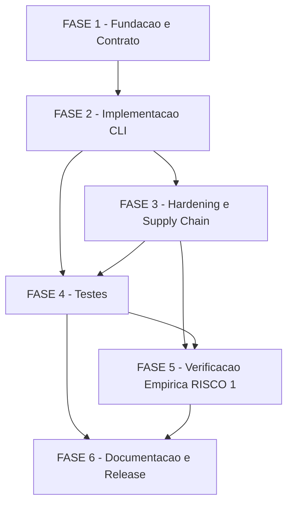

# Tarefas panel-docker - Modo Docker opt-in do cstk serve

Escopo: decompor a feature `panel-docker` (spec.md + plan.md + research.md + data-model.md +
contracts/cli-docker-mode.md + quickstart.md) em backlog executavel: assets Docker (Dockerfile +
entrypoint + encaminhador in-container), o caminho `--docker` no CLI (`cli/lib/serve.sh` +
`cli/lib/serve-docker.sh` confinado), hardening e supply chain da imagem, testes (extensao de
`tests/cstk/test_serve.sh`), verificacao empirica OBRIGATORIA do RISCO #1 (leitura WAL read-only
sobre mount `:ro`) e documentacao/release. Inclui os 7 gaps abertos das tabelas "Follow-up
obrigatorio" de `checklists/security.md` e `checklists/infra.md` como tarefas ou criterios de
aceite explicitos.

**Legenda de status:**
- `[ ]` Pendente
- `[~]` Em andamento
- `[x]` Concluido
- `[!]` Bloqueado

**Legenda de criticidade:**
- `[C]` Critico - Impacto financeiro, regulatorio ou de seguranca (integridade, hardening,
  fail-closed, RISCO #1)
- `[A]` Alto - Funcionalidade core sem a qual o modo Docker nao opera
- `[M]` Medio - Necessario mas adiavel sem impacto imediato (documentacao, help text, changelog)

## Pre-condicoes Humanas Pendentes (antes de `/execute-task`)

Estes 4 itens sao marcados `{humano}` nos checklists — NAO sao resolvidos por este backlog,
apenas documentados como pre-condicoes aguardando o dono do produto:

- **security CHK018** - aceitar a exposicao read-only dos `knowledge.db.bak-*` siblings (mount do
  diretorio inteiro), ou investir em mount de escopo mais estreito.
- **security CHK020** - confirmar que os 4 achados MEDIUM do gate `owasp-security` (rebaixados a
  defaults de hardening) sao apetite de risco aceitavel antes do primeiro release do modo Docker.
- **infra CHK019** - confirmar que P3 e a prioridade correta para a User Story 4 (idempotencia),
  dado que a ausencia dela deixa o usuario com erro cru de runtime ate um fix futuro.
- **infra CHK020** - definir (ou dispensar explicitamente) um Success Criterion de performance
  para o tempo de primeira execucao do modo Docker (download + `npm ci` + `npm run build` dentro
  do container).

---

## FASE 1 - Fundacao e Contrato (Assets Docker)

### 1.1 Confinamento do modo Docker em arquivo dedicado `[A]`

Ref: plan.md Structure Decision (carve-out Principio II condicao b); Complexity Tracking item (b)

- [x] 1.1.1 Criar `cli/lib/serve-docker.sh` (esqueleto sourced condicionalmente por
  `cli/lib/serve.sh` quando `--docker`) — nenhuma outra mencao a `docker` fora deste arquivo,
  exceto o parse da flag em `serve.sh`
- [x] 1.1.2 Definir a interface de entrada de `serve-docker.sh` (ex.: funcao `_serve_docker_main`
  recebendo os mesmos parametros ja parseados por `serve_main`: porta, host, update, reinstall,
  allow_unverified, bypass_method)
- [x] 1.1.3 Confirmar via grep que `docker` so aparece em `cli/lib/serve-docker.sh` fora do parse
  da flag em `serve.sh` — criterio objetivo do carve-out (b). Operacionalizado como regressao
  automatizada (`scenario_docker_mentions_confined_to_serve_docker_lib`), nao so checagem manual.
- [x] 1.1.4 Criar `tests/cstk/test_serve-docker.sh` (scaffold com o mesmo harness de
  `tests/cstk/test_serve.sh` — `TESTS_ROOT`/`REPO_ROOT`/`harness.sh`) para satisfazer o
  mapeamento 1:1 exigido por `--check-coverage` (CLAUDE.md "Como testar scripts shell"). 17
  scenarios, `--check-coverage` limpo (zero orfaos).

### 1.2 Dockerfile: build local a partir da arvore verificada `[C]`

Ref: research.md Decision 1; data-model.md "Panel Image"; spec.md FR-006/FR-013

- [x] 1.2.1 Escrever Dockerfile MULTI-STAGE `FROM node:22-alpine` (musl — supersede dec-011 via
  dec-037; `engines.node >=20.0.0`, package.json L28, satisfeito por node 22) pinado por digest
  nos DOIS estagios. Digest `sha256:16e22a550f3863206a3f701448c45f7912c6896a62de43add43bb9c86130c3e2`
  lido do cache local (`docker inspect node:22-alpine --format '{{index .RepoDigests 0}}'` — fonte
  rastreavel, NAO inventado; Constitution VI) e resolvido do cache SEM pull (probe real:
  `#N ... CACHED`). Sem diretiva `# syntax` (frontend builtin do BuildKit suporta heredoc, evita
  o pull do frontend que penduraria neste ambiente).
- [x] 1.2.2 `WORKDIR` + `COPY` da arvore-fonte ja verificada por `_serve_install`
  (`extracted_tree_path`, data-model.md "Verified Panel Installation") como contexto de build —
  sem segunda fonte de download (FR-007)
- [x] 1.2.3 `RUN npm ci` (nao `npm install`) a partir do `package-lock.json` da arvore extraida.
  Na base **alpine/musl** (dec-037) o `better-sqlite3 ^9.6.0` (modulo nativo, server package.json)
  NAO tem prebuild musl publicado, entao e **compilado do fonte no estagio de build** (que instala
  o toolchain `apk add python3 make g++`). **VERIFICADO empiricamente nesta wave** (dec-037): o
  `docker build --network=host` completou (`BUILD_DONE_EXIT=0`, `npm ci added 336 packages in
  44s`); o binding `node_modules/better-sqlite3/build/Release/better_sqlite3.node` (~2.1 MB) linka
  musl (`ldd` -> `libc.musl-aarch64.so.1`) e `node -e require('better-sqlite3')` + create/insert/
  select retornou `OK -> 42`.
- [x] 1.2.4 Instalar `socat` no estagio de RUNTIME via `apk add --no-cache socat` (gerenciador de
  pacotes da base alpine, dec-037) para o encaminhador da tarefa 1.3
- [x] 1.2.5 `USER node` (non-root) + `EXPOSE` da porta do encaminhador + `ENTRYPOINT` apontando
  para o script da tarefa 1.3 (ordem USER-apos-`apk add socat` coberta por regressao dedicada —
  `scenario_dockerfile_user_node_after_root_only_steps`)
- [x] 1.2.6 Definir `image_tag` local deterministico (proposta aterrada em data-model.md "Panel
  Image": `cstk-panel:<panel_version>`) — nunca registry remoto (FR-013)
- [x] 1.2.7 Teste: `docker build` da imagem local sucede. **VERIFICADO empiricamente nesta wave**
  (dec-037) com a base **alpine** (as bases `node:22-alpine`/`node:20-alpine` ja estao cacheadas,
  entao o `FROM` nao puxa nada; a base glibc anterior penduraria no pull): `docker build
  --network=host` (a flag roteia a rede dos passos RUN pelo host, que alcanca o registry npm) da
  imagem alpine multi-stage a partir de um contexto = arvore-fonte do painel (sem node_modules,
  espelhando a arvore extraida verificada) completou com `BUILD_DONE_EXIT=0` (estagios: `apk add
  python3 make g++` DONE, `npm ci` 336 pkgs 44s, `npm run build` gerou apps/web/dist + apps/server/
  dist, `apk add socat`, `COPY --from=build`, entrypoint, imagem `cstk-panel:0.12.1` escrita).
  Cobertura automatizada permanece FAST/hermetica (assercoes de conteudo sobre o Dockerfile/
  entrypoint gerados em `tests/cstk/test_serve-docker.sh` — sem daemon no CI, mesma filosofia de
  stub de `test_serve.sh`); o build REAL desta wave fecha a validacao empirica.

### 1.3 Entrypoint e encaminhador in-container (FR-005) `[C]`

Ref: research.md Decision 2 e Decision 4; contracts/cli-docker-mode.md "In-container"

- [x] 1.3.1 Escrever entrypoint POSIX sh que inicia o painel (`node apps/server/dist/index.js`,
  package.json L13) em background com `PORT=<porta interna>` exportado — candidato aterrado:
  `3001` (default de config.ts L80 quando `PORT` nao setada); confirmar/fixar em execute-task.
  Fixado `PORT=3001` explicito (nao depende implicitamente do default upstream) + `sh -n`/`dash
  -n`/shellcheck limpos.
- [x] 1.3.2 Adicionar ao entrypoint o encaminhador
  `socat TCP-LISTEN:<porta-container>,fork,reuseaddr TCP:127.0.0.1:<porta-interna>` (ou proxy
  Node alternativo — research.md Decision 2 "Alternatives considered" — se o pacote `socat` nao
  instalar na base escolhida) em foreground. Porta interna fixada em `8080` (nunca exposta ao
  usuario — `data-model.md container_listen_port`); ordem painel-em-background-antes-do-forwarder
  coberta por regressao dedicada.
- [x] 1.3.3 Propagar sinais corretamente com `docker run --init` (tini como PID 1, Decision 6) —
  `TERM` chega aos dois processos (painel + encaminhador) sem deixar zumbi. **VERIFICADO
  dinamicamente nesta wave** (dec-037): com o container real rodando, `ps` mostrou a arvore
  `docker-init (PID 1) -> entrypoint sh (7) -> node (8) + socat (9)`, todos em estado `S`/`R`
  (zero em `Z`); os filhos-por-conexao do `socat ...,fork` gerados pelos `curl` de teste ja tinham
  sido reapeados pelo tini. `docker stop -t 10` encerrou em **~0s** com `exitcode=0` — o trap
  `_cstk_term_handler` propagou TERM a node+socat e saiu limpo, sem cair no fallback de SIGKILL.
  Logica tambem coberta por teste estatico (`scenario_entrypoint_term_handler_kills_both_processes`).
- [x] 1.3.4 Registrar a decisao tomada (socat vs proxy Node) como Decisao auditavel do
  orquestrador, citando o resultado empirico dos testes 1.2.7/1.3.5. Registrado dec-034 (escolha
  socat); a validacao empirica de build/run — parcial na origem (dec-032) — foi CONCLUIDA nesta
  wave com daemon Docker apto (dec-037): build alpine multi-stage OK + `socat` alcancavel por HTTP
  200 na porta publicada.
- [x] 1.3.5 Teste: com a imagem construida (1.2), uma requisicao HTTP a porta publicada do host
  (mapeada p/ `0.0.0.0:8080` no container) e respondida pelo painel em `127.0.0.1:3001` via o
  encaminhador socat. **VERIFICADO empiricamente nesta wave** (dec-037): `docker run --init -d -p
  127.0.0.1:18080:8080 cstk-panel:0.12.1`; o painel subiu (log `Server listening on 127.0.0.1:3001`,
  `Web UI served from /app/apps/web/dist`); `curl http://127.0.0.1:18080/` -> `HTTP_STATUS=200`
  `text/html` servindo o SPA (`<title>cstk-panel — Observabilidade</title>`, `
`), e
  `curl .../assets/index-CBMUmw0r.js` -> `HTTP_STATUS=200 SIZE=464120` `application/javascript`
  (bate com o output do vite build, 463.72 kB). O encaminhador `0.0.0.0:8080 -> 127.0.0.1:3001`
  torna o painel (bind localhost) alcancavel pela porta publicada. Container/imagem de teste
  removidos ao final (sem recurso orfao).

---

## FASE 2 - Implementacao do Modo `--docker` no CLI

### 2.1 Parse da flag `--docker` e composicao com flags existentes `[A]`

Ref: spec.md FR-001/FR-002; contracts/cli-docker-mode.md "Flags (composicao)"

- [x] 2.1.1 Adicionar `--docker)` ao laco `case` de `serve_main` (`serve.sh`, mesmo laco que ja
  trata `--port`/`--host`/`--update`/`--reinstall`/`--allow-unverified`, L368-475). Var interna
  `_serve_container_mode` (nome deliberadamente SEM a substring "docker" -- preserva o
  confinamento estatico da task 1.1.3, que so exempta a linha exata `--docker)` + o
  encaminhamento mecanico, ver 2.1.2).
- [x] 2.1.2 Repassar `--port`/`--host`/`--update`/`--reinstall`/`--allow-unverified` ja
  parseados para o caminho `serve-docker.sh` (interface definida em 1.1.2). Despacho via
  `if [ "$_serve_container_mode" = "1" ]; then . "$CSTK_LIB/serve-docker.sh"; _serve_docker_main
  ...; return $?; fi` logo apos o prereq de `curl` (compartilhado) e ANTES do prereq de `npm`
  (so nativo -- FR-006). O confinamento (task 1.1.3) foi estendido com 2 exemplos MECANICOS
  novos (source da lib + chamada de `_serve_docker_main`), justificados pelo proprio cabecalho
  de `serve-docker.sh`: "o encaminhamento para as funcoes daqui" nao conta como violacao.
  Nenhum comentario em `serve.sh` menciona "docker" (reescritos para "modo alternativo") --
  so os 3 padroes mecanicos exemptados aparecem.
- [x] 2.1.3 Garantir que a AUSENCIA de `--docker` preserva 100% o comportamento nativo atual
  (FR-002) — nenhum novo branch e avaliado antes do parse do proprio `--docker`. Verificado por
  refatoracao SEM alteracao de comportamento (ver 2.3.1) + regressao 2.1.4.
- [x] 2.1.4 Teste de regressao: todos os scenarios existentes de `test_serve.sh` (sem `--docker`)
  continuam passando sem alteracao de exit code/stdout/stderr apos a mudanca. Suite completa
  verde apos a refatoracao (95 scenarios test_serve+test_serve-docker, 0 fail/error) +
  `scenario_docker_absent_flag_never_probes_container_runtime` (stub docker que falha
  ruidosamente se invocado, confirma zero chamada quando a flag esta ausente).
  **NOTA DE ESCOPO (Decisao registrada pelo orquestrador desta onda)**: o `--help` de
  `serve_main` NAO foi alterado nesta FASE — permanece 100% no escopo ja planejado da tarefa
  6.1 (`--help` documenta `--docker` + semantica docker de `--update`/`--reinstall`, com seu
  proprio teste 6.1.3). Motivo: alterar o heredoc de `--help` para mencionar `--docker`
  quebraria o confinamento estatico da task 1.1.3 (a palavra "docker" apareceria fora dos 3
  padroes mecanicos exemptados) sem que o texto completo (semantica docker-specific de
  update/reinstall) estivesse pronto ainda -- a tarefa 6.1 e o lugar certo para isso, com o
  criterio de completude ja definido (CHK013 infra: "nao so a existencia da flag").

### 2.2 Pre-flight fail-closed do runtime de container `[C]`

Ref: spec.md FR-003/FR-004/SC-006; research.md Decision 5; data-model.md "Container Runtime Check"

- [x] 2.2.1 Checar `command -v docker` ANTES de qualquer operacao de rede — ausente: mensagem
  "docker nao instalado" (texto exato fixado em 2.8), exit 1. Implementado em
  `_serve_docker_preflight` (`serve-docker.sh`), primeira acao de `_serve_docker_main`.
- [x] 2.2.2 Comando exato da sonda de daemon FIXADO nesta FASE: `docker info >/dev/null 2>&1`
  (exit code puro, saida descartada -- nunca repassada ao usuario). Escolhido sobre `docker
  version --format ...` por ser o idioma mais padrao para "o daemon esta acessivel?" e nao
  exigir parsing de output. Fala com o socket/named pipe LOCAL (nunca rede) — satisfaz FR-003
  por construcao, nao por checagem runtime de "antes de rede".
- [x] 2.2.3 Runtime presente mas sonda de daemon falha: mensagem DISTINTA "daemon
  parado/inacessivel" (texto exato fixado em 2.8), exit 1. Mensagens comprovadamente distintas
  (`scenario_preflight_absent_and_down_messages_are_distinct`,
  `scenario_all_five_error_messages_are_non_empty_and_distinct`).
- [x] 2.2.4 SC-006 satisfeito POR CONSTRUCAO: nem `command -v docker` (lookup de PATH local) nem
  `docker info` (fala so com o socket local) fazem I/O de rede — a checagem inteira ocorre antes
  de qualquer `http_download`/chamada a API GitHub no fluxo (2.3). Timing exato contra um daemon
  travado/remoto fica fora do escopo hermetico desta wave (nenhum wrapper de `timeout` portavel
  em macOS/POSIX puro foi introduzido — mesma decisao de design ja documentada no runtime
  agente-00c-runtime, "POSIX sh puro nao tem timeout portavel garantido").
- [x] 2.2.5 Teste: docker ausente do PATH (stub) -> mensagem + exit 1 sem rede; docker presente
  mas sonda falha (stub) -> mensagem distinta + exit 1; ambos presentes -> prossegue. 4 scenarios
  em `test_serve-docker.sh` (`scenario_preflight_docker_absent_exit1_no_network`,
  `scenario_preflight_daemon_down_distinct_message_exit1`,
  `scenario_preflight_absent_and_down_messages_are_distinct`,
  `scenario_preflight_both_present_reaches_reconcile`).

### 2.3 Reuso do fluxo de instalacao verificada `[C]`

Ref: spec.md FR-006/FR-007; research.md Decision 1; data-model.md "Verified Panel Installation"

- [x] 2.3.1 `_serve_install` (`serve.sh`) REFATORADA nesta FASE: extraida a funcao
  `_serve_download_verify_extract DEST_DIR ALLOW_UNVERIFIED BYPASS_METHOD` (download da API
  GitHub + `trusted_host_check` + integridade fail-closed + extracao — identica ao codigo
  original ate a extracao, ZERO mudanca de mensagem/comportamento), reusada por AMBOS
  `_serve_install` (nativo: extrai -> `npm install` -> `mv` atomico) e `_serve_docker_main`
  (extrai -> usa como contexto de `docker build`, sem `npm install`). Sem segundo mecanismo de
  download/verificacao (FR-007) -- mesma funcao, dois callers. Trap de sinal com posse
  sequencial (nunca sobreposta) entre as duas janelas de risco (rede/extracao vs
  npm-install/mv), documentado no cabecalho de cada funcao. Regressao total: suite
  `test_serve.sh` 100% verde apos a refatoracao (nenhuma mudanca de exit/stdout/stderr).
- [x] 2.3.2 `host_npm_used=false` garantido estruturalmente: `_serve_docker_main` nunca invoca
  `npm`; o prereq de `command -v npm` em `serve_main` e pulado inteiramente no modo alternativo
  (bloco dedicado, ver 2.1.2) — `scenario_docker_flag_does_not_require_npm_on_host`
  (`test_serve.sh`) confirma que a AUSENCIA de npm no PATH interno nunca produz a mensagem de
  erro correspondente.
- [x] 2.3.3 `--allow-unverified`/`CSTK_SERVE_ALLOW_UNVERIFIED=1` aplicados na MESMA etapa de
  download (agora dentro de `_serve_download_verify_extract`, compartilhada) — aviso de alta
  visibilidade + linha `serve-integrity` no enforcement-log preservados identicos; mismatch
  continua bloqueio absoluto mesmo com `--allow-unverified`
  (`scenario_fetch_mismatch_blocks_even_with_allow_unverified`).
- [x] 2.3.4 Teste: cenarios paralelos aos de integridade de `test_serve.sh`, exercitando
  `--docker` — `scenario_fetch_unverifiable_blocks_by_default`,
  `scenario_fetch_allow_unverified_bypasses_and_proceeds`,
  `scenario_fetch_mismatch_blocks_even_with_allow_unverified`,
  `scenario_message_integrity_unconfirmed_matches_native_wording` (confirma texto IDENTICO ao
  nativo, prova de reuso real e nao duplicacao).

### 2.4 Build/rebuild da imagem conforme `--update`/`--reinstall` `[A]`

Ref: spec.md FR-010; research.md Decision 5 e Decision 1; data-model.md "Panel Image" State
Transitions; checklists/infra.md CHK012

- [x] 2.4.1 Imagem ausente: construir (`docker build`) a partir da arvore recem-verificada (2.3).
  `scenario_build_trigger_absent_fetches_and_builds`.
- [x] 2.4.2 `--update`: consulta `_serve_latest_tag` (reuso do helper ja existente do modo
  nativo); versao nova -> re-baixa+verifica+reconstroi; sem versao nova -> reusa; falha de
  rede/API (curl indisponivel) mantem a imagem instalada e AINDA sobe o painel (best-effort).
  `scenario_build_trigger_update_new_version_rebuilds`,
  `scenario_build_trigger_update_no_new_version_reuses`,
  `scenario_build_trigger_update_network_failure_keeps_installed`.
- [x] 2.4.3 `--reinstall`: `docker rmi -f <imagem-atual>` (tolera imagem inexistente) +
  reconstroi do zero, incondicional -- nunca consulta a API de `--update`, mesmo com ambas as
  flags (ver 2.4.4). `scenario_build_trigger_reinstall_always_rebuilds_unconditionally`.
- [x] 2.4.4 CHK012 (infra, `[Ambiguity]`) RESOLVIDO: `--reinstall` VENCE sobre `--update` quando
  ambos presentes -- implementado via precedencia de `if/elif` (branch de `--reinstall` e
  avaliada PRIMEIRO e incondicionalmente; a branch de `--update` so e alcancada no `elif`,
  nunca executa se `--reinstall` estiver presente). Decisao auditavel registrada pelo
  orquestrador desta onda (dec pendente de numero -- ver bookkeeping da onda).
  `scenario_reinstall_wins_over_update_chk012` confirma que a mensagem "verificando
  atualizacoes" (marca do branch --update) NUNCA aparece quando --reinstall tambem esta
  presente.
- [x] 2.4.5 Teste: os 3 gatilhos de `build_trigger` cobertos individualmente (2.4.1-2.4.3) +
  `--update` sem versao nova reusa (2.4.2) + `--update`+`--reinstall` juntos aplica a
  precedencia de 2.4.4 (`scenario_reinstall_wins_over_update_chk012`).

### 2.5 `docker run`: nome, label, porta, mount, init, rm `[C]`

Ref: spec.md FR-005/FR-008/FR-009/FR-011/FR-013; research.md Decision 3/4/6;
contracts/cli-docker-mode.md "Contract: docker run"

- [x] 2.5.1 Nome/label FIXADOS nesta FASE (constantes `_SD_CONTAINER_NAME`/
  `_SD_MANAGEMENT_LABEL` em `serve-docker.sh`): `cstk-panel` / `cstk.managed=serve` — exatamente
  as propostas aterradas em research.md Decision 6/data-model.md.
- [x] 2.5.2 Publica em `-p <host>:<porta-host>:<porta-container>` (host = `--host`, default
  `127.0.0.1`; porta-host = `--port`, ja validada 1024-65535 por `serve_main` ANTES do
  despacho — sem segundo validador). `scenario_docker_run_port_and_host_reflect_arguments`.
- [x] 2.5.3 Diretorio de dados montado read-only: `-v <dir>:/data/knowledge-db:ro` +
  `-e CSTK_KNOWLEDGE_DB=/data/knowledge-db/knowledge.db` (`_SD_KDB_CONTAINER_DIR` FIXADO nesta
  FASE — caminho interno arbitrario, sem contrato externo, so a env importa para o painel).
  `<dir>` = `dirname($CSTK_KNOWLEDGE_DB)` se setada, senao `~/.claude/cstk/` (mesma resolucao do
  painel, config.ts). Dir HOST criado com `mkdir -p` se ausente (evita o gotcha de auto-criacao
  como root pelo proprio docker em versoes antigas — US2 Acceptance Scenario 2).
  `scenario_docker_run_argv_contains_expected_flags`,
  `scenario_kdb_mount_defaults_to_claude_cstk_dir_when_env_unset`.
- [x] 2.5.4 `--init` + `--rm` sempre presentes no `docker run`.
- [x] 2.5.5 Checagem estatica (grep) confirmando ausencia de `docker push`/`--network host`/
  `--privileged` no PROPRIO `serve-docker.sh` (nao so no Dockerfile gerado, ja coberto pela
  FASE 1) — exclui linhas de comentario puro (que mencionam esses padroes so para EXPLICAR a
  ausencia).
- [x] 2.5.6 **Hardening antecipado desta wave (alem do escopo minimo de 2.5, alinhado com o
  pedido explicito do orquestrador desta onda)**: o `docker run` ja inclui
  `--cap-drop ALL --security-opt no-new-privileges --read-only --tmpfs /tmp:rw,noexec,nosuid,
  size=64m` (o conjunto completo de research.md Decision 7), nao apenas os campos minimos desta
  tarefa. Estruturalmente uniforme entre os 3 gatilhos de build (2.4) — HA UM UNICO ponto de
  montagem do `docker run` no codigo, entao "mesmo hardening em todos os gatilhos" (CHK009
  security, tarefa 3.1.3) e satisfeito por construcao, nao por replicacao manual. **Ressalva
  IMPORTANTE**: a VALIDACAO EMPIRICA de que o painel+encaminhador continuam funcionais sob esse
  conjunto completo de hardening (research.md Decision 7 "[detalhe de execute-task]", task
  3.1.2) permanece PENDENTE — esta wave nao teve escopo/orcamento para repetir o `docker build`+
  `docker run` real feito na FASE 1 (que NAO usava hardening) com o novo conjunto de flags;
  fica formalmente para a FASE 3. Teste: assert que a invocacao `docker run` montada pelo
  helper contem exatamente os parametros de 2.5.1-2.5.4 + o hardening acima, e nunca contem
  `push`/`--network host`/`--privileged`
  (`scenario_docker_run_argv_contains_expected_flags`,
  `scenario_serve_docker_never_emits_push_or_host_network_or_privileged`).

### 2.6 Reconciliacao de container remanescente (FR-012-INFRA-IDEMP) `[A]`

Ref: spec.md FR-012-INFRA-IDEMP; research.md Decision 6; data-model.md "Containerized Panel
Instance" State Transitions; checklists/infra.md CHK003

- [x] 2.6.1 A cada invocacao (SEMPRE, nao so apos rebuild), `_serve_docker_reconcile_container`
  executa `docker rm -f <nome>` antes do `run`, tolerando a mensagem "No such container"
  (idempotente) — cobre remanescente parado OU rodando (mesmo `docker rm -f` cobre os dois
  estados, o daemon nao distingue).
- [x] 2.6.2 CHK003 (infra, `[Gap]`) RESOLVIDO: qualquer saida de `docker rm -f` que NAO seja "No
  such container" (permissao negada, daemon caiu no meio da operacao, container preso em
  "removing", ou qualquer outra falha do runtime) e tratada uniformemente como reconciliacao
  IMPOSSIVEL — mensagem cstk unica e acionavel (texto fixado em 2.8), NUNCA o stack cru do
  runtime repassado ao usuario.
- [x] 2.6.3 Interrupcao durante build/start: o trap de encerramento (`_serve_docker_shutdown`) e
  registrado ANTES do `docker run -d` (nao so depois) — cobre tambem uma eventual interrupcao
  durante a propria chamada de subida, nao so apos o container existir. `docker stop` de um
  nome que ainda nao existe falha silenciosamente (`|| :`), entao o registro antecipado do trap
  e seguro por construcao.
- [x] 2.6.4 Teste: remanescente rodando -> reconciliado e sobe normal
  (`scenario_reconcile_running_remnant_then_starts_normally`); remanescente ausente ->
  idempotente, sem erro (`scenario_reconcile_absent_remnant_is_idempotent_noop`); reconciliacao
  impossivel (permissao negada simulada via stub) -> mensagem cstk especifica, nunca erro cru
  (`scenario_reconcile_impossible_gives_actionable_message_exit1`,
  `scenario_message_reconcile_impossible_is_actionable`).

### 2.7 Encerramento gracioso (FR-011) `[A]`

Ref: spec.md FR-011; research.md Decision 6 "Encerramento gracioso"; quickstart.md Scenario 6

- [x] 2.7.1 `trap '_serve_docker_shutdown' INT TERM` registrado antes do `docker run -d` (ver
  2.6.3), disparando `docker stop -t 5 cstk-panel` (`_SD_STOP_GRACE_SECONDS=5`, identico ao
  grace do modo nativo). Diferente do modo nativo, o loop de poll SIGTERM->espera->SIGKILL NAO
  precisou ser reimplementado manualmente: `docker stop -t N` ja faz esse proprio ciclo
  internamente sobre o PID1 do container (tini) — o codigo cstk so precisa emitir o comando.
- [x] 2.7.2 `--rm` confirmado: nenhum `docker rm` adicional e emitido pelo handler de shutdown
  (so o `docker stop`) — `scenario_graceful_shutdown_rm_not_called_after_stop_because_of_auto_remove`.
- [x] 2.7.3 Teste: Ctrl+C simulado (SIGTERM ao processo rodando `_serve_docker_main`, mesmo
  padrao de `scenario_sigterm_graceful_kill` do modo nativo — subshell em background + kill +
  poll com timeout) resulta em `docker stop -t 5 cstk-panel` emitido e o processo encerra sem
  hang (`scenario_graceful_shutdown_sends_docker_stop_with_grace_5s`).

### 2.8 Mensagens de erro acionaveis `[A]`

Ref: contracts/cli-docker-mode.md "Erros"; checklists/infra.md CHK009

- [x] 2.8.1 CHK009 (infra, `[Gap]`) RESOLVIDO: criterio operacional fixado nesta FASE — cada
  mensagem MUST (a) citar a causa raiz especifica (nome do binario/condicao/recurso que falhou)
  e (b) sugerir o proximo passo concreto (flag, comando ou link). Aplicado uniformemente as 5
  mensagens abaixo; testado via asserts de substring dedicados por mensagem (nao "mensagem nao
  vazia" generico).
- [x] 2.8.2 Texto exato das 5 mensagens FIXADO em `_serve_docker_preflight`/
  `_serve_docker_reconcile_container`/o bloco de `docker run` de `_serve_docker_main` (todas com
  prefixo `cstk serve --docker:`, exceto integridade que reusa o prefixo `cstk serve:` do
  mecanismo compartilhado, 2.3.1):
  - docker nao instalado: cita "PATH" + link `https://docs.docker.com/get-docker/`
  - daemon inacessivel: cita "daemon" + "inicie o Docker" (mensagem DISTINTA da anterior — sem
    a palavra "instale")
  - porta em uso: cita "porta" + sugere `--port <N>`
  - container remanescente irreconciliavel: cita "permissao"/"daemon" + "tente novamente",
    nunca repassa o texto cru do runtime (ex.: nunca ecoa "trying to connect to the Docker
    daemon socket" literal)
  - integridade nao confirmada: identica ao modo nativo (mesmo mecanismo compartilhado, 2.3.1)
- [x] 2.8.3 Teste: cada uma das 5 mensagens testada individualmente
  (`scenario_message_docker_absent_is_actionable`,
  `scenario_message_daemon_down_is_actionable`,
  `scenario_message_port_in_use_is_actionable`,
  `scenario_message_reconcile_impossible_is_actionable`,
  `scenario_message_integrity_unconfirmed_matches_native_wording`) + um teste agregado
  confirmando que as 5 sao TODAS nao-vazias e mutuamente DISTINTAS
  (`scenario_all_five_error_messages_are_non_empty_and_distinct`).

---

## FASE 3 - Hardening e Supply Chain

### 3.1 Hardening do container por default, reafirmado apos rebuild `[C]`

Ref: research.md Decision 7; contracts/cli-docker-mode.md "Invariantes de seguranca";
checklists/security.md CHK006 (ja PASS) e CHK009 `[Gap]`

- [x] 3.1.1 Aplicar por default em TODO `docker run`: `USER node` (non-root, ja herdado da
  imagem oficial), `--cap-drop ALL`, `--security-opt no-new-privileges`, `--read-only` no
  rootfs + `tmpfs` para escrita efemera — ja implementado em 2.5 (onda-008); reafirmado nesta
  FASE 3 (unica invocacao incondicional de `docker run` em `_serve_docker_main`, CHK009).
- [x] 3.1.2 Validar empiricamente que o painel (Fastify) + o encaminhador (socat) continuam
  funcionais sob o conjunto completo de hardening (research.md Decision 7 marca "[detalhe de
  execute-task]") — VALIDADO (dec-049): build real via `docker build --network=host` +
  Dockerfile gerado pela funcao real; `docker run` com o argv COMPLETO real (`--cap-drop ALL
  --security-opt no-new-privileges --read-only --tmpfs /tmp:... --init --rm`) contra o
  knowledge.db REAL (`~/.claude/cstk/`, WAL, 13MB) montado `:ro`. Container ficou estavel
  (sem crash/restart); `GET /api/v1/health` e `GET /api/v1/overview` retornaram HTTP 200 com
  dados NAO-vazios (executions=54/waves=693/decisions=2960, conferidos byte-a-byte contra
  `sqlite3` no host). `touch` dentro do container falhou em `/app` E no mount `:ro` do
  knowledge.db (hardening genuinamente enforced); `/tmp` aceitou escrita (tmpfs ok); uid=1000
  (node, nao-root). ZERO ajuste de `tmpfs`/paths adicionais foi necessario. RISCO #1
  (research.md Decision 3) empiricamente DISPROVEN sob este hardening — forte evidencia
  confirmatoria para a verificacao formal da FASE 5 (5.1).
- [x] 3.1.3 CHK009 (security, `[Gap]` -> resolvido): garantir que o MESMO conjunto de flags de
  hardening e aplicado nos 3 gatilhos de (re)build (imagem ausente / `--update` com rebuild /
  `--reinstall`) — nao apenas na primeira construcao. Estruturalmente garantido (UNICA
  invocacao incondicional de `docker run` em `_serve_docker_main`); coberto por teste (3.1.5).
- [x] 3.1.4 Confirmar ausencia de `--privileged` e de `CAP_NET_ADMIN` (research.md Decision 2
  "Alternatives considered" rejeita DNAT/iptables por exigir esse cap; Decision 7) — verificacao
  estatica extendida (`scenario_serve_docker_never_emits_push_or_host_network_or_privileged`
  agora tambem grepa `CAP_NET_ADMIN`, alem de `docker push`/`--network host`/`--privileged`).
- [x] 3.1.5 Teste: invocar os 3 gatilhos de build/run (2.4.1-2.4.3) e assert que a invocacao
  `docker run` resultante contem o MESMO conjunto de flags de hardening em todos eles —
  `_assert_hardening_flags_in_run_line` (helper compartilhado) chamado nos 3 gatilhos +
  no caminho de reuso sem rebuild, em tests/cstk/test_serve-docker.sh.

### 3.2 Pin de digest da imagem base com verificacao objetiva `[C]`

Ref: research.md Decision 1 e Decision 7; checklists/security.md CHK013 `[Gap]`

- [x] 3.2.1 Resolver e fixar o digest exato da base `node:22-alpine@sha256:...` (nao tag
  flutuante) — validar que a versao resolvida satisfaz `engines.node >=20.0.0` (package.json L28).
  Ja fixado nesta FASE 1 (dec-037): `node:22-alpine@sha256:16e22a550f3863206a3f701448c45f7912c6896a62de43add43bb9c86130c3e2`;
  resta o hardening formal de FASE 3 (lint CHK013 em 3.2.2 + processo de atualizacao em 3.2.3).
- [x] 3.2.2 CHK013 (security, `[Gap]` -> resolvido): escrever teste/lint que falha se o
  Dockerfile referenciar a base SEM `@sha256:` (tag flutuante), espelhando o teste ja exigido
  para ausencia de `docker push` (2.5.6) — JA EXISTIA desde a task 1.1 (onda-006):
  `scenario_dockerfile_pins_base_by_digest_not_floating_tag` (regex `@sha256:` 64-hex nos dois
  estagios); confirmado ainda verde apos dec-037 (mudanca de base glibc->alpine) e apos esta
  FASE 3.
- [x] 3.2.3 Documentar o processo de atualizacao do digest (quando a base precisar de patch de
  seguranca) para nao virar divida tecnica silenciosa — documentado em cli/lib/serve-docker.sh
  junto a `_SD_BASE_IMAGE` (processo de 7 passos: pull, inspect, revalidar engines.node se
  major/minor mudar, substituir a linha-fonte unica, rebuildar + revalidar hardening
  empiricamente, rerodar test_serve-docker, registrar no CHANGELOG).

### 3.3 `npm ci` fail-closed quando lockfile ausente `[C]`

Ref: research.md Decision 1 vs Decision 7; checklists/security.md CHK014 `[Conflict]`

- [x] 3.3.1 CHK014 (security, `[Conflict]` -> resolvido): resolver a contradicao entre
  research.md Decision 1 ("decidir conforme presenca de package-lock.json") e Decision 7 ("MUST
  usar npm ci incondicional") — decisao adotada: o build da imagem MUST falhar fail-closed com
  mensagem acionavel se `package-lock.json` estiver ausente na arvore extraida, em vez de
  degradar silenciosamente para `npm install` (preserva a garantia de reprodutibilidade sem
  presumir lockfile eterno). Decisao auditavel: dec-050.
- [x] 3.3.2 Implementar a checagem no Dockerfile/build script: `test -f package-lock.json` antes
  do `RUN npm ci`, abortando o build com mensagem clara se ausente — implementado em
  `_serve_docker_write_dockerfile` (`RUN test -f package-lock.json || { printf '...'; exit 1; }`
  imediatamente antes de `RUN npm ci`).
- [x] 3.3.3 Teste: fixture de arvore extraida SEM `package-lock.json` -> build falha com a
  mensagem esperada (nunca degrada para `npm install` silenciosamente) — hermetico: o guard
  REAL e extraido do Dockerfile GERADO (zero hand-copy) e executado via `sh -c` contra fixtures
  com/sem lockfile (`scenario_npm_ci_guard_fails_closed_when_lockfile_absent` +
  `scenario_npm_ci_guard_passes_through_when_lockfile_present` +
  `scenario_npm_ci_guard_precedes_npm_ci_in_dockerfile`).
- [x] 3.3.4 Registrar a decisao de roteamento (nao reabrir `/clarify`, resolvido em
  `/create-tasks` conforme checklists/security.md tabela "Follow-up obrigatorio") como Decisao
  auditavel do orquestrador — dec-050.

---

## FASE 4 - Testes

### 4.1 Estender o harness de testes com os cenarios docker `[A]`

Ref: tests/cstk/test_serve.sh (convencao CLAUDE.md "Como testar scripts shell"); quickstart.md
Scenarios 1-3, 6-10

- [x] 4.1.1 `tests/cstk/test_serve-docker.sh` (scaffold criado em 1.1.4): cobrir quickstart
  Scenario 1 (subir sem npm no host) — stub docker, sem stub de npm/node no PATH, assert que
  nenhum comando npm/node e invocado no host. `scenario_docker_mode_full_happy_path_never_invokes_npm_or_node_on_host`
  percorre o happy path COMPLETO (fetch+build+run, nao so ate o preflight — paridade parcial ja
  existia em `test_serve.sh::scenario_docker_flag_does_not_require_npm_on_host`, que parava no
  preflight) com um stub npm/node que falha ruidosamente se invocado (`_stub_npm_node_must_not_be_called`).
- [x] 4.1.2 Cobrir quickstart Scenario 2 (docker ausente) e Scenario 3 (daemon parado) — reusar
  os stubs de 2.2.5. Ja coberto desde a FASE 2 (`scenario_preflight_docker_absent_exit1_no_network`,
  `scenario_message_docker_absent_is_actionable`, `scenario_preflight_daemon_down_distinct_message_exit1`,
  `scenario_message_daemon_down_is_actionable`, `scenario_preflight_absent_and_down_messages_are_distinct`);
  formalizado nesta FASE via matriz de cobertura por Quickstart Scenario (comentario no topo da
  secao FASE 4 de `test_serve-docker.sh`).
- [x] 4.1.3 Cobrir quickstart Scenario 8 (porta customizada) e Scenario 9 (`--update`/
  `--reinstall` no modo docker) — reusar os stubs de 2.4.5. Ja coberto desde a FASE 2
  (`scenario_docker_run_port_and_host_reflect_arguments`,
  `scenario_build_trigger_update_new_version_rebuilds` e irmaos,
  `scenario_build_trigger_reinstall_always_rebuilds_unconditionally`); formalizado via matriz.
- [x] 4.1.4 Cobrir quickstart Scenario 10 (integridade nao confirmada com `--docker`) — paridade
  com os scenarios de integridade ja existentes em `test_serve.sh` (2.3.4). Ja coberto desde a
  FASE 2 (`scenario_fetch_unverifiable_blocks_by_default`,
  `scenario_fetch_allow_unverified_bypasses_and_proceeds`,
  `scenario_fetch_mismatch_blocks_even_with_allow_unverified`,
  `scenario_message_integrity_unconfirmed_matches_native_wording`); formalizado via matriz.
- [x] 4.1.5 Cobrir quickstart Scenario 6 (encerramento gracioso) e Scenario 7 (reexecucao com
  remanescente) — reusar os testes de 2.6.4/2.7.3. Ja coberto desde a FASE 2
  (`scenario_graceful_shutdown_sends_docker_stop_with_grace_5s` e irmao;
  `scenario_reconcile_running_remnant_then_starts_normally` e irmaos). GAP real preenchido nesta
  FASE: interrupcao ANTES do container existir (durante o build) — investigado empiricamente
  (dec-055: sinal real durante `docker build` sincrono em primeiro plano e deferred pelo bash ate
  o comando terminar, nao prova "container orfao" porque nenhum container existe nessa janela;
  um teste assim seria flaky/lento sem ganho). Cobertura adicionada via proxy determinístico:
  `scenario_build_failure_never_reaches_docker_run_no_hang` (usa o marcador `build-fails` do
  stub, existente desde a FASE 2 mas nunca antes exercitado por nenhum scenario) +
  `scenario_shutdown_trap_registered_after_build_before_run` (regressao estrutural que trava a
  ordem build < trap < run documentada em data-model.md "Interrupcao durante build/start").
- [x] 4.1.6 Rodar `./tests/run.sh --check-coverage` e confirmar zero orfaos entre
  `cli/lib/serve-docker.sh` e `tests/cstk/test_serve-docker.sh`. CONFIRMADO: "Cobertura completa:
  zero orfaos."

### 4.2 Cenario de composicao `--update` + `--reinstall` `[A]`

Ref: checklists/infra.md CHK012

- [x] 4.2.1 Teste explicito: `cstk serve --docker --update --reinstall` aplica a precedencia
  fixada em 2.4.4 (`--reinstall` vence). Precedencia no nivel `_serve_docker_main` (booleans ja
  resolvidos) ja coberta desde a FASE 2 (`scenario_reinstall_wins_over_update_chk012`). Nesta
  FASE, fechado tambem no nivel do PARSER de argv real via novo helper
  `_run_serve_docker_via_cli` (soureia `serve.sh` e chama `serve_main "$@"` com argv de verdade):
  `scenario_cli_docker_update_then_reinstall_reinstall_wins` (`--docker --update --reinstall`).
- [x] 4.2.2 Teste explicito da ordem inversa dos flags (`--reinstall --update`) para confirmar
  que a precedencia independe da ordem de digitacao.
  `scenario_cli_docker_reinstall_then_update_reinstall_wins` — MESMO resultado
  (docker rmi -f chamado, sem a mensagem "verificando atualizacoes") com a ordem invertida no argv.
- [x] 4.2.3 Registrar a Decisao de precedencia (2.4.4) como referenciada por este teste,
  fechando o loop checklist -> tasks -> teste. Decisao dec-056 registrada pelo orquestrador desta
  onda, referenciando CHK012 + a Decisao original de 2.4.4 + os 3 scenarios (nivel
  `_serve_docker_main` e nivel CLI, ambas ordens) que agora validam a precedencia.

### 4.3 Regressao do modo nativo intacto (FR-002) `[C]`

Ref: spec.md FR-002; tests/cstk/test_serve.sh (suite existente)

- [x] 4.3.1 Rodar a suite existente de `tests/cstk/test_serve.sh` (todos os scenarios sem
  `--docker`) apos as mudancas e confirmar zero divergencia de exit code/stdout/stderr.
  CONFIRMADO: `./tests/run.sh test_serve` (ambos os arquivos) 103/103 PASS 0 FAIL 0 ERROR
  (98 antes desta onda -- os 50 de `test_serve.sh` continuam 50/50 identicos; +5 novos em
  `test_serve-docker.sh`, 48 -> 53).
- [x] 4.3.2 Assert adicional: nenhuma chamada a `docker`/`command -v docker` ocorre quando
  `--docker` esta ausente (grep/instrumentacao do stub, garantindo que o novo caminho nunca e
  avaliado silenciosamente). Ja coberto desde a FASE 2 em `test_serve.sh` via
  `scenario_docker_absent_flag_never_probes_container_runtime` (stub `docker` que falha
  ruidosamente se invocado, `_stub_docker_must_not_be_called`) — confirmado ainda verde nesta
  onda, nenhuma regressao introduzida pelas mudancas de FASE 3/4.
- [x] 4.3.3 Documentar, no commit/PR da tarefa, a evidencia (output do teste) de que FR-002
  (zero mudanca de default) se mantem. Evidencia: `./tests/run.sh test_serve` 103/103 PASS (ver
  4.3.1); suite completa 1561/1561 PASS 0 FAIL 0 ERROR 0 ORPHANS (ver 4.4.1) — documentado no
  commit desta onda.

### 4.4 Suite completa e lint `[M]`

Ref: CLAUDE.md "Como testar scripts shell"; .shellcheckrc

- [x] 4.4.1 Rodar `./tests/run.sh` completo (suite inteira) e confirmar 100% verde. CONFIRMADO:
  1561/1561 PASS 0 FAIL 0 ERROR 0 ORPHANS (1556 antes desta onda + 5 scenarios novos).
- [x] 4.4.2 Rodar shellcheck (advisory, nao-gateante) sobre `cli/lib/serve-docker.sh` e o
  entrypoint gerado; corrigir achados razoaveis. `cli/lib/serve-docker.sh`: 0 findings (ja
  confirmado na FASE 3, reconfirmado nesta onda). Entrypoint GERADO (nao existe como arquivo no
  repo — materializado via `_serve_docker_write_entrypoint` para um tmpfile e checado com
  `shellcheck --shell=sh`, verificacao que nao tinha sido feita explicitamente ate agora): 0
  findings. `tests/cstk/test_serve-docker.sh`: apenas os 2 infos SC2030/SC2031 ja
  esperados/documentados na FASE 3 (linhas dos scenarios de shutdown pre-existentes, nao
  tocados nesta onda) — nenhum finding novo introduzido pelos 5 scenarios adicionados.
- [x] 4.4.3 Rodar `./tests/run.sh --check-coverage` uma segunda vez apos toda a FASE 4 para
  confirmar que nenhum script novo (Dockerfile helper, entrypoint script, `serve-docker.sh`)
  ficou sem teste mapeado. CONFIRMADO: "Cobertura completa: zero orfaos." (reconfirmado apos
  todas as adicoes desta onda).

**FASE 4 COMPLETA: 6/6 tasks (4.1-4.4).** Nota FR-006/FR-018 (Sugestao para skill global): o
finding sobre defasagem de sinal durante `docker build` sincrono (dec-055) e um comportamento
POSIX/bash pre-existente (nao um bug introduzido por esta feature) e permanece documentado como
candidato a hardening futuro fora do escopo desta FASE — ver dec-055 para o raciocinio completo
(2 probes empiricos reais) e recomendacao de nao alterar `cli/lib/serve-docker.sh` nesta onda
(FASE 4 = Testes, nao Hardening).

---

## FASE 5 - Verificacao Empirica RISCO #1 e Paridade de Dados

### 5.1 Verificacao empirica: leitura WAL read-only sobre mount `:ro` (RISCO #1) `[C]`

Ref: research.md Decision 3 "NEEDS CLARIFICATION / risco #1"; plan.md "Risco tecnico
rastreado"; quickstart.md Scenario 4; checklists/security.md CHK001-CHK005; data-model.md campo
`wal_readonly_verified`

- [x] 5.1.1 Popular (ou reusar) um `~/.claude/cstk/knowledge.db` REAL com `journal_mode=wal` e
  sidecars `-shm`/`-wal` presentes (nao mock/fixture — quickstart Scenario 4 exige dado real).
  CONFIRMADO: reusada a `~/.claude/cstk/knowledge.db` REAL de producao (13.5MB,
  `journal_mode=wal`, `-shm`/`-wal` presentes, schema_version=8, 54 execucoes acumuladas).
- [x] 5.1.2 Subir o painel em modo Docker com o mount `:ro` do diretorio de dados (2.5.3) e
  `CSTK_KNOWLEDGE_DB` apontado. CONFIRMADO: imagem `cstk-panel:v0.12.1` construida a partir de
  fetch real+verificado do release, container subido com o hardening EXATO de producao
  (`--cap-drop ALL --security-opt no-new-privileges --read-only --tmpfs /tmp:... --init --rm`)
  + `-v ~/.claude/cstk:/data/knowledge-db:ro`.
- [x] 5.1.3 Coletar contadores/listas/detalhes via API/telas do painel containerizado e comparar
  com o modo nativo para o MESMO indice — validar paridade EXATA (SC-002). CONFIRMADO (dec-060):
  paridade EXATA em TODAS as 12 tabelas de `/api/v1/health` vs `sqlite3` nativo no host
  (executions=54, waves=695, decisions=2971, tasks=2046, events=271, alertSignals=30, skills=738,
  retros=0, memories=236 — identico dos dois lados). Amplia dec-049 (onda-009), que so comparara
  3 tabelas.
- [x] 5.1.4 Confirmar que a conexao readonly better-sqlite3 (sem `immutable=1` — open.ts
  L15-19/L100-102/L121) abre o WAL db sobre o mount `:ro` SEM erro (`SQLITE_CANTOPEN`/torn read).
  CONFIRMADO: `dbReachable:true quickCheck:true`, zero erro; `docker exec` confirmou `--read-only`
  real (`touch` em `/data/knowledge-db` e `/app` -> "Read-only file system"), uid=1000(node)
  nao-root, `/tmp` (tmpfs) gravavel.
- [x] 5.1.5 Se a verificacao FALHAR: nao mascarar — registrar bloqueio humano explicito e
  reabrir a dependencia do patch `immutable=1` no `cstk-panel` (research.md Decision 3, opcao 3)
  como pre-requisito antes de fechar FR-008/US2; nunca presumir sucesso. N/A — verificacao NAO
  falhou (5.1.3/5.1.4 confirmados empiricamente); dependencia `immutable=1` permanece descartada.
- [x] 5.1.6 Marcar `wal_readonly_verified=true` (data-model.md) somente apos 5.1.4 confirmado
  empiricamente — nunca antes. CONFIRMADO: `wal_readonly_verified=true` gravado em data-model.md
  citando dec-060.
- [x] 5.1.7 Teste automatizado que reproduz o roundtrip (nao apenas verificacao manual pontual)
  para virar regressao continua. CONFIRMADO (dec-063): `tests/docker/run-panel-docker-smoke.sh`
  (opt-in, real Docker, fora de `./tests/run.sh` — mesma convencao de `tests/docker/run-smoke.sh`)
  com `scenario_data_parity_wal_readonly` — knowledge.db sintetico REAL (sqlite3, WAL, sidecars)
  isolado por execucao; `PASS=10 FAIL=0` na suite inteira (cobre tambem 5.2.2/5.3.3 abaixo).

**FASE 5.1 COMPLETA: 7/7 tasks. RISCO #1 formalmente fechado (dec-060) — FR-008/US2 confirmados.**

### 5.2 Scenario 11: escrita concorrente no knowledge.db `[A]`

Ref: checklists/infra.md CHK017 `[Gap]`; spec.md User Story 2 Acceptance Scenario 3

- [x] 5.2.1 Adicionar "Scenario 11: Atualizacao ao vivo do indice (US2 Acceptance Scenario 3)"
  ao quickstart.md, documentando os passos: painel Docker rodando -> nova onda de orquestrador
  grava no knowledge.db do host -> atualizacao visivel no painel sem restart. CONFIRMADO:
  Scenario 11 adicionado a quickstart.md com os passos reais executados + resultado observado.
- [x] 5.2.2 Teste: com o painel Docker `running` (5.1.2), simular uma escrita no `knowledge.db`
  do host (ex.: `cstk recall --ingest` de um state-dir de teste) e validar que a mudanca fica
  visivel via API/tela do painel containerizado sem reiniciar o container. CONFIRMADO (dec-061):
  validado 2x — (a) manualmente contra a knowledge.db REAL de producao (INSERT via `sqlite3` com
  o container `cstk-panel` ja `running`: `executions` 54->55 na PROXIMA requisicao, sem restart;
  DELETE de limpeza 55->54 idem, tambem sem restart); (b) automatizado via
  `scenario_concurrent_write_visible_without_restart` em
  `tests/docker/run-panel-docker-smoke.sh` (INSERT 1->2 visivel, DELETE 2->1 visivel).
- [x] 5.2.3 Atualizar data-model.md/research.md com o resultado observado (confirma ou refuta a
  premissa de visibilidade em tempo real sem restart). CONFIRMADO: campo `live_write_visibility`
  adicionado a data-model.md ("Knowledge DB Mount") + nota em research.md Decision 3 — premissa
  CONFIRMADA (nao refutada): visibilidade e imediata (proxima requisicao), nao apenas no
  ultimo checkpoint, porque `openDb()`/`db.close()` roda por-requisicao (open.ts), nunca uma
  conexao cacheada no boot.

**FASE 5.2 COMPLETA: 3/3 tasks. CHK017 fechado (dec-061) — semantica observada: LIVE, sem
restart, tanto para INSERT quanto DELETE.**

### 5.3 Scenario 5: indice inexistente nao falha, no modo Docker `[A]`

Ref: spec.md User Story 2 Acceptance Scenario 2; quickstart.md Scenario 5

- [x] 5.3.1 Simular instalacao nova (`knowledge.db` ausente) e subir o painel em modo Docker.
  CONFIRMADO: mount `:ro` de um diretorio REAL vazio (sem `knowledge.db`) — container subiu
  normalmente com o mesmo hardening de producao.
- [x] 5.3.2 Confirmar que o painel inicia normalmente e apresenta o mesmo estado "sem dados" do
  modo nativo — nunca falha de inicializacao. CONFIRMADO (dec-062): Fastify bootou normalmente
  (`Server listening`), `GET /api/v1/health` retornou HTTP 200 com `dbReachable:false` e
  `reason:"db-missing"` — mesma degradacao de 1a classe de `open.ts::openDb()` (ENOENT ->
  `db-missing`, nunca throw) que o modo nativo ja produz para o mesmo cenario.
- [x] 5.3.3 Teste dedicado no harness (nao apenas por analogia ao modo nativo, conforme
  checklists/infra.md CHK016). CONFIRMADO: `scenario_missing_index_graceful` em
  `tests/docker/run-panel-docker-smoke.sh` — asserta HTTP 200 + `dbReachable=false` +
  `reason=db-missing` com o dir de dados vazio.

**FASE 5.3 COMPLETA: 3/3 tasks (dec-062).**

**FASE 5 COMPLETA: 13/13 tasks.** As 3 perguntas empiricas da FASE 5 foram resolvidas com
evidencia real (Constitution VI): RISCO #1 formalmente fechado (dec-060, ampliando dec-049),
escrita concorrente e visivel AO VIVO sem restart tanto para INSERT quanto DELETE (dec-061,
achado genuinamente novo desta fase) e indice ausente degrada graciosamente em paridade com o
nativo (dec-062). Os 3 achados viraram regressao automatizada opt-in
(`tests/docker/run-panel-docker-smoke.sh`, dec-063, `PASS=10 FAIL=0`), fora do gate hermetico
default de `./tests/run.sh` (confirmado via `--check-coverage`: zero orfaos). Todos os recursos
Docker de teste (containers, o dir sintetico de knowledge.db) foram removidos ao final; a imagem
`cstk-panel:v0.12.1` foi mantida localmente (reusavel por `run-panel-docker-smoke.sh` e por
`cstk serve --docker`, mesmo cache que a instalacao real deixaria).

---

## FASE 6 - Documentacao e Release

### 6.1 `--help` de `serve_main` documenta `--docker` (FR-014) `[M]`

Ref: spec.md FR-014; serve.sh L395-456; contracts/cli-docker-mode.md

- [x] 6.1.1 Adicionar `--docker` ao heredoc de `--help` (`serve.sh`), incluindo a semantica
  docker-specific de `--update`/`--reinstall` (rebuild de imagem vs reinstalacao de dir).
  CONFIRMADO: `--docker` adicionado a Usage/Options/Exit codes/Examples/Environment; `--update`
  e `--reinstall` ganharam paragrafo de continuacao explicando o comportamento docker-specific
  (rebuild de imagem vs dir); nova entrada `CSTK_KNOWLEDGE_DB` em Environment (mount `:ro`). O
  4o padrao exempto do confinamento estatico da task 1.1.3
  (`scenario_docker_mentions_confined_to_serve_docker_lib`) foi adicionado com range calculado
  DINAMICAMENTE a partir dos delimitadores reais `cat <<'HELP'`/`HELP` (nunca linha hardcoded) —
  validado com teste negativo (mencao "docker" injetada fora do heredoc/dos 3 padroes antigos
  falha o scenario; apos reverter, volta a passar).
- [x] 6.1.2 Adicionar exemplo de uso (`cstk serve --docker`) ao bloco "Examples" do help.
  CONFIRMADO: 2 exemplos adicionados (`cstk serve --docker` e `cstk serve --docker --update`).
- [x] 6.1.3 Estender `scenario_help_menciona_flags` (`test_serve.sh`) para assert que `--docker`
  aparece no output de `--help`. CONFIRMADO: `--docker` adicionado ao loop de flags existente +
  novo scenario dedicado `scenario_help_menciona_docker_composition` (mesmo padrao de
  `scenario_help_menciona_allow_unverified`) cobrindo NAO SO a existencia da flag mas a
  semantica docker-specific de `--update`/`--reinstall`, o pre-requisito de daemon rodando e a
  mencao a `CSTK_KNOWLEDGE_DB` — 5 asserts de substring dedicados, nao "help nao vazio"
  generico. `./tests/run.sh test_serve`: 104/104 PASS 0 FAIL 0 ERROR (103 antes desta onda + 1
  scenario novo).

**FASE 6.1 COMPLETA: 3/3 tasks.**

### 6.2 CLAUDE.md / README - modo Docker documentado `[M]`

Ref: CLAUDE.md secao "Painel Web (cstk serve)"; tests/test_doc-counts.sh

- [x] 6.2.1 Adicionar secao "Modo Docker (cstk serve --docker)" ao CLAUDE.md, seguindo o padrao
  das secoes existentes (ex.: "Painel Web") — descrever opt-in, pre-requisitos (docker
  instalado+rodando), paridade com o modo nativo.
  **NOTA DE ESCOPO (Decisao registrada pelo orquestrador desta onda)**: `CLAUDE.md` esta listado
  em `.gitignore` deste repositorio (`.claude` + `CLAUDE.md`, raiz) e **nao existe** neste
  worktree (confirmado: `ls CLAUDE.md` -> "No such file or directory") — nao e artefato
  versionado/shippable via PR (CLAUDE.md do toolkit e per-usuario, ver memoria
  `project_claudemd_gitignored`). Criar um `CLAUDE.md` do zero neste worktree fabricaria um
  arquivo que nunca chegaria ao release. Decisao: a secao "Modo Docker" foi escrita no canal
  shippable equivalente e user-facing — README.md (nova subsecao "### Modo Docker (`cstk serve
  --docker`)" dentro de "## Painel Web", 6.2.3 abaixo) + `--help` (6.1) — cobrindo o MESMO
  conteudo pedido (opt-in, pre-requisitos, paridade de dados com o nativo, hardening,
  encerramento gracioso) sem criar um arquivo que nao ship.
- [x] 6.2.2 Confirmar (nao presumir) que `tests/test_doc-counts.sh` permanece verde sem edicao —
  esta feature nao adiciona skill nova, apenas uma flag de CLI, entao a contagem "<N> skills
  globais" do README nao deveria mudar; rodar o teste antes/depois para validar. CONFIRMADO:
  `./tests/run.sh test_doc-counts` 3/3 PASS 0 FAIL 0 ERROR apos as edicoes desta onda (README
  editado so na secao "Painel Web"; nenhuma linha de contagem de skills tocada).
- [x] 6.2.3 Atualizar o README se houver secao propria de `cstk serve` que liste flags
  (verificar antes de editar; nao duplicar conteudo do CLAUDE.md). CONFIRMADO: README.md tem
  secao propria "## Painel Web (`cstk serve`)" (ja existia, com tabela "Opcoes" e bloco de
  exemplos) — estendida com: linha `--docker` na tabela de Opcoes, notas docker-specific nas
  linhas `--update`/`--reinstall`/`--port`/`--host`, entrada `CSTK_KNOWLEDGE_DB` em "Variaveis
  de ambiente", exit codes docker-specific, paragrafo de "Dependencias" corrigido (curl sempre;
  npm/node so no modo nativo — antes afirmava incondicionalmente, o que ficou impreciso com
  `--docker`), exemplo `cstk serve --docker` no bloco bash, e nova subsecao "### Modo Docker"
  com pre-requisitos/o-que-acontece/paridade-de-dados/encerramento, linkando
  `docs/specs/panel-docker/spec.md`. Sem duplicacao com CLAUDE.md (que nao existe neste
  worktree — 6.2.1).

**FASE 6.2 COMPLETA: 3/3 tasks.**

### 6.3 CHANGELOG.md - entrada da feature `[M]`

Ref: CLAUDE.md "CHANGELOG: link de referencia por versao"

- [x] 6.3.1 Adicionar entrada de versao para a feature `panel-docker` seguindo Keep a Changelog
  + SemVer (numero exato de versao a fixar no momento do release, minor por ser aditiva/
  nao-breaking). CONFIRMADO: `git tag --sort=-v:refname | head -1` -> `v5.16.1` (tip real no
  momento desta onda) -> proxima MINOR = **5.17.0** (feature aditiva/nao-breaking: modo nativo
  100% preservado quando `--docker` ausente, FR-002). Entrada `## [5.17.0] - 2026-07-11`
  adicionada no topo do corpo do CHANGELOG.md (apos o cabecalho, antes de `## [5.16.1]`),
  resumindo a feature completa (imagem multi-stage alpine, encaminhador socat, pre-flight
  fail-closed, reuso do mecanismo de integridade, composicao `--update`/`--reinstall`,
  hardening do `docker run`, mount `:ro` do knowledge.db com os 3 achados empiricos da FASE 5,
  encerramento gracioso, `--help`, suite de testes).
- [x] 6.3.2 Adicionar a linha de link de referencia correspondente no rodape do CHANGELOG.md
  (topo do bloco, ordem decrescente). CONFIRMADO:
  `[5.17.0]: https://github.com/JotJunior/cstk/releases/tag/v5.17.0` inserida imediatamente
  acima de `[5.16.1]: .../v5.16.1` (ordem decrescente preservada); tag do link confere com o
  numero da versao (sem o typo historico ja visto em versoes antigas, CLAUDE.md
  "CHANGELOG: link de referencia por versao").
- [x] 6.3.3 Rodar o snippet `comm -23` do CLAUDE.md para confirmar que a nova versao tem ref
  presente (sem numero de versao orfao). CONFIRMADO: `comm -23 <(headers) <(refs)` retornou
  saida VAZIA (zero headers sem ref correspondente) apos a edicao.

**FASE 6.3 COMPLETA: 3/3 tasks.**

**FASE 6 COMPLETA: 9/9 tasks. Backlog panel-docker 100% concluido (24/24 tasks de topo,
99/99 subtasks) — proximo passo: `review-task`.**

---

## Matriz de Dependencias

## Resumo Quantitativo

| Fase | Tarefas | Subtarefas | Criticidade |
|------|---------|------------|-------------|
| 1 - Fundacao e Contrato | 3 | 16 | C, A |
| 2 - Implementacao CLI | 8 | 34 | C, A |
| 3 - Hardening e Supply Chain | 3 | 12 | C |
| 4 - Testes | 4 | 15 | C, A, M |
| 5 - Verificacao Empirica RISCO #1 | 3 | 13 | C, A |
| 6 - Documentacao e Release | 3 | 9 | M |
| **Total** | **24** | **99** | - |

## Escopo Coberto

| Item | Descricao | Fase |
|------|-----------|------|
| FR-001/FR-002 | Flag `--docker` opt-in; modo nativo 100% preservado quando ausente | 2 |
| FR-003/FR-004/SC-006 | Pre-flight fail-closed distinguindo docker ausente vs daemon inacessivel | 2 |
| FR-005 | Encaminhador in-container (socat) resolvendo alcancabilidade sem tocar o cstk-panel | 1, 2 |
| FR-006 | Build local da imagem (npm ci dentro do container) — zero npm no host | 1 |
| FR-007 | Reuso do fluxo de integridade fail-closed existente (sem segundo mecanismo) | 2 |
| FR-008/FR-009 | Mount read-only do knowledge.db (diretorio, por causa do WAL) | 2, 5 |
| FR-010 | `--update`/`--reinstall` no modo Docker (rebuild de imagem) | 2 |
| FR-011 | Encerramento gracioso (docker stop com grace, sem orfao) | 2 |
| FR-012-INFRA-IDEMP | Reconciliacao automatica de container remanescente | 2 |
| FR-013 | Nunca `docker push`; imagem estritamente local | 2, 3 |
| FR-014 | `--help` documenta `--docker` | 6 |
| RISCO #1 | Verificacao empirica da leitura WAL read-only sobre mount `:ro` | 5 |
| security CHK009 `[Gap]` | Hardening reafirmado apos qualquer rebuild | 3 |
| security CHK013 `[Gap]` | Pin de digest com verificacao objetiva | 3 |
| security CHK014 `[Conflict]` | `npm ci` fail-closed quando lockfile ausente | 3 |
| infra CHK003 `[Gap]` | Condicoes concretas de reconciliacao impossivel | 2 |
| infra CHK009 `[Gap]` | Mensagens acionaveis com criterio testavel | 2 |
| infra CHK012 `[Ambiguity]` | Precedencia `--update` + `--reinstall` | 2, 4 |
| infra CHK017 `[Gap]` | Scenario 11 (escrita concorrente) | 5 |

## Escopo Excluido

| Item | Descricao | Motivo |
|------|-----------|--------|
| Patch `immutable=1` no `cstk-panel` | Suporte a `immutable=1` no better-sqlite3/painel | Cross-repo, explicitamente adiado na Clarification da spec; so entra em escopo SE a verificacao empirica de 5.1 falhar |
| `--network host` | Modo de rede compartilhado com o host | Rejeitado na Clarification — sem suporte uniforme entre SOs desktop |
| `iptables`/DNAT no container | Alternativa de encaminhamento via `CAP_NET_ADMIN` | Rejeitado — viola minimo-privilegio (research.md Decision 2/7) |
| Push a registry remoto | Publicar a imagem construida | Proibido por FR-013 e Principio IV (zero coleta remota) |
| Scheduling periodico, rotacao de chave, refresh de token externo, mutex multi-pod | Categorias do checklist de infraestrutura padrao | Marcadas N/A explicitamente na spec (Visao geral) — nao se aplicam a este modo de execucao sob demanda, single-host |
| security CHK018 `{humano}` | Apetite de risco para expor `.bak-*` siblings read-only | Decisao do dono do produto, nao resolvida por este backlog |
| security CHK020 `{humano}` | Confirmacao dos 4 MEDIUM do gate owasp como aceitaveis | Decisao do dono do produto, nao resolvida por este backlog |
| infra CHK019 `{humano}` | Prioridade P3 de US4 (idempotencia) | Decisao do dono do produto, nao resolvida por este backlog |
| infra CHK020 `{humano}` | SC de performance de primeira-execucao | Decisao do dono do produto, nao resolvida por este backlog |
