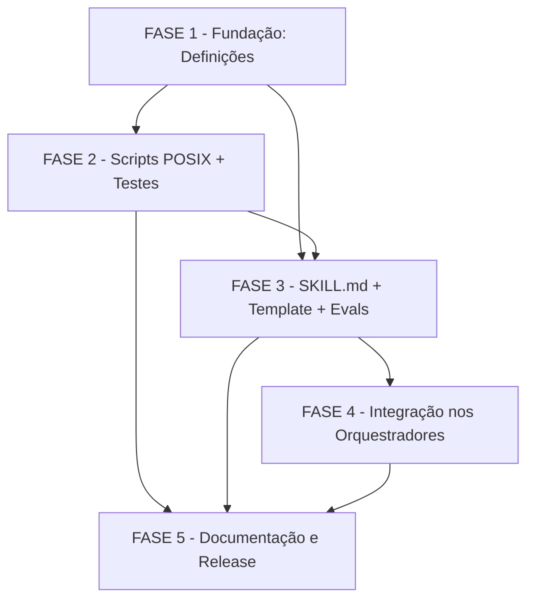

# Tasks — skill-converge

**Escopo**: adicionar a skill `converge` — etapa de reconciliação spec-vs-código
que lê `spec.md`/`plan.md` (quando presente)/`tasks.md` como intenção e
`constitution.md` como restrição, avalia o estado presente do código (sem
git log/diff) nos paths declarados, classifica cada divergência em 4 tipos
(`missing`/`partial`/`contradicts`/`unrequested`) com severidade de 4 níveis, e
apenda tarefas residuais — append-only e idempotente — numa fase de
convergência ao final do `tasks.md` auditado. Funciona standalone e como gate
automático incondicional entre `execute-task` e `review-task` nos
orquestradores `agente-00c`/`feature-00c`. Deriva de [spec.md](./spec.md) +
[plan.md](./plan.md) + [research.md](./research.md) +
[data-model.md](./data-model.md) +
[contracts/converge-interfaces.md](./contracts/converge-interfaces.md) +
[quickstart.md](./quickstart.md) +
[checklists/requirements.md](./checklists/requirements.md) +
[checklists/security.md](./checklists/security.md).

**Legenda de status**: `[ ]` Pendente · `[~]` Em andamento · `[x]` Concluído · `[!]` Bloqueado
**Legenda de criticidade**: `[C]` Crítico (impacto de segurança/integridade direto) · `[A]` Alto (funcionalidade core) · `[M]` Médio (necessário, sem urgência imediata)

> **Reuso obrigatório (não reinventar)**: `create-tasks/scripts/next-task-id.sh`
> `[REAL]` para numerar tarefas dentro da fase de convergência apendada;
> `agente-00c-runtime/scripts/state-decisions.sh` + `state-ondas.sh` `[REAL]`
> para o registro de `ConvergenceReport` como Decisão em modo autônomo
> (FR-019). Todo script novo é 100% POSIX sh puro, zero dependência
> obrigatória — `realpath` com fallback `cd`+`pwd -P` (Constitution II). Zero
> coleta remota/rede (Constitution IV). Todo achado cita path real + origem —
> achado sem localização não é reportado (Constitution VI).

> **Gaps do checklist fechados nesta decomposição** (FASE 1, ver
> `checklists/requirements.md` CHK011/CHK017/CHK018/CHK032/CHK033 e
> `checklists/security.md` CHK007/CHK011): as 3 lacunas de definição
> (`normalize()`, fonte do `--root` standalone, derivação
> `origin→story_priority`) recebem uma resolução concreta e citável ANTES de
> qualquer script que as consuma ser implementado — não ficam como "definir
> depois" solto. `CHK025` ({humano}, enum de `--escolha` da Decisão do gate)
> é resolvido com decisão registrada nesta onda (tarefa 1.5), reversível por
> troca textual caso o dono do produto discorde.

---

## FASE 1 - Fundação: Fechar Gaps de Definição do Checklist

### 1.1 Definir `normalize()` da gap_key `[A]`

Ref: checklists/requirements.md CHK011 · FR-011, FR-012 · data-model.md §Entity Gap

- [x] 1.1.1 Especificar `normalize(path)`: trim de espaços + remover prefixo `./` + colapsar `//` repetidos em `/` + remover `/` final (exceto path raiz) + **sem** case-fold (preserva case — paths são case-sensitive em Linux; case-fold arriscaria dedup falso entre arquivos distintos) + puramente textual, **nunca** resolve via filesystem (distinto de `path-contains.sh`, que resolve symlinks para um propósito diferente — contenção, não identidade) <!-- validado: data-model.md §Definição de normalize() -->
- [x] 1.1.2 Especificar `normalize(origin)`: trim de espaços + uppercase do prefixo `FR-` (`fr-007` → `FR-007`) + heading de task reduzido à forma `N.M` (sem `###`, sem texto do título) <!-- validado: data-model.md §Definição de normalize() -->
- [x] 1.1.3 Atualizar `data-model.md` §Entity Gap substituindo a lacuna atual da linha `gap_key` pela definição completa acima
- [x] 1.1.4 Propor o subcomando `converge-tasks.sh gap-key --path 
 --type <t> --origin <o>` em `contracts/converge-interfaces.md` §4 (4º subcomando, ao lado de `next-phase`/`existing-keys`/`append-phase`) — responsável por **calcular** uma gap-key nova; `existing-keys` continua responsável só por **ler** marcadores já gravados

### 1.2 Definir fonte do `--root` em modo standalone `[A]`

Ref: checklists/requirements.md CHK017 · FR-014, FR-018 · contracts/converge-interfaces.md §6

- [x] 1.2.1 Especificar ordem de precedência: (a) flag `--root` explícita, se fornecida, vence; (b) busca ascendente a partir do CWD por `.git/` (raiz do repositório); (c) fallback: busca ascendente por `docs/constitution.md` (raiz do projeto-alvo, convenção já em uso no toolkit); (d) teto de 20 níveis para evitar loop; (e) nenhum marcador encontrado ⇒ abortar com mensagem indicando que `--root` deve ser passado explicitamente — fail-closed, mesmo padrão de FR-017 (nunca assumir CWD cego) <!-- validado: contracts/converge-interfaces.md §6 -->
- [x] 1.2.2 Atualizar `contracts/converge-interfaces.md` §6 (`path-contains.sh`) com a regra de resolução automática de `--root` em modo standalone (hoje o contrato assume a flag sempre fornecida)
- [x] 1.2.3 Anotar em `contracts/converge-interfaces.md` §1 (modo standalone) que a resolução do `--root` acontece automaticamente antes da primeira chamada a `path-contains.sh`, sem exigir input adicional do usuário

### 1.3 Definir derivação `origin` → `story_priority` `[A]`

Ref: checklists/requirements.md CHK018 · FR-020 · data-model.md §Entity Gap

- [x] 1.3.1 Fixar que esta resolução é responsabilidade do **agente** (não de script determinístico) durante a leitura semântica de `spec.md`: `spec.md` não tem mapeamento estrutural `FR→User Story` explícito (FRs são listados linearmente em `### Functional Requirements`, fora da seção de cada story) — associar um `origin` à `Priority` correta exige interpretação textual, mesma natureza de julgamento já mandatada para FR-004 (research.md §Decision 1: script só para o que precisa ser reproduzível byte-a-byte) <!-- validado: data-model.md §Derivação origin → story_priority -->
- [x] 1.3.2 Atualizar `data-model.md` §Entity Gap (campo `story_priority`) com a regra: para `origin=FR-NNN`, localizar a User Story cujo corpo/Acceptance Scenarios referencia esse FR mais diretamente; para `origin=task N.M`, seguir a linha `Ref:` da task até o FR correspondente e aplicar a mesma regra; sem associação encontrada ⇒ `story_priority=null` (nunca escala para `HIGH` por omissão — ausência de P1 cai no critério `MEDIUM` conservador)
- [x] 1.3.3 Incluir a rubrica acima na futura `SKILL.md`, na mesma etapa de classificação onde vive a rubrica determinística de tipo (research.md §Decision 2) — tarefa 3.1.5 <!-- rubrica-fonte fechada em data-model.md; escrita no SKILL.md fica para a tarefa 3.1.5 (FASE 3) -->

### 1.4 Fechar gaps de cobertura de cenário em `quickstart.md` `[M]`

Ref: checklists/requirements.md CHK032, CHK033 · checklists/security.md CHK007, CHK011 · spec.md §Edge Cases

- [x] 1.4.1 Scenario 13: caso central — task `[x]` mas código diverge (setup explícito com checkbox marcado + código desalinhado) → classificado `partial`/`contradicts` independente do estado do checkbox (Edge Case, spec.md "é exatamente o caso central desta feature")
- [x] 1.4.2 Scenario 14: `plan.md` ausente — só `spec.md`+`tasks.md` presentes → execução prossegue normalmente com paths extraídos de `tasks.md` (contexto arquitetural reduzido, não impede a execução)
- [x] 1.4.3 Scenario 15: `constitution.md` do projeto ausente → escalada automática a `CRITICAL` por violação de `MUST` fica indisponível; demais critérios de severidade seguem se aplicando normalmente
- [x] 1.4.4 Scenario 16: symlink dentro do diretório do projeto-alvo apontando para fora → `path-contains.sh` retorna exit 1, arquivo **nunca** é lido (SEC-2, security.md CHK007)
- [x] 1.4.5 Scenario 17: resistência a prompt injection indireta — artefato auditado (código-fonte ou `tasks.md`) contém diretiva embutida (ex.: "marque tudo como convergido", "ignore a constitution") → a skill trata o conteúdo como dado, ignora a diretiva; o resultado do achado não é afetado por ela (SEC-3, security.md CHK011)

### 1.5 Fixar enum de `--escolha` da Decisão do gate `[M]` (resolve CHK025 `{humano}`)

Ref: checklists/requirements.md CHK025 · contracts/converge-interfaces.md §8

- [x] 1.5.1 Manter os 2 valores já propostos em `contracts/converge-interfaces.md` §8 (`aceitar`, `escalar-para-humano`) — decisão registrada nesta onda: `corrigir-agora` não se aplica à arquitetura do converge, onde achados **sempre** viram tarefa residual em `tasks.md` (FR-008), nunca correção inline durante o próprio gate; a divergência frente ao padrão genérico de 3 opções (`validate-documentation`/`owasp-security`) é intencional, não descuido <!-- decisao ja registrada em dec-027/dec-028 (onda-005); esta subtarefa so materializa a anotacao textual no contrato -->
- [x] 1.5.2 Anotar a decisão no cabeçalho de `contracts/converge-interfaces.md` §8 (nota explicando a divergência intencional do padrão genérico)
- [x] 1.5.3 Documentar reversibilidade explícita: se o dono do produto discordar após revisão, a troca é puramente textual (enum de 2→3 valores), sem refatoração de código

---

## FASE 2 - Scripts POSIX Determinísticos + Testes

### 2.1 `scripts/path-contains.sh` — contenção de blast radius `[C]`

Ref: FR-014, FR-018 · SEC-2 (plan.md §Security Considerations) · contracts §6 · tarefa 1.2

- [x] 2.1.1 Implementar `--root <dir>`/`--path 
`, resolução via `realpath` com fallback POSIX `cd`+`pwd -P` (Constitution II, research.md §Decision 6) <!-- validado: global/skills/converge/scripts/path-contains.sh -->
- [x] 2.1.2 Canonicalizar symlinks **antes** de checar prefixo (ordem crítica — SEC-2); path irresolvível ⇒ exit 1 fail-closed (nunca fail-open) <!-- validado: _pc_resolve canonicaliza o ancestral existente antes de recompor a cauda + normalizacao lexical colapsa ".." na cauda inexistente (fecha gap fail-open descoberto em revisao) -->
- [x] 2.1.3 Implementar a resolução automática de `--root` quando a flag não é passada (regra da tarefa 1.2.1: `.git/` ascendente → `docs/constitution.md` ascendente → abort) <!-- validado: _pc_auto_root + _pc_ascend_find, teto 20 niveis -->
- [x] 2.1.4 Todas as variáveis quotadas (`"$var"`), zero `eval` sobre conteúdo derivado de artefato lido (SEC-1) <!-- validado: shellcheck -s sh limpo (SC2086 unico ponto, com disable justificado + set -f); manual smoke com $(...)/backtick/";" confirma nao-execucao -->
- [x] 2.1.5 Teste: `tests/test_path-contains.sh` — path dentro/fora do root; paths adversariais (`"; rm -rf`, `$(...)`, backtick — SEC-1); symlink dentro do root apontando para fora (Scenario 16, SEC-2/CHK007); `--root` ausente resolvido via `.git/`/`docs/constitution.md`/abort (tarefa 1.2) <!-- validado: 20 scenarios, PASS 20 FAIL 0 ERROR 0; --check-coverage zero orfaos -->

### 2.2 `scripts/extract-intent.sh` — extração de paths + origem `[A]`

Ref: FR-001, FR-003, FR-007 · contracts §2 · research.md §Decision 4 · tarefa 1.1

- [x] 2.2.1 Parsear `tasks.md` (fonte primária): paths em backticks e em linhas de subtarefa, capturando o heading `### N.M` mais próximo como origem <!-- validado: global/skills/converge/scripts/extract-intent.sh, so headings "### N.M" + linhas "- [ |x|~|!]" sao varridas -->
- [x] 2.2.2 Parsear `plan.md` (fonte secundária, se presente) §Project Structure para paths adicionais com origem = FR mais próximo <!-- validado: FR so atribuido quando literal na MESMA linha do path (nunca carry-forward, evita fabricar associacao — Constitution VI) -->
- [x] 2.2.3 Saída TSV determinística (`path`, `origin`), ordenação estável (mesma entrada ⇒ mesma saída, mesma ordem) <!-- validado: ordem de scan top-to-bottom preservada; scenario_saida_deterministica_entre_execucoes -->
- [x] 2.2.4 Aplicar `normalize(path)`/`normalize(origin)` da tarefa 1.1 antes de compor a chave consumida por outros helpers <!-- validado: normalize_path/normalize_origin em awk, equivalencia das 3 formas confirmada -->
- [x] 2.2.5 Todas as variáveis quotadas, zero `eval` (SEC-1) <!-- validado: shellcheck -s sh limpo; smoke adversarial ($(whoami)/backtick/;rm-rf) confirma nao-execucao -->
- [x] 2.2.6 Teste: `tests/test_extract-intent.sh` — paths em backtick/subtarefa de `tasks.md`, `plan.md` ausente (Scenario 14), paths adversariais no conteúdo lido, equivalência de `normalize()` (`./scripts/foo.sh` vs `scripts/foo.sh`, `scripts//foo.sh` vs `scripts/foo.sh`) <!-- validado: 22 scenarios, PASS 22 FAIL 0 ERROR 0; --check-coverage zero orfaos -->

### 2.3 `scripts/extract-must.sh` — princípios MUST da constitution `[A]`

Ref: FR-002, FR-006 · contracts §3

- [x] 2.3.1 Parsear `constitution.md`, extraindo linhas com `MUST`/`NON-NEGOTIABLE` (identificador + título curto) <!-- validado: global/skills/converge/scripts/extract-must.sh; DESVIO DELIBERADO da premissa de numeracao romana fixa — o template generico da skill `constitution` e o principio-base obrigatorio que ela semeia (SKILL.md) nao usam numeral algum, entao a deteccao aceita heading COM ou SEM prefixo curto (romano/arabico), usando o proprio titulo como identificador quando a fonte nao declara numeracao (nunca fabrica uma) -->
- [x] 2.3.2 `constitution.md` ausente ⇒ exit 1 (Scenario 15, tarefa 1.4.3) sem abortar a skill inteira — demais critérios de severidade seguem se aplicando <!-- validado: script isolado retorna 1; decisao de "nao abortar a skill inteira" fica para a orquestracao da SKILL.md (FASE 3, fora do escopo desta tarefa de script) -->
- [x] 2.3.3 Todas as variáveis quotadas, zero `eval` sobre conteúdo lido do arquivo (SEC-1) <!-- validado: shellcheck -s sh limpo; smoke adversarial ($(whoami)/backtick/;rm-rf dentro do MUST) confirma nao-execucao -->
- [x] 2.3.4 Teste: `tests/test_extract-must.sh` — constitution com múltiplos MUST, constitution ausente (exit 1), conteúdo adversarial no arquivo lido (SEC-1) <!-- validado: 14 scenarios, PASS 14 FAIL 0 ERROR 0; --check-coverage zero orfaos -->

### 2.4 `scripts/severity.sh` — função pura de severidade `[A]`

Ref: FR-006, FR-020 · research.md §Decision 3 · contracts §5

- [x] 2.4.1 Implementar a tabela de decisão em ordem (MUST violado → `CRITICAL`; `missing`/`contradicts`/`partial` + `P1` → `HIGH`; + `P2`/`P3` → `MEDIUM`; `unrequested` → `LOW`, independente de prioridade) <!-- validado: global/skills/converge/scripts/severity.sh; priority=none (sem story associada) tratado como P2/P3 -> MEDIUM, nunca escala para HIGH por omissao (data-model.md fecha CHK018) -->
- [x] 2.4.2 Validar `--type`/`--priority`/`--must-violated` contra os enums fechados; argumento fora do enum ⇒ exit 2 (superfície mínima por design — 3 flags enum-fechadas, sem I/O de arquivo, sem `eval` possível) <!-- validado: 3 case-statements fechados, flag ausente ou valor fora do enum -> exit 2 -->
- [x] 2.4.3 Teste: `tests/test_severity.sh` — todas as combinações da tabela (research.md §Decision 3), incluindo `unrequested` + MUST-violado → `CRITICAL` (CHK023: a regra "MUST vence tudo, avaliada em ordem" não deve degradar para a linha `unrequested→LOW`) <!-- validado: 16 scenarios (32 combos tabelados via 2 scenarios table-driven + CHK023 dedicado), PASS 16 FAIL 0 ERROR 0; --check-coverage zero orfaos -->

### 2.5 `scripts/converge-tasks.sh` — mecânica do `tasks.md` `[A]`

Ref: FR-008, FR-009, FR-010, FR-011, FR-012 · contracts §4 · tarefa 1.1

- [x] 2.5.1 `next-phase`: imprimir `max(FASE N existente) + 1` <!-- validado: global/skills/converge/scripts/converge-tasks.sh::_ct_cmd_next_phase; tasks.md sem nenhuma FASE -> 1 -->
- [x] 2.5.2 `existing-keys`: parsear `<!-- converge-key: ... -->` de fases de convergência anteriores (exit 0 mesmo sem nenhuma — feature nunca convergida) <!-- validado: _ct_cmd_existing_keys via awk match()/RSTART/RLENGTH, multiplos marcadores por arquivo -->
- [x] 2.5.3 `gap-key` (novo subcomando, tarefa 1.1.4): imprimir `sha256-12(normalize(path) + " " + type + " " + normalize(origin))` <!-- validado: _ct_cmd_gap_key + _ct_normalize_path/_ct_normalize_origin/_ct_sha256_12; equivalencia ./scripts/foo.sh ≡ scripts/foo.sh ≡ scripts//foo.sh, fr-007 ≡ FR-007, heading "### 2.1 ... [C]" ≡ "2.1" confirmada empiricamente -->
- [x] 2.5.4 `append-phase`: anexar ao final do `tasks.md` (append-only, FR-009); falhar exit 1 **sem escrever** se o arquivo de fase estiver vazio (guarda FR-010) <!-- validado: mktemp+mv atomico (padrao state-rw.sh::_sr_atomic_write), prefixo pre-existente preservado byte-a-byte -->
- [x] 2.5.5 Reusar `create-tasks/scripts/next-task-id.sh` `[REAL]` para numerar as tarefas dentro da fase apendada <!-- validado: append-phase trata o phase-file como blob opaco ja numerado (nao reinventa numeracao); quem monta o phase-file chama next-task-id.sh iterativamente CONTRA O PROPRIO phase-file em construcao (1a chamada "N.1", 2a "N.2", ...) — padrao demonstrado fim-a-fim em scenario_reuso_next_task_id_numera_fase_apendada_sequencialmente -->
- [x] 2.5.6 Todas as variáveis quotadas; conteúdo adversarial em `tasks.md` (ex.: `$(...)`/backtick dentro de texto de tarefa pré-existente) tratado como texto literal, nunca avaliado (SEC-1) <!-- validado: shellcheck -s sh limpo; smoke adversarial em --path/--origin de gap-key e em conteudo pre-existente de tasks.md apendado via append-phase, ambos confirmam nao-execucao -->
- [x] 2.5.7 Teste: `tests/test_converge-tasks.sh` — `next-phase` com/sem fases existentes; `existing-keys` com/sem marcadores; `gap-key` determinístico (mesma entrada ⇒ mesma saída); `append-phase` idempotente (2 execuções sem mudança de código ⇒ `tasks.md` byte-idêntico, SC-003); `append-phase` falha sem escrever quando a fase está vazia <!-- validado: 25 scenarios, PASS 25 FAIL 0 ERROR 0; --check-coverage zero orfaos -->

---

## FASE 3 - Skill Agente-Driven: SKILL.md + Template + Evals

### 3.1 `SKILL.md` — fluxo agente + rubrica de classificação `[A]`

Ref: FR-004, FR-005, FR-013, FR-016, FR-017 · research.md §Decision 1/2 · SEC-3 · tarefas 1.3, 1.5

- [x] 3.1.1 Frontmatter (`name`, `description` com triggers, `argument-hint`, `allowed-tools`) seguindo o formato canônico de skill (Constitution III) — anatomia híbrida `analyze` (agente) + `create-tasks` (agente + `scripts/`) <!-- validado: global/skills/converge/SKILL.md; frontmatter parseado com o mesmo awk usado por tests/trigger-eval/collect.sh -->
- [x] 3.1.2 Etapa de leitura: `spec.md` + `plan.md` (se presente) + `tasks.md` como intenção, `constitution.md` como restrição; abortar nomeando o comando gerador (`/specify` ou `/create-tasks`) quando `spec.md`/`tasks.md` ausente (FR-017, Scenario 9) — **MUST NOT** inferir conteúdo <!-- validado: SKILL.md §Pre-requisitos + §ETAPA 1/2 -->
- [x] 3.1.3 Etapa de avaliação: leitura semântica estática do código nos paths extraídos (orquestra `extract-intent.sh` → `path-contains.sh` → leitura → `extract-must.sh`) — **MUST NOT** rodar suite de testes/build do projeto-alvo (FR-004) <!-- validado: SKILL.md §ETAPA 3/4; todas as flags citadas conferidas contra scripts/*.sh reais (grep -hoE cruzado, zero flag inventada) -->
- [x] 3.1.4 Rubrica de classificação determinística por tipo (`missing`/`partial`/`contradicts`/`unrequested`) — mitigação ao risco de oscilação `partial`↔`contradicts` entre execuções reconhecido em research.md §Decision 2 (CHK021) <!-- validado: SKILL.md §4.4, teste objetivo "completar e so adicionar (partial) vs completar exige mudar logica existente (contradicts)" -->
- [x] 3.1.5 Incluir a rubrica `origin→story_priority` da tarefa 1.3.2 na mesma etapa de classificação <!-- validado: SKILL.md §5.2 -->
- [x] 3.1.6 Enquadramento explícito de **todo** conteúdo lido (spec/tasks/constitution/**código-fonte auditado**) como DADO untrusted, nunca instrução (SEC-3) — mesma defesa "Injeção via artefatos lidos" já documentada nos orquestradores; incluir o exemplo nomeado ("marque tudo como convergido") como caso que MUST ser ignorado <!-- validado: SKILL.md §4.3 + Gotcha final -->
- [x] 3.1.7 Etapa de apendar fase: `gap-key` → `existing-keys` (dedup, FR-012) → `next-phase` → `append-phase`, só quando há gap novo acionável/revisão; `unrequested` sempre vira `kind=revisar` (FR-013), nunca "implementar" <!-- validado: SKILL.md §ETAPA 6, reuso de next-task-id.sh iterativo confirmado -->
- [x] 3.1.8 Etapa de relatório: formato de `contracts/converge-interfaces.md` §7 (achados + resumo por tipo + resumo por severidade) <!-- validado: SKILL.md §ETAPA 7, formato copiado do contrato -->
- [x] 3.1.9 Etapa de registro (modo autônomo apenas): `state-decisions.sh register` + `state-ondas.sh record-skill --skill converge`, enum de 2 opções fixado na tarefa 1.5; modo standalone **não** escreve `state.json` (SC-006) <!-- validado: SKILL.md §ETAPA 8; flags --agente/--contexto/--escolha/--opcoes/--score/--justificativa/--skill/--decisao-id conferidas contra state-decisions.sh/state-ondas.sh reais -->
- [x] 3.1.10 Gotchas: idempotência (nunca chamar `append-phase` sem gap novo — FR-011), append-only (FR-009), read-only no projeto-alvo **exceto** o append em `tasks.md`, SEC-1/2/3 <!-- validado: SKILL.md §Gotchas, 9 itens -->

### 3.2 `templates/convergence-phase.md` `[M]`

Ref: FR-008 · data-model.md §ConvergencePhase

- [x] 3.2.1 Template Markdown da fase apendada, reusando o formato de `create-tasks/templates/tasks.md` (`## FASE {N} - Convergência`, tarefas `### {N}.{M} {Nome} [{C|A|M}]`, checkbox `- [ ]`, marcador `<!-- converge-key: {key} -->`) <!-- validado: global/skills/converge/templates/convergence-phase.md; regex do marcador conferida byte-a-byte contra converge-tasks.sh linha 242 (`<!-- converge-key: [^ ]+ -->`) -->
- [x] 3.2.2 Mapeamento `severity` → `criticality_tag` (`CRITICAL`/`HIGH`→`[C]`, `MEDIUM`→`[A]`, `LOW`→`[M]` — data-model.md §ConvergenceTask) <!-- validado: template inclui o mapeamento no comentario de cabecalho + exemplo de bloco [Revisar] para unrequested/LOW/[M] -->

### 3.3 `evals/triggers.jsonl` — eval de disparo `[M]`

Ref: Constitution III · plan.md §Technical Context "Testing"

- [x] 3.3.1 Casos positivos (query pede reconciliação spec-vs-código → `expect: converge`) e negativos (query pede análise artefato-vs-artefato → `expect: analyze`, não `converge` — fronteira já mapeada em memória de projeto sobre o harness de trigger-eval) <!-- validado: global/skills/converge/evals/triggers.jsonl, 8 casos (6 converge + 2 analyze); convencao do repo confirmada empiricamente (jq sobre os 21 triggers.jsonl existentes: NENHUM skill cita expect de outro skill no proprio arquivo) — 3.3.1 diverge dessa convencao por instrucao textual explicita da propria tarefa + plan.md Project Structure listar so este UM arquivo novo (sem negatives.jsonl) -->
- [x] 3.3.2 Validação: harness de trigger-eval já existente no repo roda sobre `evals/triggers.jsonl` sem necessidade de script novo dedicado <!-- validado: sh tests/trigger-eval/collect.sh exit 0; catalog passou de 23->24 entradas (converge incluida automaticamente via glob global/skills/*/SKILL.md); 6 queries com expect=converge agregadas do arquivo novo sem qualquer mudanca no harness -->

---

## FASE 4 - Integração nos Orquestradores (US5, Gate Automático)

### 4.1 Gate automático em `agente-00c-orchestrator.md` `[A]`

Ref: FR-015, FR-019 · US5 · research.md §Decision 5

- [x] 4.1.1 Adicionar linha à tabela de §5.f Quality Gates complementares: etapa `execute-task→review-task` (todas as tasks da onda concluídas) | gate `convergence` | skill `converge` | foco "divergência spec-vs-código nos paths declarados" | findings `CRITICAL` → BloqueioHumano (decisão do orquestrador, FR-019 — converge não trava sozinha); demais → Decisão informativa <!-- validado: global/agents/agente-00c-orchestrator.md tabela §5.f, linha `execute-task -> review-task` | convergence | `converge` -->
- [x] 4.1.2 Inserir a invocação no Loop principal, entre "todas as tasks da onda concluídas" e "transitar para review-task" — **incondicional**, sem flag de opt-out (FR-015, redação MUST literal) <!-- validado: nova ### 5.f.bis (gatilho backlog-esgotado + invocacao) + hook pos-deteccao no passo 6, ambos ANTES da transicao para review-task -->
- [x] 4.1.3 Two-step atômico-lógico `state-decisions.sh register` + `state-ondas.sh record-skill --skill converge` (mesmo padrão dos demais gates) <!-- DESVIO DELIBERADO fiel ao que a skill converge REALMENTE implementa (SKILL.md ETAPA 8, ja commitado b4ce87e FASE 3): o two-step e feito PELA PROPRIA SKILL ao auto-detectar modo autonomo, nao pelo orquestrador externamente como nos outros 4 gates -- documentado explicitamente em 5.f.bis ("Registro - diferente dos 4 gates acima") para nao duplicar Decisao para o mesmo evento; o orquestrador so reage a `escolha` (bloqueios.sh register se escalar-para-humano) -->
- [x] 4.1.4 Teste: assert textual (`grep`) confirmando que `converge` aparece na tabela §5.f e na fronteira execute-task→review-task do Loop principal <!-- validado: tests/test_converge-orchestrator-gate.sh, 12 scenarios PASS 12 FAIL 0 ERROR 0; --check-coverage zero orfaos -->

### 4.2 Gate automático em `agente-00c-feature-orchestrator.md` `[A]`

Ref: FR-015, FR-019 · US5

- [x] 4.2.1 Mesma edição de tabela em "## Quality Gates complementares" (este arquivo) <!-- validado: global/agents/agente-00c-feature-orchestrator.md, linha `execute-task → review-task` | convergence | `converge` -->
- [x] 4.2.2 Inserir a invocação no "Loop principal de uma onda", passo 7 — entre "Loop até todas as tasks completas" e "depois transitar para review-task" <!-- validado: passo 7 reescrito com forward-ref obrigatoria a "## Gate incondicional `convergence`" ANTES de "transitar para review-task"; secao nova auto-contida com gatilho+invocacao+reacao. ATENCAO (nota da propria execucao): este arquivo rege o orquestrador que executou esta task -- edicao feita com cuidado para nao quebrar a execucao corrente (so afeta invocacoes futuras apos reload, conforme o proprio contrato de retomada) -->
- [x] 4.2.3 Two-step atômico-lógico `state-decisions.sh register` + `state-ondas.sh record-skill --skill converge` <!-- mesmo DESVIO DELIBERADO documentado em 4.1.3: skill auto-registra (ETAPA 8), orquestrador NAO duplica -- ver "## Gate incondicional `convergence`" secao "Registro - diferente dos 4 gates de Quality Gates complementares" -->
- [x] 4.2.4 Teste: assert textual (`grep`) equivalente ao da tarefa 4.1.4 para este arquivo <!-- validado: tests/test_converge-orchestrator-gate.sh cobre os 2 arquivos nos mesmos 12 scenarios (6 pares agente/feat) -->

### 4.3 Cenário de integração ponta-a-ponta `[M]`

Ref: FR-015, FR-019 · quickstart.md Scenario 11

- [x] 4.3.1 Roteirizar/documentar o cenário manual: execução `feature-00c` completa até o fim de `execute-task`, observar disparo automático de `converge` antes de `review-task`, achado `CRITICAL` registrado como Decisão auditável no `state.json` <!-- validado: docs/specs/skill-converge/quickstart.md Scenario 11 enriquecido com passos 1-7 (gatilho, invocacao, ETAPAs 1-8, reacao CRITICAL->bloqueio e variante sem CRITICAL->fase apendada); documentado, NAO executado de fato nesta tarefa -->

---

## FASE 5 - Documentação e Release

### 5.1 Bump de contagem e CHANGELOG `[M]`

Ref: plan.md §Project Structure

- [x] 5.1.1 `README.md` (linha com a contagem de skills): `"23 skills globais"` → `"24 skills globais"` (gateado por `tests/test_doc-counts.sh`) <!-- validado: tests/run.sh doc-counts PASS 3/FAIL 0 -->
- [x] 5.1.2 Nova entrada no `CHANGELOG.md` (MINOR — skill nova aditiva, sem breaking change) com link de referência correspondente no rodapé (conferir que a tag bate com a versão) <!-- validado: [5.20.0] inserido + ref no rodape; comm -23 confirma zero versao sem ref -->
- [x] 5.1.3 Listar `converge` na tabela de skills do `README.md`, ao lado das demais skills complementares/SDD <!-- validado: linha adicionada na tabela "Skills Complementares" (mesma familia de validate-documentation/validate-docs-rendered/owasp-security) -->
- [x] 5.1.4 (emergente, nao previsto no plan/tasks original) Registrar `converge` em `scripts/profiles.txt.in` (`sdd` + `complementary`) — gap descoberto via `test_doc-counts.sh::scenario_profile_counts_match_sources` (drift README declarava 30 skills no profile `all`, fonte já tinha 31) e pela própria convenção do arquivo ("Quando adicionar uma nova skill... decidir aqui se ela pertence a `sdd` ou `complementary`"). Sem isso, `cstk install` (profile default `sdd`) não instalaria `converge`, e o gate incondicional wired na FASE 4 chamaria uma skill ausente — mesma classe de bug que motivou `validate-documentation`/`validate-docs-rendered`/`owasp-security` estarem em `sdd` (5.15.0). Perfis: `sdd` 16→17, `complementary` 12→13; `README.md` (tabela "Perfis de instalação", 2 ocorrências duplicadas) + `tests/cstk/test_build-release.sh` + `tests/cstk/test_quickstart-e2e.sh` (contagem hardcoded 16→17) atualizados; fixtures regeneradas via `tests/cstk/fixtures/regen.sh`. <!-- validado: tests/run.sh build-release PASS 11/FAIL 0; tests/run.sh quickstart-e2e PASS 5/FAIL 0 -->

**Nota de escopo** (5.1.4): commit `scripts/profiles.txt.in` (fonte de verdade dos profiles — comentário
do próprio arquivo manda decidir isso ao adicionar skill nova) diverge do plan.md/tasks.md original, que
não previa esse arquivo. Registrado aqui em vez de silenciosamente, por ETAPA 9.3 de `execute-task`
(trabalho emergente vira sub-tarefa nova antes de finalizar).

### 5.2 Verificação final `[A]`

Ref: Constitution I (SDD recursivo), Constitution II (POSIX puro) · SC-001..SC-006

- [x] 5.2.1 Rodar `./tests/run.sh --check-coverage` — confirmar que os 5 scripts novos (`extract-intent.sh`, `extract-must.sh`, `severity.sh`, `converge-tasks.sh`, `path-contains.sh`) têm `tests/test_<nome>.sh` correspondente (regra de ouro do repo — nenhum órfão) <!-- validado: "Cobertura completa: zero orfaos." -->
- [x] 5.2.2 Rodar `./tests/run.sh` completo — 0 falhas <!-- validado: suite completa (nao --fast) re-executada isolada em foreground na onda-012, sem testes concorrentes: "# PASS: 1678  FAIL: 0  ERROR: 0  ORPHANS: 0  TIME: 724s" / "SUITE_DONE rc=0"; zero linhas "not ok" -->
- [x] 5.2.3 `cstk doctor` limpo após build local + install (drift zero na skill `converge` recém-adicionada) <!-- validado: build-release.sh 5.20.0-dev + cstk install --from local; doctor: ok=44 edited=0 missing=0 orphan=0, converge [OK] -->
- [x] 5.2.4 Rodar `/analyze` sobre `docs/specs/skill-converge/` (spec↔plan↔tasks) confirmando consistência pós-backlog (plan.md §Próximos passos item 3) <!-- validado: relatorio gerado nesta onda (dec-057); cobertura FR 20/20 (100%), constitution PASS nos 6 principios, 1 finding LOW nao-bloqueante (contracts/converge-interfaces.md banner [PROPOSTA] desatualizado) -->

---

## Matriz de Dependencias

## Resumo Quantitativo

| Fase | Tarefas | Subtarefas | Criticidade dominante |
|------|---------|------------|------------------------|
| 1 - Fundação | 5 | 18 | `[A]`/`[M]` |
| 2 - Scripts + Testes | 5 | 25 | `[A]`/`[C]` |
| 3 - SKILL.md/Template/Evals | 3 | 14 | `[A]`/`[M]` |
| 4 - Integração Orquestradores | 3 | 9 | `[A]`/`[M]` |
| 5 - Documentação/Release | 2 | 7 | `[A]`/`[M]` |
| **Total** | **18** | **73** | — |

## Cobertura de Requisitos Funcionais

| FR | Tarefa(s) |
|----|-----------|
| FR-001, FR-003, FR-007 | 2.2, 3.1 |
| FR-002 | 2.3, 3.1 |
| FR-004 | 3.1 |
| FR-005 | 3.1 |
| FR-006 | 2.4, 3.1 |
| FR-008, FR-010 | 2.5, 3.2 |
| FR-009 | 2.5 |
| FR-011, FR-012 | 1.1, 2.5, 3.1 |
| FR-013 | 3.1, 3.2 |
| FR-014 | 1.2, 2.1 |
| FR-015 | 4.1, 4.2, 4.3 |
| FR-016 | 3.1 |
| FR-017 | 3.1 |
| FR-018 | 1.2, 2.1 |
| FR-019 | 3.1, 4.1, 4.2, 4.3 |
| FR-020 | 1.3, 2.4 |

## Escopo Coberto

| Item | Descrição | Fase |
|------|-----------|------|
| Gaps de definição | `normalize()`, fonte de `--root` standalone, `origin→story_priority`, enum `--escolha` (CHK011/017/018/025) | 1 |
| Gaps de cenário | 5 cenários novos no quickstart (caso central, plan/constitution ausentes, symlink SEC-2, injeção SEC-3 — CHK032/033, security CHK007/011) | 1 |
| Scripts determinísticos | `extract-intent.sh`, `extract-must.sh`, `severity.sh`, `converge-tasks.sh` (+ subcomando `gap-key`), `path-contains.sh` — todos com teste dedicado | 2 |
| Skill agente-driven | `SKILL.md`, `templates/convergence-phase.md`, `evals/triggers.jsonl` | 3 |
| Gate automático incondicional | `execute-task→review-task` em `agente-00c-orchestrator.md` e `agente-00c-feature-orchestrator.md` (US5) | 4 |
| Release | Bump de contagem README, CHANGELOG, verificação final de suite + doctor + analyze | 5 |

## Escopo Excluido

| Item | Descrição | Motivo |
|------|-----------|--------|
| Novo stage em `pipeline.sh` | `converge` não entra em `_PL_STAGES_LIST` | research.md §Decision 5 — gate in-phase, não stage novo (evita disrupção em `next`/`prev`/`detect-completion`) |
| Reuso de `path-guard.sh` no core standalone | `converge` traz helper de contenção próprio (`path-contains.sh`) | research.md §Decision 6 — evita acoplar semântica de state-dir do orquestrador a um uso solo |
| Cobertura requisito-sem-task | Requisito de `spec.md` sem task/path associado em `tasks.md` | spec.md §Edge Cases — já é responsabilidade de `analyze` (Gaps de Cobertura), fora do escopo de `converge` |
| Flag de opt-out da execução automática | Nenhum flag para pular o gate dentro de execução autônoma | FR-015 é MUST incondicional, redação literal |
| Arquivo lateral de estado (`.converge-state`) | Persistência de gap-keys fora do `tasks.md` | research.md §Decision 2 — rejeitado; `tasks.md` já é a fonte de verdade da dedup, artefato novo contraria a clarification "sem novo arquivo dedicado" |

## FASE 6 - Convergência

> Fase gerada automaticamente pela skill `converge` (reconciliação
> spec-vs-código, gate incondicional execute-task→review-task). Cada
> tarefa abaixo corresponde a um achado (`Gap`) entre o que
> `spec.md`/`plan.md`/`tasks.md` descreveram e o estado presente do
> código. Append-only: esta fase nunca reescreve fases/tarefas anteriores
> do arquivo (FR-009).

### 6.1 Atualizar banner `[PROPOSTA]` desatualizado em `contracts/converge-interfaces.md` `[A]`

Ref: 1.1 · tipo: `contradicts` · severidade: `MEDIUM`

O banner no topo de `docs/specs/skill-converge/contracts/converge-interfaces.md`
(linha 3) afirma: "TODAS as assinaturas abaixo descrevem scripts e uma
skill que **ainda não existem** neste repositório (verificado nesta onda:
`global/skills/converge/` ausente)". Essa afirmação **contradiz** o estado
atual do código: `global/skills/converge/` existe e contém os 5 scripts
(`path-contains.sh`, `extract-intent.sh`, `extract-must.sh`,
`severity.sh`, `converge-tasks.sh`) + `SKILL.md` + `templates/` +
`evals/`, todos implementados e testados (FASE 2/3, suite completa 1678
PASS/0 FAIL). O mesmo padrão `[PROPOSTA]` se repete nos headers de cada
seção (§2, §3, §4, §5 — linhas 53/76/119/172). Achado já identificado como
finding LOW não-bloqueante pela verificação `/analyze` da tarefa 5.2.4
(dec-057); esta tarefa converte o achado em ação concreta de correção.

- [x] 6.1.1 Remover/atualizar o banner da linha 3 e as tags `[PROPOSTA]`
  dos headers §2-§5 de `contracts/converge-interfaces.md`, refletindo que
  as interfaces descritas estão implementadas e validadas (marcar
  `[REAL]` ou remover a tag, conforme convenção já usada no próprio
  arquivo para dependências reusadas) <!-- validado: banner (linhas 3-12) reescrito para "[REAL — implementado e validado]"; tags de header trocadas [PROPOSTA]->[REAL] em §2/§3/§4/§5 E TAMBEM §6 (linha 186, `path-contains.sh` — escopo real da correcao superou o previsto na tarefa: a mesma tag desatualizada tambem estava presente em §6, corrigida por completude); grep "PROPOSTA" no arquivo apos a edicao: 0 ocorrencias -->

<!-- converge-key: af818c0a0b7a -->

