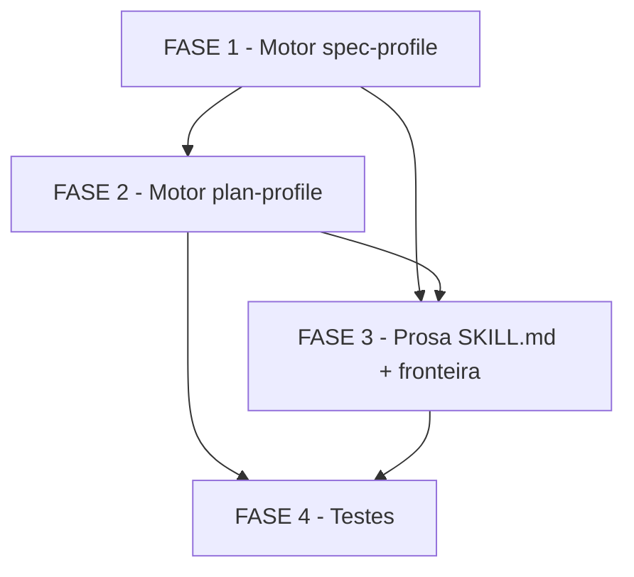

# Tarefas cstk - validate-docs-sdd-profile

Escopo: Adicionar dois novos perfis nativos a skill `validate-documentation`
— **spec-profile** (valida `spec.md` contra os criterios ja documentados em
`specify`) e **plan-profile** (valida `plan.md`/`research.md`/`data-model.md`/
`quickstart.md`/`contracts/*.md` contra os criterios ja documentados em
`plan`) — via um novo motor POSIX `scripts/validate-sdd.sh` + prosa no
`SKILL.md`, acionados por flags explicitas (`--sdd-spec`/`--sdd-plan`) ou por
deteccao automatica de path (`docs/specs/<feature>/...`). Deriva de
[spec.md](./spec.md) + [plan.md](./plan.md) + [contracts/validate-sdd-cli.md](./contracts/validate-sdd-cli.md);
consome gaps de [checklists/requirements.md](./checklists/requirements.md).

**Ordem de entrega** (decisao, nao bloqueio — Ref: checklists/requirements.md
CHK026): FASE 1 (US1/spec-profile, P1) → FASE 2 (US2/plan-profile, P2) →
FASE 3 (prosa SKILL.md + fronteira, transversal) → FASE 4 (testes). A spec
justifica P1 antes de P2 por "MVP mais frequente primeiro" (spec.md §User
Story 1 "Why this priority"); nenhum sinal em contrario nos artefatos.

**Legenda de status:**
- `[ ]` Pendente
- `[~]` Em andamento
- `[x]` Concluido
- `[!]` Bloqueado

**Legenda de criticidade:**
- `[C]` Critico - Impacto financeiro direto, regulatorio ou de seguranca
- `[A]` Alto - Funcionalidade essencial (sem ela o perfil nao opera)
- `[M]` Medio - Necessario mas sem urgencia imediata (prosa/documentacao/afinamento)

---

## FASE 1 - Motor spec-profile (US1, P1)

### 1.1 Scaffolding do motor CLI (arg parsing, selecao de perfil, formato de saida) `[A]`

Ref: contracts/validate-sdd-cli.md (Command `validate-sdd.sh`, Invocacao,
Saida, Exit codes); plan.md §Project Structure; research.md Decision 1/2/3.

- [x] 1.1.1 Criar `global/skills/validate-documentation/scripts/validate-sdd.sh` (shebang `#!/bin/sh`, `set -eu`; skill ainda nao tem diretorio `scripts/` — verificado em research.md Decision 1)
- [x] 1.1.2 Implementar parsing de argumentos: `FILE` posicional obrigatorio, `--sdd-spec`, `--sdd-plan`, `--spec SPEC_MD`; `--sdd-spec`/`--sdd-plan` mutuamente exclusivas → exit 2 (uso incorreto)
- [x] 1.1.3 Implementar precedencia de selecao de perfil (FR-014/FR-015/FR-016): (1) flag explicita vence tudo; (2) deteccao automatica por convencao `docs/specs/<feature>/spec.md` → spec-profile; (3) sem flag e fora da convencao → perfil indeterminado, mensagem clara em stderr, exit 2
- [x] 1.1.4 Implementar emissor de saida machine-readable: uma linha `FINDING|<severity>|<code>|<mensagem>` por achado + linha `RESULT|<file>|profile=<spec|plan>|errors=<N>|warnings=<M>` sempre emitida (mesmo com 0 achados) — contracts/validate-sdd-cli.md §Saida
- [x] 1.1.5 Implementar exit codes conforme severidade (FR-017, research.md Decision 3): `0` = zero achados `error` (avisos/infos nao bloqueiam); `1` = >=1 achado `error`; `2` = uso incorreto/arquivo inexistente/flags conflitantes/perfil indeterminado
- [x] 1.1.6 Subtarefa de teste (placeholder ate FASE 4 consolidar o arquivo): cobrir Cenario 11 (perfil indeterminado, exit 2) e Cenario 12 (deteccao automatica sem flag) do quickstart.md em `tests/test_validate-sdd.sh`

### 1.2 Checks estruturais do spec-profile `[A]`

Ref: spec.md FR-001/FR-004; contracts/validate-sdd-cli.md §Catalogo spec-profile.

- [x] 1.2.1 `missing-section` (error, FR-001): validar presenca das 3 secoes obrigatorias de `spec.md` (`User Scenarios & Testing`, `Requirements`, `Success Criteria`)
- [x] 1.2.2 `too-many-clarifications` (error, FR-004): contar marcadores `[NEEDS CLARIFICATION]` no documento; > 3 reporta erro citando contagem e limite
- [x] 1.2.3 `duplicate-id` (error): detectar ID `FR-`/`SC-` repetido no mesmo documento — **Ref: checklists/requirements.md CHK004/CHK013 [Gap] resolvido**: nao ha FR proprio no spec.md desta feature; a origem e legitima e reusa a convencao ja aplicada ao perfil UC existente, documentada em `global/skills/validate-documentation/SKILL.md:267` ("IDs duplicados dentro do mesmo documento sao erro, nao aviso") — citar essa linha como fonte no comentario do check, nao criar FR fantasma
- [x] 1.2.4 Subtarefa de teste: Cenarios 1 (conformante), 2 (secao ausente), 4 (>3 clarifications), 5 (ID duplicado) do quickstart.md em `tests/test_validate-sdd.sh`

### 1.3 Checks de conteudo heuristicos do spec-profile `[M]`

Ref: spec.md FR-002/FR-003/FR-005/FR-006/FR-007; research.md Decision 6.

- [x] 1.3.1 `impl-detail-in-spec` (error, FR-002): wordlist de termos de linguagem/framework/biblioteca/API especifica no corpo da spec
- [x] 1.3.2 `sc-not-measurable` (error, FR-003): Success Criterion sem metrica quantificavel (regex de percentual/tempo/contagem/taxa) OU com jargao tecnico de implementacao
- [x] 1.3.3 `na-placeholder-section` (warning, FR-005): secao deixada com placeholder `N/A` em vez de removida
- [x] 1.3.4 `vague-adjective` (warning, FR-006): adjetivo vago sem quantificacao em Requirements/Success Criteria (ex.: "rapido", "simples", "robusto")
- [x] 1.3.5 `coupled-user-story` (warning, FR-007): user story que depende de outra para ser testada isoladamente
- [x] 1.3.6 Calibrar a wordlist/regex dos checks 1.3.1-1.3.5 contra os 6 exemplos de `specify/examples/spec-bad.md` ate atingir SC-002 (100% dos 6 anti-padroes estruturalmente detectaveis)
- [x] 1.3.7 Subtarefa de teste: Cenario 3 (termo de stack em SC) e Cenario 6 (avisos nao bloqueiam — `errors=0`, exit 0) do quickstart.md em `tests/test_validate-sdd.sh`

---

## FASE 2 - Motor plan-profile (US2, P2)

### 2.1 Selecao de perfil e checks estruturais do plan-profile `[A]`

Ref: spec.md FR-008/FR-009/FR-011/FR-015; contracts/validate-sdd-cli.md §Catalogo plan-profile.

- [x] 2.1.1 Estender a deteccao automatica de path (1.1.3) para a familia `/plan`: `plan.md`, `research.md`, `data-model.md`, `quickstart.md`, `contracts/*.md` → plan-profile (FR-015)
- [x] 2.1.2 `missing-section` (error, FR-008): validar presenca das 4 secoes obrigatorias de `plan.md` (`Summary`, `Technical Context`, `Constitution Check`, `Project Structure`)
- [x] 2.1.3 `template-placeholder` (error, FR-009): detectar tokens de template nao preenchidos em qualquer artefato `/plan` (ex.: `[FEATURE]`, `[Topico]`, `[Endpoint/Command/Event]`, `[DATE]`, `[short-name]`)
- [x] 2.1.4 `residual-clarification` (error, FR-011): `[NEEDS CLARIFICATION]` remanescente em `plan.md`
- [x] 2.1.5 Subtarefa de teste: Cenario 7 (plan.md conformante) e Cenario 8 (placeholder residual) do quickstart.md em `tests/test_validate-sdd.sh`

### 2.2 Rotulagem real-vs-proposto e referencia cruzada semantica `[A]`

Ref: spec.md FR-010/FR-012/FR-013 (resolvido em clarify, dec-004); Principio VI.

- [x] 2.2.1 `unlabeled-contract` (error, FR-010): exigir rotulo inequivoco real-vs-proposto em toda entrada de `contracts/*.md` (`[PROPOSTA — a validar na implementacao]` ou marcacao equivalente de contrato real) — aplica o Principio VI ao artefato de contrato
- [x] 2.2.2 `dangling-fr-sc-ref` (error, FR-012): extrair IDs `FR-`/`SC-` citados em `plan.md` e validar que existem na `spec.md` correspondente (resolvida via `--spec` explicito ou default de convencao — ver 2.3)
- [x] 2.2.3 Garantir explicitamente (assert negativo) que NENHUM check do plan-profile resolve path/anchor no disco — fronteira FR-013 com `validate-docs-rendered` §2.2, ja resolvida na fase clarify (dec-004): a unica checagem de referencia cruzada e semantica (existencia do ID na spec), nunca resolucao de link/anchor
- [x] 2.2.4 Subtarefa de teste: Cenario 9 (FR-099 inexistente, incluindo o "Nao-Expected" — nenhum achado de link/anchor quebrado) e Cenario 10 (contrato sem rotulo) do quickstart.md em `tests/test_validate-sdd.sh`

### 2.3 Resolucao do default de `--spec` fora da convencao `docs/specs/<feature>/` `[M]`

Ref: checklists/requirements.md CHK014 [Ambiguity]; contracts/validate-sdd-cli.md §Argumentos.

- [x] 2.3.1 Confirmar/implementar que a flag EXPLICITA `--spec SPEC_MD` aceita qualquer path (inclusive fixtures de teste fora de `docs/specs/`) — a restricao a convencao `docs/specs/<feature>/spec.md` se aplica SOMENTE ao default automatico (quando `--spec` nao e informado), nunca a flag explicita
- [x] 2.3.2 Documentar essa distincao (flag explicita vs default automatico) em `contracts/validate-sdd-cli.md` (nota inline na tabela de argumentos) e no `SKILL.md`
- [x] 2.3.3 Subtarefa de teste: fixture local em `tests/fixtures/validate-sdd/` (fora de `docs/specs/`) exercitada via `--spec` explicito, confirmando que `dangling-fr-sc-ref` funciona sem depender da convencao de diretorio

---

## FASE 3 - Prosa SKILL.md e fronteira de nao-duplicacao (transversal)

### 3.1 Documentar spec-profile e plan-profile no SKILL.md `[M]`

Ref: plan.md §Summary; global/skills/validate-documentation/SKILL.md (secoes existentes de perfil UC e `--runbook`).

- [x] 3.1.1 Adicionar secao "Perfil `spec-profile`" (mesmo padrao da secao `--runbook` existente): quando usar, acionamento (`--sdd-spec` + auto-deteccao), catalogo de findings com severidade
- [x] 3.1.2 Adicionar secao "Perfil `plan-profile`": idem, cobrindo `--sdd-plan` + auto-deteccao + `--spec`
- [x] 3.1.3 Documentar a precedencia de selecao de perfil (flag explicita > auto-deteccao por path > indeterminado) com exemplos de invocacao (espelhando os 3 exemplos de `contracts/validate-sdd-cli.md` §Exemplos de saida)
- [x] 3.1.4 Rodar o gate `docs-render` (skill `validate-docs-rendered`) sobre o `SKILL.md` atualizado, confirmando frontmatter/links/code-blocks sem regressao de render

### 3.2 Documentar §Fronteira explicita com `analyze` e `validate-docs-rendered` `[M]`

Ref: plan.md §Fronteira de responsabilidade (SC-005); research.md Decision 4; spec.md FR-018/Out of Scope.

- [x] 3.2.1 Reproduzir no `SKILL.md` a tabela de fronteira "categoria de check → dono" de `plan.md` (8 categorias: secoes obrigatorias, anti-padroes de conteudo, placeholder/rotulo/clarification residual, referencia semantica de ID, link/anchor no disco, Mermaid/frontmatter/code-block, cobertura cross-artifact, drift de case-convention)
- [x] 3.2.2 Adicionar Gotcha explicito no `SKILL.md`: "o check `duplicate-id` do spec-profile reusa a convencao de ID duplicado ja aplicada ao perfil UC (`SKILL.md:267`), nao introduz um FR novo" — fecha CHK004/CHK013 na documentacao publicada da skill
- [x] 3.2.3 Cross-check textual (grep) confirmando que nenhum termo/categoria documentado como responsabilidade dos novos perfis se sobrepõe as categorias listadas como dono `analyze`/`validate-docs-rendered` na mesma tabela (SC-005)

---

## FASE 4 - Testes (`tests/test_validate-sdd.sh`)

### 4.1 Fixtures de teste `[A]`

Ref: research.md Decision 5; plan.md §Project Structure ("Testing").

- [x] 4.1.1 Fixture "boa" spec-profile: apontar diretamente para `docs/specs/enforced-guards/spec.md` (artefato real e versionado, ja verificado por leitura conter as 3 secoes obrigatorias — research.md Decision 5)
- [x] 4.1.2 Fixture "boa" plan-profile: apontar para `docs/specs/enforced-guards/{plan.md,research.md,data-model.md,quickstart.md,contracts/}` (ja verificado conter as 4 secoes obrigatorias)
- [x] 4.1.3 Fixtures "ruins" (heredoc inline ou arquivos sob `tests/fixtures/validate-sdd/`), uma quebra por cenario: secao obrigatoria removida, termo de stack injetado em SC, 4o `[NEEDS CLARIFICATION]`, ID `FR-001` duplicado, `N/A` residual + adjetivo vago, placeholder `[FEATURE]` residual, citacao `FR-099` inexistente, entrada de contrato sem rotulo real-vs-proposto
- [x] 4.1.4 Fixture fora da convencao `docs/specs/` para exercitar CHK014/`--spec` explicito (consumida por 2.3.3) e o Cenario 11 (perfil indeterminado)

### 4.2 Criar `tests/test_validate-sdd.sh` cobrindo os 12 cenarios do quickstart `[A]`

Ref: quickstart.md Cenarios 1-12; CLAUDE.md "Como testar scripts shell" ("Regra de
ouro": todo `.sh` novo em `global/skills/*/scripts/` exige `tests/test_<nome>.sh`);
`./tests/run.sh --check-coverage`.

- [x] 4.2.1 Cenario 1 — spec.md conformante: zero `FINDING|error`, `RESULT|...|profile=spec|errors=0|warnings=0`, exit 0
- [x] 4.2.2 Cenario 2 — secao obrigatoria ausente: `FINDING|error|missing-section|...`, exit 1
- [x] 4.2.3 Cenario 3 — termo de stack em Success Criteria: `sc-not-measurable` e/ou `impl-detail-in-spec`, exit 1
- [x] 4.2.4 Cenario 4 — 4o `[NEEDS CLARIFICATION]`: `too-many-clarifications` citando contagem=4/limite=3, exit 1
- [x] 4.2.5 Cenario 5 — ID duplicado: `duplicate-id` citando o ID repetido, exit 1
- [x] 4.2.6 Cenario 6 — avisos nao bloqueiam: `na-placeholder-section` + `vague-adjective` como `warning`, `errors=0`, exit 0
- [x] 4.2.7 Cenario 7 — plan.md conformante: zero `FINDING|error`, `RESULT|...|profile=plan|errors=0|warnings=0`, exit 0
- [x] 4.2.8 Cenario 8 — placeholder de template residual: `template-placeholder`, exit 1
- [x] 4.2.9 Cenario 9 — `FR-099` inexistente na spec: `dangling-fr-sc-ref` + assert negativo (nenhum achado de link/anchor quebrado), exit 1
- [x] 4.2.10 Cenario 10 — contrato sem rotulo real-vs-proposto: `unlabeled-contract`, exit 1
- [x] 4.2.11 Cenario 11 — perfil indeterminado fora da convencao: mensagem clara em stderr, exit 2, nenhum perfil aplicado
- [x] 4.2.12 Cenario 12 — deteccao automatica por path (spec e plan, sem flag): `profile=spec`/`profile=plan` corretos
- [x] 4.2.13 Rodar `./tests/run.sh --check-coverage` confirmando que `test_validate-sdd.sh` cobre `validate-sdd.sh` (gate de cobertura da convencao)

### 4.3 Gate de validacao cruzada `[M]`

Ref: CLAUDE.md "Como testar scripts shell"; tests/README.md.

- [x] 4.3.1 Rodar `./tests/run.sh validate-sdd` (filtro isolado) confirmando a suite nova 100% verde
- [x] 4.3.2 Rodar `./tests/run.sh` completo (suite ~1100 cenarios) confirmando zero regressao introduzida <!-- PASS 1495/0/0 validado pelo command pai -->

- [x] 4.3.3 Rodar `shellcheck` (advisory, `.shellcheckrc` do projeto) sobre `validate-sdd.sh` e corrigir achados nao-suprimidos

---

## Matriz de Dependencias

## Resumo Quantitativo

| Fase | Tarefas | Subtarefas | Criticidade |
|------|---------|------------|-------------|
| 1 - Motor spec-profile | 3 | 17 | A/A/M |
| 2 - Motor plan-profile | 3 | 12 | A/A/M |
| 3 - Prosa SKILL.md + fronteira | 2 | 7 | M/M |
| 4 - Testes | 3 | 20 | A/A/M |
| **Total** | **11** | **56** | - |

## Escopo Coberto

| Item | Descricao | Fase |
|------|-----------|------|
| US1 | spec-profile: 3 secoes obrigatorias + 6 anti-padroes de `spec-bad.md` + `duplicate-id` (SKILL.md:267) | FASE 1 |
| US2 | plan-profile: 4 secoes obrigatorias + placeholder de template + rotulo real-vs-proposto + `[NEEDS CLARIFICATION]` residual + `dangling-fr-sc-ref` | FASE 2 |
| US3 | Deteccao automatica de perfil por convencao de path + flags explicitas `--sdd-spec`/`--sdd-plan` (com fail-safe "indeterminado") | FASE 1 + FASE 2 |
| CHK004/CHK013 | `duplicate-id` sem FR proprio, rastreado a `SKILL.md:267` | FASE 1 (1.2.3) |
| CHK014 | Default de `--spec` para fixtures fora da convencao `docs/specs/` | FASE 2 (2.3) |
| SC-005 | Fronteira de nao-duplicacao com `analyze`/`validate-docs-rendered` documentada e testavel | FASE 3 + FASE 2 (2.2.3/2.2.4) |
| SC-001..004 | Cobertura, deteccao de anti-padroes, secoes de plan e rotulagem de contrato — verificadas empiricamente | FASE 4 |

## Escopo Excluido

| Item | Descricao | Motivo |
|------|-----------|--------|
| Resolucao de link/anchor no disco | Arquivo apontado existe / anchor casa header | Permanece 100% de `validate-docs-rendered` §2.2 (FR-013/FR-018) |
| Sintaxe Mermaid / frontmatter YAML / code-block sem linguagem | Validacao de renderizacao | Permanece 100% de `validate-docs-rendered` (FR-018) |
| Cobertura cross-artifact profunda (tasks vs requisitos, duplicacao, gaps, drift de terminologia) | Consistencia entre multiplos artefatos | Permanece 100% de `analyze` (FR-018/Out of Scope) |
| Drift de convencao de case (`snake_case` vs `camelCase`) entre camadas | Convencoes de borda | Coberto pelo Pass G de `analyze` (Out of Scope) |
| Alteracao dos perfis UC e `--runbook` existentes | Perfis ja em producao na skill | Permanecem inalterados — esta feature so adiciona 2 perfis novos (Out of Scope) |
