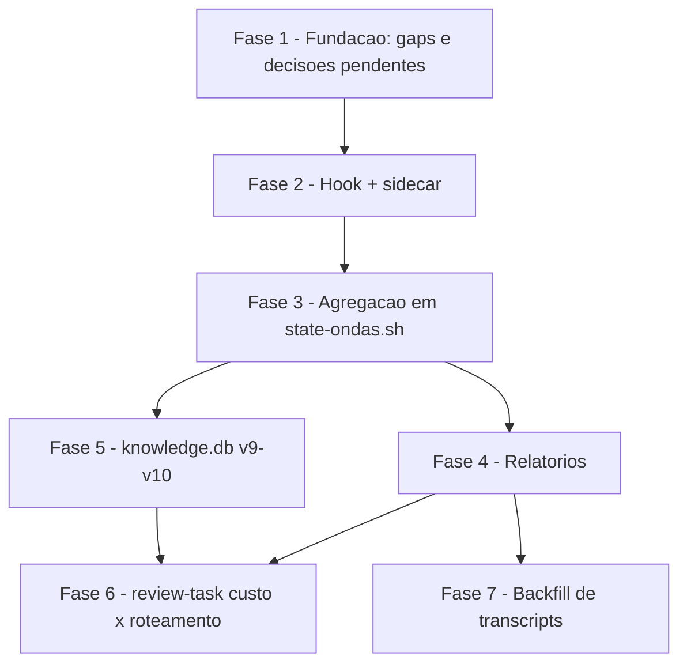

# Tarefas wave-token-metrics - Metricas de Tokens por Spawn de Subagente

Escopo: decompor `plan.md` (fases F1-F6) em backlog executavel. Cobre hook de
captura `PostToolUse`/`Agent`, sidecar JSONL por onda, agregacao em
`state-ondas.sh end`, relatorios (`wave-usage-report.sh` + `report.sh`),
extensao do knowledge.db (v9->v10), consumo em `review-task` (custo x
roteamento) e backfill via transcript. Inclui a resolucao dos 3 gaps abertos
pelos checklists (`requirements.md` CHK003, `security.md` CHK017/CHK020) e o
registro (sem decidir) dos 2 items `{humano}` pendentes (CHK016, CHK024).

**Legenda de status:**
- `[ ]` Pendente
- `[~]` Em andamento
- `[x]` Concluido
- `[!]` Bloqueado

**Legenda de criticidade:**
- `[C]` Critico - Impacto financeiro direto ou bloqueante
- `[A]` Alto - Funcionalidade essencial
- `[M]` Medio - Necessario mas sem urgencia imediata

---

## FASE 1 - Fundacao: gaps de requisito/seguranca e decisoes pendentes

### 1.1 Fechar gap de escopo da spec `[A]`

Ref: checklists/requirements.md CHK003 `[Gap]`

- [x] 1.1.1 Adicionar secao explicita `## Fora de Escopo` em `spec.md`, tornando formal as fronteiras hoje implicitas em "Assumptions & Dependencies" (linhas 308-309: schema de armazenamento e formato exato dos campos de captura sao decisao de `/plan`, nao da spec)
- [x] 1.1.2 Listar nesta secao, no minimo: schema/formato de persistencia (decisao de plan), custo em dinheiro/token pricing (fora de escopo — ver `feature-00c-feature-orchestrator.md` §"Custo em tokens — NAO inventar", dec-005), dashboard visual (cstk-panel, fora desta feature), qualquer heuristica de estimativa de uso para spawns `indisponivel`
- [x] 1.1.3 Rodar `validate-documentation` sobre o `spec.md` atualizado para confirmar que a nova secao nao introduz inconsistencia com o restante do documento

### 1.2 Definir permissoes de arquivo do sidecar e do knowledge.db `[A]`

Ref: checklists/security.md CHK017 `[Gap]` (gap herdado do padrao pre-existente do toolkit — `posttooluse-tool-call-tick.sh` e `~/.claude/cstk/knowledge.db` ja em producao tambem carecem de requisito documentado; esta feature adiciona dado novo ao mesmo arquivo compartilhado, por isso o gap e resolvido aqui em vez de so herdado)

- [x] 1.2.1 Documentar em `data-model.md` §Sidecar a permissao de criacao do arquivo `wave-agent-usage.jsonl`: `0600` (leitura/escrita apenas do dono do processo), criado pelo hook via `umask 077` antes do primeiro append, mesma politica aplicavel retroativamente ao sidecar irmao `tool-call-ticks.log`
- [x] 1.2.2 Documentar a mesma politica (`0600`) para `~/.claude/cstk/knowledge.db`, aplicada na criacao (`sqlite3 ... "PRAGMA ..."` ja usada em `recall.sh`) — sem alterar permissao de um DB ja existente com permissao mais aberta (evitar quebrar setups locais existentes; apenas `chmod` best-effort se detectado mais aberto que `0600`, log via `log_out`, nunca falha)
- [x] 1.2.3 Implementar `umask 077` (ou `chmod 600` pos-criacao) em `posttooluse-agent-usage.sh` antes do primeiro append ao sidecar <!-- satisfeita em 2.1.6: umask 077 no subshell do append + chmod 600 best-effort apos, defesa em profundidade -->
- [x] 1.2.4 Implementar checagem best-effort de permissao do `knowledge.db` em `cli/lib/recall.sh` (na abertura de conexao/migracao), com `chmod 600` corretivo se o arquivo estiver mais aberto — nunca bloqueia, apenas normaliza e loga
- [x] 1.2.5 Escrever teste em `tests/test_posttooluse-agent-usage.sh` verificando que o sidecar criado tem permissao `0600` (via `stat` portavel POSIX/macOS+Linux) <!-- satisfeita em 2.1.9: scenario_sidecar_criado_com_permissao_0600 -->
- [x] 1.2.6 Escrever teste em `tests/cstk/test_recall.sh` verificando que o `knowledge.db` criado do zero tem permissao `0600`

### 1.3 Definir teto de linhas/spawns do sidecar antes do reset `[A]`

Ref: checklists/security.md CHK020 `[Gap]` (achado do gate `owasp-security`, dec-035, severidade INFO/LOW — nao bloqueia, mas fica registrado para create-tasks avaliar um contador leve)

- [x] 1.3.1 Definir e documentar em `research.md` §Decision 5 o teto: **500 linhas** por onda no sidecar `wave-agent-usage.jsonl` (ordem de grandeza generosa acima do "poucos spawns por onda" do plan §Scale/Scope; numero magico deliberado, revisitavel se a experiencia real mostrar insuficiencia)
- [x] 1.3.2 Implementar contador leve (`wc -l` best-effort) em `posttooluse-agent-usage.sh` ANTES de cada append: se a contagem atual já estiver `>= 500`, pular o append desta linha (fail-open, sem bloquear a tool call) e emitir aviso uma unica vez por onda (guard via arquivo-sentinela `<state-dir>/.wave-agent-usage-cap-warned` criado aqui; remocao no ciclo start/end fica para a FASE 3) <!-- satisfeita em 2.1.6; DESVIO do texto original: aviso vai para stderr (printf direto), NAO `log_out` (stdout) — contracts/hook-posttooluse-agent-usage.md §3 e MUST literal "NAO escrever em stdout" para este hook (fail-open puro, stdout SEMPRE vazio, mesma politica de posttooluse-tool-call-tick.sh); log_out haveria contradito essa regra dura do proprio contrato -->
- [x] 1.3.3 Documentar em `data-model.md` §Sidecar o comportamento ao atingir o teto: spawns além do teto ficam fora do agregado da onda (undercounting silencioso conhecido, análogo à tolerância já documentada para a fronteira start/end); o `state-ondas.sh end` reporta `spawns_total` apenas dos observados, nunca fabrica o excedente
- [x] 1.3.4 Escrever teste em `tests/test_posttooluse-agent-usage.sh` cobrindo: sidecar com 500 linhas pre-existentes -> hook nao adiciona linha 501 e nao falha (exit 0) <!-- satisfeita em 2.1.9: scenario_cap_500_linhas_nao_adiciona_501 + scenario_cap_sentinela_evita_aviso_duplicado -->

### 1.4 Registrar decisoes pendentes do dono do produto (nao decidir) `[M]`

Ref: checklists/requirements.md CHK016, CHK024 (`{humano}`)

- [x] 1.4.1 Adicionar em `spec.md` (ou em nota de rodape de `plan.md` §Riscos) um bloco "Decisoes aguardando dono do produto": (a) CHK016 — se a meta 100% de SC-001/SC-004 permanece formalmente correta mesmo com ~50% dos spawns reais sem `usage` (`async_launched`), e como comunicar essa condicional sem parecer metrica quebrada; (b) CHK024 — se a ausencia deliberada de alvo numerico de performance/latencia e aceitavel para este release ou se o operador quer um teto explicito
- [x] 1.4.2 NAO implementar nenhuma resposta hipotetica para CHK016/CHK024 nesta fase — registrar apenas o texto da pergunta e o estado atual (spec/plan ja documentam honestamente a ausencia/condicional); a resolucao fica para o operador decidir antes ou durante `review-task` final

---

## FASE 2 - Hook de captura + sidecar (F1, base US1)

### 2.1 Implementar hook `posttooluse-agent-usage.sh` `[A]`

Ref: plan.md §Project Structure ("CRIAR"); contracts/hook-posttooluse-agent-usage.md

- [x] 2.1.1 Criar `global/skills/agente-00c-runtime/hooks/posttooluse-agent-usage.sh`, espelhando a estrutura de `posttooluse-tool-call-tick.sh`: le JSON do stdin, extrai `tool_name`, sai `exit 0` silencioso se `tool_name != "Agent"`
- [x] 2.1.2 Implementar deteccao de execucao 00c ativa (REUSO da logica ja existente em `pretooluse-bash-guard.sh` §4 — precedencia `agente-00c` > `feature-00c` por short-name lexicografico); `exit 0` sem interferencia se nenhuma execucao ativa
- [x] 2.1.3 Extrair campos do `tool_response` (`agentId`, `status`, `resolvedModel`, `modelsUsed`, `totalTokens`, `usage.*`, `totalToolUseCount`, `totalDurationMs`) e do `tool_input` (`subagent_type`) via `jq` com `// null` em todo acesso (Principio VI — nao inventar campo ausente)
- [x] 2.1.4 Derivar `status` (`completo`/`parcial`/`indisponivel`) conforme a state machine de `data-model.md` §State transitions; `indisponivel` **MUST** zerar (== `null`, nunca `0`) todos os campos numericos de uso
- [x] 2.1.5 Montar a linha JSON compacta (`jq -c`) do sidecar conforme `contracts/hook-posttooluse-agent-usage.md` §2, garantindo ausencia de `content`/`prompt`/`description` e tamanho < PIPE_BUF
- [x] 2.1.6 Aplicar `umask 077` antes do primeiro append (ref: subtarefa 1.2.3) e o cap de 500 linhas (ref: subtarefa 1.3.2) antes de gravar
- [x] 2.1.7 Fazer append atomico (`>>`) em `<state-dir>/wave-agent-usage.jsonl`; `source = "live"`, `observed_at` via `date -u +%Y-%m-%dT%H:%M:%SZ`
- [x] 2.1.8 Garantir politica fail-open absoluta: sem `set -e`; qualquer falha (jq ausente, stdin invalido, append negado) => `exit 0` silencioso, nunca bloqueio da tool call <!-- "nunca stderr" vale para os caminhos de FALHA (verificado empiricamente: jq ausente e stdin invalido emitem stderr vazio); o UNICO stderr do hook e o aviso de cap deliberado (nota 1.3.2), rate-limited a 1x/onda via sentinela, exigido pelo proprio backlog -->
- [x] 2.1.9 Escrever `tests/test_posttooluse-agent-usage.sh` cobrindo: matcher `Agent` vs outros tools, execucao ativa vs inativa, `status` completo/parcial/indisponivel, ausencia de `content`/`prompt` na linha gravada, fail-open em jq ausente/stdin invalido, permissao `0600` (subtarefa 1.2.5), cap de 500 linhas (subtarefa 1.3.4) <!-- 18 scenarios, todos verdes via ./tests/run.sh -->

### 2.2 Provisionar o hook novo `[A]`

Ref: plan.md §Project Structure ("MODIFICAR" settings.snippet.json)

- [x] 2.2.1 Adicionar entrada `PostToolUse` matcher `Agent` -> `posttooluse-agent-usage.sh` em `global/skills/agente-00c-runtime/hooks/settings.snippet.json`
- [x] 2.2.2 Confirmar em `cli/lib/hooks.sh::apply_guard_hooks()` que o hook novo e copiado no provisionamento de projeto (mesmo mecanismo do hook de ticks); ajustar se necessario
- [x] 2.2.3 Adicionar isencao existence-guarded do hook novo em `tests/run.sh::_is_internal_test` (precedente literal: linhas 298-303, hooks vivem fora de `scripts/` e por isso quebram a regra 1:1 do `--check-coverage`)
- [x] 2.2.4 Estender `tests/cstk/test_hooks.sh` cobrindo o provisionamento do hook novo (arquivo copiado + entrada no settings.snippet.json aplicada) <!-- scenario_apply_guard_hooks_copia_posttooluse_agent_usage + ghost-check em scenario_apply_guard_hooks_catalogo_antigo_sem_tick -->

---

## FASE 3 - Agregacao em `state-ondas.sh` (F2, US1)

### 3.1 Agregar `SpawnUsage` do sidecar em `.waves[]` `[A]`

Ref: data-model.md §"Extensoes ao state.json"; contracts/wave-usage-report.md §4

- [x] 3.1.1 Em `state-ondas.sh start`, garantir reset do sidecar `wave-agent-usage.jsonl` (espelhando `_so_ticks_reset`) e remocao do sentinela de cap-warned (subtarefa 1.3.2)
- [x] 3.1.2 Em `state-ondas.sh end`, ler o sidecar da onda corrente e agregar em `WaveUsage`: `spawns_total`, `spawns_with_usage`, `spawns_unavailable`, somas de `total_tokens`/`input_tokens`/`output_tokens`/`cache_read_input_tokens`/`cache_creation_input_tokens`/`tool_use_count`/`duration_ms` (soma **apenas** sobre spawns com dado; `null` quando `spawns_with_usage == 0` — nunca `0` fabricado)
- [x] 3.1.3 Gravar o agregado em `.waves[N].agent_usage` e o array bruto de `SpawnUsage` em `.waves[N].agent_spawns[]`
- [x] 3.1.4 Incrementar `.accumulated_metrics.agent_spawns_total`, `.agent_spawns_with_usage_total`, `.agent_tokens_total`, `.agent_tool_use_count_total`, `.agent_duration_ms_total` no mesmo `jq` do `end` (padrao `(.campo // 0) + incremento` para retro-compatibilidade) <!-- campos nullable (agent_tokens_total/agent_tool_use_count_total/agent_duration_ms_total) usam helper add_null (delta null preserva o acumulado existente) em vez do padrao `// 0` simples, para nao fabricar 0 quando a onda nao contribui dado -->
- [x] 3.1.5 Resetar o sidecar apos a agregacao (mesmo ciclo de vida do sidecar de ticks: reset em `start` e em `end`)
- [x] 3.1.6 Garantir retro-compatibilidade: onda sem sidecar (feature anterior a esta) produz `agent_usage: null`, `agent_spawns: []`, sem erro
- [x] 3.1.7 Estender `tests/test_state-ondas.sh` cobrindo: agregacao com spawns completos/parciais/indisponiveis misturados, onda sem sidecar (retro-compat), reset do sidecar em start/end, incremento correto de `.accumulated_metrics` <!-- 9 scenarios novos (70 total no arquivo, todos verdes); inclui cenario extra de linhas corrompidas no sidecar (resiliencia via `jq -R -n '[inputs | fromjson?]'`) e cenario de nao-fabricacao de 0 quando todos os spawns sao indisponivel -->

---

## FASE 4 - Relatorios (F3, US1/FR-005)

### 4.1 Criar `wave-usage-report.sh` `[A]`

Ref: contracts/wave-usage-report.md §2/§3

- [x] 4.1.1 Criar `global/skills/agente-00c-runtime/scripts/wave-usage-report.sh` com subcomando `aggregate --state-dir <DIR>` produzindo saida Markdown (default) conforme `contracts/wave-usage-report.md` §2.1, respeitando o invariante de honestidade SC-004 (exibir `spawns_total`/`spawns_with_usage`/`spawns_unavailable` juntos sempre que `spawns_unavailable > 0`)
- [x] 4.1.2 Implementar saida `--json` (contracts §2.2) com o mesmo agregado em formato maquina-legivel
- [x] 4.1.3 Implementar subcomando `backfill` (US4/FR-010/FR-011) conforme contracts §3 — ver detalhamento na FASE 7. <!-- onda-013: implementado em FASE 7 (7.1.1-7.1.5), ver notas la -->
- [x] 4.1.4 Escrever `tests/test_wave-usage-report.sh` cobrindo `aggregate` (Markdown + JSON), casos de zero spawns vs "metrica nao coletada" (research Decision 10), e o invariante SC-004 — 17/17 cenarios verdes, Markdown validado byte-a-byte contra o exemplo do contrato <!-- onda-013: arquivo estendido com cobertura de backfill (FASE 7), total 31/31 cenarios verdes -->

### 4.2 Estender `report.sh` §1/§2 `[M]`

Ref: contracts/wave-usage-report.md §6

- [x] 4.2.1 Adicionar secao de consumo de tokens/tool-uses/duracao ao relatorio gerado por `report.sh` (secoes 1 e 2), consumindo `wave-usage-report.sh aggregate --json` como fonte
- [x] 4.2.2 Garantir que o relatorio distingue "0 spawns" (nenhum subagente spawnado) de "metrica nao coletada" (hook nao provisionado) — nunca reportar 0 quando o dado real e ausencia de coleta
- [x] 4.2.3 Estender `tests/test_report.sh` (ou criar se inexistente) cobrindo as novas secoes do relatorio, incluindo o caso "metrica nao coletada" <!-- onda-012: report.sh delega a wave-usage-report.sh aggregate --json (script irmao, best-effort); secoes 1/2 ganham Spawns/Tokens/Cobertura + colunas Spawns/Tokens por onda; fallback JSON com null (nunca 0) quando o helper esta ausente; 25/25 cenarios verdes em test_report.sh (3 novos: coletado, nao-coletado, helper ausente) -->

---

## FASE 5 - knowledge.db v9 -> v10 (F4, US3/FR-006)

### 5.1 Migracao de schema `[A]`

Ref: data-model.md §"Extensao do knowledge.db: v9 -> v10"

- [x] 5.1.1 Bumpar `RECALL_SCHEMA_VERSION` de 9 para 10 em `cli/lib/recall.sh`
- [x] 5.1.2 Adicionar as 9 colunas novas `INTEGER` na tabela `waves` (`agent_spawns_total`, `agent_spawns_with_usage`, `agent_total_tokens`, `agent_input_tokens`, `agent_output_tokens`, `agent_cache_read_tokens`, `agent_cache_creation_tokens`, `agent_tool_use_count`, `agent_duration_ms`) via migracao aditiva idempotente (`PRAGMA table_info(waves)` + `case`, padrao literal ja usado em v7->v8/v8->v9)
- [x] 5.1.3 Confirmar que a migracao NAO faz `DROP` e preserva dados v9 existentes
- [x] 5.1.4 Aplicar `recall_int_or_null` (helper ja existente) em todas as 9 colunas novas na ingestao — onda antiga ou sem dado => `NULL`, nunca `0` (mesma regra de `wallclock_seconds`/`tool_calls`)

### 5.2 Ingestao e retrofit `[A]`

Ref: contracts/wave-usage-report.md §7

- [x] 5.2.1 Estender a rotina de ingestao (`--ingest`) para ler `.waves[].agent_usage` do `state.json` e popular as 9 colunas novas
- [x] 5.2.2 Estender `recall_mode_reindex()` (`--reindex`) para retrofit das colunas novas a partir de states existentes (aplicando os mesmos defaults `NULL`)
- [x] 5.2.3 Aplicar o guard best-effort de permissao `0600` no `knowledge.db` (subtarefa 1.2.4) no ponto de abertura/migracao de conexao
- [x] 5.2.4 Estender `tests/cstk/test_recall.sh` cobrindo: migracao v9->v10 idempotente, preservacao de dados v9, ingestao das 9 colunas novas, `--reindex` retrofit, `NULL` em vez de `0` para state antigo, permissao `0600` na criacao (subtarefa 1.2.6)

---

## FASE 6 - `review-task` custo x roteamento (F5, US2/FR-007)

### 6.1 Consumir `wave-usage-report.sh` em `review-task` `[M]`

Ref: contracts/wave-usage-report.md §5

- [x] 6.1.1 Adicionar em `global/skills/review-task/SKILL.md` §4.5 a invocacao de `wave-usage-report.sh aggregate --json` cruzada com `model-routing-report.sh aggregate` (mesma fonte de `.decisions[]`, sem tocar `.waves` — preserva o invariante que aquele script publica)
- [x] 6.1.2 Documentar no SKILL.md a leitura conjunta: para cada onda, exibir modelo aplicado (model-routing) lado a lado com consumo de tokens/tool-uses/duracao observado (wave-usage), destacando divergencias sugerido-vs-aplicado que tiveram alto consumo
- [x] 6.1.3 Escrever cenario de teste (fixture de state.json com `.waves[].agent_usage` + `.decisions[]` de model-routing) validando a secao cruzada, ou estender o test existente do `review-task` se houver harness automatizado para o SKILL.md <!-- onda-012: review-task/SKILL.md nao tem harness automatizado proprio (skill prose-driven); seguiu o padrao "sanity" ja usado por test_model-routing-report.sh — 2 cenarios novos em test_wave-usage-report.sh (referencia da subsecao no SKILL.md + composicao real dos dois scripts sobre o mesmo state.json, provando read-only preservado e join correto); 19/19 verdes. Subsecao "Cruzamento com consumo de tokens observado" adicionada em SKILL.md §4.5 (join via jq entre linhas_onda[] de model-routing-report.sh --json e por_onda[] de wave-usage-report.sh --json, chave onda; nenhum dos dois scripts alterado, preservando ambos os invariantes publicados); template de relatorio + Gotcha "Agregado model-routing nao deve ser reformatado" atualizados com a excecao explicita (subsecao derivada, nao verbatim) -->

---

## FASE 7 - Backfill de transcripts (F6, US4/FR-010/FR-011)

### 7.1 Implementar `wave-usage-report.sh backfill` `[M]`

Ref: research.md §"Decision 9 — Backfill por janela temporal, com recusa explicita"; contracts/wave-usage-report.md §3

- [x] 7.1.1 Implementar subcomando `backfill --state-dir <DIR> --transcript <PATH>` que le o transcript JSONL informado e extrai `SpawnUsage` com `source = "backfill"` (nunca `"live"`) <!-- onda-013: _wur_cmd_backfill + _wur_backfill_jq_program em wave-usage-report.sh; correlaciona tool_use(name="Agent") <-> tool_result via tool_use_id, mesma derivacao de status/null-vs-0 do hook posttooluse-agent-usage.sh; validado empiricamente contra o transcript real desta sessao (15 spawns extraidos, 1 coberto por onda-007 ja fechada) -->
- [x] 7.1.2 Implementar a heuristica de janela temporal (delimitando quais spawns do transcript pertencem a qual onda) conforme documentado em research.md Decision 9 <!-- onda-013: started_at<=ts<finished_at via epoch(fromdateiso8601), primeiro match vence; spawns fora de toda janela sao descartados (nao pertencem a esta execucao) -->
- [x] 7.1.3 Implementar recusa explicita: quando o transcript nao cobre a janela da onda solicitada (ou esta ausente), o comando **MUST** recusar com mensagem clara em vez de estimar/inventar — nunca produzir `SpawnUsage` sintetico <!-- onda-013: exit 3 em dois casos distintos — transcript ausente/ilegivel (checado antes do parse) e transcript lido mas covered_total==0 (nenhum spawn cai em nenhuma janela); mensagem nomeia .execution.id/basename do state-dir; nenhum write ocorre em ambos -->
- [x] 7.1.4 Documentar em `quickstart.md` o fluxo de uso do `backfill` (cenarios 9 e 10) <!-- onda-013: Cenario 9/10 ja escritos no /plan batiam com o comportamento implementado (--dry-run lista onda+agent_id, dedup por (wave_id,agent_id), exit 3 com mensagem nomeando a execucao) — nenhuma correcao necessaria, conferido linha a linha -->
- [x] 7.1.5 Estender `tests/test_wave-usage-report.sh` cobrindo: backfill com transcript valido dentro da janela, recusa com transcript ausente/fora da janela, `source = "backfill"` sempre marcado corretamente <!-- onda-013: 15 cenarios novos (uso invalido, ausente/sem-cobertura exit 3, happy-path por janela, indisponivel null-nao-zero, linha corrompida ignorada, idempotencia byte-identica, --dry-run sem side-effect, backup+sha256 apos apply, accumulated_metrics incrementado) — 31/31 verdes no arquivo total -->

---

## Matriz de Dependencias

## Resumo Quantitativo

| Fase | Tarefas | Subtarefas | Criticidade |
|------|---------|------------|-------------|
| 1 - Fundacao: gaps e decisoes pendentes | 4 | 15 | A/M |
| 2 - Hook + sidecar | 2 | 13 | A |
| 3 - Agregacao em state-ondas.sh | 1 | 7 | A |
| 4 - Relatorios | 2 | 7 | A/M |
| 5 - knowledge.db v9->v10 | 2 | 8 | A |
| 6 - review-task custo x roteamento | 1 | 3 | M |
| 7 - Backfill de transcripts | 1 | 5 | M |
| **Total** | **13** | **58** | - |

## Escopo Coberto

| Item | Descricao | Fase |
|------|-----------|------|
| CHK003 | Secao "Fora de Escopo" formal na spec | 1 |
| CHK017 | Permissoes de arquivo (0600) do sidecar e knowledge.db | 1 |
| CHK020 | Teto de 500 linhas/spawns por onda no sidecar antes do reset | 1 |
| F1 | Hook `posttooluse-agent-usage.sh` + provisionamento + testes | 2 |
| F2 | Agregacao de `SpawnUsage` em `.waves[]`/`.accumulated_metrics` | 3 |
| F3 | `wave-usage-report.sh aggregate` + extensao de `report.sh` §1/§2 | 4 |
| F4 | knowledge.db v9->v10 (9 colunas novas) + ingestao + retrofit | 5 |
| F5 | `review-task` §4.5 custo x roteamento | 6 |
| F6 | `wave-usage-report.sh backfill` (US4) | 7 |

## Escopo Excluido

| Item | Descricao | Motivo |
|------|-----------|--------|
| Dashboard visual (cstk-panel) | Renderizacao grafica dos dados de consumo | Fora do escopo desta feature (dado disponivel no knowledge.db para consumo futuro; painel e projeto separado) |
| Custo em $/pricing | Conversao de tokens em custo monetario | dec-005 do model-routing (harness nao expoe contabilidade de tokens/preco a scripts); `tool_calls` permanece o proxy documentado |
| Estimativa/heuristica para spawns `indisponivel` | Preencher valor estimado quando o harness nao retorna `usage` | Violaria Principio VI (Zero Fabricacao) — `null` e a unica saida correta, nunca numero inferido |
| CHK016 (meta 100% vs ~50% cobertura) | Decisao sobre comunicar a condicional da metrica 100% | `{humano}` — aguardando dono do produto (subtarefa 1.4.1), nao decidivel pelo backlog |
| CHK024 (alvo de performance/latencia) | Definir teto numerico de latencia | `{humano}` — aguardando dono do produto (subtarefa 1.4.1), ausencia documentada como deliberada no plan |

## FASE 8 - Convergência

> Fase gerada automaticamente pela skill `converge` (reconciliação
> spec-vs-código). Cada tarefa abaixo corresponde a um achado (`Gap`)
> entre o que `spec.md`/`plan.md`/`tasks.md` descreveram e o estado
> presente do código. Tarefas sem o prefixo `[Revisar]` são acionáveis
> (`missing`/`partial`/`contradicts`); tarefas com `[Revisar]` são item de
> revisão (`unrequested`, FR-013) — nunca "implementar", o código já
> existe. Append-only: esta fase nunca reescreve fases/tarefas anteriores
> do arquivo (FR-009).

### 8.1 Exit code de `aggregate` diverge entre contrato e implementação `[C]`

Ref: FR-005 / task 4.1.1 · tipo: `contradicts` · severidade: `HIGH`

`contracts/wave-usage-report.md` §2 ("Exit codes") declara que `aggregate`
retorna `2` quando `state.json` está ausente. A implementação em
`global/skills/agente-00c-runtime/scripts/wave-usage-report.sh` (função
`_wur_cmd_aggregate`, e o mesmo padrão replicado em `_wur_cmd_backfill`)
retorna `1` para esse caso — consistente com o precedente que o próprio
contrato cita ("espelham `model-routing-report.sh`"): `model-routing-report.sh`
de fato usa exit `1` para `state.json` ausente (`_mrr_die "aggregate:
state.json nao encontrado..." 1`), não `2`. `2` em ambos os scripts é
reservado a uso inválido (flag ausente/desconhecida). O comportamento
atual é o correto (bate com o precedente e com
`tests/test_wave-usage-report.sh::scenario_aggregate_state_dir_inexistente_exit_1`)
— o gap está no texto do contrato, desatualizado desde a FASE 4
(onda-010), nunca corrigido.

- [x] 8.1.1 Corrigir `docs/specs/wave-token-metrics/contracts/wave-usage-report.md` §2 ("Exit codes"): `state.json` inexistente retorna `1` (erro genérico), não `2`; `2` fica só para uso inválido (flag ausente/desconhecida) — sem tocar em código/testes, que já estão corretos <!-- onda-013: linha corrigida no contrato, alinhada ao codigo/testes ja corretos e ao precedente model-routing-report.sh -->

<!-- converge-key: 5a156716f3bf -->
