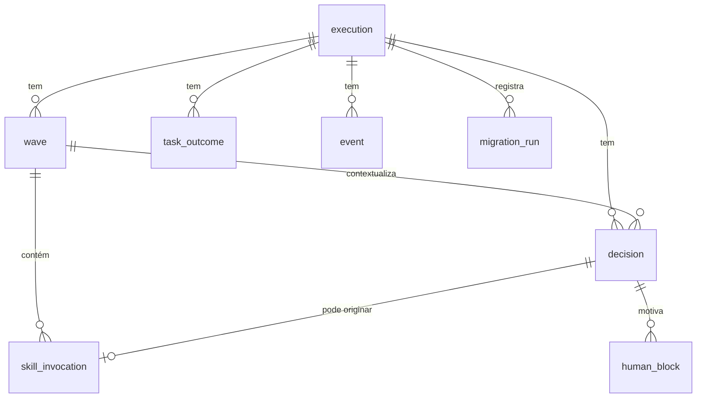

# Data Model: state.db

**Feature**: `state-db-foundation` | **Date**: 2026-07-30 | **Phase**: 1
**Spec**: [spec.md](./spec.md) | **Research**: [research.md](./research.md)

Schema relacional do `state.db` (um banco por projeto, em
`<projeto-alvo>/.claude/{agente-00c-state,feature-00c-state/<short-name>}/state.db`).

> **Origem dos nomes de campo**: todos os campos abaixo derivam do
> `state.json` real produzido por `state-rw.sh init` e mutado pelos demais
> scripts do runtime — nomes em inglês, conforme a canonicalização pt-BR→EN
> já vigente (`_SR_RENAME_MAP` em `state-rw.sh`). Nenhum nome foi inventado.
> As colunas espelham os campos que hoje existem; onde esta feature propõe
> um campo **novo**, ele está marcado `[PROPOSTA]`.
>
> **Status do DDL**: o SQL abaixo é **especificação de contrato**, não
> implementação. `/execute-task` é quem escreve o DDL definitivo.

---

## Visão geral



Convenção geral: **uma linha em `execution`** por banco (o `state.json` de
hoje descreve exatamente uma execução). A tabela existe como entidade real —
e não como colunas soltas — para que as FKs tenham um alvo e para que a
unicidade seja declarável.

---

## Entity: execution

A execução 00c corrente. Espelha `.execution` + `.budgets` +
`.accumulated_metrics` + campos de topo do `state.json`.

| Coluna | Tipo | Constraint | Origem no state.json |
|---|---|---|---|
| `id` | TEXT | PK | `.execution.id` |
| `schema_version` | TEXT | NOT NULL | `.schema_version` (`"1.0.0"`) |
| `short_name` | TEXT | NULL (só feature-00c) | `.short_name` |
| `target_project_path` | TEXT | NOT NULL | `.execution.target_project_path` |
| `target_project_description` | TEXT | NOT NULL | `.execution.target_project_description` |
| `suggested_stack` | TEXT | NULL (JSON) | `.execution.suggested_stack` |
| `status` | TEXT | NOT NULL + CHECK enum | `.execution.status` |
| `termination_reason` | TEXT | NULL | `.execution.termination_reason` |
| `started_at` | TEXT | NOT NULL | `.execution.started_at` |
| `finished_at` | TEXT | NULL | `.execution.finished_at` |
| `canonical_project` | TEXT | NULL | `.execution.canonical_project` |
| `session_name` | TEXT | NULL | `.execution.session_name` |
| `current_stage` | TEXT | NOT NULL | `.current_stage` |
| `next_instruction` | TEXT | NOT NULL | `.next_instruction` |
| `atomic_commit_enabled` | INTEGER | NULL (0/1) | `.atomic_commit_enabled` |
| `initial_key_aspects` | TEXT | NULL (JSON array) | `.initial_key_aspects` |
| `subagent_depth` | INTEGER | NOT NULL DEFAULT 1 | `.budgets.current_subagent_depth` |
| `max_recursion` | INTEGER | NOT NULL DEFAULT 3 | `.budgets.max_recursion` |
| `cycles_consumed_current_stage` | INTEGER | NOT NULL DEFAULT 0 | `.budgets.cycles_consumed_current_stage` |
| `max_cycles_per_stage` | INTEGER | NOT NULL DEFAULT 5 | `.budgets.max_cycles_per_stage` |
| `retro_executions_consumed` | INTEGER | NOT NULL DEFAULT 0 | `.budgets.retro_executions_consumed` |
| `max_retro_executions_per_feature` | INTEGER | NOT NULL DEFAULT 2 | `.budgets.max_retro_executions_per_feature` |

Demais campos de `.budgets` (thresholds de onda), `.accumulated_metrics`,
`.external_urls_whitelist`, `.circular_movement_history`, `.prerequisites`
(briefing/constitution sha256), `briefing_cache`/`constitution_cache` e
`.push_pr_result`: **[PROPOSTA]** manter como colunas adicionais ou tabelas
satélite — decisão de granularidade delegada à task de schema, desde que o
export FR-007 os reconstitua integralmente. Os contadores acumulados
(`.accumulated_metrics.*`) são **deriváveis** por agregação das tabelas
(ex.: `decisions_total = COUNT(*) FROM decision`), o que remove uma classe
inteira de divergência que hoje só é mantida correta por incremento manual
em cada script.

### Constraints que materializam FR-002

```sql
-- 1. Enum de status (hoje só validado a posteriori por state-validate.sh)
CHECK (status IN ('em_andamento','aguardando_humano','abortada','concluida'))

-- 2. Consistência status x finished_at
CHECK (
  (status IN ('abortada','concluida') AND finished_at IS NOT NULL)
  OR
  (status IN ('em_andamento','aguardando_humano') AND finished_at IS NULL)
)

-- 3. Teto de profundidade de subagente (FR-002; _ST_MAX=3 em spawn-tracker.sh)
CHECK (subagent_depth >= 1 AND subagent_depth <= max_recursion)

-- 4. Tetos de ciclo e retro (hoje em state-validate.sh)
CHECK (cycles_consumed_current_stage <= max_cycles_per_stage)
CHECK (retro_executions_consumed <= max_retro_executions_per_feature)
```

> **Nota sobre o teto de spawn**: o valor 3 vem da constante `_ST_MAX=3`
> em `spawn-tracker.sh` (comentário no fonte: "FR-013: max 3 niveis
> (filho, neto, bisneto)"), coerente com `.budgets.max_recursion` gravado
> por `state-rw.sh init`. Ao virar `CHECK`, a tentativa de exceder o teto
> passa a ser rejeitada **na escrita** — hoje `spawn-tracker.sh enter` sai
> 3 sem gravar, mas nada impede outro caminho de escrita de furar o teto.

---

## Entity: wave (Onda)

Espelha `.waves[]`. IDs no formato `onda-NNN` (`printf 'onda-%03d'`).

| Coluna | Tipo | Constraint | Origem |
|---|---|---|---|
| `id` | TEXT | PK | `.waves[].id` |
| `execution_id` | TEXT | FK → execution(id), NOT NULL | — |
| `seq` | INTEGER | NOT NULL, UNIQUE(execution_id, seq) | ordinal (1-based) |
| `started_at` | TEXT | NOT NULL | `.waves[].started_at` |
| `finished_at` | TEXT | NULL ⇒ onda aberta | `.waves[].finished_at` |
| `wallclock_seconds` | INTEGER | NULL | `.waves[].wallclock_seconds` |
| `tool_calls` | INTEGER | NOT NULL DEFAULT 0 | `.waves[].tool_calls` |
| `termination_reason` | TEXT | NULL ⇒ aberta; CHECK enum | `.waves[].termination_reason` |
| `next_wave_scheduled_for` | TEXT | NULL | `.waves[].next_wave_scheduled_for` |
| `executed_stages` | TEXT | JSON array | `.waves[].executed_stages` |
| `agent_usage` | TEXT | NULL (JSON) | `.waves[].agent_usage` |
| `agent_spawns` | TEXT | NULL (JSON) | `.waves[].agent_spawns` |
| `otel_usage` | TEXT | NULL (JSON) | `.waves[].otel_usage` |

### Constraints que materializam FR-002

```sql
-- Enum de motivo de término — os 5 valores validados hoje por state-ondas.sh
CHECK (termination_reason IS NULL OR termination_reason IN (
  'etapa_concluida_avancando','threshold_proxy_atingido',
  'bloqueio_humano','aborto','concluido'))

-- INVARIANTE CENTRAL: no máximo UMA onda aberta por execução.
-- Índice UNIQUE parcial: só indexa linhas com termination_reason IS NULL,
-- logo permite N ondas fechadas e no máximo 1 aberta.
CREATE UNIQUE INDEX ux_wave_single_open
  ON wave(execution_id) WHERE termination_reason IS NULL;

-- Coerência: onda fechada tem os dois campos de fechamento preenchidos
CHECK ((termination_reason IS NULL AND finished_at IS NULL)
    OR (termination_reason IS NOT NULL AND finished_at IS NOT NULL))
```

O índice parcial `ux_wave_single_open` é o que substitui, com garantia real,
a guarda hoje escrita em prosa no arquivo do orquestrador (o passo 3.bis do
Loop principal, que manda checar `wave-status` antes de chamar `start`
porque `state-ondas.sh start` **não é idempotente** e faz append cego em
`.waves[]`). Com o índice, uma segunda abertura falha na camada de
armazenamento em vez de duplicar a onda.

**"Uma onda fechada uma única vez" (FR-002)**: não é expressável por
`CHECK` (que só enxerga a linha final, não a transição). Requer
`TRIGGER BEFORE UPDATE`:

```sql
CREATE TRIGGER trg_wave_close_once BEFORE UPDATE ON wave
WHEN OLD.termination_reason IS NOT NULL
     AND NEW.termination_reason IS NOT OLD.termination_reason
BEGIN
  SELECT RAISE(ABORT, 'wave already closed');
END;
```

---

## Entity: decision (Decisão)

Espelha `.decisions[]`. IDs `dec-NNN` (`printf 'dec-%03d'`).

| Coluna | Tipo | Constraint | Origem (flag do `state-decisions.sh register`) |
|---|---|---|---|
| `id` | TEXT | PK | `.decisions[].id` |
| `execution_id` | TEXT | FK → execution(id), NOT NULL | — |
| `wave_id` | TEXT | FK → wave(id), NULL p/ `"init"` | `.wave_id` |
| `timestamp` | TEXT | NOT NULL | `.timestamp` |
| `agent` | TEXT | NOT NULL, len > 0 | `.agent` (`--agente`) |
| `stage` | TEXT | NOT NULL, len > 0 | `.stage` (`--etapa`) |
| `context` | TEXT | NOT NULL, len >= 20 | `.context` (`--contexto`) |
| `options_considered` | TEXT | NOT NULL, JSON array len >= 1 | `.options_considered` (`--opcoes`) |
| `choice` | TEXT | NOT NULL, len > 0 | `.choice` (`--escolha`) |
| `rationale` | TEXT | NOT NULL, len >= 20 | `.rationale` (`--justificativa`) |
| `justification_score` | INTEGER | NULL ou 0..3 | `.justification_score` (`--score`) |
| `evidence` | TEXT | NULL | `.evidence` (`--evidencia`) |
| `references` | TEXT | NULL (JSON array) | `.references` (`--referencias`) |
| `originating_artifact` | TEXT | NULL | `.originating_artifact` |

> `--score` mapeia para a coluna `justification_score` — confirmado no
> fonte de `state-decisions.sh`. O nome da flag e o do campo **não**
> coincidem; preservar o nome do campo é requisito de compatibilidade do
> export (FR-007) e da ingestão do recall, que lê
> `.score // .justification_score // .score_justificativa`.

### Constraints que materializam FR-002 (os 5 campos obrigatórios, Princípio I)

```sql
CHECK (length(agent)   > 0)
CHECK (length(stage)   > 0)
CHECK (length(choice)  > 0)
CHECK (length(context)   >= 20)   -- paridade com a regra de state-decisions.sh
CHECK (length(rationale) >= 20)   -- idem
CHECK (json_valid(options_considered)
       AND json_array_length(options_considered) >= 1)
CHECK (justification_score IS NULL
       OR justification_score BETWEEN 0 AND 3)

-- Trava empírica do score 3: exige evidência >= 20 chars
CHECK (justification_score IS NULL OR justification_score < 3
       OR (evidence IS NOT NULL AND length(evidence) >= 20))
```

Esta última constraint é o exemplo mais direto do ganho da feature: hoje a
regra "score 3 exige evidência" vive **apenas** dentro de
`state-decisions.sh register`. Qualquer escrita que não passe por esse
script — inclusive um agente autônomo editando estado por outro caminho —
contorna a trava silenciosamente. Como `CHECK`, ela passa a valer para todo
escritor.

> `json_valid` / `json_array_length` exigem o SQLite compilado com JSON1.
> Presente por padrão desde 3.38 (2022); ambiente local verificado em 3.51.0.
> **A verificar na task de schema**: confirmar JSON1 no `sqlite3` alvo antes
> de depender dessas funções em `CHECK`; sem JSON1, degradar para
> `CHECK (length(options_considered) > 2)` + validação no script.

---

## Entity: human_block (Bloqueio Humano)

Espelha `.human_blocks[]`. IDs `block-NNN`.

| Coluna | Tipo | Constraint | Origem |
|---|---|---|---|
| `id` | TEXT | PK | `.human_blocks[].id` |
| `execution_id` | TEXT | FK → execution(id), NOT NULL | — |
| `decision_id` | TEXT | **FK → decision(id), NOT NULL** | `.decision_id` |
| `question` | TEXT | NOT NULL, len >= 20 | `.question` |
| `context_for_answer` | TEXT | NOT NULL, len > 0 | `.context_for_answer` |
| `recommended_options` | TEXT | NULL (JSON array) | `.recommended_options` |
| `status` | TEXT | NOT NULL, CHECK enum | `.status` |
| `human_answer` | TEXT | NULL | `.human_answer` |
| `triggered_at` | TEXT | NOT NULL | `.triggered_at` |
| `answered_at` | TEXT | NULL | `.answered_at` |

```sql
CHECK (status IN ('aguardando','respondido'))
CHECK ((status = 'aguardando'  AND answered_at IS NULL)
    OR (status = 'respondido' AND answered_at IS NOT NULL))
CHECK (length(question) >= 20)
FOREIGN KEY (decision_id) REFERENCES decision(id)
```

A FK cobre o FR-002 ("bloqueio humano referenciando decisão inexistente") e
o cenário US1-AS4. Hoje isso é uma checagem imperativa
(`_bl_decisao_exists` em `bloqueios.sh`) mais uma revalidação *a posteriori*
em `state-validate.sh`. **Requer `PRAGMA foreign_keys=ON` por conexão** —
sem isso a FK é decorativa (ver research.md Decision 5).

---

## Entity: task_outcome (Resultado de Task)

Espelha `.tasks[]` (camada B). Chave natural documentada:
`(project, feature, execution_id, task_id)`.

| Coluna | Tipo | Constraint | Origem |
|---|---|---|---|
| `execution_id` | TEXT | FK → execution(id), NOT NULL | — |
| `task_id` | TEXT | NOT NULL, PK(execution_id, task_id) | `.task_id` |
| `title` | TEXT | NOT NULL (pode ser `''`) | `.title` |
| `wave_id` | TEXT | FK → wave(id), NOT NULL | `.wave_id` |
| `outcome` | TEXT | NOT NULL, CHECK enum | `.outcome` |
| `tests_run` | INTEGER | NOT NULL, >= 0 | `.tests_run` |
| `tests_passed` | INTEGER | NOT NULL, >= 0 | `.tests_passed` |
| `lint_ok` | INTEGER | NULL (0/1) | `.lint_ok` |
| `touched_files` | TEXT | NOT NULL, JSON array | `.touched_files` |
| `recorded_at` | TEXT | NOT NULL | `.recorded_at` |
| `source` | TEXT | NULL | `.source` |

```sql
CHECK (outcome IN ('pass','fail'))
CHECK (tests_run >= 0 AND tests_passed >= 0 AND tests_passed <= tests_run)
CHECK (lint_ok IS NULL OR lint_ok IN (0,1))
```

A PK composta `(execution_id, task_id)` dá de graça o upsert idempotente que
`state-ondas.sh record-task` implementa hoje em jq — e elimina a
possibilidade de duas linhas para a mesma task.

---

## Entity: event (Evento)

Espelha `.events[]`. Timeline cronológica; sem enum fechado (o `event_type`
é texto livre restrito por convenção — a ingestão do recall **não** valida
allowlist, conforme o contrato da camada B).

| Coluna | Tipo | Constraint | Origem |
|---|---|---|---|
| `id` | INTEGER | PK AUTOINCREMENT (ordem de append) | — |
| `execution_id` | TEXT | FK → execution(id), NOT NULL | — |
| `event_type` | TEXT | NOT NULL, len > 0 | `.event_type` |
| `timestamp` | TEXT | NOT NULL | `.timestamp` |
| `description` | TEXT | NULL | `.description` |

Tipos em uso hoje: `lock_contention`, `validation_failed`, `wave_retry`,
`schedule_wait`, `recall_consulted`. A PK autoincremental preserva a ordem
de append, que hoje é implícita na ordem do array JSON.

---

## Entity: skill_invocation (Invocação de Skill/Gate)

Espelha `.waves[].skills_invoked[]` — deixa de ser array aninhado e vira
tabela própria com FK para a onda.

| Coluna | Tipo | Constraint | Origem |
|---|---|---|---|
| `id` | INTEGER | PK AUTOINCREMENT | — |
| `wave_id` | TEXT | FK → wave(id), NOT NULL | onda que contém |
| `skill` | TEXT | NOT NULL, len > 0 | `.skill` |
| `timestamp` | TEXT | NOT NULL | `.timestamp` |
| `decision_id` | TEXT | FK → decision(id), NULL | `.decision_id` |
| `kind` | TEXT | NOT NULL DEFAULT `'skill'`, CHECK | `.kind` |

```sql
CHECK (kind IN ('skill','gate'))
```

A distinção `skill`/`gate` é consumida pela ingestão do recall, que **exclui**
`kind = 'gate'` da tabela `skills` e do cálculo de `n_skills`. Preservá-la
como coluna com CHECK mantém essa semântica intacta (FR-008/FR-009).

---

## Entity: migration_run (Execução de Migração)

Registro de auditoria de cada tentativa de migração (FR-005/FR-006/
FR-014-INFRA-IDEMP). **[PROPOSTA]** — entidade nova, sem contrapartida no
`state.json` atual.

| Coluna | Tipo | Constraint | Semântica |
|---|---|---|---|
| `id` | INTEGER | PK AUTOINCREMENT | — |
| `execution_id` | TEXT | NOT NULL | identidade de origem (chave de idempotência) |
| `source_path` | TEXT | NOT NULL | caminho do `state.json` de origem |
| `source_sha256` | TEXT | NOT NULL | hash da origem no momento da migração |
| `started_at` | TEXT | NOT NULL | — |
| `finished_at` | TEXT | NULL | — |
| `result` | TEXT | NOT NULL, CHECK enum | `success` \| `refused` \| `failed` |
| `diagnostic` | TEXT | NULL | motivo da recusa (SC-006) |
| `counts_source` | TEXT | NULL (JSON) | contagem por entidade na origem |
| `counts_target` | TEXT | NULL (JSON) | contagem por entidade no destino |

```sql
CHECK (result IN ('success','refused','failed'))
```

`counts_source`/`counts_target` são a evidência auditável de FR-006 e SC-001:
tornam verificável *depois* que nenhum registro se perdeu, sem depender de
reexecutar a comparação.

---

## Entity: ExportSnapshot — deliberadamente NÃO é tabela

`ExportSnapshot` é entidade da spec, mas **não** ganha tabela: é o artefato
`state.json` derivado, materializado em disco pelo export (FR-007) e usado
como snapshot por onda em `state-history/` (FR-013-INFRA-BACKUP). Persistir
o export dentro do próprio banco duplicaria a fonte de verdade — exatamente
o que a feature existe para eliminar.

---

## State transitions

**execution.status** — enum já validado hoje por `state-validate.sh`:

```
em_andamento ──> aguardando_humano ──> em_andamento
      │                                      │
      ├──────────> concluida (finished_at != NULL)
      └──────────> abortada  (finished_at != NULL)
```

`aguardando_humano` é setado por `bloqueios.sh register` e revertido por
`respond` quando nenhum bloqueio permanece em `aguardando`. Terminais
(`concluida`/`abortada`) exigem `finished_at` não-nulo — a constraint #2 de
`execution` torna isso inviolável.

**wave.termination_reason**:

```
aberta (NULL) ──> fechada (um dos 5 valores do enum)   [transição única]
```

Irreversível por `trg_wave_close_once`. No máximo uma onda em `aberta` por
execução, por `ux_wave_single_open`.

**human_block.status**: `aguardando ──> respondido` (une-direcional; hoje
`bloqueios.sh respond` já recusa responder um bloqueio fora de
`aguardando`).

---

## Rastreabilidade FR-002 → constraint

| Invariante (FR-002) | Mecanismo | Hoje |
|---|---|---|
| Duas ondas abertas simultaneamente | `ux_wave_single_open` (UNIQUE parcial) | prosa no orquestrador + `wave-status` |
| Onda fechada mais de uma vez | `trg_wave_close_once` (TRIGGER) | nada impede |
| Decisão sem os 5 campos obrigatórios | 6 `CHECK` em `decision` | `state-decisions.sh` + `state-validate.sh` |
| Bloqueio referenciando decisão inexistente | `FOREIGN KEY` + `PRAGMA foreign_keys=ON` | `_bl_decisao_exists` + `state-validate.sh` |
| Profundidade de subagente acima do teto | `CHECK (subagent_depth <= max_recursion)` | `_ST_MAX` em `spawn-tracker.sh` (exit 3) |
