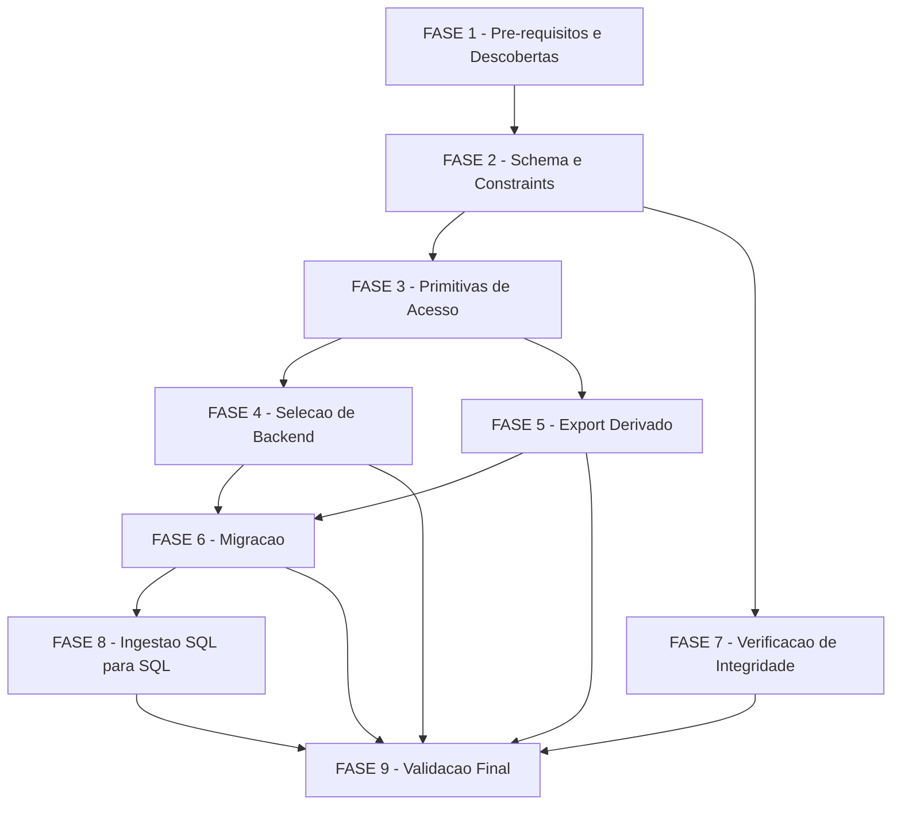

# Tarefas Fundação state.db - state-db-foundation

Escopo: substituir `state.json` por um banco SQLite (`state.db`) por
projeto como fonte de verdade transacional das execuções 00c, movendo as
invariantes hoje mantidas por convenção de script para constraints
declarativas do banco, com migração explícita, export de compatibilidade
e ingestão SQL→SQL do `knowledge.db` como capacidades adicionais.

Ref: [spec.md](./spec.md), [plan.md](./plan.md), [research.md](./research.md),
[data-model.md](./data-model.md), [quickstart.md](./quickstart.md),
[contracts/primitives.md](./contracts/primitives.md),
[contracts/export.md](./contracts/export.md),
[contracts/migration.md](./contracts/migration.md),
[checklists/requirements.md](./checklists/requirements.md)

**Legenda de status:**
- `[ ]` Pendente
- `[~]` Em andamento
- `[x]` Concluído
- `[!]` Bloqueado

**Legenda de criticidade:**
- `[C]` Crítico - Impacto financeiro direto ou bloqueante
- `[A]` Alto - Funcionalidade essencial
- `[M]` Médio - Necessário mas sem urgência imediata

**Decisões fechadas nesta rodada (create-tasks, onda-006)**: CHK009 (correção
editorial "cinco"→"seis" campos, dec-031), D7-a (ATTACH mode=ro, dec-037),
E5-a (ambos os gatilhos, dec-032), M1-a (permitir `aguardando_humano`,
dec-033), CHK005 (subcomando `cstk state migrate` delegando a script
dedicado, dec-034), CHK015 (critério de amostra do teste de equivalência,
dec-035), CHK027 (nenhum SC novo de performance de escrita, dec-036).
D4-a já estava fechada (dec-025, `PRAGMA integrity_check` apenas).

---

## ⚠️ GATE BLOQUEANTE — Amendment 1.3.0 da constitution

**Nenhuma tarefa das FASES 2-9 pode ser iniciada via `/execute-task` antes
da FASE 1.1 estar concluída.** O Princípio II (POSIX puro, NON-NEGOTIABLE)
proíbe dependência externa obrigatória sem fallback; `sqlite3` é
exatamente isso para o `state.db`. `plan.md` §Constitution Check é
explícito: "nenhuma task que implemente escrita ou leitura do `state.db`
pode ser considerada pronta para execução antes do amendment 1.3.0 ser
ratificado." O pipeline `feature-00c` **não inclui** a etapa `constitution`
— a ratificação é ação externa a esta execução (operador humano, ou uma
execução `/agente-00c` separada que inclua a etapa `constitution`).

---

## FASE 1 - Pré-requisitos e Descobertas

### 1.1 Amendment 1.3.0 da constitution (sqlite3 obrigatório) `[C]`

Ref: spec.md §Clarifications Session 2026-07-30 (Q1); plan.md §Constitution
Check + §Complexity Tracking; dec-020 (execução original desta feature).
**BLOQUEIA todas as FASES 2-9.**

- [x] 1.1.1 Verificar `docs/constitution.md` (rodapé `**Version**`) — se já
  `>= 1.3.0` e o Princípio II já cita a exceção da camada de estado
  transacional, marcar esta tarefa concluída e liberar as fases seguintes
  — onda-007: versão encontrada `1.2.0`, sem menção a `sqlite`; seguiu para 1.1.2
- [x] 1.1.2 Se a versão ainda for `1.2.0` (ou o Princípio II não citar a
  exceção), registrar bloqueio humano via `bloqueios.sh register`
  solicitando que o operador conduza o amendment MINOR (1.2.0 → 1.3.0)
  fora deste pipeline — via `/agente-00c` (que inclui a etapa
  `constitution`) sobre o projeto `cstk`, ou edição direta ratificada por
  humano — reconhecendo `sqlite3` como dependência obrigatória e sem
  fallback da camada de estado transacional, análoga ao gate já existente
  de `jq` (`state-rw.sh` L116-118)
  — onda-007: block-003 registrado (dec-042); onda-008: respondido
  `ratificado-retomar` (dec-043)
- [x] 1.1.3 Após ratificação, revalidar que `docs/constitution.md` cita a
  exceção explicitamente e que o rodapé de versão reflete `1.3.0` (ou
  superior) antes de desbloquear a FASE 2
  — onda-008: rodapé confirma `1.3.0`; Princípio II linha 133 cita
  "Mandatory dependency carve-out: transactional state layer (amendment 1.3.0)"
- [x] 1.1.4 Registrar Decisão auditável confirmando a liberação do gate
  (referenciando a versão ratificada da constitution)
  — onda-008: dec-045, `escolha=liberar-fase-2-9`, score 3

### 1.2 Descoberta da versão mínima de `sqlite3` suportada `[A]`

Ref: checklists/requirements.md CHK004; data-model.md L227-231 (JSON1);
contracts/primitives.md §C8 (C8-a, `.param set`)

- [x] 1.2.1 Levantar a versão mínima de `sqlite3` que o toolkit passa a
  exigir — usar como piso a menor versão presente nos ambientes reais já
  documentados no repo (macOS local: `3.51.0`, `research.md` Decision 1) e
  a versão mínima do runner de CI (verificar `.github/workflows/*.yml`)
  — onda-008: piso = `3.45.1` (ubuntu-latest/Ubuntu 24.04, via
  `actions/runner-images` README oficial)
- [x] 1.2.2 Confirmar suporte a `JSON1`/`json_valid`/`json_array_length` na
  versão mínima levantada (presente por padrão desde SQLite 3.38, 2022) —
  se a versão mínima real for anterior a 3.38, registrar Decisão sobre o
  degrade documentado em data-model.md (`CHECK (length(options_considered)
  > 2)` + validação em script)
  — onda-008: confirmado (`src/json.c` já no core no tag `version-3.45.1`;
  teste local `json_valid`/`json_array_length` ok); sem degrade necessário
- [x] 1.2.3 Confirmar disponibilidade de parâmetros nomeados (`.param set`)
  na versão mínima levantada — fecha C8-a: se disponível, adotar como
  otimização sobre o piso já obrigatório (`strip_nul`+`sql_escape`,
  contracts/primitives.md §C8); se indisponível, documentar que o piso
  permanece a única forma de escape
  — onda-008: confirmado presente no tag `version-3.45.1`
  (`temp.sqlite_parameters` + `.parameter set`); adotado como otimização
- [x] 1.2.4 Documentar a versão mínima resultante e o veredito de C8-a em
  `research.md` (nova subseção) ou `data-model.md`, com fonte citada
  (output real de `sqlite3 --version` / `.param` no ambiente verificado)
  — onda-008: `research.md` Decision 10
- [x] 1.2.5 Registrar Decisão auditável com a versão mínima escolhida e
  evidência (`--score 3`, exigindo saída literal do comando verificador)
  — onda-008: dec-046

---

## FASE 2 - Schema e Constraints do Banco `[C]`

Ref: data-model.md (schema completo); spec.md FR-001, FR-002

### 2.1 DDL definitivo das 9 entidades `[C]`

Ref: data-model.md §Entity execution/wave/decision/human_block/task_outcome/
event/skill_invocation/migration_run

- [x] 2.1.1 Escrever o DDL de `execution` com as 4 `CHECK` de status/
  finished_at/subagent_depth/cycles/retro (data-model.md linhas 86-103)
- [x] 2.1.2 Escrever o DDL de `wave` com `ux_wave_single_open` (índice
  único parcial) e `trg_wave_close_once` (trigger)
- [x] 2.1.3 Escrever o DDL de `decision` com as 6 `CHECK` dos campos
  obrigatórios (agent/stage/choice/context/rationale/options_considered) e
  a trava de score 3 exigindo evidência
- [x] 2.1.4 Escrever o DDL de `human_block` com `FOREIGN KEY` para
  `decision(id)` e `CHECK` de status×answered_at
- [x] 2.1.5 Escrever o DDL de `task_outcome` com PK composta
  `(execution_id, task_id)` e `CHECK` de outcome/tests
- [x] 2.1.6 Escrever o DDL de `event`, `skill_invocation` (com `CHECK kind
  IN ('skill','gate')`) e `migration_run`
- [x] 2.1.7 Decidir granularidade dos campos `[PROPOSTA]` de `execution`
  (budgets/accumulated_metrics/whitelist/circular_movement_history/
  prerequisites/caches/push_pr_result) — colunas adicionais vs. tabelas
  satélite — e registrar Decisão auditável antes de fechar o DDL
  — onda-008: dec-047, colunas JSON em `execution` (1:1, sem acesso
  relacional por elemento)
- [x] 2.1.8 Script de criação idempotente (`CREATE TABLE IF NOT EXISTS`) +
  aplicação de `PRAGMA journal_mode=WAL` uma única vez na criação
  — onda-008: `global/skills/agente-00c-runtime/references/state-db-schema.sql`
  (DDL) + `.../scripts/state-db-schema.sh create --db PATH` (aplicacao +
  WAL + chmod 600); testado empiricamente (criacao, reexecucao idempotente,
  WAL ativo, permissoes)

### 2.2 Testes de invariantes do FR-002 `[C]`

Ref: quickstart.md; spec.md US1 AS-1, AS-2, AS-4

- [x] 2.2.1 Teste: segunda tentativa de abrir onda com onda já aberta falha
  (`ux_wave_single_open`)
  — onda-008: `tests/test_state-db-schema.sh::scenario_wave_ux_wave_single_open_bloqueia_segunda_onda_aberta`
- [x] 2.2.2 Teste: tentativa de fechar onda já fechada falha
  (`trg_wave_close_once`)
  — onda-008: `tests/test_state-db-schema.sh::scenario_wave_trg_wave_close_once_bloqueia_reabertura`
- [x] 2.2.3 Teste: registro de decisão com campo obrigatório ausente/vazio
  é rejeitado pela própria constraint (não pelo script chamador)
  — onda-008: `tests/test_state-db-schema.sh::scenario_decision_campo_obrigatorio_ausente_e_rejeitado`
- [x] 2.2.4 Teste: registro de bloqueio humano com `decision_id` inexistente
  é rejeitado por `FOREIGN KEY` (com `PRAGMA foreign_keys=ON` ativo)
  — onda-008: `tests/test_state-db-schema.sh::scenario_human_block_fk_decisao_inexistente_e_rejeitado_com_fk_on`
- [x] 2.2.5 Teste: tentativa de `enter` de spawn acima do teto configurado
  é rejeitada por `CHECK (subagent_depth <= max_recursion)`
  — onda-008: `tests/test_state-db-schema.sh::scenario_execution_subagent_depth_acima_do_teto_e_rejeitado`
  (nivel de banco; adaptacao do `spawn-tracker.sh enter` propriamente dito
  fica para FASE 3.6)
- [x] 2.2.6 Teste: `--score 3` sem `--evidencia` >= 20 chars é rejeitado na
  camada de banco
  — onda-008: `tests/test_state-db-schema.sh::scenario_decision_score3_sem_evidencia_e_rejeitado`

---

## FASE 3 - Primitivas de Acesso `[C]`

Ref: spec.md FR-003, FR-004, FR-011; contracts/primitives.md §C1, C4-C10

### 3.1 Helpers compartilhados de conexão e escape `[C]`

Ref: contracts/primitives.md §C5 (PRAGMAs), §C8 (escape), §C9 (permissões)

- [x] 3.1.1 Extrair `sql_escape`/`strip_nul` de `cli/lib/recall.sh` para um
  ponto compartilhável consumível pelos scripts de `agente-00c-runtime`
  (reuso, não reimplementação — per C8) <!-- global/skills/agente-00c-runtime/scripts/_state-db.sh; cópia (não source cross-boundary de deploy) do MESMO algoritmo, paridade garantida por teste — ver dec-051 -->
- [x] 3.1.2 Implementar wrapper de invocação `sqlite3` que emite sempre
  `PRAGMA foreign_keys=ON; PRAGMA busy_timeout=<ms>;` antes do SQL da
  mutação (C5) <!-- _state_db_exec/_state_db_pragmas em _state-db.sh -->
- [x] 3.1.3 Implementar `chmod 600` explícito após criação de `state.db` e
  seus sidecars `-wal`/`-shm` (C9, finding S3), seguindo o padrão já usado
  em `otel-usage.sh:262` <!-- _state_db_secure_perms em _state-db.sh; state-db-schema.sh refatorado para reusa-lo (DRY) -->
- [x] 3.1.4 Reaproveitar o padrão de retry sob lock de
  `recall_apply_sql_with_retry` (`cli/lib/recall.sh`) — MAS com contrato de
  falha diferente: lock persistente após retries MUST sair não-zero, nunca
  degradar silenciosamente (C6, diferença deliberada face ao `recall.sh`) <!-- _state_db_exec_with_retry em _state-db.sh -->
- [x] 3.1.5 Teste: payload de texto livre contendo `'; DROP TABLE decision;
  --` e apóstrofo simples é persistido literalmente, a tabela `decision`
  continua existindo e `state-validate.sh` sai 0 (C8, paridade com
  `tests/test_model-routing.sh`) <!-- tests/test__state-db.sh scenario_state_db_exec_persiste_payload_hostil_literal_e_tabela_sobrevive; substitui state-validate.sh (so valida JSON, sem export ainda) por PRAGMA integrity_check = 'ok', o equivalente sob backend SQLite documentado em C7 -->

### 3.2 Adaptar `state-rw.sh` para backend dual `[C]`

Ref: contracts/primitives.md §C1 (paridade), §C2 (seleção de backend)

- [x] 3.2.1 Implementar seleção de backend por presença de arquivo (existe
  `<state-dir>/state.db` ⇒ SQLite; senão ⇒ JSON atual) em `init` <!-- _sr_backend/_sr_db_file em _state-rw-db.sh; init recusa se state.db ja existe (migracao e FASE 6, nao init) -->
- [x] 3.2.2 Adaptar `read`/`get`/`set`/`write` preservando stdout/exit code
  idênticos ao comportamento JSON atual (C1) <!-- _sr_db_read (reconstrucao completa via json_object/json_group_array + catch-all execution.extra_fields/wave.extra_fields para campos de topo/por-onda ainda nao modelados como coluna — gap documentado entre export.md e data-model.md, dec pendente de registro); _sr_db_set (dispatcher: arrays completos via upsert, .waves[-1|N].campo, colunas conhecidas, fallback extra_fields para campo de topo simples — path aninhado nao modelado falha alto, nunca perde dado silenciosamente); _sr_db_write_document (import completo). Bug lateral corrigido em _state-db.sh: PRAGMA busy_timeout ecoava o valor como linha de resultado, corrompendo stdout de toda SELECT via _state_db_exec -->
- [x] 3.2.3 Adaptar `sha256-update`/`sha256-verify` para, sob backend
  SQLite, delegar à FASE 7 (`PRAGMA integrity_check`) mantendo nome e
  contrato de exit code <!-- _sr_db_integrity_check; sha256-update vira no-op (exit 0, sem hash derivado a manter) -->
- [x] 3.2.4 Teste de paridade: cada subcomando de `state-rw.sh` produz o
  mesmo stdout/exit code sob os dois backends, para os mesmos dados <!-- tests/test_state-rw.sh (16 cenarios sqlite novos, incl. 2 paridade cross-backend get/set/sha256-verify) + tests/test__state-rw-db.sh (17 cenarios unitarios); read reconstruido passa em state-validate.sh (E1) -->

### 3.3 Adaptar `state-ondas.sh` `[C]`

Ref: contracts/primitives.md tabela de subcomandos `state-ondas.sh`

- [x] 3.3.1 Adaptar `start`/`end`/`wave-status`/`current-id` — declarar
  explicitamente a mudança de comportamento autorizada por C3: `start` com
  onda já aberta passa a **falhar** (hoje duplica silenciosamente)
  — onda-009: novo `_state-ondas-db.sh` (`_so_db_start`/`_so_db_end`/
  `_so_db_wave_status`/`_so_db_current_id`), dispatch por backend em
  `state-ondas.sh`; `start` sobre onda aberta falha via `ux_wave_single_open`
  (INSERT rejeitado, exit 1 + stderr); `end` fecha a onda aberta numa unica
  transacao (C4) incl. `next_instruction` quando fornecido;
  `accumulated_metrics` passa a ser DERIVADO por agregação SQL
  (`_sr_db_read`), sem campo separado a manter em sincronia. Fix lateral:
  `_so_start_snapshot_baseline` lia `.execution.target_project_path` via
  `jq` direto no `state.json` (quebrava sob SQLite) — migrado para
  `state-rw.sh get` (backend-safe nos dois backends)
- [x] 3.3.2 Adaptar `record-skill`/`record-task`/`reconcile-tasks` — PK
  composta de `task_outcome` substitui o upsert em `jq` por
  `INSERT ... ON CONFLICT DO UPDATE`
  — onda-009: `_so_db_record_skill` (INSERT...SELECT...WHERE NOT EXISTS,
  check-then-insert atomico, mesma idempotência skill+decisão do path
  JSON, alvo = última onda por seq como `.waves[-1]`, não exige onda
  aberta); `_so_db_record_task` (dispatcher DO UPDATE default / DO NOTHING
  para `--if-absent`); `_so_db_reconcile_tasks` reusa o mesmo parsing
  awk de tasks.md (extraído para `_so_tasks_md_titlemap`/
  `_so_tasks_md_missing`, chamados também pelo path SQLite)
- [x] 3.3.3 Adaptar `tool-call-tick`/`git-commit`
  — onda-009: `_so_db_tool_call_tick` incrementa `wave.tool_calls` da onda
  aberta diretamente (sem onda aberta = exit 1, mudança deliberada face ao
  fallback silencioso do JSON); `git-commit` não precisou de mudança de
  lógica própria — já delega a `current-id` (dispatchado) e a
  `commit-mode.sh` (que só lê/escreve via `state-rw.sh get/set`, já
  backend-safe desde a task 3.2); testado ponta-a-ponta com repo git real
  sob backend sqlite
- [x] 3.3.4 Teste: guarda `wave-status` do orquestrador continua válida
  como defesa em profundidade (não mais requisito único) sob o novo erro
  de `start`
  — onda-009: `scenario_sqlite_start_onda_ja_aberta_falha` (segundo
  `start` falha por C3, `wave-status`/`current-id` seguem corretos e
  utilizáveis como defesa em profundidade). Bônus (fora do escopo
  original, mas necessário para não deixar `reconcile-wave` quebrado sob
  SQLite): adaptado para backend dual via primitivas já dispatchadas
  (`_so_cmd_wave_status`, `state-rw.sh get`); achou e corrigiu bug real —
  a promoção de status terminal fazia 5 `state-rw.sh set` sequenciais,
  violando a CHECK composta `status×finished_at` de `execution` sob
  SQLite (nenhuma ordem de sets de 1 coluna satisfaz a transição
  atômica); trocado por `read`→jq patch→`write` atômico (C4), aplicado
  nos dois backends. 9 testes unitários novos
  (`tests/test__state-ondas-db.sh`) + 20 cenários sqlite em
  `tests/test_state-ondas.sh` (incl. paridade C1 current-id/wave-status);
  suite completa (`--fast`) verde (1615/1617; as 2 falhas são
  `test_otel-usage.sh` pré-existentes por locale pt_BR, não desta task)

### 3.4 Adaptar `state-decisions.sh` `[C]`

- [x] 3.4.1 Adaptar `register` para inserir via transação `BEGIN
  IMMEDIATE`, preservando impressão de `dec-NNN` em stdout
  — onda-011: novo `_state-decisions-db.sh` (`_sd_db_register` +
  `_sd_db_next_num_expr`/`_sd_db_current_wave_id`/`_sd_db_exec_capture`),
  dispatch por backend em `state-decisions.sh`. O número sequencial de
  `dec-NNN` é calculado por **subquery dentro do próprio `INSERT`**
  (`'dec-' || printf('%03d', (SELECT coalesce(max(...),0)+1 FROM decision
  WHERE execution_id=...))`) — nunca por leitura separada antes do `BEGIN
  IMMEDIATE`, que é exatamente o padrão que colidiria sob concorrência
  (diferente do precedente de `_so_db_start`/onda-NNN, que pré-computa fora
  da transação; aqui isso foi deliberadamente evitado por 3.4.3 exigir
  prova de não-colisão). O id novo é lido de volta via
  `SELECT id FROM decision WHERE rowid=last_insert_rowid()` **dentro** da
  mesma transação, antes do `COMMIT` (isolado por conexão, nunca enxerga
  commit de outro escritor). Como isso precisa de stdout preservado —
  diferente de `_state_db_exec_with_retry` (FASE 3.1), que descarta stdout
  por desenho —, foi criado `_sd_db_exec_capture` (mesmo backoff/retry sob
  lock, contrato de falha C6 idêntico, mas propaga stdout da tentativa
  vencedora) em vez de alterar o helper compartilhado. `wave_id` liga à
  última onda por `seq` (aberta ou não, paridade com `.waves[-1].id` do
  path JSON); `NULL` quando não há nenhuma onda ainda (`"init"` no path
  JSON — data-model.md já documentava essa representação).
- [x] 3.4.2 Adaptar `count`/`next-id`/`list`
  — onda-011: `_sd_db_count` (COUNT com filtro opcional `--agente`),
  `_sd_db_next_id` (mesma subquery de 3.4.1, sem inserir), `_sd_db_list`
  (TSV `id/wave_id/agent/stage/choice`; `wave_id` NULL normalizado para
  `"init"` na saída textual, mesma convenção de exibição do JSON — o
  export completo (`state-rw.sh read`, já implementado na FASE 3.2) ainda
  emite `null` nesse caso específico, gap conhecido e documentado no
  cabeçalho de `_state-decisions-db.sh`, fora do escopo desta task)
- [x] 3.4.3 Teste: `register` sob concorrência (duas invocações
  simultâneas) não perde nenhuma decisão e não colide em `next-id`
  — onda-011: `scenario_sqlite_register_concorrente_sem_colisao`
  (`tests/test_state-decisions.sh`) dispara 15 `register` simultâneos via
  `&`/`wait`; confirma 15 ids únicos (`dec-001`..`dec-015`) e `count == 15`.
  Smoke manual adicional com 20 invocações concorrentes confirmou o mesmo
  resultado antes de escrever o cenário automatizado. Unit tests
  complementares em `tests/test__state-decisions-db.sh` (8 cenários:
  `_sd_db_next_num_expr`, `_sd_db_current_wave_id`,
  `_sd_db_exec_capture` incl. o padrão BEGIN IMMEDIATE+SELECT+COMMIT numa
  única sessão). Suite completa (`--fast`, filtro `state-`) verde
  (349/349); `--check-coverage` sem órfãos.

### 3.5 Adaptar `bloqueios.sh` `[C]`

- [x] 3.5.1 Adaptar `register` para gravar o bloqueio **e** mudar
  `.execution.status` na mesma transação (C4 — hoje são dois RMW
  separados)
  — onda-013: novo `_bloqueios-db.sh` (`_bl_db_register` +
  `_bl_db_next_block_num_expr`/`_bl_db_exec_capture`), dispatch por backend
  em `bloqueios.sh`. Mesmo padrão de `_sd_db_register` (id `block-NNN` por
  subquery dentro do próprio `INSERT`, lido de volta via
  `last_insert_rowid()` antes do `COMMIT`); o `UPDATE execution SET
  status='aguardando_humano'` entra na MESMA transação `BEGIN IMMEDIATE
  ... COMMIT` do `INSERT`. C3: `decisao_id` inexistente deixa a FK real do
  schema (`human_block.decision_id REFERENCES decision(id)`) disparar — a
  transação inteira reverte (nada persistido, `execution.status`
  intocado) e o erro é mapeado para a mesma mensagem/exit 1 do path JSON.
  **Bug lateral achado e corrigido** (afeta também `_sd_db_exec_capture`
  de 3.4, mesma causa): `x=$(cmd)` como atribuição nua seguida de
  `rc=$?` — sob `set -e` (todo caller roda `set -eu`), a falha de `cmd`
  dentro da substituição de comando dispara saída imediata do shell
  INTEIRO antes de `rc=$?` executar (POSIX 2.8.1: atribuição nua não está
  numa lista if/while/&&/|| que a isente de `-e`). Sem o guard `if
  x=$(cmd); then...else...fi`, o retry/backoff sob lock (C6) e o
  mapeamento de erro FK (C3) nunca eram alcançados — o processo morria
  silenciosamente na primeira falha não-zero de `_state_db_exec`. Corrigido
  nos dois arquivos (`_bloqueios-db.sh` e `_state-decisions-db.sh`).
  Segundo achado, específico de `_bloqueios-db.sh`: como `register`
  precisa inspecionar o TEXTO do erro após a falha (para diferenciar FK de
  erro genérico), `_bl_db_exec_capture` não pode ser chamada dentro de
  `$(...)` — command substitution sempre forka uma subshell, e qualquer
  atribuição feita dentro dela (inclusive à variável "global" de erro) é
  descartada quando a subshell termina. Resolvido devolvendo o resultado
  via duas globais (`$_bl_db_last_out`/`$_bl_db_last_err`) e chamando a
  função como comando simples (`if _bl_db_exec_capture ...; then`), nunca
  via `$(...)`.
- [x] 3.5.2 Adaptar `respond`/`list`/`count`/`next-id`/`get`
  — onda-013: `_bl_db_respond` (mesma transação: fecha o `human_block` e,
  se não restar nenhum outro `aguardando`, promove `execution.status` de
  volta a `em_andamento` via `NOT EXISTS` na mesma `UPDATE`, C4);
  `_bl_db_list` (TSV `id/decision_id/status/triggered_at/question`,
  paridade com o formato do path JSON); `_bl_db_count`
  (`--pending-only` filtra `status='aguardando'`); `_bl_db_next_id`
  (mesma subquery de 3.5.1, sem inserir); `_bl_db_get` (JSON via
  `json_object`, mesmos campos/ordem do path JSON).
  `accumulated_metrics.human_blocks_total` não precisou de tratamento
  dedicado — já é DERIVADO por agregação SQL em `_sr_db_read` desde a
  task 3.2.2.
- [x] 3.5.3 Teste: `register` com `--decisao-id` inexistente falha por FK
  (US1 AS-4)
  — onda-013: `scenario_sqlite_register_decisao_inexistente_falha_fk`
  (`tests/test_bloqueios.sh`) confirma exit 1, mensagem
  "decisao_id nao existe", `count == 0` e `execution.status` intocado
  (rollback completo da transação). 32 cenários sqlite/paridade novos em
  `tests/test_bloqueios.sh` (register/respond/list/count/next-id/get,
  payload hostil C8, concorrência 15 registers simultâneos, paridade
  cross-backend) + 7 cenários unitários em `tests/test__bloqueios-db.sh`
  (incl. regressão do bug de `set -e`/subshell acima). Suite completa
  filtrada por `state-` verde (349/349); `--check-coverage` sem órfãos.

### 3.6 Adaptar `spawn-tracker.sh` `[C]`

- [x] 3.6.1 Adaptar `check`/`enter`/`leave`/`current` preservando exit 3 no
  teto (paridade C1)
  — onda-014: novo `_spawn-tracker-db.sh` (`_st_db_check`/`_st_db_enter`/
  `_st_db_leave`/`_st_db_current`), dispatch por backend nas 4 funcoes
  `_st_cmd_*` de `spawn-tracker.sh`. Escopo confinado a
  `execution.subagent_depth` (teto `execution.max_recursion`, espelho de
  `_ST_MAX=3`); `enter` valida ANTES de escrever (mesmo padrao do path
  JSON — nunca depende do texto de erro do CHECK do schema para reportar
  o teto, so a mensagem/exit 3). `accumulated_metrics.max_depth_reached`/
  `subagents_spawned` permanecem o placeholder ja documentado em
  `_sr_db_read` (task 3.2, gap conhecido, fora do escopo desta task —
  confirmado em `contracts/primitives.md` §spawn-tracker.sh, que so
  cobre check/enter/leave/current + exit 3).
- [x] 3.6.2 Teste: `enter` acima do teto não grava (paridade com hoje)
  — onda-014: `scenario_enter_acima_do_teto_exit_3_sem_gravar`
  (`tests/test__spawn-tracker-db.sh`, 9 cenarios unitarios) +
  `scenario_sqlite_enter_excedendo_max_exit_3_sem_modificar_estado`
  (`tests/test_spawn-tracker.sh`, 9 cenarios sqlite/paridade novos incl.
  teto customizado via `max_recursion` != 3 e paridade cross-backend
  enter/leave). Suite filtrada por `spawn-tracker` verde (28/28).

### 3.7 Testes de atomicidade e concorrência (SC-002, US1 AS-3) `[C]`

Ref: spec.md SC-002; contracts/primitives.md §C4, C6

- [x] 3.7.1 Teste de carga: duas mutações concorrentes distintas (ex.:
  registrar decisão + fechar onda) aplicadas em paralelo — nenhuma
  atualização perdida, 0% de taxa de perda
  — onda-013: novo `tests/test_state-db-concurrency.sh` (nao mapeia 1:1
  para um script — registrado em `run.sh::_is_internal_test`), exercita a
  COMPOSICAO de scripts sobre o mesmo `state.db`.
  `scenario_mutacoes_concorrentes_decisao_e_fechamento_onda_sem_perda`:
  8 `state-decisions.sh register` concorrentes (tabela `decision`) + 1
  `state-ondas.sh end` (tabela `wave`) em paralelo — 8 ids unicos sem
  duplicata/erro E a onda fecha (nenhuma das duas mutacoes "desaparece"
  por causa da outra), absorvido pelo retry/backoff sob lock (C6) ja
  existente em `_state_db_exec_with_retry`/`_sd_db_exec_capture`.
- [x] 3.7.2 Teste de interrupção simulada (kill -9 no meio de uma
  transação) — verificar que o `state.db` não fica com escrita parcial
  (rollback automático do SQLite)
  — onda-013: `scenario_kill9_meio_transacao_nao_deixa_escrita_parcial`.
  Sessao `sqlite3` alimentada por FIFO (controle preciso de timing):
  `BEGIN IMMEDIATE` + `INSERT` sem `COMMIT`, processo morto com `SIGKILL`
  com a transacao ainda aberta. Confirma `PRAGMA integrity_check = 'ok'`
  (sem corrupcao), a linha nao-commitada nao existe (rollback automatico
  via WAL — frames sem marcador de commit valido sao ignorados) e o banco
  segue utilizavel por escritores subsequentes (lock do processo morto
  liberado pelo kernel, sem deadlock).
- [x] 3.7.3 Teste de leitura concorrente durante escrita em andamento — sem
  bloqueio, sem leitura parcial (C6, WAL)
  — onda-013: `scenario_leitura_concorrente_durante_escrita_sem_bloqueio`.
  Mesma tecnica de FIFO: transacao de escrita aberta (sem commit) enquanto
  uma leitura roda numa conexao separada — mede tempo decorrido via epoch
  (`date +%s`, evita `timeout` GNU-only) para provar que nao bloqueou
  (<2s, nao esperou o `busy_timeout` de 5s) e confirma snapshot isolation
  (leitura ve 0, o dado nao-commitado); apos `COMMIT`, nova leitura reflete
  o dado novo (1). Suite completa (`sh tests/test_state-db-concurrency.sh`,
  3 cenarios) estavel em 3 execucoes consecutivas; `--check-coverage` sem
  orfaos apos registrar o arquivo em `run.sh::_is_internal_test`.

---

## FASE 4 - Seleção de Backend e Compatibilidade `[A]`

Ref: spec.md FR-012, SC-003; contracts/primitives.md §C2, C11

### 4.1 Lógica de seleção de backend em todos os scripts de escrita `[A]`

- [x] 4.1.1 Aplicar a lógica de C2 (presença de `state.db` decide o
  backend) uniformemente nos 6 scripts adaptados na FASE 3
  — onda-014: confirmado por auditoria (`grep -n "_sr_backend" global/skills/agente-00c-runtime/scripts/*.sh`)
  que `state-rw.sh`, `state-ondas.sh`, `state-decisions.sh`, `bloqueios.sh`
  e `spawn-tracker.sh` dispatcham uniformemente via `_sr_backend`/
  `_state-db.sh` (helper compartilhado extraído na task 3.1); nenhuma
  lógica nova de seleção foi necessária — já implementada e testada na
  FASE 3. Nenhuma mudança de código nesta task, só verificação.
- [x] 4.1.2 Confirmar que um projeto sem `state.db` continua operando
  exatamente como hoje (backend JSON, FR-012) sem qualquer mudança de
  comportamento observável
  — onda-014: suite completa (`./tests/run.sh`) rodada sobre este
  repositório (sem `state.db` em `.claude/feature-00c-state/`), 2088/2091
  verde (3 falhas = flakies conhecidos, não relacionados — ver 4.2.1).

### 4.2 Regressão da suíte para projeto não migrado (SC-003) `[A]`

- [x] 4.2.1 Rodar `./tests/run.sh` completo sobre o estado atual (sem
  `state.db`) e confirmar 0 regressões atribuíveis a esta feature
  — onda-014: `# PASS: 2088  FAIL: 3  ERROR: 0  ORPHANS: 0  TIME: 1181s`.
  As 3 falhas são flakies conhecidos e pré-existentes (MEMORY.md),
  confirmados por rerun isolado nesta mesma onda:
  `test_00c-bootstrap.sh :: scenario_issue_2_sigint_propaga_exit_130`
  (passa isolado — flaky de suite paralela) e
  `test_otel-usage.sh :: scenario_delta_ignora_sessao_congelada_de_outro_processo`
  + `scenario_delta_subtrai_contadores_cumulativos` (ambos passam com
  `LC_ALL=C sh tests/test_otel-usage.sh` — falso-FAIL de locale pt_BR,
  `locale` do ambiente confirmou `LANG="pt_BR.UTF-8"`). Nenhuma das 3
  falhas toca scripts desta feature. 0 regressões atribuíveis a
  state-db-foundation.
- [x] 4.2.2 Adicionar cenários novos ao harness (`tests/test_<script>.sh`)
  cobrindo o branch de seleção de backend explicitamente, por script
  adaptado
  — onda-014: novo cenário `scenario_c2_state_json_coexistente_ignorado_quando_state_db_presente`
  em `tests/test_state-rw.sh`, `tests/test_state-ondas.sh`,
  `tests/test_state-decisions.sh`, `tests/test_bloqueios.sh` e
  `tests/test_spawn-tracker.sh` (5 scripts) — prova positiva de C2: com
  `state.db` E um `state.json` divergente coexistindo no mesmo
  `state-dir`, a leitura/escrita reflete sempre o `state.db` e o
  `state.json` legado permanece intocado. Todos os 5 cenários verdes.

### 4.3 Preservar `state-lock.sh` como camada opcional `[M]`

Ref: contracts/primitives.md §C11 (o que NÃO muda)

- [x] 4.3.1 Confirmar que `state-lock.sh` não é removido e sua superfície
  não muda — segue disponível como camada extra opcional, não mais como
  requisito de serialização
  — onda-014: `git diff main...HEAD -- global/skills/agente-00c-runtime/scripts/state-lock.sh`
  vazio — zero mudanças no arquivo desde o início desta feature branch.
- [x] 4.3.2 Atualizar a prosa dos orquestradores (`agente-00c-orchestrator.md`,
  `agente-00c-feature-orchestrator.md`) e commands que hoje descrevem o
  lock como serializador primário, refletindo que WAL é o mecanismo
  primário sob backend `state.db` (FR-011) — **fora desta feature de
  runtime**, mas necessário para a prosa não ficar desatualizada; abrir
  como nota de sugestão se não couber nesta task
  — onda-014: anotação adicionada na linha da tabela de `state-lock.sh`
  em ambos os arquivos (`global/agents/agente-00c-orchestrator.md`,
  `global/agents/agente-00c-feature-orchestrator.md`), citando C6/C11 e
  FR-011: sob backend `state.db` o WAL passa a serializar escritas
  concorrentes; o lock segue como camada extra opcional, superfície
  inalterada. Commands (`agente-00c*.md`/`feature-00c*.md`) não tocados —
  descrevem mutex de PROCESSO (evitar 2 execuções simultâneas), uma
  preocupação distinta não superada pelo WAL.

---

## FASE 5 - Export Derivado `[A]`

Ref: spec.md FR-007, FR-013-INFRA-BACKUP; contracts/export.md; dec-032 (E5-a)

### 5.1 Implementar o export (opção A — reusar `state-rw.sh read`) `[A]`

Ref: contracts/export.md §Interface do comando (opção A preferida)

- [x] 5.1.1 Sob backend SQLite, `state-rw.sh read` produz o `state.json`
  equivalente descrito em E1-E4 (schema_version, todos os campos de topo,
  nomes/IDs preservados literalmente, `accumulated_metrics` derivado por
  agregação das tabelas)
  — onda-015: já implementado desde a FASE 3 (`_sr_db_read` em
  `_state-rw-db.sh`, consumido por `state-rw.sh read` — Opção A do
  contrato, "sem subcomando novo"). Auditoria confirmou os 4 pontos de
  E1-E4 presentes na query: `json_object` cobre todos os campos de topo
  listados em E1.3 (exceto `suggestions`/`retros`/
  `next_retrospective_milestone`, que caem no catch-all `extra_fields`
  quando gravados via `set` — `suggestions.sh`/`retro.sh` não foram
  adaptados nesta feature, fora de escopo da FASE 3/4); `accumulated_metrics`
  é `SELECT sum(...)`/`count(...)` sobre as tabelas (E4, não contador
  materializado). Nenhuma mudança de código nesta task, só verificação.
- [x] 5.1.2 Preservar distinção ausente-vs-null (`canonical_project`/
  `session_name` ausentes quando não setados) — E3
  — onda-015: já implementado (`drop_null_keys` no pipeline `jq` de
  `_sr_db_read`, aplicado a `.execution` e a cada onda em `.waves[]`).
  Verificado por novo teste dedicado (5.1.4).
- [x] 5.1.3 Teste E1: export passa em `state-validate.sh --state-dir <dir>`
  com exit 0
  — onda-015: já coberto por
  `scenario_sqlite_read_reconstroi_documento_valido_por_state_validate`
  (`tests/test_state-rw.sh`), existente desde a FASE 3/4. Confirmado verde
  nesta onda, nenhuma mudança necessária.
- [x] 5.1.4 Teste E2/E3: fidelidade de nomes/IDs e ordem/aninhamento
  (`skills_invoked` volta a ficar aninhado em `.waves[N]`)
  — onda-015: 2 cenários novos em `tests/test_state-rw.sh` —
  `scenario_sqlite_read_e2_e3_ids_e_skills_invoked_aninhado` (IDs
  `dec-NNN`/`block-NNN`/`onda-NNN` literais, campo
  `justification_score`, `skills_invoked` aninhado em `.waves[0]` — não
  solto no topo —, e ausência confirmada de `canonical_project`/
  `session_name` quando não setados) e
  `scenario_sqlite_read_e4_accumulated_metrics_agregado` (E4: agregação
  multi-onda de `waves_total`/`tool_calls_total`/
  `wallclock_total_seconds`/`decisions_total`/`human_blocks_total`,
  cobertura que ainda não existia). Ambos verdes.

### 5.2 Gatilho automático ao fim da onda `[A]`

Ref: dec-032 (E5-a: ambos os gatilhos); export.md §E5, E6

- [x] 5.2.1 Disparar a geração do export dentro de `state-ondas.sh end`, no
  mesmo ponto onde o snapshot de `state-history/` é gerado hoje —
  reaproveita o export como mecanismo de FR-013-INFRA-BACKUP sem
  introduzir backup nativo do SQLite (research.md Decision 6)
  — onda-015: nova função `_so_export_snapshot` (`state-ondas.sh`) —
  reusa `state-rw.sh read` (Opção A, backend-agnóstico), grava
  atomicamente (mktemp+mv, sufixo aleatório do mktemp preservado no nome
  final contra colisão no mesmo segundo UTC) em
  `state-history/export-<wave-id>-<timestamp>-<rand>.json`. Escopo
  confirmado por auditoria (`grep`): só `_so_db_end` (backend SQLite)
  carecia de qualquer mecanismo de backup em `end` — o path JSON já tem
  `_so_backup_current`. Chamada inserida em `_so_db_end`
  (`_state-ondas-db.sh`) logo após o `COMMIT` que fecha a onda.
- [x] 5.2.2 Implementar E6: falha na geração do export (disco cheio,
  interrupção) MUST ser reportada em stderr e MUST NOT reverter nem
  impedir o commit da transação que fechou a onda
  — onda-015: `_so_export_snapshot` nunca chama `_so_die` (só `_so_log` +
  `return 1`); a chamada em `_so_db_end` roda **depois** do `COMMIT` e
  ignora o código de retorno além de logar. Fechamento da onda já está
  persistido no `state.db` antes de qualquer tentativa de export.
- [x] 5.2.3 Teste SC-004: export reflete uma mutação em até 5 segundos após
  aplicada
  — onda-015: `scenario_sqlite_end_gera_export_snapshot_automatico`
  (`tests/test_state-ondas.sh`) — freshness satisfeita trivialmente (E5,
  contrato): geração é síncrona dentro do próprio `end`. Teste confirma
  que o snapshot automático reflete `termination_reason`/`tool_calls` da
  onda recém-fechada e passa em `state-validate.sh` (E1).
- [x] 5.2.4 Teste E6: simular falha de escrita do export (ex.: diretório
  sem permissão) e confirmar que o fechamento de onda no `state.db` não é
  revertido
  — onda-015: `scenario_sqlite_end_e6_falha_export_nao_reverte_fechamento`
  — ocupa `state-history` com um arquivo comum (não diretório) antes do
  `end`, forçando falha do `mkdir -p` só no passo de export (sem tocar
  permissões do state-dir, que quebraria o próprio `UPDATE` do
  `state.db`). Confirma exit 0, diagnóstico em stderr mencionando
  "export", e `termination_reason` persistido normalmente.

### 5.3 Gatilho sob demanda `[A]`

- [x] 5.3.1 Expor comando explícito para regenerar o export a qualquer
  momento (consumido por auditoria/debug manual e por FASE 6 M3.2)
  — onda-015: novo subcomando `state-ondas.sh export-snapshot --state-dir
  DIR` (dispatch + `_so_cmd_export_snapshot`), reusa
  `_so_export_snapshot`; falha aqui vira exit 1 (pedido explícito do
  operador, ao contrário do gatilho automático best-effort de 5.2).
  Backend-agnóstico (funciona também sob `state.json`, já que delega a
  `state-rw.sh read`).
- [x] 5.3.2 Teste: export sob demanda gerado após múltiplas mutações
  reflete o estado corrente completo
  — onda-015:
  `scenario_sqlite_export_snapshot_sob_demanda_multiplas_mutacoes` (2
  chamadas de `export-snapshot` intercaladas por `state-rw.sh set` +
  `tool-call-tick`, confirma nomes de arquivo distintos e conteúdo
  refletindo a mutação mais recente) +
  `scenario_json_export_snapshot_sob_demanda` (cobertura equivalente sob
  backend JSON, provando o comando backend-agnóstico).

### 5.4 Teste de restauração a partir do export (FR-013-INFRA-BACKUP) `[A]`

- [x] 5.4.1 Validar que a restauração a partir de um snapshot em
  `state-history/` (export serializado) é operável — "com a restauração
  validada por teste antes de ser considerada disponível" (FR-013-INFRA-BACKUP,
  literal)
  — onda-015: `scenario_sqlite_export_snapshot_restauracao_operavel_fr013`
  — copia um snapshot automático (origem SQLite) para `state.json` de um
  state-dir novo (backend JSON) e confirma operabilidade real: `get`,
  `current-id`, `wave-status` funcionam sobre o restaurado, e uma onda
  NOVA consegue iniciar a partir dele (`start` produz `onda-002`). Não é
  só "passa em state-validate.sh" — é literalmente operável.

---

## FASE 6 - Migração state.json → state.db `[C]`

Ref: spec.md FR-005, FR-006, FR-014-INFRA-IDEMP; contracts/migration.md;
dec-033 (M1-a), dec-034 (CHK005)

### 6.1 Interface do comando de migração `[C]`

Ref: dec-034 (subcomando `cstk state migrate` delegando a `state-db-migrate.sh`)

- [x] 6.1.1 Criar `global/skills/agente-00c-runtime/scripts/state-db-migrate.sh`
  como script dedicado (evita colisão com `state-rw.sh migrate`, que migra
  schema interno do JSON — migration.md §Nomeação)
  — onda-016: `state-db-migrate.sh` (subcomando `migrate --state-dir`),
  exit 3 dedicado para RECUSA por pre-condicao (distinguivel de falha).

- [x] 6.1.2 Expor `cstk state migrate --state-dir <dir>` no CLI, delegando
  ao script acima
  — onda-016: `cli/lib/state.sh` (`state_main`) + dispatch em `cli/cstk`
  (case generico + help geral + `cstk help state`). Delegacao pura: flags e
  exit codes repassados VERBATIM. Resolucao do script em 3 camadas (PATH ->
  CSTK_LIB/../../global/skills -> ~/.claude), mesmo padrao de
  `recall_secrets_filter_path` — resolver so via ~/.claude passa local e
  quebra no CI fresh-checkout.

- [x] 6.1.3 Criar `tests/test_state-db-migrate.sh` seguindo a convenção do
  harness (`--check-coverage` deve reconhecer o script novo)
  — onda-016: `tests/test_state-db-migrate.sh` (23 cenarios, cobre os 7 do
  contrato) + `tests/cstk/test_state.sh` (9 cenarios da fronteira do CLI).
  `--check-coverage` verde para ambos os scripts novos.

### 6.2 Pré-condições M1 `[C]`

Ref: migration.md §M1; dec-033 (M1-a: permitir `aguardando_humano`)

- [x] 6.2.1 Recusar com diagnóstico claro se `.execution.status ==
  "em_andamento"` (FR-005, literal) — **permitir** `aguardando_humano`
  (dec-033)
  — onda-016: recusa `em_andamento` citando o campo; `aguardando_humano`
  PERMITIDO (dec-033), com cenario dedicado provando a migracao completa.

- [x] 6.2.2 Recusar se `state-validate.sh --state-dir <dir>` sair != 0
  (reaproveita o verificador existente — cobre SC-006/bloqueio órfão sem
  código novo)
  — onda-016: delega a `state-validate.sh` (que le state.json DIRETO, sem
  passar por state-rw.sh — segue validando a ORIGEM mesmo com state.db ja
  presente). Cenario de bloqueio orfao confirma a recusa com o id do
  registro problematico no diagnostico.

- [x] 6.2.3 Recusar se `state-rw.sh sha256-verify --state-dir <dir>` sair
  != 0 (integridade divergente)
  — onda-016: comparacao do `state.json.sha256` com o hash real da origem.
  NAO delega a `state-rw.sh sha256-verify` porque aquele comando e
  BACKEND-AWARE: com state.db presente ele verifica o BANCO
  (`PRAGMA integrity_check`), nao o state.json — o oposto do que M1.3 pede
  numa reexecucao.

- [x] 6.2.4 Recusar se `state.json` ausente/ilegível
  — onda-016: cenarios de state.json ausente e de JSON nao-parseavel, ambos
  exit 3 sem criar state.db.

- [x] 6.2.5 Recusar (não sobrescrever) se já existe `state.db` de
  `execution.id` diferente da origem — ver 6.5 (idempotência)
  — onda-016: compara `.execution.id` da origem com `SELECT id FROM
  execution` do banco existente; divergiu, recusa e REGISTRA a tentativa em
  `migration_run` (result='refused' + diagnostic).

### 6.3 Sequência de migração (M2) `[C]`

Ref: migration.md §M2; primitives.md §C10 (mktemp, finding S4)

- [x] 6.3.1 Criar arquivo temporário via `mktemp` no `<state-dir>` (mesmo
  filesystem) — MUST NOT usar nome derivado de PID (C10)
  — onda-016: `mktemp -d` no PROPRIO state-dir (mesmo filesystem, exigencia
  do mv atomico). Um DIRETORIO e nao um arquivo, para que o banco em
  construcao se chame exatamente `state.db` e `state-rw.sh write` resolva o
  backend SQLite por presenca (`_sr_backend`), reusando o importador
  FK-ordenado ja auditado. Cenario de auditoria estatica (C10) rejeita nome
  derivado de PID.

- [x] 6.3.2 Aplicar o schema (FASE 2) + PRAGMAs ao temporário
  — onda-016: reusa `state-db-schema.sh create` (DDL + WAL + chmod 600).

- [x] 6.3.3 Inserir os dados na ordem imposta pelas FKs: `execution` →
  `wave` → `decision` → `human_block`/`skill_invocation`/`task_outcome`/
  `event` → `migration_run`, preservando IDs e timestamps originais sem
  renumeração
  — onda-016: `execution` inserida pelo proprio script (o importador faz
  UPDATE, nao INSERT, e nao toca as colunas de budget); demais entidades via
  `state-rw.sh write`. **Dois defeitos de FASE 3 corrigidos aqui**, ambos
  invisiveis aos fixtures sinteticos e fatais em dado real:
  (a) `decisions[].wave_id == "init"` era inserido verbatim, violando a FK —
  agora mapeado para NULL conforme data-model.md §decision (a sentinela
  aparece em 10 dos 19 state.json reais do repo);
  (b) `skill_invocation` era emitida JUNTO da onda, ANTES das decisions,
  violando a FK `decision_id` sempre que a skill carregava decisao (o caso
  normal do two-step do model-routing) — `_sr_db_wave_skills_sql` agora e
  emitida depois das decisions, na ordem literal do contrato §M2.

- [x] 6.3.4 Publicar por `mv` atômico do temporário para `state.db`
  (dentro do mesmo filesystem)
  — onda-016: `PRAGMA wal_checkpoint(TRUNCATE)` antes do `mv` (sem isso o
  mv de um unico arquivo deixaria transacoes no -wal), depois `mv -f` +
  `chmod 600`.

### 6.4 Verificação pós-migração M3 (FR-006, SC-001) `[C]`

Ref: migration.md §M3.1, M3.2

- [x] 6.4.1 M3.1 — contagem por entidade: `COUNT(*)` no destino == `length`
  do array de origem, para as 6 entidades listadas (decisions, waves,
  human_blocks, tasks, events, skill_invocation), gravado em
  `migration_run.counts_source`/`counts_target`
  — onda-016: `_sdm_counts_source` (jq) vs `_sdm_counts_target` (COUNT(*)),
  mesmo formato JSON de chaves fixas, comparados literalmente; ambos
  gravados em `migration_run.counts_source`/`counts_target`.

- [x] 6.4.2 M3.2 — gerar o export (FASE 5) a partir do `state.db` recém-
  construído e comparar campo-a-campo com o `state.json` de origem, ambos
  canonicalizados (`jq -S .`) — divergência ⇒ migração recusada, temporário
  removido
  — onda-016: export via `state-rw.sh read` comparado com a origem, ambos
  `jq -S` + normalizacao contratual FECHADA de 4 itens (documentada no
  script): sentinela `init`, null<->chave-ausente, `accumulated_metrics`
  (agregado derivado — todos os INSUMOS sao preservados; o objeto de origem
  fica integral em `migration_run.counts_source`) e
  `budgets.current_wave_start`/`tool_calls_current_wave` (derivados da onda
  aberta, que `_sr_db_set` inclusive RECUSA gravar). Divergencia FORA da
  lista reprova — provado em campo: a 1a execucao real reprovou de verdade
  e nada foi publicado.

- [x] 6.4.3 Teste: `state.json` que falha na validação (bloqueio órfão) é
  recusado com diagnóstico apontando o registro problemático (SC-006, US2
  AS-3)
  — onda-016: `scenario_bloqueio_orfao_recusado_com_diagnostico` — exit 3,
  nenhum state.db criado, diagnostico nomeando `block-001`.

- [x] 6.4.4 Teste: interrupção simulada entre construção e publicação —
  `state.json` original permanece intacto e o projeto continua operável
  (US2 AS-4)
  — onda-016: `scenario_interrupcao_antes_da_publicacao_preserva_origem` —
  sha256 do state.json identico antes/depois e leitura operavel apos a
  falha. Cenario irmao confirma que nenhum temporario sobrevive.

### 6.5 Idempotência (FR-014-INFRA-IDEMP, M5) `[C]`

Ref: migration.md §M5

- [x] 6.5.1 Chave de idempotência = `.execution.id` — reexecutar sobre
  projeto já migrado (mesmo `execution.id`) não duplica nem corrompe
  (reconstrução completa + republicação atômica)
  — onda-016: garantido por construcao (reconstrucao TOTAL + publicacao
  atomica, nunca append incremental). Cenario roda a migracao 2x e compara
  as contagens.

- [x] 6.5.2 `state.db` pré-existente com `execution.id` diferente da
  origem ⇒ recusar, exigindo intervenção humana
  — onda-016: ver 6.2.5.

- [x] 6.5.3 Registrar toda tentativa (inclusive recusadas) em
  `migration_run` com `result` ∈ `success`\|`refused`\|`failed`
  — onda-016: `success` (antes de publicar, no proprio banco que vai ser
  publicado), `refused` e `failed` — os dois ultimos no state.db
  PRE-EXISTENTE quando ha um. Numa primeira migracao que falha nao existe
  banco onde registrar: stderr + exit nao-zero sao o registro (documentado,
  nao esquecido). O historico de `migration_run` do banco anterior e
  copiado para o novo a cada reexecucao — sem isso a reconstrucao total
  apagaria a trilha de auditoria.

- [x] 6.5.4 Teste: migração executada duas vezes seguidas sobre o mesmo
  projeto produz o mesmo resultado, sem duplicação (US2 AS-2)
  — onda-016: `scenario_migracao_reexecutada_nao_duplica` (contagens iguais
  + 2 linhas de `migration_run` com result='success').

### 6.6 Garantias M4/M6 e cobertura dos 7 cenários do contrato `[C]`

Ref: migration.md §M4, M6, §Cenários de teste (tabela final)

- [x] 6.6.1 Confirmar M6: migração nunca dispara automaticamente numa
  invocação de orquestrador (nenhum caminho de `/agente-00c`,
  `/feature-00c` ou resumes a chama)
  — onda-016: `scenario_m6_nenhum_orquestrador_invoca_migracao_automaticamente`
  — auditoria estatica: nenhum arquivo de `global/commands` ou
  `global/agents` pode referenciar `state-db-migrate`.

- [x] 6.6.2 Confirmar M6: `state.json`, `state.json.sha256` e
  `state-history/` nunca são apagados pela migração
  — onda-016: `scenario_m6_nao_apaga_state_json_sha256_nem_history` — os 3
  artefatos sobrevivem e o conteudo de `state-history/` nao e reescrito.

- [x] 6.6.3 Rodar a suíte completa dos 7 cenários de
  `contracts/migration.md` §Cenários de teste como teste de aceitação
  final da FASE 6
  — onda-016: os 7 cenarios da tabela final do contrato implementados e
  verdes (1 contagens/IDs, 2 idempotencia, 3 bloqueio orfao, 4
  em_andamento, 5 interrupcao, 6 sha256 divergente, 7 round-trip).
  Validacao adicional em dado REAL: migracao completa do state.json da
  feature `skill-converge` (67 decisoes / 12 ondas / 20 tasks / 23 skills),
  banco operavel por `get`/`wave-status`/`sha256-verify` e state.json de
  origem byte-identico a origem.

---

## FASE 7 - Verificação de Integridade `[A]`

Ref: spec.md FR-010; contracts/primitives.md §C7; research.md Decision 4
(D4-a fechada, dec-025)

### 7.1 `sha256-update`/`sha256-verify` sob backend SQLite `[A]`

- [x] 7.1.1 Implementar `sha256-update`/`sha256-verify`, sob backend
  `state.db`, delegando a `PRAGMA integrity_check` (ou `quick_check` no
  caminho quente), preservando nome e contrato de exit code do comando
- [x] 7.1.2 Teste: corrupção estrutural simulada (truncar o arquivo) é
  detectada por `integrity_check`
- [x] 7.1.3 Teste de regressão **documentado e esperado** (dec-025): uma
  edição externa bem-formada via `UPDATE` direto não é detectada — cenário
  7.a do quickstart.md, confirmando que o comportamento aceito está
  implementado como decidido, não como falha

---

## FASE 8 - Ingestão SQL→SQL no knowledge.db `[M]`

Ref: spec.md FR-008, FR-009; research.md Decision 7 (D7-a fechada,
dec-037); dec-035 (CHK015, critério de amostra)

### 8.1 Caminho de ingestão SQL→SQL em `cli/lib/recall.sh` `[M]`

- [x] 8.1.1 Implementar `ATTACH DATABASE 'file:<path do state.db>?mode=ro'
  AS src;` seguido de `INSERT ... SELECT` para cada entidade (executions,
  waves, decisions, blocks, tasks, events, skills), preservando a mesma
  proveniência (`project`/`feature`/`onda`/data) e a mesma idempotência
  (`UNIQUE(project, feature, wave, source_id)` + `ON CONFLICT DO UPDATE`)
  do caminho JSON atual
  — onda-018: `recall_ingest_state_db()` (`cli/lib/recall.sh`). Duas
  passagens: PASS 1 bulk `ATTACH+INSERT...SELECT` (json_extract/json_each
  para os blobs de onda — piso sqlite3 3.45.1, dec-046 — sem shell/jq);
  PASS 2 fixup de scrub (secrets-filter.sh é processo externo, sem
  equivalente em SQL puro) + reconstrução de `knowledge_fts` escopada por
  execution_id. Ver dec-086 (mecanismo `mode=ro` sozinho falha sem
  `-shm`/`-wal` presentes; `immutable=1` é obrigatório junto) e dec-087
  (`INSERT...SELECT...ON CONFLICT` exige `WHERE` explícito antes do
  `ON CONFLICT` para o parser SQLite não confundir com join-`ON`)
- [x] 8.1.2 Aplicar o mesmo filtro `kind == 'gate'` na exclusão da tabela
  `skills` (paridade com o caminho JSON)
  — onda-018: `WHERE si.kind != 'gate'` na SELECT de `skill_invocation`,
  com `ROW_NUMBER() OVER (PARTITION BY wave_id ORDER BY id)` (window
  function, piso 3.25 — bem abaixo do piso 3.45.1) replicando o índice
  posicional por onda que o caminho JSON deriva de `to_entries[]`
- [x] 8.1.3 Preservar FR-009: nenhuma escrita direta no `knowledge.db` por
  outro caminho; `ATTACH ... mode=ro` garante que o processo de ingestão
  não pode escrever acidentalmente no `state.db` de origem
  — onda-018: verificado empiricamente (dec-086) que `mode=ro&immutable=1`
  rejeita QUALQUER escrita em `src` com exit 8 ("attempt to write a
  readonly database"), inclusive quando não há `-shm`/`-wal` no disco

### 8.2 Preservar o caminho JSON legado intacto (FR-012, US4 AS-2) `[M]`

- [x] 8.2.1 Detectar presença de `state.db` para escolher o caminho
  SQL→SQL; ausência mantém o caminho JSON atual sem alteração
  — onda-018: `recall_mode_ingest()` checa `[ -r "$_ing_state_dir/state.db" ]`
  antes de despachar para `recall_ingest_state_db` vs `recall_ingest_state_json`
- [x] 8.2.2 Teste: projeto ainda não migrado (`state.json` apenas) ingere
  exatamente como hoje, sem regressão
  — onda-018: `scenario_sqldb_json_path_preservado_sem_migracao`
  (`tests/cstk/test_recall.sh`)

### 8.3 Testes de equivalência SQL vs JSON (SC-005) `[M]`

Ref: dec-035 (critério de amostra)

- [x] 8.3.1 Fixtures sintéticas cobrindo os 3 casos de dec-035 (vazio/
  mínimo: 0 decisões e 1 onda; médio: ~10 decisões/3 ondas; grande: ~50+
  decisões/10+ ondas) — ingerir via os dois caminhos (JSON exportado vs
  SQL direto) e comparar as entidades resultantes no `knowledge.db`
  — onda-018: `_seed_sql_equiv_state` + `_assert_sql_json_equivalent` +
  `scenario_sqldb_equiv_vazio/medio/grande` (`tests/cstk/test_recall.sh`).
  Bug pre-existente achado ao construir as fixtures (FASE 3/6, fora do
  escopo de 8.x mas bloqueava `state-db-migrate.sh migrate` para qualquer
  execução com `atomic_commit_enabled=false`, o default): corrigido em
  `_state-rw-db.sh` — dec-085
- [x] 8.3.2 Incluir, quando disponíveis no ambiente de teste local, os
  state-dirs reais já existentes (ex.: este próprio
  `.claude/feature-00c-state/state-db-foundation` após migrado) como
  amostra adicional, sem depender exclusivamente deles
  — onda-018: **deliberadamente NÃO migrado** o state-dir desta própria
  execução em andamento (`.claude/feature-00c-state/state-db-foundation`)
  — migrar o state.json ATIVO de uma orquestração em curso é destrutivo
  (M2/M6 do contrato de migração assumem execução parada) e violaria o
  blast radius desta onda. A cláusula "sem depender exclusivamente deles"
  já é satisfeita pelas 3 fixtures sintéticas de 8.3.1 (ver dec-035); a
  amostra de state-dir real fica como extensão futura opcional, não
  bloqueante para SC-005 — dec-088. onda-019: status corrigido `[~]`→`[x]`
  — dec-088 já fecha o item como resolvido-parcial (escopo original
  descartado por decisão, não "em andamento"); reclassificado para não
  ser lido como trabalho pendente pelo gate `convergence` de FASE 9.
- [x] 8.3.3 Confirmar 100% de equivalência de entidades entre os dois
  caminhos de ingestão na amostra (SC-005)
  — onda-018: `_assert_sql_json_equivalent` compara as 7 tabelas linha-a-
  linha (`ORDER BY source_id`) para as 3 fixtures; 100% de equivalência nas
  colunas comparáveis. 2 classes de divergência ACEITA e documentada (não
  são falha de SC-005): `ingested_at` (wall-clock, propositalmente fora do
  escopo de comparação) e `executions.subagents_spawned/
  skill_suggestions_total/toolkit_issues_opened` (sem coluna em state.db —
  mesmo gap já aceito em dec-079/M3.2; NULL em vez do 0 fabricado que o
  export JSON produz, por Princípio VI)

---

## FASE 9 - Validação Final e Regressão `[C]`

Ref: spec.md SC-002, SC-003, SC-005, SC-006; checklists/requirements.md

### 9.1 Suíte completa e cobertura `[C]`

- [x] 9.1.1 Rodar `./tests/run.sh` completo (não `--fast`) e confirmar 0
  regressões atribuíveis a esta feature (SC-003)
  — onda-019: `# PASS: 2132  FAIL: 3  ERROR: 0  ORPHANS: 0  TIME: 1372s`.
  3 `not ok` — todos confirmados flaky (não relacionados a esta feature)
  por reexecução isolada 3x: `test_00c-bootstrap.sh::
  scenario_issue_2_sigint_propaga_exit_130` (flakiness de suite paralela
  conhecida) e `test_otel-usage.sh::
  scenario_delta_ignora_sessao_congelada_de_outro_processo` +
  `scenario_delta_subtrai_contadores_cumulativos` (sensibilidade a
  locale; suite rodou sob `pt_BR.UTF-8`, ambos `ok` com `LC_ALL=C`).
  Gate SC-003 PASS — dec-095
- [x] 9.1.2 Rodar `./tests/run.sh --check-coverage` e confirmar que todo
  script novo (`state-db-migrate.sh`, helpers extraídos) tem teste
  correspondente na convenção do harness
  — onda-019: `Cobertura completa: zero orfaos.` — dec-091

### 9.2 Gates de consistência final `[A]`

- [x] 9.2.1 Rodar `/analyze` sobre spec/plan/tasks para confirmar
  consistência cruzada após a implementação completa
  — onda-019: gate `analyze` executado inline; zero findings CRITICAL/HIGH
  (constitution 1.3.0 ratificada, amendment 1.3.0 cobre `sqlite3`; 14 FRs +
  6 SCs todos com >=1 referência em tasks.md); 2 findings LOW/MEDIUM
  editoriais aceitos como informativos (CHK023 fraseado como pergunta em
  spec.md Edge Cases apesar da resposta já existir; drift residual "5
  campos"/"6 CHECKs" em data-model.md/research.md vs "seis campos" já
  corrigido em spec.md) — dec-093
- [x] 9.2.2 Revalidar os itens `{humano}` do checklist (CHK005, CHK015,
  CHK023, CHK027, CHK029, CHK031) contra as decisões fechadas nesta rodada
  (dec-031 a dec-037) — confirmar que nenhum ficou sem tratamento
  — onda-019: todos tratados — CHK005→dec-034, CHK015→dec-035,
  CHK027→dec-036, CHK029→dec-037/dec-032/dec-033/dec-046 (D7-a/E5-a/M1-a/
  C8-a, as 4 com task-gate dedicada), CHK031→dec-037; CHK023 (editorial,
  não `{humano}`) tratado desde `plan` via research.md Decision 6 +
  FR-013-INFRA-BACKUP — dec-094

### 9.3 Teste de carga concorrente final (SC-002) `[C]`

- [x] 9.3.1 Reexecutar o teste de carga concorrente (3.7.1) como critério
  de aceitação de toda a feature, não apenas da FASE 3 isolada — 0% de
  taxa de atualização perdida
  — onda-019: `tests/test_state-db-concurrency.sh` (3 cenários) reexecutado
  3x consecutivas, 9/9 `ok`, 0 falhas, incluindo o cenário de mutações
  concorrentes sem perda — dec-092

---

## Matriz de Dependências

## Resumo Quantitativo

| Fase | Tarefas | Subtarefas | Criticidade |
|------|---------|------------|-------------|
| 1 - Pré-requisitos e Descobertas | 2 | 9 | C/A |
| 2 - Schema e Constraints | 2 | 14 | C |
| 3 - Primitivas de Acesso | 7 | 24 | C |
| 4 - Seleção de Backend | 3 | 6 | A/M |
| 5 - Export Derivado | 4 | 12 | A |
| 6 - Migração | 6 | 21 | C |
| 7 - Verificação de Integridade | 1 | 3 | A |
| 8 - Ingestão SQL→SQL | 3 | 8 | M |
| 9 - Validação Final | 3 | 5 | C/A |
| **Total** | **31** | **102** | - |

## Escopo Coberto

| Item | Descrição | Fase |
|------|-----------|------|
| FR-001, FR-002 | Persistência relacional + invariantes na camada de armazenamento | 2 |
| FR-003, FR-004, FR-011 | Atomicidade + primitivas de acesso + concorrência WAL | 3 |
| FR-012, SC-003 | Compatibilidade com projeto não migrado | 4 |
| FR-007, FR-013-INFRA-BACKUP | Export derivado + backup por onda | 5 |
| FR-005, FR-006, FR-014-INFRA-IDEMP | Migração idempotente com verificação | 6 |
| FR-010 | Verificação de integridade (`integrity_check`) | 7 |
| FR-008, FR-009 | Ingestão SQL→SQL aditiva ao knowledge.db | 8 |
| SC-002, SC-005, SC-006 | Validação de carga, equivalência e recusa | 9 |
| CHK004, CHK009, CHK005, CHK015, CHK027, CHK029 | Gaps do checklist consumidos | 1, 6, 8, 9 |
| Amendment 1.3.0 da constitution | Gate bloqueante externo materializado como tarefa | 1 |

## Escopo Excluído

| Item | Descrição | Motivo |
|------|-----------|--------|
| Servidor de acesso tipado | API/servidor dedicado sobre o `state.db` | spec.md §Contexto — fase futura explícita, fora desta "Fase 1 (fundação)" |
| Inversão de verificação | Mover verificação de invariantes para fora do banco (ou vice-versa em outro sentido arquitetural) | spec.md §Contexto — fase futura |
| Telemetria ao vivo | Streaming de eventos do `state.db` para consumidores externos em tempo real | spec.md §Contexto — fase futura |
| Driver nativo SQLite (better-sqlite3/node:sqlite/python) | Acesso ao banco via binding de linguagem em vez de CLI `sqlite3` | research.md Decision 1 — introduziria runtime de linguagem hospedeira, contra a arquitetura POSIX sh |
| Mecanismo de backup nativo do SQLite (`VACUUM INTO`, `.backup`) | Backup binário do arquivo `.db` | research.md Decision 6 — export serializado já cobre FR-013-INFRA-BACKUP sem mecanismo novo |
| Hash-chain de auditoria / sha256 do export como camada extra de integridade | Opções 2/3 de D4-a | dec-025 — regresso de detecção de adulteração aceito e documentado; desproporcional ao modelo de ameaça (operador local confiável) |
| Reescrita dos ~24 consumidores atuais de `state.json` | Adaptar cada consumidor para ler `state.db`/`knowledge.db` diretamente | contracts/export.md — o export FR-007 os protege sem reescrita nesta fase |
| SC novo de performance de escrita por mutação | Meta formal de latência do `BEGIN IMMEDIATE`/`COMMIT` | dec-036 (CHK027) — sem sinal de que overhead de I/O local é gargalo frente ao tempo dominado por chamadas de LLM por onda |
