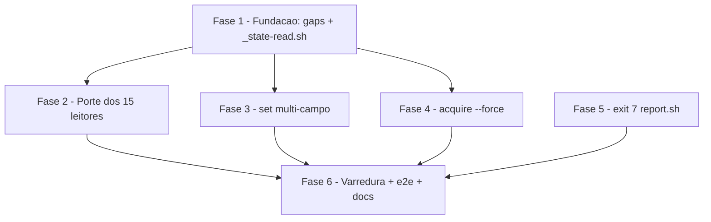

# Tarefas cstk - Paridade do runtime 00c com o backend SQLite (state-db-runtime-parity)

Escopo: fechar a lacuna de paridade das fases 1/2 do cutover `state.json` →
`state.db` — porte dos 15 leitores do runtime para a interface canonica via
sibling `_state-read.sh`, `set` multi-campo atomico, `acquire --force`,
exit 7 contratual do `report.sh` e varredura anti-regressao em 2 camadas.
Origem: [spec.md](./spec.md) (FR-001..FR-012) + [plan.md](./plan.md) (F1-F6).

**Legenda de status:**
- `[ ]` Pendente
- `[~]` Em andamento
- `[x]` Concluido
- `[!]` Bloqueado

**Legenda de criticidade:**
- `[C]` Critico - Impacto financeiro direto ou bloqueante
- `[A]` Alto - Funcionalidade essencial
- `[M]` Medio - Necessario mas sem urgencia imediata

---

## FASE 1 - Fundacao: gaps de requisito + helper `_state-read.sh`

### 1.1 Fechar gaps de requisito do checklist `[A]`

Ref: checklists/api.md CHK008/CHK009; checklists/security.md CHK016; checklists/operational.md CHK032

- [x] 1.1.1 CHK009: definir semantica do MESMO `--field` repetido no lote multi-campo (last-wins vs erro de uso exit 2) e registrar a decisao no contract §1 + spec FR-005
- [x] 1.1.2 CHK016: especificar o mecanismo da allowlist de prosa da camada estatica (onde vive — arquivo ou padrao no teste; como um item novo e adicionado; criterio codigo-real-vs-prosa de FR-010) e registrar no contract/research
- [x] 1.1.3 CHK032: definir a fixture minima do state-dir SQLite da varredura dinamica (entidades por leitor: ondas/decisoes/bloqueios/tasks; `retro.sh` exige retro-execucoes? `drift.sh` exige `key_aspects`?) para que os 15 leitores exercitem caminho real, nao vazio-trivial
- [x] 1.1.4 CHK008: definir o protocolo de validacao das assinaturas `[PROPOSTA]` do contract — cada tarefa implementadora (1.2.6, 3.1.7, 4.2.5) valida a assinatura contra o codigo real e remove o marcador no MESMO commit
- [x] 1.1.5 Marcar CHK008/CHK009/CHK016/CHK032 como resolvidos nos checklists com citacao da evidencia

### 1.2 Implementar sibling sourceable `_state-read.sh` `[A]`

Ref: research.md Decision 1; contracts/runtime-interfaces.md §4; spec FR-001/FR-003/FR-004/FR-012

- [x] 1.2.1 Implementar `state_read_materialize`: state-dir JSON devolve o proprio `state.json` (zero mudanca, FR-004); state-dir SQLite materializa via `state-rw.sh read` em `mktemp` 0600 FORA do state-dir (LOW/A04 do plan)
- [x] 1.2.2 Implementar `state_read_cleanup` + protocolo de trap `EXIT INT TERM` conforme contract §4
- [x] 1.2.3 Sob SQLite com `sqlite3` ausente no host, propagar a falha rapida do `state-rw.sh read` (FR-012 — nunca degradar mudo)
- [x] 1.2.4 Garantir anti-mirror: o helper MUST NOT criar arquivo dentro do state-dir (FR-003)
- [x] 1.2.5 Criar `tests/test__state-read.sh` (precedente de sibling: `tests/test__state-ondas-db.sh`): JSON direto, SQLite via read, anti-mirror, `sqlite3` ausente, state-dir vazio
- [x] 1.2.6 Validar assinatura `[PROPOSTA]` do contract §4 contra a implementacao e remover o marcador (Ref: CHK008)

---

## FASE 2 - Porte dos 15 leitores para a interface canonica

### 2.1 Lote guardas leitoras: budget, drift, state-validate, pipeline `[A]`

Ref: spec FR-001/FR-002/FR-011; research.md Decision 6 (classe reader)

- [x] 2.1.1 Portar `budget.sh` (`_bd_state_file()` builder direto) para `_state-read.sh`; jq pipelines internos INALTERADOS
- [x] 2.1.2 Adicionar cenarios sqlite em `tests/test_budget.sh` (veredito equivalente ao backend JSON — SC-003)
- [x] 2.1.3 Portar `drift.sh` (`check`/`extract`) para `_state-read.sh`
- [x] 2.1.4 Adicionar cenarios sqlite em `tests/test_drift.sh`
- [x] 2.1.5 Portar `state-validate.sh` (schema check sobre doc materializado) para `_state-read.sh`
- [x] 2.1.6 Adicionar cenarios sqlite em `tests/test_state-validate.sh`
- [x] 2.1.7 Portar `pipeline.sh` para `_state-read.sh`
- [x] 2.1.8 Adicionar cenarios sqlite em `tests/test_pipeline.sh`

### 2.2 Lote guardas mutadoras: cycles, circular, retro `[A]`

Ref: spec FR-001/FR-002/FR-011; research.md Decision 6 (classe read-write — escrita roteia por `state-rw.sh set`)

- [x] 2.2.1 Portar leitura de `cycles.sh` para `_state-read.sh` e rotear a mutacao do `tick` por `state-rw.sh set`
- [x] 2.2.2 Adicionar cenarios sqlite em `tests/test_cycles.sh`
- [x] 2.2.3 Portar leitura de `circular.sh` e rotear a mutacao do `push` por `state-rw.sh set`
- [x] 2.2.4 Adicionar cenarios sqlite em `tests/test_circular.sh`
- [x] 2.2.5 Portar leitura de `retro.sh` e rotear a mutacao do `consume` por `state-rw.sh set`
- [x] 2.2.6 Adicionar cenarios sqlite em `tests/test_retro.sh`

### 2.3 Lote leitores de relatorio/roteamento: wave-usage-report, model-routing, model-routing-report `[M]`

Ref: spec FR-001/FR-011; research.md Decision 6 (classe reader)

- [x] 2.3.1 Portar `wave-usage-report.sh` (19 hits — maior contagem) para `_state-read.sh`
- [x] 2.3.2 Adicionar cenarios sqlite em `tests/test_wave-usage-report.sh`
- [x] 2.3.3 Portar `model-routing.sh` (`idempotent-check`/`wave-select`) para `_state-read.sh`
- [x] 2.3.4 Adicionar cenarios sqlite em `tests/test_model-routing.sh`
- [x] 2.3.5 Portar `model-routing-report.sh` (`aggregate`) para `_state-read.sh`
- [x] 2.3.6 Adicionar cenarios sqlite em `tests/test_model-routing-report.sh`

### 2.4 Lote read-write auxiliares: suggestions, state-cache, state-decisions-reconcile, issue `[M]`

Ref: spec FR-001/FR-011; research.md Decision 6 (classe read-write)

- [x] 2.4.1 Portar `suggestions.sh` (leitura via helper; `register` muta via `state-rw.sh set`)
      <!-- onda-010: .suggestions via set (extra_fields no sqlite); contadores
           global_skill_suggestions_total/toolkit_issues_opened DERIVADOS no read
           sob sqlite (dec-052) e bumpados via set so no backend JSON (FR-004) -->
- [x] 2.4.2 Adicionar cenarios sqlite em `tests/test_suggestions.sh`
      <!-- + hermeticidade HOME-json no _init (host com state_backend=sqlite) -->
- [x] 2.4.3 Portar `state-cache.sh` (`get-resumo` le; `metrics-bump` muta via set)
      <!-- onda-010: todos os subcomandos portados; metrics-bump grava o objeto
           .accumulated_metrics.cache inteiro via set (novo case em _state-rw-db.sh:
           persiste em extra_fields.cache_metrics, read remonta). Fix emergente em
           state-rw.sh set: validacao usava `jq -e`, que rejeitava null/false
           (valores JSON validos — invalidate quebrava); coberto por
           scenario_set_aceita_null_e_false_como_valor em tests/test_state-rw.sh -->
- [x] 2.4.4 Adicionar cenarios sqlite em `tests/test_state-cache.sh`
- [x] 2.4.5 Portar `state-decisions-reconcile.sh` (`check` le; `repair --apply` muta via set)
      <!-- onda-010/dec-051: metade `repair --apply` do enunciado e VACUA — o
           subcomando repair nao existe no runtime (grep -rn repair = 0 hits);
           portado o `check` (read-only, INV-4) via _state-read.sh -->
- [x] 2.4.6 Adicionar cenarios sqlite em `tests/test_state-decisions-reconcile.sh`
- [x] 2.4.7 Portar `issue.sh` (registro de issue no state via set)
      <!-- onda-010: issue.sh nao escreve estado diretamente — leitura
           (_ish_get_state/_ish_build_body) via _state-read.sh; o registro no
           state delega a suggestions.sh mark-issue (ja portado) -->
- [x] 2.4.8 Adicionar cenarios sqlite em `tests/test_issue.sh`

### 2.5 Portar `state-lock.sh check-execution-busy` `[A]`

Ref: spec FR-010 (codigo real, nao prosa); research.md Decision 6

- [x] 2.5.1 Portar a leitura de estado do `check-execution-busy` para `_state-read.sh`
      <!-- onda-011: sonda pre-porte confirmou o gap FR-010 (state.db com
           em_andamento => busy exit 0); pos-porte exit 3 com mensagem
           apontando state.db; lock mkdir intacto (nao depende do estado) -->
- [x] 2.5.2 Adicionar cenarios sqlite em `tests/test_state-lock.sh`
      <!-- onda-011: +3 cenarios (em_andamento exit 3, terminal exit 0 via
           UPDATE direto — CHECK exige finished_at junto, escopo FASE 3 —,
           anti-mirror FR-003); fixture padrao test_retro.sh (HOME sandbox) -->
- [x] 2.5.3 Assertar caminho JSON inalterado (comportamento identico ao atual — FR-004)
      <!-- onda-011: cenario json_caminho_inalterado (exit 3 + stderr aponta
           o proprio state.json); suite 16/16 verde -->

### 2.6 Migrar `report.sh` + `feature-00c-preflight.sh` para o helper comum `[A]`

Ref: plan.md F2 (elimina as 2 copias locais do padrao a06e747, v6.2.2)

- [x] 2.6.1 Substituir a copia local de materializacao do `report.sh` por `_state-read.sh`
      <!-- onda-011: _rp_state_file/_rp_cleanup_tmp_state removidos; source
           sibling + trap state_read_cleanup; falha de read agora propaga
           (FR-012) em vez de fallback mudo -->
- [x] 2.6.2 Substituir a copia local do `feature-00c-preflight.sh` por `_state-read.sh`
      <!-- onda-011: bloco a06e747 (~14 linhas) => 2 linhas via helper;
           mensagem "estado ausente" preservada (teste assere) -->
- [x] 2.6.3 Confirmar testes existentes verdes (`tests/test_report.sh`, `tests/test_feature-00c-preflight.sh`) com cenarios sqlite mantidos
      <!-- onda-011: report 40/40, preflight 10/10, _state-read 9/9;
           expectativas intactas — so as fixtures iso do test_report copiam
           agora o sibling _state-read.sh (dependencia obrigatoria, padrao
           _diag.sh); allowlist CHK016 ainda nao existe (nasce na 6.1.1) e o
           conjunto canonico do research.md ja exclui os 2 arquivos;
           dogfooding: preflight ok:true + generate exit 0 no state.db real -->

---

## FASE 3 - `state-rw.sh set` multi-campo atomico

### 3.1 Parser N pares + envelope transacional unico `[A]`

Ref: spec FR-005/FR-006; contracts/runtime-interfaces.md §1; research.md Decision 2; plan §Security Review LOW/A05

- [x] 3.1.1 Estender o parser de `_sr_cmd_set` (state-rw.sh:649) para acumular N pares `--field/--value`; `--value` sem `--field` previo ou `--field` sem `--value` ao fim => exit 2 (uso)
      <!-- onda-012: pares em vars indexadas via eval (POSIX sem arrays);
           --field com par pendente sobrescreve (continuidade flag last-wins) -->
- [x] 3.1.2 Aplicar a semantica de `--field` duplicado no lote decidida em 1.1.1 (Ref: CHK009)
      <!-- onda-012: last-wins pela ordem dos pares; em SQLite sai de graca
           (SET col=a, col=b e legal e o ultimo vence — sonda empirica) -->
- [x] 3.1.3 Backend JSON: aplicar todos os setpaths num UNICO write do documento
      <!-- onda-012: pipeline jq unico (.f1=$p[0].v | .f2=$p[1].v ...) +
           tmp+mv + sha256; evidencia: exatamente 1 backup novo por lote -->
- [x] 3.1.4 Backend SQLite: 1 transacao `BEGIN IMMEDIATE...COMMIT` em `_sr_db_set` (:657); fragmentos compostos EXCLUSIVAMENTE pelos helpers existentes (`_sr_sql_literal`, `_sr_exec_col_lookup`, `_sr_sql_quote`) — nunca interpolar `--field`/`--value` crus (LOW/A05)
      <!-- onda-012: _sr_db_set_multi em _state-rw-db.sh; ACHADO EMPIRICO:
           CHECK do SQLite e por STATEMENT (nao deferido ao COMMIT) => colunas
           de execution coalescidas num UNICO UPDATE multi-coluna e wave num
           UPDATE por onda (wave tambem tem CHECK cross-coluna); resolver
           read-only extraido (_sr_db_wave_field_resolve); resync de array e
           wave-extra rejeitados em lote (single-field segue cobrindo) -->
- [x] 3.1.5 Rejeicao por invariante (CHECK do schema, ex. C2): exit 1 + diagnostico citando invariante + campos do lote, estado intacto sem escrita parcial (FR-006)
      <!-- onda-012: sqlite stderr propaga o CHECK; die cita lote + "estado
           intacto (rollback automatico)"; validacao de TODOS os pares antes
           de qualquer escrita nos 2 backends -->
- [x] 3.1.6 Testes em `tests/test_state-rw.sh`: promocao terminal canonica sob C2 (status+finished_at+termination_reason), rejeicao com estado intacto, retrocompat 1 par byte-identica (FR-004), erros de uso exit 2, campo duplicado
      <!-- onda-012: +9 cenarios (5 sqlite + 4 json/uso), 66/66 verde;
           vizinhas: state-ondas 110, _state-read 9, state-cache 30,
           state-decisions 53 — zero regressao; shellcheck limpo -->
- [x] 3.1.7 Validar assinatura `[PROPOSTA]` do contract §1 contra a implementacao e remover o marcador (Ref: CHK008)
      <!-- onda-012: marcador removido; 3 deltas fixados no contract (CHECK
           por statement/UPDATE coalescido, arrays fora de lote, --field
           pendente sobrescreve); quickstart Cenario 3 ja bate (sem edit);
           dogfooding: set 2 extra_fields no state.db real, integrity ok -->

---

## FASE 4 - `state-lock.sh acquire --force`

### 4.1 Decisao humana CHK019: apetite de risco TOCTOU `[C]`

Ref: checklists/security.md CHK019; plan §Security Review MEDIUM/ASI02-03; CHK072 (herdado)

- [x] 4.1.1 Registrar bloqueio humano com contexto: aceitar a janela TOCTOU herdada (CHK072) vs mitigar (ex. lock com dono/PID verificado) no freio de emergencia `--force`
      <!-- onda-012: block-001 registrado (dec-058) com opcoes
           aceitar-toctou-herdada | mitigar-lock-com-dono-pid; contexto cita
           contract §2, CHK012/CHK014 e o desdobramento 4.1.2/4.1.3 -->
- [x] 4.1.2 Aplicar a resposta: atualizar checklists/security.md CHK019 e, se mitigacao exigida, refletir em spec/plan
      <!-- onda-013: dec-059 = mitigar-lock-com-dono-pid; CHK019 [x] citando
           block-001/dec-059; spec ganhou FR-007a; plan §Security MEDIUM/ASI02-03
           atualizado de "aceita" para "MITIGADA"; nota de consistencia em CHK014 -->
- [x] 4.1.3 Se mitigacao exigida, inserir sub-FASE emergente ANTES de 4.2 no mesmo commit da Decisao
      <!-- onda-013: sub-FASE 4.1.bis inserida abaixo (mitigacao exigida por dec-059) -->

### 4.1.bis Sub-FASE emergente (dec-059): owner-PID no lock `[C]`

Ref: spec FR-007a; dec-059/block-001; CHK019; plan §Security Review MEDIUM/ASI02-03

- [x] 4.1.bis.1 Gravar o dono na aquisicao: `acquire` escreve arquivo `owner` dentro do diretorio `.lock` com `pid` + `timestamp` (mkdir continua sendo a primitiva atomica de aquisicao; a escrita do owner e pos-mkdir, best-effort para nao quebrar a atomicidade) <!-- onda-013: _sl_write_owner; default $PPID, override --owner-pid -->
- [x] 4.1.bis.2 `check` (e diagnosticos de contention) passam a reportar o dono quando o arquivo `owner` existe (pid + timestamp no stdout/diagnostico) <!-- onda-013: _sl_report_owner (pid, vivo/morto, acquired_at) -->
- [x] 4.1.bis.3 Retrocompat com locks legados SEM `owner`: tratar como dono-desconhecido — `--force` exige a heuristica antiga (pre-condicao contratual SIGTERM+grace) + diagnostico explicito de aviso <!-- onda-013: aviso "lock legado sem arquivo owner (dono-desconhecido)" -->

### 4.2 Implementar `acquire --force` auditavel `[C]`

Ref: spec FR-007 + FR-007a; contracts/runtime-interfaces.md §2; research.md Decision 3; feature-00c-abort.md:91 (contrato shipado); dec-059

- [x] 4.2.1 Flag `--force` no `acquire`: lock ausente = identico ao acquire normal (mkdir, exit 0); lock detido = verificar dono (4.1.bis) e, se autorizado, `rmdir` + `mkdir` na MESMA invocacao, exit 0 <!-- onda-013: _sl_force_consummate -->
- [x] 4.2.1a `--force` NUNCA consuma com dono VIVO (`kill -0` sucede): exit != 0 + diagnostico citando o PID vivo (dec-059) <!-- onda-013: exit 3 + lock-force-denied-owner-alive -->
- [x] 4.2.1b `--force` com dono morto (`kill -0` falha) ou lock legado sem owner (aviso explicito) consuma normalmente
- [x] 4.2.2 Todo force-acquire sobre lock detido emite `diag_emit lock-force-acquired` com PID antigo/novo (auditavel — MEDIUM/ASI02-03) <!-- onda-013: DIAG|warning|lock-force-acquired| pid antigo/novo -->
- [x] 4.2.3 `acquire` SEM `--force` permanece comportamentalmente identico ao atual (exit 3 se detido; unica adicao: gravacao do owner pos-mkdir, 4.1.bis.1) <!-- onda-013: cenarios legados 16/16 intactos -->
- [x] 4.2.4 Testes em `tests/test_state-lock.sh`: owner gravado na aquisicao; check reporta dono; force com dono morto passa; force com dono VIVO recusa; force em lock legado sem owner (aviso); sem-force exit 3; lock ausente; assert do evento `diag_emit`; falha de rmdir/mkdir com exit != 0; cenarios existentes intactos <!-- onda-013: 9 cenarios novos; suite 25/25 -->
- [x] 4.2.5 Validar semantica `[PROPOSTA]` do contract §2 contra a implementacao (incluindo FR-007a) e remover o marcador (Ref: CHK008) <!-- onda-013: contract §2 reescrito com semantica real; grep -c PROPOSTA = 0 (gate CHK008 satisfeito) -->

---

## FASE 5 - Exit 7 contratual do `report.sh`

### 5.1 Exit 7 por estado ausente em `generate` e `emit` `[A]`

Ref: spec FR-008; contracts/runtime-interfaces.md §3; research.md Decision 4; checklists/api.md CHK010

- [x] 5.1.1 `generate`: trocar exit 1 por exit 7 na morte por estado ausente (report.sh:452) + diagnostico em stderr, estado (se algum) preservado
- [x] 5.1.2 `emit`: idem na morte por estado ausente (report.sh:552)
- [x] 5.1.3 Preservar exit 2 (uso) e exit 1 (falhas genericas) sem sobreposicao nos DOIS subcomandos (CHK010)
- [x] 5.1.4 Testes de contrato em `tests/test_report.sh`: state-dir sem `state.json` E sem `state.db` legivel => exit 7, nos dois backends e nos dois subcomandos

---

## FASE 6 - Varredura anti-regressao, validacao end-to-end e encerramento

### 6.1 Varredura FR-009 em 2 camadas: `tests/test_state-parity-sweep.sh` `[A]`

Ref: spec FR-009/FR-010; research.md Decision 5; checklists CHK016/CHK032

- [x] 6.1.1 Camada estatica: grep por acesso direto a `state.json` fora da interface canonica, com allowlist de prosa no mecanismo definido em 1.1.2 (Ref: CHK016)
- [x] 6.1.2 Camada dinamica: manifest dos 15 leitores executados contra state-dir SQLite populado com a fixture definida em 1.1.3 (Ref: CHK032); assert de veredito nao-degradado por leitor
- [x] 6.1.3 Registrar o sweep em `_is_internal_test` (`tests/run.sh`) para nao falsear o orphan check
- [x] 6.1.4 Rodar `./tests/run.sh --check-coverage` e confirmar verde (novos `test__state-read.sh` + sweep reconhecidos)

### 6.2 Validacao end-to-end (quickstart.md) `[A]`

Ref: quickstart.md cenarios 1-6 + roundtrip; spec SC-001..SC-005

- [x] 6.2.1 Executar cenarios 1-2: helper de orcamento sob SQLite + equivalencia de veredito entre backends
- [x] 6.2.2 Executar cenarios 3-4: promocao terminal multi-campo (happy + error) + force-acquire de lock orfao
- [x] 6.2.3 Executar cenarios 5-6: exit contratual do relatorio + varredura detecta reintroducao
- [x] 6.2.4 Executar o roundtrip end-to-end real (nao mock) do quickstart
- [x] 6.2.5 Rodar os testes dos scripts tocados (filtro por pattern) e a suite completa APENAS em background — NUNCA suite completa em foreground

### 6.3 Documentacao `[M]`

Ref: plan.md §Project Structure; CLAUDE.md do repo; convencao de docs do runtime

- [x] 6.3.1 Adicionar secao no CLAUDE.md do repo documentando a paridade do runtime com o backend SQLite (helper `_state-read.sh`, set multi-campo, `--force`, exit 7)
- [x] 6.3.2 Atualizar SKILL.md/README do `agente-00c-runtime` com as interfaces novas
- [x] 6.3.3 Verificacao final: nenhum marcador `[PROPOSTA — a validar na implementacao]` restante em contracts/runtime-interfaces.md (fecha CHK008)

### 6.4 Decisao CHK031: priorizacao da feature dedicada de hooks `[M]`

Ref: checklists/operational.md CHK031; spec §Out of Scope; dec-010

- [x] 6.4.1 Registrar a decisao/bloqueio de priorizacao da feature dedicada de hooks (`posttooluse-tool-call-tick.sh` nunca dispara sob SQLite hoje) — feito via block-002 (bloqueio humano, onda-014) respondido pelo operador → dec-069 (score 3): `priorizar-feature-de-hooks`
- [x] 6.4.2 Refletir a resposta em checklists/operational.md CHK031 — CHK031 [x] citando block-002/dec-069 (onda-015)
- [x] 6.4.3 Se priorizada, registrar entrada de backlog/sugestao para a feature dedicada com dono e gatilho — sugestao registrada via `suggestions.sh register` (short-name sugerido `hooks-db-parity`; dono: operador; gatilho: proxima `/feature-00c` apos release; requisito de latencia ~30ms/~177ms)

---

## Matriz de Dependencias

Notas de ordem real: 3.1.2 depende de 1.1.1 (CHK009); 6.1.1 de 1.1.2 (CHK016);
6.1.2 de 1.1.3 (CHK032); 4.2 depende da decisao humana 4.1 (CHK019). F5 nao
tem dependencia de fase anterior (report.sh ja migra em 2.6, mas o exit 7 e
delta independente); F3/F4/F5 podem rodar apos F1 em paralelo logico — a
execucao segue F1..F6 sequencial por simplicidade de ondas.

## Resumo Quantitativo

| Fase | Tarefas | Subtarefas | Criticidade |
|------|---------|------------|-------------|
| 1 - Fundacao: gaps + helper | 2 | 11 | A |
| 2 - Porte dos 15 leitores | 6 | 34 | A/M |
| 3 - set multi-campo | 1 | 7 | A |
| 4 - acquire --force | 2 | 8 | C |
| 5 - exit 7 report.sh | 1 | 4 | A |
| 6 - Varredura + e2e + docs | 4 | 15 | A/M |
| **Total** | **16** | **79** | - |

## Escopo Coberto

| Item | Descricao | Fase |
|------|-----------|------|
| FR-001/FR-003/FR-012 | Helper sourceable `_state-read.sh` (materializacao canonica, anti-mirror, falha rapida) | 1 |
| CHK008/CHK009/CHK016/CHK032 | Gaps de requisito do checklist fechados como tarefas rastreaveis | 1 |
| FR-001/FR-002/FR-011 | Porte dos 14 leitores + `check-execution-busy` com cenarios sqlite por script | 2 |
| FR-004 | Retrocompat JSON byte-identica (suite existente inalterada) | 2, 3 |
| FR-005/FR-006 | `set` multi-campo atomico + rejeicao por invariante com estado intacto | 3 |
| CHK019 (humano) + FR-007 | Decisao de apetite de risco TOCTOU + `acquire --force` auditavel | 4 |
| FR-008 | Exit 7 contratual em `report.sh generate` e `emit` | 5 |
| FR-009/FR-010 | Varredura anti-regressao 2 camadas + registro no harness | 6 |
| SC-001..SC-005 | Validacao end-to-end via quickstart (6 cenarios + roundtrip) | 6 |
| CHK031 (humano) | Registro de priorizacao da feature dedicada de hooks | 6 |

## Escopo Excluido

| Item | Descricao | Motivo |
|------|-----------|--------|
| Hooks do harness | `posttooluse-tool-call-tick.sh`, `pretooluse-bash-guard.sh` | Feature separada (dec-010; plan §Technical Context); CHK031 registra a priorizacao |
| `cli/lib/00c-bootstrap.sh` | Porte de codigo | Unico hit (:446) e prosa de mensagem — auditado em research Decision 6; entra so na allowlist estatica |
| Schema SQLite / mapper | Alteracao estrutural de `references/state-db-schema.sql` ou `_state-rw-db.sh` | Fora de escopo — apenas o envelope transacional do `set` e refatorado (plan §Convencoes de Borda) |
| Mirror persistente `state.json` | Materializar espelho dentro do state-dir SQLite | Proibido por FR-003 (anti-padrao que mascararia a paridade) |
