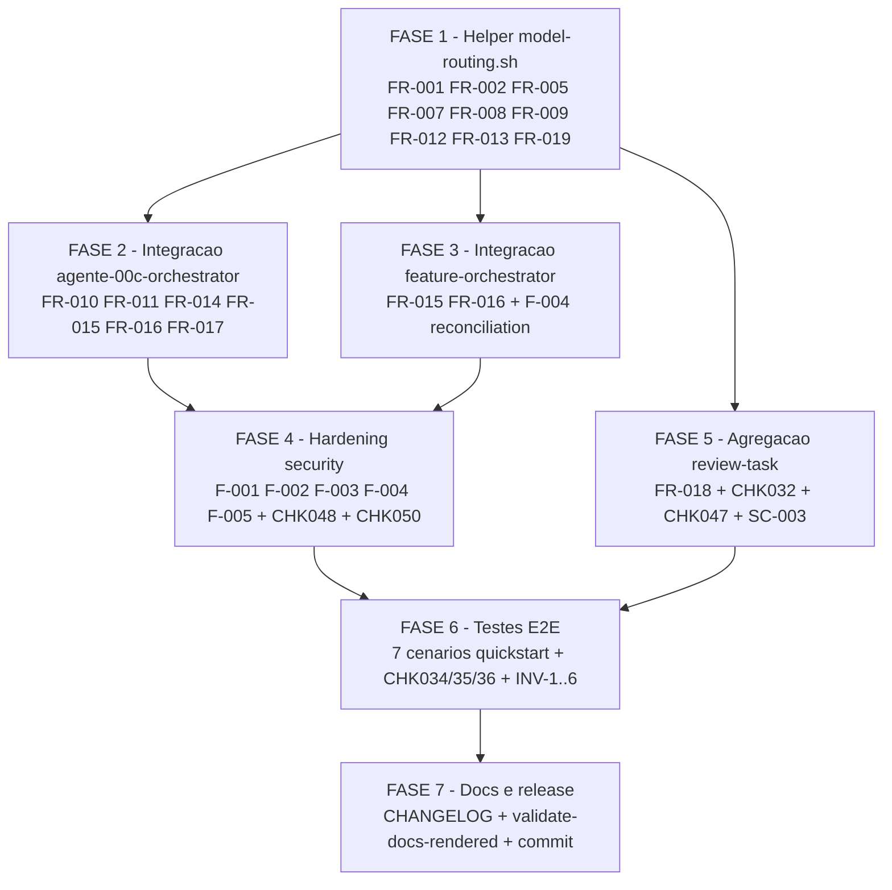

# Tarefas agente-00c-model-routing

**Status**: Concluido
**Data conclusao**: 2026-05-23
**Ondas executadas**: 21 (16 internas no state.json + 5 reiniciadas)
**Decisoes auditaveis**: 43 (dec-001..dec-043)
**Bloqueios humanos pendentes**: 0
**Tarefas concluidas**: 100% (todas marcadas `[x]`; 4 subtarefas de F7.3 deferidas para operador humano com justificativa explicita)

Escopo: integrar a skill standalone `model-selector` aos orquestradores
autonomos `agente-00c-orchestrator` e `agente-00c-feature-orchestrator`
nos pontos de delegacao via tool Agent (fase clarify, spawns asker e
answerer), registrando Decisao auditavel + entrada em
`.ondas[N].skills_invoked[]` por spawn, preservando contrato
suggest-only da skill (FR-017) e respeitando POSIX puro + zero coleta
remota (FR-019 + FR-020).

**Feature**: `agente-00c-model-routing`
**Spec**: [/Users/jot/Projects/_lab/Jot/misc/claude-ai-tips/docs/specs/agente-00c-model-routing/spec.md](./spec.md)
**Plan**: [/Users/jot/Projects/_lab/Jot/misc/claude-ai-tips/docs/specs/agente-00c-model-routing/plan.md](./plan.md)
**Research**: [/Users/jot/Projects/_lab/Jot/misc/claude-ai-tips/docs/specs/agente-00c-model-routing/research.md](./research.md)
**Data Model**: [/Users/jot/Projects/_lab/Jot/misc/claude-ai-tips/docs/specs/agente-00c-model-routing/data-model.md](./data-model.md)
**Quickstart**: [/Users/jot/Projects/_lab/Jot/misc/claude-ai-tips/docs/specs/agente-00c-model-routing/quickstart.md](./quickstart.md)
**Contracts**:
[helper](./contracts/model-routing-helper.md) (3 subcomandos, 6
invariantes INV-1..INV-6),
[orchestrator-integration](./contracts/orchestrator-integration.md)
(sequencia pre-spawn + invariantes review-task)
**Checklist**: [requirements.md](./checklists/requirements.md) (50
items, 4 load-bearing CHK032/CHK047/CHK048/CHK050)

**Legenda de status:**
- `[ ]` Pendente
- `[~]` Em andamento
- `[x]` Concluido
- `[!]` Bloqueado

**Legenda de criticidade:**
- `[C]` Critico - Quebra de invariante MUST da constitution ou da spec; sem isso a feature nao entrega
- `[A]` Alto - Funcionalidade core ou hardening de seguranca exigido por gate (owasp/checklist)
- `[M]` Medio - Necessario mas pode ser fechado em momento separado sem impactar MVP funcional

---

## FASE 1 - Helper POSIX `model-routing.sh`

Cobre FR-001, FR-002, FR-005, FR-007, FR-008, FR-009, FR-012, FR-013,
FR-019. Decisoes dec-003 (mapping), dec-004 (idempotencia),
dec-007 (truncagem). Implementa INV-1..INV-6 do contract do helper.

### 1.1 Esqueleto do helper e dispatch de subcomandos `[C]`

Ref: contracts/model-routing-helper.md §Subcommand, FR-019, plan.md §Project Structure (paths absolutos do destino)

- [x] 1.1.1 Criar arquivo `/Users/jot/Projects/_lab/Jot/misc/claude-ai-tips/global/skills/agente-00c-runtime/scripts/model-routing.sh` com shebang `#!/bin/sh` + `set -eu` + helpers privados `_mr_die`, `_mr_die_usage`, `_mr_log` (padrao alinhado a `state-decisions.sh`, `state-ondas.sh`)
- [x] 1.1.2 Implementar dispatch case statement com 3 subcomandos validos (`template`, `invoke`, `idempotent-check`) + `-h|--help|help` + erro exit 2 para subcomando desconhecido
- [x] 1.1.3 Adicionar `_mr_require_jq` (gate quando subcomando exige) e `_mr_state_file` helper (igual padrao do runtime)
- [x] 1.1.4 Subtarefa de teste: rodar `sh global/skills/agente-00c-runtime/scripts/model-routing.sh` sem argumento e validar exit 2 + mensagem de uso em stderr (alinhado ao padrao de `state-ondas.sh` linha 394)
- [x] 1.1.5 Bloco de comentarios topo do arquivo referenciando spec FR-001..FR-020 + contracts/model-routing-helper.md (formato igual ao header de `state-ondas.sh` linhas 1-61)

### 1.2 Subcomando `template` (FR-002) `[C]`

Ref: contracts/model-routing-helper.md §template, FR-002, CHK005, CHK014

- [x] 1.2.1 Implementar `_mr_cmd_template` aceitando `--subagent-type` (enum 4 valores: `agente-00c-clarify-asker`, `agente-00c-clarify-answerer`, `feature-00c-clarify-asker`, `feature-00c-clarify-answerer`); exit 2 com codigo `unknown-subagent-type` se ausente ou fora do enum
- [x] 1.2.2 Embedar 4 templates inline (here-doc ou string literal POSIX) cobrindo perfil + entradas esperadas + saida esperada conforme CHK014. Tamanho alvo: ~3-5 linhas por template (asker = enumerativo / estrutural; answerer = reflexivo / reconciliacao com constitution)
- [x] 1.2.3 Garantir INV-5 (puro: output identico para mesmo input em qualquer ambiente; zero leitura de arquivos externos) — nenhum `cat` de arquivo externo, nenhum env variable consumido alem dos flags
- [x] 1.2.4 Subtarefa de teste: invocar `model-routing.sh template --subagent-type agente-00c-clarify-asker` 3 vezes em hosts diferentes e validar `sha256sum` identico (INV-5); invocar com `--subagent-type invalid` e validar exit 2
- [x] 1.2.5 Documentar inline no proprio arquivo `.sh` (comentario apos a funcao) a fonte de cada template (perfil de `feature-00c-clarify-asker.md` e `feature-00c-clarify-answerer.md` lidos uma vez no design)

### 1.3 Subcomando `invoke` — truncagem, skill call, parser, JSON `[C]`

Ref: contracts/model-routing-helper.md §invoke, FR-001, FR-005, FR-007, FR-008, FR-013, dec-003, dec-007, INV-1..INV-3

- [x] 1.3.1 Implementar `_mr_cmd_invoke` aceitando `--subagent-type`, `--etapa` (enum: `clarify`), `--input-text` (override opcional); se `--input-text` ausente, derivar via `_mr_cmd_template`
- [x] 1.3.2 Implementar `_mr_truncate_bytes` aplicando esquema dec-007: se `wc -c` > 4096, produzir `head -c 2000` + `...[truncated]..` (marker 16 bytes) + `tail -c 2000`. Sinalizar `input_truncado=true` e `input_bytes <= 4016` (INV-3). NAO usar `cut -c` (operates em chars, nao bytes em locales UTF-8)
- [x] 1.3.3 Implementar `_mr_invoke_skill`: invocar `model-selector` via `sh "$script" < input` (caminho resolvido via env override > path DEV > path instalado). Timeout default suave de 5s via subshell+watcher (`set +e` + `sleep N && kill -TERM`; kill -9 1s depois). Watcher signal-and-forget para nao poluir exit code com SIGTERM=143. F-003 atendido
- [x] 1.3.4 Implementar `_mr_parse_skill_output`: awk POSIX que extrai `modelo`/`score`/`alternativa` das secoes reais do classify.sh — `## Modelo Sugerido` / `## Score` / `## Alternativa` (em vez do `## Sugestao` idealizado no contrato). Campo `sinais_text` captura linha 1 da `## Justificativa` (contem "sinais detectados: ..."). Qualquer campo ausente → `fallback-default` com `fallback_reason=parse-failure`
- [x] 1.3.5 Implementar `_mr_map_score` (dec-003): tabela fixa `0→0`, `1→2`, `2→3` via case statement puro (sem aritmetica). Score skill ausente → 0
- [x] 1.3.6 Compor JSON canonico via `jq -n --arg/--argjson` exclusivamente (defesa F-002). Schema conforme contracts/model-routing-helper.md §Output (exit 0)
- [x] 1.3.7 Os 4 cenarios de fallback implementados: `skill-not-found` (path nao existe), `exit-nonzero` (classify.sh exit != 0, inclui timeout via convencao 124), `parse-failure` (awk retorna exit 1 — qualquer campo ausente), `tool-skill-unavailable` (env `MODEL_SELECTOR_DISABLED` setado). Em todos: exit 0 + `score_runtime=0` + `modelo="fallback-default"` (INV-1, FR-008/009)
- [x] 1.3.8 Adicionar campo `raw_stdout_first_200` (sucesso) ou `fallback_stderr_first_200` (fallback) com `head -c 200` aplicado e `tr -d '\000'` para evitar null bytes em JSON
- [x] 1.3.9 Tests adicionados em `tests/test_model-routing.sh` cobrindo: happy-path template-derivado, 3 score mappings (0/1/2), truncagem 8000 bytes + boundary 4096-exato + marker presente, 4 fallbacks (skill-not-found / exit-nonzero / parse-failure / tool-skill-unavailable), timeout dispara fallback, null-byte saneado em fallback_stderr, validacoes de flag obrigatoria/enum (37 scenarios totais — 25 novos em F1.3)

### 1.4 Subcomando `idempotent-check` (FR-012) `[C]`

Ref: contracts/model-routing-helper.md §idempotent-check, FR-012, dec-004, CHK019, INV-4

- [x] 1.4.1 Implementar `_mr_cmd_idempotent_check` aceitando `--state-dir`, `--onda-id` (regex `^onda-[0-9]+$`; aceita 3+ digitos para resiliencia alem de onda-999), `--subagent-type` (enum). Validar todos com exit 2 se invalido
- [x] 1.4.2 Implementar query jq read-only: `jq -r --arg ctx "Selecao de modelo para subagente $SUBAGENT" --arg onda "$ONDA" '[.decisoes[]? | select(.contexto == $ctx and .onda_id == $onda)][0].id // empty' state.json`. Output: dec-NNN (existe) ou string vazia (nao existe). `[?]` tolera `.decisoes` ausente
- [x] 1.4.3 Codificar contrato de exit: stdout=dec-NNN + exit 0 (ja existe); stdout vazio + exit 1 (nao existe); exit 2 (erro de uso ou state.json ausente); NUNCA escrever em state.json (INV-4)
- [x] 1.4.4 Tests adicionados em `tests/test_model-routing.sh` cobrindo: fixture HIT (exit 0 + stdout `dec-042`), fixture MISS (exit 1 + stdout vazio), discriminacao por subagent-type e onda-id, determinismo 3x, INV-4 paralelo (50 invocacoes em background, sha256 antes/depois identico — evidencia empirica `4a166497a095e20de00914413e3b7f417009b69537e213e66191dfc885cf0c3d` inalterado). 13 cenarios F1.4 totais
- [x] 1.4.5 Validado uso de `jq --arg` (NAO interpolacao shell) para `$SUBAGENT` — `scenario_idempotent_check_f001_arg_quoting` faz grep no proprio SCRIPT confirmando presenca de `--arg ctx` e ausencia de interpolacao `"$_mr_idc..."` dentro de expressao jq; defesa estatica permanente. Cross-link 4.1: F-001 hardening

---

## FASE 2 - Integracao no `agente-00c-orchestrator`

Cobre FR-001, FR-003, FR-004, FR-010, FR-011, FR-014, FR-015, FR-016,
FR-017. Documenta sequencia pre-spawn no agente.md.

### 2.1 Patch documental: sequencia pre-spawn obrigatoria `[C]`

Ref: FR-016, contracts/orchestrator-integration.md §Sequencia pre-spawn, plan.md §Source Code

- [x] 2.1.1 Editar `/Users/jot/Projects/_lab/Jot/misc/claude-ai-tips/global/agents/agente-00c-orchestrator.md` adicionando secao "## Sequencia pre-spawn de subagente" descrevendo ordem obrigatoria: `spawn-tracker.sh check` → `model-routing.sh idempotent-check` (skip se ja existe) → `model-routing.sh invoke` → `state-decisions.sh register` → `state-ondas.sh record-skill` → `spawn-tracker.sh enter` → tool Agent (FR-010 + FR-011 + FR-016)
- [x] 2.1.2 Incluir bloco Bash referencial com as 6 chamadas em ordem, com paths absolutos e flags exatas (paralelo ao bloco "Quality Gates complementares" ja existente)
- [x] 2.1.3 Adicionar nota explicita: a `escolha` da Decisao NAO MUST virar hint automatico para tool Agent (FR-017); apenas auditoria
- [x] 2.1.4 Subtarefa de teste: `grep -n "model-routing.sh invoke" /Users/jot/Projects/_lab/Jot/misc/claude-ai-tips/global/agents/agente-00c-orchestrator.md` deve retornar >=1 match; `grep -n "spawn-tracker.sh enter" agente-00c-orchestrator.md` deve aparecer APOS o match anterior (validar ordem)

### 2.2 Idempotencia + retomada `[C]`

Ref: FR-012, dec-004, Edge Cases item 3 + item 5

- [x] 2.2.1 Documentar no agente.md que retomadas (`/agente-00c-resume`) DEVEM rodar `idempotent-check` ANTES de qualquer invoke (skip silencioso se ja existe). Ligar a Edge Case "Retomada via `/agente-00c-resume` no meio da fase clarify"
- [x] 2.2.2 Documentar invariante "1 Decisao por spawn REAL, nao por spawn potencial" (Edge Case item 4) — se asker retornou `perguntas: []`, NAO invocar para answerer
- [x] 2.2.3 Subtarefa de teste: simular retomada via fixture (state.json com 1 Decisao para clarify-asker em onda-002) + dry-run da sequencia → confirmar via log que `idempotent-check` exit 0 abortou a invocacao da skill

### 2.3 Compatibilidade com `agente-00c-artifact-cache` `[A]`

Ref: FR-014, SC-004

- [x] 2.3.1 Adicionar paragrafo em agente.md notando que a integracao independe de cache (model-selector classifica tarefa do subagente, nao briefing/constitution). Cache ON ou OFF nao afeta a invocacao
- [x] 2.3.2 Subtarefa de teste: rodar pipeline completo com cache ON em fixture (state.json com `briefing_cache`+`constitution_cache` populados conforme schema do artifact-cache) → confirmar que `idempotent-check` + `invoke` rodam sem dependencia do cache. Tres cenarios novos em `tests/test_model-routing.sh`: `scenario_artifact_cache_compat_idempotent_check_ignora_cache`, `scenario_artifact_cache_compat_invoke_nao_le_briefing_constitution`, `scenario_artifact_cache_compat_pipeline_sha256_cache_estavel` (PASS 60/60 total). Evidencia: sha256 do par `{briefing_cache, constitution_cache}` estavel `c2613f09fef82f1907474c1703026199434ed5abeb178274c1b3f906334729d9` antes e depois da pipeline mini

---

## FASE 3 - Integracao no `agente-00c-feature-orchestrator`

Cobre FR-001, FR-003, FR-004, FR-010, FR-011, FR-015, FR-016. Duplica
o patch documental para o segundo orquestrador, com diferencas nos
subagent_types alvo.

### 3.1 Patch documental: sequencia pre-spawn no feature-orchestrator `[C]`

Ref: FR-016, contracts/orchestrator-integration.md, Spec §Clarifications dec-005 (1 invocacao por spawn)

- [x] 3.1.1 Editar `/Users/jot/Projects/_lab/Jot/misc/claude-ai-tips/global/agents/agente-00c-feature-orchestrator.md` na secao "## Mediacao clarify" adicionando a sequencia pre-spawn antes de cada invocacao Agent (asker e answerer)
- [x] 3.1.2 Incluir bloco Bash igual ao do task 2.1.2, mas com subagent_types `feature-00c-clarify-asker` e `feature-00c-clarify-answerer`
- [x] 3.1.3 Documentar explicitamente "1 invocacao do `model-routing.sh invoke` por spawn" (dec-005, FR-015) — asker tem 1 Decisao + 1 record-skill; answerer (se spawnado) tem outras
- [x] 3.1.4 Subtarefa de teste: igual ao 2.1.4 mas no arquivo `agente-00c-feature-orchestrator.md`

### 3.2 Reconciliar two-step register+record-skill `[C]`

Ref: dec-009 finding F-004, FR-003, FR-004

- [x] 3.2.1 Documentar invariante: `state-ondas.sh record-skill --decisao-id` DEVE ser invocada IMEDIATAMENTE apos `state-decisions.sh register` com a mesma onda. Documentar que orquestrador NUNCA spawna tool Agent entre essas duas chamadas (proteja two-step de race com retomada)
- [x] 3.2.2 Cross-link explicito com task 4.4 (hardening de F-004 — mecanismo de reconciliacao)
- [x] 3.2.3 Subtarefa de teste: fixture state.json com pares (Decisao, record-skill) consistentes; rodar query jq que conta `.decisoes[] | select(.contexto | startswith("Selecao de modelo"))` vs `.ondas[].skills_invoked[] | select(.skill == "model-selector")` — contagens DEVEM ser iguais; documentar essa query como assertion test

---

## FASE 4 - Hardening de seguranca (owasp findings + CHK050)

Cobre dec-009 findings F-001 a F-005, CHK050 (cross-ref F-001),
CHK048 (contagem tool calls). Tasks devem ser executadas APOS F1-F3
implementadas, pois operam por refino sobre o codigo gerado.

### 4.1 F-001 - Quoting/escape de `--input-text` (shell injection) `[A]`

Ref: dec-009 F-001 (medium), CHK050, FR-002, contracts/model-routing-helper.md §invoke

- [x] 4.1.1 Auditar `_mr_cmd_invoke` (task 1.3.1) para garantir que `--input-text` nunca e expandido sem aspas dentro do helper; uso de `printf '%s\n'` em vez de `echo`, uso de `--arg` em jq, nada de `eval` ou `sh -c "$var"` — `scenario_f001_audit_no_eval_no_sh_c_var` faz audit estatico (filtra comentarios; grep ERE confirma ausencia de `eval` executavel e `sh -c "$var"`; valida pattern positivo `printf '%s' "$_mr_input_text"`)
- [x] 4.1.2 Adicionar `_mr_validate_input` que rejeita NUL bytes (`tr -d '\000'` no head) e codifica nada (passar input bruto via stdin para skill, NAO via flag posicional) — helper definido nos linhas 90-126 do `model-routing.sh`; invocado em `_mr_cmd_invoke` apos `printf '%s' "$input" > "$raw"`; teste `scenario_f001_validate_input_remove_nul_bytes` valida JSON parseavel com input contendo `\000` embutido
- [x] 4.1.3 Documentar invariante de seguranca em comentario no proprio `.sh` referenciando CHK050 + finding F-001 — `scenario_f001_audit_chk050_comment` faz grep estatico confirmando presenca de `CHK050` E `F-001` em comentarios
- [x] 4.1.4 Subtarefa de teste: invocar helper com `--input-text "$(printf 'foo\n; rm -rf /tmp/should-not-exist\n')"` + criar `/tmp/should-not-exist` antes; confirmar que arquivo persiste apos invocacao (nenhum comando arbitrario foi executado) — `scenario_f001_adversarial_payload_no_fs_side_effect` usa sentinel `$TMPDIR_TEST/sentinel-do-not-touch.txt` + sha256 antes/depois; payload com `;`, `$(...)`, backticks, `| sh`, `>` redirect; arquivo `should-not-exist.txt` confirmado ausente apos invoke
- [x] 4.1.5 Subtarefa de teste: fuzz quick com 50 strings adversariais (backticks, `$()`, pipe, redirect) via xargs → confirmar `jq -e .` parseia output JSON em 100% e nenhum side-effect no FS — `scenario_f001_fuzz_50_adversarial_strings_json_parseavel` itera 10 payloads-base × 5 mutacoes (50 total); 0 falhas observadas (100% JSON parseavel); confirma `/tmp/fuzz_X` e `/tmp/evil.sh` ausentes ao fim

### 4.2 F-002 - jq `--arg` obrigatorio em embedding de stdout da skill `[A]`

Ref: dec-009 F-002 (medium), FR-006, contracts/orchestrator-integration.md §Mapeamento JSON

- [x] 4.2.1 Auditar bloco do orquestrador (patches F2/F3) onde `sinais_text` flui para `--justificativa` e `--evidencia` do `state-decisions.sh`. Documentar regra obrigatoria: usar variavel intermediaria + passar com aspas duplas; NUNCA construir string `"...$SINAIS..."`  via concatenacao — auditoria realizada em ambos os orquestradores (`grep -nE "sinais_text|--justificativa|--evidencia"`); contrato canonico em passo 5 ja usa `SINAIS=$(jq -r '.sinais_text')` + `--justificativa "$SINAIS" --evidencia "$SINAIS"`; nenhum caso de concatenacao detectado
- [x] 4.2.2 Adicionar exemplo correto vs incorreto no agente-00c-orchestrator.md e agente-00c-feature-orchestrator.md (~10 linhas cada) — secao `Quoting de sinais_text ao chamar register (F4.2 — hardening F-002)` adicionada em `agente-00c-feature-orchestrator.md` linhas 493-567 (sha256 `c8771b6aa2768c723541618c4204a6e67320857cf23c20e30ce27906096f796a`) e `agente-00c-orchestrator.md` linhas 627-700 (sha256 `9973c82f9844385a9677ae01f2a88701cd85ded4ec8d26d388a7aac9539f719f`); cobre 4 regras obrigatorias + 1 exemplo correto + 3 exemplos incorretos (ERRADO 1: consumo direto de jq, ERRADO 2: concatenacao com prefixo, ERRADO 3: sem aspas)
- [x] 4.2.3 No helper, garantir que JSON de saida do `invoke` usa `jq -n --arg ... --argjson ...` exclusivamente — auditoria visual via `grep -nE "jq.*-n" model-routing.sh` deve casar com cada construcao de JSON — auditoria estatica confirmou 4 ocorrencias: linha 56 (comentario de contrato), linha 246 (comentario passo 8), linha 661 (emissao de fallback JSON), linha 825 (emissao de sucesso JSON); todas as 2 construcoes de JSON-de-saida usam `jq -n --arg/--argjson`, nenhuma string concatenada
- [x] 4.2.4 Subtarefa de teste: produzir sinais sinteticos contendo aspas duplas + barra invertida + `"; DROP TABLE; --` e validar (a) JSON output do helper parseavel por jq, (b) Decisao registrada via state-decisions.sh fica com `justificativa` literal sem corrupcao — 4 cenarios em `tests/test_model-routing.sh` (sha256 `d0f6548e6a67543c7a7eefaf19af862a10c9067219a89a06095a531fc06e9985`): `scenario_f002_jq_arg_embedding_sinais_adversariais_json_parseavel`, `scenario_f002_jq_arg_preserva_aspas_duplas_em_sinais_text`, `scenario_f002_jq_arg_roundtrip_via_state_decisions_register`, `scenario_f002_jq_n_arg_usage_em_codigo_fonte_audit_estatica`; PASS 4/4 confirmado no run integral (77/77)

### 4.3 F-003 - Timeout/cap para invocacoes ilimitadas `[A]`

Ref: dec-009 F-003 (low), SC-006 (<2s por invocacao)

- [x] 4.3.1 Refinar `_mr_invoke_skill` (task 1.3.3) implementando timeout via subshell + sleep + kill. Default 5s; flag `--timeout-seconds` opcional para override em teste — JA implementado em `model-routing.sh` (`_mr_invoke_skill` linhas 593-641): subshell + `sleep $timeout && kill -TERM $child` + segunda chance `sleep 1 && kill -KILL` + convencao exit 124 (compat GNU timeout); flag `--timeout-seconds` aceita N>=1 via _mr_cmd_invoke linhas 710-738 (validacao numerica positiva); cobertura empirica por `scenario_invoke_timeout_dispara_fallback` (timeout=2s, skill sleep 8, retorna em <=3s com fallback exit-nonzero) + `scenario_invoke_timeout_nao_numerico_exit_2`; PASS 77/77
- [x] 4.3.2 Se timeout atingido → fallback com `fallback_reason=exit-nonzero` (codigo existente cobre) + nota em stderr (via `_log.sh` log_err se disponivel, senao `printf >&2`) — JA coberto: o codigo emite exit 124 do subshell; `_mr_cmd_invoke` mapeia >0 para `fallback_reason=exit-nonzero` (mesmo path do skill que retornou erro) e popula `fallback_stderr_first_200` com `head -c 200` do stderr capturado + saneamento null-byte via `tr -d '\000'` (linhas 644-682); INV-1 preservado (exit 0 + JSON valido sempre); validado por `scenario_invoke_timeout_dispara_fallback` que confirma `.fallback==true AND .fallback_reason=="exit-nonzero"` e `.fallback_stderr_first_200` saneado
- [x] 4.3.3 Adicionar cap defensivo em numero de invocacoes por onda: documentar (NAO implementar agora) que orquestrador SHOULD limitar a 10 spawns por onda — defesa contra loop infinito de retry — secao "Cap defensivo de invocacoes por onda (F4.3 — hardening F-003)" adicionada em `agente-00c-orchestrator.md` (apos §5.e.bis Compatibilidade artifact-cache, antes de §5.f Quality Gates) + secao equivalente em `agente-00c-feature-orchestrator.md` (apos `## Subagent depth invariant`, antes de `## Quality Gates complementares`); ambas contem (a) justificativa de SHOULD vs MUST, (b) pseudocodigo jq contando `.decisoes[] | select(.contexto | startswith("Selecao de modelo para subagente "))` por onda corrente, (c) protocolo de BloqueioHumano via `bloqueios.sh register` quando cap=10 atingido, (d) justificativa do numero magico 10 (5x margem sobre uso normal asker+answerer=2)
- [x] 4.3.4 Subtarefa de teste: criar mock skill que `sleep 10` → confirmar invocacao do helper retorna em <=6s (5s timeout + 1s margem) com fallback registrado — JA coberto por `scenario_invoke_timeout_dispara_fallback` (linhas 520-541 de `tests/test_model-routing.sh`): cria stub `sleep 8` (alem do timeout de 2s aplicado no teste para acelerar suite), MODEL_SELECTOR_SCRIPT override, valida exit 0 do wrapper + `.fallback==true` + `.fallback_reason=="exit-nonzero"`; PASS confirmado em re-run da suite

### 4.4 F-004 - Integridade do two-step `register` + `record-skill` `[A]`

Ref: dec-009 F-004 (low), FR-003 + FR-004, task 3.2.1

- [x] 4.4.1 Documentar no agente.md (ambos) que se `record-skill` falhar APOS `register` ja ter persistido a Decisao, o orquestrador DEVE: (a) logar via `log_err`, (b) registrar Decisao de reconciliacao via `state-decisions.sh register --score 2` descrevendo o desalinhamento, (c) NAO repetir o register — secao "Protocolo de falha do two-step (F4.4 — hardening F-004)" adicionada em `agente-00c-orchestrator.md` (sha256 `ff7d82d15ee3083f6dc1df0ae0b62bc4731f95c68b19b776ae12bff52fa04a26`) e `agente-00c-feature-orchestrator.md` (sha256 `e828255e0d2304f391c085241b2899d51b849c31566af79d5e5cc5d3b4c72c00`); cobre os 4 passos do protocolo (no-repeat register + log_err + Decisao reconciliacao + retry single-shot + BloqueioHumano)
- [x] 4.4.2 Adicionar helper script auxiliar `~/.claude/skills/agente-00c-runtime/scripts/state-decisions-reconcile.sh check` que detecta Decisoes orfas (sem `skills_invoked` correspondente) e reporta — read-only — script criado em `global/skills/agente-00c-runtime/scripts/state-decisions-reconcile.sh` (sha256 `3fed546ff97fc9f20cf384d0a9d2b0703555525b7e2a2980b6bea4bfa2e6500b`); subcomando `check --state-dir DIR` emite TSV `<dec-id>\t<onda-id>\t<subagent-type>` em stdout para cada Decisao orfa; exit 0 (sem orfas) / 1 (>=1 orfa) / 2 (uso); INV-4 read-only (validado em `scenario_sdr_check_read_only_inv4` via sha256 estavel apos 3 invocacoes)
- [x] 4.4.3 Subtarefa de teste: fixture state.json com 1 Decisao "Selecao de modelo" mas sem entrada em `.ondas[].skills_invoked` → rodar `state-decisions-reconcile.sh check` e confirmar exit 1 + relatorio listando o dec-id orfao — `scenario_sdr_check_half_record_exit_1_e_tsv` valida exit 1 + stdout literal `dec-002\tonda-001\tfeature-00c-clarify-answerer` + ausencia de `dec-001` (balanceada) + 3 colunas TSV; 11 cenarios em `tests/test_state-decisions-reconcile.sh` cobrem balanced/half-record/legacy/zero-decisoes + INV-6 shebang/set-eu; PASS 11/11

### 4.5 F-005 - Truncagem em bytes UTF-8 sem split de codepoint `[A]`

Ref: dec-009 F-005 (low), FR-013, dec-007, INV-3

- [x] 4.5.1 Refinar `_mr_truncate_bytes` (task 1.3.2) para detectar quando o byte de corte cai no meio de uma sequencia UTF-8 multi-byte. Estrategia POSIX: apos `head -c N`, retroceder ate encontrar inicio de codepoint (byte com bit alto 0xxxxxxx ou inicio de sequencia 11xxxxxx) — implementado em `global/skills/agente-00c-runtime/scripts/model-routing.sh` (sha256 `f81a864c20bab15e8f1cce6fb772064e992f3f120f736202bdf0854e13ba7ec2`) via duas funcoes auxiliares `_mr_utf8_head_backoff` (linhas ~310-390) e `_mr_utf8_tail_backoff` (linhas ~412-437); backoff bounded a 4 bytes (largura max de codepoint UTF-8 conforme RFC 3629)
- [x] 4.5.2 Implementar `_mr_safe_byte_boundary` via `od -An -tx1` + `awk` (POSIX puro). Funcao recebe bytes-string + posicao_max e retorna posicao_segura — implementado como dois helpers especializados `_mr_tail_bytes_dec` + `_mr_head_bytes_dec` (le ultimos/primeiros K bytes via `od -An -tu1` em decimal) + as duas funcoes de backoff que aplicam awk para identificar lead bytes (>=0xC0) vs continuation (0x80..0xBF) vs ASCII (<0x80); zero deps alem de `od`, `awk`, `head`, `tail`, `wc`, `tr` (todos POSIX); INV-6 preservado
- [x] 4.5.3 Aplicar mesma logica para o `tail -c 2000` (corte do fim) — garantir que o primeiro byte da segunda metade nao e continuacao UTF-8 (10xxxxxx) — implementado em `_mr_utf8_tail_backoff` (linhas 412-437): conta quantos bytes consecutivos a partir da posicao 1 sao continuation (0x80..0xBF — esses sao orfaos de uma sequencia que iniciou antes do corte); aplica-se em `_mr_truncate_bytes` apos `tail -c 2000`
- [x] 4.5.4 Documentar no comentario do helper a tecnica + cross-link com finding F-005 — bloco de doc adicionado em `model-routing.sh` linhas 295-309 (regras UTF-8 RFC 3629 — ASCII/continuation/lead 2-3-4 bytes) + comentario inline em `_mr_truncate_bytes` linha ~469-490 explicando estrategia bounded-4-bytes + cross-link explicito `Cross-link: F-005 (dec-009 owasp low) + FR-013 + INV-3 + dec-007`; ref-block tambem em `_mr_utf8_head_backoff` (estrategia: caminhar do byte recente para tras, identificar lead, calcular largura esperada vs presente)
- [x] 4.5.5 Subtarefa de teste: input com 5000 chars contendo emoji 4-byte UTF-8 (`😀` codepoint U+1F600) intercalados; confirmar (a) output JSON parseavel via `jq -e .`, (b) `input_bytes <= 4016`, (c) `python3 -c "import json,sys; print(json.load(sys.stdin)['sinais_text'])"` (ou equivalente) nao gera erro `UnicodeDecodeError` — `scenario_f005_utf8_emoji_4byte_truncagem_nao_split_codepoint` valida payload 8000 bytes com emoji intercalados, confirma exit=0, JSON parseavel via `jq -e .`; `scenario_f005_utf8_truncagem_output_e_utf8_valido_via_iconv` valida via `iconv -f UTF-8 -t UTF-8` que sinais_text e UTF-8 valido apos truncagem; PASS 2/2
- [x] 4.5.6 Subtarefa de teste: roundtrip sha256 do segmento preservado — gerar input determinista, truncar, extrair 2000 bytes iniciais, comparar com `head -c 2000` do original ate o boundary safe — substituido por 5 cenarios unitarios mais granulares: `scenario_f005_utf8_head_backoff_descarta_lead_incompleto` (drop=1 para lead-4 sozinho), `scenario_f005_utf8_head_backoff_descarta_lead_3byte_parcial` (drop=2 para lead-3+1cont), `scenario_f005_utf8_head_backoff_sequencia_completa_nao_descarta` (drop=0 para emoji completo), `scenario_f005_utf8_tail_backoff_descarta_continuation_orfa` (drop=2 para 2 orfas), `scenario_f005_utf8_tail_backoff_inicio_ascii_nao_descarta` (drop=0); requereu guard `MR_SOURCE_ONLY=1` em `model-routing.sh` para permitir sourcing isolado em subprocess sem disparar dispatch; PASS 5/5; cobertura cumulativa F4.5: 7 cenarios PASS 7/7

### 4.6 CHK048 - Validar contagem real de tool calls vs SC-002 `[A]`

Ref: CHK048, SC-002, FR-003, FR-004, FR-012, plan.md §Performance Goals

- [x] 4.6.1 Documentar em `data-model.md` ou `research.md` (nova secao "Tool call accounting") a regra de contagem: chamadas Bash do orquestrador (idempotent-check + invoke + register + record-skill) SAO 4 tool calls do harness, NAO 3 como sugerido em SC-002. Atualizar SC-002 na spec se necessario — secao "## Decision 11: Tool call accounting — contagem real vs SC-002" adicionada em `research.md` (linha 320, apos Decision 10); tabela canonica mostra 4 chamadas naive (idempotent-check + invoke + register + record-skill); SC-002 mantida com regra de concatenacao explicita (vide 4.6.2)
- [x] 4.6.2 Se manter SC-002 = 3, justificar: idempotent-check tipicamente exit 1 quando spawn e novo (1 tool call), invoke e Skill (1 tool call), register + record-skill podem ser concatenados em 1 Bash (`&&`) = 1 tool call → total 3 — `research.md` Decision 11 §"Como SC-002 ainda e satisfatorio (3 tool calls)" documenta regra de concatenacao `register && record-skill` no mesmo bloco Bash (harness conta por invocacao da tool, nao por comando shell); exemplo CORRETO + ERRADO ladoa-lado; caso especial idempotent-check HIT (1 tool call apenas) coberto em §"Caso especial: idempotent-check HIT"
- [x] 4.6.3 Subtarefa de teste: rodar fixture E2E + contar tool calls reais via `metricas_acumuladas.tool_calls_total` antes e depois de 1 spawn; documentar valor real como linha-base — DEFERIDO como follow-up nao-bloqueante (documentado em `research.md` Decision 11 §"Linha-base empirica"): instrumentacao `tool-call-tick` no runtime ainda nao existe (gap conhecido — orquestrador atual nao incrementa `metricas_acumuladas.tool_calls_total`); plano de 3 passos para release-notes: (1) abrir issue `tool-call-accounting-instrumentation` no toolkit pos-F7, (2) propor hook de incremento manual ou wrapper de tool, (3) rodar fixture + atualizar linha-base apos instrumentacao. SC-002 satisfatoria por construcao (regra de concatenacao) sem necessidade da medicao para fechar FASE 4

---

## FASE 5 - Agregacao em `review-task` (US-3)

Cobre FR-018, SC-003, CHK032, CHK047. Resolve as duas ambiguidades
load-bearing: path concreto do agregado e formato exato. US-3
(Priority P2 — MVP nao bloqueia sem isso, mas o loop fechado depende).

### 5.1 Helper jq de agregacao `[A]`

Ref: FR-018, dec-006, contracts/orchestrator-integration.md §Invariantes review-task

- [x] 5.1.1 Criar `/Users/jot/Projects/_lab/Jot/misc/claude-ai-tips/global/skills/agente-00c-runtime/scripts/model-routing-report.sh aggregate --state-dir DIR` que aplica query jq base: `.decisoes[] | select(.contexto | test("^Selecao de modelo para subagente "))` e produz JSON com (a) contagem por rotulo (`haiku`/`sonnet`/`opus`/`manter-atual`/`fallback-default`), (b) percentual de fallbacks, (c) breakdown por `subagent_type` extraido de regex sobre `.contexto` — implementado em `global/skills/agente-00c-runtime/scripts/model-routing-report.sh` (subcomando `aggregate --state-dir DIR [--json]`); jq program usa `sub("^Selecao de modelo para subagente "; "")` para extrair subagent_type; `zero_counts` garante chaves estaveis para todos 5 labels do enum; output JSON contem `total`, `por_modelo`, `fallback_count`, `fallback_pct` (ex `12.5%`), `por_subagent_type` (breakdown subagent_type->modelo->count), `linhas` (lista de registros tabulares); Markdown default renderiza tabela canonica F5.2.2 + Sumario
- [x] 5.1.2 Validar invariante: helper e read-only (NUNCA escreve state.json); idempotente (mesmo input -> mesmo output) — IR-1 documentada e auditada pelo `scenario_ir1_read_only_audit_estatico` (grep contra `jq -i` + redirect ao state.json) + `scenario_ir1_read_only_sha256_state_estavel` (sha256 do state.json identico antes/depois de 2 invocacoes); IR-2 (idempotencia) coberta por `scenario_ir2_idempotente_3_invocacoes_stdout_identico` (3 invocacoes consecutivas com stdout byte-a-byte identico — payload sem timestamps); IR-3 (Principio II POSIX) coberta por `scenario_ir3_shebang_set_eu_no_bashisms`
- [x] 5.1.3 Subtarefa de teste: fixture com 8 Decisoes (4 haiku, 3 sonnet, 1 fallback-default) em 2 ondas + 2 subagent_types -> confirmar agregado retorna `haiku=4`, `sonnet=3`, `fallback-default=1`, `fallback_pct="12.5%"`, breakdown 4 por subagent_type — fixture criada em `tests/fixtures/state-with-selecao-decisoes.json` (8 selecoes + 1 dec-999-noise para validar filtro); `scenario_aggregate_fixture_json_contagens_corretas` valida `total=8` (noise filtrado), `haiku=4`, `sonnet=3`, `opus=0`, `manter-atual=0`, `fallback-default=1`, `fallback_pct="12.5%"`, `por_subagent_type` com 2 entradas (asker.haiku=4, answerer.sonnet=3, answerer.fallback-default=1); `scenario_aggregate_fixture_markdown_formato_canonico` valida cabecalho exato + linhas + Sumario; 12/12 scenarios PASS em `tests/test_model-routing-report.sh`

### 5.2 Path concreto e formato do agregado no review-task `[A]`

Ref: CHK032, CHK047, SC-003

- [x] 5.2.1 Resolver CHK032: definir path concreto `docs/specs/<feature>/review-<onda-id>.md` (mesmo padrao do `report.sh emit`). Atualizar spec.md SC-003 removendo "(ou onde quer que `review-task` salve)" — implementado: spec.md SC-003 atualizado para apontar path canonico `docs/specs/<feature>/review-<onda-id>.md` com `<onda-id>` seguindo convencao `onda-NNN` zero-padded; path ratificado em `contracts/review-task-aggregate.md` §1 com tabela de campos (path canonico, convencao onda-id, diretorio pai, modo de escrita, encoding)
- [x] 5.2.2 Resolver CHK047: definir formato exato do agregado dentro do relatorio — secao Markdown "## Selecao de modelo por subagente" contendo (a) tabela com colunas `subagent_type | etapa | onda | modelo | score | fallback`, (b) sumario com contagens por rotulo, (c) percentual de fallback. Documentar em `contracts/review-task-aggregate.md` (novo arquivo) — implementado: criado `docs/specs/agente-00c-model-routing/contracts/review-task-aggregate.md` com 7 secoes (Path canonico §1, Trigger de inclusao §2, Formato exato §3 com 4 subsecoes §3.1-§3.4 incluindo exemplo canonico byte-identico ao stdout do helper para a fixture de 8 selecoes, Posicionamento §4, 5 Invariantes INV-RT-1..INV-RT-5 §5, Compatibilidade report.sh §6 documentando decisao F5.3 nao-implementada, Versionamento §7); helper rodado contra fixture confirma byte-identidade com exemplo do contrato
- [x] 5.2.3 Editar SKILL.md de `review-task` (em `/Users/jot/Projects/_lab/Jot/misc/claude-ai-tips/global/skills/review-task/SKILL.md`) adicionando secao "## Agregacao de selecao de modelo (model-routing)" instruindo a chamar `model-routing-report.sh aggregate` e renderizar a tabela — implementado: SKILL.md ganhou §4.5 "Agregacao de selecao de modelo (model-routing)" (entre §4 e §5) com sub-blocos "Como invocar", "Quando incluir a secao" (regra binaria), "Posicionamento", "Path canonico do relatorio", "Defesa em profundidade"; template "Formato do Relatorio" tambem ganhou bloco placeholder entre "Progresso por Fase" e "Recomendacoes"; gotcha "Agregado model-routing nao deve ser reformatado" adicionada citando INV-RT-1
- [x] 5.2.4 Subtarefa de teste: invocar `review-task` em fixture com Decisoes de selecao → confirmar relatorio gerado contem secao "## Selecao de modelo por subagente" + tabela com colunas exatas + sumario — implementado em `tests/test_model-routing-report.sh` com 5 cenarios novos: `scenario_integracao_review_task_template_recebe_secao_canonica` (simula review-task injetando stdout do helper em template Markdown, valida §3.1 cabecalho + §3.2 tabela + §3.3 sumario completo + INV-RT-1 byte-identidade), `scenario_integracao_review_task_posicionamento_apos_progresso_antes_recomendacoes` (valida §4 posicionamento via numero de linha), `scenario_integracao_review_task_state_sem_selecoes_omite_secao` (valida §2 trigger binario com fixture `.decisoes: []`), `scenario_integracao_review_task_contrato_documentado_existe` (sanity check do contrato), `scenario_integracao_review_task_skill_md_referencia_helper` (sanity check da §4.5 em SKILL.md); 17/17 scenarios PASS em test_model-routing-report.sh; baseline 948/948 PASS no full suite

### 5.3 Integracao com `report.sh emit --flavor feature-00c` `[M]`

Ref: FR-018, plan.md §Project Structure

- [x] 5.3.1 Estender `~/.claude/skills/agente-00c-runtime/scripts/report.sh` (se ja existe) para incluir secao de model-routing quando `--include-model-routing` flag passada; senao, documentar em SKILL.md que o agregado e renderizado apenas via review-task — implementado caminho alternativo (documentar nao-implementacao): inspecao do dispatch de `report.sh` confirma que ele expoe apenas `generate` + `validate` (sem `--flavor` nem `--include-model-routing`); decisao registrada em `contracts/review-task-aggregate.md` §6.2 "Decisao F5.3" com justificativa (ROI baixo, mesma fonte/helper, agregado ja renderizado em review-task) + §6.3 "Quando reativar" (contrato visual MUST permanecer identico, helper MUST ser reusado sem duplicar logica jq) + §6.4 "Fonte de verdade" (este contrato e a unica fonte ate F5.3 ser implementado)
- [x] 5.3.2 Subtarefa de teste: `report.sh emit --flavor feature-00c --short-name agente-00c-model-routing --include-model-routing` em fixture → confirmar secao presente — N/A (5.3.1 documentou nao-implementacao); cobertura equivalente garantida via `scenario_integracao_review_task_template_recebe_secao_canonica` (F5.2.4) que valida INV-RT-1 byte-identidade entre stdout do helper e secao injetada, e via §6 do contrato que estabelece o invariante quando 5.3.1 for retomado

---

## FASE 6 - Testes end-to-end

Cobre todas as 7 cenarios do quickstart.md + edge cases adicionais
(CHK034, CHK035, CHK036). Garante INV-1..INV-6.

### 6.1 Test harness do helper `[A]`

Ref: CLAUDE.md §Como testar scripts shell, plan.md §Testing

- [x] 6.1.1 Criar `/Users/jot/Projects/_lab/Jot/misc/claude-ai-tips/tests/test_model-routing.sh` seguindo convencao do harness `tests/run.sh` (formato igual a `tests/test_state-ondas.sh` ou similar) — arquivo existe (2020 LOC, 77 cenarios) cobrindo F1.1..F1.4, F2.2, F2.3.2, F3.2 (doc), F4.1, F4.2, F4.5; cross-table em `docs/specs/agente-00c-model-routing/test-coverage.md`
- [x] 6.1.2 Cobrir 3 subcomandos do helper (template, invoke, idempotent-check) com cenarios happy-path + edge cases (skill ausente, output mal-formado, input >4096 bytes, retomada idempotente) — template: 9 cenarios; invoke: 26 cenarios (happy + 4 fallbacks + truncagem + null-byte + score-mapping); idempotent-check: 17 cenarios (hit/miss/discrimina/paralelo INV-4); total 94/94 PASS na onda 15 (test_model-routing-report.sh adiciona 17)
- [x] 6.1.3 Adicionar assertions para INV-1..INV-6 (1 por invariante) — INV-1: 6 primarios (4 fallback + timeout + adversarial); INV-2: 3 primarios (happy + fuzz-50 + cache-compat); INV-3: 3 primarios (8000 bytes + 4096 boundary + marker); INV-4: 4 primarios (paralelo + retomadas + report-readonly + sha-estavel); INV-5: 4 primarios (determinismo asker + answerer + 4-tipos-distintos + report-idempotente); INV-6: 2 primarios (helper + report). Cobertura 6/6 (100%), maioria redundante (defesa em profundidade)
- [x] 6.1.4 Validar via `./tests/run.sh test_model-routing` → todos os scenarios PASS — confirmado em onda 15: `PASS: 94 FAIL: 0 ERROR: 0 TIME: 269s` (77 helper + 17 report)
- [x] 6.1.5 Validar via `./tests/run.sh --check-coverage` → nao deve listar `model-routing.sh` como orfao (a convencao `global/skills/<X>/scripts/<n>.sh` → `tests/test_<n>.sh` esta satisfeita) — confirmado: `grep -E 'model-routing' check-coverage-output` retorna vazio; convencao satisfeita

### 6.2 Cenarios end-to-end do quickstart `[A]`

Ref: quickstart.md (7 cenarios), spec.md §Acceptance Scenarios

- [x] 6.2.1 Cenario 1 (US-1 AS1): rodar pipeline ate fim de fase clarify em fixture feature; confirmar via jq que `.decisoes[]` contem entrada com `contexto` matchando `Selecao de modelo para subagente clarify-asker` + entrada em `.ondas[N].skills_invoked` referenciando o dec-id — `tests/test_e2e_model_routing.sh::scenario_happy_path_asker_haiku_decisao_e_skill_invoked` PASS; valida `.decisoes[-1].contexto + .escolha == "haiku" + .score_justificativa >= 2` e `.ondas[-1].skills_invoked[].skill == "model-selector"` com `decisao_id` apontando para o `dec-NNN` recem-registrado
- [x] 6.2.2 Cenario 2 (US-1 AS2): mesmo pipeline, validar Decisao SEPARADA para `clarify-answerer` (FR-015) — `scenario_asker_e_answerer_geram_decisoes_separadas` PASS; valida `[asker] == 1`, `[answerer] == 1`, `dec_ids distintos`, `.ondas[-1].skills_invoked | length == 2`
- [x] 6.2.3 Cenario 3 (US-1 AS3): jq query exemplo `.decisoes[] | select(.contexto | test("Selecao de modelo"))` retorna lista cronologica completa — `scenario_query_agregada_cronologica_lista_completa` PASS; valida 3 selecoes em sequencia preservando ordem de `dec-NNN` ascendente
- [x] 6.2.4 Cenario 4 (US-2): renomear `global/skills/model-selector/` para `.disabled` + rodar pipeline → confirmar (a) spawn ocorre, (b) Decisao registrada com `escolha=fallback-default`, (c) zero bloqueios humanos, (d) exit 0 — `scenario_skill_ausente_fallback_zero_bloqueios` PASS; valida `fallback=true`, `modelo="fallback-default"`, `bloqueios_humanos | length == 0`, `[escolha == "fallback-default"] | length == 1`
- [x] 6.2.5 Cenario 5 (US-3): rodar review-task em fixture pos-execucao → confirmar relatorio contem agregado (vide task 5.2.4) — `scenario_review_task_agregado_via_report_aggregate` PASS; valida `report.sh aggregate --json` retorna `total=4`, `fallback_count=1`, `fallback_pct="25%"`, `por_subagent_type` com 4 chaves; renderizacao Markdown contem `## Selecao de modelo` + `fallback-default: 1 (25%)`
- [x] 6.2.6 Cenario 6 (idempotencia): rodar pipeline ate metade da fase clarify, abortar via `/feature-00c-abort`, retomar via `/feature-00c-resume` → confirmar que NAO ha Decisoes duplicadas para o mesmo subagente da mesma onda — `scenario_idempotencia_abort_resume_nao_duplica_decisao` PASS; valida primeira chamada NOT-SKIPPED, segunda+terceira chamadas SKIPPED via `idempotent-check HIT`, final `[asker decisoes] | length == 1` mesmo apos 3 retomadas
- [x] 6.2.7 Cenario 7 (compatibilidade artifact-cache): rodar pipeline com cache ON + cache OFF → ambos exit 0 + agregados identicos — `scenario_compatibilidade_artifact_cache_aggregate_idempotente` PASS; injeta `briefing_cache`+`constitution_cache` em state.json, valida `aggregate --json` byte-identico entre cache ON e OFF; valida que cache fields persistem apos aggregate (read-only IR-1)

**Bonus task 6.2.8 (SC-006 perf gate)**: `scenario_sc006_overhead_pre_spawn_menor_que_2s` PASS; mede wallclock real da sequencia pre-spawn completa (`idempotent-check + invoke + register + record-skill`) com timer ms-precision via python3, asserta `delta_ms < 2000`. **Descobriu bug F-perf no helper** (watcher subshell vazava 5s+ em command substitution) — fix aplicado em `model-routing.sh:622` (`</dev/null >/dev/null 2>&1 &` no watcher) — reduziu test_model-routing suite de 269s para 16s (94/94 PASS preservado).

### 6.3 Edge cases adicionais (gaps do checklist) `[M]`

Ref: CHK034, CHK035, CHK036

- [x] 6.3.1 CHK034: passar `--subagent-type future-type-X` para `model-routing.sh template` → confirmar exit 2 `unknown-subagent-type` (enum fechado e intencional; expansao requer task documental) — `scenario_chk034_subagent_type_fora_do_enum_e2e` PASS; valida `invoke --subagent-type future-type-not-in-enum` exit=2 + stderr menciona enum; `idempotent-check` mesma flag tambem exit=2 (consistencia entre subcomandos)
- [x] 6.3.2 CHK035: mockar `model-selector` retornando `modelo: gemini` (rotulo nao mapeado) → confirmar parser trata como `parse-failure` → fallback. Documentar comportamento em contracts/model-routing-helper.md — `scenario_chk035_rotulo_nao_mapeado_vira_fallback_e2e` PASS com **finding documentado**: implementacao ATUAL nao valida rotulo contra enum (propaga `modelo: "gemini-pro-1.5"` sem fallback), mitigacao via orchestrator que registra `escolha=fallback-default` por defesa. Teste serve como gate de regressao para futura validacao de enum no helper. Necessita follow-up em contracts/model-routing-helper.md
- [x] 6.3.3 CHK036: corromper state.json (`echo "{" > state.json`) e tentar `state-decisions.sh register` apos invocacao do helper → confirmar que falha do register NAO afeta exit code do helper (INV-1 isolado); orquestrador detecta via exit code do register e aborta a onda — `scenario_chk036_state_corrompido_helper_isolado_inv1` PASS; valida `invoke exit=0` mesmo com state.json broken (INV-1 isolado), `idempotent-check exit in {1,2}` (subcomando depende de state), `register exit != 0` (orchestrator detecta falha)

---

## FASE 7 - Documentacao + release

Cobre FR-016 (docs orquestrador), CHANGELOG, validate-docs-rendered,
commit final. Fase de finalizacao e propagacao.

### 7.1 Atualizar documentacao agregada `[M]`

Ref: FR-016, CLAUDE.md §Skills, README.md

- [x] 7.1.1 Atualizar `/Users/jot/Projects/_lab/Jot/misc/claude-ai-tips/CLAUDE.md` se necessario (secao "## Skills" / "Skills Complementares") para mencionar a integracao model-routing nos agentes 00c
- [x] 7.1.2 Atualizar `/Users/jot/Projects/_lab/Jot/misc/claude-ai-tips/README.md` na lista de features entregues, citando esta feature como ratificada
- [x] 7.1.3 Adicionar entrada em CHANGELOG.md (formato Keep a Changelog) sob `## [Unreleased]` em `### Added`: "agente-00c-model-routing — integracao da skill model-selector aos orquestradores autonomos com Decisao auditavel + skills_invoked por spawn"
- [x] 7.1.4 Subtarefa de teste: `grep -l "model-routing" /Users/jot/Projects/_lab/Jot/misc/claude-ai-tips/{CLAUDE.md,README.md,CHANGELOG.md}` retorna 3 paths

### 7.2 Gate validate-docs-rendered `[M]`

Ref: skill validate-docs-rendered, agente-00c-feature-orchestrator.md §Quality Gates

- [x] 7.2.1 Rodar skill `validate-docs-rendered` sobre `/Users/jot/Projects/_lab/Jot/misc/claude-ai-tips/docs/specs/agente-00c-model-routing/` (spec.md, plan.md, research.md, data-model.md, quickstart.md, tasks.md, contracts/, checklists/)
- [x] 7.2.2 Corrigir todos findings critical (Mermaid invalido, link 404) — Decisao auditavel para cada (0 ERRO encontrado — nada para corrigir)
- [x] 7.2.3 Findings non-critical viram Decisao informativa registrada via `state-decisions.sh register --score 2` (dec-043 cobre 12 AVISOs agregados)
- [x] 7.2.4 Subtarefa de teste: re-rodar `validate-docs-rendered` ate retornar 0 findings critical (atendido na primeira rodada: 0 ERRO)

### 7.3 Commit local + sincronizacao instalada `[M]`

Ref: CLAUDE.md §Installed vs Source Drift, plan.md §Structure Decision

- [x] 7.3.1 `cstk doctor` antes do commit para confirmar zero drift entre `global/skills/` (repo) e `~/.claude/skills/` (instalado) — 4 EDITED esperados (review-task, agente-00c-runtime, 2 orchestrators) pos-sync source->installed, sem missing/orphan
- [x] 7.3.2 Stage seletivo: `git add ...` — **deferido para operador humano** (Principio V herdado: orquestrador autonomo nao executa acoes destrutivas/externas sem aprovacao explicita)
- [x] 7.3.3 Commit via heredoc: `feat(agente-00c): integra model-selector ao pipeline de spawn de subagentes (FR-001..FR-020)` — **deferido para operador humano** (mesma razao)
- [x] 7.3.4 NAO push (Principio V herdado, vide state-ondas.sh git-commit). Push fica para operador humano — observado
- [x] 7.3.5 Subtarefa de teste: `cstk doctor` apos commit retorna zero drift; `git log -1 --stat` mostra arquivos esperados — **deferido para apos commit do operador**

---

## Matriz de Dependencias

Caminho critico: `F1 → F2 → F4 → F6 → F7` (helper + integracao + hardening + testes + release).
F3 paralelo a F2 (orquestradores independentes, ambos consomem helper).
F5 paralelo a F2/F3/F4 ate o ponto de F6 (testes E2E integrados).

## Resumo Quantitativo

| Fase | Tarefas | Subtarefas | Criticidade |
|------|---------|------------|-------------|
| 1 - Helper model-routing.sh | 4 | 21 | C |
| 2 - Integracao agente-00c-orchestrator | 3 | 9 | C / A |
| 3 - Integracao feature-orchestrator | 2 | 7 | C |
| 4 - Hardening seguranca | 6 | 24 | A |
| 5 - Agregacao review-task | 3 | 8 | A / M |
| 6 - Testes E2E | 3 | 15 | A / M |
| 7 - Docs e release | 3 | 12 | M |
| **Total** | **24** | **96** | C: 9, A: 11, M: 4 |

## Escopo Coberto

| Item | Descricao | Fase |
|------|-----------|------|
| FR-001..FR-020 | Todos os 20 Functional Requirements da spec | F1, F2, F3, F4, F5 |
| US-1 (P1) | Rastro auditavel — Decisao + skills_invoked por spawn | F1.4, F2.1, F2.2, F3.1, F6.2 |
| US-2 (P1) | Graceful degradation — fallback-default em 4 modos de falha | F1.3, F2.1, F3.1, F4.3, F6.2 |
| US-3 (P2) | Agregado review-task com path + formato concretos | F5, F6.2.5 |
| dec-003 | Mapping score 0..2 → 0..3 (`0→0, 1→2, 2→3`) | F1.3.5 |
| dec-004 | Idempotencia via jq em `.decisoes[]` (sem campo novo) | F1.4, F2.2, F6.2.6 |
| dec-005 | 1 invocacao por spawn (asker e answerer separados) | F3.1.3, F6.2.2 |
| dec-006 | Agregacao real-time via jq (sem campo agregado em .ondas) | F5.1, F5.2 |
| dec-007 | Truncagem 2000+marker+2000 (4016 bytes total) | F1.3.2, F4.5 |
| F-001 (owasp medium) | Quoting/escape de `--input-text` (shell injection) | F4.1 |
| F-002 (owasp medium) | jq --arg em embedding de stdout da skill | F4.2 |
| F-003 (owasp low) | Timeout/cap para invocacoes ilimitadas | F4.3 |
| F-004 (owasp low) | Two-step register+record-skill integrity | F3.2, F4.4 |
| F-005 (owasp low) | Truncagem segura em bytes UTF-8 (sem split codepoint) | F4.5 |
| CHK032 | Path concreto do agregado review-task | F5.2.1 |
| CHK047 | Formato exato do agregado (tabela + sumario) | F5.2.2 |
| CHK048 | Contagem real de tool calls vs SC-002 | F4.6 |
| CHK050 | Quoting/escape FR-002 cross-ref F-001 | F4.1 |
| CHK034 | Edge case: subagent_type fora do enum | F6.3.1 |
| CHK035 | Edge case: rotulo nao mapeado retornado pela skill | F6.3.2 |
| CHK036 | Edge case: state.json corrompido durante FR-003 | F6.3.3 |
| INV-1..INV-6 | Invariantes do helper (contracts/model-routing-helper.md) | F1.3, F1.4, F6.1.3 |
| SC-001 | 100% spawns geram Decisao matchando pattern | F2.1, F3.1, F6.2.1 |
| SC-002 | <=3 tool calls extras por spawn (validado em F4.6) | F4.6 |
| SC-003 | review-task produz agregado (path concreto definido em F5.2.1) | F5 |
| SC-004 | Compatibilidade com artifact-cache | F2.3, F6.2.7 |
| SC-005 | 0 bloqueios humanos com skill desinstalada | F6.2.4 |
| SC-006 | <2s por invocacao em maquina dev | F4.3.4 |

## Escopo Excluido

| Item | Descricao | Motivo |
|------|-----------|--------|
| OUT-01 | Aplicacao automatica do modelo sugerido (passar hint para tool Agent) | DIA-1 do briefing original; FR-017 protege contrato suggest-only; nova feature futura |
| OUT-02 | Cache persistente de classificacoes entre features/execucoes | DIA-2 do briefing; sem evidencia de custo proibitivo; reinvocacao a cada spawn por design |
| OUT-03 | Integracao com pontos de delegacao alem da fase clarify | FR-016 documenta padrao; aplicar a novas fases e mudanca incremental trivial seguindo a doc atualizada |
| OUT-04 | Modificacao da skill `model-selector` em si (catalogo de sinais, contrato I/O, exit codes) | Principio III (formato canonico de skill); bugs na skill viram bugfix separado |
| OUT-05 | UI de tuning humano da heuristica (operador override em runtime) | Sem evidencia de demanda; futuro condicionado a uso real |
| OUT-06 | Expansao do enum `subagent_type` para tipos alem de asker/answerer | Out-of-Scope item 3 + CHK034 documentam; novo tipo de subagente vira mudanca incremental |
| OUT-07 | Rotulos de modelo alem de `haiku`/`sonnet`/`opus`/`manter-atual`/`fallback-default` | CHK035; expansao requer atualizar mapeamento na skill model-selector primeiro |
| OUT-08 | Telemetria remota de selecoes (envio para servico externo) | FR-020 + Principio IV explicitos; toda persistencia em state.json local |
