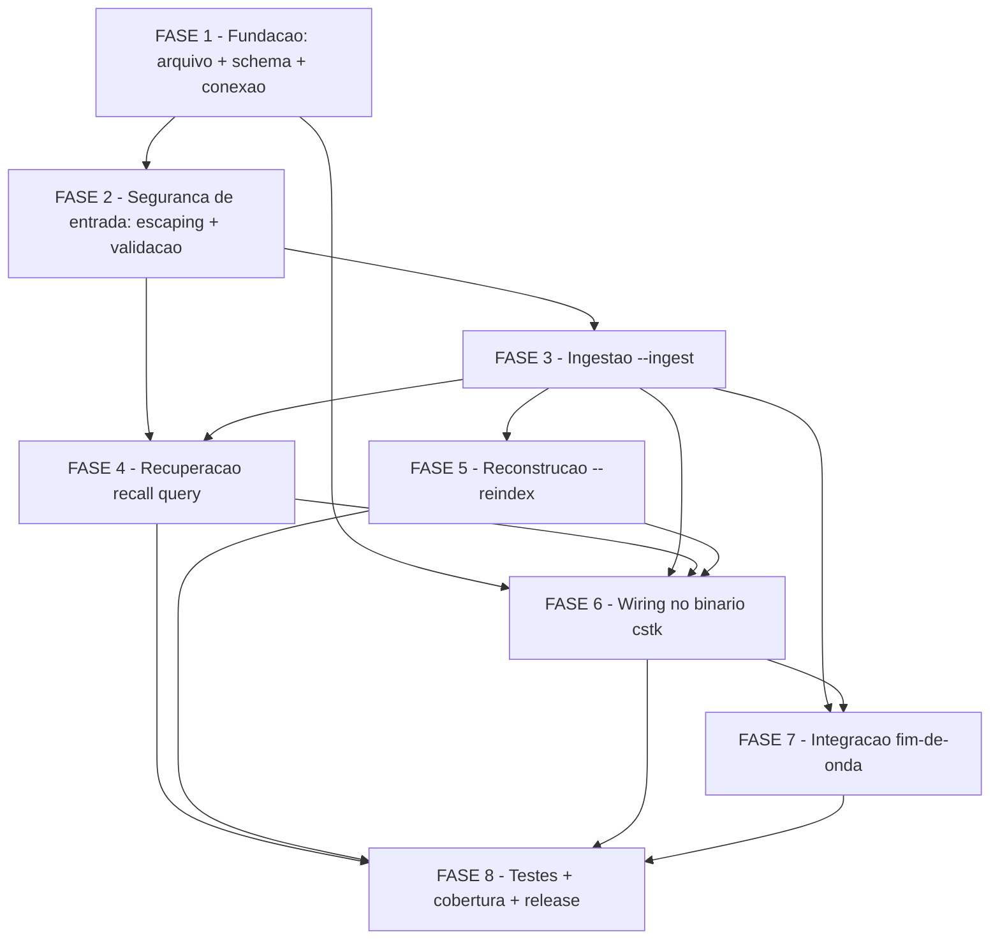

# Tarefas cstk-knowledge-db - Memoria cross-feature pesquisavel

Escopo: camada aditiva de memoria/aprendizado pesquisavel (SQLite + FTS5,
global ao usuario em `~/.claude/cstk/knowledge.db`). Ingere ao fim de cada
onda o conhecimento ja estruturado do `state.json` (decisoes, bloqueios,
retros, skills invocadas) com proveniencia completa e expoe busca full-text
cross-projeto/feature via `cstk recall`. Read-only sobre o state
transacional; best-effort (qualquer falha degrada gracioso, nunca aborta a
onda); indice derivado e reconstruivel via `--reindex`.

Toda a implementacao (ingestao + recall + reindex + schema + deps opcionais
`sqlite3`/`jq`/`secrets-filter.sh`) vive em UM arquivo:
[`cli/lib/recall.sh`](../../../cli/lib/recall.sh) (carve-out condicao (b) do
Principio II). Teste unico em
[`tests/cstk/test_recall.sh`](../../../tests/cstk/test_recall.sh).

Artefatos de origem: [spec.md](./spec.md) | [plan.md](./plan.md) |
[research.md](./research.md) | [data-model.md](./data-model.md) |
[contracts/ingest-helper.md](./contracts/ingest-helper.md) |
[contracts/cstk-recall.md](./contracts/cstk-recall.md) |
[quickstart.md](./quickstart.md)

**Legenda de status:**
- `[ ]` Pendente
- `[~]` Em andamento
- `[x]` Concluido
- `[!]` Bloqueado

**Legenda de criticidade:**
- `[C]` Critico - Impacto de seguranca/integridade da fonte de verdade ou bloqueante
- `[A]` Alto - Funcionalidade core sem a qual a feature nao entrega valor
- `[M]` Medio - Necessario mas sem urgencia imediata

---

## FASE 1 - Fundacao: arquivo, schema e conexao

Cria o esqueleto POSIX de `cli/lib/recall.sh`, o DDL do indice e a camada
de conexao com pragmas WAL. Base de tudo: todas as fases seguintes operam
sobre o schema definido aqui.

### 1.1 Scaffold POSIX de `cli/lib/recall.sh` `[A]`

Ref: plan.md §Project Structure; FR-021; contracts/cstk-recall.md §Sinopse

- [x] 1.1.1 Criar `cli/lib/recall.sh` com shebang `#!/bin/sh`, `set -eu`, header de proposito (pt-br) e codigo/identificadores em ingles
- [x] 1.1.2 Definir `recall_main()` (entrypoint despachado por `cli/cstk`) com parsing de argv que distingue 3 modos: busca (default), `--ingest`, `--reindex`
- [x] 1.1.3 Definir constantes/exit codes (`0` sucesso/degradacao; `2` uso incorreto) e helper de usage (`recall_usage`) coerente com a sinopse dos contratos
- [x] 1.1.4 Sourcing de `cli/lib/common.sh` para reusar `log_info`/`log_warn`/`log_error` (sem reimplementar logging)
- [x] 1.1.5 Resolver caminho do DB: flag `--db` > env `$CSTK_KNOWLEDGE_DB` > default `~/.claude/cstk/knowledge.db`
- [x] 1.1.6 Validar ausencia de bash-isms com `shellcheck -s sh` (meta zero warnings)

### 1.2 Schema SQLite + FTS5 (DDL idempotente) `[A]`

Ref: data-model.md (tabelas decisions/bloqueios/retros/skills + knowledge_fts + schema_meta); FR-001, FR-002, FR-003, FR-004

- [x] 1.2.1 Definir DDL das 4 tabelas-fonte (`decisions`, `bloqueios`, `retros`, `skills`) com colunas de proveniencia comuns e `UNIQUE(project, feature, wave, source_id)` por tabela (chave de upsert, FR-007)
- [x] 1.2.2 Definir tabela virtual FTS5 `knowledge_fts` standalone com `body` indexada + colunas de proveniencia `UNINDEXED` (`type`/`project`/`feature`/`wave`/`source_id`/`source_ts`)
- [x] 1.2.3 Definir tabela `schema_meta` (`key`/`value`) e gravar `schema_version=1`
- [x] 1.2.4 Tornar todo o DDL idempotente (`CREATE TABLE IF NOT EXISTS`, `CREATE VIRTUAL TABLE IF NOT EXISTS`) — aplicar schema em qualquer abertura do DB
- [x] 1.2.5 Documentar inline que o `body` por tipo concatena: decision=escolha+contexto+justificativa+evidencia; bloqueio=pergunta+contexto_para_resposta+resposta; retro=texto; skill=skill_name

### 1.3 Camada de conexao, pragmas e degradacao por dep ausente `[C]`

Ref: data-model.md §Pragmas de conexao; FR-016, FR-018, FR-020; quickstart cenarios 9 e 10

- [x] 1.3.1 Implementar deteccao de deps via `command -v sqlite3` e `command -v jq`; se qualquer ausente em qualquer modo, emitir aviso explicativo em stderr e retornar exit 0 SEM criar/alterar o indice
- [x] 1.3.2 Garantir diretorio do `--db` (criar quando possivel); se nao-gravavel, aviso + exit 0 (degradacao graciosa)
- [x] 1.3.3 Aplicar pragmas em toda conexao: `PRAGMA journal_mode=WAL; PRAGMA busy_timeout=5000; PRAGMA foreign_keys=OFF;`
- [x] 1.3.4 Confinar TODAS as referencias a `sqlite3`, `jq` e `secrets-filter.sh` exclusivamente a este arquivo (carve-out condicao (b)) — NUNCA reusar `state-lock.sh` (FR-016)
- [x] 1.3.5 Subtarefa de teste: cenarios 9 (sem sqlite3) e 10 (sem jq) — PATH manipulado, confirmar aviso em stderr + exit 0 + DB nao criado/alterado (FR-019)

---

## FASE 2 - Seguranca de entrada (escaping + validacao) — pre-requisito de ingestao/recall

Helpers de sanitizacao que TODA composicao de SQL/FTS deve atravessar. Vem
ANTES de ingestao e recall porque ambas dependem deles por construcao
(prevencao, nao runtime-degradado — data-model.md §Security Considerations).

### 2.1 Escaping de duas camadas (SQL + FTS5) `[C]`

Ref: dec-014; contracts/cstk-recall.md §4, contracts/ingest-helper.md §6; data-model.md §Security; A05/CWE-89

- [x] 2.1.1 Implementar `sql_escape()` — duplica aspa simples (`'` → `''`) em qualquer valor antes de compor string literal SQL (vale para texto livre E proveniencia; `sqlite3` CLI nao tem bind via argv)
- [x] 2.1.2 Implementar `fts_phrase_escape()` (primitiva: envolve UM token em aspas duplas FTS5, duplica `"` interno) + `fts_query_escape()` (fix pos-review: tokeniza a query em whitespace, escapa cada token via `fts_phrase_escape` e junta por AND implicito — `escaping FTS5` → `"escaping" "FTS5"`). Neutraliza `*`/`(`/`)`/`:`/`^`/`-`/booleanos como texto POR TOKEN; busca multi-palavra util (AND, nao frase contigua)
- [x] 2.1.3 Garantir que NENHUM valor (extraido do state.json OU input do usuario) seja concatenado cru no SQL — escaping e a defesa primaria, obrigatoria
- [x] 2.1.4 Subtarefa de teste: sonda adversarial cobrindo cenarios 13 (caracteres especiais → rc=0, sem erro de sintaxe FTS5), 13b (busca `'; DROP TABLE decisions; --` → rc=0, tabela intacta) e 13c (ingestao com `O'Brien'); DROP ...` em texto E proveniencia → rc=0, texto literal preservado)

### 2.2 Validacao de `--limit` e rejeicao/strip de NUL bytes `[C]`

Ref: dec-015, dec-016; contracts/cstk-recall.md §4a/§5, contracts/ingest-helper.md §6; block-001

- [x] 2.2.1 Implementar `validate_limit()` — `--limit` DEVE casar `^[1-9][0-9]*$` (inteiro positivo); valor nao-inteiro (`abc`, `-1`, `0`, `1.5`, `5; DROP`, vazio) rejeita com exit 2 ANTES de compor o SQL (integer-validacao, nao escaping)
- [x] 2.2.2 Implementar deteccao de NUL byte (`\000`) em input do usuario; politica recall = **rejeitar com exit 2**; aplicar a `<query>`, `--project`, `--type`, `--db` ANTES de qualquer escaping/validacao/interpolacao
- [x] 2.2.3 Implementar strip de NUL byte na ingestao; politica ingest = **strip silencioso** em todo valor extraido do state.json (texto livre E proveniencia), best-effort exit 0 — NUL nunca chega intacto a camada SQL/FTS5
- [x] 2.2.4 Validar `--type` contra o enum `decision|bloqueio|retro|skill`; valor fora do enum rejeita com exit 2
- [x] 2.2.5 Subtarefa de teste: `--limit` nao-inteiro → exit 2 sem interpolacao; fixture de byte cru NUL (escape OCTAL `\000`, NUNCA hex) em busca (rejeitado exit 2) e em ingestao (stripado, segue exit 0)

---

## FASE 3 - Ingestao pos-onda (`--ingest`)

Extrai conhecimento estruturado de um `state.json` e grava no indice com
upsert idempotente. Efeito colateral aditivo, best-effort; NUNCA escreve no
state transacional.

### 3.1 Extracao read-only do `state.json` via jq `[A]`

Ref: contracts/ingest-helper.md §4; FR-005, FR-009; data-model.md (mapeamento de campos)

- [x] 3.1.1 Resolver `--state-dir`/state.json; ausente ou ilegivel → aviso em stderr + exit 0 (nao-fatal)
- [x] 3.1.2 Extrair via `jq` (so leitura): `decisoes[]`, `bloqueios_humanos[]`, `retro` (ou array equivalente), `ondas[].skills_invoked[]`
- [x] 3.1.3 Extrair proveniencia comum: `execucao.id`, `short_name`, `project`=**basename** de `execucao.projeto_alvo_path` (S2/A02 mitigacao), id da onda, timestamp do registro
- [x] 3.1.4 Sintetizar `source_id` estavel para registros sem id proprio: retro=`retro-<wave>-<idx>`, skill=`skill-<wave>-<idx>` (estabilidade garante idempotencia)
- [x] 3.1.5 Tratar state.json parcial/nao-terminal: processar apenas registros presentes, sem assumir completude (Edge Case)
- [x] 3.1.6 Subtarefa de teste: cenario 8 — `sha256` do state.json e do state.json.sha256 byte-a-byte identicos antes/depois da ingestao (FR-009, SC-006)

### 3.2 Filtro de segredos confinado a texto livre `[C]`

Ref: contracts/ingest-helper.md §5; FR-017; dec (basename); INV-DM-3

- [x] 3.2.1 Aplicar `secrets-filter.sh scrub` (stdin→stdout) SOMENTE aos campos de texto livre: decisoes (contexto/justificativa/evidencia), bloqueios (pergunta/contexto_para_resposta/resposta), retros (texto)
- [x] 3.2.2 NUNCA passar pelo filtro: ids, scores, timestamps, proveniencia (project/feature/wave/execucao_id), nomes de skill — preserva chave de upsert (FR-007) e evita mangling de identificadores
- [x] 3.2.3 Se `secrets-filter.sh` ausente: aviso + pular a ingestao da onda (melhor pular do que vazar — decisao do plan.md §Optional-dep registry)
- [x] 3.2.4 Subtarefa de teste: confirmar texto livre scrubbed enquanto chave/proveniencia/skill_name permanecem intactos (Edge "dado sensivel")

### 3.3 Upsert idempotente nas tabelas + FTS5 `[A]`

Ref: contracts/ingest-helper.md §6; FR-007, FR-008; data-model.md §State transitions; INV-DM-2

- [x] 3.3.1 Para cada tabela-fonte: `INSERT ... ON CONFLICT(project, feature, wave, source_id) DO UPDATE` (upsert, nao insert-only), todos os valores passando por `sql_escape()`
- [x] 3.3.2 Para `knowledge_fts`: `DELETE` por proveniencia+source_id (colunas UNINDEXED) seguido de `INSERT` no mesmo upsert (FTS5 nao suporta UNIQUE)
- [x] 3.3.3 Envolver cada upsert de registro em transacao `BEGIN; ... COMMIT;`
- [x] 3.3.4 Emitir resumo opcional em stdout (`ingested: N decisions, M bloqueios, K retros, S skills`); parseavel; vazio aceitavel
- [x] 3.3.5 Subtarefa de teste: cenario 1 (ingest basico + proveniencia), cenario 6 (reingest mesma onda → contagem estavel, SC-002), cenario 7 (upsert reflete versao mais recente: bloqueio pendente→respondido = linha unica atualizada)

### 3.4 Concorrencia WAL + retry/backoff `[A]`

Ref: contracts/ingest-helper.md §7; FR-016; quickstart cenario 14

- [x] 3.4.1 Implementar retry/backoff limitado (ate 3 tentativas, sleep crescente) em "database is locked" alem do `busy_timeout=5000`
- [x] 3.4.2 Esgotado o retry → aviso + skip da ingestao desta onda + exit 0 (degradacao graciosa); NUNCA usar `state-lock.sh` (evita acoplar ao lock transacional)
- [x] 3.4.3 Subtarefa de teste: cenario 14 (best-effort) — duas ingestoes quase-simultaneas no mesmo `--db`, confirmar DB nao corrompido e ambos os conjuntos presentes (ou degradacao graciosa sob contencao extrema)

---

## FASE 4 - Recuperacao (`cstk recall <query>`)

Comando de busca full-text cross-projeto/feature com filtros e proveniencia.
Entrega o valor central (US1, P1).

### 4.1 Query FTS5 com filtros e ordenacao por relevancia `[A]`

Ref: contracts/cstk-recall.md §Modo busca §5; FR-010, FR-012; data-model.md §knowledge_fts

- [x] 4.1.1 Compor `SELECT type, project, feature, wave, source_ts, source_id, body FROM knowledge_fts WHERE knowledge_fts MATCH <query-escapada>` com a query passando por `fts_query_escape()` (token-AND; ver 2.1.2)
- [x] 4.1.2 Aplicar filtro opcional `--project` (escapado via `sql_escape()`) → `AND project = ?`
- [x] 4.1.3 Aplicar filtro opcional `--type` (validado contra enum) → `AND type = ?`
- [x] 4.1.4 Aplicar `--limit` (integer-validado, default 20) → `LIMIT N` (inteiro sintatico direto, nao literal de string)
- [x] 4.1.5 Ordenar por relevancia: `ORDER BY bm25(knowledge_fts)`
- [x] 4.1.6 Subtarefa de teste: cenario 2 (filtro `--project` exclui ruido cross-feature, SC-004), cenario 3 (filtro `--type`), cenario 4 (`--limit 2` + ordenacao bm25)

### 4.2 Renderizacao de resultados com proveniencia `[A]`

Ref: contracts/cstk-recall.md §6/§7; FR-011, FR-013

- [x] 4.2.1 Renderizar cada resultado COM proveniencia (projeto, feature, onda, data) + trecho do conteudo; formato legivel (um bloco por entrada), parseavel para inspecao
- [x] 4.2.2 Sem resultados (FR-013): imprimir `nenhum resultado para '<query>'` e exit 0 (sucesso, nao erro)
- [x] 4.2.3 Subtarefa de teste: cenario 1 (resultado com proveniencia completa), cenario 5 (`termo-inexistente-xyz` → mensagem "nenhum resultado" + rc=0)

### 4.3 Degradacao graciosa na busca `[A]`

Ref: contracts/cstk-recall.md §Comportamento 1-3; FR-018; quickstart cenario 11; US3 AS2

- [x] 4.3.1 `sqlite3` ausente → aviso "memoria de conhecimento indisponivel (sqlite3 nao instalado)" + exit 0
- [x] 4.3.2 DB ausente → mensagem "indice vazio/ausente; rode `cstk recall --reindex` para popular" + exit 0
- [x] 4.3.3 DB ilegivel/corrompido → mensagem do problema + sugestao de `--reindex` + exit 0 (nao trava)
- [x] 4.3.4 Subtarefa de teste: cenario 11 (lixo em `$TMP/bad.db` → mensagem + sugestao reindex + rc=0)

---

## FASE 5 - Reconstrucao (`--reindex`) e resiliencia

Recria o indice do zero a partir dos `state.json`/state-history existentes.
Rede de seguranca que torna o indice descartavel (US4, P2).

### 5.1 Reindex a partir da fonte de verdade `[M]`

Ref: contracts/cstk-recall.md §Modo reconstrucao; FR-014, FR-015; data-model.md §State transitions; INV-DM-4

- [x] 5.1.1 `sqlite3`/`jq` ausente → aviso + exit 0 (degradacao graciosa)
- [x] 5.1.2 Recriar o DB do zero (dropar/recriar tabelas + FTS ou apagar o arquivo e recriar — indice descartavel)
- [x] 5.1.3 Varrer sob `--states-root` (default = descoberta padrao) por `**/.claude/feature-00c-state/*/state.json` e `**/.claude/agente-00c-state/state.json`
- [x] 5.1.4 Ingerir cada state.json descoberto via o MESMO caminho de ingestao da FASE 3 (upsert idempotente — reuso, nao duplicacao de logica)
- [x] 5.1.5 Subtarefa de teste: cenario 12 — busca B0 antes, apagar DB, `--reindex`, busca B1 == B0 (conteudo equivalente sem duplicatas, SC-005); rodar `--reindex` de novo nao muda contagem (FR-015 idempotente)

---

## FASE 6 - Wiring no binario `cstk` (dispatch + help)

Registra `recall` no dispatcher e atualiza o help inline. Sem isso o comando
nao e invocavel pelo usuario.

### 6.1 Dispatch de `cstk recall` `[A]`

Ref: cli/cstk §_dispatch (linha 197 allowlist + linha 213 convencao `<cmd>_main`); plan.md §Structure Decision

- [x] 6.1.1 Adicionar `recall` a allowlist de dispatch em `cli/cstk` (`install|update|...|session|recall`) para que `cstk recall` source `cli/lib/recall.sh` e chame `recall_main`
- [x] 6.1.2 Confirmar que o boot-check (`_check_bin_lib_match`) aplica-se a `recall` como aos demais comandos de lib
- [x] 6.1.3 Subtarefa de teste: ampliar `tests/cstk/test_cstk-main.sh` (ou cobrir em `test_recall.sh`) confirmando que `cstk recall --help`/dispatch resolve `recall_main` sem "nao implementado ainda"

### 6.2 Atualizacao do help inline `[M]`

Ref: cli/cstk §_cmd_help (bloco COMANDOS + case de help por subcomando)

- [x] 6.2.1 Adicionar linha `recall` ao bloco COMANDOS do help geral (`_cmd_help ""`) descrevendo busca cross-feature na memoria de conhecimento
- [x] 6.2.2 Adicionar `recall` ao case de `cstk help <cmd>` apontando para os contratos (`docs/specs/cstk-knowledge-db/contracts/cstk-recall.md`)
- [x] 6.2.3 Atualizar a lista "Comandos validos" da mensagem de erro de help desconhecido para incluir `recall`

---

## FASE 7 - Integracao da ingestao no fim de onda do orquestrador `[M]`

Dispara a ingestao best-effort ao fim de cada onda, mantendo o runtime
desacoplado do schema do indice.

### 7.1 Hook pos-onda chamando `cstk recall --ingest` `[M]`

Ref: contracts/ingest-helper.md §Invocacao; FR-006, FR-018; SC-003

- [x] 7.1.1 Identificar o ponto de fim-de-onda no runtime (`state-ondas.sh end` / Loop principal dos orquestradores) onde disparar a ingestao
- [x] 7.1.2 Invocar `cstk recall --ingest --state-dir <DIR>` como efeito colateral aditivo; se `cstk` ausente no PATH ou exit != 0, degradar gracioso (aviso, seguir a onda) — NUNCA abortar/bloquear a onda
- [x] 7.1.3 Garantir que a ingestao NAO seja um gate: falha/ausencia da camada de conhecimento jamais altera o fluxo de fechamento de onda (SC-003)
- [x] 7.1.4 Subtarefa de teste: simular `cstk` ausente no fim de onda e confirmar que a onda conclui sem aborto causado pela camada (degradacao graciosa)

---

## FASE 8 - Testes, cobertura e release

Consolida a cobertura do teste unico, garante o orphan-check e prepara o
release MINOR.

### 8.1 Teste `tests/cstk/test_recall.sh` (cenarios 1-14) `[C]`

Ref: quickstart.md (cenarios 1-14); FR-019, FR-022, SC-007; convencao tests/README.md

- [x] 8.1.1 Criar `tests/cstk/test_recall.sh` seguindo o harness POSIX do repo (`tests/run.sh`), com `--db` apontando para tmp (nunca o indice global)
- [x] 8.1.2 Cobrir os cenarios 1-14 do quickstart (ingest+recall, filtros, limite, sem-resultado, idempotencia, upsert, fonte intacta, sem sqlite3, sem jq, indice corrompido, reindex, caracteres especiais, adversariais 13b/13c, concorrencia 14)
- [x] 8.1.3 Fixtures de bytes crus (cenario 11 corrupcao, NUL bytes 2.2.5) usando escape OCTAL `\NNN`/`\000` — NUNCA hex `\xHH` (dash/CI nao interpreta hex)
- [x] 8.1.4 Fixtures de state.json sinteticos sob `tests/cstk/fixtures/knowledge/` (multi-projeto/feature para SC-004/SC-005)
- [x] 8.1.5 Rodar `./tests/run.sh test_recall` e confirmar todos os cenarios verdes

### 8.2 Cobertura e lint `[C]`

Ref: FR-021, FR-022, SC-007; CLAUDE.md §Como testar scripts shell; regra --check-coverage

- [x] 8.2.1 Rodar `./tests/run.sh --check-coverage` e confirmar ZERO orfaos (recall.sh ↔ test_recall.sh mapeado pela convencao `cli/lib/<n>.sh` → `tests/cstk/test_<n>.sh`)
- [x] 8.2.2 Rodar `shellcheck -s sh cli/lib/recall.sh` (e binario `cli/cstk` se alterado) com meta zero warnings
- [x] 8.2.3 Confirmar confinamento das deps: `grep -rn 'sqlite3' cli/lib/` e `grep -rn 'secrets-filter' cli/lib/` casam SOMENTE `cli/lib/recall.sh` (carve-out condicao (b))
- [x] 8.2.4 Rodar a suite completa `./tests/run.sh` e confirmar nenhuma regressao

### 8.3 Release MINOR + CHANGELOG `[M]`

Ref: plan.md §Quality Standards (SemVer + CHANGELOG, comando novo = MINOR bump)

- [x] 8.3.1 Adicionar entrada no `CHANGELOG.md` descrevendo `cstk recall` (busca + `--ingest` + `--reindex`) e a camada de conhecimento aditiva — secao `[3.17.0] - 2026-05-23`
- [x] 8.3.2 Bump MINOR do `cli/VERSION` (comando novo, retrocompativel) — `cli/VERSION` e placeholder dev fixo `0.0.0-dev`; o bump MINOR (3.16.0->3.17.0) e materializado pela git tag `v3.17.0` que o build-release injeta no release (commits/tags diferidos para revisao humana — dec-025)
- [x] 8.3.3 Atualizar `README.md`/`CLAUDE.md` com a secao do `cstk recall` e a localizacao do indice (`~/.claude/cstk/knowledge.db`)
- [x] 8.3.4 Subtarefa de teste: confirmar que `test_build-release.sh` continua verde apos o bump — 10 PASS / 0 FAIL

---

## Matriz de Dependencias

## Resumo Quantitativo

| Fase | Tarefas | Subtarefas | Criticidade |
|------|---------|------------|-------------|
| 1 - Fundacao | 3 | 16 | A/A/C |
| 2 - Seguranca de entrada | 2 | 9 | C |
| 3 - Ingestao | 4 | 18 | A/C/A/A |
| 4 - Recuperacao | 3 | 11 | A |
| 5 - Reconstrucao | 1 | 5 | M |
| 6 - Wiring cstk | 2 | 6 | A/M |
| 7 - Integracao fim-de-onda | 1 | 4 | M |
| 8 - Testes + release | 3 | 15 | C/C/M |
| **Total** | **19** | **84** | - |

## Escopo Coberto

| Item | Descricao | Fase |
|------|-----------|------|
| recall.sh | Arquivo unico com schema + ingestao + recall + reindex + deps opcionais | 1-5 |
| Schema SQLite+FTS5 | 4 tabelas-fonte + knowledge_fts + schema_meta; upsert por proveniencia | 1 |
| Seguranca de entrada | Escaping 2-camadas (SQL `'`→`''`, FTS5 frase `"`→`""`), `--limit` integer-validate, NUL reject/strip | 2 |
| Ingestao | Extracao read-only via jq, secrets-filter so em texto livre, upsert idempotente, WAL+retry/backoff | 3 |
| Recuperacao | Busca FTS5 com filtros project/type/limit, bm25, proveniencia, sem-resultado=exit 0 | 4 |
| Reconstrucao | `--reindex` a partir de state.json/history, idempotente, equivalente a ingestao incremental | 5 |
| Wiring cstk | Dispatch `cstk recall` + help inline | 6 |
| Integracao fim-de-onda | Hook best-effort `cstk recall --ingest`, nunca aborta a onda | 7 |
| Teste + cobertura | test_recall.sh cobrindo cenarios 1-14, orphan-check ZERO, shellcheck, release MINOR | 8 |

## Escopo Excluido

| Item | Descricao | Motivo |
|------|-----------|--------|
| Backup proprio do indice | Indice nao tem backup dedicado | Derivado e reconstruivel via `--reindex` da fonte de verdade (FR-014/015) |
| Interop com memoria externa ao toolkit | Sem importar/substituir/interoperar | Escopo auto-contido; indice derivado so do state.json (FR-023) |
| Lock transacional para concorrencia | Nao reusar `state-lock.sh` | WAL + busy_timeout + retry/backoff e o modelo escolhido (FR-016) — evita acoplamento e estagnacao |
| Bind nativo de parametros SQL | Nao usado | `sqlite3` CLI nao oferece bind via argv; escaping 2-camadas e a defesa primaria (dec-014) |
| Coleta/transmissao remota | Indice 100% local | Principio IV — zero rede, zero upload (FR-017) |
| Filtro de segredos em campos estruturados | Proveniencia/ids/scores/skill_name nao filtrados | Preserva chave de upsert e evita mangling de identificadores (FR-017, INV-DM-3) |
