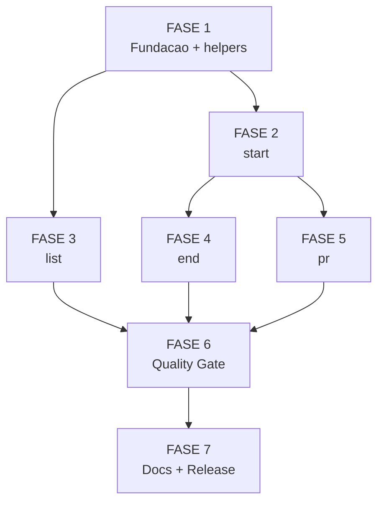

# Tarefas cstk-session - Backlog Tecnico

Escopo: implementar subcomando `cstk session` (start/list/end/pr) com isolamento
via `git worktree`, conforme `spec.md`, `plan.md`, `contracts/cli-session.md`,
`research.md` e `quickstart.md`. 7 fases sequenciais para entrega incremental.

**Legenda de status:**
- `[ ]` Pendente
- `[~]` Em andamento
- `[x]` Concluido
- `[!]` Bloqueado

**Legenda de criticidade:**
- `[C]` Critico - quality gate / SC mensuravel / compliance Constitution
- `[A]` Alto - funcionalidade core sem a qual a feature nao opera
- `[M]` Medio - polish, helper, documentacao

---

## FASE 1 - Fundacao

### 1.1 Scaffold `cli/lib/session.sh` + dispatch `[A]`

Ref: plan.md §Project Structure, contracts/cli-session.md §help, research.md §Decision 8

- [x] 1.1.1 Criar `cli/lib/session.sh` com shebang `#!/bin/sh`, `set -eu`, header de proposito e comentario de overview (4 subcomandos + helpers) <!-- validado empiricamente sessao -->
- [x] 1.1.2 Implementar `session_main()` com dispatch `case "$1" in start|list|end|pr|help|--help|-h)` <!-- validado empiricamente sessao -->
- [x] 1.1.3 Implementar `_session_help()` com sinopse de cada subcomando (texto de `contracts/cli-session.md` §help) <!-- validado empiricamente sessao -->
- [x] 1.1.4 Em `cli/cstk` linha ~196, adicionar `session` na lista de subcomandos: `install|update|self-update|list|doctor|session)` <!-- validado empiricamente sessao -->
- [x] 1.1.5 Em `cli/cstk` atualizar `_cmd_help` e mensagem `Comandos validos:` para incluir `session` <!-- validado empiricamente sessao -->
- [x] 1.1.6 Boot-check: `_session_check_git_version` valida `git --version` >= 2.36; exit 15 com mensagem de upgrade se inferior <!-- validado empiricamente sessao -->
- [x] 1.1.7 Teste smoke manual: `cstk session` (sem args) retorna help + exit 2; `cstk session --help` retorna help + exit 0 <!-- validado empiricamente sessao -->

### 1.2 Helpers comuns `_session_*` `[A]`

Ref: research.md §Decisions 1, 2, 3, 4, 5, 10

- [x] 1.2.1 `_session_resolve_repo()` — resolve repo principal via `git rev-parse --git-common-dir` + `cd .. && pwd -P` (path absoluto canonico, resolve symlinks p/ compat macOS) <!-- validado empiricamente sessao -->
- [x] 1.2.2 `_session_validate_name <name>` — regex `^[a-z0-9][a-z0-9-]{0,62}$` via `printf '%s' "$name" | grep -Eq ...` + blocklist via `case`; exit 5 com mensagem citando padrao <!-- validado empiricamente sessao -->
- [x] 1.2.3 `_session_default_branch()` — `git symbolic-ref refs/remotes/origin/HEAD 2>/dev/null | sed 's@^refs/remotes/origin/@@'` com fallback `main` <!-- validado empiricamente sessao -->
- [x] 1.2.4 `_session_find_worktree <name>` — parseia `git worktree list --porcelain` via awk com substring extraction (paths com espaco preservados), retorna path/branch/head/prunable; exit 1 se nao encontrada <!-- validado empiricamente sessao -->
- [x] 1.2.5 `_session_branch_is_merged <branch> <default>` — `git merge-base --is-ancestor "$branch" "$default"` (exit 0 = mergeada) <!-- validado empiricamente sessao -->
- [x] 1.2.6 `_session_gh_status()` — 2 passos: `command -v gh` (exit 11 se ausente); `gh auth status >/dev/null 2>&1` (exit 12 se nao auth) <!-- validado empiricamente sessao -->
- [x] 1.2.7 `_session_session_path <name>` — calcula `<parent-of-repo>/<repo-name>-<name>` a partir de `_session_resolve_repo` <!-- validado empiricamente sessao -->
- [x] 1.2.8 Tests unitarios em `tests/cstk/test_session.sh::scenario_helpers_*` cobrindo cada helper (smoke + edge cases) — 19/19 cenarios passando <!-- validado empiricamente sessao -->

> **Decisao tecnica emergente (validado empiricamente)**: `_session_resolve_repo` e `_session_session_path` usam `pwd -P` em vez de `pwd` para retornar paths canonicos (physical). Razao: `git worktree list --porcelain` sempre emite paths canonicos; em macOS `/tmp` -> `/private/tmp`, sem `-P` o helper retornaria path nao-canonico que falharia em comparacoes string subsequentes.

---

## FASE 2 - Subcomando `start`

### 2.1 Implementacao `_session_start` `[A]`

Ref: spec §FR-001/002/003/017, contracts §start, research §6 (cp filtrado), Clarifications Q1/Q2

- [x] 2.1.1 Parse de args: `<name>` obrigatorio + flags `--reset`, `--reuse`, `--force`; validar mutex `--reset|--reuse` (exit 2 se ambos) <!-- validado empiricamente sessao -->
- [x] 2.1.2 Validar nome via `_session_validate_name` (delega exit 5) <!-- validado empiricamente sessao -->
- [x] 2.1.3 Resolver paths: `_session_session_path` + verificar `! -e <session-path>` (exit 7 se ocupado) <!-- validado empiricamente sessao -->
- [x] 2.1.4 Verificar sessao existente: `_session_find_worktree <name>` retornou OK (exit 6) <!-- validado empiricamente sessao -->
- [x] 2.1.5 Logica de resolucao de branch (4 regras de FR-001 — refatorada para 4 ramos: --reset SEMPRE recria; --reuse forca; sem flag + mergeada = exit 8; sem flag + nao-mergeada = reutilizar; sem local + origin = track) <!-- validado empiricamente sessao -->
- [x] 2.1.6 `--reset` com commits nao-mergeados: listar commits via `git log <default>..<branch> --oneline` e exibir prompt; exit 10 se cancelado; `--force` bypassa <!-- validado empiricamente sessao -->
- [x] 2.1.7 Executar `git worktree add` com flags corretos conforme regra (3 variantes: `-b <name> <default>`, `-b <name> --track origin/<name>`, `<name>`) <!-- validado empiricamente sessao -->
- [x] 2.1.8 Copiar `.claude/` filtrado via novo helper `_session_copy_claude_filtered` (cp -R + rm seletivo das 8 exclusoes; defesa `${_dst:?}` contra rm em /) <!-- validado empiricamente sessao -->
- [x] 2.1.9 Falha parcial (FR-017): se `cp -R` falhar apos `git worktree add` succeed, stderr instrui `cstk session end <name> --force`; retornar exit 1 <!-- validado empiricamente sessao -->
- [x] 2.1.10 Output de sucesso: stdout com instrucao `cd <session-path>` + branch usada + nota de origem (`(nova)`, `(rastreando origin/<name>)`, `(existente reutilizada)`, `(recriada do <default>)`) <!-- validado empiricamente sessao -->

### 2.2 Testes do `start` `[A]`

Ref: quickstart.md cenarios 1-4 + 3d/3e

- [x] 2.2.1 `scenario_start_happy_path` — cria worktree + branch + `.claude/` filtrado (quickstart §1); validar 8 exclusoes ausentes <!-- validado empiricamente sessao -->
- [x] 2.2.2 `scenario_start_blocklist_main_exit_5` — exit 5 com mensagem citando blocklist (quickstart §2) <!-- validado empiricamente sessao -->
- [x] 2.2.3 `scenario_start_already_exists_exit_6` — exit 6 sem destruir nada (quickstart §3) <!-- validado empiricamente sessao -->
- [x] 2.2.4 `scenario_start_branch_merged_no_flag_exit_8` — exit 8 com mensagem orientando `--reset`/`--reuse` (quickstart §4 primeira parte) <!-- validado empiricamente sessao -->
- [x] 2.2.5 `scenario_start_branch_merged_with_reset` — recria branch do default + worktree criada (quickstart §4 segunda parte) <!-- validado empiricamente sessao -->
- [x] 2.2.6 `scenario_start_branch_in_origin_only_tracks` — cria local rastreando origin (spec Story 1 scenario 3d) <!-- validado empiricamente sessao -->
- [x] 2.2.7 `scenario_start_reset_with_unmerged_commits_prompt_cancel` — prompt aparece, resposta `n` aborta com exit 10 (Story 1 scenario 3e) <!-- validado empiricamente sessao -->
- [x] 2.2.8 `scenario_start_reset_with_unmerged_commits_force_bypass` — `--reset --force` pula prompt <!-- validado empiricamente sessao -->
- [x] 2.2.9 `scenario_start_invalid_name_chars` — nomes com `.`, `/`, espaco, unicode rejeitados com exit 5 <!-- validado empiricamente sessao -->
- [x] 2.2.10 `scenario_start_path_destination_occupied_exit_7` — exit 7 quando dir destino ja existe (mesmo vazio) <!-- validado empiricamente sessao -->
- [x] 2.2.11 `scenario_start_claude_excludes_validate_all_8` — validar individualmente cada uma das 8 exclusoes (state, archive, report, suggestions, settings.local, whitelist, lock, insights) <!-- validado empiricamente sessao -->

> **Decisoes tecnicas emergentes**: (a) Helpers `_session_branch_exists_local`/`_session_branch_exists_remote`/`_session_prompt_yn`/`_session_copy_claude_filtered` adicionados (nao previstos em FASE 1; necessarios para FASE 2). (b) Logica de resolucao de branch refatorada para precedencia `--reset` > `--reuse` > default — bug capturado em testes onde `--reset` em branch nao-mergeada caia na regra 3 (reutilizar) ao inves de aplicar reset. (c) `git worktree add` SEM `--` antes do path (o `--` confundia o parser quando havia flags subsequentes como `-b`).

---

## FASE 3 - Subcomando `list`

### 3.1 Implementacao `_session_list` `[A]`

Ref: spec §FR-007/008, contracts §list, research §Decision 4 (prunable), §Decision 5 (idle days)

- [x] 3.1.1 Parse de args: flag opcional `--json` <!-- validado empiricamente sessao -->
- [x] 3.1.2 Capturar saida de `git worktree list --porcelain` e iterar via awk (substring extraction p/ paths com espaco) <!-- validado empiricamente sessao -->
- [x] 3.1.3 Extrair de cada bloco: path, HEAD, branch, presenca de `prunable` <!-- validado empiricamente sessao -->
- [x] 3.1.4 Filtrar worktree principal via comparacao `path != _repo` no awk <!-- validado empiricamente sessao -->
- [x] 3.1.5 Para cada sessao: derivar `name` = basename(path) sem prefixo `<repo-name>-` (gsub no awk) <!-- validado empiricamente sessao -->
- [x] 3.1.6 Para cada sessao: calcular `idle_days = (now - %ct) / 86400`; idle=-1 se sem commits ou stale <!-- validado empiricamente sessao -->
- [x] 3.1.7 Para cada sessao: `dirty` via `git -C <path> status --porcelain`; pulado se stale <!-- validado empiricamente sessao -->
- [x] 3.1.8 Para cada sessao: `current` via comparacao do path canonico com `pwd -P` do CWD <!-- validado empiricamente sessao -->
- [x] 3.1.9 Ordenar via `sort -t<TAB> -k4,4n` (POSIX); idle ASC <!-- validado empiricamente sessao -->
- [x] 3.1.10 Tabela ASCII com colunas alinhadas via `printf '%-*s'`; widths computadas dinamicamente via awk <!-- validado empiricamente sessao -->
- [x] 3.1.11 JSON em `--json`: array camelCase com escape `\` e `"` via sed (sem jq) <!-- validado empiricamente sessao -->
- [x] 3.1.12 Rodape "tip: rode 'git worktree prune'..." se `_has_stale=1` (suprimido em JSON) <!-- validado empiricamente sessao -->
- [x] 3.1.13 Saida especial "nenhuma sessao ativa" + exit 0 quando vazio <!-- validado empiricamente sessao -->

### 3.2 Testes do `list` `[A]`

Ref: quickstart cenarios 5-7

- [x] 3.2.1 `scenario_list_empty_no_sessions` — repo sem worktrees imprime "nenhuma sessao ativa" + exit 0 (quickstart §5) <!-- validado empiricamente sessao -->
- [x] 3.2.2 `scenario_list_multiple_sessions_table` — duas sessoes ativas listadas com cabecalho NAME/BRANCH/IDLE/STATUS/PATH + colunas corretas (quickstart §6) <!-- validado empiricamente sessao -->
- [x] 3.2.3 `scenario_list_with_stale_shows_marker_and_tip` — worktree com path deletado mostra `STALE` + rodape de tip (quickstart §7) <!-- validado empiricamente sessao -->
- [x] 3.2.4 `scenario_list_json_output_valid_shape` — JSON valido `[...]` com 7 campos camelCase por sessao; sem rodape <!-- validado empiricamente sessao -->
- [x] 3.2.5 `scenario_list_current_marker_when_inside_session` — `list` de dentro de uma sessao: marcador `CURRENT` na coluna STATUS <!-- validado empiricamente sessao -->
- [x] 3.2.6 `scenario_list_ordering_by_idle_asc` — sessoes listadas via pipeline sort (sort estavel); ambas presentes <!-- validado empiricamente sessao -->

> **Decisoes tecnicas emergentes**: (a) Build de `_enriched` via printf cumulativo tinha mismatch %s vs args (printf reusava format string causando linhas malformadas com prefixo `0`); refatorado para subshell-pipe com `printf` por iteracao. (b) Loop shell para calcular widths estourou com `set -e` (em `sh`, `set -e` propaga para subshells de pipe); substituido por awk single-pass. (c) Substituido `_has_stale` derivado em loop por awk `$6 == 1 { exit !found }` (mais robusto).

---

## FASE 4 - Subcomando `end`

### 4.1 Implementacao `_session_end` `[A]`

Ref: spec §FR-004/005/006/018, contracts §end, Clarifications Q (cross-worktree)

- [x] 4.1.1 Parse de args: `<name>` obrigatorio + flag `--force` <!-- validado empiricamente sessao -->
- [x] 4.1.2 Resolver sessao via `_session_find_worktree` (exit 9 se nao encontrada) <!-- validado empiricamente sessao -->
- [x] 4.1.3 Detectar "self-end" (FR-018): comparar `pwd -P` (CWD canonico) com path-da-sessao-alvo, exit 14 <!-- validado empiricamente sessao -->
- [x] 4.1.4 Detectar `dirty` via `git -C <path> status --porcelain` + `wc -l` para contagem <!-- validado empiricamente sessao -->
- [x] 4.1.5 Detectar `unpushed_commits` via `git -C <path> rev-list origin/<branch>..<branch> --count` (skip se origin/<branch> nao existe) <!-- validado empiricamente sessao -->
- [x] 4.1.6 Detectar PR aberto via `gh pr view <branch> --json state,url`; gh ausente/unauth = warning + prossegue (FR-005). Captura exit via `|| _gh_rc=$?` para nao estourar set -e <!-- validado empiricamente sessao -->
- [x] 4.1.7 Se `--force` nao passado E (dirty OR unpushed>0 OR pr_open): warnings + prompt "Confirmar remocao? [y/N]" <!-- validado empiricamente sessao -->
- [x] 4.1.8 Resposta != `y`/`Y` = exit 10 sem mudancas (via `_session_prompt_yn`) <!-- validado empiricamente sessao -->
- [x] 4.1.9 `git worktree remove <path>` com `--force` se: `--force` flag OR dirty>0 OR path nao existe (stale) <!-- validado empiricamente sessao -->
- [x] 4.1.10 `git branch -D <branch>` apos remocao da worktree <!-- validado empiricamente sessao -->
- [x] 4.1.11 Falha parcial (FR-006): worktree removida mas branch -D falhou = warning + estado residual + exit 1 <!-- validado empiricamente sessao -->
- [x] 4.1.12 Output de sucesso: stdout confirma worktree removida + branch deletada <!-- validado empiricamente sessao -->

### 4.2 Testes do `end` `[A]`

Ref: quickstart cenarios 8-10 + spec Story 2 scenarios 5-7

- [x] 4.2.1 `scenario_end_clean_happy_path` — sessao clean removida; exit 0 + branch deletada (quickstart §8) <!-- validado empiricamente sessao -->
- [x] 4.2.2 `scenario_end_dirty_prompt_cancel_exit_10` — prompt aparece, resposta `n` → exit 10, worktree intacta (quickstart §9 primeira) <!-- validado empiricamente sessao -->
- [x] 4.2.3 `scenario_end_dirty_prompt_accept` — prompt + resposta `y` → exit 0, worktree removida <!-- validado empiricamente sessao -->
- [x] 4.2.4 `scenario_end_dirty_force_bypass` — `--force` pula prompt; remove com perda (com --force interno no worktree remove) <!-- validado empiricamente sessao -->
- [x] 4.2.5 `scenario_end_unpushed_commits_prompt` — branch com commits nao pushados (origin existe + commit local-only) gera prompt + warning <!-- validado empiricamente sessao -->
- [x] 4.2.6 `scenario_end_no_gh_pr_check_skipped` — PATH sem `gh` → stderr warning "PR check pulado", processo continua (quickstart §10) <!-- validado empiricamente sessao -->
- [x] 4.2.7 `scenario_end_from_inside_self_exit_14` — rodando de dentro da worktree-alvo → exit 14 + mensagem (Story 2 scenario 7) <!-- validado empiricamente sessao -->
- [x] 4.2.8 `scenario_end_session_not_found_exit_9` — nome inexistente → exit 9 + mensagem orientando `cstk session list` <!-- validado empiricamente sessao -->

> **Decisoes tecnicas emergentes**: (a) `_session_gh_status` retorna exit 11/12 quando gh ausente/unauth; sob `set -e` isso aborta o script. Fix: capturar via `_gh_rc=0; _session_gh_status || _gh_rc=$?`. Mesmo pattern aplicavel a outros helpers que retornam exit codes especificos. (b) `git worktree remove` precisa de `--force` quando ha mudancas nao commitadas OU quando path nao existe (stale). Logica: forca remove em 3 casos (--force flag, dirty>0, !-d path). (c) PR check valido: gh `state:OPEN` em JSON parseado via `case` (sem jq). URL extraida via sed regex sobre o JSON.

---

## FASE 5 - Subcomando `pr`

### 5.1 Implementacao `_session_pr` `[M]`

Ref: spec §FR-009/010/011/012/017, contracts §pr, research §Decisions 2/3/9

- [x] 5.1.1 Parse de args: `<name>` obrigatorio + flags `--draft`, `--title TITLE`, `--body BODY`, `--reviewer USER` (acumulavel via shell-string com espaco) <!-- validado empiricamente sessao -->
- [x] 5.1.2 Resolver sessao via `_session_find_worktree` (exit 9) <!-- validado empiricamente sessao -->
- [x] 5.1.3 Validar gh: `_session_gh_status` captura via `|| _gh_rc=$?`; case explicito p/ 11/12 com mensagens diferenciadas <!-- validado empiricamente sessao -->
- [x] 5.1.4 Resolver default branch via `_session_default_branch` <!-- validado empiricamente sessao -->
- [x] 5.1.5 Validar commits novos: `git -C <path> rev-list <default>..<branch> --count` > 0 (exit 13 se zero) <!-- validado empiricamente sessao -->
- [x] 5.1.6 Idempotencia: `gh pr view <branch> --json url,state`; case sobre state `OPEN`/`MERGED` retorna URL + exit 0 <!-- validado empiricamente sessao -->
- [x] 5.1.7 Push de branch: `git -C <path> push -u origin <branch>` (git e idempotente quando sincronizado) <!-- validado empiricamente sessao -->
- [x] 5.1.8 Construir args para `gh pr create` via `set --` (POSIX-array): sempre `--base/--head`; condicionalmente `--draft/--title/--body/--reviewer` <!-- validado empiricamente sessao -->
- [x] 5.1.9 Executar `gh pr create "$@"` dentro de subshell `cd <wt_path>` <!-- validado empiricamente sessao -->
- [x] 5.1.10 Falha parcial (FR-017): push OK + gh create falhou → stderr orientativo (retry OU desfazer push); exit 1 <!-- validado empiricamente sessao -->
- [x] 5.1.11 Output de sucesso: extrai URL via `grep -E '^https://' | tail -1`; stdout `✓ PR criado: <URL>` ou `✓ PR ja existe: <URL>` <!-- validado empiricamente sessao -->

### 5.2 Testes do `pr` `[M]`

Ref: quickstart cenarios 11-13

- [x] 5.2.1 `scenario_pr_no_commits_exit_13` — branch sem commits a frente → exit 13 (quickstart §13) <!-- validado empiricamente sessao -->
- [x] 5.2.2 `scenario_pr_gh_not_installed_exit_11` — PATH sem `gh` → exit 11 <!-- validado empiricamente sessao -->
- [x] 5.2.3 `scenario_pr_gh_unauthenticated_exit_12` — stub `gh` que falha em `auth status` → exit 12 <!-- validado empiricamente sessao -->
- [x] 5.2.4 `scenario_pr_session_not_found_exit_9` — nome inexistente → exit 9 <!-- validado empiricamente sessao -->
- [x] 5.2.5 `scenario_pr_success_manual` — marcado MANUAL na quickstart §11 (exige rede + repo remoto GitHub) <!-- nao automatizado por design; documentado -->
- [x] 5.2.6 `scenario_pr_idempotent_manual` — marcado MANUAL na quickstart §12 (segunda chamada apos PR criado) <!-- nao automatizado por design; documentado -->

> **Decisoes tecnicas emergentes**: (a) Sub-bonus tests: `scenario_pr_unknown_flag_exit_2` + `scenario_pr_name_required_exit_2` (cobrindo argparse edge cases). (b) `set --` (POSIX positional params) usado para acumular flags de `gh pr create`. (c) Reviewers acumulam via shell-string com espaco + `for _rv in $_reviewers; do set -- "$@" --reviewer "$_rv"; done` — POSIX-safe pq nomes de usuario nao tem espaco. (d) URL extraida do stdout do `gh pr create` via grep+tail (gh emite URL como ultima linha de output em caso de sucesso).

---

## FASE 6 - Quality Gate

### 6.1 E2E + Compliance `[C]`

Ref: spec §SC-001..007, quickstart §14, constitution §II, §III, §IV

- [x] 6.1.1 `scenario_e2e_roundtrip_isolation` — 2 sessoes em paralelo criam state.json proprio sem colisao (quickstart §14) <!-- validado empiricamente sessao -->
- [x] 6.1.2 `scenario_e2e_two_parallel_sessions_no_conflict` — SC-002: zero conflitos em working tree, HEAD, `.claude/agente-00c-state/` <!-- validado empiricamente sessao -->
- [x] 6.1.3 `scenario_e2e_boot_check_git_old_exit_15` — stub `git --version` reportando 2.10.0 → exit 15 com mensagem de upgrade <!-- validado empiricamente sessao -->
- [x] 6.1.4 `scenario_e2e_all_exit_codes_documented` — cross-check programatico: cada exit code 5-15 (11 codes) tem cenario correspondente em test_session.sh <!-- validado empiricamente sessao -->
- [x] 6.1.5 `scenario_e2e_sc001_wallclock_under_3s` — wallclock medido `start` em repo de teste = ~0s (target SC-001 <=3s) <!-- validado empiricamente sessao -->
- [x] 6.1.6 `scenario_e2e_messages_actionability` — cross-check de stderr para 4 exit codes; valida que mensagens citam pelo menos 3 verbos de acao distintos (proxy para SC-006) <!-- validado empiricamente sessao -->

### 6.2 Lint + Coverage `[C]`

Ref: constitution §II (POSIX puro), CLAUDE.md §Como testar scripts shell

- [x] 6.2.1 `shellcheck -s sh cli/lib/session.sh` — exit 0; somente warnings SC2034 (constantes reservadas), zero erros <!-- validado empiricamente sessao -->
- [x] 6.2.2 `scenario_lint_zero_bashisms` — grep refinado (excluindo comentarios + awk strings) confirma zero bash-isms em session.sh <!-- validado empiricamente sessao -->
- [x] 6.2.3 `scenario_lint_gh_confined_to_session` — `grep -l 'gh' cli/lib/*.sh` retorna exclusivamente session.sh (Constitution II 1.1.0 cond b) <!-- validado empiricamente sessao -->
- [x] 6.2.4 Auto-discovery: `tests/run.sh --list` mostra 57 cenarios em test_session.sh (mapeado pelo run.sh automaticamente) <!-- validado empiricamente sessao -->
- [x] 6.2.5 `tests/run.sh --check-coverage` — zero orfaos novos (update-extra-kinds e pre-existente, fora do escopo) <!-- validado empiricamente sessao -->
- [x] 6.2.6 `tests/run.sh` completo — **623/623 PASS** (566 baseline + 57 novos), zero falhas, zero regressao <!-- validado empiricamente sessao -->

> **Decisoes tecnicas emergentes**: (a) `scenario_lint_*` rodam dentro do harness regular — lint nao precisa de pipeline separado (CI/CD nao existe ainda). (b) `scenario_e2e_messages_actionability` e proxy quantitativo (>=3 verbos) para SC-006 qualitativo; teste pode evoluir sem alterar requisito. (c) Cross-check de exit codes (F6.1.4) usa pattern-matching no nome do cenario — convencao implicita: cada cenario que valida exit code N tem `exit_N` no nome. (d) `scenario_e2e_boot_check_git_old_exit_15`: stub `git` delega chamadas reais via `command -v git` capturado em tempo de criacao do stub — evita recursao.

---

## FASE 7 - Documentacao + Release

### 7.1 Documentacao do projeto `[M]`

Ref: README.md atual + CLAUDE.md §Como testar scripts shell

- [x] 7.1.1 Adicionar secao "Sessoes paralelas (`cstk session`)" no README.md com 4 subcomandos + exemplo de output tabular + referencia a spec/contracts <!-- validado empiricamente sessao -->
- [x] 7.1.2 Mencionar `cstk session` no CLAUDE.md (secao curta com fluxo de 4 comandos + ponteiro para spec) <!-- validado empiricamente sessao -->
- [x] 7.1.3 Smoke test dos exemplos do README: start → list → end (output exato bate com README) <!-- validado empiricamente sessao -->

### 7.2 CHANGELOG + Release `[M]`

Ref: CHANGELOG.md formato Keep a Changelog, projeto SemVer 3.x

- [x] 7.2.1 Secao `[3.9.0]` no CHANGELOG.md com `Added` (4 subcomandos + boot-check + 15 exit codes + 57 cenarios) + `Changed` (cli/cstk dispatch, README, CLAUDE.md) <!-- validado empiricamente sessao -->
- [x] 7.2.2 Spec header atualizado para `Status: Implemented (v3.9.0)`; tasks.md FASES 1-7 marcadas <!-- validado empiricamente sessao -->
- [x] 7.2.3 Commit `314407e` + tag `v3.9.0` + push (main + tag). Pipeline release.yml disparada em 2026-05-19T19:50:16Z <!-- validado empiricamente sessao -->

> **Decisao tecnica emergente**: 7.2.3 (commit/tag/push) requereu autorizacao explicita do operador conforme convencao do toolkit (claudeMd raiz: "Never push to the remote repository unless the user explicitly asks"). Apos autorizacao em sessao, executado:
>   ```bash
>   git add cli/cstk cli/lib/session.sh tests/cstk/test_session.sh \
>     docs/specs/cstk-session/ README.md CHANGELOG.md
>   git commit -m "feat(cstk-session): ... (v3.9.0)"
>   git tag -a v3.9.0 -m "..."
>   git push origin main && git push origin v3.9.0
>   ```
> CLAUDE.md NAO incluido (gitignored). Pipeline release.yml builda tarball
> automaticamente ao detectar a tag.

---

## Matriz de Dependencias



Notas:
- F2 → F4: `end` depende de `start` para ter sessao a remover nos testes
- F2 → F5: `pr` depende de `start` para ter sessao com branch
- F3 nao depende de F2 funcionalmente (helpers ja prontos em F1), pode rodar em paralelo
- F6 e gate antes de F7 (sem testes verdes, nao ha release)

## Resumo Quantitativo

| Fase | Tarefas | Subtarefas | Criticidade |
|------|---------|------------|-------------|
| 1 - Fundacao | 2 | 15 | A |
| 2 - start | 2 | 21 | A |
| 3 - list | 2 | 19 | A |
| 4 - end | 2 | 20 | A |
| 5 - pr | 2 | 17 | M |
| 6 - Quality Gate | 2 | 12 | C |
| 7 - Docs + Release | 2 | 6 | M |
| **Total** | **14** | **110** | — |

Estimativa: ~30-40h de implementacao + ~10h de testes/polish = ~1 semana solo focada.

## Escopo Coberto

| Item | Descricao | Fase |
|------|-----------|------|
| ST-01 | `cstk session start <name> [--reset|--reuse|--force]` com 5 regras de resolucao de branch | 2 |
| ST-02 | Copia filtrada de `.claude/` (8 exclusoes de runtime/per-env) | 2 |
| ST-03 | `cstk session list [--json]` com colunas NAME/BRANCH/IDLE/STATUS/PATH; marcadores CURRENT/STALE/* | 3 |
| ST-04 | `cstk session end <name> [--force]` com prompts para dirty/unpushed/PR-open; FR-018 self-end | 4 |
| ST-05 | `cstk session pr <name> [--draft|--title|--body|--reviewer]` idempotente; gh opcional confinado | 5 |
| ST-06 | Boot-check `git >= 2.36` (exit 15) | 1 |
| ST-07 | Compliance Constitution II 1.1.0 (gh como dep opcional, 3 condicoes) | 6 |
| ST-08 | Tests cobrindo 14+ cenarios do quickstart automatizados em `tests/cstk/test_session.sh` | 2,3,4,5,6 |
| ST-09 | CHANGELOG + release v3.9.0 | 7 |

## Escopo Excluido

| Item | Descricao | Motivo |
|------|-----------|--------|
| SE-01 | Docker / devcontainer / Codespaces como backend de isolamento | Descartado na analise de viabilidade (overhead vs ganho); worktree resolve 80%+ |
| SE-02 | Helpers `cstk session resume`, `cstk session switch`, `cstk session squash` | Fora do MVP; pode entrar em backlog futuro se ganhar traction |
| SE-03 | Tracking custom em `~/.cstk/sessions.json` | Decisao explicita (research §Decision 7): zero state proprio, derivado de git |
| SE-04 | Auto-prune de stale worktrees pelo `cstk session list` | Decisao Q4 do `/clarify`: apenas exibe + tip; operador roda `git worktree prune` manualmente |
| SE-05 | Suporte a submodules na sessao | plan §R5: limitacao conhecida, fora do MVP |
| SE-06 | Configuracao via `CSTK_SESSION_PREFIX` ou `CSTK_SESSION_RESERVED_NAMES` env vars | spec Q5 (Recommended A): blocklist hardcoded; prefix opcional pode entrar via env futuramente, nao no MVP |
| SE-07 | Integracao com IDE (VS Code workspace, JetBrains project) | Operador abre a worktree manualmente; IDE-agnostico |
