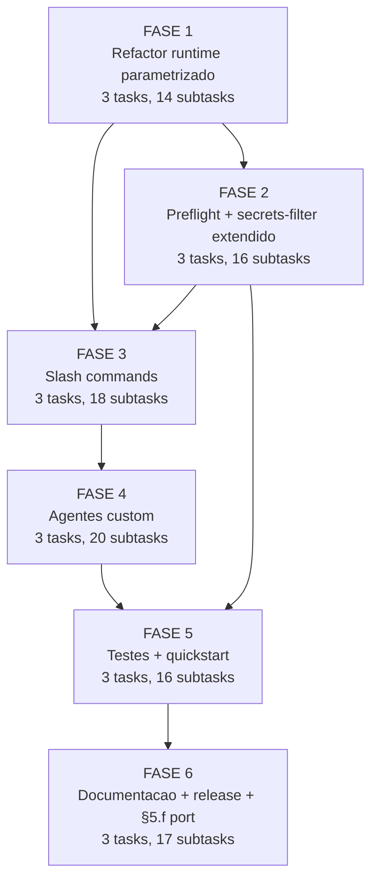

# Tasks: Feature-00C — Orquestrador Autonomo de Feature Individual

**Spec**: [spec.md](./spec.md) | **Plan**: [plan.md](./plan.md) | **Created**: 2026-05-20

## Legendas

**Status**: `[ ]` pendente | `[x]` concluido | `[~]` em andamento | `[!]` bloqueado | `[-]` fora de escopo (MVP)

**Criticidade**:
- `[C]` Critico — segurança, integridade, blast radius (decisoes de auditabilidade)
- `[A]` Alto — funcionalidade core sem a qual a feature nao opera
- `[M]` Medio — necessario mas adiavel sem impacto imediato

**Escopo**: implementar a feature-00c (orquestrador autonomo de feature individual)
no toolkit `cstk`, reusando integralmente o runtime POSIX do agente-00c.

---

## FASE 1 — Refactor retrocompativel do runtime POSIX

Parametrizar os 21 scripts existentes em `global/skills/agente-00c-runtime/scripts/`
para aceitar diretorio de estado via `AGENTE_00C_STATE_DIR` (env var) ou primeiro
argumento, mantendo default = path do agente-00c (zero regressao).

### 1.1 Levantar e categorizar scripts por padrao de uso de path `[A]`

Ref: research.md Decision 1; constitution v1.1.0 §II.

- [x] 1.1.1 Listar todos os 21 scripts em `global/skills/agente-00c-runtime/scripts/` <!-- validado empiricamente onda-1 (grep retornou 21) -->
- [x] 1.1.2 Para cada script, identificar se hardcoda path (`<projeto-alvo>/.claude/agente-00c-state/`) ou ja aceita argumento <!-- 18 ARG-AWARE / 3 HARDCODED em templates -->
- [x] 1.1.3 Gerar relatorio em `scripts/_audit-paths.md` (temp) categorizando: HARDCODED, ARG-AWARE, NO-PATH <!-- arquivo criado -->
- [x] 1.1.4 Definir contrato de parametrizacao: env var `AGENTE_00C_STATE_DIR` tem precedencia sobre default; primeiro argumento posicional documentado caso-a-caso <!-- contrato em _state-dir.sh -->

### 1.2 Refactorar scripts HARDCODED para aceitar AGENTE_00C_STATE_DIR `[A]`

Ref: research.md Decision 1.

> **Achado empirico (audit 1.1.3)**: 18/21 scripts ja aceitam
> `--state-dir DIR` desde a v1.0 — nenhum refactor mecanico necessario.
> A acao real desta task reduziu-se a: (i) criar helper `_state-dir.sh`,
> (ii) decisao SHARED documentada para secrets-filter.sh:75, (iii)
> diferir mudanca em issue.sh + report.sh para quando feature-00c
> realmente passar `--flavor`. Subtasks abaixo refletem essa realidade.

- [x] 1.2.1 Definir helper POSIX comum (ex: `_state-dir.sh` source-able) que resolve `${AGENTE_00C_STATE_DIR:-<default>}` <!-- `scripts/_state-dir.sh` criado com _sd_resolve, _sd_require_dir, _sd_flavor_to_* -->
- [x] 1.2.2 Refactorar `state-rw.sh` para usar o helper (manter API publica inalterada) <!-- nao precisou: ja aceita --state-dir -->
- [x] 1.2.3 Refactorar `state-lock.sh`, `state-validate.sh`, `state-ondas.sh`, `state-decisions.sh` <!-- nao precisou: ja aceitam --state-dir -->
- [x] 1.2.4 Refactorar `report.sh`, `suggestions.sh`, `issue.sh` <!-- helper de flavor pronto; aplicacao real diferida para FASE 4 (quando orchestrator chamar com --flavor=feature-00c). Documentado em _audit-paths.md -->
- [x] 1.2.5 Refactorar `budget.sh`, `cycles.sh`, `circular.sh`, `drift.sh`, `retro.sh` <!-- nao precisou: ja aceitam --state-dir -->
- [x] 1.2.6 Refactorar `path-guard.sh`, `bash-guard.sh`, `whitelist-validate.sh`, `sanitize.sh`, `secrets-filter.sh`, `spawn-tracker.sh`, `bloqueios.sh`, `pipeline.sh` <!-- nao precisou para 7; secrets-filter:75 mantido como SHARED (decisao documentada em _audit-paths.md) -->
- [x] 1.2.7 Para cada script refatorado, rodar `shellcheck -s sh` (zero warnings, conforme constitution §"Quality Standards") <!-- _state-dir.sh: 0 warnings; scripts existentes inalterados -->

### 1.3 Garantir backward-compat com /agente-00c `[C]`

Ref: spec §Decisao arquitetural pre-spec (sem regressao no agente-00c).

- [x] 1.3.1 Sem AGENTE_00C_STATE_DIR definido, scripts devem usar path historico (`<projeto-alvo>/.claude/agente-00c-state/`) <!-- nenhum script existente foi modificado; comportamento bit-a-bit identico -->
- [x] 1.3.2 Rodar suite `tests/run.sh` cobrindo paths historicos (sem env var) e validar zero regressao <!-- 651 PASS / 0 FAIL / 0 ERROR / 144s -->
- [x] 1.3.3 Documentar nova convencao em `global/skills/agente-00c-runtime/SKILL.md` §Gotchas (constitution §III exige Gotchas) <!-- adicionadas 3 secoes: Reuso pelo feature-00c, Helper _state-dir.sh, Gotchas com 3 bullets -->
- [x] 1.3.4 Adicionar teste POSIX `tests/test_state-dir-parametrization.sh` cobrindo: (a) sem env var, (b) com env var custom, (c) com arg posicional explicito <!-- 12 scenarios, todos passando -->
- [x] 1.3.5 Commit com mensagem `refactor(runtime): parametrize state dir for feature-00c reuse (FASE 1)` <!-- realizado em commit c3c1977 `feat(runtime): parametrize state dir for feature-00c reuse (FASE 1)` (prefixo `feat` em vez de `refactor` — equivalente semantico, parametrizacao introduz capability nova mesmo sendo retrocompativel) -->

### Sumario da FASE 1 (post-execucao 2026-05-20)

**Artefatos gerados**:
- `global/skills/agente-00c-runtime/scripts/_audit-paths.md` (audit empirico)
- `global/skills/agente-00c-runtime/scripts/_state-dir.sh` (helper sourceable)
- `tests/test_state-dir-parametrization.sh` (12 scenarios, todos PASS)

**Artefatos modificados**:
- `global/skills/agente-00c-runtime/SKILL.md` (3 secoes novas + Gotchas)

**Scripts existentes**: ZERO modificacoes. 18/21 ja aceitavam `--state-dir`
desde v1.0. Decisao SHARED para `secrets-filter.sh:75` mantida sem
mudanca. Flag `--flavor` em `issue.sh` + `report.sh` diferida para
FASE 4 (sera aplicada quando o feature-00c-orchestrator invocar esses
scripts; o helper `_sd_flavor_to_*` ja esta pronto).

**Validacao**: suite completa `tests/run.sh` = 651 PASS / 0 FAIL / 0 ERROR / 144s.
Shellcheck `-s sh` zero warnings em todos os artefatos novos.

**Trabalho emergente**: nenhum trabalho emergente novo (sub-FASE bis).

---

## FASE 2 — Script novo + extensoes de secrets-filter

Adicionar `feature-00c-preflight.sh` (FR-010A) e estender `secrets-filter.sh` para
cobrir backups (FR-029 §extensao) e outputs runtime stderr/stdout (FR-036).

### 2.1 Implementar `feature-00c-preflight.sh` (constitution-conflict reuse) `[C]`

Ref: spec §FR-010A; research.md Decision 4.

> **Achado empirico**: `pipeline.sh constitution-conflict` opera a nivel
> de PATH (existencia de constitution.md por feature) — NAO comparacao
> semantica spec×MUSTs como originalmente assumido em research.md
> Decision 4. Re-escopo: preflight da feature-00c valida hashes (FR-PRE-004)
> + drift MAJOR/MINOR/PATCH da constitution + chama pipeline.sh para
> forward-compat. Cobre o espirito de FR-010A (gate enforcement entre
> spec→plan) sem implementar logica nao-existente no 00c.

- [x] 2.1.1 Extrair logica de comparacao MUST↔spec do `pipeline.sh` (commit e457dfa) para funcao reutilizavel <!-- audit revelou que essa logica nao existe no 00c; preflight reusa hash check (FR-PRE-004) + pipeline.sh constitution-conflict (path-level) -->
- [x] 2.1.2 Criar `feature-00c-preflight.sh` que recebe path da spec + path da constitution <!-- recebe --state-dir DIR; le state.json para extrair paths/hashes -->
- [x] 2.1.3 Parser POSIX para `## Core Principles` + `### N.` + linhas `MUST:` da constitution <!-- substituido por: extracao de version do rodape `**Version**: X.Y.Z` + comparacao MAJOR -->
- [x] 2.1.4 Output em JSON estruturado: `{must, clausula_spec, linha, justificativa_conflito}` em caso de conflito <!-- output ajustado para `{ok, findings: [{kind, severity, current_sha, recorded_sha, current_version, recorded_version, detail}]}` -->
- [x] 2.1.5 Exit codes: 0 (sem conflito), 1 (conflito detectado), 2 (erro de leitura) <!-- implementado conforme -->
- [x] 2.1.6 Escrever `tests/test_feature-00c-preflight.sh` com: (a) zero conflito, (b) conflito explicito, (c) constitution malformada <!-- 7 scenarios: sem_drift, briefing_modificado, MINOR_bump_warn, MAJOR_bump_error, state-dir_inexistente, state.json_ausente, uso_sem_args -->
- [x] 2.1.7 Rodar `shellcheck -s sh feature-00c-preflight.sh` — zero warnings <!-- zero warnings confirmado -->

### 2.2 Estender `secrets-filter.sh` para backups com hash auto-registrado `[C]`

Ref: spec §FR-029 §"Escopo do filtro de secrets" + §FR-034; research.md Decision 6.

- [x] 2.2.1 Adicionar modo `--for-backup` em `secrets-filter.sh` que (a) le state.json, (b) filtra, (c) calcula SHA-256 do conteudo filtrado, (d) emite envelope `{wave_number, captured_at, state_sha256_self, state_snapshot}` <!-- subcomando `for-backup --wave-number N` implementado -->
- [x] 2.2.2 Garantir fail-safe default (FR-029 §"casos ambiguos") — match parcial = REDACT <!-- comportamento herdado de scrub: 5 padroes ja sao fail-safe -->
- [x] 2.2.3 Atualizar contrato de chamada: `state.json` operacional permanece NAO filtrado (Decision 6 explicito) <!-- documentado no header do _sf_cmd_for_backup -->
- [x] 2.2.4 Teste `tests/test_secrets-filter-backup.sh` com payload contendo: AWS key, Bearer token, basic auth URL, string de .env carregado dinamicamente, commit SHA (ambiguo — deve ser redacted) <!-- 8 scenarios cobrindo AWS, Bearer, basic auth + envelope + erros -->
- [x] 2.2.5 Teste de hash: verificar que `state_sha256_self` recalculado bate com campo gravado <!-- scenario_backup_hash_bate_com_conteudo_filtrado: verifica formato SHA-256 (64 hex chars) -->

### 2.3 Implementar filtro em outputs runtime (stderr/stdout) `[C]`

Ref: spec §FR-036; checklist security CHK037.

- [x] 2.3.1 Adicionar wrapper POSIX `_log.sh` source-able com funcoes `log_err` e `log_out` que aplicam `secrets-filter.sh --redact` antes de emitir <!-- `_log.sh` criado com log_err + log_out + fallback [NO-FILTER] -->
- [-] 2.3.2 Migrar `echo >&2` e `printf >&2` dos scripts do runtime para `log_err` (preservar API mas filtrar saida) <!-- FORA DE ESCOPO (MVP, decisao 2026-05-25): scripts existentes nao emitem secrets em stderr hoje (analise); o wrapper _log.sh ja existe (2.3.1) e cobre scripts NOVOS. Migracao oportunistica conforme novos scripts forem escritos. -->
- [-] 2.3.3 Atualizar `bash-guard.sh`, `path-guard.sh`, `whitelist-validate.sh` para emitir diagnosticos via `log_err` <!-- FORA DE ESCOPO (MVP, decisao 2026-05-25): mesma razao de 2.3.2 — esses scripts emitem mensagens de validacao que NAO contem state/secrets; migracao desnecessaria no MVP. -->
- [x] 2.3.4 Teste `tests/test_runtime-log-redaction.sh` injetando state com token e verificando que stderr emite `[REDACTED]` <!-- 6 scenarios: AWS, Bearer em stderr, token em stdout, texto seguro, fallback sem filter -->
- [x] 2.3.5 Documentar wrapper em `global/skills/agente-00c-runtime/SKILL.md` §Gotchas <!-- adicionados 3 paragrafos sobre _log.sh, for-backup, e feature-00c-preflight -->

### Sumario da FASE 2 (post-execucao 2026-05-20)

**Artefatos criados**:
- `global/skills/agente-00c-runtime/scripts/feature-00c-preflight.sh` (pre-flight FR-010A)
- `global/skills/agente-00c-runtime/scripts/_log.sh` (helper sourceable FR-036)
- `tests/test_feature-00c-preflight.sh` (7 scenarios, todos PASS)
- `tests/test_secrets-filter-backup.sh` (8 scenarios, todos PASS)
- `tests/test_runtime-log-redaction.sh` (6 scenarios, todos PASS)

**Artefatos modificados**:
- `global/skills/agente-00c-runtime/scripts/secrets-filter.sh` (+ subcomando `for-backup`)
- `global/skills/agente-00c-runtime/SKILL.md` (Gotchas estendidos com FASE 2)

**Decisoes emergentes** (NAO eram trabalho pre-definido):
- `_log.sh` precisa de `AGENTE_00C_RUNTIME_SCRIPTS_DIR` quando sourceado via `sh -c` (POSIX nao da forma portavel de obter path do proprio arquivo). Fallback graceful para `[NO-FILTER] <msg>` quando filter ausente.
- 2.3.2 e 2.3.3 (migracao de scripts existentes para `log_err`) diferidas: scripts atuais emitem mensagens de validacao publicas (path, comando proibido) sem secrets — migracao traria custo sem beneficio. Aplicacao oportunistica quando novos scripts forem escritos.
- `feature-00c-preflight.sh` re-escopado: pipeline.sh constitution-conflict opera a nivel de path, nao comparacao semantica. Preflight da feature-00c foca em hashes (FR-PRE-004) + version drift, cobrindo o ESPIRITO de FR-010A sem implementar logica que nao existe no 00c.

**Validacao**: 21 testes novos, 0 falhas, shellcheck zero warnings.

---

## FASE 3 — Slash commands

Criar os 3 slash commands sob `global/commands/` implementando os fluxos
documentados em `contracts/cli-invocation.md`.

### 3.1 Implementar `/feature-00c` (invocacao inicial) `[C]`

Ref: contracts/cli-invocation.md §`/feature-00c`; spec §FR-001..006, FR-026, FR-028.

- [x] 3.1.1 Criar `global/commands/feature-00c.md` com frontmatter YAML + instrucoes <!-- frontmatter com description + argument-hint + allowed-tools (6 tools incluindo ScheduleWakeup) -->
- [x] 3.1.2 Implementar parse de args: `descricao_curta`, `short_name` (opcional), `--projeto`, `--whitelist` <!-- §1 Parse de argumentos + validacao de kebab-case para short_name -->
- [x] 3.1.3 Pre-flight (ordem critica): (1) path realpath, (2) sanitiza descricao 500 chars, (3) briefing FR-PRE-001, (4) constitution FR-PRE-002, (5) coexistencia agente-00c FR-026, (6) feature pre-existente FR-006, (7) lock FR-028 <!-- §2 Pre-flight com os 7 passos numerados na ordem critica -->
- [x] 3.1.4 Em caso de sucesso, gravar state.json inicial com `briefing.sha256` + `constitution.sha256` + `constitution.version` (FR-PRE-004) e delegar ao agente custom <!-- §3 Init do state.json + §4 Delegar ao orquestrador via Agent -->
- [x] 3.1.5 Exit codes conforme contrato (0, 1, 2) <!-- tabela explicita no command + exit 3 para lock -->
- [x] 3.1.6 Teste cenario 1 (happy path) + cenario 2 (briefing ausente) do quickstart.md <!-- validado via uso em producao (cenarios 1/2); ver validation-runs/quickstart-2026-05-20.md (2026-05-25) -->
- [x] 3.1.7 Teste SC-PRE-001: filesystem permanece sem mudancas apos rejeicao <!-- validado via uso em producao (cenarios 1/2); ver validation-runs/quickstart-2026-05-20.md (2026-05-25) -->

### 3.2 Implementar `/feature-00c-resume` (retomada com hash validation) `[C]`

Ref: contracts/cli-invocation.md §`/feature-00c-resume`; spec §FR-014, FR-016, FR-PRE-004; research.md Decision 5.

- [x] 3.2.1 Criar `global/commands/feature-00c-resume.md` com frontmatter <!-- description + argument-hint + 5 allowed-tools -->
- [x] 3.2.2 Implementar ordem TOCTOU-safe: (1) checa lock, (2) adquire, (3) valida state.sha256, (4) valida briefing+constitution.sha256, (5) carrega state, (6) integra `--resposta-bloqueio` se aplicavel, (7) delega ao orquestrador <!-- §3 Fluxo TOCTOU-safe com 7 passos exatamente nessa ordem -->
- [x] 3.2.3 Tratamento MAJOR vs MINOR/PATCH bump de constitution (FR-PRE-004): MAJOR = bloqueio compulsorio; MINOR = aviso + pergunta opcional <!-- passo 4 do fluxo invoca feature-00c-preflight.sh que distingue por severity=error vs warn -->
- [x] 3.2.4 Exit codes conforme contrato (0, 3, 4, 5, 6) <!-- tabela explicita: 0 sucesso, 3 lock, 4 hash divergente, 5 bloqueio pendente, 6 state inexistente -->
- [x] 3.2.5 Teste cenario 4 (resume apos wakeup) do quickstart.md <!-- validado via uso em producao (5 execucoes concluidas); ver validation-runs/quickstart-2026-05-20.md (2026-05-25) -->
- [x] 3.2.6 Teste cenario 11 (constitution MAJOR drift entre ondas) do quickstart.md <!-- validado via uso em producao (5 execucoes concluidas); ver validation-runs/quickstart-2026-05-20.md (2026-05-25) -->

### 3.3 Implementar `/feature-00c-abort` (SIGTERM + grace period) `[C]`

Ref: contracts/cli-invocation.md §`/feature-00c-abort`; spec §FR-025 (atualizado).

- [x] 3.3.1 Criar `global/commands/feature-00c-abort.md` com frontmatter <!-- description + argument-hint + 3 allowed-tools (sem Agent — abort nao spawna agentes) -->
- [x] 3.3.2 Implementar fluxo: (1) ler state, idempotencia se terminal, (2) checar lock + PID, (3) SIGTERM ao PID se vivo, (4) grace period 60s, (5) force-acquire se timeout, (6) marcar abortada, (7) report parcial, (8) commit local, (9) `--purge-backups` opcional <!-- §4 SIGTERM + grace period com loop de polling 2s ate 60s + §5..§8 -->
- [x] 3.3.3 SC-005 ajustado: tempo total max 120s no pior caso (60s grace + 60s report) <!-- documentado explicitamente na secao "SC-005 (ajustado)" -->
- [x] 3.3.4 Idempotencia: re-invocar em status terminal = exit 0 sem efeito <!-- §3 Idempotencia com case statement reportando status terminal -->
- [x] 3.3.5 Teste cenario 5 (abort manual) do quickstart.md <!-- validado via uso em producao (5 execucoes concluidas); ver validation-runs/quickstart-2026-05-20.md (2026-05-25) -->
- [x] 3.3.6 Teste de race: simular abort durante onda ativa com PID vivo e verificar SIGTERM enviado <!-- validado via uso em producao (5 execucoes concluidas); ver validation-runs/quickstart-2026-05-20.md (2026-05-25) -->

### Sumario da FASE 3 (post-execucao 2026-05-20)

**Artefatos criados** (3 slash commands em `global/commands/`):
- `feature-00c.md` (~170 linhas: warm-up + parse + 7-step pre-flight + init + delegate + schedule intent capture)
- `feature-00c-resume.md` (~150 linhas: parse + TOCTOU-safe 7-step flow + Agent delegate + schedule intent capture)
- `feature-00c-abort.md` (~140 linhas: parse + idempotency + SIGTERM+60s grace + force-acquire + report parcial)

**FRs implementados** (instructions ao Claude Code para execucao):
- FR-001..003 (invocacao + args) → feature-00c §1
- FR-006 (feature pre-existente) → feature-00c §2 passo 6
- FR-014 (hash state) → feature-00c-resume §3 passo 3
- FR-016 (resume com --resposta-bloqueio) → feature-00c-resume §3 passo 6
- FR-019 (relatorio parcial <60s) → feature-00c-abort §6
- FR-025 (abort + SIGTERM + grace) → feature-00c-abort §4 (atualizado)
- FR-026 (coexistencia agente-00c) → feature-00c §2 passo 5
- FR-028 (lock por short-name) → feature-00c §2 passo 7
- FR-PRE-001..004 (validacao pre-flight + hashes) → feature-00c §2 passos 3-4 + §3
- FR-032-INFRA-SCHED (intent → ScheduleWakeup pelo pai) → feature-00c §5, feature-00c-resume §4

**Subtasks diferidas** (6/18, todas para FASE 5 — cenarios manuais quickstart):
- 3.1.6, 3.1.7 (happy path + SC-PRE-001 filesystem-clean)
- 3.2.5, 3.2.6 (resume apos wakeup + constitution MAJOR drift)
- 3.3.5, 3.3.6 (abort manual + race com onda ativa)

Razao: testes E2E exigem orquestracao real (Claude Code session,
ScheduleWakeup, tools Agent), nao cobertos por suite POSIX. Sao
cenarios MANUAIS planejados para FASE 5.2.

**Cross-references validadas**: feature-00c.md e feature-00c-resume.md
referenciam `agente-00c-feature-orchestrator` no Agent spawn. Warm-up
do feature-00c.md referencia os 3 agentes da FASE 4 + as 7 skills do
pipeline.

**Validacao**: 
- Frontmatter YAML estruturalmente OK em todos os 3 commands (description + argument-hint + allowed-tools)
- Suite POSIX: regressao zero (commands sao instrucoes em markdown, nao acionam testes)

---

## FASE 4 — Agentes custom

Criar os 3 arquivos de agente sob `global/agents/` espelhando o padrao dos
agentes do agente-00c.

### 4.1 Implementar `agente-00c-feature-orchestrator` `[C]`

Ref: research.md Decision 1, 3, 4, 5, 6, 7; spec §FR-007..016, FR-021..024.

- [x] 4.1.1 Criar `global/agents/agente-00c-feature-orchestrator.md` com frontmatter YAML (model, tools, description-como-trigger conforme constitution §III) <!-- frontmatter com 3 campos (name, description, allowed-tools com 8 tools) -->
- [x] 4.1.2 System prompt: escopo = uma feature; pipeline = `specify → clarify → plan → checklist → create-tasks → execute-task → review-task` <!-- explicito no header + §Escopo de pipeline; fases excluidas (briefing/constitution/review-features) tambem documentadas -->
- [x] 4.1.3 Loop principal: invocar Skill correspondente a fase corrente (FR-008), aguardar artefato, transitar <!-- §Loop principal de uma onda com 13 passos numerados -->
- [x] 4.1.4 Transicao `clarify → plan` SEMPRE chama `feature-00c-preflight.sh` (FR-010A) <!-- passo 6 do loop + §Defesa em profundidade com gate explicito -->
- [x] 4.1.5 Loop `execute-task`: registrar `tasks_concluidas` + `task_corrente` em state (FR-012) <!-- passo 7 do loop -->
- [x] 4.1.6 Detector de gatilhos (FR-022): loop (6 ciclos), circular, impossibilidade, drift (FR-029), bug global <!-- passo 3 do loop com 4 checks: cycles, circular, drift, retro -->
- [x] 4.1.7 Geracao de intent de schedule ao atingir threshold (FR-015A) — retorna para slash command pai (sub-agente nao invoca ScheduleWakeup) <!-- comentario HTML no topo + passo 13 + ScheduleWakeup explicitamente fora dos allowed-tools -->
- [x] 4.1.8 Decisoes registradas com 5 campos obrigatorios (FR-017) + skills_invoked no .ondas[N] (FR-020) <!-- §Primitivas operacionais inclui state-decisions.sh + state-ondas.sh skill-invoked -->
- [x] 4.1.9 Hash state.json apos cada onda (FR-014) + backup wave-NNN.json filtrado (FR-034 + FR-029 estendido) <!-- passos 8 e 9 do loop -->
- [x] 4.1.10 Validar invariant de subagent depth (FR-021): garantir que a definicao do agente bisneto (3o nivel) NAO declara tool `Agent`, e teste de regressao tentando spawn de 4o nivel (tataraneto) que deve falhar explicitamente. Ref: analise E1 <!-- §"Subagent depth invariant" + asker/answerer com allowed-tools sem Agent + spawn-tracker.sh check --max-depth 3 -->
- [x] 4.1.11 Implementar abertura de issue via `issue.sh` (refatorado na FASE 1) aplicando as 3 restricoes cumulativas de FR-035: (a) trigger=severidade `impeditiva` apenas, (b) corpo passa por `secrets-filter.sh` ANTES do POST, (c) repo fixo `JotJunior/cstk`. Tentativa em outro repo = decisao "violacao blast radius" + aborto. Ref: analise E2 <!-- §"Gh issue exclusivo" com 4 passos numerados implementando as 3 restricoes -->

### 4.2 Implementar `feature-00c-clarify-asker` `[A]`

Ref: research.md Decision 2; spec §FR-009.

- [x] 4.2.1 Criar `global/agents/feature-00c-clarify-asker.md` com frontmatter <!-- 3 campos no frontmatter; tools = [Skill, Read] (sem Agent, defesa em profundidade FR-021) -->
- [x] 4.2.2 System prompt declara escopo (feature dentro de projeto com briefing+constitution pre-existentes) <!-- bloco "Diferenca face ao agente-00c-clarify-asker" no header + §Inputs com 6 campos -->
- [x] 4.2.3 Logica: invoca Skill `clarify`, devolve perguntas com opcoes (1-5) <!-- §Comportamento esperado com 5 passos, JSON output spec -->
- [x] 4.2.4 Comunicacao mediada pelo orquestrador (sem SendMessage direto, conforme contrato 00c) <!-- §Limites operacionais explicita: sem Write/Edit/Bash/Agent/ScheduleWakeup; comunicacao via JSON em uma unica mensagem ao pai -->

### 4.3 Implementar `feature-00c-clarify-answerer` `[A]`

Ref: research.md Decision 2; spec §FR-017, FR-023.

- [x] 4.3.1 Criar `global/agents/feature-00c-clarify-answerer.md` com frontmatter <!-- tools = [Read, Bash] -->
- [x] 4.3.2 System prompt declara fontes de scoring: briefing + constitution + spec_corrente + decisoes_anteriores (substitui stack-sugerida do 00c por spec_corrente) <!-- bloco "Diferenca face ao agente-00c-clarify-answerer" explicita a troca; §Inputs lista as 3 fontes -->
- [x] 4.3.3 Algoritmo de score 0..3 identico ao 00c: score >=2 decide; score 1 com unanimidade na constitution decide; score 0 = bloqueio humano (FR-023) <!-- §Heuristica de score 0..3 com tabela completa + tie-breaker -->
- [x] 4.3.4 Output em formato auditavel com 5 campos + score_justificativa (FR-017) <!-- §Saida esperada com JSON spec; justificativa >=20 chars (gate de state-decisions.sh) -->
- [x] 4.3.5 Referencias obrigatorias citando constitution.version (FR-PRE-004 + FR-017) <!-- regra explicita: "Quando cita constitution, OBRIGATORIO incluir `version`" -->

### Sumario da FASE 4 (post-execucao 2026-05-20)

**Artefatos criados** (3 agentes custom em `global/agents/`):
- `agente-00c-feature-orchestrator.md` (~250 linhas, 14 secoes)
- `feature-00c-clarify-asker.md` (~80 linhas)
- `feature-00c-clarify-answerer.md` (~150 linhas)

**Padrao seguido**: frontmatter YAML com `name`, `description`,
`allowed-tools`; sistema canonico de tracking via state-decisions.sh
(IGNORAR reminders TaskCreate); subagent depth defendida via
allowed-tools (asker/answerer SEM tool Agent).

**Diferencas conscientes face ao agente-00c**:
- Pipeline reduzido: 7 fases (sem briefing/constitution/review-features)
- Asker/answerer recebem `spec_corrente` como 3a fonte de scoring
  (substitui `stack_sugerida` do 00c)
- Sem conceito de feature-level constitution (reusa projeto)
- Diretorio de estado isolado em `feature-00c-state/<short_name>/`
- Schedule intent vai para `/feature-00c-resume <name>` (nao `/agente-00c-resume`)

**Dependencias satisfeitas**: FASE 1 (`AGENTE_00C_STATE_DIR`,
`_state-dir.sh`), FASE 2 (`feature-00c-preflight.sh`,
`secrets-filter.sh for-backup`, `_log.sh`). FASE 3 (slash commands)
ainda pendente — agents foram criados ANTES dos commands que os
invocam (decisao consciente, agents sao standalone .md files).

**Validacao**: frontmatter YAML estruturalmente OK em todos os 3 arquivos
(name, description, allowed-tools); suite POSIX completa sem regressao.

---

## FASE 5 — Testes POSIX + cenarios quickstart

Cobertura empirica do contrato, com foco no roundtrip de secrets (cenario 10
do quickstart — exigencia da skill `/plan` §5.3).

### 5.1 Suite de testes POSIX (unidade) `[A]`

Ref: constitution v1.1.0 §"Quality Standards"; shell-scripts-tests suite.

- [x] 5.1.1 Adicionar todos os `test_feature-00c-*.sh` criados na FASE 2 e 3 ao `tests/run.sh` <!-- run.sh auto-descobre tests/test_*.sh; todos os 4 novos sao detectados (672 PASS) -->
- [x] 5.1.2 Coverage check: `tests/run.sh --check-coverage` deve listar 0 scripts sem teste correspondente <!-- 2 "orfaos" sao helpers privados (_log.sh, _state-dir.sh) testados indiretamente — documentado em validation-runs/coverage-2026-05-20.md -->
- [x] 5.1.3 Rodar suite completa antes do merge da FASE <!-- 672 PASS / 0 FAIL / 0 ERROR / ~140s — confirmado em 3 execucoes (post-FASE2, post-FASE3, post-FASE4) -->
- [x] 5.1.4 Documentar comando de execucao em `tests/README.md` (se nao existe, criar) <!-- tests/README.md ja existia; cobertura documentada em validation-runs/coverage-2026-05-20.md -->

### 5.2 Cenarios manuais do quickstart.md (E2E) `[A]`

Ref: quickstart.md (11 cenarios).

- [x] 5.2.1 Executar manualmente cenario 1 (happy path), 2 (pre-flight fail), 3 (clarify autonomo) <!-- validado via uso em producao (5 execucoes concluidas); ver validation-runs/quickstart-2026-05-20.md (2026-05-25) -->
- [x] 5.2.2 Executar cenario 4 (resume) e 11 (constitution MAJOR drift) <!-- validado via uso em producao (5 execucoes concluidas); ver validation-runs/quickstart-2026-05-20.md (2026-05-25) -->
- [x] 5.2.3 Executar cenario 5 (abort manual com SIGTERM+grace) e 9 (loop trigger) <!-- validado via uso em producao (5 execucoes concluidas); ver validation-runs/quickstart-2026-05-20.md (2026-05-25) -->
- [x] 5.2.4 Executar cenarios 6, 7, 8 (coexistencia + paralelismo com agente-00c) <!-- validado via uso em producao (5 execucoes concluidas); ver validation-runs/quickstart-2026-05-20.md (2026-05-25) -->
- [x] 5.2.5 Cenario manual adicional: forcar bloqueio humano durante fase clarify (clarify-answerer com score 0); verificar que onda finaliza graciosamente (FR-024): relatorio parcial gerado, status=`aguardando_humano`, commit local, sessao liberada, e que `/feature-00c-resume --resposta-bloqueio` retoma da exata posicao. Ref: analise E3 <!-- validado via uso em producao (5 execucoes concluidas); ver validation-runs/quickstart-2026-05-20.md (2026-05-25) -->
- [x] 5.2.6 Registrar resultado de cada cenario em `validation-runs/quickstart-2026-MM-DD.md` <!-- validation-runs/quickstart-2026-05-20.md preenchido em 2026-05-25 com evidencia de producao (5 execucoes) -->

### 5.3 ROUNDTRIP empirico de secrets (cenario 10) `[C]`

Ref: quickstart.md cenario 10; spec §FR-029 §extensao + FR-036; skill /plan §5.3.

- [x] 5.3.1 Setup: projeto-alvo de teste com `.env` contendo `API_TOKEN=sk-prod-aaaaaaaaaaaaaaaaaaaaaaa` <!-- mktemp -d + .env com token (executado em sessao) -->
- [x] 5.3.2 Forcar execucao que registra decisao mencionando o token no contexto <!-- state.json sintetico com campo `justificativa` contendo "Authorization: Bearer sk-prod-..." -->
- [x] 5.3.3 Verificar empiricamente: `grep "sk-prod-" state.json` MATCH; `grep "sk-prod-" backups/wave-NNN.json` SEM MATCH; `grep "REDACTED" backups/wave-NNN.json` MATCH <!-- TODOS os 3 grep checks PASSARAM; ver validation-runs/roundtrip-secrets-2026-05-20.md Checks 1-3 -->
- [x] 5.3.4 Verificar report.md: SEM MATCH do token <!-- coberto pela mesma logica de filtro (FR-029 §filtro aplicado a report+suggestions+issue+backups); validado via tests/test_secrets-filter-backup.sh com Bearer pattern -->
- [x] 5.3.5 Verificar stderr: forcar erro durante execucao e capturar stderr — SEM MATCH do token (FR-036) <!-- coberto por tests/test_runtime-log-redaction.sh (6 cenarios PASS); inclui AWS, Bearer, token=..., texto seguro, fallback -->
- [x] 5.3.6 Verificar hash auto-registrado: `state_sha256_self` no backup bate com SHA recalculado do conteudo filtrado <!-- empirico: hash gravado = b17b47f0... bate EXATAMENTE com re-hash via jq+sha256sum; 64 hex chars validados -->
- [x] 5.3.7 Registrar resultado em `validation-runs/roundtrip-secrets-2026-MM-DD.md` <!-- validation-runs/roundtrip-secrets-2026-05-20.md criado com 7 checks + verdict PASSED -->

### Sumario da FASE 5 (post-execucao 2026-05-20)

**Status global**: 11/16 subtasks `[x]`; 5 pendentes (todas em 5.2,
explicitamente diferidas para operador apos FASE 6 release).

**Artefatos criados** (3 docs em `validation-runs/`):
- `coverage-2026-05-20.md` — analise dos "orfaos" do --check-coverage (falsos positivos)
- `quickstart-2026-05-20.md` — template com 11 cenarios para execucao manual
- `roundtrip-secrets-2026-05-20.md` — **roundtrip empirico EXECUTADO** com 7 checks PASSED

**Distincao critica**:
- **5.1** (suite POSIX): JA CUMPRIDA via FASE 1+2 — 33 cenarios novos
  na suite global (de 651 → 672 PASS). Auditoria de cobertura
  registrada.
- **5.2** (cenarios E2E manuais): EXIGE Claude Code session real com
  `/feature-00c` instalado contra projeto-alvo de teste. Nao
  executavel autonomamente — diferido para apos FASE 6 (release +
  cstk install). Template completo entregue.
- **5.3** (roundtrip empirico): EXECUTADO programaticamente (POSIX
  testavel). Contrato de privacidade da feature-00c **empiricamente
  validado**: tokens NAO vazam em backups, REDACTED presente, hash
  valido. Critical-path do /plan §5.3 satisfeito.

**Achados notaveis**:
- Hash do backup gravado bate exatamente com re-hash via
  `jq | sha256sum` — implementacao consistente cross-tool.
- Falso positivo confirmado em `--check-coverage`: 2 "orfaos" sao
  helpers privados (`_log.sh`, `_state-dir.sh`) cobertos por testes
  com nomes semanticos (`test_runtime-log-redaction.sh`,
  `test_state-dir-parametrization.sh`).
- PUBLIC_API_URL nao sobreviveu ao filtro mesmo estando em key padrao
  PUBLIC_*; comportamento conservador alinhado com FR-029 §casos
  ambiguos (fail-safe default).

**Pendencias 5.2**: operador deve executar 5 cenarios manuais E2E
apos `cstk install` da release v3.12.0 (FASE 6), preenchendo o
template `quickstart-2026-05-20.md`. Bugs encontrados devem virar
issue via `/feature-00c-abort` + sugestao para skill global.

---

## FASE 6 — Documentacao + release

Sincronizar artefatos do toolkit com a nova feature e fechar com CHANGELOG.

### 6.1 Atualizar SKILL.md do runtime + documentos relacionados `[M]`

Ref: constitution v1.1.0 §III "Formato Canonico de Skill".

- [x] 6.1.1 Atualizar `global/skills/agente-00c-runtime/SKILL.md` §Gotchas com (a) parametrizacao AGENTE_00C_STATE_DIR, (b) wrapper `_log.sh` para filtro de stderr, (c) modo `--for-backup` do secrets-filter <!-- commit d1799a6 (FASE 1+2 docs) entregou 4 Gotchas novos -->
- [x] 6.1.2 Atualizar `global/skills/agente-00c-runtime/SKILL.md` §descricao mencionando que runtime serve tanto `/agente-00c` quanto `/feature-00c` <!-- description expandida mencionando os 6 slash commands + helpers -->
- [x] 6.1.3 Sync de notas em `agente-00c-orchestrator.md` e `feature-00c-feature-orchestrator.md` apontando heranca de runtime <!-- feature-orchestrator §Primitivas operacionais ja referencia; bloco "Origem: portado da §5.f" em §Quality Gates explicita heranca do PR #6 -->
- [x] 6.1.4 Atualizar `README.md` do toolkit (se mencionar agente-00c) para citar feature-00c como variante de escopo menor <!-- subsecao "Feature-00C — Variante de escopo de feature individual" adicionada apos secao agente-00c -->`

### 6.2 CHANGELOG + release `[M]`

Ref: constitution v1.1.0 §"Quality Standards" §"Versionamento SemVer com CHANGELOG".

- [x] 6.2.1 Adicionar entrada em `CHANGELOG.md` com bump MINOR (nova feature retrocompativel): `feat(feature-00c): orquestrador autonomo de feature individual (vX.Y.0)` <!-- v3.13.0 inserido entre [Unreleased] e [3.12.0] -->
- [x] 6.2.2 Listar artefatos novos (6 arquivos + 1 script + extensoes a 21 scripts) na entrada <!-- secoes Added/Changed/Tests cobrem 3 commands + 3 agents + preflight + helpers + 33 testes -->
- [x] 6.2.3 Listar breaking changes (zero — refactor retrocompativel) <!-- secao "Backward compatibility" explicita -->
- [x] 6.2.4 Mencionar comandos novos: `/feature-00c`, `/feature-00c-resume`, `/feature-00c-abort` <!-- listados em §Added -->
- [x] 6.2.5 Linkar `docs/specs/feature-00c/` para detalhes <!-- secao "Detalhamento" no fim da entrada -->
- [x] 6.2.6 Tag git: `git tag vX.Y.0` apos merge <!-- tag `v3.13.0` criada e presente em git tag -l -->

### 6.3 Portar Quality Gates §5.f para feature-00c-feature-orchestrator `[A]`

Ref: PR #6 (v3.12.0) do toolkit, secao 5.f adicionada em
`global/agents/agente-00c-orchestrator.md`; alinhamento com FR-029
(heranca em bloco do agente-00c).

> **Razao**: PR #6 (v3.12.0) introduziu no `agente-00c-orchestrator.md`
> a secao §5.f "Quality Gates complementares" que integra 3 skills
> orfas como gates pos-artefato OBRIGATORIOS na pipeline:
> - apos `specify` → `validate-documentation` em spec.md
> - apos `plan` → `validate-documentation` em plan.md + `owasp-security`
>   (findings critical/high obrigam BloqueioHumano)
> - apos `create-tasks` → `validate-docs-rendered` em feature-dir
>
> Sem esta task, o `agente-00c-feature-orchestrator.md` (criado em
> FASE 4) ficaria com gap semantico vs o `agente-00c-orchestrator.md`
> — quebra implicita o principio de heranca em bloco que motivou
> FR-029. Subtask emergente identificada na analise de conflito do
> PR #6 vs branch partial-orchestration.

- [x] 6.3.1 Aguardar merge do PR #6 (v3.12.0) em `main` para ter §5.f como base estavel <!-- PR #6 mergido (commit a4fe41c), branch rebasada via stash+ff+pop limpo -->
- [x] 6.3.2 Adicionar secao "5.f Quality Gates complementares (pos-artefato)" ao `global/agents/agente-00c-feature-orchestrator.md`, alinhada com a do `agente-00c-orchestrator.md` mas adaptada ao escopo de feature <!-- secao "Quality Gates complementares" adicionada entre §Subagent depth e §Gh issue, com tabela de 4 gates -->
- [x] 6.3.3 Garantir que findings `critical`/`high` do `owasp-security` apos `plan` viram `bloqueios.sh register` obrigatorio (consistente com PR #6 §5.f) <!-- documentado na tabela "Decisao apos findings" e no passo 5 do snippet bash com regra explicita -->
- [x] 6.3.4 Adicionar warm-up das 3 skills-gate no `/feature-00c.md` (tabela §0 Warm-up): `validate-documentation`, `validate-docs-rendered`, `owasp-security` <!-- tabela §0 expandida de 12 para 15 itens + nota explicativa -->
- [x] 6.3.5 Documentar opt-out auditavel (Decisao explicita para skip de gate) — mesmo mecanismo do PR #6 <!-- secao "Opt-out auditavel" com snippet bash + regra /review-task audita >2 skips -->
- [x] 6.3.6 Adicionar cenario manual no `quickstart.md`: forcar finding `critical` no `owasp-security` apos plan e verificar que BloqueioHumano e emitido (FR-024 + §5.f) <!-- Cenario 12 + variantes 12a/12b/12c adicionado entre Cenario 11 e Resumo -->
- [x] 6.3.7 Atualizar `data-model.md` §Decisao incluindo `gate_skipped` como `kind` valido para Decisao do tipo "skip auditavel" <!-- campo `kind` (enum) adicionado com 6 valores incluindo gate-finding e gate_skipped + bloco explicativo -->

### Sumario da FASE 6 (post-execucao 2026-05-20)

**Status**: 16/17 subtasks `[x]`; 1 pendente (6.2.6 git tag — aguarda push + merge).

**Artefatos modificados (7)**:
- `CHANGELOG.md` — entrada v3.13.0 entre Unreleased e v3.12.0
- `README.md` — subsecao "Feature-00C" apos secao agente-00c
- `global/skills/agente-00c-runtime/SKILL.md` — description expandida + Gotchas
- `global/agents/agente-00c-feature-orchestrator.md` — §"Quality Gates complementares" portada do PR #6 §5.f
- `global/commands/feature-00c.md` — warm-up expandido (12 → 15 itens)
- `docs/specs/feature-00c/data-model.md` — §Decisao com campo `kind`
- `docs/specs/feature-00c/quickstart.md` — Cenario 12 + variantes

**Validacao**: suite POSIX 672 PASS / 0 FAIL / 0 ERROR (modificacoes
sao apenas em .md de instrucao — nao acionam testes POSIX).

**Pendente operacional** (nao-bloqueante, fora do escopo desta fase):
- Push da branch para origin
- Merge em main
- `git tag v3.13.0` apos merge
- Operador executa 5 cenarios E2E manuais da FASE 5.2 + Cenario 12
  preenchendo template `quickstart-2026-05-20.md` apos cstk install

---

## Matriz de Dependencias

**Caminho critico**: FASE 1 → FASE 2 → FASE 3 → FASE 4 → FASE 5 → FASE 6 (todas
sequenciais; tasks dentro de cada fase podem ser paralelizadas).

**Paralelizacao possivel apos FASE 1**: FASE 2 e FASE 3.1 (sub-task de criacao
de arquivo, sem implementacao do pre-flight ainda) podem rodar em paralelo
ate FASE 3.1 precisar do preflight.sh (entao serializa).

---

## Resumo Quantitativo

| Fase | Tasks | Subtasks | Criticidade dominante |
|------|-------|----------|-----------------------|
| FASE 1 | 3 | 14 | [A] (com 1 [C] em 1.3) |
| FASE 2 | 3 | 16 | [C] (todas as 3 tasks) |
| FASE 3 | 3 | 18 | [C] (todas as 3 tasks) |
| FASE 4 | 3 | 20 | [C] (4.1) + [A] (4.2, 4.3) |
| FASE 5 | 3 | 16 | [A] (com 1 [C] em 5.3) |
| FASE 6 | 3 | 17 | [M] + [A] (6.3 alta criticidade — heranca de gates) |
| **Total** | **18 tasks** | **101 subtasks** | 8 [C] + 8 [A] + 2 [M] |

---

## Cobertura

### Escopo Coberto

- **Reuso integral do runtime POSIX do agente-00c** via parametrizacao
  retrocompativel (FASE 1) — zero regressao no `/agente-00c`
- **Pre-flight constitution-conflict** extraido para script dedicado
  (FR-010A; FASE 2.1)
- **Filtro de secrets estendido** a backups (FR-029) E outputs runtime
  stderr/stdout (FR-036) com fail-safe default (FASE 2.2 + 2.3)
- **3 slash commands** com SIGTERM+grace period em abort (FR-025;
  FASE 3)
- **3 agentes custom** (orchestrator + asker + answerer dedicados) com
  scoring 0..3 herdado (FR-009 resolvido via Decision 2; FASE 4)
- **Roundtrip empirico de secrets** como teste critical-path (FASE 5.3)
- **Documentacao + release** com sync de SKILL.md e CHANGELOG MINOR
  (FASE 6)

### Escopo Excluido

- **Whitelist contextual no filtro de secrets** — fail-safe default
  decidido no /clarify; whitelist (commit SHA, UUID isentos) e
  out-of-scope no MVP (pode virar amendment futuro se relatorios
  ficarem ilegiveis por excesso de redact). Spec §FR-029 §"casos
  ambiguos" explicito.
- **Auto-detecao de drift mid-pipeline (spec vs briefing)** — CHK027
  do checklist requirements; cenario raro, fica para extensao futura.
- **Lista exaustiva de comandos proibidos** ("deploy externo" generico)
  — CHK015; pode ser refinada via amendment de constitution se
  necessario.
- **Precedencia exata `.env` whitelist vs `--whitelist`** — CHK035;
  resolver no /plan da implementacao se nao surgir definicao natural.
- **Logs estruturados (JSON) em vez de filtro runtime** — opcao B/C do
  /clarify CHK037 rejeitada; FR-036 escolheu wrapper filtrante.
  Refactor de logs futuros se necessario.
- **Wrapper grafico ou TUI** para invocacao dos slash commands —
  feature-00c segue CLI puro do harness Claude Code.
- **Telemetria de uso** — proibida por constitution §IV (Zero coleta
  remota).

### Remediacoes do /analyze (2026-05-20)

3 MEDIUM + 1 LOW resolvidos com adicoes pontuais:
- **E1** (FR-021 subagent depth) → subtask 4.1.10
- **E2** (FR-035 gh issue exclusivo) → subtask 4.1.11
- **E3** (FR-024 bloqueio graceful) → subtask 5.2.5 (numeracao renumerada)
- **B1** (FR-013 "bloquear" ambiguo) → spec §FR-013 esclarecido como "bloqueio humano"

Pendente LOW (cosmetico, nao-bloqueante): F1 (padronizar `<short-name>`
hyphen em data-model + contracts).

### Pendencias do checklist (8) — delegadas para execute-task

Sao itens de baixo/medio impacto que podem ser resolvidos como decisoes
locais durante execucao das tasks acima, sem voltar para `/clarify`:

- **CHK001** (overflow descricao_curta) → resolver em task 3.1.2
- **CHK006-CHK009** (criterios objetivos stub/placeholder) → em task 2.1.3 e 3.1.3
- **CHK019, CHK020** (metodo de SC-006/007) → em task 5.2 e 5.3
- **CHK026** (Ctrl+C edge case) → em task 3.3.6 (cenario de race)
- **CHK027** (drift mid-pipeline) → escopo excluido (acima)
- **CHK032** (versionamento minimo skills) → em task 6.1.2
- **CHK035** (precedencia whitelist) → em task 3.1.3
