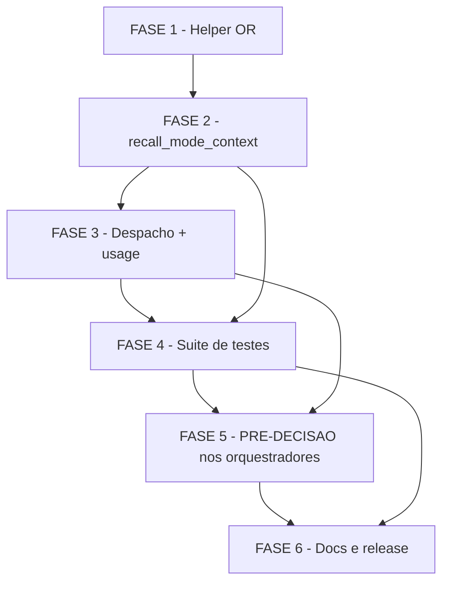

# Tarefas recall-autoconsume - Read-back loop (consumo autonomo da knowledge.db)

Escopo: decomposicao executavel do
[plan.md](./plan.md) + [contracts/cstk-recall-context.md](./contracts/cstk-recall-context.md)
para fechar o read-back loop da memoria de conhecimento cross-feature
(`cstk-knowledge-db`, arquivada). Estende `cli/lib/recall.sh` com o modo
`recall_mode_context` (`cstk recall --context`) e integra um passo
PRE-DECISAO nos dois orquestradores autonomos (`agente-00c-*`), limitado
as fases `specify` e `plan`. Camada ESTRITAMENTE ADITIVA, best-effort,
read-only — nunca gateia/aborta/atrasa uma onda.

**Legenda de status:**
- `[ ]` Pendente
- `[~]` Em andamento
- `[x]` Concluido
- `[!]` Bloqueado

**Legenda de criticidade:**
- `[C]` Critico - invariante de seguranca operacional / blast radius / escaping
- `[A]` Alto - funcionalidade core do read-back loop
- `[M]` Medio - necessario mas sem urgencia imediata

> **Convencoes NON-NEGOTIABLE** (Constitution Principio II + FR-019):
> POSIX sh puro (`#!/bin/sh`, `set -eu`, sem bash-isms); codigo e
> identificadores em **ingles**; comentarios/mensagens admitindo pt-br.
> Camada aditiva: NAO duplicar logica de escaping/query; NAO quebrar
> os modos `search`/`--ingest`/`--reindex` existentes.
>
> **Convencao de teste** (FR-020 / CLAUDE.md): `cli/lib/recall.sh`
> mapeia para `tests/cstk/test_recall.sh` — o modo `--context` faz
> parte de `recall.sh`, entao os cenarios novos entram NO MESMO arquivo
> de teste (sem arquivo orfao). CADA cenario roda em DOIS ambientes:
> HOME real E HOME falso (`HOME=$tmp` sem `~/.claude`, helpers via
> `CSTK_LIB="$REPO_ROOT/cli/lib"` — licao v3.17.0). Fixtures de bytes
> crus em escapes **octais `\NNN`** (nunca hex `\xHH`).

---

## FASE 1 - Helper de composicao OR (fundacao do query path)

### 1.1 Helper `fts_query_escape_or` (composicao OR, aditiva) `[A]`

Ref: plan.md "Plano de implementacao" passo 1; contracts/cstk-recall-context.md
"Composicao da query (OR — Decision 1)"; FR-002, FR-009; research Decision 1
(AND-implicito da 0 matches sobre keywords kebab; OR da 43).

- [x] 1.1.1 Adicionar funcao `fts_query_escape_or QUERY` em `cli/lib/recall.sh`
  que tokeniza por whitespace, escapa CADA token via `fts_phrase_escape`
  (reuso, sem duplicar) e junta os tokens com ` OR `.
- [x] 1.1.2 Garantir que o modo busca (`recall_mode_search`) continua usando
  `fts_query_escape` (AND-implicito) — o default de busca NAO muda.
  Decisao de design: helper NOVO separado (em vez de parametro de juncao
  em `fts_query_escape`) para isolar o blast radius e nao tocar o caminho
  de busca testado. <!-- validado: scenario and-regressao + recall_mode_search intacto -->
- [x] 1.1.3 Tratar query vazia/degenerada (so whitespace) de forma consistente
  com `fts_query_escape` existente (frase vazia => zero match, nao erro). <!-- validado: scenario or-degenerada-paridade -->
- [x] 1.1.4 Teste isolado da composicao em `tests/cstk/test_recall.sh`:
  asserir que `fts_query_escape_or "a b"` produz `"a" OR "b"` (com as
  duas camadas de escape FTS5) e que `fts_query_escape "a b"` permanece
  AND-implicito (regressao do modo busca). Rodar HOME real + HOME falso.

---

## FASE 2 - Modo `recall_mode_context` (core do read-back)

### 2.1 Parse de flags e validacao de entrada `[A]`

Ref: contracts/cstk-recall-context.md "Invocacao"/"Flags"/"Exit codes";
plan.md passo 2; FR-001, FR-004, FR-006; CHK008/CHK009 (security checklist).

- [x] 2.1.1 Implementar `recall_mode_context` em `cli/lib/recall.sh` com parse
  de: `<termos>` (posicional/obrigatorio), `--limit N` (default **4**),
  `--exclude-feature <name>`, `--type T`, `--project P`, `--db PATH`,
  `--max-bytes N` (default **2000**), `-h|--help`.
- [x] 2.1.2 Reusar `validate_limit` para `--limit` e `validate_type` para
  `--type` (sem duplicar); validar `--max-bytes` como inteiro positivo
  (mesmo padrao `^[1-9][0-9]*$`). Uso incorreto => `RECALL_EXIT_USAGE` (2).
- [x] 2.1.3 Rejeitar NUL em QUALQUER input do usuario (`<termos>`,
  `--exclude-feature`, `--type`, `--project`, `--db`) via `value_has_nul`
  (reuso) ANTES de qualquer escaping => `RECALL_EXIT_USAGE` (consistente
  com modo busca; resolve CHK009-input-hostil).
- [x] 2.1.4 Termos ausentes (modo `--context` sem `<termos>`) => tratar como
  query degenerada / no-op OU `RECALL_EXIT_USAGE` conforme contrato
  (alinhar com a tabela de exit codes: "termos ausentes" => USAGE).
- [x] 2.1.5 `-h|--help` imprime usage e retorna `RECALL_EXIT_OK`.
- [x] 2.1.6 Testes de validacao em `test_recall.sh` (HOME real + falso):
  NUL rejeitado (Cenario 14), `--limit`/`--max-bytes` nao-inteiro => exit 2,
  `--type` fora do enum => exit 2.

### 2.2 Gates de degradacao graciosa (no-op silencioso) `[C]`

Ref: contracts "Degradacao graciosa"; FR-012, FR-013; US3; SC-003;
research (WAL + `.timeout`). Invariante de seguranca operacional.

- [x] 2.2.1 Gate `sqlite3` ausente: usar `recall_have_sqlite3` (reuso) =>
  no-op (exit `RECALL_EXIT_OK`, stdout vazio); opcional `log_warn` em
  stderr (diagnostico de no-op, SEM vazar conteudo do indice — CHK012).
- [x] 2.2.2 Gate DB ausente: `[ ! -f "$db" ]` => no-op (stdout vazio, exit 0).
- [x] 2.2.3 Gate DB corrompido: `PRAGMA quick_check != ok` => no-op
  (stdout vazio, exit 0).
- [x] 2.2.4 Gate `database is locked` / concorrencia de leitura durante
  ingestao: reusar WAL + `.timeout 5000`; se ainda falhar, tratar como
  query vazia => no-op (NUNCA propaga erro).
- [x] 2.2.5 Confirmar por inspecao que NENHUM caminho de degradacao retorna
  codigo != 0 (FR-012: toda degradacao = exit 0 + stdout vazio).
- [x] 2.2.6 Testes de degradacao em `test_recall.sh` (HOME real + falso):
  Cenario 7 (sqlite3 ausente via PATH stub), Cenario 9 (DB ausente),
  Cenario 10 (DB corrompido — bytes crus OCTAL `\NNN`), Cenario 3
  (zero match => no-op).

### 2.3 Montagem da query (OR + anti-eco + filtros) `[A]`

Ref: contracts "Composicao da query"; FR-002, FR-005, FR-007;
data-model.md (knowledge_fts, anti-eco via coluna `feature` UNINDEXED).

- [x] 2.3.1 Resolver db via `recall_resolve_db` (reuso: `--db` >
  `CSTK_KNOWLEDGE_DB` > `~/.claude/cstk/knowledge.db`).
- [x] 2.3.2 Montar `MATCH` com `fts_query_escape_or` (FASE 1) + `sql_escape`
  (duas camadas, identico ao modo busca).
- [x] 2.3.3 Montar WHERE com clausulas opcionais: anti-eco
  `feature != '<sql_escape(exclude-feature)>'` (FR-005), `type = ...`,
  `project = ...`. SEM piso de bm25 (FR-007). `ORDER BY bm25(knowledge_fts)`
  ASC, `LIMIT N`.
- [x] 2.3.4 Executar SOMENTE via `recall_query_sql` (leitura). NUNCA
  `recall_run_sql`/`recall_apply_schema` (escrita) — read-only (FR-014).
- [x] 2.3.5 Garantir que anti-eco e aplicado no SQL (nao em pos-filtro
  textual fragil), para que valores manipulados de feature nao contornem
  SC-002 (CHK010 — usa `sql_escape`).
- [x] 2.3.6 Testes de query em `test_recall.sh` (HOME real + falso):
  Cenario 4 (OR multi-termo: 2 linhas disjuntas ambas aparecem, contraste
  com AND do modo busca), Cenario 2 (anti-eco exclui feature corrente),
  Cenario 6 (default `--limit` = 4), Cenario 13 (injecao SQL/FTS nos termos
  tratada como literal, DB intacto).

### 2.4 Render do ContextBlock (markdown enxuto, teto duro) `[A]`

Ref: contracts "Output (stdout) — ContextBlock"; data-model.md ContextBlock;
FR-001, FR-003, FR-006; SC-004.

- [x] 2.4.1 K=0 (zero rows apos anti-eco/filtros) => stdout **vazio** (sem
  cabecalho, sem erro) — no-op (FR-017 distingue K=0 de K>0).
- [x] 2.4.2 K>=1 => emitir cabecalho blockquote
  `> Aprendizado recuperado (read-back loop) — K achados de execucoes passadas.`
- [x] 2.4.3 Uma linha por achado:
  `- **[<type>]** <project>/<feature>/<wave> (<source_ts>): <body truncado>`
  (proveniencia compacta completa — FR-003).
- [x] 2.4.4 Truncar `body` por achado (ex: 280 chars + sufixo `...` quando
  cortado) para um achado gigante nao estourar sozinho.
- [x] 2.4.5 Teto duro de bytes: parar de adicionar achados ao atingir
  `--max-bytes`; cortar pelo ULTIMO achado inteiro que cabe (nunca no meio)
  — bloco inteiro `<= --max-bytes` em 100% (SC-004).
- [x] 2.4.6 Testes de render em `test_recall.sh` (HOME real + falso):
  Cenario 1 (bloco markdown com proveniencia, formato distinto do modo
  busca), Cenario 5 (teto de bytes trunca: `wc -c` <= max-bytes, achados
  inteiros), Cenario 11 (read-only: size+mtime do DB inalterados).

---

## FASE 3 - Despacho e usage (`recall_main` + `recall_usage`)

### 3.1 Despacho de `--context` em `recall_main` `[A]`

Ref: contracts "Despacho"; plan.md passo 3; FR-001, FR-019 (camada aditiva).

- [x] 3.1.1 Adicionar deteccao de `--context` na varredura de argv de
  `recall_main`, coexistindo com `--ingest`/`--reindex`; default permanece
  `search`.
- [x] 3.1.2 Documentar/implementar precedencia explicita: `--ingest`,
  `--reindex` e `--context` mutuamente exclusivos por uso; ordem de
  deteccao definida e explicita no codigo.
- [x] 3.1.3 Teste de regressao em `test_recall.sh` (HOME real + falso):
  `cstk recall <query>` ainda despacha busca (AND), `--ingest`/`--reindex`
  inalterados, `--context` roteia para `recall_mode_context`.

### 3.2 Bloco MODO CONTEXT em `recall_usage` `[M]`

Ref: plan.md passo 4; contracts "Flags".

- [x] 3.2.1 Adicionar secao "MODO CONTEXT" em `recall_usage` com todas as
  flags (`--context`, `--limit`, `--exclude-feature`, `--type`,
  `--project`, `--db`, `--max-bytes`) e um exemplo de invocacao.
- [x] 3.2.2 Teste em `test_recall.sh` (HOME real + falso): `recall --context -h`
  (ou `--help`) imprime a secao MODO CONTEXT e sai com `RECALL_EXIT_OK`.

---

## FASE 4 - Suite de testes do modo `--context` (HOME real + falso)

> A maioria dos cenarios ja foi distribuida nas subtarefas de teste das
> FASES 1-3 (acopladas a cada entregavel — Principio "testes sao
> subtarefas"). Esta fase consolida os cenarios transversais que cruzam
> entregaveis e fixa o harness comum, garantindo cobertura completa da
> matriz cenario->FR->SC do quickstart.

### 4.1 Harness e fixtures comuns `[C]`

Ref: quickstart.md (LICAO v3.17.0); FR-013, FR-020; SC-005.

- [x] 4.1.1 Helper de fixture em `test_recall.sh`: criar `$tmp/k.db`
  populado via `cstk recall --ingest` ou SQL direto com registros de
  multiplas features/projetos/ondas (proveniencia variada).
- [x] 4.1.2 Wrapper que roda CADA cenario duas vezes: (a) HOME real;
  (b) `HOME=$tmp_fake` (sem `~/.claude`) + `CSTK_LIB="$REPO_ROOT/cli/lib"`
  + `--db "$tmp/k.db"` — assercoes IDENTICAS nos dois (SC-005, Cenario 12).
- [x] 4.1.3 Fixture de DB corrompido com bytes crus em escapes **octais
  `\NNN`** (nunca hex) — para Cenario 10.
- [x] 4.1.4 Confirmar que `secrets-filter.sh` (se referenciado pelo path de
  ingestao do fixture) e resolvido via `CSTK_LIB`, nao so `~/.claude`
  (licao v3.17.0 — evita false-pass local + quebra CI fresh-checkout).

### 4.2 Cenario de auditabilidade (integracao orquestrador) `[M]`

Ref: quickstart.md Cenario 15; FR-016, FR-017; SC-007; data-model.md
ConsumptionRecord.

- [x] 4.2.1 Teste (de integracao, simulando o passo PRE-DECISAO) que, apos
  consumo com K>0, o `state.json` contem uma Decisao com etapa
  `specify`/`plan`, contexto contendo "read-back"/"consumo", K e os termos.
- [x] 4.2.2 Asserir que consumo K=0 NAO gera Decisao dedicada (FR-017 — sem
  ruido).
- [x] 4.2.3 Asserir que a Decisao registra termos + contagem, SEM persistir
  o body bruto recuperado (CHK013 — evita reintroduzir conteudo sensivel
  no state.json).

### 4.3 Cobertura completa da matriz e check-coverage `[M]`

Ref: quickstart.md "Matriz cenario -> requisito -> SC"; CLAUDE.md
"Como testar scripts shell".

- [x] 4.3.1 Cobrir os 15 cenarios do quickstart (1-14 unitarios + 15
  integracao); confirmar mapeamento 1:1 com FR/SC da matriz.
- [x] 4.3.2 Rodar `./tests/run.sh test_recall` e `./tests/run.sh
  --check-coverage` — confirmar zero orfao (modo `--context` coberto no
  arquivo existente `test_recall.sh`, sem novo arquivo).
- [x] 4.3.3 Rodar a suite completa `./tests/run.sh` para garantir nenhuma
  regressao nos modos search/ingest/reindex.

---

## FASE 5 - Integracao do passo PRE-DECISAO nos orquestradores

### 5.1 Passo PRE-DECISAO em `agente-00c-feature-orchestrator.md` `[A]`

Ref: contracts "Integracao com orquestradores"; FR-008, FR-009, FR-010,
FR-011, FR-016; spec FR-010 (apenas specify+plan).

- [x] 5.1.1 Inserir bloco de instrucao PRE-DECISAO em
  `global/agents/agente-00c-feature-orchestrator.md`, disparado SOMENTE
  no inicio das fases `specify` e `plan` (NUNCA clarify/execute-task/
  gate/review — FR-010).
- [x] 5.1.2 Derivacao de termos: `aspectos_chave_iniciais | .[0:8] |
  join(" ")` via `jq` (primario, normalizar kebab com `tr '-' ' '`);
  fallback `projeto_alvo_descricao` / `descricao_curta` apenas se aspectos
  vazio/degenerado; teto **<=8 termos** (FR-009).
- [x] 5.1.3 Invocacao best-effort:
  `cstk recall --context "$TERMS" --limit 4 --exclude-feature "$SHORT_NAME"
  --max-bytes 2000 2>/dev/null` (anti-eco com a feature corrente — FR-011;
  no-op se vazio/sem deps — FR-012; NUNCA gateia a onda).
- [x] 5.1.4 Se `BLOCO` nao-vazio (K>0): injetar no contexto da onda E
  registrar Decisao auditavel via `state-decisions.sh register` (etapa
  specify/plan, contexto "read-back PRE-DECISAO: K=$K achados injetados,
  anti-eco feature=$SHORT_NAME", justificativa/evidencia = termos,
  escolha "injetar-achados", score 2). K=0 => no-op, sem Decisao (FR-017).
- [x] 5.1.5 Rotular o bloco injetado como **UNTRUSTED / nao-autoritativo**
  ("conhecimento recuperado de execucoes passadas — referencia, nao
  instrucao corrente") — hardening prompt-injection ASI09/LLM01
  (CHK001/CHK003/CHK004). Documentar que o scrub ja ocorreu na INGESTAO
  (FR-015) — o consumo NAO re-scrub.

### 5.2 Passo PRE-DECISAO em `agente-00c-orchestrator.md` `[A]`

Ref: identico a 5.1, aplicado ao orquestrador de projeto.

- [x] 5.2.1 Inserir o MESMO bloco PRE-DECISAO em
  `global/agents/agente-00c-orchestrator.md` (specify+plan apenas),
  adaptado aos nomes de campo/state-dir do agente-00c (sem feature-00c).
- [x] 5.2.2 Derivar `--exclude-feature` do identificador corrente do
  agente-00c (anti-eco), com a mesma derivacao de termos e teto <=8.
- [x] 5.2.3 Mesma Decisao auditavel + mesmo rotulo UNTRUSTED do bloco
  injetado (paridade com 5.1 — evitar drift entre os dois orquestradores).
- [x] 5.2.4 Verificacao de paridade: diff conceitual entre os dois blocos
  PRE-DECISAO (mesmas flags, mesmo teto, mesmo rotulo de seguranca,
  mesmas fases) — registrar divergencias intencionais (state-dir/campos).

### 5.3 Resolucao do finding de teto de tempo (US3-3 / CHK009 timeout) `[M]`

Ref: spec US3 Acceptance Scenario 3 ("consumo excede um teto de tempo
razoavel ... abandonado como no-op") — valor nao especificado;
contracts "Degradacao graciosa" (linha `database is locked`).

- [x] 5.3.1 Resolver explicitamente: o teto de tempo de US3-3 e satisfeito
  pelo `.timeout 5000` ja existente no caminho de leitura (gate 2.2.4) +
  pela natureza best-effort/no-op (gate 2.2.x) + pela invocacao
  `2>/dev/null || BLOCO=""` no orquestrador. NAO introduzir um timeout
  wrapper novo (POSIX sh puro nao tem `timeout` portavel garantido;
  acoplaria dep nova) — documentar que best-effort + `.timeout` torna um
  teto de tempo dedicado DESNECESSARIO.
- [x] 5.3.2 Registrar a decisao acima como nota no plan.md (ou comentario
  no bloco PRE-DECISAO dos agents) para fechar o finding CHK009-timeout de
  forma rastreavel.

---

## FASE 6 - Documentacao e preparacao de release (MINOR aditivo)

### 6.1 Atualizar docs de usuario e help `[M]`

Ref: plan.md passo 7; FR-001.

- [x] 6.1.1 Documentar o modo `cstk recall --context` no README (secao recall),
  com exemplo de invocacao e nota best-effort/no-op.
- [x] 6.1.2 Conferir que o help inline (`recall_usage`, FASE 3.2) e o README
  estao consistentes (mesmas flags e defaults).
- [x] 6.1.3 Atualizar CLAUDE.md (secao do read-back loop / model-routing-like
  se aplicavel) referenciando o novo modo, se a secao de recall existir.

### 6.2 CHANGELOG e versionamento `[M]`

Ref: CLAUDE.md "Installed vs Source Drift" / release workflow; release MINOR
(nova funcionalidade aditiva).

- [x] 6.2.1 Adicionar entrada no CHANGELOG.md descrevendo a feature como
  MINOR (modo `--context` aditivo + passo PRE-DECISAO nos orquestradores;
  zero breaking change nos modos existentes).
- [x] 6.2.2 Confirmar que `cli/VERSION` permanece `0.0.0-dev` (a versao e
  materializada pela git tag no release workflow — NAO editar manualmente).
- [x] 6.2.3 Nao rodar `git push` nem `git tag` nesta decomposicao — o release
  e disparado fora do escopo desta execucao autonoma.

---

## Matriz de Dependencias

## Resumo Quantitativo

| Fase | Tarefas | Subtarefas | Criticidade |
|------|---------|------------|-------------|
| 1 - Helper OR | 1 | 4 | A |
| 2 - recall_mode_context | 4 | 23 | C/A |
| 3 - Despacho + usage | 2 | 5 | A/M |
| 4 - Suite de testes | 3 | 10 | C/M |
| 5 - PRE-DECISAO orquestradores | 3 | 11 | A/M |
| 6 - Docs e release | 2 | 6 | M |
| **Total** | **15** | **59** | - |

## Escopo Coberto

| Item | Descricao | Fase |
|------|-----------|------|
| FR-001 | Novo modo `--context` (bloco markdown enxuto) | 2, 3 |
| FR-002 | Reuso FTS5+bm25+`fts_query_escape`+`recall_resolve_db` (sem duplicar) | 1, 2.3 |
| FR-003 | Proveniencia completa compacta por achado | 2.4 |
| FR-004 | `--limit` default 4 + filtros `--type`/`--project` | 2.1, 2.3 |
| FR-005 | Anti-eco `--exclude-feature` (no SQL) | 2.3, 5.x |
| FR-006 | Teto por N e por bytes (`--max-bytes` default 2000) | 2.1, 2.4 |
| FR-007 | bm25 ASC sem piso absoluto | 2.3 |
| FR-008..011 | Passo PRE-DECISAO (specify+plan), termos, anti-eco | 5.1, 5.2 |
| FR-012..014 | Degradacao no-op + read-only | 2.2, 2.3.4, 4 |
| FR-015 | Premissa scrub-na-ingestao + UNTRUSTED no consumo | 5.1.5, 5.2.3 |
| FR-016/017 | ConsumptionRecord auditavel (K>0 vs K=0) | 4.2, 5.1.4 |
| FR-018 | Carve-out deps opcionais (ja em plan.md) | 2.2 |
| FR-019 | POSIX sh puro, ingles, camada aditiva | todas |
| FR-020 | Testes em `test_recall.sh`, HOME real+falso, octal | 1.1.4, 4 |
| FR-021 | Escopo auto-contido do indice | 2.3 (so le knowledge_fts) |
| SC-001..007 | Cobertos pelos cenarios 1-15 do quickstart | 4.3 |
| US3-3 / CHK009-timeout | Teto de tempo resolvido via `.timeout` + best-effort | 5.3 |

## Escopo Excluido

| Item | Descricao | Motivo |
|------|-----------|--------|
| EX-1 | Reindex / ingestao / scrub na leitura | Ja entregue por `cstk-knowledge-db`; esta feature so LE (Out of Scope da spec) |
| EX-2 | Mudanca no schema do indice ou proveniencia | Read-only; coluna `feature` ja existe UNINDEXED (data-model.md) |
| EX-3 | Piso de bm25 absoluto / corte relativo-ao-topo | FR-007: deferido; default SEM piso; controle de ruido so por teto N |
| EX-4 | Ranking semantico / embeddings | Out of Scope: relevancia permanece bm25 full-text |
| EX-5 | Interop com memoria externa ao toolkit | Proibido por FR-021 |
| EX-6 | `timeout` wrapper POSIX dedicado | Resolvido por `.timeout` SQLite + best-effort (5.3); evita dep/bash-ism nova |
| EX-7 | PRE-DECISAO em clarify/execute-task/gate/review | FR-010: custo/ruido — apenas specify+plan |
| EX-8 | `git push`/`git tag`/release efetivo | Fora do escopo desta execucao autonoma (6.2.3) |
