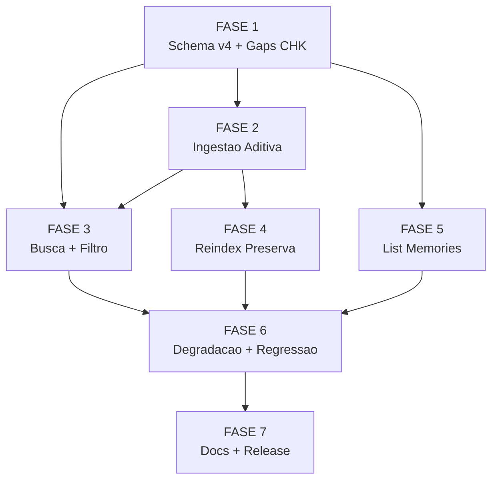

# Backlog de Tarefas: Recall Memory Mirror

**Feature**: `recall-memory-mirror`
**Spec**: [spec.md](./spec.md) | **Plan**: [plan.md](./plan.md)
**Criado**: 2026-05-27
**Pipeline SDD**: specify → clarify → plan → checklist → **create-tasks** → execute-task → review-task

## Legendas

| Status | Significado |
|--------|-------------|
| `[ ]` | Pendente |
| `[x]` | Concluido |
| `[-]` | Cancelado / fora de escopo |

| Criticidade | Criterio |
|-------------|----------|
| `[C]` | Critico — impacto de seguranca, dados ou invariante arquitetural |
| `[A]` | Alto — funcionalidade core sem a qual a feature nao opera |
| `[M]` | Medio — complementar; pode ser adiado sem quebrar o core |

---

## FASE 1 — Schema v4 e Requisitos de Contrato

> Fundacao da feature: bump de schema, enum extendido e resolucao dos gaps
> abertos do checklist. Nenhuma logica de ingestao ainda — so estrutura e contratos.
> Prerequisito de todas as fases seguintes.

### 1.1 Bump do schema v3→v4 em `recall.sh` `[A]`

Ref: spec FR-001/FR-002/FR-003; data-model.md §Schema; plan.md §Faseamento 1;
quickstart M1 (criacao da tabela), M4-negativo (enum invalido).

- [x] 1.1.1 Incrementar `RECALL_SCHEMA_VERSION` de `3` para `4` em `cli/lib/recall.sh`
- [x] 1.1.2 Extender `RECALL_TYPE_ENUM` adicionando `memory` ao final da string (FR-012)
- [x] 1.1.3 Adicionar DDL `CREATE TABLE IF NOT EXISTS memories (...)` em `recall_schema_ddl` com chave primaria `(project, slug)` conforme data-model.md §Schema
- [x] 1.1.4 Adicionar upsert FTS ao schema DDL: `DELETE FROM knowledge_fts WHERE type='memory' AND project=? AND source_id=?` + `INSERT INTO knowledge_fts(body,type,project,feature,wave,source_id,source_ts)` para espelhar `memories` na busca unificada (FR-002; data-model.md §Relacao com knowledge_fts)
- [x] 1.1.5 Verificar que `recall_apply_schema` (migração idempotente) propaga o novo DDL sem perda em banco v3 existente (FR-003)
- [x] 1.1.6 Testar M1: após ingest com fixture, `sqlite3 .tables` lista `memories`; `SELECT value FROM schema_meta WHERE key='schema_version'` retorna `4`
- [x] 1.1.7 Testar M4-negativo: `cstk recall "termo" --type invalido` retorna exit 2 com mensagem contendo `decision|bloqueio|retro|skill|memory`

### 1.2 Resolucao de gaps de checklist `[M]`

Ref: checklists/security.md CHK020; checklists/performance.md CHK025, CHK026.
Gaps identificados pelo checklist — tarefa de doc que fecha o loop checklist→backlog.

- [x] 1.2.1 Registrar decisao auditavel em `spec.md` §Constraints ou `research.md` confirmando que ausencia de auth no `knowledge.db` local e decisao consciente de escopo (single-user dev local) — fecha CHK020 `{humano}`
- [x] 1.2.2 Registrar decisao no mesmo documento confirmando que SLA de duracao do `--reindex` nao e requisito (ferramenta dev local; "trivial" e suficiente) — fecha CHK025 `{humano}`
- [x] 1.2.3 Registrar decisao confirmando que `body_scrubbed` sem ceiling e aceito (FTS5 SQLite nao tem limite pratico para o escopo; `.md` reais tipicamente < 100 KB) — fecha CHK026 `{humano}` [Gap]

---

## FASE 2 — Ingestao Aditiva (`recall_ingest_memories`)

> Nucleo da feature: funcoes de ingestao que transformam `.md` em entradas
> da tabela `memories`. Aditivo ao `recall_mode_ingest` existente — zero
> breaking change de surface CLI.

### 2.1 Helper de derivacao e scrub de `.md` `[A]`

Ref: spec FR-004/FR-005/FR-007; data-model.md §Derivacao de `type`/`description`;
plan.md §Faseamento 2; quickstart M2, M8, M10.

- [x] 2.1.1 Implementar helper de forward-encoding: `printf '%s' "$path" | sed 's|^/||; s|[/_]|-|g; s|^|-|'` para derivar `<encoded-path>` a partir de `projeto_alvo_path` (spec CQ1; data-model.md §Derivacao)
- [x] 2.1.2 Implementar derivacao de `type` via `case "$_basename" in MEMORY.md) index;; feedback_*) feedback;; project_*) project;; reference_*) reference;; *) user;; esac` (FR-007)
- [x] 2.1.3 Implementar derivacao de `description`: primeira linha nao-vazia do `.md` apos strip de `#`/whitespace, passada por `recall_scrub`; fallback = `slug | tr '_-' '  '` (data-model.md §Derivacao de description)
- [x] 2.1.4 Garantir que `strip_nul` (padrao existente) seja aplicado antes de `recall_scrub` no pipeline de cada `.md` (plan.md §Riscos — NUL/bytes de controle)
- [x] 2.1.5 Testar M8: fixture com pattern de secret; apos ingest `body_scrubbed` NAO contem o secret; arquivo `.md` original intacto (hash identico antes/depois)
- [x] 2.1.6 Testar M10: `.md` vazio (0 bytes) cria entrada com `body_scrubbed=''`; exit 0; sem stderr de erro

### 2.2 Funcao `recall_ingest_memories` `[A]`

Ref: spec FR-004/FR-005/FR-006/CQ2; contracts/cstk-recall-memories.md §Cmd 3;
quickstart M2, M6, M7, M16, M17.

- [x] 2.2.1 Implementar `recall_ingest_memories STATE_DIR DB`: le `projeto_alvo_path` do `state.json` via jq, calcula `encoded-path` com helper 2.1.1, deriva `project` = `basename(projeto_alvo_path)`, monta caminho `~/.claude/projects/<encoded>/memory/`
- [x] 2.2.2 Varrer `*.md` no diretorio de memoria com `find "$_memdir" -maxdepth 1 -type f -name '*.md' 2>/dev/null || :`; tratar diretorio inexistente como no-op (Edge Case spec + M17)
- [x] 2.2.3 Para cada `.md`: derivar `slug` (`basename` sem `.md`), `type`, `description`, `body_scrubbed` (via helpers 2.1.x); gravar timestamp `indexed_at` = `date -u +%Y-%m-%dT%H:%M:%SZ`
- [x] 2.2.4 Implementar upsert idempotente em `memories`: `INSERT OR REPLACE INTO memories(project,slug,type,description,body_scrubbed,path,indexed_at) VALUES(...)` por chave `(project, slug)` (FR-006)
- [x] 2.2.5 Implementar upsert FTS correspondente: DELETE+INSERT em `knowledge_fts` com `type='memory'`, `feature='memory'`, `wave='-'`, `source_id=slug` (data-model.md §Relacao com knowledge_fts)
- [x] 2.2.6 Acumular contador `RECALL_TOTAL_MEMORY` para a linha de status de saida (spec CQ2; contracts §Cmd 3 Output)
- [x] 2.2.7 Testar M2: fixture com 3 `.md` (MEMORY.md, feedback_foo.md, project_bar.md); apos ingest `SELECT count(*) FROM memories` = 3; tipos corretos (`index`, `feedback`, `project`); `project` = `basename(projeto_alvo_path)`
- [x] 2.2.8 Testar M6: ingest 2x sobre 3 `.md`; `count(*) FROM memories` = 3 (sem duplicatas); `knowledge_fts WHERE type='memory'` tambem = 3
- [x] 2.2.9 Testar M7: ingest com `feedback_x.md` body "v1"; reescrever `.md` para "v2"; re-ingest; `body_scrubbed` = "v2"; still 1 linha
- [x] 2.2.10 Testar M17: HOME tmp sem `~/.claude/projects/`; ingest; telemetria ingerida; 0 memories; exit 0

### 2.3 Hook aditivo em `recall_mode_ingest` `[A]`

Ref: spec CQ2; contracts §Cmd 3 §Fluxo interno; quickstart M16.

- [x] 2.3.1 Chamar `recall_ingest_memories "$_ing_state_dir" "$_ing_db"` ao final de `recall_mode_ingest`, apos `recall_ingest_state_json` (passo aditivo — CQ2)
- [x] 2.3.2 Inicializar `RECALL_TOTAL_MEMORY=0` junto aos demais contadores no inicio de `recall_mode_ingest`
- [x] 2.3.3 Extender a linha de status `printf 'ingested: ...'` com `, %d memories` ao final (CQ2; contracts §Cmd 3 Output)
- [x] 2.3.4 Testar M16: fixture com 2 `.md`; stdout do ingest termina com `, 2 memories`; campos existentes (decisions, ..., events) inalterados em ordem e valor

---

## FASE 3 — Busca e Filtro (`--type memory`)

> Validar que a busca unificada e o filtro `--type memory` funcionam via
> FTS5. Em grande parte ja funciona pelo design (FTS unificada + enum extendido);
> esta fase valida e fecha os gaps.

### 3.1 Validacao da busca unificada com memorias `[A]`

Ref: spec FR-011/FR-012/SC-001; contracts §Cmd 1; quickstart M3, M4, M5.

- [x] 3.1.1 Verificar que `validate_type` (funcao existente) aceita `memory` apos bump do enum em 1.1.2 (FR-012; contracts §Cmd 2)
- [x] 3.1.2 Verificar que `recall_mode_search` nao precisa de mudanca (FTS unificada ja retorna `type='memory'` por design); adicionar comentario no codigo documentando a heranca
- [x] 3.1.3 Testar M3: DB com memorias de 2 projetos (`projA`, `projB`) contendo termo "install"; `cstk recall "install"` retorna linhas `[memory]` de ambos com proveniencia visivel (project, slug, tipo)
- [x] 3.1.4 Testar M4: DB com memorias e decisions com termo "lock"; `cstk recall "lock" --type memory` retorna so linhas `[memory]`; nenhuma `[decision]`; M4-negativo ja coberto em 1.1.7
- [x] 3.1.5 Testar M5: DB com memorias de `projA` e `projB`; `cstk recall "termo" --project projA --type memory` retorna so memorias de `projA`

---

## FASE 4 — Reindex Preserva Memorias

> Garantia de resiliencia: `--reindex` reconstroi `memories` dos `.md`
> (NUNCA do state.json — invariante C-004). Inclui `recall_ingest_memories_dir`
> para reverse-derivation no reindex.

### 4.1 Funcao `recall_ingest_memories_dir` `[A]`

Ref: spec FR-009/FR-010/C-004; data-model.md §Reverse-derivation; quickstart M11-M13;
plan.md §Riscos (gotcha `find || :`).

- [x] 4.1.1 Implementar `recall_ingest_memories_dir ENCODED_PATH DB`: deriva `project` = `basename` do segmento final do encoded-path (reverse-derivation); documenta limitacao CQ1 em comentario inline
- [x] 4.1.2 Reutilizar `recall_ingest_memories` (ou helper compartilhado de baixo nivel) para scrub; garantir que scrub seja aplicado no reindex (spec FR-009; checklists/security.md CHK019)
- [x] 4.1.3 Adicionar varredura de `~/.claude/projects/*/memory/*.md` em `recall_mode_reindex`, apos o loop de state.json existente; usar `find ... 2>/dev/null || :` (gotcha plan.md §Riscos + CHK022)
- [x] 4.1.4 Acumular `RECALL_TOTAL_MEMORY` no reindex; extender a linha `printf 'reindexed: ...'` com `, %d memories` (contracts §Cmd 4 Output)
- [x] 4.1.5 Testar M11: DB populado com N memorias; apagar DB; `--reindex`; `count(*) FROM memories` = N; conteudo (scrubbed) identico (SC-002)
- [x] 4.1.6 Testar M12: DB com memorias + state.json telemetria; reindex; verificar `SELECT DISTINCT` que nenhuma entrada de `memories` veio do state.json (C-003/C-004)
- [x] 4.1.7 Testar M13: root de reindex com projeto que tem state.json mas sem `memory/`; exit 0; 0 memories para esse projeto; telemetria ingerida normalmente

---

## FASE 5 — List Memories (`--list-memories`)

> Comando complementar de auditoria: lista slug + description sem body.
> Modo proprio (SELECT direto, sem FTS). Menor prioridade — US4 (P4).

### 5.1 Modo `recall_mode_list_memories` `[M]`

Ref: spec FR-013/US4; contracts §Cmd 5; research.md Decision 9; quickstart M14, M15.

- [x] 5.1.1 Implementar `recall_mode_list_memories`: parsear flags `--project`, `--db`; rejeitar combinacoes invalidas com exit 2 (contracts §Cmd 5 exit codes)
- [x] 5.1.2 Executar `SELECT project, type, slug, description FROM memories` (com filtro `WHERE project = ?` se `--project` passado), ordenado por `slug`; imprimir formato `<project> / <type> / <slug> — <description>` (contracts §Cmd 5 Output)
- [x] 5.1.3 Tratar sqlite3 ausente com degradacao graciosa: exit 0, aviso stderr (FR-008)
- [x] 5.1.4 Adicionar `--list-memories` ao detector de modo em `recall_main` (case `_mode`) e ao dispatch `case "$_mode" in list-memories)` (contracts §Cmd 5)
- [x] 5.1.5 Atualizar `recall_usage` com linha `cstk recall --list-memories [--project P] [--db PATH]` e nota sobre `--type memory` (contracts §Help/usage; CHK009)
- [x] 5.1.6 Testar M14: DB com 5 memorias de `myproject`; `--list-memories --project myproject`; 5 linhas com slug + description; nenhuma contem body completo
- [x] 5.1.7 Testar M15: DB sem memorias do projeto consultado; stdout vazio; exit 0

---

## FASE 6 — Degradacao Graciosa e Regressao

> Validacao transversal: todos os novos caminhos de codigo degradam
> graciosamente quando deps estao ausentes, e os ~72 cenarios pre-existentes
> continuam verdes.

### 6.1 Cobertura de degradacao e regressao completa `[C]`

Ref: spec FR-008/SC-004/SC-005; quickstart M9, M18; MEMORY.md feedback_test_path_stub_cannot_hide_usrbin.

- [x] 6.1.1 Testar M9: PATH-stub desacoplado escondendo sqlite3 do SUT (nao de /usr/bin — MEMORY.md feedback_test_path_stub); ingest + busca + list-memories com sqlite3 ausente retornam exit 0; aviso em stderr; nenhuma escrita; nenhum aborto
- [x] 6.1.2 Verificar que todos os novos modos (ingest memories, reindex memories, list-memories, busca com `--type memory`) passam pelas guardas de deps existentes (sqlite3/jq/secrets-filter) sem codigo duplicado
- [x] 6.1.3 Testar M18: rodar `./tests/run.sh test_recall`; todos os ~72 cenarios pre-existentes + M1-M17 novos verdes; zero regressao (SC-005)
- [x] 6.1.4 Rodar `./tests/run.sh --check-coverage`; confirmar que `recall.sh` continua com `test_recall.sh` 1:1 (convencao do projeto — CLAUDE.md §Como testar scripts shell)
- [x] 6.1.5 Rodar suite completa `./tests/run.sh` para confirmar zero regressao cross-feature (SC-005)

---

## FASE 7 — Documentacao e Release

> Atualizacoes de documentacao de usuario e changelog. Nao bloqueia as
> fases anteriores; pode ser paralela com FASE 6.

### 7.1 Atualizacao de docs e CHANGELOG `[M]`

Ref: spec §Success Criteria; contracts §Help/usage; CLAUDE.md §Memoria de conhecimento.

- [x] 7.1.1 Atualizar secao "Memoria de conhecimento (cstk recall)" em `CLAUDE.md` com nota sobre `--list-memories` e `--type memory` (contratos novos)
- [x] 7.1.2 Adicionar entrada em `CHANGELOG.md` para a feature `recall-memory-mirror` descrevendo: tabela `memories`, schema v4, `--list-memories`, ingestao aditiva automatica, `--type memory`, `--reindex` preserva memorias
- [x] 7.1.3 Verificar que `README.md` (se existir secao de recall) reflete os novos comandos

---

## Matriz de Dependencias

---

## Resumo Quantitativo

| Fase | Tarefas | Subtarefas | Criticidade |
|------|---------|------------|-------------|
| FASE 1 — Schema v4 + Gaps | 2 | 10 | 1×[A] + 1×[M] |
| FASE 2 — Ingestao Aditiva | 3 | 17 | 3×[A] |
| FASE 3 — Busca + Filtro | 1 | 5 | 1×[A] |
| FASE 4 — Reindex | 1 | 7 | 1×[A] |
| FASE 5 — List Memories | 1 | 7 | 1×[M] |
| FASE 6 — Degradacao + Regressao | 1 | 5 | 1×[C] |
| FASE 7 — Docs + Release | 1 | 3 | 1×[M] |
| **Total** | **10** | **54** | **1[C] + 5[A] + 3[M]** |

---

## Escopo Coberto

- Schema `memories` (DDL, PK, FTS5 wiring) — v3→v4, idempotente
- `RECALL_TYPE_ENUM` extendido com `memory`
- `recall_ingest_memories` (ingest aditivo via `--ingest --state-dir`)
- `recall_ingest_memories_dir` (reverse-derivation para `--reindex`)
- Hook aditivo em `recall_mode_ingest` e `recall_mode_reindex`
- Linha de status de saida extendida com `, N memories`
- `recall_mode_list_memories` + dispatch `--list-memories` + `recall_usage`
- `--type memory` filtrando busca FTS5 unificada
- Degradacao graciosa em todos os novos caminhos (sqlite3/jq/secrets-filter ausentes)
- Cenarios M1-M18 em `tests/cstk/test_recall.sh` (sem regressao nos ~72 existentes)
- Resolucao documental dos gaps CHK020/CHK025/CHK026
- Atualizacao de CLAUDE.md + CHANGELOG.md

## Escopo Excluido

- Visualizacao de `memories` no `cstk-panel` (UI web) — demanda separada (C-005)
- Comando `--delete-memories` ou expurgo individual de entradas — reindex e a operacao canonica de reconciliacao
- Auth/ACL no `knowledge.db` local — decisao de escopo dev local (CHK020)
- Sync remoto ou backup do `knowledge.db` — fora do escopo de ferramenta dev local
- Indexacao de arquivos que nao sejam `.md` no diretorio `memory/`
