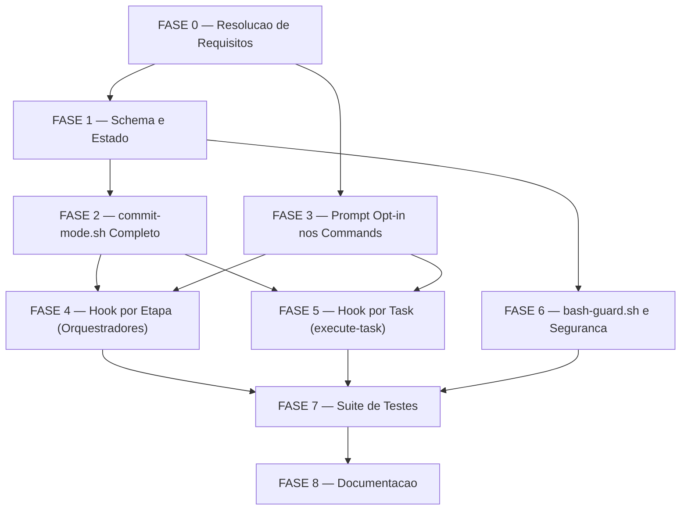

# Tarefas atomic-commit-pr — Backlog Completo

Escopo: Implementacao do modo opt-in atomic-commit nos orquestradores agente-00c e
feature-00c: novo helper POSIX `commit-mode.sh`, prompt de opt-in nos 4 commands de
entrada, persistencia em state.json, commit por etapa e por task, e push+PR no final
do pipeline via `cstk session pr`. Inclui resolucao de 6 ambiguidades do checklist
(FASE 0), suite de testes e atualizacao de toda a documentacao afetada.

**Legenda de status:**
- `[ ]` Pendente
- `[~]` Em andamento
- `[x]` Concluido
- `[!]` Bloqueado

**Legenda de criticidade:**
- `[C]` Critico — Impacto direto na corretude do feature ou bloqueante de outras fases
- `[A]` Alto — Funcionalidade essencial para a feature funcionar
- `[M]` Medio — Necessario mas sem urgencia imediata

---

## FASE 0 — Resolucao de Requisitos em Aberto

Ref: checklists/requirements.md §Gap / Ambiguity Consolidation (CHK017, CHK032,
CHK043, CHK045, CHK046, CHK047). Esta fase resolve todas as ambiguidades antes de
qualquer implementacao; as decisoes persistem em state.json via
`state-decisions.sh register`.

### 0.1 Definir default de agrupamento de tasks (CHK017 + CHK045) `[C]`

Ref: checklists/requirements.md CHK017, CHK045; spec.md §FR-004; data-model.md §StagedCommit

- [x] 0.1.1 Ler FR-004 ("when grouping is in effect") e US3 ("can optionally be grouped") e identificar as duas opcoes: (a) sempre agrupar tasks da mesma onda, (b) flag separada `group_tasks` no state.json
- [x] 0.1.2 Registrar decisao via `state-decisions.sh register`: escolha "sempre-agrupar-por-onda" (sem flag adicional; toda onda que conclui >= 2 tasks passa/fail=pass agrupa num commit range); justificativa: minimiza state schema e e consistente com o conceito de "onda" ja existente; score 3 com evidencia de que nenhuma US exige controle manual de agrupamento
- [x] 0.1.3 Atualizar spec.md §FR-004 para substituir "when grouping is in effect" por "tasks completed with outcome=pass in the same wave are grouped into a single ranged commit"
- [x] 0.1.4 Atualizar data-model.md §StagedCommit para refletir a semantica sempre-on de agrupamento por onda
- [x] 0.1.5 Teste: verificar que a decisao ficou gravada no state.json com score >= 2

### 0.2 Clarificar escopo do `finalize` (qualquer branch nao-default vs so cstk session) (CHK032) `[C]`

Ref: checklists/requirements.md CHK032; spec.md §FR-005/FR-008; contracts/commit-mode.md §finalize

- [x] 0.2.1 Verificar o contrato de `_session_pr` em `cli/lib/session.sh`: leva `--name NAME` ou simplesmente o branch corrente? Confirmar se exige que o branch tenha sido criado por `cstk session start`
- [x] 0.2.2 Registrar decisao: `finalize` funciona em QUALQUER branch nao-default; o parametro `--session NAME` e opcional e derivado do short_name (feature-00c) ou do basename do projeto-alvo (agente-00c); se o branch nao for uma sessao cstk, push ocorre normalmente via `git push -u origin HEAD` e PR via `gh pr create` diretamente (fallback documentado)
- [x] 0.2.3 Atualizar contracts/commit-mode.md §finalize para documentar: (a) `--session NAME` e opcional; (b) fallback para branches sem sessao cstk; (c) de onde `NAME` e derivado para cada orquestrador
- [x] 0.2.4 Atualizar data-model.md §PushPRResult e spec.md §FR-008 para refletir o escopo ampliado
- [x] 0.2.5 Teste: verificar que a decisao ficou gravada no state.json

### 0.3 Documentar fallback para `commit` skill ausente (CHK043) `[A]`

Ref: checklists/requirements.md CHK043; spec.md §FR-007; contracts/commit-mode.md §Reused contracts

- [x] 0.3.1 Verificar em `global/skills/agente-00c-runtime/scripts/` como outros helpers detectam skills instaladas ausentes (ex: `path-guard.sh`, `bash-guard.sh`)
- [x] 0.3.2 Registrar decisao: se a skill `commit` estiver ausente, `commit-mode.sh` faz commit direto via `git commit -m "<msg>"` com a mensagem gerada por `stage-message`/`task-message` (sem secret-file warnings); logar aviso via `log_err`; comportamento documentado como fallback degradado (nao aborta)
- [x] 0.3.3 Atualizar contracts/commit-mode.md §Dependencies e §Global conventions com o fallback documentado
- [x] 0.3.4 Teste: verificar que a decisao ficou gravada no state.json

### 0.4 Resolver fonte do `--session NAME` no `finalize` (CHK046) `[C]`

Ref: checklists/requirements.md CHK046; contracts/commit-mode.md §finalize

- [x] 0.4.1 Inspecionar state.json schema (state-rw.sh init) e verificar se `short_name` (feature-00c) e `execution.target_project_path` (agente-00c) sao os campos canonicos para derivar o NAME
- [x] 0.4.2 Registrar decisao: para feature-00c `NAME = .short_name`; para agente-00c `NAME = basename(.execution.target_project_path)`; `finalize` recebe o NAME como parametro `--session NAME` passado pelo orquestrador (nao autoderivar internamente — maior clareza)
- [x] 0.4.3 Documentar a convencao em contracts/commit-mode.md §finalize e em cada orquestrador afetado (agente-00c-orchestrator.md §terminal finalize, agente-00c-feature-orchestrator.md idem)
- [x] 0.4.4 Teste: verificar que a decisao ficou gravada no state.json

### 0.5 Confirmar modo nao-interativo da skill `commit` (CHK047) `[C]`

Ref: checklists/requirements.md CHK047; spec.md §FR-003/FR-007; global/skills/commit/SKILL.md

- [x] 0.5.1 Ler `global/skills/commit/SKILL.md` (ou o instalado em `~/.claude/skills/commit/SKILL.md`) e verificar se ha prompt interativo de confirmacao ou se a skill e sempre nao-bloqueante em pipeline
- [x] 0.5.2 Registrar decisao: se a skill for nao-interativa, documentar; se for interativa, a invocacao deve passar `--no-prompt` ou equivalente, OU `commit-mode.sh` usa `git commit -m` direto para o modo pipeline (preferencia documentada em contracts/commit-mode.md)
- [x] 0.5.3 Atualizar contracts/commit-mode.md §Reused contracts com a flag exata ou o caminho de invocacao nao-interativa
- [x] 0.5.4 Teste: verificar que a decisao ficou gravada no state.json

---

## FASE 1 — Schema e Infraestrutura de Estado

Ref: spec.md §FR-002; data-model.md §AtomicCommitConfig; contracts/commit-mode.md; plan.md §Project Structure

### 1.1 Adicionar flag `--atomic-commit` ao `state-rw.sh init` `[C]`

Ref: spec.md §FR-002; data-model.md §AtomicCommitConfig; plan.md §state-rw.sh

- [x] 1.1.1 Ler `global/skills/agente-00c-runtime/scripts/state-rw.sh` secao `init` (modo-feature e modo-agente) para identificar o ponto de insercao da nova flag
- [x] 1.1.2 Adicionar `--atomic-commit <true|false>` ao subcomando `init` de `state-rw.sh`; omitido => `false` (retro-compativel); escreve `.atomic_commit_enabled` no JSON inicial via `jq`
- [x] 1.1.3 Garantir que `.push_pr_result` seja aceito como campo opcional (nao falhar na ausencia)
- [x] 1.1.4 Executar `tests/run.sh test_state-rw` e confirmar que todos os cenarios existentes passam
- [x] 1.1.5 Adicionar cenarios a `tests/test_state-rw.sh`: (a) `init --atomic-commit true` => `.atomic_commit_enabled = true`; (b) `init --atomic-commit false` => `false`; (c) `init` sem flag => `false`; (d) estado legado sem campo => lido como `false`

### 1.2 Atualizar `state-validate.sh` para aceitar novos campos `[A]`

Ref: plan.md §state-validate.sh; data-model.md §Retro-compatibility

- [x] 1.2.1 Ler `global/skills/agente-00c-runtime/scripts/state-validate.sh` e identificar onde tipos de campos sao validados
- [x] 1.2.2 Adicionar validacao: `.atomic_commit_enabled` deve ser `true`, `false`, ou ausente (nao outro tipo); `.push_pr_result` e objeto ou ausente
- [x] 1.2.3 Executar `tests/run.sh test_state-validate` e confirmar zero regressoes
- [x] 1.2.4 Adicionar cenarios a testes existentes (ou criar teste inline): (a) `atomic_commit_enabled: true` => valido; (b) `atomic_commit_enabled: "yes"` => invalido; (c) campo ausente => valido

### 1.3 Criar `commit-mode.sh` — subcomandos `is-enabled` e `set-enabled` `[C]`

Ref: contracts/commit-mode.md §is-enabled e §set-enabled; spec.md §FR-002; plan.md §commit-mode.sh

- [x] 1.3.1 Criar arquivo `global/skills/agente-00c-runtime/scripts/commit-mode.sh` com header POSIX (`#!/bin/sh`), source de `_log.sh`, e dispatch de subcomandos
- [x] 1.3.2 Implementar `is-enabled --state-dir DIR`: le `.atomic_commit_enabled` via `state-rw.sh get`; ausente => `false`; stdout exatamente `true` ou `false`; exit 0 sempre
- [x] 1.3.3 Implementar `set-enabled --state-dir DIR --value <true|false>`: valida `--value`; escreve via `state-rw.sh set`; exit 0/1/2 conforme contrato
- [x] 1.3.4 Verificar que o helper faz source de `_log.sh` e usa `log_err`/`log_out` (nunca `printf >&2` diretamente)
- [x] 1.3.5 Criar `tests/test_commit-mode.sh` com cenarios para INV-1 (`is-enabled` sem campo => false), INV-8 (nenhuma escrita via echo/cp direto no state.json)

---

## FASE 2 — Helper `commit-mode.sh` Completo

Ref: contracts/commit-mode.md; spec.md §FR-003/004/005/006/007/008/009/010; plan.md §commit-mode.sh

### 2.1 Implementar `guard-branch` `[C]`

Ref: contracts/commit-mode.md §guard-branch; spec.md §FR-005/SC-004; research.md D5

- [x] 2.1.1 Implementar `guard-branch --state-dir DIR --projeto-alvo-path PATH`: resolver branch default via logica identica a `_session_default_branch` (remote HEAD => fallback `main`/`master`); comparar com HEAD atual
- [x] 2.1.2 Implementar saidas: exit 0 (nao-default, seguro); exit 3 (default, pular); exit 1 (nao-git ou git ausente)
- [x] 2.1.3 Garantir POSIX puro (sem bashisms); testar com `sh -n commit-mode.sh`
- [x] 2.1.4 Adicionar cenarios a `tests/test_commit-mode.sh` para INV-2: `guard-branch` em branch default => exit 3; em branch nao-default => exit 0

### 2.2 Implementar `stage-message` e `task-message` `[A]`

Ref: contracts/commit-mode.md §stage-message e §task-message; spec.md §FR-007; data-model.md §StagedCommit §Message format

- [x] 2.2.1 Implementar `stage-message --feature NAME --stage STAGE`: mapeamento de stage para scope (specify=>spec, plan=>plan, clarify=>spec, checklist=>checklist, create-tasks=>tasks); stdout em formato Conventional Commits; exit 0/2
- [x] 2.2.2 Implementar `task-message --feature NAME --task-ids "ID[,ID...]" [--brief TEXT]`: ID unico => `feat: task ID brief`; IDs contiguos => range `tasks A-B`; IDs nao-contiguos => lista `tasks A, C`; exit 0/2
- [x] 2.2.3 Verificar que nenhum dos dois subcomandos faz qualquer write (read-only helpers)
- [x] 2.2.4 Adicionar cenarios a `tests/test_commit-mode.sh` para INV-6 (mensagens em Conventional Commits), INV-7 (range vs lista)

### 2.3 Implementar `finalize` `[C]`

Ref: contracts/commit-mode.md §finalize; spec.md §FR-008/009/010/011; data-model.md §PushPRResult; research.md D6/D7

- [x] 2.3.1 Implementar `finalize --state-dir DIR --projeto-alvo-path PATH --session NAME [--title T] [--body B]`: passo 1 (is-enabled check); passo 2 (guard-branch); passo 3 (delegar a `cstk session pr`); passo 4 (mapear exit code para PushPRResult); passo 5 (nao-fatal)
- [x] 2.3.2 Persistir `.push_pr_result` via `state-rw.sh set` (nunca echo/cp direto); incluir `recorded_at` com timestamp ISO 8601
- [x] 2.3.3 Garantir que todos os paths de erro (gh-missing, gh-unauth, default-branch, disabled) retornam exit 0 (nao fatal) com status gravado
- [x] 2.3.4 Garantir que stdout e um objeto JSON conforme o contrato
- [x] 2.3.5 Adicionar cenarios a `tests/test_commit-mode.sh` para INV-3 (disabled => skipped-disabled), INV-4 (gh missing => skipped-gh-missing), INV-5 (PR ja existe => pr-exists, sem duplicata)

### 2.4 Verificacao de cobertura e conformidade POSIX `[A]`

Ref: spec.md §FR-014/FR-015; CLAUDE.md §Como testar scripts shell

- [x] 2.4.1 Rodar `shellcheck -s sh global/skills/agente-00c-runtime/scripts/commit-mode.sh` e corrigir todos os findings (ou documentar excecoes com `# shellcheck disable=SCXXX` justificado)
- [x] 2.4.2 Rodar `tests/run.sh --check-coverage` e confirmar que `commit-mode.sh` tem cobertura em `tests/test_commit-mode.sh` (sem orfao)
- [x] 2.4.3 Rodar `tests/run.sh test_commit-mode` — todos os cenarios INV-1..8 DEVEM passar antes de avancar
- [x] 2.4.4 Verificar com `sh -n commit-mode.sh` que o script e POSIX sintaticamente valido

---

## FASE 3 — Prompt Opt-in nos Commands de Entrada

Ref: spec.md §FR-001/FR-002; research.md D3; plan.md §agente-00c.md e §feature-00c.md

### 3.1 Adicionar prompt opt-in ao `/agente-00c` `[C]`

Ref: plan.md §agente-00c.md (~line 32); spec.md §US1/FR-001; research.md D3

- [x] 3.1.1 Ler `global/commands/agente-00c.md` e localizar o ponto exato apos §0 warm-up e antes de `state-rw.sh init`
- [x] 3.1.2 Inserir bloco de prompt opt-in: pergunta com default "no" (Enter => desabilitado); capturar resposta; mapear para `--atomic-commit true|false` na chamada a `state-rw.sh init`
- [x] 3.1.3 Garantir que respostas afirmativas (y/Y/yes/sim) habilitam; qualquer outra coisa desabilita (default seguro)
- [x] 3.1.4 Garantir que a pergunta nao e exibida em resumes (`/agente-00c-resume`) — o estado e lido do state.json

### 3.2 Adicionar prompt opt-in ao `/feature-00c` `[C]`

Ref: plan.md §feature-00c.md (~line 33); spec.md §FR-001/FR-013; research.md D3

- [x] 3.2.1 Ler `global/commands/feature-00c.md` e localizar o ponto apos §0 warm-up e antes de `state-rw.sh init` (~lines 183-192)
- [x] 3.2.2 Inserir bloco de prompt opt-in identico ao de `agente-00c.md` (paridade FR-013)
- [x] 3.2.3 Garantir mapping para `--atomic-commit true|false` no `state-rw.sh init` da feature
- [x] 3.2.4 Verificar paridade textual com o prompt do `/agente-00c` (mesma pergunta, mesmo default)

### 3.3 Garantir que os commands de resume NAO re-promptam `[A]`

Ref: spec.md §FR-002/US1-AC3; plan.md §agente-00c-resume.md / §feature-00c-resume.md

- [x] 3.3.1 Ler `global/commands/agente-00c-resume.md` e confirmar que nao ha ponto de opt-in; adicionar comentario/documentacao explicitando que `.atomic_commit_enabled` e lido do state.json sem re-prompt
- [x] 3.3.2 Ler `global/commands/feature-00c-resume.md` e aplicar a mesma verificacao e documentacao (paridade FR-013)
- [x] 3.3.3 Adicionar linha de leitura de `.atomic_commit_enabled` no ponto de startup dos resumes, antes de qualquer onda, para o orquestrador ter o valor disponivel

### 3.4 Atualizar commands de abort para documentar comportamento de commits `[M]`

Ref: spec.md §FR-011/FR-012; plan.md §agente-00c-abort.md / §feature-00c-abort.md

- [x] 3.4.1 Ler `global/commands/agente-00c-abort.md` (~lines 139-146) e atualizar texto "NUNCA git push": adicionar clausula de que commits atomicos ja criados PERMANECEM no historico local apos abort; push/PR NAO ocorre em abort
- [x] 3.4.2 Aplicar a mesma atualizacao em `global/commands/feature-00c-abort.md` (~line 122) — paridade
- [x] 3.4.3 Verificar que nenhum dos dois commands invoca `commit-mode.sh finalize` (abort NAO deve acionar push+PR)

---

## FASE 4 — Integracao nos Orquestradores (Hook de Commit por Etapa)

Ref: spec.md §FR-003/FR-013; research.md D4; plan.md §agente-00c-orchestrator.md / §agente-00c-feature-orchestrator.md

### 4.1 Integrar hook de commit por etapa no `agente-00c-orchestrator.md` `[C]`

Ref: plan.md §agente-00c-orchestrator.md (~lines 1388-1391); spec.md §FR-003

- [x] 4.1.1 Ler `global/agents/agente-00c-orchestrator.md` e localizar o ponto exato entre "advance phase" e "backup" (apos gates de qualidade, antes de `state-ondas.sh end`)
- [x] 4.1.2 Inserir bloco: "Se `commit-mode.sh is-enabled` => true: (1) chamar `commit-mode.sh guard-branch`; se exit 3 => skip com warn; (2) obter intent via `commit-mode.sh stage-message --feature <name> --stage <current_stage>`; (3) invocar git commit direto com o msg; (4) registrar Decisao auditavel do commit"
- [x] 4.1.3 Atualizar a tabela de helpers (~line 117) para incluir `commit-mode.sh` e seus subcomandos
- [x] 4.1.4 Garantir que o bloco de commit e NO-OP quando `is-enabled` retorna `false` (SC-006 zero latencia no path de opt-out)
- [x] 4.1.5 Adicionar instrucao de finalize terminal: apos review-features verde, se `is-enabled` => chamar `commit-mode.sh finalize --session NAME` onde NAME = basename do target_project_path

### 4.2 Integrar hook de commit por etapa no `agente-00c-feature-orchestrator.md` `[C]`

Ref: plan.md §agente-00c-feature-orchestrator.md; spec.md §FR-013

- [x] 4.2.1 Ler `global/agents/agente-00c-feature-orchestrator.md` e localizar o passo entre step 7 (advance phase) e step 8 (backup)
- [x] 4.2.2 Inserir bloco identico ao do 4.1.2 (paridade FR-013), com `--feature <short_name>` e `--session <short_name>`
- [x] 4.2.3 Atualizar a tabela de primitivas operacionais para incluir `commit-mode.sh`
- [x] 4.2.4 Garantir que o finalize terminal usa `--session "$SHORT_NAME"` (resolucao definida em 0.4.2)

### 4.3 Grep anti-fantasma — verificar paridade nos 6 arquivos afetados `[A]`

Ref: CLAUDE.md §Renomeando uma skill (principio de zero referencias residuais); spec.md §FR-013

- [x] 4.3.1 Rodar `grep -rn "NUNCA git push" global/` e confirmar que todas as ocorrencias foram atualizadas com a clausula de excecao (atomic mode + terminal success + non-default branch)
- [x] 4.3.2 Rodar `grep -rn "atomic_commit_enabled\|commit-mode" global/ cli/` e confirmar que TODOS os 6 arquivos afetados (agente-00c.md, feature-00c.md, agente-00c-resume.md, feature-00c-resume.md, agente-00c-orchestrator.md, agente-00c-feature-orchestrator.md) mencionam o campo ou o helper
- [x] 4.3.3 Rodar `grep -rn "commit-mode" global/agents/ global/commands/` e confirmar que nao ha arquivo listado no plan.md §Project Structure que esteja ausente
- [x] 4.3.4 Registrar Decisao "paridade verificada" com evidencia do output dos greps

---

## FASE 5 — Hook de Commit por Task (execute-task)

Ref: spec.md §FR-004; research.md D4; plan.md §execute-task; data-model.md §StagedCommit

### 5.1 Integrar hook de commit por task no agente-00c-orchestrator.md `[C]`

Ref: spec.md §FR-004/US3; research.md D4 (trigger point: apos outcome=pass)

- [ ] 5.1.1 Localizar em `global/agents/agente-00c-orchestrator.md` o ponto apos cada task concluir com outcome=pass (o mesmo ponto onde `.tasks[]` e appendado)
- [ ] 5.1.2 Inserir bloco: "Se `commit-mode.sh is-enabled` => true e outcome=pass: (1) guardar task_id em lista de tasks_passadas_na_onda; (2) apos todas as tasks da onda, se grouping (sempre-on por onda, conforme 0.1.2): `task-message --feature NAME --task-ids IDs_PASSADAS`; invocar Skill(commit); se onda com task unica passada: mensagem de task unica"
- [ ] 5.1.3 Garantir que tasks com outcome=fail NAO entram na lista de commit (spec §US3-AC3)
- [ ] 5.1.4 Garantir NO-OP quando `is-enabled` retorna `false`

### 5.2 Integrar hook de commit por task no agente-00c-feature-orchestrator.md `[C]`

Ref: spec.md §FR-013

- [ ] 5.2.1 Aplicar o bloco identico ao 5.1.2 no `agente-00c-feature-orchestrator.md`, no passo 7 (execute-task, apos outcome=pass)
- [ ] 5.2.2 Verificar paridade com 5.1 (mesma logica, mesmo ponto do loop)
- [ ] 5.2.3 Confirmar que a lista de tasks_passadas_na_onda e resetada a cada onda (nao acumula cross-wave)

---

## FASE 6 — Atualizacao do `bash-guard.sh` e Documentacao de Seguranca

Ref: spec.md §FR-012; research.md D2; plan.md §bash-guard.sh; plan.md §Constitution Exception

### 6.1 Atualizar `bash-guard.sh` com nota sobre o carve-out `[M]`

Ref: plan.md §bash-guard.sh ("doc/help text note only — NO regex change required")

- [ ] 6.1.1 Ler `global/skills/agente-00c-runtime/scripts/bash-guard.sh` e localizar linhas 314-315 (help/doc text)
- [ ] 6.1.2 Adicionar comentario/nota: "raw `git push` continua bloqueado; o terminal push de atomic mode usa exclusivamente `cstk session pr` (path confiavel), que nao passa por este guard"
- [ ] 6.1.3 Confirmar que NENHUM regex foi alterado (a mudanca e SOMENTE documental — nao abrir novo vetor)
- [ ] 6.1.4 Rodar `tests/run.sh test_bash-guard` e confirmar zero regressoes

---

## FASE 7 — Suite de Testes Completa

Ref: spec.md §FR-015; CLAUDE.md §Como testar scripts shell; plan.md §tests/test_commit-mode.sh

### 7.1 Completar `tests/test_commit-mode.sh` com cobertura de todos os INVs `[C]`

Ref: contracts/commit-mode.md §Default-safe invariants INV-1..8; spec.md §FR-015(a)(b)(c)(d)

- [ ] 7.1.1 INV-1: `is-enabled` com state.json sem campo `atomic_commit_enabled` => stdout `false`, exit 0
- [ ] 7.1.2 INV-2: `guard-branch` em repositorio com HEAD = branch default => exit 3, stdout = nome do branch, nenhum commit criado
- [ ] 7.1.3 INV-3: `finalize` quando `atomic_commit_enabled = false` => `PushPRResult.status = "skipped-disabled"`, exit 0, sem invocar `gh` ou `git push`
- [ ] 7.1.4 INV-4: `finalize` com `gh` ausente no PATH => `PushPRResult.status = "skipped-gh-missing"`, exit 0
- [ ] 7.1.5 INV-5: `finalize` idempotente — segunda chamada com PR ja existente => `PushPRResult.status = "pr-exists"`, sem PR duplicado
- [ ] 7.1.6 INV-6: `stage-message` para cada stage mapeado => saida em formato Conventional Commits valido (regex check)
- [ ] 7.1.7 INV-7: `task-message` com IDs contiguos => range `A-B`; com IDs nao-contiguos => lista `A, C`; com ID unico => `task ID`
- [ ] 7.1.8 INV-8: `set-enabled` grava via `state-rw.sh set` (verificar que state-history backup existe e sha256 e atualizado)
- [ ] 7.1.9 Adicionar cenarios de FR-015(b): per-stage commit em onda com artefatos => exatamente 1 commit por stage no git log
- [ ] 7.1.10 Adicionar cenarios de FR-015(c): branch-default guard impede push em 100% dos casos de teste

### 7.2 Estender `tests/test_state-rw.sh` `[A]`

Ref: spec.md §FR-002; plan.md §state-rw.sh; FASE 1.1 desta tarefa

- [ ] 7.2.1 Confirmar que os cenarios adicionados em 1.1.5 estao presentes e passando
- [ ] 7.2.2 Adicionar cenario de retro-compatibilidade: state.json legado (sem `atomic_commit_enabled`) lido pelo `is-enabled` => `false` sem erro
- [ ] 7.2.3 Rodar `tests/run.sh test_state-rw` — zero falhas antes de avancar

### 7.3 Rodar suite completa e confirmar zero regressoes `[C]`

Ref: spec.md §SC-005; CLAUDE.md §Antes de commitar

- [ ] 7.3.1 Rodar `tests/run.sh` (suite completa) e confirmar que contagem de cenarios nao caiu (zero regressoes — SC-005)
- [ ] 7.3.2 Rodar `tests/run.sh --check-coverage` e confirmar que `commit-mode.sh` tem cobertura e nenhum script novo e orfao
- [ ] 7.3.3 Se houver falhas, corrigir antes de avancar para FASE 8

---

## FASE 8 — Documentacao (CLAUDE.md, README, CHANGELOG)

Ref: spec.md §FR-012; plan.md §Project Structure; CLAUDE.md §CHANGELOG

### 8.1 Atualizar `CLAUDE.md` do projeto `[A]`

Ref: CLAUDE.md §Roteamento de modelos / §Sessoes paralelas (modelo a seguir)

- [ ] 8.1.1 Ler a secao de `cstk session` e `agente-00c` no CLAUDE.md do projeto para identificar onde documentar o modo atomic-commit
- [ ] 8.1.2 Adicionar subsecao "Modo atomic-commit (agente-00c / feature-00c)": descricao de uma linha do opt-in, campo persistido, comportamento no resume, e nota sobre finalize terminal
- [ ] 8.1.3 Documentar que `commit-mode.sh` vive em `global/skills/agente-00c-runtime/scripts/` e que o teste fica em `tests/test_commit-mode.sh`

### 8.2 Atualizar `README.md` `[M]`

Ref: CLAUDE.md §Adicionar skill bumpa "N skills globais" no README (nota: commit-mode.sh nao e uma skill, e um helper de runtime — verificar se README precisa update)

- [ ] 8.2.1 Verificar se o README lista helpers de runtime agente-00c; se sim, adicionar `commit-mode.sh`
- [ ] 8.2.2 Verificar e atualizar qualquer contagem de "N scripts" se houver

### 8.3 Adicionar entrada no `CHANGELOG.md` `[A]`

Ref: CLAUDE.md §CHANGELOG: link de referencia por versao; spec.md §SC-001..006

- [ ] 8.3.1 Determinar o proximo SemVer: a feature adiciona commit per-stage e push+PR (novo comportamento opt-in) — bump MINOR (ex: 5.12.0)
- [ ] 8.3.2 Adicionar header `## [X.Y.0] — YYYY-MM-DD` com secao `### Added` descrevendo: modo atomic-commit; helper `commit-mode.sh`; flag `--atomic-commit` em `state-rw.sh init`; prompt opt-in nos 4 commands; push+PR terminal via `cstk session pr`
- [ ] 8.3.3 Adicionar link de referencia no rodape do CHANGELOG: `[X.Y.0]: https://github.com/JotJunior/cstk/releases/tag/vX.Y.0`
- [ ] 8.3.4 Rodar checagem de headers sem ref: `comm -23 <(grep -oE '^## \[[0-9.]+\]' CHANGELOG.md | grep -oE '[0-9.]+' | sort -u) <(grep -oE '^\[[0-9.]+\]:' CHANGELOG.md | grep -oE '[0-9.]+' | sort -u)` => resultado DEVE ser vazio

---

## Matriz de Dependencias

## Resumo Quantitativo

| Fase | Tarefas | Subtarefas | Criticidade |
|------|---------|------------|-------------|
| 0 — Resolucao de Requisitos | 5 | 24 | C/C/A/C/C |
| 1 — Schema e Estado | 3 | 14 | C/A/C |
| 2 — commit-mode.sh Completo | 4 | 18 | C/A/C/A |
| 3 — Prompt Opt-in nos Commands | 4 | 14 | C/C/A/M |
| 4 — Hook por Etapa (Orquestradores) | 3 | 14 | C/C/A |
| 5 — Hook por Task (execute-task) | 2 | 7 | C/C |
| 6 — bash-guard.sh e Seguranca | 1 | 4 | M |
| 7 — Suite de Testes | 3 | 16 | C/A/C |
| 8 — Documentacao | 3 | 9 | A/M/A |
| **Total** | **28** | **120** | — |

## Escopo Coberto

| Item | Descricao | Fase |
|------|-----------|------|
| CHK017/CHK045 | Resolucao do default de grouping de tasks (sempre-on por onda) | 0 |
| CHK032 | Escopo do finalize (qualquer branch nao-default, nao apenas cstk session) | 0 |
| CHK043 | Fallback para commit skill ausente | 0 |
| CHK046 | Fonte do --session NAME no finalize (short_name / basename projeto) | 0 |
| CHK047 | Modo nao-interativo da commit skill em pipeline | 0 |
| FR-002 | Persistencia de atomic_commit_enabled no state.json | 1 |
| FR-014 | POSIX compliance de todo novo shell code | 1/2 |
| FR-001 | Prompt opt-in em agente-00c e feature-00c | 3 |
| FR-002 (resume) | Commands de resume NAO re-promptam | 3 |
| FR-012 | Atualizacao da proibicao de push nos abort docs | 3 |
| FR-003 | Commit por etapa do pipeline (hook no loop das ondas) | 4 |
| FR-013 | Paridade plena entre agente-00c e feature-00c | 4/5 |
| FR-004 | Commit por task com agrupamento por onda | 5 |
| FR-005 | Branch-default guard em 100% dos casos | 2/4/5 |
| FR-006 | No-op para stages/tasks sem mudancas staged | 2 |
| FR-007 | Conventional Commits via commit skill | 2/4/5 |
| FR-008/009 | Terminal push+PR idempotente | 2 |
| FR-010 | gh ausente/unauth nao-fatal | 2 |
| FR-011 | Nao push em abort/partial/disabled | 3/4 |
| FR-015 | Suite de testes INV-1..8 + FR-015(a)(b)(c)(d) | 7 |
| SC-005 | Zero regressoes a suite existente | 7 |

## Escopo Excluido

| Item | Descricao | Motivo |
|------|-----------|--------|
| EX-001 | Modificacao do `state-ondas.sh git-commit` | Decisao D1 (research.md): helper isolado preserva contrato do git-commit para o path de abort |
| EX-002 | Novo agente ou subagente para commits | Decisao pre-ratificada: reusar commit skill + cstk session pr |
| EX-003 | Grouping manual configuravel (flag separada) | Decisao 0.1.2: sempre-on por onda e suficiente e minimiza schema |
| EX-004 | Push em branches default | SC-004: bloqueado em 100% dos casos por guard-branch |
| EX-005 | Telemetria ou endpoint remoto de uso | Constitution Principio IV MUST |
| EX-006 | Modificacao do regex do bash-guard.sh | Decisao D2 (research.md): carve-out e por routing, nao por relaxamento do guard |
| EX-007 | Commits em tasks com outcome=fail | spec.md §US3-AC3: apenas tasks pass geram commit |
| EX-008 | Retry interativo para `gh auth login` | Decisao D6 (research.md): nao-fatal, warning e suficiente em pipeline autonomo |
