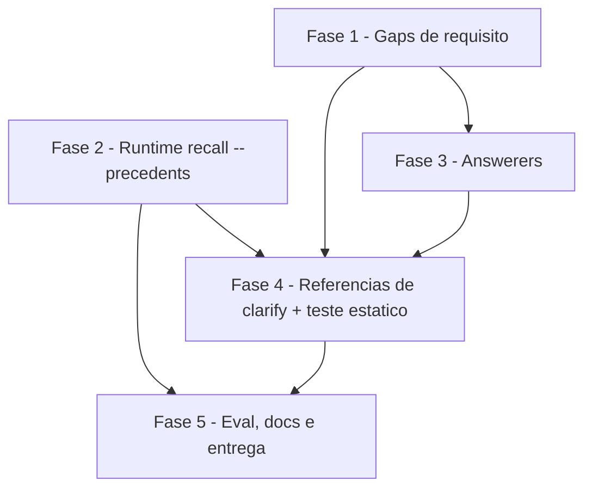

# Tarefas cstk - clarify-precedent-source

Escopo: precedente do operador (bloqueio humano respondido, recuperado da
knowledge.db) como 4a fonte de evidencia dos clarify-answerers do
`agente-00c` e do `feature-00c` — modo `cstk recall --precedents` (runtime),
regras de pontuacao com suporte positivo obrigatorio (dec-027) nos answerers,
consulta/evento/bloqueio nas referencias de clarify, testes, eval e docs.

Ref: docs/specs/clarify-precedent-source/spec.md, plan.md, research.md,
data-model.md, quickstart.md, contracts/, checklists/

**Legenda de status:**
- `[ ]` Pendente
- `[~]` Em andamento
- `[x]` Concluido
- `[!]` Bloqueado

**Legenda de criticidade:**
- `[C]` Critico - Impacto financeiro direto ou bloqueante
- `[A]` Alto - Funcionalidade essencial
- `[M]` Medio - Necessario mas sem urgencia imediata

---

## FASE 1 - Fechamento de gaps de requisito (checklist)

### 1.1 Regra S-2 de nao-persistencia como requisito verificavel `[A]`

Ref: checklists/security.md CHK009; plan.md §Revisao de seguranca S-2; contracts/answerer-precedents.md

- [ ] 1.1.1 Redigir a regra S-2 (artefatos persistidos citam precedente so por `block_ref` + opcao; texto do precedente nunca vai para `spec.md` nem `--justificativa`; unica excecao `answer_excerpt` <= 120 bytes) num bloco reutilizavel para answerers e referencias
- [ ] 1.1.2 Definir as frases-ancora que o teste estatico (4.3) vai exigir para S-2
- [ ] 1.1.3 Registrar em `checklists/security.md` CHK009 o destino (tasks 3.1/4.1/4.3) e marcar resolvido quando 4.3 cobrir

### 1.2 Separacao gateante x eval de SC-004 `[M]`

Ref: checklists/requirements.md CHK014; research.md §Decision 7; quickstart.md Cenarios 5, 7, 9

- [ ] 1.2.1 Listar as asserções gateantes de SC-004 (contrato no-op do `--precedents`; omissao do campo `precedents` na prosa quando K=0)
- [ ] 1.2.2 Listar as asserções nao-gateantes (comparacao de saida do answerer LLM) atribuidas ao eval/Cenario 9
- [ ] 1.2.3 Atualizar CHK014 com a separacao e os cenarios que cobrem cada parte

---

## FASE 2 - Runtime: `cstk recall --precedents`

### 2.1 Testes do modo novo (TDD, vermelhos primeiro) `[A]`

Ref: quickstart.md Cenarios 1-6; contracts/cli-recall-precedents.md; tests/cstk/test_recall.sh

- [ ] 2.1.1 Fixture `knowledge.db` sintetica com bloqueios respondidos/pendentes/vazios, duplicata de ingestao, etapas via `decisions` e mais de um projeto
- [ ] 2.1.2 Cenario `precedents_pair_above_threshold` (SC-001 com pares sinteticos que reproduzem a medicao)
- [ ] 2.1.3 Cenario `precedents_dedup` (I-3) e `precedents_eligibility_stage` (FR-002, FR-016, stage `-` sem join)
- [ ] 2.1.4 Cenario `precedents_caps` (I-1 `--max-bytes` descarta entradas inteiras da menos similar; `--limit`; I-5 truncamento UTF-8)
- [ ] 2.1.5 Cenario `precedents_degradation` (sqlite3 ausente, indice ausente, pergunta < 3 tokens → stdout vazio, exit 0)
- [ ] 2.1.6 Cenario `precedents_usage_errors` (pergunta ausente, termo extra, NUL, `--min-similarity` invalido, flag desconhecida → exit 2)

### 2.2 Implementar `recall_mode_precedents` em `cli/lib/recall.sh` `[A]`

Ref: research.md §Decisions 1-5; data-model.md §Precedent; plan.md §Complexity Tracking

- [ ] 2.2.1 Dispatch em `recall_main` (deteccao de `--precedents` junto de `--context`/`--ingest`) + parser de flags com validacao do contrato
- [ ] 2.2.2 Gates de degradacao (sqlite3, indice, `quick_check`) no mesmo padrao de `recall_mode_context`
- [ ] 2.2.3 Prefiltro FTS5 OR (`type='block'`, pool 20) com `fts_phrase_escape`/`sql_escape`; so `recall_query_sql`
- [ ] 2.2.4 Tokenizacao + Jaccard em `awk` identicos ao metodo da calibracao (Gotcha no codigo) e limiar default 0.55
- [ ] 2.2.5 Join de `stage` via `decisions`, dedup `(question, answer, answered_at)`, ordenacao similaridade desc / `answered_at` desc / `ref` asc
- [ ] 2.2.6 Render com rotulo UNTRUSTED, truncamento 300 bytes UTF-8-safe e teto `--max-bytes`
- [ ] 2.2.7 Rodar `./tests/run.sh recall` ate verde (cenarios 2.1)

### 2.3 Help e usage `[M]`

Ref: plan.md §Source Code (`cli/cstk`)

- [ ] 2.3.1 Usage de `recall` em `cli/lib/recall.sh` menciona `--precedents` e suas flags
- [ ] 2.3.2 Help do `cli/cstk` menciona o modo novo
- [ ] 2.3.3 Teste de help (existente ou novo cenario) cobre a mencao

---

## FASE 3 - Catalogo: answerers com a 4a fonte

### 3.1 `feature-00c-clarify-answerer` `[C]`

Ref: spec.md FR-003..FR-009, FR-018; contracts/answerer-precedents.md regras 1-7 + 4b; dec-027

- [ ] 3.1.1 Entrada opcional `precedents` (dado nao-confiavel, FR-008) sem mudar `tools: Read, Bash`
- [ ] 3.1.2 Regra de suporte positivo: precedente so soma com +1 de `briefing` ou `spec_corrente`; +1 de constitution nao conta; `scored: false` caso contrario
- [ ] 3.1.3 Regras de divergencia (mais recente pontua; empate de data → nenhum) e correspondencia por conteudo (regra 4b)
- [ ] 3.1.4 Dado factual → 0 (FR-005); diretiva embutida → pausa + citacao suspeita
- [ ] 3.1.5 Campos de saida `referencias[]` (`fonte: precedent`), `precedent_divergence`, `divergent_precedents`, `recommended_precedent` + regra S-2 (1.1)
- [ ] 3.1.6 Exemplo trabalhado com placeholders (sem dado inventado), incluindo o caso "so constitution + precedente"

### 3.2 `agente-00c-clarify-answerer` (paridade) `[C]`

Ref: spec.md FR-001; contracts/answerer-precedents.md

- [ ] 3.2.1 Replicar 3.1.1-3.1.6 com `stack_sugerida` como terceira fonte
- [ ] 3.2.2 Conferir paridade textual das regras entre os dois answerers (bloco identico exceto nome da terceira fonte)
- [ ] 3.2.3 Manter o limite de tools e a ausencia de registro de Decisao/spawn (FR-018)

---

## FASE 4 - Catalogo: referencias de clarify e teste estatico

### 4.1 Referencia `references/orchestrators/feature/clarify.md` `[A]`

Ref: spec.md FR-001, FR-009, FR-010, FR-012; research.md §Decisions 6, 9, 10; plan.md S-2/S-3

- [ ] 4.1.1 Consulta `cstk recall --precedents "<pergunta>"` por pergunta antes do spawn do answerer, best-effort (`2>/dev/null || vazio`)
- [ ] 4.1.2 Evento `precedent_consulted` em `.events[]` por pergunta (`stage=clarify question=<Qn> hits=<K>`, `skipped=short-query`), sem corpo
- [ ] 4.1.3 Omissao do campo `precedents` quando todas as perguntas tem K=0 (prompt byte-identico)
- [ ] 4.1.4 Consumo da resposta: Decisao com `block_ref`; bloqueio com secao "Precedentes" (recomendado OU todos os divergentes), origem projeto/feature/data, `[outro projeto]` e texto "recomendacao derivada de historico, nao verificada" (S-3)
- [ ] 4.1.5 Resposta do operador diferente do recomendado registrada com `recomendado=<ref>/<opcao>` (US3-2)

### 4.2 Referencia `references/orchestrators/root/clarify.md` (paridade) `[A]`

Ref: spec.md FR-001

- [ ] 4.2.1 Replicar 4.1.1-4.1.5 em bloco de paridade identico
- [ ] 4.2.2 Conferir que `orchestrator-refs.sh path` resolve as duas referencias e que o marcador `ORCH-REF-END` permanece no fim
- [ ] 4.2.3 Rodar os testes existentes das referencias de fase (orchestrator-slim) sem regressao

### 4.3 Teste estatico interno `tests/test_clarify-precedent-prose.sh` `[A]`

Ref: quickstart.md Cenario 7; tests/run.sh `_is_internal_test`

- [ ] 4.3.1 Asserções nos dois answerers: 4a fonte, regras 1-7 + 4b, suporte positivo (frase de constitution nao contar), S-2, `tools: Read, Bash`
- [ ] 4.3.2 Asserções nas duas referencias: `--precedents` antes do spawn, `precedent_consulted`, omissao do campo, secao Precedentes com S-3
- [ ] 4.3.3 Asserção de paridade (blocos identicos entre feature/root e entre answerers)
- [ ] 4.3.4 Registrar o teste em `_is_internal_test` e confirmar `./tests/run.sh --check-coverage` exit 0

---

## FASE 5 - Eval, documentacao e entrega

### 5.1 Eval nao-gateante de calibracao `[M]`

Ref: quickstart.md Cenario 8; research.md §Decision 2; plan.md P-3

- [ ] 5.1.1 `tests/eval/eval_precedent-calibration.sh`: pula com aviso se `~/.claude/cstk/knowledge.db` ausente
- [ ] 5.1.2 Reapresentar as perguntas dos pares 108/112 e 242/251 ao `--precedents`, excluindo o proprio registro, e reportar recuperacao do par
- [ ] 5.1.3 Imprimir a distribuicao de Jaccard corrente para comparacao com research Decision 2
- [ ] 5.1.4 Documentar em `tests/eval/README.md` o cenario 9 manual (inclui "so constitution + precedente" → `scored: false`)

### 5.2 Documentacao e CHANGELOG `[M]`

Ref: spec.md FR-017; plan.md §Duas metades da instalacao

- [ ] 5.2.1 Entrada MINOR no `CHANGELOG.md` citando as duas metades (`cstk self-update` para runtime; `cstk update`/`install --from` para catalogo) e a degradacao com binario antigo
- [ ] 5.2.2 Link de referencia da versao no rodape do CHANGELOG
- [ ] 5.2.3 Nota de usuario em `docs/agente-00c.md` sobre a 4a fonte, suporte positivo e recomendacao no bloqueio
- [ ] 5.2.4 Rodar a suite completa (`LC_ALL=C ./tests/run.sh`) e registrar resultado antes de fechar

---

## Matriz de Dependencias

## Resumo Quantitativo

| Fase | Tarefas | Subtarefas | Criticidade |
|------|---------|------------|-------------|
| 1 - Gaps de requisito | 2 | 6 | A, M |
| 2 - Runtime recall --precedents | 3 | 16 | A, M |
| 3 - Answerers | 2 | 9 | C |
| 4 - Referencias de clarify + teste estatico | 3 | 12 | A |
| 5 - Eval, docs e entrega | 2 | 8 | M |
| **Total** | **12** | **51** | - |

## Escopo Coberto

| Item | Descricao | Fase |
|------|-----------|------|
| FR-001, FR-018 | Consulta por pergunta nos dois orquestradores, answerer sem nova capacidade | 3, 4 |
| FR-002, FR-011, FR-013..FR-016 | Modo `--precedents`: elegibilidade, tetos, limiar, etapa de origem | 2 |
| FR-003..FR-008 | Pontuacao com suporte positivo, divergencia, dado factual, diretiva embutida | 3 |
| FR-009, FR-012 | Recomendacao/divergentes no bloqueio, evento `precedent_consulted` | 4 |
| FR-010 | Degradacao no-op | 2, 4 |
| FR-017 | Duas metades documentadas + testes | 4, 5 |
| CHK009, CHK014 | Gaps do checklist | 1 |

## Escopo Excluido

| Item | Descricao | Motivo |
|------|-----------|--------|
| Sync de branch | Merge de `origin/main` v10.11.0 | Ja feito pelo command pai (178c5ac, dec-028) |
| Verificacao de procedencia do precedente | Distinguir bloqueio real de state forjado de repo de terceiro | Risco residual tratado por S-1 (suporte positivo) + S-3 (rotulo); CHK006 `{humano}` aberto |
| Escrita na knowledge.db | Qualquer mudanca de schema/ingestao | FR-011: consulta somente leitura |
| Recalibracao automatica do limiar | Ajuste dinamico de 0.55 | P-3: eval nao-gateante apenas reporta |
