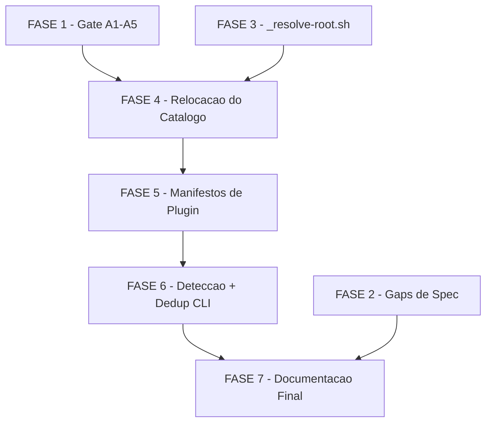

# Tarefas claude-plugin-packaging - Empacotamento do cstk como Plugin do Claude Code

Escopo: publicar o catalogo do cstk (skills, commands, agents, hooks de
guarda) como plugin nativo do Claude Code, relocando o conteudo comitado
para `plugins/cstk/` e `plugins/cstk-language-go/`, sem alterar o caminho
classico (`cstk install`/`cstk update`). Backlog derivado de
[spec.md](./spec.md), [plan.md](./plan.md), [research.md](./research.md),
[data-model.md](./data-model.md), [quickstart.md](./quickstart.md),
[contracts/plugin-artifacts.md](./contracts/plugin-artifacts.md),
[contracts/cli-plugin-awareness.md](./contracts/cli-plugin-awareness.md) e
os gaps abertos em `checklists/requirements.md` e `checklists/security.md`.

**Legenda de status:**
- `[ ]` Pendente
- `[~]` Em andamento
- `[x]` Concluido
- `[!]` Bloqueado

**Legenda de criticidade:**
- `[C]` Critico - Impacto financeiro direto ou bloqueante
- `[A]` Alto - Funcionalidade essencial
- `[M]` Medio - Necessario mas sem urgencia imediata

---

## FASE 1 - Gate de Validacao Empirica das Assumptions A1-A5

> **Gate obrigatorio** (plan.md linhas 152, 159-161): esta fase MUST
> concluir e produzir veredito ANTES de qualquer trabalho da FASE 4
> (relocacao) em diante. FASE 2 (gaps de spec) e FASE 3 (helper de
> resolucao) NAO dependem deste veredito e podem prosseguir em paralelo.

### 1.1 Preparar ambiente de spike descartavel `[C]`

Ref: plan.md linhas 152/159-161; quickstart.md Scenarios 1-3; research.md Decision 1

- [ ] 1.1.1 Criar plugin minimo descartavel (marketplace.json + plugin.json
      via `source` file-path local) num diretorio de teste fora do repo
      contendo 1 skill trivial + `hooks/hooks.json` com os 3 hooks reais
      (`pretooluse-bash-guard.sh`, `posttooluse-tool-call-tick.sh`,
      `posttooluse-agent-usage.sh`)
- [ ] 1.1.2 Registrar o marketplace local via `/plugin marketplace add
      <path-local>` (Scenario 1 do quickstart)
- [ ] 1.1.3 Instalar via `/plugin install <nome>@<marketplace-local>` e
      habilitar o plugin

### 1.2 Validar A1/A2 - hooks ativos e timing `[C]`

Ref: quickstart.md Scenario 2; research.md Assumptions A1/A2

- [ ] 1.2.1 Abrir um projeto que nunca rodou `cstk hooks install`;
      confirmar ausencia de bloco de hooks classico em `.claude/settings.json`
- [ ] 1.2.2 Rodar um comando `Bash` bloqueavel (ex.: `sudo`) e registrar se
      foi interceptado sem nenhum passo manual (evidencia de A1)
- [ ] 1.2.3 Se o hook so ativar apos `/reload-plugins` ou reinicio da
      sessao, registrar o timing real observado (evidencia de A2) — nunca
      supor
- [ ] 1.2.4 Fechar uma onda de execucao autonoma nesse projeto e conferir
      `tool_calls > 0` no state (evidencia de PostToolUse ativo)

### 1.3 Validar A3/A4 - source relativo e semantica de ref `[A]`

Ref: quickstart.md Scenarios 1 e 3; research.md Assumptions A3/A4

- [ ] 1.3.1 Confirmar que `source` relativo (`"./plugins/cstk"`) resolve
      corretamente a partir de um marketplace hospedado no proprio repo
- [ ] 1.3.2 Publicar 2 estados do plugin de teste (tag antiga vs `main`) e
      observar se `ref: <tag>` atualiza como esperado ao trocar a tag, e
      como `ref: main` se comporta em comparacao (evidencia de A4)
- [ ] 1.3.3 Rodar o roundtrip empirico: `diff -r` entre o `installPath`
      materializado e a arvore comitada no mesmo ref (Scenario 3)

### 1.4 Validar A5 - bit de execucao preservado `[A]`

Ref: quickstart.md Scenario 3 passo 4; research.md Assumption A5

- [ ] 1.4.1 `find "<installPath>" -name '*.sh' ! -perm -u+x` apos a
      instalacao — confirmar se o bit `+x` sobrevive a materializacao
- [ ] 1.4.2 Confirmar que a invocacao via `sh "<path>"` (ja adotada em
      todos os `command` de `hooks.json`) torna A5 irrelevante mesmo se o
      bit nao sobreviver

### 1.5 Decisao de gate: veredito A1-A5 e follow-up obrigatorio `[C]`

Ref: checklists/requirements.md CHK021 (materializacao do spike como task
bloqueante), CHK019 (fallback se A1 falsa), CHK023 (fallback A3/A4)

- [ ] 1.5.1 Registrar Decisao auditavel (`state-decisions.sh register
      --score 3 --evidencia "<output empirico das tasks 1.2-1.4>"`) com o
      veredito de cada assumption (A1..A5: confirmada ou refutada)
- [ ] 1.5.2 **SE A1 for FALSA** (hooks nao ativam automaticamente so por
      habilitar o plugin): registrar bloqueio humano (`bloqueios.sh
      register`) propondo reavaliacao de escopo/SC-002 e **NAO** prosseguir
      para FASE 4 em diante ate resposta do operador — apenas FASE 2 e
      FASE 3 (independentes do veredito) podem continuar. Fallback
      operacional a documentar: `cstk hooks install --scope project`
      permanece necessario para esse projeto
- [ ] 1.5.3 **SE A1 for VERDADEIRA mas A2 revelar timing extra** (ex.:
      exige `/reload-plugins` apos habilitar): documentar o passo adicional
      como fallback operacional a incluir em FR-013/README (consumido na
      task 7.4) e atualizar `spec.md` §Clarifications substituindo
      `[ASSUMPTION a validar empiricamente]` pelo resultado observado
- [ ] 1.5.4 **SE A3 ou A4 revelarem comportamento diferente do assumido**
      (source relativo nao resolve, ou `ref: main` nao atualiza como
      esperado): documentar o fallback (ex.: nunca depender de `ref: main`
      implicito, usar sempre a tag explicita no fluxo de release) — a
      decisao alimenta a task 5.1.2 antes de `marketplace.json` ser
      finalizado
- [ ] 1.5.5 Atualizar `spec.md` §Clarifications trocando cada
      `[ASSUMPTION a validar empiricamente]` (A1-A5) pelo resultado
      empirico confirmado, com evidencia citada — nenhuma assumption pode
      permanecer sem fechamento apos esta fase

---

## FASE 2 - Precisao da Spec: Fechamento dos Gaps de Checklist

> Independente do veredito da FASE 1 — pode rodar em paralelo.

### 2.1 Reescrever a Delta FR-017 com o modelo real de integridade por caminho `[A]`

Ref: checklists/requirements.md CHK006; checklists/security.md CHK002,
CHK006; plan.md linhas 163-193 (gate owasp F1, dec-026/dec-027)

- [ ] 2.1.1 Editar `spec.md` > Delta Requirements > Capability
      `guards-defense-in-depth` > FR-017: trocar "o mesmo conjunto de
      garantias de seguranca" pela redacao do plan (linhas 191-193):
      "garantias equivalentes em efeito, com mecanismos e responsaveis
      distintos, documentados por caminho"
- [ ] 2.1.2 Adicionar a tabela "Modelo de integridade por caminho de
      distribuicao" (plan.md linhas 169-176: verificacao de integridade,
      origem confiavel, transporte, consentimento, quem aplica) na propria
      `spec.md` — fecha CHK002
- [ ] 2.1.3 Adicionar nota explicita sobre transporte HTTPS do caminho
      plugin: fato observado do mecanismo do harness (nao uma politica que
      o toolkit impoe, diferente de `trusted-hosts.sh` no caminho
      classico) — fecha CHK006 de `checklists/security.md`
- [ ] 2.1.4 Revisar `checklists/requirements.md` CHK006 e
      `checklists/security.md` CHK002/CHK006, marcar `[x]` citando a nova
      secao da spec

### 2.2 Definir threshold objetivo para SC-001 `[M]`

Ref: checklists/requirements.md CHK014

- [ ] 2.2.1 Decidir e documentar um criterio objetivo para SC-001 (ex.:
      numero de comandos do operador — `/plugin marketplace add` +
      `/plugin install` + habilitar = 3 passos, comparavel ao numero de
      passos de qualquer outro plugin do Claude Code) OU registrar Decisao
      explicita justificando a ausencia de um numero proprio (a comparacao
      e com um mecanismo nativo fora do controle do toolkit)
- [ ] 2.2.2 Atualizar `spec.md` SC-001 com o criterio (ou a justificativa
      registrada) e marcar CHK014 `[x]`

### 2.3 Documentar os 2 achados LOW do gate owasp-security `[M]`

Ref: checklists/security.md CHK019; dec-026 (onda-004)

- [ ] 2.3.1 Recuperar o detalhe dos 2 achados LOW citados em dec-026
      ("0 CRITICAL, 0 HIGH, 3 MEDIUM..., 2 LOW") consultando o
      output/transcript bruto da invocacao original da skill
      `owasp-security` desta feature; se indisponivel, re-rodar
      `Skill(owasp-security)` sobre `plan.md` + `contracts/` para
      regenerar o relatorio completo
- [ ] 2.3.2 **Se a identidade dos 2 LOW nao puder ser recuperada de fonte
      real** (nem log, nem re-execucao) — registrar bloqueio humano em vez
      de supor ou inventar a descricao (Constitution VI); nunca fabricar
      nomes de findings
- [ ] 2.3.3 Registrar Decisao nomeando os 2 LOW com descricao rastreavel
      (referenciando dec-026) e marcar CHK019 de `checklists/security.md`
      `[x]`

---

## FASE 3 - Resolucao Dual-Path do Runtime (`_resolve-root.sh`)

Ref: plan.md "Ordem de implementacao sugerida" Fase 2; contracts/plugin-artifacts.md Artefato 5; research.md Decision 3

### 3.1 Implementar `_resolve-root.sh` (helper sourceable) `[A]`

Ref: contracts/plugin-artifacts.md Artefato 5

- [ ] 3.1.1 Criar `plugins/cstk/skills/agente-00c-runtime/scripts/_resolve-root.sh`
      (POSIX sh puro) com a funcao `resolve_runtime_root [strict]`
- [ ] 3.1.2 Implementar Ordem A (consumidores gerais): `${CLAUDE_PLUGIN_ROOT}/skills/agente-00c-runtime`
      → diretorio-irmao de `$0` → `$HOME/.claude/skills/agente-00c-runtime`
      → erro diagnostico em stderr, exit 1
- [ ] 3.1.3 Implementar Ordem B (`strict`, consumidor fail-closed): diretorio-irmao
      de `$0` → `${CLAUDE_PLUGIN_ROOT}/...` → `$HOME/.claude/skills/...` →
      erro
- [ ] 3.1.4 Cada candidato so e aceito se o diretorio existir **e** conter
      `scripts/` (contrato do Artefato 5)
- [ ] 3.1.5 Escrever `tests/test__resolve-root.sh` cobrindo os 2 modos
      (normal/`strict`) x 4 candidatos cada, incluindo o caso de erro
      diagnostico

### 3.2 Adotar o helper nos 6 arquivos que hoje hardcodeiam `$HOME/.claude` `[A]`

Ref: research.md Decision 3 (15 linhas executaveis em 6 arquivos)

- [ ] 3.2.1 `pretooluse-bash-guard.sh` (4 ocorrencias) — usar Ordem B
      (`strict`), por ser o unico consumidor fail-closed (F3, dec-027)
- [ ] 3.2.2 `posttooluse-loose-usage.sh` (4 ocorrencias) — Ordem A
      (fail-open)
- [ ] 3.2.3 `posttooluse-agent-usage.sh` (2 ocorrencias) — Ordem A
      (fail-open)
- [ ] 3.2.4 `posttooluse-tool-call-tick.sh` (2 ocorrencias) — Ordem A
      (fail-open)
- [ ] 3.2.5 `guard-hooks-status.sh` (2 ocorrencias) — Ordem A (CLI comum)
- [ ] 3.2.6 `issue.sh` (1 ocorrencia) — Ordem A (CLI comum)
- [ ] 3.2.7 Auditar manualmente que nenhuma polaridade fail-open/fail-closed
      mudou: `pretooluse-bash-guard.sh` continua saindo com
      `MECANISMO_FALHOU` ao nao resolver; os 4 hooks de metrica continuam
      sempre exit 0
- [ ] 3.2.8 Atualizar os testes existentes dos 6 arquivos (`tests/test_pretooluse-bash-guard.sh`,
      `tests/test_posttooluse-loose-usage.sh`,
      `tests/test_posttooluse-agent-usage.sh`,
      `tests/test_posttooluse-tool-call-tick.sh`,
      `tests/test_guard-hooks-status.sh`, `tests/cstk/test_issue.sh` ou
      equivalente) cobrindo a nova cascata com `${CLAUDE_PLUGIN_ROOT}`
- [ ] 3.2.9 Rodar `./tests/run.sh` completo e confirmar suite verde antes
      de iniciar a FASE 4

---

## FASE 4 - Relocacao do Catalogo para `plugins/`

Ref: plan.md Fase 3; Nota de governanca (BREAKING, bump MAJOR)

> **Depende do veredito da FASE 1** (task 1.5.2): se A1 for falsa e o
> operador nao autorizar prosseguir, esta fase e as seguintes ficam
> bloqueadas.

### 4.1 Relocar `global/{skills,commands,agents}` para `plugins/cstk/` via `git mv` `[C]`

- [ ] 4.1.1 `git mv global/skills plugins/cstk/skills`
- [ ] 4.1.2 `git mv global/commands plugins/cstk/commands`
- [ ] 4.1.3 `git mv global/agents plugins/cstk/agents`
- [ ] 4.1.4 Confirmar que `_resolve-root.sh` (task 3.1.1) segue acessivel
      no novo path `plugins/cstk/skills/agente-00c-runtime/scripts/`

### 4.2 Relocar `language-related/go/{skills,hooks}` para `plugins/cstk-language-go/` `[A]`

- [ ] 4.2.1 `git mv language-related/go/skills plugins/cstk-language-go/skills`
- [ ] 4.2.2 `git mv language-related/go/hooks plugins/cstk-language-go/hooks`

### 4.3 Atualizar `scripts/build-release.sh` para ler de `plugins/cstk/**` `[C]`

Ref: CLAUDE.md "mudanca de profiles/catalogo exige counts em test_build-release + test_quickstart-e2e"

- [ ] 4.3.1 Atualizar todos os paths hardcoded de `global/` para
      `plugins/cstk/` (e `language-related/go` para
      `plugins/cstk-language-go`) em `scripts/build-release.sh`
- [ ] 4.3.2 Atualizar `scripts/profiles.txt.in` se referenciar os paths
      antigos
- [ ] 4.3.3 Regenerar fixtures: `tests/cstk/fixtures/regen.sh`
- [ ] 4.3.4 Atualizar contagens/paths em `tests/cstk/test_build-release.sh`
      e `tests/cstk/test_quickstart-e2e.sh`
- [ ] 4.3.5 Escrever/atualizar `tests/cstk/test_build-release.sh` cobrindo
      o novo layout de leitura (`plugins/cstk/**`)

### 4.4 Atualizar referencias residuais a `global/`/`language-related/go` em tests e docs `[A]`

- [ ] 4.4.1 `grep -rn "global/skills\|global/commands\|global/agents\|language-related/go" --include="*.sh" --include="*.md"`
      e atualizar cada ocorrencia executavel/instrutiva (preservar
      `CHANGELOG.md` e specs `_archived/` intactos — sao registro
      historico)
- [ ] 4.4.2 Atualizar `tests/README.md` e a tabela de mapeamento de testes
      do `CLAUDE.md` (`global/skills/<X>/scripts/<n>.sh` →
      `plugins/cstk/skills/<X>/scripts/<n>.sh`)
- [ ] 4.4.3 Rodar `./tests/run.sh --check-coverage` e confirmar que nenhum
      script orfao de cobertura surgiu com a relocacao
- [ ] 4.4.4 Rodar `./tests/run.sh` completo e confirmar suite verde

---

## FASE 5 - Manifestos de Plugin e Marketplace

Ref: plan.md Fase 4; contracts/plugin-artifacts.md Artefatos 1-4

> Depende do layout definido na FASE 4.

### 5.1 Criar `.claude-plugin/marketplace.json` (raiz do repo) `[A]`

Ref: contracts/plugin-artifacts.md Artefato 1; spec.md FR-003

- [ ] 5.1.1 Criar o arquivo com exatamente 2 entradas (`cstk`,
      `cstk-language-go`), `source` string relativa (`"./plugins/cstk"`,
      `"./plugins/cstk-language-go"`), `version` em lockstep com a tag
      SemVer corrente (sem prefixo `v`)
- [ ] 5.1.2 Aplicar o fallback decidido na task 1.5.4 se A3/A4 tiverem
      revelado comportamento diferente do assumido
- [ ] 5.1.3 Escrever script determinístico de validacao dos invariantes
      MP-1..MP-6 (JSON parseavel; `.plugins | length == 2`; `source`
      resolve para diretorio existente; `source` aponta para diretorio com
      `.claude-plugin/plugin.json`; `version` == tag do release corrente
      fora de release apenas aviso; `name` unico)
- [ ] 5.1.4 Escrever `tests/cstk/test_<script-mp>.sh` cobrindo os 6
      invariantes MP-1..MP-6 em casos validos e invalidos

### 5.2 Criar os manifestos `plugin.json` dos 2 plugins `[A]`

Ref: contracts/plugin-artifacts.md Artefatos 2-3

- [ ] 5.2.1 Criar `plugins/cstk/.claude-plugin/plugin.json` (`name: cstk`,
      `description`, `author`) — sem campo de entry points (nota de
      veracidade do contrato: manifestos reais nao os declaram)
- [ ] 5.2.2 Criar `plugins/cstk-language-go/.claude-plugin/plugin.json`
      (`name: cstk-language-go`, `description`, `author`)

### 5.3 Criar `plugins/cstk/hooks/hooks.json` `[C]`

Ref: contracts/plugin-artifacts.md Artefato 4; data-model.md Entity Hooks Registration

- [ ] 5.3.1 Registrar os 3 hooks (PreToolUse/`Bash` →
      `pretooluse-bash-guard.sh`; PostToolUse/`*` →
      `posttooluse-tool-call-tick.sh`; PostToolUse/`Agent` →
      `posttooluse-agent-usage.sh`), cada `command` prefixado por
      `${CLAUDE_PLUGIN_ROOT}` e invocado via `sh "<path>"` (HK-3/HK-4),
      `timeout: 5` (HK-5)
- [ ] 5.3.2 Confirmar a AUSENCIA deliberada de `posttooluse-loose-usage.sh`
      (HK-2 — opt-in explicito nunca vira default)
- [ ] 5.3.3 Validar a paridade de eventos/matchers (HK-1) contra
      `skills/agente-00c-runtime/hooks/settings.snippet.json` classico
- [ ] 5.3.4 Atualizar `tests/test_hooks-integration.sh` (ou criar teste
      dedicado) cobrindo a paridade HK-1 e a ausencia HK-2

### 5.4 Gate de CI para os manifestos `[A]`

- [ ] 5.4.1 Adicionar a checagem MP-1..MP-6 (e HK-1..HK-5, se aplicavel) ao
      workflow de release/CI existente (`.github/workflows/`)
- [ ] 5.4.2 Confirmar que a checagem falha em release e apenas avisa fora
      dele (MP-5, conforme contrato)

---

## FASE 6 - Deteccao de Plugin e Dedup no CLI

Ref: plan.md Fase 5; contracts/cli-plugin-awareness.md

> Depende dos manifestos da FASE 5 (precisa ter o que detectar).

### 6.1 Implementar `cli/lib/plugin-detect.sh` `[A]`

Ref: contracts/cli-plugin-awareness.md §Helper compartilhado

- [ ] 6.1.1 `plugin_enabled <nome>`: le
      `~/.claude/plugins/installed_plugins.json` (installPath) **e**
      `~/.claude/settings.json` (`enabledPlugins["<nome>@<mkt>"] == true`);
      ambos os sinais exigidos (research.md Decision 4)
- [ ] 6.1.2 `plugin_install_path <nome>`: stdout = path absoluto; exit 0/1
- [ ] 6.1.3 `plugin_hooks_present <nome>`: exit 0 se
      `<installPath>/hooks/hooks.json` existe e e legivel; exit 1 caso
      contrario
- [ ] 6.1.4 Degradacao: arquivo ausente → exit 1 (nao habilitado); JSON
      malformado/`jq` ausente → exit 2 (indeterminado); qualquer consumidor
      trata exit 2 como "nao habilitado" (nunca suprime a guarda classica)
- [ ] 6.1.5 Escrever `tests/cstk/test_plugin-detect.sh` cobrindo os 3
      estados (instalado+habilitado, so instalado, ausente) x degradacao
      (JSON malformado, `jq` ausente)

### 6.2 Dedup em `cli/lib/hooks.sh` (`cstk hooks install`/`cstk setup`) `[A]`

Ref: contracts/cli-plugin-awareness.md §`cstk hooks install`; spec.md FR-005; F4 (dec-027)

- [ ] 6.2.1 Implementar a regra das 3 condicoes: skip do snippet classico
      exige `plugin_enabled == 0` **e** `plugin_hooks_present == 0` (as
      duas — nunca so a primeira, corrige F4)
- [ ] 6.2.2 Se `plugin_enabled == 0` mas `plugin_hooks_present != 0`:
      provisionar normalmente + aviso de inconsistencia
- [ ] 6.2.3 No caso de skip: nao copiar scripts para `.claude/hooks/`,
      emitir aviso orientando remocao de registro classico pre-existente,
      exit 0
- [ ] 6.2.4 Replicar a mesma regra em `cstk setup` (etapa de hooks pulada
      com aviso quando aplicavel; demais etapas inalteradas)
- [ ] 6.2.5 Atualizar `tests/cstk/test_hooks.sh` cobrindo os 3 ramos (dedup
      skip, inconsistencia F4, comportamento identico ao atual quando
      plugin nao habilitado)

### 6.3 Secao `Distribution Paths` em `cli/lib/doctor.sh` `[A]`

Ref: contracts/cli-plugin-awareness.md §`cstk doctor`; data-model.md Entity Installation Alignment Report

- [ ] 6.3.1 Implementar os 6 estados (`classic-only`, `plugin-only`,
      `aligned`, `diverged`, `duplicated-hooks`, `undetermined`) com
      criterio de alinhamento por `hash_dir` — **nunca** o campo `version`
      do registro nativo (S4 mostra `"unknown"`)
- [ ] 6.3.2 Secao emitida apenas quando o plugin e detectado (SC-006 — sem
      ruido novo para quem nao usa plugin)
- [ ] 6.3.3 Remediacao acionavel por status (`diverged` classico stale →
      `cstk update`; `diverged` plugin stale → `/plugin update cstk@cstk`;
      `duplicated-hooks` → remover o bloco classico de `settings.json`)
- [ ] 6.3.4 Atualizar `tests/cstk/test_doctor.sh` cobrindo os 6 estados +
      a nao-regressao do caso `classic-only` (secao omitida)

### 6.4 Mensagem de escopo em `cstk update`/`cstk self-update` `[M]`

Ref: contracts/cli-plugin-awareness.md §`cstk update`/`cstk self-update`; spec.md FR-007

- [ ] 6.4.1 Quando o plugin for detectado, emitir a nota de escopo
      (binario/catalogo classico via `cstk update`; catalogo do plugin via
      mecanismo nativo) sem alterar comportamento funcional de nenhum
      comando
- [ ] 6.4.2 Atualizar `tests/cstk/test_update.sh`/`tests/cstk/test_self-update.sh`
      cobrindo a nota condicionada a deteccao

### 6.5 Nao-regressao do caminho classico (SC-006) `[C]`

Ref: quickstart.md Scenarios 6 e 7

- [ ] 6.5.1 Rodar Scenario 6 (ambiente sem plugin): `cstk doctor`,
      `hooks install`, `update`, `recall`, `usage`, `mcp status` — saida
      identica ao estado anterior a esta feature
- [ ] 6.5.2 Rodar Scenario 7 (registros nativos corrompidos): confirmar
      degradacao graciosa sem falha fatal (`undetermined`, exit 0;
      `hooks install` provisiona classico)
- [ ] 6.5.3 Rodar `./tests/run.sh` completo e confirmar suite verde

---

## FASE 7 - Documentacao Final e Nota BREAKING

Ref: plan.md Fase 6; spec.md FR-013

> Depende da FASE 6 (estado final estabilizado) e da FASE 2 (gaps de spec
> ja fechados).

### 7.1 Atualizar README com os dois caminhos de instalacao `[M]`

- [ ] 7.1.1 Descrever o caminho classico e o caminho plugin, com criterio
      de escolha (ou uso combinado dos dois)
- [ ] 7.1.2 Atualizar a contagem "N skills globais" se os paths mudarem a
      forma de contagem (gate `tests/test_doc-counts.sh`)

### 7.2 Atualizar CLAUDE.md `[M]`

- [ ] 7.2.1 Adicionar secao descrevendo o plugin, `plugin-detect.sh`, o
      dedup de hooks e a secao `Distribution Paths` do `doctor`
- [ ] 7.2.2 Atualizar as referencias de path de `global/` para
      `plugins/cstk/` em todo o arquivo (mapeamento de testes, arquitetura)

### 7.3 Atualizar CHANGELOG.md com nota BREAKING `[C]`

Ref: plan.md §Constitution Check (Principio I); Nota de governanca

- [ ] 7.3.1 Nova entrada `## [X.0.0]` (bump MAJOR) com nota BREAKING
      explicita: relocacao `global/` → `plugins/cstk/`,
      `language-related/go/` → `plugins/cstk-language-go/`
- [ ] 7.3.2 Adicionar a linha de link reference
      (`[X.0.0]: https://github.com/JotJunior/cstk/releases/tag/vX.0.0`) no
      rodape do CHANGELOG — checagem `comm -23` documentada no CLAUDE.md

### 7.4 Consolidar os fallbacks documentados de A1-A5 na documentacao final `[A]`

Ref: checklists/requirements.md CHK019/CHK023 (fechados na FASE 1); tasks 1.5.3/1.5.4

- [ ] 7.4.1 Confirmar que os fallbacks decididos na FASE 1 (tasks
      1.5.3/1.5.4) estao refletidos em FR-013/README/CLAUDE.md, nao apenas
      no `state.json` da execucao
- [ ] 7.4.2 Rodar o gate `validate-docs-rendered` sobre README/CLAUDE.md/
      CHANGELOG atualizados

### 7.5 [DEFERRED] Publicacao da tag e release `[M]`

Ref: escopo desta onda (item 5) — release/tag e decisao do operador

- [ ] 7.5.1 Nota apenas: publicar a tag SemVer, abrir PR e mergear **nao**
      sao tasks executaveis deste backlog — ficam a cargo do operador via
      skill `release-wave`, apos as FASES 1-7 estarem concluidas e a suite
      completa verde. Nenhuma acao automatica deve disparar release.

---

## Matriz de Dependencias

## Resumo Quantitativo

| Fase | Tarefas | Subtarefas | Criticidade |
|------|---------|------------|-------------|
| 1 - Gate A1-A5 | 5 | 17 | C |
| 2 - Gaps de Spec | 3 | 9 | A/M |
| 3 - _resolve-root.sh | 2 | 14 | A |
| 4 - Relocacao do Catalogo | 4 | 15 | C |
| 5 - Manifestos de Plugin | 4 | 12 | A/C |
| 6 - Deteccao + Dedup CLI | 5 | 19 | A/C |
| 7 - Documentacao Final | 5 | 9 | M/C |
| **Total** | **28** | **95** | - |

## Escopo Coberto

| Item | Descricao | Fase |
|------|-----------|------|
| Validacao empirica A1-A5 | Spike descartavel validando as 5 assumptions de plataforma antes do trabalho caro | 1 |
| Fechamento dos 7 gaps de checklist | CHK006/CHK014/CHK019/CHK021/CHK023 (requirements) + CHK002/CHK006/CHK019 (security) | 2 |
| Helper de resolucao dual-path | `_resolve-root.sh` com 2 ordens de precedencia (geral vs fail-closed) | 3 |
| Relocacao do catalogo | `git mv` de `global/`/`language-related/go` para `plugins/cstk/`/`plugins/cstk-language-go/` | 4 |
| Manifestos oficiais | `marketplace.json`, 2x `plugin.json`, `hooks.json` + gate CI MP-1..MP-6 | 5 |
| Deteccao de plugin + dedup | `plugin-detect.sh`, regra das 3 condicoes em `hooks install`/`setup`, secao `Distribution Paths` no `doctor` | 6 |
| Documentacao dos dois caminhos | README, CLAUDE.md, CHANGELOG com nota BREAKING | 7 |

## Escopo Excluido

| Item | Descricao | Motivo |
|------|-----------|--------|
| Publicacao da tag/release | Criar a tag SemVer, abrir PR, mergear em `main` | Decisao do operador via skill `release-wave`, fora do escopo executavel deste backlog (task 7.5, DEFERRED) |
| Migracao do binario `cstk` para o formato de plugin | Empacotar o binario real dentro do plugin | Fora de escopo por desenho (FR-006): o formato de plugin nao instala binario persistente no PATH; `cstk` continua via `install.sh`/`self-update` |
| Terceiro mecanismo de distribuicao | Qualquer canal alem de classico + plugin | Delta FR-017 MUST NOT introduzir mecanismo paralelo nao-governado |
| Store proprio de estado de plugin | Marcador customizado do cstk em `~/.claude/plugins/` | Violaria dec-010 — diretorio nativo do harness, nunca store do toolkit |
| `posttooluse-loose-usage.sh` no `hooks.json` do plugin | Hook de captura de consumo avulso (opt-in) | Research.md Decision 2 — nao converter opt-in de privacidade em default do plugin |
