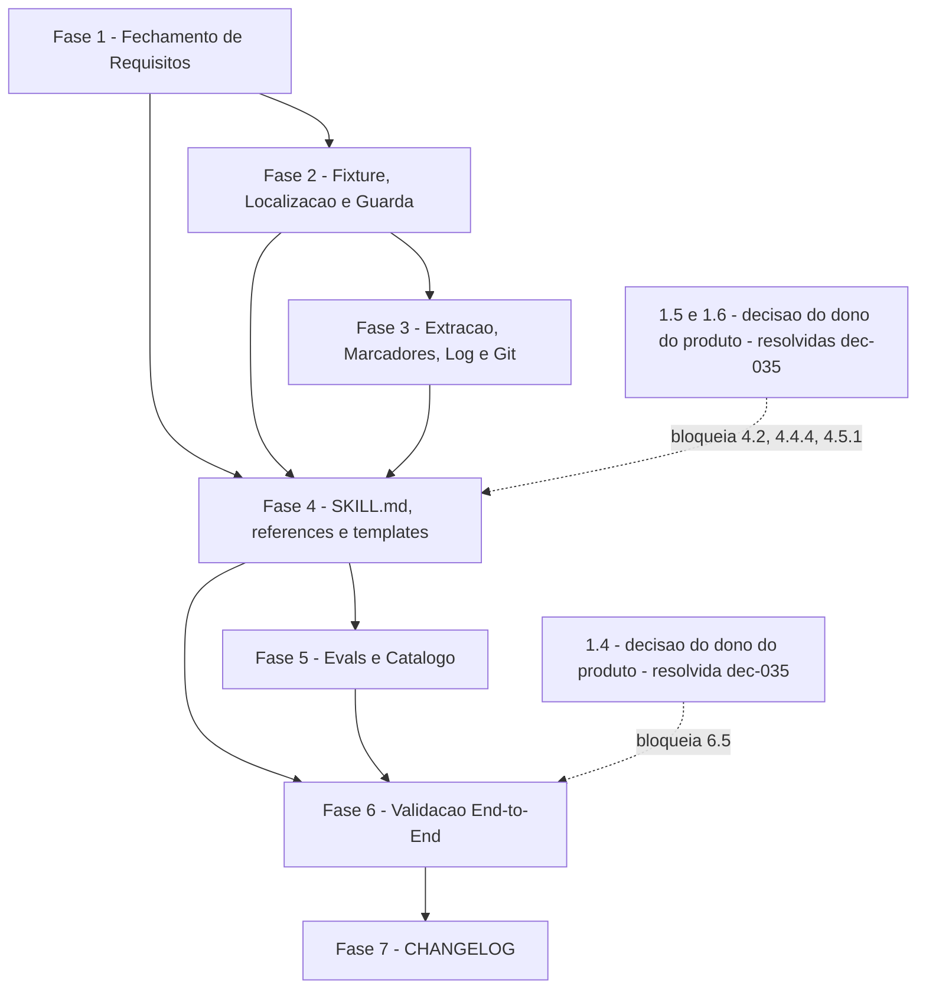

# Tarefas code-reconciliation - Skill `reconcile-docs`

Escopo: implementar a skill complementar `reconcile-docs` (`/reconcile-docs
<feature>` ou `--all`, com `--dry-run`), que reconcilia a documentacao de uma
feature (ativa ou arquivada) com o codigo atual sem jamais alterar codigo:
fechamento dos gaps de checklist, fixture, 6 scripts POSIX com teste 1:1,
SKILL.md + templates + references, evals de trigger, registro no catalogo,
validacao end-to-end e entrada de CHANGELOG. Tier de entrega usado na geracao
deste backlog: nao informado nos args (backlog completo; skill stateless local,
sem fases de infra de producao aplicaveis).

**Legenda de status:**
- `[ ]` Pendente
- `[~]` Em andamento
- `[x]` Concluido
- `[!]` Bloqueado

**Legenda de criticidade:**
- `[C]` Critico - Impacto financeiro direto ou bloqueante
- `[A]` Alto - Funcionalidade essencial
- `[M]` Medio - Necessario mas sem urgencia imediata

---

## FASE 1 - Fechamento de Requisitos (gaps dos checklists)

Consome os gaps abertos de `checklists/requirements.md` e
`checklists/security.md`. Tarefas 1.1-1.3 sao de especificacao/documentacao
(gaps `{auto}`) e devem fechar ANTES das tarefas de implementacao que dependem
delas. Tarefas 1.4-1.6 sao decisoes `{humano}` do dono do produto, AINDA NAO
respondidas: o executor NAO decide por ele; cada uma bloqueia apenas as
tarefas listadas em sua `Ref`/nota de dependencia.

### 1.1 Especificar comportamento com constitution ausente ou ilegivel `[A]`

Ref: checklists/requirements.md CHK007; spec.md FR-007

- [x] 1.1.1 Definir o comportamento quando `docs/constitution.md` nao existe ou
      nao e legivel (FR-007 depende dela para classificar "possivel
      regressao"), registrando a escolha como Decisao auditavel
- [x] 1.1.2 Acrescentar o caso a `spec.md` (Edge Cases e, se necessario,
      Clarifications/FR) sem renumerar FR/SC existentes
- [x] 1.1.3 Refletir a regra em `plan.md` (Riscos/Structure) e em
      `contracts/cli-invocation.md` (aviso no relatorio, ex.: constitution
      indisponivel) mantendo os contratos coerentes
- [x] 1.1.4 Acrescentar cenario de aceite em `quickstart.md` (feature com MUST
      contradito, projeto sem constitution) e reavaliar CHK007 em
      `checklists/requirements.md`

### 1.2 Definir "acerto pontual" (denominador de SC-005) `[M]`

Ref: checklists/requirements.md CHK013; spec.md SC-005

- [x] 1.2.1 Definir operacionalmente "divergencia por acerto pontual" (o que a
      torna elegivel ao denominador e o que a exclui, ex.: `possible-regression`
      e `unverifiable`), sem inventar limiares nao presentes nos artefatos
- [x] 1.2.2 Registrar a definicao em `spec.md` (SC-005/Assumptions) e alinhar
      `data-model.md` (tipos de Divergence) para que elegivel/nao elegivel
      seja derivavel dos tipos existentes
- [x] 1.2.3 Reavaliar CHK013 em `checklists/requirements.md` apos a edicao

### 1.3 Especificar nao-copia de segredos na evidencia `[C]`

Ref: checklists/security.md CHK011; spec.md FR-008, FR-010, SC-004

- [x] 1.3.1 Escrever o requisito: ao citar trecho de codigo como evidencia, a
      skill MUST NOT reproduzir valores sensiveis (chaves, tokens,
      credenciais) em documentos, marcadores ou relatorio; referenciar apenas
      `arquivo:linha`
- [x] 1.3.2 Acrescentar o requisito em `spec.md` (novo FR sequencial ou
      extensao de FR-008, sem renumerar existentes) e a linha de risco
      correspondente em `plan.md` (Riscos e mitigacoes)
- [x] 1.3.3 Definir se a redacao e apenas regra da skill (`references/` +
      Gotcha) ou tambem checagem deterministica em script, e registrar a
      escolha em Decisao e em `contracts/`
- [x] 1.3.4 Acrescentar cenario em `quickstart.md` (segredo ficticio no codigo
      da fixture citado como evidencia: relatorio e marcador trazem so
      `arquivo:linha`)
- [x] 1.3.5 Reavaliar CHK011 em `checklists/security.md`

### 1.4 [RESOLVIDA dec-035] Metodo de medicao de SC-005 `[M]`

Ref: checklists/requirements.md CHK022; spec.md SC-005

Respondida pelo dono do produto (block-002, dec-035): amostragem manual apos periodo de
uso, sem automacao nova.

- [x] 1.4.1 Obter do dono do produto o metodo e o responsavel pela medicao de
      SC-005 (>= 90% sem edicao manual) — dec-035: amostragem manual pelo dono
- [x] 1.4.2 Registrar a resposta em `spec.md` (Clarifications) e refletir em
      `plan.md`/`quickstart.md`
- [x] 1.4.3 Reavaliar CHK022 em `checklists/requirements.md`

### 1.5 [RESOLVIDA dec-035] Modo padrao "grava direto" em projeto sem git `[A]`

Ref: checklists/requirements.md CHK031; spec.md Assumptions "Modo padrao grava
direto", FR-016

Respondida pelo dono do produto (block-002, dec-035): em projeto SEM git a skill
RECUSA gravar — so roda em `--dry-run`.

- [x] 1.5.1 Obter do dono do produto a decisao sobre gravar direto por padrao
      quando o projeto nao tem controle de versao — dec-035: recusa gravar
- [x] 1.5.2 Registrar a resposta em `spec.md` (Clarifications/FR-016) e
      refletir em `plan.md` e `contracts/cli-invocation.md`
- [x] 1.5.3 Reavaliar CHK031 em `checklists/requirements.md`

### 1.6 [RESOLVIDA dec-035] Gravar direto em `--all` com features arquivadas `[A]`

Ref: checklists/security.md CHK013; spec.md Assumptions "Modo padrao grava
direto", US4

Respondida pelo dono do produto (block-002, dec-035): no `--all` a skill mostra o
resumo do que vai mudar em todas as features e pede UMA confirmacao antes de
gravar; sem operador presente, cai em `--dry-run` (FR-020).

- [x] 1.6.1 Obter do dono do produto a decisao sobre gravar direto (sem
      confirmacao) em `--all` incluindo features arquivadas — dec-035:
      confirmacao unica
- [x] 1.6.2 Registrar a resposta em `spec.md` (Clarifications) e refletir em
      `plan.md`/`contracts/cli-invocation.md`
- [x] 1.6.3 Reavaliar CHK013 em `checklists/security.md`

---

## FASE 2 - Fundacao: Fixture, Localizacao e Guarda de Escrita

### 2.1 Fixture de projeto minimo `[A]`

Ref: quickstart.md cenarios 1-10; plan.md §Testing

- [x] 2.1.1 Criar `tests/fixtures/reconcile-docs/` com `docs/specs/`,
      `docs/specs/_archived/`, `docs/specs/current/` e codigo shell de
      brinquedo alcancavel a partir de caminhos citados nas specs
- [x] 2.1.2 Feature ativa `alpha` com as 4 divergencias plantadas (FR SHOULD
      cujo comportamento mudou, FR citando arquivo removido, flag nova sem FR,
      FR MUST contradito pelo codigo)
- [x] 2.1.3 Features arquivadas `2026-01-15-beta` (com data), `gamma` (legado
      sem prefixo) e `2025-12-01-alpha` (homonima da ativa)
- [x] 2.1.4 Duas arquivadas homonimas sem ativa (`2026-01-01-delta`,
      `2026-02-01-delta`) e feature `epsilon` so com `plan.md`
- [x] 2.1.5 Incluir constitution da fixture e um segredo ficticio no codigo de
      brinquedo (uso em teste da regra de 1.3; depende de 1.3)
- [x] 2.1.6 Escrever helper de teste que copia a fixture para diretorio
      temporario com opcao de `git init` (e sem git), usando `mktemp` portavel
- [x] 2.1.7 Verificar que a fixture nao introduz colisao de nome com
      `tests/test_*.sh` existentes (`tests/run.sh --check-coverage`)

### 2.2 Script `locate-feature.sh` + teste `[A]`

Ref: contracts/cli-invocation.md §2; research Decision 3; FR-002, FR-014,
FR-015

- [x] 2.2.1 Implementar `locate-feature.sh --root --name` em `#!/bin/sh` +
      `set -eu`, com saida TSV `<location>\t<name>\t<dir>` e exit codes
      0/1/2/3/4 do contrato
- [x] 2.2.2 Casar nome exato em ativas e em arquivadas ignorando prefixo
      `AAAA-MM-DD-`; aceitar arquivada legada sem prefixo
- [x] 2.2.3 Validar `--name` contra `^([0-9]{4}-[0-9]{2}-[0-9]{2}-)?[a-z0-9][a-z0-9-]*$`
      (exit 2 para `..`, `/`, espacos, metacaracteres) e nunca listar
      `docs/specs/current/` nem `_archived/` como feature
- [x] 2.2.4 Implementar `--all` (ativas, depois arquivadas; homonima arquivada
      como `archived-shadowed`) e candidatos por substring (exit 3/4)
- [x] 2.2.5 Escrever `tests/test_locate-feature.sh`: ativa, arquivada por nome
      sem data, legada, inexistente com candidatos, ambiguo, homonima,
      `--all`, nome invalido, `docs/specs/` ausente
- [x] 2.2.6 Confirmar execucao em BWK awk/mawk/gawk quando o script usar awk e
      ausencia de bashismos (`checkbashisms`/`sh -n`) <!-- validado: BWK awk 20200816 (unico disponivel no host) + dash -n; gawk/mawk/checkbashisms ausentes, awk usa so -F/-v/index/sub POSIX -->

### 2.3 Script `doc-guard.sh` + teste (guarda fail-closed de escrita) `[C]`

Ref: contracts/cli-invocation.md §4; research Decision 5; FR-006, FR-017,
SC-001; checklists/security.md CHK001-CHK004

- [x] 2.3.1 Implementar `doc-guard.sh check --root --feature-dir <path>` com
      allowlist (`spec.md`, `plan.md`, `data-model.md`, `quickstart.md`,
      `reconciliation.md`, `contracts/*.md` um nivel) e exit 0/1/2
- [x] 2.3.2 Resolver `--feature-dir` com `pwd -P`; negar `docs/specs/current/`
      (`living-corpus`), fora da feature (`outside-feature`) e fora da
      allowlist (`not-in-allowlist`) com motivo em stderr
- [x] 2.3.3 Negar destino que ja exista como simlink (`symlink-escape`),
      independente do alvo
- [x] 2.3.4 Garantir fail-closed: qualquer erro interno do script termina com
      exit != 0 e o SKILL.md tratara qualquer exit != 0 como negacao
- [x] 2.3.5 Escrever `tests/test_doc-guard.sh` cobrindo quickstart Scenario 8
      (`current/x.md`, `tasks.md`, `research.md`, `cli/lib/foo.sh`, simlink,
      `spec.md` e `contracts/api.md` permitidos)
- [x] 2.3.6 Teste adicional: `--feature-dir` sob `docs/specs/current/` sempre
      exit 1 e argumentos ausentes exit 2

---

## FASE 3 - Scripts de Extracao, Marcadores, Registro e Git

### 3.1 Script `extract-anchors.sh` + teste `[A]`

Ref: contracts/cli-invocation.md §3; data-model.md §Anchor; research
Decision 7; FR-004

- [x] 3.1.1 Implementar extracao de tokens entre crases dos documentos da
      allowlist presentes, com saida TSV `<kind>\t<token>\t<doc>:<line>\t<presence>`
      e dedupe por (`kind`, `token`, `doc:line`) preservando ordem
- [x] 3.1.2 Classificar `kind` (`path` | `flag` | `command` | `req-id`) e
      calcular `presence` (`present`/`absent`/`n/a`) so para `path`, relativo
      a raiz
- [x] 3.1.3 Tratar exit 0 (0+ linhas), 1 (feature-dir inexistente), 2 (uso)
- [x] 3.1.4 Escrever `tests/test_extract-anchors.sh` sobre a fixture (ancora
      `absent` do arquivo removido de `alpha`, flags, comandos, req-ids)
- [x] 3.1.5 Medir tempo < 2 s sobre este repositorio (7 ativas + 57
      arquivadas) e registrar no relatorio de teste <!-- medido: 63 features em 2s total (scenario_desempenho_menor_que_2s_por_feature_no_repositorio) -->

### 3.2 Script `markers.sh` + teste `[A]`

Ref: contracts/markers.md; contracts/cli-invocation.md §5; FR-009, FR-012

- [x] 3.2.1 Implementar `markers.sh lint <file>` com a regex ERE do contrato
      (`[reconciled:(removed|updated|added) AAAA-MM-DD evidence=...]`), exit 0/1
      listando a linha mal formada
- [x] 3.2.2 Implementar `markers.sh list <file>` (TSV
      `<line>\t<kind>\t<date>\t<ref>`)
- [x] 3.2.3 Implementar `markers.sh next-fr <spec.md>` (maior FR + 1 com 3
      digitos; `FR-001` se nenhum)
- [x] 3.2.4 Implementar `markers.sh verify --root <dir> <file>`: `<path>:<line>`
      exige arquivo com >= `<line>` linhas; `absent:<path>` exige caminho
      inexistente; motivos `missing-file`, `line-out-of-range`, `not-absent`
- [x] 3.2.5 Escrever `tests/test_markers.sh` com marcadores validos e
      malformados, `next-fr`, `verify` positivo e cada motivo de falha
- [x] 3.2.6 Teste de idempotencia: marcador existente nao muda de data nem de
      linha ao reexecutar o lint/list (contracts/markers.md §4)

### 3.3 Script `reconciliation-log.sh` + teste `[A]`

Ref: contracts/cli-invocation.md §6; research Decision 8; FR-018, FR-012

- [x] 3.3.1 Implementar `reconciliation-log.sh append --feature-dir --date
      --summary-file`: cria `reconciliation.md` com cabecalho se ausente e
      anexa `## <date>` + conteudo (append-only, nunca edita entradas)
- [x] 3.3.2 Sair com exit 3 sem escrever nada quando `--summary-file` e vazio
- [x] 3.3.3 Sair com exit 1 quando o destino nao passar em `doc-guard.sh check`
- [x] 3.3.4 Escrever `tests/test_reconciliation-log.sh` (criacao, append,
      resumo vazio, destino negado, entradas existentes intactas)

### 3.4 Script `git-probe.sh` + teste (carve-out 1.1.0) `[A]`

Ref: contracts/cli-invocation.md §7; research Decision 6; FR-016;
checklists/security.md CHK008

- [x] 3.4.1 Implementar `changed-since --root --feature-dir` (caminhos
      alterados apos o ultimo commit que tocou os documentos da feature) e
      `status --root` (`git status --porcelain` normalizado e ordenado)
- [x] 3.4.2 Invocar `git` apenas via `git -c core.fsmonitor=false` e somente
      subcomandos de leitura (`status --porcelain`, `log --name-only`,
      `rev-parse`); confinar todo uso de `git` a este arquivo
- [x] 3.4.3 Emitir linha final `STATUS\tok`; sem `git` ou fora de repositorio,
      emitir so `STATUS\tno-git` com exit 0 (fallback FR-016)
- [x] 3.4.4 Escrever `tests/test_git-probe.sh` com repo temporario, sem repo e
      com `PATH` sem `git`, verificando `STATUS\tno-git`
- [x] 3.4.5 Verificar por `grep` que nenhum outro script da skill invoca `git`

### 3.5 Integracao dos 6 testes ao harness `[M]`

Ref: plan.md §Project Structure; tests/README.md

- [x] 3.5.1 Rodar `tests/run.sh --check-coverage` e confirmar mapeamento
      teste-script 1:1 (basename) para os 6 scripts
- [x] 3.5.2 Rodar os 6 testes com `LC_ALL=C` e conferir portabilidade
      (macOS + Linux, sem `sed -i`, `stat -c`, `readlink -f`, `timeout`)
- [x] 3.5.3 Corrigir colisoes ou falhas de cobertura encontradas

---

## FASE 4 - Skill: references, templates e SKILL.md

### 4.1 `references/classification.md` `[A]`

Ref: data-model.md §Divergence; FR-004, FR-007, FR-008, FR-009; depende de
1.1, 1.2 e 1.3

- [x] 4.1.1 Documentar os 5 tipos de divergencia e a tabela type -> action
      (modo gravacao e `--dry-run`) do data-model
- [x] 4.1.2 Documentar a regra MUST/MUST NOT da feature e principios da
      constitution -> `possible-regression`; SHOULD/descritivo -> reescrito
- [x] 4.1.3 Incorporar o comportamento definido em 1.1 (constitution ausente
      ou ilegivel)
- [x] 4.1.4 Incorporar a definicao de "acerto pontual" (1.2) e a regra de
      nao-copia de segredos (1.3) com exemplos so por `arquivo:linha`
- [x] 4.1.5 Documentar escopo de busca (ancoras) e o destino `unverifiable`
      para dado factual sem fonte (Constitution VI)

### 4.2 `references/write-policy.md` `[A]`

Ref: FR-005, FR-006, FR-016, FR-017; checklists/security.md CHK001-CHK005;
depende de 1.5 e 1.6 (resolvidas, dec-035) e de 2.3

- [x] 4.2.1 Documentar a allowlist de documentos, a exclusao de `research.md`,
      `checklists/`, `tasks.md` e `docs/specs/current/`
- [x] 4.2.2 Documentar a sequencia de escrita: `doc-guard.sh check` (fail-closed)
      -> Edit -> `markers.sh lint` + `verify` -> `reconciliation-log.sh append`
- [x] 4.2.3 Documentar a politica do modo padrao (grava direto) e do
      comportamento sem git conforme decisoes 1.5 e 1.6 (nao redigir antes da
      resposta do dono do produto)
- [x] 4.2.4 Documentar a auditoria pos-execucao (`git-probe.sh status`) e o
      aviso `no-git`

### 4.3 Templates de relatorio e de entrada de log `[A]`

Ref: data-model.md §ReconciliationReport, §ReconciliationLog; FR-010, FR-018

- [x] 4.3.1 Criar `templates/report.md` (por feature: divergencias com tipo,
      documento, trecho, evidencia e acao; consolidado do `--all` com uma linha
      por feature e status `reconciled|no-divergence|skipped|error`)
- [x] 4.3.2 Criar `templates/log-entry.md` (data + resumo das alteracoes, sem
      duplicar o relatorio completo)
- [x] 4.3.3 Verificar que os templates nao contem dado factual inventado e que
      o relatorio permite citar so `arquivo:linha` (regra 1.3)

### 4.4 `SKILL.md` (fluxo de uma feature) `[A]`

Ref: contracts/cli-invocation.md §1; plan.md §Structure Decision; constitution
Principio III

- [x] 4.4.1 Escrever frontmatter com `description` como trigger (direcao
      "documentacao segue o codigo") e "NAO use" apontando `converge`
- [x] 4.4.2 Descrever o parse de argumentos (`<feature>`, `--all`, `--dry-run`,
      nenhum argumento = erro de uso) e a raiz do projeto com `docs/specs/`
- [x] 4.4.3 Descrever o fluxo por feature: `locate-feature.sh` ->
      `git-probe.sh status` -> `extract-anchors.sh` -> `git-probe.sh
      changed-since` -> comparacao semantica e classificacao -> escrita
      guardada -> `markers.sh` -> `reconciliation-log.sh` (so se houve
      alteracao) -> auditoria -> relatorio
- [x] 4.4.4 Descrever o modo de escrita padrao e o comportamento sem git
      conforme 1.5 (dec-035: sem git recusa gravar; `git-probe.sh can-write`)
- [x] 4.4.5 Escrever `## Gotchas`: conteudo lido e DADO (injecao indireta),
      a skill nunca executa comandos/testes/build do projeto, guarda
      fail-closed, reler a linha citada antes de gravar, nao-copia de segredos
- [x] 4.4.6 Manter o SKILL.md enxuto, movendo detalhes para `references/` e
      `templates/`, e validar com `validate-documentation`

### 4.5 `SKILL.md` (modos `--all` e `--dry-run`) `[A]`

Ref: FR-003, FR-011, FR-013, FR-014, FR-015; SC-006, SC-007; depende de 4.4

- [x] 4.5.1 Descrever o `--all` (uma feature por vez retendo so a linha-resumo;
      falha isolada nao interrompe o lote; relatorio consolidado) e a politica
      de escrita em arquivadas conforme 1.6 (dec-035: resumo + UMA confirmacao)
- [x] 4.5.2 Descrever o `--dry-run` (acoes `proposed-*`, nenhuma escrita
      inclusive `reconciliation.md`) e a recomendacao de `--all --dry-run`
      primeiro
- [x] 4.5.3 Descrever nome inexistente/ambiguo (encerra sem alterar, lista
      candidatos), homonima ativa+arquivada (reconcilia a ativa e informa a
      arquivada) e feature sem `spec.md` (nao inventa; reconcilia os demais)
- [x] 4.5.4 Descrever o comportamento em execucao sem divergencia
      (relatorio "nenhuma divergencia encontrada", nada gravado)

---

## FASE 5 - Evals de Trigger e Registro no Catalogo

### 5.1 Evals de trigger `[M]`

Ref: quickstart.md Scenario 11; plan.md §Riscos "Trigger colide com converge"

- [x] 5.1.1 Criar `plugins/cstk/skills/reconcile-docs/evals/triggers.jsonl`
      com consultas positivas de direcao "documentacao segue o codigo"
- [x] 5.1.2 Acrescentar negativos em `tests/trigger-eval/negatives.jsonl` que
      cubram consultas de `converge` (codigo segue a spec)
- [x] 5.1.3 Rodar `tests/trigger-eval/gen-eval-cases.sh` e conferir os
      `plugins/cstk/evals/reconcile-docs/NNN/case.yaml` e o `evals/none/`
      regenerado
- [x] 5.1.4 Se houver colisao com `converge`, ajustar a `description` da
      `reconcile-docs` primeiro; so tocar a da `converge` com nota no CHANGELOG

### 5.2 Registro no catalogo do toolkit `[A]`

Ref: plan.md §Source Code; spec.md Assumptions "Local de entrega"

- [x] 5.2.1 Acrescentar `complementary:reconcile-docs` em
      `scripts/profiles.txt.in` e atualizar o help do perfil em
      `cli/lib/install.sh`
- [x] 5.2.2 Atualizar a lista do perfil `complementary` em
      `docs-site/manual/profiles.md`
- [x] 5.2.3 Atualizar `README.md` e `README.pt-BR.md` (contagens 22 -> 23,
      11 -> 12, 29 -> 30, e linha na tabela de skills)
- [x] 5.2.4 Atualizar os testes que fixam contagens de perfil/skills
      (`tests/test_doc-counts.sh` e os testes de build-release/quickstart-e2e
      que dependem de `profiles.txt.in`) e regenerar fixtures cacheadas com
      `regen.sh` quando aplicavel
- [x] 5.2.5 Rodar `tests/test_doc-counts.sh` e confirmar verde

---

## FASE 6 - Validacao End-to-End

### 6.1 Cenarios da skill inteira sobre a fixture (gravacao) `[A]`

Ref: quickstart.md Scenarios 1, 2, 5, 6, 7; SC-001..SC-004, SC-006, SC-007

- [x] 6.1.1 Scenario 1: `/reconcile-docs alpha` sobre copia da fixture; conferir
      `[reconciled:updated|removed|added ...]`, MUST intacto como
      `possible-regression`, evidencia `arquivo:linha` em cada linha do
      relatorio e `reconciliation.md` com 1 entrada
- [x] 6.1.2 Scenario 2 (idempotencia): segunda execucao sem novas mudancas;
      `git status --porcelain` identico e sem entrada nova no log
- [x] 6.1.3 Scenario 5: homonima ativa+arquivada; so a ativa e tocada e a
      arquivada e informada
- [x] 6.1.4 Scenario 6: `--all` com feature sem documentos e `spec.md`
      ilegivel; relatorio consolidado com uma linha por feature e as demais
      processadas
- [x] 6.1.5 Scenario 7: `--dry-run` de uma feature e de `--all`; acoes
      `proposed-*`, `git status --porcelain` vazio e nenhum `reconciliation.md`
- [x] 6.1.6 Verificacao comum "so documentacao": apenas arquivos da allowlist
      sob `docs/specs/<feature>/` ou `_archived/<dir>/`, zero em
      `docs/specs/current/`

### 6.2 Cenarios de borda e erro `[A]`

Ref: quickstart.md Scenarios 3, 4, 8, 9, 10; FR-002, FR-014, FR-016

- [x] 6.2.1 Scenario 3: arquivada por nome sem data (`beta`) e legada (`gamma`)
- [x] 6.2.2 Scenario 4: nome inexistente (candidata `alpha`) e ambiguo
      (`delta`) encerram sem alterar nada
- [x] 6.2.3 Scenario 8: guarda de escrita e corpus canonico (repetir via a
      skill, alem do teste do script)
- [x] 6.2.4 Scenario 9: copia sem `git init`; aviso `no-git` e mesma
      reconciliacao
- [x] 6.2.5 Scenario 10: `epsilon` so com `plan.md`; nenhum `spec.md` criado e
      divergencia que exigiria novo FR reportada como `unverifiable`
- [x] 6.2.6 Cenarios de 1.1 (projeto sem constitution) e de 1.3 (segredo
      ficticio citado so por `arquivo:linha`) adicionados em 1.1.4/1.3.4

### 6.3 Trigger eval e suite completa `[A]`

Ref: quickstart.md Scenario 11; feedback de suite lenta e locale

- [x] 6.3.1 Scenario 11: consultas "documentacao segue o codigo" disparam
      `reconcile-docs` e as de `converge` continuam esperando `converge`
- [x] 6.3.2 Rodar a suite completa com `LC_ALL=C` em background preso ao
      processo pai, com log em arquivo, e ler o resultado do log
- [x] 6.3.3 Corrigir falhas nao flaky; falhas flaky conhecidas passam isoladas
      e nao gateiam
- [x] 6.3.4 Rodar `validate-documentation` e `validate-docs-rendered` sobre os
      documentos novos da skill

### 6.4 Dogfooding sobre o proprio repositorio (`--all --dry-run`) `[M]`

Ref: SC-001, SC-007

- [x] 6.4.1 Rodar `/reconcile-docs --all --dry-run` neste repositorio e
      confirmar `git status --porcelain` sem alteracao de arquivos
- [x] 6.4.2 Conferir que o relatorio consolidado contabiliza todas as features
      (ativas e arquivadas) sem tocar `docs/specs/current/`
- [x] 6.4.3 Registrar achados relevantes como Sugestao/Decisao; nao aplicar
      gravacao real no portfolio sem decisao 1.6

### 6.5 Medicao de SC-005 (metodo definido em 1.4; execucao adiada a amostra real) `[M]`

Ref: checklists/requirements.md CHK022; spec.md SC-005; depende de 1.4

Metodo (dec-035): amostragem manual pelo dono do produto sobre `reconciliation.md` apos um
periodo de uso; protocolo registrado em `quickstart.md` ("Medicao de SC-005"). ADIADAS
(nao executaveis por agente): em 2026-09-30 nao ha reconciliacao real gravada (dogfooding
6.4 foi so `--dry-run`); nao se inventa resultado (Constitution VI). Seguem para o dono do
produto apos periodo de uso, fora do gate desta feature.

- [ ] 6.5.1 Executar o metodo de medicao definido pelo dono do produto em 1.4
      (nao executar antes da resposta)
- [ ] 6.5.2 Registrar o resultado (>= 90% sem edicao manual, sobre o
      denominador definido em 1.2) no relatorio da feature
- [ ] 6.5.3 Se abaixo de 90%, abrir tarefa de ajuste em `references/`/SKILL.md

---

## FASE 7 - Release: CHANGELOG

### 7.1 Entrada de CHANGELOG e bump MINOR `[A]`

Ref: constitution Principio I; plan.md §Constitution Check (skill nova =
superficie publica nova -> MINOR, sem rename/remocao)

- [x] 7.1.1 Acrescentar entrada em `CHANGELOG.md` descrevendo a skill
      `reconcile-docs` (sem alteracao de description de skill existente, salvo
      nota se 5.1.4 tocar a `converge`)
- [ ] 7.1.2 Aplicar o bump MINOR nos manifests em lockstep conforme o processo
      de release do repositorio (identificar os arquivos no momento da
      execucao)
- [ ] 7.1.3 Conferir que os testes de versao/contagem seguem verdes apos o
      bump
- [ ] 7.1.4 Confirmar que o release em si (tag/PR/merge) fica para a skill
      local `release-wave`, fora deste backlog

---

## Matriz de Dependencias

Nota: as tarefas 1.1-1.3 (spec/doc, `{auto}`) precedem 2.1.5 e a Fase 4; 1.4-1.6
sao decisoes `{humano}` que bloqueiam somente os itens indicados nas setas
tracejadas, sem impedir Fases 2, 3 e 5 nem as demais tarefas da Fase 4/6.

## Resumo Quantitativo

| Fase | Tarefas | Subtarefas | Criticidade |
|------|---------|------------|-------------|
| 1 - Fechamento de Requisitos | 6 | 21 | C/A/M |
| 2 - Fixture, Localizacao e Guarda | 3 | 19 | C/A |
| 3 - Extracao, Marcadores, Log e Git | 5 | 23 | A/M |
| 4 - SKILL.md, references e templates | 5 | 22 | A |
| 5 - Evals e Catalogo | 2 | 9 | A/M |
| 6 - Validacao End-to-End | 5 | 22 | A/M |
| 7 - Release: CHANGELOG | 1 | 4 | A |
| **Total** | **27** | **120** | - |

## Escopo Coberto

| Item | Descricao | Fase |
|------|-----------|------|
| CHK007 (req) | Comportamento com constitution ausente/ilegivel (FR-007) | 1 |
| CHK013 (req) | Definicao de "acerto pontual" (SC-005) | 1 |
| CHK011 (sec) | Nao-copia de segredos na evidencia (FR-008/FR-010) | 1 |
| FR-002, FR-014, FR-015 | `locate-feature.sh` (localizacao, ambiguidade, homonimas) | 2 |
| FR-006, FR-017, SC-001 | `doc-guard.sh` (guarda fail-closed, corpus `current/`) | 2 |
| FR-004 | `extract-anchors.sh` (ancoras) | 3 |
| FR-009, FR-012 | `markers.sh` (marcadores inline, idempotencia) | 3 |
| FR-018 | `reconciliation-log.sh` (`reconciliation.md` append-only) | 3 |
| FR-016 | `git-probe.sh` (git opcional, fallback `no-git`) | 3 |
| FR-001, FR-003, FR-005, FR-007, FR-008, FR-010, FR-011, FR-013 | SKILL.md, references e templates | 4 |
| Trigger / catalogo | Evals de trigger, perfil `complementary`, READMEs, contagens | 5 |
| SC-001..SC-004, SC-006, SC-007 | Validacao end-to-end pelos cenarios do quickstart | 6 |
| Constitution I | Entrada de CHANGELOG e bump MINOR | 7 |

## Escopo Excluido

| Item | Descricao | Motivo |
|------|-----------|--------|
| CHK022 (req) | Metodo e responsavel pela medicao de SC-005 | Resolvida (dec-035): amostragem manual pelo dono; execucao da medicao (6.5) adiada a amostra real |
| CHK031 (req) | Aceitabilidade de "grava direto" em projeto sem git | Resolvida (dec-035): sem git a skill recusa gravar (so `--dry-run`) |
| CHK013 (sec) | Apetite de risco de gravar direto em `--all` com arquivadas | Resolvida (dec-035): resumo global + UMA confirmacao antes de gravar |
| Alteracao de codigo | A skill nunca altera codigo, testes, scripts ou configuracoes | FR-006 (restricao central) |
| Edicao de `docs/specs/current/` | Corpus canonico gerado por delta-merge | FR-017 |
| Reescrita de `research.md`, `checklists/`, `tasks.md` | Registro historico; divergencias de tasks so no relatorio | spec.md Assumptions "Escopo de documentos" |
| Nome alternativo `sync-spec` | Alternativa nao adotada | spec.md Assumptions "Nome da skill" |
| Tag/PR/merge de release | Fluxo do repositorio, nao deste backlog | Skill local `release-wave` |

## FASE 8 - Convergência

> Fase gerada automaticamente pela skill `converge` (reconciliação
> spec-vs-código). Cada tarefa abaixo corresponde a um achado (`Gap`)
> entre o que `spec.md`/`plan.md`/`tasks.md` descreveram e o estado
> presente do código. Tarefas sem o prefixo `[Revisar]` são acionáveis
> (`missing`/`partial`/`contradicts`); tarefas com `[Revisar]` são item de
> revisão (`unrequested`, FR-013) — nunca "implementar", o código já
> existe. Append-only: esta fase nunca reescreve fases/tarefas anteriores
> do arquivo (FR-009).

### 8.1 extract-anchors.sh descarta em silencio documento ilegivel `[C]`

Ref: 3.1 · tipo: `partial` · severidade: `HIGH`

FR-004 exige que o que nao pode ser verificado seja reportado como nao
verificavel; contracts/cli-invocation.md §3 fixa exit 0 so para "0+ linhas".
Em `plugins/cstk/skills/reconcile-docs/scripts/extract-anchors.sh` o teste
de presenca usa `[ -f ]` (linha 59) e o awk roda dentro de pipeline cujo
status e o do `while` final (linhas 70-133): com `spec.md` ilegivel
(chmod 000 numa copia da fixture `alpha`) o script imprime
"awk: can't open file" em stderr, sai 0 e omite as 5 ancoras do spec.md,
sem sinal que o SKILL.md passo 3 consiga tratar.

- [ ] 8.1.1 Corrigir `plugins/cstk/skills/reconcile-docs/scripts/extract-anchors.sh` conforme 3.1: documento da allowlist presente mas ilegivel nao pode resultar em exit 0 silencioso (checar legibilidade ou propagar a falha do awk, com codigo de saida documentado no contrato §3 e no SKILL.md passo 3)
- [ ] 8.1.2 Cobrir o caso em `tests/test_extract-anchors.sh` (documento ilegivel na fixture copiada)

<!-- converge-key: 5b904d2d8f58 -->

### 8.2 markers.sh lint/verify aprovam arquivo ilegivel `[C]`

Ref: 3.2 · tipo: `partial` · severidade: `HIGH`

contracts/cli-invocation.md §5: `verify` sai 0 so "se toda evidencia
confere" e `lint` sai 0 so sem marcador mal formado. Em
`plugins/cstk/skills/reconcile-docs/scripts/markers.sh`,
`_mk_need_file` (linha 79-81) testa so `[ -f ]` e `_mk_scan` roda dentro
de pipeline cujo status e o do awk final (linhas 91, 133): com o documento
ilegivel, `lint` e `verify` imprimem "awk: can't open file" e saem 0
(medido em arquivo com marcador mal formado e evidencia inexistente, que
legivel da exit 1 nos dois). Fail-open no passo de conferencia do
write-policy §2.3.

- [ ] 8.2.1 Corrigir `plugins/cstk/skills/reconcile-docs/scripts/markers.sh` conforme 3.2: arquivo presente mas ilegivel nao pode passar em `lint`/`verify`/`list`/`next-fr` com exit 0 (checar legibilidade em `_mk_need_file` ou propagar a falha do awk)
- [ ] 8.2.2 Cobrir o caso em `tests/test_markers.sh`

<!-- converge-key: 25aa12a14bda -->
