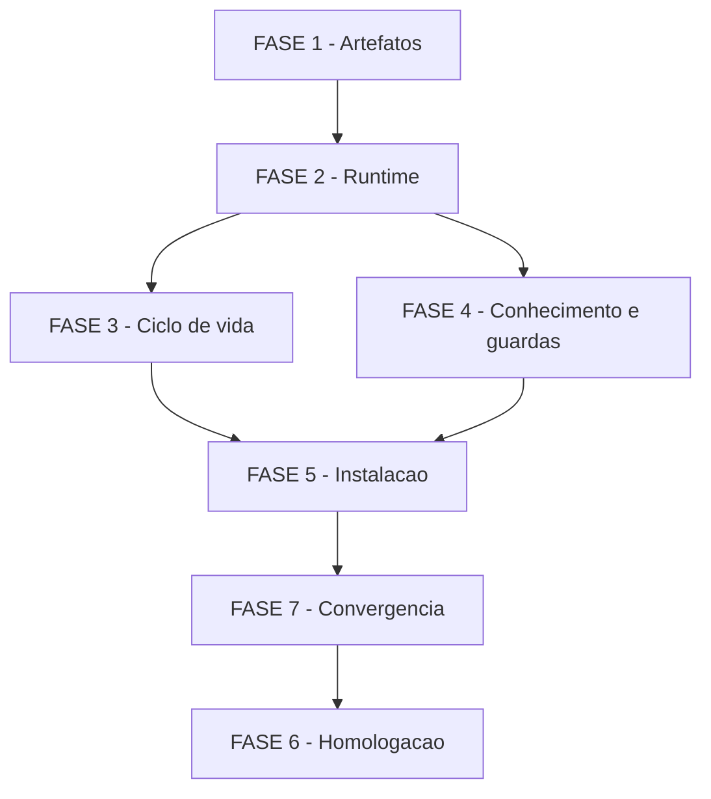

# Tarefas Pipeline CSTK no Codex - Compatibilidade local supervisionada

Escopo: normalização SDD, implementação existente e homologação das seis entradas
00c, instalação específica e conhecimento compartilhado. Status: aceite aberto.

**Legenda de status:**
- `[ ]` Pendente
- `[~]` Em andamento
- `[x]` Concluído
- `[!]` Bloqueado

**Legenda de criticidade:**
- `[C]` Crítico - segurança ou aceite bloqueante
- `[A]` Alto - funcionalidade essencial
- `[M]` Médio - qualidade e documentação

As marcações concluídas descrevem implementação/testes com evidência em
[validation.md](validation.md), não certificação nativa completa. O diário
original está em [evidence/implementation-history.md](evidence/implementation-history.md).
A FASE 7 é o backlog de conformidade encontrado por converge. Este arquivo
não altera estado/ondas nem atribui consentimento ao operador.

---

## FASE 1 - Artefatos e rastreabilidade

### 1.1 Documentação canônica `[A]`

Ref: spec.md FR-007, FR-017, FR-018

- [x] 1.1.1 Criar spec.md com stories, requisitos e cenários; preservar o histórico em evidence/implementation-history.md.
- [x] 1.1.2 Normalizar plan.md e inventariar research.md/data-model.md com Constitution Check explícito.
- [x] 1.1.3 Extrair contracts/workflows.md e contracts/installation.md do código e materializar quickstart.md.

### 1.2 Qualidade documental `[M]`

Ref: spec.md FR-017, FR-018; checklists/requirements.md

- [x] 1.2.1 Gerar checklist de requisitos com referências e donos; distinguir qualidade documental de aceite do produto.
- [x] 1.2.2 Mapear os dezoito FRs para tarefas e evidências em validation.md e review.md.
- [x] 1.2.3 Validar cenários, template, links/renderização e métricas pelos gates CSTK; registrar evidence/documentation-gates.txt.

---

## FASE 2 - Runtime e pipeline compartilhados

### 2.1 Preparação de feature/projeto `[A]`

Ref: spec.md FR-005, FR-006, FR-014

- [x] 2.1.1 Implementar contexto/bootstrap em `adapters/codex/skills/feature-00c/scripts/context.py` e `adapters/codex/skills/feature-00c/scripts/session.py`, sem sobrescrever execução.
- [x] 2.1.2 Preservar identidade/proveniência e suportar feature com governança, projeto novo e modo roadmap.
- [x] 2.1.3 Validar contexto, sessão e pipelines JSON/SQLite nos testes de fundação/projeto registrados em validation.md.

### 2.2 Ondas e gates `[A]`

Ref: spec.md FR-007, FR-008, FR-012

- [x] 2.2.1 Implementar `adapters/codex/skills/feature-00c/scripts/controller.py` com proprietário persistente, evidências e avanço de uma etapa.
- [x] 2.2.2 Capturar opt-ins explícitos/idempotentes e recusar backlog, bloqueios, drift e evidências inválidas.
- [x] 2.2.3 Validar oito/onze/três etapas em fixtures e SIGTERM/SIGKILL com recuperação explícita; não chamar isso de teste semântico.

---

## FASE 3 - Ciclo de vida e transporte

### 3.1 Retomada e aborto `[A]`

Ref: spec.md FR-002, FR-009, FR-010, FR-011

- [x] 3.1.1 Implementar seis entradas em adapters/codex/skills e fluxo resume/abort em `adapters/codex/skills/feature-00c/scripts/lifecycle.py`.
- [x] 3.1.2 Preservar identidade/opt-ins, aplicar resposta por bloqueio e encerrar com backup/relatório/ingestão, incluindo idempotência terminal.
- [x] 3.1.3 Validar retomada, aborto, lock concorrente, purge explícito e commits condicionados em JSON/SQLite e MCP nativo.

### 3.2 MCP e reconciliação `[A]`

Ref: spec.md FR-012, FR-015, FR-016

- [x] 3.2.1 Implementar seleção explícita, quinze ferramentas e propriedade entre chamadas em `adapters/codex/skills/feature-00c/scripts/mcp_bridge.py`.
- [x] 3.2.2 Implementar handoff com proveniência anterior, reconciliação por hashes e inicialização única de aspectos legados.
- [x] 3.2.3 Validar schemas, namespace nativo, isolamento de alvo/banco e respostas reais de fixtures identificadas como contrato.

---

## FASE 4 - Conhecimento e guardas

### 4.1 Conhecimento compartilhado `[A]`

Ref: spec.md FR-013, FR-014

- [x] 4.1.1 Projetar execution_provenance nullable em `cli/lib/recall.sh`, schema 16, preservando legado.
- [x] 4.1.2 Auditar recall_consulted/recall_used e referências de origem; manter ingestão/upsert best-effort e filtragem.
- [x] 4.1.3 Validar migração, ingestão repetida, precedentes e indisponibilidade do índice nos testes registrados.

### 4.2 Hooks e diagnóstico `[C]`

Ref: spec.md FR-004, FR-007, FR-012, FR-017

- [x] 4.2.1 Implementar `adapters/codex/hooks/pretooluse.py` e `adapters/codex/hooks/posttooluse.py` com política compartilhada, confinamento e sidecar.
- [x] 4.2.2 Implementar diagnóstico read-only em `adapters/codex/skills/feature-00c/scripts/native_status.py` e `adapters/codex/skills/feature-00c/scripts/native_mcp.py`, sem confiança/bypass automático.
- [x] 4.2.3 Validar payloads e descoberta real de handlers em CODEX_HOME temporário; manter cobertura de turno real na FASE 6.

---

## FASE 5 - Instalação e distribuição

### 5.1 Instalador específico `[A]`

Ref: spec.md FR-001, FR-003, FR-004

- [x] 5.1.1 Adicionar cstk install --cli=codex em `cli/lib/install.sh` e `cli/lib/install-codex.py`, com dry-run e dependências verificadas.
- [x] 5.1.2 Preservar configs/plugins/hooks alheios, proteger edits/symlinks/locks e registrar recibo/hash/banco explícito no MCP.
- [x] 5.1.3 Validar reinstalação, alteração de banco e conflitos nos seis testes de instalação finais registrados.

### 5.2 Pacote e release `[A]`

Ref: spec.md FR-002, FR-003, FR-017

- [x] 5.2.1 Construir plugin autocontido em `scripts/build-codex-plugin.py` e distribuir catalog/codex em `scripts/build-release.sh`.
- [x] 5.2.2 Restringir descoberta bootstrap/self-update à CLI externa e verificar seis skills/quinze ferramentas no pacote instalado.
- [x] 5.2.3 Validar build-release, install, self-update, bootstrap e cstk-main nos grupos shell e no app-server isolado.

---

## FASE 6 - Homologação real e aceite

### 6.1 Piloto semântico/nativo `[C]`

Ref: spec.md FR-004, FR-008, FR-009, FR-011, FR-013, FR-017; SC-002, SC-006

- [!] 6.1.1 Registrar resposta real de atomic_commit e escolha do banco do piloto; pergunta enviada, ainda sem resposta registrada.
- [!] 6.1.2 Revisar/confiar definições em /hooks e observar comandos permitidos/negados, patches e contagem em turno real; depende de sessão que carregue o plugin.
- [!] 6.1.3 Concluir entrega funcional nas oito etapas, pausa/resume e aborto em execução separada, conferindo relatórios/proveniência/ingestão.

### 6.2 Revisão externa e fechamento `[A]`

Ref: spec.md FR-017, FR-018; SC-006

- [!] 6.2.1 Obter revisão cruzada Claude; tentativa mais recente sem autenticação, nenhuma revisão produzida.
- [ ] 6.2.2 Atualizar matriz de suporte e native-acceptance.md com evidências do piloto e resultados da revisão.
- [ ] 6.2.3 Revalidar Constituição, dependências e regressões aplicáveis antes de declarar aceite; publicação de release continua fora do escopo.

---

## Matriz de Dependencias

FASES 2–5 descrevem implementação anterior já testada. A FASE 7 é reparação
emergente descoberta na revisão, numerada append-only pelo contrato converge;
a dependência real F7 -> F6 impede fechar o aceite antes da conformidade.

## Resumo Quantitativo

| Fase | Tarefas | Subtarefas | Criticidade |
|------|---------|------------|-------------|
| 1 - Artefatos | 2 | 6 | A, M |
| 2 - Runtime | 2 | 6 | A |
| 3 - Ciclo de vida | 2 | 6 | A |
| 4 - Conhecimento e guardas | 2 | 6 | A, C |
| 5 - Instalação | 2 | 6 | A |
| 6 - Homologação | 2 | 6 | C, A |
| 7 - Convergência | 2 | 6 | C |
| 8 - Registro e painel | 3 | 9 | A |
| **Total** | **17** | **51** | - |

Métricas extraídas por review-task/metrics.sh: 39 concluídas, 5 pendentes,
7 bloqueadas; 76% de subtarefas. Percentual de backlog não é percentual de
compatibilidade nem homologação.

## Escopo Coberto

| Item | Descrição | Fase |
|------|-----------|------|
| FR-001..004 | Instalação, seis entradas e revisão humana | 3, 4, 5, 6 |
| FR-005..008 | Pipeline, evidências e escolhas reais | 2, 6 |
| FR-009..012 | Retomada, bloqueios, aborto e proprietário | 2, 3, 6 |
| FR-013..014 | Conhecimento e proveniência | 2, 4, 6 |
| FR-015..016 | Handoff e reconciliação | 3 |
| FR-017..018 | Suporte evidenciado e conformidade | 1, 6, 7 |

## Escopo Excluido

| Item | Descrição | Motivo |
|------|-----------|--------|
| Interfaces adicionais | App/IDE/cloud/code-mode e ferramentas hospedadas | Exigem homologação própria; não inferir suporte do CLI |
| Autonomia expandida | Scheduler, seleção de modelos e custo/tokens | Não observados/implementados no piloto supervisionado |
| Distribuição pública | Tag, push, PR, release publicada e instalação global pelo agente | Não solicitados nesta normalização |
| Reestruturação | Fork independente e mudança de layout de estado | Reutilizar núcleo e compatibilidade existentes |

## FASE 7 - Convergência

Fase de reparação apendada pela skill converge; os achados não são aceite de risco.

### 7.1 Governança do adaptador `[C]`

Ref: spec.md FR-018; tipo: `contradicts`; severidade: `CRITICAL`

Achado em `adapters/codex/skills/feature-00c/scripts/controller.py`: Python obrigatório contradiz Constitution II; o mesmo conflito alcança hooks/instalador/build.

- [!] 7.1.1 Obter decisão real sobre emenda delimitada ou redesenho POSIX, conforme contracts/governance-proposal.md e CHK016.
- [!] 7.1.2 Aplicar a solução aprovada pelo processo Governance; declarar versão mínima/dependências e impacto do build de release.
- [!] 7.1.3 Reexecutar Constitution Check e testes aplicáveis, registrando evidência e propagação exigida.

<!-- converge-key: b8536358aec0 -->

### 7.2 Formato canônico das skills `[C]`

Ref: spec.md FR-018; tipo: `partial`; severidade: `CRITICAL`

Achado em `adapters/codex/skills/feature-00c/SKILL.md`: seção Gotchas ausente; achado agregado nas seis entradas SKILL.md, contrariando Constitution III.

- [ ] 7.2.1 Completar Gotchas nas seis entradas e usar descriptions como condições de trigger, conforme Constitution III.
- [ ] 7.2.2 Verificar referências, progressive disclosure e empacotamento das seis skills.
- [ ] 7.2.3 Validar frontmatter, suite do adaptador e instalação temporária após os ajustes documentais das skills.

<!-- converge-key: d9d56a6a51d0 -->

## FASE 8 - Registro SQLite e visibilidade no painel

Incremento solicitado pelo operador após a normalização; requer artefatos upstream.

### 8.1 Registrar execução canônica `[A]`

Ref: spec.md FR-019, FR-014, FR-018

- [x] 8.1.1 Criar state.db no layout compartilhado via bootstrap/helpers, com proveniência Codex e sem ondas/opt-ins anteriores inventados.
- [x] 8.1.2 Registrar backlog documental em metadados (task_outcome exige onda real), bloqueio constitucional e instrução de retomada pelos helpers canônicos.
- [x] 8.1.3 Validar integridade/identidade/proprietário e gerar relatório parcial auditável.

### 8.2 Ler e acompanhar SQLite no painel `[A]`

Ref: spec.md FR-019; SC-007

- [x] 8.2.1 Aceitar schema 16 em `panel/apps/server/src/config.ts`, mantendo configuração explícita de versões.
- [x] 8.2.2 Descobrir state.db e monitorar banco/WAL em `panel/apps/server/src/watchers/ingest-watcher.ts`, preservando JSON e ingestão canônica.
- [x] 8.2.3 Testar abertura schema 16, descoberta SQLite e atualização real em WAL, além de typecheck/regressões do painel.

### 8.3 Indexar e verificar visibilidade `[A]`

Ref: spec.md FR-019, FR-013, FR-017

- [x] 8.3.1 Ingerir o estado no índice configurado do painel, preservando dados anteriores.
- [x] 8.3.2 Consultar o registro pelo caminho de leitura do painel/API e conferir estado/documento de tarefas/bloqueios.
- [x] 8.3.3 Atualizar evidências, métricas e limites, sem marcar homologação semântica completa.
