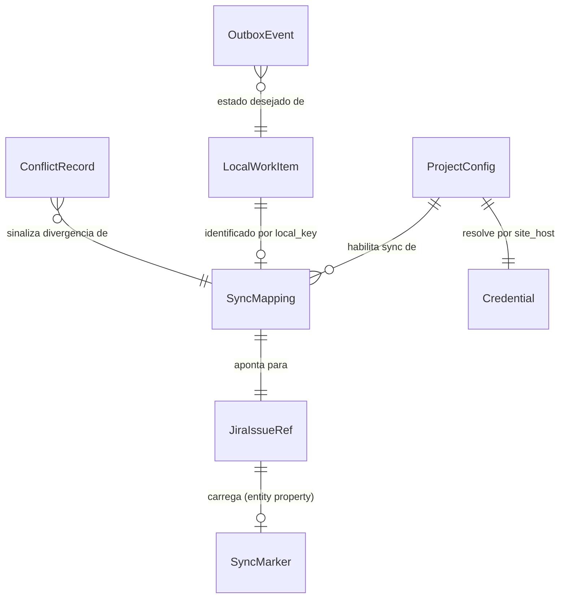
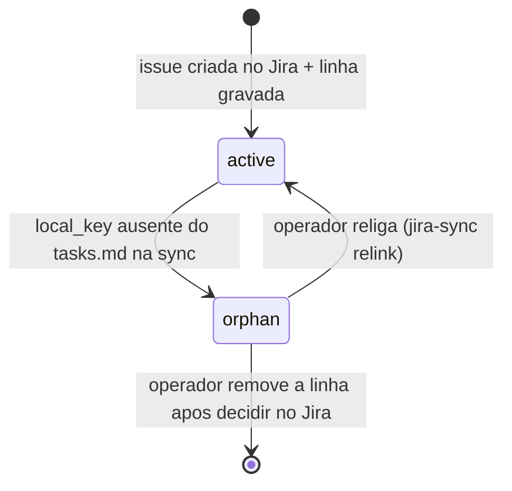
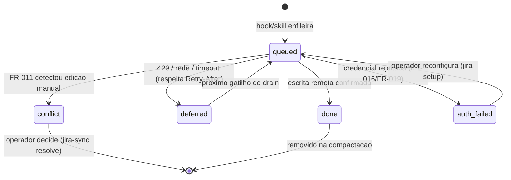

# Data Model: cstk-jira

Phase 1 do `/plan` (execucao autonoma feature-00c, onda-004). Decisoes
estruturais aplicadas: arquitetura A1 (dec-020/block-001), runtime B1
(dec-021/block-002), persistencia C1 (dec-022/block-003), ambiente-alvo D1
(dec-023/block-004).

Convencoes deste documento:

- Nomes de arquivo, chaves e colunas sao em ingles (regra global de sintaxe).
- Tudo que e **formato proprio do plugin** (arquivos locais, chave da entity
  property, colunas) e DESIGN deste plano — nao e dado factual de sistema
  externo. Tudo que e **forma de dado do Jira** e referenciado em
  `contracts/jira-rest.md` com fonte; aqui so aparece por nome de contrato.
- Nenhum valor de exemplo abaixo e um ID/chave real de Jira: exemplos usam
  placeholders entre `<>`.

## Visao geral

| Entidade | Onde vive | Versionado? | Contem segredo? |
|----------|-----------|-------------|-----------------|
| ProjectConfig | `<projeto>/.claude/cstk-jira/config` | opcional (decisao do mantenedor) | NAO |
| Credential | `${XDG_CONFIG_HOME:-$HOME/.config}/cstk-jira/credentials` | NUNCA (fora do repo) | SIM |
| LocalWorkItem | derivado de `docs/specs/<feature>/tasks.md` (+ `spec.md`) | (fonte ja versionada) | NAO |
| SyncMapping | `docs/specs/<feature>/jira-map.tsv` | SIM (fonte primaria, C1) | NAO |
| SyncMarker | entity property da issue no Jira | n/a (remoto) | NAO (so hashes) |
| OutboxEvent | `<projeto>/.claude/cstk-jira/runtime/outbox.tsv` | NAO (`runtime/.gitignore` = `*`) | NAO |
| ConflictRecord | `<projeto>/.claude/cstk-jira/runtime/conflicts.tsv` | NAO | NAO |

## Entity: ProjectConfig

Configuracao do projeto-alvo (FR-002, FR-007). Formato `key=value`, uma chave
por linha, `#` comenta; parse por `awk`/`sed` POSIX (sem `jq`). Ausencia do
arquivo = plugin INATIVO (FR-017): todo hook/skill sai em no-op antes de
qualquer outra checagem.

| Campo | Tipo | Obrigatorio | Descricao |
|-------|------|-------------|-----------|
| `config_version` | int | sim | versao do formato deste arquivo (inicia em `1`) |
| `site_host` | string | sim | host do site Jira Cloud (D1). UNICO host de rede permitido (FR-015). Validado como hostname sem esquema, sem path, sem porta, sem userinfo |
| `project_key` | string | sim | projeto Jira dedicado deste projeto-alvo (FR-002, Clarification Q1) |
| `board_id` | string | sim apos setup de board | board dedicado (US2) |
| `issue_type_epic` | string | sim | id do tipo de issue de nivel Epic, descoberto no setup (`contracts/jira-rest.md` §createmeta) |
| `issue_type_task` | string | sim | id do tipo de issue de nivel padrao |
| `issue_type_subtask` | string | sim | id do tipo de issue de nivel sub-task |
| `status_pending` | string | sim | status Jira alvo do estado local `pending` |
| `status_in_progress` | string | sim | status Jira alvo do estado local `in_progress` |
| `status_pass` | string | sim | status Jira alvo do estado local `pass` |
| `status_fail` | string | sim | status Jira alvo do estado local `fail`; MUST ser diferente de `status_pass` (US3 cenario 3) |
| `stage_status.<stage>` | string | nao | status do Epic por etapa do pipeline (`specify`..`review-task`); ausente = Epic segue a regra de derivacao abaixo |
| `sync_autonomous` | `on`/`off` | sim | liga o hook de sync autonomo (US3). Default do setup: `on` |

**Validation rules**

- `status_fail != status_pass` — o setup recusa a configuracao se o workflow do
  projeto nao oferecer um status distinto para falha (diagnostico instrui o
  admin a criar um; nao ha criacao de status pelo plugin).
- Valores de status sao os NOMES/IDs exibidos pelo proprio Jira na descoberta
  de transicoes do setup — nunca digitados de memoria pelo agente.

## Entity: Credential

Credencial de API token do Atlassian account (research Decision 2).

| Campo | Tipo | Descricao |
|-------|------|-----------|
| `site_host` | string | chave de lookup (mesmo valor de ProjectConfig) |
| `email` | string | email do Atlassian account |
| `api_token` | string | API token (expira em ate 1 ano — research Decision 2) |

**Regras de seguranca (MUST)**

- Arquivo com modo `0600`, diretorio `0700`; o plugin recusa ler arquivo com
  permissao mais aberta (diagnostico, exit != 0).
- Nunca aparece em: artefato versionado, `state.db`/`state.json`, outbox,
  conflicts, log, relatorio, mensagem de commit, argv de processo (passado ao
  cliente HTTP por arquivo/stdin de config, nunca por flag de linha de comando).
- Nunca e digitado no chat do Claude Code (entraria no transcript): o setup
  coleta o token num terminal proprio do operador (ver `quickstart.md`).
- Sem renovacao automatica possivel (FR-019 ramo "nao for possivel"):
  resposta de autenticacao rejeitada => estado `auth_failed` (ver OutboxEvent)
  + diagnostico de reconfiguracao (FR-016); nunca retry silencioso.

## Entity: LocalWorkItem (derivado, nao persistido)

Projecao de `docs/specs/<feature>/tasks.md` no formato do template canonico
(`plugins/cstk/skills/create-tasks/templates/tasks.md`).

| Campo | Tipo | Origem |
|-------|------|--------|
| `local_key` | string | `<feature>` (Epic), `N.M` (heading `### N.M`), `N.M.K` (checkbox) |
| `kind` | `epic`/`task`/`subtask` | nivel no tasks.md |
| `title` | string | texto do heading/checkbox (ou titulo da spec para o Epic) |
| `phase` | string | `FASE N - <nome>` que contem o item |
| `criticality` | `C`/`A`/`M` | tag `[C|A|M]` do heading (so tasks) |
| `local_state` | enum | ver derivacao abaixo |

**Derivacao de `local_state`**

| Kind | Regra |
|------|-------|
| subtask | checkbox `[ ]`->`pending`, `[~]`->`in_progress`, `[x]`->`pass`, `[!]`->`fail` |
| task | outcome registrado da task (`record_task`/`record-task`: `pass`/`fail`) tem precedencia; sem outcome: qualquer subtask `[!]`->`fail`; todas `[x]`->`pass`; alguma `[~]` ou mistura `[x]`+`[ ]`->`in_progress`; senao `pending` |
| epic | `stage_status.<stage>` da etapa corrente quando configurado; senao: todas as tasks `pass`->`pass`; alguma task `in_progress`/`pass`->`in_progress`; senao `pending` |

Fase (`FASE N`) e dependencia (Matriz de Dependencias) nao viram hierarquia
Jira extra (Jira tem 3 niveis: Epic > Task > Sub-task — research Decision 3,
`hierarchyLevel`): a fase entra como prefixo do titulo (`[FASE N] N.M <titulo>`)
e dependencias/criticidade entram na descricao da Task (FR-001 "quando
existirem").

## Entity: SyncMapping (fonte primaria, C1 / FR-014)

Arquivo `docs/specs/<feature>/jira-map.tsv`, TAB-separado, primeira linha =
cabecalho, versionado junto dos demais artefatos da feature. Existencia do
arquivo = feature convertida; ausencia = hook de sync ignora a feature.

| Coluna | Tipo | Descricao |
|--------|------|-----------|
| `local_key` | string | chave local (unica no arquivo) |
| `kind` | `epic`/`task`/`subtask` | |
| `jira_id` | string | id da issue retornado na criacao |
| `jira_key` | string | key da issue retornada na criacao |
| `state` | `active`/`orphan` | `orphan` = `local_key` sumiu do tasks.md (FR-012) |

**Regras**

- Busca de issue SEMPRE por `jira_id`/`jira_key` do mapeamento — nunca por
  titulo (FR-014) nem por JQL de entity property (research Decision 3: sem
  indice Connect/Forge, REST puro nao busca por propriedade).
- Idempotencia (FR-013, SC-002): item com linha `active` nunca e criado de
  novo; criacao so para `local_key` ausente do arquivo. A linha e escrita
  IMEDIATAMENTE apos a resposta de criacao (write atomico: arquivo temporario
  + `mv`), antes de qualquer outra chamada.
- Arquivo so muda quando uma issue e criada ou um item vira `orphan` — sync de
  status NAO reescreve o mapeamento (sem ruido de diff por onda).
- Renumeracao local = linha antiga vira `orphan` + item novo e criado; o card
  antigo NUNCA e apagado (FR-012) e o orfao e reportado para decisao humana.

**State transitions**

## Entity: SyncMarker (entity property da issue — marcador secundario, FR-011)

Gravado em cada issue sincronizada via entity property
(`contracts/jira-rest.md` §issue-properties / tools `getJiraEntityProperty`/
`editJiraEntityProperty`).

| Campo (valor JSON da propriedade) | Tipo | Descricao |
|-----------------------------------|------|-----------|
| `schema` | int | `1` |
| `local_key` | string | espelho do mapeamento (rastreabilidade SC-005) |
| `feature` | string | short-name da feature |
| `written_summary_sha256` | string | hash do titulo que o plugin gravou por ultimo |
| `written_status` | string | status que o plugin deixou por ultimo |
| `written_at` | string | timestamp ISO 8601 UTC da ultima escrita do plugin |

Chave da propriedade: `cstk-jira.sync` (DESIGN do plugin, nao dado externo).
So hashes/identificadores — o aviso oficial de nao guardar dado sensivel em
entity property (research Decision 3) e respeitado.

**Deteccao de conflito (FR-011)**: antes de toda escrita numa issue existente,
ler titulo + status atuais da issue e o SyncMarker. Se
`sha256(titulo_atual) != written_summary_sha256` OU
`status_atual != written_status` => alteracao manual desde a ultima sync =>
NAO escrever; gerar ConflictRecord. Issue sem SyncMarker mas presente no
mapeamento => tratado como conflito (`marker_missing`), nunca sobrescrito.

## Entity: OutboxEvent (fila local de sync)

`<projeto>/.claude/cstk-jira/runtime/outbox.tsv`, append-only com compactacao
no drain. Desacopla o gatilho (hook, que tem timeout curto) da escrita remota
e implementa "adiar sem parar a execucao" (edge case de indisponibilidade).

| Campo | Tipo | Descricao |
|-------|------|-----------|
| `event_id` | string | `<epoch>-<pid>-<seq>` |
| `created_at` | string | ISO 8601 UTC |
| `feature` | string | short-name |
| `local_key` | string | item alvo (ou `*` = reconciliar a feature inteira) |
| `desired_state` | enum | `pending`/`in_progress`/`pass`/`fail`/`reconcile` |
| `source` | enum | `hook-record-task`/`hook-close-wave`/`manual` |
| `attempts` | int | tentativas de drain |
| `status` | enum | ver transicoes |

Regra dura: com qualquer evento `auth_failed` presente, o drain NAO faz novas
chamadas (evita "repetir silenciosamente tentativas que falham", FR-016) ate
reconfiguracao.

## Entity: ConflictRecord

`<projeto>/.claude/cstk-jira/runtime/conflicts.tsv`.

| Campo | Tipo | Descricao |
|-------|------|-----------|
| `detected_at` | string | ISO 8601 UTC |
| `feature` | string | |
| `local_key` | string | |
| `jira_key` | string | |
| `reason` | enum | `manual_edit`/`marker_missing`/`orphan`/`auth_failed` |
| `resolution` | enum | `pending`/`keep_jira`/`overwrite`/`relinked`/`ignored` |

Consumido pela skill `jira-sync` (modo `status`) e pelo resumo emitido pelo
hook no fechamento de onda. Resolucao e SEMPRE decisao humana.

## Entity: JiraIssueRef (referencia externa)

Nao persistida pelo plugin alem do mapeamento: `id`, `key`, titulo, status e
tipo sao lidos do Jira conforme `contracts/jira-rest.md`. Nenhum campo e
suposto: os nomes exatos de request/response vem exclusivamente do contrato.
