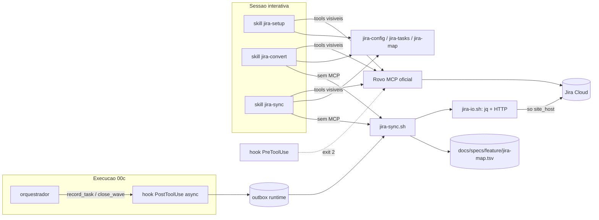
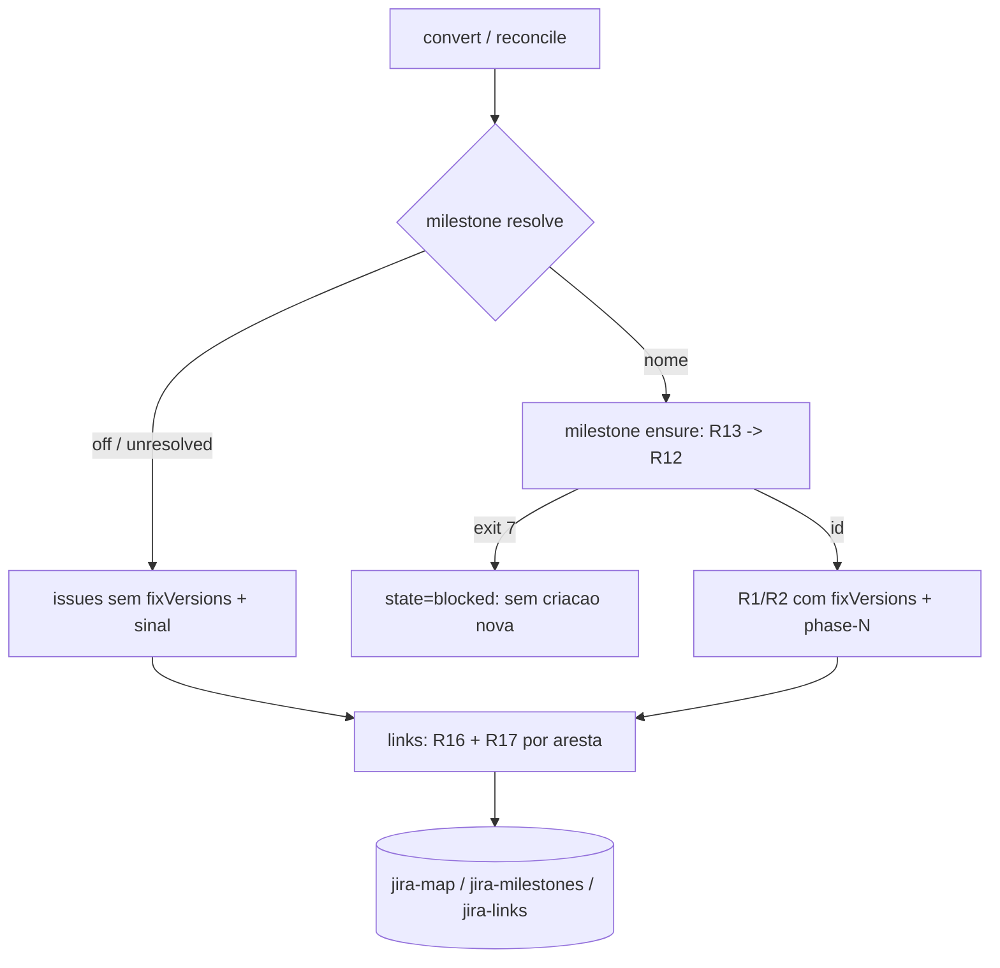

# Implementation Plan: Integracao CSTK-Jira

**Feature**: `cstk-jira` | **Date**: 2026-09-24 | **Spec**: [spec.md](./spec.md)

## Summary

Novo plugin `plugins/cstk-jira/` no marketplace do toolkit que converte uma
feature documentada (spec + tasks.md) em Epic > Task > Sub-task no Jira Cloud,
mantem um board dedicado por projeto-alvo e sincroniza o status dos cards
durante execucoes autonomas `feature-00c`/`agente-00c`.

Abordagem (decisoes estruturais com consentimento do operador):

- **Arquitetura A1** (dec-020 / block-001): skills interativas usam o
  Atlassian Rovo MCP oficial quando suas tools estao visiveis na sessao; o
  resto passa por um helper REST local. O sync autonomo e disparado por
  **hooks do proprio plugin** nos pontos de ciclo de vida ja existentes
  (`record_task` / `close_wave`, e seus equivalentes Bash) e usa REST. Sem
  servidor MCP dedicado (FR-010) e sem tocar no allowlist fechado dos
  orquestradores.
- **Runtime B1** (dec-021 / block-002): POSIX sh; `jq` e o cliente HTTP ja
  usado em `cli/lib/http.sh` confinados em UM arquivo
  (`plugins/cstk-jira/scripts/jira-io.sh`) sob o carve-out 1.1.0.
- **Persistencia C1** (dec-022 / block-003): `docs/specs/<feature>/jira-map.tsv`
  versionado e a fonte primaria do mapeamento; entity property `cstk-jira.sync`
  na issue e o marcador secundario de conflito (FR-011).
- **Ambiente D1** (dec-023 / block-004): somente Jira Cloud. Data Center/Server
  fora de escopo.
- **Autenticacao** (research Decision 2): API token do Atlassian account (Basic
  auth). Sem renovacao automatica possivel => FR-019-INFRA-REFRESH resolvido pelo ramo
  "tratar como credencial invalida" (FR-016): suspensao explicita, nunca retry.

## Technical Context

**Language/Version**: POSIX sh (`#!/bin/sh`, `set -eu`) para scripts e hooks;
Markdown para skills.
**Primary Dependencies**: `jq` + cliente HTTP de linha de comando (o mesmo de
`cli/lib/http.sh`), ambos OPCIONAIS sob o carve-out 1.1.0 e confinados em
`plugins/cstk-jira/scripts/jira-io.sh`; Atlassian Rovo MCP Server (remoto,
oficial, configurado pelo usuario — nao empacotado).
**Storage**: arquivos texto — `jira-map.tsv` versionado por feature;
`.claude/cstk-jira/config` (sem segredo); `.claude/cstk-jira/runtime/`
(outbox/conflitos, nao versionado); credencial em
`${XDG_CONFIG_HOME:-$HOME/.config}/cstk-jira/credentials` (`0600`).
**Testing**: suite POSIX existente (`tests/run.sh`, descoberta em
`tests/cstk/test_*.sh`); cliente HTTP substituido por stub — nenhum teste toca
rede. Licao ja registrada no repo: stub no PATH nao esconde binario de
`/usr/bin`, entao o teste de "dependencia ausente" MUST controlar o PATH
inteiro do SUT (PATH minimo explicito), nao so prefixar um diretorio.
**Target Platform**: macOS e Linux com Claude Code + plugins (ambiente POSIX — constitution Principio II); Jira Cloud (spec D1).
**Project Type**: plugin do Claude Code (skills + hooks + scripts).
**Performance Goals**: SC-003 — card reflete o outcome ate o fim da mesma onda
em >=95% das sincronizacoes (garantido pelo drain obrigatorio em
`close_wave`).
**Constraints**: FR-015 (so o host configurado); rate limit Jira (429 +
`Retry-After`; 20 escritas / 2 s por issue — research Decision 3); cota do
Rovo MCP por plano; hooks nunca bloqueiam/atrasam o orquestrador.
**Scale/Scope**: um projeto Jira + um board por projeto-alvo; dezenas a poucas
centenas de itens por feature (limite de 50 no bulk create — research
Decision 3 — nao e usado no MVP; criacao item a item preserva o mapeamento
atomico).

## Constitution Check

*GATE: Deve passar antes do Phase 0. Re-checado apos Phase 1 (abaixo).*

| Principio | Status | Notas |
|-----------|--------|-------|
| I. SDD recursivo | PASS | spec + clarify + plan nesta pipeline; tasks.md vira na etapa create-tasks. Plugin novo nao altera contrato de skill existente; CHANGELOG + bump de versao no release (lockstep MP-5) |
| II. POSIX sh, zero dep | PASS com carve-out 1.1.0 | `jq` + cliente HTTP so em `jira-io.sh` (condicao b); declarados aqui com justificativa e fallback (condicao c); fallback verificavel = caminho interativo via Rovo MCP + scripts POSIX puros, com o sync autonomo saindo com exit 5 e eventos preservados no outbox (condicao a — coberto por teste com PATH sem as deps). Consentimento explicito do operador: block-002. Leitura de `current_stage`/`canonical_project` sob backend `state.db`: NENHUMA dependencia nova no plugin — delega ao runtime `agente-00c-runtime` (`state-rw.sh`) que ja detem `sqlite3` sob o carve-out 1.3.0 restrito a ele proprio; ver Complexity Tracking (task 13.1.1) |
| III. Formato canonico de skill | PASS | 3 skills (`jira-setup`, `jira-convert`, `jira-sync`) com SKILL.md enxuto, `references/`, Gotchas e description-como-trigger |
| IV. Zero coleta remota | PASS | rede so para o host Jira do proprio usuario, que e o proposito inerente da feature; nenhum endpoint do autor; host unico validado por salto (FR-015) |
| V. Profundidade | PASS | escopo fechado nas 4 user stories; DC fora (D1) |
| VI. Zero fabricacao | PASS condicionado | todo endpoint/campo/tool em `contracts/` tem URL + citacao; itens sem fonte ficam marcados `NAO ENCONTRADO` e FORA do contrato; tarefa bloqueante de reconferencia contra a pagina de referencia (ou chamada observada) antes de codificar o cliente REST |

## Architecture



Fluxos:

1. **Setup (US4, FR-007)** — `jira-setup`: grava `ProjectConfig`; instrui o
   operador a gravar a credencial num terminal proprio (nunca no chat);
   valida credencial remota; descobre tipos de issue (createmeta) e
   transicoes/status do workflow e pede ao operador o mapeamento
   `pending/in_progress/pass/fail` (recusa `fail == pass`); lista os tipos de
   issue retornados (`id`, `name`, `hierarchyLevel`, `subtask`) e pede ao
   operador que CONFIRME explicitamente qual e Epic, qual e Task e qual e
   Sub-task antes de gravar `issue_type_*` — o valor de `hierarchyLevel` que
   corresponde a Epic e `NAO ENCONTRADO` nas fontes oficiais
   (`contracts/jira-rest.md` R8), entao o sistema NUNCA infere esse
   mapeamento sozinho (checklist CHK006 do gate `api`); cria ou reusa o
   filtro + board kanban do projeto (US2 cenario 2: reuso, sem duplicar).
   Projeto Jira: reusa um existente; criacao so via tool `createJiraProject`
   do Rovo MCP ou pela UI do Jira (path REST v3 de criacao de projeto =
   `NAO ENCONTRADO`, research Decision 3 — SUPERADO no round r02: R18 `createProject` com gate humano, ver fluxo 7).
2. **Convert (US1, FR-001/003/013/014)** — `jira-convert`: pre-checagens
   completas antes da 1a escrita; cria Epic, Tasks filhas (`parent`) e
   Sub-tasks; grava `jira-map.tsv` item a item; grava SyncMarker. Reexecucao
   cria so o que falta (US1 cenario 2).
3. **Sync autonomo (US3, FR-004/005/018)** — hook async enfileira e drena;
   drain obrigatorio no `close_wave` (SC-003). Conflito manual (FR-011) =>
   nao escreve, registra ConflictRecord. Credencial rejeitada => `auth_failed`,
   suspende chamadas ate reconfigurar. Jira indisponivel => `deferred`; a
   execucao da feature NUNCA para por causa do Jira (edge case da spec).
4. **Board (US2)** — board kanban sobre filtro JQL do projeto; colunas =
   status do workflow; o plugin move cards so por transicao de status.

## Project Structure

### Documentation (this feature)

```text
docs/specs/cstk-jira/
├── spec.md
├── research.md        # Phase 0 (onda-003)
├── plan.md            # este arquivo
├── data-model.md
├── quickstart.md
└── contracts/
    ├── jira-rest.md       # subconjunto REST v3 + Agile, com fontes
    ├── rovo-mcp.md        # tools do Rovo MCP usadas + deny-list
    ├── hooks.md           # hooks.json do plugin
    └── plugin-scripts.md  # CLI interna do plugin
```

### Source Code (repository root)

```text
plugins/cstk-jira/                      # NOVO (so esta subarvore e instalada)
├── .claude-plugin/plugin.json          # version em lockstep (MP-5)
├── hooks/
│   ├── hooks.json
│   ├── posttooluse-jira-sync.sh
│   └── pretooluse-jira-deny-destructive.sh
├── scripts/
│   ├── jira-io.sh                      # UNICO arquivo com jq + cliente HTTP
│   ├── jira-config.sh
│   ├── jira-tasks.sh
│   ├── jira-map.sh
│   └── jira-sync.sh
└── skills/
    ├── jira-setup/{SKILL.md,references/}
    ├── jira-convert/{SKILL.md,references/}
    └── jira-sync/{SKILL.md,references/}

.claude-plugin/marketplace.json         # ALTERADO: 3a entrada cstk-jira
scripts/validate-plugin-manifests.sh    # ALTERADO: MP-2 "exatamente 2" -> "exatamente 3"
tests/cstk/test_validate-plugin-manifests.sh  # ALTERADO: fixture com 3 plugins
tests/cstk/test_jira-*.sh               # NOVOS (descobertos por tests/run.sh L140)
CHANGELOG.md                            # ALTERADO no release
```

**Structure Decision**: plugin separado (padrao `cstk-language-go`), instalado
so via marketplace (FR-008). NAO espelhado no tarball do `cstk install`
(`scripts/build-release.sh` so espelha `plugins/cstk/` e
`plugins/cstk-language-*/` — L160-227): distribuir por dois canais dobraria a
matriz de teste sem ganho, e hooks de plugin so existem no canal plugin.

## Pontos explicitos exigidos pela onda-003

| # | Ponto | Tratamento no plano |
|---|-------|---------------------|
| 1 | Gate `MP-2` exige exatamente 2 plugins (`scripts/validate-plugin-manifests.sh` L11, L95-98) | mudar para exatamente 3 + fixture de teste; mantida a rigidez (um plugin a mais/a menos continua quebrando o gate). `MP-5` exige `plugin.json` do cstk-jira na mesma versao do release |
| 2 | Deny-list de `deleteJiraIssue` (FR-012) | hook `PreToolUse` com matcher regex `mcp__.*__(deleteJiraIssue\|executeDestructive)` e exit 2 (`contracts/hooks.md`); `jira-io.sh` nao tem metodo `DELETE`; skills citam a proibicao em Gotchas |
| 3 | Dominio Jira no allowlist de URLs da execucao | NAO necessario e deliberadamente NAO feito: o `bash-guard` e hook `PreToolUse` com matcher `Bash` (`plugins/cstk/hooks/hooks.json`) e so inspeciona comandos da tool Bash; o sync autonomo roda como subprocesso de hook do plugin e nenhum script recebe URL em argv. A garantia de FR-015 fica no proprio `jira-io.sh` (host unico por igualdade exata, sem seguir redirect para outro host) — mesmo desenho do `cli/lib/http.sh` pos-issue #178. Registrado como Decisao desta onda |
| 4 | Descritor local do Rovo MCP em `/v1/mcp` vs recomendado `/v2/mcp` | o plugin NAO empacota `.mcp.json` (evita segunda conexao ao mesmo servidor e acoplamento a um endpoint); `jira-setup` detecta tools visiveis por sufixo de nome e o quickstart recomenda `https://mcp.atlassian.com/v2/mcp` (README oficial). Os nomes de tool usados existem so no MCP v2 (research Decision 1) — com descritor v1 as tools v2 passam a ser expostas conforme o README; divergencia de data da migracao fica registrada como ressalva |
| 5 | API token expira em ate 1 ano sem renovacao automatica | FR-019-INFRA-REFRESH pelo ramo "nao e possivel": `401` => `auth_failed`, suspende o drain, diagnostico de reconfiguracao (FR-016) — expiracao de token se manifesta como `401`, nao `403` (403 em R1/R2 e permissao insuficiente, distinto — ver Test Strategy "Falha"); `jira-setup` exibe a data de validade informada pelo operador como lembrete (nao ha API citada para ler a expiracao) |

## Convencoes de Borda

| Camada | Case style | Validacao | Fonte da verdade |
|--------|------------|-----------|------------------|
| Arquivos do plugin (config, TSV, chave de property) | snake_case (colunas/chaves), kebab-case (arquivos) | `jira-config.sh validate`, cabecalho TSV | `data-model.md` |
| Payload REST Jira | como definido pela Atlassian (camelCase na maioria dos campos citados) | nomes so de `contracts/jira-rest.md` | paginas oficiais citadas no contrato |
| Parametros de tool Rovo MCP | como definido pela Atlassian | nomes so de `contracts/rovo-mcp.md` | paginas oficiais citadas |
| stdin de hook | snake_case (Claude Code) | leitura por campo nomeado | `contracts/hooks.md` |

**Mapper layer**: `jira-sync.sh` traduz `LocalWorkItem` -> corpo REST (via
`jira-io.sh json-build`); nenhum outro arquivo monta JSON.

## Test Strategy

| Nivel | O que cobre | Como |
|-------|-------------|------|
| Unit (POSIX) | parse de tasks.md, derivacao de `local_state`, mapeamento atomico, deteccao de orfao, validacao de config/host | fixtures de tasks.md em `tests/cstk/fixtures/` |
| Contrato | corpo/metodo/path gerados pelo motor batem com `contracts/jira-rest.md` | stub do cliente HTTP grava a requisicao; assert sobre metodo, path e chaves |
| Idempotencia (SC-002) | 10 execucoes de `convert` seguidas => 0 criacoes apos a 1a | stub com estado |
| Falha | 401 (qualquer operacao) => `auth_failed` sem retry; 403 em R1/R2 (criar/editar issue) => `permission_denied` (diagnostico "credencial valida, permissao insuficiente no projeto/tipo", NUNCA reconfiguracao de credencial — `contracts/jira-rest.md` "Validacao de credencial": 403 em R1/R2 e permissao, nao credencial); 403 nas demais operacoes (sem fonte que os distinga) segue tratado como `auth_failed` ate nova fonte; 429 => `deferred`; host divergente/redirect => recusa sem requisicao; deps ausentes => exit 5 | stub + PATH controlado |
| Hooks | no-op sem config (SC-006); fail-open; nunca imprime/grava `session_id`; guarda exit 2 | stdin sintetico |
| Mutation | cada guarda (host, DELETE, deny, no-op) e quebrada de proposito para provar que o teste pega | pratica ja adotada no repo |
| E2E manual | roundtrip REAL contra um site Jira Cloud de teste | `quickstart.md` cenario 6 (captura do payload real e comparacao com o contrato) |

## Complexity Tracking

| Violacao / tensao | Por Que Necessario | Alternativa Simples Rejeitada Porque |
|-------------------|--------------------|--------------------------------------|
| Deps nao-POSIX (`jq` + cliente HTTP) no plugin | parse/geracao de JSON e HTTPS sao inerentes a uma API REST; confinadas em `jira-io.sh` com fallback interativo (carve-out 1.1.0, consentido em block-002) | Node/TS zero-dep (B2) — rejeitado pelo operador; JSON em `awk` puro — fragil para respostas reais e seria parser proprio sem teste de conformidade |
| Sync autonomo so via REST (MCP so no interativo) | hooks de linha de comando nao chamam tools MCP; o allowlist dos orquestradores e fechado (research Decision 1) | ampliar o allowlist (A3) ou MCP dedicado (A2) — rejeitados pelo operador em block-001 |
| Terceiro plugin quebra `MP-2` | invariante foi escrito para 2 plugins (feature `claude-plugin-packaging`) | derivar a contagem do diretorio — afrouxaria o gate |
| Leitura de `current_stage`/`canonical_project` quando a execucao ativa usa backend SQLite (`state.db`) | `jira-sync.sh` (`_js_resolve_state_field`/`_js_runtime_state_rw`) e o hook `posttooluse-jira-sync.sh` (via `jira-sync.sh resolve-state-field`) precisam do valor para `stage_status.<stage>` (12.8.1) e para a derivacao de `canonical_project`; nenhuma dependencia nova e introduzida no plugin (task 13.1.1) — o ramo `state.db` DELEGA ao helper `state-rw.sh` do runtime `agente-00c-runtime` (localizavel via `CSTK_LIB` ou `~/.claude/skills/agente-00c-runtime/scripts`), que ja detem `sqlite3` sob o carve-out 1.3.0 restrito ao proprio runtime; `jira-sync.sh` NUNCA invoca `sqlite3` diretamente | manter `sqlite3` embutido no plugin (o achado 13.1.1: violava carve-out 1.1.0 — 2 arquivos, sem declaracao, sem teste do ramo `state.db`) — rejeitado; sem runtime localizavel, o override e OMITIDO (mesmo efeito pratico de "dependencia ausente", nunca inventa uma etapa — Principio VI) |

## Requisitos de seguranca derivados do gate owasp-security (onda-005)

Gate pos-plan (0 critical / 0 high / 3 medium / 2 low). Os itens abaixo sao
requisitos de desenho que `create-tasks` MUST converter em tarefas com teste;
nao introduzem dado factual novo (charsets sao regras de validacao locais do
plugin, nao formato afirmado do Jira).

| ID | Sev. | Categoria | Requisito |
|----|------|-----------|-----------|
| SEC-1 | medium | A01/API7 (path) | `jira-io.sh request` MUST rejeitar, sem requisicao, PATH com `..`, `//`, `\`, `@`, `#`, espaco, CR/LF ou qualquer byte de controle; segmentos vindos do mapeamento (`jira_id`/`jira_key`, arquivo versionado editavel por quem tem escrita no repo) e de `project_key` MUST casar allowlist de charset `[A-Za-z0-9_-]` antes da interpolacao |
| SEC-2 | medium | LLM01/ASI01 | texto lido do Jira (titulo, descricao, nomes de status, comentarios, respostas das tools Rovo) e DADO, nunca instrucao: as skills interativas MUST apresenta-lo rotulado como conteudo externo nao-confiavel e nenhuma decisao de sync (transicao, sobrescrita, resolucao de conflito) pode ser derivada de texto livre do Jira — so de ids/keys/status mapeados e da escolha humana (conflitos ja sao decisao humana, data-model) |
| SEC-3 | medium | A05 (JQL) | JQL montada pelo plugin (hoje so o filtro do board, corpo de R9 via `jira-io.sh json-build filter`; a idempotencia FR-013/FR-014 e conferida pela presenca no mapeamento local `jira-map.tsv`, nunca por busca JQL; `searchJiraIssuesUsingJql` fica restrita a conferencia manual do operador, `contracts/rovo-mcp.md` — ajuste de prosa do converge ciclo 2) MUST interpolar so valores que passaram pela allowlist de SEC-1; nenhum texto livre (titulo/descricao) entra em JQL |
| SEC-4 | low | A04/CWE-377 | arquivo de config temporario do cliente HTTP que carrega o header de autenticacao MUST ser criado com `umask 077` em diretorio privado e removido por `trap` em EXIT/INT/TERM; teste confere modo e remocao |
| SEC-5 | low | A02/API7 | o cliente HTTP MUST rodar sem seguir redirect e com verificacao TLS ativa (proibido desligar verificacao de certificado); resposta 3xx => erro sem nova requisicao (complementa "host divergente/redirect => recusa" da Test Strategy) |

Controles ja presentes no desenho e confirmados pelo gate: host unico por
`site_host` validado como hostname puro, credencial resolvida POR `site_host`
(alterar o host no config versionado nao desvia o token para outro host),
credencial `0600`/`0700` fora do repo e fora de argv/log, metodos fechados em
`GET`/`POST`/`PUT` (sem `DELETE`), `401` => `auth_failed` sem retry (403 em
R1/R2 => `permission_denied`, distinto — ver Test Strategy "Falha"),
`429` => `deferred` com `Retry-After`, hooks no-op sem config e sem
imprimir `session_id`.

## Round r02 (2026-09-26) — incremento FR-020..FR-025

**Escopo**: cobrir "um projeto completo" no Jira — marco (Fix Version) acima
do Epic, label de FASE, um Epic por feature do roadmap, criacao do projeto
Jira sob gate humano e dependencias como issue links. Tudo ADITIVO ao r01
(nenhum contrato, coluna ou comportamento do r01 muda sem flag/chave nova).
Decisoes: `research.md` §"Round r02" (R2-1..R2-9); forma do Jira:
`contracts/jira-rest.md` R12-R18 (OpenAPI oficial, sha256 identico ao do
r01); interface do plugin: `contracts/plugin-scripts.md` e `contracts/hooks.md`
§r02; entidades: `data-model.md` §r02; cenarios: `quickstart.md` 8-13.

### Technical Context (delta)

Sem mudanca de linguagem, dependencia, storage de base, plataforma ou tipo de
projeto. Acrescimos: 2 sidecars versionados por feature
(`jira-milestones.tsv`, `jira-links.tsv`), 7 chaves opcionais em
ProjectConfig, 2 chaves opcionais no SyncMarker; 7 operacoes REST novas
(R12-R18), todas via `jira-io.sh`. Constraint nova: `createVersion` exige
*Administer Projects* (ou *Administer Jira*) e `createProject` exige
*Administer Jira* — permissoes que o token de sync comum pode nao ter (ver
Riscos).

### Constitution Check (round r02)

*Re-checado apos o design r02 (abaixo) — mesmo resultado.*

| Principio | Status | Notas |
|-----------|--------|-------|
| I. SDD recursivo | PASS | delta na spec (FR-020..FR-025 + Clarifications 2026-09-26) -> plan r02 -> checklist -> tasks; plugin muda de comportamento => CHANGELOG + bump no release (lockstep MP-5) |
| II. POSIX sh, zero dep | PASS (carve-out 1.1.0 inalterado) | nenhuma dependencia nova: `jq` + cliente HTTP continuam SO em `jira-io.sh`; os sidecars e `phase-edges`/`check-*`/`resolve-path` sao POSIX puro (`awk`/`sed`); `git` so e usado de forma opcional em `resolve-path` (sem `git` => so o cwd, nunca erro) e ja e ferramenta do ambiente de qualquer projeto-alvo com worktree; a conferencia de bloqueio humano (`--consent-block`) DELEGA ao `bloqueios.sh` do `agente-00c-runtime`, mesmo padrao do r01 13.1.1 — o plugin NUNCA chama `sqlite3` |
| III. Formato canonico de skill | PASS | `jira-setup`/`jira-convert`/`jira-sync` ganham passos e Gotchas (gate de projeto, label/marco/link), sem skill nova |
| IV. Zero coleta remota | PASS | rede continua so para `site_host` do proprio usuario; nenhuma chamada nova fora dele |
| V. Profundidade | PASS | escopo fechado nos 6 FRs; nada de sprints, componentes, versoes liberadas pelo plugin ou multi-projeto |
| VI. Zero fabricacao | PASS condicionado | toda operacao nova cita metodo/path/operationId/path JSON do OpenAPI; 6 pontos que o OpenAPI nao determina ficam "a confirmar por roundtrip no execute-task" (contrato §"Continua fora do contrato apos o plan r02") e viram tarefa BLOQUEANTE (quickstart cenario 12) antes do codigo depender deles; divergencia spec x OpenAPI (403 vs 404 em `createVersion`) registrada, nao escondida; nome do marco de release NUNCA calculado (R2-1) |

### Fluxos novos

5. **Convert com marco + labels + links (US1 estendida)** — `jira-sync.sh
   convert`: pre-checagens do r01 -> `milestone resolve` (sem rede) ->
   `milestone ensure` (R13; R12 so se o nome exato nao existir; `400` =>
   reler R13) -> Epic (R1 com `fixVersions`) -> Tasks/Sub-tasks (R1 com
   `fixVersions` quando aplicavel e `labels:["phase-<N>"]`) -> `links`
   (R16 uma vez por execucao, R17 por aresta sem linha `active`). Marco
   `blocked` interrompe ANTES da 1a criacao nova (R2-4).
6. **Reconcile idempotente (close_wave)** — o evento `reconcile` do r01 passa
   a: (a) garantir o marco corrente no Epic, trocando SO a versao que o
   plugin gravou (`update.fixVersions` remove/add, R2-2); (b) ajustar
   `phase-<N>` de tasks que mudaram de fase (`update.labels` remove/add,
   R2-5); (c) rodar `links`. Cada escrita e precedida de leitura (R3/R15) e
   pulada se o estado ja bate — 10 reconciles seguidos => 0 escritas apos o
   1o (SC-002 estendido). Transicoes de status continuam independentes do
   marco (SC-003 nao regride).
7. **Setup com oferta de projeto (US4 estendida, FR-024)** — reusar sempre
   primeiro (`getProject`/`searchProjects`); sem projeto e com
   `project_create=gated`, oferecer criacao. *Interativo*: confirmacao
   explicita de nome/key/tipo/template, repetindo a key
   (`create-project --confirm-key`). *Autonomo*: a skill nao cria; devolve ao
   orquestrador um pedido de gate, que registra `register_human_block`
   (Bash: `bloqueios.sh register`) ou usa `ask_operator` (`kind=confirm`,
   default = nao criar) e encerra a onda; na onda seguinte, com o bloqueio
   `respondido`, `create-project --consent-block block-NNN`. `403` => orientar
   criacao manual. Depois do projeto: tipos (R8, agora conferindo tambem se
   `labels`/`fixVersions` estao na tela de criacao), tipo de link (R16 +
   confirmacao do operador -> `link_type_id`), status e board como no r01.
8. **Execucoes paralelas (FR-023)** — cada worktree do roadmap sincroniza o
   proprio Epic; ProjectConfig resolvido do cwd ou, ausente, da worktree
   principal (somente leitura); `runtime/` por worktree; marco de release
   compartilhado protegido pela releitura de R13 (R2-3).



### Project Structure (delta)

```text
plugins/cstk-jira/scripts/jira-io.sh        # ALTERADO: --op R12..R18, json-build version|link|project, validate-version-name|project-key
plugins/cstk-jira/scripts/jira-config.sh    # ALTERADO: chaves novas + resolve-path
plugins/cstk-jira/scripts/jira-tasks.sh     # ALTERADO: phase-edges
plugins/cstk-jira/scripts/jira-map.sh       # ALTERADO: milestone-*/link-* (sidecars)
plugins/cstk-jira/scripts/jira-sync.sh      # ALTERADO: milestone resolve|ensure, links, convert/drain/status/plan
plugins/cstk-jira/scripts/jira-setup.sh     # ALTERADO: check-field-support, check-link-type, create-project
plugins/cstk-jira/hooks/hooks.json          # ALTERADO: matcher createJiraProject
plugins/cstk-jira/hooks/pretooluse-jira-deny-destructive.sh  # ALTERADO: modo project-create
plugins/cstk-jira/hooks/posttooluse-jira-sync.sh             # ALTERADO: resolve-path + resumo
plugins/cstk-jira/skills/{jira-setup,jira-convert,jira-sync}/  # ALTERADOS: passos + Gotchas r02
tests/cstk/test_jira-*.sh                   # ALTERADOS/NOVOS (cenarios 8-13 com stub)
docs/specs/<feature>/jira-milestones.tsv    # NOVO por feature convertida (gerado em runtime)
docs/specs/<feature>/jira-links.tsv         # NOVO por feature convertida (gerado em runtime)
```

Nenhum arquivo fora de `plugins/cstk-jira/` e `tests/cstk/` muda (o
marketplace ja tem o 3o plugin desde o r01; so o bump de versao no release).

### Convencoes de Borda (delta)

| Camada | Case style | Validacao | Fonte da verdade |
|--------|------------|-----------|------------------|
| Chaves novas de ProjectConfig/SyncMarker, colunas dos sidecars | snake_case | `jira-config.sh validate`, cabecalho TSV | `data-model.md` §r02 |
| Label de fase | `phase-<N>` (kebab) | SEC-1 | Clarification r02 |
| Nome de Fix Version | `<feature>-rNN` ou SemVer | SEC-6 | research R2-1/R2-9 |
| Payload R12-R18 | camelCase da Atlassian (`projectId`, `fixVersions`, `outwardIssue`, `leadAccountId`, ...) | nomes so do contrato | `contracts/jira-rest.md` R12-R18 |

Mapper layer inalterado: so `jira-io.sh json-build` monta JSON.

### Seguranca (SEC-1..5 estendidos + SEC-6..8)

| ID | Extensao / requisito novo |
|----|---------------------------|
| SEC-1 | + aplica-se a `phase-<N>`, `link_type_id`, `jira_version_id`, `blocker_key`/`blocked_key` e `project_key` proposto no gate (este tambem pela regra do OpenAPI de R18) |
| SEC-2 | + nomes de tipo de link (`name`/`inward`/`outward` de R16), nomes de versao e de projeto lidos do Jira sao DADO: exibidos rotulados ao operador; a escolha automatica de tipo de link so compara frases com a raiz fixa `block` e nunca executa/obedece texto delas |
| SEC-3 | + nenhuma JQL nova: marco (R13) e links (R15/R16) sao lidos por rota + casamento local, nunca por busca JQL; nome de versao/label NUNCA em JQL |
| SEC-4/SEC-5 | inalterados, valem para todas as operacoes novas (mesmo `request`) |
| SEC-6 (novo) | nome de Fix Version: allowlist `^[A-Za-z0-9][A-Za-z0-9._-]{0,254}$`; nunca em PATH/querystring/JQL, so no corpo via `jq --arg` |
| SEC-7 (novo, ASI02/LLM06 — excessive agency) | criacao de projeto so com consentimento verificavel (`--confirm-key` fora de execucao autonoma; `--consent-block` com bloqueio `respondido` dentro dela); guarda `PreToolUse` nega `createJiraProject` em execucao 00c ativa; o hook de sync nunca cria projeto |
| SEC-8 (novo, FR-012) | operacoes destrutivas do Jira presentes no OpenAPI (`DELETE`, `removeAndSwap`, `mergeto`, `project/.../delete`) ficam fora do contrato; `update.*` com `remove` so remove valores gravados pelo proprio plugin (SyncMarker `written_*`), nunca valores humanos |

### Riscos e degradacoes

| Risco | Degradacao (nunca para a execucao da feature) |
|-------|-----------------------------------------------|
| Token sem *Administer Projects* => `createVersion` negado (documentado como `404`) | `milestone=blocked:<nome>`, criacao de issues novas suspensa (Clarification r02), transicoes seguem; instrucao: conceder permissao ou `milestone_mode=off` |
| Nome da release inexistente (`[Unreleased]`) | `milestone=unresolved`, itens sem marco, anexados na reconciliacao seguinte quando `milestone_release` for definido ou a versao aparecer |
| Versao duplicada por corrida entre worktrees | releitura de R13 apos `400`, reuso do id |
| Tipo de link ausente/ambiguo, linking desligado, `413` | `unrepresentable` por aresta, visivel em `status`/`hook.log` |
| `update.fixVersions` reprovado no roundtrip | troca de marco do Epic vira sinal `milestone_drift` sem escrita (nunca clobber) |
| Direcao inward/outward invertida | corrigida no contrato apos o roundtrip, antes do codigo |
| Tela de criacao sem `labels`/`fixVersions` | setup grava `labels_enabled=off`/`fix_versions_on_subtask=off` com aviso |
| Token sem *Administer Jira* no gate de projeto | exit 7 + orientacao de criacao manual (FR-024) |
| Worktree sem `git` no PATH | so o config do cwd; sem config => no-op (FR-017) |

### Impacto em hooks e skills existentes

- `posttooluse-jira-sync.sh`: `resolve-path`, reconcile mais rico, resumo com
  sinais novos; mesmo fail-open e nao-exfiltracao.
- `pretooluse-jira-deny-destructive.sh`: 1 modo novo (`project-create`); a
  deny-list de exclusao do r01 nao muda.
- `jira-setup` (skill): passos novos (oferta de projeto com gate, conferencia
  de campos R8, escolha confirmada de `link_type_id`, `milestone_mode`/
  `milestone_release`); Gotcha: "nunca criar projeto em contexto autonomo".
- `jira-convert` (skill): caminho MCP nao cobre marco/links (sem tool citada,
  `rovo-mcp.md` r02) — usa o helper REST para eles; sem deps, sinaliza.
- `jira-sync` (skill): `status` mostra marco/links; `resolve` aceita os
  `reason` novos (`milestone_drift`/`label_drift`).
- Orquestradores do toolkit: NENHUMA mudanca (o gate de projeto usa as
  primitivas ja existentes de bloqueio humano).

### Test Strategy (delta)

| Nivel | O que cobre |
|-------|-------------|
| Unit | `milestone resolve` (round/release/unresolved/off, divergencia de contagem de rounds), `phase-edges`, SEC-6, `validate-project-key`, invariante "1 `current`" do sidecar |
| Contrato | corpos de R12/R14/R17/R18 batem com `jira-rest.md` (stub grava a requisicao); nenhum `type.name`, nenhum `fields`+`update` do mesmo campo |
| Idempotencia | 10x convert/reconcile => 0 R12/R17/edicoes apos a 1a passada |
| Falha | cenarios 8a-8c, 9a-9b, 10a-10c, 11a-11b |
| Gate | `create-project` sem consentimento => 0 requisicoes; guarda `createJiraProject` exit 2 com execucao ativa |
| Mutation | quebrar de proposito: SEC-6, gate de consentimento, "remove so o proprio valor", guarda `createJiraProject` — o teste MUST falhar |
| E2E manual | quickstart cenario 12 (BLOQUEANTE antes do codigo depender dos 6 itens "a confirmar") |

### Complexity Tracking (r02)

Nenhuma violacao nova de principio MUST. Tensao registrada: o marco de
release depende de o projeto-alvo nomear a proxima versao (override
`milestone_release`), porque inferi-la seria fabricacao — aceita como
degradacao `unresolved`, nao como violacao.

### Requisitos derivados do gate owasp-security (plan r02, onda-003)

Gate sobre o DESENHO r02 (sem codigo novo): 0 critical / 0 high / 2 medium /
3 low / 1 info. Os medium/low viram requisitos que `create-tasks` MUST
converter em tarefas com teste (inclusive mutation). Nenhum dado factual novo.

| ID | Sev. | Categoria | Requisito |
|----|------|-----------|-----------|
| SEC-9 | medium | ASI03/confused deputy | `--consent-block block-NNN` so vale se o bloqueio (a) esta `respondido`, (b) tem na `pergunta` o marcador literal `cstk-jira:create-project key=<K> name-sha256=<H> template=<T>` gerado pelo proprio plugin para AQUELE pedido (K/T/H iguais aos argumentos da chamada), (c) a resposta e a opcao afirmativa fixa `criar-projeto`, e (d) nunca foi consumido antes — o consumo e registrado em `runtime/consumed-consents.tsv` (append, nao versionado) e um 2o uso do mesmo `block-NNN` sai exit 2 sem requisicao. Bloqueio respondido de OUTRO assunto nunca autoriza criacao |
| SEC-10 | medium | A08/integridade (entity property e editavel no Jira) | o SyncMarker vive no Jira e qualquer usuario com edicao da issue pode altera-lo: `update.fixVersions` `remove` so e emitido se `written_fix_version_id` TAMBEM consta em `jira-milestones.tsv` da feature (`current`/`superseded`); `update.labels` `remove` so se o valor casa `^phase-[0-9]+$`. Divergencia marker x sidecar => `ConflictRecord` (`milestone_drift`/`label_drift`), nunca remocao |
| SEC-11 | low | A05 | o token de round lido do state MUST casar `^r[0-9]{2,}$` e o heading do CHANGELOG MUST casar SemVer (`^[0-9]+\.[0-9]+\.[0-9]+([-+][0-9A-Za-z.-]+)?$`) ANTES de compor o nome do marco; alem disso SEC-6 no nome final |
| SEC-12 | low | API4 | respostas de R13/R16 (listas nao-paginadas) passam pelo mesmo teto de tamanho de corpo do `jira-io.sh request` (se o r01 nao tiver teto, a tarefa o introduz para TODAS as operacoes); corpo acima do teto => `deferred` com diagnostico, nunca parse parcial |
| SEC-13 | low | ASI01/LLM01 | a escolha automatica de tipo de link (R2-6) so considera `id`s devolvidos por R16 NA MESMA execucao e nunca vale quando o operador ja confirmou `link_type_id`; o nome/frases do tipo escolhido sao exibidos rotulados como conteudo externo em `status`/`plan` |
| — | info | A01 | fallback de ProjectConfig para a worktree principal nao amplia superficie: credencial continua resolvida por `site_host` (r01) e o config do cwd continua tendo precedencia, como no r01 |
