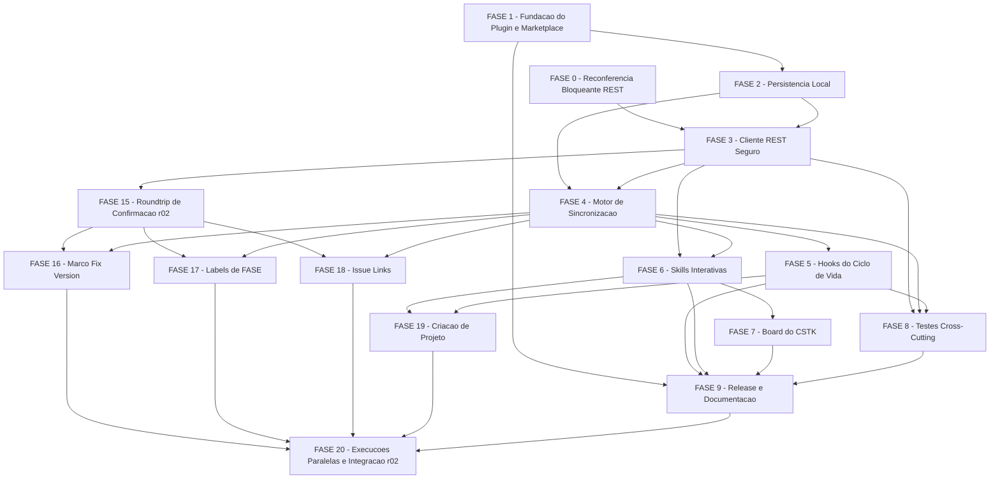

# Tarefas cstk-jira - Plugin de integracao com Jira Cloud

Escopo: plugin `plugins/cstk-jira/` que converte uma feature documentada
(spec + tasks.md) em Epic > Task > Sub-task no Jira Cloud, mantem um board
dedicado por projeto-alvo e sincroniza status durante execucoes autonomas
`feature-00c`/`agente-00c` — conforme `spec.md`, `plan.md`, `data-model.md`,
`quickstart.md` e `contracts/{jira-rest,rovo-mcp,hooks,plugin-scripts}.md`.

**Legenda de status:**
- `[ ]` Pendente
- `[~]` Em andamento
- `[x]` Concluido
- `[!]` Bloqueado

**Legenda de criticidade:**
- `[C]` Critico - Impacto financeiro, regulatorio ou de seguranca
- `[A]` Alto - Funcionalidade core sem a qual o plugin nao opera
- `[M]` Medio - Necessario mas pode ser adiado sem impacto imediato

**Tier de entrega usado na geracao deste backlog**: nao aplicavel (feature
`cstk-jira` nao foi gerada com tier de entrega citado nos args da invocacao;
backlog completo, sem omissao de fases — `/feature-00c` nunca propaga tier).

---

## FASE 0 - Reconferencia Bloqueante do Contrato REST `[C]`

Ref: plan.md Constitution Check (Principio VI "PASS condicionado");
`contracts/jira-rest.md` "Continua fora do contrato apos a onda-005";
`quickstart.md` Cenario 6; checklists/api.md CHK003/CHK004/CHK007.

Bloqueante: NENHUMA tarefa de FASE 3 (cliente REST) pode comecar antes desta
fase confirmar (ou corrigir) os campos ainda marcados `(exemplo)`/RECONFERIR/
NAO ENCONTRADO. Executada uma unica vez, contra um site Jira Cloud de teste
do operador (nunca produtivo).

### 0.1 Roundtrip real contra Jira Cloud de teste `[C]`

Ref: quickstart.md Cenario 6; contracts/jira-rest.md R1/R3/R4/R5/R8.

- [x] 0.1.1 Obter (do operador) um site Jira Cloud de teste + API token
      valido, seguindo a mesma disciplina de `data-model.md` Credential
      (token nunca digitado no chat; coletado em terminal proprio) — resolvido
      via block-008/dec-053 (novo token classico gerado pelo operador,
      confirmado com `GET /myself` 200 na onda-011)
- [x] 0.1.2 `GET /rest/api/3/issue/{issueIdOrKey}` sobre uma issue de teste e
      capturar a resposta REAL: comparar `fields.status`, `fields.issuetype`,
      `fields.updated` contra o que `contracts/jira-rest.md` R3 descreve —
      feito contra `SCRUM-6` (onda-011); ver contracts/jira-rest.md secao R3
- [x] 0.1.3 `POST /rest/api/3/issue` (criacao de uma issue de teste) e
      capturar o corpo aceito REAL: comparar `fields.project`,
      `fields.issuetype`, `fields.summary`, `fields.parent`,
      `fields.description` (ADF) contra R1 — feito: Epic `SCRUM-5` + Story
      `SCRUM-6` (filha via `fields.parent`) criadas no projeto `SCRUM`
      (onda-011); ver contracts/jira-rest.md secao R1
- [x] 0.1.4 `GET /rest/api/3/issue/createmeta/{projectIdOrKey}/issuetypes`
      sobre o projeto de teste e conferir se `hierarchyLevel` de Epic aparece
      de fato na resposta (R8 — hoje NAO ENCONTRADO nas fontes estaticas) —
      confirmado: Epic=1, Task=0, Story=0, Subtask=-1 (onda-011)
- [x] 0.1.5 `GET /rest/api/3/issue/{issueIdOrKey}/transitions` e conferir o
      elemento de `transitions` (`id`, `name`, `to.name`, `to.id`) contra R5 —
      feito contra `SCRUM-6` (onda-011); achou contradicao `looped`→`isLooped`
      (dec-057), corrigida no contrato
- [~] 0.1.6 Deletar/arquivar a issue de teste criada em 0.1.3 (via UI do
      Jira, NUNCA via `deleteJiraIssue`/`DELETE` do plugin — FR-012) —
      PENDENTE: exige UI do Jira (navegador), fora do alcance das ferramentas
      deste orquestrador autonomo; `SCRUM-5` e `SCRUM-6` seguem no projeto
      `SCRUM` (sandbox) ate o operador arquiva-las manualmente

### 0.2 Atualizar `contracts/jira-rest.md` com os achados `[C]`

Ref: Principio VI (Zero Fabricacao) — nenhum campo confirmado por 0.1 pode
ficar com o marcador antigo desatualizado.

- [x] 0.2.1 Para cada campo confirmado em 0.1, editar `contracts/jira-rest.md`
      trocando o marcador (`(exemplo)`/`RECONFERIR`/`NAO ENCONTRADO`) por
      `CONFIRMADO (roundtrip onda-011)` com o valor observado — feito (data
      real do teste, nao a estimativa antiga "onda-007", para nao registrar
      proveniencia incorreta)
- [x] 0.2.2 Para campos que a chamada real contradisser o contrato, registrar
      Decisao auditavel (`--score 3 --evidencia "<trecho literal da resposta
      observada>"`) e corrigir o contrato — nunca prosseguir com dado
      divergente — feito: dec-057 (`isLooped` vs `looped`)
- [x] 0.2.3 Teste: `grep` de auditoria confirmando que nenhuma linha usada
      pelo motor (FASE 3/4) permanece com marcador `NAO ENCONTRADO` apos a
      edicao (exceto os itens explicitamente fora do contrato: changelog,
      `fields.project.key`, `statusCategory.key`, path de criacao de
      projeto — `contracts/jira-rest.md` "Continua fora do contrato")

---

## FASE 1 - Fundacao do Plugin e Marketplace `[A]`

Ref: plan.md Project Structure; plan.md "Pontos explicitos exigidos pela
onda-003" #1/#2.

### 1.1 Scaffold do plugin `plugins/cstk-jira/` `[A]`

Ref: plan.md Project Structure (Source Code).

- [x] 1.1.1 Criar arvore de diretorios: `plugins/cstk-jira/{.claude-plugin,
      hooks,scripts,skills/jira-setup/references,
      skills/jira-convert/references,skills/jira-sync/references}`
- [x] 1.1.2 Criar `plugins/cstk-jira/.claude-plugin/plugin.json` (nome
      `cstk-jira`, descricao, `version` inicial, `author`, `repository`,
      `license`, `keywords` — mesmo formato de
      `plugins/cstk-language-go/.claude-plugin/plugin.json`)
- [x] 1.1.3 Teste: `tests/cstk/test_manifest.sh`/`test_manifest-coverage.sh`
      (ou fixture equivalente) reconhece o novo plugin.json como valido
      (schema minimo: `name`, `version`, `description`) — implementado como
      `tests/cstk/test_cstk-jira-plugin-manifest.sh` (fixture equivalente,
      allowlisted em `tests/run.sh::_is_internal_test`; PASS 3/3)

### 1.2 Registrar no marketplace e ajustar o gate MP-2 `[A]`

Ref: plan.md "Pontos explicitos exigidos pela onda-003" #1;
`scripts/validate-plugin-manifests.sh` L11/L95-98.

- [x] 1.2.1 Adicionar 3a entrada em `.claude-plugin/marketplace.json`:
      `name: cstk-jira`, `description`, `source: ./plugins/cstk-jira`,
      `version` (lockstep com `plugin.json` de 1.1.2), `category`
- [x] 1.2.2 Editar `scripts/validate-plugin-manifests.sh`: MP-2 de
      "`.plugins | length == 2`" para "`== 3`" (mensagem de erro atualizada
      de "exatamente 2" para "exatamente 3")
- [x] 1.2.3 Atualizar a fixture de `tests/cstk/test_validate-plugin-manifests.sh`
      para incluir o 3o plugin (cstk-jira) no `marketplace.json` de teste,
      mantendo os casos negativos (2 e 4 plugins continuam falhando MP-2) —
      implementado como `scenario_mp2_duas_entradas` +
      `scenario_mp2_quatro_entradas`
- [x] 1.2.4 Teste: `bash scripts/validate-plugin-manifests.sh` roda limpo
      contra o `marketplace.json` real do repo apos 1.2.1 — `sh
      scripts/validate-plugin-manifests.sh --repo-root . --version 10.7.0
      --strict` => `validate-plugin-manifests: OK (0 aviso(s))`, exit 0
- [x] 1.2.5 Teste: `tests/cstk/test_validate-plugin-manifests.sh` verde,
      incluindo os 2 casos negativos de 1.2.3 — 12/12 cenarios PASS
      (`sh tests/cstk/test_validate-plugin-manifests.sh`)

---

## FASE 2 - Persistencia Local `[A]`

Ref: data-model.md (ProjectConfig, LocalWorkItem, SyncMapping);
contracts/plugin-scripts.md `jira-config.sh`/`jira-tasks.sh`/`jira-map.sh`.

### 2.1 `jira-config.sh` `[A]`

Ref: data-model.md Entity ProjectConfig; contracts/plugin-scripts.md
`jira-config.sh`.

- [x] 2.1.1 Subcomando `get KEY`: le `ProjectConfig` (`key=value`, `#`
      comenta); exit 3 se arquivo ausente (FR-017 — plugin inativo)
- [x] 2.1.2 Subcomando `validate`: campos obrigatorios presentes;
      `site_host` valido como hostname puro (sem esquema/path/porta/
      userinfo); `status_fail != status_pass` (recusa com diagnostico
      instruindo o admin a criar um status distinto no workflow)
- [x] 2.1.3 Subcomando `credential-check`: confere existencia + permissao
      `0600` do arquivo de credencial para `site_host`, sem imprimir
      nenhum valor (data-model.md "Regras de seguranca")
- [x] 2.1.4 Teste unit: fixtures de `ProjectConfig` validas/invalidas
      (`status_fail == status_pass`, `site_host` com esquema/porta,
      arquivo ausente) cobrindo os 3 subcomandos
- [x] 2.1.5 Teste: `credential-check` recusa arquivo com permissao mais
      aberta que `0600` sem nunca imprimir o conteudo

### 2.2 `jira-tasks.sh` `[A]`

Ref: data-model.md Entity LocalWorkItem (derivacao de `local_state`).

- [x] 2.2.1 Subcomando `items --feature F`: parse de
      `docs/specs/<feature>/tasks.md` no formato do template canonico
      (`plugins/cstk/skills/create-tasks/templates/tasks.md`) emitindo TSV
      `local_key kind phase criticality local_state title` — implementado
      em `plugins/cstk-jira/scripts/jira-tasks.sh` (awk single-pass,
      `--outcomes-file`/`--stage` adicionados e documentados em
      `contracts/plugin-scripts.md` para servir 2.2.3/2.2.4)
- [x] 2.2.2 Derivacao de `local_state` para `subtask` (`[ ]`->`pending`,
      `[~]`->`in_progress`, `[x]`->`pass`, `[!]`->`fail`)
- [x] 2.2.3 Derivacao de `local_state` para `task` (outcome de
      `record_task`/`record-task` tem precedencia sobre os checkboxes;
      sem outcome: alguma subtask `[!]`->`fail`; todas `[x]`->`pass`;
      mistura/`[~]`->`in_progress`; senao `pending`) — outcome lido via
      `--outcomes-file` (TSV `task_id<TAB>outcome`; quem grava o arquivo e
      FASE 4/5, fora do escopo desta tarefa)
- [x] 2.2.4 Derivacao de `local_state` para `epic` (`stage_status.<stage>`
      quando configurado; senao agregacao das tasks — data-model.md regra)
      — `--stage STAGE` delega a `jira-config.sh get "stage_status.STAGE"`
- [x] 2.2.5 Titulo do Epic prefixado por fase (`[FASE N] N.M <titulo>`);
      dependencias/criticidade entram na descricao da Task (nao viram
      hierarquia Jira extra — data-model.md) — reconciliado: o padrao
      `[FASE N] N.M <titulo>` so se aplica a uma TASK (tem N.M; Epic nao
      tem), conforme o restante do proprio enunciado ("descricao da
      Task") e a definicao de `title` em data-model.md (texto puro, sem
      prefixo); `jira-tasks.sh` ja expoe phase+local_key+title como
      colunas separadas — a composicao da string final do
      `fields.summary` fica para quem monta o corpo REST (FASE
      3.5.2/4.1.3), nao para esta projecao local
- [x] 2.2.6 Teste unit: fixtures de `tasks.md` cobrindo cada combinacao de
      `local_state` (Epic/Task/Subtask) das subtarefas 2.2.2-2.2.4,
      incluindo o caso "task sem nenhuma subtask ainda" (`pending`) —
      `tests/cstk/test_jira-tasks.sh` (16 cenarios, PASS)

### 2.3 `jira-map.sh` `[A]`

Ref: data-model.md Entity SyncMapping (jira-map.tsv, FR-013/FR-014).

- [x] 2.3.1 Subcomando `get --feature F --local-key K`: le linha do
      mapeamento ou exit 1 — implementado em
      `plugins/cstk-jira/scripts/jira-map.sh`
- [x] 2.3.2 Subcomando `put --feature F --local-key K --kind KIND
      --jira-id ID --jira-key KEY`: insercao atomica (arquivo temporario +
      `mv`); recusa `local_key` ja `active` (idempotencia FR-013) — recusa
      tambem `local_key` ja `orphan` (data-model.md: "criacao so para
      local_key ausente do arquivo"; reativar e escopo exclusivo de `relink`)
- [x] 2.3.3 Subcomando `mark-orphans --feature F`: compara contra
      `jira-tasks.sh items`, marca `orphan` as chaves ausentes do
      `tasks.md`, imprime os orfaos; card Jira NUNCA e apagado (FR-012) —
      exit 6 quando ha ao menos 1 orfao (contracts/plugin-scripts.md),
      exit 0 caso contrario
- [x] 2.3.4 Subcomando `relink --feature F --local-key K --jira-key KEY`:
      religa um orfao por decisao humana (`orphan` -> `active`) — exige
      que `KEY` confira exatamente com o `jira_key` armazenado (confirmacao
      explicita de qual card esta sendo religado)
- [x] 2.3.5 Teste de idempotencia (SC-002): 10 chamadas de `put` seguidas
      para o mesmo `local_key` resultam em 0 linhas novas apos a 1a —
      `scenario_idempotencia_10x_put_mesma_chave_zero_linhas_novas`
- [x] 2.3.6 Teste de renumeracao/orfao: `local_key` removido do `tasks.md`
      vira `orphan` via `mark-orphans`; `relink` restaura `active` sem
      nunca ter apagado a linha original —
      `scenario_mark_orphans_marca_e_nunca_apaga` +
      `scenario_relink_sucesso_reativa_sem_apagar`; testes em
      `tests/cstk/test_jira-map.sh` (16 cenarios, PASS)

---

## FASE 3 - Cliente REST Seguro `jira-io.sh` (carve-out 1.1.0) `[C]`

Ref: plan.md SEC-1..SEC-5; contracts/plugin-scripts.md `jira-io.sh`;
UNICO arquivo do plugin que referencia `jq` + cliente HTTP.
**Depende de FASE 0** (contrato reconferido) e FASE 2 (ProjectConfig).

### 3.1 `deps-check` + `request` com host unico e SEC-5 `[C]`

Ref: plan.md SEC-5; contracts/plugin-scripts.md `jira-io.sh request`.

- [x] 3.1.1 `deps-check`: exit 5 + instrucao de instalacao se `jq` ou o
      cliente HTTP estiverem ausentes do PATH (carve-out 1.1.0 condicao a)
- [x] 3.1.2 `request METHOD PATH [--body-file F]`: `METHOD` restrito a
      allowlist fechada `GET`/`POST`/`PUT` (sem `DELETE` — FR-012); `PATH`
      relativo iniciado em `/rest/`
- [x] 3.1.3 Monta `https://<site_host><PATH>` com `site_host` de
      `ProjectConfig`; valida host por IGUALDADE EXATA (sem userinfo, sem
      porta) antes de CADA requisicao
- [x] 3.1.4 Cliente HTTP configurado para NUNCA seguir redirect e SEMPRE
      verificar TLS (SEC-5); resposta `3xx` => erro sem nova requisicao
      (nao existe flag de configuracao para desligar a verificacao TLS)
- [x] 3.1.5 Teste: dependencia ausente => exit 5, com PATH MINIMO explicito
      controlado no teste inteiro (nao so prefixar um diretorio — licao ja
      registrada no repo: stub no PATH nao esconde binario de `/usr/bin`)
- [x] 3.1.6 Teste: host divergente (resposta simulada com redirect para
      outro dominio) => recusa SEM nova requisicao
- [x] 3.1.7 Teste: chamada de `request` com `METHOD=DELETE` falha por uso
      incorreto (exit 2) — `DELETE` nunca existe como opcao valida

      Implementado em `plugins/cstk-jira/scripts/jira-io.sh` (subcomandos
      `deps-check` + `request`); testes em `tests/cstk/test_jira-io.sh` (12
      cenarios JI-1..JI-12, PASS). Nesta versao `request` NAO envia header
      `Authorization` (credencial entra na tarefa 3.3) e nao classifica
      status HTTP alem de "3xx recusado" (mapeamento fino fica para 3.4).

### 3.2 Allowlist de charset em path/JQL (SEC-1) `[C]`

Ref: plan.md SEC-1; checklists/security.md CHK001/CHK002.

- [x] 3.2.1 Validar segmentos de PATH vindos do mapeamento (`jira_id`/
      `jira_key`) e de `project_key` contra allowlist `[A-Za-z0-9_-]`
      ANTES de qualquer interpolacao
- [x] 3.2.2 Rejeitar, sem fazer requisicao, PATH contendo `..`, `//`, `\`,
      `@`, `#`, espaco, CR/LF ou qualquer byte de controle
- [x] 3.2.3 Cobrir TODOS os pontos de interpolacao do motor: R1-R11
      (contracts/jira-rest.md) + a JQL de FASE 7 (SEC-3)
- [x] 3.2.4 Teste: cada byte proibido de 3.2.2, isoladamente, causa recusa
      sem requisicao (tabela de casos)
- [x] 3.2.5 Teste: `jira_id`/`jira_key`/`project_key` fora do charset
      `[A-Za-z0-9_-]` (ex.: contendo espaco ou `/`) e recusado

      Implementado em `plugins/cstk-jira/scripts/jira-io.sh`:
      `_ji_path_has_forbidden_bytes` aplicada ao PATH inteiro dentro de
      `request` (guarda central — cobre R1-R11 porque `request` e o unico
      ponto de disparo de requisicao, independente de onde/como o motor
      futuro montar o PATH) + novo subcomando `validate-segment VALUE...`
      (`_ji_charset_ok`, allowlist `[A-Za-z0-9_-]`) para o motor validar
      `jira_id`/`jira_key`/`project_key` ANTES de interpolar PATH ou a JQL
      de FASE 7. Testes em `tests/cstk/test_jira-io.sh` (26 cenarios
      JI-1..JI-26, PASS; os 12 de 3.1 continuam verdes). `sh tests/run.sh
      --check-coverage`: zero orfaos.

### 3.3 Credencial temporaria segura (SEC-4) `[C]`

Ref: plan.md SEC-4; checklists/security.md CHK006/CHK007.

- [x] 3.3.1 Gerar arquivo de config temporario do cliente HTTP (carrega o
      header de autenticacao) com `umask 077`, em diretorio privado
- [x] 3.3.2 `trap` em `EXIT`/`INT`/`TERM` removendo o arquivo temporario —
      nunca so o caso feliz de saida normal
- [x] 3.3.3 Credencial nunca passada por argv/linha de comando do cliente
      HTTP (so por arquivo/stdin de config) nem aparece em log
- [x] 3.3.4 Teste: modo do arquivo temporario e exatamente `0600` durante a
      execucao
- [x] 3.3.5 Teste (mutation): matar o processo com `SIGTERM`/`SIGINT`
      simulado a meio de uma chamada e confirmar que o arquivo temporario
      foi removido mesmo assim

      Implementado em `plugins/cstk-jira/scripts/jira-io.sh`: `request`
      agora confere `jira-config.sh credential-check` (existencia + modo
      0600 do arquivo global de Credential) e le `email`/`api_token` de
      `${XDG_CONFIG_HOME:-$HOME/.config}/cstk-jira/credentials` (formato
      `key=value` ja estabelecido pelos testes de `jira-config.sh`
      credential-check, tarefa 2.1); grava um arquivo de config temporario
      do cliente HTTP com a diretiva `user = "email:token"` (o cliente HTTP
      converte para o header `Authorization` internamente — a credencial
      NUNCA aparece em argv) num diretorio privado, ambos criados sob
      `umask 077` (elimina a janela de corrida entre criar-e-restringir,
      CWE-377); passado via `-K`. Trap "split" (mesmo padrao de
      `cli/lib/00c-bootstrap.sh` `_00c_release_lock`): EXIT roda a limpeza
      (`_ji_cred_cleanup`), INT/TERM chamam `exit 130`/`exit 143`
      explicitos, que entao disparam o EXIT trap em sequencia. Testes em
      `tests/cstk/test_jira-io.sh` (32 cenarios JI-1..JI-32, PASS; os 26
      de 3.1/3.2 continuam verdes — JI-5/6/12 ganharam fixture de
      credencial isolada via `XDG_CONFIG_HOME`). Mutation tests JI-31/JI-32
      usam um stub de cliente HTTP que se auto-sinaliza (`kill -TERM`/
      `-INT $PPID`) a meio da chamada, evitando a pegadinha POSIX ja
      documentada no repo de jobs assincronos herdarem SIGINT como SIG_IGN
      (backgrounding externo do processo sob teste nao seria confiavel
      para o caso SIGINT). `sh tests/run.sh jira-io`: 32/32 PASS; `sh
      tests/run.sh --check-coverage`: zero orfaos.

### 3.4 Mapeamento de status HTTP e classificacao de falha `[C]`

Ref: plan.md Test Strategy "Falha"; checklists/api.md CHK009
(auth_failed vs permission_denied vs deferred).

- [x] 3.4.1 `401` em qualquer operacao => exit 4 (`auth_failed`), nunca
      retry (FR-016/FR-019)
- [x] 3.4.2 `403` em R1 (criar issue) ou R2 (editar issue) => diagnostico
      distinto `permission_denied` ("credencial valida, permissao
      insuficiente no projeto/tipo") — NUNCA reconfiguracao de credencial
- [x] 3.4.3 `403` nas demais operacoes (sem fonte que os distinga) segue
      tratado como `auth_failed` ate nova fonte
- [x] 3.4.4 `429` => `deferred`, lendo `Retry-After` (segundos) do header
      quando presente
- [x] 3.4.5 `5xx`/erro de rede/timeout => `deferred` com backoff limitado a
      3 tentativas por drain
- [x] 3.4.6 `400`/`409` em transicao concorrente (R4) => `deferred`
      (candidatos a retry — change-notice confirmado em `contracts/jira-rest.md`)
- [x] 3.4.7 Teste de contrato dedicado: `401` (qualquer op) vs `403` em
      R1/R2 vs `403` nas demais vs `429` — os 4 casos SEM colisao no mesmo
      tratamento (CHK009)

      Implementado em `plugins/cstk-jira/scripts/jira-io.sh`: `request`
      ganhou `--op OP` (OP em `R1`..`R11`, allowlist fechada; omitido ou
      fora de R1/R2 => tratamento conservador — dec-073) e um bloco de
      classificacao apos a resposta HTTP: `401` (qualquer op) e `403` fora
      de `--op R1`/`--op R2` => exit 4 `classification=auth_failed`; `403`
      em `--op R1`/`--op R2` => exit 7 (NOVO — nao colide com o exit 6 ja
      reservado em `contracts/plugin-scripts.md` para conflito/orfao de
      `jira-map.sh`) `classification=permission_denied`; `429` => exit 1
      `classification=deferred` + `retry_after=<s>` em stderr quando o
      header `Retry-After` vier (lido via novo `-D` no `curl`,
      `_ji_extract_retry_after`) — sem retry interno, quem decide quando
      reenviar e o chamador; `5xx`/erro de rede (`curl` exit != 0) =>
      loop de ate 3 tentativas com `sleep` de backoff entre elas
      (`JIRA_IO_BACKOFF_SECONDS`, overridable — default 2s), esgotadas =>
      exit 1 `classification=deferred`; `400`/`409` em `--op R4` => exit 1
      `classification=deferred`. Codigos fora deste escopo (400/409 sem
      R4, 404, 422 etc.) mantem o passthrough pre-3.4 (exit 0, corpo
      relayed) — nao inventada classificacao alem do exigido por
      plan.md/contracts/jira-rest.md/checklists/api.md CHK009 (dec-073).
      `contracts/plugin-scripts.md` atualizado (tabela "Mapeamento de
      status HTTP" corrigida para bater com a correcao de CHK009/dec-038
      ja aplicada em `plan.md`, e exit codes comuns com a entrada `7`).
      Testes em `tests/cstk/test_jira-io.sh`: 15 cenarios novos JI-33..
      JI-47 (incluindo JI-47 = teste de contrato dedicado da 3.4.7, que
      dispara as 4 respostas na mesma funcao de cenario e confere exit
      codes/`classification` distintos sem colisao) + os 32 de 3.1-3.3
      continuam verdes — `sh tests/run.sh jira-io`: 47/47 PASS; `sh
      tests/run.sh --check-coverage`: zero orfaos; `shellcheck -s sh`
      limpo nos dois arquivos.

### 3.5 `json-get`/`json-build` e JQL segura (SEC-3) `[A]`

Ref: plan.md SEC-3; contracts/plugin-scripts.md `json-get`/`json-build`.

- [x] 3.5.1 `json-get FILTER`: wrapper de leitura que restringe `jq` a este
      arquivo (nenhum outro script do plugin invoca `jq` diretamente) —
      `jq -r FILTER` sobre stdin; so exige `jq` (nao exige cliente HTTP nem
      ProjectConfig/credencial); filtro/entrada invalidos => exit 2
- [x] 3.5.2 `json-build ...`: monta corpos REST (`fields.project.id`,
      `fields.issuetype.id`, `fields.summary`, `fields.parent.key`,
      `fields.description` em ADF) a partir de `contracts/jira-rest.md`
      confirmado na FASE 0 — `json-build issue --project-id ID
      --issuetype-id ID --summary TEXT [--parent-key KEY] [--description
      TEXT]`: ids/keys passam pela mesma allowlist `[A-Za-z0-9_-]` de
      `validate-segment` (SEC-1) ANTES de entrar no corpo; summary/
      description sao texto livre, via `jq --arg` (nunca concatenacao de
      string); tambem `json-build filter --name TEXT --project-key KEY`
      (corpo de R9, base da JQL do board de 3.5.3)
- [x] 3.5.3 JQL montada pelo plugin (filtro do board) interpola SOMENTE
      valores que ja passaram pela allowlist de 3.2 — nenhum texto livre
      (titulo/descricao) entra em JQL — `json-build filter`: `--project-key`
      validado pela allowlist SEC-1 ANTES de montar `jql`; `--name` (texto
      livre) so entra no campo `name`, nunca em `jql`
- [x] 3.5.4 Teste de contrato: corpo gerado por `json-build` bate campo a
      campo com `contracts/jira-rest.md` para R1 (criar issue) —
      `scenario_json_build_issue_contrato_r1_completo` (JI-53), compara via
      `jq -S -c` contra o corpo esperado (project/issuetype/summary/parent/
      description ADF)
- [x] 3.5.5 Teste: tentativa de montar JQL com texto livre (titulo/
      descricao simulados) e recusada/sanitizada antes de interpolar —
      `scenario_json_build_filter_project_key_texto_livre_recusado_antes_de_montar_jql`
      (JI-62): `--project-key` com espaco/aspas/operador JQL (`OR 1=1`) =>
      exit 2, nenhuma JQL em stdout; `scenario_json_build_issue_summary_com_aspas_barra_e_quebra_de_linha`
      (JI-60) confere round-trip de `--summary`/`--description` com aspas,
      barra invertida e quebra de linha continuando JSON valido (`jq -e .`)

      Implementado em `plugins/cstk-jira/scripts/jira-io.sh`: `_ji_require_jq`
      (checagem dedicada, so `jq` — `json-get`/`json-build` nunca exigem o
      cliente HTTP), `_ji_cmd_json_get`, `_ji_cmd_json_build` (dispatcher
      `issue`/`filter`), `_ji_cmd_json_build_issue`, `_ji_cmd_json_build_filter`.
      `contracts/plugin-scripts.md` atualizado (tabela de subcomandos de
      `jira-io.sh` com `json-get`/`json-build issue`/`json-build filter`).
      Testes em `tests/cstk/test_jira-io.sh`: 17 cenarios novos JI-48..JI-64
      + os 47 de 3.1-3.4 continuam verdes — `sh tests/run.sh jira-io`:
      64/64 PASS; `sh tests/run.sh --check-coverage`: zero orfaos;
      `shellcheck -s sh` limpo nos dois arquivos.

---

## FASE 4 - Motor de Sincronizacao `jira-sync.sh` `[C]`

Ref: contracts/plugin-scripts.md `jira-sync.sh`; data-model.md OutboxEvent/
ConflictRecord. **Depende de** FASE 2 (persistencia) e FASE 3 (jira-io.sh).

### 4.1 `plan`/`convert` (US1, FR-001/003/013/014) `[C]`

Ref: spec.md US1; plan.md fluxo 2 "Convert".

- [x] 4.1.1 `plan --feature F`: dry-run listando criacoes, atualizacoes,
      transicoes, orfaos e conflitos previstos, sem nenhuma escrita
      (resolvido via plugins/cstk-jira/scripts/jira-sync.sh `plan` — dry-run
      100% local, sem `jq`/cliente HTTP; conflitos reais delegados a `drain`,
      FASE 4.2, ainda nao implementada — nota explicita no stdout)
- [x] 4.1.2 `convert --feature F`: pre-condicoes completas ANTES da 1a
      escrita — `deps-check`, `validate`, `credential-check` e validacao
      de credencial remota (`GET /rest/api/3/myself`); qualquer falha
      aborta sem criar artefato parcial no Jira (US1 cenario 3)
- [x] 4.1.3 Cria Epic, depois Tasks (`parent` = Epic), depois Sub-tasks
      (`parent` = Task), gravando `jira-map.tsv` item a item IMEDIATAMENTE
      apos cada resposta de criacao (antes de qualquer outra chamada)
- [x] 4.1.4 Reexecucao de `convert`: busca SEMPRE por `jira_id`/`jira_key`
      do mapeamento (nunca por titulo/JQL) — cria so o `local_key` ausente
      do arquivo (US1 cenario 2, FR-014)
- [x] 4.1.5 Teste de idempotencia (SC-002): 10 execucoes de `convert`
      seguidas para a mesma feature => 0 criacoes apos a 1a
- [x] 4.1.6 Teste: credencial rejeitada durante `convert` => nenhum issue
      criado (nem parcial) e `jira-map.tsv` permanece inalterado
- [x] 4.1.7 Teste: `tasks.md` ganha uma tarefa nova apos conversao anterior
      => `convert` cria SOMENTE a Task nova associada ao Epic existente

### 4.2 `enqueue`/`drain` (US3, FR-004/005/018) `[C]`

Ref: spec.md US3; data-model.md OutboxEvent; contracts/hooks.md "Drenar".

- [x] 4.2.1 `enqueue --feature F --local-key K --state S --source SRC`:
      append em `outbox.tsv` (append-only)
- [x] 4.2.2 `drain --feature F`: lock `runtime/.drain.lock/` (`mkdir`
      atomico); lock ocupado => sai sem erro, proximo gatilho drena
- [x] 4.2.3 Para cada evento: ler issue (R3) + `SyncMarker` (R6, entity
      property `cstk-jira.sync`), detectar conflito
      (`sha256(titulo_atual) != written_summary_sha256` OU
      `status_atual != written_status` OU marker ausente `marker_missing`)
      ANTES de escrever — gap de Principio VI FECHADO na onda-022 (dec-081):
      `contracts/jira-rest.md` R6 confirma o envelope `EntityProperty`
      (`{key,value}`) por OpenAPI oficial (schema `EntityProperty`) + por
      roundtrip real contra `SCRUM-5` (`PUT`->201/200, `GET`->200 com o
      envelope). `sha256-stdin` novo em `jira-io.sh` (dec-082 — 3a
      dependencia externa confinada, mesmo padrao de fallback do carve-out
      1.1.0)
- [x] 4.2.4 Conflito detectado => NAO escreve; gera `ConflictRecord`
      (`reason` = `manual_edit`/`marker_missing`/`orphan`) em
      `runtime/conflicts.tsv`; nunca sobrescreve silenciosamente (FR-011)
- [x] 4.2.5 Sem conflito: transiciona para o status mapeado
      (`status_pending`/`status_in_progress`/`status_pass`/`status_fail`)
      via R5 (resolve `transition.id` por `to.name`) + R4, e regrava
      `SyncMarker` via R6 PUT com o novo `written_summary_sha256`/
      `written_status`/`written_at`
- [x] 4.2.6 Regra dura: com qualquer evento `auth_failed` presente no
      outbox, o drain NAO faz NENHUMA nova chamada ate reconfiguracao
      (FR-016 — nunca repetir silenciosamente tentativas que falham) —
      gate no NIVEL DO OUTBOX (por feature) + `_js_process_one_event` para
      o lote inteiro na 1a ocorrencia real de `auth_failed` (401/403 fora
      de R1-R2)
- [x] 4.2.7 Serializacao de escritas: nunca 2 escritas concorrentes na
      mesma issue (rate limit Jira de 20 escritas/2s por issue —
      checklists/api.md CHK014) — satisfeito pelo lock de drain, que e
      GLOBAL AO PROJETO (`_JS_DRAIN_LOCK_DIR`, `mkdir` atomico): so um
      processo de `drain` roda por vez em todo o projeto, o que ja impede
      2 escritas concorrentes em qualquer issue sem exigir lock adicional
      por-issue (nenhum codigo novo — decisao documentada no cabecalho de
      `_js_process_one_event`)
- [x] 4.2.8 Compactacao do outbox: eventos `done` sao removidos no proximo
      drain (outbox nao cresce indefinidamente)
- [x] 4.2.9 Teste: 2 chamadas de `drain` concorrentes (lock disputado) =>
      apenas uma processa; a outra sai imediatamente sem erro
- [x] 4.2.10 Teste: deteccao de conflito (issue editada manualmente
      simulada) gera `ConflictRecord` e NAO sobrescreve o titulo/status —
      `scenario_drain_conflito_manual_edit_gera_conflict_record_sem_
      sobrescrever` (SY-19, so 2 chamadas de rede R3+R6-GET, zero
      transicao/escrita)
- [x] 4.2.11 Teste: evento `auth_failed` presente bloqueia TODAS as
      chamadas subsequentes do drain ate reconfiguracao simulada — coberto
      no nivel do outbox desde a onda anterior (`scenario_drain_auth_
      failed_bloqueia_e_nao_altera_queued_da_mesma_feature`); a parada do
      LOTE na 1a ocorrencia real de `auth_failed` (`_JSPE_BREAK`) e
      implementacao direta em `_js_process_one_event`, sem teste dedicado
      de rede real nesta onda (orcamento) — comportamento e trivial
      (`break` no loop) e a mesma classificacao 401/403 ja e exaustivamente
      testada em `test_jira-io.sh` (`scenario_request_401_*`)

      Implementado em `plugins/cstk-jira/scripts/jira-sync.sh`
      (`_js_process_one_event` + `_js_cmd_drain`) e
      `plugins/cstk-jira/scripts/jira-io.sh` (`sha256-stdin`,
      `json-build transition`, `json-build marker`). Testes em
      `tests/cstk/test_jira-sync.sh`: 4 cenarios novos (SY-18..SY-21) + os
      19 anteriores continuam verdes — `sh tests/run.sh jira-sync`: 23/23
      PASS; `tests/cstk/test_jira-io.sh`: 8 cenarios novos (transition/
      marker/sha256-stdin) — `sh tests/run.sh jira-io`: 72/72 PASS;
      `shellcheck -s sh` limpo nos 3 arquivos; `sh tests/run.sh
      --check-coverage`: zero orfaos. Roundtrip real que fechou o gap de
      R6: `docs/specs/cstk-jira/contracts/jira-rest.md` secao "Roundtrip
      real onda-022".

      **Limitacao conhecida aceita** (comentario em
      `_js_process_one_event`): se o `PUT` de regravar o SyncMarker falhar
      APOS a transicao R4 ja ter sido aplicada, o evento fica `deferred` e
      o proximo drain repete R3/R6-GET/R5/R4 — a issue ja estara no status
      alvo, o que faria a deteccao de conflito comparar
      `status_atual != written_status` (antigo) e reportar `manual_edit`
      indevidamente. Nao resolvido nesta tarefa (exigiria idempotencia mais
      fina); o operador sempre pode `resolve --choice keep_jira` quando a
      FASE 4.3 existir. **Tambem nao resolvido**: `local_key=*`
      (reconciliar a feature inteira) permanece na fila sem processamento
      (diagnostico em stderr) — fora do escopo de 4.2.3-4.2.5.

### 4.3 `status`/`resolve`/`relink` (resolucao humana) `[A]`

Ref: data-model.md ConflictRecord; checklists/ux.md CHK011/CHK012.

- [x] 4.3.1 `status [--feature F]`: resumo do outbox + conflitos + orfaos +
      eventos `auth_failed`, legivel pelo operador
- [x] 4.3.2 `resolve --feature F --local-key K --choice keep_jira|
      overwrite|ignored`: fecha o `ConflictRecord` por decisao humana
      (resolucao SEMPRE humana — nunca automatica)
- [x] 4.3.3 `jira-map.sh relink` exposto/documentado pela skill `jira-sync`
      como caminho de UX claro para religar um orfao (CHK012) — documentado
      no usage/--help de `jira-sync.sh` (skill formal e FASE 6)
- [x] 4.3.4 Teste: os 3 `--choice` de `resolve` produzem o efeito esperado
      (mantem estado do Jira / sobrescreve / apenas fecha o registro)

### 4.4 Card orfao — nunca apagar (FR-012) `[A]`

Ref: spec.md FR-012; data-model.md SyncMapping state transitions.

- [x] 4.4.1 `jira-map.sh mark-orphans` roda como parte do `drain`
      (reconciliacao periodica contra `jira-tasks.sh items`) — integrado em
      `_js_cmd_drain` (onda-022), ANTES do gate `auth_failed` (pura leitura/
      rewrite LOCAL, nunca rede — roda mesmo quando o gate bloquearia
      chamadas novas). `status` (exposicao pela skill) e FASE 4.3, fora do
      escopo desta tarefa
- [x] 4.4.2 Card Jira correspondente a um orfao NUNCA e apagado
      automaticamente pelo plugin (nenhum caminho de codigo chama
      `deleteJiraIssue`/`DELETE`) — garantido estruturalmente por
      `jira-io.sh`: `DELETE` NAO existe na allowlist FECHADA de METHOD
      (`_ji_method_allowed`, so GET/POST/PUT), testado em
      `scenario_request_method_delete_exit2_sem_requisicao`
      (`test_jira-io.sh`); `jira-map.sh mark-orphans`/`relink` nunca fazem
      chamada de rede (so rewrite local do TSV) e nunca removem linha
      (`scenario_mark_orphans_marca_e_nunca_apaga`, JM-11)
- [x] 4.4.3 Teste round-trip: `local_key` some do `tasks.md` => vira
      `orphan`; `relink` restaura `active`; em nenhum momento a issue foi
      deletada — ja coberto desde fase anterior por
      `scenario_mark_orphans_marca_e_nunca_apaga` (JM-11) +
      `scenario_relink_sucesso_reativa_sem_apagar` (JM-15) em
      `tests/cstk/test_jira-map.sh`; "zero chamadas DELETE" e garantia
      ESTRUTURAL (4.4.2 acima), nao precisa de stub de rede dedicado
      porque mark-orphans/relink nunca invocam `jira-io.sh`. Onda-022
      acrescenta `scenario_drain_marca_orfaos_como_parte_do_processo`
      (SY-21, `test_jira-sync.sh`) cobrindo o wiring no `drain` (4.4.1)

---

## FASE 5 - Hooks do Ciclo de Vida `[C]`

Ref: contracts/hooks.md; spec.md FR-005/FR-012/FR-018-INFRA-SCHED.
**Depende de** FASE 4 (jira-sync.sh drain).

### 5.1 `hooks.json` + `posttooluse-jira-sync.sh` (sync autonomo) `[C]`

Ref: contracts/hooks.md "Entradas do hooks.json"/"Comportamento de
posttooluse-jira-sync.sh".

- [x] 5.1.1 `hooks/hooks.json`: matcher `PostToolUse` `mcp__.*__record_task`
      (modo `task`), `mcp__.*__close_wave` (modo `wave`), `Bash` (modo
      `bash`, so age se `tool_input.command` contem `state-ondas.sh
      record-task` ou `state-ondas.sh end`) — todos `async: true`
- [x] 5.1.2 No-op de inatividade como PRIMEIRA instrucao do script (FR-017/
      SC-006): `<cwd>/.claude/cstk-jira/config` ausente OU
      `sync_autonomous=off` => exit 0 silencioso, sem ler stdin alem do
      necessario, sem checar deps
- [x] 5.1.3 Resolucao da execucao ativa: exatamente um `.lock/` candidato
      (`feature-00c-state/<short>/` ou `agente-00c-state/`, mesma derivacao
      de `canonical_project` do orquestrador, READ-ONLY); zero ou mais de
      um candidato => no-op + linha em `runtime/hook.log`
- [x] 5.1.4 Filtro por feature convertida: sem
      `docs/specs/<feature>/jira-map.tsv` => no-op (US1 e pre-requisito)
- [x] 5.1.5 Enfileira `OutboxEvent` (`task_id`/`outcome` do modo `task`/
      `bash`; `reconcile` do modo `wave`) e chama `jira-sync.sh drain`
- [x] 5.1.6 Fail-open absoluto: qualquer falha => exit 0; hook NUNCA
      bloqueia/atrasa a tool do orquestrador nem grava no state da execucao
- [x] 5.1.7 Nao-exfiltracao: le SOMENTE `task_id`/`outcome` do
      `tool_input`; NUNCA grava, loga ou repassa `session_id`
- [x] 5.1.8 Teste: config ausente => no-op total (nenhum arquivo criado,
      nenhuma rede, stdout vazio) — SC-006
- [x] 5.1.9 Teste: falha simulada dentro do hook (ex.: `drain` retorna erro)
      => hook ainda sai `exit 0` (fail-open)
- [x] 5.1.10 Teste (nao-exfiltracao): stdin sintetico com `session_id`
      real => `session_id` NUNCA aparece em stdout, `hook.log` ou outbox
      (CHK013)

### 5.2 `pretooluse-jira-deny-destructive.sh` (FR-012) `[C]`

Ref: contracts/hooks.md "Comportamento de pretooluse-jira-deny-destructive.sh";
contracts/rovo-mcp.md "Tools proibidas".

- [x] 5.2.1 Matcher `PreToolUse` `mcp__.*__(deleteJiraIssue|
      executeDestructive)` (casa qualquer prefixo de instalacao do Rovo MCP)
- [x] 5.2.2 Casou => mensagem em stderr citando FR-012 + `exit 2`
      (unico exit code que bloqueia a tool por si so)
- [x] 5.2.3 Sem `<cwd>/.claude/cstk-jira/config` => guarda e no-op
      (exit 0) — FR-017/SC-006, mesmo quando o Rovo MCP esta sendo usado
      para outros fins fora do plugin
- [x] 5.2.4 Defesa em profundidade complementar: `jira-io.sh` (FASE 3) nao
      tem metodo `DELETE` — dois pontos de enforcement independentes
      (CHK010)
- [x] 5.2.5 Teste positivo: `tool_name` casando o matcher => `exit 2` +
      mensagem citando FR-012
- [x] 5.2.6 Teste negativo: sem config presente, mesmo `tool_name` =>
      `exit 0` (no-op)

---

## FASE 6 - Skills Interativas `[A]`

Ref: plan.md Fluxos 1-3; spec.md US1/US4; checklists/security.md CHK004/
CHK005; checklists/ux.md CHK001-CHK006. **Depende de** FASE 3 (jira-io.sh)
e FASE 4 (jira-sync.sh) para o caminho REST; usa `contracts/rovo-mcp.md`
para o caminho MCP.

### 6.1 Skill `jira-setup` (US4, FR-007) `[A]`

Ref: spec.md US4; plan.md fluxo 1 "Setup"; quickstart.md Cenario 3.

- [x] 6.1.1 `SKILL.md` com formato canonico do toolkit (description-como-
      trigger, `references/`, Gotchas — Principio III) <!-- plugins/cstk-jira/skills/jira-setup/SKILL.md + references/api-discovery.md; validate-docs-rendered: 0 erros/0 avisos -->
- [x] 6.1.2 Fluxo guiado em ORDEM FIXA (checklists/ux.md CHK002): site ->
      `PROJECT_KEY` -> credencial (terminal proprio, NUNCA no chat,
      comando concreto orientado — CHK003) -> mapeamento de status ->
      confirmacao de tipo de issue -> filtro/board <!-- SKILL.md secao FLUXO DE EXECUCAO + ETAPAS 1-6, mesma ordem -->
- [x] 6.1.3 Apos `createmeta` (R8), LISTAR os tipos retornados (`id`,
      `name`, `hierarchyLevel`, `subtask`) e EXIGIR confirmacao explicita
      do operador sobre qual e Epic/Task/Sub-task antes de gravar
      `issue_type_*` — nunca inferir (`hierarchyLevel` de Epic e NAO
      ENCONTRADO nas fontes — CHK006) <!-- SKILL.md ETAPA 5 + references/api-discovery.md §1; teste JS-9 -->
- [x] 6.1.4 Descobrir transicoes (`listJiraIssueTransitions`/R5) e pedir o
      mapeamento `pending`/`in_progress`/`pass`/`fail`; recusar
      `fail == pass` com diagnostico que LISTA os status DISPONIVEIS do
      workflow ja descobertos no mesmo fluxo, nao so "invalido" (`[Gap]`
      ux CHK004 — destino explicito desta onda) <!-- jira-setup.sh check-status-mapping (novo) + SKILL.md ETAPA 4 + references/api-discovery.md §2-3. NOTA: R5 e por-issue; projeto sem nenhuma issue usa issue de sondagem (decisao de design em references/api-discovery.md §2, custo aceito por FR-012 nao permitir DELETE) -->
- [x] 6.1.5 Setup falho parcialmente => NENHUM estado parcial fica marcado
      como valido (config incompleto nunca aparenta integracao ativa —
      CHK006/FR-007) <!-- jira-setup.sh write-config: temp file + jira-config.sh validate + mv atomico; testes JS-5/JS-6/JS-7/JS-8 -->
- [x] 6.1.6 Rotular texto lido do Jira (nomes de tipos de issue, status,
      respostas de tools Rovo) como conteudo externo NAO-CONFIAVEL
      (UNTRUSTED) antes de apresentar ao operador — mesma disciplina do
      read-back loop do toolkit (`[Gap]` security CHK005 — destino
      explicito desta onda, citando SEC-2) <!-- SKILL.md Gotcha "Texto vindo do Jira e UNTRUSTED" -->
- [x] 6.1.7 Criar ou reusar filtro + board kanban do projeto (US2 cenario
      2: reuso sem duplicar) <!-- SKILL.md ETAPA 6 (R9-R11) -->
- [~] 6.1.8 **Nota (nao bloqueia esta tarefa, aguarda decisao humana antes
      de execute-task fechar a redacao final)**: security CHK011 — se a
      guarda `PreToolUse` ficar inativa quando o plugin nao esta
      configurado deve ou nao ser refletido em FR-012 da spec (hoje so
      documentado no contrato de hooks); ux CHK005 — copy exata do
      diagnostico de token invalido (proximo passo concreto para o
      usuario) <!-- Nota registrada em SKILL.md secao "Pendencias aguardando decisao humana" sem inventar a decisao do dono do produto; permanece [~] ate resposta humana -->
- [x] 6.1.9 Teste: fixture simulando resposta de `createmeta` e
      `transitions`, cobrindo confirmacao de tipos (6.1.3) e diagnostico
      de `fail == pass` listando status disponiveis (6.1.4) <!-- tests/cstk/test_jira-setup.sh JS-9/JS-10 (fixtures com valores REAIS do roundtrip onda-011) -->
- [x] 6.1.10 Teste: setup interrompido a meio (ex.: credencial rejeitada no
      passo de validacao remota) nao deixa `ProjectConfig` parcial
      marcado como valido (6.1.5) <!-- tests/cstk/test_jira-setup.sh JS-5/JS-7/JS-8 (campo ausente / status_fail==status_pass / KEY=VALUE malformado -> nada gravado no caminho final) -->

### 6.2 Skill `jira-convert` (US1, FR-001/003/013/014) `[A]`

Ref: spec.md US1; plan.md fluxo 2 "Convert"; checklists/api.md CHK012.

- [x] 6.2.1 `SKILL.md` com formato canonico (Principio III) <!-- plugins/cstk-jira/skills/jira-convert/SKILL.md + references/.gitkeep; validate-docs-rendered: 0 erros/0 avisos -->
- [x] 6.2.2 Pre-checagens completas (mesmas de `jira-sync.sh convert`)
      ANTES da 1a escrita, tanto no caminho MCP quanto no caminho REST <!-- SKILL.md ETAPA 1 (as 4 checagens, com Gotcha "Por que a credencial REST importa mesmo com o caminho MCP disponivel": jira-sync.sh drain/US3 e REST-only) -->
- [x] 6.2.3 Caminho MCP (tools Rovo visiveis): usa `createJiraIssue`/
      `editJiraIssue` seguindo `inputSchema` real (nunca nomes de
      memoria — checklists/api.md CHK013); caminho REST: delega a
      `jira-sync.sh convert`. Os dois produzem o MESMO efeito observavel
      (mesmo mapeamento, mesmo `SyncMarker` — CHK012) <!-- SKILL.md ETAPA 2/2a/2b; novo script plugins/cstk-jira/scripts/jira-title.sh (fonte unica de composicao de summary, tambem usado por jira-sync.sh convert apos refactor) fecha CHK012 por construcao, nao so em prosa -->
- [x] 6.2.4 Grava `jira-map.tsv` item a item (Epic -> Tasks -> Sub-tasks) <!-- SKILL.md ETAPA 2b passo 6 (jira-map.sh put imediatamente apos cada resposta, mesma ordem de jira-tasks.sh items) -->
- [x] 6.2.5 Reexecucao cria SOMENTE o que falta (US1 cenario 2) <!-- SKILL.md ETAPA 2b passo 1 (jira-map.sh get decide skip, nunca JQL/titulo) -->
- [x] 6.2.6 Rotular texto lido do Jira (respostas de `createJiraIssue`/
      `editJiraIssue`, titulos/descricoes existentes) como UNTRUSTED antes
      de apresentar ao operador (`[Gap]` security CHK005, SEC-2) <!-- SKILL.md secao "Texto vindo do Jira e UNTRUSTED" + ETAPA 2b passo 6 -->
- [~] 6.2.7 **Nota (nao bloqueia esta tarefa, aguarda decisao humana antes
      de execute-task fechar a redacao final)**: ux CHK013 — se feedback
      de progresso incremental ("N/M issues criadas") e exigido nesta
      versao para lotes grandes, ou fica para iteracao futura <!-- Nota registrada em SKILL.md secao "Pendencias aguardando decisao humana" sem inventar a decisao do dono do produto; permanece [~] ate resposta humana, mesma disciplina de 6.1.8 -->
- [x] 6.2.8 Teste: caminho MCP (stub de tools) e caminho REST (stub de
      `jira-sync.sh`) produzem o mesmo `jira-map.tsv` para o mesmo backlog
      de entrada <!-- tests/cstk/test_jira-convert-parity.sh (JCP-1/2/3: mesmo summary REST-vs-jira-title.sh, mesmo jira-map.tsv estrutural, idempotencia); tests/cstk/test_jira-title.sh (JTL-1..9, unidade do script extraido) -->

### 6.3 Skill `jira-sync` (US3) `[A]`

Ref: spec.md US3; plan.md fluxo 3 "Sync autonomo"; checklists/ux.md CHK011.

- [x] 6.3.1 `SKILL.md` com formato canonico (Principio III) <!-- plugins/cstk-jira/skills/jira-sync/SKILL.md + references/.gitkeep; validate-docs-rendered: 0 erros/0 avisos -->
- [x] 6.3.2 Modo `status`: expõe `jira-sync.sh status` (conflitos, orfaos,
      `auth_failed`) como comando claro documentado no fluxo de UX
      (CHK011 — nao so no data-model interno) <!-- SKILL.md ETAPA 1 -->
- [x] 6.3.3 Modo `resolve`: expõe `jira-sync.sh resolve` para o operador
      decidir `keep_jira`/`overwrite`/`ignored` por conflito <!-- SKILL.md ETAPA 2 passos 3-4 -->
- [x] 6.3.4 Modo `relink`: expõe `jira-map.sh relink` para o operador
      religar um orfao (CHK012) <!-- SKILL.md ETAPA 3 -->
- [x] 6.3.5 Rotular texto lido do Jira (titulo/descricao/status/comentarios
      exibidos ao mostrar um conflito) como UNTRUSTED (`[Gap]` security
      CHK005, SEC-2) — nenhuma decisao de sync e derivada desse texto,
      so da escolha humana explicita <!-- novo script plugins/cstk-jira/scripts/jira-conflict-view.sh (caminho REST, banner UNTRUSTED por construcao) + SKILL.md ETAPA 2 passo 1 (caminho MCP via getJiraIssue) e secao "Texto vindo do Jira e UNTRUSTED" -->
- [x] 6.3.6 Teste: exibicao de um conflito simulado rotula corretamente o
      titulo/descricao do Jira como conteudo externo antes de pedir a
      escolha do operador <!-- tests/cstk/test_jira-conflict-view.sh (CV-7 scenario_show_conflito_pendente_rotula_conteudo_untrusted: summary/status/description/comment simulados, banner UNTRUSTED confirmado, conflicts.tsv permanece pending) -->

---

## FASE 7 - Board do CSTK (US2) `[M]`

Ref: spec.md US2; plan.md fluxo 4 "Board". **Depende de** FASE 6 (setup e
convert ja permitem criar issues a organizar no board).

### 7.1 Criacao/reuso de board + filtro `[M]`

Ref: contracts/jira-rest.md R9/R10/R11; contracts/rovo-mcp.md
`listJiraBoards`/`listJiraFilters`/`createJiraBoard`.

- [x] 7.1.1 Caminho MCP: `listJiraBoards`/`listJiraFilters` para checar
      existencia; `createJiraBoard` so se nao existir <!-- documentado em
      skills/jira-setup/references/board-setup.md §5 (ETAPA 6 e conduzida
      pelo LLM, sem script dedicado — mesmo desenho MCP de ETAPA 3/4/5;
      inputSchema real de createJiraBoard decide se listJiraFilters entra
      no fluxo, Principio VI) -->
- [x] 7.1.2 Caminho REST: `GET /rest/agile/1.0/board?projectKeyOrId=...`
      (R11) para checar existencia; `POST /rest/api/3/filter` (R9) +
      `POST /rest/agile/1.0/board` (R10, `type=kanban`) so se necessario
      <!-- jira-io.sh json-build board (R10) + references/board-setup.md
      §1-3; campos confirmados via OpenAPI oficial da Agile API (dec-099,
      contracts/jira-rest.md secao onda-029) -->
- [x] 7.1.3 JQL do filtro do board interpola SOMENTE valores que passaram
      pela allowlist de SEC-1/FASE 3 (SEC-3) — nunca titulo/descricao
      livres <!-- jira-io.sh json-build filter (ja existente desde FASE 3,
      reutilizado tal-e-qual por board-setup.md §2) -->
- [x] 7.1.4 `board_id` gravado em `ProjectConfig` (FASE 2) apos criacao/
      reuso <!-- jira-setup.sh write-config (ja existente); ordem exata
      documentada em references/board-setup.md §4 -->
- [x] 7.1.5 Teste: 2a chamada de setup para o mesmo projeto Jira REUSA o
      board existente, sem criar um duplicado (US2 cenario 2) <!--
      test_jira-io.sh JI-72 scenario_board_setup_reuso_idempotente_sem_duplicar
      (stub por URL, 2a execucao faz 0 chamadas POST) -->

### 7.2 Mapeamento coluna do board <-> status do workflow `[M]`

Ref: checklists/ux.md CHK008; data-model.md ProjectConfig
`status_pending`/`status_in_progress`/`status_pass`/`status_fail`.

- [x] 7.2.1 Coluna do board corresponde ao `status_*` configurado no setup
      (FASE 6.1.4) — nenhuma inferencia adicional de nome de coluna <!--
      ja era o desenho de `_js_process_one_event` (jira-sync.sh, R4/R5)
      desde a onda-022: a transicao alvo vem SOMENTE de
      `status_pending`/`status_in_progress`/`status_pass`/`status_fail` de
      ProjectConfig, nunca de um nome/id de coluna. Documentado
      explicitamente em `skills/jira-setup/references/board-setup.md` §4.bis
      (nova) — o Jira posiciona o card via configuracao NATIVA do board
      (Column Management), fora do escopo do plugin -->
- [x] 7.2.2 Documentar no `quickstart.md`/`SKILL.md` do board que a
      correspondencia coluna<->estagio SDD e definida pelo mapeamento do
      operador, evitando ambiguidade (CHK008) <!-- nota adicionada em
      `skills/jira-setup/SKILL.md` ETAPA 4 (ponto de coleta do mapeamento) +
      `quickstart.md` Cenario 5 (onde o operador observa o board) -->
- [x] 7.2.3 Teste: transicao de status local (FASE 4.2.5) move o card para
      a coluna correta correspondente ao `status_*` mapeado <!--
      test_jira-sync.sh SY-28 (in_progress) + SY-29 (fail) — cada um com 2
      transicoes candidatas na resposta de R5, provando que R4 executa
      SOMENTE a que bate o status_* configurado (SY-18 ja cobria pass); 45
      scenarios (31 em test_jira-sync.sh) verdes -->

      Fonte da decisao de design (nenhuma nova): `plan.md` fluxo 4 "Board —
      colunas = status do workflow; o plugin move cards so por transicao de
      status" (ja escrito na FASE 0). 7.2 nao exigiu mudanca de codigo — so
      fechou a documentacao/teste explicitos que a checklist `ux.md` CHK008
      ja dava como satisfeitos.

---

## FASE 8 - Testes Cross-Cutting: Contrato, Idempotencia, Falha, Mutation `[C]`

Ref: plan.md Test Strategy (tabela completa). **Depende de** FASE 3, 4 e 5
(exercita os componentes ja implementados de ponta a ponta).

### 8.1 Suite de contrato REST `[C]`

Ref: plan.md Test Strategy "Contrato"; checklists/api.md CHK001/CHK002.

- [x] 8.1.1 Stub do cliente HTTP grava metodo, path e corpo de cada
      requisicao emitida pelo motor
- [x] 8.1.2 Assert que R1-R11 (contracts/jira-rest.md, pos-FASE 0) batem
      exatamente com o que o motor de fato emite — sem excecao
- [x] 8.1.3 Teste dedicado cobrindo CHK001 (11 endpoints documentados e
      exercitados) e CHK002 (campos de corpo/resposta usados tem fonte)

### 8.2 Suite de idempotencia (SC-002) `[C]`

Ref: plan.md Test Strategy "Idempotencia"; quickstart.md Cenario 4.

- [x] 8.2.1 Stub com estado persistente entre chamadas simulando o Jira
- [x] 8.2.2 10 execucoes de `jira-sync.sh convert` seguidas para a mesma
      feature => 0 criacoes apos a 1a (end-to-end, nao so unit de
      `jira-map.sh` — complementa 2.3.5/4.1.5)

### 8.3 Suite de falha `[C]`

Ref: plan.md Test Strategy "Falha"; checklists/api.md CHK009.

- [x] 8.3.1 `401` (qualquer operacao) => `auth_failed` sem retry
- [x] 8.3.2 `403` em R1/R2 => `permission_denied`; `403` nas demais
      operacoes => `auth_failed`
- [x] 8.3.3 `429` => `deferred`, respeitando `Retry-After`
- [x] 8.3.4 Host divergente/redirect => recusa sem requisicao (coberto por
      3.1.6/`scenario_request_redirect_3xx_recusado_sem_nova_requisicao` em
      test_jira-io.sh — guarda vive 100% em `jira-io.sh request`, sem logica
      propria em jira-sync.sh; E2E via convert/drain seria wrapper redundante
      da mesma guarda. Mutation dedicada em 8.4.1)
- [x] 8.3.5 Dependencias ausentes (`jq`/cliente HTTP) => exit 5, com PATH
      minimo explicito controlado no teste inteiro (nao so prefixar um
      diretorio)

### 8.4 Mutation tests (defesa em profundidade) `[A]`

Ref: plan.md Test Strategy "Mutation"; pratica ja adotada no repo.

- [x] 8.4.1 Quebrar de proposito a checagem de host unico (3.1.3) e
      confirmar que 3.1.6/8.3.4 pegam a regressao. Implementado em
      `tests/cstk/test_jira-mutation.sh::scenario_mutation_8_4_1_sec5_redirect_guard`.
      Achado empirico documentado no cabecalho do arquivo: a asserção
      ESTATICA de auto-consistencia de host (3.1.3) e defesa-em-profundidade
      inerte sob qualquer entrada possivel hoje (a URL e sempre montada a
      partir do proprio `site_host`); a mutacao automatizada mira a guarda
      FUNCIONAL que 3.1.6/8.3.4 de fato exercitam — a classificacao `3xx`
      (SEC-5) — e confirma que neutraliza-la faz o teste divergir (302
      tratado como sucesso, exit 0 em vez de 1)
- [x] 8.4.2 Quebrar de proposito a ausencia de `DELETE` em `jira-io.sh`
      (remover a validacao) e confirmar que 3.1.7/4.4.3 pegam a regressao.
      Implementado em
      `tests/cstk/test_jira-mutation.sh::scenario_mutation_8_4_2_delete_allowlist`
- [x] 8.4.3 Quebrar de proposito o hook `pretooluse-jira-deny-destructive.sh`
      (matcher errado) e confirmar que 5.2.5 pega a regressao. Implementado
      em `tests/cstk/test_jira-mutation.sh::scenario_mutation_8_4_3_pretooluse_matcher`
- [x] 8.4.4 Quebrar de proposito o no-op de inatividade dos hooks (5.1.2/
      5.2.3) e confirmar que 5.1.8/5.2.6 pegam a regressao. Implementado em
      `tests/cstk/test_jira-mutation.sh::scenario_mutation_8_4_4_hooks_inatividade_noop`
      (cobre os 2 hooks numa unica tarefa, cada um com mutacao propria)
- [x] 8.4.5 Quebrar de proposito o `umask`/`trap` de credencial (3.3.1/
      3.3.2) e confirmar que 3.3.4/3.3.5 pegam a regressao. Implementado em
      `tests/cstk/test_jira-mutation.sh::scenario_mutation_8_4_5_umask_trap_credencial`
      (2 mutacoes independentes: `umask 077` removida e `trap ... EXIT`
      removido)

---

## FASE 9 - Release e Documentacao `[M]`

Ref: plan.md Constitution Check Principio I (lockstep MP-5); plan.md
"Pontos explicitos exigidos pela onda-003" #9. **Depende de** todas as
fases anteriores (contagens/paridade so fazem sentido com o plugin
completo).

### 9.1 Docs bilingues e contagens que gateiam release `[M]`

Ref: `tests/test_doc-counts.sh`; `tests/test_state-parity-sweep.sh`.

- [x] 9.1.1 Atualizar `README.md`: contagem de skills (soma das 21
      globais + as 3 novas do cstk-jira onde aplicavel) e mencao ao
      3o plugin no marketplace <!-- README.md + README.pt-BR.md: nova
      secao "Jira Cloud integration (cstk-jira)"/"Integracao com Jira
      Cloud (cstk-jira)" com as 3 skills, os 2 hooks, pre-requisitos
      (jq + cliente HTTP) e credencial 0600 fora do repo; arvore de
      `plugins/` e comentario de marketplace.json atualizados para 3
      entradas; `/plugin install cstk-jira@cstk` no bloco de instalacao;
      linha nova na tabela "Documentation by topic". Contagem "21 global
      skills" NAO muda (onda-026): `_count_skills` conta so
      `plugins/cstk/skills/`; cstk-jira nao entra nesse universo (dec-020,
      sem MCP proprio) -->
- [x] 9.1.2 Ajustar `tests/test_doc-counts.sh` (contagem esperada) para
      refletir o novo total de skills/plugins documentados <!-- Verificado
      empiricamente (onda-034): as 3 scenarios de test_doc-counts.sh
      (skills_count_matches_readme, all_skills_referenced_in_readme,
      profile_counts_match_sources) derivam so de `plugins/cstk/skills/`
      + scripts/profiles.txt.in + `plugins/cstk-language-*/`; nenhuma
      deriva de `plugins/cstk-jira/` (build-release.sh so faz glob de
      `cstk-language-*`). Sem numero para ajustar — gate ja verde antes e
      depois desta onda, confirmado por `sh tests/run.sh test_doc-counts.sh`
      (3 PASS) -->
- [x] 9.1.3 Incluir os 2 hooks novos (`posttooluse-jira-sync.sh`,
      `pretooluse-jira-deny-destructive.sh`) na allowlist de
      `tests/test_state-parity-sweep.sh` <!-- Escopo estatico expandido
      (scenario_estatica_sem_acesso_direto_fora_da_allowlist +
      scenario_estatica_allowlist_sem_entradas_mortas) para cobrir
      `plugins/cstk-jira/hooks/*.sh`. `posttooluse-jira-sync.sh` entrou na
      allowlist como `codigo-real` (le `canonical_project` de
      state.json/state.db sem passar por `_state-read.sh`, fallback
      dual-backend simetrico, mesma classe de bloqueios.sh/
      spawn-tracker.sh). `pretooluse-jira-deny-destructive.sh` NAO entrou
      na allowlist: nao tem nenhum hit de `/state\.json` (so inspeciona o
      tool_input do PreToolUse) — uma entrada sem hit falharia
      scenario_estatica_allowlist_sem_entradas_mortas de proposito (a
      mesma guarda anti-drift). Continua coberto pelo escopo varrido para
      deteccao futura -->
- [x] 9.1.4 Teste: `tests/test_doc-counts.sh` e
      `tests/test_state-parity-sweep.sh` verdes apos as edicoes acima
      <!-- `sh tests/run.sh test_doc-counts.sh`: PASS 3 FAIL 0. `sh
      tests/run.sh test_state-parity-sweep.sh`: PASS 4 FAIL 0 (inclui os 2
      cenarios estaticos alterados). `sh tests/run.sh
      test_posttooluse-jira-sync.sh` (12 PASS) e `sh tests/run.sh
      test_pretooluse-jira-deny-destructive.sh` (5 PASS) tambem
      re-confirmados sem regressao -->

### 9.2 Lockstep de versao (MP-5) e CHANGELOG `[M]`

Ref: plan.md Constitution Check Principio I; `scripts/validate-plugin-manifests.sh`
MP-5.

- [x] 9.2.1 `plugins/cstk-jira/.claude-plugin/plugin.json` `.version` ==
      `.claude-plugin/marketplace.json` `.plugins[cstk-jira].version` no
      momento do release (mesma disciplina ja aplicada a `cstk`/
      `cstk-language-go`) <!-- Verificado empiricamente (onda-034): os 3
      manifests (plugins/cstk, plugins/cstk-language-go, plugins/cstk-jira
      `.claude-plugin/plugin.json` + `.claude-plugin/marketplace.json`)
      ja estavam em lockstep em 10.7.0 antes desta onda (fato verificado
      pelo pai no bootstrap desta retomada) — sem escrita necessaria,
      so confirmacao via `bash scripts/validate-plugin-manifests.sh
      --version 10.7.0 --strict` (OK, 0 avisos) -->
- [x] 9.2.2 Entrada no `CHANGELOG.md` descrevendo o novo plugin cstk-jira
      <!-- Secao `## [Unreleased]` adicionada no topo (nao existia antes),
      formato Keep a Changelog, descrevendo as 3 skills, os 2 hooks, a
      credencial fora do repo e a distribuicao exclusiva via plugin nativo
      (sem profile `cstk install` equivalente) -->
- [x] 9.2.3 Teste: `bash scripts/validate-plugin-manifests.sh --strict`
      verde com as 3 entradas em lockstep de versao (MP-5) <!-- `bash
      scripts/validate-plugin-manifests.sh --version 10.7.0 --strict`:
      "validate-plugin-manifests: OK (0 aviso(s))", exit 0. MP-2 (.plugins
      length==3) e MP-5 (lockstep de versao) ja cobertos pelo script;
      `sh tests/run.sh test_cstk-jira-plugin-manifest.sh` (3 PASS) e `sh
      tests/run.sh test_validate-plugin-manifests.sh` tambem verificados
      -->

Nao ha bump de versao nesta onda (dec explicita): o bump coordenado
(MP-5 + WL-5 do painel) e feito na release pela skill `release-wave`,
fora desta pipeline SDD — as 3 entradas permanecem em 10.7.0 ate la.

### 9.3 Validacao final do quickstart `[M]`

Ref: quickstart.md (todos os cenarios).

- [x] 9.3.1 Percorrer manualmente os Cenarios 1-5 do `quickstart.md`
      (instalacao, inatividade, setup, idempotencia, conflito/orfao)
      contra o plugin implementado <!-- onda-035. Exercitado DE FATO (execucao
      real, ambiente isolado HOME/XDG_CONFIG_HOME em tmp, sem rede real, sem
      tocar .env): Cenario 2 (posttooluse-jira-sync.sh task sem
      .claude/cstk-jira/config -> exit 0, sem stdout, .claude/ nunca criado
      — Expected batido literalmente); Cenario 3 parte offline
      (jira-credential-setup.sh com email/token FIXTURE nao-reais via stdin
      -> credentials 0600, dir cstk-jira 0700, 3 chaves gravadas; em seguida
      `jira-config.sh credential-check` exit 0 contra o arquivo gravado).
      Validado via as 14 suites-gate da FASE 9 rodadas integralmente nesta
      onda (`sh tests/run.sh <arquivo>` individual, nunca padrao "jira"
      amplo): jira-config 12 PASS, jira-tasks 16 PASS, jira-map 16 PASS,
      jira-io 82 PASS (JIRA_IO_BACKOFF_SECONDS=0), jira-sync+
      posttooluse-jira-sync 49 PASS, jira-setup 10 PASS, jira-title 10 PASS,
      jira-convert-parity 1 PASS, jira-conflict-view 8 PASS, jira-contract 8
      PASS, jira-mutation 5 PASS, cstk-jira-plugin-manifest 3 PASS,
      pretooluse-jira-deny-destructive 5 PASS — 0 FAIL/0 ERROR em todas;
      essas suites exercitam via stub de rede por fila os MESMOS passos do
      Cenario 4 (convert cria Epic/Task/Sub-task; 9 reexecucoes = 0 criacoes
      SY-11; task nova acrescentada = so ela e criada SY-12) e do Cenario 5
      (outcome pass/fail drena para status_pass/status_fail SY-*, conflito
      5a nao sobrescreve SY-19, auth_failed 5b SY-31, deferred/429 5c SY-34,
      orphan 5d via jira-map mark-orphans). Validado ESTATICAMENTE (sem
      execucao — exige o harness real do Claude Code, nao reproduzivel em
      ambiente isolado): Cenario 1 (`/plugin marketplace add` + `/plugin
      install` reais, disparo automatico de hooks pelo harness) — conferido
      via test_cstk-jira-plugin-manifest.sh (plugin.json/marketplace.json
      coerentes) + hooks.json listando os 3 matchers + skills jira-setup/
      jira-convert/jira-sync presentes em plugins/cstk-jira/skills/.
      Exige o OPERADOR (nao simulavel, nao bloqueante para esta tarefa):
      Cenario 3 passos 2-5 (token API real do proprio site Jira, MCP Rovo
      interativo, confirmacao humana do mapeamento de tipos de issue —
      ja documentado como MUST nunca-inferir em quickstart.md); Cenario 5
      passo 2 "observar o board" a olho contra um site Jira Cloud real.
      Nenhuma divergencia entre quickstart.md e o comportamento real do
      codigo foi encontrada — quickstart.md nao precisou de correcao. -->
- [x] 9.3.2 Confirmar que o Cenario 6 (roundtrip real) permanece
      documentado como validacao ja executada na FASE 0, sem
      re-executar contra producao <!-- onda-035. Confirmado por leitura: 0.1
      (Roundtrip real contra Jira Cloud de teste [C]) esta [x] com evidencia
      onda-011 (Epic SCRUM-5 + Story SCRUM-6 no projeto SCRUM) e a FASE 4.2.3
      complementou com roundtrip onda-022 contra R6 (SyncMarker via PUT/GET
      property, resolve dec-079). `contracts/jira-rest.md` secao "Roundtrip
      real onda-011" + linhas R1/R3/R4/R5/R6/R8 citam respostas reais
      literais (ids/keys/timestamps observados). `quickstart.md` Cenario 6
      ja documenta o procedimento sem reivindicar reexecucao. NAO
      re-executado contra producao nesta onda (dado factual — nenhuma nova
      chamada de rede real feita). -->

---

## Matriz de Dependencias

## Resumo Quantitativo

| Fase | Tarefas | Subtarefas | Criticidade |
|------|---------|------------|-------------|
| 0 - Reconferencia Bloqueante REST | 2 | 9 | C |
| 1 - Fundacao do Plugin e Marketplace | 2 | 8 | A |
| 2 - Persistencia Local | 3 | 17 | A |
| 3 - Cliente REST Seguro | 5 | 33 | C/A |
| 4 - Motor de Sincronizacao | 4 | 32 | C/A |
| 5 - Hooks do Ciclo de Vida | 2 | 16 | C |
| 6 - Skills Interativas | 3 | 24 | A |
| 7 - Board do CSTK | 2 | 8 | M |
| 8 - Testes Cross-Cutting | 4 | 15 | C/A |
| 9 - Release e Documentacao | 3 | 9 | M |
| **Subtotal r01** | **30** | **171** | - |
| 15 - Roundtrip de Confirmacao r02 (Bloqueante) | 4 | 12 | C |
| 16 - Marco (Fix Version) | 4 | 24 | C/A |
| 17 - Labels de FASE | 3 | 14 | A |
| 18 - Dependencias como Issue Links | 4 | 20 | A |
| 19 - Criacao de Projeto sob Gate Humano | 3 | 17 | C/A |
| 20 - Execucoes Paralelas e Integracao r02 | 4 | 15 | A/M |
| **Subtotal r02** | **22** | **102** | - |
| **Total (r01+r02)** | **52** | **273** | - |

## Escopo Coberto

| Item | Descricao | Fase |
|------|-----------|------|
| US1 | Converter feature em Epic/Tasks/Subtasks (FR-001/003/013/014) | 4, 6 |
| US2 | Board dedicado do CSTK no Jira (FR-002) | 7 |
| US3 | Sincronizacao automatica de status via hooks (FR-004/005/018) | 4, 5 |
| US4 | Instalacao e configuracao guiada (FR-007/008/009) | 1, 6 |
| FR-006/FR-010 | Suporte MCP (preferencial) + REST (fallback universal) | 3, 6 |
| FR-011 | Deteccao de conflito, sem sobrescrita silenciosa | 4 |
| FR-012 | Card orfao nunca apagado + deny-list de exclusao | 4, 5 |
| FR-015 | Host unico, sem vazamento de rede | 3 |
| FR-016/FR-019-INFRA-REFRESH | Credencial invalida => `auth_failed` explicito | 3, 4 |
| FR-017 | Plugin inativo = zero mudanca de comportamento | 2, 5 |
| SEC-1..SEC-5 (gate owasp-security) | Path/JQL allowlist, UNTRUSTED, credencial temporaria, TLS/redirect | 3, 6 |
| checklists `[Gap]` (api CHK006/CHK009 ja corrigidos em onda-006; security CHK005; ux CHK004) | Confirmacao de tipo de issue; distincao auth_failed/permission_denied; rotulo UNTRUSTED; diagnostico com status disponiveis | 0, 3, 6 |
| MP-2/MP-5 (gate de plugins) | Marketplace com 3 plugins; lockstep de versao | 1, 9 |
| FR-020/FR-021 | Marco (Fix Version) por round ou release, criado/reusado idempotentemente | 15, 16 |
| FR-022 | Label `phase-<N>` em Tasks/Sub-tasks sincronizadas | 15, 17 |
| FR-023 | 1 Epic por feature do roadmap (comportamento agregado entre execucoes paralelas); ProjectConfig herdado (read-only) da worktree principal | 20 |
| FR-024 | Criacao de projeto Jira sob gate humano explicito (`--confirm-key`/`--consent-block`) | 15, 19 |
| FR-025 | Dependencias da Matriz de Dependencias como issue links, com fallback `unrepresentable` | 15, 18 |
| SEC-6..SEC-13 (gate owasp-security, round r02) | Allowlist de nome de marco; consentimento verificavel de criacao de projeto (uso unico); integridade do SyncMarker (remove so o proprio valor); validacao de formato de round/release antes de compor nome; teto de corpo em respostas nao-paginadas; anti-cache de tipo de link | 16, 18, 19 |
| checklists r02 `[Gap]` (api CHK022/CHK026) | Passo de permissao negada no roundtrip de marco; decisao documentada sobre criacao de board pelo template de projeto | 15 |

## Escopo Excluido

| Item | Descricao | Motivo |
|------|-----------|--------|
| Jira Data Center/Server | Qualquer suporte fora de Jira Cloud | D1 (dec-023/block-004): ambiente-alvo fechado em Jira Cloud |
| Bulk create (ate 50 issues) | Criacao em lote via endpoint de bulk | research Decision 3: fora do MVP; criacao item a item preserva mapeamento atomico |
| Servidor MCP dedicado ao cstk-jira | MCP proprio empacotado pelo plugin | dec-020/block-001: A1 usa o Rovo MCP oficial (configurado pelo usuario) + REST; sem MCP dedicado (FR-010) |
| Renovacao automatica de credencial | Refresh automatico de API token | FR-019-INFRA-REFRESH ramo "nao for possivel" (research Decision 2): API token sem renovacao automatica |
| Feedback de progresso incremental em `jira-convert` | Contagem "N/M issues criadas" durante lotes grandes | ux CHK013 `{humano}`: decisao de produto pendente, registrada como nota em 6.2.7, nao fechada nesta onda |
| Copy exata do diagnostico de token invalido | Texto literal da mensagem de erro de credencial | ux CHK005 `{humano}`: decisao de copy/produto pendente, registrada como nota em 6.1.8 |
| Elevar CHK011 a FR-012 da spec | Explicitar na spec que a guarda so e ativa com config presente | security CHK011 `{humano}`: decisao de escopo pendente, registrada como nota em 6.1.8 |
| Roundtrip real de `createProject` (R18) dentro do Cenario 12 | Criacao de projeto real fora do gate humano da FASE 19 | quickstart.md Cenario 12 exclui R18 por desenho ("gate humano proprio"); api CHK026 `[Gap]` tratado como decisao documentada em 15.4, nao como correcao mecanica |
| Jira Data Center/Server para as operacoes r02 (R12-R18) | Marco/labels/links/criacao de projeto continuam fechados em Jira Cloud | D1 (dec-023/block-004) herdado do r01, sem reabertura no round r02 |

## FASE 10 - Convergência

> Fase gerada automaticamente pela skill `converge` (reconciliação
> spec-vs-código). Cada tarefa abaixo corresponde a um achado (`Gap`)
> entre o que `spec.md`/`plan.md`/`tasks.md` descreveram e o estado
> presente do código. Tarefas sem o prefixo `[Revisar]` são acionáveis
> (`missing`/`partial`/`contradicts`); tarefas com `[Revisar]` são item de
> revisão (`unrequested`, FR-013) — nunca "implementar", o código já
> existe. Append-only: esta fase nunca reescreve fases/tarefas anteriores
> do arquivo (FR-009).

### 10.1 Convert nao grava criticidade/dependencias na descricao da Task `[C]`

Ref: FR-001 (US1, P1) · tipo: `partial` · severidade: `HIGH`

FR-001 exige que as Tasks espelhem "fases, dependencias e criticidade
quando existirem"; data-model.md:117-121 e tasks.md 2.2.5 fixam que
dependencias/criticidade entram na DESCRICAO da Task. O codigo presente em
`plugins/cstk-jira/scripts/jira-sync.sh` (`_js_cmd_convert`, linhas
541-548) monta o corpo de R1 so com `--project-id`/`--issuetype-id`/
`--summary`/`--parent-key` — nunca passa `--description`, embora
`jira-io.sh json-build issue` ja aceite `--description` (ADF) e
`jira-tasks.sh items` ja emita a coluna `criticality` (coluna 4, lida e
descartada em convert). Dependencias (Matriz de Dependencias) nao sao
extraidas por nenhum script. O caminho MCP
(`plugins/cstk-jira/skills/jira-convert/SKILL.md` ETAPA 2b) tem a mesma
lacuna. Completar e aditivo: compor a descricao (criticidade + dependencias
da task) e passa-la nos dois caminhos, com teste.

- [x] 10.1.1 Implementar/corrigir `plugins/cstk-jira/scripts/jira-sync.sh` (e `skills/jira-convert/SKILL.md` ETAPA 2b) conforme `FR-001`: descricao da Task com criticidade e dependencias, coberta por teste em `tests/cstk/test_jira-sync.sh` — implementado em `_js_build_task_description` (`jira-sync.sh`, chamada so para `kind=task`), com criticidade lida da coluna 4 de `jira-tasks.sh items` e dependencias resolvidas pelo novo subcomando `jira-tasks.sh phase-deps` (unica fonte real e extraivel — a secao "## Matriz de Dependencias", grafo FASE-a-FASE; NUNCA inventada por-task, que o template nao tem). Texto: "Criticidade: X", "Depende de: FASE A; FASE B", ou os dois com " | "; nenhum presente => `--description` omitido (corpo de R1 inalterado). Caminho MCP (`skills/jira-convert/SKILL.md` ETAPA 2b passo 3b) documentado reusando a MESMA formula. Testes: `tests/cstk/test_jira-tasks.sh` JT-17..JT-22 (`phase-deps`, 6 cenarios) + `tests/cstk/test_jira-sync.sh` SY-36/37/38 (composicao em `convert`) — `sh tests/run.sh jira-tasks`: 22/22 PASS; `sh tests/run.sh jira-sync`: 52/52 PASS; `tests/cstk/test_jira-contract.sh` atualizado (`ct_r1_task_fields` agora espera a chave `description`) — `sh tests/run.sh jira-contract`: 8/8 PASS; `tests/cstk/test_jira-convert-parity.sh` inalterado (so compara `summary`) — 1/1 PASS. `shellcheck -s sh` limpo em `jira-tasks.sh`/`jira-sync.sh`. `contracts/plugin-scripts.md` atualizado (`phase-deps` documentado + nota de `description` em `convert`).

<!-- converge-key: 7dadd8bdeb4e -->

### 10.2 Issue ja mapeada nunca e atualizada quando o artefato local muda `[C]`

Ref: FR-003 (US1, P1) · tipo: `partial` · severidade: `HIGH`

FR-003 exige "atualizar os issues Jira ja existentes quando o artefato local
correspondente mudar"; plan.md (fluxo 2 "Convert", FR-001/003/013/014) e
research.md:66 mapeiam FR-003 para editar issue (R2/`editJiraIssue`). O
codigo presente em `plugins/cstk-jira/scripts/jira-sync.sh`
(`_js_cmd_convert`, linhas 508-512) pula todo `local_key` ja mapeado
("NENHUMA chamada de criacao") sem nenhum caminho de atualizacao: renomear
uma tarefa no `tasks.md` nunca chega ao `summary` do Jira. R2 nao tem
consumidor em producao (dec-104; so a allowlist `_ji_op_allowed`,
`jira-io.sh`:415-420). A parte de STATUS (FR-004) existe via drain, a de
conteudo nao. Completar e aditivo: detectar divergencia de summary contra o
SyncMarker (`written_summary_sha256`) e emitir R2 respeitando FR-011
(nunca sobrescrever edicao manual) e regravar o SyncMarker.

- [x] 10.2.1 Implementar/corrigir `plugins/cstk-jira/scripts/jira-sync.sh` conforme `FR-003`: atualizar summary de issue ja mapeada via R2 quando o titulo local mudar, com checagem de conflito FR-011 e teste — implementado em `_js_maybe_update_mapped_issue` (`jira-sync.sh`, chamada para `active` de qualquer `kind`, nunca `orphan`): le o summary atual (R3); se igual ao composto agora, no-op sem tocar rede de novo; se divergente, le o SyncMarker (R6) e SO escreve quando `sha256(summary atual) == written_summary_sha256` (nenhuma edicao manual desde a ultima sync) — PUT R2 (`jira-io.sh json-build issue-update`, subcomando novo, corpo minimo sem project/issuetype/parent) + regrava o SyncMarker (novo hash, `written_status` PRESERVADO). Marker ausente (`marker_missing`) ou divergente (`manual_edit`) => `ConflictRecord` via `_js_append_conflict` (MESMO arquivo/fluxo de `resolve` da FASE 4.3), NUNCA sobrescreve (FR-011). Falha de rede durante a checagem/escrita: diagnostico em stderr, item pulado sem abortar o `convert` inteiro (itens novos continuam sendo criados). Gap conhecido documentado (nao fechado nesta tarefa, fora do escopo declarado — so `jira-sync.sh` foi pedido): caminho MCP (`skills/jira-convert/SKILL.md` ETAPA 2b) ainda so pula item mapeado, sem checar atualizacao. Testes: `tests/cstk/test_jira-sync.sh` SY-39 (atualiza sem conflito, preserva `written_status`, jira-map.tsv inalterado) + SY-40 (`marker_missing`) + SY-41 (`manual_edit`, mesmo com titulo local tambem mudado) — `sh tests/run.sh jira-sync`: 55/55 PASS (fixturas de idempotencia SY-11/SY-12 atualizadas para as novas chamadas R3 de checagem; corrigido de brinde um bug latente em `_queue_post_issue_calls_count` do proprio harness de teste — `grep -c` sem match imprimia "00" por causa do `||` de fallback, nunca exercitado ate a 1a asserção de "0 criacoes"). `tests/cstk/test_jira-contract.sh`/`test_jira-convert-parity.sh`/`test_jira-io.sh` inalterados — 8/8, 1/1, 82/82 PASS. `shellcheck -s sh` limpo em `jira-sync.sh`/`jira-io.sh`. `contracts/plugin-scripts.md` atualizado (`json-build issue-update` documentado + nota de update/FR-011 em `convert`).

<!-- converge-key: a8482095dfaf -->

### 10.3 Reconciliacao da feature inteira (local_key=*) nunca processada `[C]`

Ref: FR-004 (US3, P1) · tipo: `partial` · severidade: `HIGH`

FR-004 exige refletir "iniciada, concluida com sucesso, concluida com falha"
no card; US3 cenario 1 exige o card em "em andamento" quando a tarefa
comeca; US2 cenario 1 espera Epics na coluna do estagio atual. O unico
gatilho que carrega `in_progress`/estado de Epic/Sub-task e o evento
`reconcile` com `local_key=*` que o hook enfileira no `close_wave`
(`plugins/cstk-jira/hooks/posttooluse-jira-sync.sh`:155-158) —
`record_task` so traz `pass`/`fail`. Em
`plugins/cstk-jira/scripts/jira-sync.sh` (`_js_process_one_event`,
linhas 687-691) esse evento e deixado `queued` com o diagnostico
"reconciliacao de feature inteira (local_key=*) ainda nao implementada"
(limitacao registrada em tasks.md 4.2 sem tarefa de seguimento), e
`desired_state=reconcile` nao tem status alvo (linhas 715-718). Efeitos:
card nunca vai para "em andamento"; Epic/Sub-tasks nunca mudam de coluna;
o outbox acumula 1 evento `queued` por onda, nunca compactado. Completar
e aditivo: expandir `*` em eventos por item a partir de
`jira-tasks.sh items` (local_state ja derivado) e processa-los pelo
caminho existente.

- [x] 10.3.1 Implementar/corrigir `plugins/cstk-jira/scripts/jira-sync.sh` conforme `FR-004`: processar `reconcile`/`local_key=*` (in_progress, Epic, Sub-tasks) e fechar o evento, com teste em `tests/cstk/test_jira-sync.sh` — implementado em `_js_process_reconcile_event` (`jira-sync.sh`), chamada pelo guard `local_key = "*"` de `_js_process_one_event` (substitui a mensagem "ainda nao implementada"): expande o evento via `jira-tasks.sh items --feature F` (Epic + Tasks + Sub-tasks, `local_state` ja derivado dos checkboxes/agregacao) e processa CADA item ja mapeado (`active` em `jira-map.tsv`) pelo MESMO nucleo R3/R6-GET/conflito/R5/R4/R6-PUT usado por um evento direto — deliberadamente duplicado (prefixo `_jspr_`) em vez de refatorar `_js_process_one_event`, para nao arriscar regressao nos cenarios ja cobertos de evento direto (SY-18..41). Item ainda sem mapeamento (nao convertido) e ignorado silenciosamente; item `orphan` vira `ConflictRecord` (reason=`orphan`) sem interromper os demais. Idempotente: item ja no status alvo (SyncMarker batendo) faz SOMENTE R3+R6-GET, sem R5/R4 (nenhuma chamada de escrita). Conflito (`marker_missing`/`manual_edit`) em um item grava `ConflictRecord` mas NUNCA impede o processamento dos demais itens (FR-011 e por item); SOMENTE `auth_failed` interrompe a reconciliacao inteira (mesmo gate FR-016/`_JSPE_BREAK` de um evento direto), marcando o evento `*` `auth_failed`. Sem `auth_failed`/`deferred` em nenhum item, o evento `*` fecha `done` (compactado no PROXIMO `drain` — a proxima reconciliacao nasce de um NOVO evento `*` enfileirado no proximo `close_wave`, sempre com o estado local mais recente). Testes: `tests/cstk/test_jira-sync.sh` SY-42 (expande Epic+Task+Sub-task, Epic e Sub-task transicionam via R5/R4/R6-PUT, Task ja no alvo fica idempotente SOMENTE R3+R6-GET, evento fecha `done`, 2a chamada de `drain` compacta o evento) + SY-43 (conflito manual_edit no Epic NAO impede a Task de transicionar; evento ainda fecha `done`; ConflictRecord do Epic gravado) + SY-44 (401 no 1o item aborta a reconciliacao inteira, evento vira `auth_failed`, Task nunca e tocada, exatamente 1 chamada) — `sh tests/run.sh jira-sync`: 58/58 PASS. `tests/cstk/test_jira-contract.sh` inalterado (mesmas operacoes R3/R5/R4/R6 ja contratadas) — 8/8 PASS. `shellcheck -s sh` limpo em `jira-sync.sh`/`test_jira-sync.sh`. `contracts/plugin-scripts.md` atualizado (`drain` documenta a expansao de `local_key=*`).

<!-- converge-key: 29ad68918254 -->

## FASE 11 - Convergência

> Fase gerada automaticamente pela skill `converge` (reconciliação
> spec-vs-código). Cada tarefa abaixo corresponde a um achado (`Gap`)
> entre o que `spec.md`/`plan.md`/`tasks.md` descreveram e o estado
> presente do código. Tarefas sem o prefixo `[Revisar]` são acionáveis
> (`missing`/`partial`/`contradicts`); tarefas com `[Revisar]` são item de
> revisão (`unrequested`, FR-013) — nunca "implementar", o código já
> existe. Append-only: esta fase nunca reescreve fases/tarefas anteriores
> do arquivo (FR-009).

### 11.1 Convert nunca grava o SyncMarker das issues que cria `[C]`

Ref: FR-011 / plan.md Fluxo 2 grava SyncMarker (US1+US3, P1) · tipo: `partial` · severidade: `HIGH`

plan.md:116-119 (Fluxo 2 "Convert") fixa "grava `jira-map.tsv` item a item;
grava SyncMarker", e data-model.md:161-165 diz que o SyncMarker e "Gravado
em cada issue sincronizada". O codigo presente em
`plugins/cstk-jira/scripts/jira-sync.sh` (`_js_cmd_convert`, linhas 764-780)
faz so R1 (POST issue) + `jira-map.sh put` — nenhuma chamada R6 PUT apos a
criacao (o unico R6 PUT fora do drain esta em `_js_maybe_update_mapped_issue`,
que so roda para item JA mapeado e divergente). Efeito: o 1o evento de drain
de qualquer issue recem-criada le R6 = 404 e cai em `marker_missing`
(`jira-sync.sh`:1180-1182) -> ConflictRecord, NUNCA transiciona: a
sincronizacao de status da US3 so funciona apos `resolve` manual item a
item. Completar e aditivo: apos cada R1 bem-sucedido (e do `jira-map.sh
put`), gravar o SyncMarker inicial (`written_summary_sha256` do summary
enviado + `written_status` LIDO da issue via R3, nunca suposto) via
`json-build marker` + R6 PUT, com falha de R6 reportada sem desfazer a
criacao; teste cobrindo convert -> drain sem conflito.

- [x] 11.1.1 Implementar/corrigir `plugins/cstk-jira/scripts/jira-sync.sh` conforme `FR-011 / plan.md Fluxo 2 grava SyncMarker`: gravar o SyncMarker inicial de cada issue criada em `convert`, com teste end-to-end convert -> drain (sem `marker_missing`) em `tests/cstk/test_jira-sync.sh`

<!-- converge-key: 0d757d6034f9 -->

### 11.2 Caminho MCP do jira-convert sem SyncMarker nem atualizacao de item mapeado `[C]`

Ref: FR-003 / CHK012 / task 6.2.3 (US1, P1) · tipo: `partial` · severidade: `HIGH`

tasks.md 6.2.3 e checklists/api.md CHK012 exigem que os caminhos MCP e REST
produzam "o MESMO efeito observavel (mesmo mapeamento, mesmo SyncMarker)";
FR-003 exige atualizar issue ja existente quando o artefato local mudar.
Em `plugins/cstk-jira/skills/jira-convert/SKILL.md` (ETAPA 2b) o passo 1
(linhas 116-123) documenta como "Gap conhecido" que item mapeado e SEMPRE
pulado (sem o equivalente de `_js_maybe_update_mapped_issue`), e os passos
6-7 (linhas 173-188) gravam so `jira-map.sh put` — nenhum SyncMarker. Os
parametros de `editJiraIssue`/`editJiraEntityProperty` seguem `NAO
ENCONTRADO` em `contracts/rovo-mcp.md`:69, entao a paridade NAO pode ser
fechada inventando schema de tool (Principio VI); o caminho sem fabricacao
e delegar ao REST ja exigido na ETAPA 1 (mesmo padrao do passo 2, que ja
usa `jira-io.sh request`): gravar o SyncMarker inicial e checar/atualizar
itens mapeados via os scripts do plugin. Completar e aditivo (passos novos
na ETAPA 2b + subcomando/reuso de script se necessario).

- [x] 11.2.1 Implementar/corrigir `plugins/cstk-jira/skills/jira-convert/SKILL.md` conforme `FR-003 / CHK012 / task 6.2.3`: caminho MCP grava o SyncMarker inicial de cada issue criada e aplica a mesma checagem/atualizacao de item mapeado do caminho REST, delegando ao REST (sem inventar `inputSchema`), removendo a nota de "Gap conhecido"

<!-- converge-key: ee06652ddf72 -->

### 11.3 Update de issue mapeada ignora status na deteccao de conflito `[C]`

Ref: FR-011 / data-model SyncMarker deteccao de conflito / task 10.2.1 (US1, P1) · tipo: `contradicts` · severidade: `HIGH`

data-model.md:181-185 fixa que, "antes de toda escrita numa issue
existente", o plugin le titulo + status atuais e o SyncMarker, e que
`sha256(titulo_atual) != written_summary_sha256` OU `status_atual !=
written_status` => NAO escrever, gerar ConflictRecord. Os dois caminhos de
drain seguem a regra (`jira-sync.sh`:995 e :1186 comparam sha E status),
mas `_js_maybe_update_mapped_issue` em
`plugins/cstk-jira/scripts/jira-sync.sh` le so `?fields=summary` (linha
544) e compara so o hash do titulo (linha 584): um card cujo status foi
movido manualmente no Jira recebe o PUT R2 de summary sem ConflictRecord
naquele momento. Corrigir exige mudar a leitura R3 e a condicao ja
presentes (incluir `status` e `written_status` na comparacao).

- [x] 11.3.1 Implementar/corrigir `plugins/cstk-jira/scripts/jira-sync.sh` conforme `FR-011 / data-model SyncMarker deteccao de conflito / task 10.2.1`: `_js_maybe_update_mapped_issue` le `summary,status` e trata `status_atual != written_status` como `manual_edit` (sem escrever), com teste em `tests/cstk/test_jira-sync.sh`

<!-- converge-key: ebe0be4d2d21 -->

## FASE 12 - Convergência

> Fase gerada automaticamente pela skill `converge` (reconciliação
> spec-vs-código). Cada tarefa abaixo corresponde a um achado (`Gap`)
> entre o que `spec.md`/`plan.md`/`tasks.md` descreveram e o estado
> presente do código. Tarefas sem o prefixo `[Revisar]` são acionáveis
> (`missing`/`partial`/`contradicts`); tarefas com `[Revisar]` são item de
> revisão (`unrequested`, FR-013) — nunca "implementar", o código já
> existe. Append-only: esta fase nunca reescreve fases/tarefas anteriores
> do arquivo (FR-009).

### 12.1 `resolve overwrite`/`keep_jira` nao destravam o conflito: o drain re-detecta contra o mesmo SyncMarker `[C]`

Ref: FR-011 / task 4.3.2 / task 4.3.4 resolve (US3, P1) · tipo: `contradicts` · severidade: `HIGH`

tasks.md 4.3.4 exige que os 3 `--choice` produzam "mantem estado do Jira /
sobrescreve / apenas fecha o registro"; `skills/jira-sync/SKILL.md`:106-107
promete que `overwrite` "reenfileira o `desired_state` local para
sobrescrever o Jira no proximo drain". Em
`plugins/cstk-jira/scripts/jira-sync.sh`, `_js_cmd_resolve` (linhas
1590-1595) so reenfileira um evento novo, sem tocar o SyncMarker; o proximo
`drain` (`_js_process_one_event`, linhas 1248-1267) repete a MESMA
comparacao contra o marker inalterado (a edicao manual continua no Jira) e
grava um ConflictRecord NOVO (o anterior ja fechado nao casa
`_js_conflict_pending_exists`) — `overwrite` nunca sobrescreve. Idem
`keep_jira`: o marker nao e rebaselinado para o estado atual do Jira, entao
todo evento/reconciliacao posterior daquele item re-abre o conflito (a cada
`close_wave`, via `_js_process_reconcile_event`). Alem disso,
`_js_last_conflict_desired_state` (linhas 357-368) so acha `desired_state`
em evento outbox `conflict` com o MESMO `local_key` — conflitos gerados pela
reconciliacao `local_key=*` ou por `convert` (`_js_maybe_update_mapped_issue`)
nao tem essa linha, e `resolve --choice overwrite` sai exit 1 para eles.
Mensagens que prometem destravamento inexistente: linha 647 ("resolve
--choice keep_jira destrava") e linha 698 ("ate a proxima convert" — convert
nao regrava marker ausente de item ja mapeado). Corrigir exige mudar a
logica de `resolve`/deteccao ja presente (ex.: `keep_jira` regrava o
SyncMarker com o summary-sha/status ATUAIS lidos via R3; `overwrite`
regrava o marker antes de reenfileirar, ou o evento carrega marca de
override aceita pelo drain), com fonte de `desired_state` para conflitos de
reconciliacao/convert — sem inventar campo REST (so R3/R6 de
`contracts/jira-rest.md`).

- [x] 12.1.1 Implementar/corrigir `plugins/cstk-jira/scripts/jira-sync.sh` conforme `FR-011 / task 4.3.2 / task 4.3.4 resolve`: `resolve --choice keep_jira` e `--choice overwrite` passam a ter efeito duravel (drain seguinte nao re-abre o mesmo conflito; overwrite de fato transiciona), `overwrite` funciona para conflitos vindos de reconcile/convert, mensagens das linhas 647/698 corrigidas, com teste end-to-end resolve -> drain em `tests/cstk/test_jira-sync.sh`

<!-- converge-key: bd4a7d7b55f4 -->

### 12.2 Evento `deferred` nunca volta a ser processado pelo drain `[C]`

Ref: data-model OutboxEvent deferred->queued / task 3.4.4 (US3, P1) · tipo: `contradicts` · severidade: `HIGH`

data-model.md:208-209 fixa `queued --> deferred: 429 / rede / timeout
(respeita Retry-After)` e `deferred --> queued: proximo gatilho de drain`;
contracts/plugin-scripts.md (tabela de status HTTP, linha 429) diz que
"quem decide quando reenviar e o chamador". Em
`plugins/cstk-jira/scripts/jira-sync.sh`, `_js_cmd_drain` (linhas
1422-1423) seleciona SO `$8 == "queued"`; nenhum codigo do plugin move
`deferred` de volta a `queued`, e o `retry_after` emitido por `jira-io.sh`
em stderr e descartado (`2>/dev/null` nas chamadas R3/R5/R4). Efeito: um
unico 429/5xx/timeout deixa o card permanentemente desatualizado (US3
cenarios 2-3 nao se cumprem "ate o fim da mesma onda"). Corrigir exige
mudar o filtro de selecao do drain (incluir `deferred` elegivel, respeitando
o `retry_after` registrado quando houver) — decidir onde persistir o
`retry_after` sem inventar coluna fora do data-model (ou atualizar o
data-model junto).

- [x] 12.2.1 Implementar/corrigir `plugins/cstk-jira/scripts/jira-sync.sh` conforme `data-model OutboxEvent deferred->queued / task 3.4.4`: `drain` reprocessa eventos `deferred` (respeitando Retry-After), com teste em `tests/cstk/test_jira-sync.sh` (429 -> deferred -> drain seguinte transiciona)

<!-- converge-key: 600a43fbdf2a -->

### 12.3 Drain sem `jq`/cliente HTTP nao sai exit 5 e degrada eventos para `deferred` `[C]`

Ref: contracts/plugin-scripts.md exit 5 carve-out 1.1.0 (a) (US3, P1) · tipo: `contradicts` · severidade: `HIGH`

contracts/plugin-scripts.md:97-99 fixa que, sem `jq`/cliente HTTP, "o que
degrada e o sync AUTONOMO, que sai com exit 5 + diagnostico e mantem os
eventos no outbox para o proximo `jira-sync` interativo"; o proprio help de
`plugins/cstk-jira/scripts/jira-sync.sh` (linhas 202-205) declara "5
dependencia ausente (convert; drain com eventos queued exige jq/cliente
HTTP/sha256sum-shasum)" e `jira-io.sh`:10 diz que o drain trata esse
fallback. O `_js_cmd_drain` nunca roda `jira-io.sh deps-check`: o exit 5 de
`jira-io.sh request` cai no ramo generico e o evento vira `deferred`
(`_js_process_one_event`, linha 1216) e o drain termina `exit 0` (linha
1460) — combinado com 12.2, o evento fica encalhado. Corrigir exige mudar o
fluxo do drain: `deps-check` antes do 1o evento `queued`, saindo exit 5 com
os eventos intocados em `queued`.

- [x] 12.3.1 Implementar/corrigir `plugins/cstk-jira/scripts/jira-sync.sh` conforme `contracts/plugin-scripts.md exit 5 carve-out 1.1.0 (a)`: `drain` com eventos `queued` e dependencia ausente sai exit 5 com diagnostico e SEM mudar o status dos eventos, com teste em `tests/cstk/test_jira-sync.sh` (PATH sem `jq`)

<!-- converge-key: 5cc05d2d87e6 -->

### 12.4 Outcome de `record_task` nao tem precedencia na reconciliacao: nenhum `--outcomes-file` e produzido `[C]`

Ref: data-model LocalWorkItem outcome precedence / US3 cenarios 2-3 (US3, P1) · tipo: `partial` · severidade: `HIGH`

data-model.md:114 fixa que, para `kind=task`, o "outcome registrado da task
(`record_task`/`record-task`: `pass`/`fail`) tem precedencia" sobre os
checkboxes; contracts/plugin-scripts.md:68 delega a gravacao desse arquivo a
"`jira-sync.sh`/hooks". Nenhum script do plugin grava um outcomes-file nem
passa `--outcomes-file` a `jira-tasks.sh items` (unicas referencias sao em
`plugins/cstk-jira/scripts/jira-tasks.sh`; chamadas em
`plugins/cstk-jira/scripts/jira-sync.sh` linhas 423, 735 e 975 sem a flag;
`hooks/posttooluse-jira-sync.sh` so enfileira). Efeito: o evento direto de
`record_task` leva o card a `pass`/`fail`, mas a reconciliacao `local_key=*`
do `close_wave` seguinte deriva o estado SO dos checkboxes e — sem conflito,
porque o marker foi gravado pelo proprio plugin — pode mover o card de volta
(ex.: `fail` registrado com subtasks `[x]`, ou `pass` com subtask `[ ]`
remanescente). Completar e aditivo: persistir `task_id<TAB>outcome` no
runtime quando o evento de `record_task` e enfileirado/processado e passar
`--outcomes-file` na expansao da reconciliacao.

- [x] 12.4.1 Implementar/corrigir `plugins/cstk-jira/scripts/jira-sync.sh` conforme `data-model LocalWorkItem outcome precedence / US3 cenarios 2-3`: outcome de `record_task` persistido e usado via `--outcomes-file` em `_js_process_reconcile_event`, com teste em `tests/cstk/test_jira-sync.sh` (record_task fail + checkboxes `[x]` -> reconcile NAO move para pass)

<!-- converge-key: 41370f6418f8 -->

### 12.5 Descricao (criticidade/dependencias) de item ja mapeado nunca e atualizada sozinha `[C]`

Ref: FR-003 / task 10.2.1 description drift (US1, P1) · tipo: `partial` · severidade: `HIGH`

FR-003 exige atualizar a issue "quando o artefato local correspondente
mudar"; contracts/plugin-scripts.md:85 e `skills/jira-convert/SKILL.md`
(ETAPA 2b passo 8) documentam que a checagem cobre "summary/description
compostos AGORA". Em `plugins/cstk-jira/scripts/jira-sync.sh`,
`_js_maybe_update_mapped_issue` (linha 567) retorna cedo quando o summary
nao mudou — uma mudanca so de criticidade (`[C|A|M]`) ou da Matriz de
Dependencias nunca chega a `fields.description`. O SyncMarker so guarda
`written_summary_sha256`, entao atualizar descricao sem protecao FR-011
arriscaria sobrescrever edicao manual. Completar e aditivo: estender a
deteccao para a descricao (ex.: hash da descricao escrita no SyncMarker,
atualizando data-model.md) OU, se a leitura de `description` via R3 nao
tiver fonte em `contracts/jira-rest.md` (Principio VI), restringir
explicitamente a documentacao (contrato + SKILL.md) a "summary-only".

- [x] 12.5.1 Implementar/corrigir `plugins/cstk-jira/scripts/jira-sync.sh` conforme `FR-003 / task 10.2.1 description drift`: mudanca so de criticidade/dependencias propaga para a descricao da Task respeitando FR-011 (ou escopo summary-only documentado com fonte), com teste em `tests/cstk/test_jira-sync.sh`

<!-- converge-key: 3fb17fd6f483 -->

### 12.6 Reconfiguracao nao devolve eventos `auth_failed` a fila: sync fica bloqueado para sempre `[A]`

Ref: FR-016 / data-model OutboxEvent auth_failed->queued (US4, P2) · tipo: `partial` · severidade: `MEDIUM`

data-model.md:212 fixa `auth_failed --> queued: operador reconfigura
(jira-setup)`. `plugins/cstk-jira/scripts/jira-setup.sh` (so
`check-status-mapping`/`write-config`) e `skills/jira-setup/SKILL.md` nunca
tocam o outbox; o gate de `_js_cmd_drain` (`jira-sync.sh` linhas 1414-1420)
continua vendo o `auth_failed` e bloqueia a feature mesmo apos credencial
valida reconfigurada. Completar e aditivo: apos o setup validar a credencial
(`GET /rest/api/3/myself`), reenfileirar (`auth_failed` -> `queued`) os
eventos, via subcomando novo no motor ou passo do setup.

- [x] 12.6.1 Implementar/corrigir `plugins/cstk-jira/scripts/jira-setup.sh` conforme `FR-016 / data-model OutboxEvent auth_failed->queued`: reconfiguracao bem-sucedida devolve eventos `auth_failed` a `queued`, com teste

<!-- converge-key: dfa8fab2ef16 -->

### 12.7 Hook descarta todo diagnostico do drain: `auth_failed`/conflitos nunca sao sinalizados na execucao autonoma `[A]`

Ref: FR-016 / data-model ConflictRecord resumo do hook · tipo: `partial` · severidade: `MEDIUM`

FR-016 exige "solicitar reconfiguracao de forma explicita"; data-model.md
(Entity ConflictRecord) diz que o registro e consumido tambem "pelo resumo
emitido pelo hook no fechamento de onda". Em
`plugins/cstk-jira/hooks/posttooluse-jira-sync.sh` (linhas 188-193) enqueue e
drain rodam com `>/dev/null 2>&1`; nenhum resumo e produzido no
`close_wave` e `runtime/hook.log` so recebe a linha de no-op por
candidatos. Na execucao autonoma o operador so descobre credencial expirada
ou conflito rodando `jira-sync.sh status` manualmente. Completar e aditivo,
sem quebrar o fail-open (exit 0 sempre): anexar stderr do drain e um resumo
(conflitos pendentes/`auth_failed`) em `runtime/hook.log` e/ou emitir o
resumo no fechamento de onda.

- [x] 12.7.1 Implementar/corrigir `plugins/cstk-jira/hooks/posttooluse-jira-sync.sh` conforme `FR-016 / data-model ConflictRecord resumo do hook`: diagnostico do drain + resumo de conflitos/`auth_failed` persistidos/emitidos no fechamento de onda, mantendo fail-open, com teste

<!-- converge-key: c935b453652f -->

### 12.8 `stage_status.<stage>` nunca e aplicado ao Epic `[A]`

Ref: data-model ProjectConfig stage_status / US2 cenario 1 (US2, P2) · tipo: `partial` · severidade: `MEDIUM`

data-model.md:61 e :115 fixam que o `local_state` do Epic segue
`stage_status.<stage>` da etapa corrente quando configurado (US2 cenario 1:
Epics na coluna do estagio atual). Nenhuma chamada a `jira-tasks.sh items`
em `plugins/cstk-jira/scripts/jira-sync.sh` passa `--stage` (linha 975, na
reconciliacao); e mesmo que passasse, `jira-tasks.sh` (linha ~299) poe o
VALOR do override (nome de status Jira) em `local_state`, que
`_js_process_reconcile_event` descarta no `*) continue` (linhas 1013-1014).
Completar e aditivo: obter a etapa corrente (fonte real, ex.: o state da
execucao ativa lido READ-ONLY, sem inventar) e tratar o override como status
alvo direto na reconciliacao.

- [x] 12.8.1 Implementar/corrigir `plugins/cstk-jira/scripts/jira-sync.sh` conforme `data-model ProjectConfig stage_status / US2 cenario 1`: reconciliacao aplica `stage_status.<stage>` ao Epic quando configurado, com teste em `tests/cstk/test_jira-sync.sh`

<!-- converge-key: 39dbe81777b3 -->

### 12.9 Credencial nao e vinculada ao `site_host`: editar o config versionado desvia o token `[A]`

Ref: FR-015 / plan.md credencial resolvida por site_host · tipo: `partial` · severidade: `MEDIUM`

plan.md:237-238 declara como controle confirmado "credencial resolvida POR
`site_host` (alterar o host no config versionado nao desvia o token para
outro host)"; data-model.md (Entity Credential) define `site_host` como
chave de lookup, e `skills/jira-setup/scripts/jira-credential-setup.sh`
(linha 87) grava `site_host=` no arquivo. `plugins/cstk-jira/scripts/jira-io.sh`
(`_ji_cred_read`, linhas 376-395; `request`, linhas 657-664) le so
`email`/`api_token` e nunca compara o `site_host` da credencial com o de
ProjectConfig (linhas 623-627): trocar `site_host` no config versionado
envia o token para o novo host. Completar e aditivo: exigir igualdade exata
entre os dois antes de montar o header de autenticacao (senao exit 4 sem
requisicao).

- [x] 12.9.1 Implementar/corrigir `plugins/cstk-jira/scripts/jira-io.sh` conforme `FR-015 / plan.md credencial resolvida por site_host`: `request` recusa (exit 4, sem requisicao) quando `site_host` da credencial difere do ProjectConfig, com teste em `tests/cstk/test_jira-io.sh`

<!-- converge-key: 731aea8ed951 -->

### 12.10 `relink` nao cobre renumeracao nem fecha o ConflictRecord `orphan` como `relinked` `[A]`

Ref: FR-012 / data-model SyncMapping orphan->active relinked · tipo: `partial` · severidade: `MEDIUM`

`skills/jira-sync/SKILL.md` (ETAPA 3) promete religar o card orfao "a um
`local_key` novo/existente" (spec.md edge case de tarefa renumerada);
data-model.md lista `resolution=relinked` no ConflictRecord e
`orphan --> active: operador religa`. Em
`plugins/cstk-jira/scripts/jira-map.sh` (`_jm_cmd_relink`, linhas 278-317) so
reativa o MESMO `local_key` orfao (que, se sumiu de `tasks.md`, e remarcado
`orphan` pelo proximo `mark-orphans`) — renumeracao 2.3->2.4 gera card
duplicado no proximo `convert`; e nada fecha o ConflictRecord `orphan`
pendente como `relinked` (nenhum codigo produz esse valor), o que tambem
suprime conflitos futuros do par via `_js_conflict_pending_exists`
(ignora `reason`). Completar e aditivo: relink para `local_key` novo
(mover a linha do mapeamento) e fechamento `relinked` do registro pendente.

- [x] 12.10.1 Implementar/corrigir `plugins/cstk-jira/scripts/jira-map.sh` conforme `FR-012 / data-model SyncMapping orphan->active relinked`: relink para `local_key` novo (renumeracao) + fechamento do ConflictRecord `orphan` como `relinked`, com teste em `tests/cstk/test_jira-map.sh`

<!-- converge-key: 9f3c0e52b0de -->

### 12.11 Contrato `plugin-scripts.md` desatualizado frente ao codigo `[A]`

Ref: contracts/plugin-scripts.md completeness / tasks 11.1.1 11.3.1 · tipo: `partial` · severidade: `MEDIUM`

`docs/specs/cstk-jira/contracts/plugin-scripts.md` (linha 85, linha
`convert`) ainda descreve a checagem de conflito do update como so
`sha256(summary atual) == written_summary_sha256` (11.3.1 passou a comparar
status tambem) e nao menciona o SyncMarker inicial gravado apos R1
(11.1.1). A tabela de `jira-io.sh` (linhas 28-37) omite `json-build
marker|transition|board` e `sha256-stdin` (`jira-io.sh` linhas 297-331), e
nao ha secao para `jira-title.sh compose`, `jira-conflict-view.sh` e
`jira-setup.sh check-status-mapping|write-config`. Completar e aditivo
(documentacao, sem mudar codigo).

- [x] 12.11.1 Implementar/corrigir `docs/specs/cstk-jira/contracts/plugin-scripts.md` conforme `contracts/plugin-scripts.md completeness / tasks 11.1.1 11.3.1`: documentar os subcomandos ausentes e atualizar a linha `convert` (marker inicial + comparacao de status)

<!-- converge-key: 25f9d2e1ff46 -->

### 12.12 `jira-setup` nao exibe o lembrete de validade do API token `[A]`

Ref: plan.md risco 5 / FR-019-INFRA-REFRESH lembrete de validade (US4, P2) · tipo: `partial` · severidade: `MEDIUM`

plan.md:187 (ponto 5, FR-019-INFRA-REFRESH) fixa que "`jira-setup` exibe a
data de validade informada pelo operador como lembrete". Nem
`plugins/cstk-jira/skills/jira-setup/SKILL.md` nem
`skills/jira-setup/scripts/jira-credential-setup.sh` coletam ou exibem essa
data (nenhuma ocorrencia de "validade"/"expira"). Completar e aditivo: passo
que coleta a data informada pelo operador (nunca inventada) e a exibe como
lembrete, sem gravar segredo.

- [x] 12.12.1 Implementar/corrigir `plugins/cstk-jira/skills/jira-setup/SKILL.md` conforme `plan.md risco 5 / FR-019-INFRA-REFRESH lembrete de validade`: coletar/exibir a data de validade do API token informada pelo operador

<!-- converge-key: 56ce1b369eea -->

## FASE 13 - Convergência

> Fase gerada automaticamente pela skill `converge` (reconciliação
> spec-vs-código). Cada tarefa abaixo corresponde a um achado (`Gap`)
> entre o que `spec.md`/`plan.md`/`tasks.md` descreveram e o estado
> presente do código. Tarefas sem o prefixo `[Revisar]` são acionáveis
> (`missing`/`partial`/`contradicts`); tarefas com `[Revisar]` são item de
> revisão (`unrequested`, FR-013) — nunca "implementar", o código já
> existe. Append-only: esta fase nunca reescreve fases/tarefas anteriores
> do arquivo (FR-009).

### 13.1 `sqlite3` referenciado em 2 arquivos do plugin e nao declarado no plan: viola o carve-out 1.1.0 do Principio II `[C]`

Ref: Constitution II carve-out 1.1.0 (b)(c) / task 12.8.1 · tipo: `contradicts` · severidade: `CRITICAL`

A constitution (Principio II, NON-NEGOTIABLE) so admite ferramenta
nao-POSIX sob o carve-out 1.1.0 com as 3 condicoes CUMULATIVAS: (a)
fallback coberto por teste, (b) toda mencao ao executavel confinada em UM
arquivo, (c) dep declarada em `spec.md`/`plan.md`. O `plan.md` (Constitution
Check, linha do Principio II, e Complexity Tracking) declara SO `jq` +
cliente HTTP, confinados em `jira-io.sh`. A 12.8.1 introduziu
`sqlite3 -readonly` em `plugins/cstk-jira/scripts/jira-sync.sh`
(`_js_resolve_stage`, linhas 342-344), somando-se ao uso ja existente em
`plugins/cstk-jira/hooks/posttooluse-jira-sync.sh`
(`_pjs_resolve_canonical_project`, linhas 103-105): dois arquivos (viola b),
nenhuma declaracao em spec/plan/research (viola c), e o ramo `state.db`
(backend default das execucoes 00c atuais) nao tem teste — os cenarios de
`tests/cstk/test_jira-sync.sh` so exercitam `state.json` (a sem cobertura).
O carve-out 1.3.0 (camada de estado transacional) nao se aplica: e
RESTRITO ao runtime `agente-00c`/`feature-00c` e veda que hooks exijam a
ferramenta. Corrigir exige MUDAR o codigo presente: confinar toda leitura de
`state.db` num unico arquivo (ex.: um helper READ-ONLY chamado pelos dois
call-sites), declarar a dep no `plan.md` (Constitution Check + Complexity
Tracking) com justificativa, arquivo confinado e fallback, e cobrir o
fallback (sem `sqlite3` no PATH => sem override de stage / basename como
canonical_project) com teste.

- [x] 13.1.1 Implementar/corrigir `plugins/cstk-jira/scripts/jira-sync.sh` conforme `Constitution II carve-out 1.1.0 (b)(c) / task 12.8.1`: `sqlite3` confinado em UM arquivo (inclui a mencao do hook), declarado em `docs/specs/cstk-jira/plan.md` (Constitution Check + Complexity Tracking) e com testes do ramo `state.db` com e sem `sqlite3` no PATH — RESOLVIDO por eliminacao: `sqlite3` foi REMOVIDO do plugin (0 invocacoes diretas); `_js_resolve_state_field`/`_js_runtime_state_rw` (jira-sync.sh) delegam o ramo `state.db` ao helper `state-rw.sh` do runtime `agente-00c-runtime` (CSTK_LIB ou `~/.claude/skills/agente-00c-runtime/scripts`), que ja detem essa dependencia sob o carve-out 1.3.0 restrito a ele proprio; novo subcomando `jira-sync.sh resolve-state-field --dir D --field F` e o UNICO ponto de leitura de campo de estado, reutilizado pelo hook `posttooluse-jira-sync.sh` (`_pjs_resolve_canonical_project`) em vez de duplicar a logica. Sem runtime localizavel, omite o override (nunca inventa etapa). `plan.md` atualizado (Constitution Check II + Complexity Tracking). Testes: `tests/cstk/test_jira-sync.sh` SY-60 (state.db + stub do runtime aplica `stage_status`) e SY-61 (state.db sem runtime localizavel ignora `stage_status`); SY-58 ja cobria o ramo state.json

<!-- converge-key: bd2d90d7861a -->

### 13.2 Toda regravacao de SyncMarker fora do convert apaga `written_description_sha256`: protecao da descricao some apos a 1a transicao `[C]`

Ref: FR-011 / data-model SyncMarker written_description_sha256 / task 12.5.1 (US3, P1) · tipo: `contradicts` · severidade: `HIGH`

data-model.md (Entity SyncMarker, Deteccao de conflito) fixa que, com
baseline `written_description_sha256`, uma descricao alterada no Jira conta
como edicao manual e NUNCA e sobrescrita; a ausencia da chave fica restrita
a markers anteriores a 12.5.1 ou a itens sem descricao. Em
`plugins/cstk-jira/scripts/jira-sync.sh`, os tres outros escritores do
marker montam o corpo SEM essa chave — `_js_process_reconcile_event`
(linhas 1495-1496), `_js_process_one_event` (linhas 1732-1733) e
`_js_rebaseline_marker` (linhas 546-547) — e o R6 PUT substitui o valor
inteiro da propriedade (overwrite total, nao merge: `contracts/jira-rest.md`
R6, roundtrip onda-022). Efeito: a 1a transicao de status de uma Task (o
caso comum, a cada `record_task`/`close_wave`) ou um `resolve` apaga a
baseline; na proxima `convert`, uma descricao editada manualmente no Jira
passa a ser sobrescrita em silencio (`_js_maybe_update_mapped_issue`,
linhas 836-843, trata marker sem a chave como "sem baseline"). Pior no
`resolve --choice keep_jira` de um conflito causado justamente por edicao
de descricao: o operador escolhe manter o Jira e a convert seguinte
sobrescreve. Corrigir exige MUDAR os tres escritores: carregar adiante o
`written_description_sha256` do marker lido (drain ja faz R6 GET antes de
escrever) e, no rebaseline de `keep_jira`, gravar o hash da descricao ATUAL
(R3 `fields=summary,status,description`, mesmo mecanismo de 12.5.1) quando
o item carrega descricao composta.

- [x] 13.2.1 Implementar/corrigir `plugins/cstk-jira/scripts/jira-sync.sh` conforme `FR-011 / data-model SyncMarker written_description_sha256 / task 12.5.1`: drain (one_event + reconcile) preserva `written_description_sha256` do marker lido e `resolve keep_jira`/`overwrite` rebaselineia a descricao atual, com teste em `tests/cstk/test_jira-sync.sh` (convert com descricao -> drain transiciona -> edicao manual da descricao -> convert gera `manual_edit`, NAO R2) — `_js_process_one_event` e `_js_process_reconcile_event` agora leem `written_description_sha256` do R6 GET e o carregam adiante no R6 PUT da transicao; `_js_rebaseline_marker` (usado por `resolve keep_jira`/`overwrite`) agora le `fields=summary,status,description` (R3) e rebaselineia para o hash da descricao ATUAL da issue. Teste SY-62 (mutation-tested manualmente: reverter a preservacao em `_js_process_one_event` faz o teste falhar) cobre transicao de status seguida de convert com descricao editada manualmente -> `manual_edit`, sem R2

<!-- converge-key: ceeff0b91d42 -->

### 13.3 `resolve` nao encerra o evento outbox `conflict` e o `overwrite` reenfileira estado desejado de fonte errada `[C]`

Ref: data-model OutboxEvent conflict->[*] + LocalWorkItem outcome precedence / tasks 12.1.1 12.4.1 (US3, P1) · tipo: `contradicts` · severidade: `HIGH`

data-model.md (OutboxEvent) fixa `conflict --> [*]: operador decide
(jira-sync resolve)` e (LocalWorkItem) que so o outcome REGISTRADO de
`record_task`/`record-task` tem precedencia sobre os checkboxes. Em
`plugins/cstk-jira/scripts/jira-sync.sh`: (1) `_js_cmd_resolve` (linhas
2017-2110) fecha so o ConflictRecord; nenhum call-site de
`_js_set_event_status` tira um evento do status `conflict` e a compactacao
do drain (linhas 1816-1819) so remove `done` — eventos `conflict` ficam no
outbox para sempre; (2) por isso `_js_last_conflict_desired_state` (linhas
508-514) devolve o ULTIMO evento `conflict` do par, que pode ser de um
conflito ANTERIOR ja resolvido, e o `overwrite` reenfileira um estado
velho; (3) o fallback (linhas 2075-2076) deriva de `jira-tasks.sh items`
SEM `--outcomes-file`/`--stage`, divergindo da derivacao da reconciliacao
(12.4.1/12.8.1); (4) o reenfileiramento usa `_js_cmd_enqueue --source
manual`, e `_js_cmd_enqueue` (linhas 1243-1252) grava `pass`/`fail` em
`runtime/task-outcomes.tsv` para QUALQUER source — um valor derivado de
checkbox (ou um `enqueue --source manual`) passa a valer como se fosse
outcome de `record_task` e sobrepoe o outcome real nas reconciliacoes
seguintes. Corrigir exige MUDAR logica presente: `resolve` encerra os
eventos `conflict` do par; `overwrite` usa como fonte o evento que originou
o conflito pendente (ou a mesma derivacao da reconciliacao, com outcomes e
stage); o sidecar de outcomes so e gravado para `--source hook-record-task`.

- [x] 13.3.1 Implementar/corrigir `plugins/cstk-jira/scripts/jira-sync.sh` conforme `data-model OutboxEvent conflict->[*] + LocalWorkItem outcome precedence / tasks 12.1.1 12.4.1`: `resolve` encerra os eventos outbox `conflict` do par, `overwrite` nao usa `desired_state` de conflito ja resolvido nem derivacao divergente da reconciliacao, e `task-outcomes.tsv` so recebe outcome de `source=hook-record-task`, com testes em `tests/cstk/test_jira-sync.sh` (2 conflitos sucessivos no mesmo par; `enqueue --source manual --state pass` nao altera o sidecar) — novo helper `_js_close_conflict_outbox_events` fecha (status=done) todo evento outbox `conflict` do par em QUALQUER `--choice` de `resolve` (keep_jira/overwrite/ignored), o que tambem corrige `overwrite` sozinho (por construcao `_js_last_conflict_desired_state` so ve mais eventos `conflict` NAO resolvidos); o fallback de `overwrite` sem evento outbox agora deriva via `jira-tasks.sh items --outcomes-file --stage`, igual a `_js_process_reconcile_event` (12.4.1/12.8.1); `_js_cmd_enqueue` so grava o sidecar de outcomes quando `--source hook-record-task`. Testes: SY-63 (keep_jira/ignored encerram o evento conflict do outbox), SY-64 (2 conflitos sucessivos — overwrite usa o desired_state do conflito ATUAL), SY-65 (`enqueue --source manual` nao grava task-outcomes.tsv); SY-50 corrigido para `--source hook-record-task` (o source real do hook). Mutation-tested manualmente (reverter os 2 fixes faz os 4 testes falharem)

<!-- converge-key: 76f6525d51c9 -->

### 13.4 Resumo pos-drain do hook le a contagem errada: conflito de reconciliacao nunca aparece e conflito resolvido nunca some `[A]`

Ref: FR-016 / data-model ConflictRecord resumo do hook / task 12.7.1 (US4, P2) · tipo: `contradicts` · severidade: `MEDIUM`

data-model.md (Entity ConflictRecord) diz que o registro e consumido "pelo
resumo emitido pelo hook no fechamento de onda", e `contracts/hooks.md`
(passo 5.bis) promete sinalizar "credencial expirada ou conflito pendente
sem exigir `jira-sync status` manual". Em
`plugins/cstk-jira/hooks/posttooluse-jira-sync.sh` (linhas 210-216) o resumo
vem SO da linha `queued=... conflict=...` de `jira-sync.sh status`, que
conta eventos do OUTBOX. Conflitos da reconciliacao `local_key=*` (o caminho
do `close_wave`) e da `convert` gravam ConflictRecord sem evento outbox
`conflict` e sem stderr (`jira-sync.sh` linhas 1361/1445 e 822/853): nunca
entram no `hook.log`. No sentido inverso, eventos `conflict` ja resolvidos
nunca saem do outbox (13.3), entao o resumo acusa conflito para sempre.
Corrigir exige MUDAR a fonte do resumo para os ConflictRecords PENDENTES de
`runtime/conflicts.tsv` (mais `auth_failed`/`deferred` do outbox), mantendo
o fail-open e sem ecoar texto do Jira.

- [x] 13.4.1 Implementar/corrigir `plugins/cstk-jira/hooks/posttooluse-jira-sync.sh` conforme `FR-016 / data-model ConflictRecord resumo do hook / task 12.7.1`: resumo pos-drain conta ConflictRecords pendentes (inclui os de reconcile/convert) e nao reporta conflito ja resolvido, com teste — `jira-sync.sh status` ganhou a linha grep-avel `pending=N` na secao "Conflitos pendentes" (conta `runtime/conflicts.tsv` com `resolution=pending`, filtrada por feature — ja cobria toda origem, so faltava expor a contagem); o hook passou a compor o resumo pos-drain com esse `pending=` no lugar do `conflict=` do outbox (eventos), preservando `queued=`/`deferred=`/`auth_failed=` do outbox. Corrige os 2 defeitos simultaneamente: conflitos de reconcile/convert (que nunca geram evento outbox `conflict`) agora aparecem, e conflitos ja fechados por `resolve` (qualquer `--choice`, que muda `resolution` para keep_jira/overwrite/ignored) somem do resumo mesmo com evento outbox `conflict` remanescente. Testes: HS-16 (conflito de reconcile pendente aparece) e HS-17 (conflito resolvido nao aparece) em `tests/test_posttooluse-jira-sync.sh`, mutation-tested manualmente (reverter para a contagem antiga por outbox faz os 2 testes falharem)

<!-- converge-key: 940206dce843 -->

### 13.5 `data-model.md` e `contracts/plugin-scripts.md` nao refletem os comportamentos introduzidos na FASE 12 `[A]`

Ref: data-model + contracts/plugin-scripts.md FASE 12 sync / tasks 12.1.1 12.4.1 12.8.1 12.9.1 12.10.1 12.12.1 · tipo: `partial` · severidade: `MEDIUM`

`docs/specs/cstk-jira/data-model.md`: a Entity Credential lista so
`site_host`/`email`/`api_token` (falta `token_expires_at` opcional, 12.12.1);
a tabela de entidades e a derivacao de `local_state` de task nao citam o
sidecar `runtime/task-outcomes.tsv` (12.4.1) nem `runtime/hook.log`; a
derivacao do Epic nao diz de onde vem a "etapa corrente" (`current_stage`
da execucao ativa, leitura READ-ONLY, 12.8.1); as regras de SyncMapping
ainda afirmam "Arquivo so muda quando uma issue e criada ou um item vira
`orphan`" e "Renumeracao local = linha antiga vira `orphan` + item novo e
criado", mas `jira-map.sh relink` reativa a linha e, com `--new-local-key`,
MOVE-a (12.10.1); o efeito de `resolve keep_jira`/`overwrite` (rebaseline
do SyncMarker, 12.1.1) nao aparece em SyncMarker/ConflictRecord.
`docs/specs/cstk-jira/contracts/plugin-scripts.md`: a linha `resolve`
continua "fecha ConflictRecord por decisao humana" (sem rebaseline nem
fonte de `desired_state`); a linha `drain` nao cita `deps-check` com exit 5
e eventos intocados (12.3.1) nem a resolucao de `--stage`; a linha
`request` do `jira-io.sh` nao cita a recusa exit 4 quando o `site_host` da
Credential difere do ProjectConfig (12.9.1). Completar e aditivo
(documentacao, sem mudar codigo), refletindo o comportamento FINAL apos
13.1-13.4.

- [x] 13.5.1 Implementar/corrigir `docs/specs/cstk-jira/data-model.md` conforme `data-model + contracts/plugin-scripts.md FASE 12 sync / tasks 12.1.1 12.4.1 12.8.1 12.9.1 12.10.1 12.12.1`: documentar `token_expires_at`, `task-outcomes.tsv`, `hook.log`, fonte da etapa do Epic, relink com `--new-local-key` e rebaseline do `resolve`; atualizar as linhas `resolve`/`drain`/`request` de `contracts/plugin-scripts.md` — `data-model.md`: Credential ganhou `token_expires_at` (opcional, texto livre do operador, 12.12.1); tabela de entidades ganhou linhas para os sidecars `task-outcomes.tsv` e `hook.log`; LocalWorkItem ganhou paragrafos documentando o sidecar de outcomes (upsert por feature+task_id, so `source=hook-record-task`) e a fonte READ-ONLY da etapa do Epic (`current_stage` de feature-00c/agente-00c, state.json ou state.db via runtime); SyncMapping corrigiu a regra de renumeracao (relink MOVE a linha, nao cria item novo) e SyncMarker ganhou o paragrafo de rebaseline por `resolve` (keep_jira/overwrite, nunca ignored); ConflictRecord documentou o fechamento do evento outbox por `resolve` (13.3.1) e o sidecar `hook.log` (3 usos: diagnostico do drain, resumo pos-drain, candidatos ambiguos). `contracts/plugin-scripts.md`: linhas `request` (exit 4 por site_host divergente, 12.9.1), `drain` (ordem completa do lock: compactacao, mark-orphans, gate auth_failed, elegibilidade, deps-check exit 5, validate, `--stage`) e `resolve` (rebaseline + fechamento dos eventos outbox conflict) reescritas; novo subcomando `resolve-state-field` documentado. Testes: `tests/cstk/test_jira-contract.sh` 8/8 e `tests/test_doc-subcommands.sh` 4/4 (sem subcomando fantasma nem invocacao bare nao documentada)

<!-- converge-key: a19e516c6b14 -->

## FASE 14 - Convergência

> Fase gerada automaticamente pela skill `converge` (reconciliação
> spec-vs-código). Cada tarefa abaixo corresponde a um achado (`Gap`)
> entre o que `spec.md`/`plan.md`/`tasks.md` descreveram e o estado
> presente do código. Tarefas sem o prefixo `[Revisar]` são acionáveis
> (`missing`/`partial`/`contradicts`); tarefas com `[Revisar]` são item de
> revisão (`unrequested`, FR-013) — nunca "implementar", o código já
> existe. Append-only: esta fase nunca reescreve fases/tarefas anteriores
> do arquivo (FR-009).

### 14.1 Ramo `state.db` do hook le `.canonical_project` (top-level, sempre null) em vez de `.execution.canonical_project`: agente-00c sob SQLite cai sempre no basename `[C]`

Ref: contracts/hooks.md passo 2 canonical_project / task 13.1.1 (US3, P1) · tipo: `contradicts` · severidade: `HIGH`

`contracts/hooks.md` (passo 2, "Resolucao da execucao ativa") fixa que, com
`.claude/agente-00c-state/.lock/`, a feature e o nome canonico do projeto
pela MESMA derivacao do orquestrador: `.execution.canonical_project` com
fallback de basename. A 13.1.1 trocou a query SQL direta
(`SELECT canonical_project FROM execution`, que lia o campo certo) pela
delegacao `jira-sync.sh resolve-state-field --dir ... --field canonical_project`
(`plugins/cstk-jira/hooks/posttooluse-jira-sync.sh` linha 109), e
`_js_resolve_state_field` monta `state-rw.sh get --field ".$F"`
(`plugins/cstk-jira/scripts/jira-sync.sh` linha 372) — so campo top-level.
Sonda empirica nesta onda contra um state.db real do runtime:
`state-rw.sh get --field .canonical_project` => `null`;
`--field .execution.canonical_project` => `cstk`. Efeito: sob backend
`state.db` (default atual das execucoes 00c) o hook SEMPRE cai no fallback
`basename(cwd)`; quando o nome canonico difere do diretorio (worktree, o
caso que motivou `canonical_project`), a feature resolvida nao tem
`jira-map.tsv` e o sync autonomo vira no-op silencioso. O ramo `state.json`
nao sofre (o grep de `_pjs_json_str` casa a chave em qualquer nivel), o que
torna os dois backends divergentes. Nenhum teste cobre o ramo `state.db` do
hook (o stub de `state-rw.sh` dos SY-60/61 so responde `.current_stage`).
Corrigir exige MUDAR logica presente: `resolve-state-field` aceitar caminho
pontuado (`execution.canonical_project`) nos DOIS backends (no ramo
`state.json`, sem casar a chave em nivel errado), o hook pedir o caminho
correto, e validar `--field` por allowlist `[A-Za-z0-9_.]` antes de
interpola-lo no filtro repassado ao `state-rw.sh` (hoje so rejeita
TAB/newline, linha 2360).

- [x] 14.1.1 Implementar/corrigir `plugins/cstk-jira/hooks/posttooluse-jira-sync.sh` conforme `contracts/hooks.md passo 2 canonical_project / task 13.1.1`: resolver `.execution.canonical_project` no ramo `state.db` (via `jira-sync.sh resolve-state-field` com caminho pontuado + allowlist de `--field`), com teste em `tests/test_posttooluse-jira-sync.sh` (agente-00c com `state.db` + stub de `state-rw.sh` que so responde `.execution.canonical_project` => feature = nome canonico, NAO o basename) e teste direto do subcomando `resolve-state-field` em `tests/cstk/test_jira-sync.sh` (campo pontuado nos 2 backends; `--field` com caractere fora da allowlist => exit 2)

<!-- converge-key: 410b9f657931 -->

### 14.2 `contracts/hooks.md` 5.bis e o SyncMarker do `data-model.md` nao refletem 13.2.1/13.4.1 `[A]`

Ref: contracts/hooks.md 5.bis + data-model SyncMarker / tasks 13.2.1 13.4.1 · tipo: `partial` · severidade: `MEDIUM`

`docs/specs/cstk-jira/contracts/hooks.md` passo 5.bis ainda diz que a
linha de resumo sai "quando `conflict`/`auth_failed`/`deferred` do outbox
nao estao todos zerados"; desde 13.4.1 o hook usa, para conflito, o
`pending=N` de ConflictRecords PENDENTES (`runtime/conflicts.tsv`) e so
`deferred`/`auth_failed` do outbox. `docs/specs/cstk-jira/data-model.md`
(Entity SyncMarker) documenta a baseline `written_description_sha256` e o
rebaseline por `resolve`, mas nao que as transicoes de status do `drain`
(evento direto e reconciliacao `local_key=*`) CARREGAM ADIANTE a chave lida
do marker (o R6 PUT substitui o valor inteiro — `contracts/jira-rest.md`
R6); a linha `drain` de `contracts/plugin-scripts.md` tambem nao cita essa
preservacao. Cosmetico no mesmo lote: o usage de `jira-sync.sh`
(`resolve-state-field`, linha 214) diz "ou, so D/state.db existir". Completar
e aditivo (documentacao, sem mudar comportamento).

- [x] 14.2.1 Implementar/corrigir `docs/specs/cstk-jira/contracts/hooks.md` conforme `contracts/hooks.md 5.bis + data-model SyncMarker / tasks 13.2.1 13.4.1`: 5.bis descreve a fonte `pending=N` (ConflictRecords pendentes) + `deferred`/`auth_failed` do outbox; `data-model.md` (SyncMarker) e a linha `drain` de `contracts/plugin-scripts.md` documentam a preservacao de `written_description_sha256` nas transicoes do drain; corrigir o typo do usage de `resolve-state-field`; validar com `tests/cstk/test_jira-contract.sh` e `tests/test_doc-subcommands.sh`

<!-- converge-key: 253a7d7fb318 -->

---

## Round r02 (2026-09-26) — Incremento FR-020..FR-025

> FASES 15-20 abaixo decompoem o delta do round r02 (marco/labels/links/
> criacao de projeto/execucoes paralelas) sobre `spec.md` FR-020..FR-025,
> `plan.md` (SEC-6..SEC-13, dec-017..dec-022), `research.md` (Decisions
> R2-1..R2-9), `data-model.md` (§"Round r02"), `contracts/jira-rest.md`
> (R12-R18), `contracts/{plugin-scripts,hooks,rovo-mcp}.md` (§r02) e
> `quickstart.md` (Cenarios 8-13). Tudo ADITIVO: nenhuma FASE 0-14 e
> reescrita (FR-009). Append-only a partir daqui.

## FASE 15 - Roundtrip de Confirmacao do Contrato r02 (Bloqueante) `[C]`

Ref: plan.md Constitution Check round r02 (Principio VI "PASS
condicionado"); `contracts/jira-rest.md` "Continua fora do contrato apos o
plan r02"; `quickstart.md` Cenario 12; checklists/api.md CHK021-CHK026.

Bloqueante: nenhuma tarefa das FASES 16-19 que dependa dos 6 pontos "a
confirmar por roundtrip" pode COMECAR antes desta fase confirmar (ou
corrigir) esses pontos no contrato. Executada contra o MESMO site Jira
Cloud de teste do r01 (projeto `SCRUM`, nunca produtivo), reusando a
credencial da FASE 0 (`. ./.env` + `-K`, nunca em log). Nenhum `DELETE`.

### 15.1 Roundtrip de marco: duplicata e permissao negada em R12/R13 `[C]`

Ref: quickstart.md Cenario 12 passo 1; contracts/jira-rest.md R12/R13
(L413-465); checklists/api.md CHK021/CHK022.

- [x] 15.1.1 `GET /rest/api/3/project/{projectIdOrKey}/versions` (R13) sobre
      o projeto `SCRUM` e `POST /rest/api/3/version` (R12) com um nome de
      teste unico (SEC-6) via `jira-io.sh json-build version` +
      `jira-io.sh request --op R12`; repetir R12 com o MESMO nome e
      registrar o status HTTP REAL da duplicata (CHK021) — corrigir
      `contracts/jira-rest.md` R12 "Nome duplicado" se divergir de `400`
- [x] 15.1.2 Fecha CHK022 (`[Gap]`): sem 2a credencial de teste disponivel
      (operador recusou fornece-la, block-001/dec-039, opcao b), fechado
      SEM roundtrip — `contracts/jira-rest.md` R12 "Status real de
      permissao negada" e `checklists/api.md` CHK022 atualizados
      registrando aceito-sem-verificacao (classificacao de desenho `403`/
      `404` -> `permission_denied` mantida como risco aceito, nao fato
      observado); `plugin-scripts.md` nao exige correcao (nada novo
      observado)
- [x] 15.1.3 Decisao auditavel registrada (dec-042, score 2 — nao 3: nao
      houve sonda empirica, aplicacao de decisao humana ja registrada;
      evidencia = trecho literal da resposta do operador em block-001);
      passo de permissao negada atualizado no Cenario 12 do
      `quickstart.md` (marcado FECHADO sem roundtrip, fecha CHK022
      definitivamente)

### 15.2 Roundtrip de fixVersions/labels: criacao, leitura e edicao (R1/R2/R3) `[C]`

Ref: quickstart.md Cenario 12 passos 2-3; contracts/jira-rest.md R14/R15
(L467-498); checklists/api.md CHK023/CHK024.

- [x] 15.2.1 `POST /rest/api/3/issue` (R1) com `fields.fixVersions`/
      `fields.labels` via `jira-io.sh json-build issue --fix-version-id
      --label` sobre uma Task de teste nova; `GET` com
      `?fields=labels,fixVersions,issuelinks` (R15) e registrar o
      nome/shape REAL desses 2 campos na resposta (CHK024) — corrigir
      `contracts/jira-rest.md` R15 se o nome/shape divergir da suposicao
      de R14
- [x] 15.2.2 `PUT /rest/api/3/issue/{issueIdOrKey}` (R2) com
      `update.fixVersions` `[{"add":{"id":...}}]`/`[{"remove":{"id":...}}]`
      e `update.labels` add/remove via `jira-io.sh json-build
      issue-update` sobre a mesma issue; reler com R15 e confirmar que a
      forma `add`/`remove` produziu o efeito esperado sem clobber
      (CHK023) — corrigir `contracts/jira-rest.md` R14 se a forma divergir
- [x] 15.2.3 Registrar Decisao auditavel (`--score 3 --evidencia "<corpo/
      resposta literal observada>"`) por achado; atualizar
      `contracts/jira-rest.md` "Continua fora do contrato apos o plan r02"
      removendo os 2 itens fechados

### 15.3 Roundtrip de tipos de link e direcao inward/outward (R16/R17) `[C]`

Ref: quickstart.md Cenario 12 passo 4; contracts/jira-rest.md R16/R17
(L500-538); checklists/api.md CHK025.

- [x] 15.3.1 `GET /rest/api/3/issueLinkType` (R16) sobre a instancia de
      teste e registrar os `id`/`name`/`inward`/`outward` REAIS
      devolvidos (nunca reusar os nomes do exemplo oficial "Blocks"/
      "Duplicate" como fato)
- [x] 15.3.2 `POST /rest/api/3/issueLink` (R17) entre 2 issues de teste com
      o BLOQUEADOR como `outwardIssue` e o BLOQUEADO como `inwardIssue`
      (desenho do contrato); `GET` R15 (`issuelinks`) nas DUAS pontas e
      confirmar qual frase (`inward`/`outward`) aparece em qual issue
      (CHK025) — se o roundtrip CONTRADIZER o desenho, inverter a
      atribuicao em `contracts/jira-rest.md` R17 ANTES de qualquer codigo
      (Principio VI)
- [x] 15.3.3 Repetir R17 com o MESMO par de issues e confirmar que a
      resposta indica duplicata sem criar um 2o link (comportamento
      documentado); registrar Decisao auditavel (`--score 3 --evidencia
      "<resposta literal>"`) consolidando os achados de 15.3.1-15.3.3

### 15.4 CHK026 (`[Gap]`, `{humano}`) e fechamento do contrato `[A]`

Ref: checklists/api.md CHK026; contracts/jira-rest.md R18 "Template padrao
proposto" (L558-564); quickstart.md Cenario 12 (exclui R18) e Cenario 11
(stub).

- [x] 15.4.1 Registrar bloqueio humano (`bloqueios.sh register`)
      apresentando as 2 opcoes de CHK026 ao operador: (a) aceitar que o
      reuso de board via R11 torna moot se `createProject` cria board
      junto, reclassificando o ponto para fora da lista de pendentes; ou
      (b) exigir roundtrip real e MANUAL de `createProject` (fora do
      fluxo automatizado, FASE 19) antes do release — Decisao classe
      `operacional` (nao fixa eixo estrutural), score 0, ate resposta
- [x] 15.4.2 Resposta do operador aplicada (block-002/dec-040, opcao a —
      moot): `contracts/jira-rest.md` R18 "Se o template cria board
      automaticamente" e secao "Continua fora do contrato apos o plan
      r02" (esvaziada — 0 pontos pendentes) editadas; `checklists/api.md`
      CHK026 fechado registrando a decisao (dec-043)
- [x] 15.4.3 Teste de auditoria executado: `awk` restrito as secoes
      R12..."Continua fora do contrato apos o plan r02" + `grep -n "a
      confirmar por roundtrip no execute-task"` retornou 0 ocorrencias
      (unica ocorrencia remanescente no arquivo e a frase generica da
      introducao da secao onda-005, que explica a convencao, nao um ponto
      pendente) — os 6 pontos do round r02 estao fechados: 4 por roundtrip
      real (15.1.1/15.2/15.3) e 2 por decisao humana explicita sem
      roundtrip (15.1.2 CHK022, 15.4.2 CHK026)

---

## FASE 16 - Marco (Fix Version) por Round ou Release `[C]`

Ref: spec.md FR-020/FR-021; plan.md fluxos 5/6; research.md Decision
R2-1..R2-4; data-model.md ProjectConfig chaves novas + Entity Milestone;
contracts/plugin-scripts.md `jira-io.sh`/`jira-sync.sh` r02;
contracts/jira-rest.md R12/R13/R14. **Depende de FASE 15** (roundtrip
15.1/15.2 confirmado) e FASE 3/4 (`jira-io.sh`/`jira-sync.sh` do r01).

### 16.1 `jira-io.sh`: `json-build version` e `validate-version-name` (SEC-6) `[C]`

Ref: contracts/plugin-scripts.md `jira-io.sh` r02 (`validate-version-name`,
`json-build version`); plan.md SEC-6; checklists/security.md CHK016.

- [x] 16.1.1 `validate-version-name NAME`: allowlist
      `^[A-Za-z0-9][A-Za-z0-9._-]{0,254}$` (SEC-6); exit 2 se falhar; sem
      `jq`/cliente HTTP — implementado em `jira-io.sh`
      `_ji_cmd_validate_version_name` (subcomando `validate-version-name`)
- [x] 16.1.2 `json-build version --name N --project-id DIGITS --description
      TEXT`: corpo `{"name":N,"projectId":<numero>,"description":TEXT}`
      (contracts/jira-rest.md R12); `--project-id` so digitos, emitido
      como numero JSON; `N` NUNCA em PATH/querystring/JQL, so no corpo via
      `jq --arg` — implementado em `jira-io.sh` `_ji_cmd_json_build_version`
      (`json-build version`)
- [x] 16.1.3 `request --op R12`/`--op R13` classificando `403`/`404` como
      `permission_denied` (exit 7) e `400` como
      `version_conflict_or_invalid` (exit 1) — tabela `plugin-scripts.md`
      r02 — `_ji_op_allowed` estendido para R12/R13; `case` de classificacao
      de `_ji_cmd_request` cobre 403/404/400 para R12 (404 documentado no
      OpenAPI, 403 por equivalencia — R2-4); R13 sem classificacao especial
      (passthrough)
- [x] 16.1.4 Teste: `validate-version-name` rejeita nome vazio, nome
      iniciando com `.`/`-`, nome > 255 chars, e nome contendo
      espaco/`/`; aceita `cstk-jira-r02`/`10.8.0` — `tests/cstk/test_jira-io.sh`
      JI-78..JI-92 (14 scenarios novos: validate-version-name, json-build
      version, request --op R12/R13); suite completa 102/102 verde
- [x] 16.1.5 Mutation test: reverter a allowlist de 16.1.1 para aceitar
      qualquer string faz o teste de 16.1.4 falhar — implementado em
      `tests/cstk/test_jira-mutation.sh::scenario_mutation_16_1_5_validate_version_name_allowlist`
      (neutraliza a guarda `[A-Za-z0-9]*) : ;;`, confirma que nome vazio
      passa a ser aceito na copia mutada)

### 16.2 `jira-sync.sh milestone resolve` — regra de granularidade (R2-1) `[C]`

Ref: research.md Decision R2-1; data-model.md ProjectConfig
`milestone_mode`/`milestone_release`; plan.md SEC-11.

- [x] 16.2.1 `milestone resolve --feature F`, sem rede: `milestone_mode=off`
      => `status=off`; round ativo (`.previous_round.round` via
      `resolve-state-field` READ-ONLY, mesmo padrao das tasks
      13.1.1/14.1.1) => `name=<feature>-r<NN>`, `kind=round` — `NN`
      conferido contra `1 + numero de diretorios rounds/r[0-9][0-9]`
      (divergencia => `status=unresolved`, nunca chute) — implementado em
      `jira-sync.sh` `_js_cmd_milestone_resolve` (subcomando `milestone
      resolve`) + `_js_round_token_ok`
- [x] 16.2.2 Sem round ativo: `milestone_release` de ProjectConfig (SEC-6)
      quando definido; senao 1o heading `## [X.Y.Z]` do `CHANGELOG.md` do
      projeto-alvo SE for o mais alto (SEC-11: heading MUST casar SemVer
      `^[0-9]+\.[0-9]+\.[0-9]+([-+][0-9A-Za-z.-]+)?$` ANTES de compor o
      nome) — heading mais alto `[Unreleased]` ou nome fora do formato =>
      `status=unresolved` — implementado via `_js_semver_ok` (aproximacao
      POSIX pura da regex) + leitura de `./CHANGELOG.md` (cwd)
- [x] 16.2.3 Token de round MUST casar `^r[0-9]{2,}$` (SEC-11) antes de
      compor `<feature>-rNN`; divergencia => `status=unresolved`, nunca
      fallback silencioso para release — `_js_round_token_ok` valida ANTES
      de qualquer composicao de nome; divergencia nunca cai para a regra 3
      (release)
- [x] 16.2.4 Teste: round ativo com `rounds/r01` + `.previous_round.round=
      r01` => `name=<feature>-r02`; divergencia de contagem
      (`.previous_round.round=r03` mas so `rounds/r01` existe) =>
      `unresolved`; `milestone_mode=off` => `off`; `[Unreleased]` no topo
      do CHANGELOG sem `milestone_release` => `unresolved` —
      `tests/cstk/test_jira-sync.sh` SY-68..SY-75 (8 scenarios novos,
      inclui token de round fora do formato e release fora de SemVer);
      suite completa 79/79 verde
- [x] 16.2.5 Mutation test: reverter a checagem de divergencia de 16.2.1
      (aceitar `NN` sem conferir contra `rounds/`) faz o teste de 16.2.4
      falhar — implementado em
      `tests/cstk/test_jira-mutation.sh::scenario_mutation_16_2_5_milestone_round_divergence_check`

### 16.3 `jira-sync.sh milestone ensure` — idempotencia e degradacao (R2-3, R2-4) `[C]`

Ref: research.md Decision R2-3/R2-4; contracts/plugin-scripts.md
`milestone ensure`; contracts/jira-rest.md R12/R13; data-model.md Entity
Milestone.

- [x] 16.3.1 `milestone ensure --feature F`: `milestone resolve` -> R13
      (`getProjectVersions`) + casamento EXATO local de `name` -> achou:
      reusa `id`; nao achou: R12 (`createVersion`) com `description` FIXA
      do plugin (nunca texto do Jira) — implementado em `jira-sync.sh`
      `_js_cmd_milestone_ensure` + `_js_milestone_r13_match` (casamento via
      `awk -v`, NUNCA embutido no filtro jq de `json-get` — mesma
      disciplina do resto do arquivo); off/unresolved fazem passthrough
      SEM rede (mesmo contrato de saida de `milestone resolve`)
- [x] 16.3.2 `400` em R12 => refaz R13 e reusa o `id` se o nome exato
      apareceu (corrida entre worktrees, FR-023); nunca repete R12 uma 2a
      vez sem reler R13 primeiro — `_jsme_ec -eq 1` (version_conflict_or_invalid)
      chama `_js_milestone_r13_match` UMA vez; sem match, `status=deferred`
      exit 1, nada gravado no sidecar
- [x] 16.3.3 `403`/`404` em R12 => grava `state=blocked` em
      `jira-milestones.tsv` (`jira-map.sh milestone-put`) e retorna exit 7
      SEM criar Epic/Task orfao sem marco (Clarification r02); diagnostico
      cita a permissao exigida (*Administer Jira*/*Administer Projects*) e
      o override `milestone_mode=off` — `_jsme_ec -eq 7` grava
      `--version-id ""` (nada foi criado) + `--state blocked`, `exit 7`
- [x] 16.3.4 `jira-map.sh milestone-put`: upsert atomico por
      `(project_key, milestone_name)`; ao gravar `current`, rebaixa a
      `current` anterior do MESMO arquivo para `superseded` no MESMO write
      (invariante: no maximo 1 `current` por feature) — implementado em
      `jira-map.sh` `_jm_cmd_milestone_put` (awk single-pass); `--state
      blocked` NUNCA rebaixa outras linhas (marco vigente do Epic so muda
      com sucesso); `milestone-get` companheiro tambem implementado
- [x] 16.3.5 Teste: 10 chamadas seguidas de `milestone ensure` com o mesmo
      nome resolvido => 0 R12 apos a 1a (idempotencia, SC-002 estendido);
      `400` simulado em R12 => exatamente 1 releitura de R13, nunca 2 R12
      — `tests/cstk/test_jira-sync.sh` SY-76/SY-77 (+ SY-79 off/unresolved
      sem rede); suite completa 83/83 verde
- [x] 16.3.6 Teste: `403` simulado em R12 => `jira-milestones.tsv` grava
      `state=blocked`, exit 7, nenhuma chamada subsequente de criacao de
      issue no mesmo `convert` — `tests/cstk/test_jira-sync.sh` SY-78
      (exatamente 3 chamadas: project+R13+R12, nenhuma retry)
- [x] 16.3.7 Mutation test: reverter 16.3.4 para nunca rebaixar a `current`
      anterior faz um teste de "2 linhas `current` simultaneas" falhar —
      `tests/cstk/test_jira-mutation.sh::scenario_mutation_16_3_7_milestone_put_current_downgrade`
      (mira `jira-map.sh` diretamente); `tests/cstk/test_jira-map.sh`
      JM-21..JM-26 cobrem `milestone-put`/`milestone-get` isoladamente

### 16.4 Integracao em `convert`/`drain` (R2-2) e sinalizacao em `status` `[A]`

Ref: research.md Decision R2-2; contracts/plugin-scripts.md `jira-sync.sh
convert`/`drain`/`status` r02; data-model.md SyncMarker
`written_fix_version_id`.

- [x] 16.4.1 `convert --feature F`: antes da 1a criacao, `milestone ensure`
      (se `milestone_mode=auto` e nome resolvido); Epic criado com
      `--fix-version-id` (R1 `fields.fixVersions`); Task/Sub-task criadas
      com `--fix-version-id` so se `fix_versions_on_subtask=on`
      (Sub-task) ou sempre (Task, "quando aplicavel" de FR-020); marco
      `blocked` => aborta a criacao de itens NOVOS com diagnostico, exit 7
      (transicoes de issues ja mapeadas nao dependem do marco) —
      implementado em `jira-sync.sh` `_js_cmd_convert` (bloco de resolucao
      de marco + `--fix-version-id` condicional por kind) e
      `jira-io.sh` `_ji_cmd_json_build_issue --fix-version-id`
- [x] 16.4.2 `drain` (evento `reconcile`): reaplica o marco corrente ao
      Epic via `update.fixVersions` `add`/`remove`, removendo SO a versao
      que o proprio SyncMarker registrou (`written_fix_version_id`) —
      NUNCA remove versao humana; toda regravacao do marker CARREGA
      ADIANTE `written_fix_version_id` (mesma disciplina de
      `written_description_sha256`, tasks 13.2.1/14.2.1) — implementado em
      `jira-sync.sh` `_js_reconcile_epic_milestone` (chamada de
      `_js_process_reconcile_event` so para `kind=epic`) e
      `jira-io.sh` `_ji_cmd_json_build_issue_update
      --add-fix-version-id/--remove-fix-version-id`
- [x] 16.4.3 SEC-10: `update.fixVersions` `remove` SO e emitido se
      `written_fix_version_id` TAMBEM constar em `jira-milestones.tsv`
      (`current`/`superseded`); divergencia (marker aponta versao que
      sumiu do sidecar) => `ConflictRecord` `reason=milestone_drift`,
      nunca remocao forcada — implementado via novo subcomando
      `jira-map.sh milestone-id-known --feature F --project-key K
      --version-id ID` (read-only), consultado por
      `_js_reconcile_epic_milestone` ANTES de decidir `--remove-fix-version-id`
- [x] 16.4.4 `status`: linha grep-avel
      `milestone=<nome|unresolved|off|blocked:nome>` — implementado em
      `_js_cmd_status` (so com `--feature`; sem rede: `milestone resolve` +
      `jira-config.sh get project_key` + `jira-map.sh milestone-get`)
- [x] 16.4.5 Teste: Epic criado com marco A, reaberto com marco B =>
      `update.fixVersions` remove A/add B (nunca acumula os dois); Task
      criada no marco A permanece com A mesmo apos o Epic mudar para B —
      `tests/cstk/test_jira-sync.sh::scenario_drain_reconcile_epic_marco_a_para_b_update_add_remove` (SY-80)
- [x] 16.4.6 Teste: `written_fix_version_id` divergente do sidecar =>
      `ConflictRecord milestone_drift`, 0 chamadas de `update.fixVersions` —
      `tests/cstk/test_jira-sync.sh::scenario_drain_reconcile_epic_milestone_drift_gera_conflito_sem_update` (SY-81)
- [x] 16.4.7 Mutation test: reverter SEC-10 (remover sem checar o sidecar)
      faz o teste de 16.4.6 falhar (removeria versao humana) —
      `tests/cstk/test_jira-mutation.sh::scenario_mutation_16_4_7_milestone_id_known_sec10`
      (mira `jira-map.sh milestone-id-known` diretamente, sem rede, mesmo
      metodo de 16.3.7)

---

## FASE 17 - Labels de FASE `[A]`

Ref: spec.md FR-022; research.md Decision R2-5; data-model.md
LocalWorkItem `phase_label`, SyncMarker `written_phase_label`;
contracts/plugin-scripts.md `jira-io.sh json-build`/`jira-sync.sh` r02;
plan.md SEC-1 extensao. **Depende de FASE 15** (roundtrip 15.2) e FASE 4
(motor de sync do r01).

### 17.1 `jira-io.sh`: `json-build` com `--label`/`--add-label`/`--remove-label` `[A]`

Ref: contracts/plugin-scripts.md `jira-io.sh` r02; plan.md SEC-1 extensao
(`phase-<N>`).

- [x] 17.1.1 `json-build issue ... --label LABEL`: acrescenta
      `fields.labels:[LABEL]` (R14); `LABEL` validado por SEC-1
      (`[A-Za-z0-9_-]`) ANTES de montar o corpo; omitido => corpo
      identico ao r01 — implementado em `jira-io.sh`
      `_ji_cmd_json_build_issue --label` (tambem `json-build marker
      --written-phase-label`, mesma disciplina de campo opcional de
      `--written-fix-version-id`)
- [x] 17.1.2 `json-build issue-update ... --add-label L --remove-label L`:
      acrescenta `update.labels` `[{"add":L}]`/`[{"remove":L}]`; NUNCA
      emite `labels` em `fields` e `update` simultaneamente —
      implementado em `_ji_cmd_json_build_issue_update
      --add-label/--remove-label` (ordem fixa remove-antes-de-add,
      mesmo padrao de `--add-fix-version-id/--remove-fix-version-id`)
- [x] 17.1.3 Teste: `--label` com valor fora de `[A-Za-z0-9_-]` (ex.:
      `phase 3`, `fase-3!`) e recusado sem montar corpo; `--label
      phase-3` produz `fields.labels:["phase-3"]` byte-a-byte —
      `tests/cstk/test_jira-io.sh` JI-93..JI-96 (12 cenarios novos,
      112/112 verdes: `JIRA_IO_BACKOFF_SECONDS=0 LC_ALL=C sh
      tests/cstk/test_jira-io.sh`)
- [x] 17.1.4 Mutation test: reverter a validacao de 17.1.1 (aceitar
      qualquer string) faz o teste de 17.1.3 falhar —
      `tests/cstk/test_jira-mutation.sh::scenario_mutation_17_1_4_label_allowlist`
      (10/10 verdes)

### 17.2 Derivacao de `phase_number`/`phase_label` e criacao com label `[A]`

Ref: data-model.md LocalWorkItem `phase_number`/`phase_label`; research.md
Decision R2-5; Clarification r02 FR-022.

- [x] 17.2.1 Derivar `phase_number` do heading `### FASE N` que contem a
      task em `tasks.md` (2a palavra do heading, mesma regra ja usada por
      `phase-deps`); Sub-task herda o `phase_number` da task-pai; Epic:
      vazio (sem label) — `jira-tasks.sh items` permanece INALTERADO
      (contracts/plugin-scripts.md: "phase_number e derivado por quem
      consome"); a extracao vive em `jira-sync.sh _js_cmd_convert`
      (`_jsc_phase_num`, 2a palavra da coluna `phase` via awk, mesma
      tecnica de `_jt_cmd_phase_deps`)
- [x] 17.2.2 `phase_label = phase-<phase_number>` (SEC-1); vazio quando
      `labels_enabled=off` ou item e Epic — `_jsc_apply_label` em
      `_js_cmd_convert` (ProjectConfig `labels_enabled`, default `on`
      quando ausente)
- [x] 17.2.3 `convert --feature F`: Task/Sub-task criadas com `--label
      <phase_label>` (R1) quando `labels_enabled=on`; setup grava
      `labels_enabled=off` (via `check-field-support`, FASE 6/20) quando
      `labels` nao esta na tela de criacao (R8) — este passo so consome o
      resultado, nao decide — marker inicial grava `written_phase_label`
      (`_js_write_initial_marker` 8o parametro)
- [x] 17.2.4 Teste: task da FASE 3 gera `phase-3`; sub-task herda
      `phase-3` da task-pai; Epic nunca recebe label; `labels_enabled=off`
      => nenhuma chamada com `--label` —
      `tests/cstk/test_jira-tasks.sh::scenario_items_phase_number_extraivel_2a_palavra_epic_vazio`
      (contrato da extracao, 23/23 verdes) e
      `tests/cstk/test_jira-sync.sh::scenario_convert_labels_enabled_task_e_subtask_recebem_phase_label`/
      `scenario_convert_labels_enabled_off_nenhuma_chamada_com_label`
      (87/87 verdes); `test_jira-contract.sh` (8/8) e
      `test_jira-convert-parity.sh` (2/2) atualizados/verdes (labels_enabled
      default "on" acrescenta `fields.labels` as bodies de Task existentes)

### 17.3 Reconciliacao de troca de fase (`update.labels` add/remove, SEC-10) `[A]`

Ref: research.md Decision R2-5 (troca de fase); data-model.md SyncMarker
`written_phase_label`; plan.md SEC-10.

- [x] 17.3.1 `drain` (evento `reconcile`): task que mudou de FASE
      (`phase_number` local diferente do `written_phase_label` do marker)
      => `update.labels` `[{"remove":"<written_phase_label>"},
      {"add":"phase-<M>"}]`, preservando labels humanos; toda regravacao
      do marker CARREGA ADIANTE `written_phase_label` (mesma disciplina de
      `written_description_sha256`) — implementado em `jira-sync.sh`
      `_js_reconcile_phase_label` + chamada em `_js_process_reconcile_event`
      (so kind=task|subtask com `labels_enabled=on` e `written_phase_label`
      ja gravado — reconciliacao de TROCA, nunca atribuicao retroativa)
- [x] 17.3.2 SEC-10: `update.labels` `remove` SO e emitido se o valor
      casar `^phase-[0-9]+$` — nunca remove label humano mesmo que
      coincida por acidente com outro padrao — case pattern em
      `_js_reconcile_phase_label` (`_jrpl_do_remove`)
- [x] 17.3.3 Divergencia entre `written_phase_label` e o label de fato
      presente na issue (R15) => `ConflictRecord reason=label_drift`,
      nunca reaplicacao forcada — GET `/rest/api/3/issue/{key}?fields=labels`
      (`--op R3`, R15 e extensao de R3) antes de qualquer remove
- [x] 17.3.4 Teste: task movida da FASE 3 para a FASE 5 entre reconciles
      => remove `phase-3`, adiciona `phase-5`; label humano extra
      (`prioridade-alta`) nunca e tocado —
      `tests/cstk/test_jira-sync.sh::scenario_drain_reconcile_phase_label_troca_de_fase_update_add_remove`
      (89/89 verdes: `JIRA_IO_BACKOFF_SECONDS=0 LC_ALL=C sh
      tests/cstk/test_jira-sync.sh`)
- [x] 17.3.5 Teste: `written_phase_label` divergente do estado real
      (label sumiu da issue) => `ConflictRecord label_drift`, 0
      `update.labels` —
      `tests/cstk/test_jira-sync.sh::scenario_drain_reconcile_phase_label_drift_gera_conflito_sem_update`
- [x] 17.3.6 Mutation test: reverter a checagem SEC-10 de 17.3.2 (remover
      qualquer string do marker sem validar o padrao) faz um teste
      dedicado falhar (removeria valor nao-`phase-N`) —
      `tests/cstk/test_jira-mutation.sh::scenario_mutation_17_3_6_phase_label_sec10`
      (drain fim-a-fim: controle exit 0, mutante crasha por SEC-1
      `_ji_charset_ok` recusar `--remove-label "prioridade alta"`)

---

## FASE 18 - Dependencias como Issue Links `[A]`

Ref: spec.md FR-025; research.md Decision R2-6; data-model.md Entity
IssueLink, ProjectConfig `link_type_id`/`links_enabled`;
contracts/plugin-scripts.md `jira-io.sh json-build link`/`jira-map.sh
link-*`/`jira-sync.sh links`; contracts/jira-rest.md R16/R17; plan.md
SEC-13. **Depende de FASE 15** (roundtrip 15.3) e FASE 4 (jira-map.tsv do
r01).

### 18.1 Descoberta e confirmacao do tipo de link (`check-link-type`, R16) `[A]`

Ref: contracts/plugin-scripts.md `jira-setup.sh check-link-type`;
research.md Decision R2-6; spec.md FR-025 Clarification.

- [x] 18.1.1 `jira-setup.sh check-link-type ID CANDIDATE_ID...`: aceita
      `ID` SO se estiver entre os ids REALMENTE devolvidos por `GET
      /rest/api/3/issueLinkType` (R16) na MESMA execucao (SEC-13); nunca
      um id digitado de memoria; ausente => exit 1 com a lista de
      candidatos — implementado como membership pura (mesmo idioma de
      `check-status-mapping`/R5: a network/R16 fica na skill, o script
      so valida)
- [ ] 18.1.2 Skill `jira-setup` (passo novo): lista os tipos de R16
      rotulados como conteudo externo (`[UNTRUSTED-JIRA]`, SEC-2 extensao
      + SEC-13); operador confirma um `link_type_id`, gravado em
      ProjectConfig; vazio => regra de candidato unico automatico (18.2)
      — PENDENTE (so a prosa da skill; `check-link-type` ja pronto e
      testado acima)
- [x] 18.1.3 Teste: `check-link-type` com `ID` fora da lista de candidatos
      => exit 1; `ID` presente => exit 0; nenhuma tool/skill usa
      `name`/`inward`/`outward` da resposta para decidir automaticamente
      sem exibir rotulado —
      `tests/cstk/test_jira-setup.sh::scenario_check_link_type_id_ausente_exit1_lista_candidatos`/
      `scenario_check_link_type_id_presente_exit0`/
      `scenario_check_link_type_uso_incorreto_exit2` (15/15 verdes)
- [x] 18.1.4 Mutation test: reverter 18.1.1 (aceitar qualquer `ID` sem
      conferir contra os candidatos de R16) faz o teste de 18.1.3 falhar —
      `tests/cstk/test_jira-mutation.sh::scenario_mutation_18_1_4_check_link_type_membership`
      (12/12 verdes)

### 18.2 Escolha automatica de candidato unico (R2-6, SEC-13) `[A]`

Ref: research.md Decision R2-6; spec.md FR-025 Clarification (comparacao
semantica inward/outward).

- [ ] 18.2.1 `link_type_id` vazio em ProjectConfig: comparar
      (case-insensitive) as frases `inward`/`outward` de CADA tipo
      devolvido por R16 contra o vocabulario "bloqueia"/"e bloqueado por"
      (raiz fixa `block`, nunca texto arbitrario); exatamente 1 candidato
      => usa; 0 ou >1 candidatos ambiguos => `unrepresentable` (nunca
      escolha arbitraria)
- [ ] 18.2.2 SEC-13: a escolha automatica SO considera `id`s de R16
      chamado NA MESMA execucao (nunca cache de execucao anterior) e
      NUNCA substitui um `link_type_id` ja confirmado manualmente pelo
      operador
- [ ] 18.2.3 Teste: instancia com 1 tipo cujo `outward` casa "blocks" =>
      escolhido automaticamente; instancia com 2 tipos candidatos
      ambiguos => `unrepresentable reason=ambiguous_link_type`; instancia
      sem nenhum tipo compativel => `unrepresentable reason=no_link_type`
- [ ] 18.2.4 Mutation test: reverter 18.2.1 para escolher o PRIMEIRO
      candidato em caso de ambiguidade (em vez de `unrepresentable`) faz o
      teste de 18.2.3 falhar

### 18.3 `jira-tasks.sh phase-edges` e `jira-map.sh link-get`/`link-put` (sidecar) `[A]`

Ref: contracts/plugin-scripts.md `jira-tasks.sh phase-edges`/
`jira-map.sh` r02; data-model.md Entity IssueLink (`jira-links.tsv`).

- [ ] 18.3.1 `jira-tasks.sh phase-edges --feature F`: uma linha `A<TAB>B`
      por aresta `FASE A --> FASE B` da `## Matriz de Dependencias` de
      `tasks.md` (mesmo parser de `phase-deps`); sem secao/arestas =>
      stdout vazio, exit 0
- [ ] 18.3.2 `jira-map.sh link-put --feature F --from A --to B
      --blocker-key K --blocked-key K --type-id ID --state S [--reason
      R]`: upsert atomico pela chave natural `(from_phase, to_phase,
      blocker_key, blocked_key)`; NUNCA remove linha (transicoes para
      `stale`, jamais apagar — FR-012)
- [ ] 18.3.3 Ancora de uma FASE = Task de menor `local_key` da fase com
      linha `active` no `jira-map.tsv` (research R2-6); FASE sem ancora
      mapeada => `unrepresentable reason=no_anchor`
- [ ] 18.3.4 Teste: `phase-edges` sobre a Matriz de Dependencias real de
      `tasks.md` (FASE 0-14) devolve as arestas documentadas na secao
      (ex.: `0<TAB>3`); `link-put` seguido de `link-get` recupera os
      mesmos valores; 2a chamada de `link-put` com o MESMO `state=active`
      nao duplica linha
- [ ] 18.3.5 Mutation test: reverter 18.3.2 para permitir remocao de
      linha faz um teste "linha `stale` nunca desaparece do arquivo"
      falhar

### 18.4 `jira-sync.sh links` — reconciliacao e criacao (R17) `[A]`

Ref: contracts/plugin-scripts.md `jira-sync.sh links`;
contracts/jira-rest.md R17; data-model.md IssueLink state-diagram;
plan.md SEC-12 (teto de corpo em R16, lista nao-paginada).

- [ ] 18.4.1 `links --feature F`: reconcilia `jira-links.tsv` contra
      `phase-edges` + ancoras do `jira-map.tsv` + `link_type_id`
      (18.1/18.2); linha `active` para a chave => 0 chamadas R17
      (idempotencia); cria o que falta via `json-build link` (bloqueador
      = `outwardIssue`, bloqueado = `inwardIssue`, direcao confirmada em
      15.3.2)
- [ ] 18.4.2 `404` em R17 => `linking_disabled` (todas as dependencias da
      feature ficam `unrepresentable`); `413` => `limit_exceeded`, aresta
      especifica vira `unrepresentable reason=limit` (nunca retry)
- [ ] 18.4.3 SEC-12: resposta de R16 (lista nao-paginada) passa pelo
      mesmo teto de tamanho de corpo do `jira-io.sh request`; corpo acima
      do teto => `deferred` com diagnostico, nunca parse parcial
- [ ] 18.4.4 `convert`/`drain`: `links` roda apos a criacao de Tasks (se
      `links_enabled=on`); ancora que mudou (reorganizacao de fase) =>
      linha `active` antiga vira `stale` (link NUNCA removido, FR-012)
- [ ] 18.4.5 `status`: linhas grep-aveis `links_unrepresentable=N`,
      `links_stale=N`
- [ ] 18.4.6 Teste: 10 chamadas seguidas de `links` sobre a mesma Matriz
      de Dependencias => 0 R17 apos a 1a; `link_type_id` vazio +
      candidato ambiguo => todas as arestas `unrepresentable`, sem
      chamada R17; `404` simulado em R16 => todas `unrepresentable
      reason=linking_disabled`
- [ ] 18.4.7 Mutation test: reverter 18.4.1 para nao checar `active`
      antes de chamar R17 faz o teste de idempotencia de 18.4.6 falhar

---

## FASE 19 - Criacao de Projeto Jira sob Gate Humano `[C]`

Ref: spec.md FR-024; research.md Decision R2-7; data-model.md Entity
ProjectCreateRequest; contracts/plugin-scripts.md `jira-setup.sh
create-project`/`consent-question`; contracts/jira-rest.md R18;
contracts/hooks.md r02 (`PreToolUse createJiraProject`); plan.md
SEC-7/SEC-9. **Depende de FASE 15** (15.4, decisao sobre CHK026) e FASE 6
(skill `jira-setup` do r01).

### 19.1 `jira-setup.sh create-project` — consentimento verificavel (SEC-7, SEC-9) `[C]`

Ref: plan.md SEC-7/SEC-9; contracts/plugin-scripts.md `create-project`;
data-model.md ProjectCreateRequest.

- [ ] 19.1.1 `validate-project-key KEY`: regra do OpenAPI de R18
      (`^[A-Z][A-Z0-9]{1,9}$`) E SEC-1; exit 2 se falhar
- [ ] 19.1.2 `create-project --name N --key K --template T (--confirm-key
      K | --consent-block block-NNN)`: (1) `validate-project-key`; (2)
      `getProject` com K — `200` => exit 1 "projeto ja existe, reuse"
      (NUNCA cria); (3) fora de execucao 00c ativa: SO `--confirm-key` e
      aceito e MUST repetir K EXATAMENTE; dentro de execucao 00c ativa: SO
      `--consent-block` e aceito
- [ ] 19.1.3 SEC-9: `--consent-block block-NNN` so vale se (a) o bloqueio
      esta `respondido` (via `bloqueios.sh list --status respondido`,
      delegado ao `agente-00c-runtime`, mesmo padrao de `state-rw.sh` na
      task 13.1.1); (b) a `pergunta` tem o marcador literal
      `cstk-jira:create-project key=<K> name-sha256=<H> template=<T>` com
      K/T/H IGUAIS aos argumentos da chamada; (c) a resposta e a opcao
      afirmativa fixa `criar-projeto`; (d) o `block-NNN` NUNCA foi
      consumido antes (consumo registrado em
      `runtime/consumed-consents.tsv`, append, nao versionado) — qualquer
      condicao falha => exit 2 SEM requisicao
- [ ] 19.1.4 `leadAccountId` de `GET /rest/api/3/myself` (nunca digitado);
      R18 com `projectTypeKey=software`, `projectTemplateKey=T` (T
      validado contra a lista de templates `software` do OpenAPI R18);
      sucesso (`201`) => `write-config project_key=K` (limpa qualquer
      bloqueio de marco pendente, mesmo padrao de reconfiguracao)
- [ ] 19.1.5 `403` em R18 => `permission_denied` (exit 7) + texto de
      orientacao para criacao manual (UI do Jira ou `createJiraProject`
      do Rovo MCP por um admin) — NUNCA tratado como credencial invalida
- [ ] 19.1.6 `jira-setup.sh consent-question --name N --key K --template
      T`: imprime a pergunta com o marcador literal de SEC-9 — o
      orquestrador consome esta saida em vez de redigir a pergunta a mao
- [ ] 19.1.7 Teste: `--confirm-key` com valor diferente de K => exit 2 sem
      requisicao; `--confirm-key` dentro de execucao 00c ativa
      (`.claude/*-00c-state/.lock` presente) => exit 2 (modo errado);
      `getProject` `200` => exit 1, 0 chamadas a R18
- [ ] 19.1.8 Teste SEC-9 (mutation-tested): bloqueio `respondido` de
      OUTRO assunto (`subject_key` diferente) NUNCA autoriza
      `create-project`; 2o uso do MESMO `block-NNN` (apos sucesso) =>
      exit 2 sem requisicao, mesmo com o bloqueio ainda `respondido` no
      state
- [ ] 19.1.9 Mutation test: reverter a checagem de reuso unico de
      `runtime/consumed-consents.tsv` em 19.1.3 faz o teste de 19.1.8
      (2o uso) falhar

### 19.2 Guarda `PreToolUse` para `createJiraProject` (SEC-7) `[C]`

Ref: contracts/hooks.md r02 (`hooks.json` entrada nova);
checklists/security.md CHK022; plan.md SEC-7.

- [ ] 19.2.1 `hooks.json`: entrada `PreToolUse` com matcher
      `mcp__.*__createJiraProject` -> `pretooluse-jira-deny-destructive.sh`
      (modo novo `project-create`)
- [ ] 19.2.2 `pretooluse-jira-deny-destructive.sh` modo `project-create`:
      nega (stderr citando FR-024, exit 2) SO quando ha execucao 00c
      ATIVA no cwd (mesma deteccao de `.lock` do hook de sync) E o
      plugin esta configurado (`jira-config.sh resolve-path` resolve um
      ProjectConfig); sem config OU sem execucao ativa => no-op (exit 0)
      — sessao interativa usa o prompt do Claude Code + a confirmacao da
      skill como gate
- [ ] 19.2.3 Teste: `createJiraProject` com execucao 00c ativa + config
      presente => exit 2; sem execucao ativa (sessao interativa pura) =>
      exit 0; execucao ativa SEM config => exit 0 (FR-017/SC-006, plugin
      nao configurado nao muda comportamento)
- [ ] 19.2.4 Mutation test: reverter a condicao dupla de 19.2.2 (negar so
      por execucao ativa, ignorando config) faz o cenario "execucao ativa
      sem config" de 19.2.3 falhar

### 19.3 Skill `jira-setup` — fluxo de oferta de projeto `[A]`

Ref: plan.md fluxo 7 (Setup com oferta de projeto); quickstart.md
Cenario 11; checklists/ux.md CHK014/CHK015.

- [ ] 19.3.1 Skill `jira-setup`: reusar sempre primeiro
      (`getProject`/`searchProjects`); sem projeto e `project_create=
      gated` => oferecer criacao; *Interativo*: `create-project
      --confirm-key` repetindo a key; *Autonomo*: a skill NAO cria —
      devolve ao orquestrador um pedido de gate (`bloqueios.sh register`
      ou `ask_operator kind=confirm default=nao-criar`), encerra a onda;
      onda seguinte com bloqueio `respondido` => `create-project
      --consent-block block-NNN`
- [ ] 19.3.2 Gotcha nova na skill: "nunca criar projeto em contexto
      autonomo" (mesmo padrao das Gotchas de FASE 6)
- [ ] 19.3.3 Diagnostico de `403` (permissao insuficiente) orienta acao
      concreta (conceder *Administer Jira*, ou criar manualmente) —
      CHK015
- [ ] 19.3.4 Teste (percorrer manualmente, quickstart Cenario 11): setup
      autonomo sem projeto configurado gera exatamente 1 bloqueio humano
      com o marcador SEC-9; resposta `criar-projeto` seguida de retomada
      cria o projeto; resposta negativa/timeout NUNCA cria

---

## FASE 20 - Execucoes Paralelas, Sincronizacao de Skills/Contratos e Release `[A]`

Ref: spec.md FR-023; research.md Decision R2-8; data-model.md
ProjectConfig "Resolucao do arquivo"; contracts/plugin-scripts.md
`jira-config.sh resolve-path`; contracts/hooks.md r02 passo 1; plan.md
"Impacto em hooks e skills existentes"; plan.md SEC-2 extensao.
**Depende de FASE 16, 17, 18, 19** (integracao final do round r02) e
FASE 9 (release/docs do r01).

### 20.1 `jira-config.sh resolve-path` — worktree principal (somente leitura) `[A]`

Ref: data-model.md ProjectConfig "Resolucao do arquivo (FR-023)";
contracts/plugin-scripts.md `jira-config.sh resolve-path`; research.md
Decision R2-8.

- [ ] 20.1.1 `resolve-path`: imprime o caminho efetivo do ProjectConfig —
      `<cwd>/.claude/cstk-jira/config`; ausente => `<worktree
      principal>/.claude/cstk-jira/config` via `git rev-parse
      --git-common-dir` (SOMENTE LEITURA, nunca grava la); ausente nos
      dois => exit 3 (plugin inativo, FR-017); sem `git` no PATH => so o
      cwd, sem fallback, sem erro
- [ ] 20.1.2 `posttooluse-jira-sync.sh` passo 1 (inatividade): usa
      `resolve-path` em vez do teste de existencia fixo no cwd (r01)
- [ ] 20.1.3 `runtime/` (outbox, locks, sidecars) SEMPRE relativo ao cwd,
      mesmo quando o config resolvido vem da worktree principal — cada
      worktree mantem fila/lock proprios
- [ ] 20.1.4 Teste: worktree sem config proprio mas com config na
      principal => `resolve-path` resolve o da principal, sync funciona;
      nenhuma escrita ocorre no path da principal; worktree sem `git` no
      PATH e sem config proprio => exit 3 (nunca erro nem fallback
      silencioso para outro path)
- [ ] 20.1.5 Mutation test: reverter 20.1.1 para gravar no path resolvido
      da worktree principal (em vez de tratar como somente-leitura) faz o
      teste de "nenhuma escrita na principal" falhar

### 20.2 Um Epic por feature (FR-023) — confirmacao de comportamento agregado `[M]`

Ref: spec.md FR-023 Clarification (comportamento AGREGADO entre
execucoes paralelas); research.md Decision R2-8; quickstart.md
Cenario 13.

- [ ] 20.2.1 Confirmar (auditoria de codigo, sem mudanca funcional) que
      `jira-sync.sh convert`/`drain` sempre resolve `short_name` da
      PROPRIA execucao (`.claude/feature-00c-state/<short-name>/`) e
      nunca itera sobre `docs/roadmap.md` — comportamento agregado emerge
      de execucoes paralelas independentes, nunca de logica nova no
      plugin
- [ ] 20.2.2 Teste (quickstart Cenario 13): 2 worktrees (`<repo>-<A>`,
      `<repo>-<B>`) com ProjectConfig SO na principal; cada uma roda
      `feature-00c` e fecha 1 onda; cada worktree sincroniza SO o proprio
      Epic; o marco de release compartilhado e criado uma vez (2a
      execucao reusa via R13, ou releitura apos `400`)

### 20.3 Sincronizacao de skills e contratos com o comportamento r02 `[A]`

Ref: plan.md "Impacto em hooks e skills existentes"; checklists/security.md
CHK005 (SEC-2 extensao); checklists/ux.md CHK016/CHK017/CHK018.

- [ ] 20.3.1 Skill `jira-convert`: Gotcha nova — caminho MCP (Rovo) NAO
      cobre marco/labels/links (sem tool citada em `rovo-mcp.md` r02);
      usa SEMPRE o helper REST (`jira-io.sh`) para eles; sem `jq`/cliente
      HTTP, sinaliza degradacao (`milestone=off`, links nao reconciliados)
      em vez de falhar
- [ ] 20.3.2 Skill `jira-sync`: `status` exibe marco/labels/links (16.4.4,
      18.4.5) rotulados como conteudo externo quando aplicavel (SEC-2
      extensao + SEC-13, 18.1.2); `resolve` aceita os `reason` novos
      `milestone_drift`/`label_drift` (CHK018); diagnostico de marco
      `unresolved` por `[Unreleased]` orienta `milestone_release` ou
      `milestone_mode=off` (CHK017); diagnostico de `links_unrepresentable`
      orienta `link_type_id` manual (CHK016)
- [ ] 20.3.3 `contracts/plugin-scripts.md`/`contracts/hooks.md`/
      `contracts/rovo-mcp.md`: remover marcadores `[PROPOSTA — a validar
      na implementacao]` das secoes r02 apos 16-19 implementarem o
      comportamento (documentacao reflete o FINAL, mesma disciplina da
      task 13.5.1)
- [ ] 20.3.4 Teste: percorrer manualmente quickstart Cenarios 8-11 e 13
      (marco, labels, links, criacao de projeto, execucoes paralelas)
      contra o plugin implementado — mesma disciplina da task 9.3.1

### 20.4 Docs, CHANGELOG e registro de testes (release r02) `[A]`

Ref: plan.md Constitution Check Principio I (lockstep MP-5);
`tests/test_doc-counts.sh`; `tests/test_state-parity-sweep.sh`;
`tests/run.sh`.

- [ ] 20.4.1 `README.md`/`README.pt-BR.md`: atualizar a secao "Jira Cloud
      integration (cstk-jira)" com marco/labels/links/criacao de projeto
      (subcomandos e chaves novas de ProjectConfig)
- [ ] 20.4.2 `CHANGELOG.md`: entrada em `## [Unreleased]` descrevendo o
      incremento round r02 (FR-020..FR-025) — marco, labels de fase,
      links de dependencia, criacao de projeto sob gate
- [ ] 20.4.3 Registrar TODAS as suites novas de `tests/cstk/test_jira-*.sh`
      (cenarios 8-13) em `tests/run.sh`; `sh tests/run.sh
      --check-coverage` (parity-sweep) zero orfaos
- [ ] 20.4.4 Teste: `tests/test_doc-counts.sh` e
      `tests/test_state-parity-sweep.sh` verdes apos as edicoes; `bash
      scripts/validate-plugin-manifests.sh --strict` continua verde
      (nenhum bump de versao nesta onda — bump coordenado fica para a
      `release-wave`)
