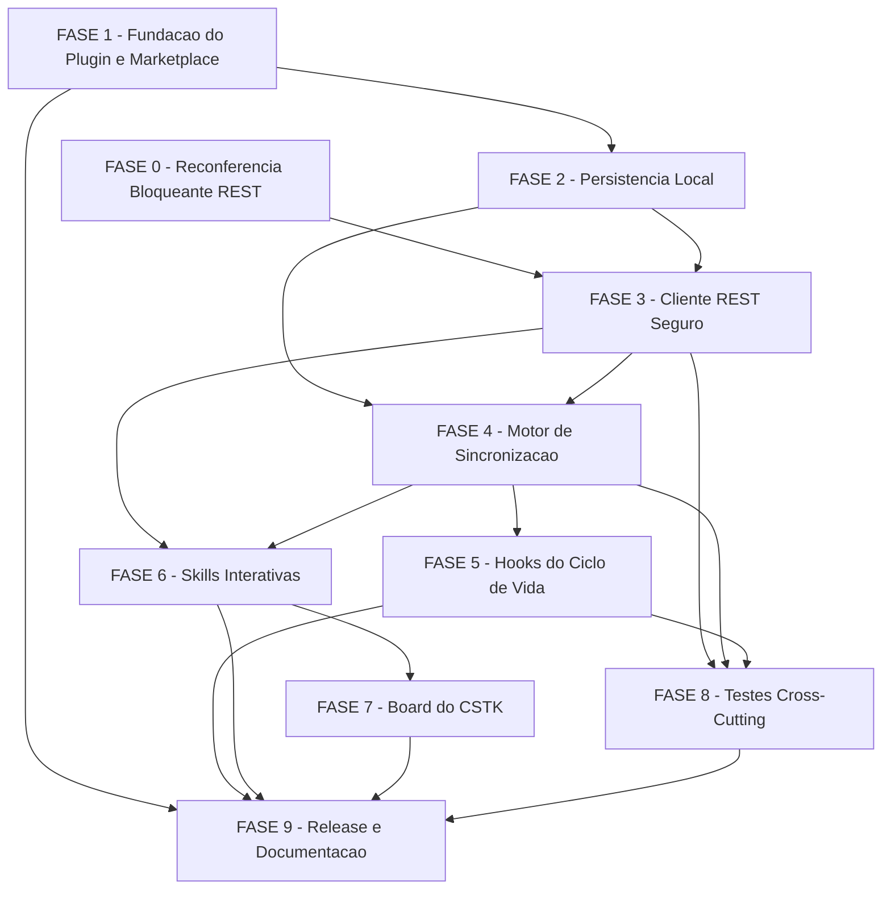

# Tarefas cstk-jira - Plugin de integracao com Jira Cloud

Escopo: plugin `plugins/cstk-jira/` que converte uma feature documentada
(spec + tasks.md) em Epic > Task > Sub-task no Jira Cloud, mantem um board
dedicado por projeto-alvo e sincroniza status durante execucoes autonomas
`feature-00c`/`agente-00c` — conforme `spec.md`, `plan.md`, `data-model.md`,
`quickstart.md` e `contracts/{jira-rest,rovo-mcp,hooks,plugin-scripts}.md`.

**Legenda de status:**
- `[ ]` Pendente
- `[~]` Em andamento
- `[x]` Concluido
- `[!]` Bloqueado

**Legenda de criticidade:**
- `[C]` Critico - Impacto financeiro, regulatorio ou de seguranca
- `[A]` Alto - Funcionalidade core sem a qual o plugin nao opera
- `[M]` Medio - Necessario mas pode ser adiado sem impacto imediato

**Tier de entrega usado na geracao deste backlog**: nao aplicavel (feature
`cstk-jira` nao foi gerada com tier de entrega citado nos args da invocacao;
backlog completo, sem omissao de fases — `/feature-00c` nunca propaga tier).

---

## FASE 0 - Reconferencia Bloqueante do Contrato REST `[C]`

Ref: plan.md Constitution Check (Principio VI "PASS condicionado");
`contracts/jira-rest.md` "Continua fora do contrato apos a onda-005";
`quickstart.md` Cenario 6; checklists/api.md CHK003/CHK004/CHK007.

Bloqueante: NENHUMA tarefa de FASE 3 (cliente REST) pode comecar antes desta
fase confirmar (ou corrigir) os campos ainda marcados `(exemplo)`/RECONFERIR/
NAO ENCONTRADO. Executada uma unica vez, contra um site Jira Cloud de teste
do operador (nunca produtivo).

### 0.1 Roundtrip real contra Jira Cloud de teste `[C]`

Ref: quickstart.md Cenario 6; contracts/jira-rest.md R1/R3/R4/R5/R8.

- [ ] 0.1.1 Obter (do operador) um site Jira Cloud de teste + API token
      valido, seguindo a mesma disciplina de `data-model.md` Credential
      (token nunca digitado no chat; coletado em terminal proprio)
- [ ] 0.1.2 `GET /rest/api/3/issue/{issueIdOrKey}` sobre uma issue de teste e
      capturar a resposta REAL: comparar `fields.status`, `fields.issuetype`,
      `fields.updated` contra o que `contracts/jira-rest.md` R3 descreve
- [ ] 0.1.3 `POST /rest/api/3/issue` (criacao de uma issue de teste) e
      capturar o corpo aceito REAL: comparar `fields.project`,
      `fields.issuetype`, `fields.summary`, `fields.parent`,
      `fields.description` (ADF) contra R1
- [ ] 0.1.4 `GET /rest/api/3/issue/createmeta/{projectIdOrKey}/issuetypes`
      sobre o projeto de teste e conferir se `hierarchyLevel` de Epic aparece
      de fato na resposta (R8 — hoje NAO ENCONTRADO nas fontes estaticas)
- [ ] 0.1.5 `GET /rest/api/3/issue/{issueIdOrKey}/transitions` e conferir o
      elemento de `transitions` (`id`, `name`, `to.name`, `to.id`) contra R5
- [ ] 0.1.6 Deletar/arquivar a issue de teste criada em 0.1.3 (via UI do
      Jira, NUNCA via `deleteJiraIssue`/`DELETE` do plugin — FR-012)

### 0.2 Atualizar `contracts/jira-rest.md` com os achados `[C]`

Ref: Principio VI (Zero Fabricacao) — nenhum campo confirmado por 0.1 pode
ficar com o marcador antigo desatualizado.

- [ ] 0.2.1 Para cada campo confirmado em 0.1, editar `contracts/jira-rest.md`
      trocando o marcador (`(exemplo)`/`RECONFERIR`/`NAO ENCONTRADO`) por
      `CONFIRMADO (roundtrip onda-007/FASE 0)` com o valor observado
- [ ] 0.2.2 Para campos que a chamada real contradisser o contrato, registrar
      Decisao auditavel (`--score 3 --evidencia "<trecho literal da resposta
      observada>"`) e corrigir o contrato — nunca prosseguir com dado
      divergente
- [ ] 0.2.3 Teste: `grep` de auditoria confirmando que nenhuma linha usada
      pelo motor (FASE 3/4) permanece com marcador `NAO ENCONTRADO` apos a
      edicao (exceto os itens explicitamente fora do contrato: changelog,
      `fields.project.key`, `statusCategory.key`, path de criacao de
      projeto — `contracts/jira-rest.md` "Continua fora do contrato")

---

## FASE 1 - Fundacao do Plugin e Marketplace `[A]`

Ref: plan.md Project Structure; plan.md "Pontos explicitos exigidos pela
onda-003" #1/#2.

### 1.1 Scaffold do plugin `plugins/cstk-jira/` `[A]`

Ref: plan.md Project Structure (Source Code).

- [ ] 1.1.1 Criar arvore de diretorios: `plugins/cstk-jira/{.claude-plugin,
      hooks,scripts,skills/jira-setup/references,
      skills/jira-convert/references,skills/jira-sync/references}`
- [ ] 1.1.2 Criar `plugins/cstk-jira/.claude-plugin/plugin.json` (nome
      `cstk-jira`, descricao, `version` inicial, `author`, `repository`,
      `license`, `keywords` — mesmo formato de
      `plugins/cstk-language-go/.claude-plugin/plugin.json`)
- [ ] 1.1.3 Teste: `tests/cstk/test_manifest.sh`/`test_manifest-coverage.sh`
      (ou fixture equivalente) reconhece o novo plugin.json como valido
      (schema minimo: `name`, `version`, `description`)

### 1.2 Registrar no marketplace e ajustar o gate MP-2 `[A]`

Ref: plan.md "Pontos explicitos exigidos pela onda-003" #1;
`scripts/validate-plugin-manifests.sh` L11/L95-98.

- [ ] 1.2.1 Adicionar 3a entrada em `.claude-plugin/marketplace.json`:
      `name: cstk-jira`, `description`, `source: ./plugins/cstk-jira`,
      `version` (lockstep com `plugin.json` de 1.1.2), `category`
- [ ] 1.2.2 Editar `scripts/validate-plugin-manifests.sh`: MP-2 de
      "`.plugins | length == 2`" para "`== 3`" (mensagem de erro atualizada
      de "exatamente 2" para "exatamente 3")
- [ ] 1.2.3 Atualizar a fixture de `tests/cstk/test_validate-plugin-manifests.sh`
      para incluir o 3o plugin (cstk-jira) no `marketplace.json` de teste,
      mantendo os casos negativos (2 e 4 plugins continuam falhando MP-2)
- [ ] 1.2.4 Teste: `bash scripts/validate-plugin-manifests.sh` roda limpo
      contra o `marketplace.json` real do repo apos 1.2.1
- [ ] 1.2.5 Teste: `tests/cstk/test_validate-plugin-manifests.sh` verde,
      incluindo os 2 casos negativos de 1.2.3

---

## FASE 2 - Persistencia Local `[A]`

Ref: data-model.md (ProjectConfig, LocalWorkItem, SyncMapping);
contracts/plugin-scripts.md `jira-config.sh`/`jira-tasks.sh`/`jira-map.sh`.

### 2.1 `jira-config.sh` `[A]`

Ref: data-model.md Entity ProjectConfig; contracts/plugin-scripts.md
`jira-config.sh`.

- [ ] 2.1.1 Subcomando `get KEY`: le `ProjectConfig` (`key=value`, `#`
      comenta); exit 3 se arquivo ausente (FR-017 — plugin inativo)
- [ ] 2.1.2 Subcomando `validate`: campos obrigatorios presentes;
      `site_host` valido como hostname puro (sem esquema/path/porta/
      userinfo); `status_fail != status_pass` (recusa com diagnostico
      instruindo o admin a criar um status distinto no workflow)
- [ ] 2.1.3 Subcomando `credential-check`: confere existencia + permissao
      `0600` do arquivo de credencial para `site_host`, sem imprimir
      nenhum valor (data-model.md "Regras de seguranca")
- [ ] 2.1.4 Teste unit: fixtures de `ProjectConfig` validas/invalidas
      (`status_fail == status_pass`, `site_host` com esquema/porta,
      arquivo ausente) cobrindo os 3 subcomandos
- [ ] 2.1.5 Teste: `credential-check` recusa arquivo com permissao mais
      aberta que `0600` sem nunca imprimir o conteudo

### 2.2 `jira-tasks.sh` `[A]`

Ref: data-model.md Entity LocalWorkItem (derivacao de `local_state`).

- [ ] 2.2.1 Subcomando `items --feature F`: parse de
      `docs/specs/<feature>/tasks.md` no formato do template canonico
      (`plugins/cstk/skills/create-tasks/templates/tasks.md`) emitindo TSV
      `local_key kind phase criticality local_state title`
- [ ] 2.2.2 Derivacao de `local_state` para `subtask` (`[ ]`->`pending`,
      `[~]`->`in_progress`, `[x]`->`pass`, `[!]`->`fail`)
- [ ] 2.2.3 Derivacao de `local_state` para `task` (outcome de
      `record_task`/`record-task` tem precedencia sobre os checkboxes;
      sem outcome: alguma subtask `[!]`->`fail`; todas `[x]`->`pass`;
      mistura/`[~]`->`in_progress`; senao `pending`)
- [ ] 2.2.4 Derivacao de `local_state` para `epic` (`stage_status.<stage>`
      quando configurado; senao agregacao das tasks — data-model.md regra)
- [ ] 2.2.5 Titulo do Epic prefixado por fase (`[FASE N] N.M <titulo>`);
      dependencias/criticidade entram na descricao da Task (nao viram
      hierarquia Jira extra — data-model.md)
- [ ] 2.2.6 Teste unit: fixtures de `tasks.md` cobrindo cada combinacao de
      `local_state` (Epic/Task/Subtask) das subtarefas 2.2.2-2.2.4,
      incluindo o caso "task sem nenhuma subtask ainda" (`pending`)

### 2.3 `jira-map.sh` `[A]`

Ref: data-model.md Entity SyncMapping (jira-map.tsv, FR-013/FR-014).

- [ ] 2.3.1 Subcomando `get --feature F --local-key K`: le linha do
      mapeamento ou exit 1
- [ ] 2.3.2 Subcomando `put --feature F --local-key K --kind KIND
      --jira-id ID --jira-key KEY`: insercao atomica (arquivo temporario +
      `mv`); recusa `local_key` ja `active` (idempotencia FR-013)
- [ ] 2.3.3 Subcomando `mark-orphans --feature F`: compara contra
      `jira-tasks.sh items`, marca `orphan` as chaves ausentes do
      `tasks.md`, imprime os orfaos; card Jira NUNCA e apagado (FR-012)
- [ ] 2.3.4 Subcomando `relink --feature F --local-key K --jira-key KEY`:
      religa um orfao por decisao humana (`orphan` -> `active`)
- [ ] 2.3.5 Teste de idempotencia (SC-002): 10 chamadas de `put` seguidas
      para o mesmo `local_key` resultam em 0 linhas novas apos a 1a
- [ ] 2.3.6 Teste de renumeracao/orfao: `local_key` removido do `tasks.md`
      vira `orphan` via `mark-orphans`; `relink` restaura `active` sem
      nunca ter apagado a linha original

---

## FASE 3 - Cliente REST Seguro `jira-io.sh` (carve-out 1.1.0) `[C]`

Ref: plan.md SEC-1..SEC-5; contracts/plugin-scripts.md `jira-io.sh`;
UNICO arquivo do plugin que referencia `jq` + cliente HTTP.
**Depende de FASE 0** (contrato reconferido) e FASE 2 (ProjectConfig).

### 3.1 `deps-check` + `request` com host unico e SEC-5 `[C]`

Ref: plan.md SEC-5; contracts/plugin-scripts.md `jira-io.sh request`.

- [ ] 3.1.1 `deps-check`: exit 5 + instrucao de instalacao se `jq` ou o
      cliente HTTP estiverem ausentes do PATH (carve-out 1.1.0 condicao a)
- [ ] 3.1.2 `request METHOD PATH [--body-file F]`: `METHOD` restrito a
      allowlist fechada `GET`/`POST`/`PUT` (sem `DELETE` — FR-012); `PATH`
      relativo iniciado em `/rest/`
- [ ] 3.1.3 Monta `https://<site_host><PATH>` com `site_host` de
      `ProjectConfig`; valida host por IGUALDADE EXATA (sem userinfo, sem
      porta) antes de CADA requisicao
- [ ] 3.1.4 Cliente HTTP configurado para NUNCA seguir redirect e SEMPRE
      verificar TLS (SEC-5); resposta `3xx` => erro sem nova requisicao
      (nao existe flag de configuracao para desligar a verificacao TLS)
- [ ] 3.1.5 Teste: dependencia ausente => exit 5, com PATH MINIMO explicito
      controlado no teste inteiro (nao so prefixar um diretorio — licao ja
      registrada no repo: stub no PATH nao esconde binario de `/usr/bin`)
- [ ] 3.1.6 Teste: host divergente (resposta simulada com redirect para
      outro dominio) => recusa SEM nova requisicao
- [ ] 3.1.7 Teste: chamada de `request` com `METHOD=DELETE` falha por uso
      incorreto (exit 2) — `DELETE` nunca existe como opcao valida

### 3.2 Allowlist de charset em path/JQL (SEC-1) `[C]`

Ref: plan.md SEC-1; checklists/security.md CHK001/CHK002.

- [ ] 3.2.1 Validar segmentos de PATH vindos do mapeamento (`jira_id`/
      `jira_key`) e de `project_key` contra allowlist `[A-Za-z0-9_-]`
      ANTES de qualquer interpolacao
- [ ] 3.2.2 Rejeitar, sem fazer requisicao, PATH contendo `..`, `//`, `\`,
      `@`, `#`, espaco, CR/LF ou qualquer byte de controle
- [ ] 3.2.3 Cobrir TODOS os pontos de interpolacao do motor: R1-R11
      (contracts/jira-rest.md) + a JQL de FASE 7 (SEC-3)
- [ ] 3.2.4 Teste: cada byte proibido de 3.2.2, isoladamente, causa recusa
      sem requisicao (tabela de casos)
- [ ] 3.2.5 Teste: `jira_id`/`jira_key`/`project_key` fora do charset
      `[A-Za-z0-9_-]` (ex.: contendo espaco ou `/`) e recusado

### 3.3 Credencial temporaria segura (SEC-4) `[C]`

Ref: plan.md SEC-4; checklists/security.md CHK006/CHK007.

- [ ] 3.3.1 Gerar arquivo de config temporario do cliente HTTP (carrega o
      header de autenticacao) com `umask 077`, em diretorio privado
- [ ] 3.3.2 `trap` em `EXIT`/`INT`/`TERM` removendo o arquivo temporario —
      nunca so o caso feliz de saida normal
- [ ] 3.3.3 Credencial nunca passada por argv/linha de comando do cliente
      HTTP (so por arquivo/stdin de config) nem aparece em log
- [ ] 3.3.4 Teste: modo do arquivo temporario e exatamente `0600` durante a
      execucao
- [ ] 3.3.5 Teste (mutation): matar o processo com `SIGTERM`/`SIGINT`
      simulado a meio de uma chamada e confirmar que o arquivo temporario
      foi removido mesmo assim

### 3.4 Mapeamento de status HTTP e classificacao de falha `[C]`

Ref: plan.md Test Strategy "Falha"; checklists/api.md CHK009
(auth_failed vs permission_denied vs deferred).

- [ ] 3.4.1 `401` em qualquer operacao => exit 4 (`auth_failed`), nunca
      retry (FR-016/FR-019)
- [ ] 3.4.2 `403` em R1 (criar issue) ou R2 (editar issue) => diagnostico
      distinto `permission_denied` ("credencial valida, permissao
      insuficiente no projeto/tipo") — NUNCA reconfiguracao de credencial
- [ ] 3.4.3 `403` nas demais operacoes (sem fonte que os distinga) segue
      tratado como `auth_failed` ate nova fonte
- [ ] 3.4.4 `429` => `deferred`, lendo `Retry-After` (segundos) do header
      quando presente
- [ ] 3.4.5 `5xx`/erro de rede/timeout => `deferred` com backoff limitado a
      3 tentativas por drain
- [ ] 3.4.6 `400`/`409` em transicao concorrente (R4) => `deferred`
      (candidatos a retry — change-notice confirmado em `contracts/jira-rest.md`)
- [ ] 3.4.7 Teste de contrato dedicado: `401` (qualquer op) vs `403` em
      R1/R2 vs `403` nas demais vs `429` — os 4 casos SEM colisao no mesmo
      tratamento (CHK009)

### 3.5 `json-get`/`json-build` e JQL segura (SEC-3) `[A]`

Ref: plan.md SEC-3; contracts/plugin-scripts.md `json-get`/`json-build`.

- [ ] 3.5.1 `json-get FILTER`: wrapper de leitura que restringe `jq` a este
      arquivo (nenhum outro script do plugin invoca `jq` diretamente)
- [ ] 3.5.2 `json-build ...`: monta corpos REST (`fields.project.id`,
      `fields.issuetype.id`, `fields.summary`, `fields.parent.key`,
      `fields.description` em ADF) a partir de `contracts/jira-rest.md`
      confirmado na FASE 0
- [ ] 3.5.3 JQL montada pelo plugin (filtro do board) interpola SOMENTE
      valores que ja passaram pela allowlist de 3.2 — nenhum texto livre
      (titulo/descricao) entra em JQL
- [ ] 3.5.4 Teste de contrato: corpo gerado por `json-build` bate campo a
      campo com `contracts/jira-rest.md` para R1 (criar issue)
- [ ] 3.5.5 Teste: tentativa de montar JQL com texto livre (titulo/
      descricao simulados) e recusada/sanitizada antes de interpolar

---

## FASE 4 - Motor de Sincronizacao `jira-sync.sh` `[C]`

Ref: contracts/plugin-scripts.md `jira-sync.sh`; data-model.md OutboxEvent/
ConflictRecord. **Depende de** FASE 2 (persistencia) e FASE 3 (jira-io.sh).

### 4.1 `plan`/`convert` (US1, FR-001/003/013/014) `[C]`

Ref: spec.md US1; plan.md fluxo 2 "Convert".

- [ ] 4.1.1 `plan --feature F`: dry-run listando criacoes, atualizacoes,
      transicoes, orfaos e conflitos previstos, sem nenhuma escrita
- [ ] 4.1.2 `convert --feature F`: pre-condicoes completas ANTES da 1a
      escrita — `deps-check`, `validate`, `credential-check` e validacao
      de credencial remota (`GET /rest/api/3/myself`); qualquer falha
      aborta sem criar artefato parcial no Jira (US1 cenario 3)
- [ ] 4.1.3 Cria Epic, depois Tasks (`parent` = Epic), depois Sub-tasks
      (`parent` = Task), gravando `jira-map.tsv` item a item IMEDIATAMENTE
      apos cada resposta de criacao (antes de qualquer outra chamada)
- [ ] 4.1.4 Reexecucao de `convert`: busca SEMPRE por `jira_id`/`jira_key`
      do mapeamento (nunca por titulo/JQL) — cria so o `local_key` ausente
      do arquivo (US1 cenario 2, FR-014)
- [ ] 4.1.5 Teste de idempotencia (SC-002): 10 execucoes de `convert`
      seguidas para a mesma feature => 0 criacoes apos a 1a
- [ ] 4.1.6 Teste: credencial rejeitada durante `convert` => nenhum issue
      criado (nem parcial) e `jira-map.tsv` permanece inalterado
- [ ] 4.1.7 Teste: `tasks.md` ganha uma tarefa nova apos conversao anterior
      => `convert` cria SOMENTE a Task nova associada ao Epic existente

### 4.2 `enqueue`/`drain` (US3, FR-004/005/018) `[C]`

Ref: spec.md US3; data-model.md OutboxEvent; contracts/hooks.md "Drenar".

- [ ] 4.2.1 `enqueue --feature F --local-key K --state S --source SRC`:
      append em `outbox.tsv` (append-only)
- [ ] 4.2.2 `drain --feature F`: lock `runtime/.drain.lock/` (`mkdir`
      atomico); lock ocupado => sai sem erro, proximo gatilho drena
- [ ] 4.2.3 Para cada evento: ler issue + `SyncMarker` (entity property
      `cstk-jira.sync`), detectar conflito (`sha256(titulo_atual) !=
      written_summary_sha256` OU `status_atual != written_status` OU
      marker ausente `marker_missing`) ANTES de escrever
- [ ] 4.2.4 Conflito detectado => NAO escreve; gera `ConflictRecord`
      (`reason` = `manual_edit`/`marker_missing`); nunca sobrescreve
      silenciosamente (FR-011)
- [ ] 4.2.5 Sem conflito: transiciona para o status mapeado
      (`status_pending`/`status_in_progress`/`status_pass`/`status_fail`)
      e regrava `SyncMarker` com o novo `written_summary_sha256`/
      `written_status`/`written_at`
- [ ] 4.2.6 Regra dura: com qualquer evento `auth_failed` presente no
      outbox, o drain NAO faz NENHUMA nova chamada ate reconfiguracao
      (FR-016 — nunca repetir silenciosamente tentativas que falham)
- [ ] 4.2.7 Serializacao de escritas: nunca 2 escritas concorrentes na
      mesma issue (rate limit Jira de 20 escritas/2s por issue —
      checklists/api.md CHK014)
- [ ] 4.2.8 Compactacao do outbox: eventos `done` sao removidos no proximo
      drain (outbox nao cresce indefinidamente)
- [ ] 4.2.9 Teste: 2 chamadas de `drain` concorrentes (lock disputado) =>
      apenas uma processa; a outra sai imediatamente sem erro
- [ ] 4.2.10 Teste: deteccao de conflito (issue editada manualmente
      simulada) gera `ConflictRecord` e NAO sobrescreve o titulo/status
- [ ] 4.2.11 Teste: evento `auth_failed` presente bloqueia TODAS as
      chamadas subsequentes do drain ate reconfiguracao simulada

### 4.3 `status`/`resolve`/`relink` (resolucao humana) `[A]`

Ref: data-model.md ConflictRecord; checklists/ux.md CHK011/CHK012.

- [ ] 4.3.1 `status [--feature F]`: resumo do outbox + conflitos + orfaos +
      eventos `auth_failed`, legivel pelo operador
- [ ] 4.3.2 `resolve --feature F --local-key K --choice keep_jira|
      overwrite|ignored`: fecha o `ConflictRecord` por decisao humana
      (resolucao SEMPRE humana — nunca automatica)
- [ ] 4.3.3 `jira-map.sh relink` exposto/documentado pela skill `jira-sync`
      como caminho de UX claro para religar um orfao (CHK012)
- [ ] 4.3.4 Teste: os 3 `--choice` de `resolve` produzem o efeito esperado
      (mantem estado do Jira / sobrescreve / apenas fecha o registro)

### 4.4 Card orfao — nunca apagar (FR-012) `[A]`

Ref: spec.md FR-012; data-model.md SyncMapping state transitions.

- [ ] 4.4.1 `jira-map.sh mark-orphans` roda como parte do `drain`/`status`
      (reconciliacao periodica contra `jira-tasks.sh items`)
- [ ] 4.4.2 Card Jira correspondente a um orfao NUNCA e apagado
      automaticamente pelo plugin (nenhum caminho de codigo chama
      `deleteJiraIssue`/`DELETE`)
- [ ] 4.4.3 Teste round-trip: `local_key` some do `tasks.md` => vira
      `orphan`; `relink` restaura `active`; em nenhum momento a issue foi
      deletada (assert sobre o stub de rede: zero chamadas `DELETE`)

---

## FASE 5 - Hooks do Ciclo de Vida `[C]`

Ref: contracts/hooks.md; spec.md FR-005/FR-012/FR-018-INFRA-SCHED.
**Depende de** FASE 4 (jira-sync.sh drain).

### 5.1 `hooks.json` + `posttooluse-jira-sync.sh` (sync autonomo) `[C]`

Ref: contracts/hooks.md "Entradas do hooks.json"/"Comportamento de
posttooluse-jira-sync.sh".

- [ ] 5.1.1 `hooks/hooks.json`: matcher `PostToolUse` `mcp__.*__record_task`
      (modo `task`), `mcp__.*__close_wave` (modo `wave`), `Bash` (modo
      `bash`, so age se `tool_input.command` contem `state-ondas.sh
      record-task` ou `state-ondas.sh end`) — todos `async: true`
- [ ] 5.1.2 No-op de inatividade como PRIMEIRA instrucao do script (FR-017/
      SC-006): `<cwd>/.claude/cstk-jira/config` ausente OU
      `sync_autonomous=off` => exit 0 silencioso, sem ler stdin alem do
      necessario, sem checar deps
- [ ] 5.1.3 Resolucao da execucao ativa: exatamente um `.lock/` candidato
      (`feature-00c-state/<short>/` ou `agente-00c-state/`, mesma derivacao
      de `canonical_project` do orquestrador, READ-ONLY); zero ou mais de
      um candidato => no-op + linha em `runtime/hook.log`
- [ ] 5.1.4 Filtro por feature convertida: sem
      `docs/specs/<feature>/jira-map.tsv` => no-op (US1 e pre-requisito)
- [ ] 5.1.5 Enfileira `OutboxEvent` (`task_id`/`outcome` do modo `task`/
      `bash`; `reconcile` do modo `wave`) e chama `jira-sync.sh drain`
- [ ] 5.1.6 Fail-open absoluto: qualquer falha => exit 0; hook NUNCA
      bloqueia/atrasa a tool do orquestrador nem grava no state da execucao
- [ ] 5.1.7 Nao-exfiltracao: le SOMENTE `task_id`/`outcome` do
      `tool_input`; NUNCA grava, loga ou repassa `session_id`
- [ ] 5.1.8 Teste: config ausente => no-op total (nenhum arquivo criado,
      nenhuma rede, stdout vazio) — SC-006
- [ ] 5.1.9 Teste: falha simulada dentro do hook (ex.: `drain` retorna erro)
      => hook ainda sai `exit 0` (fail-open)
- [ ] 5.1.10 Teste (nao-exfiltracao): stdin sintetico com `session_id`
      real => `session_id` NUNCA aparece em stdout, `hook.log` ou outbox
      (CHK013)

### 5.2 `pretooluse-jira-deny-destructive.sh` (FR-012) `[C]`

Ref: contracts/hooks.md "Comportamento de pretooluse-jira-deny-destructive.sh";
contracts/rovo-mcp.md "Tools proibidas".

- [ ] 5.2.1 Matcher `PreToolUse` `mcp__.*__(deleteJiraIssue|
      executeDestructive)` (casa qualquer prefixo de instalacao do Rovo MCP)
- [ ] 5.2.2 Casou => mensagem em stderr citando FR-012 + `exit 2`
      (unico exit code que bloqueia a tool por si so)
- [ ] 5.2.3 Sem `<cwd>/.claude/cstk-jira/config` => guarda e no-op
      (exit 0) — FR-017/SC-006, mesmo quando o Rovo MCP esta sendo usado
      para outros fins fora do plugin
- [ ] 5.2.4 Defesa em profundidade complementar: `jira-io.sh` (FASE 3) nao
      tem metodo `DELETE` — dois pontos de enforcement independentes
      (CHK010)
- [ ] 5.2.5 Teste positivo: `tool_name` casando o matcher => `exit 2` +
      mensagem citando FR-012
- [ ] 5.2.6 Teste negativo: sem config presente, mesmo `tool_name` =>
      `exit 0` (no-op)

---

## FASE 6 - Skills Interativas `[A]`

Ref: plan.md Fluxos 1-3; spec.md US1/US4; checklists/security.md CHK004/
CHK005; checklists/ux.md CHK001-CHK006. **Depende de** FASE 3 (jira-io.sh)
e FASE 4 (jira-sync.sh) para o caminho REST; usa `contracts/rovo-mcp.md`
para o caminho MCP.

### 6.1 Skill `jira-setup` (US4, FR-007) `[A]`

Ref: spec.md US4; plan.md fluxo 1 "Setup"; quickstart.md Cenario 3.

- [ ] 6.1.1 `SKILL.md` com formato canonico do toolkit (description-como-
      trigger, `references/`, Gotchas — Principio III)
- [ ] 6.1.2 Fluxo guiado em ORDEM FIXA (checklists/ux.md CHK002): site ->
      `PROJECT_KEY` -> credencial (terminal proprio, NUNCA no chat,
      comando concreto orientado — CHK003) -> mapeamento de status ->
      confirmacao de tipo de issue -> filtro/board
- [ ] 6.1.3 Apos `createmeta` (R8), LISTAR os tipos retornados (`id`,
      `name`, `hierarchyLevel`, `subtask`) e EXIGIR confirmacao explicita
      do operador sobre qual e Epic/Task/Sub-task antes de gravar
      `issue_type_*` — nunca inferir (`hierarchyLevel` de Epic e NAO
      ENCONTRADO nas fontes — CHK006)
- [ ] 6.1.4 Descobrir transicoes (`listJiraIssueTransitions`/R5) e pedir o
      mapeamento `pending`/`in_progress`/`pass`/`fail`; recusar
      `fail == pass` com diagnostico que LISTA os status DISPONIVEIS do
      workflow ja descobertos no mesmo fluxo, nao so "invalido" (`[Gap]`
      ux CHK004 — destino explicito desta onda)
- [ ] 6.1.5 Setup falho parcialmente => NENHUM estado parcial fica marcado
      como valido (config incompleto nunca aparenta integracao ativa —
      CHK006/FR-007)
- [ ] 6.1.6 Rotular texto lido do Jira (nomes de tipos de issue, status,
      respostas de tools Rovo) como conteudo externo NAO-CONFIAVEL
      (UNTRUSTED) antes de apresentar ao operador — mesma disciplina do
      read-back loop do toolkit (`[Gap]` security CHK005 — destino
      explicito desta onda, citando SEC-2)
- [ ] 6.1.7 Criar ou reusar filtro + board kanban do projeto (US2 cenario
      2: reuso sem duplicar)
- [ ] 6.1.8 **Nota (nao bloqueia esta tarefa, aguarda decisao humana antes
      de execute-task fechar a redacao final)**: security CHK011 — se a
      guarda `PreToolUse` ficar inativa quando o plugin nao esta
      configurado deve ou nao ser refletido em FR-012 da spec (hoje so
      documentado no contrato de hooks); ux CHK005 — copy exata do
      diagnostico de token invalido (proximo passo concreto para o
      usuario)
- [ ] 6.1.9 Teste: fixture simulando resposta de `createmeta` e
      `transitions`, cobrindo confirmacao de tipos (6.1.3) e diagnostico
      de `fail == pass` listando status disponiveis (6.1.4)
- [ ] 6.1.10 Teste: setup interrompido a meio (ex.: credencial rejeitada no
      passo de validacao remota) nao deixa `ProjectConfig` parcial
      marcado como valido (6.1.5)

### 6.2 Skill `jira-convert` (US1, FR-001/003/013/014) `[A]`

Ref: spec.md US1; plan.md fluxo 2 "Convert"; checklists/api.md CHK012.

- [ ] 6.2.1 `SKILL.md` com formato canonico (Principio III)
- [ ] 6.2.2 Pre-checagens completas (mesmas de `jira-sync.sh convert`)
      ANTES da 1a escrita, tanto no caminho MCP quanto no caminho REST
- [ ] 6.2.3 Caminho MCP (tools Rovo visiveis): usa `createJiraIssue`/
      `editJiraIssue` seguindo `inputSchema` real (nunca nomes de
      memoria — checklists/api.md CHK013); caminho REST: delega a
      `jira-sync.sh convert`. Os dois produzem o MESMO efeito observavel
      (mesmo mapeamento, mesmo `SyncMarker` — CHK012)
- [ ] 6.2.4 Grava `jira-map.tsv` item a item (Epic -> Tasks -> Sub-tasks)
- [ ] 6.2.5 Reexecucao cria SOMENTE o que falta (US1 cenario 2)
- [ ] 6.2.6 Rotular texto lido do Jira (respostas de `createJiraIssue`/
      `editJiraIssue`, titulos/descricoes existentes) como UNTRUSTED antes
      de apresentar ao operador (`[Gap]` security CHK005, SEC-2)
- [ ] 6.2.7 **Nota (nao bloqueia esta tarefa, aguarda decisao humana antes
      de execute-task fechar a redacao final)**: ux CHK013 — se feedback
      de progresso incremental ("N/M issues criadas") e exigido nesta
      versao para lotes grandes, ou fica para iteracao futura
- [ ] 6.2.8 Teste: caminho MCP (stub de tools) e caminho REST (stub de
      `jira-sync.sh`) produzem o mesmo `jira-map.tsv` para o mesmo backlog
      de entrada

### 6.3 Skill `jira-sync` (US3) `[A]`

Ref: spec.md US3; plan.md fluxo 3 "Sync autonomo"; checklists/ux.md CHK011.

- [ ] 6.3.1 `SKILL.md` com formato canonico (Principio III)
- [ ] 6.3.2 Modo `status`: expõe `jira-sync.sh status` (conflitos, orfaos,
      `auth_failed`) como comando claro documentado no fluxo de UX
      (CHK011 — nao so no data-model interno)
- [ ] 6.3.3 Modo `resolve`: expõe `jira-sync.sh resolve` para o operador
      decidir `keep_jira`/`overwrite`/`ignored` por conflito
- [ ] 6.3.4 Modo `relink`: expõe `jira-map.sh relink` para o operador
      religar um orfao (CHK012)
- [ ] 6.3.5 Rotular texto lido do Jira (titulo/descricao/status/comentarios
      exibidos ao mostrar um conflito) como UNTRUSTED (`[Gap]` security
      CHK005, SEC-2) — nenhuma decisao de sync e derivada desse texto,
      so da escolha humana explicita
- [ ] 6.3.6 Teste: exibicao de um conflito simulado rotula corretamente o
      titulo/descricao do Jira como conteudo externo antes de pedir a
      escolha do operador

---

## FASE 7 - Board do CSTK (US2) `[M]`

Ref: spec.md US2; plan.md fluxo 4 "Board". **Depende de** FASE 6 (setup e
convert ja permitem criar issues a organizar no board).

### 7.1 Criacao/reuso de board + filtro `[M]`

Ref: contracts/jira-rest.md R9/R10/R11; contracts/rovo-mcp.md
`listJiraBoards`/`listJiraFilters`/`createJiraBoard`.

- [ ] 7.1.1 Caminho MCP: `listJiraBoards`/`listJiraFilters` para checar
      existencia; `createJiraBoard` so se nao existir
- [ ] 7.1.2 Caminho REST: `GET /rest/agile/1.0/board?projectKeyOrId=...`
      (R11) para checar existencia; `POST /rest/api/3/filter` (R9) +
      `POST /rest/agile/1.0/board` (R10, `type=kanban`) so se necessario
- [ ] 7.1.3 JQL do filtro do board interpola SOMENTE valores que passaram
      pela allowlist de SEC-1/FASE 3 (SEC-3) — nunca titulo/descricao
      livres
- [ ] 7.1.4 `board_id` gravado em `ProjectConfig` (FASE 2) apos criacao/
      reuso
- [ ] 7.1.5 Teste: 2a chamada de setup para o mesmo projeto Jira REUSA o
      board existente, sem criar um duplicado (US2 cenario 2)

### 7.2 Mapeamento coluna do board <-> status do workflow `[M]`

Ref: checklists/ux.md CHK008; data-model.md ProjectConfig
`status_pending`/`status_in_progress`/`status_pass`/`status_fail`.

- [ ] 7.2.1 Coluna do board corresponde ao `status_*` configurado no setup
      (FASE 6.1.4) — nenhuma inferencia adicional de nome de coluna
- [ ] 7.2.2 Documentar no `quickstart.md`/`SKILL.md` do board que a
      correspondencia coluna<->estagio SDD e definida pelo mapeamento do
      operador, evitando ambiguidade (CHK008)
- [ ] 7.2.3 Teste: transicao de status local (FASE 4.2.5) move o card para
      a coluna correta correspondente ao `status_*` mapeado

---

## FASE 8 - Testes Cross-Cutting: Contrato, Idempotencia, Falha, Mutation `[C]`

Ref: plan.md Test Strategy (tabela completa). **Depende de** FASE 3, 4 e 5
(exercita os componentes ja implementados de ponta a ponta).

### 8.1 Suite de contrato REST `[C]`

Ref: plan.md Test Strategy "Contrato"; checklists/api.md CHK001/CHK002.

- [ ] 8.1.1 Stub do cliente HTTP grava metodo, path e corpo de cada
      requisicao emitida pelo motor
- [ ] 8.1.2 Assert que R1-R11 (contracts/jira-rest.md, pos-FASE 0) batem
      exatamente com o que o motor de fato emite — sem excecao
- [ ] 8.1.3 Teste dedicado cobrindo CHK001 (11 endpoints documentados e
      exercitados) e CHK002 (campos de corpo/resposta usados tem fonte)

### 8.2 Suite de idempotencia (SC-002) `[C]`

Ref: plan.md Test Strategy "Idempotencia"; quickstart.md Cenario 4.

- [ ] 8.2.1 Stub com estado persistente entre chamadas simulando o Jira
- [ ] 8.2.2 10 execucoes de `jira-sync.sh convert` seguidas para a mesma
      feature => 0 criacoes apos a 1a (end-to-end, nao so unit de
      `jira-map.sh` — complementa 2.3.5/4.1.5)

### 8.3 Suite de falha `[C]`

Ref: plan.md Test Strategy "Falha"; checklists/api.md CHK009.

- [ ] 8.3.1 `401` (qualquer operacao) => `auth_failed` sem retry
- [ ] 8.3.2 `403` em R1/R2 => `permission_denied`; `403` nas demais
      operacoes => `auth_failed`
- [ ] 8.3.3 `429` => `deferred`, respeitando `Retry-After`
- [ ] 8.3.4 Host divergente/redirect => recusa sem requisicao
- [ ] 8.3.5 Dependencias ausentes (`jq`/cliente HTTP) => exit 5, com PATH
      minimo explicito controlado no teste inteiro (nao so prefixar um
      diretorio)

### 8.4 Mutation tests (defesa em profundidade) `[A]`

Ref: plan.md Test Strategy "Mutation"; pratica ja adotada no repo.

- [ ] 8.4.1 Quebrar de proposito a checagem de host unico (3.1.3) e
      confirmar que 3.1.6/8.3.4 pegam a regressao
- [ ] 8.4.2 Quebrar de proposito a ausencia de `DELETE` em `jira-io.sh`
      (remover a validacao) e confirmar que 3.1.7/4.4.3 pegam a regressao
- [ ] 8.4.3 Quebrar de proposito o hook `pretooluse-jira-deny-destructive.sh`
      (matcher errado) e confirmar que 5.2.5 pega a regressao
- [ ] 8.4.4 Quebrar de proposito o no-op de inatividade dos hooks (5.1.2/
      5.2.3) e confirmar que 5.1.8/5.2.6 pegam a regressao
- [ ] 8.4.5 Quebrar de proposito o `umask`/`trap` de credencial (3.3.1/
      3.3.2) e confirmar que 3.3.4/3.3.5 pegam a regressao

---

## FASE 9 - Release e Documentacao `[M]`

Ref: plan.md Constitution Check Principio I (lockstep MP-5); plan.md
"Pontos explicitos exigidos pela onda-003" #9. **Depende de** todas as
fases anteriores (contagens/paridade so fazem sentido com o plugin
completo).

### 9.1 Docs bilingues e contagens que gateiam release `[M]`

Ref: `tests/test_doc-counts.sh`; `tests/test_state-parity-sweep.sh`.

- [ ] 9.1.1 Atualizar `README.md`: contagem de skills (soma das 21
      globais + as 3 novas do cstk-jira onde aplicavel) e mencao ao
      3o plugin no marketplace
- [ ] 9.1.2 Ajustar `tests/test_doc-counts.sh` (contagem esperada) para
      refletir o novo total de skills/plugins documentados
- [ ] 9.1.3 Incluir os 2 hooks novos (`posttooluse-jira-sync.sh`,
      `pretooluse-jira-deny-destructive.sh`) na allowlist de
      `tests/test_state-parity-sweep.sh`
- [ ] 9.1.4 Teste: `tests/test_doc-counts.sh` e
      `tests/test_state-parity-sweep.sh` verdes apos as edicoes acima

### 9.2 Lockstep de versao (MP-5) e CHANGELOG `[M]`

Ref: plan.md Constitution Check Principio I; `scripts/validate-plugin-manifests.sh`
MP-5.

- [ ] 9.2.1 `plugins/cstk-jira/.claude-plugin/plugin.json` `.version` ==
      `.claude-plugin/marketplace.json` `.plugins[cstk-jira].version` no
      momento do release (mesma disciplina ja aplicada a `cstk`/
      `cstk-language-go`)
- [ ] 9.2.2 Entrada no `CHANGELOG.md` descrevendo o novo plugin cstk-jira
- [ ] 9.2.3 Teste: `bash scripts/validate-plugin-manifests.sh --strict`
      verde com as 3 entradas em lockstep de versao (MP-5)

### 9.3 Validacao final do quickstart `[M]`

Ref: quickstart.md (todos os cenarios).

- [ ] 9.3.1 Percorrer manualmente os Cenarios 1-5 do `quickstart.md`
      (instalacao, inatividade, setup, idempotencia, conflito/orfao)
      contra o plugin implementado
- [ ] 9.3.2 Confirmar que o Cenario 6 (roundtrip real) permanece
      documentado como validacao ja executada na FASE 0, sem
      re-executar contra producao

---

## Matriz de Dependencias

## Resumo Quantitativo

| Fase | Tarefas | Subtarefas | Criticidade |
|------|---------|------------|-------------|
| 0 - Reconferencia Bloqueante REST | 2 | 9 | C |
| 1 - Fundacao do Plugin e Marketplace | 2 | 8 | A |
| 2 - Persistencia Local | 3 | 17 | A |
| 3 - Cliente REST Seguro | 5 | 33 | C/A |
| 4 - Motor de Sincronizacao | 4 | 32 | C/A |
| 5 - Hooks do Ciclo de Vida | 2 | 16 | C |
| 6 - Skills Interativas | 3 | 24 | A |
| 7 - Board do CSTK | 2 | 8 | M |
| 8 - Testes Cross-Cutting | 4 | 15 | C/A |
| 9 - Release e Documentacao | 3 | 9 | M |
| **Total** | **30** | **171** | - |

## Escopo Coberto

| Item | Descricao | Fase |
|------|-----------|------|
| US1 | Converter feature em Epic/Tasks/Subtasks (FR-001/003/013/014) | 4, 6 |
| US2 | Board dedicado do CSTK no Jira (FR-002) | 7 |
| US3 | Sincronizacao automatica de status via hooks (FR-004/005/018) | 4, 5 |
| US4 | Instalacao e configuracao guiada (FR-007/008/009) | 1, 6 |
| FR-006/FR-010 | Suporte MCP (preferencial) + REST (fallback universal) | 3, 6 |
| FR-011 | Deteccao de conflito, sem sobrescrita silenciosa | 4 |
| FR-012 | Card orfao nunca apagado + deny-list de exclusao | 4, 5 |
| FR-015 | Host unico, sem vazamento de rede | 3 |
| FR-016/FR-019-INFRA-REFRESH | Credencial invalida => `auth_failed` explicito | 3, 4 |
| FR-017 | Plugin inativo = zero mudanca de comportamento | 2, 5 |
| SEC-1..SEC-5 (gate owasp-security) | Path/JQL allowlist, UNTRUSTED, credencial temporaria, TLS/redirect | 3, 6 |
| checklists `[Gap]` (api CHK006/CHK009 ja corrigidos em onda-006; security CHK005; ux CHK004) | Confirmacao de tipo de issue; distincao auth_failed/permission_denied; rotulo UNTRUSTED; diagnostico com status disponiveis | 0, 3, 6 |
| MP-2/MP-5 (gate de plugins) | Marketplace com 3 plugins; lockstep de versao | 1, 9 |

## Escopo Excluido

| Item | Descricao | Motivo |
|------|-----------|--------|
| Jira Data Center/Server | Qualquer suporte fora de Jira Cloud | D1 (dec-023/block-004): ambiente-alvo fechado em Jira Cloud |
| Bulk create (ate 50 issues) | Criacao em lote via endpoint de bulk | research Decision 3: fora do MVP; criacao item a item preserva mapeamento atomico |
| Servidor MCP dedicado ao cstk-jira | MCP proprio empacotado pelo plugin | dec-020/block-001: A1 usa o Rovo MCP oficial (configurado pelo usuario) + REST; sem MCP dedicado (FR-010) |
| Renovacao automatica de credencial | Refresh automatico de API token | FR-019-INFRA-REFRESH ramo "nao for possivel" (research Decision 2): API token sem renovacao automatica |
| Feedback de progresso incremental em `jira-convert` | Contagem "N/M issues criadas" durante lotes grandes | ux CHK013 `{humano}`: decisao de produto pendente, registrada como nota em 6.2.7, nao fechada nesta onda |
| Copy exata do diagnostico de token invalido | Texto literal da mensagem de erro de credencial | ux CHK005 `{humano}`: decisao de copy/produto pendente, registrada como nota em 6.1.8 |
| Elevar CHK011 a FR-012 da spec | Explicitar na spec que a guarda so e ativa com config presente | security CHK011 `{humano}`: decisao de escopo pendente, registrada como nota em 6.1.8 |
