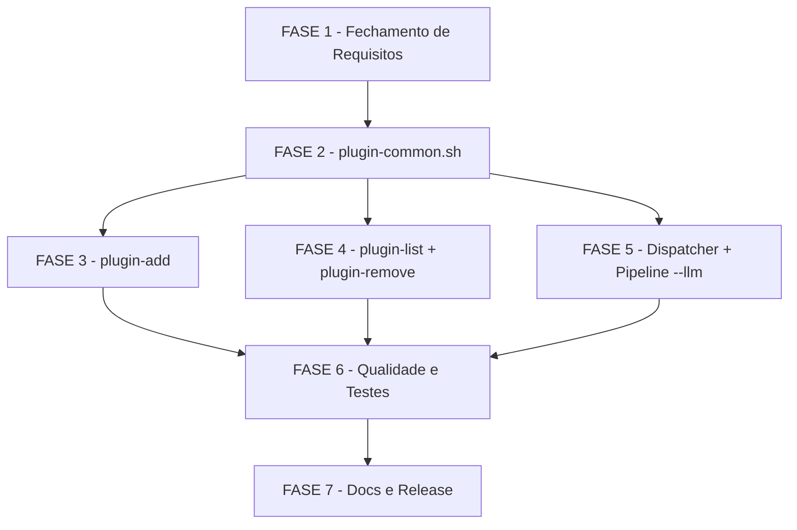

# Tarefas cstk-plugins - Plugin System for cstk

Escopo: Implementar o sistema de plugins do cstk — subcomandos `plugin-add`/`plugin-list`/`plugin-remove`, flag `--llm <name>` nos entrypoints SDD 00c, e resolucao de skills por path-prepending — seguindo a spec FR-001..FR-018, plan e contratos. Inclui fechamento de todos os gaps abertos dos checklists de requisitos e seguranca.

**Legenda de status:**
- `[ ]` Pendente
- `[~]` Em andamento
- `[x]` Concluido
- `[!]` Bloqueado

**Legenda de criticidade:**
- `[C]` Critico - Impacto de seguranca ou bloqueante de pipeline
- `[A]` Alto - Funcionalidade core sem a qual o sistema nao opera
- `[M]` Medio - Necessario mas pode ser adiado sem impacto imediato

---

## FASE 1 - Fundacao e Fechamento de Requisitos

> Fecha os gaps e conflitos abertos dos checklists antes de qualquer implementacao. Garante que a feature nao siga construindo sobre requisitos nao fechados.

### 1.1 Resolver conflito de path — alinhar spec FR-007 ao plan (dec-010) `[A]`

Ref: checklists/requirements.md CHK022 [Conflict]; research.md Decision 1; plan.md §Re-check pos-Phase 1

O wording literal de FR-007 diz `~/.claude/plugins/<name>/` mas o plan decidiu
(research D1, evidencia empirica) usar `~/.claude/cstk/plugins/<name>/` para
evitar colisao com o sistema nativo de plugins do Claude Code. A intencao e
consistente; so o wording da spec esta defasado.

- [ ] 1.1.1 Editar `spec.md` FR-007: substituir o default path `~/.claude/plugins/<name>/` por `~/.claude/cstk/plugins/<name>/` e adicionar nota "(namespace dedicado cstk; evita colisao com plugins nativos do Claude Code — research Decision 1)"
- [ ] 1.1.2 Editar `spec.md` FR-012: atualizar referencia a `~/.claude/plugins/<name>/` → `~/.claude/cstk/plugins/<name>/`
- [ ] 1.1.3 Editar `spec.md` §Key Entities "Plugin Store": atualizar path e adicionar nota de namespace
- [ ] 1.1.4 Verificar que `data-model.md`, `contracts/cli-commands.md` e `contracts/pipeline-integration.md` ja usam o path correto `~/.claude/cstk/plugins/` (leitura de confirmacao)
- [ ] 1.1.5 Teste de regressao de wording: `grep -r "~/.claude/plugins/" docs/specs/cstk-plugins/` deve retornar zero ocorrencias apos as edicoes (exceto em comentarios historicos explicitos)

### 1.2 Fechar ambiguidade FR-009 — comportamento sem TTY (CI/piped) `[A]`

Ref: checklists/requirements.md CHK009 [Ambiguity]; spec.md FR-009

FR-009 diz "interactive prompt OR --force" mas nao define o comportamento quando
stdin nao e um TTY e `--force` esta ausente (ex: CI, pipe). Sem definicao explicita,
implementacoes divergem.

- [ ] 1.2.1 Decidir e documentar em `spec.md` FR-009: quando stdin nao e TTY e `--force` ausente, o comportamento MUST ser "abort com exit 1 e mensagem clara pedindo `--force` para uso nao-interativo" (safer default — nao instala silenciosamente)
- [ ] 1.2.2 Adicionar cenario de teste ao `quickstart.md`: "Scenario 1b: re-install sem TTY sem --force → exit 1; com --force → instala"
- [ ] 1.2.3 Verificar que `contracts/cli-commands.md` §plugin-add Behavior passo 3 reflita a decisao (adicionar nota de TTY-check)
- [ ] 1.2.4 Teste unitario: `test_plugin-add.sh` deve cobrir o caso "ja instalado + stdin nao-TTY + sem --force → exit 1"

### 1.3 Clarificar SC-001 — separar tempo de toolkit vs tempo de rede `[M]`

Ref: checklists/requirements.md CHK015 [Ambiguity]; spec.md SC-001

SC-001 define "<60s numa conexao broadband normal" mas mistura tempo do toolkit
com tempo de download incontrolavel. A ambiguidade dificulta a criacao de testes
de performance reproduziveis.

- [ ] 1.3.1 Editar `spec.md` SC-001: adicionar nota "(o budget de 60s inclui o tempo de download; o toolkit em si — validacao, extracao, checksum, escrita — deve completar em <5s excluindo download)"
- [ ] 1.3.2 Adicionar subtarefa de teste de performance no `test_plugin-add.sh`: medir tempo de extracao + checksum + escrita com bundle fixture local e verificar <5s

### 1.4 Especificar contrato de remocao parcial `[A]`

Ref: checklists/requirements.md CHK004 [Gap]; spec.md FR-012; contracts/cli-commands.md §plugin-remove

FR-012 nao especifica o comportamento em falha de remocao parcial (ex: alguns
arquivos deletados, registry write falha). Edge case "remove durante pipeline
rodando" esta coberto; mid-remove crash nao esta.

- [ ] 1.4.1 Editar `contracts/cli-commands.md` §plugin-remove Behavior: adicionar passo de tratamento de falha parcial — "se `rm -rf` parcial ou registry write falha: tentar atomic cleanup (re-checar diretorio e registry), reportar estado inconsistente com exit 1; nao silenciar; usuario deve re-tentar ou remover manualmente"
- [ ] 1.4.2 Editar `spec.md` FR-012: adicionar clausula de falha parcial alinhada ao contrato acima
- [ ] 1.4.3 Adicionar Scenario 7b ao `quickstart.md`: "remove com falha de IO → exit 1, mensagem de estado inconsistente, store em estado indeterminado documentado"
- [ ] 1.4.4 Teste: `test_plugin-remove.sh` cobre cenario de falha de IO durante remocao (via mock de `rm`)

### 1.5 Adicionar requisito de aviso TOFU em documentacao de usuario `[M]`

Ref: checklists/security.md CHK009 [Gap]; plan.md §Security Threat Model row ASI04

O plan diz "documentation MUST warn to only install plugins from trusted authors"
mas nenhum FR captura esse requisito como deliverable rastreavel.

- [ ] 1.5.1 Adicionar FR-019 ao `spec.md`: "A documentacao de usuario do sistema de plugins (README, quickstart) MUST incluir aviso explicito sobre o modelo de confianca TOFU: instalar um plugin equivale a executar codigo arbitrario com a mesma confianca do catalogo core; instalar somente de autores confiaveis."
- [ ] 1.5.2 Adicionar aviso TOFU ao `quickstart.md` (bloco de atencao no topo antes dos cenarios)
- [ ] 1.5.3 Verificar que CHANGELOG.md inclui nota de seguranca na entrada da feature

### 1.6 Documentar postura de runtime blast-radius de skills de plugin `[A]`

Ref: checklists/security.md CHK015 [Gap]; plan.md §Security Threat Model

Nenhum requisito especifica se skills de plugin herdam os guards do orquestrador
(`bash-guard`, `path-guard`) ou rodam sem restricao de blast-radius.

- [ ] 1.6.1 Investigar empiricamente: `bash-guard.sh` e `path-guard.sh` sao aplicados por `cli/lib/00c-bootstrap.sh` ou pelo skill dispatcher? (leitura de `cli/lib/00c-bootstrap.sh` e do dispatcher)
- [ ] 1.6.2 Documentar a resposta em `plan.md` §Security Threat Model (novo paragrafo "Runtime blast-radius de skills de plugin"): confirmar se os guards se aplicam e, se nao, declarar explicitamente que e residual aceito com justificativa
- [ ] 1.6.3 Se os guards NAO se aplicam a skills de plugin: adicionar FR-020 ao `spec.md` declarando a postura como "aceita por design MVP — mesmos guards que o catalogo core (nenhum adicional)" com nota de risco
- [ ] 1.6.4 Teste de documentacao: verificar que o aviso de blast-radius consta no `quickstart.md` e/ou README de usuario

### 1.7 Escopo de logging de eventos de integridade `[M]`

Ref: checklists/security.md CHK020 [Gap]; spec.md FR-016

FR-016 registra `execution.llm_plugin` no state.json para auditabilidade de
ativacao, mas nao ha requisito para log de eventos de integridade (install
verificado, tampered detectado) em audit trail persistente.

- [ ] 1.7.1 Decidir e documentar em `spec.md`: logging de integridade e OUT OF SCOPE para MVP (apenas `plugin-list --verify` mostra status on-demand; sem audit trail persistente) — adicionar nota explicita em FR-016 e em SC (escopo excluido)
- [ ] 1.7.2 Atualizar `quickstart.md` Scenario 6 para referenciar explicitamente que a deteccao e on-demand (sem log automatico)

---

## FASE 2 - Helper Compartilhado (`plugin-common.sh`)

> Base de toda a implementacao. Todos os subcomandos dependem deste helper.

### 2.1 Estrutura e validacao de nome `[A]`

Ref: spec.md FR-001, FR-002; contracts/cli-commands.md §Helper; data-model.md

- [ ] 2.1.1 Criar `cli/lib/plugin-common.sh` com cabecalho `#!/bin/sh` + `set -eu` + source de `common.sh`/`compat.sh`
- [ ] 2.1.2 Implementar `plugin_validate_name <name>`: regex `^[a-z][a-z0-9-]{0,63}$`; exit 2 com mensagem padrao se invalido (FR-002)
- [ ] 2.1.3 Implementar `plugin_resolve_url <name>`: ler `CSTK_PLUGIN_REGISTRY` env; fallback `~/.cstk/config` key `registry`; fallback hardcoded `https://github.com/JotJunior/`; montar URL `<base>/cstk-plugin-<name>` (FR-001)
- [ ] 2.1.4 Implementar `plugin_store_dir <name>`: retorna `~/.claude/cstk/plugins/<name>` (research D1)
- [ ] 2.1.5 Testes: `tests/cstk/test_plugin-common.sh` — nome valido/invalido, resolucao de URL com cada override, store_dir

### 2.2 Registry CRUD `[A]`

Ref: data-model.md §Plugin Registry; research.md Decision 5; contracts/cli-commands.md

- [ ] 2.2.1 Implementar `plugin_registry_path`: retorna `~/.claude/cstk/plugins/registry.json`
- [ ] 2.2.2 Implementar `plugin_registry_init`: cria registry vazio `{"schema_version":1,"plugins":[]}` se nao existe; idempotente
- [ ] 2.2.3 Implementar `plugin_registry_upsert <name> <version> <type> <bundle_sha256>`: upsert atomico (jq quando disponivel; fallback POSIX `grep`/`sed` para campos flat) (research D5 carve-out)
- [ ] 2.2.4 Implementar `plugin_registry_remove <name>`: remove entrada pelo nome
- [ ] 2.2.5 Implementar `plugin_registry_get <name>`: retorna linha TSV com campos do plugin ou exit 1 se ausente
- [ ] 2.2.6 Implementar `plugin_registry_list`: lista todos os plugins (campos para plugin-list)
- [ ] 2.2.7 Testes: `test_plugin-common.sh` — init idempotente, upsert, remove, get ausente/presente, list vazia/multiplos, fallback sem jq (PATH sem jq)

### 2.3 Checksum e integridade `[C]`

Ref: spec.md FR-003..FR-005, FR-017; research.md Decision 2; data-model.md §Manifest; plan.md §Optional-dep registry

- [ ] 2.3.1 Implementar `plugin_compute_bundle_checksum <dir>`: delega a `hash_dir` de `hash.sh` excluindo `plugin-manifest.json`; retorna hex sha256 (research D2)
- [ ] 2.3.2 Implementar `plugin_verify_manifest <staging_dir>`: le `plugin-manifest.json`; valida shape (6 campos obrigatorios em ordem do data-model); retorna campos verificados ou exit 1 com mensagem
- [ ] 2.3.3 Implementar `plugin_verify_bundle_checksum <dir> <expected_sha256>`: recomputa e compara; exit 1 com mensagem `checksum mismatch — esperado <a>, obtido <b>` (FR-004, US1-AS2)
- [ ] 2.3.4 Implementar `plugin_is_installed <name>`: verifica registry + existencia do diretorio; exit 0 se instalado, 1 se nao
- [ ] 2.3.5 Testes: checksum match/mismatch com bundle fixture real; degradacao graceful sem sha256sum/shasum (Scenario 8); manifest shape invalido

### 2.4 Resolucao de skill (path-prepending) `[A]`

Ref: spec.md FR-014; contracts/pipeline-integration.md §Skill resolution; research.md Decision 4

- [ ] 2.4.1 Implementar `plugin_resolve_skill_dir <plugin_name> <skill>`: consulta `~/.claude/cstk/plugins/<plugin_name>/skills/<skill>/`; retorna esse path se existe, senao retorna `~/.claude/skills/<skill>/` (dec-006)
- [ ] 2.4.2 Caso `llm_plugin == "claude"`: retornar sempre o path do core sem consultar store (SC-003 zero regressao)
- [ ] 2.4.3 Testes: plugin presente com skill/sem skill, llm=claude bypass, dois plugins instalados mas so um ativo (Edge Case)

---

## FASE 3 - Subcomando `plugin-add` `[C]`

> Subcomando de maior complexidade e maior risco de seguranca. Critico porque e o unico que faz rede e e a porta de entrada de codigo de terceiros.

### 3.1 Implementacao principal `[C]`

Ref: spec.md FR-001..FR-009; contracts/cli-commands.md §plugin-add; quickstart.md Scenario 1/2/3/3b/8

- [ ] 3.1.1 Criar `cli/lib/plugin-add.sh` com cabecalho `#!/bin/sh` + `set -eu` + source de `plugin-common.sh`/`tarball.sh`/`http.sh`
- [ ] 3.1.2 Implementar `plugin_add_main`: parse de args (`<name>`, `--force`); delegacao sequencial aos passos 1-9 do contrato
- [ ] 3.1.3 Passo 1: chamar `plugin_validate_name` (FR-002 — rejeitar ANTES de fs/rede)
- [ ] 3.1.4 Passo 2: chamar `plugin_resolve_url` e derivar URL do tarball de release (`/archive/refs/tags/latest.tar.gz` ou release asset — research D3)
- [ ] 3.1.5 Passo 3: verificar se ja instalado via `plugin_is_installed`; sem `--force` pedir confirmacao interativa; checar TTY (`[ -t 0 ]`); sem TTY + sem `--force` → exit 1 com mensagem clara (CHK009 / tarefa 1.2)
- [ ] 3.1.6 Passo 4: baixar bundle para tmp via `http_download` (FR-006; mapeamento de exit codes de curl para mensagens claras)
- [ ] 3.1.7 Passo 5: criar staging com `mktemp -d`; extrair tarball
- [ ] 3.1.8 Passo 5.bis: **Tar-slip guard (OBRIGATORIO)** — listar entradas do tarball (`tar -tf`) ANTES de extrair; rejeitar qualquer entrada com path absoluto, componente `..`, ou symlink fora do staging; exit 1, limpar tmp (A05/A08, contracts §5.bis)
- [ ] 3.1.9 Passo 6: chamar `plugin_verify_manifest` + `plugin_verify_bundle_checksum`; mismatch → limpar tmp, exit 1 (FR-004/FR-008)
- [ ] 3.1.10 Passo 7: mover staging atomicamente para `plugin_store_dir <name>` somente apos checksum OK (FR-008)
- [ ] 3.1.11 Passo 8: chamar `plugin_registry_upsert` com campos do manifest verificado
- [ ] 3.1.12 Passo 9: imprimir mensagem de sucesso com versao instalada; exit 0

### 3.2 Tratamento de erros e cleanup `[C]`

Ref: spec.md FR-004, FR-008; contracts/cli-commands.md §Exit codes; quickstart.md Scenario 2/3b

- [ ] 3.2.1 Implementar trap de cleanup: ao exit (EXIT signal), verificar se tmp/staging existe e remover; garantir que falha em qualquer passo nao deixa estado parcial no store (FR-008)
- [ ] 3.2.2 Verificar que todos os exit codes seguem o contrato: 0 (ok/no-op), 1 (erro de integridade/rede/manifest), 2 (uso incorreto)
- [ ] 3.2.3 Verificar que mensagens de erro seguem o contrato (stderr; texto padrao de contracts §Error contracts)
- [ ] 3.2.4 Teste de cleanup: matar o processo no meio do download/extracao e verificar que store e registry permanecem intactos

### 3.3 Testes automatizados de `plugin-add` `[C]`

Ref: spec.md SC-002; quickstart.md Scenarios 1/2/3/3b/8

- [ ] 3.3.1 Criar `tests/cstk/test_plugin-add.sh` com scaffolding (tmpdir, mock de `http_download`, fixtures de bundle)
- [ ] 3.3.2 Criar `tests/cstk/fixtures/` com: bundle fixture valido + manifest correto; bundle com manifest cujo sha256 foi alterado (mismatch); tarball com entrada `../../evil` (tar-slip)
- [ ] 3.3.3 Teste Scenario 1: install de plugin novo → exit 0, store populado, registry atualizado
- [ ] 3.3.4 Teste Scenario 2: checksum mismatch → exit 1, store intacto, registry intacto (SC-002 100%)
- [ ] 3.3.5 Teste Scenario 3: nome com `../evil` → exit 2, ZERO fs/rede
- [ ] 3.3.6 Teste Scenario 3b: tar-slip → exit 1, NENHUM arquivo fora de staging
- [ ] 3.3.7 Teste Scenario 8: degradacao sem sha256sum/shasum → exit 1 graceful com mensagem clara
- [ ] 3.3.8 Teste re-install sem TTY sem `--force` → exit 1 (CHK009)
- [ ] 3.3.9 Teste re-install com `--force` → exit 0, overwrite

---

## FASE 4 - Subcomandos `plugin-list` e `plugin-remove` `[A]`

### 4.1 Implementacao de `plugin-list` `[A]`

Ref: spec.md FR-011, FR-018, SC-004, SC-006; contracts/cli-commands.md §plugin-list; quickstart.md Scenarios 3/6/7

- [ ] 4.1.1 Criar `cli/lib/plugin-list.sh` com `plugin_list_main`
- [ ] 4.1.2 Ler registry via `plugin_registry_list`; se vazio → exit 0 + "Nenhum plugin instalado." (US3-AS4)
- [ ] 4.1.3 Para cada plugin: exibir linha `NAME  VERSION  TYPE  STATUS` (FR-011)
- [ ] 4.1.4 Status sem `--verify`: `ok` do cache `bundle_sha256` do registry (SC-004 <2s; sem rede — SC-006)
- [ ] 4.1.5 Status com `--verify`: chamar `plugin_verify_bundle_checksum`; diverge → `tampered` (US3-AS2, FR-005)
- [ ] 4.1.6 Status `unknown` quando diretorio existe mas sem entrada no registry (ou vice-versa)
- [ ] 4.1.7 Garantir que NENHUMA chamada de rede ocorre em nenhum path (FR-018)
- [ ] 4.1.8 Testes: `test_plugin-list.sh` — lista vazia, lista com 1/N plugins, status ok/tampered/unknown, sem rede (Scenario 7), <2s com bundle fixture

### 4.2 Implementacao de `plugin-remove` `[A]`

Ref: spec.md FR-012; contracts/cli-commands.md §plugin-remove; tasks 1.4 (contrato de remocao parcial)

- [ ] 4.2.1 Criar `cli/lib/plugin-remove.sh` com `plugin_remove_main`
- [ ] 4.2.2 Passo 1: `plugin_validate_name` (FR-002)
- [ ] 4.2.3 Passo 2: `plugin_is_installed`; se nao → exit 1 com mensagem clara (FR-012)
- [ ] 4.2.4 Passo 3: `rm -rf "$(plugin_store_dir "$name")"`; tratar falha parcial conforme contrato de tarefa 1.4
- [ ] 4.2.5 Passo 4: `plugin_registry_remove`; se falha → reportar estado inconsistente, exit 1
- [ ] 4.2.6 Passo 5: confirmar remocao (US3-AS3); exit 0
- [ ] 4.2.7 Garantir que NENHUMA chamada de rede ocorre (FR-018)
- [ ] 4.2.8 Testes: `test_plugin-remove.sh` — remove existente, remove ausente (exit 1), offline OK (Scenario 7), falha de IO parcial (tarefa 1.4)

---

## FASE 5 - Dispatcher e Integracao Pipeline (`--llm`) `[A]`

### 5.1 Rotear subcomandos `plugin-*` no dispatcher `[A]`

Ref: spec.md FR-010; plan.md §Project Structure; contracts/cli-commands.md

- [ ] 5.1.1 Editar `cli/cstk` dispatcher: adicionar cases para `plugin-add`, `plugin-remove`, `plugin-list` no bloco `case "$_cmd"` (segue convencao `<cmd>_main` via `sed 's/-/_/g'`)
- [ ] 5.1.2 Verificar que o source correto e feito antes de chamar a main fn (source de `plugin-add.sh`, `plugin-list.sh`, `plugin-remove.sh`)
- [ ] 5.1.3 Teste de smoke: `cstk plugin-list` (sem plugin instalado) retorna exit 0 + mensagem

### 5.2 Flag `--llm` em `00c-bootstrap.sh` `[A]`

Ref: spec.md FR-013..FR-016; contracts/pipeline-integration.md §Pre-start gate; data-model.md §--llm em state.json

- [ ] 5.2.1 Editar `cli/lib/00c-bootstrap.sh`: adicionar `--llm <name>` ao parser de flags `while ... case` (default `claude`)
- [ ] 5.2.2 Implementar pre-start gate (FR-015) ANTES de `state-rw.sh init`: se `llm != "claude"`, chamar `plugin_common_is_installed`; nao instalado → stderr + exit 1; instalado → re-verificar checksum (FR-005); falha → stderr + exit 1
- [ ] 5.2.3 Apos gate OK: gravar `execution.llm_plugin = "$llm"` no state via path de escrita existente (FR-016)
- [ ] 5.2.4 Quando `llm != "claude"` e ativo: substituir resolucao de skill path por `plugin_resolve_skill_dir` (FR-014; path-prepending)
- [ ] 5.2.5 Quando `llm == "claude"`: ZERO mudanca no comportamento atual (SC-003)
- [ ] 5.2.6 Testes: Scenario 4 (plugin nao instalado → exit 1 antes de criar state); Scenario 5 (sem --llm → comportamento identico); Scenario 6 (plugin tampered → exit 1 na ativacao)

### 5.3 Flag `--llm` nos slash commands `[A]`

Ref: spec.md FR-013; contracts/pipeline-integration.md; plan.md §Project Structure

- [ ] 5.3.1 Editar `global/commands/feature-00c.md`: aceitar e encaminhar `--llm <name>` para o bootstrap
- [ ] 5.3.2 Editar `global/commands/agente-00c.md`: idem
- [ ] 5.3.3 Editar `global/commands/feature-00c-resume.md`: implementar resume gate FR-016 (ler `execution.llm_plugin`; se nao `claude`: plugin nao instalado → bloqueio humano; tampered → bloqueio humano; ok → re-ativar path-prepending)
- [ ] 5.3.4 Editar `global/commands/agente-00c-resume.md`: idem resume gate

### 5.4 Resume gate no runtime (FR-016) `[A]`

Ref: spec.md FR-016; contracts/pipeline-integration.md §Resume contract

- [ ] 5.4.1 Verificar que `state-rw.sh` tem o campo `execution.llm_plugin` no schema e o grava corretamente em `init`
- [ ] 5.4.2 Adicionar logica de resume gate: ao inicio de cada onda pos-primeira, se `execution.llm_plugin != "claude"` verificar instalacao + integridade; falha → `bloqueios.sh register` com mensagem padrao do contrato
- [ ] 5.4.3 Testes: resume com plugin removido entre ondas → bloqueio humano; resume com plugin tampered → bloqueio humano; resume com plugin ok → continua

---

## FASE 6 - Qualidade, ShellCheck e Suite de Testes Integrada `[C]`

### 6.1 ShellCheck zero-warning em todos os novos scripts `[C]`

Ref: spec.md SC-005; constitution.md Principio II NON-NEGOTIABLE

- [ ] 6.1.1 Rodar `shellcheck -s sh cli/lib/plugin-common.sh` → zero warnings; corrigir cada finding com comentario inline de excecao se necessario
- [ ] 6.1.2 Rodar `shellcheck -s sh cli/lib/plugin-add.sh` → zero warnings
- [ ] 6.1.3 Rodar `shellcheck -s sh cli/lib/plugin-list.sh` → zero warnings
- [ ] 6.1.4 Rodar `shellcheck -s sh cli/lib/plugin-remove.sh` → zero warnings
- [ ] 6.1.5 Adicionar chamada `shellcheck -s sh` ao CI/suite existente para os 4 arquivos novos (evitar regressao futura)

### 6.2 Suite de testes integrada `[C]`

Ref: spec.md SC-001..SC-006; plan.md §Testing; quickstart.md Scenarios 1-8

- [ ] 6.2.1 Rodar suite completa `tests/run.sh` ou equivalente e garantir 0 falhas introducidas pelos novos arquivos
- [ ] 6.2.2 Verificar que todos os 8 Scenarios do `quickstart.md` tem cobertura em pelo menos 1 teste automatizado (mapeamento explicito nos testes)
- [ ] 6.2.3 Teste de performance: `plugin-list` com 5 plugins fixture → <2s (SC-004); medir com `time`
- [ ] 6.2.4 Teste SC-003 (zero regressao): rodar suite existente com e sem `--llm`; nenhum teste novo pode quebrar
- [ ] 6.2.5 Teste offline completo: desabilitar rede (mock de `http_download`) e verificar que list/remove/activate funcionam (SC-006)

### 6.3 Validacao de template e render do tasks.md `[M]`

Ref: agente-00c-feature-orchestrator.md §Quality Gates; create-tasks/scripts/validate-tasks-template.sh

- [ ] 6.3.1 Rodar `validate-tasks-template.sh docs/specs/cstk-plugins/tasks.md` → exit 0 ou corrigir findings `critical`
- [ ] 6.3.2 Rodar `validate-docs-rendered` sobre `docs/specs/cstk-plugins/tasks.md` → links, Mermaid parseavel
- [ ] 6.3.3 Verificar que todos os artefatos da feature (`spec.md`, `plan.md`, `tasks.md`, contratos) passam no `validate-documentation`

---

## FASE 7 - Documentacao de Usuario e Release `[M]`

### 7.1 README / documentacao de usuario com aviso TOFU `[M]`

Ref: tasks 1.5; spec.md FR-019 (novo); quickstart.md

- [ ] 7.1.1 Adicionar secao "Plugin System" ao README do cstk com: instalacao, uso (`plugin-add`/`plugin-list`/`plugin-remove`, `--llm`), aviso TOFU obrigatorio (CHK009/FR-019)
- [ ] 7.1.2 Revisar `quickstart.md` para confirmar que aviso de confianca TOFU e blast-radius esta visivel antes dos cenarios
- [ ] 7.1.3 Adicionar nota de MVP scope (no version-pinning, no detached signature, no JSON output) na documentacao de usuario (CHK023)

### 7.2 CHANGELOG e bump de versao `[M]`

Ref: plan.md §Project Structure; constitution.md Principio I

- [ ] 7.2.1 Adicionar entrada no `CHANGELOG.md` para a feature `cstk-plugins`: descricao, FRs implementados, breaking changes (nenhum — additivo), notas de seguranca
- [ ] 7.2.2 Bump de versao em `cli/VERSION` (SemVer minor: feature nova sem quebra de compatibilidade)
- [ ] 7.2.3 Verificar que o bump de versao nao quebra nenhum teste existente que compare string de versao

---

## Matriz de Dependencias

---

## Resumo Quantitativo

| Fase | Tarefas | Subtarefas | Criticidade Dominante |
|------|---------|------------|-----------------------|
| 1 - Fechamento de Requisitos | 7 | 30 | A |
| 2 - plugin-common.sh | 4 | 22 | C/A |
| 3 - plugin-add | 3 | 22 | C |
| 4 - plugin-list + plugin-remove | 2 | 16 | A |
| 5 - Dispatcher + Pipeline --llm | 4 | 18 | A |
| 6 - Qualidade e Testes | 3 | 15 | C |
| 7 - Docs e Release | 2 | 6 | M |
| **Total** | **25** | **129** | - |

---

## Escopo Coberto

| Item | Descricao | Fase |
|------|-----------|------|
| FR-001..FR-018 | Todos os requisitos funcionais da spec | 2–5 |
| CHK004 | Contrato de remocao parcial especificado | 1 |
| CHK009 (req) | Comportamento sem TTY para `--force` | 1 |
| CHK015 | SC-001 separado em tempo toolkit vs rede | 1 |
| CHK022 [Conflict] | Wording FR-007 alinhado ao plan (dec-010) | 1 |
| CHK009 (sec) | Aviso TOFU como FR-019 rastreavel | 1, 7 |
| CHK015 (sec) | Blast-radius de skills de plugin documentado | 1 |
| CHK020 (sec) | Escopo de logging de integridade declarado | 1 |
| CHK023 [humano] | MVP scope boundary documentado para usuario | 7 |
| Tar-slip guard | Validacao de entradas de tarball antes de extrair | 3 |
| path-prepending | Resolucao de skill plugin-first sem copiar core | 2, 5 |
| ShellCheck SC-005 | Zero warnings em todos os novos scripts | 6 |
| Resume gate FR-016 | Verificacao de plugin na retomada de onda | 5 |
| Scenarios 1–8 | Todos os cenarios do quickstart cobertos por testes | 3–6 |
| POSIX sh MUST | `set -eu`, sem Bash-isms, fallback sha256/jq | 2–5 |

## Escopo Excluido

| Item | Descricao | Motivo |
|------|-----------|--------|
| Version pinning (`plugin-add <name>@<ver>`) | Pin de tag/commit especifico | MVP — extensao futura anotada (plan §Security) |
| Detached signature (GPG/minisign) | Assinatura separada do manifest | MVP — campo `signature` reservado no schema para extensao futura |
| Machine-readable output de `plugin-list` (JSON) | Output JSON do subcomando | FR-011 declara explicitamente fora de escopo |
| Runtime sandbox para skills de plugin | Isolamento de execucao das skills de terceiros | Incompativel com Constitution II (POSIX-sh zero-dep); postura documentada (FASE 1 tarefa 1.6) |
| Multi-plugin simultâneo (`--llm a,b`) | Ativacao de multiplos plugins em uma invocacao | Um unico plugin ativo por invocacao; extensao futura via `CSTK_SKILLS_PATH` (research D4) |
| Auto-update de plugins | Atualizacao automatica em background | FR-006/FR-018 — rede SOMENTE no plugin-add explicito do usuario |
| Mirror/cache local obrigatorio | Cache offline de bundles antes do install | MVP — Edge Case "offline sem cache" resolve com erro claro |
| Plugin marketplace / discovery UI | Interface para navegar plugins disponiveis | Fora do escopo MVP declarado |
| CHK021/CHK022 [humano] decisoes de postura | Aceitar ou revisar os 3 HIGH residuais para GA | Decisao do product/security owner; dec-018 ja aprovado para MVP |
