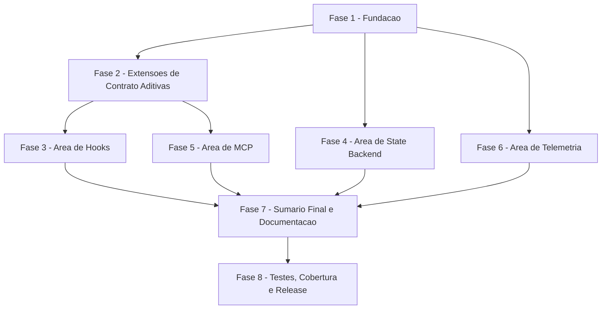

# Tarefas cstk-setup - Guided Project Setup Wizard

Escopo: implementar `cstk setup`, subcomando novo do binario CLI
(`cli/lib/setup.sh`) que percorre, em ordem fixa, as quatro areas de
configuracao recomendadas de um projeto (hooks obrigatorios + loose-usage
opt-in aninhado, backend de estado global, registro MCP de estado,
telemetria), delegando toda deteccao/aplicacao aos comandos dedicados
existentes. Cobre as 18 FRs de `spec.md`, os 18 cenarios de
`quickstart.md`, o contrato de 5 fronteiras de `contracts/cli-setup.md` e
os gaps abertos dos checklists de `requirements.md`/`security.md`.

**Legenda de status:**
- `[ ]` Pendente
- `[~]` Em andamento
- `[x]` Concluido
- `[!]` Bloqueado

**Legenda de criticidade:**
- `[C]` Critico - Impacto financeiro direto ou bloqueante (aqui: controles de seguranca FR-016/autenticidade de registro, escrita em escopo global sem opt-in equivalente)
- `[A]` Alto - Funcionalidade essencial (orquestracao core, as 4 areas, modos de execucao)
- `[M]` Medio - Necessario mas sem urgencia imediata (diagnostico read-only, consolidacao documental)

---

## FASE 1 - Fundacao e Orquestracao (dispatcher, skeleton, pre-condicoes)

### 1.1 Wiring do subcomando no dispatcher `[A]`

Ref: plan.md "Pontos de edicao em `cli/cstk`"; contracts/cli-setup.md §1

- [x] 1.1.1 Adicionar `setup` ao `case` do ramo generico de dispatch (`cli/cstk:250`)
- [x] 1.1.2 Adicionar `setup` a lista de comandos do help geral (`cli/cstk:136-152`)
- [x] 1.1.3 Adicionar ramo `setup)` ao `case` de help por subcomando (`cli/cstk:169-211`)
- [x] 1.1.4 Incluir `setup` nas listas de comandos validos das mensagens de erro (`cli/cstk:217` e `cli/cstk:299`)
- [x] 1.1.5 Teste: `scenario_dispatch_setup_wiring` em `tests/cstk/test_setup.sh` — `cstk setup --help`/`cstk help setup` respondem, e `setup` aparece nos 4 pontos de edicao

### 1.2 Skeleton de `cli/lib/setup.sh` e pre-condicoes `[A]`

Ref: spec.md FR-011, FR-007, FR-014; contracts/cli-setup.md §1 "Pre-condicoes"; plan.md Riscos item 2

- [x] 1.2.1 Criar `cli/lib/setup.sh` (`#!/bin/sh`, `set -eu`) com `setup_main`, sourceando libs irmas via `. "${CSTK_LIB:?CSTK_LIB must be set}/<lib>.sh"` (padrao `cli/lib/hooks.sh:60`)
- [x] 1.2.2 Implementar pre-condicao FR-011: `[ -e "$PATH/.git" ]` (arquivo OU diretorio); falha => exit 3, diagnostico em stderr, zero escrita
- [x] 1.2.3 Implementar pre-condicao FR-007: `require_tty` (`cli/lib/ui.sh:42-50`) quando `mode=interactive`; falha => exit 3 apontando `--dry-run`/`--yes`
- [x] 1.2.4 Definir e documentar (comentario no topo do arquivo) o padrao de neutralizacao de exit para toda chamada de aplicacao (`if ! fn; then ...` / `fn || rc=$?`) — nenhuma chamada de area pode derrubar o `set -eu` do wizard inteiro (FR-009, plan.md Risco 2)
- [x] 1.2.5 Teste: `scenario_git_root_gate` (quickstart Scenario 8) — diretorio sem `.git` falha exit 3 sem escrita; worktree (`.git` arquivo-ponteiro) e aceito
- [x] 1.2.6 Teste: `scenario_non_interactive_no_flag_fails_fast` (quickstart Scenario 6) — sem TTY e sem `--dry-run`/`--yes`, falha imediata exit 3 apontando as duas flags

### 1.3 Flags e precedencia de modo `[A]`

Ref: spec.md FR-004, FR-005, FR-006, FR-018; contracts/cli-setup.md §1 "Precedencia de modo"

- [x] 1.3.1 Implementar parsing de `--dry-run`, `--yes`, `--project-path PATH` (default `$PWD`); flag desconhecida => exit 2 <!-- validado empiricamente sessao (implementado na task 1.2, _setup_parse_args) -->
- [x] 1.3.2 Implementar precedencia: `--dry-run` presente => `mode=preview` (ignora `--yes`); so `--yes` => `mode=non-interactive`; nenhum => `mode=interactive` <!-- validado empiricamente sessao (implementado na task 1.2, _setup_resolve_mode) -->
- [x] 1.3.3 Confirmar ausencia deliberada de `--catalog`/equivalente (FR-018) — nenhuma flag de override de catalogo e repassada aos comandos delegados
- [x] 1.3.4 Teste: `scenario_dry_run_precedes_yes` (quickstart Scenario 5) — `--dry-run --yes` juntas => preview, zero escrita
- [x] 1.3.5 Teste: `scenario_unknown_flag_usage_error` — flag desconhecida => exit 2
- [x] 1.3.6 Teste: `scenario_catalog_flag_rejected` (quickstart Scenario 16, parte FR-018) — `cstk setup --catalog /qualquer/dir` => exit 2

---

## FASE 2 - Extensoes de Contrato Aditivas (deteccao read-only, seguranca)

### 2.1 `guard-hooks-status.sh --include-loose-usage` `[M]`

Ref: spec.md FR-002, FR-008; contracts/cli-setup.md §2.2; research.md Decision 3

- [x] 2.1.1 Adicionar flag `--include-loose-usage` a `guard-hooks-status.sh check`, acrescentando uma 4a linha TSV para `posttooluse-loose-usage.sh` (mesmo formato de 4 campos)
- [x] 2.1.2 Garantir retro-compatibilidade: sem a flag, saida byte-a-byte identica a atual; exit code inalterado (derivado apenas dos 3 hooks de `_GH_HOOKS`)
- [x] 2.1.3 Documentar que o consumidor (`setup.sh`) deve tratar exit 2 (`_gh_die_usage`, flag desconhecida em runtime antigo) como `loose_usage_status=indeterminate`, nunca como falha da area de hooks
- [x] 2.1.4 Teste: `scenario_loose_usage_detection_current_runtime` — flag presente, hook opt-in ausente => 4a linha reflete ausencia sem afetar exit
- [x] 2.1.5 Teste: `scenario_loose_usage_detection_stale_runtime` (quickstart Scenario 10) — runtime antigo rejeita a flag com exit 2; consumo trata como `indeterminate`, hooks obrigatorios seguem detectados/aplicados normalmente

### 2.2 `guard-hooks-status.sh --verify-registration` `[C]`

Ref: spec.md FR-016 (SEC-01/SEC-02/SEC-03 ja corrigidos no contrato/data-model); contracts/cli-setup.md §2.3; data-model.md invariante I5

- [x] 2.2.1 Adicionar flag `--verify-registration`, acrescentando 5a coluna TSV (`canonical`/`divergent`/`indeterminate`) por hook
- [x] 2.2.2 Implementar regra de decisao: toda linha do `settings.json` que contenha o basename MUST tambem conter o fragmento canonico **e** o token literal `"command"` na MESMA linha — senao `divergent` (fecha o caso de linha-isca decorativa, achado SEC-01)
- [x] 2.2.3 Com a flag, `divergent` em qualquer hook de `_GH_HOOKS` muda o exit para `1`; sem a flag, saida e exit permanecem identicos aos atuais
- [x] 2.2.4 Documentar que o consumidor deve tratar exit 2 (flag desconhecida em runtime antigo) como `indeterminate` — nunca `divergent`, nunca `configured` (I5)
- [x] 2.2.5 Teste: `scenario_verify_registration_canonical` — registro correto => `canonical`, area reporta `configured`
- [x] 2.2.6 Teste: `scenario_hook_redirected_reports_divergent` (quickstart Scenario 13) — `"command"` real aponta para outro programa mantendo o basename na linha => `divergent`, exit 1 com a flag
- [x] 2.2.7 Teste: `scenario_decoy_line_not_canonical` (quickstart Scenario 17, achado SEC-01) — linha decorativa com basename+fragmento canonico mas sem o token `"command"` na mesma linha NAO conta como `canonical`; `"command"` real divergente => `divergent`
- [x] 2.2.8 Teste: `scenario_minified_settings_indeterminate` (quickstart Scenario 15) — `settings.json` minificado numa unica linha => `indeterminate` (nunca `canonical`)
- [x] 2.2.9 Teste: `scenario_verify_registration_isolated_from_baseline` (quickstart Scenario 18, achado SEC-03) — chamada baseline roda SEPARADA e retorna exit 0 mesmo quando `--verify-registration` falha com exit 2 em runtime antigo; assertar via stub/contador que as duas chamadas de fato ocorreram
- [x] 2.2.10 Teste de retro-compatibilidade: `tests/test_guard-hooks-status.sh` existente permanece verde sem alteracao de comportamento quando a flag nao e passada

### 2.3 `_mcp_registration_status` em `cli/lib/mcp.sh` `[C]`

Ref: spec.md FR-016; contracts/cli-setup.md §4.1; checklists/security.md CHK012 (SEC-05), CHK013 (SEC-06); plan.md Risco 7

- [x] 2.3.1 Implementar `_mcp_registration_status PROJECT_PATH` — leitura textual sem `jq`, stdout `configured`/`divergent`/`not-configured`, exit sempre 0 (contrato de nao-falha, paridade com `state-backend.sh resolve`)
- [x] 2.3.2 Regra: `.mcp.json` ausente ou sem mencao a `cstk-state` => `not-configured`
- [x] 2.3.3 Regra: `cstk-state` presente e `command` e um dos 3 paths candidatos de `_mcp_runtime_script_path` (PATH / repo / catalogo instalado, `cli/lib/mcp.sh:127-146`) => `configured`
- [x] 2.3.4 Regra: `cstk-state` presente e `command` aponta para outro lugar OU nao e atribuivel => `divergent`
- [x] 2.3.5 (achado SEC-05 / CHK012) Restringir os paths candidatos aceitos ao sufixo esperado `/skills/agente-00c-runtime/scripts/mcp-launch.sh` **e** que exista de fato em disco no momento da verificacao — nao aceitar qualquer resultado de `command -v mcp-launch.sh` sem essa restricao
- [x] 2.3.6 (achado SEC-06 / CHK013) Tratar stdout vazio de `_mcp_registration_status` (nenhuma das 3 palavras esperadas) como indeterminado — nunca como uma das 3 respostas validas por omissao; nunca resolve para `configured`
- [x] 2.3.7 Teste: `scenario_mcp_not_configured` (quickstart Scenario 14c) — chave ausente => `not-configured`
- [x] 2.3.8 Teste: `scenario_mcp_divergent_foreign_script` (quickstart Scenario 14a) — `command` fora do catalogo => `divergent`
- [x] 2.3.9 Teste: `scenario_mcp_configured_cross_layer` (quickstart Scenario 14b) — `.mcp.json` gerado a partir do repo, verificado a partir do catalogo instalado => `configured`, nao `divergent` (evita falso-positivo entre camadas)
- [x] 2.3.10 Teste: `scenario_mcp_registration_status_empty_stdout` (SEC-06) — simular resposta vazia e confirmar tratamento como indeterminado, nunca `configured`

---

## FASE 3 - Area de Hooks `[A]`

### 3.1 Deteccao e apresentacao (3 chamadas separadas) `[A]`

Ref: spec.md FR-001, FR-002, FR-009; plan.md nota "Invocacao das extensoes (1) e (2) e sempre SEPARADA da baseline" (achado SEC-03); data-model.md "Fonte de status por area"

- [x] 3.1.1 Chamar `guard-hooks-status.sh check --projeto-alvo-path PATH --quiet` (baseline, sem flags) como fonte do veredito dos 3 hooks obrigatorios
- [x] 3.1.2 Chamar `--verify-registration` ISOLADAMENTE; mapear exit 2 => `mandatory_status`/`status` = `unavailable` (via I5); NUNCA combinar com a baseline na mesma invocacao
- [x] 3.1.3 Chamar `--include-loose-usage` ISOLADAMENTE; alimenta apenas `loose_usage_status`, nunca o exit/status principal
- [x] 3.1.4 Exibir o status atual (`configured`/`not-configured`/`divergent`/`unavailable`) ANTES de oferecer a acao (FR-002)
- [x] 3.1.5 Teste: `scenario_hooks_three_calls_isolated` (quickstart Scenario 18) — assertar via stub/contador que as 3 chamadas ocorrem separadamente e que a falha de uma nao mascara o veredito das outras

### 3.2 Aplicacao e mapeamento de outcome `[A]`

Ref: spec.md FR-003, FR-009; contracts/cli-setup.md §2.4; plan.md Risco 3

- [x] 3.2.1 Nao chamar `hooks install` quando `status=configured` (invariante I1 — idempotencia via zero chamada)
- [x] 3.2.2 Chamar `hooks_main install --project-path PATH` quando nao configurado e usuario aceita (ou `--yes`)
- [x] 3.2.3 Mapear os estados internos de `apply_guard_hooks` (`merged`/`paste-instructed`/`hooks-only`/`not-applicable`/`error`) para outcome do wizard — `paste-instructed` (jq ausente) NAO pode virar `applied` silencioso; deve carregar aviso de acao manual pendente ao summary
- [x] 3.2.4 Teste: `scenario_hooks_second_run_zero_calls` (quickstart Scenario 2) — segundo run com `status=configured` nao chama `hooks install` nenhuma vez
- [x] 3.2.5 Teste: `scenario_hooks_paste_instructed_surfaces_warning` (quickstart Scenario 7, sub-caso jq ausente) — exit 0 de `hooks install` em `paste-instructed` nao vira `applied` cego no summary

### 3.3 Escolha distinta de loose usage `[A]`

Ref: spec.md FR-008, US4; quickstart.md Scenario 9

- [x] 3.3.1 Apresentar a pergunta de loose usage capture SEPARADA da pergunta de hooks obrigatorios, com explicacao do que a captura registra
- [x] 3.3.2 Default em `--yes` para a sub-area de loose usage = `skip` (unica area cujo default recomendado e "nao", `data-model.md` `loose_usage_choice`)
- [x] 3.3.3 Recusar loose usage NAO impede a aplicacao dos hooks obrigatorios
- [x] 3.3.4 Teste: `scenario_loose_usage_declined_mandatory_still_applied` (quickstart Scenario 9) — negar loose usage; hooks obrigatorios instalados (`guard-hooks-status.sh check` sai exit 0); `posttooluse-loose-usage.sh` nao provisionado nem registrado

### 3.4 Tratamento de `divergent`/`unavailable` — falha fechada e remediacao `[C]`

Ref: spec.md FR-016, SC-006; contracts/cli-setup.md §2.3 "Nao remedia sozinho"; data-model.md invariantes I5/I6

- [x] 3.4.1 `status=divergent` OU `status=unavailable` => outcome `failed`, NUNCA `already-configured`/`configured`
- [x] 3.4.2 Exibir remediacao de duas etapas (remover a entrada divergente, so entao rodar `cstk hooks install`) — nunca instrucao de uma etapa so, comprovadamente inefetiva contra o merge "target vence"
- [x] 3.4.3 Garantir invariante I6: nenhuma chamada a `hooks install` quando `status` in {divergent, unavailable}
- [x] 3.4.4 Teste: `scenario_hooks_divergent_no_install_call` (quickstart Scenario 13) — assertar ausencia de chamada a `hooks install` via stub/contador, `.claude/settings.json` inalterado, exit 1
- [x] 3.4.5 Teste: `scenario_hooks_unavailable_status_reason` (quickstart Scenario 15) — `unavailable` reporta motivo distinguindo "nao consegui verificar" de "esta errado", exit 1

---

## FASE 4 - Area de State Backend `[A]`

### 4.1 Investigacao empirica de `reason=` (bloqueante para 4.3) `[A]`

Ref: quickstart.md Scenario 3; research.md Decision 10; plan.md Riscos item 1; checklists/requirements.md CHK015

- [x] 4.1.1 Enumerar empiricamente os valores de `reason=` produzidos por `_sb_cmd_resolve` (`state-backend.sh:234-269`), rodando `resolve` nos cenarios: nunca-configurado, `state_backend=json` explicito, `state_backend=sqlite` explicito, config ausente
- [x] 4.1.2 Documentar os valores encontrados (citando `arquivo:linha`) — nunca inventar valor nao observado empiricamente (Constitution VI)
- [x] 4.1.3 Definir a regra de aplicacao: `--yes` so aplica `enable-sqlite` quando `reason` indicar ausencia de configuracao; qualquer `reason` que indique escolha explicita => `already-configured` (preserva US2 AC3)
- [x] 4.1.4 Teste: `scenario_state_backend_deliberate_json_not_migrated` (quickstart Scenario 3) — `state_backend=json` mantido de proposito; `--yes` NAO migra

### 4.2 Deteccao e rotulo de escopo global `[A]`

Ref: spec.md FR-002, FR-017; contracts/cli-setup.md §3.1, §3.2, §3.4

- [x] 4.2.1 Chamar `config_state_backend_resolve` (`cli/lib/config.sh:94`) para obter `effective_backend=`/`reason=` (contrato de nao-falha, sempre exit 0)
- [x] 4.2.2 ~~Chamar `config_state_backend_capability`~~ — achado empirico (4.1): `capability` imprime so um token fixo de versao de runtime (`_SB_CAPABILITY_TOKEN="1"`, state-backend.sh:72), usado internamente por `enable-sqlite`/P8; NAO checa sqlite3. O sinal de `sqlite3` ausente/abaixo do minimo ja vem embutido no `reason=` de `resolve` (`configurado-dependencia-ausente`/`configurado-dependencia-abaixo-do-minimo`, produzido quando o backend foi declarado `sqlite`) — mapeado para `status=unavailable` em `_setup_state_backend_status_from_reason` (cli/lib/setup.sh) sem nenhuma chamada adicional. Ver comentario de cabecalho da area em `cli/lib/setup.sh` para o mapeamento completo reason->status.
- [x] 4.2.3 (FR-017) Antes de aplicar E em `--dry-run`, declarar explicitamente que a mudanca e escrita em `$HOME/.claude/cstk/config` e vale para TODOS os projetos da maquina — as outras 3 areas NAO carregam esse rotulo
- [x] 4.2.4 Teste: `scenario_state_backend_global_label_shown` (quickstart Scenario 16, parte FR-017) — rotulo global aparece so na area `state-backend`, inclusive em `--dry-run`; linha do summary repete a marca (repeticao no summary consolidado fica para a FASE 7, quando o `SetupRunSummary` for implementado — nao existe ainda)

### 4.3 Aplicacao com opt-in equivalente (achado SEC-04) `[C]`

Ref: spec.md FR-005; checklists/requirements.md CHK004; plan.md §Re-check de Constitution SEC-04

- [x] 4.3.1 Chamar `config_state_backend_enable_sqlite` (`cli/lib/config.sh:98`) somente quando 4.1.3 autorizar E (usuario aceita interativamente OU `--yes` com `reason` de ausencia de configuracao)
- [x] 4.3.2 (achado SEC-04) `--yes` NAO deve gravar a config global sem um sinal equivalente ao opt-in ja exigido para loose-usage — aplicar o mesmo padrao de "aviso explicito + default conservador quando ambiguo" antes de escrever fora do escopo do projeto. Implementado como: o aviso FR-017 (4.2.3) e SEMPRE exibido antes de decidir, em qualquer modo; e o "default conservador" e `--yes` so aplicar quando `reason` prova que NENHUMA escolha foi feita (`nunca-configurado`/`config-invalida`) — nunca migra `json-explicito` (US2 AC3) nem re-tenta uma dependencia ja conhecida como quebrada (`unavailable`, tratado sem chamada).
- [x] 4.3.3 Isolar falha de `enable-sqlite` (`sqlite3` ausente/abaixo do minimo, exit 3) como outcome `failed` da area, sem interromper as areas seguintes (FR-009)
- [x] 4.3.4 Teste: `scenario_state_backend_unavailable_sqlite_missing` (quickstart Scenario 7) — `sqlite3` ausente/abaixo de `3.45.1` => area `failed`; `mcp` e `telemetry` (areas seguintes na ordem fixa) continuam sendo percorridas e reportam outcome proprio (verificado ate onde essas areas existem nesta versao — `mcp`/`telemetry` ainda sao FASES futuras; o teste confirma que o wizard prossegue apos a falha isolada, exibindo a linha de areas restantes)

### 4.4 Diagnostico complementar via `cstk doctor --deps` `[M]`

Ref: contracts/cli-setup.md §3.4

- [x] 4.4.1 Reusar `_doctor_deps_run` (`cli/lib/doctor.sh:408-474`) como texto de diagnostico quando a area fica `unavailable`
- [x] 4.4.2 Teste: `scenario_state_backend_doctor_diagnostic_surfaced` — texto de `doctor --deps` (sqlite3/jq presente+versao) aparece no motivo exibido para `unavailable`

---

## FASE 5 - Area de MCP `[A]`

### 5.1 Deteccao e apresentacao `[A]`

Ref: spec.md FR-001, FR-002; contracts/cli-setup.md §4.1 (consome FASE 2.3)

- [x] 5.1.1 Chamar `_mcp_registration_status PROJECT_PATH` (implementada em 2.3) para obter `configured`/`divergent`/`not-configured`
- [x] 5.1.2 Exibir o status atual antes de oferecer a acao (FR-002)
- [x] 5.1.3 Teste: `scenario_mcp_status_displayed_before_action` — status impresso antes do prompt/aplicacao

### 5.2 Aplicacao — `cstk mcp install`, inclusive sem Docker (FR-015) `[A]`

Ref: spec.md FR-015; contracts/cli-setup.md §4.2, §4.3

- [x] 5.2.1 Nao chamar `mcp install` quando `status=configured` (idempotencia, invariante I1)
- [x] 5.2.2 Chamar `_mcp_cmd_install` (`cli/lib/mcp.sh:806-877`) quando `not-configured` e aceito/`--yes`
- [x] 5.2.3 (FR-015) Em `--yes`, aplicar `mcp install` MESMO sem Docker detectado — usar apenas `command -v docker` (nunca invocar `docker` funcionalmente, mesmo padrao de `cli/lib/mcp.sh:475-479`) para emitir aviso claro de Docker ausente
- [x] 5.2.4 Mapear `print_paste_block` (jq ausente, exit 0) para outcome com aviso de acao manual pendente, mesmo tratamento de 3.2.3
- [x] 5.2.5 Teste: `scenario_mcp_applied_without_docker_warns` (spec.md Clarifications, sessao 2026-08-07, item 3) — `--yes` sem Docker aplica `mcp install` e emite aviso claro

### 5.3 Tratamento de `divergent` — remediacao `[C]`

Ref: spec.md FR-016, SC-006; contracts/cli-setup.md §4.1 "Nao remedia sozinho"

- [x] 5.3.1 `status=divergent` => outcome `failed`, NUNCA `already-configured`
- [x] 5.3.2 Exibir remediacao de duas etapas (remover a entrada divergente, depois `cstk mcp install`)
- [x] 5.3.3 Garantir invariante I6: nenhuma chamada a `mcp install` quando `status=divergent`
- [x] 5.3.4 Teste: `scenario_mcp_divergent_no_install_call` (quickstart Scenario 14a) — assertar ausencia de chamada, `.mcp.json` inalterado, exit 1
- [x] 5.3.5 Teste: `scenario_mcp_cross_layer_not_divergent` (quickstart Scenario 14b) — validacao no nivel de orquestracao do wizard (reusa a deteccao de 2.3.9)

---

## FASE 6 - Area de Telemetria `[M]`

### 6.1 Diagnostico read-only `[M]`

Ref: spec.md FR-012; contracts/cli-setup.md §5

- [x] 6.1.1 Chamar `otel-usage.sh preflight` para diagnosticar o status de ativacao atual
- [x] 6.1.2 Exibir instrucoes/valores exatos (`CLAUDE_CODE_ENABLE_TELEMETRY=1`, `OTEL_METRICS_EXPORTER=prometheus`, `CSTK_OTEL_ENDPOINT`, `OTEL_EXPORTER_PROMETHEUS_PORT`, endpoint padrao `127.0.0.1:9464`) — todos citados de `README.md`, nunca inventados
- [x] 6.1.3 Garantir que outcome `applied` e INALCANCAVEL para esta area — apenas `already-configured`/`skipped`/`failed`; NUNCA escrever em `~/.zshrc` nem em qualquer arquivo fora do diretorio do projeto (FR-012)
- [x] 6.1.4 Teste: `scenario_telemetry_readonly_no_home_write` — assinatura do `HOME` sandboxado inalterada apos rodar a area, em qualquer modo

---

## FASE 7 - Sumario Final e Documentacao `[A]`

### 7.1 `SetupRunSummary` (FR-010) `[A]`

Ref: spec.md FR-010; contracts/cli-setup.md §1 "Saida (stdout)"

- [x] 7.1.1 Implementar a impressao do summary final: uma linha por area (`<area> <outcome> [escopo] [motivo]`), na ordem fixa de FR-001
- [x] 7.1.2 `[escopo]` marca `global` apenas na linha de `state-backend` (FR-017); demais sem marca
- [x] 7.1.3 Diagnosticos/avisos em stderr; dados de saida (status, summary) em stdout (Constitution II)
- [x] 7.1.4 Teste: `scenario_summary_lists_all_four_areas` (quickstart Scenario 1, 7) — summary sempre lista as 4 areas, mesmo com falha parcial

### 7.2 Declaracao de escopo da verificacao (achado SEC-07) `[A]`

Ref: checklists/security.md CHK009; plan.md §Re-check de Constitution SEC-07

- [x] 7.2.1 O summary final DEVE declarar explicitamente que a verificacao de hooks cobre apenas os 3 hooks obrigatorios de `_GH_HOOKS`, sem inferir garantia sobre outras entradas do `settings.json`
- [x] 7.2.2 Teste: `scenario_summary_declares_verification_scope` — texto do summary cita o escopo real (3 hooks obrigatorios), sem implicar auditoria do `settings.json` inteiro

### 7.3 Consolidacao documental de defaults (CHK005) `[M]`

Ref: checklists/requirements.md CHK005

- [x] 7.3.1 Criar tabela unica "area -> default aplicado sob `--yes`" (hooks obrigatorios=aplicar; loose-usage=skip; state-backend=condicional a 4.1.3; mcp=aplicar mesmo sem Docker; telemetry=N/A, so diagnostico) em `data-model.md` ou `contracts/cli-setup.md`, substituindo a dispersao atual em 4 locais
- [x] 7.3.2 Validar a tabela consolidada com o gate `validate-documentation` (tarefa documental, sem teste automatizado de codigo aplicavel) <!-- validate-sdd.sh --spec spec.md: profile=plan, errors=0, warnings=0 -->

---

## FASE 8 - Testes de Integracao, Cobertura e Release

### 8.1 Harness `tests/cstk/test_setup.sh` `[A]`

Ref: plan.md Technical Context "Testing"; `tests/run.sh:10-13`; `tests/lib/harness.sh:245-251`

- [x] 8.1.1 Criar `tests/cstk/test_setup.sh` com `HOME` sandboxado (`env HOME="$TMPDIR_TEST/home"`, padrao `tests/cstk/test_mcp.sh:50,58`) e `CSTK_LIB="$REPO_ROOT/cli/lib"` (padrao `tests/cstk/test_hooks.sh:13-14`) <!-- ja criado nas FASES 1-6 (23 scenarios); confirmado HOME sandboxado + CSTK_LIB em todo o arquivo -->
- [x] 8.1.2 Registrar `tests/cstk/test_setup.sh` no mapeamento de `tests/run.sh:10-13` <!-- automatico por convencao cli/lib/setup.sh -> tests/cstk/test_setup.sh (run.sh:168); `./tests/run.sh --list` ja o descobre sem registro manual -->
- [x] 8.1.3 Consolidar no arquivo todos os `scenario_*` ja definidos como subtarefas de teste nas FASES 1-7, com prompts interativos usando o bypass `CSTK_FORCE_INTERACTIVE=1` (`cli/lib/ui.sh:43`) <!-- adicionado scenario_interactive_happy_path_accepts_all (24o cenario): unico que roda mode=interactive de verdade via CSTK_FORCE_INTERACTIVE=1 + stdin com os 4 prompts reais (y/n/y/y); os demais 23 usavam --yes/--dry-run, que pulam _setup_prompt_yn -->

### 8.2 Gotcha de dependencia ausente `[A]`

Ref: plan.md Riscos item 5

- [x] 8.2.1 Desenhar os testes de "dependencia ausente" (sqlite3/docker/jq) desacoplando a deteccao do `PATH` interno em vez de tentar esconder o binario via stub de `PATH` (gotcha conhecido do projeto: stub de `PATH` nao esconde binario de `/usr/bin`) <!-- ja implementado nas FASES 3-5: _make_shim_path_no_jq/_no_sqlite3/_no_docker usam `env -i PATH="$_shim"` (substituicao total, nao prepend) -->
- [x] 8.2.2 Onde nao for possivel desacoplar, documentar explicitamente o cenario como "nao-coberto" com a nota do motivo, em vez de produzir um teste falso-positivo <!-- comentario explicito citando o gotcha do projeto ja presente em tests/cstk/test_setup.sh:626-631 (_make_shim_path_no_sqlite3); nenhum cenario desta feature ficou nao-coberto -->

### 8.3 Cobertura, extensoes de suites existentes e sincronizacao de release `[A]`

Ref: quickstart.md Scenario 11, Scenario 12; CLAUDE.md "Installed vs Source Drift"

- [x] 8.3.1 Rodar `./tests/run.sh --check-coverage` — `cli/lib/setup.sh` deve ter `tests/cstk/test_setup.sh` correspondente (quickstart Scenario 12) <!-- "Cobertura completa: zero orfaos." -->
- [x] 8.3.2 Estender `tests/cstk/test_hooks.sh` para cobrir `--include-loose-usage` e `--verify-registration` (incluindo retro-compatibilidade sem flag — 2.2.10) <!-- flags pertencem a guard-hooks-status.sh (global skill, nao cli/lib); ja cobertas em tests/test_guard-hooks-status.sh (scenario_loose_usage_detection_*, scenario_verify_registration_*, scenario_hook_redirected_reports_divergent, scenario_decoy_line_not_canonical, scenario_minified_settings_indeterminate, scenario_verify_registration_isolated_from_baseline) desde as tasks 2.1-2.2; test_hooks.sh cobre cli/lib/hooks.sh (`cstk hooks install`), escopo distinto -->
- [x] 8.3.3 Estender `tests/cstk/test_mcp.sh` para cobrir `_mcp_registration_status` (cenarios 2.3.7-2.3.10) <!-- ja implementado na task 2.3 (commit b098310): scenario_mcp_not_configured/_divergent_foreign_script/_configured_cross_layer/_registration_status_empty_stdout em tests/cstk/test_mcp.sh:1033+ -->
- [x] 8.3.4 Rodar gate `validate-tasks-template.sh` sobre este `tasks.md` e gate `validate-docs-rendered` sobre os artefatos da feature
- [!] 8.3.5 Verificacao manual de sincronizacao das duas metades (quickstart Scenario 11): `./scripts/build-release.sh X.Y.Z-dev`, depois **ambos** `cstk self-update --from ...` (runtime/binario) e `cstk install --from ...` (catalogo), confirmando `cstk doctor` com drift zero <!-- DEFERRED: task de release/sync (build-release + self-update + install --from), decisao do operador pos-review via skill release-wave; nao executada por politica de escopo desta execucao autonoma -->

---

## Matriz de Dependencias

> Nota: a ordem de CONSTRUCAO acima (foundation -> extensoes de seguranca ->
> areas -> sumario -> testes) e independente da ordem fixa de APRESENTACAO
> em runtime exigida por FR-001 (hooks, state-backend, mcp, telemetry),
> que e responsabilidade de `setup_main` (FASE 1.2/7.1) e nao do backlog
> de implementacao.

## Resumo Quantitativo

| Fase | Tarefas | Subtarefas | Criticidade |
|------|---------|------------|-------------|
| 1 - Fundacao e Orquestracao | 3 | 17 | A |
| 2 - Extensoes de Contrato Aditivas | 3 | 25 | C/M |
| 3 - Area de Hooks | 4 | 19 | A/C |
| 4 - Area de State Backend | 4 | 14 | A/C/M |
| 5 - Area de MCP | 3 | 13 | A/C |
| 6 - Area de Telemetria | 1 | 4 | M |
| 7 - Sumario Final e Documentacao | 3 | 8 | A/M |
| 8 - Testes, Cobertura e Release | 3 | 10 | A |
| **Total** | **24** | **110** | - |

## Escopo Coberto

| Item | Descricao | Fase |
|------|-----------|------|
| FR-001..FR-018 | As 18 Functional Requirements de `spec.md` (4 areas em ordem fixa, modos preview/non-interactive/interactive, autenticidade de registro FR-016, rotulo de escopo global FR-017, ausencia de override de catalogo FR-018) | FASE 1-7 |
| SC-001..SC-006 | Os 6 Success Criteria mensuraveis de `spec.md` | Verificados pelos testes de FASE 8 |
| SEC-04 | `--yes` nao grava config global sem opt-in equivalente | FASE 4.3 |
| SEC-05 | Restricao de sufixo + existencia em disco dos paths candidatos MCP | FASE 2.3.5 |
| SEC-06 | Stdout vazio de `_mcp_registration_status` tratado como indeterminado | FASE 2.3.6 |
| SEC-07 | Declaracao de escopo real da verificacao no summary | FASE 7.2 |
| CHK004 (requirements.md) | SEC-04..SEC-07 com destino explicito em tarefas | FASE 2.3, 4.3, 7.2 |
| CHK005 (requirements.md) | Consolidacao documental de defaults de `--yes` | FASE 7.3 |
| CHK015 (requirements.md) | Investigacao empirica de `reason=` antes de codificar default de state-backend | FASE 4.1 |
| Scenarios 1-18 (quickstart.md) | Cenarios end-to-end de validacao | Referenciados como subtarefas de teste nas FASES 1-7, consolidados em FASE 8.1 |
| Contratos §1-§5 (cli-setup.md) | As 5 fronteiras processo-a-processo | FASE 1 (§1), FASE 3 (§2), FASE 4 (§3), FASE 5 (§4), FASE 6 (§5) |

## Escopo Excluido

| Item | Descricao | Motivo |
|------|-----------|--------|
| SEC-01/SEC-02/SEC-03 | Achados de seguranca que alteravam contrato/data-model | Ja corrigidos em `contracts/cli-setup.md`/`data-model.md` na mesma onda do `plan.md`, antes do `create-tasks` — nao repetidos como tarefa |
| CHK018, CHK019 (requirements.md) | Apetite de risco SEC-04..SEC-07 vs US1-US4; residual aceito de SEC-01 | Marcados `{humano}` — aguardam decisao explicita do dono do produto, fora do backlog automatico |
| CHK016 (security.md) | Escopo de auditoria: varrer OUTRAS entradas de `settings.json`/`.mcp.json` alem dos 3 hooks obrigatorios | Marcado `{humano}` — decisao de escopo pendente; a FASE 7.2 so implementa a declaracao honesta do escopo atual (3 hooks), nao uma varredura mais ampla |
| Parse estrutural (`jq`) para `--verify-registration` | Confirmar que a linha `"command"` esta de fato sob `PreToolUse`/`matcher` (nao so co-ocorrencia textual) | Residual aceito e declarado em `contracts/cli-setup.md` §2.3; promover a comportamento default seria BREAKING (bump MAJOR), registrado como candidato para proxima major, fora desta feature |
| Persistencia de "setup ja rodou" | Qualquer flag/arquivo marcando execucao anterior | FR-013 proibe explicitamente — idempotencia e por re-checagem viva, nunca por estado persistido |
| `--catalog` / override de origem do catalogo | Flag ou variavel que redirecione de onde os scripts provisionados/comparados sao lidos | FR-018 proibe expor esse knob no `cstk setup`; os dois knobs existentes (`--catalog` de `hooks install`, `CSTK_HOOKS_CATALOG_DIR`) permanecem fora da superficie do wizard |
