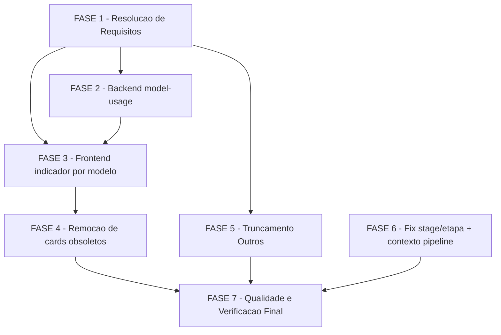

# Tarefas dashboard-refactor - Reorganização do Dashboard Principal e Página de Métricas

Escopo: expor custo/uso medido por modelo (`wave_model_usage`, schema v12) no
dashboard principal e na página de Métricas; remover 2 cards obsoletos;
truncar o throughput por etapa em top-10 + "Outros"; corrigir o defeito
`r.etapa`/`r.stage` no card de mix de modelos por etapa. Deriva de
[spec.md](./spec.md), [plan.md](./plan.md), [data-model.md](./data-model.md),
[quickstart.md](./quickstart.md), [contracts/](./contracts/) e dos checklists
[checklists/api.md](./checklists/api.md) / [checklists/ux.md](./checklists/ux.md).

**Legenda de status:**
- `[ ]` Pendente
- `[~]` Em andamento
- `[x]` Concluido
- `[!]` Bloqueado

**Legenda de criticidade:**
- `[C]` Critico - Impacto financeiro direto ou bloqueante
- `[A]` Alto - Funcionalidade essencial
- `[M]` Medio - Necessario mas sem urgencia imediata

---

## FASE 1 - Resolução de Requisitos (Gaps de Checklist)

### 1.1 Resolver gaps abertos do checklist de API `[A]`

Ref: checklists/api.md CHK003, CHK007, CHK008, CHK012, CHK014

- [x] 1.1.1 CHK003 — Definir e documentar no spec.md (ou como nota de escopo
  no plan.md) um limite numérico de cardinalidade para `byModel` (ex.: `LIMIT`
  + bucket `'(outros)'`, precedente `tokens-by-wave`), análogo ao truncamento
  top-10 já definido para etapas em FR-006/007/008
  → FR-003(c) adicionado ao spec.md (dec-037): limite de 10 modelos + bucket
  `'(outros)'`.
- [x] 1.1.2 CHK007 — Decidir se a distinção `NULL` (não medido) ≠ `0` (medido
  e zerado) para `costUsd`/`totalTokens` vira um FR explícito no spec.md, ou
  se permanece apenas como invariante do contrato (`model-usage-endpoint.md`
  Invariante 1); registrar a decisão como nota rastreável
  → dec-037: mantido no contrato; spec.md §Premissas confirma que Edge
  Cases/FR-005 já rastreiam a intenção.
- [x] 1.1.3 CHK008 — Decidir se a assimetria de filtro (`model-usage` aceita
  `project`/`period`; `model-mix-by-stage` não aceita nenhum) entre os dois
  cards da mesma tela de Métricas é aceitável, ou se deve virar um FR de
  paridade de filtro; registrar a decisão
  → dec-037: assimetria aceita, fora de escopo (spec.md §Premissas).
- [x] 1.1.4 CHK012 — Formalizar no spec.md (nova subseção "Escopo de
  Segurança" ou nota equivalente) a premissa de uso local single-user sem
  autenticação/rate-limit, hoje só presente como "risco aceito" no plano
  (`model-usage-endpoint.md`, nota final) e no gate `owasp-security`
  → dec-037: formalizado em spec.md §Premissas, citando
  docs/constitution.md linha 248.
- [x] 1.1.5 CHK014 — Adicionar ao spec.md uma nota de escopo explícita de que
  o campo legado `modelo` (pt-BR) em `model-mix`/`model-mix-by-stage`
  permanece inalterado por esta feature (já documentado em
  `contracts/existing-endpoints.md`, falta o espelho no artefato de
  requisitos)
  → dec-037: nota espelhada em spec.md §Premissas.
- [x] 1.1.6 Marcar os itens `[x]` correspondentes em `checklists/api.md` após
  cada decisão registrada, citando a resolução
  → CHK003/007/008/012/014 marcados `[x]` em checklists/api.md com citação
  de resolução.

### 1.2 Resolver gaps abertos do checklist de UX `[A]`

Ref: checklists/ux.md CHK002, CHK005, CHK007, CHK008, CHK010, CHK014

- [x] 1.2.1 CHK002 — Definir critério mínimo objetivo (mesmo que qualitativo,
  ex.: "grid CSS responsivo, sem breakpoint fixo, validado por review visual
  do dono do produto") para "layout recalculado de forma coerente" após a
  remoção dos 2 cards obsoletos (US2 Cenário 3); registrar como nota de
  aceite para a FASE 4
  → dec-038: critério ancorado nos grids `grid-overview`/`grid-N`
  (`prototype.css`) já existentes.
- [x] 1.2.2 CHK005 — Quantificar o limite do "resumo compacto" do dashboard
  principal vs. "detalhe completo" da página de Métricas (quantos modelos no
  topo do resumo, quais dos 3 campos `costUsd`/`totalTokens`/`waves` aparecem
  em cada tela); esta decisão alimenta diretamente as subtarefas 3.2 e 3.3
  → dec-038: top-3 modelos/`costUsd` no resumo; detalhe completo
  (`costUsd`+`totalTokens`+`coverage`) em Métricas.
- [x] 1.2.3 CHK007 — Definir requisito mínimo de acessibilidade para a nova
  codificação por cor de modelo: contraste WCAG 2.1 AA e/ou rótulo textual
  redundante para leitores de tela; alimenta a subtarefa 3.3 (implementação
  do indicador detalhado)
  → dec-038: rótulo textual redundante obrigatório, mesmo padrão do
  componente `Legend`.
- [x] 1.2.4 CHK008 — Definir se a interação com a barra "Outros" precisa de
  equivalente por teclado (foco + tecla para expandir), dado que hover/click
  não cobrem navegação por teclado; alimenta a subtarefa 5.3
  → dec-038: focável + Enter/Espaço (decidido junto com 1.2.5/CHK010).
- [x] 1.2.5 CHK010 — **Decisão bloqueante para FASE 5**: escolher entre hover
  (tooltip) e expand (click/detail) como mecanismo único de identificação das
  etapas agregadas em "Outros" (Acceptance Scenario US3.3); tooltip não
  funciona em touch/mobile — registrar a escolha e a justificativa
  → dec-038: clique/toque (não hover-only), expõe `othersMembers` num
  painel de detalhe focável.
- [x] 1.2.6 CHK014 — Formalizar no spec.md que responsividade mobile/tablet
  está fora de escopo (ferramenta interna desktop-only), na mesma seção de
  premissas do CHK012 (escopo de segurança)
  → dec-038: hipótese revertida por evidência empírica — o app já é
  responsivo até 480px (`prototype.css`/`tokens.css`); spec.md formaliza a
  preservação desse comportamento, não uma exclusão de escopo.
- [x] 1.2.7 Marcar os itens `[x]` correspondentes em `checklists/ux.md` após
  cada decisão registrada, citando a resolução
  → CHK002/005/007/008/010/014 marcados `[x]` em checklists/ux.md com
  citação de resolução.

---

## FASE 2 - Backend: Endpoint de Custo/Uso por Modelo `[A]`

Ref: spec.md FR-003/004/005/010/011 (US1); plan.md §Ordem de implementação
(bloco 1); contracts/model-usage-endpoint.md; data-model.md Parte B

### 2.1 Query `wave_model_usage` (byModel + coverage) `[A]`

Ref: data-model.md (DTOs `ModelUsageEntry`, `ModelUsageCoverage`);
contracts/model-usage-endpoint.md §Response 200

- [ ] 2.1.1 Implementar sonda `hasTable(db, 'wave_model_usage')`
  (`apps/server/src/db/columns.ts`) na query nova, reproduzindo o padrão já
  usado por `hasOtelUsage`
- [ ] 2.1.2 Implementar query `byModel`: `sum(cost_usd)`, `sum(total_tokens)`,
  `count(DISTINCT project || feature || wave)` agrupado por `model`, **sem**
  `coalesce` (NULL do SQLite deve permanecer NULL — Invariante 1 do contrato)
- [ ] 2.1.3 Aplicar `project`/`feature` por binding parametrizado (`?` +
  `.all(...params)`) e `period` via `periodToFilter` existente — nenhuma
  interpolação de valor vindo do cliente (Invariante 8 do gate de segurança)
- [ ] 2.1.4 Ordenar `byModel` por `costUsd` desc, `NULL` por último (SC-001)
- [ ] 2.1.5 Aplicar `LIMIT` + bucket `'(outros)'` de cardinalidade conforme
  decisão registrada em 1.1.1 (Invariante 9 do gate de segurança)
- [ ] 2.1.6 Linhas com `model IS NULL` viram o rótulo literal `'(desconhecido)'`
  — nunca descartadas
- [ ] 2.1.7 Implementar query `coverage` com os 3 denominadores
  (`wavesTotal`, `wavesWithModelUsage`, `wavesWithOtelCost`); no estado
  degradado os 3 campos são `null`, nunca `0`
- [ ] 2.1.8 Envolver a query em `try/catch` → `wrapDegraded('db-corrupt', …)`
  para nenhuma exceção em query-time escapar como `5xx` (Invariante 7 do gate
  de segurança — rotas de métrica hoje usam `try/finally` sem `catch`)
- [ ] 2.1.9 **Teste**: unit test da query contra
  `apps/server/test/knowledge-fixture.db` (v12, com dados reais) cobrindo:
  ordenação, `NULL` preservado, binding parametrizado, limite de
  cardinalidade
- [ ] 2.1.10 **Teste**: degradação contra
  `apps/server/test/knowledge-fixture-v10.db` (tabela ausente) — `200`,
  `meta.degraded=true`, `reason='table-empty'`, 3 campos de coverage `null`

### 2.2 Query `byStage` (correlação onda × etapa) `[A]`

Ref: data-model.md §DTO `ModelUsageByStage` (aviso de viabilidade não
verificada); contracts/model-usage-endpoint.md §byStage

- [ ] 2.2.1 Investigar empiricamente a correlação
  `(project, feature, wave, execution_id)` entre `wave_model_usage` e `waves`
  contra o banco real v12 — confirmar se a onda expõe etapa de forma
  confiável
- [ ] 2.2.2 Se a junção render dado confiável, implementar a query `byStage`
  agregando por `stage` + `model`; se não, `byStage` MUST retornar `[]`
  (nunca um valor derivado por suposição — regra dura do contrato)
- [ ] 2.2.3 **Teste**: cobrir os dois caminhos (junção confiável / `[]`) com
  fixture real; se `byStage` ficar `[]` permanentemente, documentar a
  decisão no plan.md/contrato como constatação empírica, não suposição

### 2.3 Rota `GET /api/v1/metrics/model-usage` `[A]`

Ref: contracts/model-usage-endpoint.md §Request

- [ ] 2.3.1 Registrar a rota em `apps/server/src/routes/metrics.ts`, método
  `GET` exclusivamente (Princípio I)
- [ ] 2.3.2 Reusar `parseUsageQuery` (`routes/metrics.ts:209`) para os
  params `project`/`feature`/`period` — não introduzir parser ad-hoc
  (consistência com `otel-usage`/`tokens-by-wave`)
- [ ] 2.3.3 Montar o envelope de resposta com `wrap()`, incluindo
  `meta.schemaVersion` e `meta.freshness`; **não** emitir `meta.approximate`
  (dado medido, não derivado)
- [ ] 2.3.4 **Teste**: request/response da rota via Fastify inject, incluindo
  os 4 query params válidos e o caso de param inválido (400 do Zod)

### 2.4 DTOs dual-def para o endpoint novo `[A]`

Ref: data-model.md Parte B; plan.md §Convenções de Borda (regra dual-def)

- [ ] 2.4.1 Criar interface `ModelUsageEntry` em
  `packages/shared-types/src/entities.ts` (`model`, `costUsd`, `totalTokens`,
  `waves`)
- [ ] 2.4.2 Criar schema Zod espelhado `ModelUsageEntrySchema` em
  `packages/shared-types/src/schemas/entities.ts`, **sem** `.default(null)`
  nos campos nulos (mesmo padrão de `schemas/entities.ts:48-51`)
- [ ] 2.4.3 Criar interface `ModelUsageCoverage` em `entities.ts`
  (`wavesTotal`, `wavesWithModelUsage`, `wavesWithOtelCost`, todos
  `number | null`)
- [ ] 2.4.4 Criar schema Zod espelhado `ModelUsageCoverageSchema` em
  `schemas/entities.ts`
- [ ] 2.4.5 Criar interface `ModelUsageByStage` em `entities.ts` (`stage`,
  `model`, `costUsd`, `totalTokens`)
- [ ] 2.4.6 Criar schema Zod espelhado `ModelUsageByStageSchema` em
  `schemas/entities.ts`
- [ ] 2.4.7 Criar interface `ModelUsageResult` em `entities.ts` (`byModel`,
  `byStage`, `coverage`)
- [ ] 2.4.8 Criar schema Zod espelhado `ModelUsageResultSchema` em
  `schemas/entities.ts`
- [ ] 2.4.9 **Teste de paridade**: estender
  `packages/shared-types/src/__tests__/parity-real.test.ts` para os 4 DTOs
  novos, comparando as chaves da interface manual com `Schema.shape` do Zod
  — falha se um dos dois esquecer um campo

### 2.5 Roundtrip End-to-End contra payload REAL `[C]`

Ref: quickstart.md Cenário 0 (OBRIGATÓRIO); plan.md §Convenções de Borda
(risco de borda nº 1 — defeito vivo em `Metrics.tsx:726`)

> Criticidade `[C]`: sem este cenário, o mecanismo de falso-verde descrito no
> quickstart (cliente não valida com Zod, casts `as Record<string, unknown>`,
> fixtures desatualizadas) deixa passar drift de nome de campo em silêncio —
> foi exatamente esse mecanismo que produziu o defeito da FASE 6.

- [ ] 2.5.1 Subir o servidor com `CSTK_KNOWLEDGE_DB=~/.claude/cstk/knowledge.db
  npm run dev -w @cstk-panel/server` e chamar
  `curl -s 'http://127.0.0.1:3001/api/v1/metrics/model-usage?period=all' | jq .`
- [ ] 2.5.2 Comparar o payload real, campo a campo, com
  `contracts/model-usage-endpoint.md`; se algum nome de campo divergir do
  contrato **[PROPOSTA]**, atualizar o contrato e os DTOs para refletir a
  forma real implementada (o contrato documentado é proposta, não fonte de
  verdade final — a implementação é)
- [ ] 2.5.3 Estender `apps/server/test/lib/roundtrip.test.ts` (Fastify real
  sobre `apps/server/test/knowledge-fixture.db`) para incluir a rota nova,
  validando `RawApiEnvelopeSchema` e checando 100% das chaves em camelCase
- [ ] 2.5.4 Verificar no DevTools do dev server (`npm run dev`, nunca `:8080`)
  que o componente que consome o endpoint novo lê exatamente as chaves que o
  servidor envia — zero `?? r.<nome_legado>`

---

## FASE 3 - Frontend: Indicador de Uso/Custo por Modelo `[A]`

Ref: spec.md US1, FR-003/004/005; SC-001/004/005; plan.md §Ordem de
implementação (bloco 2); depende de FASE 2 (contrato do endpoint fechado) e
das decisões 1.2.2/1.2.3

### 3.1 Módulo puro de agregação/seleção compartilhado `[A]`

Ref: research.md Decision 5 (regra em função pura, não em JSX); SC-005

- [ ] 3.1.1 Criar módulo puro `apps/web/src/lib/model-usage-select.ts`
  (seguindo o precedente de `overview-select.ts`) que normaliza o payload de
  `model-usage` em um view-model único, consumido tanto pelo KPI compacto
  quanto pelo detalhe completo — garante SC-005 (mesmos valores nas duas
  telas)
- [ ] 3.1.2 Aplicar rótulo de natureza do dado (medido) e as regras de
  `null`≠`0` (fmtUsd/estado `—` para `null`, `$0` para zero medido)
- [ ] 3.1.3 **Teste**: unit test do módulo puro com payloads sintéticos
  cobrindo: modelo de maior custo primeiro, `null` por último, estado vazio,
  estado degradado

### 3.2 KPI compacto no dashboard principal (Overview.tsx) `[A]`

Ref: spec.md US1 Cenário 1/2; SC-001; decisão 1.2.2 (limite do resumo)

- [ ] 3.2.1 Adicionar hook de consumo do endpoint `model-usage` em
  `apps/web/src/lib/hooks.ts` (`useMetric`), reusando o padrão de
  `otel-usage`
- [ ] 3.2.2 Renderizar KPI compacto em `Overview.tsx` mostrando o modelo de
  maior custo com rótulo de natureza "medido", respeitando o limite definido
  em 1.2.2
- [ ] 3.2.3 Tratar estado "sem dado" distinto de zero (Acceptance Scenario
  US1.2) usando os componentes de estado existentes (`EmptyState`/
  `DegradedBanner`)
- [ ] 3.2.4 **Teste**: componente/snapshot do KPI compacto cobrindo estado
  com dado, estado "sem dado" e estado degradado (`table-empty`)

### 3.3 Detalhe completo na página de Métricas (Metrics.tsx) `[A]`

Ref: spec.md US1 Cenário 3; SC-004/005; decisões 1.2.2/1.2.3 (acessibilidade)

- [ ] 3.3.1 Adicionar card de detalhe completo por modelo e por etapa em
  `Metrics.tsx`, consumindo `byModel[]`/`byStage[]`/`coverage` via o módulo
  puro de 3.1
- [ ] 3.3.2 Exibir rótulo de cobertura da amostra (`otelCoverageLabel()`,
  `apps/web/src/components/OtelUsage.tsx:47-48`) com os 3 denominadores,
  distinto do denominador do card `otel-usage` — os dois podem divergir
  (36 vs. 46 sobre 920) e isso é esperado
- [ ] 3.3.3 Garantir que nenhum indicador some `costUsd` com `tool_calls` ou
  `agent_*` (FR-004) — validar visualmente que os rótulos "medido"/"proxy"/
  "derivado" não se misturam num mesmo componente
- [ ] 3.3.4 Aplicar contraste WCAG 2.1 AA e/ou rótulo textual redundante na
  nova codificação por cor de modelo, conforme decisão 1.2.3
- [ ] 3.3.5 Usar função de cor segura (`Object.hasOwn`/`Map`/objeto com
  protótipo `null`) para o mapeamento modelo→cor, evitando prototype
  pollution via chave externa bruta (Invariante 10 do gate de segurança)
- [ ] 3.3.6 **Teste**: componente/snapshot do card de detalhe cobrindo
  estado com dado, "sem dado no período" (3b), degradado (3a) e valor
  medido igual a zero (3c) — os 3 estados nunca podem colapsar visualmente

### 3.4 Consistência entre as duas telas `[A]`

Ref: spec.md US1 Cenário 3; SC-005

- [ ] 3.4.1 **Teste de integração**: mesmo período/projeto selecionado nas
  duas telas produz exatamente os mesmos valores de `costUsd`/`totalTokens`
  por modelo (consumindo o mesmo módulo puro de 3.1)

---

## FASE 4 - Remoção de Cards Obsoletos `[M]`

Ref: spec.md US2, FR-001/002; SC-003; plan.md §Ordem de implementação
(bloco 3, após FASE 3 para o layout já ter o KPI novo no lugar); decisão 1.2.1

### 4.1 Remover card "custo por feature · proxy" `[M]`

Ref: contracts/existing-endpoints.md (`leaderboard[].toolCallsTotal` — payload
inalterado, remoção é de renderização)

- [ ] 4.1.1 Remover a renderização do card em `Overview.tsx` que consome
  `leaderboard[].toolCallsTotal`
- [ ] 4.1.2 Confirmar que `GET /api/v1/overview` continua retornando
  `leaderboard[]` inalterado (nenhuma mudança de contrato)
- [ ] 4.1.3 **Teste**: `overview-select.test.ts` ajustado para o VM sem
  `maxToolCalls`, refletindo a remoção do consumidor

### 4.2 Remover card "funil do pipeline" `[M]`

Ref: contracts/existing-endpoints.md (`funnel[]` — payload inalterado)

- [ ] 4.2.1 Remover a renderização do card em `Overview.tsx` que consome
  `funnel[]`
- [ ] 4.2.2 Remover `FunnelChart` de `apps/web/src/components/charts.tsx` e
  seu export em `apps/web/src/components/index.ts` (órfão sem consumidor);
  **não** remover `BarH` (usado em `ExecutionDetail.tsx:853`) nem
  `SDD_STAGES` (usado em `PipelineProgress.tsx`)
- [ ] 4.2.3 Confirmar que `GET /api/v1/overview` continua retornando
  `funnel[]` inalterado
- [ ] 4.2.4 **Teste**: `overview-select.test.ts` ajustado para o VM sem
  `maxFunnel`

### 4.3 Recomposição de layout `[M]`

Ref: spec.md US2 Cenário 3; decisão 1.2.1 (critério de "coerente")

- [ ] 4.3.1 Ajustar o grid/layout de `Overview.tsx` para os cards
  remanescentes ocuparem o espaço conforme o critério definido em 1.2.1, sem
  buracos vazios nem cards desproporcionais
- [ ] 4.3.2 **Verificação manual** (dev server, `npm run dev`): abrir o
  dashboard principal e confirmar visualmente que os dois cards obsoletos
  não aparecem mais (SC-003) e o layout está coerente

---

## FASE 5 - Truncamento Top-10 + "Outros" no Throughput por Etapa `[M]`

Ref: spec.md US3, FR-006/007/008; SC-002; plan.md §Ordem de implementação
(bloco 4, independente das demais fases); depende da decisão 1.2.5 (CHK010)

### 5.1 Função pura de truncamento (`TruncatedBars`) `[M]`

Ref: data-model.md Parte C; quickstart.md Cenário 5

- [ ] 5.1.1 Criar módulo puro `apps/web/src/lib/truncate-bars.ts` (ou
  equivalente) implementando `TruncatedBars` (`bars`, `othersLabel`,
  `othersMembers`) a partir de uma lista de etapas ordenadas por volume
- [ ] 5.1.2 Implementar a regra: até 10 entradas nomeadas, 11ª em diante
  somadas em `Outros`; exatamente 10 entradas → `othersLabel: null`;
  exatamente 11 → `Outros` representa a única etapa excedente; 0 entradas →
  `[]`
- [ ] 5.1.3 **Teste**: tabela de casos do quickstart Cenário 5 (14 etapas,
  exatamente 10, exatamente 11, 0 etapas) + invariante `bars.length <= 11`
  para entrada aleatória (SC-002)

### 5.2 Integração no card de throughput por etapa `[M]`

Ref: contracts/existing-endpoints.md (nota de veracidade do subtítulo)

- [ ] 5.2.1 Consumir `TruncatedBars` no card de throughput por etapa em
  `Metrics.tsx`, substituindo a renderização atual sem limite
- [ ] 5.2.2 Corrigir o subtítulo do card (hoje "soma tool_calls por etapa
  SDD", factualmente errado — a query conta decisões, não soma `tool_calls`)
  para refletir a semântica real (contagem de decisões)
- [ ] 5.2.3 **Teste**: snapshot do card com >10 etapas confirmando exatamente
  10 barras nomeadas + 1 barra "Outros" com o subtítulo corrigido

### 5.3 Mecanismo de identificação de "Outros" `[M]`

Ref: spec.md US3 Cenário 3; decisão 1.2.5 (hover vs. expand); decisão 1.2.4
(navegação por teclado)

- [ ] 5.3.1 Implementar o mecanismo escolhido em 1.2.5 (hover ou expand) para
  o usuário identificar quais etapas foram agregadas em `Outros`
  (`othersMembers`)
- [ ] 5.3.2 Implementar o equivalente de navegação por teclado definido em
  1.2.4, se aplicável
- [ ] 5.3.3 **Teste**: interação (hover/expand/teclado conforme decidido)
  expõe corretamente os membros de `othersMembers`

---

## FASE 6 - Correção do Defeito `r.etapa`/`r.stage` e Contexto de Pipeline `[A]`

Ref: spec.md US4, FR-009; plan.md §Summary item 5 (causa raiz do sintoma da
User Story 4); contracts/existing-endpoints.md (defeito de consumo, linha
`Metrics.tsx:726`); independente das FASEs 2-5, pode rodar em paralelo

### 6.1 Corrigir a leitura do campo de etapa `[A]`

Ref: `apps/web/src/screens/Metrics.tsx:726`; `db/queries/metrics.ts:374`
(payload projeta `stage`, não `etapa`)

- [ ] 6.1.1 Corrigir `Metrics.tsx:726` para ler `r.stage` em vez de
  `r.etapa` no consumo de `GET /metrics/model-mix-by-stage` — o payload
  server-side já projeta `stage` (inglês); `etapa` nunca existiu no payload
  real, causando o colapso de todas as linhas no rótulo `'?'`
- [ ] 6.1.2 Varrer `Metrics.tsx` e arquivos correlatos do dashboard
  (`Overview.tsx`, `overview-select.ts`, demais consumidores de payload em
  `apps/web/src/screens/` e `apps/web/src/lib/`) por outras ocorrências do
  mesmo padrão de mismatch pt/en (nome de campo lido no front divergente do
  nome projetado pelo servidor), usando grep dirigido por `.etapa`, `.modelo`
  e nomes pt-BR remanescentes
- [ ] 6.1.3 Para cada ocorrência adicional encontrada em 6.1.2, registrar
  como sub-tarefa emergente (formato `6.1.3-bis`) e corrigir com o mesmo
  rigor desta tarefa — **não** corrigir silenciosamente sem registro
- [ ] 6.1.4 **Teste de regressão**: teste de integração/roundtrip para
  `GET /metrics/model-mix-by-stage` contra o payload real (o endpoint hoje
  não tem NENHUMA cobertura — é o que permitiu o defeito passar
  despercebido); o teste deve falhar se o componente voltar a ler um campo
  ausente do payload real

### 6.2 Ordenação por ordem do pipeline SDD `[A]`

Ref: spec.md FR-009 (specify→clarify→plan→checklist→create-tasks→
execute-task→review-task); checklists/ux.md CHK012 (lista completa, sem
etapas faltando)

- [ ] 6.2.1 Ordenar as barras do card "Mix de modelos por etapa" pela ordem
  de `SDD_STAGES` (`apps/web/src/lib/constants.ts`), não por volume
- [ ] 6.2.2 Etapas presentes no dado e ausentes de `SDD_STAGES` aparecem ao
  fim, ordenadas por volume desc, com o rótulo real preservado (nunca
  descartadas)
- [ ] 6.2.3 Confirmar rótulo `meta.approximate=true` mantido no card (dado
  continua derivado de `decisions.choice`, distinto do card medido por
  modelo da FASE 3)
- [ ] 6.2.4 **Teste**: ordenação determinística cobrindo etapas conhecidas +
  etapa desconhecida (fora de `SDD_STAGES`) ao fim da lista

---

## FASE 7 - Qualidade e Verificação Final `[A]`

Ref: quickstart.md (gates + Cenários 1-7); plan.md §Re-check de Constitution

### 7.1 Gates automatizados `[A]`

- [ ] 7.1.1 `npm run typecheck` verde (inclui `packages/shared-types` e
  `apps/web`/`apps/server`)
- [ ] 7.1.2 `npm run lint` verde
- [ ] 7.1.3 `npm run lint:readonly-check` verde (zero
  `INSERT|UPDATE|DELETE|CREATE|DROP|ALTER` em `apps/server/src`, incluindo a
  rota nova)
- [ ] 7.1.4 `npm test` verde (3 configs: raiz, `apps/server`,
  `packages/shared-types`)

### 7.2 Verificação manual conforme quickstart `[A]`

- [ ] 7.2.1 Cenário 1 — custo por modelo visível e consistente nas duas
  telas (dev server, banco real v12)
- [ ] 7.2.2 Cenário 2 — cobertura da amostra exibida com os denominadores
  divergentes esperados (36 vs. 46 sobre 920)
- [ ] 7.2.3 Cenário 3 — estados "sem dado" (3a tabela ausente, 3b período
  vazio, 3c zero medido) nunca colapsam visualmente
- [ ] 7.2.4 Cenário 4 — cards obsoletos ausentes, layout coerente
- [ ] 7.2.5 Cenário 5 — truncamento top-10 + "Outros" correto nos 4 casos de
  entrada
- [ ] 7.2.6 Cenário 6 — mix de modelos por etapa com rótulos reais e ordem
  do pipeline
- [ ] 7.2.7 Cenário 7 — `npm run lint:readonly-check` e revisão da
  superfície de rotas adicionada

---

## Matriz de Dependencias

## Resumo Quantitativo

| Fase | Tarefas | Subtarefas | Criticidade |
|------|---------|------------|-------------|
| 1 - Resolução de Requisitos | 2 | 13 | A |
| 2 - Backend model-usage | 5 | 27 | A/C |
| 3 - Frontend indicador por modelo | 4 | 13 | A |
| 4 - Remoção de cards obsoletos | 3 | 9 | M |
| 5 - Truncamento Outros | 3 | 9 | M |
| 6 - Fix stage/etapa + contexto pipeline | 2 | 8 | A |
| 7 - Qualidade e Verificação Final | 2 | 11 | A |
| **Total** | **21** | **90** | - |

## Escopo Coberto

| Item | Descricao | Fase |
|------|-----------|------|
| CHK-gaps | Resolução dos 11 gaps `{humano}`/`[Gap]` dos checklists api.md/ux.md | 1 |
| FR-003/004/005/010/011 | Endpoint novo `GET /metrics/model-usage`, DTOs dual-def, roundtrip real | 2 |
| SC-001/004/005 | KPI compacto + detalhe completo por modelo nas duas telas | 3 |
| FR-001/002, SC-003 | Remoção dos 2 cards obsoletos + limpeza de órfãos | 4 |
| FR-006/007/008, SC-002 | Truncamento top-10 + "Outros" no throughput por etapa | 5 |
| FR-009 | Correção `r.etapa`→`r.stage` + ordenação por pipeline no mix por etapa | 6 |
| Gates + Cenários 1-7 | Verificação final automatizada e manual | 7 |

## Escopo Excluido

| Item | Descricao | Motivo |
|------|-----------|--------|
| `byStage` garantido | Recorte de custo por modelo × etapa no endpoint novo | Correlação `wave_model_usage`×`waves` não verificada empiricamente na fase de plano (data-model.md); FASE 2.2 investiga, mas pode legitimamente resultar em `[]` permanente sem violar FR-009 (atendida via FASE 6) |
| Rename `modelo`→`model` em rotas legadas | Uniformizar `model-mix`/`model-mix-by-stage` para inglês | Mudança incompatível de contrato, fora do escopo (research.md Decision 6; CHK014 registra apenas nota de escopo, não fix) |
| `setErrorHandler` global | Handler de erro Fastify devolvendo envelope padrão sem detalhe interno | Recomendação do gate de segurança, mas "fora do escopo mínimo" (Invariante 7 do contrato); mitigação local via `try/catch` na FASE 2.1.8 já resolve o MUST |
| Responsividade mobile/tablet | Suporte a telas menores para o dashboard reorganizado | Fora de escopo por premissa de ferramenta desktop-only (decisão 1.2.6/CHK014 apenas formaliza a premissa, não implementa suporte) |
| Autenticação/rate-limit no endpoint novo | Controles de acesso na rota `model-usage` | Risco aceito pelo modelo de ameaça (uso local single-user, bind `127.0.0.1`); decisão 1.1.4 apenas formaliza a premissa no spec.md |
