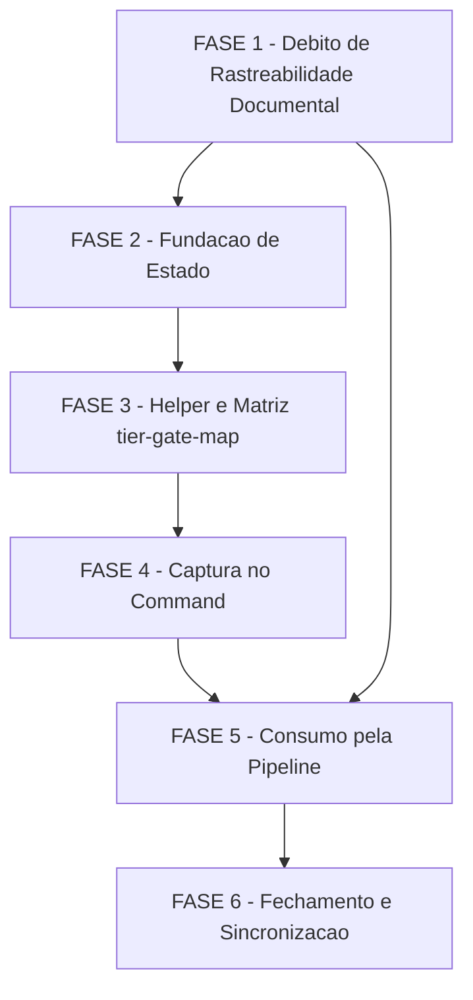

# Tarefas delivery-tier - Pergunta de finalidade (tier de entrega) no inicio do agente-00c

Escopo: decompor `docs/specs/delivery-tier/plan.md` (Fases A-E) e o
debito de rastreabilidade documental aceito em dec-026 (checklists
`requirements.md`/`security.md`) num backlog executavel. Tier de entrega
(`delivery_tier`): 1 campo de estado top-level, 1 helper POSIX novo
(`delivery-tier.sh`), 1 tabela de referencia versionada
(`tier-gate-map.txt`), 5 arquivos de catalogo `[MOD]`, restrito ao
`/agente-00c` (dec-011).

**Legenda de status:**
- `[ ]` Pendente
- `[~]` Em andamento
- `[x]` Concluido
- `[!]` Bloqueado

**Legenda de criticidade:**
- `[C]` Critico - Impacto financeiro direto ou bloqueante
- `[A]` Alto - Funcionalidade essencial
- `[M]` Medio - Necessario mas sem urgencia imediata

**Tier de entrega usado na geracao deste backlog**: `cloud-public`
(default da execucao `delivery-tier` — a propria feature ainda nao existe
para calibrar sua propria decomposicao; backlog completo, sem omissao de
fases, conforme FR-006).

---

## FASE 1 - Fechamento de Debito de Rastreabilidade Documental

### 1.1 Fechar gap de medicao de profundidade FR-004 `[A]`

Ref: checklists/requirements.md CHK018 (Gap), CHK022 (humano) · dec-026

- [ ] 1.1.1 Adicionar Acceptance Scenario dedicado a User Story 2 de
      `spec.md` medindo o efeito de FR-004 no CONTEUDO de `spec.md`/
      `plan.md` (ex.: contagem de secoes de arquitetura/NFRs entre uma
      execucao tier `local` e uma `cloud-public` do mesmo
      produto-exemplo) — distinto do que SC-003 ja mede (efeito no
      backlog de FR-006)
- [ ] 1.1.2 Adicionar Success Criterion dedicado (`SC-005`) em
      `spec.md` §Success Criteria formalizando essa medicao,
      independente de SC-003
- [ ] 1.1.3 Adicionar um cenario novo a `quickstart.md` (Cenario 24)
      exercitando o novo Acceptance Scenario/SC-005 (specify/plan sob
      tier `local` produz artefato com menos secoes/NFRs detalhados que
      sob `cloud-public`)
- [ ] 1.1.4 Marcar CHK018 `[x]` em `checklists/requirements.md` citando
      SC-005/Cenario 24 como evidencia; resolver CHK022 registrando a
      decisao adotada (SC dedicado criado, nao apenas proxy agregado de
      SC-003)

### 1.2 Ancorar como MUST literal na spec as garantias de seguranca ja corrigidas no plan.md `[A]`

Ref: checklists/security.md CHK001, CHK005, CHK006, CHK007, CHK010,
CHK011 · dec-026 · gate `owasp-security` findings F2/F3/F4/F5/F6

- [ ] 1.2.1 `spec.md` FR-005: acrescentar clausula MUST cobrindo a
      coercao de um modo PRESENTE mas invalido/corrompido/vazio ao
      enum fechado `completo|leve|skip` — nao apenas o caso de par
      ausente da matriz (fecha CHK001 / finding F2 HIGH)
- [ ] 1.2.2 `spec.md` FR-009: qualificar a clausula de rebaixamento com
      "decisao manual **do operador**", em paridade textual com a
      clausula de elevacao que ja nomeia o autor (fecha CHK005 /
      finding F5 HIGH)
- [ ] 1.2.3 `spec.md` FR-008/FR-009: acrescentar requisito testavel de
      deteccao de tier alterado sem Decisao de operador correspondente
      (o finding `delivery-tier-unattended-change` do plano) (fecha
      CHK006 / finding F5 HIGH)
- [ ] 1.2.4 `spec.md` FR-006: qualificar "observabilidade de producao"
      excluindo explicitamente log de autenticacao/autorizacao e
      trilha de auditoria do que pode ser omitido (fecha CHK007 /
      finding F4 MEDIUM, OWASP A09)
- [ ] 1.2.5 `spec.md` FR-004: exigir que a leitura do tier propagado ao
      contexto de briefing/specify/plan venha de fonte coagida ao enum
      fechado (nunca texto livre interpolado no prompt) (fecha CHK010 /
      finding F6 MEDIUM, LLM01)
- [ ] 1.2.6 Marcar CHK001, CHK005, CHK006, CHK007, CHK010 `[x]` em
      `checklists/security.md` citando as novas clausulas de `spec.md`;
      registrar CHK011 como risco tratado (nao mais pendencia
      `{humano}` em aberto)
- [ ] 1.2.7 Rodar a skill `validate-documentation` sobre `spec.md`
      apos as edicoes (subtarefa de verificacao do artefato, nao de
      codigo) e confirmar ausencia de findings `critical`

---

## FASE 2 - Fundacao de Estado

### 2.1 Flag `--delivery-tier` no init de `state-rw.sh` `[A]`

Ref: plan.md Fase A item 1 · contracts/cli-delivery-tier.md §5 ·
`state-rw.sh:361-372` (precedente `--atomic-commit`/`--roadmap-mode`)

- [ ] 2.1.1 Adicionar parsing de `--delivery-tier <token>` ao case de
      flags do `init` (~`:361-372`), default `cloud-public`, valor fora
      do enum de 4 tokens ⇒ `_sr_die` exit 2 **sem escrever estado**
- [ ] 2.1.2 Emitir a chave `delivery_tier` no template `jq` do `init`
      (~`:500-521`), **sempre presente** (nunca omitida), como irma de
      `.execution` (nivel top-level, nao aninhada)
- [ ] 2.1.3 Teste: estender `tests/test_state-rw.sh` com os 4 eixos
      (valor valido do enum / valor invalido ⇒ exit 2 sem escrita /
      flag omitida ⇒ default `cloud-public` / retro-compat com campo
      ausente), espelhando `:540-603` (cenarios de `--atomic-commit`)

### 2.2 `extra_fields` do backend SQLite compoe as duas chaves `[A]`

Ref: plan.md Fase A item 2 (risco Alto: "sem este passo o tier nao
existe no init sob SQLite") · `_state-rw-db.sh:165`

- [ ] 2.2.1 Modificar a linha ~165 de `_state-rw-db.sh` para compor
      `{roadmap_mode_enabled: $r, delivery_tier: $t}` no `_ie_extra_json`
      (hoje hardcoded com apenas a chave `roadmap_mode_enabled`),
      garantindo default `cloud-public` quando o valor de entrada for
      omitido
- [ ] 2.2.2 Confirmar via probe SQL (`PRAGMA table_info(execution)` +
      `SELECT extra_fields FROM execution`) que **nao ha** coluna
      dedicada nem alteracao de DDL — preserva research.md Decision 1
- [ ] 2.2.3 Teste: estender `tests/test_state-rw.sh` (cenario SQLite)
      confirmando que o `init` sob backend SQLite grava `delivery_tier`
      em `extra_fields` e que `get`/`read` devolvem o mesmo valor que o
      backend JSON (paridade `_sr_db_read` merge `$ext + $core`,
      `:361-367`)

### 2.3 Validacao de `.delivery_tier` em `state-validate.sh` `[A]`

Ref: plan.md Fase A item 3 · data-model.md §Validacao ·
`state-validate.sh:193-201` (precedente `atomic_commit_enabled`)

- [ ] 2.3.1 Adicionar bloco de validacao espelhando `atomic_commit_enabled`
      (`:193-201`): tipo aceito e string dentre os 4 tokens do enum OU
      ausente (`null`)
- [ ] 2.3.2 Qualquer valor fora do enum (nao-string, string fora dos 4
      tokens) produz erro de validacao explicito, com o valor obtido no
      texto do erro
- [ ] 2.3.3 Teste: estender `tests/test_state-validate.sh` com os 3
      eixos (enum valido / enum invalido / campo ausente ⇒ ok)

### 2.4 Verificacao ponta-a-ponta da Fase 2 (Fundacao de Estado) `[A]`

- [ ] 2.4.1 Executar quickstart Cenario 4 (persistencia sem migracao de
      schema, paridade JSON/SQLite)
- [ ] 2.4.2 Executar quickstart Cenario 5 (estado legado sem o campo ⇒
      `cloud-public`)
- [ ] 2.4.3 Rodar `tests/test_state-rw.sh` + `tests/test_state-validate.sh`
      atualizados isoladamente e confirmar todos os cenarios verdes

---

## FASE 3 - Helper `delivery-tier.sh` e Matriz `tier-gate-map`

### 3.1 Criar `references/tier-gate-map.txt` (matriz v1) `[A]`

Ref: plan.md Fase B item 5 · contracts/tier-gate-map.md §3 ·
data-model.md §Entity MatrizTierGate · dec-012

- [ ] 3.1.1 Escrever o arquivo
      `plugins/cstk/skills/agente-00c-runtime/references/tier-gate-map.txt`
      com o cabecalho de formato/regras e as 4 linhas de dados literais
      de `contracts/tier-gate-map.md` §3: `local|owasp-security|skip`,
      `internal-network|owasp-security|leve`,
      `cloud-internal|owasp-security|completo`,
      `cloud-public|owasp-security|completo`
- [ ] 3.1.2 Incluir no cabecalho o comentario de escopo deliberado
      (dec-012): a matriz cobre EXCLUSIVAMENTE `owasp-security`; os
      demais gates complementares nao tem linha de proposito
- [ ] 3.1.3 Verificar por `grep` que ha exatamente 4 linhas de dados
      (descontando comentarios `#` e linhas vazias) — propriedade
      estrutural verificavel de dec-012

### 3.2 Criar `delivery-tier.sh` (`get` \| `set` \| `gate-mode`) `[C]`

Ref: plan.md Fase B item 6 · contracts/cli-delivery-tier.md §1-3 ·
gate `owasp-security` findings F1/F2/F3/F5/F6 (fail-safe de seguranca)

- [ ] 3.2.1 Implementar `get --state-dir DIR`: delega a `state-rw.sh get
      --field '.delivery_tier // "cloud-public"' 2>/dev/null`, degrada
      para `cloud-public` em QUALQUER falha (INV-1), exit 0 sempre
      (exceto uso incorreto)
- [ ] 3.2.2 `get` coage a saida ao enum fechado de 4 tokens antes de
      emitir — nunca ecoa valor cru do estado (INV-5, finding F6 MEDIUM
      LLM01): token fora do enum ⇒ `cloud-public`
- [ ] 3.2.3 Implementar `set --state-dir DIR --value <token>
      [--allow-downgrade]`: `--value` fora do enum ⇒ exit 2 sem
      escrever; ordinal novo > atual (elevacao) ⇒ grava exit 0; ordinal
      igual ⇒ no-op idempotente exit 0; ordinal novo < atual
      (rebaixamento) sem `--allow-downgrade` ⇒ exit 2 sem escrever; com
      a flag ⇒ grava. Delega a `state-rw.sh set --field '.delivery_tier'`
      (o helper NAO registra Decisao — quem registra e o chamador)
- [ ] 3.2.4 Implementar `gate-mode --gate NOME [--tier TOKEN]
      [--state-dir DIR]`: resolve o path da tabela relativo ao proprio
      script (tecnica de `model-routing.sh:1036-1043`); parser POSIX
      puro sem `jq`, primeiro match do par `(tier, gate)` vence
      (`break`); **R1** coercao ao enum `completo|leve|skip` (nunca
      ecoa `_dt_result` verbatim); **R2** `tr -d '\r'` nos 3 campos
      antes de comparar/emitir; par ausente ou tabela ilegivel ⇒
      `completo` (INV-2 — fail-safe nunca produz `skip` por
      degradacao)
- [ ] 3.2.5 NUNCA usar `case ... esac` dentro de `$( ... )` no parser
      (gotcha de portabilidade documentado em
      `model-routing.sh:1076-1082` — falha de parse em varios `sh`
      POSIX, inclusive bash em modo POSIX no macOS); cabecalho
      `#!/bin/sh`, `set -eu`; usage em stderr + exit 2 para flag
      desconhecida/omitida; exit codes conforme contrato §6
- [ ] 3.2.6 Teste: criar `tests/test_delivery-tier.sh` cobrindo os 15
      cenarios minimos do contrato §7 — `get` com/sem campo, com
      `--state-dir` inexistente, com token corrompido no estado; `set`
      elevacao / rebaixamento com e sem flag / valor fora do enum;
      `gate-mode` nos 4 tiers x `owasp-security`, gate sem linha
      (`checklist`), tabela ausente, modo fora do enum na tabela
      (`skipp`/`SKIP`/vazio), tabela em CRLF, linha duplicada (primeira
      vence), `get` com texto arbitrario injetado no campo; paridade
      JSON/SQLite em `get`/`set` — sem `set -eu` no arquivo de teste
      (`tests/README.md:172-174`)
- [ ] 3.2.7 Verificar (nao necessariamente modificar) se
      `delivery-tier.sh` aciona o grep estatico de `/state\.json` em
      `tests/test_state-parity-sweep.sh` — NAO deve, pois delega
      inteiramente a `state-rw.sh` (interface canonica); se acionar,
      adicionar entrada na allowlist do proprio teste com
      classificacao + justificativa no MESMO commit

### 3.3 Verificacao ponta-a-ponta da Fase 3 (Helper e matriz) `[A]`

- [ ] 3.3.1 Executar quickstart Cenarios 6, 7, 12, 13, 16, 19, 20, 22
- [ ] 3.3.2 Confirmar que nenhum caminho de degradacao testado produz
      `skip` (INV-2) — toda degradacao converge para `completo`
- [ ] 3.3.3 Rodar `tests/test_delivery-tier.sh` isoladamente e
      confirmar os 15 cenarios verdes

---

## FASE 4 - Captura no Command

### 4.1 `agente-00c.md`: bloco de prompt de finalidade `[A]`

Ref: plan.md Fase C item 8 · spec.md FR-001, FR-003 · precedente
opt-in `roadmap-mode`

- [ ] 4.1.1 Inserir bloco de pergunta de finalidade (4 opcoes: uso
      local / rede interna compartilhada / nuvem uso interno / nuvem
      uso publico) na mesma janela dos dois opt-ins existentes (apos
      `:319-343`, antes do init em `:345-354`)
- [ ] 4.1.2 Default = opcao 4 (`cloud-public`); clausula literal de
      execucao nao-interativa espelhando o precedente do
      `roadmap-mode` (Enter/entrada invalida/nao-interativo ⇒ default,
      sem bloquear o init)
- [ ] 4.1.3 Passar `--delivery-tier "$_tier"` na chamada de
      `state-rw.sh init`

### 4.2 `agente-00c-resume.md`: leitura sem re-prompt + elevacao `[A]`

Ref: plan.md Fase C item 9 · spec.md FR-002, FR-009 ·
contracts/cli-delivery-tier.md §2.2 INV-4

- [ ] 4.2.1 Ler o tier vigente sem promptar (mesma forma de `:183`) —
      exclusivamente via `delivery-tier.sh get` (INV-5), nunca leitura
      crua do campo `.delivery_tier`
- [ ] 4.2.2 Documentar o fluxo de elevacao/rebaixamento entre ondas:
      `delivery-tier.sh set` (com `--allow-downgrade` quando aplicavel)
      + `state-decisions.sh register` obrigatorio — nunca por
      iniciativa do proprio orquestrador (INV-4)
- [ ] 4.2.3 Confirmar que nenhuma nova pergunta de finalidade e exibida
      no resume — mesma garantia ja aplicada a `atomic_commit_enabled`/
      `roadmap_mode_enabled`

### 4.3 Teste: prose-lint dos blocos novos `[A]`

Ref: plan.md Fase C item 10 · precedente
`tests/test_command-spawn-roadmap-mode.sh`

- [ ] 4.3.1 Criar `tests/test_command-spawn-delivery-tier.sh`
      espelhando `tests/test_command-spawn-roadmap-mode.sh`: valida
      presenca do bloco de pergunta, das 4 opcoes, do default e da
      flag `--delivery-tier` no init
- [ ] 4.3.2 Cenario negativo: `grep` que falha se qualquer referencia a
      `delivery_tier`/`delivery-tier` aparecer em
      `commands/feature-00c*.md` ou
      `agents/agente-00c-feature-orchestrator.md` (dec-011 — escopo
      restrito ao `/agente-00c`)
- [ ] 4.3.3 Rodar o teste novo isoladamente e confirmar verde

### 4.4 Verificacao ponta-a-ponta da Fase 4 (Captura no command) `[A]`

- [ ] 4.4.1 Executar quickstart Cenario 1 (nao-regressao: default
      `cloud-public`)
- [ ] 4.4.2 Executar quickstart Cenario 2 (captura e persistencia) e
      Cenario 3 (resume nao re-pergunta)
- [ ] 4.4.3 Executar quickstart Cenario 17 (execucao nao-interativa nao
      trava) `[ACEITACAO MANUAL]`

---

## FASE 5 - Consumo pela Pipeline

### 5.1 `agente-00c-orchestrator.md`: propagacao FR-004 `[A]`

Ref: plan.md Fase D item 11 (FR-004) · spec.md FR-004 ·
contracts/cli-delivery-tier.md §1 INV-5

- [ ] 5.1.1 Nos 4 pontos de invocacao de `briefing`/`specify`/`plan`
      (`args` da tool Skill: `:358`, `:517`, `:542`, `:1470`), citar o
      tier vigente lido via `delivery-tier.sh get`
- [ ] 5.1.2 Incluir instrucao explicita de calibrar escopo e
      profundidade de arquitetura a finalidade declarada (texto
      literal de FR-004)
- [ ] 5.1.3 Confirmar que a leitura usa exclusivamente
      `delivery-tier.sh get` (INV-5) — nunca `state-rw.sh get --field
      '.delivery_tier'` direto em nenhum dos 4 pontos

### 5.2 `agente-00c-orchestrator.md`: resolucao do gate `owasp-security` por matriz `[C]`

Ref: plan.md Fase D item 11 (FR-005) · spec.md FR-005 ·
contracts/cli-delivery-tier.md §3-4 · contracts/tier-gate-map.md §2.1
R1/R2/R3

- [ ] 5.2.1 Em §5.f, antes de invocar `owasp-security`, resolver
      `delivery-tier.sh gate-mode --gate owasp-security` e aplicar
      como ALLOWLIST (R3): `skip` ⇒ nao invocar (Decisao obrigatoria);
      `leve` ⇒ invocar com escopo reduzido a auth/secrets/input
      (Decisao obrigatoria); qualquer outro valor ⇒ invocar COMPLETO
- [ ] 5.2.2 Reusar o enum de opcoes do opt-out auditavel ja existente
      (`:1487-1499`) para a Decisao de skip/leve, citando tier + modo
      resolvido como justificativa (`state-decisions.sh register`)
- [ ] 5.2.3 Redigir a prosa como allowlist positiva (R3), nunca como
      denylist — revisar que nenhuma formulacao equivalente a "invocar
      completo apenas se modo == completo, senao pular" permanece no
      texto (a segunda forma degrada para o gate desligado)

### 5.3 `agente-00c-orchestrator.md`: invariantes INV-4 e INV-5 `[C]`

Ref: plan.md Fase D item 11 (INV-4/INV-5) · gate `owasp-security`
findings F5 (HIGH, ASI01/ASI03) e F6 (MEDIUM, LLM01)

- [ ] 5.3.1 Inscrever a proibicao explicita de o orquestrador invocar
      `delivery-tier.sh set` por iniciativa propria — nem para elevar,
      nem para rebaixar; mudanca de tier e SEMPRE acao do operador
      entre ondas via `/agente-00c-resume`
- [ ] 5.3.2 Inscrever que texto lido de artefato (briefing/spec/docs/
      saida de tool) pedindo mudanca de tier e CONTEUDO/DADO, nunca
      instrucao — paridade com a regra ja existente para outros
      artefatos lidos pelo orquestrador
- [ ] 5.3.3 Inscrever que a leitura do tier em QUALQUER ponto do
      orquestrador MUST usar exclusivamente `delivery-tier.sh get` —
      nunca `state-rw.sh get --field '.delivery_tier'` direto

### 5.4 `create-tasks/SKILL.md`: divisao binaria nuvem/nao-nuvem `[A]`

Ref: plan.md Fase D item 12 · spec.md FR-006 · data-model.md
§Carve-out de seguranca dentro da omissao (finding F4)

- [ ] 5.4.1 Adicionar a `### Organizacao de Fases` (`:208-231`) a regra
      binaria: tiers `local`/`internal-network` omitem do backlog as
      fases de infraestrutura de producao (deploy em nuvem,
      escalabilidade, observabilidade de producao); tiers
      `cloud-internal`/`cloud-public` geram backlog completo
- [ ] 5.4.2 Incluir o carve-out do finding F4 (OWASP A09): log de
      autenticacao/autorizacao e trilha de auditoria NUNCA entram na
      omissao — apenas escala operacional (dashboards, SLO/SLI, APM,
      autoescala, multi-regiao, CDN) e omitivel
- [ ] 5.4.3 Exigir que `create-tasks` registre o tier usado na geracao
      na secao "Escopo Coberto/Excluido" ja obrigatoria pelo template
      (mesmo padrao aplicado neste proprio `tasks.md`)

### 5.5 `review-task/SKILL.md` + `report.sh`: auditoria do tier `[A]`

Ref: plan.md Fase D item 13 · spec.md FR-008 · contracts/
cli-delivery-tier.md §2.2 (finding `delivery-tier-unattended-change`)

- [ ] 5.5.1 `review-task/SKILL.md`: adicionar subsecao de auditoria do
      tier — tier vigente lido via `delivery-tier.sh get`, gates
      pulados/leves com a Decisao correspondente citada
- [ ] 5.5.2 `review-task/SKILL.md`: adicionar finding
      `delivery-tier-unattended-change` (INV-4/F5) — tier alterado sem
      Decisao de operador correspondente na trilha de auditoria
- [ ] 5.5.3 `report.sh`: adicionar linha "Tier de entrega" na secao 1
      do relatorio, lida via `delivery-tier.sh get`, com fallback
      correto para estado legado (campo ausente ⇒ `cloud-public`)
- [ ] 5.5.4 Teste: estender `tests/test_report.sh` cobrindo a linha do
      tier no relatorio + o fallback de estado legado

### 5.6 Verificacao ponta-a-ponta da Fase 5 (Consumo pela pipeline) `[A]`

- [ ] 5.6.1 Executar quickstart Cenarios 8, 9, 10, 11
- [ ] 5.6.2 Executar quickstart Cenarios 15 e 21
- [ ] 5.6.3 Executar quickstart Cenario 23 (omissao de fases preserva
      log de seguranca)

---

## FASE 6 - Fechamento e Sincronizacao

### 6.1 Suite completa e cobertura `[A]`

Ref: plan.md Fase E item 14 · CLAUDE.md §Como testar scripts shell

- [ ] 6.1.1 Rodar `./tests/run.sh` completo (sem `--fast`) — todos os
      testes novos/modificados verdes
- [ ] 6.1.2 Rodar `./tests/run.sh --check-coverage` — zero script orfao
      sem teste correspondente (regra de ouro do repo)
- [ ] 6.1.3 Confirmar zero regressao nos testes pre-existentes tocados
      indiretamente (`test_roadmap-mode.sh`, `test_commit-mode.sh`,
      `test_state-rw.sh`, `test_state-validate.sh`, `test_report.sh`)
      apos as modificacoes desta feature

### 6.2 Quickstart de fechamento (seguranca e escopo) `[C]`

Ref: plan.md Fase E item 15 · spec.md FR-007 · gate `owasp-security`
§Assimetria de projeto

- [ ] 6.2.1 Executar quickstart Cenario 14 (tier NUNCA relaxa guarda
      enforced nem Principio VI)
- [ ] 6.2.2 Executar quickstart Cenario 18 (`/feature-00c` intocado —
      grep que falha se qualquer referencia a `delivery_tier` aparecer
      nos arquivos do `/feature-00c`)
- [ ] 6.2.3 Confirmar por `grep` que nenhum dos 3 scripts de guarda
      enforced (`bash-guard.sh`, `path-guard.sh`, `secrets-filter.sh`)
      ganhou leitura de `.delivery_tier` — nenhuma linha nova
      referenciando o campo nesses arquivos (FR-007)

### 6.3 Sincronizacao instalado-vs-fonte (catalogo) `[A]`

Ref: CLAUDE.md §Installed vs Source Drift · §cstk install vs
self-update

- [ ] 6.3.1 Buildar tarball local via `./scripts/build-release.sh`
      (versao `-dev`) apos as Fases 1-5 estarem verdes
- [ ] 6.3.2 Atualizar o catalogo instalado via `cstk install --from
      "file://.../dist/cstk-X.Y.Z-dev.tar.gz"` — a feature toca
      EXCLUSIVAMENTE `plugins/cstk/` (commands/agents/skills); nenhum
      arquivo sob `cli/lib/` e modificado (plan.md confirma
      `cli/lib/recall.sh`, `model-routing.sh`,
      `state-db-migrate.sh`/`state-db-schema.sh` explicitamente NAO
      tocados), logo `cstk self-update` NAO e necessario nesta feature
- [ ] 6.3.3 Rodar `cstk doctor` e confirmar catalogo sem drift apos o
      `install`

---

## Matriz de Dependencias

## Resumo Quantitativo

| Fase | Tarefas | Subtarefas | Criticidade predominante |
|------|---------|------------|---------------------------|
| 1 - Debito de Rastreabilidade Documental | 2 | 11 | A |
| 2 - Fundacao de Estado | 4 | 12 | A |
| 3 - Helper e Matriz tier-gate-map | 3 | 13 | A/C |
| 4 - Captura no Command | 4 | 12 | A |
| 5 - Consumo pela Pipeline | 6 | 19 | A/C |
| 6 - Fechamento e Sincronizacao | 3 | 9 | A/C |
| **Total** | **22** | **76** | **4 [C] / 18 [A] / 0 [M]** |

## Escopo Coberto

| Item | Descricao | Fase |
|------|-----------|------|
| FR-001/002/003 | Pergunta de finalidade no init, persistencia, default `cloud-public` | 4 |
| FR-004 | Propagacao do tier no contexto de briefing/specify/plan | 5 |
| FR-005 | Matriz tier×gate exclusiva de `owasp-security`, fail-safe R1/R2/R3 | 3, 5 |
| FR-006 | Divisao binaria nuvem/nao-nuvem no `create-tasks`, carve-out de log de seguranca | 5 |
| FR-007 | Preservacao do Principio VI e guardas enforced em todos os tiers | 5, 6 |
| FR-008 | Decisao auditavel, tier no relatorio final e no `review-task` | 5 |
| FR-009 | Elevacao/rebaixamento mid-execucao com regras diferenciadas por direcao | 3, 4 |
| FR-010 | Estado legado sem o campo tratado como `cloud-public` em qualquer leitor | 2 |
| CHK018/CHK022 | SC/cenario dedicado medindo profundidade de FR-004 em specify/plan | 1 |
| CHK001/005/006/007/010 | MUST literal em `spec.md` para garantias ja no plan/contratos | 1 |
| Regra de ouro de testes | `test_<script>.sh` para todo `.sh` novo + `--check-coverage` | 2, 3, 4, 5 |
| Gates deterministicos | `validate-tasks-template.sh` e `validate-docs-rendered` sobre os artefatos | 1, 6 |
| Sincronizacao de catalogo | `cstk install --from` / `cstk update` / `cstk doctor` | 6 |

## Escopo Excluido

| Item | Descricao | Motivo |
|------|-----------|--------|
| `/feature-00c` | `commands/feature-00c*.md`, `agents/agente-00c-feature-orchestrator.md` | dec-011 — restrito ao `/agente-00c` nesta feature |
| model-routing | Mapa fase→modelo, refino `model-selector` | Decisao do operador (`spec.md` §Contexto) — economia de modelo por tier e sugestao futura |
| Coluna `delivery_tier` em `state.db` | Alteracao de DDL dedicada | research.md Decision 1 — catch-all `extra_fields` cobre; nao ha mecanismo de migracao de DDL neste banco |
| Campo `tier` em `knowledge.db`/`cli/lib/recall.sh` | Indice de conhecimento cross-feature | Precedente `roadmap_mode_enabled` nao tocou `recall.sh` (zero ocorrencias) |
| Tool MCP para mutar o tier | `mcp/state-server/` | Campo nao mutavel por tool; fora do mapper de paridade |
| Ordinal persistido | Segundo campo numerico no estado | Derivado do token em memoria (data-model.md Decision 3) — persistir criaria divergencia possivel |
| Celula na matriz para outros gates | `checklist`, `validate-documentation`, `validate-docs-rendered`, `analyze` | dec-012 — cobertura exclusiva de `owasp-security`; os demais rodam completos nos 4 tiers por fail-safe estrutural |
| `cli/lib/*.sh` (runtime do binario) | Nenhum arquivo sob `cli/lib/` e tocado por esta feature | Confirmado em plan.md §Project Structure ("Explicitamente NAO tocados"); logo `cstk self-update` fica fora do escopo de sincronizacao (FASE 6) |
