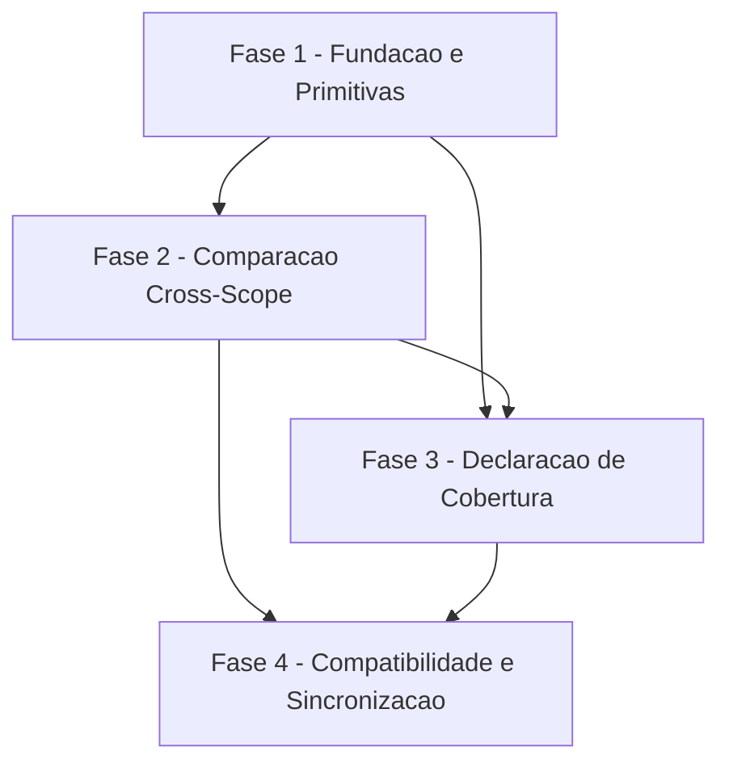

# Tarefas Doctor Shadowed Scope - Secao "Shadowed Scope" do `cstk doctor`

Escopo: adicionar ao `cstk doctor` uma secao que compara o **conteudo** das
copias de escopo de projeto (`./.claude/agents/`, `./.claude/commands/`)
contra o **conteudo** do catalogo global instalado, mais uma declaracao de
cobertura (fontes declaradas/encontradas/lidas com sucesso) medida contra o
que o arquivo contem, nunca contra o que o parser reconhece. Postura:
ligada por padrao, report-only (`section_rc` sempre `0`).

**Legenda de status:**
- `[ ]` Pendente
- `[~]` Em andamento
- `[x]` Concluido
- `[!]` Bloqueado

**Legenda de criticidade:**
- `[C]` Critico - Impacto financeiro direto ou bloqueante
- `[A]` Alto - Funcionalidade essencial
- `[M]` Medio - Necessario mas sem urgencia imediata

---

## FASE 1 - Fundacao e Primitivas de Validacao

Ref: plan.md "Metade 1"/"Metade 2"; data-model.md; contrato §5, §7.
Precede as FASE 2 e 3: a lib `cli/lib/manifest-coverage.sh` fornece os
validadores e formatadores que ambas consomem.

### 1.1 Pendencia de decisao humana: teto de consumo do manifesto (R5) `[A]`

Ref: checklists/security.md CHK034 ({humano}); contrato
`doctor-shadowed-scope-output.md` §7 R5.

Esta tarefa NAO tem subtarefa de implementacao — e um gate de decisao.
`/execute-task` desta tarefa consiste em confirmar a resposta do operador
e registra-la como Decisao auditavel (`state-decisions.sh register`),
nunca em escolher um numero sozinho (Constitution VI). As subtarefas 1.3.2
e 1.3.4 (teto de consumo) e a linha 14/15 do Cenario 19 do quickstart
dependem desta tarefa.

- [x] 1.1.1 Verificar se ha bloqueio humano/resposta do operador para o
  CHK034: "O teto numerico de R5 (10.000 linhas / 4.096 bytes por linha) e
  adequado ao apetite de risco do operador para o pior caso plausivel
  (repo hostil clonado + `cstk doctor` executado sem `--scope`), ou
  deveria ser configuravel/revisitado conforme uso real do toolkit?"
- [x] 1.1.2 Se a resposta AINDA NAO chegou quando `/execute-task`
  alcancar esta tarefa: registrar bloqueio humano citando o CHK034
  literal e PARAR — nao prosseguir para 1.3 com um numero suposto
- [x] 1.1.3 Se a resposta ja existe: registrar Decisao auditavel com o
  valor confirmado (manter 10.000 linhas / 4.096 bytes, outro teto, ou
  torna-lo configuravel) e liberar 1.3

### 1.2 Esqueleto de `cli/lib/manifest-coverage.sh` + guardas de forma (R1/R3) `[C]`

Ref: plan.md §Project Structure; contrato §5; contrato §7 R1/R3.

- [x] 1.2.1 Criar `cli/lib/manifest-coverage.sh` sourceable (sem
  side-effect ao source), seguindo o cabecalho POSIX sh padrao ja usado
  por `cli/lib/hash.sh`/`cli/lib/common.sh`
- [x] 1.2.2 Implementar `manifest_name_is_safe <name>`: casa
  `^[A-Za-z0-9._-]+$`, rejeita `..`, `/`, `\`, `-` inicial, vazio e
  comprimento > 64 — gate obrigatorio antes de qualquer uso do valor
  como componente de path (R1)
- [x] 1.2.3 Implementar `manifest_scrub_text <valor>`: remove bytes de
  controle C0/DEL, trunca a 64 caracteres, emite em stdout (R3)
- [x] 1.2.4 Criar `tests/cstk/test_manifest-coverage.sh` cobrindo
  `manifest_name_is_safe` e `manifest_scrub_text`: casos validos +
  adversariais (traversal `../../../.ssh/known_hosts`, `/`, `\`, `-`
  inicial, vazio, 500 chars, ESC/`\r`/`\b` embutidos — Cenarios 9.a/9.c)

### 1.3 `manifest_record_is_valid` + teto de consumo (R4/R5) `[C]`

Ref: contrato §5, §7 R4/R5. Bloqueada por 1.1 (valor do teto).

- [x] 1.3.1 Implementar `manifest_record_is_valid <line>`: exatamente 4
  campos TAB, campos 1-3 nao vazios, campo 3 casa `^[0-9a-f]{64}$`,
  campo 1 aprovado por `manifest_name_is_safe`, `\r` terminal removido
  antes de validar
- [x] 1.3.2 Impor o teto de linhas/bytes por **leitura limitada** (nunca
  checagem de comprimento a posteriori — nota normativa do contrato §7),
  usando o valor confirmado em 1.1.3; BLOQUEADA ate 1.1 resolver
- [x] 1.3.3 Implementar o laco de iteracao de linhas do manifesto sob
  `set -f` (restaurado ao sair) — precedente literal `cli/lib/recall.sh
  fts_query_escape()` (R4)
- [x] 1.3.4 Estender `tests/cstk/test_manifest-coverage.sh`: linha de
  dados contendo `*` (Cenario 9.d — exatamente 1 iteracao, sem inflar o
  numerador), manifesto com 10.001 linhas e registro unico de 50 MB sem
  `\n` (Cenario 19 linhas 14/15 — teto imposto por leitura limitada, nao
  por checagem a posteriori); executavel so apos 1.1 fixar o numero

### 1.4 `manifest_count_data_lines` (denominador) `[A]`

Ref: contrato §5; research.md D6; quickstart Cenario 9.

- [x] 1.4.1 Implementar `manifest_count_data_lines <path>`: linha nao
  vazia, nao inicia com `#`, robusta a ausencia de newline final no
  ultimo registro; arquivo ausente ⇒ `0`, exit 0
- [x] 1.4.2 Estender `tests/cstk/test_manifest-coverage.sh` com o caso
  medido do Cenario 9 (`printf 'a\tb\tc\td'` sem `\n` final deve contar
  1, nao 0 como `grep -cv -e '^[[:space:]]*$' -e '^#'` daria)
- [x] 1.4.3 Confirmar que comentarios (`#`) e linhas em branco no MEIO do
  arquivo tambem sao excluidos do denominador — nao so o ultimo registro
  sem newline (Cenario 9 cobre a borda; este caso cobre o meio do
  arquivo)

### 1.5 `manifest_coverage_line` (formatador) `[M]`

Ref: contrato §3.4; §5.

- [x] 1.5.1 Implementar `manifest_coverage_line <path> <D> <N> <state>`
  formatando a linha de cobertura por fonte para os 5 `coverage_state`
  (`full`/`partial`/`unreadable`/`inconsistent`/`absent`), incluindo os
  campos `?`/`?` no caso `unreadable`
- [x] 1.5.2 Estender `tests/cstk/test_manifest-coverage.sh` cobrindo os 5
  `coverage_state` do formatador, inclusive a nota "reporte este caso" em
  `inconsistent`
- [x] 1.5.3 Confirmar que a nota "reporte este caso" so aparece em
  `inconsistent` — os demais 4 estados NUNCA a incluem (regressao de
  mensagem cruzada entre estados)

---

## FASE 2 - Comparacao Cross-Scope (US1/US2, FR-001..FR-005, FR-010)

Ref: plan.md "Metade 1"; data-model.md Entity ShadowVerdict.

### 2.1 Leitura do manifesto de projeto por kind `[C]`

Ref: spec.md FR-001; data-model.md ProjectScopeInstallRecord.

- [ ] 2.1.1 Resolver `./.claude/agents/.cstk-manifest` e
  `./.claude/commands/.cstk-manifest` (relativo ao CWD; sem descoberta de
  raiz via git — `.claude/` e gitignored)
- [ ] 2.1.2 Iterar exclusivamente as linhas do manifesto (nunca o
  diretorio de escopo de projeto) — garantia estrutural de FR-004/FR-005
- [ ] 2.1.3 Classificar cada linha via `manifest_record_is_valid` como
  `recognized`/`unrecognized`, incrementando o numerador
  (`records_used`) somente quando `recognized`
- [ ] 2.1.4 Teste (`tests/cstk/test_doctor.sh`): fixture nomeada
  `release-wave` (quickstart Cenario 4) — copia local sem registro
  correspondente NUNCA entra nesta iteracao, em nenhum modo (`cstk
  doctor` puro nem `--scope project`); variante 4.b (colisao de nome com
  o catalogo tambem nao acusa nada)

### 2.2 Arvore de decisao ShadowVerdict `[C]`

Ref: data-model.md Entity ShadowVerdict (arvore literal); contrato §7 R2.

- [ ] 2.2.1 Checar symlink (`[ -h ]`) nas duas pontas ANTES de qualquer
  hash; symlink ⇒ `indeterminate (symlink)` — nunca hashear o alvo
- [ ] 2.2.2 Copia de projeto ausente ⇒ `indeterminate (projeto-ausente)`
- [ ] 2.2.3 Artefato do catalogo ausente ⇒ `unmanaged-upstream` (FR-010)
- [ ] 2.2.4 `hash_file` falhou em qualquer ponta ⇒ `indeterminate
  (hash-indisponivel)`
- [ ] 2.2.5 Comparar `hash_file` das duas pontas — conteudo, nunca o sha
  registrado no manifesto (precedente literal `guard-hooks-status.sh:354`,
  `cmp -s`); igual ⇒ `shadow-current`, diferente ⇒ `shadowed`
- [ ] 2.2.6 Teste (`tests/cstk/test_doctor.sh`): Cenarios 1 (`shadowed`),
  2 (`shadow-current`), 5 (`unmanaged-upstream`), 9.b (symlink para
  segredo — confirmar que NENHUM hash do alvo e calculado nem impresso)

### 2.3 Wiring da secao "Shadowed Scope" em `doctor.sh` `[A]`

Ref: contrato §2, §3.1; §1 (compatibilidade).

- [ ] 2.3.1 Emitir cabecalho `\n==> Shadowed Scope (escopo de projeto vs
  catalogo)` em toda invocacao exceto `--help`/`--deps`, independente de
  `--scope`/`--fix`
- [ ] 2.3.2 Posicionar a secao apos o sumario classico (`  ---` ...
  `orphan: %d`) e antes de `Distribution Paths`
- [ ] 2.3.3 Confirmar que `--fix` nao sobrescreve a copia de projeto nem
  repara achados desta secao (FR-005) — Cenario 12
- [ ] 2.3.4 Confirmar que `--deps` nao emite a secao (Cenario 13) e que
  nenhuma linha/contagem/rotulo classico existente muda
- [ ] 2.3.5 Rodar `LC_ALL=C ./tests/run.sh test_doctor` sem editar os
  cenarios pre-existentes (Cenario 11) — baseline medido `PASS: 22 FAIL:
  0 ERROR: 0 ORPHANS: 0` preservado

### 2.4 Formatacao das linhas de achado + sanitizacao (R3) `[C]`

Ref: contrato §3.2, §3.3, §7 R3/R6.

- [ ] 2.4.1 Formatar `[shadowed]`/`[shadow-current]`/`[unmanaged-upstream]`/
  `[indeterminate]` com hash truncado a 12 chars (`cut -c1-12` + `...`,
  precedente `Distribution Paths`), versao `?` quando ausente no
  manifesto global — nunca inferida
- [ ] 2.4.2 Sanitizar `name`/`toolkit_version` via `manifest_scrub_text` e
  emitir sempre via `printf '%s'` com o valor como argumento (nunca
  interpolado no formato) — mesma regra para o texto de erro de
  `detect_schema_version`
- [ ] 2.4.3 Emitir o bloco de remediacao (§3.3) somente quando
  `count_shadowed >= 1`, com redacao que NAO trata a copia divergente
  como erro (FR-005 — normativo)
- [ ] 2.4.4 Teste (`tests/cstk/test_doctor.sh`): Cenario 9.c (bytes de
  controle ANSI/`\r`/`\b` no `name`) com saida capturada em arquivo E
  observada num terminal real; Cenario 9.a (traversal) confirmando que
  nenhum hash de arquivo fora do catalogo e impresso

---

## FASE 3 - Declaracao de Cobertura (US3, FR-006..FR-009)

Ref: plan.md "Metade 2"; data-model.md CoverageDeclaration/ShadowedScopeReport.
Depende de FASE 2: o numerador e incrementado por uso dentro do mesmo laco
de classificacao que produz o `ShadowVerdict`.

### 3.1 Calculo de `coverage_state` por fonte `[A]`

Ref: data-model.md Entity CoverageDeclaration; spec.md FR-007/FR-008/FR-009.

- [ ] 3.1.1 Implementar `absent` (`found=false`), `unreadable`
  (`detect_schema_version` retorna 1), `full`
  (`data_lines==records_used`, inclui `0==0`), `partial`
  (`data_lines>records_used`), `inconsistent`
  (`records_used>data_lines`, NUNCA normalizado/arredondado/silenciado)
- [ ] 3.1.2 Teste (`tests/cstk/test_doctor.sh`): Cenario 6 (linha sem TAB)
  e Cenario 7 (coluna extra desconhecida) ⇒ `partial`; Cenario 8 (header
  `# cstk manifest v2`) ⇒ `unreadable` citando o motivo de
  `detect_schema_version`; Cenario 10 (numerador forcado via stub) ⇒
  `inconsistent` com os numeros brutos exibidos
- [ ] 3.1.3 Teste de borda: fonte encontrada porem com ZERO linhas de
  dados (`data_lines==records_used==0`) tambem classifica como `full` —
  caso explicito "inclui `0==0`" da entidade CoverageDeclaration

### 3.2 Bloco "--- cobertura" sempre emitido `[A]`

Ref: contrato §3.4; spec.md FR-006/SC-003.

- [ ] 3.2.1 Emitir `fontes declaradas: ...`, `fontes encontradas: <F> de
  2`, `fontes lidas com sucesso: <R> de 2` (`R` conta so fontes com
  `coverage_state = full`) — as tres contagens nunca dependem do texto
  da linha de veredito para serem legiveis
- [ ] 3.2.2 Emitir uma linha por fonte com `registros no arquivo`/
  `interpretados`/`nao interpretados` (ou `?`/`?` + `motivo` em
  `unreadable`; numeros brutos + nota em `inconsistent`)
- [ ] 3.2.3 Teste (`tests/cstk/test_doctor.sh`): Cenario 3 (nenhum
  manifesto de projeto, `F=0`) — a declaracao de cobertura ainda sai,
  ambas as fontes `[absent]` com `0/0/0`

### 3.3 Rotulo de veredito com gating triplo `[A]`

Ref: contrato §3.5; data-model.md ShadowedScopeReport.

- [ ] 3.3.1 Implementar `[OK]` somente quando as TRES condicoes valem:
  `F=R=2` E `count_shadowed=0` E `count_nao_comparado=0` (derivado de
  `count_indeterminate + count_unmanaged_upstream`)
- [ ] 3.3.2 Implementar `[ACHADOS]` (`F=R=2` com `count_shadowed>=1` ou
  `count_nao_comparado>=1`, declarando na propria linha que nao altera o
  exit code), `[PARCIAL]` (qualquer fonte `partial`/`unreadable`/
  `inconsistent`), `[SEM-FONTE]` (`F=0`)
- [ ] 3.3.3 Teste (`tests/cstk/test_doctor.sh`): Cenario 20 completo (as
  7 linhas da tabela: identico, divergencia, symlink, unmanaged-upstream,
  malformada, header desconhecido, sem manifesto) — confirmar que `[OK]`
  so aparece na primeira linha

### 3.4 `INV-RC`: `section_rc` constante `0` (postura report-only) `[C]`

Ref: data-model.md INV-RC; contrato §4 (tabela exaustiva §4.1); Decisao
dec-020 / bloqueio block-001 (resposta do operador ja registrada:
"input controlado por terceiro pode produzir diagnostico, nunca
veredito").

- [ ] 3.4.1 Implementar a funcao da secao terminando sempre em
  `return 0` — nunca acumular um rc a partir de `count_shadowed`/
  `coverage_state`, mesmo que o acumulo "sempre de zero" na pratica
- [ ] 3.4.2 Confirmar o wiring em `doctor_main` via `$?` (mesma forma de
  `_doctor_distribution_paths`, por consistencia) sem alterar o OU
  logico existente com `_doctor_count_drift`/`_doctor_dp_rc`
- [ ] 3.4.3 Teste (`tests/cstk/test_doctor.sh`): Cenario 19 completo — as
  15 fixtures da matriz (shadowed, shadow-current, unmanaged-upstream,
  symlink, projeto-ausente, malformada, traversal, header futuro,
  inconsistent forcado, manifesto ausente, `*`, bytes de controle,
  mistura de estados, 10.001 linhas, registro de 50 MB sem `\n`) — `$? ==
  0` em TODAS, com a linha de achado correspondente presente na mesma
  execucao
- [ ] 3.4.4 Teste de mutacao obrigatorio (Cenario 19 §Teste de mutacao —
  "o cenario nao vale sem ele"): alterar temporariamente a implementacao
  para `return 1` quando `count_shadowed >= 1`; confirmar que a linha 1
  da matriz do Cenario 19 FALHA; reverter a alteracao

---

## FASE 4 - Compatibilidade, Cobertura de Testes e Sincronizacao

Ref: quickstart Cenarios 11-14; CLAUDE.md "Como testar scripts shell" +
"GOTCHA de sincronizacao — self-update, nunca install".

### 4.1 Cenarios de superficie (`--fix`, `--deps`, `--check-coverage`) `[A]`

Ref: quickstart Cenarios 12, 13, 14.

- [ ] 4.1.1 Cenario 12: `--fix` nao repara nem suprime a secao (copia de
  projeto preservada byte-a-byte)
- [ ] 4.1.2 Cenario 13: `--deps` nao emite a secao (saida stdout
  `==> cstk doctor --deps` inalterada)
- [ ] 4.1.3 Cenario 14: `./tests/run.sh --check-coverage` sai `0` — exige
  `tests/cstk/test_manifest-coverage.sh` presente e nao-orfao

### 4.2 Suite completa e baseline de regressao `[A]`

Ref: quickstart Cenario 11; CLAUDE.md "Como testar scripts shell".

- [ ] 4.2.1 Rodar `LC_ALL=C ./tests/run.sh` (suite completa, sem `tail`
  no output) e confirmar zero regressao nos cenarios pre-existentes de
  `test_doctor.sh` e no restante da suite
- [ ] 4.2.2 Confirmar o baseline medido `LC_ALL=C ./tests/run.sh
  test_doctor` ⇒ `PASS: 22 FAIL: 0 ERROR: 0 ORPHANS: 0` ANTES de
  comparar com o resultado pos-implementacao (qualquer FAIL novo e
  regressao, nunca "teste desatualizado")
- [ ] 4.2.3 Registrar o resultado literal (PASS/FAIL/ERROR/ORPHANS/TIME)
  da execucao pos-implementacao como evidencia citavel na Decisao de
  conclusao da FASE (nunca afirmar "suite verde" sem o output medido —
  Constitution VI)

### 4.3 Verificar aplicabilidade de bump de contadores `[M]`

Ref: CLAUDE.md "Adicionar skill bumpa count" (mesma classe de risco para
`cli/lib/` novo).

- [ ] 4.3.1 Checar se `tests/test_doc-counts.sh` e/ou
  `tests/cstk/test_build-release.sh` contam arquivos de `cli/lib/` ou
  `tests/cstk/` — se sim, atualizar o contador esperado para incluir
  `manifest-coverage.sh`/`test_manifest-coverage.sh`; se nao, nao alterar
  nada (registrar o resultado da checagem, nunca supor)
- [ ] 4.3.2 Rodar os dois testes apos a checagem para confirmar que
  passam com a contagem correta
- [ ] 4.3.3 Se a checagem 4.3.1 concluir que os contadores NAO se
  aplicam a `cli/lib/`/`tests/cstk/`, registrar essa conclusao como
  Decisao informativa citando a evidencia (grep/leitura) que a
  sustenta — nao deixar a negativa implicita

### 4.4 Sincronizacao do runtime instalado `[A]`

Ref: CLAUDE.md "GOTCHA de sincronizacao — self-update, nunca install";
plan.md mesmo titulo.

- [ ] 4.4.1 Buildar tarball local: `./scripts/build-release.sh X.Y.Z-dev`
- [ ] 4.4.2 Sincronizar o runtime instalado via `cstk self-update --from
  "file://$PWD/dist/cstk-X.Y.Z-dev.tar.gz"` — NUNCA `cstk install`/
  `cstk update` (que so tocam catalogo `~/.claude`, nao `cli/lib/`)
- [ ] 4.4.3 Confirmar via `cstk doctor` (na maquina de desenvolvimento)
  que a copia instalada reflete a mudanca sem drift, e que a secao
  "Shadowed Scope" aparece na saida real

---

## Matriz de Dependencias

## Resumo Quantitativo

| Fase | Tarefas | Subtarefas | Criticidade |
|------|---------|------------|-------------|
| 1 - Fundacao e Primitivas | 5 | 17 | A/C/C/A/M |
| 2 - Comparacao Cross-Scope | 4 | 19 | C/C/A/C |
| 3 - Declaracao de Cobertura | 4 | 13 | A/A/A/C |
| 4 - Compatibilidade e Sincronizacao | 4 | 12 | A/A/M/A |
| **Total** | **17** | **61** | - |

## Escopo Coberto

| Item | Descricao | Fase |
|------|-----------|------|
| FR-001/FR-002 | Comparacao cross-scope de conteudo (agents/commands) entre projeto e catalogo instalado | 2 |
| FR-003/FR-010 | Estados novos `shadowed`/`unmanaged-upstream` distinguindo divergencia de ausencia-de-comparacao | 2 |
| FR-004/FR-005 | Preservacao estrutural do fluxo de copia local nao-gerenciada (caso nomeado `release-wave`) | 2 |
| FR-006/FR-007 | Declaracao de cobertura com denominador de granularidade de LINHA e numerador por uso | 1, 3 |
| FR-008/FR-009 | Estados `partial`/`unreadable` nunca reportados como sucesso; fonte ininterpretavel nunca omitida | 3 |
| Contrato §7 R1-R6 | Fronteira de confianca do manifesto de projeto: traversal, symlink, forja visual, glob injection, DoS/teto de consumo | 1, 2 |
| `INV-RC` (contrato §4) | Postura report-only: `section_rc` constante `0` por construcao | 3 |
| CHK034 | Decisao pendente do operador sobre o teto de R5, sem invencao de valor | 1 |

## Escopo Excluido

| Item | Descricao | Motivo |
|------|-----------|--------|
| `--json` | Flag nova de saida estruturada para o `cstk doctor` | Nao existe hoje; fora dos FRs desta feature (contrato §6) |
| Retrofit de outros mecanismos de saude | Aplicar a declaracao de cobertura a outras secoes do `doctor` ou a `guard-hooks-status.sh` | Clarification 2026-08-27 da spec: fica como padrao de referencia documentado, sem retrofit imediato |
| `kind = skills` | Cobertura de escopo de projeto para skills (alem de agents/commands) | FR-001 cita explicitamente so `agents` e `commands` (contrato §6) |
| `cli/lib/manifest.sh` | Endurecimento do leitor `read_manifest` existente | Mudaria o comportamento de `install`/`update`/`plugin-detect`, fora de escopo (plan.md) |
| `--fix` para os estados novos | Reparo automatico de divergencias `shadowed` | Sobrescrever a copia de projeto destruiria trabalho local que FR-005 manda preservar (contrato §6) |
| `sug-001` (backup por onda dentro do `end`) | Sugestao de outra feature, nao relacionada a esta | Fila separada, fora de escopo por instrucao explicita do operador desta execucao |
