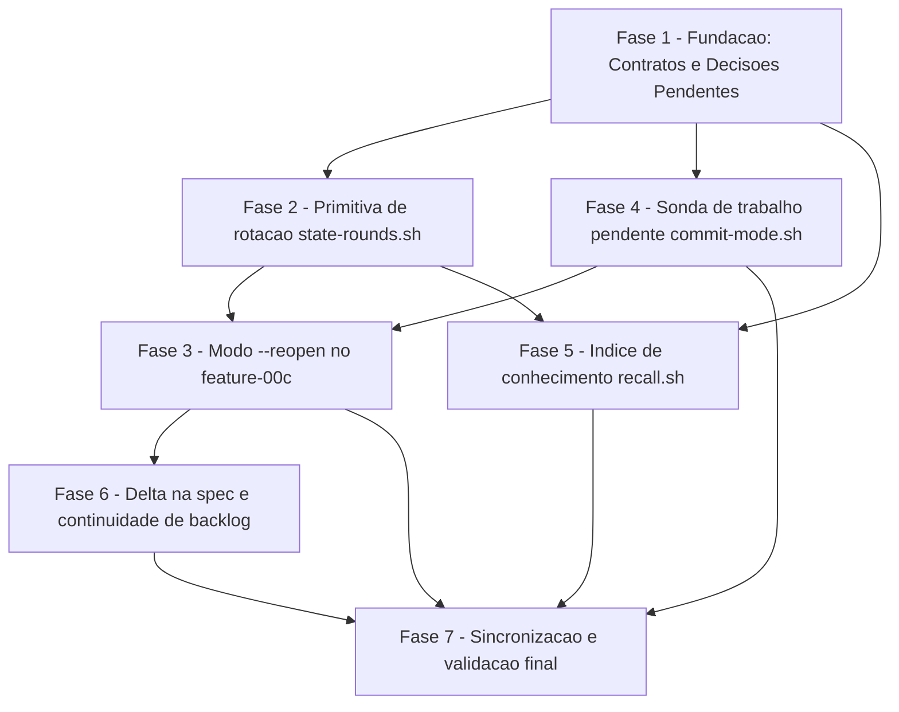

# Tarefas feature-reopen - Reabertura incremental de feature concluida

Escopo: implementar o modo `--reopen` do `/feature-00c` (rotacao de estado
terminal em `rounds/`, parecer + bloqueio humano, sonda de trabalho
pendente, restauracao de spec arquivada, paridade no `knowledge.db`),
conforme `spec.md` (22 FRs, 7 SCs), `plan.md`, `research.md` (14
Decisions), `data-model.md` (6 entidades), `quickstart.md` (19 cenarios) e
os 3 contratos em `contracts/`. Origem: `docs/specs/feature-reopen/spec.md`.

**Legenda de status:**
- `[ ]` Pendente
- `[~]` Em andamento
- `[x]` Concluido
- `[!]` Bloqueado

**Legenda de criticidade:**
- `[C]` Critico - Impacto financeiro direto ou bloqueante (aqui: integridade/perda de dados do estado terminal)
- `[A]` Alto - Funcionalidade essencial
- `[M]` Medio - Necessario mas sem urgencia imediata

---

## FASE 1 - Fundacao: Contratos e Decisoes Pendentes do Checklist

### 1.1 Contrato de CLI da sonda de trabalho pendente `[A]`

Ref: checklists/requirements.md CHK002 (`[Gap]`); checklists/security.md
CHK009; research.md Decision 9; plan.md item 4 (Escopo do trabalho);
contracts/state-rounds.md (espelhar formato)

- [x] 1.1.1 Criar `docs/specs/feature-reopen/contracts/pending-work-probe.md`
      espelhando a estrutura de `contracts/state-rounds.md` (secoes de exit
      codes, request/response, errors). **Concluido**: arquivo criado com as
      mesmas secoes (Conformidade, Exit codes, Sequencia, Response, Errors,
      Invariantes de teste), marcado `[PROPOSTA — a validar na
      implementacao]`.
- [x] 1.1.2 Definir nome exato do subcomando novo de `commit-mode.sh` e suas
      flags (`--state-dir`, forma de passar a branch — posicional ou
      `--branch` — e `--` como separador). **Decidido**: subcomando
      `probe-pending-work`; flags `--state-dir DIR --projeto-alvo-path PATH
      -- BRANCH` (posicional apos `--`, nao `--branch`) — ver
      `contracts/pending-work-probe.md` §Nome do subcomando e decisao de
      flags.
- [x] 1.1.3 Definir exit codes uniformes (alinhados a `state-rounds.sh`: `0`
      sucesso, `1` erro generico, `2` uso incorreto) e o exit especifico
      para skip nao-fatal. **Decidido**: `0` checked (merge determinado,
      `gh` pode ou nao ter rodado), `3` skip total nao-fatal
      (`skipped-no-git`), `1` erro generico, `2` uso incorreto — ver
      contrato §Exit codes.
- [x] 1.1.4 Definir formato de stdout parseavel (linha pipe-delimitada),
      mapeando 1:1 para os campos de `data-model.md::PendingWorkProbe`
      (`branch`, `default_branch`, `merged`, `pr_state`, `pr_url`,
      `source`, `probe_status`). **Concluido**: `PROBE|branch|default_branch|
      merged|pr_state|pr_url|source|probe_status` — ver contrato §Response.
- [x] 1.1.5 Documentar explicitamente que I-P1 (Principio VI) e satisfeito:
      nenhum caminho de erro (timeout de `gh`, git corrompido, ausencia de
      rede) pode emitir `merged=no`/`pr_state=closed` sem checagem real —
      apenas `unknown` + `probe_status=skipped-*`. **Concluido**: secao
      dedicada "I-P1 (Principio VI, FR-021) — nota explicita" no contrato,
      incluindo achado de precedente real (`finalize` em `commit-mode.sh`
      trata `gh pr view` vazio como "sem PR" — anti-padrao que este
      contrato explicitamente NAO herda).
- [x] 1.1.6 Atualizar `plan.md` §Project Structure (lista de `contracts/`)
      referenciando o novo contrato. **Concluido**: entrada
      `pending-work-probe.md` adicionada a lista de `contracts/` em
      `plan.md`.

### 1.2 Decisao humana: profundidade do contrato da sonda `[A]` `{humano}`

Ref: checklists/security.md CHK009 (ligado ao `[Gap]` CHK002 de
requirements.md)

- [x] 1.2.1 Apresentar ao operador, via bloqueio humano, a pergunta de
      CHK009: o contrato de 1.1 e suficiente para um revisor confirmar por
      leitura de codigo, apos implementado, que a sonda nunca infere
      `merged=no` por timeout silencioso tratado como "no"? **Apresentado**
      (`block-002`, `dec-036`, onda-005), anexando o trecho literal da
      secao "Aberto para 1.2" de `contracts/pending-work-probe.md`
      (ja escrita nesta mesma onda) + o precedente empirico do anti-padrao
      em `finalize` (`commit-mode.sh:726`).
- [ ] 1.2.2 Registrar a resposta como Decisao auditavel ANTES de iniciar
      4.1 (implementacao da sonda) — este item bloqueia 4.1. Aguardando
      resposta humana a `block-002`.
- [ ] 1.2.3 Se a resposta exigir profundidade adicional (ex.: matriz de
      timeout por comando invocado), atualizar o contrato de 1.1 antes de
      prosseguir. Condicional a resposta de `block-002`.

### 1.3 Decisao humana: inventario de leitores externos ao runtime `[M]` `{humano}`

Ref: checklists/requirements.md CHK014

- [x] 1.3.1 Apresentar ao operador, via bloqueio humano, a pergunta de
      CHK014: existe leitor de estado fora de `agente-00c-runtime` (script
      de terceiros, integracao futura do painel) que varre
      `.claude/feature-00c-state/**/state.json` de forma recursiva e
      poderia colidir com `rounds/`? **Respondido (dec-032, onda-004)**:
      somente os leitores do repositorio. Inventario FECHADO:
      `cli/lib/recall.sh:3191` (`-path '*/.claude/feature-00c-state/*/state.json'`
      — em `find`, `*` atravessa `/`, COLIDE, ja no escopo da FASE 5) e
      `cli/lib/mcp.sh:280` (glob de shell `for _mda_d in
      "$_mda_feat_root"/*/` — para em 1 nivel, SEGURO, nao enxerga
      `rounds/`); `docs/cstk-panel/frontend-brief.md:39` confirma que o
      painel le o indice `~/.claude/cstk/knowledge.db`, nao os state-dirs.
- [x] 1.3.2 Registrar a resposta como Decisao auditavel ANTES de iniciar
      5.1/5.2 (mudancas em `cli/lib/recall.sh`) — este item bloqueia 5.1 e
      5.2. **Concluido**: `dec-032` (onda-004, score 3, evidencia empirica
      anexada) registrada antes de qualquer mudanca em 5.1/5.2 — ver
      `state.json`/`state.db` `.decisions[]`.
- [x] 1.3.3 Se a resposta identificar leitor adicional, abrir Ref cruzada
      em `research.md` Decision 5 documentando o leitor e seu tratamento.
      **Nao se aplica**: dec-032 fechou o inventario sem identificar
      nenhum leitor ADICIONAL alem dos dois ja mapeados em `research.md`
      Decision 5 (`recall.sh` colide, `mcp.sh` seguro) — nenhuma Ref
      cruzada nova e necessaria; registrado aqui explicitamente para nao
      deixar o item ambiguo.

---

## FASE 2 - Primitiva de rotacao (`state-rounds.sh`)

### 2.1 Implementar subcomando `next-label` `[C]`

Ref: contracts/state-rounds.md; FR-009; plan.md item 1

- [ ] 2.1.1 Criar `plugins/cstk/skills/agente-00c-runtime/scripts/state-rounds.sh`
      com shebang `#!/bin/sh` + `set -eu`, dispatcher de subcomandos e
      exit codes uniformes (`0`/`1`/`2`/`3`)
- [ ] 2.1.2 Implementar `next-label --state-dir DIR`: varredura de
      `rounds/r??`, escolha do maior sucessor, zero-padding 2 digitos,
      `r01` se `rounds/` ausente/vazio
- [ ] 2.1.3 Tratar `rounds/` ilegivel como exit `1`; `--state-dir`
      ausente/flag desconhecida como exit `2`

### 2.2 Implementar subcomando `rotate` com guardas G1..G7 `[C]`

Ref: contracts/state-rounds.md; research.md Decision 1, Decision 2,
Decision 3; FR-007..FR-011

- [ ] 2.2.1 Pre-condicoes (passos a-b do contrato): estado presente na
      raiz, ausencia de journal pendente, status terminal delegado a
      `state-lock.sh check-execution-busy`, `PRAGMA integrity_check;` sob
      backend sqlite
- [ ] 2.2.2 G6: assere lock detido (`.lock/` presente + owner compativel)
      antes de qualquer escrita — `rotate` e primitiva standalone,
      invocavel diretamente
- [ ] 2.2.3 G4: recusar se state-dir/`rounds/`/staging/alvo forem
      symlink (`[ -L ]`), com re-checagem imediatamente antes do commit
      (passo h)
- [ ] 2.2.4 G1+G2: checkpoint `PRAGMA wal_checkpoint(TRUNCATE);` validado
      pela **coluna 1 (`busy`) == 0** — nunca pelo exit code, que sai `0`
      mesmo sem checkpointar; `state.db-wal` ausente ou 0 bytes antes de
      apagar sidecars (barreira independente do PRAGMA)
- [ ] 2.2.5 Escrever `rounds/.rotate-journal` (`phase=staged`) e
      `mkdir rounds/.<label>.staging` (`chmod 700` best-effort) ANTES de
      mover qualquer arquivo
- [ ] 2.2.6 Mover arquivos transacionais para staging com `--` em todo
      `mv`/`rm`/`mkdir` (G5 — nomes iniciados por `-` nao viram flag);
      atualizar journal para `phase=moving`
- [ ] 2.2.7 Commit: `mv -- rounds/.<label>.staging rounds/<label>`
      (rename atomico de diretorio, passo h1)
- [ ] 2.2.8 G3: `PRAGMA integrity_check;` na copia dentro do round, apos o
      commit; remover `rounds/.rotate-journal` so depois
- [ ] 2.2.9 Implementar `--dry-run`: roda todas as verificacoes e imprime
      a linha `ROUND|...` que seria produzida, sem criar journal/staging
      nem mover arquivo
- [ ] 2.2.10 Response `ROUND|<label>|<backend>|<state_file>|<execution_id>|<status>`
      (pipe-delimitado, mesmo padrao de `delta-gate.sh`)

### 2.3 Implementar subcomando `recover` `[C]`

Ref: contracts/state-rounds.md; data-model.md::RotationJournal; FR-011,
SC-006

- [ ] 2.3.1 Parser linha-a-linha proprio do journal — NUNCA `.`, `source`
      ou `eval` (regra J1, mesmo padrao de `state-backend.sh`)
- [ ] 2.3.2 Allowlist de chaves (J2: `label`, `backend`, `files`,
      `staging`, `phase`, `started_at`) e validacao de formato (J3
      `label`, J4 `files` fechado a `{state.json, state.json.sha256,
      state.db}` sem `/`/`..`/`-` inicial, J6 nao-symlink, J7 enums)
- [ ] 2.3.3 `staging` sempre DERIVADO de `label`
      (`rounds/.<label>.staging`) — o valor lido do journal serve so
      para conferencia, nunca e confiado (regra J5)
- [ ] 2.3.4 Matriz de decisao: sem journal (no-op exit `0`); journal +
      round ja existe (roll-forward remove journal); staging completo
      (roll-forward `mv` staging → `<label>`); staging incompleto
      (roll-back devolve arquivos a raiz)
- [ ] 2.3.5 Response `RECOVER|<none|forward|rollback>|<label>`; journal
      ilegivel/malformado ou `mv` de recuperacao falho ⇒ exit `1`

### 2.4 Implementar subcomando `list` `[M]`

Ref: contracts/state-rounds.md

- [ ] 2.4.1 Listar rounds em ordem lexicografica crescente:
      `<label>|<backend>|<state_file>|<execution_id>|<status>|<finished_at>`
- [ ] 2.4.2 Round com estado ilegivel ⇒ linha reportada com
      `status=unknown`, sem abortar a listagem inteira
- [ ] 2.4.3 Sem rounds no state-dir: stdout vazio, exit `0`

### 2.5 `tests/test_state-rounds.sh` (T-01..T-16) `[C]`

Ref: contracts/state-rounds.md §Invariantes de teste; regra de cobertura
do repo (CLAUDE.md — todo `.sh` novo em `plugins/cstk/skills/*/scripts/`
exige teste correspondente)

- [ ] 2.5.1 T-01..T-03: recusas de pre-condicao (sem estado ⇒ exit `3`;
      `em_andamento` ⇒ exit `3` com estado vivo intocado; `abortada` ⇒
      exit `0`, terminal legitimo)
- [ ] 2.5.2 T-04/T-05: round preservado byte a byte identico ao estado
      pre-rotacao (`cmp`), nos dois backends (`json` e `sqlite` apos
      checkpoint)
- [ ] 2.5.3 T-06: apos `rotate` sob sqlite, `rounds/<l>/` contem SO
      `state.db` — nenhum `-wal`/`-shm` (regressao v6.4.0)
- [ ] 2.5.4 T-07: `rotate` 2x ⇒ `r01` e `r02` coexistem, `r01` inalterado
- [ ] 2.5.5 T-08..T-11: interrupcao apos staging (`recover` roll-forward,
      1 tentativa); interrupcao no meio dos `mv` (`recover` roll-back);
      `recover` sem journal (no-op idempotente); `rotate` com journal
      pendente (exit `3`, nao inicia segunda rotacao)
- [ ] 2.5.6 T-12/T-13: `--dry-run` nao cria journal/staging nem move
      arquivo; `integrity_check != ok` ⇒ exit `1` sem mover nada
- [ ] 2.5.7 T-14/T-15: `next-label` com `r01`..`r09` ⇒ `r10` (ordenacao
      lexicografica preservada); artefatos nao-transacionais permanecem
      na raiz apos `rotate`
- [ ] 2.5.8 T-16: `shellcheck -s sh` sem erro; ausencia de bashismo
- [ ] 2.5.9 Rodar `./tests/run.sh --check-coverage` e confirmar que
      `tests/test_state-rounds.sh` fecha a exigencia de cobertura para o
      script novo

---

## FASE 3 - Modo `--reopen` no `/feature-00c`

### 3.1 Invocacao e pre-condicoes de recusa (passo 6.a) `[A]`

Ref: contracts/reopen-flow.md §Invocacao, §6.a; FR-001, FR-002, FR-003;
research.md Decision 7, Decision 13

- [ ] 3.1.1 Adicionar a sintaxe `/feature-00c --reopen <short-name>
      "<descricao do incremento>"` ao command, reaproveitando
      integralmente o pre-flight existente (itens 1..5: path-guard,
      sanitize, briefing, constitution, coexistencia agente-00c)
- [ ] 3.1.2 Verificacao 1: `<state-dir>` existe **e** contem
      `state.json`/`state.db` na raiz — senao exit `4`, mensagem aponta a
      abertura normal (`/feature-00c <short-name> "<descricao>"`)
- [ ] 3.1.3 Verificacao 1b: raiz vazia mas `rounds/<label>/` presente com
      estado ⇒ NAO e recusa — ver conciliacao em 3.3.6
- [ ] 3.1.4 Verificacao 2: `state-lock.sh check-execution-busy` — exit `3`
      (`em_andamento`/`aguardando_humano`) ⇒ exit `5`, mensagem aponta
      `/feature-00c-resume` e `/feature-00c-abort`
- [ ] 3.1.5 Garantir que nenhuma das duas verificacoes cria arquivo ou
      diretorio (T-20: zero inode novo)

### 3.2 Sonda de trabalho pendente + parecer + bloqueio humano (6.b/6.c) `[A]`

Ref: contracts/reopen-flow.md §6.b/6.c; FR-004, FR-005, FR-006, FR-020,
FR-021; research.md Decision 10; depende de FASE 4 (subcomando da sonda)

- [ ] 3.2.1 Invocar o subcomando novo de `commit-mode.sh` (FASE 4.1) e
      capturar o `PendingWorkProbe` resultante
- [ ] 3.2.2 Montar o parecer em memoria (`recommendation`, `rationale`,
      `previous_status`, `pending_work`) ANTES de qualquer escrita em
      disco (FR-004, literal)
- [ ] 3.2.3 Se `previous_status == abortada`, declarar explicitamente no
      parecer que o round anterior nao chegou ao fim (FR-020)
- [ ] 3.2.4 Apresentar como `bloqueios.sh register` com as duas opcoes
      (`reabrir`, `abortar-invocacao`); o aviso de trabalho pendente
      NUNCA bloqueia — e informativo
- [ ] 3.2.5 Operador contraria a recomendacao ⇒ o fluxo prossegue
      normalmente; `diverged=true` fica marcado para a Decisao (gravada
      so apos o `init`, tarefa 3.5)
- [ ] 3.2.6 Recomendacao `abrir-feature-nova` NAO cria feature nova por
      conta propria — apenas instrui o operador de como faze-lo

### 3.3 Wiring de lock + `recover` + `rotate` (passos 7, 7.a, 7.b, 7.c) `[C]`

Ref: contracts/reopen-flow.md §Ordem de execucao; FR-012; depende de
FASE 2

- [ ] 3.3.1 Passo 7: `state-lock.sh acquire` — primeira escrita possivel
      do fluxo de reabertura
- [ ] 3.3.2 Passo 7.a: re-verificacao pos-lock das pre-condicoes de 3.1
      (fecha a janela TOCTOU residual)
- [ ] 3.3.3 Passo 7.b: `state-rounds.sh recover` — journal invalido pelas
      regras J1..J7 ou `mv` de recuperacao falho ⇒ exit `6` sem
      rotacionar (T-36)
- [ ] 3.3.4 Passo 7.c: `state-rounds.sh rotate --state-dir <SD>` — ponto
      de commit da rotacao
- [ ] 3.3.5 Lock permanece detido continuamente do passo 7 ate o Cleanup,
      cobrindo `recover`/`rotate`/restauracao de spec/`init`/gravacao do
      `.previous_round` (T-31)
- [ ] 3.3.6 Conciliacao raiz-vazia × `rounds/` presente: pular o passo
      7.c quando nao ha estado na raiz mas ha round consumado sem `init`
      ter rodado — nunca exit `4` nesse caso, a feature TEM execucao
      anterior, so esta preservada (T-37)

### 3.4 Restauracao de spec arquivada (passo 7.d) `[A]`

Ref: contracts/reopen-flow.md §7.d; research.md Decision 8; FR-013;
plan.md item 5

- [ ] 3.4.1 Disparar apenas quando `docs/specs/<short>/spec.md` nao
      existe
- [ ] 3.4.2 Resolver origem nesta ordem: 1) `docs/specs/_archived/<short>/`
      (sem data); 2) `docs/specs/_archived/<YYYY-MM-DD>-<short>/` — maior
      prefixo de data vence; 3) nenhuma das duas ⇒ segue sem restauracao
- [ ] 3.4.3 Copiar (nunca mover) a arvore inteira para
      `docs/specs/<short>/`; a origem sob `_archived/` permanece intacta
- [ ] 3.4.4 `docs/specs/<short>/` ja existente e nao-vazio ⇒ NAO
      sobrescreve — o disco vence (Edge Case "spec editada a mao")
- [ ] 3.4.5 Informar o operador do que foi restaurado e de onde (origem
      exata resolvida em 3.4.2)
- [ ] 3.4.6 Considerar somente diretorios (`-type d`) na resolucao — a
      41a entrada de `_archived/` e um arquivo solto
      (`review-features-report.md`), nao uma spec

### 3.5 Init da execucao nova + `.previous_round` + Decisao (passos 3', 3'') `[A]`

Ref: contracts/reopen-flow.md §3'/3''; research.md Decision 4, Decision
12; FR-008, FR-022; depende de FASE 3.3 (rotacao consumada)

- [ ] 3.5.1 Ler `.atomic_commit_enabled` do estado terminal ANTES da
      rotacao; ausencia, leitura falha ou valor nao reconhecido ⇒ `false`
- [ ] 3.5.2 `state-rw.sh init` identico ao fluxo de abertura atual, com
      `--atomic-commit "$_atomic_herdado"` (literal `true`/`false`) — sem
      re-perguntar ao operador (FR-022)
- [ ] 3.5.3 Gravar `.previous_round` como objeto INTEIRO (`round`, `path`,
      `execution_id`, `status`, `rotated_at`) via `state-rw.sh set` —
      nunca via path aninhado, rejeitado sob backend SQLite
- [ ] 3.5.4 Gravar a Decisao do parecer (FR-006) via
      `state-decisions.sh register`, com `escolha` = decisao do operador
      e `diverged` explicito quando houver
- [ ] 3.5.5 Confirmar que nenhum `--force` e necessario nem existe — a
      raiz do state-dir fica sem `state.json`/`state.db` apos a rotacao,
      logo as guardas L411-418 de `init` nao disparam

### 3.6 Correcao do item 6 do pre-flight `[A]`

Ref: contracts/reopen-flow.md §Correcao do item 6; FR-016, FR-017; SC-007

- [ ] 3.6.1 FR-016: a opcao (a) do bloqueio existente ("retomar a partir
      da spec existente") passa a acionar o fluxo de reabertura de fato
      — nunca mais inalcancavel
- [ ] 3.6.2 FR-017: o item 6 passa a detectar tambem state-dir com estado
      terminal (nao so `spec.md`) — caso mais comum no repo hoje (spec
      arquivada + estado no lugar, sem aviso nenhum)
- [ ] 3.6.3 Mensagem corrigida cita `/feature-00c --reopen`,
      `/feature-00c-resume` e `/feature-00c-abort` — nunca
      `/agente-00c-*`
- [ ] 3.6.4 SC-007: nenhuma opcao oferecida pelo item 6 termina em aborto
      do proprio fluxo que a ofereceu

### 3.7 `tests/test_feature-00c-preflight.sh` (T-20..T-37) `[A]`

Ref: contracts/reopen-flow.md §Invariantes de teste; regra de cobertura
do repo

- [ ] 3.7.1 T-20..T-22: short-name inexistente ⇒ exit `4` e zero arquivos
      criados; execucao `em_andamento` ⇒ exit `5` com estado vivo
      byte-identico; execucao `aguardando_humano` ⇒ exit `5`
- [ ] 3.7.2 T-23..T-26: parecer emitido antes de qualquer escrita (nenhum
      inode novo ate a confirmacao); operador contraria a recomendacao ⇒
      `diverged=true` na Decisao; recomendacao `abrir-feature-nova` NAO
      cria feature nova; round anterior `abortada` ⇒ parecer declara que
      nao chegou ao fim
- [ ] 3.7.3 T-27/T-28: `.previous_round` legivel via `get` nos dois
      backends; `atomic_commit_enabled` herdado sem prompt, ausencia ⇒
      `false`
- [ ] 3.7.4 T-29/T-30: spec arquivada restaurada com `_archived/` intacto
      (verificado via `cmp -r`); spec ativa pre-existente nao e
      sobrescrita pela restauracao
- [ ] 3.7.5 T-31/T-32: lock detido continuamente do passo 7 ate o
      Cleanup; segunda sessao concorrente ⇒ exit `3`, sem tocar a
      rotacao em curso
- [ ] 3.7.6 T-33/T-34: item 6 detecta state-dir terminal com spec
      arquivada e cita comandos de feature; nenhuma opcao oferecida
      termina em aborto do proprio fluxo
- [ ] 3.7.7 T-35: backend da execucao nova segue a config global corrente
      (mecanismo ja existente de `init`), independente do backend do
      round anterior — sem heranca, sem flag `--backend` (Decision 14,
      dec-022)
- [ ] 3.7.8 T-36/T-37: `recover` exit `1` (journal invalido) ⇒ fluxo sai
      `6` sem rotacionar; raiz sem estado mas com `rounds/<label>/`
      presente ⇒ conciliado, nao recusado com exit `4`

---

## FASE 4 - Sonda de trabalho pendente em `commit-mode.sh`

### 4.1 Implementar subcomando novo conforme contrato `[A]`

Ref: research.md Decision 9; data-model.md::PendingWorkProbe; FR-021;
contrato criado em 1.1; depende de FASE 1.1 e FASE 1.2 (decisao humana)

- [ ] 4.1.1 Implementar o subcomando novo em `commit-mode.sh` seguindo
      EXATAMENTE nome/flags/exit codes/stdout definidos em 1.1
- [ ] 4.1.2 Resolucao de branch default: `git -C "$PAP" symbolic-ref
      refs/remotes/origin/HEAD` filtrado por
      `sed 's@^refs/remotes/origin/@@'`; sem remote, `main` **e**
      `master` tratados como default
- [ ] 4.1.3 Consulta de PR: `command -v gh` + `gh auth status` antes de
      `gh pr view "$branch" --json url,state`
- [ ] 4.1.4 `--` como separador em toda invocacao que recebe nome de
      branch — nome iniciado por `-` nao pode ser consumido como flag
      (T-52)
- [ ] 4.1.5 I-P1 (Principio VI): `merged=unknown`/`pr_state=unknown`
      reportado como "nao verificado" — NUNCA "sem pendencia"; skip
      nao-fatal via `probe_status` (`skipped-gh-missing`,
      `skipped-gh-unauth`, `skipped-no-git`)
- [ ] 4.1.6 Cada campo do `PendingWorkProbe` carrega `source` — o
      comando literal que o produziu (auditoria anti-fabricacao)
- [ ] 4.1.7 Sonda NUNCA bloqueia: com pendencia detectada, a reabertura
      prossegue apos confirmacao do operador (T-53)

### 4.2 Heranca de `--atomic-commit` (wiring cruzado) `[A]`

Ref: plan.md item 4 (Escopo do trabalho); research.md Decision 12;
FR-022

- [ ] 4.2.1 Confirmar que a leitura de `.atomic_commit_enabled` (tarefa
      3.5.1) e a UNICA fonte — nenhuma logica duplicada dentro de
      `commit-mode.sh`
- [ ] 4.2.2 Documentar no contrato de 1.1 que o subcomando novo NAO
      participa da heranca de `--atomic-commit` — e responsabilidade
      exclusiva do fluxo `--reopen` em `feature-00c.md`

### 4.3 `tests/test_commit-mode.sh` (T-50..T-53) `[A]`

Ref: plan.md §Invariantes de teste novos; regra de cobertura do repo

- [ ] 4.3.1 T-50: branch nao mesclada ⇒ sonda reporta pendencia citando
      o comando fonte
- [ ] 4.3.2 T-51: `gh` ausente/nao autenticado ⇒ `probe_status=skipped-*`
      e "nao verificado" — NUNCA "sem pendencia"
- [ ] 4.3.3 T-52: branch com nome iniciado por `-` nao e consumida como
      flag
- [ ] 4.3.4 T-53: sonda nunca bloqueia — reabertura prossegue apos
      confirmacao mesmo com pendencia detectada

---

## FASE 5 - Indice de conhecimento (`cli/lib/recall.sh`)

### 5.1 Namespace de proveniencia por round (Mudanca 1) `[A]`

Ref: contracts/recall-rounds.md §Mudanca 1; research.md Decision 5;
FR-018; data-model.md::KnowledgeIngestProvenance; depende de FASE 1.3
(decisao humana CHK014) e FASE 2 (rounds precisam existir)

- [ ] 5.1.1 Ingestao de estado sob `rounds/<label>/` grava a linha de
      `executions` com `wave=<label>` (em vez de `-`)
- [ ] 5.1.2 Decisoes/bloqueios/skills do round gravam
      `wave=<label>/onda-NNN` (evita colisao de chave `dec-001` entre
      round e execucao viva)
- [ ] 5.1.3 Campo `feature` permanece o `short_name` inalterado — as duas
      rodadas sao a MESMA feature (I-K1, SC-003)
- [ ] 5.1.4 Confirmar que a normalizacao existente
      (`status=="concluida"` → `current_stage="concluido"`) cobre I-K2
      sem mudanca adicional; round `abortada` preserva o proprio status
      (FR-020)

### 5.2 Paridade de backend no `--reindex` (Mudanca 2) `[A]`

Ref: contracts/recall-rounds.md §Mudanca 2; research.md Decision 6;
FR-010, SC-003, SC-004; depende de FASE 1.3 (decisao humana CHK014) e
FASE 2

- [ ] 5.2.1 Acrescentar a `recall_mode_reindex` uma segunda varredura
      ancorada para `state.db` (hoje so existe `find -name 'state.json'`
      — toda execucao SQLite e invisivel ao `--reindex`)
- [ ] 5.2.2 Rotear a varredura nova para `recall_ingest_state_db` — a
      mesma funcao que o `--ingest` ja usa
- [ ] 5.2.3 Precedencia quando `state.db` e `state.json` coexistem no
      mesmo diretorio: `state.db` vence (evita ingerir o mesmo round duas
      vezes, espelha a regra do `--ingest`)
- [ ] 5.2.4 Estender a allowlist de `tests/test_state-parity-sweep.sh`
      para o leitor novo (nota de `plan.md` §Escopo do trabalho, item 6)

### 5.3 `tests/cstk/test_recall.sh` (T-40..T-49) `[A]`

Ref: contracts/recall-rounds.md §Invariantes de teste; regra de
cobertura do repo (`cli/lib/` exige `tests/cstk/`)

- [ ] 5.3.1 T-40/T-41: feature com `r01` + execucao viva ⇒ `--reindex`
      produz exatamente 2 linhas de `executions` para `(project,
      feature)`; `dec-001` de `r01` e `dec-001` da execucao viva
      coexistem sem sobrescrita
- [ ] 5.3.2 T-42/T-43: nenhum round preservado aparece com etapa ativa
      apos `--reindex`; round `abortada` preserva `status=abortada` e
      nao e ativo
- [ ] 5.3.3 T-44/T-45: round com `state.db` e ingerido (hoje invisivel);
      rounds `json` e `sqlite` produzem o mesmo numero de linhas
- [ ] 5.3.4 T-46: `state.db` + `state.json` no mesmo diretorio ⇒
      ingerido uma vez, `state.db` vence
- [ ] 5.3.5 T-47/T-48: `--reindex` 2x consecutivos ⇒ contagens
      identicas (idempotencia); state-dir sem `rounds/` ⇒ comportamento
      identico ao atual (nao-regressao)
- [ ] 5.3.6 T-49: `--reindex` nao escreve em nenhum `state.json`/
      `state.db` — o indice e sempre derivado

---

## FASE 6 - Delta na spec e continuidade de backlog

### 6.1 Incremento como `## Delta Requirements` na spec existente `[A]`

Ref: plan.md item 8 (Escopo do trabalho); FR-014; depende de FASE 3
(fluxo `--reopen` funcional)

- [ ] 6.1.1 Apos a reabertura, o incremento (descricao passada ao
      `--reopen`) entra como `## Delta Requirements` apendado a
      `docs/specs/<short>/spec.md` — NUNCA como spec paralela
- [ ] 6.1.2 Reusar capability-slug ja existente quando aplicavel, sem
      fragmentar um conceito equivalente — mesmo padrao seguido por esta
      propria feature (checklists/requirements.md CHK005)
- [ ] 6.1.3 Confirmar (quickstart.md Scenario 10) que o fluxo nunca cria
      um segundo `spec.md` para a mesma feature

### 6.2 Continuidade de backlog por fase apendada `[A]`

Ref: plan.md item 9 (Escopo do trabalho); research.md Decision 11;
FR-015; depende de FASE 3

- [ ] 6.2.1 `tasks.md` restaurado/existente e preservado como esta — sem
      reescrever nem renumerar fases anteriores, sem alterar marcacoes
      `[x]` ja concluidas
- [ ] 6.2.2 Trabalho novo entra como fase nova apendada ao final, mesmo
      padrao ja praticado pela skill `converge` sobre `tasks.md`
      existente
- [ ] 6.2.3 Confirmar idempotencia de `create-tasks` sobre backlog
      pre-existente (quickstart.md Scenario 11)

---

## FASE 7 - Sincronizacao catalogo/runtime e validacao final

### 7.1 Sincronizar runtime (`cli/lib/recall.sh`) `[A]`

Ref: CLAUDE.md §Installed vs Source Drift ("fix funciona no repo mas nao
na sessao"); depende de FASE 5

- [ ] 7.1.1 `./scripts/build-release.sh` + `cstk self-update --from
      <tarball local>` apos editar `cli/lib/recall.sh`, para propagar a
      mudanca ao binario/runtime instalado (`~/.local`)
- [ ] 7.1.2 Confirmar via `cstk doctor --deps` que o runtime nao diverge

### 7.2 Sincronizar catalogo (skills/commands) `[A]`

Ref: CLAUDE.md §Installed vs Source Drift; depende de FASE 2, FASE 3,
FASE 4

- [ ] 7.2.1 `cstk install --from <tarball local>` (ou `cstk update` em
      release publicada) para propagar `state-rounds.sh` (novo),
      `commit-mode.sh` e `feature-00c.md` ao catalogo instalado
      (`~/.claude`)
- [ ] 7.2.2 `cstk doctor` confirma catalogo sem drift (`hash_dir` bate
      entre fonte e instalado)

### 7.3 Validacao cruzada final `[A]`

Ref: CLAUDE.md §Como testar scripts shell; SC-001..SC-007; depende de
7.1 e 7.2

- [ ] 7.3.1 `./tests/run.sh --check-coverage` — zero script orfao
      (`state-rounds.sh` e as extensoes de teste)
- [ ] 7.3.2 `./tests/run.sh` completo — suite inteira verde, incluindo os
      invariantes novos T-01..T-53
- [ ] 7.3.3 Percorrer os 19 cenarios de `quickstart.md`, com foco no
      Scenario 3 (paridade macOS × Ubuntu dos sidecars) e Scenario 19
      (linhagem com backend misto)
- [ ] 7.3.4 Confirmar SC-004 empiricamente: a reabertura funciona sobre
      uma amostra das 26 execucoes existentes do repositorio de
      referencia (21 `state.json` + 5 `state.db`)

---

## Matriz de Dependencias

## Resumo Quantitativo

| Fase | Tarefas | Subtarefas | Criticidade |
|------|---------|------------|-------------|
| 1 - Fundacao: Contratos e Decisoes Pendentes | 3 | 12 | A/M |
| 2 - Primitiva de rotacao (state-rounds.sh) | 5 | 30 | C/M |
| 3 - Modo --reopen no feature-00c | 7 | 39 | C/A |
| 4 - Sonda de trabalho pendente (commit-mode.sh) | 3 | 13 | A |
| 5 - Indice de conhecimento (recall.sh) | 3 | 14 | A |
| 6 - Delta na spec e continuidade de backlog | 2 | 6 | A |
| 7 - Sincronizacao e validacao final | 3 | 8 | A |
| **Total** | **26** | **122** | - |

## Escopo Coberto

| Item | Descricao | Fase |
|------|-----------|------|
| CHK002 | Contrato de CLI da sonda de trabalho pendente (Gap do checklist) | 1 |
| CHK009 | Decisao humana: profundidade do contrato da sonda | 1 |
| CHK014 | Decisao humana: inventario de leitores externos ao runtime | 1 |
| 1 | `state-rounds.sh` (`next-label`, `rotate`, `recover`, `list`) + guardas G1..G7 | 2 |
| 2 | `tests/test_state-rounds.sh` (T-01..T-16) | 2 |
| 3 | Modo `--reopen` + correcao dos itens 6/7 do pre-flight | 3 |
| 3b | Extensao de `tests/test_feature-00c-preflight.sh` (T-20..T-37) | 3 |
| 5 | Restauracao de spec arquivada (so `-type d`, 2 formas de nome) | 3 |
| 4 | Sonda de trabalho pendente + heranca de `--atomic-commit` | 4 |
| 4b | Extensao de `tests/test_commit-mode.sh` (T-50..T-53) | 4 |
| 6 | Namespace de round + paridade de backend no `--reindex` | 5 |
| 7 | Extensao de `tests/cstk/test_recall.sh` (T-40..T-49) | 5 |
| 8 | Delta na spec existente (`## Delta Requirements`) | 6 |
| 9 | Continuidade de backlog por fase apendada | 6 |
| — | Sincronizacao catalogo/runtime + validacao cruzada final | 7 |

## Escopo Excluido

| Item | Descricao | Motivo |
|------|-----------|--------|
| Regularizacao do `gh` (carve-out 1.1.0, condicao b) | Nao corrigir o confinamento a um unico arquivo — `gh` hoje e invocado em `commit-mode.sh`, `issue.sh` e `cli/lib/session.sh` | dec-022 (resposta do operador ao block-001): divida declarada, sem amendment de constitution, sem consolidacao de adapter, sem tarefa de refactor nesta feature |
| Flag `--backend` em `state-rw.sh init` / heranca de backend do round anterior | Execucao nova NAO herda o backend do round anterior e NAO ganha flag nova | dec-022: backend global corrente resolve como em qualquer `init`; linhagem com backend misto e comportamento intencional (research.md Decision 14) |
| `/agente-00c` e seus resumes | Nao tocados por esta feature | FR-019 exclui explicitamente — modo de reabertura se aplica somente a pipeline de feature individual |
| Amendment de constitution | Nenhum necessario | Os dois carve-outs existentes (1.3.0 dep obrigatoria, 1.1.0 dep opcional) ja cobrem as dependencias desta feature |
| Migracao de `schema_version` | `.previous_round` usa o catch-all `execution.extra_fields` | `schema_version` permanece `"1.0.0"` e imutavel; nenhuma coluna nova (Decision 4) |
| Mensagens pre-existentes do proprio `state-rw.sh init` (as 2 mensagens de "ja existe" — modo projeto e modo feature) | Nao corrigidas nesta feature | Ambas deixam de ser alcancaveis pelo caminho de reabertura, mas corrigi-las exige `init` distinguir modo projeto de modo feature — divida conhecida, fora do escopo dos FRs desta feature |
| Liveness do lock (limite conhecido de G6) | `state-lock.sh acquire --force` so recusa quando o PID dono esta vivo; um `--force` concorrente pode legitimamente tomar o lock no meio da rotacao | Reduzir a janela exigiria um modelo de liveness que o runtime atual nao oferece — registrado em `plan.md` §Fora de escopo, nao resolvido aqui |
