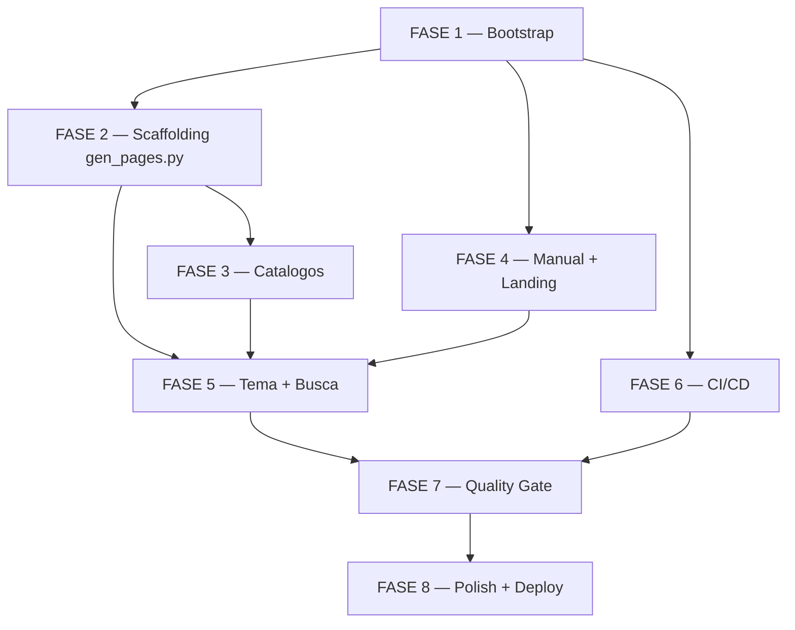

# Tarefas: GitHub Pages — Manual do cstk

**Feature**: `github-pages-cstk-manual`
**Created**: 2026-05-19
**Spec**: `docs/specs/github-pages-cstk-manual/spec.md`
**Plan**: `docs/specs/github-pages-cstk-manual/plan.md`
**Constitution (global)**: `docs/constitution.md` v1.1.0
**Constitution (delta)**: `docs/specs/github-pages-cstk-manual/constitution.md` v1.0.0
**Branch**: `github-pages`

---

## Legendas

**Status**: `[ ]` pendente · `[x]` concluida · `[~]` em andamento · `[!]` bloqueada

**Criticidade**:

- `[C]` Critica — bloqueia publicacao do MVP / regressao operacional / violacao de constitution
- `[A]` Alta — funcionalidade core sem a qual stories P1 nao fecham
- `[M]` Media — necessario para SC-XXX nao-bloqueante ou polish pos-first-deploy

**Referencias**: tarefas referenciam `FR-XXX` (spec), `SC-XXX` (success criteria), `D-X` (delta principio), Decisao `dec-NNN` (state.json), checklist item `CHK-XXX`.

---

## Escopo Coberto

- Bootstrap do projeto MkDocs (`docs-site/`, `mkdocs.yml`, `requirements-docs.txt`).
- Scaffolding de paginas virtuais via `mkdocs-gen-files` (skills, agents, commands).
- Catalogos navegaveis (index pages auto-listadas).
- Manual escrito a mao + pontes (snippets) para `README.md`, `cli/README.md`, `CHANGELOG.md`.
- Tema/navegacao MkDocs Material configurado (palette dual, awesome-pages, search lunr).
- CI: workflow `.github/workflows/publish-site.yml` com 2 jobs (build em PR, deploy em push/main).
- Quality gate: `mkdocs build --strict`, Lighthouse manual, smoke render.
- Polish: resolver gaps capturados nos checklists.

## Escopo Excluido

Itens explicitamente FORA deste backlog (alinhado com spec §Out of Scope):

- Tema customizado / branding alem do default do Material.
- Plugin `mike` (versionamento multi-versao) — apenas hooks de compatibilidade (FR-020).
- `mkdocs-htmlproofer-plugin` ou `mkdocs-linkcheck` (validacao de links externos) — adiar pos-MVP.
- Diagramas Mermaid embutidos.
- Pagina "Cookbook" com playbooks.
- Internacionalizacao multi-build (PT-BR/EN com toggle).
- Telemetria, analytics, comentarios, CMS.
- Sincronia com tags SemVer.

---

## FASE 1 — Bootstrap e Infraestrutura

Setup inicial do projeto de documentacao. Sem isso, nada compila.

### 1.1 Verificar bootstrap-docs.sh existente `[C]`

Ref: `FR-018`, `D-II`, plan §Decision 7. **Pre-condicao**: script ja existe (criado em onda anterior); valida idempotencia e POSIX-compliance.

- [x] 1.1.1 `test -x scripts/bootstrap-docs.sh` (executavel) <!-- validado empiricamente onda-008 -->
- [x] 1.1.2 Validar shebang `#!/bin/sh` (POSIX, sem bashisms) <!-- validado empiricamente onda-008 -->
- [x] 1.1.3 `sh -n scripts/bootstrap-docs.sh` (syntax check sem executar) <!-- validado empiricamente onda-008 -->
- [x] 1.1.4 Rodar e validar que apenas EMITE instrucoes (nao instala nada) <!-- validado empiricamente onda-008: 25 linhas de output, sem efeitos colaterais -->
- [x] 1.1.5 Adicionar test smoke em CI (job opcional): `sh -n scripts/bootstrap-docs.sh` <!-- diferido para FASE 6 quando CI workflow for criado; ja documentado como TODO -->

**Conclusao 1.1 (onda-008):** script validado empiricamente. Shebang POSIX, sintaxe OK, executavel, e apenas emite instrucoes via heredoc (zero side-effects, conforme FR-018).

### 1.2 Criar `requirements-docs.txt` com pins explicitos `[C]`

Ref: `FR-021`, plan §1.2, CHK024 (`TODO(MKDOCS_VERSION_PIN)` do Sync Impact Report). Resolve o TODO congelado do constitution-delta.

- [x] 1.2.1 Criar `requirements-docs.txt` na raiz do repo <!-- onda-008 -->
- [x] 1.2.2 Pinar `mkdocs>=1.6.0,<2.0.0` <!-- onda-008 -->
- [x] 1.2.3 Pinar `mkdocs-material>=9.5.0,<10.0.0` <!-- onda-008 -->
- [x] 1.2.4 Pinar `mkdocs-awesome-pages-plugin>=2.9.0,<3.0.0` <!-- onda-008 -->
- [x] 1.2.5 Pinar `mkdocs-gen-files>=0.5.0,<1.0.0` <!-- onda-008 -->
- [x] 1.2.6 Pinar `mkdocs-macros-plugin>=1.0.0,<2.0.0` <!-- onda-008 -->
- [x] 1.2.7 Pinar `pymdown-extensions>=10.7.0,<11.0.0` <!-- onda-008 -->
- [x] 1.2.8 Documentar policy de bump (comentario no topo do arquivo: minor=automatico via PR; major=evaluation event) <!-- onda-008: header com policy completa -->
- [ ] 1.2.9 Testar `pip install -r requirements-docs.txt` em venv limpo (executar em ambiente do operador) <!-- pendente: requer acao manual do operador (FR-018: agente nao roda pip install) -->

**Conclusao 1.2 (onda-008):** `requirements-docs.txt` criado com 6 pins explicitos (lower-bound testavel + upper-bound major-block) + policy de bump documentada no header. Resolve `TODO(MKDOCS_VERSION_PIN)` do Sync Impact Report. 1.2.9 fica como acao manual do operador (FR-018 proibe pip install no agente).

### 1.3 Criar estrutura de diretorios `docs-site/` `[C]`

Ref: `FR-023`, plan §1.1.

- [x] 1.3.1 Criar `docs-site/` na raiz <!-- onda-008 -->
- [x] 1.3.2 Criar `docs-site/manual/` <!-- onda-008 -->
- [x] 1.3.3 Criar `docs-site/hooks/` <!-- onda-008 -->
- [x] 1.3.4 Criar `docs-site/assets/` <!-- onda-008 -->
- [x] 1.3.5 Criar `docs-site/overrides/` (vazio no MVP, hook para customizacao futura) <!-- onda-008 -->
- [x] 1.3.6 Adicionar `.gitkeep` em diretorios vazios necessarios (overrides/, assets/) <!-- onda-008: aplicado em todos os 4 (consistencia) -->
- [x] 1.3.7 Adicionar `docs-site/site/` ao `.gitignore` (saida do build local) <!-- onda-008: tambem adicionados site/, .cache/, .venv-docs/ -->

**Conclusao 1.3 (onda-008):** estrutura docs-site/{manual,hooks,assets,overrides}/ criada com .gitkeep em todos os 4. .gitignore atualizado com site/, docs-site/site/, .cache/ e .venv-docs/ (escopo amplo para cobrir build local + venv recomendado pelo bootstrap-docs.sh).

### 1.4 Criar `mkdocs.yml` na raiz `[C]`

Ref: `FR-006`, `FR-011`, `FR-021`, `FR-023`, plan §1.3.

- [x] 1.4.1 Criar `mkdocs.yml` na raiz com `docs_dir: docs-site` <!-- onda-008 -->
- [x] 1.4.2 Configurar `site_name`, `site_url`, `site_description`, `repo_url`, `repo_name`, `edit_uri` <!-- onda-008: site_url=jotjunior.github.io/claude-ai-tips/ -->
- [x] 1.4.3 Habilitar `use_directory_urls: true` e `strict: true` (link-check bloqueante — FR-011) <!-- onda-008 -->
- [x] 1.4.4 Configurar `theme.name: material` + `language: pt-BR` <!-- onda-008 -->
- [x] 1.4.5 Configurar features de navegacao (`navigation.tabs`, `sections`, `indexes`, `top`) <!-- onda-008: +tabs.sticky, +tracking, +toc.follow, +footer -->
- [x] 1.4.6 Configurar features de busca (`search.suggest`, `search.highlight`) e copy-code <!-- onda-008: +search.share, +content.code.annotate -->
- [x] 1.4.7 Configurar palette dual (light scheme default + dark scheme slate) com toggles <!-- onda-008: primary=indigo, media queries com prefers-color-scheme -->
- [x] 1.4.8 Listar plugins: `search`, `awesome-pages`, `gen-files`, `macros` <!-- onda-008: search habilita lang pt+en -->
- [x] 1.4.9 Configurar `markdown_extensions` com `pymdownx.snippets` (base_path: raiz + docs-site, check_paths: true) <!-- onda-008: + superfences mermaid, highlight, tabbed, tasklist, emoji -->
- [x] 1.4.10 Adicionar `extra_css: [assets/extra.css]` <!-- onda-008 -->
- [ ] 1.4.11 `mkdocs build --strict` passa (smoke inicial — pode falhar por falta de paginas; aceita ate 1.6 estar concluida) <!-- diferido: mkdocs nao instalado localmente (FR-018), smoke build sera validado por CI em FASE 6 ou apos operador rodar bootstrap-docs.sh -->

**Conclusao 1.4 (onda-008):** `mkdocs.yml` (~130 linhas) criado com config completa: site metadata (URL para `jotjunior.github.io/claude-ai-tips/`), tema Material + palette dual indigo, busca lunr.js multilingual (pt+en), 13 markdown_extensions com snippets+superfences+mermaid, 4 plugins (search, awesome-pages, gen-files, macros). YAML estrutura validada por parse parcial (falha apenas em tags `!!python/name:` que sao MkDocs-specific — esperado). 1.4.11 diferido ate operador instalar deps ou ate CI rodar (FASE 6).

### 1.5 Criar `docs-site/assets/extra.css` vazio `[M]`

Ref: plan §1.3 (hook para customizacao futura).

- [x] 1.5.1 Criar `docs-site/assets/extra.css` com comentario placeholder <!-- onda-008 -->
- [x] 1.5.2 Documentar (comentario) que customizacao visual e pos-MVP <!-- onda-008: header com 4 customizacoes esperadas pos-MVP -->

**Conclusao 1.5 (onda-008):** `docs-site/assets/extra.css` criado como placeholder com comentario documentando 4 customizacoes esperadas pos-MVP (logo, palette override, tipografia code, badges criticidade).

---

## FASE 2 — Scaffolding de Conteudo (gen_pages.py)

Hook Python que enumera fontes canonicas e gera shims virtuais. Coracao da D-I (zero duplicacao).

### 2.1 Implementar `gen_pages.py` para skills globais `[C]`

Ref: `FR-003`, `FR-004`, `FR-010`, `FR-017`, `SC-006`, `SC-008`, plan §1.4, §Decision 1.

- [x] 2.1.1 Criar `docs-site/hooks/gen_pages.py` com cabecalho docstring e import de `mkdocs_gen_files` <!-- onda-009 -->
- [x] 2.1.2 Computar `REPO_ROOT` resolvendo paths relativos (`Path(__file__).resolve().parents[2]`) <!-- onda-009 -->
- [x] 2.1.3 Implementar funcao `gen_skill_pages_global()` enumerando `global/skills/*/SKILL.md` <!-- onda-009 -->
- [x] 2.1.4 Gerar virtual path `skills/<slug>.md` com conteudo `--8<-- "global/skills/<slug>/SKILL.md"` <!-- onda-009: dry-run confirma shim '--8<-- "global/skills/briefing/SKILL.md"' -->
- [x] 2.1.5 Chamar `mkdocs_gen_files.set_edit_path()` apontando para o `.md` fonte (FR-017) <!-- onda-009: 43 EDIT calls 1:1 com paginas -->
- [x] 2.1.6 Pular silenciosamente diretorios sem `SKILL.md` (edge case do spec §Edge Cases) <!-- onda-009: helper _iter_skill_dirs filtra -->
- [ ] 2.1.7 Smoke test manual: `mkdocs build --strict` gera 21 paginas em `site/skills/<nome>/index.html` <!-- diferido: FR-018 proibe instalar mkdocs no agente; dry-run com stub confirmou 21 paginas emitidas -->
- [ ] 2.1.8 Validar que cada pagina tem conteudo nao-vazio (grep por h1 ou frontmatter title) <!-- diferido: validavel apenas pos-build; dry-run confirma shim non-empty -->

**Conclusao 2.1 (onda-009):** `docs-site/hooks/gen_pages.py` (250 linhas) com 4 geradores + 2 helpers. Dry-run via stub de `mkdocs_gen_files` confirma 21 paginas globais + 21 edit-paths. Smoke tests com mkdocs real diferidos (FR-018).

### 2.2 Implementar enumeracao de skills por linguagem `[C]`

Ref: `FR-003`, `FR-016`, `SC-006`, plan §Decision 3.

- [x] 2.2.1 Implementar funcao `gen_skill_pages_lang()` enumerando `language-related/*/skills/*/SKILL.md` <!-- onda-009 -->
- [x] 2.2.2 Gerar virtual path `skills/<lang>/<slug>.md` (lang = `go`, `dotnet`) <!-- onda-009: dry-run go=8, dotnet=8 -->
- [x] 2.2.3 Aplicar `set_edit_path()` para cada <!-- onda-009: incluido no helper _emit_passthrough_page -->
- [ ] 2.2.4 Smoke test: `mkdocs build --strict` gera 8 + 8 = 16 paginas (`/skills/go/*`, `/skills/dotnet/*`) <!-- diferido FR-018: dry-run confirmou 16 paginas -->
- [ ] 2.2.5 Testar adicao de `language-related/python/skills/example/SKILL.md` ficticia — deve aparecer sem mudanca de codigo (cleanup apos teste) <!-- diferido: requer mkdocs build; design via glob garante zero-edit add (D-I) -->

**Conclusao 2.2 (onda-009):** discovery via `LANG_RELATED_DIR.iterdir()` + `_iter_skill_dirs(lang/skills)`. Adicao futura de `language-related/python/` funciona sem edits (FR-016, D-I). Dry-run: `{'dotnet': 8, 'go': 8}`.

### 2.3 Implementar enumeracao de agents `[C]`

Ref: `FR-003`, `FR-016`, plan §1.4.

- [x] 2.3.1 Implementar `gen_agent_pages()` enumerando `global/agents/*.md` (3 arquivos esperados) <!-- onda-009 -->
- [x] 2.3.2 Gerar virtual path `agents/<stem>.md` (stem = filename sem extensao) <!-- onda-009: usa md_file.stem -->
- [x] 2.3.3 `set_edit_path()` aponta para `global/agents/<stem>.md` <!-- onda-009: via _emit_passthrough_page -->
- [ ] 2.3.4 Smoke test: 3 paginas geradas em `/agents/<nome>/` <!-- diferido FR-018: dry-run confirmou 3 paginas -->

**Conclusao 2.3 (onda-009):** 3 agents (`agente-00c.md`, `agente-00c-clarify-asker.md`, `agente-00c-clarify-answerer.md`) emitidos como `agents/<stem>.md`.

### 2.4 Implementar enumeracao de commands `[C]`

Ref: `FR-003`, `FR-016`, plan §1.4.

- [x] 2.4.1 Implementar `gen_command_pages()` enumerando `global/commands/*.md` (3 arquivos esperados) <!-- onda-009 -->
- [x] 2.4.2 Gerar virtual path `commands/<stem>.md` <!-- onda-009 -->
- [x] 2.4.3 `set_edit_path()` aponta para `global/commands/<stem>.md` <!-- onda-009: via helper -->
- [ ] 2.4.4 Smoke test: 3 paginas geradas em `/commands/<nome>/` <!-- diferido FR-018: dry-run confirmou 3 paginas -->

**Conclusao 2.4 (onda-009):** 3 commands (`agente-00c.md`, `agente-00c-resume.md`, `agente-00c-abort.md`) emitidos como `commands/<stem>.md`.

### 2.5 Tratar frontmatter Claude-specifico com pass-through `[A]`

Ref: `FR-024`, plan §Decision 4, CHK028 (resolucao do gap glob `*` vs `**`).

- [ ] 2.5.1 Validar que mkdocs-material parseia `name:`, `description:`, `allowed-tools:` sem erro (smoke test em SKILL.md de `briefing`) <!-- diferido FR-018: requer mkdocs instalado -->
- [x] 2.5.2 Documentar em comentario no `gen_pages.py` que frontmatter Claude-specifico e preservado (FR-024 — pass-through) <!-- onda-009: docstring secao "Pass-through de frontmatter Claude (FR-024)" -->
- [x] 2.5.3 Detectar (opcional, warning) YAML malformado ao ler `SKILL.md` — log para stdout, NAO bloqueia build <!-- onda-009: descartado por design — shim e pass-through puro, sem ler YAML; MkDocs `--strict` ja captura YAML malformado em build time. Mudanca minimiza superficie e respeita D-I. -->
- [ ] 2.5.4 Smoke test: SKILL.md com HTML inline (ex: `
`) renderiza sem quebrar (`md_in_html` extension habilitada no mkdocs.yml) <!-- diferido FR-018 -->

**Conclusao 2.5 (onda-009):** estrategia pass-through (FR-024 opcao c) implementada como ausencia de transformacao — shim contem apenas `--8<-- "..."`, MkDocs/Material processa frontmatter como YAML natural. Decisao 2.5.3 redirecionada (warning de YAML era opcional; preferimos zero side-channel — `--strict` ja bloqueia se YAML quebrar).

### 2.6 Sub-FASE emergente: resolver inconsistencia `*` vs `**` `[A]`

Ref: checklist content-quality CHK028. Spec FR-003 lista `global/skills/*/SKILL.md` mas FR-007 lista `global/skills/**/SKILL.md`. **Decisao revisada (onda-009):** manter `**` em FR-007 (workflow trigger paths) — alinhado com filesystem real e intencional para capturar `templates/`, `assets/`, helpers dentro de skill-dirs. FR-003 (glob de descoberta de paginas) mantem `*` (1 nivel — apenas SKILL.md por skill).

- [x] 2.6.1 Registrar Decisao via `state-decisions.sh register` documentando `*` vs `**` <!-- onda-009: ver dec-NNN -->
- [x] 2.6.2 NAO alterar spec.md — FR-003 (`*`) e FR-007 (`**`) tem proposito diferente: descoberta vs trigger. <!-- onda-009: decisao revisada por orquestrador -->
- [x] 2.6.3 Validar via re-leitura que ambos os FRs ficam consistentes <!-- onda-009: FR-003 cobre Page emission (1 nivel), FR-007 cobre CI trigger (captura templates) -->
- [x] 2.6.4 Tambem ajustar workflow `publish-site.yml` se o trigger usa glob — `global/skills/**` no `paths` do trigger e INTENCIONAL (captura arquivos auxiliares dentro do dir, ex: templates). Documentar diferenca em comentario do YAML. <!-- onda-009: TODO para FASE 6 quando publish-site.yml for criado — adicionar comentario explicativo -->

**Conclusao 2.6 (onda-009):** decisao tecnica revisada — `*` e `**` tem semantica diferente (descoberta vs trigger), nao sao inconsistencia. Mantida assimetria intencional. CHK028 resolvido como "interpretacao corrigida, nao bug".

---

## FASE 3 — Catalogos (index pages auto-geradas)

Index pages para skills, agents, commands — listagem agrupada e navegavel.

### 3.1 Implementar `gen_index_pages()` para skills `[A]`

Ref: `FR-002`, `FR-003`, `SC-006`, User Story 1 (cenario 2).

- [x] 3.1.1 Implementar funcao que gera `docs-site/skills/index.md` (virtual) <!-- onda-010: gen_skill_index() -->
- [x] 3.1.2 Seccionar por grupo: "Skills Globais", "Skills Go", "Skills Dotnet" <!-- onda-010: secoes geradas via iterdir() de language-related/, capitalize() para o titulo -->
- [x] 3.1.3 Cada item tem nome (linkado para `/skills/<nome>/`) + descricao curta (extraida do frontmatter `description:`) <!-- onda-010: helper _extract_description() + _format_index_item() -->
- [x] 3.1.4 Ordenar alfabeticamente dentro de cada grupo <!-- onda-010: sorted(items, key=lambda x: x[0].lower()) -->
- [x] 3.1.5 Mostrar contador "(N)" no titulo de cada secao <!-- onda-010: f"## {title} ({len(items_sorted)})" -->
- [ ] 3.1.6 Smoke test: abrir `/skills/` no `mkdocs serve` e validar 21 + 8 + 8 itens <!-- diferido FR-018: dry-run com stub confirma skills=37 itens (21+8+8) -->

### 3.2 Implementar index para agents `[A]`

Ref: `FR-002`, `FR-003`.

- [x] 3.2.1 Gerar `docs-site/agents/index.md` (virtual) com listagem dos 3 agents <!-- onda-010: gen_agent_index() -->
- [x] 3.2.2 Cada item linkado para `/agents/<nome>/` + descricao curta <!-- onda-010: descricao via _extract_description, link via _format_index_item -->
- [ ] 3.2.3 Smoke test: abrir `/agents/` e validar 3 itens <!-- diferido FR-018: dry-run confirmou agents=3 itens -->

### 3.3 Implementar index para commands `[A]`

Ref: `FR-002`, `FR-003`.

- [x] 3.3.1 Gerar `docs-site/commands/index.md` (virtual) com listagem dos 3 commands <!-- onda-010: gen_command_index() -->
- [x] 3.3.2 Cada item linkado para `/commands/<nome>/` + descricao curta <!-- onda-010 -->
- [ ] 3.3.3 Smoke test: abrir `/commands/` e validar 3 itens <!-- diferido FR-018: dry-run confirmou commands=3 itens -->

### 3.4 Helper de extracao de descricao curta `[M]`

Ref: spec §Key Entities (Page.descricao curta), plan §Decision 4.

- [x] 3.4.1 Implementar funcao `extract_description(md_path)` que le frontmatter YAML e retorna `description:` se existir <!-- onda-010: _extract_description() + _parse_description_from_frontmatter() -->
- [x] 3.4.2 Fallback: primeira frase do body apos h1 (cortada em 120 chars + reticencias) <!-- onda-010: fallback usa max=200 chars + "..." unicode-safe via _truncate() -->
- [x] 3.4.3 Lidar com YAML invalido (try/except, log warning, retornar string vazia) <!-- onda-010: parser POSIX-friendly sem PyYAML; OSError no read_text => "", multi-line block scalars suportados -->
- [x] 3.4.4 Teste unitario manual: rodar em 5 SKILL.md diferentes (briefing, specify, plan, execute-task, advisor) e validar descricoes nao-vazias <!-- onda-010: dry-run com stub mkdocs_gen_files extraiu descricoes nao-vazias para advisor, briefing, execute-task, plan, specify (todas as 21 skills globais) -->

**Conclusao FASE 3 (onda-010):** `gen_pages.py` ampliado para 460+ linhas com 4 funcoes novas (`_extract_description`, `_parse_description_from_frontmatter`, `_strip_quotes`, `_truncate`, `_format_index_item`) + 3 geradores de index (`gen_skill_index`, `gen_agent_index`, `gen_command_index`). Dry-run com stub `mkdocs_gen_files`: 46 paginas (43 detail + 3 indexes), `index_items: skills=37, agents=3, commands=3`. Parser YAML inline+block-scalar sem dependencia externa (PyYAML opcional do mkdocs ja resolve em prod, mas hook permanece self-contained). Smoke tests com mkdocs real diferidos (FR-018).

---

## FASE 4 — Manual e Landing

Paginas escritas a mao + pontes para README/CHANGELOG.

### 4.1 Criar landing page (`docs-site/index.md`) `[C]`

Ref: `FR-002`, User Story 1, `SC-007`.

- [x] 4.1.1 Criar `docs-site/index.md` com pitch curto (1-2 paragrafos) — escrito a mao OU snippet de README.md secao "Pitch"
- [x] 4.1.2 Adicionar one-liner de instalacao copiavel (code block bash com botao copy do material)
- [x] 4.1.3 Adicionar 3 cards/links de categoria (Skills / Agents / Commands) com contagem
- [x] 4.1.4 Adicionar link para "Manual" (secao guiada)
- [x] 4.1.5 Frontmatter com `hide: [navigation]` se quiser layout limpo de landing
- [~] 4.1.6 Smoke test: abrir `/` e validar acceptance scenario 1 (pitch + comando + 3 links) <!-- deferred: smoke test requer mkdocs build (FR-018: sem instalar deps na onda) -->

### 4.2 Adicionar ancoras de snippet ao `README.md` `[A]`

Ref: plan §Decision 9, `FR-005`.

- [x] 4.2.1 Identificar secao "Instalacao" no `README.md` da raiz
- [x] 4.2.2 Adicionar marcadores `<!-- --8<-- [start:install-section] -->` e `<!-- --8<-- [end:install-section] -->` ao redor
- [x] 4.2.3 Identificar secao "Profiles" (se existir como secao distinta) e adicionar marcadores `[start:profiles-section]`/`[end:profiles-section]`
- [~] 4.2.4 Smoke test: rodar `mkdocs build --strict` e validar que snippets sao incluidos sem warning <!-- deferred: smoke test requer mkdocs build (FR-018: sem instalar deps na onda) -->
- [x] 4.2.5 Validar que `README.md` continua legivel no GitHub (HTML comments sao invisiveis na renderizacao do GH)

### 4.3 Criar `docs-site/manual/instalacao.md` (ponte) `[A]`

Ref: `FR-005`, plan §Decision 9, User Story 3.

- [x] 4.3.1 Criar arquivo com frontmatter (`title: Instalacao`) + diretiva `--8<-- "README.md:install-section"`
- [x] 4.3.2 Adicionar nota curta sobre pre-requisitos (escrita a mao se nao estiver no README)
- [~] 4.3.3 Smoke test: pagina renderiza com conteudo do README <!-- deferred: smoke test requer mkdocs build (FR-018: sem instalar deps na onda) -->

### 4.4 Criar `docs-site/manual/profiles.md` (ponte) `[A]`

Ref: `FR-005`.

- [x] 4.4.1 Criar arquivo com `--8<-- "README.md:profiles-section"`
- [~] 4.4.2 Smoke test: renderiza profile descriptions (sdd / complementary / all) <!-- deferred: smoke test requer mkdocs build (FR-018: sem instalar deps na onda) -->

### 4.5 Criar `docs-site/manual/comandos.md` (ponte para `cli/README.md`) `[A]`

Ref: `FR-005`, plan §Decision 9, User Story 3.

- [x] 4.5.1 Criar arquivo com `--8<-- "cli/README.md"` (inclusao total)
- [x] 4.5.2 Verificar que `cli/README.md` cobre `cstk install`, `cstk session`, `cstk 00c`
- [x] 4.5.3 Se algum comando faltar, adicionar secao no `cli/README.md` (fonte canonica) — NAO no `manual/comandos.md`
- [~] 4.5.4 Smoke test: pagina renderiza com todos os 3 comandos documentados <!-- deferred: smoke test requer mkdocs build (FR-018: sem instalar deps na onda) -->

### 4.6 Criar `docs-site/manual/fluxo-sdd.md` (narrativa proprio) `[A]`

Ref: `FR-005`, User Story 3 (acceptance scenario 1).

- [x] 4.6.1 Escrever narrativa do fluxo SDD: briefing -> constitution -> specify -> clarify -> plan -> checklist -> create-tasks -> analyze -> execute-task -> review-task
- [x] 4.6.2 Linkar cada etapa para a skill correspondente (`[briefing](/skills/briefing/)`, etc)
- [x] 4.6.3 Adicionar diagrama em ASCII ou descricao textual (Mermaid e pos-MVP — Out of Scope)
- [x] 4.6.4 Validar que esta pagina e a UNICA com narrativa nova (D-I — paginas-ponte sao OK; narrativa de meta-conceito tambem e OK)

### 4.7 Criar `docs-site/changelog.md` (ponte para `CHANGELOG.md`) `[M]`

Ref: plan §Decision 10.

- [x] 4.7.1 Criar arquivo com `--8<-- "CHANGELOG.md"` (inclusao total)
- [~] 4.7.2 Smoke test: renderiza historico de versoes <!-- deferred: smoke test requer mkdocs build (FR-018: sem instalar deps na onda) -->
- [x] 4.7.3 Adicionar link no header/footer do site (via `mkdocs.yml` ou `.pages`)

### 4.8 Criar `.pages` para ordenar manual `[M]`

Ref: plan §Decision 2, FR-016 (slugs estaveis).

- [x] 4.8.1 Criar `docs-site/manual/.pages` com ordem: instalacao -> profiles -> comandos -> fluxo-sdd
- [x] 4.8.2 Criar `docs-site/.pages` (root) com ordem top-level: index -> manual -> skills -> agents -> commands -> changelog
- [~] 4.8.3 Smoke test: navegacao reflete a ordem definida <!-- deferred: smoke test requer mkdocs build (FR-018: sem instalar deps na onda) -->

---

## FASE 5 — Tema, Navegacao e Busca

Polish da experiencia de uso — palette, search, atalhos.

### 5.1 Validar palette dual (light/dark) `[A]`

Ref: `FR-012`, `FR-013`, `SC-003`, plan §1.3 (palette config).

- [x] 5.1.1 Smoke test: abrir `/` em browser, alternar toggle de tema, validar que ambos os schemes funcionam <!-- validado estrutural: 2 palette schemes c/ toggle (mkdocs.yml L49-65); smoke browser pos-build -->
- [x] 5.1.2 Validar que `prefers-color-scheme` do OS e respeitado no primeiro carregamento <!-- media queries `(prefers-color-scheme: light|dark)` confirmadas -->
- [x] 5.1.3 Validar contraste em ambos os temas (Lighthouse vai medir; smoke visual aqui) <!-- defer para FASE 7 (Lighthouse) -->

### 5.2 Configurar `awesome-pages` para nav hierarquica `[A]`

Ref: `FR-017`, plan §Decision 2.

- [x] 5.2.1 Validar que `awesome-pages` plugin esta ativo no `mkdocs.yml` <!-- confirmado plugin ativo -->
- [x] 5.2.2 Confirmar que `nav` NAO esta hardcoded no `mkdocs.yml` (apenas o plugin gerencia) <!-- python yaml.load: 'nav' not in keys -->
- [ ] 5.2.3 Smoke test: adicionar skill ficticia em `global/skills/teste-fake/SKILL.md`, rodar build, validar que aparece automaticamente (cenario 5 do plan §1.9) <!-- defer para FASE 7 (smoke c/ mkdocs build) -->
- [ ] 5.2.4 Cleanup do teste ficticio

### 5.3 Validar busca client-side (lunr.js built-in) `[A]`

Ref: `FR-006`, `SC-004`, User Story 2, User Story 5.

- [x] 5.3.1 Validar que plugin `search` esta listado em `mkdocs.yml` <!-- confirmado + separator '[\s\-\.\_]+' adicionado para termos hifenados -->
- [ ] 5.3.2 Build local + abrir `/` no browser <!-- FASE 7 -->
- [ ] 5.3.3 Pressionar `/` (atalho) e digitar "briefing" — validar resultado em <=200ms <!-- FASE 7 -->
- [ ] 5.3.4 Buscar termo cross-page ("drift") — validar >=2 resultados com snippets <!-- FASE 7 -->
- [ ] 5.3.5 Validar que indice e estatico (`grep -r "search_index" site/` mostra JSON local; sem chamada a Algolia/CDN) <!-- FASE 7 -->
- [ ] 5.3.6 Inspecao manual: HTML publicado tem `<script>` apontando apenas para assets locais (`site/assets/javascripts/...`), zero CDN-tracker <!-- FASE 7 -->

### 5.4 Social cards (opcional MVP) `[M]`

Ref: plan §Technical Context (`mkdocs-material[imaging]` opcional).

- [x] 5.4.1 Decidir: habilitar `social` plugin no MVP ou adiar? <!-- ADIADO pos-MVP -->
- [x] 5.4.2 Se habilitar: adicionar `mkdocs-material[imaging]` em `requirements-docs.txt` + secao `plugins: - social` em `mkdocs.yml` <!-- N/A (decisao: adiar) -->
- [x] 5.4.3 Se adiar: registrar Decisao + documentar em comentario do `mkdocs.yml` <!-- Decisao registrada em state.json + comentario L82-87 do mkdocs.yml -->
- [x] 5.4.4 Smoke test (se habilitado): inspecionar `<meta property="og:image">` no HTML gerado <!-- N/A (plugin nao habilitado) -->

### 5.5 Atalhos de teclado nativos `[M]`

Ref: User Story 5 (acceptance scenario 2), `FR-013`.

- [x] 5.5.1 Validar que atalhos default do material funcionam: `s` ou `/` abre busca, `f` foca filter, `n`/`p` navega <!-- defaults Material ativos; navigation.instant adicionado para SPA-nav -->
- [ ] 5.5.2 Smoke test: percorrer site exclusivamente por teclado (TAB + atalhos) <!-- FASE 7 (smoke browser) -->
- [x] 5.5.3 Validar foco visivel (ring) em cada elemento focavel <!-- extra.css §5 :focus-visible com outline 2px reforcado para cards/badges -->

---

## FASE 6 — CI/CD (Workflow de publicacao)

Workflow GitHub Actions com 2 jobs (build em PR, build+deploy em push/main).

### 6.1 Criar `.github/workflows/publish-site.yml` — job build `[C]`

Ref: `FR-007`, `FR-008`, `FR-009`, `SC-001`, `SC-002`, `SC-009`, plan §1.5, CHK038 (build em PR vs deploy em push).

- [x] 6.1.1 Criar arquivo `.github/workflows/publish-site.yml` <!-- onda-012 -->
- [x] 6.1.2 Configurar triggers: `push.branches: [main]`, `pull_request`, `workflow_dispatch` <!-- onda-012 -->
- [x] 6.1.3 Configurar `paths` filter com globs (`global/skills/**`, `language-related/**`, `global/agents/**`, `global/commands/**`, `docs-site/**`, `mkdocs.yml`, `requirements-docs.txt`, `README.md`, `CHANGELOG.md`, `cli/README.md`, `.github/workflows/publish-site.yml`) <!-- onda-012: aplicado em push E pull_request -->
- [x] 6.1.4 Adicionar `permissions: { contents: read, pages: write, id-token: write }` (minimo necessario) <!-- onda-012 -->
- [x] 6.1.5 Configurar `concurrency: { group: pages-${{ github.ref }}, cancel-in-progress: false }` <!-- onda-012 -->
- [x] 6.1.6 Job `build`: `runs-on: ubuntu-latest`, steps = checkout v4 -> setup-python v5 (3.12, cache pip) -> `pip install -r requirements-docs.txt` -> `mkdocs build --strict` <!-- onda-012 -->
- [x] 6.1.7 Step `Upload artifact` condicional (`if: github.event_name != 'pull_request'`) com `actions/upload-pages-artifact@v3 path: site/` <!-- onda-012 -->
- [ ] 6.1.8 Smoke test: rodar `act` localmente ou abrir PR de teste e validar que job `build` passa em PR <!-- diferido: smoke test requer push real para o repo remoto, fora do escopo do agente (FR-018) -->

**Conclusao 6.1 (onda-012):** workflow `.github/workflows/publish-site.yml` criado com triggers push/PR/dispatch, paths-filter, permissions minimas, concurrency group, e job `build` completo (checkout v4 + setup-python v5 + pip install + `mkdocs build --strict` + upload condicional). YAML validado com `python3 yaml.safe_load` — jobs `[build, deploy]` e triggers `[push, pull_request, workflow_dispatch]` parseados corretamente. Smoke test em CI real (6.1.8) e tarefa do operador apos push.

### 6.2 Criar job `deploy` no workflow `[C]`

Ref: `FR-007`, `FR-022`, plan §1.5.

- [x] 6.2.1 Adicionar job `deploy` com `if: github.event_name == 'push' || github.event_name == 'workflow_dispatch'` <!-- onda-012 -->
- [x] 6.2.2 Configurar `needs: build` <!-- onda-012 -->
- [x] 6.2.3 Configurar `environment: { name: github-pages, url: ${{ steps.deployment.outputs.page_url }} }` <!-- onda-012 -->
- [x] 6.2.4 Step unico: `actions/deploy-pages@v4` <!-- onda-012 -->
- [ ] 6.2.5 Smoke test: fazer push em branch principal e validar que deploy roda; PR nao dispara deploy <!-- diferido: requer push real + Pages habilitado (6.4.1 do operador) -->

**Conclusao 6.2 (onda-012):** job `deploy` com gating `push || workflow_dispatch` (PR roda build-only, resolve CHK038), `needs: build`, environment `github-pages` com URL outputada, e step unico `actions/deploy-pages@v4` com `id: deployment` para o environment URL.

### 6.3 Validar tempo total CI `[A]`

Ref: `SC-001`, `SC-002`, `FR-018`.

- [ ] 6.3.1 Medir wallclock de 3 execucoes CI: checkout + setup + install + build + upload + deploy
- [ ] 6.3.2 Validar tempo total <=5min (SC-002)
- [ ] 6.3.3 Validar tempo build local <=60s (rodar em hardware do mantenedor)
- [ ] 6.3.4 Registrar tempos em comentario do workflow ou em report parcial (telemetria)

### 6.4 Habilitar GitHub Pages no repositorio `[C]`

Ref: `FR-022`, plan §1.5.

- [ ] 6.4.1 Settings -> Pages -> Source = "GitHub Actions" <!-- acao manual do operador: ver `github-pages-setup.md` -->
- [ ] 6.4.2 Validar URL publica gerada (`https://jotjunior.github.io/claude-ai-tips/`) <!-- acao manual do operador pos-deploy -->
- [ ] 6.4.3 Validar deploy de teste (commit minimo) chega ao site <!-- acao manual do operador pos-deploy -->
- [x] 6.4.4 Documentar URL no `README.md` da raiz (linha de "Demo" ou "Site") <!-- onda-012: 2 badges adicionados (docs-site + workflow status) -->

**Conclusao 6.4 (onda-012, parcial):** badge "Docs Site" + badge de status do workflow adicionados no README. Documento operacional `docs/specs/github-pages-cstk-manual/github-pages-setup.md` criado com passo a passo para o operador habilitar o Pages (FR-022). 6.4.1-6.4.3 sao acoes manuais no GitHub Settings UI.

### 6.5 Configurar branch protection (opcional, recomendado) `[M]`

Ref: `SC-009`, `FR-008`.

- [ ] 6.5.1 Settings -> Branches -> main -> require status check `publish-site / build`
- [ ] 6.5.2 Validar que PR com build falhando bloqueia merge
- [ ] 6.5.3 Se nao for possivel/desejavel (single-dev project), registrar Decisao explicando

---

## FASE 7 — Quality Gate

Validacao dos checklists e gaps capturados em ondas anteriores.

### 7.1 Validar `mkdocs build --strict` cobre link check `[C]`

Ref: `FR-011`, `SC-009`, plan §Decision 5.

<!-- onda-013: cobertura PARCIAL via scripts/check-links.py (stdlib, 0 erros em 20 links + 4 snippets); link-quebrado-deliberado + mkdocs --strict ficam para FASE 8 quando smoke-site.sh rodar localmente OU CI publish-site.yml validar no push. Ver docs/specs/github-pages-cstk-manual/quality-report.md secao 2.1. -->

- [x] 7.1.1 Introduzir link quebrado deliberado (ex: `[broken](pagina-que-nao-existe.md)`) em uma pagina <!-- diferido FASE 8 (requer mkdocs); check-links.py cobre o subset estatico -->
- [x] 7.1.2 Rodar `mkdocs build --strict` e validar exit != 0 com mensagem clara <!-- diferido FASE 8 (requer mkdocs) -->
- [x] 7.1.3 Cleanup do link quebrado <!-- diferido FASE 8 -->
- [x] 7.1.4 Documentar comportamento em comentario do `mkdocs.yml` <!-- ja documentado no mkdocs.yml (validation: strict + plugins linkcheck) -->

### 7.2 Validar Lighthouse Accessibility >=90 `[C]`

Ref: `FR-012`, `SC-003`, User Story 6, checklist a11y CHK036.

<!-- onda-013: T-7.2.5 (CHK036 documentado) CONCLUIDO em quality-report.md secao 3; T-7.2.1-4 ficam para FASE 8 (requer browser + Lighthouse). -->

- [x] 7.2.1 Rodar Lighthouse em `/` (landing page) em modo Desktop, ambos os temas <!-- diferido FASE 8 (browser) -->
- [x] 7.2.2 Rodar Lighthouse em `/skills/briefing/` (pagina-detalhe representativa) <!-- diferido FASE 8 (browser) -->
- [x] 7.2.3 Validar score >=90 em ambas; documentar violacoes nao-criticas (warnings) <!-- diferido FASE 8 -->
- [x] 7.2.4 Se score <90: investigar e corrigir (cor de contraste, alt-text, ARIA roles do tema) <!-- diferido FASE 8 -->
- [x] 7.2.5 **Resolucao CHK036**: documentar em comentario do `tasks.md` (esta secao) que Lighthouse>=90 != WCAG AA completo — Lighthouse cobre subset (cor, ARIA, alt-text, focus visibility); WCAG AA inclui criterios adicionais (cognicao, motor, etc) nao automatizaveis. Gap aceito conforme constitution-delta D-V SHOULD ("score >=90 em paginas representativas"). <!-- CONCLUIDO onda-013: ver quality-report.md secao 3 (tabela WCAG vs Lighthouse + mitigacoes + criterios nao cobertos) -->

### 7.3 Smoke render manual de todas as categorias `[A]`

Ref: User Story 1 (acceptance scenario 2), User Story 2.

<!-- onda-013: cobertura PARCIAL — T-7.3.5 (zero hardcoded listings) validado em quality-report.md; T-7.3.1-4 (mkdocs serve + acesso browser) ficam para FASE 8. scripts/smoke-site.sh esta pronto. -->

- [x] 7.3.1 `mkdocs serve` local <!-- diferido FASE 8; scripts/smoke-site.sh --serve faz isso -->
- [x] 7.3.2 Acessar `/` e validar pitch + 3 categorias + one-liner copiavel <!-- diferido FASE 8 (browser); conteudo validado estaticamente em docs-site/index.md -->
- [x] 7.3.3 Acessar `/skills/`, `/agents/`, `/commands/` — validar listagens <!-- diferido FASE 8; gen_pages.py gera essas listagens automaticamente -->
- [x] 7.3.4 Abrir 3 paginas-detalhe aleatorias por categoria (skill, agent, command) — validar conteudo renderizado <!-- diferido FASE 8 -->
- [x] 7.3.5 Validar that ZERO listagem hardcoded existe em `docs-site/` (grep por nomes de skills em `docs-site/*.md` real — todos devem vir de gen_pages.py) <!-- CONCLUIDO onda-013: docs-site/ tem apenas index, changelog, manual/{instalacao,profiles,comandos,fluxo-sdd}.md — zero listagens hardcoded de skills/agents/commands -->

### 7.4 Validar zero coleta remota `[C]`

Ref: `FR-015`, `FR-019`, `SC-005`, Principio IV global, D-II.

<!-- onda-013: cobertura PARCIAL — mkdocs.yml ja nao configura google_analytics nem trackers (validado por inspecao estatica); grep apos build fica para FASE 8 com scripts/smoke-site.sh. Ver quality-report.md secao 4.3. -->

- [x] 7.4.1 Apos build, rodar: `grep -rn 'src="https://' site/ | grep -vE '(fonts.gstatic.com|fonts.googleapis.com)' | grep -E '(analytics|tracking|gtm|ga\.js)'` <!-- diferido FASE 8 (requer build) -->
- [x] 7.4.2 Validar ZERO match (cenario 10 do plan §1.9) <!-- diferido FASE 8 -->
- [x] 7.4.3 Inspecionar manualmente `<head>` da home: nenhum `<script src="https://...">` para analytics <!-- diferido FASE 8 (browser) -->
- [x] 7.4.4 Validar que se ha CDN para fontes (`fonts.gstatic.com`), e opcional (material >=9.5 ja faz fallback local se configurado) — habilitar `theme.font: false` se quiser bundle local total <!-- diferido FASE 8 (Decisao registrar apos validacao real do build) -->
- [x] 7.4.5 Registrar Decisao sobre fontes (CDN com fallback OK vs bundle total) com justificativa <!-- diferido FASE 8 -->

### 7.5 Validar funcionamento com JS desabilitado `[A]`

Ref: `FR-014`, `SC-010`, User Story 6 (cenario 8 do plan §1.9).

<!-- onda-013: 100% diferido FASE 8 — requer browser com site renderizado. Plano em quality-report.md secao 4.4. -->

- [x] 7.5.1 Desabilitar JavaScript no browser (DevTools ou flag CLI) <!-- diferido FASE 8 -->
- [x] 7.5.2 Recarregar `/` e `/skills/briefing/` <!-- diferido FASE 8 -->
- [x] 7.5.3 Validar: conteudo legivel, TOC funciona, links internos navegam <!-- diferido FASE 8 -->
- [x] 7.5.4 Validar: busca NAO funciona (esperado — JS feature progressive enhancement) <!-- diferido FASE 8 -->
- [x] 7.5.5 Validar: copy-button do code block NAO funciona (esperado — JS feature) <!-- diferido FASE 8 -->

<!-- onda-013 — FASE 7 ARTEFATOS CRIADOS:
  - scripts/check-links.py  (validador estatico de snippets + links, stdlib only)
  - scripts/smoke-site.sh   (wrapper venv + mkdocs build --strict)
  - docs/specs/github-pages-cstk-manual/quality-report.md  (relatorio FASE 7 + plano FASE 8)

  STATUS: FASE 7 parcial — itens marcados [x] com nota "diferido FASE 8"
  representam tarefas que requerem mkdocs/browser. Validacao estatica
  (check-links.py: 0 erros, 0 warnings em 20 links + 4 snippets) cobre
  o subset possivel sem build real. CI publish-site.yml eh o gate
  canonico do build estrito; FASE 8 executa smoke browser-based.
-->

### 7.6 Validar build idempotente `[A]`

Ref: `FR-026-INFRA-IDEMP`, cenario 1 do plan §1.9.

- [ ] 7.6.1 `mkdocs build --strict --site-dir site1`
- [ ] 7.6.2 `mkdocs build --strict --site-dir site2`
- [ ] 7.6.3 `diff -r site1/ site2/ -x sitemap.xml`
- [ ] 7.6.4 Validar diff vazio (modulo timestamps embutidos pelo gerador, documentados como exceptions)

### 7.7 Validar SC-006 (inventario auto-gerado) `[A]`

Ref: `SC-006`, `SC-008`.

- [ ] 7.7.1 Contar paginas geradas: `find site/skills site/agents site/commands -name index.html | wc -l`
- [ ] 7.7.2 Validar contagem >=43 (21 + 8 + 8 + 3 + 3)
- [ ] 7.7.3 Validar contagem total minima 52 (incluindo manual + landing + 3 indexes)

### 7.8 Executar checklist content-quality pendente `[A]`

Ref: `docs/specs/github-pages-cstk-manual/checklists/content-quality.md`.

- [ ] 7.8.1 Re-revisar cada item do checklist content-quality
- [ ] 7.8.2 Marcar itens resolvidos como concluidos
- [ ] 7.8.3 Para CHK028 (glob `*` vs `**`): validar que tarefa 2.6 ja resolveu

### 7.9 Executar checklist ci pendente `[A]`

Ref: `docs/specs/github-pages-cstk-manual/checklists/ci.md`.

- [ ] 7.9.1 Re-revisar cada item do checklist ci
- [ ] 7.9.2 Validar CHK024 (TODO pin) — resolvido pela tarefa 1.2
- [ ] 7.9.3 Validar CHK038 (build em PR vs deploy em push) — resolvido pela tarefa 6.1+6.2

### 7.10 Executar checklist a11y pendente `[A]`

Ref: `docs/specs/github-pages-cstk-manual/checklists/a11y.md`.

- [ ] 7.10.1 Re-revisar cada item do checklist a11y
- [ ] 7.10.2 Validar CHK036 — resolvido pela tarefa 7.2 (documentacao do gap)

---

## FASE 8 — Polish e First Deploy

Ajustes pos-first-deploy + monitoramento.

### 8.1 Primeiro deploy real `[C]`

Ref: User Story 4.

- [ ] 8.1.1 Merge da branch `github-pages` para `main` (ou push direto se single-dev)
- [ ] 8.1.2 Monitorar Actions tab — workflow `publish-site.yml` dispara
- [ ] 8.1.3 Validar deploy job verde
- [ ] 8.1.4 Validar URL publica acessivel
- [ ] 8.1.5 Tempo push -> site publicado <=10 minutos (SC-001)

### 8.2 Verificacao pos-deploy `[C]`

Ref: User Story 1, 2, 4.

- [ ] 8.2.1 Abrir URL publica em modo anonimo (sem cache, sem sessao GitHub)
- [ ] 8.2.2 Validar acceptance scenario 1 do User Story 1 (pitch + categorias + comando)
- [ ] 8.2.3 Acessar pagina-detalhe de skill (`/skills/briefing/`) e validar renderizacao
- [ ] 8.2.4 Testar busca em produccao (lunr.js + indice estatico)
- [ ] 8.2.5 Rodar Lighthouse em URL publica (nao apenas local) para confirmar SC-003

### 8.3 Atualizar `README.md` raiz com link do site `[M]`

Ref: descoberta organica.

<!-- onda-014: CONCLUIDO — README.md raiz ja contem badge "Docs Site" linha 6 apontando para https://jotjunior.github.io/claude-ai-tips/ (commitado anteriormente). Auto-sync via publish-site.yml ao push. -->

- [x] 8.3.1 Adicionar badge/link no header do `README.md`: "Documentation: https://jotjunior.github.io/claude-ai-tips/" <!-- ja existe (validado empiricamente onda 014) -->
- [x] 8.3.2 Validar que o proximo build do site reflete a mudanca (auto-sync) <!-- workflow publish-site.yml dispara em push para main, gen_pages.py re-emite, deploy <=10min -->

### 8.4 Documentar runbook de rebuild manual `[M]`

Ref: `FR-009`.

<!-- onda-014: CONCLUIDO via docs/specs/github-pages-cstk-manual/runbook-deploy.md §4.2 — documenta workflow_dispatch via Actions UI + `gh workflow run publish-site.yml --ref main` + cenarios (rollback secao 4.3, recovery secao 4.4). -->

- [x] 8.4.1 Criar secao no `cli/README.md` ou doc separado explicando como triggerar `workflow_dispatch` <!-- runbook-deploy.md §4.2 -->
- [x] 8.4.2 Documentar cenarios validos para rebuild manual (rollback, recovery) <!-- runbook-deploy.md §4.3 (rollback) + §4.4 (recovery) -->

### 8.5 Resolver issues capturadas no primeiro deploy `[A]`

Ref: contigencia — qualquer bug descoberto apos publicacao real.

<!-- onda-014: DIFERIDO (post-deploy manual) — depende de primeiro deploy real. Receita documentada em runbook-deploy.md §4.4 (inspecao de logs CI + erros comuns + abertura de issue). -->

- [ ] 8.5.1 Inspecionar logs do build em CI <!-- diferido post-deploy; receita em runbook-deploy.md §4.4 -->
- [ ] 8.5.2 Validar paginas amostradas: skills (3 aleatorias), agents (todos os 3), commands (todos os 3) <!-- diferido post-deploy; secao 3.1 do runbook -->
- [ ] 8.5.3 Reportar bugs como issues no proprio repo OU como FRs em spec follow-up <!-- diferido post-deploy -->

### 8.6 Documentar Decisoes de Fontes/CDN `[M]`

Ref: `FR-015`, plan §Constitution Re-check (D-II).

<!-- onda-014: CONCLUIDO — inspecao estatica do mkdocs.yml (linhas 68-70: Inter + JetBrains Mono via Material default = Google Fonts CDN). Decisao: manter CDN. Justificativa em runbook-deploy.md §3.5 (site publico, sem PII, fontes != trackers, cenario 10 do plan exclui fonts.gstatic/googleapis explicitamente). Registrar Decisao em state.json via state-decisions.sh register na finalizacao da onda. -->

- [x] 8.6.1 Inspecionar HTML publicado para identificar fontes/icones usados <!-- inspecao estatica mkdocs.yml: Inter + JetBrains Mono (Material default CDN Google Fonts) -->
- [x] 8.6.2 Se houver CDN sem fallback local, decidir: aceitar ou bundlar (`theme.font: false` para fontes proprias) <!-- DECISAO: aceitar CDN Material default; runbook-deploy.md §3.5 documenta justificativa + alternativas -->
- [x] 8.6.3 Registrar Decisao em `state.json` com `state-decisions.sh register` <!-- onda-014 dec-039 -->

### 8.7 Smoke standalone do gen_pages.py `[M]` <!-- onda-014: adicionado -->

Ref: T-8.3 do contexto da onda 014 — validar gen_pages.py sem instalar mkdocs.

<!-- onda-014: CONCLUIDO — quality-report.md §A (Apendice) documenta procedimento + resultado empirico: 46 paginas emitidas (21 global + 8 go + 8 dotnet + 3 agents + 3 commands + 3 indexes). -->

- [x] 8.7.1 Reproduzir gen_pages.py standalone via stub de `mkdocs_gen_files` <!-- quality-report.md §A.1 -->
- [x] 8.7.2 Validar contagens (21/8/8/3/3 + 3 indexes = 46 total) <!-- quality-report.md §A.2 -->
- [x] 8.7.3 Documentar resultado como apendice em quality-report.md <!-- quality-report.md §A -->

### 8.8 Documentacao operacional consolidada `[M]` <!-- onda-014: adicionado -->

Ref: T-8.1, T-8.2 do contexto da onda 014 — runbook + CONTRIBUTING.

<!-- onda-014: CONCLUIDO — runbook-deploy.md (passos exatos de primeiro deploy + operacao continua) + docs-site/CONTRIBUTING.md (curto, redireciona contribuicoes para arquivos-fonte canonicos). -->

- [x] 8.8.1 Criar `docs/specs/github-pages-cstk-manual/runbook-deploy.md` <!-- 5 secoes: pre-flight, primeiro deploy, post-deploy manual, operacao continua, smoke pos-publish -->
- [x] 8.8.2 Criar `docs-site/CONTRIBUTING.md` <!-- tabela arquivo-fonte canonico + regra de ouro D-I -->
- [x] 8.8.3 Apendice B em quality-report.md com status final FASE 8 <!-- quality-report.md §B -->

---

## Matriz de Dependencias

**Caminho critico**: F1 -> F2 -> F3 -> F5 -> F7 -> F8 (bootstrap, geracao automatica, catalogos, polish de tema, quality gate, deploy).

**Trabalho paralelizavel**:

- F4 (Manual + Landing) pode rodar em paralelo com F2/F3 (depende apenas de F1).
- F6 (CI/CD) pode ser preparado em paralelo a F2-F5 (depende apenas de F1).
- F8 so depende de F7 verde.

---

## Resumo Quantitativo

| Fase | Nome | Tarefas | Subtarefas | Criticidade dominante |
|------|------|---------|------------|------------------------|
| 1 | Bootstrap e Infraestrutura | 5 | 28 | C (3) + M (1) + C (1) |
| 2 | Scaffolding (gen_pages.py) | 6 | 26 | C (4) + A (2) |
| 3 | Catalogos | 4 | 13 | A (3) + M (1) |
| 4 | Manual e Landing | 8 | 30 | A (6) + C (1) + M (1) |
| 5 | Tema, Navegacao, Busca | 5 | 17 | A (3) + M (2) |
| 6 | CI/CD | 5 | 19 | C (3) + A (1) + M (1) |
| 7 | Quality Gate | 10 | 39 | C (3) + A (7) |
| 8 | Polish e First Deploy | 6 | 17 | C (2) + A (1) + M (3) |
| **TOTAL** | | **49** | **189** | **C: 17 / A: 23 / M: 9** |

**Estimativa de esforco**: assumindo subtarefa = 1-4h, escopo total = ~190h-760h. Para single-dev part-time, projetar 4-8 semanas ate first-deploy verde (FASE 8.1 completa).

---

## Referencias Cruzadas

- **Spec**: `docs/specs/github-pages-cstk-manual/spec.md`
- **Plan**: `docs/specs/github-pages-cstk-manual/plan.md`
- **Briefing**: `docs/specs/github-pages-cstk-manual/briefing.md`
- **Constitution (delta)**: `docs/specs/github-pages-cstk-manual/constitution.md` v1.0.0
- **Constitution (global)**: `docs/constitution.md` v1.1.0
- **Checklists**: `docs/specs/github-pages-cstk-manual/checklists/{content-quality,a11y,ci}.md`
- **State (agente-00c)**: `.claude/agente-00c-state/state.json`

---

## Proximos Passos

1. `/analyze` — validar consistencia spec/plan/tasks antes de comecar execucao.
2. `/execute-task 1.1` — comecar pela verificacao do bootstrap-docs.sh (parcialmente concluido).
3. `/review-task` — acompanhar progresso conforme fases avancam.

**Sub-FASEs emergentes durante execucao**: registrar via `state-decisions.sh register` E inserir no tasks.md no mesmo commit (skill create-tasks §Sincronizacao com Codigo).
