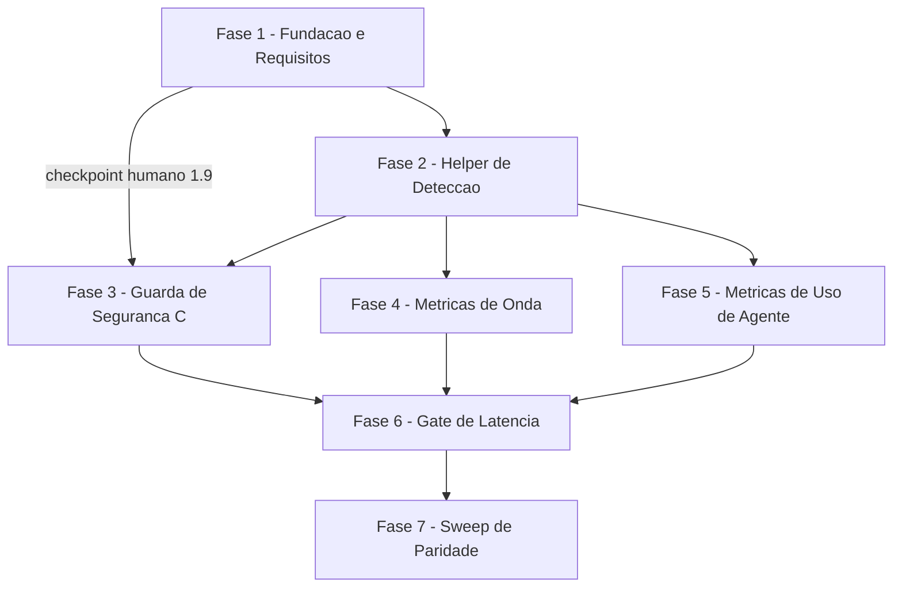

# Tarefas hooks-db-parity - Paridade Backend-Agnostica dos Hooks 00C

Escopo: portar os 3 hooks do runtime 00C (`pretooluse-bash-guard.sh`,
`posttooluse-tool-call-tick.sh`, `posttooluse-agent-usage.sh`) para um helper
unico de deteccao tri-estado (`_hook-active-exec.sh`) agnostico a backend
(`state.json`/`state.db`), fechando a regressao fail-open sob SQLite, sem
regredir o caminho JSON existente.

**Legenda de status:**
- `[ ]` Pendente
- `[~]` Em andamento
- `[x]` Concluido
- `[!]` Bloqueado

**Legenda de criticidade:**
- `[C]` Critico - Impacto financeiro direto ou bloqueante (aqui: guarda de seguranca fail-closed e checkpoints que travam a fase seguinte)
- `[A]` Alto - Funcionalidade essencial (helper de deteccao, hooks de metrica, gate de latencia, sweep de regressao)
- `[M]` Medio - Necessario mas sem urgencia imediata (quantificacoes de fronteira sem impacto de seguranca direto)

---

## FASE 1 - Fundacao e Requisitos (achados do checklist + verificacao empirica SEC-H2)

### 1.1 Verificacao empirica da semantica de timeout do hook PreToolUse (SEC-H2) `[C]` `[x]`

Ref: plan.md §Estrategia de implementacao Fase 0, §SEC-H2 em detalhe; dec-026
(bloqueio humano `block-001` aprovado com mitigacoes)

Bloqueia o fechamento da FASE 3 (guarda de seguranca). Nao produz codigo de
producao — produz evidencia/decisao rastreavel (Constitution VI).

**Resultado (onda-006, dec-039)**: fonte oficial encontrada e verificada
(`code.claude.com/docs/en/agent-sdk/hooks.md` §"Hook timeout") — timeout de
`PreToolUse` NUNCA resulta em "allow" em nenhuma versao do harness. Detalhe em
`research.md §"Resultado Fase 0..."` e `plan.md §SEC-H2`.

- [x] 1.1.1 Buscar fonte rastreavel (doc oficial de hooks do Claude Code) sobre o comportamento do harness quando um hook `PreToolUse` excede o `timeout` configurado (`settings.snippet.json`, `"timeout": 5`) <!-- fonte encontrada: code.claude.com/docs/en/agent-sdk/hooks.md -->
- [x] 1.1.2 Se a doc nao resolver com certeza, construir hook `PreToolUse` sintetico que dorme alem do teto e observar empiricamente se a chamada `Bash` correspondente foi permitida ou negada <!-- N/A: doc resolveu com certeza, verificacao empirica sintetica nao necessaria -->
- [x] 1.1.3 Registrar a evidencia (fonte citada literalmente, ou output observado do experimento) como Decisao auditavel — nunca concluir sem fonte (Constitution VI) <!-- dec-039, score 3 -->
- [x] 1.1.4 Documentar o resultado em `research.md` (nova secao "Resultado Fase 0 — semantica de timeout") e referenciar de volta em `plan.md §SEC-H2`
- [x] 1.1.5 Se o resultado nao confirmar, com fonte, que timeout de `PreToolUse` ja significa `deny`: manter o auto-teto interno fail-closed como default vigente (nenhuma acao adicional alem do que a FASE 2 ja projeta); registrar essa manutencao explicitamente <!-- resultado CONFIRMOU com fonte; auto-teto mantido na FASE 2/3, reclassificado para defesa em profundidade (nao removido) -->

### 1.2 Elevar auto-teto de deteccao a requisito explicito de FR-003 `[A]` `[x]`

Ref: checklists/security.md CHK006 (Gap); spec.md FR-003; plan.md §SEC-H2

- [x] 1.2.1 Editar `spec.md` FR-003 incluindo "estouro do auto-teto interno de deteccao" como classe de falha de mecanismo explicita (ao lado de dependencia ausente/corrompida/erro de leitura)
- [x] 1.2.2 Atualizar `plan.md §SEC-H2` referenciando o FR-003 revisado
- [x] 1.2.3 Revisar o criterio de aceite correspondente em `quickstart.md` (Cenario 7 / novo cenario, se necessario) para cobrir o caminho de estouro do auto-teto <!-- novo Cenario 7b adicionado -->

### 1.3 Requisito rastreavel para a fronteira de confianca de sourcing `[A]` `[x]`

Ref: checklists/security.md CHK007 (Gap); contracts/hook-active-exec.md
§"Ordem MODIFICADA para o helper (SEC-H1)"; dec-026

**Resultado**: novo `spec.md` FR-008 cobre pre-check inline + ordem invertida
de resolucao (`$HOME` antes de `<cwd>`), citando `dec-026`.

- [x] 1.3.1 Adicionar requisito novo (ou subitem de FR existente) em `spec.md` cobrindo a ordem de resolucao invertida (`$HOME` antes de `<cwd>`) e o pre-check inline como MUST rastreavel — hoje so existe no contrato, nao na spec <!-- FR-008 -->
- [x] 1.3.2 Referenciar `dec-026` na spec como origem da decisao de desenho aprovada <!-- FR-008 cita dec-026 -->
- [x] 1.3.3 Validar que `contracts/hook-active-exec.md` cita o novo requisito da spec <!-- referencias a FR-008 adicionadas nas 2 secoes do contrato -->

### 1.4 Quantificar o teto defensivo de state-dirs sondados por invocacao `[A]` `[x]`

Ref: checklists/security.md CHK011 (Ambiguity); contracts/hook-active-exec.md
§SEC-M3

**Resultado**: teto = **100** state-dirs por invocacao, grounded em medicao
empirica real neste repositorio (23 dirs organicos hoje, ~5.2ms/dir, ~119ms
total — ver `research.md §"Achado empirico"`). Achado critico adicional:
essa mesma medicao revela que o custo ORGANICO do scan (nao-adversarial) ja
se aproxima do teto de latencia do gate (150ms/FR-005) — risco distinto do
teto defensivo, levado ao checkpoint 1.9 (CHK022/CHK044).

- [x] 1.4.1 Definir o valor numerico do teto (quantidade maxima de state-dirs sondados por invocacao antes de `MECANISMO_FALHOU`/no-op), com justificativa (medicao empirica ou decisao de produto documentada) <!-- teto=100, medicao empirica real -->
- [x] 1.4.2 Atualizar `contracts/hook-active-exec.md §SEC-M3` com o numero concreto
- [x] 1.4.3 Nota: o valor definido aqui e insumo de CHK022 ({humano}) — confirmacao final do dono do produto acontece no checkpoint 1.9, antes da FASE 3

### 1.5 Reconciliar SC-003/FR-005 com os tetos reais do gate de latencia `[C]` `[x]`

Ref: checklists/security.md CHK012 (Conflict — PRIORITARIO); spec.md
SC-003/FR-005; research.md Decision 3; quickstart.md Cenario 7

**Resultado**: SC-003/FR-005 reescritos separando "orcamento de projeto"
(~30ms/~177ms, referencia de desenho) de "teto do gate" (150ms/400ms, unico
criterio verificavel de pass/fail). `quickstart.md §Cenario 7` idem.

- [x] 1.5.1 Editar `spec.md` separando explicitamente "orcamento de projeto" (~30 ms metricas / ~177 ms guarda — referencia de desenho medida nesta maquina) de "teto de regressao do gate automatizado" (150 ms / 400 ms — criterio de aceite verificavel, 5x o orcamento por ruido de CI) em SC-003 e FR-005
- [x] 1.5.2 Atualizar `quickstart.md §Cenario 7` citando os dois numeros com os rotulos corretos, sem ambiguidade sobre qual "vence" como criterio de aceite
- [x] 1.5.3 Esta tarefa e pre-requisito obrigatorio da FASE 6 (Gate de Latencia) — nenhum gate automatizado deve ser implementado antes desta reconciliacao <!-- satisfeito nesta onda, antes de qualquer codigo da FASE 6 -->

### 1.6 Reconciliar busy_timeout com o orcamento de latencia do hook de metrica `[A]` `[x]`

Ref: checklists/operational.md CHK027 (Ambiguity); contracts/hook-active-exec.md
§SEC-M2; spec.md FR-005

**Resultado**: politica DIFERENCIADA por hook — guarda mantem
`busy_timeout=200ms` (fail-closed pode tolerar a espera, ainda folgado
dentro do teto de gate de 400ms); hooks de metrica usam `busy_timeout=50ms`
(fail-open nao pode blindar 200ms de espera em TODA tool call sem estourar o
teto de gate de 150ms). Ver `contracts/hook-active-exec.md §SEC-M2`.

- [x] 1.6.1 Decidir a politica de contencao do SQLite: esperar o `busy_timeout` inteiro (200 ms, aceitando estouro de latencia sobre o orcamento de ~30 ms) vs desistir cedo e tratar como `indeterminada`/no-op — registrar como Decisao auditavel com justificativa <!-- politica hibrida: 200ms guarda / 50ms metricas -->
- [x] 1.6.2 Atualizar `contracts/hook-active-exec.md §SEC-M2` com a politica escolhida e o valor de `busy_timeout` final
- [x] 1.6.3 Refletir a politica escolhida em `spec.md` FR-004/FR-005 se a redacao atual pressupuser o contrario <!-- FR-004 atualizado com busy_timeout=50ms para hooks de metrica -->

### 1.7 Quantificar a tolerancia de fronteira na contagem de tool calls `[M]` `[x]`

Ref: checklists/operational.md CHK033 (Ambiguity); spec.md SC-002/US2
Acceptance 1; quickstart.md Cenario 12

**Resultado**: tolerancia = **maximo 2 ticks perdidos por onda** (1 na
abertura + 1 no fechamento), derivada do mecanismo real de reset/agregacao
do sidecar em `state-ondas.sh` (nao um numero arbitrario).

- [x] 1.7.1 Definir o numero/regra concreta de tolerancia aceitavel na fronteira open/close de onda (ex: N ticks perdidos no maximo, exatamente na borda) <!-- 2 ticks/onda, 1 por borda -->
- [x] 1.7.2 Atualizar `spec.md` SC-002 com o criterio quantificado
- [x] 1.7.3 Validar o criterio contra `quickstart.md §Cenario 12` (roundtrip real via `state-ondas.sh`)

### 1.8 Definir ordem de rollout entre catalogo e runtime `[M]` `[x]`

Ref: checklists/operational.md CHK043 (Gap); plan.md §Distribuicao

**Resultado**: hooks + helper vivem na MESMA skill (mesmo `cstk
update`/`install`), sem janela hook-novo-vs-helper-ausente. Unico risco
residual (troca de arquivos durante onda aberta) aceito sem mitigacao
adicional — ver `plan.md §Distribuicao` (paragrafo "Ordem de rollout").

- [x] 1.8.1 Documentar em `plan.md §Distribuicao` (ou nota dedicada) o comportamento esperado quando o catalogo (`~/.claude`) e atualizado com os hooks novos enquanto uma onda 00c segue aberta sob versao antiga do runtime
- [x] 1.8.2 Decidir se e necessario aviso/degradacao graciosa adicional, ou se o comportamento atual (best-effort, sem janela de coerencia garantida) e aceitavel — registrar a decisao <!-- aceitavel, sem mitigacao adicional -->
- [x] 1.8.3 Nota: esta tarefa NAO resolve CHK044/CHK045 ({humano}) — apenas fecha o Gap de documentacao; a validacao de impacto operacional fica no checkpoint 1.9

### 1.9 Checkpoint de bloqueio humano pre-implementacao `[C]` `[x]`

Ref: checklists/security.md CHK022 ({humano}); checklists/operational.md
CHK044, CHK045 ({humano})

Bloqueia o inicio da FASE 3 (execute-task da guarda de seguranca). Nao e
tarefa de codigo — e um gate de decisao do dono do produto.

**Status (onda-006)**: as tasks 1.1-1.8 prepararam evidencia e valores
concretos para as 3 perguntas (teto SEC-M3=100 com medicao empirica real;
auto-teto SEC-H2 reclassificado com fonte oficial), mas CHK022 (risco),
CHK044 (impacto operacional) e CHK045 (politica de merge) permanecem
decisoes de apetite de risco/produto que o agente autonomo nao tem
autoridade para fechar sozinho. **Bloqueio humano consolidado registrado:
`block-002` (dec-047)** — onda encerrada em `aguardando_humano`. As 3
subtarefas abaixo permanecem `[ ]` ate a resposta do operador.

- [x] 1.9.1 Confirmar com o dono do produto os valores numericos definidos em 1.4 (teto SEC-M3) e a manutencao/relaxamento do auto-teto SEC-H2 (1.1) — CHK022 <!-- respondido: aceitar-ambos (teto=100 + auto-teto defesa em profundidade), dec-049/block-002 -->
- [x] 1.9.2 Confirmar aceite do impacto operacional de habilitar a guarda fail-closed em projetos hoje desprotegidos (migrados para SQLite, atualmente sem guarda alguma) — CHK044 <!-- respondido: aceitar, dec-049/block-002 -->
- [x] 1.9.3 Confirmar a profundidade de validacao exigida antes do merge de cada fase mergeavel (suite completa `~12 min` vs `--fast`) — CHK045 <!-- respondido: suite-completa, dec-049/block-002 -->
- [x] 1.9.4 Registrar as 3 respostas como Decisao auditavel ANTES de iniciar a FASE 3 <!-- dec-049, score 3, evidencia=human_answer registrada em block-002 -->

---

## FASE 2 - Helper de Deteccao Tri-Estado (`_hook-active-exec.sh`)

### 2.1 Implementar `_hook-active-exec.sh` `[A]` `[x]`

Ref: contracts/hook-active-exec.md (Command `hook_active_exec`); research.md
Decision 1/1.a; plan.md §Estrategia de implementacao Fase 1

Depende de: FASE 1 (1.2, 1.3, 1.4, 1.6 fecham os requisitos que este helper
implementa; 1.1 define o default de auto-teto).

**Resultado (onda-007)**: implementado em
`global/skills/agente-00c-runtime/scripts/_hook-active-exec.sh`. Desvio
documentado da assinatura do contrato (marcado "[PROPOSTA]" no proprio
contrato): SEC-M2 exige `busy_timeout` DIFERENTE por hook (200ms guarda /
50ms metricas), mas a tabela de parametros do contrato so lista `cwd`. Em
vez de inflar a assinatura posicional, o valor e opcional via variavel de
ambiente `HAE_BUSY_TIMEOUT_MS` (default 200 se omitida) — documentado no
cabecalho do arquivo. Validado manualmente com 11+ cenarios sinteticos
(json/sqlite ativo, sem state, corrompido, sqlite3 ausente, precedencia,
teto 100 dirs, terminal) antes da suite formal (2.3).

- [x] 2.1.1 Implementar `hook_active_exec(cwd)` com a assinatura do contrato: exit `0`/`1`/`2`/`3`, stdout tri-estado `<execution_kind>\t<state_dir>\t<backend>` apenas no caso `0`
- [x] 2.1.2 Implementar leitura de `state.json` (`jq`) preservando comportamento atual (garantias G2, G3 — status ativos `em_andamento`/`aguardando_humano`)
- [x] 2.1.3 Implementar leitura de `state.db`: `file:<dir>/state.db?mode=ro` com fallback ao path direto (Decision 1.a), `PRAGMA busy_timeout=<valor de 1.6>;` antes do `SELECT status FROM execution LIMIT 1;`, descartando o eco do pragma no stdout
- [x] 2.1.4 Implementar precedencia G1 (`agente-00c` > `feature-00c`, `LC_ALL=C sort` entre short-names) e G6 (`indeterminada` nao interrompe a varredura dos demais; `ativa` sempre vence)
- [x] 2.1.5 Implementar SEC-M1: nao interpolar o path cru na URI `file:...` — usar `sqlite3 -readonly <path>` ou escapar `?`, `#`, `%` antes de montar a URI <!-- escolhida a opcao de escape (percent-encode %/?/# antes de montar a URI mode=ro); fallback path-direto sem URI -->
- [x] 2.1.6 Implementar SEC-M3: ordenar os short-names antes de sondar, parar no primeiro ativo, aplicar o teto defensivo quantificado em 1.4.1
- [x] 2.1.7 Implementar o default de SEC-H2 definido em 1.1 (auto-teto interno fail-closed, `MECANISMO_FALHOU` se estourar) <!-- auto-teto = mesmo teto SEC-M3 (100 dirs); confirmado em spec.md FR-003 que sao o mesmo mecanismo -->
- [x] 2.1.8 Garantir stderr sempre vazio (suprimir `sqlite3`/`jq` com `2>/dev/null`, traduzir erro para exit `2`) e stdout limpo (nenhum diagnostico fora do caso `0`)
- [x] 2.1.9 Garantir G7 (nenhuma escrita, nenhuma criacao de diretorio/arquivo) e G8 (nao consumir stdin)

### 2.2 Implementar `_resolve_dep` com ordem invertida para o helper `[A]`

Ref: contracts/hook-active-exec.md §"Ordem MODIFICADA para o helper (SEC-H1)
[APROVADA — dec-026]"; §"Pre-condicao de sourcing"

**Status (onda-007)**: DEFERIDO deliberadamente para as tasks 3.1.1/4.1.1/
5.1.1 (FASE 3/4/5) — cada uma delas ja re-referencia "2.2.3"/"2.2.1" como os
passos executados NO MOMENTO do porte de cada hook (ver 3.1.1: "pre-check
inline (2.2.3) -> sourcing via `_resolve_dep` com ordem invertida (2.2.1) ->
chamada de `hook_active_exec`"). Nao ha onde aplicar a cadeia de resolucao
ou o pre-check inline sem editar os 3 arquivos de hook, o que e escopo
explicito da FASE 3-5 (guarda/metricas), nao da FASE 2 (helper isolado).
Implementar aqui preventivamente arriscaria hooks parcialmente portados
antes do checkpoint de cada fase. Subtarefas permanecem `[ ]` ate o porte
real de cada hook.

- [ ] 2.2.1 Implementar a cadeia de resolucao com ordem `<dir-do-hook>/../<rel-path>` -> `$HOME/.claude/skills/agente-00c-runtime/<rel-path>` -> `<cwd>/.claude/skills/agente-00c-runtime/<rel-path>` — invertida SOMENTE para `_hook-active-exec.sh` (demais deps mantem a ordem original, sem regressao)
- [ ] 2.2.2 Usar teste `-r` (legivel) em vez de `-x` (executavel) ao validar o candidato — nota de implementacao do contrato (`_*.sh` do runtime nao sao executaveis)
- [ ] 2.2.3 Implementar o pre-check inline (SEC-H1) nos 3 hooks: testar `[ -f ]`/`[ -d ]` para existencia de `state.json` OU `state.db` sob `<cwd>/.claude/agente-00c-state/` ou `<cwd>/.claude/feature-00c-state/*/` — usando apenas builtins, ANTES de resolver ou sourcear qualquer arquivo

### 2.3 Escrever `tests/test_hook-active-exec.sh` (novo — regra de ouro `--check-coverage`) `[A]` `[x]`

Ref: quickstart.md Cenarios 0, 4, 5, 6, 8, 9, 10; contracts/hook-active-exec.md
garantias G1-G10

**Resultado (onda-007)**: `tests/test__hook-active-exec.sh` (nome com
underscore duplo — convencao 1:1 do `tests/run.sh` para scripts
`_prefixados.sh`, paridade com `test__state-db.sh`/`test__state-read.sh`).
22 scenarios, todos verdes; `--check-coverage` confirma zero orfaos.
Cobertura extra alem do minimo pedido: precedencia com backend MISTO (G1
entre json/sqlite), teto SEC-M3 (dentro e estourando 100 dirs), parametro
opcional `HAE_BUSY_TIMEOUT_MS`, e um canario informal de latencia
(nao-gateante — o gate real e a FASE 6).

- [x] 2.3.1 Cenario: execucao ativa sob `state.json` -> exit `0`, tri-estado correto no stdout
- [x] 2.3.2 Cenario: execucao ativa sob `state.db` -> exit `0` (G2: `state.db` vence sobre `state.json` no mesmo state-dir)
- [x] 2.3.3 Cenario: nenhum state presente (nem `.json` nem `.db`) -> exit `1`, nunca `2` (G4, FR-007)
- [x] 2.3.4 Cenario: `state.db` presente + `sqlite3` ausente do `PATH` -> exit `2`, nunca `1` (G5) — usar `PATH` completo menos `sqlite3` (armadilha conhecida do repo, nao `PATH` minimo)
- [x] 2.3.5 Cenario: `state.db` corrompido (conteudo nao-SQLite) -> exit `2`
- [x] 2.3.6 Cenario: multiplos state-dirs simultaneos (`agente-00c` + 2x `feature-00c`) -> G1 (agente-00c vence; entre feature-00c, menor short-name `LC_ALL=C`)
- [x] 2.3.7 Cenario: status terminal (`concluida`/`abortada`) -> exit `1` (fora de escopo, nao "ativa")
- [x] 2.3.8 Cenario: stderr **sempre vazio** em todos os casos acima (assert explicito, nao so no caso feliz)
- [x] 2.3.9 Cenario: helper nao escreve nem cria arquivo/diretorio algum em nenhum dos casos (G7) — `find` antes/depois comparado
- [x] 2.3.10 Registrar o teste em `tests/run.sh` conforme convencao 1:1 script<->teste; rodar `--check-coverage` para confirmar zero orfaos

---

## FASE 3 - Guarda de Seguranca (`pretooluse-bash-guard.sh`) `[C]`

### 3.1 Portar `pretooluse-bash-guard.sh` para usar o helper `[C]`

Ref: plan.md §Estrategia de implementacao Fase 2; contracts/hook-active-exec.md;
spec.md FR-003, FR-007, US1 (P1)

Depende de: FASE 2 completa + FASE 1 (1.1 SEC-H2 resolvido) + checkpoint
humano 1.9. Criticidade `[C]`: e a guarda fail-closed de seguranca — falha
aqui e regressao de seguranca silenciosa (o proprio bug que a feature
corrige).

- [ ] 3.1.1 Substituir a deteccao inline triplicada (hoje leitura direta de `state.json`) por: pre-check inline (2.2.3) -> sourcing via `_resolve_dep` com ordem invertida (2.2.1) -> chamada de `hook_active_exec`
- [ ] 3.1.2 Tratar exit `0` (ativa): prosseguir ao fluxo existente de resolucao de `bash-guard.sh` e validacao do comando — **inalterado**
- [ ] 3.1.3 Tratar exit `1` (inativa): sair `0` imediatamente, sem tocar em nenhum arquivo (paridade com FR-006, caso de 100% das sessoes manuais)
- [ ] 3.1.4 Tratar exit `2` (indeterminada) ou helper irresolvivel (convencao `127`): emitir `MECANISMO_FALHOU` (`deny`) — nunca stdout vazio nesse caminho
- [ ] 3.1.5 Preservar 100% do caminho `jq`/`state.json` existente intocado (research Decision 2 — piso de nao-regressao para a base instalada hoje)
- [ ] 3.1.6 Aplicar o auto-teto interno de latencia (SEC-H2, default de 1.1) dentro do fluxo do guard, produzindo `MECANISMO_FALHOU` se estourado

### 3.2 Estender `tests/test_pretooluse-bash-guard.sh` `[C]`

Ref: quickstart.md Cenarios 0, 1, 2, 4, 5, 8, 9, 10

- [ ] 3.2.1 Cenario 1: guarda bloqueia sob `state.db` — `permissionDecision:deny`, prefixo `REGRA_VIOLADA:`, linha `outcome:blocked-by-rule` com `detected_execution:feature-00c` em `enforcement-log.jsonl`
- [ ] 3.2.2 Cenario 2: comando permitido segue permitido sob `state.db` — stdout vazio, `outcome:allowed`
- [ ] 3.2.3 Cenario 5: fail-closed sem `sqlite3` — `MECANISMO_FALHOU:`, nunca stdout vazio; usar `PATH` completo menos `sqlite3` (symlinks), nunca `PATH` minimo (memoria de projeto registrada)
- [ ] 3.2.4 Cenario 8: ausencia total de state -> exit `0`, zero arquivo criado, **nunca** `MECANISMO_FALHOU` (fora de escopo != falha de mecanismo)
- [ ] 3.2.5 Cenario 9: `state.db` corrompido -> `MECANISMO_FALHOU` (`deny`)
- [ ] 3.2.6 Cenario 10: execucao terminal (`concluida`/`abortada`) -> comportamento identico ao Cenario 8
- [ ] 3.2.7 Comparacao de paridade: mesmo comando produz a mesma categoria de bloqueio sob `state.json` e sob `state.db` (teste direto lado a lado)
- [ ] 3.2.8 Regressao: suite existente do caminho `state.json` permanece 100% verde apos o porte

---

## FASE 4 - Metricas de Onda (`posttooluse-tool-call-tick.sh`) `[A]`

### 4.1 Portar `posttooluse-tool-call-tick.sh` para usar o helper `[A]`

Ref: plan.md §Estrategia de implementacao Fase 3; spec.md FR-004, US2 (P2)

Depende de: FASE 2 completa.

- [ ] 4.1.1 Substituir deteccao inline por pre-check inline + sourcing + `hook_active_exec`
- [ ] 4.1.2 Tratar exit `0`: gravar tick em `tool-call-ticks.log` do state-dir resolvido, preservando formato/permissao atuais
- [ ] 4.1.3 Tratar exit `1` (inativa): no-op silencioso, exit `0`
- [ ] 4.1.4 Tratar exit `2`/`127` (indeterminada/irresolvivel): no-op silencioso fail-open (FR-004) — nunca stderr, nunca sidecar criado
- [ ] 4.1.5 Aplicar a politica de `busy_timeout` definida em 1.6 (CHK027)

### 4.2 Estender `tests/test_posttooluse-tool-call-tick.sh` `[A]`

Ref: quickstart.md Cenarios 0, 3, 4, 6, 8, 9, 10, 12

- [ ] 4.2.1 Cenario 3: 5 disparos sob `state.db` -> `tool-call-ticks.log` com 5 linhas, permissao `600`
- [ ] 4.2.2 Cenario 4: precedencia `agente-00c` > `feature-00c` e menor short-name, independente do backend de cada state-dir concorrente
- [ ] 4.2.3 Cenario 6: fail-open sem `sqlite3` -> exit `0`, stdout e stderr vazios, nenhum sidecar criado
- [ ] 4.2.4 Cenarios 8/10: sem state ou status terminal -> zero efeito
- [ ] 4.2.5 Cenario 9: `state.db` corrompido -> exit `0`, silencioso, sem sidecar
- [ ] 4.2.6 Cenario 12: roundtrip real via `state-ondas.sh start`/`end` contabiliza N ticks sob backend SQLite (hoje sempre `0` — este e o teste que fecha a regressao ponta a ponta)

---

## FASE 5 - Metricas de Uso de Agente (`posttooluse-agent-usage.sh`) `[A]`

### 5.1 Portar `posttooluse-agent-usage.sh` para usar o helper `[A]`

Ref: plan.md §Estrategia de implementacao Fase 4; spec.md FR-004, US3 (P3)

Depende de: FASE 2 completa.

- [ ] 5.1.1 Substituir deteccao inline por pre-check inline + sourcing + `hook_active_exec`
- [ ] 5.1.2 Tratar exit `0`: gravar linha em `wave-agent-usage.jsonl` do state-dir resolvido, permissao `600`, campos preservados (`agent_id`, `status`, `total_tokens`, `source`)
- [ ] 5.1.3 Tratar exit `1`/`2`/`127`: no-op silencioso fail-open, identico ao tratamento do hook de tick (4.1.3/4.1.4)

### 5.2 Estender `tests/test_posttooluse-agent-usage.sh` `[A]`

Ref: quickstart.md Cenarios 0, 3, 6, 8, 9, 10

- [ ] 5.2.1 Cenario 3: `tool_response` completo sob `state.db` -> 1 linha JSON valida com `agent_id`, `status:completo`, `total_tokens`, `source:live`; permissao `600`
- [ ] 5.2.2 Cenario 6: fail-open sem `sqlite3` -> exit `0`, stdout/stderr vazios, nenhum sidecar
- [ ] 5.2.3 Cenarios 8/9/10: sem state, `state.db` corrompido, ou status terminal -> zero efeito em todos os tres

---

## FASE 6 - Gate de Latencia Automatizado (FR-005/SC-003) `[A]`

### 6.1 Implementar gate de latencia (mediana N=20) nos 3 testes estendidos `[A]`

Ref: quickstart.md Cenario 7; research.md Decision 3; spec.md SC-003/FR-005
(reconciliado em 1.5)

Depende de: 1.5 (CHK012 reconciliado — sem isso o gate nao tem criterio de
aceite nao-ambiguo) e das FASES 3, 4, 5 completas (hooks portados e
estaveis).

- [ ] 6.1.1 Implementar helper de medicao (`perl -MTime::HiRes=time`) com 3 invocacoes de warm-up descartadas + 20 medicoes reais + calculo de mediana
- [ ] 6.1.2 Aplicar teto de **150 ms** para os 2 hooks de metrica (`posttooluse-tool-call-tick.sh`, `posttooluse-agent-usage.sh`)
- [ ] 6.1.3 Aplicar teto de **400 ms** para o hook de guarda (`pretooluse-bash-guard.sh`)
- [ ] 6.1.4 Implementar skip (nunca fail) quando `perl` ou `sqlite3` estiverem ausentes — e gate de performance, nao de disponibilidade de ferramenta
- [ ] 6.1.5 Integrar o gate nos 3 arquivos de teste ja estendidos (3.2, 4.2, 5.2)

---

## FASE 7 - Prevencao de Regressao (Sweep de Paridade Estatica) `[A]`

### 7.1 Estender `tests/test_state-parity-sweep.sh` para cobrir `hooks/` `[A]`

Ref: quickstart.md Cenario 11; research.md Decision 6; dec-022

Depende de: FASES 2-6 completas (codigo final estabilizado antes de fechar a
varredura de regressao).

- [ ] 7.1.1 Adicionar `global/skills/agente-00c-runtime/hooks/*.sh` (os 3 hooks) ao laco da varredura estatica — hoje limitado a `"$R"/*.sh "$REPO_ROOT/cli/lib/00c-bootstrap.sh"` (`tests/test_state-parity-sweep.sh` L230-231), exatamente a lacuna que deixou a regressao original passar
- [ ] 7.1.2 Expandir `_static_allowlist()` se `_hook-active-exec.sh` precisar de entrada `codigo-real` (unica mencao legitima a `state.db`/`sqlite3` fora da camada de estado transacional) — com classificacao e justificativa no mesmo commit (CHK016)
- [ ] 7.1.3 Validar que os 3 hooks portados **nao** aparecem na allowlist — nao devem ter acesso direto a `state.json`/`state.db` fora do helper
- [ ] 7.1.4 Cenario negativo: introduzir deliberadamente, num hook, uma construcao de path `"$dir/state.json"` fora da allowlist e confirmar que o sweep falha com diagnostico apontando arquivo e linha

---

## Matriz de Dependencias

## Resumo Quantitativo

| Fase | Tarefas | Subtarefas | Criticidade |
|------|---------|------------|-------------|
| 1 - Fundacao e Requisitos | 9 | 30 | 3x [C], 4x [A], 2x [M] |
| 2 - Helper de Deteccao | 3 | 22 | 3x [A] |
| 3 - Guarda de Seguranca | 2 | 14 | 2x [C] |
| 4 - Metricas de Onda | 2 | 11 | 2x [A] |
| 5 - Metricas de Uso de Agente | 2 | 6 | 2x [A] |
| 6 - Gate de Latencia | 1 | 5 | 1x [A] |
| 7 - Sweep de Paridade | 1 | 4 | 1x [A] |
| **Total** | **20** | **92** | 5x [C], 13x [A], 2x [M] |

## Escopo Coberto

| Item | Descricao | Fase |
|------|-----------|------|
| FR-001, FR-002, FR-007 | Deteccao tri-estado agnostica a backend via helper novo | 2 |
| FR-003, SC-001, US1 (P1) | Guarda fail-closed sob SQLite (`pretooluse-bash-guard.sh`) | 3 |
| FR-004, US2 (P2), US3 (P3) | Metricas fail-open sob SQLite (tick + agent-usage) | 4, 5 |
| FR-005, SC-003 | Gate automatizado de latencia (mediana N=20, teto 150/400ms) | 6 |
| SC-002 | Roundtrip do orcamento de onda sob SQLite (contador de tool calls) | 4 |
| SC-004, FR-006 | Nao-interferencia em sessao manual (pre-check inline, zero efeito colateral) | 2, 3, 4, 5 |
| CHK006, CHK007, CHK011, CHK012, CHK027, CHK033, CHK043 | Fechamento dos 6 achados abertos do checklist (Gap/Ambiguity/Conflict) | 1 |
| CHK022, CHK044, CHK045 | Checkpoint de bloqueio humano antes da implementacao da guarda | 1 |
| SEC-H1 | Mitigacoes de sourcing (pre-check inline + ordem invertida `$HOME`><cwd>) | 2 |
| SEC-H2 | Verificacao empirica da semantica de timeout + auto-teto fail-closed | 1, 2, 3 |
| SEC-M1, SEC-M2, SEC-M3 | Mitigacoes de URI, busy_timeout e teto de varredura | 1, 2 |
| Decision 6 (research.md) | Extensao do sweep de paridade estatica a `hooks/` (prevencao de regressao) | 7 |

## Escopo Excluido

| Item | Descricao | Motivo |
|------|-----------|--------|
| Reducao da triplicacao do `jq` pre-existente | Os 3 hooks ja referenciam `jq` triplicado hoje, fora desta feature | plan.md §Constitution Check: "divida tecnica herdada, nao regride nem agrava" — fora do escopo declarado |
| Mudanca em `cli/lib/hooks.sh` ou no mecanismo de distribuicao | Nenhum arquivo novo provisionado por `apply_guard_hooks()`; os 3 hooks continuam os mesmos arquivos | plan.md §Distribuicao: helper novo vive no catalogo da skill, resolvido pela cadeia de candidatos ja existente |
| Alteracao de `settings.snippet.json` (matchers/timeouts) | Nenhum novo hook registrado, nenhum timeout alterado | plan.md §Project Structure: arquivo marcado INALTERADO |
| Assinatura criptografica de artefato para mitigar SEC-H1 residual | Reduziria a superficie alem do que as mitigacoes de sourcing ja cobrem | plan.md §SEC-H1: "reduzir isso alem deste ponto exigiria assinatura de artefato, fora do escopo desta feature" |
| Migracao de `state.json` para `state.db` em si (backend switch) | Feature consome o cutover ja existente (`state-backend-config`), nao o implementa | fora do escopo — feature trata paridade de LEITURA dos hooks, nao a escrita/migracao do backend |
| Novo schema ou coluna em `state.db` | Nenhuma mudanca de schema; leitura via `SELECT status FROM execution LIMIT 1` sobre tabela existente | plan.md §Technical Context: "nenhum schema novo" |
