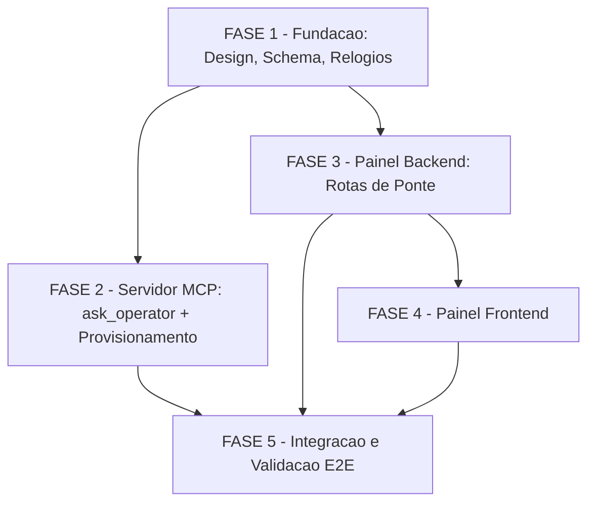

# Tarefas Human Bridge (Intervencoes)

Escopo: fila de intervencoes humanas ("Human Bridge") que permite a um agente
autonomo (`agente-00c`/`feature-00c`) perguntar algo ao operador via painel
web e bloquear ate a resposta chegar — tool MCP `ask_operator` (superficie 1,
servidor `cstk-state`) + fronteira HTTP `/api/v1/bridge/*` (painel) + tela
`Interventions.tsx` (cliente web). Cobre as DUAS metades do monorepo:
toolkit (`mcp/`, `cli/`, `plugins/`, `tests/`) e painel (`panel/`).

**Legenda de status:**
- `[ ]` Pendente
- `[~]` Em andamento
- `[x]` Concluido
- `[!]` Bloqueado

**Legenda de criticidade:**
- `[C]` Critico - Impacto financeiro, regulatorio ou de seguranca
- `[A]` Alto - Funcionalidade core sem a qual o sistema nao opera
- `[M]` Medio - Necessario mas pode ser adiado sem impacto imediato

---

## FASE 1 - Fundacao: Decisao de Design, Schema de Dados e Relogios

### 1.1 Reconciliar contrato de degradacao com as rotas de escrita (resolve CHK002) `[A]`

Ref: `docs/specs/human-bridge/checklists/api.md` CHK002 ·
`docs/specs/human-bridge/contracts/panel-bridge-api.md` §3/§3.1

Gap do checklist: o principio geral de degradacao ("`bridge.db`
ausente/ilegivel responde `200` com `meta.degraded=true`, nunca `5xx` por
condicao de dado", contrato §3) nao estava reconciliado, de forma explicita,
com as rotas de ESCRITA (`create`/`answer`), cujo proprio proposito e
persistir um dado que nao existiria para devolver.

- [x] 1.1.1 Normalizar o checkbox de CHK002 em `checklists/api.md` de
      `- [Gap]` para `- [ ]` (formato que `review-task/scripts/metrics.sh`
      reconhece) <!-- feito nesta onda, verificado: metrics.sh reporta
      pending=1/20 apos a normalizacao -->
- [x] 1.1.2 Escrever a decisao de design em `contracts/panel-bridge-api.md`
      §3.1: `create`/`answer` seguem a MESMA forma `200 + meta.degraded=true`
      (nunca `5xx` dedicado); `data: null`/`data.questionId` omitido quando
      degradado; FR-021 e satisfeito expandindo o que o cliente MCP
      (`bridge/client.ts`) trata como "falha desta chamada" — inclui tanto
      falha de rede/timeout/5xx quanto resposta `200` com
      `meta.degraded===true`
- [x] 1.1.3 Atualizar a tabela de respostas de `answer` (§7) e o bloco
      `Response 201` de `create` (§4) para citar o caso degradado
      explicitamente
- [x] 1.1.4 Re-rodar `review-task/scripts/metrics.sh checklists/api.md` e
      confirmar `pending=1` antes / e que o item normalizado nao regrediu a
      contagem de `done` dos outros 19 itens

### 1.2 Schema `interventions` em `bridge.db` (`panel/apps/server/src/db/bridge.ts`) `[A]`

Ref: `docs/specs/human-bridge/data-model.md` §"Entity: Intervention" ·
`docs/specs/human-bridge/plan.md` (Project Structure, `db/bridge.ts` NOVO) ·
`docs/specs/human-bridge/contracts/panel-bridge-api.md` §11.4

Conexao **separada** de `open.ts` (que fica INTOCADO — corpus continua
`readonly:true` + `query_only=1`). `db/bridge.ts` e a UNICA conexao
read-write do processo.

- [x] 1.2.1 Criar `panel/apps/server/src/db/bridge.ts` com `better-sqlite3`
      apontando para `~/.claude/cstk/bridge.db` (override `CSTK_BRIDGE_DB`,
      Decision 2 de `research.md`), instancia distinta de `open.ts`
- [x] 1.2.2 Definir DDL da tabela `interventions` com as 13 colunas
      `snake_case` da tabela de `data-model.md` (`question_id` PK,
      `project_path`, `project`, `short_name`, `execution_kind`, `kind` CHECK
      `IN ('choice','confirm','text')`, `question`, `options_json`,
      `default_value`, `resolution` CHECK `IN ('answered','declined')`,
      `applied_value`, `untrusted_text`, `expires_at`, `created_at`,
      `resolved_at`)
- [x] 1.2.3 Criar os dois indices propostos: `idx_interventions_open ON
      interventions(expires_at) WHERE resolution IS NULL` e
      `idx_interventions_created ON interventions(created_at DESC)`
- [x] 1.2.4 Aplicar permissoes de arquivo best-effort `700` (diretorio) /
      `600` (arquivo) no mesmo idioma de `recall_normalize_db_perms`
      (`cli/lib/recall.sh:750-758`) — nunca bloqueia o caller (§11.4)
- [x] 1.2.5 Escrever teste vitest cobrindo: conexao separada de `open.ts`
      (nenhuma query de bridge passa pelo handle do corpus), DDL aplicado
      (CHECK constraints rejeitam `kind`/`resolution` fora do enum),
      permissao de arquivo aplicada

### 1.3 Faixa derivada de timeouts e validacao no boot (R-CLOCK-4/5/7) `[C]`

Ref: `docs/specs/human-bridge/contracts/mcp-tool-ask-operator.md` §4
(R-CLOCK-1 a R-CLOCK-7) · `docs/specs/human-bridge/research.md` Decision 7

Criticidade `[C]`: e a defesa temporal do achado F1 (HIGH) do gate
`owasp-security` — piso baixo demais permite ao agente colher o proprio
`default_value` deixando trilha que parece consulta humana.

- [x] 1.3.1 Definir as duas constantes nomeadas e SEPARADAS em
      `mcp/state-server/src/tools/ask_operator.ts` (ou modulo de config
      dedicado): `ASK_MIN_TIMEOUT_MS = 60000` (R-CLOCK-7) e
      `CLOCK_SAFETY_MARGIN_MS = 60000` (R-CLOCK-2) — MUST NOT compartilhar
      `const` nem comentario "mesmo valor de", mesmo sendo numericamente
      iguais (motivos independentes, ver research.md Decision 7)
- [x] 1.3.2 Implementar `parseAskTimeoutMs(clientTimeoutMs, requested)`
      espelhando a politica **VERIFICADA** de `parseElicitTimeoutMs`
      (`collect_optins.ts:196-205`): faixa `[ASK_MIN_TIMEOUT_MS,
      clientTimeoutMs - CLOCK_SAFETY_MARGIN_MS]`; valor fora da faixa cai no
      **default** (`max` da faixa), nunca clampado para a borda
- [x] 1.3.3 Implementar validacao no boot (`index.ts` ou modulo de config):
      recusar subir quando a combinacao for **explicitamente ilegal**
      (ex.: `CSTK_CLIENT_TOOL_TIMEOUT_MS` que produz `max < min`); quando a
      env var estiver **ausente**, assumir `clientTimeoutMs = 300000`
      (teto `240000`) e emitir **1** linha de aviso em stderr — nunca
      recusar subir por variavel opcional ausente
- [x] 1.3.4 Escrever teste (node:test, `mcp/state-server/test/`) cobrindo:
      faixa derivada correta para `clientTimeoutMs=300000` ->
      `[60000,240000]`; valor fora da faixa cai no default (nao clampa);
      combinacao ilegal recusa subir; env ausente assume `300000` +
      emite aviso; as duas constantes nunca compartilham identidade
      (teste de regressao textual/estrutural, nao so numerico)

---

## FASE 2 - Servidor MCP: Tool `ask_operator`, Cliente HTTP e Provisionamento

### 2.1 `bridge/client.ts` — unico arquivo com `fetch()` no servidor MCP `[A]`

Ref: `docs/specs/human-bridge/plan.md` (Project Structure,
`bridge/client.ts` NOVO) · `docs/specs/human-bridge/contracts/panel-bridge-api.md`
§4/§5/§11.5 · `docs/specs/human-bridge/research.md` Decision 6

- [x] 2.1.1 Implementar `createIntervention()` — `POST
      /api/v1/bridge/interventions`, timeout `BRIDGE_CREATE_TIMEOUT_MS =
      5000` via `AbortSignal.timeout(5000)`; tratar `meta.degraded===true`
      na resposta `200` como equivalente a falha de conexao para fins de
      outcome `unavailable` (decisao 1.1.2)
- [x] 2.1.2 Implementar `pollIntervention()` — `GET
      /api/v1/bridge/interventions/:questionId`, cadencia
      `BRIDGE_POLL_INTERVAL_MS = 1500`; `404` mapeia para `failed` (nao
      `unavailable` — o painel respondeu, so nao conhece o id, contrato §5)
- [x] 2.1.3 Implementar mapper `camelCase` (HTTP) <-> `snake_case` (envelope
      MCP/state) — unico lugar do servidor MCP que faz essa conversao
      (Convencoes de Borda, `plan.md`)
- [x] 2.1.4 Implementar guard de `CSTK_PANEL_URL` fora de loopback (§11.5):
      recusar (outcome `failed` + 1 linha em stderr) host que nao seja
      `127.0.0.1`/`::1`/`localhost` sem uma segunda variavel de opt-in
      explicito; `http://` para host nao-loopback MUST NOT ser aceito em
      nenhuma hipotese
- [x] 2.1.5 Escrever testes (node:test) mockando `fetch`: create com sucesso
      (201), create degradado (200+degraded=true) -> tratado como falha,
      create com timeout/5xx -> `unavailable`, poll 404 -> `failed`, poll
      `expired` -> `timeout`, guard de loopback rejeita host remoto sem
      opt-in

### 2.2 `tools/ask_operator.ts` — 9a `registerTool` `[A]`

Ref: `docs/specs/human-bridge/contracts/mcp-tool-ask-operator.md` §1/§2/§3/§5/§8

- [x] 2.2.1 Implementar schema Zod do request (`session_id`, `question`,
      `kind`, `options` so em `choice`, `default_value`, `timeout_ms`
      opcional) — schema PROPRIO, espelhado, sem importar `shared-types` do
      painel (repos/instalacoes distintas, Convencoes de Borda)
- [x] 2.2.2 Implementar resolucao de `session_id` reusando
      `session/resolve.ts` (fail-closed, `SESSION_MISMATCH`) — roteamento
      **exclusivamente** pelo id da PROPRIA chamada, nunca `execution_id`
- [x] 2.2.3 Implementar o loop principal: `createIntervention()` ->
      se falhar/degradado, `outcome=unavailable`; senao `pollIntervention()`
      em loop ate `answered`/`declined`/`expired` (mapeia para `timeout`)
      ou o teto do SERVIDOR (`MCP_ASK_TIMEOUT_MS`) estourar
      (`outcome=timeout` via excecao — R-CLOCK-3, o servidor desiste
      ANTES do cliente)
- [x] 2.2.4 Implementar C-4: aplicar `default_value` em TODO desfecho
      `!= answered`, e C-1: nenhum desfecho (`declined`/`timeout`/
      `unavailable`/`failed`) e erro de tool — todos retornam
      `outcome:"accepted"` com o desfecho dentro de `result`
      (`channel:"panel"`, C-5)
- [x] 2.2.5 Registrar como 9a tool em
      `mcp/state-server/src/index.ts:228..375` (hoje 8) —
      `mcp__cstk-state__ask_operator`
- [x] 2.2.6 Escrever testes (node:test): os 5 outcomes do mapeamento
      sinal->desfecho (§5), C-4 aplicado em todos os nao-`answered`, C-1
      (nenhum retorno de erro de tool), `SESSION_MISMATCH` fail-closed

### 2.3 `audit/log.ts` — source `mcp-ask-operator` `[M]`

Ref: `docs/specs/human-bridge/contracts/mcp-tool-ask-operator.md` §7
(trilha de auditoria)

- [x] 2.3.1 Adicionar `source: "mcp-ask-operator"` ao módulo de audit log,
      reusando `REASON_MAX_BYTES = 2048` já existente (`audit/log.ts:66`) —
      nenhuma constante nova
- [x] 2.3.2 Garantir best-effort (nunca lança) no mesmo contrato de
      `appendOptinDecisionRecord`
- [x] 2.3.3 Escrever teste confirmando 1 linha por resposta persistida e
      que falha do audit log não propaga exceção

### 2.4 Persistencia `.operator_answers[]` (sem script POSIX novo) `[A]`

Ref: `docs/specs/human-bridge/data-model.md` §"Entity: OperatorAnswer" ·
`docs/specs/human-bridge/contracts/mcp-tool-ask-operator.md` §7

- [x] 2.4.1 Implementar a escrita via a primitiva GENERICA já existente —
      `state-rw.sh set --state-dir <SD> --field '.operator_answers' --value
      <json-array>` invocada de `ask_operator.ts` via `runHelper` (reuso do
      padrão de `runtime/exec.ts`) — MUST NOT criar script POSIX novo nem
      editar `_state-rw-db.sh`
- [x] 2.4.2 Montar o array com os 8 campos do contrato: `question_id`,
      `channel` (`"panel"`, C-5), `outcome`, `applied_value`, `recorded_at`,
      `reason`, `untrusted_text`, `effective_timeout_ms`
- [x] 2.4.3 Garantir gravação ANTES do retorno da tool em TODO desfecho
      (C-4) — nunca trava, nunca fica sem rastro
- [x] 2.4.4 Escrever teste confirmando: shape com os 8 campos, escrita
      antes do retorno, e que sob backend SQLite cai em
      `execution.extra_fields` sem exigir edição em `_state-rw-db.sh`
      (mesmo precedente de `.suggestions`)

### 2.5 Auditoria da janela efetiva — finding `ask-operator-short-window` `[C]`

Ref: `docs/specs/human-bridge/contracts/mcp-tool-ask-operator.md` §7
R-AUDIT-1 · `docs/specs/human-bridge/data-model.md` §"Auditoria da janela
efetiva"

Segundo anel de defesa do achado F1 (HIGH) do gate `owasp-security`
(primeiro anel = piso `ASK_MIN_TIMEOUT_MS`, tarefa 1.3).

- [x] 2.5.1 Implementar em `plugins/cstk/skills/review-task/` a checagem:
      para toda entrada de `.operator_answers[]` com `outcome="timeout"`
      **e** `effective_timeout_ms < 60000`, emitir finding
      `ask-operator-short-window` (a conjunção das duas condições, nunca
      cada uma isoladamente — `timeout` com janela adequada é desfecho
      legítimo; janela curta com `answered` é trilha verdadeira)
- [x] 2.5.2 Aplicar regras de leitura idênticas a `.optin_responses[]`:
      R-1 (precedência do maior `recorded_at`), R-2 (`unavailable`/`failed`
      são NÃO-terminais; `answered`/`declined`/`timeout` são terminais)
- [x] 2.5.3 Escrever teste cobrindo a matriz 2x2 (outcome x janela) e
      confirmando que só a conjunção dispara o finding

### 2.6 `cli/lib/mcp.sh` — `timeout` + `env` de UMA única fonte `[C]`

Ref: `docs/specs/human-bridge/contracts/mcp-tool-ask-operator.md` §9
(Provisionamento) · R-CLOCK-5 · `docs/specs/human-bridge/plan.md`
"Sequenciamento obrigatorio" item 3

**Sequenciamento obrigatório**: esta tarefa e a 2.7 (cobertura da 9a tool)
sao dois dos tres acoplamentos que a `plan.md` proibe fazer fora de ordem —
`timeout` e `CSTK_CLIENT_TOOL_TIMEOUT_MS` MUST entrar juntos, do mesmo
valor-fonte, no MESMO commit.

- [x] 2.6.1 No heredoc `MCPJSON` (`cli/lib/mcp.sh:995-1005`), introduzir
      **uma** variável de shell `_mci_client_timeout_ms` (default `300000`)
      interpolada nos DOIS lugares: `"timeout": $_mci_client_timeout_ms`
      (relógio do cliente) e `"env": {"CSTK_CLIENT_TOOL_TIMEOUT_MS":
      "$_mci_client_timeout_ms"}` (para o servidor)
- [x] 2.6.2 Confirmar que o launcher (`mcp-launch.sh:276-279`) propaga a env
      var sem trabalho adicional — `exec node` preserva o ambiente herdado
      (já **VERIFICADO**; esta subtarefa é validação, não implementação)
- [x] 2.6.3 Atualizar `tests/test_mcp.sh`: `cstk mcp install` gera
      `.mcp.json` com `timeout` e `env.CSTK_CLIENT_TOOL_TIMEOUT_MS`
      numericamente idênticos, para o valor default e para um override

### 2.7 Cobertura da 9a tool nos TRES sitios juntos `[A]`

Ref: `docs/specs/human-bridge/contracts/mcp-tool-ask-operator.md` §9
(Cobertura) · `docs/specs/human-bridge/plan.md` "Sequenciamento
obrigatorio" item 2

**Sequenciamento obrigatório**: os três sítios MUST entrar na MESMA
tarefa/commit — faltando qualquer um, a tool nova fica sem cobertura na
superfície nova.

- [x] 2.7.1 `tests/test_orchestrator-allowlist-guard.sh:323` — atualizar
      `_required` de 8 para 9 tools (adicionar `ask_operator`)
- [x] 2.7.2 `plugins/cstk/agents/agente-00c-orchestrator.md:4` —
      adicionar `mcp__cstk-state__ask_operator` ao frontmatter `tools:`
- [x] 2.7.3 `plugins/cstk/agents/agente-00c-feature-orchestrator.md:4` —
      adicionar `mcp__cstk-state__ask_operator` ao frontmatter `tools:`
      (mesma linha desta prórpia definição de agente)
- [x] 2.7.4 Rodar `tests/test_orchestrator-allowlist-guard.sh` e confirmar
      que os dois orquestradores E a allowlist citam as 9 tools de forma
      consistente (nenhum dos três sítios divergindo dos outros dois)

---

## FASE 3 - Painel Backend: Rotas de Ponte

### 3.1 `routes/bridge.ts` (4 rotas) e afrouxamento do `readonly-check.sh` — MESMO COMMIT `[C]`

Ref: `docs/specs/human-bridge/contracts/panel-bridge-api.md` §4/§5/§6/§7/
§11.1/§11.2/§11.3/§11.4/§11.6 · `docs/specs/human-bridge/plan.md`
"Sequenciamento obrigatorio" item 1 (constitution, "nunca antes")

Criticidade `[C]`: toca o Princípio I (Read-Only sobre o Corpus, NON-NEG) do
painel — a condição de contorno é literal na constitution: o gate MUST ser
estreitado no MESMO commit do primeiro código de `bridge/`, nunca antes
(deixaria o commit legítimo reprovado) nem depois (janela em que o painel
inteiro fica sem o gate).

- [x] 3.1.1 Implementar `POST /api/v1/bridge/interventions` (criar): gerar
      `questionId` CSPRNG no painel, `expiresAt = now + timeoutMs`
      (`timeoutMs` é a janela EFETIVA já resolvida pelo MCP — o painel MUST
      NOT re-derivar/re-clampar), validação Zod na borda (`400` se
      inválido), resposta degradada `200+meta.degraded=true` per §3.1
      quando `bridge.db` está indisponível (decisão 1.1)
- [x] 3.1.2 Aplicar o pipeline strip-de-controle -> `secrets-filter.sh
      scrub` (UMA vez) -> truncamento por budget de bytes em `question` e
      cada elemento de `options[]` NA CRIAÇÃO (§11.3 — mesma disciplina já
      aplicada a `untrusted_text`, corrigindo a assimetria identificada
      pelo gate `owasp-security`)
- [x] 3.1.3 Implementar `GET /api/v1/bridge/interventions/:questionId`
      (polling): `state` DERIVADO na leitura (nunca coluna, nunca `UPDATE`
      disparado por `GET` — `resolution IS NOT NULL` -> `answered|declined`;
      `now >= expires_at` -> `expired`; senão `open`); `404` se
      `questionId` desconhecido
- [x] 3.1.4 Implementar `GET /api/v1/bridge/interventions` (fila):
      paginação obrigatória via `safeParsePagination` (reuso), query params
      `state`/`project`/`limit`/`offset` (default `state=open`), ordenação
      `createdAt ASC`, `waitingMs` derivado (`now - createdAt`, nunca
      coluna), `reachable=false` quando `projectPath` não existe mais em
      disco (linha continua visível, ação de responder desabilitada)
- [x] 3.1.5 Implementar `POST
      /api/v1/bridge/interventions/:questionId/answer` (responder):
      idempotência via invariante de banco — `UPDATE interventions SET
      resolution=?, applied_value=?, untrusted_text=?, resolved_at=? WHERE
      question_id=? AND resolution IS NULL AND expires_at > ?`, `changes
      === 1` -> `200`, `changes === 0` -> `409` (cobre as duas corridas —
      dupla resposta e resposta tardia — sem `SELECT`-then-`UPDATE`);
      validação de `value` contra `options`/`yes|no` no SERVIDOR (FR-005,
      mesmo que a UI já restrinja); `text` só em `kind="text"`, pipeline
      strip -> scrub -> truncamento a 2048 bytes na ENTRADA; resposta
      degradada `200+meta.degraded=true` quando `bridge.db` indisponível
      no momento do UPDATE (decisão 1.1, distinto de `409`)
- [x] 3.1.6 Validar `:questionId` na borda contra formato estrito
      (`^[A-Za-z0-9_-]{22,64}$`, §11.6) antes de qualquer uso — é parâmetro
      de SQL via placeholder, mas também compõe caminho de URL
- [x] 3.1.7 Implementar o mapper `snake_case` (bridge.db) <-> `camelCase`
      (HTTP) em `routes/bridge.ts`, mesmo idioma de `routes/tasks.ts`
      (`executionId: r.execution_id`, etc.) — sem ORM/auto-mapping
- [x] 3.1.8 Registrar `await v1.register(bridgeRoutes)` em
      `panel/apps/server/src/index.ts:74-92`
- [x] 3.1.9 Afrouxar `panel/scripts/readonly-check.sh` para reconhecer a
      exceção da Ponte (escrita confinada a `bridge.db` em conexão
      separada) — **NO MESMO COMMIT** desta tarefa (3.1.1-3.1.8), nunca em
      commit separado. **Achado registrado na onda-008 (task 1.2)**:
      `panel/apps/server/test/lib/readonly.test.ts` é um SEGUNDO gate
      (vitest, dentro de `npm test`/CI) que duplica a mesma varredura de
      `apps/server/src` inteiro e que a constitution/tasks.md não citam —
      ele já recebeu uma exceção NOMEADA e restrita a `db/bridge.ts` (única
      linha `if (file.endsWith(...db/bridge.ts...)) continue;`) para não
      quebrar `npm test` a partir da task 1.2. Esta tarefa deve *também*
      estender/generalizar essa exceção (ou substituí-la por algo equivalente
      a `db/queries/**`) quando `routes/bridge.ts` landar, mantendo os dois
      gates (`readonly-check.sh` + `readonly.test.ts`) sincronizados — hoje
      eles têm escopos ligeiramente diferentes e correm o risco de divergir
      se só um for atualizado aqui
- [x] 3.1.10 Escrever testes vitest para as 4 rotas: caminho feliz, os 3
      casos de erro documentados por rota, resposta degradada (`200+
      meta.degraded`) simulando `bridge.db` indisponível, idempotência do
      `answer` sob concorrência simulada (duas chamadas, uma `200` uma
      `409`), scrub aplicado a `question`/`options`/`text`

### 3.2 `lib/envelope.ts` — `wrapBridge()` `[A]`

Ref: `docs/specs/human-bridge/research.md` Decision 8 ·
`docs/specs/human-bridge/contracts/panel-bridge-api.md` §3

- [x] 3.2.1 Implementar `wrapBridge<T>(data, opts, bridgeDbPath, bridgeDb)`
      em `panel/apps/server/src/lib/envelope.ts`, preservando a FORMA do
      envelope padrão (`{ data, meta: { degraded, reason, freshness,
      schemaVersion } }`) sem chamar `wrap()` nem abrir `knowledge.db`
      (acoplaria a Ponte ao corpus, violando FR-017)
- [x] 3.2.2 Computar `freshness` a partir do `mtime` de `bridge.db` +
      timestamp mais recente por linha — **nota de inconsistência
      resolvida**: `research.md`/contrato §3 mencionam `max(updated_at)`,
      mas o DDL real de `data-model.md` não tem coluna `updated_at`; usar
      `MAX(created_at, resolved_at)` por linha (as duas colunas que de
      fato existem), agregado com `MAX(...)` entre linhas
- [x] 3.2.3 Escrever teste vitest confirmando que `wrapBridge()` nunca abre
      `knowledge.db` (nenhum handle do corpus é tocado) e que `freshness`
      reflete `mtime`/timestamps reais de `bridge.db`

### 3.3 CORS escopado para `/bridge/*` e defesas CSRF `[A]`

Ref: `docs/specs/human-bridge/contracts/panel-bridge-api.md` §11.1/§11.2 ·
`docs/specs/human-bridge/plan.md` achado F2 (MEDIUM)

- [x] 3.3.1 Registrar um escopo Fastify dedicado para o prefixo
      `/bridge/*` com `cors` configurado `methods: ['GET', 'POST',
      'OPTIONS']` — MUST NOT alargar o `methods` GLOBAL
      (`index.ts:43-46`, hoje `['GET', 'OPTIONS']`), mesmo idioma do
      rate-limit escopado já existente (`routes/search.ts:49`)
- [x] 3.3.2 Manter `origin` restrito à allowlist existente também no
      escopo `/bridge/*` — MUST NOT usar `origin: true`/`'*'`/reflexão do
      header `Origin` em nenhuma circunstância (§11.2)
- [x] 3.3.3 Implementar rejeição `415` para `Content-Type` !=
      `application/json` nas rotas de mutação (defesa em profundidade
      CWE-352 — corpo `text/plain`/form-urlencoded não dispara preflight)
- [x] 3.3.4 Implementar validação SHOULD do header `Host` contra
      `127.0.0.1`/`localhost` no escopo `/bridge/*` (mitigação DNS
      rebinding)
- [x] 3.3.5 Escrever teste vitest: `POST` de origem fora da allowlist é
      rejeitado; `Content-Type` não-JSON recebe `415`; preflight de
      `/bridge/*` aceita `POST` (regressão do achado F2 — a própria UI em
      dev conseguiria responder)

### 3.4 `shared-types` — DTOs da Ponte e paridade `[A]`

Ref: `docs/specs/human-bridge/plan.md` "Convencoes de Borda" ·
`docs/specs/human-bridge/contracts/panel-bridge-api.md` §2

- [x] 3.4.1 Adicionar os DTOs `camelCase` da Ponte (`Intervention`,
      `CreateInterventionRequest`, `AnswerInterventionRequest`, etc.) em
      `panel/packages/shared-types/src/`, com schema Zod para validação
      dos DOIS lados (request no painel, response no cliente web)
- [x] 3.4.2 Confirmar que o servidor MCP MANTÉM schema Zod próprio,
      espelhado (`ask_operator.ts`, tarefa 2.2.1) — MUST NOT importar
      `shared-types` (repos/instalações distintas)
- [x] 3.4.3 Escrever teste smoke comparando os dois schemas Zod (painel
      `shared-types` vs. servidor MCP) campo-a-campo sobre um payload REAL
      (não mock) — é o cenário que detecta divergência `snake_case` vs.
      `camelCase` introduzida por refactor futuro (mesmo padrão exigido
      pela seção "Paridade de tipos compartilhados" desta skill)

---

## FASE 4 - Painel Frontend

### 4.1 `lib/api.ts` — `mutateApi()` `[A]`

Ref: `docs/specs/human-bridge/contracts/panel-bridge-api.md` §8 ·
`docs/specs/human-bridge/checklists/api.md` CHK014/CHK015/CHK016

- [x] 4.1.1 Implementar `mutateApi()` em `apps/web/src/lib/api.ts`,
      SEM nenhuma camada de ETag/cache (nunca ler/gravar `bodyCache`, nunca
      injetar `If-None-Match`) — `fetchApi()` existente MUST NOT ser
      reusado para mutação (aplicaria ETag/cache incondicionalmente,
      colidindo com FR-016/SC-006)
- [x] 4.1.2 Invalidar explicitamente o cache da fila após sucesso —
      `invalidateEtag('/bridge/interventions')` (função já existente,
      `api.ts:117`)
- [x] 4.1.3 Escrever teste de ROUNDTRIP REAL (não mock) contra um servidor
      de teste de fato — CHK016: este defeito de cache não aparece com
      mock (sem `localStorage` nem ETag simulados); é por isso que o
      quickstart exige chamada real (Cenário 1)

### 4.2 `lib/hooks-bridge.ts` `[A]`

Ref: `docs/specs/human-bridge/contracts/panel-bridge-api.md` §9 ·
`docs/specs/human-bridge/research.md` Decision 10

- [x] 4.2.1 Implementar `useInterventions()` (queryOptions react-query)
      consumindo `GET /api/v1/bridge/interventions`
- [x] 4.2.2 Configurar `refetchInterval` EXPLÍCITO reusando o padrão já
      adotado pela tela de sessões (`AUTO_REFRESH_MS = 10_000`,
      `refetchIntervalInBackground: false`, `query.ts:8,26-27`) — sem
      introduzir um terceiro valor de polling no mesmo produto
- [x] 4.2.3 Implementar `useAnswerIntervention()` (mutation hook) usando
      `mutateApi()` (tarefa 4.1) com invalidação de cache pós-sucesso
- [x] 4.2.4 Escrever teste vitest confirmando `refetchInterval` configurado
      e invalidação de cache disparada após mutation bem-sucedida

### 4.3 `screens/Interventions.tsx` — fila de intervenções `[A]`

Ref: `docs/specs/human-bridge/spec.md` FR-001/FR-013/FR-014/FR-015 ·
`docs/specs/human-bridge/contracts/panel-bridge-api.md` §6/§11.7

- [x] 4.3.1 Implementar os 4 estados obrigatórios da tela: carregando,
      vazio (fila sem pendências não é tela em branco — Cenário 3),
      erro, degradado (`meta.degraded=true`)
- [x] 4.3.2 Renderizar `question`/`options[]`/`untrustedText` como TEXTO
      PURO, sem interpretação de HTML/markup ativo (Princípio V do painel
      — campos UNTRUSTED)
- [x] 4.3.3 Exibir, junto de cada pergunta, a PROCEDÊNCIA (`project`,
      `executionKind`, `shortName`) e o `defaultValue` que será aplicado
      se ninguém responder (§11.7 — mitigação de enquadramento hostil da
      pergunta, ASI09)
- [x] 4.3.4 Distinguir visualmente os 3 tipos de intervenção
      (`choice`/`confirm`/`text`, FR-015) e exibir `waitingMs` (há quanto
      tempo espera, FR-014), com a fila ordenada por tempo de espera
      (`createdAt ASC`)
- [x] 4.3.5 Desabilitar a ação de responder quando `reachable=false`
      (projeto removido do disco), mantendo a linha visível (não esconder
      histórico)
- [x] 4.3.6 Implementar o formulário de resposta por `kind`: `choice`
      (seleção restrita a `options`, mas SEM confiar só na UI — FR-005 é
      regra de servidor, ver 3.1.5), `confirm` (sim/não), `text` (campo
      livre até 2048 bytes, contador visível)
- [x] 4.3.7 Escrever testes vitest (component tests) para os 4 estados
      obrigatórios e para a exibição de procedência/defaultValue

---

## FASE 5 - Integracao e Validacao E2E

### 5.1 Cenarios criticos e de seguranca do quickstart `[C]`

Ref: `docs/specs/human-bridge/quickstart.md` Cenarios 1, 9, 10, 13

- [x] 5.1.1 Cenário 1 (OBRIGATÓRIO) — Roundtrip end-to-end com chamada REAL:
      criar intervenção via `ask_operator`, responder via painel real
      (servidor + banco de fato rodando), confirmar que a tool retorna
      `answered` com o valor correto e que `.operator_answers[]` foi
      gravado corretamente. Teste:
      `mcp/state-server/test/bridge-e2e-real.test.ts` — sobe
      `panel/apps/server/dist/index.js` como processo real (nao
      `server.inject()`) com `bridge.db` sqlite real em tmp, chama
      `handleAskOperator` com `createBridgeClient` real (fetch HTTP real,
      sem mock), responde via `POST .../answer` real (mesmo contrato da
      UI), confirma `outcome=answered`/`applied_value` e `.operator_answers[]`
      via `state-rw.sh` REAL instalado. Achado + fix no mesmo commit desta
      task (ver Decisao dec-055, onda-012): registrar `@fastify/cors` de
      novo em `routes/bridge.ts` colidia com o cors global de `index.ts`
      (`FST_ERR_DEC_ALREADY_PRESENT`) e derrubava o boot REAL do servidor —
      nenhum teste anterior detectava porque todos registravam
      `bridgeRoutes` isolado. Corrigido com `hasRequestDecorator` +
      override por rota (`config.cors`) so quando ha cors global ativo.
      Contrato §10 atualizado de `[PROPOSTA]` para `[MEDIDO]`.
- [x] 5.1.2 Cenário 9 — Isolamento do corpus (FR-018): teste de regressão
      AUTOMATIZADO confirmando que nenhum registro de intervenção
      (pergunta/resposta/texto livre) se torna parte do que é ingerido em
      `knowledge.db` — hoje verdadeiro por propriedade acidental do
      código, não por invariante declarada (achado explícito do
      `plan.md`). Teste: `tests/cstk/test_recall.sh
      scenario_hb_5_1_2_operator_answers_nunca_ingeridas` — ingere um
      `state.json` sintetico com `.operator_answers[]` carregando um canary
      distintivo em `applied_value`/`untrusted_text`, confirma (a) busca FTS
      pelo canary retorna vazio e (b) dump COMPLETO (`sqlite3 .dump`, todas
      as tabelas) do `knowledge.db` nao contem o canary em lugar nenhum —
      falha se algum caminho futuro passar a varrer `.operator_answers[]`.
- [x] 5.1.3 Cenário 10 — Gate de read-only e o commit único (Princípio I
      do painel): verificar no histórico git que o afrouxamento de
      `readonly-check.sh` (tarefa 3.1.9) está no MESMO commit do primeiro
      código de `bridge/` (nem antes, nem depois). Teste:
      `panel/apps/server/test/lib/readonly-check-bridge-commit.test.ts` —
      via `git log --diff-filter=A` acha o commit que PRIMEIRO adiciona
      `routes/bridge.ts`, confirma que o MESMO commit (`git show
      --name-only`) toca `readonly-check.sh`, e que o diff desse arquivo
      NESSE commit de fato introduz `db/queries` (o estreitamento de
      escopo, nao um toque incidental). Confirmado: commit `cbe96e3`.
- [x] 5.1.4 Cenário 13 — Não-exfiltração do `session_id`: confirmar que o
      token nunca atravessa a fronteira HTTP `/api/v1/bridge/*` (payload
      de criação não tem `sessionId`, contrato §4) e nunca aparece em log,
      artefato ou mensagem de commit gerados por esta feature. Teste:
      `mcp/state-server/test/bridge-session-non-exfiltration.test.ts` (4
      casos): (a) payload HTTP real de criação tem EXATAMENTE as 9 chaves
      do contrato, sem `sessionId`/`session_id`/`token`; (b)
      `handleAskOperator` nunca repassa `session.token` para
      `createIntervention()`; (c) a entrada persistida em
      `.operator_answers[]` nunca carrega o token; (d) varredura estática
      de `routes/bridge.ts` + schema compartilhado + `client.ts` +
      `ask_operator.ts` confirma ausência de qualquer campo
      `sessionId`/`session_id`. Achado documentado (fora de escopo, não
      corrigido aqui): `enforcement-log.jsonl` grava `session_id` em texto
      claro — padrão PRÉ-EXISTENTE compartilhado com `collect_optins.ts`
      (dec-053/CHK057), nunca alcança git (`.claude/` sempre gitignored,
      confirmado) nem relatório/commit desta feature.

### 5.2 Cenarios funcionais e de erro do quickstart `[A]`

Ref: `docs/specs/human-bridge/quickstart.md` Cenarios 2-8, 11, 12

- [x] 5.2.1 Cenário 2 — Fila cross-projeto (US1/SC-001): intervenções de
      projetos diferentes aparecem na mesma fila, com `project` visível.
      3 testes novos em `test/routes/bridge.test.ts`: 2 projetos distintos
      na mesma fila (project/executionKind/shortName próprios, ordem por
      createdAt ASC); responder o item de A não afeta o `open` de B
      (FR-003/SC-005); filtro `?project=` isola corretamente.
- [x] 5.2.2 Cenário 3 — Fila vazia não é tela em branco (US1 cenário 2):
      validar o estado "vazio" explícito da tarefa 4.3.1. Confirmado por
      leitura de `Interventions.tsx` (4 estados: loading/error/degraded/
      vazio, todos via `LoadingState`/`ErrorState`/`DegradedBanner`/
      `EmptyState` compartilhados) + teste novo em `Interventions.test.ts`
      (varredura estática confirmando `EmptyState` com title/subtitle
      não-vazios no branch `interventions.length === 0`).
- [x] 5.2.3 Cenário 4 — Os três tipos de intervenção (US2/FR-004):
      `choice`/`confirm`/`text` end-to-end. Já coberto por
      `test/routes/bridge.test.ts` (as 3 respostas via `server.inject()`
      direto na rota — regra é do servidor, não da UI: `value fora de
      options -> 400`, `kind=confirm exige value yes|no`, `kind=text:
      untrusted_text em campo próprio`) — confirmado por leitura nesta
      onda, nenhuma alteração necessária.
- [x] 5.2.4 Cenário 5 (ERROR CASE) — Painel fora do ar (US3
      cenário 3/FR-010/FR-021): a chamada de criação falhando produz
      `unavailable` por si só, sem healthcheck dedicado. Já coberto por
      `ask_operator.test.ts` (`outcome=unavailable (criação falhou) — C-4
      aplica default_value, sem chamar poll`; `.operator_answers[]`
      gravado ANTES do retorno mesmo em `outcome=unavailable`). Confirmado
      nesta onda: `grep -rn 'api/v1/health' mcp/state-server/src/` → zero
      ocorrências (FR-021, nunca reusa `/health`); nenhum consumidor
      (`review-task`, `report.sh`, `recall.sh`) trata `outcome=unavailable`
      como terminal (R-2) — ausência de qualquer tratamento especial
      confirma a propriedade por construção.
- [x] 5.2.5 Cenário 6 (ERROR CASE) — Expiração sem resposta (US3/FR-009/
      SC-003): teto do servidor estoura, `outcome=timeout`,
      `default_value` aplicado. Já coberto por `ask_operator.test.ts`
      (`outcome=timeout (state=expired)`), `bridge.test.ts` (`resposta
      apos expirar -> 409`), `ask-operator-clock.test.ts` (piso/teto
      derivados) e `tests/test_report.sh` (matriz 2x2 do finding
      `ask-operator-short-window`, R-AUDIT-1, incl. precedência por
      `recorded_at`) — confirmado por leitura nesta onda.
- [x] 5.2.6 Cenário 7 (ERROR CASE) — Duas respostas simultâneas (Edge
      Case/FR-016/SC-006): validar `200`/`409` da invariante de banco
      (tarefa 3.1.5) sob concorrência real, não simulada. Teste novo:
      `panel/apps/server/test/integration/bridge-real-concurrency.test.ts`
      — servidor com `.listen()` (socket TCP real), 2 `fetch()` HTTP reais
      concorrentes contra `POST .../answer`, confirma exatamente um 200 e
      um 409 (fecha a lacuna do teste existente em `bridge.test.ts`, que
      usa `server.inject()`/`Promise.all` in-process, sem socket real).
- [x] 5.2.7 Cenário 8 (ERROR CASE) — Degradação isolada do `bridge.db`
      (FR-017/Princípio II): derrubar/tornar ilegível `bridge.db` e
      confirmar que só a fila degrada — nenhuma outra área do painel
      (sessões, corpus) é afetada. Teste:
      `panel/apps/server/test/integration/bridge-degradation-isolation.test.ts`
      (3 casos) — `healthRoutes`+`bridgeRoutes` no MESMO servidor real;
      `bridge.db` quebrado → fila degrada com `reason=bridge_unavailable`,
      `/health` degrada por `db-missing` (motivo PRÓPRIO, nunca
      `bridge_unavailable`); resposta de `/health` idêntica byte-a-byte
      antes/depois da quebra; fila volta a `degraded:false` sem reiniciar
      o processo ao restaurar `bridge.db`.
- [x] 5.2.8 Cenário 11 — Provisionamento dos relógios (R-CLOCK-5): `cstk
      mcp install` gera `.mcp.json` com `timeout` + `env` consistentes
      (tarefa 2.6), servidor valida no boot. Já coberto por
      `tests/cstk/test_mcp.sh` (heredoc de `cli/lib/mcp.sh`, literal
      `300000` único interpolado nos dois campos) e
      `mcp/state-server/test/ask-operator-clock.test.ts` (boot sem
      `CSTK_CLIENT_TOOL_TIMEOUT_MS` sobe com aviso; `30000` ilegal recusa
      subir; `240000`/`ASK_MIN_TIMEOUT_MS`/`CLOCK_SAFETY_MARGIN_MS` sempre
      derivados, nunca literal solto) — confirmado por leitura destes dois
      arquivos nesta onda, nenhuma alteração necessária.
- [x] 5.2.9 Cenário 12 — Cobertura da 9a tool nos três sítios (contrato
      §9): confirmar que os três sítios da tarefa 2.7 estão de fato
      sincronizados após merge (não apenas no momento do commit).
      `tests/test_orchestrator-allowlist-guard.sh::scenario_allowlist_declara_as_9_tools_mcp`
      já cobria o passo 1; **achado desta task**: o comentário do arquivo
      referenciava um `scenario_prova_deteccao_mutacao_collect_optins` que
      nunca chegou a existir (comentário órfão) — os passos 2-3 (prova por
      mutação) nunca tinham teste automatizado. Adicionado
      `scenario_prova_mutacao_ask_operator_removido_de_cada_orquestrador`:
      copia cada orquestrador real para fixture, remove SÓ
      `mcp__cstk-state__ask_operator`, confirma que o parser detecta a
      ausência preservando as outras 8 tools — para os DOIS orquestradores.

---

## Matriz de Dependencias

## Resumo Quantitativo

| Fase | Tarefas | Subtarefas | Criticidade |
|------|---------|------------|-------------|
| 1 - Fundacao: Design, Schema, Relogios | 3 | 13 | 2x [A], 1x [C] |
| 2 - Servidor MCP: ask_operator + Provisionamento | 7 | 28 | 4x [A], 1x [M], 2x [C] |
| 3 - Painel Backend: Rotas de Ponte | 4 | 21 | 3x [A], 1x [C] |
| 4 - Painel Frontend | 3 | 14 | 3x [A] |
| 5 - Integracao e Validacao E2E | 2 | 13 | 1x [A], 1x [C] |
| **Total** | **19** | **89** | 4x [C], 13x [A], 1x [M] |

## Escopo Coberto

| Item | Descricao | Fase |
|------|-----------|------|
| CHK002 | Reconciliacao do principio de degradacao com rotas de escrita | 1 |
| Schema `bridge.db` | Tabela `interventions`, indices, permissoes de arquivo | 1 |
| Politica de relogios | Faixa derivada, validacao no boot (R-CLOCK-1..7) | 1 |
| Tool `ask_operator` | 9a registerTool, cliente HTTP, mapeamento sinal->desfecho | 2 |
| Persistencia e auditoria | `.operator_answers[]`, finding `ask-operator-short-window` | 2 |
| Provisionamento | `cli/lib/mcp.sh` timeout+env, cobertura nos 3 sitios | 2 |
| Rotas de Ponte | 4 rotas HTTP, mapper de case, idempotencia, scrub | 3 |
| Seguranca do painel | CORS escopado, CSRF, permissoes de arquivo, loopback guard | 3 |
| Tela de intervencoes | 4 estados obrigatorios, 3 tipos, procedencia+defaultValue | 4 |
| Validacao E2E | 13 cenarios do quickstart, incluindo roundtrip real | 5 |

## Escopo Excluido

| Item | Descricao | Motivo |
|------|-----------|--------|
| Autenticacao/RBAC no painel | Nenhum mecanismo de auth novo | Herda o modelo do painel (bind loopback); mudanca de escopo do painel inteiro, fora desta feature (contrato §10; CHK022 e apetite de risco do dono do produto) |
| Purge/expurgo de intervencoes resolvidas | Nenhuma rotina de limpeza de `bridge.db` | FR-020 MUST NOT introduzir purge/scheduling na v1 (CHK021/CHK023 sao apetite de risco de produto, ja aceito) |
| Rate-limit nas rotas de Ponte | Nao proposto | Rotas sao consultas por PK; `@fastify/rate-limit` reservado a operacoes custosas (busca FTS5) — contrato §10 |
| Multiplos paineis simultaneos | Nao exercitado | Dependeria de WAL + busy_timeout; fora do escopo da v1 (contrato §10) |
| Transporte nao-loopback com TLS/auth | Nao coberto | `CSTK_PANEL_URL` permite apontar para outro host, mas nenhuma garantia de transporte foi desenhada alem do guard de opt-in (tarefa 2.1.4) |
| `elicitation/create` para esta superficie | Nao usada | Cliente Claude Code nao suporta url mode; form mode renderiza na TUI (oposto do requisito) — contrato §1 |
