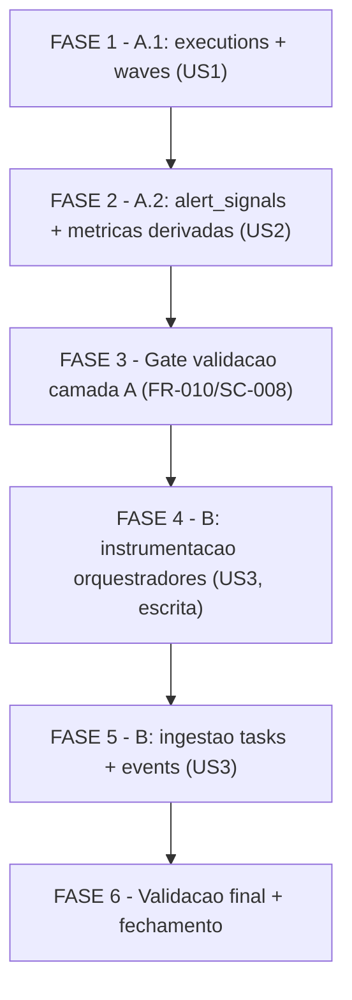

# Tarefas knowledge-db-metrics - Ingestao de metricas no indice de conhecimento

Escopo: Expandir a camada de ingestao do indice SQLite global
(`~/.claude/cstk/knowledge.db`, schema_version 1 -> 2) para derivar metricas
estruturadas do `state.json` transacional (somente leitura), alem da busca
full-text atual. Entrega em duas camadas com ordem incremental obrigatoria
(FR-010/SC-008): **camada A** (US1+US2, somente `cli/lib/recall.sh`, baixo
risco) ANTES da **camada B** (US3, instrumentacao dos orquestradores, alto
risco). O futuro `cstk-panel` esta fora de escopo (FR-005).

**Legenda de status:**
- `[ ]` Pendente
- `[~]` Em andamento
- `[x]` Concluido
- `[!]` Bloqueado

**Legenda de criticidade:**
- `[C]` Critico - Impacto financeiro/regulatorio/seguranca direto ou bloqueante
- `[A]` Alto - Funcionalidade essencial sem a qual a feature nao opera
- `[M]` Medio - Necessario mas sem urgencia imediata

**Invariante de ordem (FR-010 / SC-008):** Nenhuma task da camada B (FASE 4+)
pode iniciar antes que FASE 1, FASE 2 e FASE 3 (gate de validacao da camada A)
estejam `[x]`. A camada B edita codigo load-bearing dos orquestradores; a
camada A precisa estar verde por teste automatizado primeiro.

---

## FASE 1 - Camada A.1: entidades estruturais Execucao + Onda (US1)

Ref: spec.md US1 (P1) + FR-001, FR-002, FR-003, FR-007, FR-008, FR-011,
FR-012; data-model.md (executions, waves); contracts/recall-ingest-schema.md
secoes 1-4; research.md D1, D2, D3, D4; plan.md §Faseamento A.1.

Escopo da fase: somente `cli/lib/recall.sh` + `tests/cstk/test_recall.sh`.
Baixo risco, single-file, reversivel. Gate de saida: SC-001, SC-002, SC-004
verdes.

### 1.1 Bump de schema v1 -> v2 e DDL das tabelas executions + waves `[A]`

Ref: FR-007 (bump idempotente); data-model.md §schema versioning + DDL
executions/waves; contracts/recall-ingest-schema.md §1 (RECALL_SCHEMA_VERSION
linha ~54) e §2 (chave natural UNIQUE(project,feature,wave,source_id));
research.md D1.

- [x] 1.1.1 Alterar `RECALL_SCHEMA_VERSION` de `1` para `2` em
  `cli/lib/recall.sh` (linha ~54)
- [x] 1.1.2 Adicionar `CREATE TABLE IF NOT EXISTS executions (...)` em
  `recall_schema_ddl()` (~linha 311) conforme DDL de data-model.md, com
  `UNIQUE(project, feature, wave, source_id)`
- [x] 1.1.3 Adicionar `CREATE TABLE IF NOT EXISTS waves (...)` em
  `recall_schema_ddl()` conforme DDL de data-model.md, com mesma constraint
  UNIQUE
- [x] 1.1.4 Garantir que o `INSERT ... ON CONFLICT DO UPDATE` no `schema_meta`
  reflete `schema_version = 2` (idempotente, sem perda de dado ao encontrar v1)
- [x] 1.1.5 Teste em `tests/cstk/test_recall.sh`: aplicar schema sobre DB v1
  pre-existente e assertar que (a) `schema_version` virou `2`, (b) tabelas
  `executions`/`waves` existem, (c) tabelas v1 (decisions/bloqueios/retros/
  skills) preservam dado (Edge Case "schema antigo")
- [x] 1.1.6 Teste: aplicar schema 2x (idempotencia do DDL) -> 0 erro, schema
  estavel

### 1.2 Ingestao da entidade Execucao em recall_ingest_state_json `[A]`

Ref: FR-002 (somente leitura), FR-008 (idempotencia), FR-011 (campos da
Execucao); data-model.md §Entity Execucao (mapeamento jq path -> coluna);
contracts/recall-ingest-schema.md §3 (ponto unico de ingestao) + §5 (filtro
de segredo so em motivo_termino); research.md D2, D3.

- [x] 1.2.1 Em `recall_ingest_state_json()` (~linha 480), parsear `.execucao`
  + `.metricas_acumuladas` + `.etapa_corrente` via `jq` de LEITURA e derivar
  os campos da tabela `executions` (status, motivo_termino, etapa_corrente,
  iniciada_em, terminada_em, duracao derivada, stack_sugerida, e as 9 contagens
  de metricas_acumuladas)
- [x] 1.2.2 Derivar `duracao_segundos` (terminada_em - iniciada_em); manter
  NULL quando `terminada_em` ausente (execucao em andamento) sem erro
  (Acceptance Scenario US1.3)
- [x] 1.2.3 Escrever via `INSERT INTO executions ... ON CONFLICT(project,
  feature, wave, source_id) DO UPDATE SET ...` com `wave='-'`,
  `source_id=execucao_id` (chave natural; research.md D2)
- [x] 1.2.4 Aplicar `secrets-filter.sh` (via `recall_secrets_filter_path`)
  APENAS em `motivo_termino`; campos numericos/timestamps/ids sem filtro
  (FR-006, contract §5)
- [x] 1.2.5 Estender contador `RECALL_TOTAL_EXEC` para o sumario impresso
  (contract §3)
- [x] 1.2.6 Teste: fixture `state.json` de execucao concluida com
  `metricas_acumuladas` populadas -> assertar exatamente 1 linha em
  `executions` com 100% dos campos corretos (SC-001, Acceptance US1.1)
- [x] 1.2.7 Teste: fixture de execucao `em_andamento` (sem terminada_em) ->
  1 linha com `duracao_segundos` NULL, 0 erro (Acceptance US1.3)

### 1.3 Ingestao da entidade Onda em recall_ingest_state_json `[A]`

Ref: FR-008, FR-012 (campos da Onda); data-model.md §Entity Onda;
contracts/recall-ingest-schema.md §2 (waves: wave=source_id=wave_id) + §5;
research.md D2, D3.

- [x] 1.3.1 Em `recall_ingest_state_json()`, iterar `.ondas[]` via `jq` e
  derivar por onda: wave_id, etapas (join ","), inicio, fim, wallclock_seconds,
  tool_calls, motivo_termino, n_etapas (length), n_skills
  (skills_invoked|length)
- [x] 1.3.2 Escrever via `INSERT INTO waves ... ON CONFLICT DO UPDATE` com
  `wave=source_id=wave_id` (research.md D2)
- [x] 1.3.3 Aplicar `secrets-filter.sh` apenas em `motivo_termino` da onda;
  demais campos sem filtro (FR-006)
- [x] 1.3.4 Estender contador `RECALL_TOTAL_WAVE` para o sumario (contract §3)
- [x] 1.3.5 Tratar onda aberta (`fim` NULL) sem erro
- [x] 1.3.6 Teste: fixture com 3 ondas em `.ondas[]` -> assertar exatamente 3
  linhas em `waves`, cada uma com wallclock/tool_calls/etapas/n_skills corretos
  (SC-001, Acceptance US1.2)

### 1.4 Idempotencia e convergencia ingest/reindex da camada A.1 `[A]`

Ref: FR-001 (indice derivado), FR-008 (idempotencia), SC-002 (0 divergencias
ingest vs reindex), SC-004 (re-ingestao delta=0); contracts/recall-ingest-
schema.md §3; research.md D3 (ponto unico).

- [x] 1.4.1 Confirmar que `recall_mode_reindex` (~linha 1165) chama a MESMA
  `recall_ingest_state_json` (nenhuma funcao paralela por modo) -> executions/
  waves saem identicos em ingest e reindex
- [x] 1.4.2 Teste: ingerir mesma execucao N vezes -> contagem de linhas de
  `executions` e `waves` nao muda (SC-004, Acceptance US1.4); valores refletem
  estado mais recente
- [x] 1.4.3 Teste: rodar `cstk recall --ingest` e depois `cstk recall
  --reindex` do zero -> conjunto de linhas de executions/waves identico, 0
  divergencias (SC-002, Independent Test US1)
- [x] 1.4.4 Teste best-effort: sem `sqlite3` -> exit 0 + aviso, onda nao aborta;
  sem `jq` -> exit 0 + aviso; `state.json` corrompido -> pula com aviso, 0
  abort (SC-003, FR-003, contract §4)

---

## FASE 2 - Camada A.2: sinais de alerta e metricas derivadas (US2)

Ref: spec.md US2 (P2) + FR-013, FR-014, FR-015, FR-016, FR-017; data-model.md
(alert_signals, MetricaDerivada); contracts/recall-ingest-schema.md §5, §6;
research.md D5, D6, D7; plan.md §Faseamento A.2.

Escopo da fase: somente `cli/lib/recall.sh` + `tests/cstk/test_recall.sh`.
Depende conceitualmente de FASE 1 (precisa do grao de execucao/onda).
Gate de saida: SC-005, SC-006, SC-007 verdes.

### 2.1 DDL e ingestao de SinalDeAlerta: movimento circular `[A]`

Ref: FR-013 (historico_movimento_circular como sinal); data-model.md §Entity
SinalDeAlerta (tipo `circular`); contracts/recall-ingest-schema.md §2
(source_id `<tipo>:<wave_id>:<ordinal>`); research.md D7.

- [x] 2.1.1 Adicionar `CREATE TABLE IF NOT EXISTS alert_signals (...)` em
  `recall_schema_ddl()` conforme DDL de data-model.md (colunas tipo, subtipo,
  valor_consumido, valor_threshold, descricao), com UNIQUE(project,feature,
  wave,source_id)
- [x] 2.1.2 Em `recall_ingest_state_json()`, iterar
  `.historico_movimento_circular[]` e gerar uma linha tipo `circular` por
  entrada, com proveniencia (execucao/onda/data) e `source_id` =
  `circular:<wave_id>:<ordinal>`
- [x] 2.1.3 Aplicar `secrets-filter.sh` em `descricao` (texto livre do
  historico); campos numericos sem filtro (FR-006)
- [x] 2.1.4 Teste: fixture com `historico_movimento_circular[]` populado ->
  cada entrada vira 1 linha consultavel em `alert_signals` tipo `circular`
  (Acceptance US2.2)

### 2.2 Derivacao de breach de orcamento (threshold x consumo) `[A]`

Ref: FR-014 (breach de orcamento); data-model.md §SinalDeAlerta (derivacao
budget_breach); research.md D7; spec.md SC-005.

- [ ] 2.2.1 Em `recall_ingest_state_json()`, cruzar `.orcamentos`
  (tool_calls_threshold_onda, wallclock_threshold_segundos,
  estado_size_threshold_bytes, ciclos_max_por_etapa, recursividade_max) com
  consumo por onda (`.ondas[].tool_calls`, `.ondas[].wallclock_seconds`) e por
  execucao
- [ ] 2.2.2 Para cada threshold excedido, gerar linha `budget_breach` com
  `subtipo` (tool_calls|wallclock|ciclos|profundidade|estado_size),
  `valor_consumido`, `valor_threshold`, `source_id` =
  `budget_breach:<wave_id>:<ordinal>`
- [ ] 2.2.3 Estender contador `RECALL_TOTAL_ALERT` para o sumario (contract §3)
- [ ] 2.2.4 Teste: fixture com onda excedendo `tool_calls_threshold_onda` (e
  variantes wallclock/ciclos/profundidade) -> ao menos 1 SinalDeAlerta de
  breach por threshold excedido, com consumido vs threshold corretos (SC-005,
  Acceptance US2.1)

### 2.3 Metricas derivadas: latencia humana e clarify auto-resolution rate `[M]`

Ref: FR-015 (latencia humana), FR-016 (clarify rate); data-model.md
§MetricaDerivada (computavel sobre bloqueios + decisions existentes, sem nova
tabela obrigatoria); research.md (decisao de design: computavel sem
materializar).

- [ ] 2.3.1 Tornar derivavel a latencia humana por bloqueio: `respondido_em -
  disparado_em` em `.bloqueios_humanos[]`; bloqueio sem resposta = latencia
  aberta/pendente (FR-015, Acceptance US2.3) — via query sobre tabela
  `bloqueios` existente ou subtipo `human_latency` em alert_signals
- [ ] 2.3.2 Tornar derivavel a taxa de auto-resolucao de clarify: relacao entre
  decisoes `score >= 2` na fase clarify (autonomas) e bloqueios humanos na fase
  clarify (escalas), computavel sobre tabelas `decisions` + `bloqueios`
  existentes sem nova tabela (FR-016, Acceptance US2.4)
- [ ] 2.3.3 Teste: fixture com bloqueios contendo disparado_em/respondido_em
  (e um sem resposta) -> latencia correta por bloqueio + pendente para o sem
  resposta (Acceptance US2.3)
- [ ] 2.3.4 Teste: fixture com X bloqueios e Y decisoes score>=2 na fase
  clarify -> taxa de auto-resolucao derivavel da relacao (Acceptance US2.4)

### 2.4 Mix de roteamento de modelos: reuso de model-routing-report.sh `[A]`

Ref: FR-017 (reuso, MUST NOT duplicar); contracts/recall-ingest-schema.md §6;
research.md D6; spec.md SC-006.

- [ ] 2.4.1 Expor o mix de roteamento de modelos delegando a
  `global/skills/agente-00c-runtime/scripts/model-routing-report.sh aggregate
  --state-dir DIR --json` (invocar/referenciar, NAO reimplementar a agregacao)
- [ ] 2.4.2 Garantir que nenhum programa `jq`/SQL de agregacao de modelos e
  duplicado em `recall.sh` (auditavel: `grep` por logica de agregacao de
  modelos deve apontar so para model-routing-report.sh) (FR-017)
- [ ] 2.4.3 Teste: comparar o mix consultado a partir do indice/derivacao com a
  saida de `model-routing-report.sh aggregate --json` sobre o mesmo fixture ->
  0 divergencias (SC-006, Acceptance US2.5)

### 2.5 Filtro de segredos end-to-end da camada A `[C]`

Ref: FR-006 (filtro de texto livre), SC-007 (nenhum segredo no indice);
contracts/recall-ingest-schema.md §5; checklists/security.md.

- [ ] 2.5.1 Confirmar que TODO campo de texto livre das entidades A
  (`motivo_termino` em executions/waves, `descricao` em alert_signals) passa
  por `secrets-filter.sh` antes do INSERT (FR-006)
- [ ] 2.5.2 Confirmar que campos estruturados/numericos NAO passam pelo filtro
  (timestamps/ids/contagens intactos)
- [ ] 2.5.3 Teste: fixture com segredos plantados (token/api-key/senha) em
  campos de texto livre -> consultar o indice apos ingestao e assertar que
  nenhum padrao de segredo conhecido esta presente (SC-007, Independent Test
  US2)

---

## FASE 3 - Gate de validacao da camada A (pre-requisito da camada B)

Ref: FR-010 (camada A antes de B), SC-008 (ordem comprovavel); plan.md
§Faseamento (camada B so inicia apos A.1+A.2 validadas por teste); contracts/
layer-b-instrumentation.md §1 (pre-condicao).

Escopo: gate read-only — nenhum codigo novo, apenas confirmacao por teste
automatizado de que a camada A esta verde antes de tocar os orquestradores.

### 3.1 Confirmar camada A verde por teste automatizado `[C]`

Ref: SC-001, SC-002, SC-003, SC-004, SC-005, SC-006, SC-007; FR-010/SC-008.

- [ ] 3.1.1 Rodar `./tests/run.sh test_recall` e confirmar 100% verde para os
  cenarios das FASES 1 e 2
- [ ] 3.1.2 Rodar `./tests/run.sh --check-coverage` e confirmar 0 script orfao
  (recall.sh editado coberto por test_recall.sh, convencao do repo / FR-009)
- [ ] 3.1.3 Registrar Decisao auditavel "camada A verde, liberando camada B"
  (gate FR-010/SC-008) — pre-condicao explicita do contract layer-b §1
- [ ] 3.1.4 Confirmar que nenhum arquivo fora de `cli/lib/recall.sh` +
  `tests/cstk/test_recall.sh` foi tocado na camada A (confinamento FR-004,
  baixo risco)

---

## FASE 4 - Camada B: instrumentacao dos orquestradores (US3, escrita)

Ref: spec.md US3 (P3) + FR-018, FR-020, FR-021, FR-022; contracts/layer-b-
instrumentation.md §2, §3, §5, §6; research.md D8, D9; plan.md §Faseamento B.

**PRE-REQUISITO DURO (FR-010 / SC-008):** FASE 3 (gate da camada A) DEVE estar
`[x]` antes de qualquer task desta fase. Edita codigo load-bearing dos
orquestradores. Alto risco / alto blast radius.

### 4.1 Instrumentar gravacao de outcome de task no state.json `[A]`

Ref: FR-018 (gravar outcome de task), clarify Q2/dec-006 (grao + campos
minimos); contracts/layer-b-instrumentation.md §2 (schema `.tasks[]`) + §5
(escrita via runtime ja auditado).

- [ ] 4.1.1 Em `global/agents/agente-00c-orchestrator.md`, especificar a
  gravacao de `.tasks[]` durante execute-task/review-task com campos task_id,
  wave_id, outcome (pass|fail), testes_rodados, testes_passados, lint_ok (bool),
  arquivos_tocados (string[]) conforme contract §2
- [ ] 4.1.2 Replicar a mesma instrumentacao em
  `global/agents/agente-00c-feature-orchestrator.md` (paridade entre os dois
  orquestradores)
- [ ] 4.1.3 Garantir que a escrita usa o caminho de runtime ja auditado
  (`state-rw.sh` para mutacao + `sha256-update` + backup filtrado via
  `secrets-filter.sh for-backup`); NAO introduzir novo caminho de escrita
  (contract §5)
- [ ] 4.1.4 Verificar paridade EXATA dos campos `.tasks[]` documentados entre
  os dois agent files (mesma ordem, mesmo enum outcome) — evitar drift de schema
- [ ] 4.1.5 Documentar explicitamente a decisao de custo em tokens (FR-021/
  SC-010): harness nao expoe tokens (dec-005, score 3 empirico) -> NAO inventar
  custo; `tool_calls` permanece proxy documentado (contract §6, research.md D8)

### 4.2 Instrumentar gravacao de eventos/timeline no state.json `[A]`

Ref: FR-020 (timeline de eventos), clarify Q3/dec-007 (conjunto MVP fechado);
contracts/layer-b-instrumentation.md §3 (schema `.eventos[]` + tabela de
quando gravar cada tipo).

- [ ] 4.2.1 Em ambos os agent files, especificar a gravacao de `.eventos[]` com
  os 4 tipos MVP: `wave_retry` (falha+retry de onda), `lock_contention`
  (lock ocupado), `validation_failed` (validate/hash reprovado), `schedule_wait`
  (onda encerrada aguardando wakeup); cada evento com event_type, timestamp ISO,
  descricao opcional (contract §3)
- [ ] 4.2.2 Mapear cada tipo ao ponto exato do Loop principal onde e gravado
  (ex: lock_contention no acquire ocupado; schedule_wait ao emitir Schedule
  intent; validation_failed no hash-verify/state-validate reprovado;
  wave_retry na falha+retry de onda)
- [ ] 4.2.3 Garantir conjunto fechado por convencao (event_type textual
  restrito), extensivel sem mudanca de schema
- [ ] 4.2.4 Verificar paridade dos tipos de evento entre os dois agent files

---

## FASE 5 - Camada B: ingestao das entidades Task + Evento (US3)

Ref: spec.md US3 + FR-019, FR-022; data-model.md (tasks, events);
contracts/recall-ingest-schema.md §2 (chaves naturais B) + §4
(retro-compat); contracts/layer-b-instrumentation.md §4; research.md D9.

Escopo: `cli/lib/recall.sh` + `tests/cstk/test_recall.sh`. So inicia apos
FASE 4 (instrumentacao gravando os campos novos). Gate de saida: SC-008,
SC-009, SC-010 verdes.

### 5.1 DDL e ingestao da entidade Task `[A]`

Ref: FR-019 (ingerir Task), FR-022 (retro-compat); data-model.md §Entity Task;
contracts/recall-ingest-schema.md §2 (tasks: source_id=task_id, wave=wave_id
da task).

- [ ] 5.1.1 Adicionar `CREATE TABLE IF NOT EXISTS tasks (...)` em
  `recall_schema_ddl()` conforme DDL de data-model.md (outcome, testes_rodados,
  testes_passados, lint_ok 0/1, arquivos_tocados contagem), com UNIQUE(project,
  feature,wave,source_id)
- [ ] 5.1.2 Em `recall_ingest_state_json()`, parsear `.tasks[]? // empty` (jq
  com fallback para retro-compat) e derivar uma linha por task; `arquivos_tocados`
  = contagem (`length`) do array
- [ ] 5.1.3 Escrever via `INSERT INTO tasks ... ON CONFLICT DO UPDATE` com
  `wave=<wave_id da task>`, `source_id=task_id` (research.md D2, contract §2)
- [ ] 5.1.4 Estender contador `RECALL_TOTAL_TASK` para o sumario (contract §3)
- [ ] 5.1.5 Teste: fixture instrumentado com `.tasks[]` -> 1 linha de Task por
  task com outcome/testes/lint/arquivos corretos (Acceptance US3.1)

### 5.2 DDL e ingestao da entidade Evento `[A]`

Ref: FR-020 (ingerir Evento), FR-022 (retro-compat); data-model.md §Entity
Evento; contracts/recall-ingest-schema.md §2 (events: source_id=
`<event_type>:<timestamp>`).

- [ ] 5.2.1 Adicionar `CREATE TABLE IF NOT EXISTS events (...)` em
  `recall_schema_ddl()` conforme DDL de data-model.md (event_type, timestamp,
  descricao), com UNIQUE(project,feature,wave,source_id)
- [ ] 5.2.2 Em `recall_ingest_state_json()`, parsear `.eventos[]? // empty` e
  derivar uma linha por evento, ordem cronologica preservada; `source_id` =
  `<event_type>:<timestamp>`
- [ ] 5.2.3 Aplicar `secrets-filter.sh` em `descricao` (texto livre); event_type
  e timestamp sem filtro (FR-006)
- [ ] 5.2.4 Estender contador `RECALL_TOTAL_EVENT` para o sumario (contract §3)
- [ ] 5.2.5 Teste: fixture com eventos dos 4 tipos MVP -> 1 linha de Evento por
  ocorrencia com tipo/timestamp/proveniencia, consultavel em ordem cronologica
  (Acceptance US3.2)

### 5.3 Retro-compatibilidade da camada B `[C]`

Ref: FR-022 (state nao-instrumentado), SC-009 (0 linhas + 0 erro);
contracts/layer-b-instrumentation.md §4; research.md D9.

- [ ] 5.3.1 Confirmar que `.tasks[]? // empty` e `.eventos[]? // empty`
  produzem 0 linhas (sem erro) quando os campos estao ausentes (execucao antiga)
- [ ] 5.3.2 Teste: fixture `state.json` SEM `.tasks`/`.eventos` (pre-
  instrumentacao) -> 0 linhas em tasks/events, 0 erro, 0 abort (SC-009,
  Acceptance US3.3)
- [ ] 5.3.3 Teste: reindex do zero recria tasks/events identicamente
  (convergencia ingest/reindex, FR-001/SC-002 estendido a camada B)

---

## FASE 6 - Validacao final, cobertura e fechamento

Ref: FR-009 (cobertura de teste), SC-008/SC-009/SC-010; plan.md §Testing;
checklists/security.md, api.md, performance.md.

### 6.1 Suite de testes verde e cobertura completa `[C]`

Ref: FR-009 (--check-coverage), todos os SC.

- [ ] 6.1.1 Rodar `./tests/run.sh test_recall` -> 100% verde (camadas A + B)
- [ ] 6.1.2 Rodar `./tests/run.sh --check-coverage` -> 0 orfao (recall.sh
  coberto; nenhum .sh novo sem test_<nome>.sh)
- [ ] 6.1.3 Rodar a suite completa `./tests/run.sh` -> sem regressao nas demais
  categorias
- [ ] 6.1.4 Confirmar SC-008 (ordem de conclusao do backlog comprova camada A
  antes de B) via historico de commits/decisoes

### 6.2 Auditoria de invariantes e fechamento `[A]`

Ref: FR-001 (indice derivado), FR-002 (somente leitura), FR-004 (confinamento
de deps), SC-002, SC-007, SC-010.

- [ ] 6.2.1 Auditar confinamento de deps: `grep -rln 'sqlite3' cli/` aponta
  somente `cli/lib/recall.sh` (FR-004) — nenhuma dep espalhada
- [ ] 6.2.2 Auditar somente-leitura: nenhuma escrita em `state.json` no caminho
  de ingestao (so `jq` de leitura) (FR-002)
- [ ] 6.2.3 Confirmar bump de `CHANGELOG.md`/versao do toolkit conforme
  convencao (schema_version 2; feature aditiva)
- [ ] 6.2.4 Sincronizar `tasks.md` (marcar `[x]` o que foi entregue) e rodar
  `/review-task` para relatorio de progresso

---

## Matriz de Dependencias

> A aresta `F3 --> F4` e o gate duro de FR-010/SC-008: a camada B (FASE 4+) so
> inicia apos a camada A (FASE 1+2) estar validada por teste automatizado
> (FASE 3). Nao ha caminho que pule F3.

## Resumo Quantitativo

| Fase | Tarefas | Subtarefas | Criticidade | Camada |
|------|---------|------------|-------------|--------|
| 1 - A.1 executions + waves | 4 | 23 | A | A |
| 2 - A.2 alert_signals + derivadas | 5 | 18 | C/A/M | A |
| 3 - Gate validacao camada A | 1 | 4 | C | A (gate) |
| 4 - B instrumentacao orquestradores | 2 | 9 | A | B |
| 5 - B ingestao tasks + events | 3 | 13 | C/A | B |
| 6 - Validacao final + fechamento | 2 | 8 | C/A | A+B |
| **Total** | **17** | **75** | - | - |

## Escopo Coberto

| Item | Descricao | Fase | Camada |
|------|-----------|------|--------|
| US1 | Entidades estruturais Execucao + Onda (status, duracoes, contagens) | 1 | A |
| US2 | SinalDeAlerta (circular + budget_breach), latencia humana, clarify rate, mix de modelos (reuso) | 2 | A |
| FR-010 | Gate de ordem incremental camada A antes de B | 3 | A |
| US3 | Instrumentacao orquestradores (tasks + events) + ingestao retro-compativel | 4, 5 | B |
| FR-007 | Bump schema v1 -> v2 idempotente | 1 | A |
| FR-008/SC-004 | Idempotencia por chave natural (delta de linhas = 0) | 1, 2, 5 | A+B |
| FR-001/SC-002 | Convergencia ingest/reindex (indice derivado) | 1, 5 | A+B |
| FR-003/SC-003 | Best-effort (sem sqlite3/jq/corrompido = exit 0) | 1 | A |
| FR-006/SC-007 | Filtro de segredos em texto livre | 2, 5 | A+B |
| FR-017/SC-006 | Mix de modelos por reuso de model-routing-report.sh | 2 | A |
| FR-021/SC-010 | Decisao explicita de custo em tokens (proxy tool_calls) | 4 | B |
| FR-022/SC-009 | Retro-compatibilidade da camada B | 5 | B |
| FR-009 | Cobertura de teste (--check-coverage) | 6 | A+B |

## Escopo Excluido

| Item | Descricao | Motivo |
|------|-----------|--------|
| cstk-panel | Dashboard/UI/endpoint read-only que consumira as metricas | FR-005: projeto separado, fora de escopo; esta feature so entrega dados ingeridos |
| Custo em tokens/$ | Ingestao de custo monetario por execucao | FR-021/SC-010: harness nao expoe tokens (dec-005, empirico); `tool_calls` como proxy, sem inventar dado |
| DB separado metrics.db | Indice de metricas em arquivo distinto | research.md D1: violaria confinamento (FR-004) e fragmentaria fonte da verdade |
| Reimplementacao da agregacao de modelos | Logica de mix de roteamento em recall.sh | FR-017: MUST reusar model-routing-report.sh, MUST NOT duplicar |
| Migracao de states historicos | Forcar campos novos em execucoes antigas | research.md D9: states sao historicos imutaveis; retro-compat via jq // empty |
| Materializacao obrigatoria de MetricaDerivada | Tabela dedicada para latencia/clarify rate | data-model.md: computaveis sobre tabelas existentes (bloqueios/decisions); materializar e opcional |
