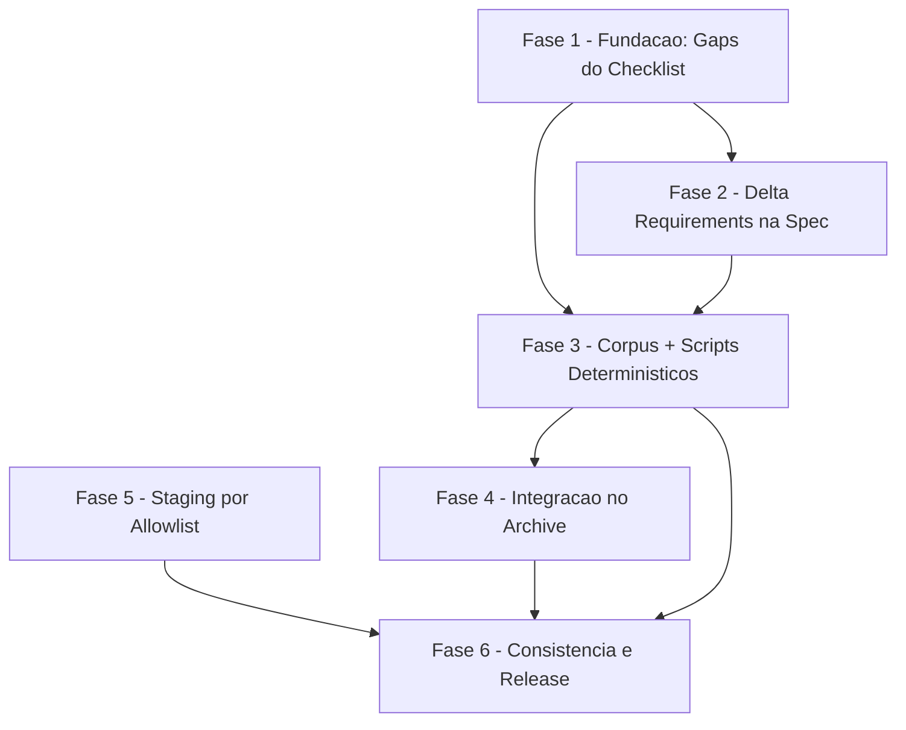

# Tasks — living-specs

**Escopo**: introduzir o corpus canonico de specs vivas (`docs/specs/current/`)
alimentado por secoes `## Delta Requirements` opcionais na spec de cada
feature, aplicado deterministicamente no momento do archive por
`delta-gate.sh` (veredito bloquear/liberar) + `delta-merge.sh` (aplicacao
atomica), e endurecer o modo `atomic-commit` para staging explicito por
allowlist derivada (`commit-mode.sh snapshot`/`stage-derived`), eliminando
os 3 sites reais de `git add -A`/`git add -- .` que causaram o incidente
`.pptx` observado na execucao `openspec-hygiene`. Deriva de
[spec.md](./spec.md) + [plan.md](./plan.md) + [research.md](./research.md)
(9 decisoes) + [data-model.md](./data-model.md) +
[quickstart.md](./quickstart.md) (7 cenarios) +
[contracts/delta-section-format.md](./contracts/delta-section-format.md) +
[contracts/corpus-format.md](./contracts/corpus-format.md) +
[contracts/delta-gate-cli.md](./contracts/delta-gate-cli.md) +
[contracts/delta-merge-cli.md](./contracts/delta-merge-cli.md) +
[contracts/commit-staging-cli.md](./contracts/commit-staging-cli.md) +
[checklists/requirements.md](./checklists/requirements.md).

**Legenda de status**: `[ ]` Pendente · `[~]` Em andamento · `[x]` Concluido · `[!]` Bloqueado
**Legenda de criticidade**: `[C]` Critico (seguranca/integridade/regressao do incidente real) · `[A]` Alto (funcionalidade essencial da feature) · `[M]` Medio (necessario, sem urgencia imediata)

> **Reuso obrigatorio (nao reinventar)**: envelope `DIAG|` de
> `agente-00c-runtime/scripts/_diag.sh` `[REAL]` (vendorizado — research
> Decision 7); padrao `FINDING|<severity>|<code>|<msg>` + `RESULT|...` ja
> usado por `validate-sdd.sh`/`requirement-coverage.sh` `[REAL]`;
> `bloqueios.sh register` `[REAL]` para a integracao da tarefa 4.2;
> `create-tasks/scripts/next-task-id.sh` nao se aplica aqui (backlog sem
> fase de convergencia apendada nesta onda). Todo script novo e 100% POSIX
> sh puro (`#!/bin/sh`, `set -eu`), sem `jq`, sem dependencia opcional nova
> (Constitution II). Zero coleta remota/rede (Constitution IV). Todo path
> derivado de texto lido (slug de capability, paths de staging) e
> quotado/validado antes de compor comandos — nunca `eval`, nunca
> `printf "$var"` (Constitution VI + gate `owasp-security` pos-plan).

> **Gaps do checklist fechados nesta decomposicao** (FASE 1, ver
> `checklists/requirements.md` CHK015/CHK020/CHK034): as 3 lacunas `{auto}`
> com `[Gap]` recebem resolucao concreta e citavel ANTES de qualquer script
> que as consuma ser implementado — nao ficam como "definir depois" solto.
> Os 3 itens `{humano}` (CHK022, CHK030, CHK038) NAO viram tarefa — ver
> "## Escopo Excluido" para o encaminhamento de cada um.

---

## FASE 1 - Fundacao: Fechar Gaps de Definicao do Checklist

### 1.1 Definir orientacao de descoberta/reuso de slug de capability `[A]`

Ref: checklists/requirements.md CHK015 · Spec Key Entities "Living Spec Corpus" · contracts/delta-section-format.md regra 1

- [ ] 1.1.1 Fixar a regra: antes de declarar um `### Capability: <slug>` novo
  numa secao Delta Requirements, o autor MUST consultar as capabilities ja
  existentes rodando `ls docs/specs/current/*.md 2>/dev/null` (corpus pode
  nao existir ainda — lista vazia e um resultado valido) e reusar o slug
  existente sempre que a feature tocar o MESMO conceito, em vez de
  fragmentar em um slug novo semanticamente equivalente (ex.: `commit-mode`
  vs `commit-staging` citado no gap do checklist)
- [ ] 1.1.2 Definir que a decisao de "mesmo conceito ou conceito novo" e
  julgamento do AUTOR da spec (agente ou humano) no momento de preencher a
  secao delta — nao um script determinístico (mesma natureza de decisao ja
  delegada ao agente em `origin -> story_priority` no precedente
  `skill-converge`, research.md Decision 1 daquela feature); o gate
  (`delta-gate.sh`) so valida a FORMA do slug (`[a-z0-9][a-z0-9-]*`), nunca
  a semantica de reuso
- [ ] 1.1.3 Anotar a regra acima em
  `contracts/delta-section-format.md` §Gramatica, item 1 (apos a definicao
  do padrao do slug), citando o comando de descoberta e o exemplo de
  fragmentacao do gap
- [ ] 1.1.4 Registrar que a tarefa 2.2 (prosa da skill `specify`) e o local
  de implementacao desta orientacao — este item so fixa a definicao

### 1.2 Definir integracao gate-bloqueado <-> bloqueios.sh no fluxo autonomo `[A]`

Ref: checklists/requirements.md CHK020 · Spec Edge Cases · research.md Decision 8 · Plan Constitution Check

- [ ] 1.2.1 Fixar a politica: quando `delta-gate.sh` retorna exit 1 (archive
  bloqueado) durante a fase `review-features` do `agente-00c-orchestrator`
  em execucao SEM supervisao, o orquestrador MUST registrar um
  `bloqueios.sh register` para AQUELA feature especifica (pergunta:
  resumo dos `FINDING|error|...` emitidos pelo gate + path da spec),
  nunca falhar silenciosamente nem pular o archive sem rastro
- [ ] 1.2.2 Fixar que o bloqueio e ESCOPADO a feature (nao aborta a onda
  inteira de `review-features`): as demais features do portfolio sem
  bloqueio de gate continuam sendo processadas (arquivadas/avaliadas)
  normalmente na mesma onda — paridade com o padrao ja usado pelos demais
  Quality Gates complementares do orquestrador (severidade alta escala,
  mas nao trava as demais features do lote)
- [ ] 1.2.3 Fixar o formato da pergunta do bloqueio: contexto-para-resposta
  cita o `RESULT|<spec>|delta=missing|errors=N|...` literal emitido pelo
  gate (aterramento de evidencia — nunca resumo parafraseado sem a linha
  real, Constitution VI)
- [ ] 1.2.4 Registrar que a tarefa 4.2 (`agente-00c-orchestrator.md`, fase
  review-features) e o local de implementacao desta politica — este item
  so fixa a definicao; o fluxo MANUAL (operador rodando `/review-features`
  interativamente) segue com o bloqueio reportado em prosa pela skill
  (sem precisar de `bloqueios.sh`, que e mecanismo exclusivo dos
  orquestradores autonomos)

### 1.3 Definir validacao de estrutura do corpus contra edicao manual `[A]`

Ref: checklists/requirements.md CHK034 · Contract corpus-format.md §Estrutura

- [ ] 1.3.1 Fixar que a validacao estrutural do corpus acontece DENTRO de
  `delta-gate.sh`, como pre-checagem ANTES de qualquer validacao
  referencial (ref-not-found/added-collision/renamed-target-exists): para
  cada arquivo `docs/specs/current/<slug>.md` que a secao delta da spec
  candidata referencia, o parser confere invariantes estruturais do
  contrato (headings `# Capability:`/`## Requirements`/`### FR-NNN`
  bem-formados; nenhum id duplicado considerando `## Requirements` +
  `## Removed Requirements` + coluna "Antigo"/"Novo" de
  `## Renamed Identifiers` simultaneamente — invariante 1 de
  `corpus-format.md`)
- [ ] 1.3.2 Fixar o novo `FINDING` code `corpus-malformed` (severity=error)
  para violacao de qualquer invariante da tarefa 1.3.1; corpus ausente
  NAO e `corpus-malformed` (permanece `corpus-missing`, severity=info, ja
  definido — US2 cenario 4)
- [ ] 1.3.3 Fixar que `delta-merge.sh` RE-VALIDA a mesma estrutura antes de
  aplicar qualquer mutacao (defesa em profundidade — mesmo padrao ja
  adotado para a re-validacao de slug entre gate e merge,
  `delta-merge-cli.md` invariante 2-bis); corpus malformado bloqueia o
  merge com o MESMO code, exit 1, corpus intacto
- [ ] 1.3.4 Atualizar `contracts/delta-gate-cli.md` §Codes (nova linha
  `corpus-malformed`) e `contracts/corpus-format.md` (nota apontando que a
  "advertencia em prosa" hoje existente passa a ter enforcement
  determinístico via este code)
- [ ] 1.3.5 Registrar que as tarefas 3.3 (`delta-gate.sh`) e 3.7
  (`delta-merge.sh`) sao o local de implementacao — este item so fixa a
  definicao

---

## FASE 2 - Secao Delta Requirements na Spec (US1, FR-001)

### 2.1 Template `feature-spec.md`: secao opcional Delta Requirements `[A]`

Ref: FR-001 · contracts/delta-section-format.md · plan.md §Project Structure

- [ ] 2.1.1 Adicionar em
  `global/skills/specify/templates/feature-spec.md`, apos
  `## Success Criteria` (posicao recomendada do contrato — o parser
  localiza pelo heading, nao pela posicao), a secao opcional
  `## Delta Requirements` com os 4 subgrupos `#### ADDED`/`MODIFIED`/
  `REMOVED`/`RENAMED` sob `### Capability: <capability-slug>`, seguindo a
  gramatica EXATA de `contracts/delta-section-format.md` (seta `->` ASCII
  no RENAMED, nunca `→`)
- [ ] 2.1.2 Adicionar comentario de template explicando que a secao e
  OPCIONAL (feature pode nao tocar nenhum comportamento de corpus ainda) e
  que o marcador de Skip (`**Skip**: <justificativa> — <autor>,
  <YYYY-MM-DD>`) e a forma alternativa mutuamente exclusiva com os blocos
  `### Capability:` — usada quando o archive nao precisa de delta (US3)
- [ ] 2.1.3 Confirmar (grep) que `validate-sdd.sh` spec-profile nao passa a
  exigir a secao nova (permanece exigindo so "User Scenarios & Testing",
  "Requirements", "Success Criteria" — research.md Decision 4, fato ja
  verificado) e que `requirement-coverage.sh` continua ignorando ids sob
  `## Delta Requirements` (reset em qualquer `##`/`###` seguinte —
  research.md Decision 4)

### 2.2 `specify/SKILL.md`: prosa de quando/como preencher a secao `[A]`

Ref: FR-001, FR-011 · tarefa 1.1 (consome CHK015) · contracts/delta-section-format.md §Skip explicito

- [ ] 2.2.1 Adicionar secao de prosa em `global/skills/specify/SKILL.md`
  orientando: (a) quando preencher Delta Requirements (feature que
  adiciona/muda/remove/renomeia comportamento hoje ativo do sistema-alvo);
  (b) a regra de descoberta/reuso de slug fixada na tarefa 1.1.1-1.1.3
  (`ls docs/specs/current/*.md` antes de nomear capability nova); (c) como
  preencher o marcador de Skip quando a feature e puramente doc-only/meta
  (formato dos 3 campos obrigatorios: justificativa, autor, data)
- [ ] 2.2.2 Citar no SKILL.md que a validacao de forma (nao de semantica de
  reuso) fica a cargo de `delta-gate.sh` (FASE 3), rodado apenas no
  momento do archive — `specify` nunca invoca o gate diretamente
- [ ] 2.2.3 Adicionar exemplo minimo de secao `## Delta Requirements`
  preenchida (um bloco ADDED simples) na prosa do SKILL.md, ilustrando a
  gramatica de `delta-section-format.md` sem exigir abrir o contrato
  completo para o caso comum

---

## FASE 3 - Corpus Canonico + Scripts Deterministicos (US2/US3, FR-002..FR-013)

### 3.1 Vendorizar `_diag.sh` em `review-features/scripts/` `[C]`

Ref: research.md Decision 7 · plan.md §Project Structure

- [ ] 3.1.1 Copiar `global/skills/agente-00c-runtime/scripts/_diag.sh` para
  `global/skills/review-features/scripts/_diag.sh`, com cabecalho apontando
  a fonte canonica (`agente-00c-runtime/scripts/_diag.sh`) e o contrato
  `docs/specs/openspec-hygiene/contracts/diagnostic-envelope.md` (mesmo
  padrao de vendoring documentado na Decision 7)
- [ ] 3.1.2 Confirmar que `tests/test__diag.sh` cobre a copia
  automaticamente via mapeamento por NOME do `--check-coverage` (sem criar
  teste novo — mesmo arquivo, dois locais)
- [ ] 3.1.3 Smoke-test manual: sourcing a copia vendorizada e chamar
  `diag_emit` com severity valida e invalida, confirmando paridade de
  output com o `_diag.sh` canonico (mesmo contrato, dogfooding do envelope
  antes de consumi-lo em 3.4/3.8)

### 3.2 `delta-gate.sh`: parser da secao delta + deteccao de skip `[C]`

Ref: FR-001, FR-010, FR-011 · contracts/delta-gate-cli.md · contracts/delta-section-format.md

- [ ] 3.2.1 Implementar `delta-gate.sh SPEC_MD [--corpus-dir DIR]`
  (POSIX sh puro, `set -eu`); resolucao de `--corpus-dir` default subindo
  de `SPEC_MD` pela convencao `docs/specs/<feature>/spec.md` ate
  `docs/specs/current/`; sem convencao e sem flag => exit 2 (uso incorreto)
- [ ] 3.2.2 Parsear `## Delta Requirements`: ausente => `FINDING|error|
  delta-missing|...`, `RESULT|...|delta=missing`, exit 1 (FR-010)
- [ ] 3.2.3 Detectar marcador `**Skip**: <justificativa> — <autor>,
  <YYYY-MM-DD>`; validar os 3 campos nao-vazios — qualquer ausente =>
  `FINDING|error|skip-invalid|...` (FR-011); Skip + blocos `### Capability:`
  na mesma secao => `FINDING|error|skip-with-delta|...` (mutuamente
  exclusivos); Skip valido isolado => `RESULT|...|delta=skip`, exit 0
  (US3 cenario 2)
- [ ] 3.2.4 Parsear blocos `### Capability: <slug>` repetiveis, cada um com
  >=1 dos 4 grupos `####` nao-vazio; secao presente mas sem NENHUM bloco
  Capability nem skip => `FINDING|error|delta-empty|...`
- [ ] 3.2.5 Parsear entradas `- **FR-NNN**: <texto>` (ADDED/MODIFIED/
  REMOVED) e `- **FR-NNN -> FR-MMM**` (RENAMED), incluindo continuacao de
  texto em linhas indentadas (2+ espacos); entrada fora da gramatica =>
  `FINDING|error|entry-malformed|...`

### 3.3 `delta-gate.sh`: validacao estrutural + referencial `[C]`

Ref: FR-013 · tarefa 1.3 (consome CHK034) · contracts/corpus-format.md §Semantica de aplicacao

- [ ] 3.3.1 Implementar a pre-checagem estrutural do corpus fixada na
  tarefa 1.3.1: para cada capability referenciada pela secao delta, se o
  arquivo `docs/specs/current/<slug>.md` existir, validar headings
  `# Capability:`/`## Requirements`/`### FR-NNN` bem-formados e ausencia de
  id duplicado entre `## Requirements`/`## Removed Requirements`/tabela de
  renames; violacao => `FINDING|error|corpus-malformed|...` (code fixado
  na tarefa 1.3.2), ANTES de qualquer validacao referencial
- [ ] 3.3.2 Validacao referencial por tipo (tabela `corpus-format.md`
  §Semantica de aplicacao): MODIFIED/REMOVED exigem id ATIVO no corpus =>
  senao `FINDING|error|ref-not-found|...` (FR-013, US3 cenario 4); ADDED
  com id ja ativo na mesma capability => `FINDING|error|added-collision|
  ...`; RENAMED exige `old_id` ativo E `new_id` inexistente (ativo ou
  removido/aposentado) em qualquer secao => senao `FINDING|error|
  renamed-target-exists|...`
- [ ] 3.3.3 Corpus/capability inexistente com APENAS entradas ADDED =>
  `FINDING|info|corpus-missing|...` (nao bloqueia — US2 cenario 4,
  distinto de `corpus-malformed`)
- [ ] 3.3.4 Emitir `RESULT|<spec>|delta=<present|skip|missing>|errors=<N>|
  warnings=<M>` como ultima linha de stdout, sempre; exit 0 (errors=0),
  exit 1 (errors>=1), exit 2 (uso incorreto — nao emite RESULT)

### 3.4 `delta-gate.sh`: seguranca + envelope DIAG `[C]`

Ref: contracts/delta-gate-cli.md invariante 4 · gate owasp-security pos-plan · tarefa 3.1

- [ ] 3.4.1 Validar o slug (`[a-z0-9][a-z0-9-]*`) como a PRIMEIRA checagem
  do parser sobre cada `### Capability:` lida, ANTES de qualquer composicao
  de path com o valor — slug fora do padrao => `FINDING|error|
  capability-slug-invalid|...`, NUNCA compor `docs/specs/current/$slug.md`
  com valor nao-validado (anti path traversal `../`, absoluto, com espaco)
- [ ] 3.4.2 Nunca `printf "$var"` com texto delta (sempre `printf '%s'`);
  todas as variaveis quotadas; zero `eval` sobre conteudo lido do spec.md
  (SEC-1, mesmo padrao de `skill-converge/scripts/*.sh`)
- [ ] 3.4.3 Erros de uso (SPEC_MD inexistente, `--corpus-dir` irresoluvel)
  emitem `DIAG|error|<code>|<message>|<fix>` em stderr via `_diag.sh`
  vendorizado (tarefa 3.1), ADITIVO a mensagem legada
- [ ] 3.4.4 Determinismo: mesma spec + mesmo corpus => stdout byte-identico
  entre execucoes (edge case da spec) — nenhuma dependencia de ordem de
  filesystem (`sort` explicito onde a ordem de entrada nao e garantida)

### 3.5 Teste `tests/test_delta-gate.sh` `[C]`

Ref: contracts/delta-gate-cli.md invariante 5 · quickstart.md Cenarios 1, 3, 4 · CLAUDE.md convencao de cobertura

- [ ] 3.5.1 Cenarios happy-path: delta ADDED valida (corpus ausente =>
  `corpus-missing` info, exit 0); delta MODIFIED/REMOVED sobre corpus
  existente valido; delta so-REMOVED valida (US3 cenario 3)
- [ ] 3.5.2 Cenarios de bloqueio: sem secao (`delta-missing`, exit 1); skip
  invalido (`skip-invalid`); skip + delta simultaneo (`skip-with-delta`);
  secao vazia (`delta-empty`); entrada malformada (`entry-malformed`)
- [ ] 3.5.3 Cenarios referenciais: `ref-not-found` (MODIFIED/REMOVED/RENAMED
  para id inexistente); `added-collision`; `renamed-target-exists`
- [ ] 3.5.4 Cenario `corpus-malformed`: fixture com
  `docs/specs/current/<slug>.md` editado a mao violando o contrato
  (heading fora do padrao, id duplicado) — gate bloqueia ANTES de checar
  referencias (tarefa 3.3.1)
- [ ] 3.5.5 Cenario de seguranca: slug hostil (`../escape`, path absoluto,
  slug com espaco) — `capability-slug-invalid`, nenhum path composto fora
  do corpus-dir (SEC, tarefa 3.4.1)
- [ ] 3.5.6 Cenario de determinismo: rodar o gate 2x sobre o mesmo input,
  comparar stdout byte-a-byte
- [ ] 3.5.7 Cenarios de uso incorreto: SPEC_MD inexistente e
  `--corpus-dir` irresoluvel sem convencao => exit 2, `DIAG|` em stderr

### 3.6 `delta-merge.sh`: parse + validacao pre-mutacao `[C]`

Ref: FR-002..FR-005 · contracts/delta-merge-cli.md · contracts/corpus-format.md

- [ ] 3.6.1 Implementar `delta-merge.sh SPEC_MD --feature NAME
  [--corpus-dir DIR] [--date YYYY-MM-DD] [--dry-run]`; reusar o MESMO
  parser da secao delta da tarefa 3.2 (nao duplicar gramatica); `--date`
  default = data corrente UTC
- [ ] 3.6.2 Skip valido presente => `RESULT|...|delta=skip`, exit 0, zero
  escrita no corpus (no-op declarado)
- [ ] 3.6.3 Re-validar TODAS as pre-condicoes de TODAS as entradas de TODAS
  as capabilities tocadas contra o corpus ANTES de escrever qualquer byte
  (defesa em profundidade — o merge pode rodar em momento distinto do
  gate, corpus pode ter mudado); mesmos codes de erro do gate
  (`ref-not-found`, `added-collision`, `renamed-target-exists`,
  `entry-malformed`, `corpus-malformed` da tarefa 3.3.1) — qualquer
  violacao => exit 1, corpus intacto (nenhuma mutacao, nem parcial)

### 3.7 `delta-merge.sh`: aplicacao atomica por capability `[C]`

Ref: FR-002..FR-005, FR-007 · contracts/corpus-format.md §Semantica de aplicacao

- [ ] 3.7.1 ADDED: nova entrada em `## Requirements` com
  `### FR-NNN` + texto + `*Introduzida por: <feature> (<data>)*`
- [ ] 3.7.2 MODIFIED: substitui texto da entrada ativa, id preservado,
  adiciona/atualiza `*Ultima modificacao: <feature> (<data>)*`
  (`*Introduzida por:*` permanece imutavel — SC-004)
- [ ] 3.7.3 REMOVED: move a entrada para `## Removed Requirements` com
  `*Removida por: <feature> (<data>)* — <motivo>` (nunca desaparecimento
  silencioso — FR-004)
- [ ] 3.7.4 RENAMED: heading `### FR-NNN` vira `### FR-MMM`, linha
  adicionada em `## Renamed Identifiers` (tabela old/new/feature/data);
  id antigo nunca reciclado (invariante 1 do contrato)
- [ ] 3.7.5 Corpus/arquivo de capability inexistente + so ADDED => cria o
  arquivo de capability (US2 cenario 4); diretorio `docs/specs/current/`
  criado sob demanda se ainda nao existir
- [ ] 3.7.6 Aplicacao atomica: conteudo novo montado via `mktemp`, `mv`
  so apos validacao TOTAL de TODAS as capabilities da spec (multi-capability
  => nenhum `mv` acontece se qualquer uma falhar); entradas ordenadas por
  id crescente dentro de cada secao (determinismo byte-a-byte — invariante 3)
- [ ] 3.7.7 `--dry-run`: valida e reporta o que SERIA aplicado
  (`added=N|modified=N|removed=N|renamed=N`), zero escrita real
- [ ] 3.7.8 Emitir `RESULT|<spec>|delta=<applied|skip|blocked>|added=<N>|
  modified=<N>|removed=<N>|renamed=<N>`

### 3.8 `delta-merge.sh`: seguranca `[C]`

Ref: contracts/delta-merge-cli.md invariante 2-bis · gate owasp-security pos-plan

- [ ] 3.8.1 Re-validar o slug (`[a-z0-9][a-z0-9-]*`) como primeira
  checagem, ANTES de compor qualquer path — nunca confiar que
  `delta-gate.sh` rodou antes (defesa em profundidade contra path
  traversal, mesma regra da tarefa 3.4.1)
- [ ] 3.8.2 Texto delta escrito no corpus sempre via `printf '%s'`, nunca
  como format string; variaveis quotadas; zero `eval`
- [ ] 3.8.3 Erros de uso emitem `DIAG|` via `_diag.sh` vendorizado
  (tarefa 3.1); erros de conflito/bloqueio permanecem no formato
  `FINDING|`/`RESULT|` (nao viram DIAG — sao veredito de dominio, nao erro
  de uso do script)

### 3.9 Teste `tests/test_delta-merge.sh` `[C]`

Ref: contracts/delta-merge-cli.md · quickstart.md Cenarios 1, 2, 4

- [ ] 3.9.1 Cenario 1 (happy path ADDED): corpus inexistente => criado com
  `### FR-001` + proveniencia correta (SC-004)
- [ ] 3.9.2 Cenario 2 (MODIFIED/REMOVED sobre corpus existente): texto
  substituido com id preservado + `Ultima modificacao`; entrada REMOVED
  movida para `## Removed Requirements` com motivo
- [ ] 3.9.3 Cenario de skip: `delta=skip`, exit 0, corpus (se existir)
  byte-identico antes/depois (hash comparado)
- [ ] 3.9.4 Cenario de atomicidade (quickstart Cenario 4 item 4): spec
  multi-capability com erro na 2a capability => exit 1, hash de TODOS os
  arquivos do corpus identico antes/depois (nenhuma mutacao parcial)
- [ ] 3.9.5 Cenario `--dry-run`: reporta contagens corretas, zero escrita
  (hash do corpus inalterado)
- [ ] 3.9.6 Cenario `corpus-malformed`: merge tambem bloqueia (nao so o
  gate) sobre corpus editado a mao violando o contrato (tarefa 3.6.3)
- [ ] 3.9.7 Cenario de determinismo: dois merges com os MESMOS inputs
  (spec + corpus + `--date`) produzem corpus resultante byte-identico

### 3.10 Fechar cobertura de teste dos scripts novos `[A]`

Ref: CLAUDE.md §Como testar scripts shell · Regra de ouro (mapeamento por nome)

- [ ] 3.10.1 Rodar `./tests/run.sh --check-coverage` e confirmar exit 0 —
  `delta-gate.sh`/`delta-merge.sh` mapeados para `tests/test_delta-gate.sh`/
  `tests/test_delta-merge.sh`; `_diag.sh` vendorizado coberto por
  `tests/test__diag.sh` (mapeamento por nome, sem teste duplicado)
- [ ] 3.10.2 Rodar `./tests/run.sh test_delta-gate` e
  `./tests/run.sh test_delta-merge` isoladamente, confirmar 0 FAIL/0 ERROR
- [ ] 3.10.3 Rodar `shellcheck -s sh` (advisory, mesmo padrao ja adotado
  pelo precedente `skill-converge`) sobre `delta-gate.sh`, `delta-merge.sh`
  e a copia vendorizada de `_diag.sh`; resolver findings antes de
  prosseguir para a FASE 4

---

## FASE 4 - Integracao no Fluxo de Archive (US2/US3, FR-006, FR-008, CHK020)

### 4.1 `review-features/SKILL.md`: acao de archive roda gate -> merge -> mover `[A]`

Ref: FR-006, FR-008 · research.md Decision 3, Decision 8 · delta-merge-cli.md invariante 4

- [ ] 4.1.1 Atualizar "Proximos passos sugeridos" item 3 de
  `global/skills/review-features/SKILL.md`: antes de mover uma feature
  `ARQUIVAR` para `_archived/<YYYY-MM-DD>-<feature>/`, a skill roda
  `delta-gate.sh docs/specs/<feature>/spec.md --corpus-dir
  docs/specs/current` — exit != 0 => NAO mover, reportar os `FINDING|` ao
  operador e pedir preenchimento da secao delta ou skip explicito (US3
  cenario 1/2)
- [ ] 4.1.2 Gate liberado (exit 0) => rodar `delta-merge.sh
  docs/specs/<feature>/spec.md --feature <feature>` ANTES do `mv` para
  `_archived/` — merge bloqueado (exit 1, corpus mudou entre gate e merge)
  tambem impede o `mv` (defesa em profundidade — tarefa 3.6.3)
- [ ] 4.1.3 Documentar que o fluxo de mover para `_archived/` permanece
  EXATAMENTE como hoje apos o merge ter sucesso (US2 cenario 5, FR-006 —
  corpus e destino ADICIONAL, nunca substituicao)
- [ ] 4.1.4 Adicionar nota curta no SKILL.md apontando `docs/specs/current/`
  como fonte para responder "como o sistema se comporta hoje" (FR-009),
  complementando (nao substituindo) a leitura de `_archived/` para
  historico de mudancas

### 4.2 `agente-00c-orchestrator.md`: gate bloqueado vira bloqueio humano `[A]`

Ref: checklists/requirements.md CHK020 · tarefa 1.2 (consome o gap) · research.md Decision 8

- [ ] 4.2.1 Na fase `review-features` do `agente-00c-orchestrator.md`,
  apos a acao de archive de CADA feature `ARQUIVAR` do portfolio, invocar
  `delta-gate.sh` conforme tarefa 4.1.1; exit 1 => aplicar a politica
  fixada na tarefa 1.2.1: `bloqueios.sh register` com a pergunta citando o
  `RESULT|` literal do gate (tarefa 1.2.3), sem abortar a onda inteira
  (tarefa 1.2.2)
- [ ] 4.2.2 Registrar Decisao auditavel (`state-decisions.sh register`)
  documentando o veredito do gate por feature avaliada (padrao ja usado
  pelos demais Quality Gates complementares do orquestrador)
- [ ] 4.2.3 Feature SEM bloqueio de gate na mesma onda continua sendo
  arquivada/mergeada normalmente — bloqueio de uma feature nao impede o
  processamento das demais (tarefa 1.2.2)

---

## FASE 5 - Staging Explicito por Allowlist no Commit Atomico (US4, FR-014..FR-017)

### 5.1 `commit-mode.sh`: subcomando `snapshot` `[C]`

Ref: FR-014 · contracts/commit-staging-cli.md §snapshot · research.md Decision 2

- [ ] 5.1.1 Implementar `commit-mode.sh snapshot --state-dir DIR
  --projeto-alvo-path PATH`: captura untracked atual via
  `git status --porcelain` (linhas `?? `), paths ordenados (`sort`), grava
  em `DIR/commit-baseline.txt` (sidecar — mesmo padrao de
  `tool-call-ticks.log`, nunca dentro de `state.json`, nunca versionado)
- [ ] 5.1.2 Sobrescreve baseline anterior (1 baseline por onda); exit 0
  gravado, exit 1 erro git/IO, exit 2 uso incorreto
- [ ] 5.1.3 Confirmar que `commit-baseline.txt` nunca e commitado — vive
  sob `.claude/` (state dir da execucao), ja coberto pelo `.gitignore` do
  repo-alvo (linha `.claude` — mesmo caso ja garantido para
  `tool-call-ticks.log`, sem gitignore novo necessario)

### 5.2 `commit-mode.sh`: subcomando `stage-derived` `[C]`

Ref: FR-014, FR-015, FR-016 · contracts/commit-staging-cli.md §stage-derived · research.md Decision 2

- [ ] 5.2.1 Computar `tracked_changed` = paths com mudanca em arquivos ja
  rastreados via `git -c core.quotepath=false status --porcelain`
  (todos os estados exceto `??`); renames tratados (staged o path NOVO;
  porcelain v1 usa formato `old -> new` em rename — parsing precisa
  reconhecer esse formato, nao so split por espaco)
- [ ] 5.2.2 Computar `untracked_new` = untracked atuais MENOS
  `DIR/commit-baseline.txt` (`comm -13` sobre listas ordenadas); baseline
  AUSENTE => conjunto vazio + aviso em stderr (fail-closed — untracked
  nunca entram sem baseline, jamais fallback para staging amplo)
- [ ] 5.2.3 `allowlist` = `tracked_changed` + `untracked_new`; se >=1
  `--scope-dir REL_DIR` (repetivel), filtrar aos paths sob esses prefixos
  relativos
- [ ] 5.2.4 Allowlist vazia => exit 3, NENHUM `git add` executado (caller
  pula o commit — FR-016, sem commit vazio, sem fallback amplo mesmo se a
  etapa/task gerou arquivos fora do projeto-alvo — edge case da spec)
- [ ] 5.2.5 Senao: `git add -- <path>` por entrada, loop `while read` linha
  a linha (nunca word-splitting — paths com espaco tratados corretamente);
  PROIBIDO `git add -A`, `git add .`, `git add --all` em qualquer caminho
  do codigo (FR-014); exit 0 quando >=1 path staged
- [ ] 5.2.6 Erros de uso/git emitem `DIAG|` (envelope `_diag.sh`, ja
  sourceable same-dir no runtime — sem vendoring necessario aqui)

### 5.3 Teste `tests/test_commit-mode.sh`: regressao do incidente `[C]`

Ref: FR-017, SC-003 · contracts/commit-staging-cli.md §Regressao obrigatoria · quickstart.md Cenarios 5, 6

- [ ] 5.3.1 Fixture git com `alien.pptx` untracked pre-existente (analogo
  ao incidente real); commit de etapa com `--scope-dir docs/specs/feat-x`
  => commit contem SO `docs/specs/feat-x/plan.md`, `alien.pptx` permanece
  untracked
- [ ] 5.3.2 Commit de task: `snapshot` no inicio da onda + arquivo NOVO
  criado pos-snapshot (`cli/lib/new-helper.sh`) => `stage-derived` sem
  scope-dir inclui o novo arquivo, `alien.pptx` fora
- [ ] 5.3.3 Baseline AUSENTE + untracked novo presente => untracked TODOS
  fora do staging, aviso em stderr, jamais fallback amplo (fail-closed)
- [ ] 5.3.4 Allowlist vazia (fixture limpa) => exit 3, `git diff --cached`
  vazio, nenhum commit criado
- [ ] 5.3.5 Roundtrip real (nao mock): `git show --name-only HEAD` em cada
  commit gerado pelos cenarios acima => nome do alheio ausente em TODOS
- [ ] 5.3.6 Cenario de seguranca: path com espaco e path com caractere
  nao-ASCII, tracked e untracked — staged corretamente via `core.quotepath
  =false` + parsing de quoting C-style (tarefa 5.2.1)

### 5.4 `state-ondas.sh`: `_so_cmd_git_commit` delega staging `[C]`

Ref: FR-014 · research.md Decision 1 site 3 (`state-ondas.sh` linha ~794) · commit-staging-cli.md §Regimes de chamada

- [ ] 5.4.1 Substituir `git add -- .` (linha ~794 de
  `global/skills/agente-00c-runtime/scripts/state-ondas.sh`,
  `_so_cmd_git_commit`) por: `snapshot` (se baseline ainda nao existir
  nesta onda) + `stage-derived --state-dir "$_sdir" --projeto-alvo-path
  "$_pap"` (sem `--scope-dir` — wave-commit pode tocar qualquer path do
  repo, mesmo regime de commit por task da tabela do contrato)
- [ ] 5.4.2 `stage-derived` exit 3 (allowlist vazia) => preservar o
  comportamento atual de "nada para commitar" (no-op, `_so_log`), sem
  quebrar o contrato existente de `_so_cmd_git_commit`
- [ ] 5.4.3 `stage-derived` exit 0 => prosseguir com `git commit -m
  "chore(agente-00c): $_onda - $_motivo_safe"` exatamente como hoje

### 5.5 Teste `tests/test_state-ondas.sh`: cenario wave-commit endurecido `[C]`

Ref: quickstart.md Cenario 7 · commit-staging-cli.md §Regressao item 5

- [ ] 5.5.1 Fixture com `alien.pptx` untracked pre-existente + mudanca
  tracked em `docs/specs/feat-x/spec.md`; `state-ondas.sh git-commit
  --state-dir SD --projeto-alvo-path PAP --motivo teste` => commit contem
  a mudanca tracked, `alien.pptx` permanece untracked
- [ ] 5.5.2 Confirmar via `git show --name-only HEAD` que o site 3 da
  research Decision 1 esta convergido ao mesmo helper de staging dos
  demais sites (5.1-5.4)
- [ ] 5.5.3 Rodar `./tests/run.sh test_state-ondas` isoladamente apos a
  extensao, confirmar 0 FAIL/0 ERROR (sem regressao nos cenarios
  pre-existentes de `git-commit`)

### 5.6 `agente-00c-feature-orchestrator.md`: 2 sites trocam `add -A` `[A]`

Ref: FR-014 · research.md Decision 1 site 1 (linhas 335, 403) · commit-staging-cli.md §Regimes de chamada

- [ ] 5.6.1 Passo 10.qui (commit atomico por etapa): trocar
  `git -C "$PAP" add -A 2>/dev/null || true` (linha ~335) por chamada a
  `commit-mode.sh stage-derived --state-dir "$STATE_DIR"
  --projeto-alvo-path "$PAP" --scope-dir "docs/specs/$SHORT_NAME"
  --scope-dir ".claude/feature-00c-state/$SHORT_NAME"` — exit 3 => pular
  o commit desta etapa (sem commit vazio); exit 0 => prosseguir com o
  `git commit` existente
- [ ] 5.6.2 Passo 7.bis (commit atomico por task, agrupado por onda):
  trocar `git -C "$PAP" add -A 2>/dev/null || true` (linha ~403) por
  `commit-mode.sh snapshot` na ABERTURA da onda `execute-task` + `
  stage-derived --state-dir "$STATE_DIR" --projeto-alvo-path "$PAP"` (sem
  `--scope-dir` — tasks tocam qualquer path do repo) no momento do commit
  agrupado
- [ ] 5.6.3 Atualizar a prosa dos dois blocos de pseudocodigo bash no
  arquivo (`global/agents/agente-00c-feature-orchestrator.md`) refletindo
  as chamadas novas, preservando o resto do fluxo (guard-branch, mensagem,
  Decisao auditavel) intacto

### 5.7 `agente-00c-orchestrator.md`: 2 sites equivalentes `[A]`

Ref: FR-014 · research.md Decision 1 site 2 (linhas 678, 1552)

- [ ] 5.7.1 Aplicar a MESMA troca da tarefa 5.6.1/5.6.2 nos dois sites
  equivalentes de `global/agents/agente-00c-orchestrator.md` (linhas
  ~678 e ~1552), com `--scope-dir` apontando `.claude/agente-00c-state`
  em vez de `.claude/feature-00c-state/<short>` (state dir do agente-00c)
- [ ] 5.7.2 Manter paridade textual entre os dois arquivos de orquestrador
  (mesma estrutura de bloco bash, mesmos nomes de variavel) para nao
  divergir prosa entre agente-00c e feature-00c (padrao ja seguido pelas
  demais secoes espelhadas dos dois arquivos)
- [ ] 5.7.3 Grep de verificacao pontual pos-edicao: confirmar 0 ocorrencias
  de `add -A` remanescentes nos 2 sites editados (linhas antigas ~678 e
  ~1552 de `agente-00c-orchestrator.md`)

### 5.8 Verificacao final: zero `add -A`/`add .` remanescente `[A]`

Ref: FR-014, FR-017 · plan.md §Constraints ("nenhum git add -A/add . remanescente em codigo ou prosa dos caminhos automaticos")

- [ ] 5.8.1 Rodar `grep -rn "add -A\|add --all\|add -- \.\b" global/agents/
  global/skills/agente-00c-runtime/scripts/` e confirmar 0 ocorrencias nos
  caminhos automaticos (fora de comentarios explicativos que citam o
  antipattern como PROIBIDO, ex.: contracts e mensagens de erro)
- [ ] 5.8.2 Se algum resultado remanescente aparecer fora dos 5 sites
  cobertos (5.1-5.7), tratar como escopo desta feature (nao adiar) —
  FR-017 exige cobertura de regressao do incidente original completa,
  nao parcial
- [ ] 5.8.3 Registrar Decisao auditavel citando a saida literal do grep
  final (zero ocorrencias, ou lista das remanescentes tratadas) como
  evidencia (score 3, aterramento Constitution VI)

---

## FASE 6 - Consistencia e Release

### 6.1 CHANGELOG e verificacao de gates estruturais `[M]`

Ref: plan.md §Constitution Check ("MINOR; sem BREAKING") · CLAUDE.md §CHANGELOG

- [ ] 6.1.1 Adicionar entrada no `CHANGELOG.md` (bump MINOR — secao delta
  e opcional e os 2 subcomandos novos de `commit-mode.sh` sao aditivos,
  sem quebra de contrato existente) resumindo as 4 entregas (delta
  section, corpus canonico, gate deterministico, staging por allowlist)
- [ ] 6.1.2 Conferir o bloco de link references do rodape do CHANGELOG
  (`[X.Y.Z]: https://github.com/JotJunior/cstk/releases/tag/vX.Y.Z`) —
  nova versao precisa de entrada correspondente (checagem `comm -23` do
  CLAUDE.md)
- [ ] 6.1.3 Rodar `validate-docs-rendered` sobre `docs/specs/living-specs/
  tasks.md` e sobre este arquivo apos qualquer edicao posterior — Mermaid
  parseavel, links internos resolvem, frontmatter consistente

### 6.2 `/analyze` — consistencia cross-artifact `[M]`

Ref: skill analyze · precedente skill-converge FASE 5

- [ ] 6.2.1 Rodar `/analyze` sobre `docs/specs/living-specs/` (spec + plan
  + tasks + constitution) e resolver quaisquer findings de inconsistencia
  antes de `execute-task` iniciar
- [ ] 6.2.2 Findings de severidade alta => resolver antes de prosseguir
  para `execute-task`; findings de baixa severidade => registrar como
  Decisao informativa e seguir (mesmo padrao dos demais gates da FASE 3/4)

### 6.3 Suite completa + doctor `[A]`

Ref: CLAUDE.md §Como testar scripts shell · §Installed vs Source Drift

- [ ] 6.3.1 Rodar `./tests/run.sh` completo (nao so `--fast`) apos todas as
  tasks de FASE 3/5 concluidas — 0 FAIL/0 ERROR obrigatorio antes de
  `review-task`
- [ ] 6.3.2 Rodar `./tests/run.sh --check-coverage` — 0 script orfao
  (delta-gate.sh, delta-merge.sh, `_diag.sh` vendorizado)
- [ ] 6.3.3 Apos instalar via `cstk install --from` local (build de dev),
  rodar `cstk doctor` e confirmar drift zero entre catalogo e disco

### 6.4 (OPCIONAL, fora de criterio de aceite) Backfill incremental do corpus `[M]`

Ref: spec.md §Out of Scope · CHK038 (nao-bloqueante, ver Escopo Excluido)

- [ ] 6.4.1 NAO EXECUTAR nesta feature salvo pedido explicito do operador:
  script/rotina que roda `delta-merge.sh` retroativamente sobre as ~15
  features ja em `docs/specs/_archived/` SEM secao delta (nenhuma tem —
  feature entrou em vigor depois). Item permanece em backlog aberto,
  sem dono e sem criterio de prontidao ate decisao humana (CHK038) — task
  registrada aqui apenas para nao se perder, marcada explicitamente como
  NAO BLOQUEANTE da conclusao desta feature (spec.md §Out of Scope)
- [ ] 6.4.2 Se o operador decidir priorizar o backfill no futuro, abrir
  uma feature NOVA dedicada (nao reabrir `living-specs`) — mantem esta
  feature fechada e auditavel sem escopo residual pendurado

---

## Matriz de Dependencias

> Fase 5 (staging por allowlist) e tecnicamente independente de Fases
> 2-4 (corpus/delta) — resolve o bug de seguranca real (US4) sem
> depender do corpus. Pode ser executada em paralelo a Fase 2-4; ambas
> convergem em Fase 6.

## Resumo Quantitativo

| Fase | Tarefas | Subtarefas | Criticidade |
|------|---------|------------|-------------|
| 1 - Fundacao: Gaps do Checklist | 3 | 13 | `[A]` |
| 2 - Delta Requirements na Spec | 2 | 6 | `[A]` |
| 3 - Corpus + Scripts Deterministicos | 10 | 47 | `[C]`/`[A]` |
| 4 - Integracao no Archive | 2 | 7 | `[A]` |
| 5 - Staging por Allowlist | 8 | 30 | `[C]`/`[A]` |
| 6 - Consistencia e Release | 4 | 10 | `[M]`/`[A]` |
| **Total** | **29** | **113** | — |

## Cobertura de Requisitos Funcionais

| FR | Tarefa(s) |
|----|-----------|
| FR-001 | 2.1, 2.2, 3.2 |
| FR-002 | 3.6, 3.7 |
| FR-003 | 3.7 |
| FR-004 | 3.7 |
| FR-005 | 3.7 |
| FR-006 | 4.1 |
| FR-007 | 3.7 |
| FR-008 | 4.1 |
| FR-009 | 4.1 |
| FR-010 | 3.2, 3.3 |
| FR-011 | 2.2, 3.2 |
| FR-012 | 3.2-3.9 (scripts deterministicos, sem julgamento de modelo) |
| FR-013 | 3.3 |
| FR-014 | 5.1, 5.2, 5.4, 5.6, 5.7, 5.8 |
| FR-015 | 5.2, 5.3 |
| FR-016 | 5.2 |
| FR-017 | 5.3, 5.8 |

## Escopo Coberto

| Item | Descricao | Fase |
|------|-----------|------|
| Gaps de definicao | Governanca de slug de capability, integracao gate<->bloqueios.sh, enforcement de estrutura do corpus (CHK015/CHK020/CHK034) | 1 |
| Secao Delta Requirements | Template + prosa da skill `specify` | 2 |
| Corpus canonico | `docs/specs/current/<slug>.md`, `delta-gate.sh`, `delta-merge.sh`, ambos com teste dedicado | 3 |
| Integracao no archive | `review-features/SKILL.md` (manual) + `agente-00c-orchestrator.md` (autonomo, bloqueio humano) | 4 |
| Staging por allowlist | `commit-mode.sh snapshot`/`stage-derived`, `state-ondas.sh`, 4 sites de prosa dos orquestradores, regressao do incidente `.pptx` | 5 |
| Release | CHANGELOG, `/analyze`, suite completa, `--check-coverage`, `cstk doctor` | 6 |

## Escopo Excluido

| Item | Descricao | Motivo |
|------|-----------|--------|
| Backfill retroativo do corpus | Migrar as ~15 features ja em `_archived/` para `docs/specs/current/` | spec.md §Out of Scope — nao bloqueia conclusao; task 6.4 registrada como backlog aberto, sem dono |
| Stores/worksets multi-repo | Agregacao de corpus entre multiplos repositorios (mecanismo OpenSpec) | spec.md §Out of Scope — sem fonte suficiente sobre o mecanismo (Constitution VI); esta feature trata de um unico projeto-alvo |
| CHK022 (apetite de risco dos 4 subcasos de conflito serem error vs warning) | Nao vira tarefa — decisao de politica de risco do mantenedor | `{humano}`, aguarda decisao do dono do produto antes de `execute-task`; nao bloqueia `create-tasks` |
| CHK030 (scope-dir de etapa `plan` que edita `global/` alargar dinamicamente?) | Nao vira tarefa — trade-off de seguranca vs abrangencia do commit de etapa | `{humano}`, aguarda decisao do dono do produto; implementacao atual (5.6.1) usa scope-dir fixo por etapa, revisitavel apos feedback real de uso |
| CHK038 (criterio de prontidao do backfill opcional) | Nao vira tarefa — apenas anotado em 6.4 como backlog sem dono | `{humano}`, spec.md §Out of Scope ja marca como nao-bloqueante; criterio de prontidao fica para quando/se o operador priorizar |
