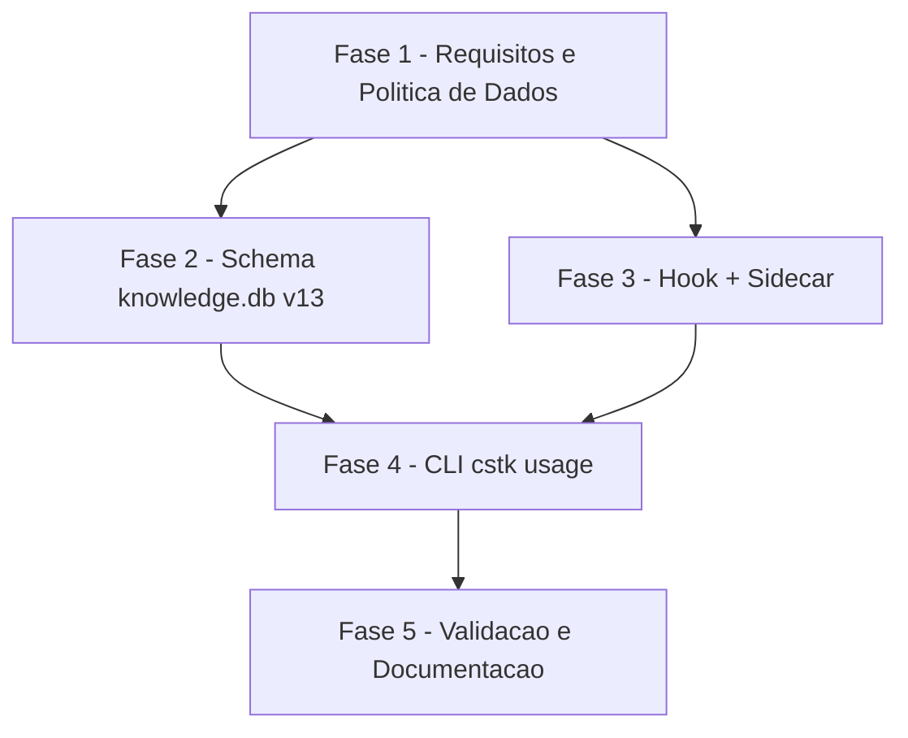

# Tarefas loose-usage-capture - Captura de Consumo Avulso de Uso

Escopo: implementar a visibilidade de consumo (tokens/custo por modelo) das
sessoes avulsas do Claude Code fora das pipelines SDD `agente-00c`/`feature-00c`,
em tres camadas — hook de captura opt-in, indice derivado no `knowledge.db`
(migracao v13) e subcomando `cstk usage` (+ `compare`, `+ prune`) — conforme
[plan.md](./plan.md), [data-model.md](./data-model.md) e
[contracts/](./contracts/).

**Legenda de status:**
- `[ ]` Pendente
- `[~]` Em andamento
- `[x]` Concluido
- `[!]` Bloqueado

**Legenda de criticidade:**
- `[C]` Critico - Impacto financeiro direto ou bloqueante
- `[A]` Alto - Funcionalidade essencial
- `[M]` Medio - Necessario mas sem urgencia imediata

---

## FASE 1 - Requisitos e Politica de Dados (Gaps do Checklist)

### 1.1 Definir e documentar politica de retencao/expurgo do consumo avulso `[A]`

Ref: checklists/requirements.md CHK002, checklists/security.md CHK029

- [x] 1.1.1 Decidir o mecanismo (subcomando dedicado `cstk usage prune [--dry-run] [--older-than-days N]`, paridade estrutural com `cstk mcp gc [--dry-run]` ja existente em `cli/lib/mcp.sh`) e o TTL default (`CSTK_LOOSE_USAGE_RETENTION_DAYS`, default `90`) — politica de design explicita, nao dado factual (mesma natureza do default de intervalo tratado em research.md Decision 4) — dec-029
- [x] 1.1.2 Adicionar secao "Retencao" em data-model.md descrevendo o TTL, o alvo da poda (segmentos `seg-*` fechados do sidecar + linhas de `loose_usage`) e o criterio de elegibilidade (idade de `captured_at`/`updated_at` acima do TTL)
- [x] 1.1.3 Atualizar contracts/cli-usage.md com a secao `cstk usage prune` (flags, saida, comportamento sem dados)
- [x] 1.1.4 Marcar CHK002 (requirements.md) e CHK029 (security.md) como `[x]` citando a secao nova de data-model.md

### 1.2 Definir e documentar permissao restritiva do sidecar de captura avulsa `[A]`

Ref: checklists/security.md CHK021

- [x] 1.2.1 Decidir o esquema de permissao (`chmod 700` no diretorio raiz `~/.claude/cstk/loose-usage/` e em cada `<process_key>/`/`seg-*/`; `chmod 600` em `meta.tsv`/`otel-start.tsv`/`otel-end.tsv`), paridade com `recall_normalize_db_perms` (`cli/lib/recall.sh` ~669-685) — dec-030
- [x] 1.2.2 Adicionar nota de permissao em data-model.md §LooseUsageProcess
- [x] 1.2.3 Marcar CHK021 (security.md) como `[x]` citando a nota nova

---

## FASE 2 - Fundacao: Schema do knowledge.db (migracao v13)

### 2.1 Migracao aditiva RECALL_SCHEMA_VERSION 12 -> 13 `[A]`

Ref: data-model.md §Entity LooseUsageRecord, cli/lib/recall.sh (linha 128 `RECALL_SCHEMA_VERSION`, linha 652 `schema_meta`, precedente v11->v12 linhas 810-811)

- [x] 2.1.1 Bump `RECALL_SCHEMA_VERSION` para `13` em cli/lib/recall.sh — dec-031
- [x] 2.1.2 Adicionar `CREATE TABLE IF NOT EXISTS loose_usage (...)` em `recall_schema_ddl`, colunas conforme data-model.md (`id`, `project`, `project_path`, `process_key`, `segment_id`, `model`, `cost_usd`, `total_tokens`, `segment_open`, `captured_at`, `ingested_at`) + `UNIQUE(process_key, segment_id, model)`
- [x] 2.1.3 Confirmar que a migracao e puramente aditiva (sem `ALTER TABLE`/`DROP`), seguindo o precedente literal da v11->v12 para tabela nova
- [x] 2.1.4 Escrever teste de migracao em tests/cstk/test_recall.sh: base v12 populada ganha `loose_usage` vazia na proxima escrita; base nova cria o schema direto em v13 — scenario_lu1/scenario_lu2, `./tests/run.sh test_recall.sh`: PASS 145 FAIL 0 (145 scenarios, inclui as 14 pre-existentes que hardcodeavam schema_version=12 e foram atualizadas para 13)

### 2.2 Rotina de poda (prune) na camada de indice `[A]`

Ref: task 1.1 (politica de retencao), data-model.md §Retencao

- [x] 2.2.1 Adicionar helper de poda em cli/lib/recall.sh (`recall_prune_loose_usage` ou equivalente): `DELETE` de linhas `loose_usage` com `captured_at` mais antigo que o TTL recebido
- [x] 2.2.2 Aplicar `recall_normalize_db_perms` apos a poda, mesmo padrao das demais mutacoes do `knowledge.db`
- [x] 2.2.3 Escrever teste em tests/cstk/test_recall.sh: poda remove linhas expiradas e preserva linhas dentro do TTL — scenario_lu3 (remove expirada/preserva recente), scenario_lu4 (--dry-run nao remove), scenario_lu5 (DAYS invalido), scenario_lu6 (DB ausente); `./tests/run.sh test_recall.sh`: PASS 145 FAIL 0

---

## FASE 3 - Captura: hook `posttooluse-loose-usage.sh` + sidecar

### 3.1 Implementar hook posttooluse-loose-usage.sh `[A]`

Ref: contracts/hook-loose-usage.md §Sequencia (7 passos), molde `global/skills/agente-00c-runtime/hooks/posttooluse-tool-call-tick.sh`

- [ ] 3.1.1 Resolucao de dependencias (`_hook-active-exec.sh`, `otel-usage.sh`) pela cadeia de 3 niveis: `<dir do hook>/../scripts/`, `$HOME/.claude/skills/agente-00c-runtime/scripts/`, `<cwd>/.claude/skills/agente-00c-runtime/scripts/`
- [ ] 3.1.2 Passos 1-3: checar `CSTK_OTEL_ENDPOINT` presente, `jq` disponivel, parse de stdin (`.cwd`/`.tool_name` nao-vazios) — no-op em qualquer ausencia
- [ ] 3.1.3 Passo 4: throttle O(1) via `meta.tsv.updated_at` + `CSTK_LOOSE_USAGE_INTERVAL_S` (default `300`), executado ANTES do passo 5 (mais barato primeiro)
- [ ] 3.1.4 Passo 5: deteccao de execucao ativa com polaridade INVERTIDA de `_hook-active-exec.sh` (exit `0`=ativa fecha segmento sem capturar; `1`=inativa captura; `2`/`3`=no-op) — pre-check inline usando exclusivamente builtins do shell (SEC-H1)
- [ ] 3.1.5 Passos 6-7: `otel-usage.sh snapshot` no diretorio do segmento aberto + atualizacao de `meta.tsv` (`updated_at`, `current_segment`)
- [ ] 3.1.6 Garantir o contrato de saida: stdout/stderr SEMPRE vazios, exit SEMPRE `0`, hook nunca toca `state.json`/`state.db`/`knowledge.db`
- [ ] 3.1.7 Escrever tests/test_posttooluse-loose-usage.sh cobrindo: `CSTK_OTEL_ENDPOINT` ausente (no-op), `jq` ausente (no-op), throttle nao vencido (no-op), execucao ativa (fecha segmento), execucao inativa (captura), estados `indeterminada`/`uso incorreto` (no-op), payload sem `.cwd`/`.tool_name` (no-op)

### 3.2 Aplicar permissao restritiva no sidecar (CHK021) `[A]`

Ref: task 1.2

- [ ] 3.2.1 `chmod 700` no diretorio raiz `~/.claude/cstk/loose-usage/` e em cada `<process_key>/`/`seg-*/` criado pelo hook
- [ ] 3.2.2 `chmod 600` em `meta.tsv`, `otel-start.tsv`, `otel-end.tsv` apos cada escrita
- [ ] 3.2.3 Estender tests/test_posttooluse-loose-usage.sh com cenario que confirma o modo de arquivo/diretorio apos uma captura bem-sucedida

### 3.3 Registro opt-in do hook no harness `[A]`

Ref: contracts/hook-loose-usage.md §Registro no harness, research.md Decision 10

- [ ] 3.3.1 Criar `global/skills/agente-00c-runtime/hooks/settings.loose-usage.snippet.json` (evento `PostToolUse`, matcher `*`, `command` para `posttooluse-loose-usage.sh`, `timeout: 5`) em arquivo SEPARADO de `settings.snippet.json`
- [ ] 3.3.2 Adicionar flag `--with-loose-usage` (default DESLIGADA) ao subcomando `hooks install` em cli/lib/hooks.sh, mesclando o snippet novo apenas quando a flag e passada
- [ ] 3.3.3 Garantir que `apply_guard_hooks()` chamada sem a flag preserva exatamente o comportamento atual (3 hooks obrigatorios, zero regressao)
- [ ] 3.3.4 Estender tests/cstk/test_hooks.sh: cenario com `--with-loose-usage` registra o hook novo; cenario sem a flag NAO o registra

---

## FASE 4 - Consulta: subcomando `cstk usage`

### 4.1 Implementar cli/lib/usage.sh (mapper sidecar -> DB) `[A]`

Ref: plan.md §Convencoes de Borda "Mapper layer (sidecar ↔ DB)", data-model.md

- [ ] 4.1.1 Varredura de `~/.claude/cstk/loose-usage/*/seg-*/`, invocando `otel-usage.sh delta --state-dir <segmento>` por segmento
- [ ] 4.1.2 Conversao do JSON `by_model` do `delta` em linhas `loose_usage`, UPSERT pela chave natural `(process_key, segment_id, model)`, delegando a `cli/lib/recall.sh` (usage.sh NUNCA invoca `sqlite3` diretamente — invariante grep-avel de plan.md/contracts/cli-usage.md)
- [ ] 4.1.3 Tratamento de ausencia conforme Constitution VI: campo nao medido vira `null`/`NULL`, nunca `0` fabricado

### 4.2 Implementar `cstk usage` (listagem por projeto) `[A]`

Ref: contracts/cli-usage.md §`cstk usage`

- [ ] 4.2.1 Parser de flags `--project`/`--since`/`--limit`/`--json`/`--db`; flag desconhecida ⇒ exit `2` com uso em stderr
- [ ] 4.2.2 Saida texto: uma secao por projeto, uma linha por modelo (modelo, tokens, custo, participacao); campo sem medicao imprime `nao medido`
- [ ] 4.2.3 Saida `--json`: objeto `{project, category: "loose", models[]}` com `model`/`total_tokens`/`cost_usd`; ausencia representada por `null` JSON
- [ ] 4.2.4 Comportamento sem dados conforme tabela do contrato: `knowledge.db` ausente (aviso stderr + `nao medido`, exit 0), tabela vazia (`nao medido — sem cobertura de captura`, exit 0), `sqlite3` ausente (aviso stderr, exit 1)

### 4.3 Implementar `cstk usage compare` `[A]`

Ref: contracts/cli-usage.md §`cstk usage compare`, data-model.md §Entity ProjectUsageComparison

- [ ] 4.3.1 Agregacao por categoria (`loose` via `loose_usage`, `pipeline` via `wave_model_usage` ja existente em cli/lib/recall.sh linhas 625-637) — soma lado a lado, NUNCA `JOIN` linha a linha (granularidades diferentes)
- [ ] 4.3.2 Calculo de `share_pct` e `blended_cost_per_mtok` (`SUM(cost_usd)/SUM(total_tokens)*1e6`; `null` quando `SUM(total_tokens)` e `0` ou `NULL` — divisao indefinida nunca vira `0`)
- [ ] 4.3.3 Regras de ausencia: categoria sem nenhuma linha ⇒ `nao medido`/`null`, a outra categoria segue exibida; ambas vazias ⇒ `nao medido` nas duas, exit `0`

### 4.4 Implementar `cstk usage prune` `[A]`

Ref: task 1.1/2.2 (politica de retencao)

- [ ] 4.4.1 Poda dos segmentos fechados do sidecar (marcador `closed` presente) mais antigos que o TTL (`CSTK_LOOSE_USAGE_RETENTION_DAYS`, default `90`, ou `--older-than-days N`)
- [ ] 4.4.2 Poda das linhas correspondentes em `loose_usage` via o helper da task 2.2.1
- [ ] 4.4.3 Flag `--dry-run` (paridade com `cstk mcp gc --dry-run`): reporta o que seria removido sem remover

### 4.5 Wiring no dispatch + help do binario `[A]`

Ref: contracts/cli-usage.md, cli/cstk (case dispatch e lista de subcomandos validos, linha ~243)

- [ ] 4.5.1 Adicionar `usage)` ao `case "$1"` de cli/cstk, roteando para cli/lib/usage.sh
- [ ] 4.5.2 Adicionar `usage` a lista de subcomandos validos (`install|update|...`) e ao texto de `--help`/uso
- [ ] 4.5.3 Escrever tests/cstk/test_usage.sh cobrindo: listagem com/sem dados, `--json`, `compare`, `prune --dry-run`, flag desconhecida (exit 2), `sqlite3` ausente (exit 1)

---

## FASE 5 - Validacao, Testes de Integracao e Documentacao

### 5.1 Fechar cobertura de testes e checklist `[A]`

- [ ] 5.1.1 Rodar `./tests/run.sh --check-coverage` e confirmar zero script orfao para `posttooluse-loose-usage.sh` e `usage.sh`
- [ ] 5.1.2 Rodar a suite relevante (`./tests/run.sh recall`, `./tests/run.sh hooks`, `./tests/run.sh usage`, `./tests/run.sh posttooluse-loose-usage`) e confirmar 100% verde
- [ ] 5.1.3 Marcar CHK002/CHK021/CHK029 como `[x]` nos checklists com referencia as tasks que os fecharam (1.1, 1.2, 2.2, 3.2, 4.4)

### 5.2 Atualizar documentacao do repositorio `[A]`

Ref: CLAUDE.md secao "Memoria de conhecimento (cstk recall)" como precedente de formato

- [ ] 5.2.1 Adicionar secao "Consumo avulso (cstk usage)" em CLAUDE.md descrevendo o hook opt-in, o sidecar, a migracao v13 e os 3 subcomandos (`usage`, `usage compare`, `usage prune`)
- [ ] 5.2.2 Atualizar README.md se `cstk usage` entrar no texto de `--help`/lista de subcomandos documentados (paridade com as linhas ja existentes de `cstk hooks`/`cstk recall`)
- [ ] 5.2.3 Adicionar entrada no CHANGELOG.md (proxima versao MINOR) descrevendo o subcomando novo — Constitution Principio I exige nota de release para contrato de CLI novo (plan.md §Constitution Check)

### 5.3 Quickstart e validacao manual `[M]`

Ref: quickstart.md

- [ ] 5.3.1 Executar os cenarios de quickstart.md (manualmente ou via script) e confirmar que os passos descritos batem com a implementacao final
- [ ] 5.3.2 Ajustar quickstart.md se algum passo tiver divergido durante a implementacao

---

## Matriz de Dependencias

## Resumo Quantitativo

| Fase | Tarefas | Subtarefas | Criticidade |
|------|---------|------------|-------------|
| 1 - Requisitos e Politica de Dados | 2 | 7 | A |
| 2 - Schema knowledge.db v13 | 2 | 7 | A |
| 3 - Hook + Sidecar | 3 | 14 | A |
| 4 - CLI `cstk usage` | 5 | 16 | A |
| 5 - Validacao e Documentacao | 3 | 8 | A/M |
| **Total** | **15** | **52** | - |

## Escopo Coberto

| Item | Descricao | Fase |
|------|-----------|------|
| FR-001/FR-002/FR-003 | Captura periodica de consumo avulso, atribuida por processo+projeto | 3 |
| FR-004/FR-010 | Exclusao de dupla contagem via deteccao de execucao ativa (polaridade invertida) | 3 |
| FR-005 | Ausencia sempre `null`/"nao medido", nunca `0` fabricado | 2, 4 |
| FR-006 | Opt-in via `cstk hooks install --with-loose-usage`, snippet separado | 3.3 |
| FR-007 | Hook fail-open, stdout/stderr vazios, exit sempre 0 | 3.1 |
| FR-008 | Persistencia do sidecar sobrevive ao processo | 3.1 |
| FR-009 | `cstk usage` / `cstk usage compare` (mix de modelos + custo blended) | 4.2, 4.3 |
| CHK002/CHK029 | Politica de retencao/expurgo (gap do checklist) | 1.1, 2.2, 4.4 |
| CHK021 | Permissao restritiva do sidecar (gap do checklist) | 1.2, 3.2 |

## Escopo Excluido

| Item | Descricao | Motivo |
|------|-----------|--------|
| Exposicao no painel web | Comparacao avulso vs pipeline no `cstk-panel` | Fora de escopo explicito da spec (Clarifications Q3, FR-009) |
| Novo arquivo com acesso a `sqlite3` | `cli/lib/usage.sh` invocando `sqlite3` diretamente | Violaria o confinamento de dependencia (Constitution II); toda SQL delega a `cli/lib/recall.sh` |
| Definicao numerica de "janela de perda tolerada" (CHK017) | Fixar um valor de SLA de perda maxima na spec | Item `{humano}` — aguarda decisao do dono do produto, fora do escopo de decomposicao automatica |
| Decisao humana final sobre retencao/permissao (CHK018/CHK030/CHK031) | Ratificar formalmente as politicas definidas nas tasks 1.1/1.2 como requisito obrigatorio vs divida tecnica aceita | Itens `{humano}` dos checklists; as tasks 1.1/1.2 implementam uma politica razoavel, mas a ratificacao formal como requisito permanece decisao do operador |
