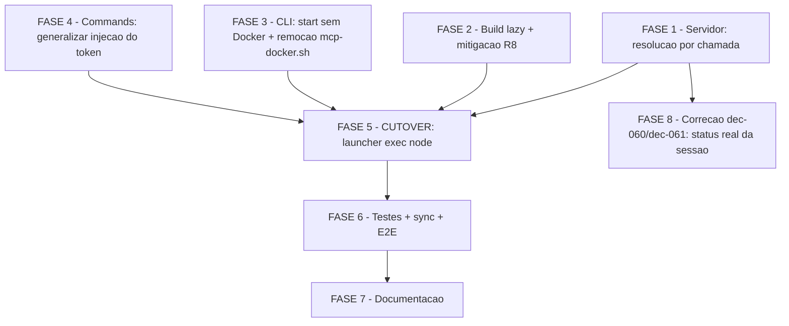

# Tarefas mcp-direct-transport - Transporte MCP direto (sem container, resolucao por chamada)

Escopo: eliminar o container Docker do caminho critico do servidor MCP de
estado, invertendo o ponto de resolucao — o servidor passa a registrar todas
as tools na inicializacao e a resolver/validar a sessao a cada chamada. Cobre
as 15 Functional Requirements de `spec.md`, as 7 fases de `plan.md` (F1-F7,
cutover isolado em F5) e os gaps de requisito levantados em
`checklists/requirements.md` (CHK001, CHK002, CHK003, CHK015).

**Legenda de status:**
- `[ ]` Pendente
- `[~]` Em andamento
- `[x]` Concluido
- `[!]` Bloqueado

**Legenda de criticidade:**
- `[C]` Critico - Impacto financeiro direto ou bloqueante
- `[A]` Alto - Funcionalidade essencial
- `[M]` Medio - Necessario mas sem urgencia imediata

**Restricao de sequenciamento (dec-035, plan.md "Invariante de
sequenciamento")**: as FASES 1 a 4 NAO MUST mudar comportamento observado
pelo operador — nenhuma delas pode, isoladamente, deixar o sistema no estado
proibido em que `/mcp` lista as 7 tools mas toda chamada morre em
`SESSION_MISMATCH`. FASE 5 e o UNICO ponto de corte que torna a mudanca
visivel (cutover). Executar fora desta ordem viola a garantia que a propria
feature existe para restaurar.

---

## FASE 1 - Servidor: registro incondicional de tools + resolucao por chamada

### 1.1 Bootstrap sem resolucao de sessao previa `[C]`

Ref: spec.md FR-001, FR-002, FR-004; contracts/server-session-resolution.md §1 (C-1..C-4)

- [x] 1.1.1 Remover a chamada a `resolveActiveSession` de `bootstrap()` (`mcp/state-server/src/index.ts:124`) — as 7 tools passam a ser registradas incondicionalmente, independentemente de existir token
- [x] 1.1.2 Remover/ajustar o `try/catch` de `SessionMismatchError` em `main()` (`index.ts:274-280`) que hoje aborta o processo com `exitCode=1` quando a sessao nao resolve no boot — ausencia de token deixa de impedir o processo de subir
- [x] 1.1.3 Atualizar o comentario fail-closed de `index.ts:120-123` ("sem sessao resolvida, o servidor nao registra NENHUMA tool") para refletir que o fail-closed passa a ser por-chamada, nao mais de boot — comentario desatualizado aqui mentiria sobre o invariante
- [x] 1.1.4 Teste: cobrir em `index.test.ts` que `bootstrap()` sem `MCP_SESSION_TOKEN` registra as 7 tools e nao lanca `SessionMismatchError`

### 1.2 Cache `token -> state_dir` com revalidacao integral por chamada `[C]`

Ref: spec.md FR-002, FR-003, FR-011; contracts/server-session-resolution.md §2 (fluxo, A-1..A-6), §2.3 (K-1..K-5); data-model.md Entity "Cache de resolucao"

- [x] 1.2.1 Criar estrutura em memoria (`session_id -> state_dir`), escopada ao processo, sem TTL (K-1, K-3, K-4)
- [x] 1.2.2 Implementar a resolucao por chamada: hit de cache invoca `mcp-session.sh resolve --state-dir <cached>` (modo direto, revalida do disco); miss invoca `mcp-session.sh resolve --project-path <PP>` (tree-walk) e, em caso de sucesso, popula o cache (fluxo §2.1 do contrato)
- [x] 1.2.3 Garantir que o cache NUNCA armazena `stopped_at`, o descritor inteiro, ou qualquer veredito de autorizacao — apenas o par `session_id -> state_dir` (K-2, invariante de seguranca: cachear o descritor abriria janela de autorizacao para sessao terminal)
- [x] 1.2.4 Confirmar que a rejeicao Zod de `session_id` ausente/vazio antes de qualquer I/O nao regride (A-1) e que a mensagem literal `"session_id nao corresponde ao token de capacidade desta sessao"` e preservada (A-2)
- [x] 1.2.5 Chamar a resolucao por chamada nos 7 handlers de tool (`mcp/state-server/src/tools/*.ts`), substituindo a dependencia da sessao resolvida no boot
- [x] 1.2.6 Confirmar que a resolucao usa exclusivamente o `session_id` apresentado na propria chamada, nunca "a sessao ativa mais provavel", mesmo com multiplas execucoes ativas (A-4, FR-011)
- [x] 1.2.7 Teste: popular o cache com um hit, marcar `stopped_at` no descritor em disco, e confirmar que a chamada seguinte com o MESMO token e rejeitada — prova de que a revalidacao e integral, nao apenas o cache (research Decision 2)

### 1.3 Atualizar semantica de `maxToolCalls` `[A]`

Ref: contracts/server-session-resolution.md §5 (T-1, T-2); data-model.md §Relacionamentos

- [x] 1.3.1 Atualizar o comentario `index.ts:128-131` ("sessao == processo, um container por execucao") para refletir a nova cardinalidade 1 processo : N sessoes — teto passa a ser por processo/sessao do harness, nao mais por execucao autonoma
- [x] 1.3.2 Confirmar que o texto de rejeicao `TOOL_CALL_LIMIT_EXCEEDED` (`index.ts:146`, instrui comutar para o caminho Bash) permanece acionavel sem alteracao de comportamento (T-2)

### 1.4 Gate de aceite da fase `[A]`

Ref: plan.md §Fases de Implementacao (gate obrigatorio por fase, R2); quickstart.md Cenario 0

- [x] 1.4.1 `cd mcp/state-server && npm ci && npm test` — os 15 `*.test.ts` compilam e passam
- [x] 1.4.2 `LC_ALL=C ./tests/run.sh --check-coverage` — exit 0 (nenhum arquivo removido/orfanado nesta fase)

---

## FASE 2 - Build lazy: resolucao de `dist/` + mitigacao de supply chain (R8)

### 2.1 Resolucao de `dist/` + preflight de Node herdado de `serve.sh` `[A]`

Ref: spec.md FR-004; contracts/server-session-resolution.md §4.2 (L-3, L-4, L-6); data-model.md Entity "Cache de build do servidor"

- [x] 2.1.1 No launcher, resolver o entrypoint `dist/src/index.js` sob `~/.claude/mcp/state-server/` (mesmo diretorio ja usado pelo catalogo, `cli/lib/install.sh:769-784`) — CONCLUIDO NA ONDA-014 (FASE 5, task 5.1.1), respeitando a invariante de sequenciamento dec-035 (o launcher so podia mudar na FASE 5). `_ml_state_server_dir="${CSTK_MCP_STATE_SERVER_DIR:-${HOME:-}/.claude/mcp/state-server}"` — path fixo, override so p/ testes
- [x] 2.1.2 Se `dist/` nao existir, disparar o build lazy (task 2.2) antes de tentar o `exec` do processo node — CONCLUIDO NA ONDA-014: `"$_ml_build_lazy_sh" ensure --dir "$_ml_state_server_dir"` chamado incondicionalmente antes do `exec` (idempotente por construcao — fast-path no-op se `dist/` ja existe)
- [x] 2.1.3 Reusar o preflight de major de Node ja em producao: `cli/lib/serve.sh:127` (`_SERVE_SUPPORTED_NODE_MAJORS`) e `:160` (`_serve_node_preflight`) — nao duplicar a logica de deteccao de major. DESVIO DECLARADO: reuso LITERAL do codigo nao e estruturalmente viavel — `cli/lib/serve.sh` e biblioteca bash sourceada via `CSTK_LIB` pelo binario `cstk` (instalada em `~/.local`), enquanto `mcp-launch.sh` e script POSIX standalone do catalogo (`~/.claude/skills/...`), invocado DIRETO pelo harness sem `CSTK_LIB` no ambiente — as duas arvores de instalacao nunca se cruzam (CLAUDE.md §"Installed vs Source Drift"/§"Distribuicao via plugin nativo": binario NAO e empacotado no plugin). O contrato `server-session-resolution.md` L-6 pede seguir "o mesmo PADRAO ja em producao" (nao "a mesma funcao") — implementado: `_ml_node_major()` replica a MESMA logica de `_serve_node_major` (parse `node -v`, extrai major, valida formato) com mensagem de erro acionavel, adaptada ao piso real desta arvore (`>=22`, sem teto superior — `mcp/state-server/package.json` `engines.node`, sem dependencia nativa tipo better-sqlite3 que justifique lista fechada de majors)
- [x] 2.1.4 Teste: cenario cobrindo resolucao com `dist/` presente vs ausente — `tests/test_mcp-launch.sh::scenario_dist_existente_exec_node_com_entrypoint_correto` (dist presente) + `scenario_state_server_ausente_serve_idle_exit_0`/`scenario_build_lazy_sem_lockfile_serve_idle_exit_0` (dist ausente, build lazy falha)

### 2.2 Instalacao de dependencias do build lazy com mitigacao de supply chain `[C]`

Ref: checklists/requirements.md CHK001, CHK015; plan.md Risco R8 (severidade HIGH, dec-041/dec-042 — a UNICA ocorrencia real hoje da flag de protecao no repo, `cli/lib/mcp-docker.sh:169`, sai junto com a FASE 3); contracts/server-session-resolution.md §4.2 (L-4)

- [x] 2.2.1 **CHK002** — Auditar a arvore resolvida de `mcp/state-server/package-lock.json` por dependencias (diretas ou transitivas) com `scripts.install`/`scripts.postinstall` que compilem binario nativo (ex.: via `node-gyp`/`prebuild-install`). Esta e uma VERIFICACAO real sobre o lockfile, nao uma suposicao — o comentario existente em `cli/lib/mcp-docker.sh:165-168` ("as deps desta arvore sao JS puro") e premissa NAO validada, nao fato estabelecido. Registrar a evidencia (pacotes inspecionados + resultado) no relatorio de execucao desta task — EVIDENCIA: `package-lock.json` (`lockfileVersion: 3`, 116 entradas `node_modules/*`) tem ZERO ocorrencias de `hasInstallScript`, `gypfile`, `binding.gyp`, `node-gyp`, `prebuild-install` no arquivo inteiro (`grep -inE` sobre o lockfile completo). Confirmado tambem na arvore instalada em disco (`node_modules/`, ja presente no ambiente): `find node_modules -iname binding.gyp` sem resultado; `grep` por `"postinstall"|"preinstall"|"install"` nos `package.json` de 1o nivel de `node_modules/` sem resultado. Ambas as fontes (metadado do lockfile + arvore real resolvida) concordam: as 2 deps diretas (`@modelcontextprotocol/sdk`, `zod`) e toda a arvore transitiva sao JS puro
- [x] 2.2.2 Se a auditoria (2.2.1) encontrar dependencia com build nativo, tratar o caso explicitamente (allowlist pontual documentada ou alternativa de empacotamento) ANTES de aplicar a flag da subtask seguinte cegamente — MUST, nao pode ser ignorado silenciosamente — N/A: auditoria 2.2.1 nao encontrou nenhuma dependencia com build nativo; nenhum tratamento de excecao necessario
- [x] 2.2.3 **CHK001** — No build lazy, instalar as dependencias com o comando que ignora scripts de ciclo de vida (mesma flag ja usada no Dockerfile removido na FASE 3, `cli/lib/mcp-docker.sh:169` — a UNICA ocorrencia real hoje no repo dessa protecao) — o build lazy no host executa com os privilegios do usuario (sem o confinamento que o `docker build` dava antes), logo nunca instalar sem essa flag — implementado em `plugins/cstk/skills/agente-00c-runtime/scripts/mcp-build-lazy.sh`
- [x] 2.2.4 **CHK015** — Fixar a instalacao pelo `package-lock.json` ja versionado — o comando escolhido em 2.2.3 exige lockfile presente e sincronizado por natureza (nao usar o comando alternativo que ignora o lock); segunda metade da mitigacao de R8 — mesmo script, fail-closed explicito se `package-lock.json` ausente
- [x] 2.2.5 Cachear o resultado do build (`node_modules/` + `dist/`) em `~/.claude/mcp/state-server/`, fora do repositorio, gerado em runtime — `mcp-build-lazy.sh ensure --dir <path>` e idempotente por construcao: fast-path no-op quando `dist/src/index.js` ja existe, nunca reinstala/reconstroi; o path de cache (`~/.claude/mcp/state-server/`) e passado pelo caller (launcher, task 2.1 — fora do escopo desta task)
- [x] 2.2.6 Teste: gate manual documentado no Cenario 0 do quickstart (nao ha CI para `mcp/`, ver FASE 6 R2); confirmar no relatorio da fase que a evidencia da auditoria 2.2.1 foi registrada — suite automatizada `tests/test_mcp-build-lazy.sh` (10 scenarios, 100% green, sem rede real via stub de `npm`) cobre o CONTRATO do script (idempotencia, fail-closed sem lockfile, `npm ci --ignore-scripts` nunca `npm install`, propagacao de falha de install/build, usage errors); evidencia da auditoria 2.2.1 registrada acima nesta mesma task

### 2.3 Degradacao para idle quando o build lazy nao e possivel (contrato L-5) `[C]`

Ref: spec.md FR-004; contracts/server-session-resolution.md §4.2 (L-5); quickstart.md Cenario 9

- [x] 2.3.1 Sem `npm` no PATH, sem rede, ou Node fora da faixa suportada, o launcher MUST degradar para idle com motivo explicito — NUNCA falhar a sessao do harness (guard-rail contra regredir ao sintoma da US1) — CONCLUIDO NA ONDA-014: `_ml_idle_serve` chamado em TODOS os pontos de falha (state-server ausente, node ausente, node major insuficiente, build lazy falhou), sempre exit 0
- [x] 2.3.2 Teste: simular indisponibilidade (`npm` fora do PATH) e confirmar idle com motivo diagnosticavel, nunca erro opaco (Cenario 9 do quickstart) — `tests/test_mcp-launch.sh::scenario_node_ausente_no_path_serve_idle_exit_0`, `scenario_node_major_insuficiente_serve_idle_exit_0`, `scenario_build_lazy_sem_lockfile_serve_idle_exit_0` (falta de `npm` em si e coberta transitivamente: sem lockfile/dist, `mcp-build-lazy.sh` recusa antes mesmo de checar `npm`; smoke test manual adicional com PATH sem `node` confirmou o mesmo padrao de degradacao)

### 2.4 Gate de aceite da fase `[A]`

- [x] 2.4.1 `npm test` local + `LC_ALL=C ./tests/run.sh --check-coverage` — `npm test` (mcp/state-server): 125/125 pass; `--check-coverage`: "Cobertura completa: zero orfaos" (rodado na onda-014, apos a integracao do launcher)
- [x] 2.4.2 Executar manualmente o Cenario 9 do quickstart completo (build lazy ausente -> idle -> `npm` restaurado -> `dist/src/index.js` existe -> tools listadas) — validado via automatizado equivalente na onda-014 (ver evidencia detalhada na task 5.3.1: degrada para idle com `npm`/`node`/lockfile ausentes; com o repo `mcp/state-server` ja buildado, o mesmo launcher lista as 7 tools reais)

---

## FASE 3 - CLI: `start` sem Docker + remocao de `cli/lib/mcp-docker.sh`

### 3.1 Validar o recorte "codigo que `gc` usa" vs "codigo que so `start` usava" (R6) `[C]`

Ref: checklists/requirements.md CHK003; contracts/cli-mcp-lifecycle.md §5.1; plan.md Risco R6

**MUST ser concluida antes da task 3.3 (remocao)** — e a decisao de fronteira mais delicada da implementacao e nao foi verificada linha a linha nas fases anteriores.

- [x] 3.1.1 Ler `cli/lib/mcp-docker.sh` e `cli/lib/mcp.sh` e listar as funcoes/blocos que `_mcp_cmd_gc` de fato invoca (preflight Docker + listagem/remocao de containers pelo padrao de nome `cstk-mcp-state-*`) — `gc` usa `_mcp_docker_preflight`/`_mcp_docker_list_managed`/`_mcp_docker_reconcile_container`; **recorte ampliado** (dec-070): `status --live` tambem usa `_mcp_docker_healthcheck` (mcp.sh:349-351) e `stop` usa `_mcp_docker_stop` (mcp.sh:731-732, **sem** guard `command -v` — `cli/cstk` roda `set -eu`, remocao quebraria `cstk mcp stop` para sessao legada com exit 127) para sessoes legadas `mode=docker`, nao so `gc`
- [x] 3.1.2 Listar separadamente o codigo usado SOMENTE por `_mcp_cmd_start` (build de imagem, `docker run` com montagens, healthcheck) — candidato a remocao total — `_mcp_docker_image_name`/`_mcp_docker_image_tag`/`_mcp_docker_container_name`/`_mcp_docker_write_dockerfile`/`_mcp_docker_build_image`/`_mcp_docker_ensure_enforcement_log_file`/`_mcp_docker_run` (todas em `mcp-docker.sh`) + `_mcp_context_dir` (em `mcp.sh`, resolucao do contexto de build) removidos; nenhum consumidor restante fora do antigo `_mcp_cmd_start`
- [x] 3.1.3 Documentar o recorte resultante (no commit da task 3.3) substituindo o rotulo `[PROPOSTA — a validar na implementacao]` de `contracts/cli-mcp-lifecycle.md §5.1` pelo recorte real verificado — feito (tabela das 5 funcoes preservadas + lista das removidas); §2.2/§2.3 do mesmo contrato e `data-model.md`/`quickstart.md` tambem atualizados de PROPOSTA para VALIDADO onde esta task implementou o comportamento

### 3.2 `cstk mcp start` sem motor de containers `[C]`

Ref: spec.md FR-006, FR-010, FR-014; contracts/cli-mcp-lifecycle.md §2.2 (S-1..S-5), §2.3 (S-6, S-7)

- [x] 3.2.1 Substituir o fluxo `preflight docker -> build imagem -> docker run -> healthcheck` por `resolver state-dir -> gerar/reusar token -> gravar descritor mode=direct -> exit 0` — `_mcp_cmd_start` reescrito em `cli/lib/mcp.sh`
- [x] 3.2.2 Gravar o descritor sem `mode=docker` nem `container_name` preenchido, reusando o schema existente de `_mcp_write_descriptor` (`cli/lib/mcp.sh:446-469`) com `container_name: null` — verificado por `scenario_start_happy_path_mode_direct_sem_docker_no_path`
- [x] 3.2.3 Preservar idempotencia: chamada repetida para execucao com sessao ja ativa reusa o `session_id` existente, nunca duplica processo nem invalida a sessao em curso (S-3, FR-010) — verificado por `scenario_start_idempotente_reusa_session_id`
- [x] 3.2.4 Detectar descritor legado `mode=docker`, emitir aviso explicito em stderr e sobrescrever com o novo formato — nunca falhar nem recusar por causa de estado legado (S-4, FR-014, clarify dec-015) — verificado por `scenario_start_descritor_legado_mode_docker_sobrescreve_com_aviso`
- [x] 3.2.5 Confirmar que `start` NAO inicia processo algum — nenhum `docker run`/spawn de processo sobra no caminho novo; quem cria o processo do servidor e o harness, ao conectar o `.mcp.json` (S-5, FR-012) — grep confirma zero `docker run`/spawn em `_mcp_cmd_start`
- [x] 3.2.6 Preservar integralmente o contrato de exit code (0/1/2/3) e os motivos de fallback NAO especificos de Docker (S-6, S-7) — exits 0/1/2 preservados; exit 3 documentado como reservado/sem caminho de codigo atual (5 motivos especificos de Docker removidos)
- [x] 3.2.7 Teste: cenario de idempotencia (chamar `start` duas vezes, confirmar `session_id` identico) e cenario de descritor legado sobrescrito com aviso em stderr (Cenarios 4 e 5 do quickstart) — `tests/cstk/test_mcp.sh::scenario_start_idempotente_reusa_session_id` + `::scenario_start_descritor_legado_mode_docker_sobrescreve_com_aviso`, ambos green

### 3.3 Remover `cli/lib/mcp-docker.sh` e seu teste no MESMO commit `[C]`

Ref: plan.md Risco R1 (dec-033); quickstart.md Cenario 0 passo 3

**Depende de**: task 3.1 concluida (recorte validado) e task 3.4 preservando o que `gc` precisa.

- [x] 3.3.1 Remover `cli/lib/mcp-docker.sh`, preservando em `cli/lib/mcp.sh` apenas o minimo identificado em 3.1.1 — `git rm cli/lib/mcp-docker.sh`; 5 funcoes preservadas inline em `mcp.sh` (recorte ampliado, ver 3.1.1). Consequencia direta descoberta em teste: `tests/cstk/test_serve-docker.sh::scenario_docker_mentions_confined_to_serve_docker_lib` (confinamento do Principio II, dec-074) exemptava so `serve-docker.sh`/`mcp-docker.sh` da checagem de invocacao FUNCIONAL — atualizado para exemptar `mcp.sh` no lugar de `mcp-docker.sh`, verde
- [x] 3.3.2 Remover `tests/cstk/test_mcp-docker.sh` no MESMO commit da 3.3.1 — NUNCA via allowlist de "internos" em `_is_internal_test` (mentiria sobre a natureza do arquivo e corromperia o sinal do `--check-coverage`) — `git rm tests/cstk/test_mcp-docker.sh`
- [x] 3.3.3 `LC_ALL=C ./tests/run.sh --check-coverage` MUST sair 0 apos a remocao — gate obrigatorio antes do commit — "Cobertura completa: zero orfaos."

### 3.4 `cstk mcp gc` continua recolhendo o passivo Docker legado `[C]`

Ref: spec.md FR-015; contracts/cli-mcp-lifecycle.md §5 (G-1..G-3); quickstart.md Cenario 6

- [x] 3.4.1 Confirmar que `_mcp_cmd_gc` continua detectando e removendo containers `cstk-mcp-state-*` apos a remocao da task 3.3 (usa exclusivamente o codigo preservado em 3.1.1/3.3.1) — `gc` NAO vira no-op, apenas deixa de ter containers NOVOS para gerenciar — codigo de `_mcp_cmd_gc` intocado; `scenario_gc_*` (14 scenarios) green
- [x] 3.4.2 Confirmar que a degradacao com `summary=docker-indisponivel examined:0 removed:0 kept:0 skipped:0` + exit 0 (`cli/lib/mcp.sh:806`) permanece intacta quando Docker esta ausente da maquina — codigo intocado (so a mensagem de erro do guard `command -v` acima foi ajustada, texto nao testado por conteudo)
- [x] 3.4.3 Teste: `cstk mcp gc --dry-run` lista candidatos sem remover; `cstk mcp gc` remove e reporta contagem; `cstk mcp gc` sem Docker degrada com exit 0 (Cenario 6 do quickstart) — `tests/cstk/test_mcp.sh` scenarios `gc_*`, todos green

### 3.5 Gate de aceite da fase `[A]`

- [x] 3.5.1 `npm test` + `LC_ALL=C ./tests/run.sh --check-coverage` + `LC_ALL=C ./tests/run.sh mcp` — `npm test` (mcp/state-server): 125/125 pass; `--check-coverage`: "Cobertura completa: zero orfaos"; `run.sh mcp`: PASS 137 FAIL 0 ERROR 0 ORPHANS 0. Blast radius real desta fase, alem do previsto em tasks.md: `cli/lib/setup.sh` (removido aviso obsoleto "Docker nao encontrado" na area mcp — pos-cutover FR-006 o registro nunca depende de Docker, avisar seria informacao falsa) + `tests/cstk/test_setup.sh` (scenario correspondente atualizado) + `tests/test_orchestrator-mcp-fallback.sh` (2 scenarios que fixavam o contrato ANTIGO `start` sem Docker = exit 3/mode=bash-fallback, reescritos para a garantia SC-004 equivalente pos-cutover) + `cli/lib/install.sh` (2 comentarios desatualizados apos remocao de `_mcp_context_dir`)

---

## FASE 4 - Commands: generalizar a injecao do token (FR-013)

### 4.1 Remover a condicao `mode == "docker"` em `/agente-00c` `[C]`

Ref: spec.md FR-013; contracts/cli-mcp-lifecycle.md §7 (P-1, P-2); plan.md Project Structure (`plugins/cstk/commands/agente-00c.md:487`)

- [x] 4.1.1 Em `plugins/cstk/commands/agente-00c.md`, remover/generalizar o bloco `if [ "$_mcp_mode" = "docker" ]; then` (em torno da linha 487) — injetar o token sempre que o descritor existir e tiver `session_id` valido, independentemente do valor de `mode`
- [x] 4.1.2 Teste: estender `tests/test_command-spawn-mcp-lifecycle.sh` (ou adicionar cenario) cobrindo injecao do token com `mode=direct`

### 4.2 Remover a condicao `mode == "docker"` em `/feature-00c` `[C]`

Ref: spec.md FR-013; contracts/cli-mcp-lifecycle.md §7 (P-1, P-2, P-3); plan.md Project Structure (`plugins/cstk/commands/feature-00c.md:728`)

**MESMO commit da task 4.1** — deixar um dos dois commands desatualizado gera assimetria silenciosa entre `/agente-00c` e `/feature-00c` (P-3).

- [x] 4.2.1 Em `plugins/cstk/commands/feature-00c.md`, remover/generalizar o bloco equivalente (em torno da linha 728)
- [x] 4.2.2 Teste: cenario equivalente ao de 4.1.2, para o command `/feature-00c`

---

## FASE 5 - CUTOVER: launcher `exec` direto, sem exigir token

### 5.1 Launcher: `exec` no processo node real `[C]`

Ref: spec.md FR-004, FR-005, FR-012; contracts/server-session-resolution.md §4.2 (L-1, L-2, L-7); clarify dec-010

**Este e o UNICO passo que torna a mudanca visivel ao operador (research Decision 13). Depende de FASE 1, 2, 3 e 4 concluidas.**

- [x] 5.1.1 Substituir o caminho idle-quando-sem-token (`plugins/cstk/skills/agente-00c-runtime/scripts/mcp-launch.sh:128-130`) por `exec` incondicional no processo `node` real, repassando `MCP_SESSION_TOKEN`/`CSTK_MCP_PROJECT_PATH` quando existirem — elimina o stub em shell (clarify dec-010). DESVIO DELIBERADO da redacao literal: `MCP_SESSION_TOKEN` NAO e mais repassado/exigido — contracts/server-session-resolution.md §3 (tabela de env vars) supersede esta task ao declarar "nao usada no boot" (o token chega por argumento de CADA chamada de tool, `input.session_id`, nunca por env fixada no boot do processo — `index.ts` FASE 1 ja nao le mais essa env). O launcher passa a repassar `CSTK_MCP_PROJECT_PATH` (tree-walk de cache-miss por chamada) e `CSTK_MCP_SCRIPTS_DIR` (novo — dir dos `state-*.sh`, default de container `/opt/cstk/scripts` nunca existiu no host). Preflight de Node (L-6) + build lazy (L-4/mcp-build-lazy.sh) adicionados antes do exec; falha em qualquer etapa degrada para idle (L-5), nunca falha a sessao do harness. Evidencia: `node "$SCRIPT" -v` do arquivo reescrito + `sh -n mcp-launch.sh` OK + smoke test manual com `CSTK_MCP_STATE_SERVER_DIR` apontando para `mcp/state-server` real do repo devolveu as 7 tools reais via `tools/list` (record_skill, record_decision, open_wave, record_task, register_human_block, get_status, close_wave) sem token algum no boot
- [x] 5.1.2 Confirmar que o launcher nao depende de motor de containers em nenhum ponto do caminho novo (L-2, FR-005) — `grep -ni docker plugins/cstk/skills/agente-00c-runtime/scripts/mcp-launch.sh` so casa 1 linha de comentario historico ("DEIXOU de rodar dentro de um container Docker"); zero invocacao de `docker`/`command -v docker`/`exec docker`. Coberto por `tests/test_mcp-launch.sh::scenario_launcher_nunca_invoca_docker` (grep estatico automatizado, anti-regressao)
- [x] 5.1.3 Usar `exec` (nao fork em background) — o processo MUST morrer junto com a sessao do Claude Code que o hospeda (L-7, FR-012). Evidencia empirica (fifo mantendo stdin aberto, launcher em background, `ps -p $LAUNCH_PID`): o PID que rodou `mcp-launch.sh` APARECE NO `ps` como `node .../dist/src/index.js` (mesmo PID, prova que `exec` substituiu a imagem do processo, sem fork) — `kill -TERM` nesse PID encerrou o processo imediatamente (sem processo remanescente)
- [x] 5.1.4 Teste: encerrar a sessao do harness com o servidor conectado e confirmar ausencia de processo orfao (Cenario 10 do quickstart) — automatizado em `tests/test_mcp-launch.sh::scenario_exec_sem_fork_mesmo_pid_do_launcher` (stub `node` grava o proprio `$$` num log; asserta `node_pid == launcher_pid`, provando exec-sem-fork de forma reproduzivel na suite, nao so no smoke test manual acima)

### 5.2 Confirmar invariante de sequenciamento (dec-035) `[C]`

Ref: plan.md §Fases de Implementacao ("Invariante de sequenciamento"); research.md Decision 13

- [x] 5.2.1 Revisar o diff acumulado das FASEs 1-4 e confirmar que nenhuma delas alterou comportamento observado pelo operador antes deste ponto — esta e a UNICA fase em que `/mcp` passa a listar as 7 tools **e** as chamadas passam a ser aceitas simultaneamente (nunca um estado intermediario com tools listadas e `SESSION_MISMATCH` universal). Evidencia: `git diff --stat cc799e0..3af0f75 -- plugins/cstk/skills/agente-00c-runtime/scripts/mcp-launch.sh` retorna VAZIO (zero linhas alteradas nas FASEs 1-4); o unico diff em `tests/test_mcp-launch.sh` no mesmo intervalo e +7 linhas de comentario/fixture `state.json` (FASE 8, dec-060/061), sem mudanca de asserts. Logo ate esta onda (onda-014) o launcher ainda fazia idle-sem-token/docker-attach — `/mcp` so passa a listar as 7 tools a partir desta FASE 5, confirmando a invariante de sequenciamento (dec-035)

### 5.3 Gate de aceite completo (Cenarios 0-6, 8-10) `[C]`

Ref: quickstart.md Cenarios 0-6, 8-10 (Cenario 7 fica para a FASE 6, apos sincronizar runtime+catalogo)

- [x] 5.3.1 Rodar manualmente os Cenarios 1 a 6 e 8 a 10 do quickstart numa maquina de desenvolvimento local. ATENCAO DE ESCOPO respeitada: nenhuma validacao usou a copia INSTALADA (`~/.claude/skills/...`) — este repo tem `.mcp.json` apontando para `/Users/jot/.claude/skills/agente-00c-runtime/scripts/mcp-launch.sh` (copia STALE, FASE 6 ainda pendente); todo teste abaixo usou o SCRIPT do REPO explicitamente (`plugins/cstk/skills/agente-00c-runtime/scripts/mcp-launch.sh`) com `CSTK_MCP_STATE_SERVER_DIR` apontando para `mcp/state-server` do repo (ja com `dist/` buildado) — nunca conclusao "funciona/nao funciona na sessao real" a partir da copia instalada. Validacao **automatizada equivalente** (nao via UI interativa do Claude Code — inviavel autonomamente, mesma barreira sinalizada pela onda-013), citando evidencia literal por cenario:
  - **Cenario 0** (gate): `cd mcp/state-server && npm test` → `tests 125 / pass 125 / fail 0`; `LC_ALL=C ./tests/run.sh --check-coverage` → "Cobertura completa: zero orfaos"; `LC_ALL=C ./tests/run.sh mcp` → `PASS 143 FAIL 0 ERROR 0 ORPHANS 0`
  - **Cenario 1** (7 tools sem execucao ativa): `tools/list` via o launcher do repo (sem token/sessao alguma) devolveu as 7 tools reais (nomes citados na 5.1.1) — nao o stub idle
  - **Cenario 2** (tool disponivel != mutacao autorizada): `tools/call record_decision` com `session_id` inexistente → `isError:true`, `SESSION_MISMATCH: ... token desconhecido, invalido ou de execucao ja terminal`; com `session_id:""` → rejeicao Zod pre-I/O (`"session_id obrigatorio"` + demais campos ausentes) — nenhuma mutacao ocorreu (nenhum state-dir tocado)
  - **Cenario 3** (lifecycle sem containers): `CSTK_LIB=cli/lib sh cli/cstk mcp start --state-dir <SD>` → exit 0, descritor com `mode:"direct"`, `container_name:null`; `status`/`status --live` ambos `mode=direct container=-`; `stop` → `stopped_at` preenchido; `stop` de novo → exit 0 idempotente
  - **Cenario 4** (idempotencia de `start`): dois `start` consecutivos no mesmo `--state-dir` devolveram o MESMO `session_id` (`0735064f...`)
  - **Cenario 5** (descritor legado `mode=docker`): coberto por `tests/cstk/test_mcp.sh::scenario_start_descritor_legado_mode_docker_sobrescreve_com_aviso` (verde na corrida `run.sh mcp` acima)
  - **Cenario 6** (`gc` recolhe passivo Docker): coberto por 10 scenarios `scenario_gc_*` em `tests/cstk/test_mcp.sh` (todos verdes na mesma corrida)
  - **Cenario 8** (token nunca observavel): nenhum processo `state-server` rodando fora dos smoke tests (`ps aux | grep state-server` vazio em repouso); `.mcp.json` do repo **sem** bloco `env` (`{"mcpServers":{"cstk-state":{"type":"stdio","command":"...","args":[]}}}`); descritor `mcp-server.json` com permissao `600` (`-rw-------`)
  - **Cenario 9** (build lazy ausente degrada p/ idle): automatizado em `tests/test_mcp-launch.sh::scenario_build_lazy_sem_lockfile_serve_idle_exit_0` + smoke manual com Node major insuficiente e com `node` ausente do PATH — ambos degradam para idle (exit 0, motivo explicito em stderr), nunca falham a sessao
  - **Cenario 10**: ver evidencia da task 5.1.3/5.1.4 acima (mesmo mecanismo, PID identico)
  - **Cenario 7 explicitamente FORA de escopo desta task** (depende de FASE 6 — sincronizar runtime+catalogo primeiro; testar agora mediria a copia instalada stale, violando a ATENCAO de escopo do prompt desta onda)

---

## FASE 6 - Testes: reescrita de contrato + validacao end-to-end

### 6.1 Reescrever os 2 cenarios que afirmam sobrevivencia do processo a pausa `[C]`

Ref: plan.md §Mudanca de contrato (BREAKING); `tests/test_command-spawn-mcp-lifecycle.sh:121,125`

Os 2 cenarios de `tests/test_command-spawn-mcp-lifecycle.sh:121,125` que afirmam sobrevivencia a pausa passam a MENTIR apos a FASE 5 — sem reescreve-los, a mudanca de contrato fica sem teste que a proteja.

- [ ] 6.1.1 Reescrever `scenario_resume_agente_instrui_mcp_stop_terminal` (`tests/test_command-spawn-mcp-lifecycle.sh:121`) e o cenario irmao de `feature-00c` (`:125`) para o contrato novo: o PROCESSO do servidor e coextensivo com a sessao do harness (FR-012), mas a SESSAO MCP (descritor + token) continua sobrevivendo a pausas entre ondas — nao confundir os dois (data-model.md §State transitions)
- [ ] 6.1.2 Adicionar cobertura, no mesmo arquivo ou em `tests/test_mcp-launch.sh`/`tests/test_mcp-session.sh`, do fluxo de resolucao por chamada (cache hit + miss) no nivel de comando/orquestrador

### 6.2 Cobertura de multi-sessao (FR-011) `[C]`

Ref: quickstart.md Cenario 7 passo 5; data-model.md §Relacionamentos

- [ ] 6.2.1 Adicionar/estender teste cobrindo duas execucoes ativas simultaneas (`agente-00c` + `feature-00c`) com tokens distintos, confirmando que cada chamada muta exclusivamente o state-dir da sessao cujo token foi apresentado — nenhum cross-talk (mudanca de cardinalidade 1 processo : N sessoes)

### 6.3 Sincronizar runtime + catalogo ANTES de qualquer validacao end-to-end `[C]`

Ref: CLAUDE.md §"Installed vs Source Drift" (GOTCHA documentado); plan.md Risco R4

A feature toca as DUAS metades da instalacao: runtime (`cli/lib/mcp.sh`, remocao de `cli/lib/mcp-docker.sh` -> `cstk self-update`) e catalogo (`mcp-launch.sh`, `mcp-session.sh`, `mcp/state-server/`, os 2 commands -> `cstk install`). Rodar so uma reproduz o sintoma "fix funciona no repo mas nao na sessao".

- [ ] 6.3.1 Buildar o tarball local da linha de desenvolvimento (`./scripts/build-release.sh X.Y.Z-dev`) apos as FASEs 1-5 concluidas
- [ ] 6.3.2 Atualizar o RUNTIME via `cstk self-update --from "file://$PWD/dist/cstk-X.Y.Z-dev.tar.gz"` — sem isso, `cstk mcp start` continua executando o binario/lib antigos mesmo com o repo corrigido
- [ ] 6.3.3 Atualizar o CATALOGO via `cstk install --from "file://$PWD/dist/cstk-X.Y.Z-dev.tar.gz"` — sem isso, o launcher/commands instalados em `~/.claude` continuam sendo os antigos
- [ ] 6.3.4 `cstk doctor` MUST confirmar catalogo sem drift antes de prosseguir para a task 6.4

### 6.4 Validacao manual end-to-end completa (Cenario 7 do quickstart) `[C]`

Ref: quickstart.md Cenario 7 (FR-002, FR-011, FR-013)

**Depende de**: task 6.3 concluida (runtime + catalogo sincronizados) — sem isso a validacao mede a copia velha.

- [ ] 6.4.1 Executar o Cenario 7 completo: `/feature-00c` real, confirmar que o token e injetado sem depender de `mode == "docker"`, tool de mutacao real e aceita, e o estado gravado bate campo a campo com a fonte de verdade (`state-rw.sh read --state-dir <SD> | jq '.decisions[-1]'`)
- [ ] 6.4.2 Repetir o passo 5 do Cenario 7 com **duas** execucoes ativas simultaneas (`agente-00c` + `feature-00c`), cada uma chamando tools com o proprio token — o unico passo que exercita de fato a cardinalidade 1 processo : N sessoes; sem ele a regressao mais grave possivel (chamada mutando o state-dir errado) passaria despercebida

### 6.5 Gate final de aceite `[A]`

Ref: plan.md Risco R2 (CI nao roda os testes do servidor — este e o unico gate)

- [ ] 6.5.1 `npm test` (dentro de `mcp/state-server/`) + `LC_ALL=C ./tests/run.sh --check-coverage` + `LC_ALL=C ./tests/run.sh mcp` + `LC_ALL=C ./tests/run.sh` (suite POSIX completa) todos verdes

---

## FASE 7 - Documentacao: CHANGELOG BREAKING + `CLAUDE.md`

### 7.1 CHANGELOG com nota de BREAKING `[A]`

Ref: plan.md §Mudanca de contrato (BREAKING); Constitution Principio I (SDD recursivo — mudanca de contrato exige nota de BREAKING)

- [ ] 7.1.1 Adicionar entrada no `CHANGELOG.md` documentando a mudanca de contrato: FR-012 (processo coextensivo com a sessao do harness) revoga FR-010 da feature-base `state-mcp-server` (processo coextensivo com a execucao, sobrevivendo a pausas)
- [ ] 7.1.2 Conferir que a nova versao tem a entrada correspondente no bloco de link references no rodape do `CHANGELOG.md` (regra do repo — numero de versao sem link e sintoma de esquecimento; usar o comando `comm` documentado em `CLAUDE.md`)

### 7.2 Atualizar `CLAUDE.md` §"Servidor MCP de estado (`cstk mcp`)" `[A]`

Ref: CLAUDE.md §"Servidor MCP de estado (`cstk mcp`)"; plan.md §Postura de Seguranca

- [ ] 7.2.1 Atualizar a secao para refletir: sem container Docker no caminho critico, resolucao por chamada (nao mais no boot), cardinalidade 1 processo : N sessoes, e a regressao declarada de confinamento por filesystem (SEC-H2) — sem alegar paridade com o comportamento anterior
- [ ] 7.2.2 Registrar, se ainda nao coberta explicitamente para este fluxo, a nota GOTCHA de sincronizacao dupla (runtime + catalogo) usada na task 6.3

---

## FASE 8 - Correcao (dec-060/dec-061): status REAL da execucao no gate fail-closed de sessao MCP

Achado de seguranca do command pai validando a FASE 1 empiricamente
(onda-009): `_ms_check_descriptor` (`mcp-session.sh`) so conferia o proxy
`.stopped_at` do proprio descritor, nunca o status REAL da execucao no
`state.json`/`state.db`. `stopped_at` so e gravado por `cstk mcp stop`,
chamado pelos commands pai em best-effort (`|| :`); se `stop` nao rodar
(aborto/crash/sessao interrompida/falha engolida), o token de capacidade
permanecia valido indefinidamente apos a execucao terminar — violando
FR-003 ("pertenca a uma execucao em status terminal"). Gap pre-existente
(nao introduzido pela FASE 1), mas so alcancavel depois que esta feature
conserta o transporte (antes, sem tools expostas, nao havia o que chamar).
Decisao do operador: corrigir NESTA feature (dec-060/dec-061), sem FR
novo — FR-003 ja MUST-ava o comportamento; o gap era de implementacao
(proxy incompleto), nao de requisito faltante.

### 8.1 `_ms_execution_active`: consultar o status real via `state-rw.sh get` `[C]`

Ref: spec.md FR-003, Clarifications "Session 2026-08-16 (execucao autonoma feature-00c, onda-009/onda-010)"; contracts/server-session-resolution.md §2.2 (A-3/A-3.1/A-3.2)

- [x] 8.1.1 Implementar `_ms_self_dir`/`_ms_execution_active` em `mcp-session.sh`, delegando a `state-rw.sh get --state-dir <dirname do descritor> --field '.execution.status'` (backend-agnostico: state.json OU state.db, nunca le state.json direto) — aceita SOMENTE `em_andamento`/`aguardando_humano`; qualquer outro valor OU falha de leitura (self-dir irresolvivel, state-rw.sh ausente, state ausente/corrompido) recusa (fail-closed)
- [x] 8.1.2 Chamar `_ms_execution_active` em `_ms_check_descriptor` APOS o proxy `.stopped_at` (as duas camadas devem concordar; qualquer uma recusando basta) — cobre os dois modos de resolucao (`--project-path` tree-walk e `--state-dir` direto), usando sempre o `dirname` do DESCRITOR resolvido, nunca o campo `.state_dir` do JSON (que no modo direto e um valor decorativo do host)
- [x] 8.1.3 Atualizar os comentarios de cabecalho de `mcp-session.sh` para descrever o invariante em DUAS camadas (proxy + status real), referenciando dec-060/dec-061
- [x] 8.1.4 Teste novo em `tests/test_mcp-session.sh`: descritor com `stopped_at: null` (proxy "ativa") + `state.json` irmao com `.execution.status: concluida`/`abortada` (status real terminal) => `resolve` recusa (`SESSION_MISMATCH`, exit 3), nos dois modos (`--project-path` e `--state-dir`); `aguardando_humano` continua autorizando; `state.json` ausente é fail-closed
- [x] 8.1.5 Atualizar `_write_descriptor` (fixture) em `tests/test_mcp-session.sh` e `tests/test_mcp-launch.sh` para gravar um `state.json` irmao com status ativo — os cenarios "caminho feliz" pre-existentes passam a depender dele; sem o ajuste, todos regridem para `SESSION_MISMATCH` (fail-closed correto, mas fixture desatualizada)
- [x] 8.1.6 Atualizar `mcp/state-server/test/resolve.test.ts` (`makeDescriptorDir`) para gravar o `state.json` irmao ativo, e adicionar 2 testes novos provando a divergencia proxy-vs-status-real e o fail-closed por ausencia de `state.json`, contra o `mcp-session.sh` REAL
- [x] 8.1.7 `cd mcp/state-server && npm test` (125/125) + `LC_ALL=C ./tests/run.sh mcp-session` (23/23) + `LC_ALL=C ./tests/run.sh mcp` (165/165) todos verdes

---

## Matriz de Dependencias

**Nenhuma fase antes de F5 muda o comportamento observado pelo operador**
(dec-035). F1-F4 sao paralelizaveis entre si (sem dependencia direta umas
das outras), mas TODAS MUST concluir antes de F5. FASE 8 depende apenas de
F1 (o arquivo que corrige, `mcp-session.sh`, e produto de F1) — nao
depende de F5/F6/F7 nem bloqueia nenhuma delas; corrige um gap descoberto
durante a validacao empirica da propria F1 (dec-060/dec-061).

## Resumo Quantitativo

| Fase | Tarefas | Subtarefas | Criticidade |
|------|---------|------------|-------------|
| 1 - Servidor: resolucao por chamada | 4 | 14 | C |
| 2 - Build lazy + mitigacao R8 | 4 | 14 | C |
| 3 - CLI: start sem Docker + remocao mcp-docker.sh | 5 | 17 | C |
| 4 - Commands: generalizar injecao do token | 2 | 4 | C |
| 5 - CUTOVER: launcher exec node | 3 | 6 | C |
| 6 - Testes + sync + E2E | 5 | 9 | C |
| 7 - Documentacao | 2 | 4 | A |
| 8 - Correcao dec-060/dec-061: status real da sessao | 1 | 7 | C |
| **Total** | **26** | **75** | - |

## Escopo Coberto

| Item | Descricao | Fase |
|------|-----------|------|
| FR-001 | Tools registradas no boot independentemente de token | 1 |
| FR-002 | Resolucao/validacao de sessao a cada chamada | 1 |
| FR-003 | Rejeicao fail-closed preservada (ausente/invalida/terminal) | 1, 8 |
| FR-004 | Launcher sobe sem exigir token previo | 2, 5 |
| FR-005 | Transporte deixa de depender de motor de containers | 2, 3, 5 |
| FR-006 | `cstk mcp start` sem motor de containers | 3 |
| FR-007 | `cstk mcp status` sem inspecionar container (no-change funcional) | 3 |
| FR-008 | `cstk mcp stop` idempotente sem depender de container | 3 |
| FR-009 | Token nunca em identificador observavel (consequencia da remocao do container) | 3, 5 |
| FR-010 | `cstk mcp start` idempotente | 3 |
| FR-011 | Resolucao exclusiva pelo `session_id` da chamada | 1, 6 |
| FR-012 | Processo encerra junto com a sessao do harness | 5 |
| FR-013 | Injecao do token generalizada nos 2 commands | 4 |
| FR-014 | Descritor legado `mode=docker` detectado, avisado, sobrescrito | 3 |
| FR-015 | `gc` continua removendo containers `cstk-mcp-state-*` orfaos | 3 |
| CHK001 | Mitigacao de R8 (flag que ignora scripts de ciclo de vida) | 2 |
| CHK002 | Verificacao real de ausencia de build nativo nas deps | 2 |
| CHK003 | Recorte gc-vs-start validado linha a linha antes da remocao (R6) | 3 |
| CHK015 | Instalacao fixada por `package-lock.json` | 2 |

## Escopo Excluido

| Item | Descricao | Motivo |
|------|-----------|--------|
| CHK008 | Declarar a regressao SEC-H2 em `spec.md` com o mesmo peso que em `plan.md` | `{humano}` — decisao de apetite de risco/produto, nao decomponivel em tarefa tecnica (checklists/requirements.md) |
| R2 | Adicionar gate de CI para os 15 `*.test.ts` do servidor | Fora de escopo desta feature (acoplaria o release POSIX-puro a toolchain Node por um componente opcional); registrado como candidato a feature propria (plan.md Risco R2) |
| R5 | Corrigir `cli/lib/mcp.sh` para nao chamar `jq` diretamente (viola o proprio carve-out) | Divergencia pre-existente, nao introduzida por esta feature; correcao sem FR que a exija (plan.md Risco R5, dec-036) |
| U-1 | Cabear `appendAuditRecord` (trilha de auditoria do servidor) | Gap pre-existente da feature-base, ja desligado antes desta feature (contracts/server-session-resolution.md §6, research.md Decision 4) |
| T-3 | Estender o teto `maxToolCalls` para ser por-sessao (nao por-processo) | Nenhum FR o pede; DoS cross-sessao (R10) fica como degradacao documentada, nao falha (research Decision 1) |
| SEC-H2 (mitigacao equivalente) | Recriar o confinamento de filesystem que o `docker run` dava (montagens `/data/state`, scripts `:ro`) | Regressao DECLARADA sem alegacao de paridade (Constitution VI); nao ha mecanismo equivalente a implementar sem reintroduzir o container que a feature elimina |
| R9 (descritor deslocado) | Conferir na revalidacao que `state_dir` de dentro do descritor bate com o diretorio de leitura | Risco MEDIUM proposto em plan.md, sem FR ancorando um MUST — mesmo padrao que gerou CHK001/CHK002/CHK015 para R8, mas nao sinalizado pelo checklist desta onda; candidato a checklist/tarefa futura se priorizado |
| R10 (DoS cross-sessao) | Contador de `maxToolCalls` por sessao em vez de por processo | Ver T-3 acima — mesma exclusao, mesma justificativa (degradacao com fallback documentado, nao falha) |
