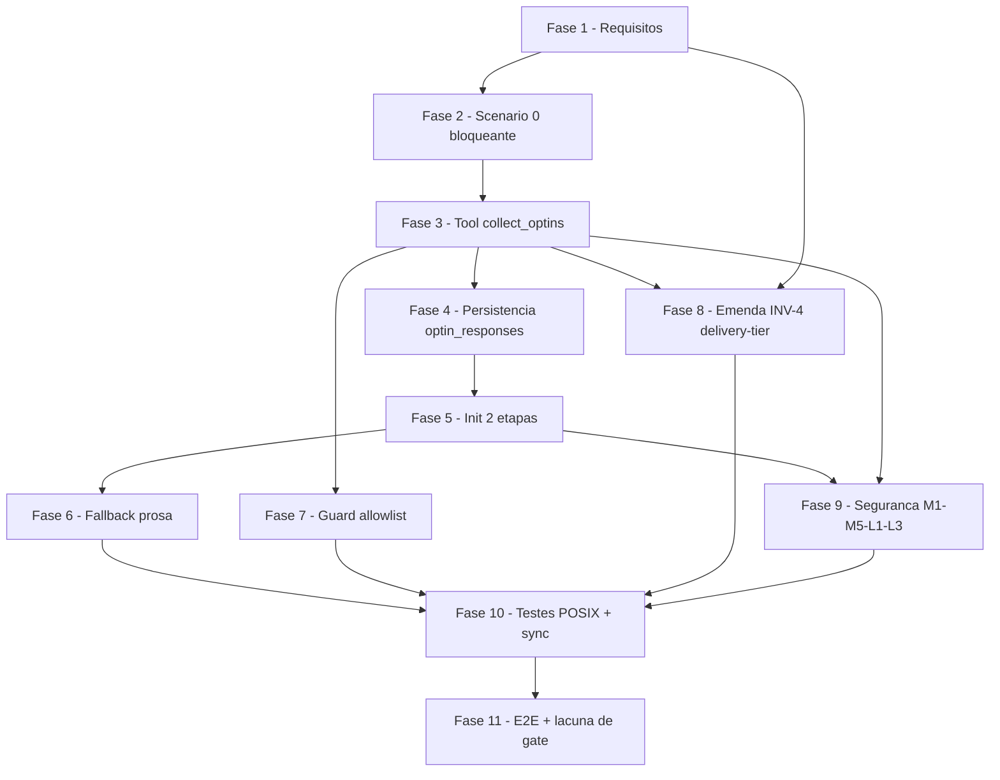

# Tarefas mcp-elicitation-optins - Opt-ins iniciais via MCP elicitation

Escopo: trocar o canal de captura dos tres opt-ins de inicio de execucao
(commit atomico, modo roadmap, finalidade de entrega) de prosa interpretada
pelo modelo para um formulario estruturado MCP (`elicitation/create`, 8a tool
`collect_optins`), mantendo o fallback de prosa hoje existente byte-a-byte e
sem alterar nenhum default seguro. Deriva de `spec.md` (13 FRs),
`plan.md`, `research.md` (Decisions 1-13), `data-model.md`,
`contracts/mcp-tool-collect-optins.md`, `contracts/optin-capture-order.md` e
`quickstart.md` (Scenarios 0-10).

**Legenda de status:**
- `[ ]` Pendente
- `[~]` Em andamento
- `[x]` Concluido
- `[!]` Bloqueado

**Legenda de criticidade:**
- `[C]` Critico - Impacto financeiro direto ou bloqueante
- `[A]` Alto - Funcionalidade essencial
- `[M]` Medio - Necessario mas sem urgencia imediata

---

## FASE 1 - Consolidacao de requisitos (fecha os 4 Gaps do checklist)

### 1.1 Cap objetivo de `collect_optins` em spec.md (M6) `[C]`

Ref: `checklists/requirements.md` CHK005, CHK018; `plan.md` §Resultado dos
gates linhas 271, 339-343 (M6 elevado de LOW para MEDIUM); dec-057
(decisao do operador ja registrada no state: "1 por execucao").

- [x] 1.1.1 Adicionar clausula/FR nova a `spec.md` (`## Requirements`)
      declarando: `collect_optins` MUST ser chamada no maximo **1 vez por
      execucao**; chamadas subsequentes MUST reusar a resposta ja registrada
      (dec-017/FR-011), sem re-disparar o formulario
- [x] 1.1.2 Declarar explicitamente que uma **segunda tentativa de COLETA**
      (nao de leitura via `get_status`) dentro da mesma execucao MUST ser
      recusada pela tool e registrada como sinal de anomalia (injecao
      indireta ou bug de chamador) — nao apenas ignorada em silencio
- [x] 1.1.3 Rodar `~/.claude/skills/checklist/scripts/requirement-coverage.sh
      docs/specs/mcp-elicitation-optins/spec.md` apos a edicao; `errors=0`
      obrigatorio antes de fechar a tarefa

### 1.2 FR-004 ancora a granularidade do enum `outcome` `[A]`

Ref: `checklists/requirements.md` CHK014; `data-model.md` linhas 136-149
(enum de 6 valores: `accepted`/`declined`/`absent`/`timeout`/`unavailable`/
`failed`); M8 do gate de seguranca (`plan.md` linha 279-282) depende dessa
granularidade como evidencia de consentimento para a emenda ao INV-4
(FASE 8)

- [x] 1.2.1 Emendar FR-004 de `spec.md` (hoje exige distinguir apenas
      **tres** desfechos) para exigir a distincao completa de 6 valores no
      registro de auditoria, alinhada a `data-model.md` §Enum `outcome`
- [x] 1.2.2 Citar explicitamente que a distincao `unavailable`/`failed`
      alimenta FR-009 (aviso em stderr) e que `absent`/`timeout` alimenta
      SC-004; nao deixar a granularidade como "detalhe de implementacao"

### 1.3 SC de paridade da prosa no ramo degradado mid-call `[A]`

Ref: `checklists/requirements.md` CHK022; `quickstart.md` Scenario 6
(US3 Acceptance Scenario 2); SC-003 (hoje escopado so ao Scenario 5,
"sessoes SEM o mecanismo") e SC-005 (so mede contagem de linhas de aviso)

- [x] 1.3.1 Adicionar Success Criteria novo (ou emendar SC-003) a `spec.md`
      afirmando que a captura por prosa **apos** uma falha no meio da
      chamada estruturada (Scenario 6) produz o **mesmo resultado
      observavel** (mesmas perguntas, mesmos valores-padrao, mesma
      auditoria em `.optin_responses[]`) que a captura por prosa de hoje —
      elevando `contracts/optin-capture-order.md` §3.3(b) de nivel de
      design a requisito com eco em `spec.md`
- [x] 1.3.2 Rodar `requirement-coverage.sh` de novo apos 1.2 + 1.3;
      `errors=0` obrigatorio

---

## FASE 2 - Validacao empirica bloqueante da premissa central (Scenario 0)

### 2.1 Spike minimo de `collect_optins` + Scenario 0 `[C]`

Ref: `quickstart.md` Scenario 0; `plan.md` §Riscos R1 ("Alta — invalida o
desenho"); `contracts/mcp-tool-collect-optins.md` §Campo `message`
§Pendencia de medicao

> **BLOQUEANTE — requer operador humano em sessao interativa.** Esta
> subtarefa NAO pode ser concluida por um agente autonomo: o resultado da
> sondagem (o formulario aparece? `message`/`title`/`description`/`default`
> renderizam?) e um FATO empirico observado por um humano, nunca uma
> suposicao ou "resultado esperado" fabricado (Principio VI). Se chegar
> aqui sem operador disponivel, `execute-task` MUST registrar bloqueio
> humano e parar — nao inventar o resultado.

- [x] 2.1.1 Implementar uma versao minima/stub de `collect_optins` (schema
      reduzido, sem persistencia ainda) suficiente para disparar
      `elicitInput` a partir de uma tool chamada por subagente
- [x] 2.1.2 Rodar Scenario 0 completo com operador humano: registrar se o
      formulario aparece, e se `title`/`description`/`default`/`message`
      renderizam (4 itens, `contracts/mcp-tool-collect-optins.md` linhas
      28-42 e 172-178) — **RESULTADO (dec-071)**: formulario aparece;
      `message` renderiza integral (linha 1 do formulario, PREMISSA H1
      CONFIRMADA); `title` vira rotulo; `description` vira subtexto;
      `default` e pre-aplicado; `required` so fica visivel (`* not set`
      vermelho) quando o campo NAO tem default; `enum` renderiza
      **colapsado** (exige seta para expandir — dificuldade de usabilidade
      reportada pelo operador)
- [x] 2.1.3 Se o formulario NAO aparecer: PARAR, registrar bloqueio humano
      citando `plan.md` §Riscos R1, e escalar decisao de voltar a fase
      `plan` — nao prosseguir para FASE 3 com suposicao. **N/A**: guarda nao
      disparou — o formulario apareceu (dec-071)
- [x] 2.1.4 Se `message` NAO for exibido ao operador: PARAR e escalar —
      `contracts/mcp-tool-collect-optins.md` linhas 172-178 e explicito que
      migrar o aviso de volta para `title`/`description` NAO e contorno
      valido (campos opcionais e igualmente nao medidos). **N/A**: guarda
      nao disparou — `message` renderizou integralmente (dec-071)
- [x] 2.1.5 Registrar o resultado da sondagem (paths/comportamento
      observado, nao presuncao) em `research.md` ou `plan.md`, substituindo
      os marcadores `[PROPOSTA — a validar na implementacao]` pelos itens
      confirmados — ver `research.md` Decision 1, `plan.md` §Riscos R4 e
      `contracts/mcp-tool-collect-optins.md` §Campo `message` +
      §Formulario proposto (dec-071)

---

## FASE 3 - Servidor MCP: 8a tool `collect_optins`

Depende de: FASE 2 (2.1 aprovado sem bloqueio).

### 3.1 Implementar `collect_optins.ts` (schema, envelope, mapeamento) `[C]`

Ref: `contracts/mcp-tool-collect-optins.md` (contrato completo); padrao
VERIFICADO em `mcp/state-server/src/tools/get_status.ts` (envelope
`outcome`/`reason`/`stage`/`result`, `sanitizeForLlmContext`,
`MAX_REASON_BYTES = 2048`); `mcp/state-server/src/index.ts` linhas 220-346
(`registerTool`, sequencia `checkCallLimit` → `resolveCallSession` →
handler → `toCallToolResult`)

- [x] 3.1.1 Criar `mcp/state-server/src/tools/collect_optins.ts` `[NOVO]`:
      `inputSchema` so com `session_id` (`z.string().min(1)`, espelha
      `get_status.ts` linhas 35-36); nenhum outro parametro de entrada
      (escopo de campos e derivado server-side de
      `ResolvedSession.executionKind`, `session/resolve.ts` linhas 29-38)
- [x] 3.1.2 Implementar a tabela de escopo por `executionKind`
      (`contracts/mcp-tool-collect-optins.md` linhas 48-55):
      `agente-00c` → `atomic_commit` + `roadmap_mode` + `delivery_tier`;
      `feature-00c` → SOMENTE `atomic_commit` (sem roadmap_mode, sem tier —
      corrigido pela dec-083; `roadmap_mode` e exclusivo de `agente-00c`)
- [x] 3.1.3 Montar `ElicitRequestFormParams` com os 3 campos (properties
      `atomic_commit`/`roadmap_mode` enum `["nao","sim"]` com
      `default: "nao"`; `delivery_tier` enum de 4 tokens **sem** `default`
      no schema — dec-071/req. (b), ver `contracts/mcp-tool-collect-optins.md`
      §Formulario proposto) — texto de `title`/`description` derivado dos
      blocos de prosa hoje existentes em `agente-00c.md`/`feature-00c.md`
      (FR-002), nao redigido do zero
- [x] 3.1.4 Implementar mapeamento resultado → `outcome`
      (`contracts/mcp-tool-collect-optins.md` linhas 217-225): capability
      ausente → `unavailable`; `accept`+campo presente → `accepted`;
      `accept`+campo ausente → `absent`; `decline` → `declined`; `cancel`
      (retornado) → `absent`; `McpError RequestTimeout` (lancado) →
      `timeout`; qualquer outra excecao → `failed` (1 linha stderr)
- [x] 3.1.5 Implementar Invariante C-1: `unavailable`/`timeout`/`absent`/
      `declined`/`failed` retornam `outcome: "accepted"` no envelope da
      TOOL (nunca erro de tool) — so `SESSION_MISMATCH`/
      `TOOL_CALL_LIMIT_EXCEEDED` sao `rejected`
- [x] 3.1.6 Escrever `mcp/state-server/test/collect_optins.test.ts` `[NOVO]`
      cobrindo os 6 desfechos + os 2 erros de precondicao (sem gate ainda —
      ver FASE 11.2/dec-027) — 17 testes novos, `npm test` verde (147/147)

### 3.2 Campo `message` — advertencia de rebaixamento (H1) `[C]`

Ref: `contracts/mcp-tool-collect-optins.md` §Campo `message` linhas
138-196; dec-047

- [x] 3.2.1 Implementar `message` obrigatorio quando `delivery_tier` entra
      no formulario (`executionKind === "agente-00c"`): nomear o tier
      vigente (via `delivery-tier.sh get`, nunca leitura crua) + o eixo do
      enum (menor ordinal = menos rigor de gate)
- [x] 3.2.2 Garantir que o texto do `message` nao contem instrucao ao
      modelo — e texto para o operador, nunca reinterpretado pelo
      orquestrador (FR-003)
- [x] 3.2.3 **[NOVO — dec-071]** Incluir no `message` um aviso de que
      `delivery_tier` tem opcoes a **expandir** (`enum` colapsado, seta
      `→ to expand` — medido no Scenario 0); texto deriva do requisito (a)
      registrado em `contracts/mcp-tool-collect-optins.md` §Campo `message`
      item 4

### 3.3 Cap M6 — 1 chamada de coleta por execucao `[C]`

Ref: `plan.md` linhas 271, 339-343; dec-057; task 1.1 (FR novo em spec.md)

- [x] 3.3.1 Implementar o cap no handler de `collect_optins`: se ja existe
      QUALQUER registro (terminal ou nao) em `.optin_responses[]` para
      TODOS os campos aplicaveis ao `executionKind`, recusar nova COLETA
      (retornar `reused`, nunca re-disparar `elicitInput`) — reusa a
      logica de Invariante I-1 (`data-model.md` linha 181-183)
- [x] 3.3.2 Se uma segunda tentativa de coleta acontecer FORA do padrao
      normal de retomada (ex.: mesma sessao, sem `state-ondas.sh start`
      entre as duas chamadas), registrar linha em stderr sinalizando
      anomalia — nao apenas silenciar

### 3.4 Clamp M5 do timeout + allowlist M3 do mapper `[A]`

Ref: `plan.md` linhas 335-337 (M5, M3); `contracts/mcp-tool-collect-optins.md`
§Teto de tempo (default `300000` ms, dec-058)

- [x] 3.4.1 Implementar clamp de `MCP_ELICIT_TIMEOUT_MS` no servidor.
      **ATENCAO**: o exemplo do plan (5s-300s) coloca o novo default de
      dec-058 (300000 ms = 300s) exatamente no TETO do clamp — se essa
      faixa for adotada literalmente, override por env acima do default
      fica impossivel. Escolher faixa que acomode o default como valor
      **interno** a faixa (ex.: 5s-600s), documentando a escolha —
      implementado 5000-600000ms (fallback-ao-default fora da faixa, mesmo
      padrao de `parseMaxToolCalls`), `parseElicitTimeoutMs` em
      `collect_optins.ts`
- [x] 3.4.2 Implementar allowlist explicita de tokens aceitos no mapper
      (`collect_optins.ts`, camada wire→helper) ANTES de montar o argv dos
      helpers POSIX — nenhum valor fora de `["nao","sim"]` /
      `["local","internal-network","cloud-internal","cloud-public"]` chega
      a `execFile`

### 3.5 Registrar a tool em `index.ts` `[C]`

Ref: `mcp/state-server/src/index.ts` linhas 220-346 (7 `registerTool` ja
existentes)

- [x] 3.5.1 Adicionar o 8o `registerTool("collect_optins", ...)` em
      `mcp/state-server/src/index.ts`, mesmo padrao das 7 tools existentes
      (`title`/`description`/`inputSchema`, `checkCallLimit` →
      `resolveCallSession` → handler → `toCallToolResult`)
- [x] 3.5.2 Atualizar comentario de cabecalho do arquivo se necessario
      (contagem de tools, se documentada em prosa) — `SERVER_VERSION`
      0.5.0 → 0.6.0 (aditiva), `test/index.test.ts` `ALL_EIGHT_TOOLS`

---

## FASE 4 - Persistencia `.optin_responses[]`

Depende de: FASE 3.

> **Nota de escopo (execucao real, dec-074)**: `data-model.md` §Primitiva de
> escrita e explicito que E `collect_optins.ts` quem chama os 3 helpers de
> camada 1 e o `state-rw.sh set` de camada 2 — sem essas escritas a tool
> nao cumpre a Invariante I-2. A task 4.1 (integra na tool) foi implementada
> JUNTO com a FASE 3, na mesma onda (`collect_optins.ts` ja inclui
> `writeBooleanField`/`writeDeliveryTier`/`appendOptinResponses`). A FASE
> 4.2 (round-trip empirico sob backend SQLite) permanece pendente — e
> validacao, nao codigo.

### 4.1 Escrita via helpers POSIX + regras de terminalidade `[C]`

Ref: `data-model.md` §Entity RespostaDeOptIn, §Primitiva de escrita,
§Registros terminais x nao-terminais (R-1/R-2/R-3)

- [x] 4.1.1 Persistencia da camada 1 (valor efetivo) delegada aos 3
      helpers existentes: `commit-mode.sh set-enabled --state-dir <SD>
      --value <true|false>` (`commit-mode.sh:184`), `roadmap-mode.sh
      set-enabled --state-dir <SD> --value <true|false>`
      (`roadmap-mode.sh:15`), `delivery-tier.sh set --state-dir <SD>
      --value <token> [--allow-downgrade]` (`delivery-tier.sh:22-27`) —
      chamados de `runtime/exec.ts` (`runHelper`, `execFile shell:false`)
- [x] 4.1.2 Implementar Invariante contratual C-2 (flag `--allow-downgrade`
      **condicional**): passar a flag SOMENTE quando
      `outcome === "accepted"` E `ordinal(resposta) < ordinal(tier
      vigente)` (tier vigente lido via `delivery-tier.sh get`, nunca campo
      cru, IMEDIATAMENTE antes da escrita) — coberto por 2 testes com
      captura de argv (`collect_optins.test.ts`)
- [x] 4.1.3 Implementar Invariante C-3: para `outcome != accepted`, NENHUMA
      chamada de escrita da camada 1 e emitida (o default seguro ja foi
      gravado na etapa 1 do init)
- [x] 4.1.4 Persistencia da camada 2 (`.optin_responses[]`): append via
      `state-rw.sh set --state-dir <SD> --field '.optin_responses' --value
      <json-array>` (le `.optin_responses // []`, reescreve) — mesmo padrao
      ja usado por `.events[]` na instrumentacao de camada B
- [x] 4.1.5 Implementar regras R-1 (precedencia: vale o registro mais
      recente por `field`), R-2 (terminalidade: `unavailable`/`failed` sao
      NAO-terminais; os demais 4 valores sao terminais) e R-3 (anti-loop:
      re-pergunta por prosa no maximo 1x por campo por execucao) — chave
      natural `(execution, field)`. **Nota**: R-3 (re-pergunta por prosa no
      PAI apos `unavailable`/`failed`) e responsabilidade do ORQUESTRADOR
      (FASE 6, ramo degradado), nao de `collect_optins.ts` — a tool grava
      o registro `unavailable`/`failed` (R-2) que habilita R-3 no pai; a
      logica de re-pergunta em si ainda nao existe (fica para FASE 6)

### 4.2 Round-trip empirico sob backend SQLite `[A]`

Ref: `data-model.md` linhas 86-101 (catch-all `execution.extra_fields`,
precedente `.suggestions` em `_state-rw-db.sh:25-37`); `quickstart.md`
Scenario 8

- [x] 4.2.1 Confirmar empiricamente `set` → `read` de `.optin_responses`
      sob `state.db` (backend SQLite) ANTES de depender do campo em
      producao — sem edicao a `_state-rw-db.sh` esperada (catch-all ja
      cobre o caso, mesmo padrao de `.suggestions`); se o roundtrip
      divergir do esperado, essa e uma descoberta a registrar, nao a
      presumir. **Confirmado** (dec-079, execucao descartavel em tmpdir,
      removida apos o teste): `set` grava via catch-all
      `execution.extra_fields`, `get`/`read` reconciliam `.optin_responses`
      no topo do documento identico ao gravado — zero edicao necessaria.

---

## FASE 5 - Init em duas etapas + ordem pai <-> orquestrador

Depende de: FASE 3, FASE 4.

### 5.1 `agente-00c.md`: ramo estruturado + correcao do comentario stale `[C]`

Ref: `contracts/optin-capture-order.md` §2/§3; `plan.md` §Correcoes de
premissa item 3; `research.md` Decision 2 e Decision 10;
`plugins/cstk/commands/agente-00c.md` linha 470 (comentario stale
"degrada sozinho para mode=bash-fallback")

- [x] 5.1.1 Implementar a decisao de ramo ANTES do init: descritor
      ausente / `_mcp_token` vazio ⇒ ramo LEGADO (prosa, comportamento
      hoje intacto); token presente ⇒ ramo ESTRUTURADO — discriminador
      real e token vazio/descritor ausente, NUNCA o literal
      `mode=bash-fallback` (`mcp.sh:708-709`, `:100-107` gravam sempre
      `direct`)
- [x] 5.1.2 Etapa (1) do init no ramo estruturado: `state-rw.sh init`
      **sem** `--atomic-commit`/`--roadmap-mode`/`--delivery-tier`
      (defaults seguros `false`/`false`/`cloud-public`); `.execution.status
      = em_andamento` MUST estar ativo no MESMO init — pre-requisito duro
      (dec-031): sem status ativo, toda chamada de tool retorna
      `SESSION_MISMATCH` (`mcp-session.sh:25-32`)
- [x] 5.1.3 `cstk mcp start --state-dir <SD>` cunha o token (NAO sobe
      processo — o processo Node e criado pelo HARNESS ao conectar
      `.mcp.json`, `mcp.sh:22-30`)
- [x] 5.1.4 Corrigir o comentario stale em `plugins/cstk/commands/
      agente-00c.md:470` — remover a afirmacao de que o sistema "degrada
      sozinho para mode=bash-fallback"; substituir pela descricao correta
      do discriminador (token vazio/descritor ausente)
- [x] 5.1.5 Injetar o token no prompt de spawn do orquestrador SOMENTE
      quando `_mcp_token` for nao-vazio (padrao ja existente,
      dec-043/SEC-H3)

### 5.2 `agente-00c-resume.md`: idempotencia de retomada `[A]`

Ref: FR-008/FR-011; `data-model.md` §Retro-compatibilidade

- [x] 5.2.1 Garantir que retomadas NUNCA re-disparam `collect_optins` para
      campos com registro terminal — o resume delega a checagem I-1 ao
      proprio handler da tool (3.3.1), mas o command MUST injetar o token
      normalmente para permitir a chamada de `reused`

### 5.3 `feature-00c.md`: ramo estruturado + correcao do comentario stale `[C]`

Ref: mesmo padrao de 5.1, escopo reduzido (sem `delivery_tier`);
`plugins/cstk/commands/feature-00c.md` linhas 700-742 (bloco `cstk mcp
start` + injecao de token); linha ~711 (comentario stale)

- [x] 5.3.1 Replicar 5.1.1-5.1.3 em `feature-00c.md`, com escopo de campos
      restrito a SOMENTE `atomic_commit` (corrigido pela dec-083 —
      `roadmap_mode` e exclusivo de `agente-00c`;
      `executionKind === "feature-00c"` nunca oferece tier nem roadmap)
- [x] 5.3.2 Corrigir o comentario stale em `plugins/cstk/commands/
      feature-00c.md` (~linha 711: "degrada sozinho para
      mode=bash-fallback") — mesma correcao de 5.1.4. **NAO** tocar a
      linha ~741-742 (`_mcp_token vazio (bash-fallback / sem descritor)`)
      — esse trecho ja usa o discriminador correto e serve de precedente
      textual (`research.md` Decision 10)

### 5.4 `feature-00c-resume.md`: idempotencia de retomada `[A]`

Ref: mesmo padrao de 5.2

- [x] 5.4.1 Replicar 5.2.1 em `feature-00c-resume.md`

### 5.5 Orquestrador chama `collect_optins` como PRIMEIRO ato `[C]`

Ref: `plan.md` Summary item 2; `data-model.md` Invariante I-2

- [x] 5.5.1 Em `plugins/cstk/agents/agente-00c-orchestrator.md` (passo
      1.bis de "Loop principal de uma onda") e
      `plugins/cstk/agents/agente-00c-feature-orchestrator.md` (passo
      3.bis de "Pre-flight da execucao"): quando o token MCP estiver
      presente no prompt de spawn E `mcp__cstk-state__collect_optins`
      estiver visivel no toolset da sessao, o orquestrador MUST chamar
      `mcp__cstk-state__collect_optins` como o **primeiro ato** da
      execucao, ANTES de `state-ondas.sh start`/`open_wave` da onda-001,
      SOMENTE nessa primeira invocacao (retomadas leem
      `.optin_responses[]`, cap M6/dec-057). Pre-requisito nao previsto
      pela ordem original do backlog: exigiu revogar o item 8 (clausula
      `elicitation/create`) e declarar `mcp__cstk-state__collect_optins`
      no frontmatter `tools:` dos 2 orquestradores — puxado da FASE 7.1
      para esta onda (ver 7.1.1/7.1.2 abaixo), senao a prosa nova
      contradiria o item 8 vigente
- [x] 5.5.2 Implementar Invariante I-2 (prosa): nenhuma onda pode abrir
      enquanto houver `field` aplicavel ao `executionKind` sem registro em
      `.optin_responses[]` — documentado nos dois orquestradores junto do
      passo do item 5.5.1 (guarda MECANICA completa permanece em FASE
      9.3/M4, nao implementada aqui)

---

## FASE 6 - Fallback integral para prosa

Depende de: FASE 5.

### 6.1 Ramo legado preservado byte-a-byte `[C]`

Ref: `contracts/optin-capture-order.md` §4 ("legado byte-a-byte
inalterado"); `quickstart.md` Scenario 5; FR-005

- [ ] 6.1.1 Confirmar (diff textual) que o ramo legado dos 4 commands
      (prosa antes do init + flags `--atomic-commit` etc.) permanece
      byte-a-byte identico ao comportamento pre-feature quando o
      pre-requisito do mecanismo estruturado nao esta satisfeito
- [ ] 6.1.2 Escrever teste cobrindo AS DUAS TRILHAS num unico cenario:
      (a) ramo legado quando o MCP nunca esteve disponivel (token
      vazio desde o inicio) e (b) ramo legado quando o MCP existe mas
      degrada mid-call (ver 6.2) — as duas trilhas MUST convergir para o
      mesmo comportamento observavel pelo operador (mesmas perguntas,
      mesmos defaults), distinguindo-se apenas pela linha de aviso em
      stderr (FR-009, presente so na trilha b)

### 6.2 Degradacao mid-call: pai reprocessa prosa + re-spawn `[C]`

Ref: `quickstart.md` Scenario 6; FR-009; `data-model.md` §State
Transitions (ramo `unavailable|failed` → `accepted|declined|absent`
canal `prose`)

- [ ] 6.2.1 Quando `collect_optins` retornar `mechanism: "failed"` para
      QUALQUER campo, o orquestrador MUST emitir exatamente 1 linha em
      stderr, NAO abrir onda, e devolver o turno ao command pai
- [ ] 6.2.2 O command pai le `.optin_responses[]`, identifica campos com
      ultimo registro `failed`/`unavailable` (nao-terminais, R-2), roda os
      blocos de prosa correspondentes SOMENTE para esses campos, persiste
      com `channel: "prose"` e re-spawna o orquestrador
- [ ] 6.2.3 Garantir que o operador NUNCA e perguntado duas vezes pelo
      mesmo campo (R-3, anti-loop) mesmo se a prosa tambem degradar

---

## FASE 7 - Revogacao da clausula item 8 + allowlist guard (MESMO commit)

Depende de: FASE 3 (tool existe e esta registrada).

> Os dois deliverables abaixo MUST entrar no MESMO commit — senao a tool
> nasce fora de qualquer gate de composicao (`contracts/
> mcp-tool-collect-optins.md` §Gate de composicao).

### 7.1 Revogar a clausula normativa + declarar a tool no frontmatter `[C]`

Ref: `plugins/cstk/agents/agente-00c-orchestrator.md` linha 187 (item 8);
`plugins/cstk/agents/agente-00c-feature-orchestrator.md` linhas 175-177
(item 8); `contracts/mcp-tool-collect-optins.md` §Gate de composicao;
dec-028/dec-029/dec-032

- [x] 7.1.1 Reescrever o item 8 nos DOIS orquestradores: de "permanece
      FORA de escopo de uso ativo enquanto FR-010 estiver Deferred... nao
      invoque nenhuma tool MCP que dependa dela sem essa definicao" para
      um texto que distinga os DOIS recortes: (a) **permitido** — disparar
      `collect_optins` quando ha operador humano presente na sessao
      (caminho desta feature); (b) **fora de escopo** — invocar
      `elicitation/create` a partir de um subagente SEM operador humano
      presente permanece Deferred (`docs/specs/orchestrator-mcp-allowlist/
      spec.md` FR-010), inalterado por esta feature. Puxada para a onda de
      5.5 (pre-requisito funcional — 5.5 nao pode instruir uma chamada que
      o proprio item 8 vigente proibia). Texto MANTIDO byte-identico entre
      os dois orquestradores (bloco `MCP-VS-BASH:BEGIN/END`,
      `scenario_guidance_block_paridade`) — referencias a passo numerado
      evitadas de proposito (numeracao diverge entre os 2 arquivos)
- [x] 7.1.2 Adicionar `mcp__cstk-state__collect_optins` a frontmatter
      `tools:` dos dois orquestradores (`agente-00c-orchestrator.md`,
      `agente-00c-feature-orchestrator.md`). MESMO commit/onda de 7.1.1
      (gate de composicao respeitado)

### 7.2 Fortalecer o guard `test_orchestrator-allowlist-guard.sh` + mutacao `[C]`

Ref: `tests/test_orchestrator-allowlist-guard.sh` linhas 269-310
(`scenario_allowlist_declara_as_7_tools_mcp`, `_required`), linha 489
(assercao textual do item 8 por presenca literal de `elicitation/create`);
`quickstart.md` Scenario 9; `plan.md` §Riscos R3

- [ ] 7.2.1 Adicionar `mcp__cstk-state__collect_optins` a `_required` em
      `scenario_allowlist_declara_as_7_tools_mcp` (linhas 275-284);
      renomear o cenario para refletir **8** tools
- [ ] 7.2.2 Fortalecer a assercao do item 8 (linha 489) alem da mera
      presenca literal de `elicitation/create` — hoje `grep -qF
      'elicitation/create'` casa tanto o texto antigo (proibicao total)
      quanto uma reescrita que INVERTESSE a semantica mantendo o mesmo
      literal. Adicionar assercoes que distingam os dois recortes de 7.1.1:
      (i) presenca do literal `elicitation/create`; (ii) presenca de texto
      que amarre o uso permitido a presenca de operador humano; (iii)
      presenca do encaminhamento a `FR-010`/Deferred para o caso sem
      operador
- [ ] 7.2.3 **Teste de mutacao obrigatorio** (Scenario 9.3): inverter a
      semantica do item 8 num dos dois orquestradores MANTENDO o literal
      `elicitation/create` (ex.: reescrever para "SEMPRE permitido, mesmo
      sem operador"), rodar a suite, e confirmar que ela fica VERMELHA. Se
      ficar verde, a assercao continua cega e esta subtarefa NAO esta
      cumprida — reverter a mutacao apos confirmar
- [ ] 7.2.4 Confirmar que `scenario_allowlist_preserva_bash` (linha ~317)
      continua verde (`Bash` preservado no roster dos dois orquestradores)
- [ ] 7.2.5 `./tests/run.sh test_orchestrator-allowlist-guard` verde antes
      de fechar a tarefa

---

## FASE 8 - Emenda ao INV-4 do `delivery-tier` (contrato de OUTRA feature)

Depende de: FASE 3 (mecanismo de coleta mediada existe, para a emenda
citar um mecanismo real, nao hipotetico). Independente das FASES 5-7 —
pode rodar em paralelo a elas.

> Emenda **aprovada pelo operador** (dec-053: "revisei o INV-4 pode partir
> para o checklist"). Os dois deliverables abaixo MUST entrar no MESMO
> commit — senao a emenda vira texto sem gate
> (`contracts/mcp-tool-collect-optins.md` linha 356).

### 8.1 Reescrever as regras 1-3 do INV-4 + ajustar o teste que o guarda `[C]`

Ref: `docs/specs/delivery-tier/contracts/cli-delivery-tier.md` linhas
125-149 (§2.2, regras 1-4 do MUST); `contracts/mcp-tool-collect-optins.md`
linhas 286-365 (proposta completa de reescrita, H2/dec-048);
`tests/test_command-spawn-delivery-tier.sh` linhas 87-90
(`scenario_resume_documenta_inv4_operador`)

- [ ] 8.1.1 Editar `docs/specs/delivery-tier/contracts/cli-delivery-tier.md`
      §2.2 regra 1 (linhas 141-142): de "o orquestrador NUNCA invoca
      `delivery-tier.sh set` por conta propria" para "o orquestrador nunca
      **escolhe** o valor do tier, e nunca invoca `set` com valor de
      origem propria — permitido: disparar coleta mediada pelo operador
      (`collect_optins` → `elicitation/create`), valor escolhido pelo
      operador no cliente, gravado pelo servidor"
- [ ] 8.1.2 Editar regra 2 (mudanca de tier "so ocorre entre ondas, via
      `/agente-00c-resume`"): admitir explicitamente a coleta de **inicio
      de execucao** (etapa 2 do init em duas etapas, FASE 5) como segunda
      janela legitima, ao lado de "entre ondas"
- [ ] 8.1.3 Editar regra 3 (`review-task` reporta
      `delivery-tier-unattended-change` para "qualquer alteracao... sem
      Decisao de operador correspondente"): reconhecer explicitamente
      `.optin_responses[]` com `channel: "structured"` e `outcome:
      "accepted"` como evidencia de consentimento equivalente a Decisao —
      **depende** da FASE 1.2 (FR-004 ancorando os 6 valores do enum
      `outcome`, ja que a distincao e o que sustenta essa evidencia)
- [ ] 8.1.4 Regra 4 (elevacao nao-solicitada proibida) permanece
      INALTERADA — nao editar
- [ ] 8.1.5 Ajustar `tests/test_command-spawn-delivery-tier.sh:87-90`
      (`scenario_resume_documenta_inv4_operador`) para cobrir a distincao
      **escolha/set direto** (proibido) x **disparo de coleta mediada**
      (permitido), em vez de casar apenas a frase antiga `'por iniciativa
      do proprio orquestrador'`
- [ ] 8.1.6 `./tests/run.sh test_command-spawn-delivery-tier` verde antes
      de fechar a tarefa

---

## FASE 9 - Seguranca MEDIUM/LOW remanescentes (gate `owasp-security`)

Depende de: FASE 3, FASE 5.

### 9.1 M1 — binding de identidade da execucao no `message` `[M]`

Ref: `plan.md` linha 333

- [ ] 9.1.1 Incluir no `message` (3.2) um identificador da execucao
      corrente (short-name/state-dir) para reduzir o risco de o operador
      confundir qual execucao esta perguntando

### 9.2 M2 — linha em `enforcement-log.jsonl` por decisao de opt-in `[M]`

Ref: `plan.md` linha 333; padrao existente de
`enforcement-log.jsonl` (hook `pretooluse-bash-guard.sh`)

- [ ] 9.2.1 Emitir uma linha em `<projeto-alvo>/.claude/
      enforcement-log.jsonl` por `FieldOutcome` persistido (mesmo padrao
      de scrub via `secrets-filter.sh` ja usado pelo hook de bash-guard)

### 9.3 M4 — guarda mecanica da Invariante I-2 `[M]`

Ref: `plan.md` linha 334; `data-model.md` Invariante I-2

- [ ] 9.3.1 Implementar checagem mecanica (nao so prosa) em
      `state-ondas.sh start`/na tool `open_wave`: recusar abrir onda-001
      se houver `field` aplicavel ao `executionKind` sem registro em
      `.optin_responses[]` — falha explicita, nunca silenciosa

### 9.4 L1 — `secrets-filter.sh scrub` no `reason` persistido `[M]`

Ref: `plan.md` linha 338; `contracts/mcp-tool-collect-optins.md` linhas
280-282 (`sanitizeForLlmContext`, `MAX_REASON_BYTES`)

- [ ] 9.4.1 Confirmar que o `reason` gravado em `.optin_responses[]`
      (nao so o retornado no envelope da tool) passa por
      `secrets-filter.sh scrub` antes de persistir — mesma disciplina do
      backup de onda (`secrets-filter.sh for-backup`)

### 9.5 L3 — allowlist de tools autorizadas a chamar `elicitInput` `[M]`

Ref: `plan.md` linha 343-344

- [ ] 9.5.1 Restringir, no servidor, quais tools podem chamar
      `server.server.elicitInput` — apenas `collect_optins`, nenhuma das
      outras 7 tools existentes nem futuras sem allowlist explicita

---

## FASE 10 - Testes POSIX + sincronizacao catalogo/runtime

Depende de: FASES 3-9 (o teste POSIX asserta o resultado de todas).

### 10.1 `tests/test_command-spawn-optin-elicitation.sh` `[NOVO]` `[C]`

Ref: `plan.md` §Estrategia de Testes linhas 191-216; precedentes
`test_command-spawn-delivery-tier.sh`, `test_command-spawn-roadmap-mode.sh`,
`test_command-spawn-mcp-lifecycle.sh:62-68`

- [ ] 10.1.1 Cenario de ordem do ramo estruturado (assercao por numero de
      linha): `init` < `mcp start` < spawn < `collect_optins` <
      `state-ondas.sh start`
- [ ] 10.1.2 Cenario de ramo legado preservado: prosa ANTES do init nos
      4 commands (`agente-00c.md`, `agente-00c-resume.md`,
      `feature-00c.md`, `feature-00c-resume.md`)
- [ ] 10.1.3 Cenario de ausencia da string `mode=bash-fallback` como
      assercao NEGATIVA (A5) — grep NAO deve encontrar o literal em
      lugar nenhum dos 4 commands
- [ ] 10.1.4 Cenario cobrindo a correcao dos comentarios stale
      (`feature-00c.md` ~linha 711, `agente-00c.md` linha 470) — texto
      antigo ausente, novo discriminador presente
- [ ] 10.1.5 Cenario de condicionalidade de `--allow-downgrade` (A2 +
      dec-047): presente SO no rebaixamento aceito; ausente na
      elevacao/no-op; NENHUMA chamada de `set` nos desfechos degradados
      (assercao sobre argv capturado, `quickstart.md` Scenario 1b)
- [ ] 10.1.6 Cenario de escopo negativo: `feature-00c*` NAO oferece campo
      de `delivery_tier`
- [ ] 10.1.7 Registrar em `tests/run.sh::_is_internal_test` (nao ha
      script `.sh` de skill correspondente — evita falso positivo no
      `--check-coverage`)
- [ ] 10.1.8 Atencao ao lint de classe
      `test_command-prompt-noninteractive-lint.sh` — rodar antes de fechar

### 10.2 Suite completa verde `[A]`

- [ ] 10.2.1 `./tests/run.sh` completo (nao so os arquivos tocados) —
      nenhuma regressao introduzida nas familias `test_command-spawn-*`

### 10.3 Sincronizar as duas metades ANTES de qualquer E2E `[C]`

Ref: CLAUDE.md §Installed vs Source Drift (GOTCHA "fix funciona no repo
mas nao na sessao" — ja custou ciclo de bugfix em features anteriores)

- [ ] 10.3.1 Build local: `./scripts/build-release.sh X.Y.Z-dev` gerando
      `dist/cstk-X.Y.Z-dev.tar.gz`
- [ ] 10.3.2 `cstk install --from "file://$PWD/dist/cstk-X.Y.Z-dev.tar.gz"`
      — atualiza o CATALOGO (`~/.claude`, skills/commands/agents: os 4
      commands + os 2 agents editados nas FASES 5/7)
- [ ] 10.3.3 `cstk self-update --from
      "file://$PWD/dist/cstk-X.Y.Z-dev.tar.gz"` — atualiza o RUNTIME
      (`cli/lib/*.sh` + binario; nenhum `cli/lib` foi tocado nesta
      feature, mas rodar por disciplina/paridade)
- [ ] 10.3.4 `cstk doctor` — confirmar catalogo sem drift antes de
      qualquer validacao end-to-end (FASE 11)

---

## FASE 11 - Validacao end-to-end e lacuna de gate declarada

Depende de: FASES 2-10 completas + sincronizadas (10.3).

### 11.1 Scenarios 1-9 do quickstart `[C]`

Ref: `quickstart.md` Scenarios 1, 1b, 2, 3, 4, 5, 6, 7, 8, 9

- [ ] 11.1.1 Scenario 1 (happy path `/agente-00c`, 3 campos, `message`
      com advertencia de rebaixamento)
- [ ] 11.1.2 Scenario 1b (as 3 faces de `--allow-downgrade` condicional,
      assercao sobre argv capturado)
- [ ] 11.1.3 Scenario 2 (escopo `/feature-00c`, 2 campos, sem tier)
- [ ] 11.1.4 Scenario 3 (3a recusa explicita / 3b ausencia headless,
      `declined` x `absent` distinguiveis, SC-004)
- [ ] 11.1.5 Scenario 4 (teto de tempo 300000ms/dec-058, `outcome:
      "timeout"` nunca `absent`)
- [ ] 11.1.6 Scenario 5 (mecanismo nunca disponivel, ramo legado, zero
      avisos em stderr, SC-005)
- [ ] 11.1.7 Scenario 6 (mecanismo falha no meio, 1 aviso, re-spawn,
      operador nao perguntado 2x, SC-005)
- [ ] 11.1.8 Scenario 7 (idempotencia em retomada via
      `/agente-00c-resume`, `reused`, zero requisicoes novas, repetivel)
- [ ] 11.1.9 Scenario 8 (roundtrip envelope real x contrato — nomes de
      campo, tokens de enum, `applied_value` batendo com os helpers)
- [ ] 11.1.10 Scenario 9 (guard de composicao — ja coberto por FASE 7.2,
      confirmar aqui como parte do E2E)

### 11.2 Scenario 10 — lacuna de gate Node declarada honestamente `[M]`

Ref: `quickstart.md` Scenario 10; `research.md` Decision 12; `plan.md`
§Camada NAO gateada (Node) linhas 223-239; dec-027

- [ ] 11.2.1 Confirmar que `grep -rin node .github/workflows/` continua
      sem match e `grep -nE "mcp/state-server|npm test|node --test"
      tests/run.sh` continua sem match — declarar explicitamente no
      relatorio final desta feature que a logica de elicitation
      (`collect_optins.ts`) roda sob `npm test` MANUAL, nao sob gate de
      CI (`collect_optins.test.ts` de 3.1.6 e "intencao verificavel", nao
      cobertura)
- [ ] 11.2.2 Registrar como decisao de escopo SEPARADA (nao desta
      feature): abrir `.github/workflows/node.yml` OU wirar `npm test`
      em `tests/run.sh` — nao implementar aqui, apenas recomendar como
      feature propria (mesma recomendacao de `plan.md` linha 239)

---

## Matriz de Dependencias

## Resumo Quantitativo

| Fase | Tarefas | Subtarefas | Criticidade |
|------|---------|------------|-------------|
| 1 - Requisitos | 3 | 7 | C/A |
| 2 - Scenario 0 bloqueante | 1 | 5 | C |
| 3 - Tool collect_optins | 5 | 14 | C/A |
| 4 - Persistencia optin_responses | 2 | 6 | C/A |
| 5 - Init 2 etapas | 5 | 11 | C/A |
| 6 - Fallback prosa | 2 | 5 | C |
| 7 - Guard allowlist | 2 | 7 | C |
| 8 - Emenda INV-4 delivery-tier | 1 | 6 | C |
| 9 - Seguranca M1-M5-L1-L3 | 5 | 5 | M |
| 10 - Testes POSIX + sync | 3 | 13 | C/A |
| 11 - E2E + lacuna de gate | 2 | 12 | C/M |
| **Total** | **31** | **91** | - |

## Escopo Coberto

| Item | Descricao | Fase |
|------|-----------|------|
| FR-001..FR-013 | 8a tool `collect_optins`, init em 2 etapas, fallback de prosa, persistencia auditavel | 3, 4, 5, 6 |
| CHK005/CHK018 | Cap objetivo de M6 (dec-057: 1/execucao) | 1.1, 3.3 |
| CHK012/CHK013 | Correcao Principio VI em FR-013 e Edge Case (spec.md) | ja aplicado antes do backlog (dec-060) |
| CHK014 | FR-004 ancora granularidade do enum `outcome` | 1.2 |
| CHK022 | SC de paridade de prosa no ramo degradado mid-call | 1.3 |
| CHK028 | Cap de M6 = 1 por execucao (dec-057) | 1.1, 3.3 |
| CHK029 | Timeout default = 300000ms (dec-058) | ja aplicado em plan/quickstart/contract antes do backlog; implementacao em 3.4 |
| H1 (dec-047) | Advertencia de rebaixamento no campo `message` | 3.2 |
| H2 (dec-048/dec-053) | Emenda ao INV-4 do `delivery-tier` (regras 1-3) | 8 |
| M1-M6, L1, L3 | Findings MEDIUM/LOW do gate `owasp-security` | 3.3, 3.4, 9 |
| dec-029 | Gate de composicao (8 tools no allowlist) | 7 |
| dec-032 | Revogacao da clausula item 8 sem cegar o guard | 7 |
| dec-027 | Lacuna de gate Node declarada | 11.2 |
| Scenario 0-10 | Validacao empirica completa | 2, 11 |

## Escopo Excluido

| Item | Descricao | Motivo |
|------|-----------|--------|
| CI para testes Node (`node --test`) | Criar `.github/workflows/node.yml` ou wirar `npm test` em `tests/run.sh` | Mudanca de infraestrutura de CI com alcance maior que esta feature (gatearia os 16 `*.test.ts` existentes de uma vez); recomendada como feature propria (`plan.md` linha 239, task 11.2.2) |
| Elicitation disparada por subagente sem operador humano | Uso de `elicitation/create` fora da sessao interativa corrente | Deferred — `docs/specs/orchestrator-mcp-allowlist/spec.md` FR-010; esta feature nao assume comportamento para esse cenario (spec.md Edge Cases) |
| Reconciliacao textual formal de `docs/specs/delivery-tier/spec.md` | Emendar o `spec.md` daquela feature (nao so o contrato) | `delivery-tier` ainda esta em Draft, nao mergeada no corpus canonico (`docs/specs/current/`) — sem capability ativa para deltar formalmente; marcado como trabalho pendente para quando aquela feature avancar de fase |
