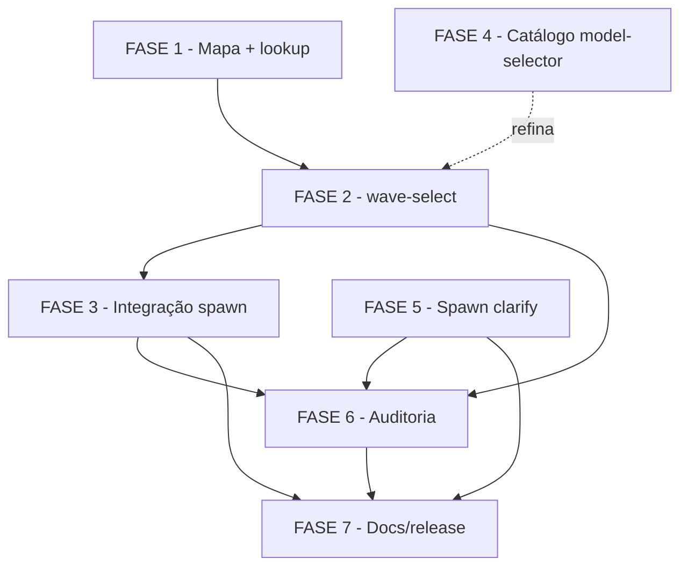

# Tasks — model-routing-por-onda

**Escopo**: aplicar model-routing de verdade na fronteira de onda (mapa
fase→modelo primário + refino model-selector), revogando o audit-only do FR-017
original. Deriva de [spec.md](./spec.md) + [plan.md](./plan.md).

**Legenda status**: `[ ]` pendente · `[x]` concluída · `[~]` em andamento
**Legenda criticidade**: `[C]` crítico (segurança/integridade) · `[A]` alto (core) · `[M]` médio

> Reuso obrigatório (não reinventar): idempotência por onda (`idempotent-check`) e
> reconciliador de half-record (`state-decisions-reconcile.sh`) da feature original
> `agente-00c-model-routing`. Helpers novos POSIX-puros (Princípio II); `jq` só no
> `model-routing.sh` pré-existente. Zero rede (Princípio IV).

---

## FASE 1 - Mapa fase→modelo (mecanismo primário)

### 1.1 Arquivo de mapa versionado `phase-model-map.txt` `[A]`
Ref: FR-014, FR-020 · data-model §MapaFaseModelo

- [x] 1.1.1 Criar `global/skills/agente-00c-runtime/references/phase-model-map.txt` com header de versão (`# phase-model-map v1`) e o recorte "3 faixas balanceado"
- [x] 1.1.2 Documentar formato (`fase|faixa|modelo`) e a regra "fase ausente → manter-atual" no topo do arquivo
- [x] 1.1.3 Teste: `tests/test_model-routing.sh` valida que o arquivo parseia e cobre as 11 fases do recorte

### 1.2 Subcomando `phase-model-lookup` `[A]`
Ref: FR-014, FR-020, FR-024 · contracts §phase-model-lookup

- [x] 1.2.1 Implementar `model-routing.sh phase-model-lookup --fase <f>` (POSIX-puro, sem jq) retornando `faixa|modelo`
- [x] 1.2.2 Resolução de path canonicalizada e confinada ao diretório do runtime (FR-024 — sem traversal, sem path externo)
- [x] 1.2.3 Fase desconhecida → `|manter-atual` (exit 0, nunca erro — FR-020)
- [x] 1.2.4 Teste: lookup de fase conhecida/desconhecida + tentativa de path traversal rejeitada

---

## FASE 2 - `wave-select` (seleção por onda)

### 2.1 Núcleo: mapa + Decisão auditável `[A]`
Ref: FR-001, FR-002, FR-007, FR-008 · contracts §wave-select · data-model §DecisãoDeRoteamentoPorOnda

- [x] 2.1.1 Implementar `model-routing.sh wave-select --state-dir <SD> [--etapa] [--task-text]`; resolver fase via flag ou `.etapa_corrente`
- [x] 2.1.2 Aplicar mapa (origem=mapa) como base e emitir o modelo em stdout
- [x] 2.1.3 Registrar DecisãoDeRoteamentoPorOnda (sugerido, aplicado, origem, score) via `state-decisions.sh register` + `state-ondas.sh record-skill` (par I3)
- [x] 2.1.4 Idempotência por onda: re-entrada não registra 2ª Decisão (FR-008). Nota: a `idempotent-check` legada filtra contexto `^Selecao de modelo para subagente ` (geração clarify); a DecisãoDeRoteamentoPorOnda usa lead `^Selecao de modelo para onda ` — a idempotência por onda é feita por jq sobre esse lead distinto (mesmo padrão read-only, sem colisão entre gerações, FR-021)
- [x] 2.1.5 Teste: cenários quickstart C1, C2, C7 (mapa rasa/profunda + idempotência)

### 2.2 Override do operador + validação `[C]`
Ref: FR-016, FR-023 · quickstart C5, C11

- [x] 2.2.1 Ler DecisãoDeOverride não-consumida para a onda (`escolha=model-override:<x>`) e dar precedência
- [x] 2.2.2 Validar valor do override contra enum `{haiku,sonnet,opus}`; inválido → fallback (mapa/manter-atual) com nota auditável, nunca propagar ao spawn (FR-023)
- [x] 2.2.3 Escopo de uma única onda; marcar override consumido na Decisão de roteamento (match por `onda_id` da onda corrente OU contexto que referencia o número da onda; override de onda anterior não vaza)
- [x] 2.2.4 Teste: override válido vence (C5); override inválido cai em fallback (C11)

### 2.3 Refino via model-selector + input untrusted `[A]`
Ref: FR-001, FR-005, FR-006, FR-019, FR-022, FR-025 · quickstart C3, C4, C6, C12

- [x] 2.3.1 Quando fase=execute-task e há `--task-text`, chamar `invoke --input-text <desc>`; ajustar faixa só se `score≥2` e não-fallback (origem=refino). Nota: parsing de `.fallback` via if-then-else explícito (jq `// ` trata `false` como vazio — bug capturado, dec-007)
- [x] 2.3.2 Sanitizar `--task-text` UNTRUSTED: remover NUL, truncar ao teto de bytes (4096), sem expansão/eval (reuso F-001/F-002 — FR-022)
- [x] 2.3.3 Fallback gracioso: model-selector ausente/score<2/modelo inválido → mapa/manter-atual, exit 0, nunca aborta (FR-006, FR-019)
- [x] 2.3.4 Scrub de texto livre gravado em `justificativa`/`sinais_text` via `secrets-filter.sh scrub` (FR-025); score do refino capado em 2 (sinais heurísticos não são evidência empírica de score 3 — dec-008)
- [x] 2.3.5 Teste: refino eleva (C3), refino sem sinal mantém mapa (C4), fallback (C6), task-text hostil sanitizado (C12)

### 2.4 Escalonamento mid-onda `[M]`
Ref: FR-015 · quickstart C9

- [x] 2.4.1 Definir sinal de subestimação no state: campo `.escalada_modelo_pendente` (bool) gravado pelo orquestrador ao detectar onda além da complexidade prevista
- [x] 2.4.2 `wave-select` lê o sinal e força opus na próxima onda (origem=mapa com nota de escalada), sem trocar modelo mid-run; precedência sobre o mapa-base, mas abaixo do override do operador
- [x] 2.4.3 Teste: cenário C9 (escalada para opus na onda seguinte)

---

## FASE 3 - Integração de spawn (commands/resume)

### 3.1 Inserir `wave-select` + aplicar `model` nos spawns `[A]`
Ref: FR-002, FR-009 · contracts §Integração de command

- [x] 3.1.1 Em `agente-00c.md` e `feature-00c.md`: rodar `wave-select` antes do bloco Agent inicial; spawnar com `model=<chosen>`
- [x] 3.1.2 Em `agente-00c-resume.md` e `feature-00c-resume.md`: idem antes do spawn de continuação (step 6/7), preservando o fluxo TOCTOU-safe (lock/sha-verify/bloqueios) — apenas INSERIR o passo wave-select
- [x] 3.1.3 Garantir bidirecionalidade (pode subir sonnet→opus e descer opus→haiku — FR-009)
- [x] 3.1.4 Teste: smoke de cada command instruindo o param model corretamente (assert textual no .md) — `tests/test_command-spawn-model-routing.sh` (21 scenarios; registrado como interno no orphan-check, existence-guarded)

### 3.2 `manter-atual` omite o param model `[A]`
Ref: FR-006 · quickstart C8

- [x] 3.2.1 Quando `wave-select` retorna `manter-atual`, o command spawna SEM o param `model` (herda sessão)
- [x] 3.2.2 Teste: cenário C8 (omissão do param) — 4 scenarios `*_manter_atual_omite_model` em `tests/test_command-spawn-model-routing.sh`

---

## FASE 4 - Expansão do catálogo model-selector (habilita refino) `[P]`

### 4.1 Expandir `sinais.md` + atualizar validação `[M]`
Ref: FR-018 · research D6

- [ ] 4.1.1 Adicionar termos de fase/complexidade e flexões comuns (projetar/projete/projeto, refatorar/refatore, analisar/analise, migrar/migracao...) mantendo formato de tabela e match por token
- [ ] 4.1.2 Atualizar o snippet de validação do catálogo no `sinais.md` ("Esperado: 16" → nova contagem) e o bloco por-faixa
- [ ] 4.1.3 Teste: atualizar `tests/test_model_selector_*.sh` que assertam contagem 15/16

### 4.2 Corpus de teste + métrica SC-008 `[M]`
Ref: FR-018, SC-008 · quickstart C10

- [ ] 4.2.1 Criar `tests/fixtures/` com corpus rotulado de descrições realistas (rasas/médias/profundas)
- [ ] 4.2.2 Teste mede taxa de `indeterminado` ≤ 25% e acerto rasa-vs-profunda (C10)

---

## FASE 5 - Aplicar model no spawn de clarify (US2) `[P]`

### 5.1 Editar passo 8 dos orquestradores `[M]`
Ref: FR-003 · contracts §Integração clarify

- [ ] 5.1.1 Em `agente-00c-orchestrator.md` §5.e.bis passo 8: passar `model=<MODELO>` (do JSON do invoke, se score≥2 e não-fallback) ao tool Agent do clarify
- [ ] 5.1.2 Mesma edição na seção model-routing de `agente-00c-feature-orchestrator.md`
- [ ] 5.1.3 `manter-atual`/fallback → omitir param (FR-003/FR-006)

### 5.2 Preservar degradação inline `[A]`
Ref: FR-004

- [ ] 5.2.1 Confirmar que no caminho degradado (mediação inline) nenhum override é tentado e nenhuma Decisão órfã é gerada
- [ ] 5.2.2 Teste: assert de que degradação inline não cria Decisão de modelo órfã

---

## FASE 6 - Auditoria sugerido-vs-aplicado (US3)

### 6.1 Estender `model-routing-report.sh aggregate` `[M]`
Ref: FR-012, FR-021 · contracts §agregador

- [ ] 6.1.1 Reportar distribuição do `modelo_aplicado`, taxa de fallback e de override-operador
- [ ] 6.1.2 Contar divergências sugerido≠aplicado com origem rotulada (0 sem rótulo — SC-006)
- [ ] 6.1.3 Coexistência com Decisões legadas audit-only (`fallback-default`) sem quebrar agregação (FR-021)
- [ ] 6.1.4 Teste: agregação sobre state misto (novo + legado) + assert de rótulos

### 6.2 review-task §4.5 + reconciliador half-record `[M]`
Ref: FR-013 · SC-002, SC-003

- [ ] 6.2.1 Atualizar `review-task` §4.5 para exibir sugerido-vs-aplicado e taxa de aplicação
- [ ] 6.2.2 Confirmar reuso do `state-decisions-reconcile.sh` para half-records (pendentes = 0)
- [ ] 6.2.3 Teste: half-record detectado e reconciliado na retomada

---

## FASE 7 - Documentação, BREAKING e release `[A]`

### 7.1 Atualizar docs da feature original + CLAUDE.md `[A]`
Ref: FR-017

- [ ] 7.1.1 Anotar superseção do FR-017 audit-only em `docs/specs/_archived/agente-00c-model-routing/` (premissa obsoleta removida)
- [ ] 7.1.2 Atualizar a seção model-routing do CLAUDE.md (aplicação real por onda + papel do mapa primário)
- [ ] 7.1.3 Verificar referências residuais ao comportamento audit-only (grep)

### 7.2 CHANGELOG MAJOR + verificação final `[A]`
Ref: FR-017 · plan §Complexity Tracking

- [ ] 7.2.1 Entrada no CHANGELOG marcando BREAKING (revogação do FR-017) + bump MAJOR
- [ ] 7.2.2 Rodar `./tests/run.sh` completo + `--check-coverage` (orphan-check: todo .sh novo tem teste)
- [ ] 7.2.3 `cstk doctor` limpo após build/install; validar drift zero

---

## Matriz de Dependências

> FASE 4 e FASE 5 são `[P]` (paralelizáveis): F4 não bloqueia F2 (refino degrada
> graciosamente sem catálogo expandido, mas F4 eleva seu valor); F5 só depende do
> `invoke` existente.

## Resumo Quantitativo

| Fase | Tarefas | Subtarefas | Criticidade dominante |
|------|---------|------------|------------------------|
| 1 | 2 | 7 | [A] |
| 2 | 4 | 17 | [A]/[C] |
| 3 | 2 | 6 | [A] |
| 4 | 2 | 5 | [M] |
| 5 | 2 | 5 | [M]/[A] |
| 6 | 2 | 7 | [M] |
| 7 | 2 | 6 | [A] |
| **Total** | **16** | **53** | — |

## Cobertura de FR

| FR | Tarefa(s) |
|----|-----------|
| FR-001, 002, 007, 008 | 2.1, 3.1 |
| FR-003, 004 | 5.1, 5.2 |
| FR-005, 006, 019 | 2.3 |
| FR-009 | 3.1 |
| FR-010, 011 | transversal (Princípios II/IV em todas as tarefas de helper) |
| FR-012, 021 | 6.1 |
| FR-013 | 6.2 |
| FR-014, 020 | 1.1, 1.2 |
| FR-015 | 2.4 |
| FR-016, 023 | 2.2 |
| FR-017 | 7.1, 7.2 |
| FR-018 | 4.1, 4.2 |
| FR-022, 025 | 2.3 |
| FR-024 | 1.2 |

## Escopo Coberto

- Mapa fase→modelo versionado + lookup confinado.
- Seleção por onda (mapa + override validado + refino untrusted + escalada).
- Aplicação real do modelo no spawn do orquestrador (commands/resume) e do clarify.
- Catálogo expandido + corpus de teste (SC-008).
- Auditoria sugerido-vs-aplicado + coexistência com Decisões legadas.
- Docs/BREAKING/MAJOR + verificação de testes e drift.

## Escopo Excluído

- Delegar fases (specify/plan/execute) a subagentes-worker dedicados para routing
  intra-fase — rejeitado (research/spec): agente não troca modelo mid-run; fora
  desta feature.
- Flag CLI `--model` na command como mecanismo primário de override — override é
  via Decisão manual (FR-016); flag é açúcar futuro, fora de escopo.
- Stemming/fuzzy match no classificador — mantém match por token exato (Princípio II).
</content>
