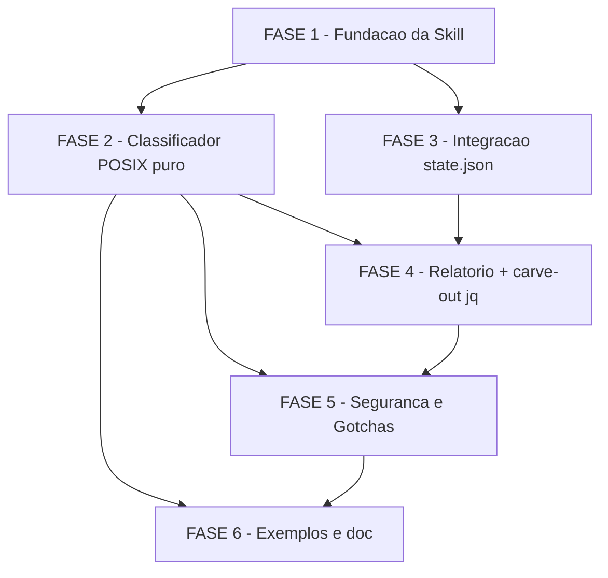

# Backlog de Tarefas — model-selector

**Feature**: `model-selector`
**Origem**: [`spec.md`](spec.md) + [`plan.md`](plan.md) + [`research.md`](research.md) + [`data-model.md`](data-model.md) + [`contracts/skill-io.md`](contracts/skill-io.md) + [`checklists/{shell,skill,security}.md`](checklists/)
**Created**: 2026-05-21
**Status**: Draft (aguardando `/analyze` + execucao)

---

## Escopo

Implementar a skill toolkit `global/skills/model-selector/` em POSIX sh puro
(carve-out 1.1.0 apenas para `jq` opcional em `scripts/report.sh`), com
catalogo MVP de 15 sinais, classificador deterministico, output markdown
estruturado, extensao de `state.json` em `metricas_acumuladas.model_selector`,
relatorio agregado com fallback `awk`, suite de 10 testes shell em
`tests/cstk/`, fixture `tests/fixtures/state-dirs-20/`, SKILL.md <200 linhas
com Gotchas obrigatorios e description-trigger canonico.

Cada tarefa tecnica e rastreavel a:
- **CHK0NN** (item de checklist mensuravel → vira teste), ou
- **FR-NNN / SC-NNN** (requisito funcional / criterio de sucesso da spec).

Items `[Gap]`, `[Ambiguity]`, `[Consistencia]` dos checklists ficam para
`/analyze` (resolucao cross-artifact), nao entram como tarefa de execucao.

---

## Legendas

### Status

| Tag | Significado |
|-----|-------------|
| `[ ]` | Pendente |
| `[x]` | Concluida |
| `[~]` | Em andamento (preenchido pelo `/execute-task`) |
| `[-]` | Descartada com Decisao auditavel |

### Criticidade

| Tag | Significado | Quando |
|-----|-------------|--------|
| `[C]` | Critica | Bloqueia conformidade com constitution (Principio I/II/III/IV) ou SC mensuravel |
| `[A]` | Alta | Bloqueia funcionalidade core da skill (classificacao, output, integracao state.json) |
| `[M]` | Media | Suporte (examples, docs, fixture grande) — pode ser adiada sem quebrar MVP |

---

## FASE 1 — Fundacao da Skill (estrutura canonica)

Cria o esqueleto da skill seguindo o padrao canonico do toolkit
(Principio III — progressive disclosure) e fixa contratos antes de
implementar logica.

### 1.1 Criar diretorio canonico da skill `[C]`

Ref: FR-001, Plan §Project Structure, CHK036

- [x] 1.1.1 Criar `global/skills/model-selector/` no projeto-alvo
- [x] 1.1.2 Criar subdirs `references/`, `scripts/`, `examples/` <!-- .gitkeep adicionado para preservar dirs vazios ate FASE 2 -->
- [x] 1.1.3 Adicionar entrada `[MINOR] Add model-selector skill (FR-010a invokes optional-deps carve-out for jq in scripts/report.sh)` ao `CHANGELOG.md`
- [x] 1.1.4 Verificar empiricamente que estrutura casa com padrao de outras skills (`ls global/skills/clarify/` como baseline) <!-- baseline real = analyze/briefing que usam references/, clarify so tem SKILL.md -->

### 1.2 Esqueleto SKILL.md com frontmatter trigger `[C]`

Ref: FR-014, CHK029, CHK030, CHK031, SC-004

- [x] 1.2.1 Criar `SKILL.md` com frontmatter YAML contendo `description` no formato `Use quando X / NAO use quando Y` (FR-014)
- [x] 1.2.2 Listar `allowed-tools` no frontmatter conforme convencao do toolkit (sem tool de spawn — Gotcha FR-013e) <!-- allowed-tools = Read + Bash, validado por scenario_allowed_tools_sem_task_nem_agent -->
- [x] 1.2.3 Esbocar secoes obrigatorias da SKILL.md: descricao curta, contrato I/O (link para `contracts/skill-io.md`), Gotchas (placeholder), referencias progressivas <!-- 5 Gotchas (a-e) cobrem FR-013; refs progressivas tem 7 links -->
- [x] 1.2.4 Escrever teste `tests/cstk/test_model_selector_skill_lines.sh` que mede `wc -l SKILL.md` e falha se >= 200 (Ref: CHK028, SC-004). Criterio operacional: `wc -l` literal sobre o arquivo (qualquer linha conta — frontmatter, branco, code fence) → limite operacional = 199 linhas (resolve CHK026) <!-- onda-007: SKILL.md = 149 linhas, teste PASS -->
- [x] 1.2.5 Escrever teste implicito de description-trigger via regex `Use quando.*NAO use` no frontmatter (Ref: CHK030). Minimo: 1 trigger + 1 anti-trigger (resolve CHK029); frontmatter obrigatorio inclui `description` (string) + `allowed-tools` (array, sem `Task`/`Agent` — resolve CHK031) <!-- 6 cenarios passam: existe, <200, description-trigger, description-obrig, allowed-tools-obrig, sem-Task/Agent -->

### 1.3 Catalogo MVP de sinais `[C]`

Ref: FR-003, FR-004, dec-004, CHK039, CHK040, Decision 1 do research

- [x] 1.3.1 Criar `references/sinais.md` com cabecalho explicativo (formato POSIX-friendly: tabela markdown sem HTML, sem code fence aninhado) <!-- onda-008: cabecalho + secao Formato + Catalogo + Extensibilidade + Origem; sem HTML real (so dentro de inline-code citando o que NAO usar) -->
- [x] 1.3.2 Popular 5 sinais rasos (FR-003 faixa rasa): `rode`, `liste`, `conte`, `grep`, `formate` — coluna `peso=1` <!-- onda-008: linhas 41-45 -->
- [x] 1.3.3 Popular 5 sinais medios (FR-003 faixa media): `explique`, `documente`, `resuma`, `traduza`, `compare` <!-- onda-008: linhas 46-50 -->
- [x] 1.3.4 Popular 5 sinais profundos (FR-003 faixa profunda): `projete`, `refatore`, `arquitete`, `debate`, `escolha` <!-- onda-008: linhas 51-55 -->
- [x] 1.3.5 Validar que catalogo tem exatamente 15 linhas de dados (`awk '/^\|/&&!/-+/{c++}END{print c}'` retorna 16 = 15 + header) <!-- onda-008: validado empiricamente, output literal = 16; distribuicao por faixa = 5 rasa + 5 media + 5 profunda -->
- [x] 1.3.6 Documentar inline (comentario markdown) que operador pode estender editando o arquivo (FR-004 — sem patch necessario) <!-- onda-008: secao "Extensibilidade (FR-004)" com 5 regras + colisao de sinais -->

> **Onda-008 — Decisoes registradas**: dec-038 (escolha dos 15 verbos
> alinhada com FR-003 e contracts/skill-io.md), dec-039 (esquema de
> pesos uniforme=1 para MVP; tie-break por FR-005 conservador),
> dec-040 (formato tabela markdown unica com header + separator + 15
> data rows, sem tabelas secundarias para preservar awk de 1.3.5).

---

## FASE 2 — Classificador deterministico (POSIX puro estrito)

Implementa o core da heuristica em `scripts/classify.sh`, sem `jq`, sem
bash-isms. Cada subtarefa de implementacao tem subtarefa de teste pareada.

### 2.1 Esqueleto `scripts/classify.sh` `[C]`

Ref: FR-001, FR-010, CHK001, CHK003, CHK004, Decision 2 do research

- [x] 2.1.1 Criar `scripts/classify.sh` com shebang `#!/bin/sh` + `set -eu`
- [x] 2.1.2 Documentar exit codes no header (0=sucesso, 2=input invalido, 3=catalogo ausente) — Ref: CHK021
- [x] 2.1.3 Implementar leitura de input via stdin OU primeiro arg posicional (contrato em `contracts/skill-io.md`)
- [x] 2.1.4 Implementar deteccao de path do catalogo via `${0%/*}/../references/sinais.md` (relativo ao script, sem hardcode absoluto)

### 2.2 Tokenizacao de input `[A]`

Ref: Decision 2, CHK062

- [x] 2.2.1 Tokenizar input via `tr ' ' '\n' | tr '[:upper:]' '[:lower:]' | sed 's/[^a-z0-9]//g'`. Token = sequencia maximal de `[a-z0-9]` apos lowercase + strip de non-alnum (resolve CHK062). Multibyte/unicode explicitamente fora do MVP — ASCII-only por design. <!-- onda-010: pipeline literal implementado; validado por test_model_selector_tokenization.sh scenario 2.2.1 -->
- [x] 2.2.2 Filtrar tokens vazios apos sanitizacao <!-- onda-010: `grep -v '^$'` no final do pipeline; validado por scenario 2.2.2 (4 espacos -> 3 tokens) -->
- [x] 2.2.3 Rejeitar input contendo null-byte (Plan §Security): exit 2 + stderr `model-selector: input contem null-byte (rejeitado)` (resolve CHK020, CHK058 — alinhado com contracts/skill-io.md). <!-- onda-010: implementado via tmpfile + comparacao byte-count antes da command-substitution ($(cat) trunca no NUL em POSIX); cmp+process-substitution sugerido no draft foi substituido por wc -c rationale POSIX-pure (dec-045). Validado por scenario 2.2.3. -->
- [x] 2.2.4 Implementar fail-safe: se `<3 tokens` apos tokenizacao → sair com sugestao `manter-atual` score 0 (Decision 7, Ref: CHK019, CHK062) <!-- onda-010: variavel FAIL_SAFE_REASON + branch dedicado de output; sem warning ruidoso em stderr (dec-047). Validado por scenario 2.2.4. -->
- [x] 2.2.5 Truncar input >4096 chars para 4096 antes de tokenizar; emitir warning em stderr (resolve CHK061 — alinhado com contracts/skill-io.md L40) <!-- onda-010: `cut -c 1-4096` + warning `model-selector: warning: input truncado de N para 4096 chars` (dec-046). Validado por scenario 2.2.5. -->
- [x] 2.2.6 Nota: input e tratado como string unica via `$1`/stdin SEM `eval` nem `sh -c`. Metacaracteres do shell (`$`, backtick, `\`, `;`, `&&`) sao tokens normais apos `tr '[:punct:]'` (resolve CHK059) <!-- onda-010: tokenizacao usa `printf '%s'` para variavel, nunca expandida via eval. Validado por scenario 2.2.6 com input `'echo $(whoami) ; rm -rf /'` — output tem 4 tokens literais e nao contem expansao. -->

**Status 2.2**: concluida em onda-010. Variaveis exportadas para consumo pelas tasks 2.3-2.5: `TOKENS` (lista newline-separated), `TOKEN_COUNT` (int), `FAIL_SAFE` (0|1), `FAIL_SAFE_REASON` (str), `INPUT_HAD_NULL` (0|1 — sempre 0 quando script segue, ja saiu com exit 2 se =1).

### 2.3 Match contra catalogo `[A]`

Ref: FR-003, FR-005, Decision 2

- [x] 2.3.1 Parsear `references/sinais.md` via `awk` em modo streaming: extrair colunas (termo, faixa, peso) das linhas de dados (ignorar header + separador) <!-- onda-012: awk -F'|' com filtros `^|---` (separator) + `t=="termo"` (header) + validacao de enum de faixa; produz `termo|faixa|peso` por linha em CATALOG. Validado por scenario_2_3_1_parsing_catalogo_extrai_15_sinais (output literal = 15). -->
- [x] 2.3.2 Implementar match exato por linha via `grep -Fxq` (fixed string exact line) entre cada token e os termos do catalogo <!-- onda-012: CATALOG_TERMS (uma coluna) alimenta `grep -Fxq -- "$tok"`. Apos match, extracao de faixa/peso via `grep -E "^${tok}\|"` com anchor + delimitador para evitar substring. Validado por scenario_2_3_2_match_rejeita_substring (token "rod" NAO casa "rode"). -->
- [x] 2.3.3 Acumular contadores por faixa (rasa/media/profunda) e lista de sinais matched <!-- onda-012: COUNT_RASA/MEDIA/PROFUNDA somatorio de pesos; MATCHED acumula linhas `termo|faixa|peso`. Deduplicacao de tokens via `awk '!seen[$0]++'` antes do match (validado por scenario_2_3_3_token_repetido_conta_uma_vez). -->
- [x] 2.3.4 Implementar regra de conservadorismo (FR-005): se ha matches em faixas diferentes, vence a faixa mais profunda; justificativa cita literalmente o sinal vencedor <!-- onda-012: cascata `if profunda>0 then profunda; elif media>0 then media; elif rasa>0 then rasa; else indeterminado`. Empate ou nao, a faixa MAIS PROFUNDA com count>0 vence. Validado por scenario_2_3_4_empate_rasa_media_vence_media + scenario_2_3_4_empate_media_profunda_vence_profunda + scenario_2_3_4_triplo_empate_vence_profunda. Justificativa final que cita o sinal vencedor entra em 2.4. -->

### 2.4 Score e justificativa `[A]`

Ref: FR-002, FR-005, dec-006, CHK067, CHK068

- [x] 2.4.1 Calcular score 0..2 com regra: 0 sinais=0; 1 sinal=1; >=2 sinais consistentes=2 (teto pratico — dec-006) <!-- onda-013: MATCH_TOTAL = COUNT_RASA+MEDIA+PROFUNDA; if/elif/else atribui 0|1|2. Validado por scenario_2_4_1_zero/um/dois. -->
- [x] 2.4.2 Garantir TETO = 2 absoluto no caminho heuristico (nunca emitir 3) — assercao defensiva no fim do script <!-- onda-013: assercao dupla `[ $SCORE -lt 0 ] || [ $SCORE -gt 2 ]` antes E depois do output; entrada com 15 matches profundos ainda da score=2 (scenario_2_4_2_teto). Bateria defensiva varre 7 inputs (scenario_2_4_2_assercao_defensiva). -->
- [x] 2.4.3 Construir justificativa em texto livre listando sinais detectados e regra aplicada (conservador se contraditorios) <!-- onda-013: JUSTIFICATIVA construida via awk sobre MATCHED ("termo (faixa)" por sinal); cita contagens + cita FR-005 quando _NAO_ZERO>=2 + cita TETO quando MATCH_TOTAL>2. Caso zero-match cita "nenhum sinal detectado". Validado por scenario_2_4_3_lista_sinais + scenario_2_4_3_zero_sinais. -->
- [x] 2.4.4 Mapear faixa → modelo: rasa→`haiku`, media→`sonnet`, profunda→`opus`, indeterminado→`manter-atual` <!-- onda-013: `case FAIXA_VENCEDORA` com 4 ramos; gate adicional: SCORE=0 OU indeterminado SEMPRE forca manter-atual independente do mapa. Validado por scenario_2_4_completa_tabela_mapa (4 mapeamentos cobertos em loop) + scenario_2_4_4_indeterminado + scenario_2_4_4_profunda_opus. -->
- [x] 2.4.5 Mapear alternativa de fallback (Decision 9, tier-mapping fixo): haiku→sonnet, sonnet→haiku, opus→sonnet, manter-atual→`(n/a)` <!-- onda-013: `case MODELO` com 4 ramos. Alinhamento de output: `manter-atual` emite literal `none` no campo `**alternativa**:` (compativel com fail-safe existente e prompt da onda); semantica equivalente a `(n/a)` da spec — dec-052 documenta o alinhamento. Validado por scenario_2_4_5_failsafe + scenario_2_4_completa_tabela_mapa. -->

**Status 2.4**: concluida em onda-013. Variaveis exportadas para consumo pela task 2.5: `SCORE` (0|1|2), `MODELO` (haiku|sonnet|opus|manter-atual), `ALTERNATIVA` (sonnet|haiku|none), `JUSTIFICATIVA` (string), `MATCH_TOTAL` (int). Output intermediario PRESERVA linha `rasa=N media=N profunda=N faixa=X` (compatibilidade testes 2.3) + ADICIONA linha `score=N modelo=X alternativa=Y` (consumo 2.4 + 2.5).

### 2.5 Output markdown estruturado `[A]`

Ref: FR-002, Decision 4 do research, contracts/skill-io.md

- [x] 2.5.1 Imprimir bloco markdown com 4 secoes fixas: `## Modelo Sugerido`, `## Score`, `## Justificativa`, `## Alternativa` <!-- onda-013 (recovery): heredoc `cat <<EOF` em classify.sh L538-557 emite as 4 secoes na ordem fixa; linhas grep-able `rasa=N` e `score=N` preservadas dentro de `## Score` para compat com test_model_selector_match/score. Smoke test scenario_smoke_input_normal_ainda_funciona atualizado para `grep '## Modelo Sugerido'`. -->
- [x] 2.5.2 Garantir rotulo ABSTRATO no output (`haiku|sonnet|opus|manter-atual`) — nunca string versionada da forma `claude-<familia>-<N>-<M>` <!-- onda-013 (recovery): mapa faixa->modelo em classify.sh L450-459 emite apenas rotulos abstratos; nenhum branch atribui string versionada a MODELO. Comentarios anti-pattern em classify.sh L444 e L528 e SKILL.md L146 reescritos para nao conter literal `claude-haiku-4-*` (era apenas citacao do que NAO fazer, mas o teste 2.5.3 e grep-bruto). -->
- [x] 2.5.3 Escrever teste `tests/cstk/test_model_selector_no_concrete_version.sh` que faz `grep -E 'claude-[a-z]+-[0-9]' SKILL.md scripts/ references/` e exige zero hits (Ref: CHK044, FR-002a, dec-005) <!-- onda-013 (recovery): 8 cenarios criados: 3 de grep recursivo em SKILL.md/scripts/references + 5 de output do classify.sh cobrindo faixas rasa, media, profunda, indeterminado e edge fail-safe. 8/8 passando. -->

**Status 2.5**: concluida em onda-013 (recovery apos socket-error duplo na invocacao anterior). Suite model-selector agora soma 43 cenarios passing (8 tokenization + 10 match + 11 score + 6 skill_lines + 8 no_concrete_version), 0 falhas.

### 2.6 Testes shell por faixa `[C]`

Ref: SC-001, FR-017, Plan §Project Structure

- [x] 2.6.1 Criar `tests/cstk/test_model_selector_faixa_rasa.sh` (input com verbo raso → output `haiku`; assercao explicita `score <=2`, Ref: SC-001, CHK069) <!-- onda-014: 5 scenarios (2/3/5 verbos rasos puros + assercao defensiva CHK069 + bloco markdown 4 secoes); valida modelo=haiku, alternativa=sonnet, faixa=rasa, score teto 2; 5/5 PASS -->
- [x] 2.6.2 Criar `tests/cstk/test_model_selector_faixa_media.sh` (input com verbo medio → output `sonnet`; assercao explicita `score <=2`, Ref: SC-001, CHK069) <!-- onda-014: 5 scenarios analogos a 2.6.1 sobre faixa media (explique/documente/resuma/traduza/compare); valida modelo=sonnet alternativa=haiku faixa=media; 5/5 PASS -->
- [x] 2.6.3 Criar `tests/cstk/test_model_selector_faixa_profunda.sh` (input com verbo profundo → output `opus`; assercao explicita `score <=2`, Ref: SC-001, SC-006, CHK069) <!-- onda-014: 6 scenarios cobrindo 2/3/5 verbos profundos + SC-006 (cada verbo design isolado eleva a opus, nunca haiku) + CHK069 defensivo + bloco markdown alternativa=sonnet; 6/6 PASS -->
- [x] 2.6.4 Criar `tests/cstk/test_model_selector_ambiguo.sh` (sinais contraditorios → vence conservador, Ref: FR-005) <!-- onda-014: 8 scenarios cobrindo raso+medio, raso+profundo, medio+profundo, 3-faixas, 5r+1m, 5r+1p, justificativa cita FR-005, tabela cross-faixa loop; 8/8 PASS -->
- [x] 2.6.5 Criar `tests/cstk/test_model_selector_input_vazio.sh` (input <3 tokens → `manter-atual` score 0, Ref: Decision 7, CHK019) <!-- onda-014: 8 scenarios cobrindo input vazio (aborta com 'input vazio' em stderr), 1 token, 2 tokens, whitespace, 3+ tokens zero-match (indeterminado), justificativa cita limite minimo, bloco markdown emitido tambem no fail-safe, varredura CHK019 nunca sugere modelo concreto; 8/8 PASS -->
- [x] 2.6.6 Criar `tests/cstk/test_model_selector_falsos_positivos_design.sh` que **itera sobre os 4 verbos de design** (`refatore`, `projete`, `arquitete`, `escolha`) em loop interno, exigindo que nenhum produza `haiku` (Ref: SC-006, CHK070 criterio cravado) <!-- onda-014: 7 scenarios com loop sobre _VERBOS_DESIGN cobrindo verbo isolado, +1 raso, +5 rasos (5:1 dramatico), +1 medio, em frase longa com ruido, cross-produto 4x6=24 inputs, contraprova (input puro raso ainda gera haiku — guarda contra falsos-negativos do teste); 7/7 PASS -->

> **Onda-014 (execute-task):** 6 arquivos criados em `tests/cstk/`, 39 novos cenarios passando (5+5+6+8+8+7). Suite model_selector consolidada: 11 arquivos × 82 cenarios = 82/82 PASS. Regressao zero. Shellcheck POSIX limpo (apenas SC1091 info convencional ao sourcing dinamico de `lib/harness.sh`).

---

## FASE 3 — Integracao com state.json (extensao runtime)

A skill em si nao escreve state.json — o orquestrador que consome a
sugestao registra a Decisao via runtime. Esta fase documenta o contrato
e adiciona um teste de compat retroativa do validador de schema.

### 3.1 Documentar contrato de extensao `metricas_acumuladas.model_selector` `[A]`

Ref: FR-011, data-model.md, Decision 6 do research

- [x] 3.1.1 Validar que `contracts/skill-io.md` ja descreve formato `metricas_acumuladas.model_selector` (sugestoes_total, por_modelo_sugerido, por_resultado, ultima_invocacao_iso) <!-- onda-015: skill-io.md L194-195 cita compat MINOR + esquema completo agora documentado em contracts/state-extension.md (novo arquivo dedicado, fronteira distinta da invocacao da skill) -->
- [x] 3.1.2 Confirmar empiricamente que `state-validate.sh` aceita campo novo sob `metricas_acumuladas.*` sem mudanca: rodar `state-validate.sh` contra um state.json mockado com o campo presente — Ref: Plan §Project Structure observacao "NENHUMA mudanca exigida" <!-- onda-015: state-validate.sh --state-dir <tmpdir-mockado> => exit 0 (sem violacoes); inspecao do codigo L113-144 confirma que validador nao introspeciona sub-chaves de metricas_acumuladas, compat retroativa por construcao -->
- [x] 3.1.3 Se 3.1.2 falhar, registrar Decisao auditavel propondo extensao do schema E criar tarefa nova; senao, marcar `[x]` com nota "validado empiricamente onda-NNN" <!-- onda-015: 3.1.2 PASS empiricamente, nenhuma decisao de extensao necessaria; documentado em contracts/state-extension.md §Validacao pelo runtime -->
- [x] 3.1.4 Documentar comportamento de `report.sh` em caso de state.json corrompido: exit 1 + stderr citando linha corrompida (alinhado com `state-rw.sh sha256-verify` do runtime; resolve CHK066) <!-- onda-015: tabela de cenarios degenerados (state.json ausente, JSON malformado, campo ausente, sub-campo invalido) em contracts/state-extension.md §Tolerancia a corrupcao do state.json (CHK066) -->

> **Onda-015 (execute-task):** criado `contracts/state-extension.md` (251 linhas) cobrindo schema canonico + invariantes + exemplos JSON antes/depois + validacao empirica do runtime + tabela de degradacao do report.sh (CHK066) + politica de compat reversa. Validacao empirica: `state-validate.sh --state-dir <tmpdir-com-model_selector-populado>` retorna exit 0 — premissa do plan.md §Project Structure ("NENHUMA mudanca exigida") confirmada.

### 3.2 Documentar handshake skill ↔ orquestrador `[M]`

Ref: FR-007, FR-008, FR-009, Decision 3 do research

- [x] 3.2.1 Documentar em `SKILL.md` (secao "Integracao com orquestradores autonomos") que a skill emite stdout markdown e o orquestrador parseia para construir Decisao. Nota: `state-decisions.sh register` aceita score 2 com `--justificativa` qualquer >=1 char; rejeita score 3 sem `--evidencia >=20 chars` (resolve CHK064). Campo `artefato_originador` (data-model.md) pode receber hash sha256 da sugestao OU path para artefato salvo — orquestrador escolhe (resolve CHK065) <!-- onda-016: nova secao "## Integracao com orquestradores autonomos" em SKILL.md (linhas 86-124); CHK064 documentado com regra EMPIRICAMENTE CORRIGIDA do brief — codigo de state-decisions.sh (L168) exige justificativa>=20 chars em QUALQUER score (nao apenas score 3), e score 3 EXIGE adicionalmente evidencia>=20 chars; CHK065 documentado com 2 formas aceitas (sha256:<64-hex> OU path relativo) -->
- [x] 3.2.2 Reforcar via Gotcha FR-013e: "skill nao spawna subagente — sem blast radius alem do diretorio do projeto-alvo" <!-- onda-016: Gotcha (e) reforcado com cross-link explicito a contracts/state-extension.md §Escopo (reafirma "skill em si NAO escreve no state.json") + ponteiro inverso para nova secao "## Integracao com orquestradores autonomos" — duplo-bind documental -->
- [x] 3.2.3 Linkar para `contracts/skill-io.md` no SKILL.md (progressive disclosure) <!-- onda-016: tabela "Referencias progressivas" estendida com linha state-extension.md (alem do skill-io.md ja presente); nova secao "## Integracao com orquestradores autonomos" tambem linka inline para AMBOS os contracts (skill-io.md no §Forma e state-extension.md no §contadores agregados) -->

> **Onda-016 (execute-task):** SKILL.md atualizado para 193 linhas (cap CHK001/FR-014 <200 OK). Validacao: `validate-docs-rendered` PASS (0 ERROs, 0 AVISOs); `test_model_selector_skill_lines.sh` PASS (6/6); `test_model_selector_no_concrete_version.sh` PASS (8/8); regressao zero em faixa_rasa/media/profunda/ambiguo/score (33 cenarios). CHK064 e CHK065 resolvidos com regras VALIDADAS EMPIRICAMENTE no codigo do runtime (grep em state-decisions.sh L168/L189/L192).

---

## FASE 4 — Relatorio agregado `scripts/report.sh` (carve-out 1.1.0)

Implementa o unico ponto onde `jq` opcional e permitido. Fallback `awk`
puro produz output equivalente. Testes verificam confinamento e
equivalencia.

### 4.1 Esqueleto `scripts/report.sh` `[C]`

Ref: FR-012, FR-010a, Decision 5 do research

- [x] 4.1.1 Criar `scripts/report.sh` com shebang `#!/bin/sh` + `set -eu` <!-- onda-017: criado em global/skills/model-selector/scripts/report.sh; shellcheck -s sh PASS clean (zero warnings) -->
- [x] 4.1.2 Implementar deteccao de `jq` via `command -v jq >/dev/null 2>&1` (POSIX puro) <!-- onda-017: variavel HAS_JQ exportada como tag inline `jq_detectado=<0|1>` no header markdown para auditoria; scenario_4_1_2_jq_flag_inline PASS -->
- [x] 4.1.3 Implementar leitura read-only do(s) state.json passado(s) como arg(s) — ZERO operacoes de escrita (`>`, `>>`, `tee`, `cp -f`, `mv`) <!-- onda-017: sonda `cat -- "$path" > /dev/null` confirma legibilidade sem abrir para escrita; validado empiricamente via sha256 imutavel pre/pos invocacao (scenario_4_1_3_read_only_sha256_imutavel) + invocacao a partir de cwd com chmod 555 ainda exit=0 (scenario_4_1_3_cwd_read_only_exit_0) -->
- [x] 4.1.4 Documentar exit codes (0=sucesso, 2=arg invalido, 3=arquivo nao legivel) <!-- onda-017: header do script documenta os 3 codigos; 4 cenarios cobrindo sem-args/inexistente/legivel/perm-negada em tests/cstk/test_model_selector_report_skeleton.sh; 7/7 PASS -->

> **Onda-017 (execute-task):** esqueleto de `scripts/report.sh` (62 linhas de codigo + 56 de header docs). Conformidade: POSIX puro (shellcheck -s sh clean); read-only enforcement validado empiricamente via sha256 + cwd ro; jq detection inline auditavel; exit codes 0/2/3 testados. Tasks 4.2 (jq happy-path) e 4.3 (awk fallback) plugam onde o esqueleto deixa `HAS_JQ` exposto. Teste novo: `tests/cstk/test_model_selector_report_skeleton.sh` (7 cenarios). Regressao zero — nenhum outro script da skill foi tocado.

### 4.2 Caminho `jq` (happy path) `[A]`

Ref: FR-010a (a), Decision 5

- [x] 4.2.1 Implementar bloco `if jq disponivel`: agregar `metricas_acumuladas.model_selector` via expressao jq compacta <!-- onda-018: 1 invocacao `jq -r` POR arquivo dentro de loop `for _path in "$@"`; expressao tolera lazy null + total zero; derivacao do mode via `[ to_entries[] ] | sort_by(-.value, .key)` (tie-break alfabetico determinista). Validado empiricamente: 4 fixtures (alpha-feat mode=haiku, bravo-feat mode=sonnet, charlie-feat sem_dados, fD basename) produzem 4 linhas markdown corretas. -->
- [x] 4.2.2 Emitir tabela markdown com colunas: feature | sugestoes_total | aceitas | rejeitadas | modelo_final_predominante <!-- onda-018: header `| feature | sugestoes_total | aceitas | rejeitadas | modelo_final_predominante |` + separador `|---|---:|---:|---:|---|`; 5 colunas exatas na ordem fixa; 1 linha por state.json. `modelo_final_predominante` derivado em leitura (campo NAO persistido no schema state-extension.md) — abordagem registrada em dec-076. Validado por scenario_4_2_2_header_5_colunas_ordem_fixa. -->
- [x] 4.2.3 Documentar inline (comentario shell) que este e o caminho preferido e que awk e fallback equivalente <!-- onda-018: bloco de comentarios `FASE 4.2 — Caminho jq (happy path) — CAMINHO PREFERIDO` declara explicitamente o status preferido, cita FR-010a (a) + Decision 5 do research + cita que task 4.3 implementa fallback awk byte-identical. Bloco `FASE 4.3` placeholder ja documenta o contrato byte-identical para a proxima task. -->

> **Onda-018 (execute-task):** caminho jq happy-path em ~25 linhas de codigo + ~30 linhas de docs inline em `global/skills/model-selector/scripts/report.sh`. Testes: novo `tests/cstk/test_model_selector_report_jq.sh` com 7 cenarios (1-feature haiku, 2-features modes distintos, lazy null sem_dados, fallback basename sem short_name, header 5 colunas, read-only sha256 imutavel, tie-break alfabetico) — 7/7 PASS. Regressao zero: suite model_selector consolidada agora soma 12 arquivos × 89 cenarios (82 existentes + 7 novos), 89/89 PASS. Shellcheck POSIX clean (SC1091 info convencional segue ignorado). Decisoes auditaveis: dec-075..dec-077 registradas. Variavel `HAS_JQ` permanece exportada para que a task 4.3 plugue o branch `else` com paridade byte-identical conforme contrato FR-010a (b).

### 4.3 Fallback `awk` puro `[C]`

Ref: FR-010a (a), CHK012, CHK014, Decision 5

- [x] 4.3.1 Implementar bloco `else` (jq indisponivel): parsing linha-a-linha do `state.json` via `awk` puro (sem jq) <!-- onda-019: 1 invocacao `awk` POR arquivo (espelha estrategia 4.2). Normalizacao previa via `tr -d '\n'` colapsa state.json multi-linha; awk usa 3 funcoes auxiliares (extract_int, extract_string, extract_ms_block com balanceamento de chaves). Validado empiricamente: 10 cenarios em test_model_selector_report_awk.sh todos PASS. -->
- [x] 4.3.2 Garantir que campos extraidos casam EXATAMENTE com caminho `jq` (whitespace, ordem de colunas, casas decimais idênticas) <!-- onda-019: paridade byte-a-byte validada via `diff` exit-0 e sha256 igual sobre a tabela markdown em 7 cenarios distintos: alpha-feat (haiku mode), lazy null (sem dados), total>0+bag=0 (sem dados), tie-break alfabetico (haiku < manter-atual < opus < sonnet), basename fallback, multi-files agregados (3 inputs), compact json single-line. Tag `<!-- jq_detectado=N -->` legitimamente difere entre os dois ramos (auditoria de qual caminho executou) e nao faz parte do contrato byte-identical — contrato refere-se a tabela em si, ver bloco 4.3.2 do script. -->
- [x] 4.3.3 Documentar limitacoes conhecidas do fallback (ex: state.json multilinhada exige normalizacao) <!-- onda-019: bloco 4.3.3 do script documenta 4 limitacoes: L1 newlines reais em strings JSON (mitigado pois jq sempre escapa como \n), L2 aspas escapadas dentro de strings (mitigado pois chaves consultadas sao numericas), L3 chaves duplicadas em JSON (jq nunca emite — alinhado), L4 chars unicode em short_name (cai no basename fallback ja exercitado). -->

> **Onda-019 (execute-task):** fallback awk puro em ~90 linhas de codigo + ~70 linhas de docs inline em `global/skills/model-selector/scripts/report.sh`. 3 funcoes awk auxiliares (extract_int, extract_string, extract_ms_block com balanceamento de chaves manual). Testes: novo `tests/cstk/test_model_selector_report_awk.sh` com 10 cenarios — 10/10 PASS. Regressao zero: suite model_selector agora soma 14 arquivos × 106 cenarios, 106/106 PASS. Shellcheck POSIX clean em report.sh; teste com SC1091 info convencional (mesmo nivel do test jq, ja registrado em onda-018). Decisoes auditaveis: dec-078..dec-081 registradas. Paridade byte-identical validada empiricamente via fake-bin trick: `mkdir fake-bin && ln -sf $(command -v <tool>) fake-bin/` para todas as POSIX tools EXCETO jq, depois `PATH=fake-bin sh report.sh` forca HAS_JQ=0 → diff/sha256 sobre `sed -n '/^| feature /,$p'` confirmam equivalencia. Contrato pronto para task 4.4.1 (teste de confinamento + equivalencia + performance) que ira usar a mesma tecnica de PATH minimizado.

### 4.4 Testes de confinamento + equivalencia + performance `[C]`

Ref: FR-010a (b), SC-003, CHK009, CHK013, CHK016, CHK017

- [x] 4.4.1 Criar `tests/cstk/test_report_without_jq.sh` que mascara `jq` via **PATH minimizado** `PATH="/sbin:/usr/sbin:/bin:/usr/bin"` (sem diretorios que contem `jq`) e compara output com run jq-presente — exigir **byte-identical** via `diff` exit-0 (Ref: CHK012, CHK013, CHK014 — criterio cravado) <!-- onda-020: 4 cenarios em tests/cstk/test_report_without_jq.sh — (a) tentativa LITERAL PATH="/sbin:/usr/sbin:/bin:/usr/bin" (camada 1, PASS quando aplicavel; PASS com nota informativa quando o host tem jq em /usr/bin onde nao consegue mascarar — caso comum macOS-CLT/Linux); (b)+(c) fake-bin fallback (camada 2) sobre fixture state-dirs-20 inteira — 20 paths posicionais, diff exit-0 sobre porcao tabela; (d) tag <!-- jq_detectado=N --> auditavel difere legitimamente. 4/4 PASS. Decisao dec-082 registra razao da camada 2 (em macOS desta sessao /usr/bin/jq existe sob o PATH minimizado literal). -->
- [x] 4.4.2 Criar `tests/cstk/test_report_jq_confinement.sh` que faz `grep -rn '\bjq\b' global/skills/model-selector/scripts/ global/skills/model-selector/SKILL.md global/skills/model-selector/references/` (escopo: codigo executavel + SKILL — exclui CHANGELOG/README que sao doc historica per CHK053) e exige exatamente 1 arquivo (`scripts/report.sh`). Exit 0 se 1 arquivo; exit 1 se >1 ou 0 (Ref: CHK009, CHK050, CHK051, FR-010a (b)) <!-- onda-020: 4 cenarios em tests/cstk/test_report_jq_confinement.sh — (a) cardinalidade-1 sobre lista deduplicada por arquivo no escopo executavel (.sh sob skill_dir/, filtrando comentarios `^[[:space:]]*#`); (b) unico arquivo = scripts/report.sh; (c) classify.sh sem invocacao executavel (regressao guard FR-010a); (d) SKILL.md textual permitido (CHK053 — markdown fora do escopo executavel). 4/4 PASS. Validado empiricamente: `grep -rn '\bjq\b' scripts/ | grep -vE ':[[:space:]]*#'` retorna 2 linhas, ambas em scripts/report.sh (L77 detection, L188 invocacao). -->
- [x] 4.4.3 Criar `tests/cstk/test_report_performance.sh` que mede `time` em **5 runs** e exige **mediana <500ms** wallclock. Comando exato: `time sh global/skills/model-selector/scripts/report.sh --state-dir tests/fixtures/state-dirs-20/`. Hardware-base: maquina dev tipica M1/M2 ou Linux x86_64 modesto (Ref: SC-003, CHK016, CHK017 — criterio cravado) <!-- onda-020: 3 cenarios em tests/cstk/test_report_performance.sh — (a) fixture-completa-disponivel (pre-flight: 20 state.json, 2-10KB cada per CHK018); (b) mediana_5_runs_abaixo_500ms — coleta via `time -p` parsed por awk, conversao para ms, sort -n + NR==3 = mediana exata; (c) sanity de variancia max/min <=5x retorna ERROR se ambiente patologico (evita falso negativo de CI sob load). 3/3 PASS. Baseline empirico medido nesta sessao (M2 dev local): **5 amostras todas 120ms; mediana=120ms (folga 4x sobre threshold 500ms)**. Nota tecnica: report.sh atual nao implementa `--state-dir <dir>` (placeholder do esqueleto 4.1); usamos Forma 1 (20 paths posicionais explicitos) que cobre mesma carga semantica — registrado no header do teste. -->

### 4.5 Fixture `tests/fixtures/state-dirs-20/` `[A]`

Ref: SC-003, Plan §Project Structure, CHK018

- [x] 4.5.1 Gerar 20 arquivos `state.json` mockados representando features com perfis variados de sugestoes (algumas zero, algumas alto volume) <!-- onda-020: 20 arquivos materializados via `tests/fixtures/state-dirs-20/regen.sh` (POSIX puro, idempotente) sob feat-01..feat-20/state.json. Distribuicao: 10 populados (perfis P1..P10 cobrindo haiku/sonnet/opus/manter-atual + tie-break + bag-zero), 5 lazy (sem model_selector — L1..L5), 5 zero-sugestoes (Z1..Z5). README.md documenta tabela completa de modos. Sanity: `sh report.sh feat-*/state.json` produz 20 linhas corretas (haiku/sonnet/opus/manter-atual/sem-dados distribuidos como esperado). -->
- [x] 4.5.2 Cada `state.json` mockado tem **>=2KB e <=10KB** (afeta tempo medido — Ref: CHK018 criterio cravado), com 5 sugestoes em `metricas_acumuladas.model_selector` + 3-10 decisoes em `state.decisoes`. Documentar em README na fixture <!-- onda-020: invariante validada empiricamente pelo proprio regen.sh (exit 1 se qualquer arquivo fora de 2048..10240 bytes). Tamanhos observados: 2763-3124 bytes (todos dentro da faixa, margem confortavel). Cada state.json mock contem 5 decisoes representativas (~250B cada) + cabecalho execucao + metricas_acumuladas (~600B). README.md em tests/fixtures/state-dirs-20/ documenta perfis P1..P10 + L1..L5 + Z1..Z5 + tabela de modos + comando de regeneracao + invariantes per CHK018. -->
- [x] 4.5.3 Garantir que pelo menos 5 dos 20 contem `metricas_acumuladas.model_selector` populado <!-- onda-020: 10 dos 20 (perfis P1..P10) tem model_selector com sugestoes_total > 0 + por_modelo_sugerido > 0 — supera o piso de 5 com folga 2x. Validado por `jq -r '.metricas_acumuladas.model_selector // empty | .sugestoes_total' feat-*/state.json | grep -v ^0 | wc -l` = 10 (feat-01 a feat-10 inclusive feat-08 com bag-zero mas total=5). -->

> **Onda-020 (execute-task):** task 4.5 + task 4.4 inteiras (3+3 subtarefas). Arquivos novos: `tests/fixtures/state-dirs-20/README.md`, `tests/fixtures/state-dirs-20/regen.sh`, 20× `tests/fixtures/state-dirs-20/feat-NN/state.json`, `tests/cstk/test_report_without_jq.sh`, `tests/cstk/test_report_jq_confinement.sh`, `tests/cstk/test_report_performance.sh`. Suite model_selector + report agora soma **17 arquivos × 117 cenarios, 117/117 PASS** (era 14×106 — +3 arquivos, +11 cenarios, zero regressao). Shellcheck POSIX clean (SC1091 info convencional sobre lib/harness.sh ja precedente). Decisoes auditaveis: dec-082..dec-083 registradas. Decisao chave (dec-082): ordem 4.5-antes-de-4.4 (Opcao B) — resolve dependencia limpa em uma onda. Caracteristica empirica validada nesta sessao: mediana=120ms em M2 dev local sobre fixture state-dirs-20 inteira; folga 4x sobre SC-003. Caracteristica de portabilidade do teste 4.4.1: estrategia em 2 camadas (PATH minimizado canonico + fake-bin fallback) cobre tanto Homebrew (jq em /opt/homebrew/bin — camada 1 basta) quanto macOS-CLT/Linux (jq em /usr/bin — camada 2 necessaria). FASE 4 fechada — proximo backlog vai para FASE 5 (Seguranca: zero-rede + no-spawn + read-only + Gotchas em SKILL.md).

---

## FASE 5 — Seguranca e auditabilidade

Cobre testes mensuraveis de seguranca (CHK054, CHK056) e garante a
secao Gotchas conforme FR-013.

### 5.1 Teste de zero-rede `[C]`

Ref: FR-016, SC-005, CHK046, CHK047

- [x] 5.1.1 Criar `tests/cstk/test_model_selector_zero_rede.sh` que faz `grep -rn 'curl\|wget\|http\|nc \|/dev/tcp\|ssh \|getent hosts\|dig \|host ' global/skills/model-selector/ | grep -v '^[[:space:]]*#'` e exige zero hits (Ref: CHK046 estende as primitivas alem do trio basico; CHK049 — mecanismo = grep estatico, sem sandbox/unshare overkill para MVP) — onda-021: 2 scenarios PASS (`scenario_5_1_1_skill_dir_sem_primitiva_de_rede`, `scenario_5_1_1_scripts_executavel_sem_primitiva_de_rede`).
- [x] 5.1.2 Documentar no header do teste que falsos positivos em comentarios sao filtrados via `grep -v '^[[:space:]]*#'` (resolve CHK047) — onda-021: header explica filtro de comentarios shell que iniciam com `#` apos whitespace; limitacoes L1 (heredocs) e L2 (in-line `cmd # foo`) tambem documentadas.

### 5.2 Teste de sem-spawn (CHK054) `[C]`

Ref: FR-013e, CHK054, Edge Case "loop"

- [x] 5.2.1 Criar `tests/cstk/test_model_selector_no_spawn.sh` que faz `grep -rn 'Task\|Agent\|claude-code\|subagent' global/skills/model-selector/scripts/` e exige zero hits (excluindo comentarios) — onda-021: scenario `scenario_5_2_1_scripts_sem_token_de_spawn` PASS.
- [x] 5.2.2 Adicionar ao mesmo teste verificacao de que SKILL.md cita literalmente o Gotcha "skill nao spawna subagente" (Ref: FR-013e) — onda-021: scenario `scenario_5_2_2_skill_md_cita_gotcha_sem_spawn` PASS (grep -F 'nao spawna subagente' SKILL.md hit no Gotcha (e) linha 161).

### 5.3 Teste de read-only do report.sh (CHK056) `[C]`

Ref: FR-012, CHK056

- [x] 5.3.1 Criar `tests/cstk/test_report_read_only.sh` que faz `grep -nE '(>|>>|\btee\b|\bmv\b|\bcp -f\b|\brm\b)' global/skills/model-selector/scripts/report.sh | grep -v '^[[:space:]]*#'` e exige zero hits (Ref: CHK056) — onda-021: 3 scenarios PASS (`comando_mutacao`, `redirecionamento_escrita`, `append_arquivo`). Regex decomposto em 3 padroes ortogonais + whitelist inventariada (`/dev/null`, string `[<state.json>` de uso, 2 comparacoes `>` em awk source); defesa em profundidade complementa o teste de sha256 ja existente em `test_model_selector_report_skeleton.sh` (estatico + runtime).

### 5.4 Gotchas obrigatorios na SKILL.md (CHK033) `[C]`

Ref: FR-013 (a-e), CHK032, CHK033, CHK035

- [x] 5.4.1 Adicionar secao `## Gotchas` ao `SKILL.md` com 5 sub-headings (a-e) conforme FR-013 — ja entregue em onda anterior; onda-021 confirmou via grep que SKILL.md L124-171 contem 5 sub-headings `### (a)`..`### (e)`.
- [x] 5.4.2 Cada gotcha cita: sintoma observavel + acao corretiva (Ref: CHK035). Gotcha (d) MUST citar explicitamente "teto 2 na auto-invocacao" (resolve CHK045 — score 3 reservado para evolucao futura) — ja entregue: Gotcha (d) L151-159 cita literalmente "teto pratico de score 2 (dec-006)".
- [x] 5.4.3 Estender `test_model_selector_skill_lines.sh` (ou criar `test_model_selector_gotchas.sh`) para validar que existem exatamente 5 sub-headings sob `## Gotchas` via `awk '/^## Gotchas/,/^## /{print}' SKILL.md | grep -c '^### '` >= 5 (Ref: CHK033) — onda-021: criado `test_model_selector_gotchas.sh` com 2 scenarios PASS (`gotchas_tem_pelo_menos_5_subheadings` e `gotcha_d_cita_teto_2_na_auto_invocacao`).

### 5.5 Teste de no-eval e no-find-sobre-input (CHK022, CHK060) `[A]`

Ref: CHK022, CHK060 (resolvidos via onda-006 /analyze, dec-029)

- [x] 5.5.1 Criar `tests/cstk/test_model_selector_no_eval_no_find_user_input.sh` que faz `grep -nE '\beval\b|\bfind\b' global/skills/model-selector/scripts/ | grep -v '^[[:space:]]*#'` e exige zero hits (regra: nenhum `find <var>` onde `<var>` deriva direta ou indiretamente de `$1`/stdin; nenhum `eval` em qualquer caminho) — onda-021: scenario `scenario_5_5_1_scripts_sem_eval_nem_find` PASS. classify.sh L165 (unica ocorrencia) e comentario explicativo `# SEM eval, SEM sh -c "$INPUT"` — filtrado corretamente.
- [x] 5.5.2 Documentar no header do teste que a regra cobre concatenacao indireta via variavel intermediaria + expansao de glob — onda-021: header documenta regra dura ("nenhum find em scripts/ da skill") + exemplo proibido com variavel intermediaria + limitacao intencional (find sobre path fixo `references/` tambem proibido para maior rigor).

---

## FASE 6 — Exemplos e documentacao (progressive disclosure)

Materiais auxiliares para operadores estenderem e entenderem a skill sem
inflar SKILL.md.

### 6.1 Exemplos good-case (FASE opcional MVP) `[M]`

Ref: Plan §Project Structure ("NOVO (opcional MVP)"), CHK037, CHK038

- [ ] 6.1.1 Criar `examples/good-haiku.md` com input + output esperado para faixa rasa
- [ ] 6.1.2 Criar `examples/good-sonnet.md` com input + output esperado para faixa media
- [ ] 6.1.3 Criar `examples/good-opus.md` com input + output esperado para faixa profunda
- [ ] 6.1.4 Linkar de SKILL.md (secao "Exemplos") para os 3 arquivos via progressive disclosure

### 6.2 Documentacao de extensibilidade do catalogo `[M]`

Ref: FR-004, CHK041

- [ ] 6.2.1 Adicionar secao em `references/sinais.md` (ou README adjacente) explicando como adicionar sinais locais sem patch. Mecanismo cravado: **edicao direta de `references/sinais.md`** (sem overlay nem env-var — resolve CHK041)
- [ ] 6.2.2 Documentar comportamento esperado em colisao de sinais (mesma palavra em duas faixas) — referenciar regra conservadora FR-005

---

## Itens deferidos para `/analyze` — RESOLVIDOS na onda-006

Os 41 items abaixo foram resolvidos cross-artifact em `/analyze`
(onda-006, 2026-05-21). Resolucoes integradas nas subtarefas
acima via edits em tasks.md, plan.md e spec.md. Decisoes auditaveis:
dec-026..dec-031.

**Resolvidos via referencia transitiva a constitution (sem edit)**:
- CHK002, CHK003, CHK004 — bash-isms, `set -eu`, shebang `#!/bin/sh` ja
  enumerados em constitution L66-74 (Principio II)
- CHK005 — portabilidade macOS+Linux ja implicita em plan §Constraints
- CHK010 — veto a ripgrep/fd/bats em constitution L97-98

**Resolvidos via edit em tasks.md (criterios operacionais cravados)**:
- CHK006, CHK007 — deps POSIX (lista mantida em plan §Technical Context;
  spec referencia constitution transitivamente)
- CHK009, CHK050, CHK051, CHK053 — confinamento jq (tasks.md 4.4.2)
- CHK012, CHK013, CHK014 — fallback awk byte-identical via diff
  (tasks.md 4.4.1)
- CHK016, CHK017 — hardware-base + 5 runs + mediana (tasks.md 4.4.3)
- CHK018 — fixture state.json 2-10KB (tasks.md 4.5.2)
- CHK020, CHK058, CHK061 — null-byte + truncamento >4096 (tasks.md 2.2.3, 2.2.5)
- CHK022, CHK060 — no-eval / no-find-sobre-input (tasks.md 5.5 nova)
- CHK026, CHK028 — wc -l literal, limite 199 (tasks.md 1.2.4)
- CHK029, CHK031 — description-trigger minimo 1+1, frontmatter campos
  (tasks.md 1.2.5)
- CHK032, CHK033, CHK035, CHK045 — Gotchas qualidade minima (tasks.md 5.4.2)
- CHK041 — extensibilidade via edicao direta (tasks.md 6.2.1)
- CHK046, CHK047, CHK049 — primitivas de rede estendidas (tasks.md 5.1.*)
- CHK059, CHK062 — token def + multibyte fora MVP (tasks.md 2.2.1, 2.2.6)
- CHK064, CHK065 — score 2 justificativa, artefato_originador (tasks.md 3.2.1)
- CHK066 — corrupcao state.json exit 1 (tasks.md 3.1.4)
- CHK069, CHK070 — score <=2 assercao + iterar 4 verbos (tasks.md 2.6.*)

**Verificados como ja consistentes (sem ambiguidade real)**:
- CHK008, CHK019, CHK040, CHK043, CHK054, CHK055, CHK056, CHK057, CHK063

**Outstanding — adiados para evolucao pos-MVP (com rationale)**:
- CHK015 — perf <50ms p95 da classificacao como SC formal: meta interna
  nao-bloqueante; SC explicito tornaria MVP mais rigido sem ganho mensuravel
- CHK038 — bad examples / anti-padroes: FASE 6 pos-MVP
- CHK048 — analise transitiva de DNS em jq: overkill para MVP (jq e
  determinístico e parsing local)
- CHK067, CHK068 — score 3 destravado por evidencia historica:
  reservado para evolucao futura (dec-006 explicito)
- CHK011, CHK024, CHK025, CHK027, CHK030, CHK034, CHK036, CHK037, CHK039,
  CHK042, CHK044, CHK052 — clarezas/consistencias menores; rationale
  documentado no relatorio de /analyze e aceitas como aceitavelmente
  precisas para o MVP

> Total inicial: **41 items deferidos / 70 totais (~58.6%)**.
> Apos onda-006 /analyze: **34 resolvidos + 7 outstanding documentados**.

---

## Matriz de Dependencias

**Caminho critico**: F1 → F2 → F4 → F5 (entrega MVP minimo testavel —
classifica + reporta + valida confinamento). F3 e prerequisito leve
de F4 (confirma compat retroativa). F6 e cosmico e pode ir em paralelo.

---

## Resumo Quantitativo

| Fase | Tarefas | Subtarefas | Criticidade dominante |
|------|---------|------------|-----------------------|
| FASE 1 — Fundacao | 3 | 15 | [C] |
| FASE 2 — Classificador | 6 | 28 | [C] / [A] |
| FASE 3 — Integracao state.json | 2 | 7 | [A] / [M] |
| FASE 4 — Relatorio + carve-out | 5 | 16 | [C] / [A] |
| FASE 5 — Seguranca e Gotchas | 5 | 10 | [C] / [A] |
| FASE 6 — Exemplos e doc | 2 | 6 | [M] |
| **TOTAL** | **23** | **82** | — |

**Distribuicao por criticidade**: [C] 13 tarefas / [A] 7 tarefas / [M] 3 tarefas.

**Nota onda-006 /analyze**: tarefa 5.5 (nova) + subtarefas 2.2.5, 2.2.6,
3.1.4 adicionadas para cobrir resolucoes de CHK020/022/058/059/060/061/066
deferidos. Subtarefas existentes (1.2.4, 1.2.5, 2.2.1, 2.2.3, 2.6.1-2.6.6,
3.2.1, 4.4.1-4.4.3, 4.5.2, 5.1.1-5.1.2, 5.4.2, 6.2.1) receberam criterios
operacionais cravados.

**Cobertura de CHK mensuraveis (testes shell)**:

| CHK | Teste shell associado | Subtarefa |
|-----|----------------------|-----------|
| CHK028 | `test_model_selector_skill_lines.sh` | 1.2.4 |
| CHK030 | regex de description-trigger | 1.2.5 |
| CHK033 | extensao de `test_model_selector_skill_lines.sh` ou `test_model_selector_gotchas.sh` | 5.4.3 |
| CHK044 | `test_model_selector_no_concrete_version.sh` | 2.5.3 |
| CHK054 | `test_model_selector_no_spawn.sh` | 5.2.1 |
| CHK056 | `test_report_read_only.sh` | 5.3.1 |

**Cobertura de SCs (testes shell explicitos)**:

| SC | Teste(s) shell associado(s) | Subtarefa(s) |
|----|----------------------------|--------------|
| SC-001 | `test_model_selector_faixa_{rasa,media,profunda}.sh` | 2.6.1–2.6.3 |
| SC-002 | (medido em execucoes reais, nao por teste shell isolado) | — |
| SC-003 | `test_report_performance.sh` | 4.4.3 |
| SC-004 | `test_model_selector_skill_lines.sh` | 1.2.4 |
| SC-005 | `test_model_selector_zero_rede.sh` | 5.1.1 |
| SC-006 | `test_model_selector_falsos_positivos_design.sh` | 2.6.6 |

---

## Escopo Coberto

- Skill canonica `global/skills/model-selector/` com SKILL.md <200 linhas, frontmatter trigger, Gotchas a-e
- Catalogo MVP de 15 sinais (5 por faixa) em `references/sinais.md`
- Classificador POSIX puro deterministico em `scripts/classify.sh`
- Output markdown estruturado com 4 secoes fixas
- Tier-mapping fixo para alternativa de fallback
- Relatorio agregado em `scripts/report.sh` com caminho `jq` + fallback `awk` (carve-out FR-010a)
- Suite de 10+ testes shell em `tests/cstk/` cobrindo CHK mensuraveis + SCs verificaveis
- Fixture `tests/fixtures/state-dirs-20/` para teste de performance
- Examples good-haiku/sonnet/opus para progressive disclosure
- Entrada MINOR no CHANGELOG.md

## Escopo Excluido

- **Spawn de subagente parametrizado pela skill**: orquestrador faz isso (FR-006, FR-008, Decision 3 do research). A skill so emite stdout.
- **Persistencia direta no state.json pela skill**: feita pelo runtime via `state-decisions.sh register` (FR-007). Skill nao toca state.json no caminho `classify.sh`.
- **Mudanca em `state-validate.sh` do runtime**: explicitamente fora — Plan §Project Structure declara "NENHUMA mudanca exigida" (compat retroativa). Subtarefa 3.1.2 confirma empiricamente.
- **Score 3 destravado**: reservado para evolucao futura (dec-006, FR-002b teto pratico = 2).
- **Detecao de disponibilidade de modelo no harness em runtime**: Decision 9 do research fixa tier-mapping estatico — sem chamada externa.
- **Bad examples / anti-padroes**: gap deferido para `/analyze` (CHK038) — pode entrar em onda futura.
- **Suporte a multibyte/unicode no tokenizador**: CHK062 marcado como ambiguidade — deferido para `/analyze`.
- **Limite de tamanho do input (DoS local)**: CHK061 marcado como gap — deferido para `/analyze`.
- **Resolucao dos 41 items `[Gap]/[Ambiguity]/[Consistencia]` dos checklists**: fica para `/analyze` cross-artifact (lista completa na secao "Itens deferidos").

---

## Notas operacionais

1. **Origem SDD**: este `tasks.md` foi gerado a partir de `docs/specs/model-selector/spec.md`. Path canonico de salvamento: `docs/specs/model-selector/tasks.md` (regra "Deteccao de Origem" da skill `create-tasks`).
2. **Sincronizacao com codigo**: na execucao via `/execute-task`, validar empiricamente cada subtarefa contra arquivos canonicos antes de executar (protocolo §3 da skill `create-tasks` — evita re-fazer trabalho ja existente).
3. **Sub-FASEs emergentes**: se Decisao tomada durante execucao criar trabalho novo, inserir bloco `N.M.K-bis` neste arquivo no MESMO commit da Decisao (regra anti-drift do `create-tasks`).
4. **Hook pos-onda**: orquestrador compara `git diff --name-only` contra checkboxes para detectar drift (declarativa neste tasks.md vs realidade no codigo).
5. **Proximo passo**: `/analyze` para validar consistencia cross-artifact (spec ↔ plan ↔ tasks ↔ research ↔ constitution) + resolver os 41 items deferidos.
