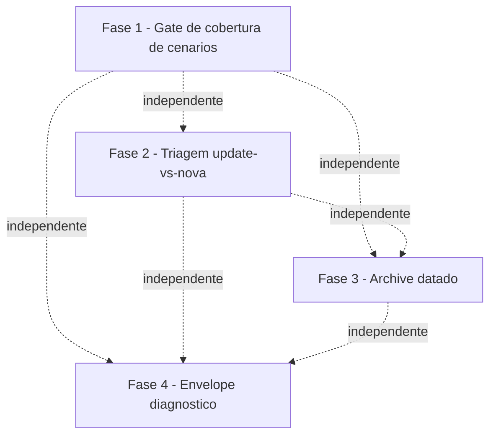

# Tarefas openspec-hygiene - Higiene OpenSpec (gate de cenarios, guia de triagem, archive datado, envelope diagnostico)

Escopo: quatro entregas independentes de higiene documental derivadas do
benchmark OpenSpec — (1) gate deterministico `requirement-coverage.sh` que
bloqueia specs com Functional Requirement sem cenario associado; (2) triagem
"atualizar spec existente vs feature nova" em `specify`/`clarify`; (3)
convencao `docs/specs/_archived/<YYYY-MM-DD>-<feature>/` para arquivamentos
futuros; (4) envelope diagnostico `_diag.sh` (`DIAG|severity|code|message|fix`)
migrado aditivamente num escopo-piloto de 4 scripts do runtime.

**Legenda de status:**
- `[ ]` Pendente
- `[~]` Em andamento
- `[x]` Concluido
- `[!]` Bloqueado

**Legenda de criticidade:**
- `[C]` Critico - Impacto financeiro direto ou bloqueante
- `[A]` Alto - Funcionalidade essencial
- `[M]` Medio - Necessario mas sem urgencia imediata

---

## FASE 1 - Gate de cobertura de cenarios (US1, P1)

### 1.1 Implementar requirement-coverage.sh `[A]`

Ref: spec.md FR-001, FR-003, FR-004, FR-005; contracts/requirement-coverage-cli.md

- [x] 1.1.1 Criar `global/skills/checklist/scripts/requirement-coverage.sh`
      (POSIX sh, `set -eu`) seguindo o padrao de
      `global/skills/checklist/scripts/validate-tasks-template.sh` (parsing de
      args, `FINDING|`/`RESULT|`, exit 0/1/2)
- [x] 1.1.2 Implementar parsing de `FILE` + flag opcional `--min-match N`
      (default 2, inteiro >= 1; `--min-match` invalido ou `FILE` ausente →
      exit 2, contract §Exit codes)
- [x] 1.1.3 Implementar extracao de IDs+enunciados das linhas
      `- **FR-NNN**:` sob `### Functional Requirements` (enunciado inclui
      linhas de continuacao ate o proximo item ou fim de secao — contract
      §Algoritmo passo 1)
- [x] 1.1.4 Implementar montagem do corpus (Acceptance Scenarios de todas as
      User Stories + `### Edge Cases`, lowercase, pontuacao removida —
      contract §Algoritmo passo 2)
- [x] 1.1.5 Implementar fast-path: corpus cita `FR-NNN` literal → coberto
      (contract §Algoritmo passo 3.a)
- [x] 1.1.6 Implementar heuristica textual (spec FR-005): tokenizar
      enunciado (termos >= 5 chars, normalizados, menos stoplist embutida
      pt/en), calibrar a stoplist contra specs reais do repo (quickstart
      Cenario 4), considerar coberto se >= `min(--min-match, total_termos)`
      termos distintos aparecem no corpus (contract §Algoritmo passo 3.b)
- [x] 1.1.7 Emitir `FINDING|error|fr-no-scenario|FR-NNN sem cenario
      associado — ...` para cada gap (ID exato + fix acionavel — spec
      FR-003, SC-002)
- [x] 1.1.8 Emitir `RESULT|<FILE>|requirements=<T>|covered=<C>|errors=<N>`
      sempre, inclusive spec sem FRs (`requirements=0|covered=0|errors=0`,
      exit 0 — spec FR-004)
- [x] 1.1.9 Definir exit code final: 0 sem gaps, 1 com >= 1 gap, 2 uso
      incorreto (contract §Exit codes)
- [x] 1.1.10 Escrever `tests/test_requirement-coverage.sh`: gap unico
      citando ID exato; spec integralmente coberta (exit 0); spec sem FRs
      (exit 0 trivial); fast-path por citacao literal; cobertura via
      heuristica sem ID; `--min-match` invalido (exit 2); `FILE` ausente
      (exit 2); fixture real do repo (esta propria spec.md) — contract
      §Teste
- [x] 1.1.11 Rodar `./tests/run.sh --check-coverage` e confirmar que
      `requirement-coverage.sh` nao aparece como orfao

### 1.2 Integrar o gate em specify e checklist `[A]`

Ref: spec.md FR-002; contracts/requirement-coverage-cli.md §Invocadores

- [x] 1.2.1 Adicionar chamada de `requirement-coverage.sh` na ETAPA 4
      (VALIDACAO) de `global/skills/specify/SKILL.md`, antes de reportar
      conclusao bem-sucedida; falha (exit 1) impede o relatorio de sucesso
      e reporta os `FINDING`s ao usuario
- [x] 1.2.2 Adicionar a mesma chamada em `global/skills/checklist/SKILL.md`
      (ETAPA 4: SALVAMENTO), antes de reportar o checklist como concluido
- [x] 1.2.3 Documentar em ambas as SKILL.md o registro de execucao autonoma
      (`state-ondas.sh record-skill --skill requirement-coverage --kind
      gate`, script deterministico — nao tool Skill)
- [x] 1.2.4 Validar manualmente contra 2-3 specs reais do repo
      (`docs/specs/*/spec.md`) para confirmar zero falso-positivo da
      heuristica calibrada em 1.1.6

---

## FASE 2 - Triagem "atualizar spec vs feature nova" (US2, P2)

### 2.1 Prosa de triagem em specify `[M]`

Ref: spec.md FR-006, FR-008

- [x] 2.1.1 Adicionar subsecao nova em `global/skills/specify/SKILL.md`
      ETAPA 0 (apos 0.3, antes de ETAPA 1) descrevendo o criterio: pedido
      que refina/mantem a intencao de uma feature ja especificada →
      recomendar atualizar `docs/specs/{existing}/spec.md`; pedido que
      muda de intencao ou expande o escopo original → recomendar nova
      feature
- [x] 2.1.2 Documentar que a recomendacao MUST citar o criterio aplicado
      (ex.: "mesma intencao original, refinamento de escopo" vs "nova
      capacidade nao coberta pela spec X")
- [x] 2.1.3 Documentar o caso trivial (FR-008): nenhuma spec existente se
      relaciona ao pedido → prosseguir direto para nova feature, sem
      overhead de decisao adicional
- [x] 2.1.4 Validar a prosa lendo o SKILL.md renderizado (sem gate
      automatizado aplicavel — item textual)

### 2.2 Prosa de triagem em clarify `[M]`

Ref: spec.md FR-007

- [x] 2.2.1 Adicionar nota em `global/skills/clarify/SKILL.md` ETAPA 2
      (ESCANEAR AMBIGUIDADES) aplicando o mesmo criterio da 2.1.1: se o
      pedido levantado pelo operador durante a clarificacao poderia
      constituir uma feature nova (muda intencao/expande escopo) em vez de
      clarificacao da spec corrente, sinalizar e sugerir `specify` para
      nova feature em vez de forcar a resposta dentro da spec atual
- [x] 2.2.2 Validar consistencia textual entre a nota de clarify e a
      subsecao de specify (2.1.1) — mesmo criterio, sem contradicao

---

## FASE 3 - Archive datado (US3, P3)

### 3.1 Atualizar convencao de nomenclatura do archive `[M]`

Ref: spec.md FR-009, FR-010, FR-011

- [x] 3.1.1 Atualizar `global/skills/review-features/SKILL.md` (secao que
      descreve o passo manual "mover para `_archived/`", linha ~45 e
      exemplo de sugestao ~183) para `docs/specs/_archived/<YYYY-MM-DD>-<feature>/`,
      usando a data em que a acao de arquivamento de fato ocorre (nao a
      data de criacao da feature)
- [x] 3.1.2 Adicionar nota explicita: diretorios ja existentes sob
      `docs/specs/_archived/` sem prefixo de data permanecem inalterados —
      esta feature MUST NOT renomear/mover conteudo ja arquivado (FR-010)
- [x] 3.1.3 Conferir que nenhum outro consumidor dinamico (scripts,
      `recall.sh --ingest`, `report.sh`) parseia o nome do diretorio de
      `_archived/` de forma que dependa do formato antigo (research.md ja
      verificou "zero consumidores dinamicos" — confirmar com
      `grep -rn "_archived" cli/ global/skills/*/scripts/`)
- [x] 3.1.4 Validar a prosa lendo o SKILL.md renderizado (item textual,
      sem gate automatizado aplicavel)

---

## FASE 4 - Envelope diagnostico `_diag.sh` (US4, P4)

### 4.1 Implementar helper _diag.sh `[A]`

Ref: spec.md FR-012, FR-013, FR-014, FR-016; contracts/diagnostic-envelope.md

- [x] 4.1.1 Criar `global/skills/agente-00c-runtime/scripts/_diag.sh`
      sourceable (padrao `_log.sh`/`_hash.sh` — NAO executavel diretamente),
      expondo `diag_emit <severity> <code> <message> <fix>`
- [x] 4.1.2 Validar `severity` em `{error, warning}` (best-effort: nao
      mascarar o erro original do script chamador se a validacao falhar)
- [x] 4.1.3 Validar `fix` MUST NOT ser identico a `message` (spec FR-013)
- [x] 4.1.4 Escapar `|` interno de `message`/`fix` substituindo por `/`
      antes de emitir
- [x] 4.1.5 Emitir em stderr, 1 linha: `DIAG|<severity>|<code>|<message>|<fix>`
      (contract §Saida) — zero dependencia de `jq` (spec FR-016)
- [x] 4.1.6 Escrever `tests/test__diag.sh`: emissao dos 4 campos corretos;
      escape de `|` em message/fix; severity invalida; fix igual a message
      rejeitado/avisado (contract §Teste, precedente de naming `_hash.sh`
      → `test__hash.sh`)
- [x] 4.1.7 Rodar `./tests/run.sh --check-coverage` e confirmar que
      `_diag.sh` nao aparece como orfao

### 4.2 Migrar state-rw.sh (piloto 1/4) `[M]`

Ref: spec.md FR-012, FR-015; contracts/diagnostic-envelope.md §Escopo-piloto

- [x] 4.2.1 Ler os paths de erro reais de `state-rw.sh` e confirmar as 3
      condicoes da tabela do contrato: state.json ausente
      (`state-not-found`), JSON invalido/parse (`state-invalid-json`),
      sha256-verify divergente (`hash-mismatch`) — ajustar codes se a
      leitura revelar condicao adicional (spec FR-014, cada condicao ganha
      code proprio)
- [x] 4.2.2 Adicionar `. "$(dirname -- "$0")/_diag.sh"` e uma chamada
      `diag_emit` ADITIVA (mensagem legada de erro permanece INTACTA,
      linha `DIAG|` e ACRESCENTADA) em cada um dos 3 pontos de falha
- [x] 4.2.3 Estender `tests/test_state-rw.sh`: assercao de que a linha
      `DIAG|` aparece em stderr nas 3 condicoes, E assercao explicita de
      que a mensagem legada permanece byte-a-byte identica (protecao
      SC-006)

### 4.3 Migrar state-lock.sh (piloto 2/4) `[M]`

Ref: spec.md FR-012, FR-015; contracts/diagnostic-envelope.md §Escopo-piloto

- [x] 4.3.1 Ler os paths de erro reais de `state-lock.sh` e confirmar as 2
      condicoes da tabela: lock ja detido (`lock-contention`), lock stale
      detectado (`lock-stale`) — ajustar codes se necessario (spec FR-014)
- [x] 4.3.2 Adicionar `diag_emit` ADITIVO nos 2 pontos de falha, mensagem
      legada intacta
- [x] 4.3.3 Estender `tests/test_state-lock.sh`: assercao de `DIAG|` nas 2
      condicoes + mensagem legada intacta (SC-006)

### 4.4 Migrar state-ondas.sh (piloto 3/4) `[M]`

Ref: spec.md FR-012, FR-015; contracts/diagnostic-envelope.md §Escopo-piloto

- [x] 4.4.1 Ler os paths de erro reais de `state-ondas.sh` e confirmar as 2
      condicoes da tabela: `start` com onda ja aberta
      (`wave-already-open`), `end` sem onda aberta (`no-open-wave`) —
      ajustar codes se necessario (spec FR-014)
- [x] 4.4.2 Adicionar `diag_emit` ADITIVO nos 2 pontos de falha, mensagem
      legada intacta
- [x] 4.4.3 Estender `tests/test_state-ondas.sh`: assercao de `DIAG|` nas
      2 condicoes + mensagem legada intacta (SC-006)

### 4.5 Migrar bloqueios.sh (piloto 4/4) `[M]`

Ref: spec.md FR-012, FR-015; contracts/diagnostic-envelope.md §Escopo-piloto

- [x] 4.5.1 Ler os paths de erro reais de `bloqueios.sh` e confirmar a
      condicao da tabela: respond a bloqueio inexistente
      (`bloqueio-not-found`) — ajustar/adicionar codes se a leitura
      revelar mais condicoes de falha fatal (spec FR-014)
- [x] 4.5.2 Adicionar `diag_emit` ADITIVO no(s) ponto(s) de falha,
      mensagem legada intacta
- [x] 4.5.3 Estender `tests/test_bloqueios.sh`: assercao de `DIAG|` na
      condicao + mensagem legada intacta (SC-006)

### 4.6 Confirmar escopo fechado e nao-migracao dos demais scripts `[M]`

Ref: spec.md FR-015

- [x] 4.6.1 Confirmar que nenhum script POSIX fora dos 4 do escopo-piloto
      (4.2-4.5) foi tocado nesta FASE — `git diff --name-only` restrito a
      `_diag.sh` + os 4 scripts-piloto + os 4 testes estendidos + o teste
      novo `test__diag.sh`
- [~] 4.6.2 Rodar `./tests/run.sh` completo (suite inteira, nao so
      `--check-coverage`) e confirmar 0 regressao nos testes legados dos 4
      scripts-piloto e nos demais ~1100+ cenarios — **deferido para o gate
      de release/review** (diretriz de execucao desta onda: suite completa
      ~12min nao roda dentro da onda). Confirmado nesta onda via
      `./tests/run.sh --check-coverage` (zero orfaos) + `./tests/run.sh`
      escopado por pattern nas 5 areas tocadas (`diag`, `requirement-coverage`,
      `test_state-rw`, `state-lock`, `state-ondas`, `test_bloqueios`) — todas
      130 cenarios verdes via o runner real (nao so `sh test_*.sh` direto).
      A suite completa (~1290 cenarios) fica para `./tests/run.sh` no gate
      de release, antes do merge.

---

## Matriz de Dependencias

As quatro fases sao independentes entre si (plan.md secao "Ordem de
implementacao sugerida" — paralelizaveis), exceto a tarefa 1.2 (integracao
de prosa em specify/checklist) que depende do script da tarefa 1.1 existir
primeiro. A ordem numerica (1→2→3→4) reflete a priorizacao P1>P2>P3>P4 do
plan.md, nao uma dependencia tecnica real.

## Resumo Quantitativo

| Fase | Tarefas | Subtarefas | Criticidade |
|------|---------|------------|-------------|
| 1 - Gate de cobertura de cenarios | 2 | 15 | A |
| 2 - Triagem update-vs-nova | 2 | 6 | M |
| 3 - Archive datado | 1 | 4 | M |
| 4 - Envelope diagnostico | 6 | 22 | A/M |
| **Total** | **11** | **47** | - |

## Escopo Coberto

| Item | Descricao | Fase |
|------|-----------|------|
| FR-001..FR-005 | Gate `requirement-coverage.sh` (deterministico, heuristica textual) | 1 |
| FR-002 | Integracao do gate em `specify`/`checklist` | 1 |
| FR-006, FR-008 | Triagem update-vs-nova em `specify` ETAPA 0 | 2 |
| FR-007 | Mesmo criterio de triagem aplicado em `clarify` ETAPA 2 | 2 |
| FR-009, FR-010, FR-011 | Convencao `<YYYY-MM-DD>-<feature>` para archive futuro, `review-features` atualizado | 3 |
| FR-012, FR-013, FR-014, FR-016 | Helper `_diag.sh` (envelope DIAG + severity + code + message + fix, campos separados por pipe) | 4 |
| FR-015 | Migracao aditiva confinada a exatamente 4 scripts-piloto | 4 |
| FR-017 | Teste automatizado para cada `.sh` novo (`test_requirement-coverage.sh`, `test__diag.sh`) + `--check-coverage` | 1, 4 |

## Escopo Excluido

| Item | Descricao | Motivo |
|------|-----------|--------|
| Specs vivas + delta specs no archive | Substituir `docs/specs/_archived/` por merge de delta-specs (item estrutural mais caro do benchmark OpenSpec) | spec.md §Visao geral — esforco/impacto arquitetural maior, tratado como feature separada |
| Migracao retroativa do `_archived/` | Renomear/mover diretorios ja arquivados sem prefixo de data | FR-010 explicito — MUST NOT tocar conteudo ja arquivado |
| Migracao de `_diag.sh` alem dos 4 scripts-piloto | `cli/`, `validate-sdd.sh`, `validate-tasks-template.sh` e demais scripts do runtime mantem formato de erro atual | FR-015 — migracao aditiva, nao rewrite geral numa unica rodada |
| Mudanca no template `feature-spec.md` | Exigir citacao literal de FR-ID em cenarios | clarify FR-005 — heuristica textual evita retrofit de todo o portfolio de specs |
| CHK007 (escopo-piloto de 4 scripts) | Decisao `{humano}` do checklist — aceita implicitamente pelo plan.md; nenhuma tarefa dedicada, apenas nota de follow-up aqui | Confirmar com o dono do produto antes de iniciar a FASE 4 (tarefas 4.2-4.5) se o escopo-piloto de 4 scripts continua valido |
| CHK028 (priorizacao P1..P4) | Decisao `{humano}` do checklist — aceita implicitamente pelo plan.md, backlog segue a ordem sugerida P1>P2>P3>P4 | Confirmar com o dono do produto se a ordem de execucao das 4 FASEs reflete o apetite de risco/valor real antes de `/execute-task` |
