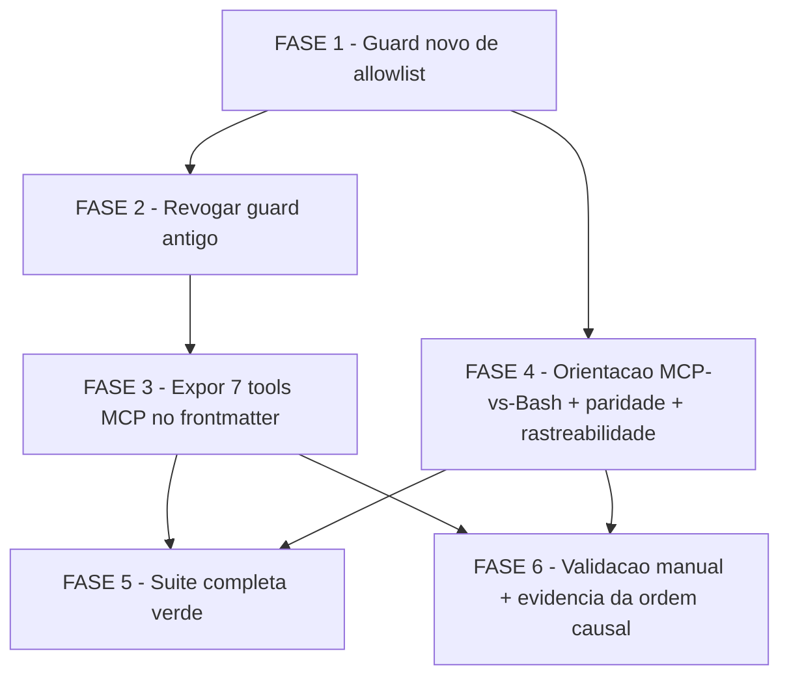

# Tarefas Allowlist MCP para orquestradores 00c - Backlog de Implementacao

Escopo: revogar o guard cerimonial que proibia `mcp__*` no frontmatter dos
2 orquestradores autonomos (`agente-00c-orchestrator.md`,
`agente-00c-feature-orchestrator.md`), substitui-lo por um guard que
protege a garantia real (allowlist nunca vazia, nunca somente-MCP), expor
as 7 tools `mcp__cstk-state__*` no frontmatter dos 2 agentes preservando as
tools nativas, documentar a orientacao de uso MCP-vs-Bash de forma
autocontida e byte-identica nos 2 agentes, e validar (parte automatizada,
parte manual) que a garantia de degradacao graciosa se mantem.

**Legenda de status:**
- `[ ]` Pendente
- `[~]` Em andamento
- `[x]` Concluido
- `[!]` Bloqueado

**Legenda de criticidade:**
- `[C]` Critico - Impacto financeiro direto ou bloqueante
- `[A]` Alto - Funcionalidade essencial
- `[M]` Medio - Necessario mas sem urgencia imediata

---

## FASE 1 - Guard de composicao de allowlist (novo)

### 1.1 Criar tests/test_orchestrator-allowlist-guard.sh `[C]`

Ref: contracts/orchestrator-allowlist-guard.md; plan.md Fase A; spec.md
FR-002, FR-004, FR-012. Arquivo **AINDA NAO EXISTE** no repo — esta tarefa
CRIA, nao edita.

- [x] 1.1.1 Criar `tests/test_orchestrator-allowlist-guard.sh` (POSIX sh
  puro, sem `jq` — research.md Decision 4) com um parser de frontmatter
  que delimita o bloco entre a 1a e a 2a linha `---` e le SOMENTE dentro
  dele (nunca a prosa do agente), conforme contracts/orchestrator-allowlist-guard.md
  secao "Contrato de parsing"
- [x] 1.1.2 Implementar o parser cobrindo as DUAS formas de `tools:`:
  inline (`tools: A, B` na mesma linha) e lista YAML (`tools:` seguido de
  linhas `- A`) — normalizar entradas (trim, descartar vazias) e
  classificar por prefixo `mcp__` em `mcp_entries`/`native_entries`
- [x] 1.1.3 Implementar `scenario_orchestrator_glob_nao_vazio`: o glob
  `plugins/cstk/agents/*-orchestrator.md` deve casar >= 1 arquivo; falha
  com violacao `no_orchestrator_found` se 0 (anti-ponto-cego, research.md
  Decision 3)
- [x] 1.1.4 Implementar `scenario_allowlist_nunca_vazia_nem_so_mcp`: para
  cada alvo do glob, `tools:` presente (senao `tools_key_absent`) E
  `entries` nao-vazio (senao `empty_allowlist`) E `native_entries`
  nao-vazio (senao `mcp_only_allowlist`) — tabela de decisao completa em
  data-model.md secao "State transitions"
- [x] 1.1.5 Implementar `scenario_allowlist_declara_as_7_tools_mcp`: para
  cada alvo, as 7 entradas exatas
  `mcp__cstk-state__{open_wave,record_decision,record_skill,record_task,register_human_block,close_wave,get_status}`
  presentes — comparar contra lista literal, nunca regex `mcp__cstk-state__.*`
  (plan.md secao "Convencoes de Borda" — protege contra typo silencioso)
- [x] 1.1.6 Implementar `scenario_allowlist_preserva_bash`: para cada
  alvo, `Bash` presente em `native_entries`
- [x] 1.1.7 Criar as 7 fixtures sinteticas em `mktemp -d` (NUNCA editar os
  agentes reais): so-MCP inline, so-MCP lista, vazia, ausente, mista
  inline, mista lista, so-nativa — vereditos esperados na tabela "Casos
  negativos exercitados por fixture" de contracts/orchestrator-allowlist-guard.md
- [x] 1.1.8 PROVA EXPLICITA de deteccao da forma inline (o guard antigo em
  `tests/test_orchestrator-mcp-fallback.sh:61` e `:70`, regex
  `^\s*-\s*mcp__`, so casava a forma de lista YAML e por isso nunca
  detectou a forma inline realmente usada nos 7 arquivos de
  `plugins/cstk/agents/` — research.md Decision 1): asserir que a fixture
  "so-MCP inline" falha com `mcp_only_allowlist` E que a fixture "mista
  inline" passa. Teste dedicado que reproduziria o bug antigo se
  reintroduzido
- [x] 1.1.9 Terminar o arquivo com `run_all_scenarios "$0"` (mesmo padrao
  de `tests/test_orchestrator-mcp-fallback.sh:245`) para descoberta
  automatica das funcoes `scenario_*` pelo harness

### 1.2 Integrar o guard novo ao harness (FR-012) `[A]`

Ref: tests/run.sh linhas ~190-260 (corpo de `_is_internal_test`, padrao
existence-guarded ja usado por `test_command-spawn-mcp-lifecycle.sh`);
contracts/orchestrator-allowlist-guard.md secao "Integracao com o
harness"; plan.md linhas 136-143 (item mais facil de esquecer da feature)

- [x] 1.2.1 Adicionar um ramo em `tests/run.sh::_is_internal_test` para
  `test_orchestrator-allowlist-guard.sh`, existence-guarded ao diretorio
  `plugins/cstk/agents` (mesmo padrao do ramo `test_command-spawn-mcp-lifecycle.sh`)
  — sem esse ramo, `--check-coverage` reporta o arquivo como "test sem
  script" e sai com `1`
- [x] 1.2.2 Rodar `./tests/run.sh --check-coverage` e confirmar exit 0
  (nenhum script nem teste orfao)
- [x] 1.2.3 Rodar `./tests/run.sh orchestrator-allowlist` contra o estado
  ATUAL dos 2 agentes (ainda sem as 7 tools MCP, FASE 3 nao aplicada) e
  confirmar que `scenario_orchestrator_glob_nao_vazio`,
  `scenario_allowlist_nunca_vazia_nem_so_mcp` e
  `scenario_allowlist_preserva_bash` ja passam contra os arquivos reais;
  `scenario_allowlist_declara_as_7_tools_mcp` deve FALHAR ainda (esperado
  — so passa apos a FASE 3)

---

## FASE 2 - Revogacao do guard antigo (FR-001)

### 2.1 Remover os 2 scenarios obsoletos de test_orchestrator-mcp-fallback.sh `[A]`

Ref: `tests/test_orchestrator-mcp-fallback.sh:59-66`
(`scenario_orchestrator_agente_nao_lista_tool_mcp`),
`tests/test_orchestrator-mcp-fallback.sh:68-75`
(`scenario_orchestrator_feature_nao_lista_tool_mcp`); spec.md FR-001;
plan.md Fase C (depende da FASE 1 ja existir — nunca ficar sem protecao
sobre a composicao da allowlist)

- [x] 2.1.1 Remover a funcao `scenario_orchestrator_agente_nao_lista_tool_mcp`
  (`tests/test_orchestrator-mcp-fallback.sh:59-66`)
- [x] 2.1.2 Remover a funcao `scenario_orchestrator_feature_nao_lista_tool_mcp`
  (`tests/test_orchestrator-mcp-fallback.sh:68-75`)
- [x] 2.1.3 Atualizar o comentario de cabecalho do arquivo
  (`tests/test_orchestrator-mcp-fallback.sh` linhas 1-30, item "6.3.1")
  removendo a descricao dos 2 scenarios revogados e da premissa que eles
  verificavam ("os 2 agentes orquestradores ... nao listam NENHUMA tool
  mcp__* no frontmatter"), deixando explicito que essa garantia passou a
  ser do guard novo (`tests/test_orchestrator-allowlist-guard.sh`, FASE 1)
- [x] 2.1.4 Rodar `./tests/run.sh orchestrator-mcp-fallback` e confirmar
  verde apos a remocao — os scenarios restantes (6.3.2, prova funcional
  com `docker` ausente do PATH) continuam intactos e nao dependem dos 2
  removidos

---

## FASE 3 - Exposicao das 7 tools MCP no frontmatter (FR-003, FR-004, FR-009)

### 3.1 Adicionar as 7 tools `mcp__cstk-state__*` aos 2 orquestradores `[C]`

Ref: `plugins/cstk/agents/agente-00c-orchestrator.md:4`,
`plugins/cstk/agents/agente-00c-feature-orchestrator.md:4` (ambos hoje com
`tools: Agent, Skill, Bash, Read, Write, Edit, Glob, Grep`); data-model.md
secao "Estado alvo (apos FR-003)"; spec.md FR-003/FR-004/FR-009

- [x] 3.1.1 Editar `plugins/cstk/agents/agente-00c-orchestrator.md:4` —
  acrescentar ao final da linha `tools:`:
  `, mcp__cstk-state__open_wave, mcp__cstk-state__record_decision,
  mcp__cstk-state__record_skill, mcp__cstk-state__record_task,
  mcp__cstk-state__register_human_block, mcp__cstk-state__close_wave,
  mcp__cstk-state__get_status`, preservando as 8 entradas nativas atuais
  (`Agent, Skill, Bash, Read, Write, Edit, Glob, Grep`) inalteradas e na
  mesma ordem (FR-003: "em adicao, nunca em substituicao")
- [x] 3.1.2 Editar `plugins/cstk/agents/agente-00c-feature-orchestrator.md:4`
  com a MESMA composicao (as 7 tools MCP identicas, nativas preservadas)
- [x] 3.1.3 Rodar `./tests/run.sh orchestrator-allowlist` e confirmar que
  `scenario_allowlist_declara_as_7_tools_mcp` e
  `scenario_allowlist_preserva_bash` agora passam para os 2 arquivos reais
  (nao apenas fixtures)
- [x] 3.1.4 Rodar `./tests/run.sh orchestrator-mcp-fallback` (scenarios
  6.3.2, prova funcional best-effort) e confirmar que continuam verdes com
  as novas tools MCP no frontmatter — prova empirica de que a allowlist
  mista nao quebra o fallback (User Story 1, Acceptance Scenario 3)

---

## FASE 4 - Orientacao MCP-vs-Bash, paridade e rastreabilidade de checklist

### 4.1 Redigir o bloco de orientacao MCP-vs-Bash `[A]`

Ref: data-model.md secao "Conteudo minimo obrigatorio do body" (9 itens);
spec.md FR-005/FR-006/FR-007; plan.md gate `owasp-security` finding F1
(nao-exfiltracao do `session_id`)

- [x] 4.1.1 Inserir bloco delimitado por `<!-- MCP-VS-BASH:BEGIN -->` /
  `<!-- MCP-VS-BASH:END -->` em `plugins/cstk/agents/agente-00c-orchestrator.md`
  cobrindo os 9 itens obrigatorios de data-model.md: (1) quando preferir
  MCP — `session_id` presente no prompt de spawn e tool visivel; (2) toda
  chamada apresenta o `session_id` da propria execucao; (3) deteccao de
  indisponibilidade (servidor ausente, tool nao resolvida, sessao nao
  autenticada, erro pontual com servidor ativo) — incluindo a nota de
  CHK023 (ver 4.4); (4) erro pontual => fallback imediato, 0 retries + 1
  confirmacao via `cstk mcp status --live` + Bash pelo resto da onda; (5)
  sem `session_id` no prompt => caminho Bash direto, sem mencionar MCP;
  (6) Bash e sempre alternativa segura e NUNCA pausa a onda; (7) mapa das
  7 operacoes <-> helper POSIX equivalente (tabela de data-model.md "Mapa
  operacao <-> caminho nativo"); (8) `elicitation/create` fora de uso
  ativo enquanto FR-010 permanecer Deferred; (9) regra de nao-exfiltracao
  do `session_id` (nunca em artefato, log, mensagem de commit, relatorio,
  Decisao, nem argumento de qualquer tool que nao seja a propria chamada
  `mcp__cstk-state__*`)
- [x] 4.1.2 Copiar o MESMO bloco, byte-identico e SEM nenhuma referencia a
  um orquestrador especifico (nome do agente, layout de state-dir, command
  pai — invariante `self_contained` de data-model.md), para
  `plugins/cstk/agents/agente-00c-feature-orchestrator.md`, entre os
  mesmos marcadores
- [x] 4.1.3 Revisar visualmente os 2 blocos lado a lado confirmando
  byte-identidade antes de rodar o teste automatizado de 4.2

### 4.2 Testes de paridade e conteudo do bloco de orientacao (FR-011) `[A]`

Ref: contracts/orchestrator-allowlist-guard.md scenarios
`scenario_guidance_block_presente`, `scenario_guidance_block_conteudo_minimo`,
`scenario_guidance_block_regra_nao_exfiltracao`,
`scenario_guidance_block_paridade`; spec.md FR-011

- [x] 4.2.1 Implementar `scenario_guidance_block_presente` em
  `tests/test_orchestrator-allowlist-guard.sh`: para cada alvo do glob
  `*-orchestrator.md`, o par de marcadores `MCP-VS-BASH:BEGIN`/
  `MCP-VS-BASH:END` existe e o corpo entre eles nao e vazio
- [x] 4.2.2 Implementar `scenario_guidance_block_conteudo_minimo`: o body
  cobre os 9 itens obrigatorios (grep por trecho-chave estavel de cada um
  dos 9 pontos listados em 4.1.1)
- [x] 4.2.3 Implementar `scenario_guidance_block_regra_nao_exfiltracao`:
  body contem a regra do item 9 (nao-exfiltracao do `session_id`)
- [x] 4.2.4 Implementar `scenario_guidance_block_paridade`: body dos 2
  arquivos e byte-identico apos trim de whitespace terminal de linha;
  falha com diff apontando a linha divergente se nao for
- [x] 4.2.5 Rodar `./tests/run.sh orchestrator-allowlist` e confirmar os 8
  scenarios do contrato verdes (4 de allowlist da FASE 1 + 4 de guidance
  desta fase)

### 4.3 Fechar gap de rastreabilidade CHK025 (US3 sem SC dedicado) `[M]`

Ref: checklists/requirements.md CHK025 (linhas 216-223); spec.md "Why this
priority" de User Story 3 (linhas 90-92: "instrumental para a Story 2 ter
efeito pratico")

- [x] 4.3.1 Adicionar linha na secao "Escopo Coberto" deste `tasks.md`
  (ja presente abaixo) documentando explicitamente que US3
  (FR-005/FR-006/FR-011) e instrumental para US2 e nao recebe Success
  Criterion dedicado nesta rodada — decisao consciente ja justificada em
  `spec.md`, nao descuido — `Ref: checklists/requirements.md CHK025`
- [x] 4.3.2 Registrar Decisao auditavel (`state-decisions.sh register
  --score 2`) durante a execucao desta tarefa, citando CHK025 e a
  justificativa da spec, fechando formalmente o Gap sem criar SC novo
  fora do escopo desta rodada

### 4.4 Fechar gap de rastreabilidade CHK023 (SLA/timeout nao documentado) `[M]`

Ref: checklists/requirements.md CHK023 (linhas 198-207)

- [x] 4.4.1 Confirmar que o item 3 do bloco de orientacao (tarefa 4.1.1)
  registra explicitamente a ausencia de SLA/timeout definido para
  delimitar "chamada pendente" vs. "chamada falhou", e o destino declarado
  (reabrir via `/clarify` numa proxima rodada se producao revelar chamadas
  penduradas sem timeout) — NAO implementar nenhum valor numerico de
  timeout nesta tarefa (seria suposicao sem fonte, violaria Principio VI)
- [x] 4.4.2 Adicionar linha na secao "Escopo Excluido" deste `tasks.md`
  (ja presente abaixo): "Definicao de SLA/timeout de chamada MCP — Ref:
  checklists/requirements.md CHK023 — motivo: nao bloqueante nesta rodada,
  sem fonte para um valor concreto (Principio VI); destino: `/clarify`
  futuro se necessario"

---

## FASE 5 - Suite completa verde (SC-005)

### 5.1 Rodar a suite completa do harness `[A]`

Ref: plan.md Fase F; CLAUDE.md secao "Como testar scripts shell"

- [x] 5.1.1 Rodar `LC_ALL=C ./tests/run.sh` completo (nao apenas os
  patterns `orchestrator`/`orchestrator-allowlist`) e confirmar 100% verde
- [x] 5.1.2 Rodar `./tests/run.sh --check-coverage` novamente (pos
  FASE 1-4) e confirmar exit 0 (nenhum script nem teste orfao)
- [x] 5.1.3 Rodar `shellcheck` (config `.shellcheckrc` do repo) sobre
  `tests/test_orchestrator-allowlist-guard.sh` como lint advisory
  (nao-gateante — CI roda isso via `.github/workflows/shellcheck.yml`);
  registrar achados se houver, sem bloquear

---

## FASE 6 - Validacao manual + evidencia da ordem causal (FR-006, FR-007, FR-008, FR-010, FR-014, SC-001, SC-004)

> **Resultado da fase (onda-011, `dec-067`/`dec-068`)**: as tarefas 6.1,
> 6.2 e 6.3 FORAM EXECUTADAS pelo operador. Resultado: 6.1 **confirmou**
> a degradacao graciosa; 6.2 e 6.3 **reprovaram** — nao por defeito do
> que esta feature entregou, mas porque nao existe tool MCP alguma a
> invocar: o transporte docker nao entrega tool a sessao nenhuma, com ou
> sem token (medicao literal em `spec.md` §"Estado conhecido ao fim
> desta feature"). A causa foi declarada **fora do escopo** desta feature
> (FR-013/FR-015) e transferida para a feature de transporte.
>
> **Nota sobre a legenda**: o backlog nao tem simbolo para "executada,
> resultado negativo, causa fora de escopo". As subtarefas nessa
> situacao ficam `[!]` (o mais honesto disponivel — nao concluidas, e
> bloqueadas por causa externa ja identificada), **nunca** `[x]`.
> Marca-las `[x]` afirmaria uma validacao que reprovou (`dec-068`).

### 6.1 Cenario 5 — Degradacao graciosa com MCP ausente (FR-007, SC-001) `[C]`

Ref: quickstart.md Cenario 5 (linhas 79-93)

- [x] 6.1.1 Parar o servidor MCP (`cstk mcp stop --state-dir <SD>` ou
  garantir Docker parado)
- [x] 6.1.2 Iniciar/observar uma onda de execucao autonoma real
  (`/feature-00c` ou `/agente-00c`) e confirmar que o prompt de spawn sem
  token nao menciona MCP
- [x] 6.1.3 Confirmar que a onda completa normalmente via helpers Bash,
  sem bloqueio humano nem mensagem de erro de MCP visivel ao operador
  — **CONFIRMADO**, com a ressalva de que a confirmacao e trivial: como
  nenhuma tool MCP e servida a sessao alguma, o caminho Bash nao e o
  caminho degradado, e o **unico** caminho. A garantia de FR-007/SC-001
  se sustenta; ela apenas nao foi exercitada contra um MCP que
  funcionasse antes de sumir

### 6.2 Cenario 6 — Roteamento por token no caminho real (FR-008, SC-004) `[C]`

Ref: quickstart.md Cenario 6 (linhas 97-138); research.md Decision 10 (nao
automatizavel na suite POSIX — exige spawn real + Docker)

- [!] 6.2.1 BLOQUEADO por causa fora de escopo (FR-013): a preparacao de
  DUAS execucoes 00c ativas com state-dirs distintos (A e B) nao chegou a
  ser exercida como cenario de teste, porque a etapa seguinte ja era
  inexecutavel. Nao ha registro de que A e B tenham sido preparadas, e
  isso NAO e afirmado aqui
- [!] 6.2.2 BLOQUEADO — Cenario 6a NAO EXECUTADO. Saida literal do
  validador: "`get_status` com session_id real: **NAO EXECUTADA**. A tool
  nao existe no meu contexto. Nao ha payload; nao invento nomes de
  campos." Sem aceitacao observada, FR-008 nao e afirmado (`dec-068`)
- [!] 6.2.3 BLOQUEADO — Cenario 6b NAO EXECUTADO. Saida literal:
  "`get_status` com token zerado: **NAO EXECUTADA**. Nao ha erro literal
  para reportar. Nao invento `SESSION_MISMATCH` nem qualquer codigo."
  Nenhum codigo de rejeicao foi observado nem suposto (`dec-068`)
- [!] 6.2.4 BLOQUEADO — Cenario 6c NAO EXECUTADO, mesma causa: sem tool
  no contexto nao ha chamada a fazer, com ou sem `session_id`
- [x] 6.2.5 Resultado registrado como Decisao auditavel `dec-068` com
  `--score 0`, exatamente conforme a clausula de escape desta subtarefa e
  quickstart.md linhas 133-138: **sem** saida literal das tres chamadas,
  registrar `--score 0` e **NAO** afirmar FR-008 satisfeito. A subtarefa
  esta concluida (o registro honesto foi feito); FR-008 e SC-004
  permanecem NAO satisfeitos (Principio VI, guard anti-confabulacao)

### 6.3 Cenario 7 — Erro pontual com servidor ativo, fallback sem retry (FR-006, dec-018) `[A]`

Ref: quickstart.md Cenario 7 (linhas 142-150)

- [!] 6.3.1 BLOQUEADO por causa fora de escopo (FR-013): nao ha como
  provocar a falha de UMA chamada quando nenhuma chamada e possivel. O
  servidor esteve ativo (`status=active`, `mode=docker`, container
  `Up 2 hours`) e ainda assim nenhuma tool chegou ao contexto
- [!] 6.3.2 BLOQUEADO — o comportamento de fallback-sem-retry
  (0 retries + 1 confirmacao via `cstk mcp status --live` + Bash pelo
  resto da onda) permanece **documentado e nao exercitado**. A regra
  esta redigida e testada por paridade (FASE 4), mas nunca foi observada
  em execucao real, e isso NAO e afirmado como validado

### 6.4 Registro da lacuna FR-010 (elicitation/create) `[M]`

Ref: spec.md FR-010 (linhas 266-279); research.md Decision 9; medicao
externa em curso sem resultado ate o momento desta decomposicao (ultimo
trafego observado 2026-08-16 03:37:08Z)

- [!] 6.4.1 BLOQUEADO por fonte externa: aguardar a sondagem empirica
  (fora do escopo desta execucao) que definiria o comportamento de uma
  tool MCP `elicitation/create` invocada por um subagente orquestrador sem
  operador humano presente. Nenhuma implementacao deve ser feita aqui —
  quando a fonte existir, reabrir FR-010 via `/clarify`, atualizar
  `spec.md` removendo o estado Deferred, ANTES de qualquer `plan` assumir
  um comportamento concreto para ele
- [x] 6.4.2 Confirmar (leitura do bloco de orientacao, item 8 — tarefa
  4.1.1) que os 2 orquestradores autonomos permanecem instruidos a NAO
  invocar nenhuma tool que dependa de elicitation enquanto FR-010
  permanecer Deferred — CONFIRMADO: o item 8 ("`elicitation/create`
  permanece FORA de escopo de uso ativo enquanto...") esta presente
  dentro do bloco `MCP-VS-BASH` dos dois arquivos

### 6.5 Fixar a evidencia da causa raiz e a ordem causal (FR-014) `[C]`

Ref: spec.md FR-014; evidencia colhida na onda-010 e reforcada na
onda-011 (`dec-067`). Tarefa originalmente numerada 7.1; realocada para a
FASE 6 na onda-011 (`dec-069`) quando a FASE 7 saiu do backlog ativo —
FR-014 PERMANECE em escopo, e mover para "Escopo Excluido" uma tarefa
concluida afirmaria falsamente que ela foi excluida.

- [x] 6.5.1 Colher e registrar como Decisao auditavel, com `--evidencia`
  LITERAL, o handshake do launcher invocado exatamente como o `.mcp.json`
  o invoca (sem args, sem env): resposta
  `"serverInfo":{"name":"cstk-state-idle","version":"idle"}` seguida de
  `"result":{"tools":[]}`, com a execucao corrente ATIVA
  (`cstk mcp status --live` => `status=active`, `mode=docker`)
- [x] 6.5.2 Confirmar na fonte as duas pecas da causa (1): `.mcp.json`
  registra o launcher com `"args": []` e SEM bloco `env`; e
  `mcp-launch.sh:128` testa SOMENTE `MCP_SESSION_TOKEN` antes de
  `_ml_idle_serve` (verificado identico entre a copia instalada em
  `~/.claude/skills/` e a fonte em `plugins/cstk/skills/`)
- [x] 6.5.3 Apender FR-014 a `spec.md` e manter a secao
  `## Delta Requirements` atualizada, declarando sem eufemismo que
  FR-001..FR-012 sao necessarios porem NAO suficientes

---

## Matriz de Dependencias

> A FASE 7 (alcancabilidade real do caminho MCP) foi **removida do
> backlog ativo** na onda-011 (`dec-067`) e esta em "Escopo Excluido".
> A tarefa 7.1, ja concluida e responsavel por FR-014 — que permanece em
> escopo —, foi realocada como 6.5 (`dec-069`), preservando o trabalho
> feito. As arestas remanescentes nao mudaram: a FASE 6 continua sendo o
> ponto onde a validacao empirica ocorre, e o grafo permanece aciclico.

## Resumo Quantitativo

| Fase | Tarefas | Subtarefas | Criticidade |
|------|---------|------------|-------------|
| 1 - Guard novo de allowlist | 2 | 12 | C |
| 2 - Revogar guard antigo | 1 | 4 | A |
| 3 - Expor 7 tools MCP no frontmatter | 1 | 4 | C |
| 4 - Orientacao MCP-vs-Bash + paridade + rastreabilidade | 4 | 12 | A |
| 5 - Suite completa verde | 1 | 3 | A |
| 6 - Validacao manual + evidencia da ordem causal | 5 | 15 | C |
| **Total** | **14** | **50** | - |

### Estado de conclusao do backlog ativo

| Estado | Subtarefas | Onde |
|--------|------------|------|
| `[x]` Concluidas | 43 | FASES 1-5 (35) + 6.1.x, 6.2.5, 6.4.2, 6.5.x (8) |
| `[!]` Bloqueadas por causa fora de escopo | 7 | 6.2.1-6.2.4, 6.3.1-6.3.2 (FR-013, transporte MCP) e 6.4.1 (FR-010, fonte externa) |
| `[ ]` Pendentes | 0 | — |
| **Total** | **50** | — |

> Nenhuma subtarefa pendente permanece. As 7 bloqueadas nao sao
> executaveis dentro desta feature: 6 dependem de um caminho MCP que
> nao entrega tool alguma (FR-013, fora de escopo) e 1 depende de uma
> sondagem externa que nunca foi disparada (FR-010, Deferred). Nenhuma
> delas foi marcada como concluida.

## Escopo Coberto

| Item | Descricao | Fase |
|------|-----------|------|
| FR-001 | Revogacao dos 2 scenarios obsoletos que proibiam `mcp__*` no frontmatter (`tests/test_orchestrator-mcp-fallback.sh:59-75`) | 2 |
| FR-002, FR-004, FR-012 | Guard novo anti-allowlist-somente-MCP/vazia, sem `jq`, integrado ao harness (`--check-coverage`) | 1 |
| FR-003, FR-009 | As 7 tools `mcp__cstk-state__*` expostas nos 2 orquestradores, tools nativas preservadas | 3 |
| FR-005, FR-006, FR-007 | Bloco de orientacao MCP-vs-Bash autocontido e duplicado nos 2 agentes | 4 |
| FR-011 | Teste de paridade byte-identica do bloco de orientacao | 4 |
| FR-008, SC-004 | Validacao manual do roteamento por token no caminho real (spawn real, Docker) — **TENTADA, REPROVADA**: nenhuma chamada foi possivel (sem tool no contexto); FR-008 e SC-004 NAO declarados satisfeitos (`dec-068`) | 6 |
| FR-006, SC-001 | Validacao manual de degradacao graciosa com MCP ausente (**CONFIRMADA**) e de fallback sem retry em erro pontual (**NAO exercitado** — documentado, nunca observado em execucao real) | 6 |
| CHK023 | Lacuna de SLA/timeout DOCUMENTADA explicitamente (nao implementada — sem fonte para valor concreto) | 4 |
| CHK025 | Rastreabilidade formal de US3 sem SC dedicado (decisao consciente, nao descuido) | 4 |
| SC-005 | Suite completa do harness verde apos a mudanca de guard | 5 |
| FR-014 | Ordem causal registrada sem eufemismo: launcher idle (causa 1) precede a allowlist do frontmatter (causa 2); FR-001..FR-012 sao necessarios porem NAO suficientes. Reforcado na onda-011 com a medicao de que a causa (1) nao depende do token (`dec-067`) | 6 |

## Escopo Excluido

| Item | Descricao | Motivo |
|------|-----------|--------|
| **FASE 7 inteira — FR-013 e FR-015** (ex-tarefas 7.2 e 7.3; a 7.1, concluida, foi realocada como 6.5) | Alcancabilidade real do caminho MCP (`tools/list` devolvendo as 7 tools numa execucao 00c normal) e definicao do canal de entrega do token de capacidade ao processo do launcher | **Reversao de expansao de escopo decidida pelo operador na onda-011 (`dec-067`)**. A onda-010 expandiu o escopo supondo que o bloqueio fosse a ENTREGA DO TOKEN; a sondagem do caminho completo mediu e **refutou** essa premissa: o transporte docker nao entrega tool a sessao nenhuma, com OU sem token (`NENHUMA_MCP` em ambos os casos), o attach com token ainda **destroi** o container, e o descritor pode afirmar sessao ativa sem container existente. Responder FR-015 portanto nao produziria FR-013. Corrigir exige redesenhar o transporte — tratado como **feature separada**. FR-014 (ordem causal) NAO sai de escopo e permanece na FASE 6. Evidencia consolidada em `spec.md` §"Estado conhecido ao fim desta feature"; SC-002 e SC-004 saem junto, declarados NAO satisfeitos |
| FR-010 (`elicitation/create`) | Comportamento de uma tool MCP elicitation/create invocada sem operador humano presente | Deferred — sondagem empirica externa em curso, fora do escopo desta execucao (Principio VI: nenhum comportamento suposto sem fonte). Nenhuma das 7 tools do `cstk-state` depende de elicitation (research.md Decision 9), entao FR-010 nao bloqueia as demais FRs |
| Alteracao de `agente-00c.md`/`feature-00c.md` (commands pai) | Nenhuma mudanca nos 2 commands que spawnam os orquestradores | Ja carregam o contrato correto ("Prefira as tools mcp__cstk-state__*"); esta feature alinha o AGENTE ao contrato ja documentado, nao o contrario (plan.md "Fora de escopo explicito") |
| Alteracao do servidor MCP (`mcp/state-server/`) | Nenhuma tool nova, nenhum schema alterado | Feature so consome as 7 tools ja existentes (plan.md "Fora de escopo explicito") |
| Definicao de SLA/timeout de chamada MCP (valor numerico concreto) | Nenhum teto de latencia e definido para delimitar "pendente" vs. "falhou" | CHK023 — sem fonte rastreavel para um valor concreto (Principio VI); destino: `/clarify` futuro se producao revelar chamadas penduradas sem timeout |
| Success Criterion dedicado para US3 | Nenhum SC novo e criado para a orientacao MCP-vs-nativo nesta rodada | CHK025 — tratamento consciente ja justificado em `spec.md` ("Why this priority": instrumental para US2), nao descuido |
| Mitigacao do finding do nome do container (dec-060) | Nenhuma mudanca em `cli/lib/mcp-docker.sh` nem no que `cstk mcp status` imprime | Decisao explicita do operador (onda-010): tratar em trabalho separado; o token desta execucao ja foi rotacionado. Registrado aqui para nao virar divida silenciosa |
| Mitigacao do finding F2 (comparacao de token nao constant-time) | Nenhuma mudanca em `mcp/state-server/src/session/resolve.ts` | plan.md gate `owasp-security`: pre-existente, esta feature nao o introduz; explorabilidade baixa (stdio local, token 256 bits); registrado como follow-up conhecido, nao divida silenciosa |
