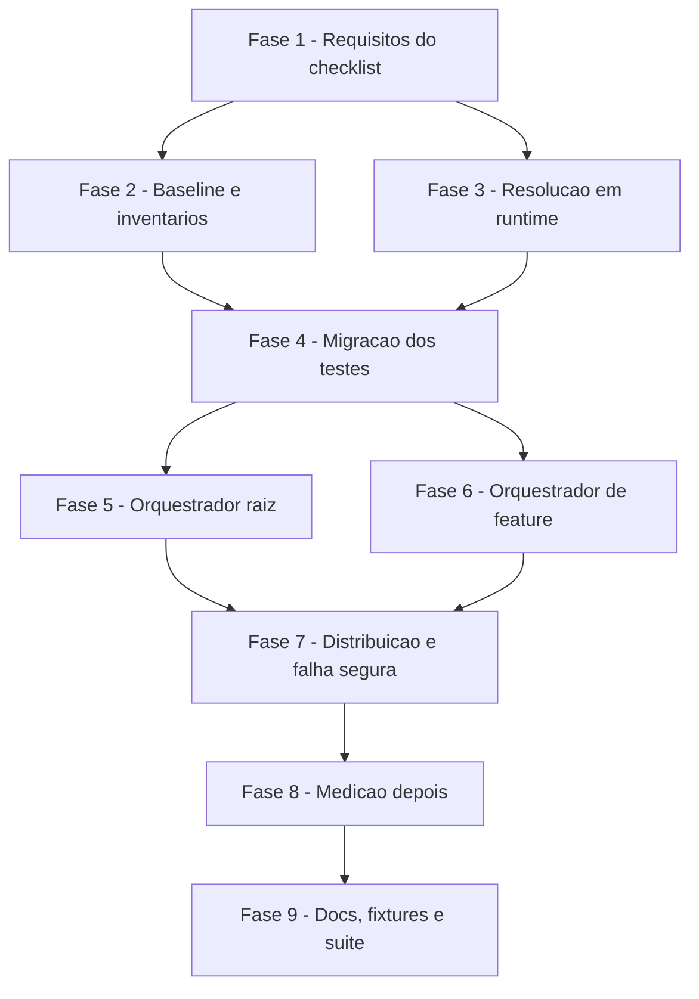

# Tarefas cstk - orchestrator-slim

Escopo: enxugar os prompts-base dos dois orquestradores autonomos (`agente-00c-orchestrator.md` e `agente-00c-feature-orchestrator.md`) em pelo menos 40% cada, movendo secoes especificas de fase para referencias lidas sob demanda, com paridade comportamental provada por inventarios deterministicos, medicao reproduzivel antes/depois e distribuicao pelos dois canais de instalacao.

**Legenda de status:**
- `[ ]` Pendente
- `[~]` Em andamento
- `[x]` Concluido
- `[!]` Bloqueado

**Legenda de criticidade:**
- `[C]` Critico - Impacto financeiro direto ou bloqueante
- `[A]` Alto - Funcionalidade essencial
- `[M]` Medio - Necessario mas sem urgencia imediata

Fontes: `spec.md`, `plan.md` (Ordem de implementacao), `research.md`, `data-model.md`, `contracts/*.md`, `quickstart.md`, `checklists/requirements.md`. Baseline fixo: commit `9f97e994d5cde46d1447744c68c9def8da14e6e3` (O = 146014 bytes, F = 104702 bytes). Convencao: `O` = orquestrador raiz, `F` = orquestrador de feature. Identificadores novos em ingles; prosa e comentarios em pt-BR (FR-014).

---

## FASE 1 - Fechamento dos requisitos abertos do checklist

Gaps `[Gap]`/`[Ambiguity]` do checklist que precisam de decisao escrita ANTES de qualquer edicao dos prompts, pois alteram o data-model, o plano e o contrato de ponteiro.

### 1.1 Reconciliar a redacao do FR-001 com a Decision 2 do plano `[A]`

Ref: checklists/requirements.md CHK018; spec.md FR-001, Key Entities, Edge Cases, Clarifications (dec-013); research.md Decision 2

- [x] 1.1.1 Reescrever o FR-001 em `spec.md`: uma referencia por (orquestrador, fase); referencia compartilhada entre O e F somente quando existir bloco movivel byte-identico entre os dois (medido: nenhum); conteudo multi-fase duplicado entre arquivos de fase do MESMO orquestrador por marcadores `FRAGMENT`, exigido por SC-006 (uma leitura por fase) e guardado por teste de byte-identidade
- [x] 1.1.2 Alinhar o texto dos Edge Cases (bloco MCP-vs-Bash e "trecho comum aos dois orquestradores") e da entidade Referencia de fase em Key Entities com a mesma estrutura, sem alterar nenhum outro requisito
- [x] 1.1.3 Registrar em `## Clarifications` uma linha de reconciliacao apontando para dec-013 e para a Decision 2 da pesquisa, e conferir que `requirement-coverage.sh` continua com 18/18 FRs cobertos
- [x] 1.1.4 Validar que o plano (Summary e Structure Decision) e a data-model (entidade PhaseReference, campo `fragments`) ja descrevem a mesma estrutura do novo texto do FR-001; corrigir divergencia residual se houver

### 1.2 Definir o destino do bloco "Finalize terminal" (commit-mode.sh finalize) `[A]`

Ref: checklists/requirements.md CHK021; spec.md FR-002, FR-005; data-model.md §Inventario (O 9.ter, F 10.qui); baseline O:2067-2085 e F:627-637

- [x] 1.2.1 Confirmar no baseline `9f97e99` as linhas exatas do bloco "Finalize terminal (FR-008)" em O (dentro de 9.ter) e em F (dentro de 10.qui) e registrar bytes de cada um
- [x] 1.2.2 Decidir e registrar a opcao: o bloco (invocacao de `commit-mode.sh finalize`, push + PR do modo atomic-commit) roda na onda terminal (`review-features` em O, `review-task` em F), fase sem referencia propria; portanto o bloco permanece no prompt-base, fora do fragmento `stage-commit-hook`, por FR-002 e FR-005
- [x] 1.2.3 Atualizar `data-model.md` (inventarios de O e de F): dividir as linhas 9.ter (O) e 10.qui (F) em "commit atomico por etapa" (mover, fragmento) e "Finalize terminal" (manter, sem destino) e recalcular a soma movida e a projecao da reducao
- [x] 1.2.4 Atualizar `plan.md` (Summary, Performance Goals e Riscos) com a mesma decisao e confirmar que a meta FR-018 continua alcancavel com a margem restante; acrescentar ao teste de paridade uma verificacao de que o bloco `commit-mode.sh finalize` esta no prompt-base de O e de F

### 1.3 Definir a sequencia executavel de falha da referencia `bootstrap` sem onda aberta `[A]`

Ref: checklists/requirements.md CHK022; spec.md FR-010, US4 cenario 3; contracts/pointer-format.md (Stub de secao); invariante I-2 de opt-ins e "Invariante: retomada sempre segue onda fechada" nos prompts

- [x] 1.3.1 Verificar empiricamente, com um state-dir descartavel, se `state-decisions.sh register` e `bloqueios.sh register` funcionam com `wave-status` igual a `none`/`closed` (nenhuma onda aberta) e registrar o resultado observado
- [x] 1.3.2 Definir a sequencia exata da falha de `bootstrap`: nao chamar `state-ondas.sh start`, registrar Decisao (`--classe operacional`) e bloqueio humano, devolver o turno ao command pai sem relatorio de onda e sem `Schedule intent`; caso o registro sem onda nao seja possivel, definir o fallback observado em 1.3.1
- [x] 1.3.3 Escrever a regra em `contracts/pointer-format.md` (variante do stub para a fase `bootstrap`) e ajustar o texto do FR-010 em `spec.md` para cobrir o caso "antes de a onda-001 abrir", sem enfraquecer a regra geral (nao prosseguir de memoria + bloqueio humano)
- [x] 1.3.4 Acrescentar o caso ao Cenario 5 do quickstart (inspecao literal da variante do stub de `bootstrap`) e a um item do teste de falha segura da FASE 7

### 1.4 Fechar os itens do checklist e reverificar `[M]`

Ref: checklists/requirements.md CHK018, CHK021, CHK022

- [x] 1.4.1 Marcar CHK018, CHK021 e CHK022 como `[x]` em `checklists/requirements.md`, citando a evidencia (tarefas 1.1, 1.2 e 1.3) em cada item
- [x] 1.4.2 Atualizar a secao Notes do checklist (zero itens abertos) e re-rodar `requirement-coverage.sh` na spec
- [x] 1.4.3 Commitar os artefatos alterados (spec, plan, data-model, contracts, checklist) em commit unico de requisitos

---

## FASE 2 - Baseline, medicao deterministica e inventarios de paridade

Capturar o "antes" e a prova de paridade ANTES de tocar nos prompts (plan §Ordem de implementacao, passo 1).

### 2.1 Script de medicao `scripts/measure-orchestrator-prompts.sh` `[A]`

Ref: spec.md FR-011, FR-012, FR-017, US3; contracts/measure-cli.md; research.md Decision 7

- [x] 2.1.1 Implementar o script POSIX (`#!/bin/sh`, `set -eu`) com `--ref`, `--observed`, `--db`, lendo os prompts via `git show <ref>:<path>` e emitindo cabecalho, tabela prompt-base e tabela por fase (`base_bytes`, `ref_bytes`, `loaded_bytes`)
- [x] 2.1.2 Implementar a coluna de tokens: usar `ORCH_TOKEN_COUNTER` quando definida (registrando o comando) e caso contrario `indisponivel` com a declaracao "gate avaliado em bytes (dec-010)"; nunca derivar tokens de bytes
- [x] 2.1.3 Implementar a secao `--observed` por fase e por grupo de execucao com `n`, cobertura por coluna e mediana so sobre linhas nao-nulas, `sqlite3 -readonly`, janela temporal validada por regex antes de entrar em SQL (S3, exit 2 se invalida) e fallback `indisponivel` sem `sqlite3` ou sem db
- [x] 2.1.4 Escrever `tests/test_measure-orchestrator-prompts.sh`: medicao deterministica contra o baseline, `ORCH_TOKEN_COUNTER` ausente e presente, `--db` inexistente (exit 0 com `indisponivel`), data invalida (exit 2), nota fixa de cache_creation

### 2.2 Baseline versionado `measurements/baseline.md` `[A]`

Ref: spec.md FR-013, SC-001; plan.md §Ordem de implementacao passo 1

- [x] 2.2.1 Rodar o script sobre `9f97e994d5cde46d1447744c68c9def8da14e6e3` (com e sem `--observed`) e salvar em `docs/specs/orchestrator-slim/measurements/baseline.md`
- [x] 2.2.2 Conferir os valores do baseline (146014 e 104702 bytes) contra `git show <ref>:<path> | wc -c` e registrar o comando usado no proprio arquivo
- [x] 2.2.3 Conferir que todo numero observado do baseline traz `n` e origem da fonte e que nao ha valor estimado (SC-005)

### 2.3 Inventarios contratuais em `tests/fixtures/orchestrator-slim/` `[A]`

Ref: spec.md FR-006, FR-016, SC-002; data-model.md §ContractInventory; research.md Decision 8

- [x] 2.3.1 Extrair `contract-literals.tsv` com todos os padroes positivos hoje asseridos pelos 11 testes que leem os orquestradores (`orq`, flags do grep, padrao, `teste:linha`) e a lista dos padroes negativos
- [x] 2.3.2 Extrair `command-blocks.baseline.txt` (invocacoes `<script>.sh <subcomando>` do baseline, `sort -u`, por orquestrador)
- [x] 2.3.3 Criar `rewritten-lines.tsv` vazio (allowlist das linhas com referencia interna reescrita, FR-004 ii) com o cabecalho do formato
- [x] 2.3.4 Conferir que todo padrao de `contract-literals.tsv` casa no baseline `9f97e99` (script de verificacao) e que a contagem por teste bate com o inventario da data-model

### 2.4 Helper de corpus e teste de paridade verde contra o baseline `[A]`

Ref: spec.md FR-006, FR-007, FR-016; research.md Decision 8; quickstart.md Cenarios 3 e 6

- [x] 2.4.1 Criar `tests/lib/orchestrator-corpus.sh` (sourceable, POSIX) que monta o corpus de um orquestrador (prompt-base + referencias existentes) para grep
- [x] 2.4.2 Escrever `tests/test_orchestrator-slim-parity.sh` com: preservacao de linhas contra `9f97e99` (linhas faltantes fora de `rewritten-lines.tsv` = falha), diff de blocos de comando, literais contratuais no corpus, padroes negativos no corpus inteiro, sincronia de `FRAGMENT`, MCP-VS-BASH byte-identico e presenca do bloco `commit-mode.sh finalize` no prompt-base (decisao 1.2)
- [x] 2.4.3 Rodar o teste com corpus igual ao prompt-base atual e confirmar verde ANTES de qualquer edicao dos prompts
- [x] 2.4.4 Teste negativo do proprio teste (Cenarios 3 e 6, error case): remover uma linha "REGRA DURA" numa copia temporaria e alterar 1 byte numa copia de fragmento; ambos devem falhar citando a linha/fragmento

---

## FASE 3 - Resolucao de referencias em runtime

### 3.1 Script `orchestrator-refs.sh` (path e list) `[C]`

Ref: spec.md FR-008, FR-009, FR-010; contracts/orchestrator-refs-cli.md; research.md Decisions 1 e 3 (gate owasp-security S1)

- [ ] 3.1.1 Implementar `plugins/cstk/skills/agente-00c-runtime/scripts/orchestrator-refs.sh` (`#!/bin/sh`, `set -eu`, sem `jq`/`sqlite3`) sourceando `_resolve-root.sh` com `resolve_runtime_root strict`
- [ ] 3.1.2 Implementar `path --orchestrator <root|feature> --phase <phase>` com exit 0/1/2 conforme o contrato: `phase` validada por `[a-z0-9-]+`, arquivo regular, nao symlink, diretorio fisico (`cd -P`) sob `references/orchestrators/`
- [ ] 3.1.3 Implementar `list [--orchestrator ...]` (linhas `orquestrador<TAB>fase<TAB>caminho`, `sort`)
- [ ] 3.1.4 Escrever `tests/test_orchestrator-refs.sh`: fase inexistente (exit 1, stdout vazio), `phase` com `../` (exit 2), symlink para fora (exit 1), execucao a partir do subtree e de copia `cp -R` em `$HOME` temporario (ancora irma)
- [ ] 3.1.5 Registrar `orchestrator-refs.sh path|list` na tabela de Primitivas operacionais de ambos os prompts-base e em `tests/test_doc-subcommands.sh` (labels reais do dispatch), mantendo o teste verde

### 3.2 Incluir o diretorio de referencias em `DOC_DIRS` `[M]`

Ref: data-model.md §Testes (`test_doc-subcommands.sh`); spec.md FR-015

- [ ] 3.2.1 Adicionar `plugins/cstk/skills/agente-00c-runtime/references/orchestrators` a `DOC_DIRS` em `tests/test_doc-subcommands.sh`
- [ ] 3.2.2 Rodar o teste e confirmar que continua verde com o diretorio ainda vazio/ausente (tratamento de diretorio inexistente) e que passa a varrer os `.md` quando as referencias existirem
- [ ] 3.2.3 Conferir que nenhum identificador ou subcomando citado nas referencias falha a varredura por label inexistente no dispatch real dos scripts

---

## FASE 4 - Migracao dos testes que leem os orquestradores

### 4.1 Migrar os 11 testes de literais para o corpus `[A]`

Ref: spec.md FR-006, SC-002; data-model.md §Testes; research.md Decision 9

- [ ] 4.1.1 Migrar para o corpus (prompt-base + referencias, sem afrouxar padrao): `test_orchestrator-turn-completion.sh`, `test_orchestrator-evidence-grounding.sh`, `test_data-veracity-verifier.sh`, `test_command-spawn-optin-degradation.sh`
- [ ] 4.1.2 Migrar `test_orchestrator-spawn-model-apply.sh` e `test_converge-orchestrator-gate.sh` (positivos no corpus; negativos asseridos como ausentes do corpus INTEIRO do orquestrador) e `test_command-spawn-delivery-tier.sh` (negativo no corpus inteiro de F)
- [ ] 4.1.3 Migrar `test_roadmap-mode.sh` (ordem `commit-mode.sh finalize` < `concluido_roadmap` dentro de `root/roadmap.md` a partir do heading) e `test_command-spawn-optin-elicitation.sh` (ponteiro `bootstrap` antes de `2. **Onda nova**` em O e `4. **Iniciar onda**` em F, mais `**primeiro ato**` em `bootstrap.md`)
- [ ] 4.1.4 Migrar `scenario_doc_feature_orchestrator_sequencia_pre_spawn` de `tests/test_model-routing.sh` (contagem, ordem e literais em `feature/clarify.md`) e confirmar `test_orchestrator-allowlist-guard.sh` sem mudanca
- [ ] 4.1.5 Rodar os 12 testes com corpus = prompt-base (ainda sem referencias) e confirmar verdes; cada migracao mantem a mesma quantidade de asserts do baseline

---

## FASE 5 - Orquestrador raiz (O): mover secoes para referencias

Uma fase por vez, rodando `test_orchestrator-slim-parity.sh` e os testes migrados a cada movimento (plan §Ordem passo 4). Cada secao movida deixa stub com heading original e marcador `ORCH-REF` (contracts/pointer-format.md).

### 5.1 O: referencias `bootstrap`, `briefing`, `constitution` e `roadmap` `[A]`

Ref: spec.md FR-001, FR-003, FR-004; data-model.md §Inventario O; contracts/pointer-format.md

- [ ] 5.1.1 Criar `references/orchestrators/root/bootstrap.md` com "Init de aspectos-chave" e "Loop: 1.bis opt-ins MCP" (ordem original, cabecalho e marcador final `ORCH-REF-END`); stubs nos locais originais, com a variante de falha da tarefa 1.3
- [ ] 5.1.2 Criar `root/briefing.md` (5.a e fragmento `delivery-tier-propagation` de 5.d.quater), `root/constitution.md` (5.b) e `root/roadmap.md` (5.b.bis e 9.quater), preservando o bloco `commit-mode.sh finalize` do encerramento roadmap
- [ ] 5.1.3 Substituir cada secao por stub uniforme; registrar em `rewritten-lines.tsv` toda referencia interna ("ver secao X") reescrita
- [ ] 5.1.4 Rodar o teste de paridade e os testes migrados afetados (roadmap-mode, optin-elicitation); todos verdes, com limite de 2000 linhas por arquivo

### 5.2 O: referencias `specify`, `plan`, `checklist` e `create-tasks` (fragmentos) `[A]`

Ref: spec.md FR-001, FR-004, FR-007; data-model.md §Inventario O; research.md Decision 2

- [ ] 5.2.1 Criar `root/specify.md`, `root/plan.md`, `root/checklist.md` e `root/create-tasks.md` (5.c) com os fragmentos multi-fase: `delivery-tier-propagation` (5.d.quater), `readback-loop` (5.d.bis), `quality-gates` (5.f), `stage-commit-hook` (9.ter, sem o bloco Finalize terminal — tarefa 1.2)
- [ ] 5.2.2 Substituir cada secao por stub (um marcador `ORCH-REF` por fase citada) e manter o bloco `commit-mode.sh finalize` no prompt-base conforme decisao 1.2
- [ ] 5.2.3 Conferir que as copias de cada fragmento sao byte-identicas entre os arquivos do MESMO orquestrador (teste de sincronia) e que nenhum fragmento e compartilhado entre O e F
- [ ] 5.2.4 Rodar paridade e testes migrados (turn-completion, evidence-grounding, data-veracity-verifier); verdes

### 5.3 O: referencias `clarify` e `execute-task` `[A]`

Ref: spec.md FR-001, FR-004, FR-005; data-model.md §Inventario O

- [ ] 5.3.1 Criar `root/clarify.md` com 5.e (dois atores) e 5.e.bis (pre-spawn model-routing, maior secao, 21029 bytes) e `stage-commit-hook` quando aplicavel
- [ ] 5.3.2 Criar `root/execute-task.md` com 5.d.ter camada B `.tasks[]` + commit por task; manter no prompt-base `.events[]`, custo em tokens e retro-compat (rodam em toda onda)
- [ ] 5.3.3 Substituir por stubs e conferir o limite de 2000 linhas por arquivo
- [ ] 5.3.4 Rodar paridade e testes migrados (spawn-model-apply, `test_model-routing.sh`); verdes

### 5.4 O: referencias `converge` e `review-features` `[A]`

Ref: spec.md FR-001, FR-004; data-model.md §Inventario O; test_converge-orchestrator-gate.sh

- [ ] 5.4.1 Criar `root/converge.md` (5.f.bis) e `root/review-features.md` (5.f.ter delta-gate); manter o bloco `commit-mode.sh finalize` da onda terminal no prompt-base (decisao 1.2)
- [ ] 5.4.2 Substituir por stubs e confirmar que o padrao negativo `Gate incondicional .converge` continua ausente do corpus inteiro
- [ ] 5.4.3 Rodar paridade e `test_converge-orchestrator-gate.sh`; verdes

### 5.5 O: secao "Referencias de fase" e verificacao da meta `[A]`

Ref: spec.md FR-003, FR-010, FR-018, SC-001; contracts/pointer-format.md regras 3 e 4

- [ ] 5.5.1 Adicionar a secao curta "Referencias de fase" logo apos "Contrato de conclusao de turno" com a regra FR-010 (nao prosseguir de memoria; Decisao + bloqueio humano; incluindo a variante `bootstrap` da tarefa 1.3) e a regra de leitura unica por onda e de releitura em retomada
- [ ] 5.5.2 Medir `wc -c` do prompt-base de O e conferir `<= 87608` bytes (FR-018); se nao atingir sem violar paridade, devolver a decisao ao registro da tarefa 8.1 (nunca remover conteudo contratual)
- [ ] 5.5.3 Rodar o teste de paridade completo para O e commitar (commit atomico da onda)

---

## FASE 6 - Orquestrador de feature (F): mover secoes para referencias

### 6.1 F: referencias `bootstrap` e `toolkit-issue` `[A]`

Ref: spec.md FR-001, FR-004, FR-010; data-model.md §Inventario F

- [ ] 6.1.1 Criar `references/orchestrators/feature/bootstrap.md` com "Pre-flight da execucao" incluindo 3.bis (opt-ins MCP), e `feature/toolkit-issue.md` com "Gh issue exclusivo"
- [ ] 6.1.2 Substituir por stubs (variante de falha de `bootstrap` da tarefa 1.3; `toolkit-issue` lida apenas com severidade `impeditiva`)
- [ ] 6.1.3 Rodar paridade e testes migrados (optin-elicitation, optin-degradation, delivery-tier negativo); verdes

### 6.2 F: referencias `specify`, `plan`, `checklist` e `create-tasks` (fragmentos) `[A]`

Ref: spec.md FR-001, FR-004; data-model.md §Inventario F; research.md Decision 2

- [ ] 6.2.1 Criar `feature/specify.md`, `plan.md`, `checklist.md` e `create-tasks.md` com os fragmentos `readback-loop` (PRE-DECISAO), `quality-gates` (exceto converge), `briefing-high-items-gate` e `stage-commit-hook` (10.qui, sem o bloco Finalize terminal — tarefa 1.2)
- [ ] 6.2.2 Substituir por stubs e manter o bloco `commit-mode.sh finalize` (F:627-637 do baseline) no prompt-base
- [ ] 6.2.3 Conferir sincronia dos fragmentos entre os arquivos de F
- [ ] 6.2.4 Rodar paridade e testes migrados (turn-completion, evidence-grounding); verdes

### 6.3 F: referencias `clarify`, `execute-task` e `converge` `[A]`

Ref: spec.md FR-001, FR-004, FR-005; data-model.md §Inventario F

- [ ] 6.3.1 Criar `feature/clarify.md` (Mediacao clarify, Sequencia pre-spawn model-routing, Subagent depth: cap defensivo) e `feature/execute-task.md` (7.bis commit por task e camada B `.tasks[]`)
- [ ] 6.3.2 Criar `feature/converge.md` (Quality Gates: etapa converge) e manter no prompt-base o cabecalho de "Subagent depth invariant" (vale para qualquer spawn)
- [ ] 6.3.3 Substituir por stubs; conferir o limite de 2000 linhas e `scenario_doc_feature_orchestrator_sequencia_pre_spawn` verde contra `feature/clarify.md`
- [ ] 6.3.4 Rodar paridade e testes migrados (spawn-model-apply, converge-orchestrator-gate); verdes

### 6.4 F: secao "Referencias de fase" e verificacao da meta `[A]`

Ref: spec.md FR-003, FR-010, FR-018, SC-001

- [ ] 6.4.1 Adicionar a secao "Referencias de fase" em F logo apos "Contrato de conclusao de turno", com a regra FR-010 e a variante `bootstrap` da tarefa 1.3
- [ ] 6.4.2 Medir `wc -c` do prompt-base de F e conferir `<= 62821` bytes (FR-018); se nao atingir sem violar paridade, registrar na tarefa 8.1
- [ ] 6.4.3 Rodar o teste de paridade completo para F e commitar (commit atomico da onda)

---

## FASE 7 - Distribuicao, resolucao nos dois canais e falha segura

### 7.1 Teste de resolucao FR-009 (subtree, tarball e copia instalada) `[A]`

Ref: spec.md FR-008, FR-009, SC-004, US4; quickstart.md Cenario 4; research.md Decision 1

- [ ] 7.1.1 Estender `tests/test_orchestrator-refs.sh` (ou teste dedicado): todo marcador `ORCH-REF` dos dois prompts-base resolve via `orchestrator-refs.sh path` no subtree do repositorio (exit 0, arquivo existente, limite de 2000 linhas, ultima linha `ORCH-REF-END`)
- [ ] 7.1.2 Gerar o tarball (`scripts/build-release.sh`) e afirmar `catalog/skills/agente-00c-runtime/references/orchestrators/<o>/
.md` para cada marcador; repetir a partir de `cp -R` do skill dir em `$HOME` temporario
- [ ] 7.1.3 Error case: apagar uma referencia na copia temporaria e afirmar `path` exit 1 com stdout vazio

### 7.2 Verificacao literal da falha segura (FR-010) `[A]`

Ref: spec.md FR-010, US4 cenario 3; quickstart.md Cenario 5

- [ ] 7.2.1 Testar que todo stub e a secao "Referencias de fase" dos dois prompts-base contem a instrucao literal de nao executar a fase de memoria, registrar Decisao (`--classe operacional`) e bloqueio humano e encerrar a onda quando `path` ou o Read falhar
- [ ] 7.2.2 Testar a variante `bootstrap` (sem onda aberta: sem `state-ondas.sh start`, sem `Schedule intent`, devolver ao pai) definida na tarefa 1.3
- [ ] 7.2.3 Testar a regra de leitura truncada (ausencia do marcador `ORCH-REF-END` = falha de leitura) e a regra de leitura unica por fase (SC-006: no maximo uma referencia citada por fase)

---

## FASE 8 - Medicao depois e meta de reducao

### 8.1 `measurements/after.md` e conferencia de SC-001/SC-006 `[A]`

Ref: spec.md FR-011, FR-012, FR-017, FR-018, SC-001, SC-005, SC-006; quickstart.md Cenarios 1, 2 e 8

- [ ] 8.1.1 Rodar `measure-orchestrator-prompts.sh --ref HEAD` (com e sem `--observed`) e salvar em `docs/specs/orchestrator-slim/measurements/after.md`
- [ ] 8.1.2 Conferir prompt-base de O `<= 87608` e de F `<= 62821` bytes; conferir para toda fase `loaded_bytes` (base + 1 referencia) menor que o `base_bytes` do baseline do mesmo orquestrador
- [ ] 8.1.3 Se alguma meta nao for atingida sem violar paridade, registrar "meta nao atingida" com a limitacao (FR-017); nunca declarar ganho nao medido nem reducao de tokens observada sem fonte
- [ ] 8.1.4 Conferir que todo numero observado traz origem e `n` (SC-005) e que a limitacao "tokens indisponivel offline" esta declarada no relatorio (dec-010)

---

## FASE 9 - Documentacao, fixtures de release e suite completa

### 9.1 CHANGELOG, contagens documentadas e fixtures de release `[M]`

Ref: spec.md FR-015, SC-003; plan.md §Ordem passo 8; feedback de contagens (`test_doc-counts.sh`, `test_build-release.sh`)

- [ ] 9.1.1 Acrescentar a entrada de CHANGELOG da feature (orquestradores enxutos, referencias em `references/orchestrators/`, script `orchestrator-refs.sh`, medicao) sem afirmar reducao de tokens observada
- [ ] 9.1.2 Detectar e atualizar contagens documentadas afetadas (README/docs de artefatos, `tests/cstk/test_build-release.sh`, `tests/cstk/test_quickstart-e2e.sh`) e regenerar fixtures com `tests/cstk/fixtures/regen.sh` se o conteudo do skill de runtime mudou
- [ ] 9.1.3 Revisar identificadores novos em ingles (nomes de arquivo, fragmentos, chaves) e prosa em pt-BR (FR-014)

### 9.2 Suite completa e fechamento `[A]`

Ref: spec.md SC-002, SC-003; quickstart.md Cenario 7

- [ ] 9.2.1 Rodar a suite completa (`LC_ALL=C sh tests/run.sh`) em background preso ao pai, com log em arquivo, e ler o log completo (sem `tail`); confirmar verde (flaky conhecidos passam isolados)
- [ ] 9.2.2 Conferir SC-002 (100% dos literais e diff zero de blocos de comando) e SC-004 (100% dos caminhos resolvem) com os testes desta feature
- [ ] 9.2.3 Reunir evidencias no relatorio da feature e preparar o fechamento para `converge`/`review-task`

---

## Matriz de Dependencias

## Resumo Quantitativo

| Fase | Tarefas | Subtarefas | Criticidade |
|------|---------|------------|-------------|
| 1 - Requisitos do checklist | 4 | 15 | A |
| 2 - Baseline e inventarios | 4 | 15 | A |
| 3 - Resolucao em runtime | 2 | 8 | C |
| 4 - Migracao dos testes | 1 | 5 | A |
| 5 - Orquestrador raiz | 5 | 18 | A |
| 6 - Orquestrador de feature | 4 | 14 | A |
| 7 - Distribuicao e falha segura | 2 | 6 | A |
| 8 - Medicao depois | 1 | 4 | A |
| 9 - Docs, fixtures e suite | 2 | 6 | A |
| **Total** | **25** | **91** | - |

## Escopo Coberto

| Item | Descricao | Fase |
|------|-----------|------|
| CHK018 | Reconciliar FR-001 com a Decision 2 do plano | 1 |
| CHK021 | Destino do bloco Finalize terminal | 1 |
| CHK022 | Falha da referencia `bootstrap` sem onda aberta | 1 |
| FR-011, FR-012, FR-013, FR-017 | Medicao deterministica, observada e baseline versionado | 2, 8 |
| FR-006, FR-016 | Inventario de literais e de blocos de comando, teste de paridade | 2, 4 |
| FR-008, FR-009, FR-010 | Distribuicao, resolucao nos dois canais e falha segura | 3, 7 |
| FR-001, FR-002, FR-003, FR-004, FR-005, FR-007, FR-018 | Mover secoes para referencias com paridade e meta de 40% | 1, 5, 6 |
| FR-014, FR-015 | Identificadores em ingles; contagens e fixtures de release | 9 |
| Tier de entrega | Nao informado nos args da geracao; backlog completo (sem omissao de fases de infra) | - |

## Escopo Excluido

| Item | Descricao | Motivo |
|------|-----------|--------|
| Referencia compartilhada entre O e F | Nenhum bloco movivel e byte-identico entre os dois orquestradores (medido, research Decision 2) | Duplicacao por fragmento intra-orquestrador atende SC-006 |
| Referencias cruzadas ja inconsistentes | Itens pre-existentes listados em research Decision 4 (fora de escopo) | Serao registrados como sugestao, nao corrigidos |
| Contagem de tokens por API remota | `count_tokens` da API | Constitution IV (zero coleta remota); gate em bytes, tokens `indisponivel` |
| Mudanca de comportamento da pipeline | Novas etapas, novas Decisoes ou alteracao de gates | FR-005: comportamento identico |
