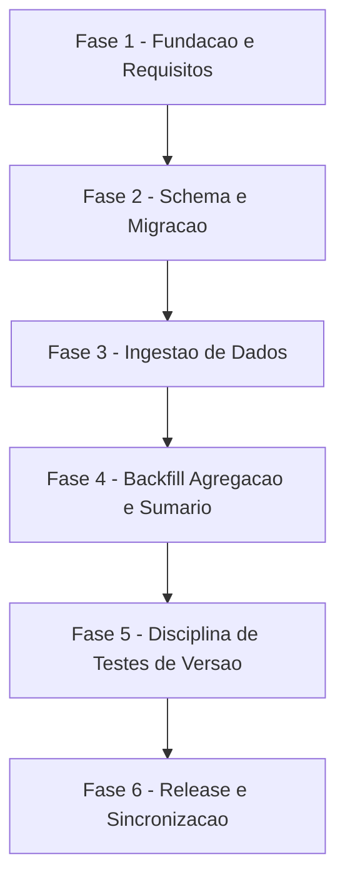

# Tarefas otel-model-breakdown - Migracao aditiva v11->v12 da knowledge.db

Escopo: fechar os 6 `[Gap]` + 2 decisoes `{humano}` resolvidas do checklist
`schema-migration.md`, e implementar a migracao aditiva v11->v12 em
`cli/lib/recall.sh`: tabela nova `wave_model_usage` (custo/tokens por modelo,
por onda) + 8 colunas aditivas em `waves` (breakdown de tokens por fonte
main/subagent), com backfill via `--reindex` e disciplina de edicao das 12
assercoes de versao em `tests/cstk/test_recall.sh`.

**Legenda de status:**
- `[ ]` Pendente
- `[~]` Em andamento
- `[x]` Concluido
- `[!]` Bloqueado

**Legenda de criticidade:**
- `[C]` Critico - Impacto financeiro direto ou bloqueante
- `[A]` Alto - Funcionalidade essencial
- `[M]` Medio - Necessario mas sem urgencia imediata

---

## FASE 1 - Fundacao e Requisitos (fechar gaps do checklist)

### 1.1 Rastreabilidade formal de compatibilidade cross-repo com o cstk-panel `[C]`

Ref: `checklists/schema-migration.md` CHK001, CHK002, CHK003, CHK004 (dec-029);
`plan.md` §Riscos e Dependencias de Release / R1

- [x] 1.1.1 Adicionar `FR-010` a `spec.md` declarando, em linguagem MUST, o
      requisito de compatibilidade cross-repo: o bump de schema NAO MUST
      quebrar silenciosamente o painel instalado sem que exista rastreabilidade
      formal do bump necessario em `cstk-panel` (fecha CHK001)
      <!-- feito: spec.md FR-010 -->
- [x] 1.1.2 Adicionar `SC-005` a `spec.md` com criterio mensuravel para o
      estado do painel ANTES do fix definitivo: com
      `CSTK_SCHEMA_VERSIONS=2,3,4,5,6,7,8,9,10,11,12` setado, `cstk serve`
      continua servindo todas as rotas sem `schema-mismatch` (fecha CHK002)
      <!-- feito: spec.md SC-005 -->
- [x] 1.1.3 Registrar sugestao via `suggestions.sh register` (severidade
      `aviso`) no repo `cstk` referenciando a necessidade de bump de
      `DEFAULT_SCHEMA_VERSIONS` em `cstk-panel/apps/server/src/config.ts:31`
      (hoje `['2'..'11']`); avaliar com o mantenedor se justifica tambem
      `issue.sh create` no repo `JotJunior/cstk` para rastreio formal (fecha
      CHK003) — NUNCA abrir issue no repo `cstk-panel` diretamente (fora do
      blast radius desta execucao, FR-035)
      <!-- feito: sug-004 registrada (severidade aviso); issue.sh create nao
      aberta nesta onda — avaliacao com o mantenedor fica junto de 1.1.4 -->
- [!] 1.1.4 Task explicita de coordenacao (dec-029 / CHK004, resolvido pelo
      mantenedor em 2026-07-28): agendar/confirmar com o mantenedor o bump de
      `DEFAULT_SCHEMA_VERSIONS += '12'` no repo `cstk-panel`, ANTES OU JUNTO
      do merge desta feature — trabalho manual fora do blast radius de escrita
      desta execucao (repo externo); NAO fechar esta subtarefa so com o
      paliativo `CSTK_SCHEMA_VERSIONS`
      <!-- bloqueado: decisao de coordenar ja resolvida (CHK004); rastreabilidade
      formal registrada via sug-004. Acao fisica (bump no repo cstk-panel) e
      trabalho externo do mantenedor, fora do blast radius desta execucao —
      nao fechar so com o paliativo. Reabrir apos confirmacao do mantenedor. -->
- [!] 1.1.5 Teste manual: validar que
      `CSTK_SCHEMA_VERSIONS=2,3,4,5,6,7,8,9,10,11,12 cstk serve` restabelece o
      painel localmente contra um banco em schema v12 (valida SC-005)
      <!-- bloqueado: depende do schema v12 existir (FASE 2, ainda nao
      implementada nesta execucao) -->

### 1.2 Cenario de dado real para valor `0` legitimo preservado `[M]`

Ref: `checklists/schema-migration.md` CHK006; corpus real verificado em
`mcp-project-scafold/.claude/agente-00c-state/state.json`, `onda-022`
(`otel_usage.by_source.main = {cost_usd:0, input:0, output:0, cache_read:0,
cache_creation:4103}`; `otel_usage.by_model.claude-opus-5 = {cost_usd:0,
total_tokens:4103}` — custo zero com tokens NAO-zero na mesma linha, provando
que o zero e medido, nao ausencia)

- [x] 1.2.1 Adicionar Cenario 10 a `quickstart.md` usando os valores reais
      acima (onda-022): ingerir esse `state.json` e consultar
      `otel_main_cost_usd`-equivalentes (colunas `otel_main_input_tokens`,
      `otel_main_output_tokens`, `otel_main_cache_read_tokens`) esperando `0`
      (nao NULL) e `otel_main_cache_creation_tokens = 4103`; e
      `wave_model_usage` com `model='claude-opus-5', cost_usd=0,
      total_tokens=4103` (fecha CHK006)
      <!-- feito: quickstart.md Cenario 10 -->
- [!] 1.2.2 Adicionar assercao automatizada em `tests/cstk/test_recall.sh`
      que ingere essa onda e verifica `IS NOT NULL AND = 0` (nao `IS NULL`)
      para as colunas zeradas do `main`, e `cost_usd = 0` com
      `total_tokens = 4103` em `wave_model_usage` para `claude-opus-5`
      <!-- bloqueado: `wave_model_usage`/colunas novas nao existem ainda em
      recall.sh (schema corrente = v11, verificado via
      `grep -n RECALL_SCHEMA_VERSION= cli/lib/recall.sh` -> `115:RECALL_SCHEMA_VERSION=11`).
      Escrever a assercao agora quebraria a suite (SC-004 exige 100% verde).
      Implementacao real desta assercao movida para FASE 3.4 (ja mapeada em
      tasks.md §Escopo Coberto: "CHK013/014 ... | 1.3, 3.4"); Cenario 10 do
      quickstart ja fecha CHK006 ao nivel de especificacao. -->
- [x] 1.2.3 Atualizar `data-model.md` §Regra transversal NULL vs zero citando
      este segundo caso real (zero em `cost_usd`, nao apenas em tokens) como
      evidencia adicional da distincao NULL-vs-zero
      <!-- feito: data-model.md §Regra transversal NULL vs zero -->

### 1.3 FR + teste de isolamento de seguranca `wave_model_usage` x `knowledge_fts` `[C]`

Ref: `checklists/schema-migration.md` CHK013, CHK014; `plan.md` §Tratamento do
nome do modelo, item "1.ter" (fronteira LLM01/ASI06)

- [x] 1.3.1 Adicionar `FR-011` a `spec.md` declarando, em linguagem MUST, que
      `wave_model_usage` MUST NUNCA alimentar `knowledge_fts` — mesma
      fronteira de seguranca ja aplicada a `tasks`/`events` (fecha CHK014)
      <!-- feito: spec.md FR-011 -->
- [!] 1.3.2 Adicionar assercao automatizada em `tests/cstk/test_recall.sh`
      (apos `--ingest`): `SELECT count(*) FROM knowledge_fts WHERE
      type='wave_model_usage'` retorna `0`
      <!-- bloqueado: mesma razao de 1.2.2 (tabela ainda nao existe); movido
      para FASE 3.4 (mapeado em §Escopo Coberto) -->
- [!] 1.3.3 Repetir a mesma assercao apos `--reindex` sobre o mesmo corpus
      (fecha CHK013 — cobre os dois caminhos de escrita do FTS)
      <!-- bloqueado: idem 1.3.2, movido para FASE 3.4 -->

### 1.4 Documentar limitacao conhecida do guard de invalidacao de delta `[M]`

Ref: `checklists/schema-migration.md` CHK021 (dec-029); spec.md Clarifications
Session 2026-07-28, segunda pergunta; `sug-002` na knowledge.db

- [x] 1.4.1 Adicionar uma nota em `spec.md` (secao Edge Cases ou nova
      "Limitacoes Conhecidas") documentando o risco residual: subcontagem
      silenciosa de custo/tokens caso o guard de invalidacao de delta
      (comparacao de `session_id` entre snapshots de inicio/fim de onda,
      `otel-usage.sh delta`) falhe em disparar quando deveria — reconfirmado
      fora do escopo desta feature apos investigacao empirica (2026-07-28)
      <!-- feito: spec.md nova secao "Limitacoes Conhecidas" -->
- [x] 1.4.2 Referenciar `sug-002` (knowledge.db) como o item que trata esse
      bugfix separadamente, sem expandir o escopo desta feature
      <!-- feito: referencia a sug-002 incluida na secao "Limitacoes Conhecidas" -->
- [x] 1.4.3 Confirmar via `grep -rn "session_id" docs/specs/otel-model-breakdown/*.md`
      que nenhuma nova referencia ao guard aparece fora da secao de
      limitacoes conhecidas (sem expansao de escopo silenciosa)
      <!-- feito: grep executado — unicas ocorrencias novas ficam dentro da
      propria secao "Limitacoes Conhecidas" (spec.md) e da tabela "Escopo
      Excluido" ja existente (tasks.md); nenhuma expansao de escopo -->

---

## FASE 2 - Schema e Migracao (DDL v11 -> v12)

### 2.1 Bump de versao + DDL aditivo `[A]`

Ref: `plan.md` §Project Structure (pontos 1-3); `data-model.md` §Entity
WaveModelUsage / §Entity Wave (extensao)

- [x] 2.1.1 Bump `RECALL_SCHEMA_VERSION=11` -> `12` (`recall.sh:115`)
- [x] 2.1.2 Adicionar as 8 colunas INTEGER nullable de breakdown por fonte na
      DDL de `waves` (`recall.sh:496-529`): `otel_main_input_tokens`,
      `otel_main_output_tokens`, `otel_main_cache_read_tokens`,
      `otel_main_cache_creation_tokens`, `otel_subagent_input_tokens`,
      `otel_subagent_output_tokens`, `otel_subagent_cache_read_tokens`,
      `otel_subagent_cache_creation_tokens`
- [x] 2.1.3 Adicionar `CREATE TABLE IF NOT EXISTS wave_model_usage (...)`
      apos `recall.sh:602`, com `UNIQUE(project, feature, wave, source_id)`
      no mesmo padrao das outras 10 tabelas de metrica
- [x] 2.1.4 Teste: `PRAGMA table_info(waves)` confirma as 8 colunas novas e
      `sqlite_master` confirma a existencia de `wave_model_usage` num banco
      criado do zero (Cenario 8, parte "banco novo")

### 2.2 ALTER idempotente v11 -> v12 sobre banco existente `[A]`

Ref: `data-model.md` §Migracao v11 -> v12; `plan.md` ponto 4

- [x] 2.2.1 Adicionar bloco `ALTER` apos o bloco v10->v11 existente
      (`recall.sh:758-770`), reusando a variavel `_as_wcols` ja lida uma
      unica vez em `recall.sh:724` via `PRAGMA table_info(waves)`
- [x] 2.2.2 Implementar o guard idempotente `case "$_as_wcols" in
      ''|*'|otel_main_input_tokens|'*) : ;; *) <8 ALTER TABLE waves ADD
      COLUMN> ;; esac` — `wave_model_usage` NAO precisa de ALTER (o `CREATE
      TABLE IF NOT EXISTS` do DDL ja cobre bancos pre-existentes)
- [x] 2.2.3 Teste de idempotencia: rodar o `ALTER` duas vezes sobre o mesmo
      banco v11 e confirmar que a segunda execucao nao falha nem duplica
      coluna

### 2.3 Validacao de migracao sobre banco v11 real `[A]`

Ref: `quickstart.md` Cenario 8; `spec.md` FR-003, FR-009

- [ ] 2.3.1 Partir de uma `knowledge.db` real ja em v11 (com dados) como
      fixture de teste
- [ ] 2.3.2 Rodar um comando que abre o banco (ex.: `cstk recall "algo"`) e
      confirmar `schema_meta.schema_version = '12'`
- [ ] 2.3.3 Confirmar que TODAS as linhas/colunas pre-existentes continuam
      intactas e consultaveis (contagem de `decisions`, `waves`, `tasks`
      inalterada antes/depois)
- [ ] 2.3.4 Teste: rodar o mesmo comando uma segunda vez e confirmar que nao
      falha nem duplica coluna (idempotencia do `case`/`PRAGMA table_info`)

---

## FASE 3 - Ingestao de Dados

### 3.1 Extracao jq do breakdown por fonte `[A]`

Ref: `plan.md` pontos 5-6; `data-model.md` §Entity Wave (extensao)

- [x] 3.1.1 Estender a expressao jq de extracao de `waves` (`recall.sh:1130-1138`)
      para emitir os 8 campos de `otel_usage.by_source.main.*` e
      `.subagent.*` no array posicional, preservando `//` (operador que
      distingue ausencia de `0` legitimo — nao alterar essa semantica)
- [x] 3.1.2 Estender a leitura por indice (`recall.sh:1163-1167`) com as 8
      novas posicoes `.[23]`..`.[30]`, cada uma passando por
      `recall_int_or_null` (`recall.sh:850`)
- [x] 3.1.3 Teste: Cenario 2 do quickstart (onda-001, `by_source.main`
      presente) — os 8 valores exatos batem com o `state.json` de origem

### 3.2 Consistencia das tres listas do `INSERT` de `waves` `[A]`

Ref: `plan.md` ponto 7 (ATENCAO: lista de colunas aparece 3x)

- [x] 3.2.1 Atualizar a lista de **colunas** do `INSERT INTO waves(...)`
      (`recall.sh:1189`) com as 8 novas colunas
- [x] 3.2.2 Atualizar a lista de **VALUES** (mesmo bloco) mantendo a MESMA
      ordem posicional das colunas
- [x] 3.2.3 Atualizar o `ON CONFLICT (...) DO UPDATE SET` (`recall.sh:1191`)
      incluindo as 8 colunas novas, mesma ordem
- [x] 3.2.4 Teste: contagem de placeholders `?` no `INSERT` bate exatamente
      com a contagem de colunas declaradas (falha se as 3 listas divergirem
      apos a edicao)

### 3.3 Loop de extracao propria para `wave_model_usage` `[A]`

Ref: `plan.md` ponto 8 + §Tratamento do nome do modelo; `data-model.md`
§Entity WaveModelUsage

- [x] 3.3.1 Implementar loop de extracao proprio (padrao ja usado por
      `tasks`/`events`) apos `recall.sh:1195`, percorrendo as chaves de
      `otel_usage.by_model` da onda
- [x] 3.3.2 Aplicar `sql_escape` (`recall.sh:202`) nas DUAS posicoes onde o
      nome do modelo aparece: coluna `model` e coluna `source_id`
- [x] 3.3.3 Aplicar `strip_nul` (`recall.sh:334`) ao valor extraido do
      modelo antes de compor o `INSERT`, evitando truncamento silencioso por
      byte NUL
- [x] 3.3.4 NAO passar o campo `model`/`source_id` por `recall_scrub` —
      documentar inline (comentario pt-br) o motivo: campo estruturado
      (mesma classe de `event_type`), nao texto livre; scrub mutilaria a
      fidelidade da string bruta exigida por FR-001
- [x] 3.3.5 Teste: Cenario 1 (onda-001, 2 modelos) e Cenario 4 (onda-004,
      `claude-opus-5[1m]` com sufixo de tier preservado literalmente, sem
      normalizacao para `opus`/`sonnet`)

### 3.4 Verificacao do isolamento de seguranca (implementa FR-011) `[C]`

Ref: 1.3 (FR-011 e testes ja escritos); `plan.md` item "1.ter"

- [x] 3.4.1 Confirmar por leitura de codigo que nenhum `INSERT`/trigger de
      `knowledge_fts` referencia `wave_model_usage` ou o campo `model`
- [x] 3.4.2 Rodar os testes automatizados criados em 1.3.2/1.3.3
      (`--ingest` e `--reindex`) e confirmar `count(*) = 0`
- [x] 3.4.3 Auditoria: `grep -n "knowledge_fts" cli/lib/recall.sh` nao produz
      nenhuma ocorrencia associada a `wave_model_usage`

---

## FASE 4 - Backfill, Agregacao e Sumario

### 4.1 Reindex idempotente `[A]`

Ref: `quickstart.md` Cenario 7; `spec.md` FR-005, SC-003

- [ ] 4.1.1 Confirmar que `--reindex` (que ja faz `rm -f` do banco inteiro em
      `recall.sh:2398`) recria `wave_model_usage` do zero via o loop de 3.3
- [ ] 4.1.2 Rodar `cstk recall --reindex --states-root ~/Projects` duas vezes
      sobre o corpus real e comparar `count(*)`/`SUM(cost_usd)` de
      `wave_model_usage` entre as duas execucoes (devem ser identicos)
- [ ] 4.1.3 Teste de paridade `--ingest` vs `--reindex` (Cenario 1 vs Cenario
      7): mesma onda, mesmos valores nas duas tabelas novas pelos dois
      caminhos (fecha FR-006)

### 4.2 Contadores de sumario `[M]`

Ref: `plan.md` pontos 9-11

- [ ] 4.2.1 Adicionar `RECALL_TOTAL_WAVE_MODEL` na agregacao de totais
      (`recall.sh:1735`)
- [ ] 4.2.2 Inicializar o contador novo nas duas posicoes (`recall.sh:2007-2008`
      e `:2411-2412` — caminhos de `--ingest` e `--reindex`)
- [ ] 4.2.3 Adicionar o contador as duas format strings de sumario
      (`recall.sh:2014` e `:2454`)
- [ ] 4.2.4 Teste: o sumario emitido por `--ingest`/`--reindex` reporta a
      contagem correta de linhas de `wave_model_usage` processadas

### 4.3 Validacao end-to-end contra corpus real `[A]`

Ref: `quickstart.md` Cenarios 1-5

- [ ] 4.3.1 Rodar `--reindex --states-root ~/Projects` sobre o corpus
      completo (inclui `mcp-project-scafold`, `my-music-match/foundation`,
      execucao desta propria feature)
- [ ] 4.3.2 Validar Cenario 1 (onda-001, `claude-fable-5` + `claude-sonnet-5`,
      `SUM(cost_usd) = 1.686155`, `SUM(total_tokens) = 2519024`)
- [ ] 4.3.3 Validar Cenario 3 (onda-004 de `my-music-match/foundation`,
      `by_source` so com `subagent` — 4 colunas `otel_main_*` NULL) e
      Cenario 4 (mesma onda, `claude-opus-5[1m]` preservado)
- [ ] 4.3.4 Validar Cenario 5 (onda sem `otel_usage` — zero linhas em
      `wave_model_usage`, linha em `waves` existe com as 8 colunas novas NULL)

---

## FASE 5 - Disciplina de Testes de Versao (R2)

### 5.1 Editar as 12 assercoes de `schema_version` linha a linha `[A]`

Ref: `plan.md` §R2; `research.md` Decision 9; `quickstart.md` Cenario 9

- [ ] 5.1.1 Editar individualmente cada uma das 12 linhas de
      `tests/cstk/test_recall.sh` (611, 656, 678, 1879, 2195, 2285, 3035,
      3161, 3216, 3265, 3337, 3474) de `"11"` para `"12"` — edicao dirigida
      linha a linha, NUNCA `sed`/replace global (atingiria numeros e textos
      nao relacionados)
- [ ] 5.1.2 Corrigir a mensagem de assercao ja dessincronizada na linha 678
      (hoje "esperado 10 apos 2x" enquanto compara contra 11/12)
- [ ] 5.1.3 Confirmar via `grep -n '"11"' tests/cstk/test_recall.sh` que
      nenhuma ocorrencia relacionada a `schema_version` restou

### 5.2 Suite de regressao completa `[C]`

Ref: `spec.md` SC-004; `quickstart.md` Cenario 9

- [ ] 5.2.1 Rodar `./tests/run.sh test_recall` isoladamente
- [ ] 5.2.2 Rodar a suite completa `./tests/run.sh` (todos os cenarios,
      incluindo os anteriores a esta feature)
- [ ] 5.2.3 Confirmar 100% verde — nenhuma regressao nas dimensoes ja
      existentes da knowledge.db

---

## FASE 6 - Release e Sincronizacao

### 6.1 Build e validacao local do runtime alterado `[M]`

Ref: `plan.md` §R3 (GOTCHA de distribuicao); `quickstart.md` §Nota de release

- [ ] 6.1.1 Gerar tarball de dev: `./scripts/build-release.sh X.Y.Z-dev`
- [ ] 6.1.2 Aplicar `cstk self-update --from "file://$PWD/dist/cstk-X.Y.Z-dev.tar.gz"`
      (GOTCHA: `cstk install`/`cstk update` NAO tocam `cli/lib/` — so
      `self-update` atualiza o runtime)
- [ ] 6.1.3 Validar `cstk recall` a partir do binario/runtime instalado
      (nao so do repo), confirmando que o schema v12 e aplicado de fato

### 6.2 Gate de coordenacao cross-repo antes do release `[C]`

Ref: 1.1 (dec-029, CHK004) — NAO elegivel a skip/opt-out silencioso

- [ ] 6.2.1 Confirmar que a task 1.1 (rastreabilidade formal cross-repo) foi
      concluida antes de prosseguir
- [ ] 6.2.2 Obter confirmacao explicita do mantenedor de que o bump de
      `DEFAULT_SCHEMA_VERSIONS` no `cstk-panel` foi agendado ou ja publicado
- [ ] 6.2.3 So entao prosseguir com tag + release desta feature no `cstk`
      (bloqueio humano se a confirmacao nao existir)

---

## Matriz de Dependencias

## Resumo Quantitativo

| Fase | Tarefas | Subtarefas | Criticidade |
|------|---------|------------|-------------|
| 1 - Fundacao e Requisitos | 4 | 14 | C/M |
| 2 - Schema e Migracao | 3 | 12 | A |
| 3 - Ingestao de Dados | 4 | 15 | A/C |
| 4 - Backfill Agregacao e Sumario | 3 | 11 | A/M |
| 5 - Disciplina de Testes de Versao | 2 | 6 | A/C |
| 6 - Release e Sincronizacao | 2 | 6 | M/C |
| **Total** | **18** | **64** | - |

## Escopo Coberto

| Item | Descricao | Fase |
|------|-----------|------|
| FR-001..FR-009 | Tabela `wave_model_usage` + 8 colunas aditivas em `waves`, migracao idempotente, confinamento de deps | 2, 3, 4 |
| CHK001/002/003 | FR-010 + SC-005 + rastreabilidade formal de compatibilidade cross-repo com cstk-panel | 1.1 |
| CHK004 (dec-029) | Task explicita de coordenacao do bump `DEFAULT_SCHEMA_VERSIONS` no `cstk-panel` antes/junto do merge | 1.1, 6.2 |
| CHK006 | Cenario de quickstart + teste automatizado para valor `0` legitimo preservado (dado real onda-022) | 1.2 |
| CHK013/014 | FR-011 + testes automatizados do isolamento `wave_model_usage` x `knowledge_fts` | 1.3, 3.4 |
| CHK021 (dec-029) | Documentacao da limitacao conhecida (guard de delta) na spec, sem expandir escopo | 1.4 |
| R2 | Edicao dirigida das 12 assercoes de `schema_version` nos testes | 5.1 |
| R3 | GOTCHA de release (`self-update` vs `install`/`update`) validado localmente | 6.1 |

## Escopo Excluido

| Item | Descricao | Motivo |
|------|-----------|--------|
| `otel_session_id` | Coluna de sessao do OTel | Removida do escopo via Clarifications Session 2026-07-28 — `session_id` nao discrimina sessao/projeto de forma confiavel no snapshot observado |
| Bugfix do guard de invalidacao de delta | Correcao do guard que compara `session_id` entre snapshots inicio/fim de onda | Fora do escopo desta feature (dec-029, CHK021 resolvido) — nao misturar correcao de coleta de telemetria com migracao de schema; tratado como `sug-002` na knowledge.db |
| Normalizacao do nome do modelo | Converter string bruta do OTel para alias canonico (`opus`/`sonnet`/`haiku`) | Decisao explicita (Clarifications) de manter string bruta — normalizar apagaria distincoes reais de custo (ex.: `claude-opus-5[1m]` vs `claude-opus-5`) |
| Edicao do codigo do `cstk-panel` | Bump de `DEFAULT_SCHEMA_VERSIONS` em `apps/server/src/config.ts` | Repo externo, fora do blast radius de escrita desta execucao — apenas a COORDENACAO/rastreabilidade esta no escopo (1.1, 6.2), nao a edicao de codigo do painel |
