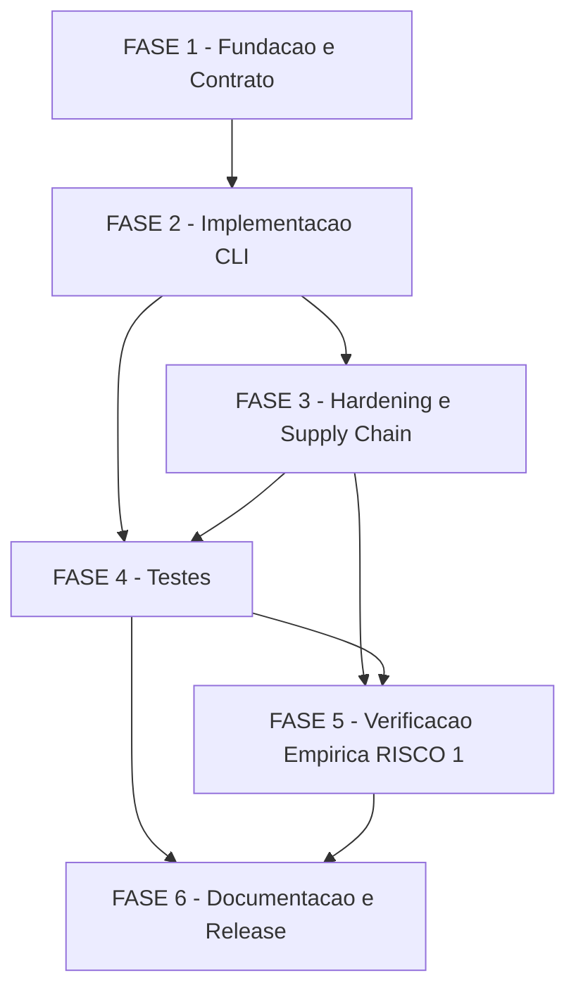

# Tarefas panel-docker - Modo Docker opt-in do cstk serve

Escopo: decompor a feature `panel-docker` (spec.md + plan.md + research.md + data-model.md +
contracts/cli-docker-mode.md + quickstart.md) em backlog executavel: assets Docker (Dockerfile +
entrypoint + encaminhador in-container), o caminho `--docker` no CLI (`cli/lib/serve.sh` +
`cli/lib/serve-docker.sh` confinado), hardening e supply chain da imagem, testes (extensao de
`tests/cstk/test_serve.sh`), verificacao empirica OBRIGATORIA do RISCO #1 (leitura WAL read-only
sobre mount `:ro`) e documentacao/release. Inclui os 7 gaps abertos das tabelas "Follow-up
obrigatorio" de `checklists/security.md` e `checklists/infra.md` como tarefas ou criterios de
aceite explicitos.

**Legenda de status:**
- `[ ]` Pendente
- `[~]` Em andamento
- `[x]` Concluido
- `[!]` Bloqueado

**Legenda de criticidade:**
- `[C]` Critico - Impacto financeiro, regulatorio ou de seguranca (integridade, hardening,
  fail-closed, RISCO #1)
- `[A]` Alto - Funcionalidade core sem a qual o modo Docker nao opera
- `[M]` Medio - Necessario mas adiavel sem impacto imediato (documentacao, help text, changelog)

## Pre-condicoes Humanas Pendentes (antes de `/execute-task`)

Estes 4 itens sao marcados `{humano}` nos checklists — NAO sao resolvidos por este backlog,
apenas documentados como pre-condicoes aguardando o dono do produto:

- **security CHK018** - aceitar a exposicao read-only dos `knowledge.db.bak-*` siblings (mount do
  diretorio inteiro), ou investir em mount de escopo mais estreito.
- **security CHK020** - confirmar que os 4 achados MEDIUM do gate `owasp-security` (rebaixados a
  defaults de hardening) sao apetite de risco aceitavel antes do primeiro release do modo Docker.
- **infra CHK019** - confirmar que P3 e a prioridade correta para a User Story 4 (idempotencia),
  dado que a ausencia dela deixa o usuario com erro cru de runtime ate um fix futuro.
- **infra CHK020** - definir (ou dispensar explicitamente) um Success Criterion de performance
  para o tempo de primeira execucao do modo Docker (download + `npm ci` + `npm run build` dentro
  do container).

---

## FASE 1 - Fundacao e Contrato (Assets Docker)

### 1.1 Confinamento do modo Docker em arquivo dedicado `[A]`

Ref: plan.md Structure Decision (carve-out Principio II condicao b); Complexity Tracking item (b)

- [ ] 1.1.1 Criar `cli/lib/serve-docker.sh` (esqueleto sourced condicionalmente por
  `cli/lib/serve.sh` quando `--docker`) — nenhuma outra mencao a `docker` fora deste arquivo,
  exceto o parse da flag em `serve.sh`
- [ ] 1.1.2 Definir a interface de entrada de `serve-docker.sh` (ex.: funcao `_serve_docker_main`
  recebendo os mesmos parametros ja parseados por `serve_main`: porta, host, update, reinstall,
  allow_unverified, bypass_method)
- [ ] 1.1.3 Confirmar via grep que `docker` so aparece em `cli/lib/serve-docker.sh` fora do parse
  da flag em `serve.sh` — criterio objetivo do carve-out (b)
- [ ] 1.1.4 Criar `tests/cstk/test_serve-docker.sh` (scaffold com o mesmo harness de
  `tests/cstk/test_serve.sh` — `TESTS_ROOT`/`REPO_ROOT`/`harness.sh`) para satisfazer o
  mapeamento 1:1 exigido por `--check-coverage` (CLAUDE.md "Como testar scripts shell")

### 1.2 Dockerfile: build local a partir da arvore verificada `[C]`

Ref: research.md Decision 1; data-model.md "Panel Image"; spec.md FR-006/FR-013

- [ ] 1.2.1 Escrever Dockerfile com `FROM node:20-bookworm-slim` (glibc, `engines.node
  >=20.0.0` — package.json L28) pinado por digest — resolver e fixar o `@sha256:...` exato em
  execute-task (NAO inventar aqui; research.md Decision 1 marca "[detalhe de execute-task]")
- [ ] 1.2.2 `WORKDIR` + `COPY` da arvore-fonte ja verificada por `_serve_install`
  (`extracted_tree_path`, data-model.md "Verified Panel Installation") como contexto de build —
  sem segunda fonte de download (FR-007)
- [ ] 1.2.3 `RUN npm ci` (nao `npm install`) a partir do `package-lock.json` da arvore extraida —
  validar empiricamente que o prebuild do `better-sqlite3` (modulo nativo, server package.json)
  resolve sem toolchain de compilacao extra na base glibc escolhida
- [ ] 1.2.4 Instalar `socat` na imagem (pacote do gerenciador da base debian escolhida) para o
  encaminhador da tarefa 1.3
- [ ] 1.2.5 `USER node` (non-root) + `EXPOSE` da porta do encaminhador + `ENTRYPOINT` apontando
  para o script da tarefa 1.3
- [ ] 1.2.6 Definir `image_tag` local deterministico (proposta aterrada em data-model.md "Panel
  Image": `cstk-panel:<panel_version>`) — nunca registry remoto (FR-013)
- [ ] 1.2.7 Teste: `docker build` da imagem local sucede a partir do fixture de arvore verificada
  ja usado por `test_serve.sh` (`SERVE_FIXTURE_DIR`); se a suite POSIX nao tiver acesso a um
  daemon Docker real no ambiente de CI, documentar a estrategia de skip/stub adotada

### 1.3 Entrypoint e encaminhador in-container (FR-005) `[C]`

Ref: research.md Decision 2 e Decision 4; contracts/cli-docker-mode.md "In-container"

- [ ] 1.3.1 Escrever entrypoint POSIX sh que inicia o painel (`node apps/server/dist/index.js`,
  package.json L13) em background com `PORT=<porta interna>` exportado — candidato aterrado:
  `3001` (default de config.ts L80 quando `PORT` nao setada); confirmar/fixar em execute-task
- [ ] 1.3.2 Adicionar ao entrypoint o encaminhador
  `socat TCP-LISTEN:<porta-container>,fork,reuseaddr TCP:127.0.0.1:<porta-interna>` (ou proxy
  Node alternativo — research.md Decision 2 "Alternatives considered" — se o pacote `socat` nao
  instalar na base escolhida) em foreground
- [ ] 1.3.3 Propagar sinais corretamente com `docker run --init` (tini como PID 1, Decision 6) —
  validar que `TERM` chega aos dois processos (painel + encaminhador) sem deixar zumbi
- [ ] 1.3.4 Registrar a decisao tomada (socat vs proxy Node) como Decisao auditavel do
  orquestrador, citando o resultado empirico dos testes 1.2.7/1.3.5
- [ ] 1.3.5 Teste: com a imagem construida (1.2), validar que uma requisicao HTTP a
  `0.0.0.0:<porta-container>` de dentro do netns do container e respondida pelo painel em
  `127.0.0.1:<porta-interna>` (quickstart Scenario 1, passos 3-4)

---

## FASE 2 - Implementacao do Modo `--docker` no CLI

### 2.1 Parse da flag `--docker` e composicao com flags existentes `[A]`

Ref: spec.md FR-001/FR-002; contracts/cli-docker-mode.md "Flags (composicao)"

- [ ] 2.1.1 Adicionar `--docker)` ao laco `case` de `serve_main` (`serve.sh`, mesmo laco que ja
  trata `--port`/`--host`/`--update`/`--reinstall`/`--allow-unverified`, L368-475)
- [ ] 2.1.2 Repassar `--port`/`--host`/`--update`/`--reinstall`/`--allow-unverified` ja
  parseados para o caminho `serve-docker.sh` (interface definida em 1.1.2)
- [ ] 2.1.3 Garantir que a AUSENCIA de `--docker` preserva 100% o comportamento nativo atual
  (FR-002) — nenhum novo branch e avaliado antes do parse do proprio `--docker`
- [ ] 2.1.4 Teste de regressao: todos os scenarios existentes de `test_serve.sh` (sem `--docker`)
  continuam passando sem alteracao de exit code/stdout/stderr apos a mudanca

### 2.2 Pre-flight fail-closed do runtime de container `[C]`

Ref: spec.md FR-003/FR-004/SC-006; research.md Decision 5; data-model.md "Container Runtime Check"

- [ ] 2.2.1 Checar `command -v docker` ANTES de qualquer operacao de rede — ausente: mensagem
  "docker nao instalado" (texto exato fixado em 2.8), exit 1
- [ ] 2.2.2 Definir e fixar o comando exato da sonda de daemon (`docker info` vs `docker version
  --format ...`) e seu parsing de exit code — descrever o contrato e fixar na implementacao
  (research.md Decision 5 marca "[detalhe de execute-task]")
- [ ] 2.2.3 Runtime presente mas sonda de daemon falha: mensagem DISTINTA "daemon
  parado/inacessivel" (texto exato fixado em 2.8), exit 1
- [ ] 2.2.4 Medir e validar que o diagnostico completo (binario + sonda) ocorre em <5s sem
  nenhuma chamada de rede antes (SC-006)
- [ ] 2.2.5 Teste: docker ausente do PATH (stub) -> mensagem + exit 1 sem rede; docker presente
  mas sonda falha (stub) -> mensagem distinta + exit 1; ambos presentes -> prossegue

### 2.3 Reuso do fluxo de instalacao verificada `[C]`

Ref: spec.md FR-006/FR-007; research.md Decision 1; data-model.md "Verified Panel Installation"

- [ ] 2.3.1 Reusar `_serve_install` (`serve.sh` L194-354) ate a extracao — `trusted_host_check` +
  integridade fail-closed + extracao — como fonte da arvore de contexto do `docker build`
  (1.2.2), sem segundo mecanismo de download/verificacao
- [ ] 2.3.2 Garantir `host_npm_used=false` no modo Docker (data-model.md campo MUST false) —
  nenhum `npm install`/`npm run build` roda no host quando `--docker`
- [ ] 2.3.3 Aplicar `--allow-unverified`/`CSTK_SERVE_ALLOW_UNVERIFIED=1` apenas na etapa de
  download do painel (host), preservando o aviso de alta visibilidade + linha `serve-integrity`
  no enforcement-log; mismatch de checksum continua bloqueio absoluto sem bypass
- [ ] 2.3.4 Teste: cenario paralelo aos scenarios de integridade ja existentes em
  `test_serve.sh` (host allowlist, integridade nao confirmada, mismatch bloqueado), agora
  exercitando o caminho `--docker`

### 2.4 Build/rebuild da imagem conforme `--update`/`--reinstall` `[A]`

Ref: spec.md FR-010; research.md Decision 5 e Decision 1; data-model.md "Panel Image" State
Transitions; checklists/infra.md CHK012

- [ ] 2.4.1 Imagem ausente: construir (`docker build`) a partir da arvore recem-verificada (2.3)
- [ ] 2.4.2 `--update`: consultar release mais recente (mesma logica ja existente do modo
  nativo); se houver versao nova, re-baixar+verificar e reconstruir a imagem; senao reusar a
  imagem cacheada; falha de rede/API mantem a imagem instalada e AINDA sobe o painel
  (best-effort, paridade com o nativo)
- [ ] 2.4.3 `--reinstall`: remover a imagem cacheada (`docker rmi`) e reconstruir do zero,
  incondicional (paridade com o `rm -rf` do dir nativo, `serve.sh` L533-535)
- [ ] 2.4.4 CHK012 (infra, `[Ambiguity]`): fixar regra de precedencia quando `--update` E
  `--reinstall` sao informados juntos — `--reinstall` vence (espelha "reinstall e sempre
  incondicional" ja definido para o caso isolado, proposta do checklist) — registrar como
  Decisao auditavel do orquestrador
- [ ] 2.4.5 Teste: cada um dos 3 gatilhos de `build_trigger` (absent / `--update` com versao
  nova / `--reinstall`) dispara o rebuild esperado; `--update` sem versao nova reusa a imagem;
  `--update`+`--reinstall` juntos aplica a precedencia de 2.4.4

### 2.5 `docker run`: nome, label, porta, mount, init, rm `[C]`

Ref: spec.md FR-005/FR-008/FR-009/FR-011/FR-013; research.md Decision 3/4/6;
contracts/cli-docker-mode.md "Contract: docker run"

- [ ] 2.5.1 Nome deterministico do container (proposta aterrada em research.md Decision 6 /
  data-model.md: `cstk-panel`) e label de gestao (proposta: `cstk.managed=serve`) — confirmar em
  execute-task (data-model.md marca ambos `[a fixar]`)
- [ ] 2.5.2 Publicar porta no loopback do host: `-p 127.0.0.1:<porta-host>:<porta-container>`
  (`<porta-host>` = `--port`, default 5173, mesma validacao 1024-65535 de `serve.sh` L488-508)
- [ ] 2.5.3 Montar o diretorio de dados do cstk (`dirname(CSTK_KNOWLEDGE_DB)` no host, senao
  `~/.claude/cstk/`) como `-v <dir>:<target>:ro` + `-e CSTK_KNOWLEDGE_DB=<target>/knowledge.db`
  — diretorio inteiro (nao so o arquivo), por causa dos sidecars WAL `-shm`/`-wal` (research.md
  Decision 3)
- [ ] 2.5.4 `--init` (tini, PID 1) + `--rm` (auto-remove no fim do happy path)
- [ ] 2.5.5 Garantir que o helper NUNCA emite `docker push` nem `--network host` (FR-013;
  research.md Decision 2 "Alternatives considered" rejeita `--network host`) — checagem estatica
  (grep) no proprio `serve-docker.sh`
- [ ] 2.5.6 Teste: assert que a invocacao `docker run` montada pelo helper contem exatamente os
  parametros acima (nome/label/porta/mount ro/init/rm) e nunca contem `push`/`--network host`/
  `--privileged` (grep estatico sobre `serve-docker.sh`, paridade com o teste de FR-013 ja
  proposto em research.md Decision 7)

### 2.6 Reconciliacao de container remanescente (FR-012-INFRA-IDEMP) `[A]`

Ref: spec.md FR-012-INFRA-IDEMP; research.md Decision 6; data-model.md "Containerized Panel
Instance" State Transitions; checklists/infra.md CHK003

- [ ] 2.6.1 A cada invocacao, executar `docker rm -f <nome>` antes do `run`, tolerando "no such
  container" (idempotente) — cobre remanescente parado OU rodando
- [ ] 2.6.2 CHK003 (infra, `[Gap]`): enumerar as condicoes concretas sob as quais a
  reconciliacao e "impossivel" (ex.: permissao negada ao daemon, daemon cai no meio da
  operacao, container preso em estado `removing`) e mapear CADA UMA para uma mensagem cstk
  especifica (nunca stack cru do runtime) — texto exato fixado junto com 2.8
- [ ] 2.6.3 Interrupcao durante build/start (Ctrl+C antes de `ready`, Edge Case da spec): o
  handler remove o container parcial pelo nome deterministico, sem deixar orfao (data-model.md
  "Interrupcao durante build/start")
- [ ] 2.6.4 Teste: remanescente parado -> reconciliado e sobe normal; remanescente rodando ->
  reconciliado e sobe normal; reconciliacao impossivel (simular permissao negada via stub
  docker) -> mensagem cstk especifica, nunca erro cru

### 2.7 Encerramento gracioso (FR-011) `[A]`

Ref: spec.md FR-011; research.md Decision 6 "Encerramento gracioso"; quickstart.md Scenario 6

- [ ] 2.7.1 Reusar o padrao de trap do host (`trap ... INT TERM`, espelhando `_serve_shutdown`
  `serve.sh` L103-123) disparando `docker stop -t <grace>` — grace alinhado ao nativo (5s)
- [ ] 2.7.2 Confirmar que `--rm` remove o container apos o `stop` bem-sucedido (happy path sem
  vestigio)
- [ ] 2.7.3 Teste: Ctrl+C simulado (envio de sinal ao processo do `cstk serve --docker` em
  teste) resulta em `docker stop` + remocao, sem container/processo orfao (SC-003) — paridade
  com o teste de shutdown ja existente para o modo nativo

### 2.8 Mensagens de erro acionaveis `[A]`

Ref: contracts/cli-docker-mode.md "Erros"; checklists/infra.md CHK009

- [ ] 2.8.1 CHK009 (infra, `[Gap]`): operacionalizar "mensagem acionavel" com criterio testavel
  — MUST citar a causa raiz + MUST sugerir o proximo comando/link
- [ ] 2.8.2 Fixar o texto exato das 5 mensagens da tabela de Erros do contrato: docker nao
  instalado; daemon inacessivel; porta em uso; container remanescente irreconciliavel;
  integridade nao confirmada
- [ ] 2.8.3 Teste: cada uma das 5 mensagens contem os dois elementos exigidos por 2.8.1 (assert
  de substring/padrao, nao apenas "mensagem nao vazia")

---

## FASE 3 - Hardening e Supply Chain

### 3.1 Hardening do container por default, reafirmado apos rebuild `[C]`

Ref: research.md Decision 7; contracts/cli-docker-mode.md "Invariantes de seguranca";
checklists/security.md CHK006 (ja PASS) e CHK009 `[Gap]`

- [ ] 3.1.1 Aplicar por default em TODO `docker run`: `USER node` (non-root, ja herdado da
  imagem oficial), `--cap-drop ALL`, `--security-opt no-new-privileges`, `--read-only` no
  rootfs + `tmpfs` para escrita efemera
- [ ] 3.1.2 Validar empiricamente que o painel (Fastify) + o encaminhador (socat) continuam
  funcionais sob o conjunto completo de hardening (research.md Decision 7 marca "[detalhe de
  execute-task]") — ajustar `tmpfs`/paths graváveis conforme necessario, sem afrouxar
  cap-drop/no-new-privileges/read-only
- [ ] 3.1.3 CHK009 (security, `[Gap]`): garantir que o MESMO conjunto de flags de hardening e
  aplicado nos 3 gatilhos de (re)build (imagem ausente / `--update` com rebuild / `--reinstall`)
  — nao apenas na primeira construcao
- [ ] 3.1.4 Confirmar ausencia de `--privileged` e de `CAP_NET_ADMIN` (research.md Decision 2
  "Alternatives considered" rejeita DNAT/iptables por exigir esse cap; Decision 7)
- [ ] 3.1.5 Teste: invocar os 3 gatilhos de build/run (2.4.1-2.4.3) e assert que a invocacao
  `docker run` resultante contem o MESMO conjunto de flags de hardening em todos eles

### 3.2 Pin de digest da imagem base com verificacao objetiva `[C]`

Ref: research.md Decision 1 e Decision 7; checklists/security.md CHK013 `[Gap]`

- [ ] 3.2.1 Resolver e fixar o digest exato da base `node:20-bookworm-slim@sha256:...` (nao tag
  flutuante) — validar que a versao resolvida satisfaz `engines.node >=20.0.0` (package.json L28)
- [ ] 3.2.2 CHK013 (security, `[Gap]`): escrever teste/lint que falha se o Dockerfile
  referenciar a base SEM `@sha256:` (tag flutuante), espelhando o teste ja exigido para
  ausencia de `docker push` (2.5.6) — mesmo padrao de verificacao objetiva
- [ ] 3.2.3 Documentar o processo de atualizacao do digest (quando a base precisar de patch de
  seguranca) para nao virar divida tecnica silenciosa

### 3.3 `npm ci` fail-closed quando lockfile ausente `[C]`

Ref: research.md Decision 1 vs Decision 7; checklists/security.md CHK014 `[Conflict]`

- [ ] 3.3.1 CHK014 (security, `[Conflict]`): resolver a contradicao entre research.md Decision 1
  ("decidir conforme presenca de package-lock.json") e Decision 7 ("MUST usar npm ci
  incondicional") — decisao adotada: o build da imagem MUST falhar fail-closed com mensagem
  acionavel se `package-lock.json` estiver ausente na arvore extraida, em vez de degradar
  silenciosamente para `npm install` (preserva a garantia de reprodutibilidade sem presumir
  lockfile eterno)
- [ ] 3.3.2 Implementar a checagem no Dockerfile/build script: `test -f package-lock.json` antes
  do `RUN npm ci`, abortando o build com mensagem clara se ausente
- [ ] 3.3.3 Teste: fixture de arvore extraida SEM `package-lock.json` -> build falha com a
  mensagem esperada (nunca degrada para `npm install` silenciosamente)
- [ ] 3.3.4 Registrar a decisao de roteamento (nao reabrir `/clarify`, resolvido em
  `/create-tasks` conforme checklists/security.md tabela "Follow-up obrigatorio") como Decisao
  auditavel do orquestrador

---

## FASE 4 - Testes

### 4.1 Estender o harness de testes com os cenarios docker `[A]`

Ref: tests/cstk/test_serve.sh (convencao CLAUDE.md "Como testar scripts shell"); quickstart.md
Scenarios 1-3, 6-10

- [ ] 4.1.1 `tests/cstk/test_serve-docker.sh` (scaffold criado em 1.1.4): cobrir quickstart
  Scenario 1 (subir sem npm no host) — stub docker, sem stub de npm/node no PATH, assert que
  nenhum comando npm/node e invocado no host
- [ ] 4.1.2 Cobrir quickstart Scenario 2 (docker ausente) e Scenario 3 (daemon parado) — reusar
  os stubs de 2.2.5
- [ ] 4.1.3 Cobrir quickstart Scenario 8 (porta customizada) e Scenario 9 (`--update`/
  `--reinstall` no modo docker) — reusar os stubs de 2.4.5
- [ ] 4.1.4 Cobrir quickstart Scenario 10 (integridade nao confirmada com `--docker`) — paridade
  com os scenarios de integridade ja existentes em `test_serve.sh` (2.3.4)
- [ ] 4.1.5 Cobrir quickstart Scenario 6 (encerramento gracioso) e Scenario 7 (reexecucao com
  remanescente) — reusar os testes de 2.6.4/2.7.3
- [ ] 4.1.6 Rodar `./tests/run.sh --check-coverage` e confirmar zero orfaos entre
  `cli/lib/serve-docker.sh` e `tests/cstk/test_serve-docker.sh`

### 4.2 Cenario de composicao `--update` + `--reinstall` `[A]`

Ref: checklists/infra.md CHK012

- [ ] 4.2.1 Teste explicito: `cstk serve --docker --update --reinstall` aplica a precedencia
  fixada em 2.4.4 (`--reinstall` vence)
- [ ] 4.2.2 Teste explicito da ordem inversa dos flags (`--reinstall --update`) para confirmar
  que a precedencia independe da ordem de digitacao
- [ ] 4.2.3 Registrar a Decisao de precedencia (2.4.4) como referenciada por este teste,
  fechando o loop checklist -> tasks -> teste

### 4.3 Regressao do modo nativo intacto (FR-002) `[C]`

Ref: spec.md FR-002; tests/cstk/test_serve.sh (suite existente)

- [ ] 4.3.1 Rodar a suite existente de `tests/cstk/test_serve.sh` (todos os scenarios sem
  `--docker`) apos as mudancas e confirmar zero divergencia de exit code/stdout/stderr
- [ ] 4.3.2 Assert adicional: nenhuma chamada a `docker`/`command -v docker` ocorre quando
  `--docker` esta ausente (grep/instrumentacao do stub, garantindo que o novo caminho nunca e
  avaliado silenciosamente)
- [ ] 4.3.3 Documentar, no commit/PR da tarefa, a evidencia (output do teste) de que FR-002
  (zero mudanca de default) se mantem

### 4.4 Suite completa e lint `[M]`

Ref: CLAUDE.md "Como testar scripts shell"; .shellcheckrc

- [ ] 4.4.1 Rodar `./tests/run.sh` completo (suite inteira) e confirmar 100% verde
- [ ] 4.4.2 Rodar shellcheck (advisory, nao-gateante) sobre `cli/lib/serve-docker.sh` e o
  entrypoint gerado; corrigir achados razoaveis
- [ ] 4.4.3 Rodar `./tests/run.sh --check-coverage` uma segunda vez apos toda a FASE 4 para
  confirmar que nenhum script novo (Dockerfile helper, entrypoint script, `serve-docker.sh`)
  ficou sem teste mapeado

---

## FASE 5 - Verificacao Empirica RISCO #1 e Paridade de Dados

### 5.1 Verificacao empirica: leitura WAL read-only sobre mount `:ro` (RISCO #1) `[C]`

Ref: research.md Decision 3 "NEEDS CLARIFICATION / risco #1"; plan.md "Risco tecnico
rastreado"; quickstart.md Scenario 4; checklists/security.md CHK001-CHK005; data-model.md campo
`wal_readonly_verified`

- [ ] 5.1.1 Popular (ou reusar) um `~/.claude/cstk/knowledge.db` REAL com `journal_mode=wal` e
  sidecars `-shm`/`-wal` presentes (nao mock/fixture — quickstart Scenario 4 exige dado real)
- [ ] 5.1.2 Subir o painel em modo Docker com o mount `:ro` do diretorio de dados (2.5.3) e
  `CSTK_KNOWLEDGE_DB` apontado
- [ ] 5.1.3 Coletar contadores/listas/detalhes via API/telas do painel containerizado e comparar
  com o modo nativo para o MESMO indice — validar paridade EXATA (SC-002)
- [ ] 5.1.4 Confirmar que a conexao readonly better-sqlite3 (sem `immutable=1` — open.ts
  L15-19/L100-102/L121) abre o WAL db sobre o mount `:ro` SEM erro (`SQLITE_CANTOPEN`/torn read)
- [ ] 5.1.5 Se a verificacao FALHAR: nao mascarar — registrar bloqueio humano explicito e
  reabrir a dependencia do patch `immutable=1` no `cstk-panel` (research.md Decision 3, opcao 3)
  como pre-requisito antes de fechar FR-008/US2; nunca presumir sucesso
- [ ] 5.1.6 Marcar `wal_readonly_verified=true` (data-model.md) somente apos 5.1.4 confirmado
  empiricamente — nunca antes
- [ ] 5.1.7 Teste automatizado que reproduz o roundtrip (nao apenas verificacao manual pontual)
  para virar regressao continua

### 5.2 Scenario 11: escrita concorrente no knowledge.db `[A]`

Ref: checklists/infra.md CHK017 `[Gap]`; spec.md User Story 2 Acceptance Scenario 3

- [ ] 5.2.1 Adicionar "Scenario 11: Atualizacao ao vivo do indice (US2 Acceptance Scenario 3)"
  ao quickstart.md, documentando os passos: painel Docker rodando -> nova onda de orquestrador
  grava no knowledge.db do host -> atualizacao visivel no painel sem restart
- [ ] 5.2.2 Teste: com o painel Docker `running` (5.1.2), simular uma escrita no `knowledge.db`
  do host (ex.: `cstk recall --ingest` de um state-dir de teste) e validar que a mudanca fica
  visivel via API/tela do painel containerizado sem reiniciar o container
- [ ] 5.2.3 Atualizar data-model.md/research.md com o resultado observado (confirma ou refuta a
  premissa de visibilidade em tempo real sem restart)

### 5.3 Scenario 5: indice inexistente nao falha, no modo Docker `[A]`

Ref: spec.md User Story 2 Acceptance Scenario 2; quickstart.md Scenario 5

- [ ] 5.3.1 Simular instalacao nova (`knowledge.db` ausente) e subir o painel em modo Docker
- [ ] 5.3.2 Confirmar que o painel inicia normalmente e apresenta o mesmo estado "sem dados" do
  modo nativo — nunca falha de inicializacao
- [ ] 5.3.3 Teste dedicado no harness (nao apenas por analogia ao modo nativo, conforme
  checklists/infra.md CHK016)

---

## FASE 6 - Documentacao e Release

### 6.1 `--help` de `serve_main` documenta `--docker` (FR-014) `[M]`

Ref: spec.md FR-014; serve.sh L395-456; contracts/cli-docker-mode.md

- [ ] 6.1.1 Adicionar `--docker` ao heredoc de `--help` (`serve.sh`), incluindo a semantica
  docker-specific de `--update`/`--reinstall` (rebuild de imagem vs reinstalacao de dir)
- [ ] 6.1.2 Adicionar exemplo de uso (`cstk serve --docker`) ao bloco "Examples" do help
- [ ] 6.1.3 Estender `scenario_help_menciona_flags` (`test_serve.sh`) para assert que `--docker`
  aparece no output de `--help`

### 6.2 CLAUDE.md / README - modo Docker documentado `[M]`

Ref: CLAUDE.md secao "Painel Web (cstk serve)"; tests/test_doc-counts.sh

- [ ] 6.2.1 Adicionar secao "Modo Docker (cstk serve --docker)" ao CLAUDE.md, seguindo o padrao
  das secoes existentes (ex.: "Painel Web") — descrever opt-in, pre-requisitos (docker
  instalado+rodando), paridade com o modo nativo
- [ ] 6.2.2 Confirmar (nao presumir) que `tests/test_doc-counts.sh` permanece verde sem edicao —
  esta feature nao adiciona skill nova, apenas uma flag de CLI, entao a contagem "<N> skills
  globais" do README nao deveria mudar; rodar o teste antes/depois para validar
- [ ] 6.2.3 Atualizar o README se houver secao propria de `cstk serve` que liste flags
  (verificar antes de editar; nao duplicar conteudo do CLAUDE.md)

### 6.3 CHANGELOG.md - entrada da feature `[M]`

Ref: CLAUDE.md "CHANGELOG: link de referencia por versao"

- [ ] 6.3.1 Adicionar entrada de versao para a feature `panel-docker` seguindo Keep a Changelog
  + SemVer (numero exato de versao a fixar no momento do release, minor por ser aditiva/
  nao-breaking)
- [ ] 6.3.2 Adicionar a linha de link de referencia correspondente no rodape do CHANGELOG.md
  (topo do bloco, ordem decrescente)
- [ ] 6.3.3 Rodar o snippet `comm -23` do CLAUDE.md para confirmar que a nova versao tem ref
  presente (sem numero de versao orfao)

---

## Matriz de Dependencias

## Resumo Quantitativo

| Fase | Tarefas | Subtarefas | Criticidade |
|------|---------|------------|-------------|
| 1 - Fundacao e Contrato | 3 | 16 | C, A |
| 2 - Implementacao CLI | 8 | 34 | C, A |
| 3 - Hardening e Supply Chain | 3 | 12 | C |
| 4 - Testes | 4 | 15 | C, A, M |
| 5 - Verificacao Empirica RISCO #1 | 3 | 13 | C, A |
| 6 - Documentacao e Release | 3 | 9 | M |
| **Total** | **24** | **99** | - |

## Escopo Coberto

| Item | Descricao | Fase |
|------|-----------|------|
| FR-001/FR-002 | Flag `--docker` opt-in; modo nativo 100% preservado quando ausente | 2 |
| FR-003/FR-004/SC-006 | Pre-flight fail-closed distinguindo docker ausente vs daemon inacessivel | 2 |
| FR-005 | Encaminhador in-container (socat) resolvendo alcancabilidade sem tocar o cstk-panel | 1, 2 |
| FR-006 | Build local da imagem (npm ci dentro do container) — zero npm no host | 1 |
| FR-007 | Reuso do fluxo de integridade fail-closed existente (sem segundo mecanismo) | 2 |
| FR-008/FR-009 | Mount read-only do knowledge.db (diretorio, por causa do WAL) | 2, 5 |
| FR-010 | `--update`/`--reinstall` no modo Docker (rebuild de imagem) | 2 |
| FR-011 | Encerramento gracioso (docker stop com grace, sem orfao) | 2 |
| FR-012-INFRA-IDEMP | Reconciliacao automatica de container remanescente | 2 |
| FR-013 | Nunca `docker push`; imagem estritamente local | 2, 3 |
| FR-014 | `--help` documenta `--docker` | 6 |
| RISCO #1 | Verificacao empirica da leitura WAL read-only sobre mount `:ro` | 5 |
| security CHK009 `[Gap]` | Hardening reafirmado apos qualquer rebuild | 3 |
| security CHK013 `[Gap]` | Pin de digest com verificacao objetiva | 3 |
| security CHK014 `[Conflict]` | `npm ci` fail-closed quando lockfile ausente | 3 |
| infra CHK003 `[Gap]` | Condicoes concretas de reconciliacao impossivel | 2 |
| infra CHK009 `[Gap]` | Mensagens acionaveis com criterio testavel | 2 |
| infra CHK012 `[Ambiguity]` | Precedencia `--update` + `--reinstall` | 2, 4 |
| infra CHK017 `[Gap]` | Scenario 11 (escrita concorrente) | 5 |

## Escopo Excluido

| Item | Descricao | Motivo |
|------|-----------|--------|
| Patch `immutable=1` no `cstk-panel` | Suporte a `immutable=1` no better-sqlite3/painel | Cross-repo, explicitamente adiado na Clarification da spec; so entra em escopo SE a verificacao empirica de 5.1 falhar |
| `--network host` | Modo de rede compartilhado com o host | Rejeitado na Clarification — sem suporte uniforme entre SOs desktop |
| `iptables`/DNAT no container | Alternativa de encaminhamento via `CAP_NET_ADMIN` | Rejeitado — viola minimo-privilegio (research.md Decision 2/7) |
| Push a registry remoto | Publicar a imagem construida | Proibido por FR-013 e Principio IV (zero coleta remota) |
| Scheduling periodico, rotacao de chave, refresh de token externo, mutex multi-pod | Categorias do checklist de infraestrutura padrao | Marcadas N/A explicitamente na spec (Visao geral) — nao se aplicam a este modo de execucao sob demanda, single-host |
| security CHK018 `{humano}` | Apetite de risco para expor `.bak-*` siblings read-only | Decisao do dono do produto, nao resolvida por este backlog |
| security CHK020 `{humano}` | Confirmacao dos 4 MEDIUM do gate owasp como aceitaveis | Decisao do dono do produto, nao resolvida por este backlog |
| infra CHK019 `{humano}` | Prioridade P3 de US4 (idempotencia) | Decisao do dono do produto, nao resolvida por este backlog |
| infra CHK020 `{humano}` | SC de performance de primeira-execucao | Decisao do dono do produto, nao resolvida por este backlog |
